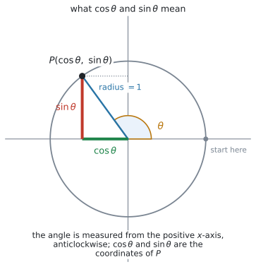
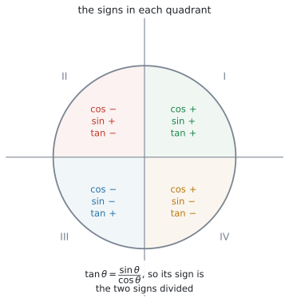
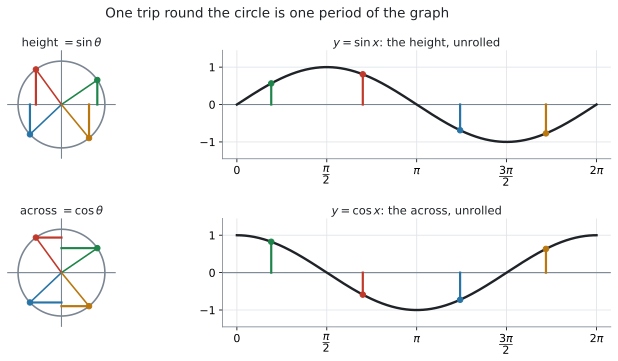
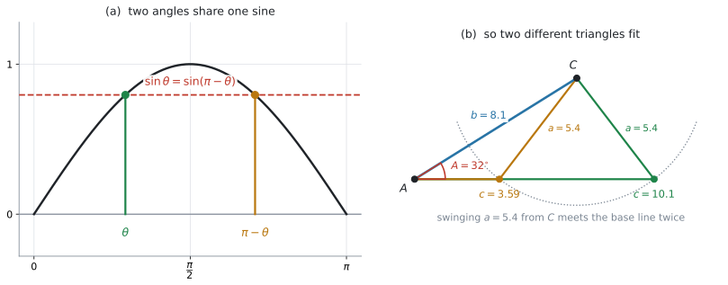

# AHL 3.8 — The unit circle and identities（単位円と三角比の恒等式） {#sec-ahl-3-8}

::: {.callout-note}
## What you should be able to do
- **unit circle**（単位円）の上の点の座標が $(\cos\theta,\ \sin\theta)$ であることを説明できる。
- $\theta$ がどの **quadrant**（象限）にあるかで、$\cos\theta$、$\sin\theta$、$\tan\theta$ の**符号**が決まることを使える。
- **Pythagorean identity** $\cos^{2}\theta + \sin^{2}\theta = 1$ で、片方から**もう片方を求められる**（符号は象限で決める）。
- $\tan\theta = \dfrac{\sin\theta}{\cos\theta}$ を使え、$\cos\theta = 0$ では定義されないと言える。
- $y = \sin x$ と $y = \cos x$ のグラフが、**単位円を $1$ 周することから出てくる**と説明できる。
- sine rule で角を求めるとき、**$2$ つの三角形があり得る**場合（**ambiguous case**）を扱える。
- **有限区間**の三角方程式を、**グラフの交点**で解き、その区間の解を**全部**出せる。
:::

::: {.callout-important}
## 公式集の AHL 3.8 の欄
**$2$ 行あります。** 見出しは `Identities` です。

$$
\cos^{2}\theta + \sin^{2}\theta = 1, \qquad \tan\theta = \frac{\sin\theta}{\cos\theta}
$$ {#eq-ahl38-both}

**この $2$ 行は配られるので、覚える必要はありません。** 身につけるのは、**どちらをいつ使うか**と、**符号をどう決めるか**のほうです。

いっぽう、**単位円による $\cos\theta$ と $\sin\theta$ の定義そのものは、公式集にありません。** これは「覚える式」ではなく、**図の読み方**です（[第1節](#idea)）。

sine rule は [SL 3.2](../../ai-sl/03-geometry-and-trigonometry/sl-3-2.qmd#sine-rule) と同じもので、公式集の **3.2** の欄に印刷されています。**ambiguous case のための追加の公式はありません**（[第8節](#ambiguous)）。
:::

## The idea

### 1. 単位円で $\cos\theta$ と $\sin\theta$ を定義します {#idea}

**unit circle**（単位円）は、**原点を中心とする半径 $1$ の円**です。

その円周上に点 $P$ を取り、**正の $x$ 軸から反時計回りに測った角**を $\theta$ とします。このとき

$$
P = (\cos\theta,\ \sin\theta)
$$ {#eq-ahl38-def}

と**決めます**。これが定義です。

{#fig-ahl38-circle width=62%}

@fig-ahl38-circle を見てください。**$\cos\theta$ は横の座標、$\sin\theta$ は縦の座標**です。それ以上の意味はありません。

**この定義の利点は、$\theta$ がどんな値でもよいことです。** $\theta$ が $\dfrac{\pi}{2}$ を超えても、負でも、$2\pi$ を超えても、点 $P$ は円周のどこかにあり、座標は決まります。

### 2. 直角三角形の定義と、つながっています {#right-triangle}

[SL 3.2](../../ai-sl/03-geometry-and-trigonometry/sl-3-2.qmd#sohcahtoa) では、**SOH-CAH-TOA** で三角比を決めました。

$$
\cos\theta = \frac{\text{adjacent}}{\text{hypotenuse}}, \qquad \sin\theta = \frac{\text{opposite}}{\text{hypotenuse}}
$$

**$\theta$ が第 $1$ 象限にあるとき**を考えます。$P$ から $x$ 軸に垂線を下ろすと、直角三角形ができます。**斜辺は半径なので $1$** です。この範囲では横も縦も正なので、adjacent と opposite の**長さ**が、そのまま座標の値になります。

$$
\cos\theta = \frac{\text{横}}{1} = \text{横}, \qquad \sin\theta = \frac{\text{縦}}{1} = \text{縦}
$$

となり、**SL の定義とぴったり一致します。** 単位円は、SL の定義を**置きかえるもの**ではありません。

**第 $1$ 象限の外では、この対応は使えません。** @fig-ahl38-circle の $\theta$ は第 $2$ 象限なので、垂線で作った三角形の底辺の**長さ**は $0.589$ ですが、$\cos\theta$ は $-0.589$ です。**長さは正、座標は符号つき**——ここが違います。

::: {.callout-tip}
## 単位円は、SL の定義を「広げた」ものです
SOH-CAH-TOA が使えるのは、**直角三角形の中にある角**、つまり $0 < \theta < \dfrac{\pi}{2}$ だけです。

$\theta = 2$ ラジアン（約 $115^{\circ}$）のような角には、そもそも直角三角形が作れません。**それでも単位円の上には点があり、座標があります。**

**$0 < \theta < \dfrac{\pi}{2}$ では両方の定義が同じ値を返し、それ以外の $\theta$ では単位円のほうだけが使えます。** だから、単位円のほうを定義に採用します。
:::

### 3. 象限で、符号が決まります {#quadrants}

座標なので、**どちらの向きかで符号が決まります。**

| $\theta$ の位置 | $\cos\theta$ | $\sin\theta$ | $\tan\theta$ |
|:--|:--|:--|:--|
| 第 $1$ 象限 $\left(0 < \theta < \dfrac{\pi}{2}\right)$ | $+$ | $+$ | $+$ |
| 第 $2$ 象限 $\left(\dfrac{\pi}{2} < \theta < \pi\right)$ | $-$ | $+$ | $-$ |
| 第 $3$ 象限 $\left(\pi < \theta < \dfrac{3\pi}{2}\right)$ | $-$ | $-$ | $+$ |
| 第 $4$ 象限 $\left(\dfrac{3\pi}{2} < \theta < 2\pi\right)$ | $+$ | $-$ | $-$ |

: 象限と符号 {#tbl-ahl38-signs}

{#fig-ahl38-quadrants width=62%}

@fig-ahl38-quadrants が、@tbl-ahl38-signs を絵にしたものです。

**$\tan\theta$ の欄は、覚えるものではありません。** $\tan\theta = \dfrac{\sin\theta}{\cos\theta}$ なので、**上の $2$ つの符号を割り算した結果**です（[第6節](#tan)）。

::: {.callout-warning}
## 電卓の $\arcsin$ や $\arccos$ は、$1$ つの角しか返しません
$\sin\theta = 0.5$ を満たす $\theta$ は、$0 \leq \theta \leq 2\pi$ の中に $\dfrac{\pi}{6}$ と $\dfrac{5\pi}{6}$ の $2$ つあります。

しかし電卓の $\arcsin(0.5)$ は $\dfrac{\pi}{6}$ しか返しません。**返ってくるのは決まった範囲の $1$ つだけ**だからです。

**残りの角は、単位円かグラフで自分で見つけます**（[第9節](#solve)、[Common errors](#common-errors) の $1$ つ目）。
:::

### 4. よく出る角の値 — 暗記は問われません {#exact}

**$\sin\dfrac{\pi}{3} = \dfrac{\sqrt{3}}{2}$ のような値を暗記する必要はありません。** 試験では電卓が使えます。

それでも下の表を載せるのは、**単位円のどこの座標なのかを見るため**です。

| 度 | ラジアン | $\cos\theta$ | $\sin\theta$ | $\tan\theta$ |
|:--|:--|:--|:--|:--|
| $0^{\circ}$ | $0$ | $1$ | $0$ | $0$ |
| $30^{\circ}$ | $\dfrac{\pi}{6}$ | $\dfrac{\sqrt{3}}{2} \approx 0.866$ | $\dfrac{1}{2}$ | $\dfrac{\sqrt{3}}{3} \approx 0.577$ |
| $45^{\circ}$ | $\dfrac{\pi}{4}$ | $\dfrac{\sqrt{2}}{2} \approx 0.707$ | $\dfrac{\sqrt{2}}{2} \approx 0.707$ | $1$ |
| $60^{\circ}$ | $\dfrac{\pi}{3}$ | $\dfrac{1}{2}$ | $\dfrac{\sqrt{3}}{2} \approx 0.866$ | $\sqrt{3} \approx 1.732$ |
| $90^{\circ}$ | $\dfrac{\pi}{2}$ | $0$ | $1$ | 定義されない |

: よく出る角（**暗記は不要です**） {#tbl-ahl38-exact}

**@tbl-ahl38-exact の上と下の行だけは、図から読めるようにしておくと役に立ちます。** $\theta = 0$ の点は $(1,\ 0)$、$\theta = \dfrac{\pi}{2}$ の点は $(0,\ 1)$ です。座標をそのまま読んだだけの値です。

$\theta = \dfrac{\pi}{2}$ で $\tan\theta$ が定義されないのは、$\cos\dfrac{\pi}{2} = 0$ で、分母が $0$ になるからです（[第6節](#tan)）。

### 5. $\cos^{2}\theta + \sin^{2}\theta = 1$ {#pythagoras}

公式集の $2$ 行（@eq-ahl38-both）の $1$ 行目です。

$$
\cos^{2}\theta + \sin^{2}\theta = 1
$$ {#eq-ahl38-pyth}

**意味は「$P$ が半径 $1$ の円の上にある」ということ、それだけです。** 円の方程式 $x^{2}+y^{2} = 1$ に、$x = \cos\theta$、$y = \sin\theta$ を入れただけです（[Why it works](#why-it-works)）。

::: {.callout-warning}
## $\cos^{2}\theta$ は $(\cos\theta)^{2}$ のことです
$\cos(\theta^{2})$ ではありません。**先に $\cos\theta$ を出して、それを $2$ 乗します。**

$\theta = 2$ なら $\cos 2 = -0.416147\ldots$ なので $\cos^{2}2 = 0.1732$ です。$\cos 4 = -0.6536$ とは別の数です。

電卓に打つときも、$(\cos(2))^{2}$ の順で入れてください。
:::

**使いどころは $1$ つです。片方が分かっていて、もう片方がほしいとき。**

$\cos\theta = 0.6$ なら

$$
\sin^{2}\theta = 1 - 0.6^{2} = 1 - 0.36 = 0.64 \ \Longrightarrow \ \sin\theta = \pm 0.8
$$

**$\pm$ が出ます。どちらかは、$\theta$ の象限が決めます**（@tbl-ahl38-signs、@exm-ahl38-identity）。象限が与えられていなければ、**両方が答え**です。

### 6. $\tan\theta = \dfrac{\sin\theta}{\cos\theta}$ {#tan}

@eq-ahl38-both の $2$ 行目です。

$$
\tan\theta = \frac{\sin\theta}{\cos\theta}
$$ {#eq-ahl38-tan}

これも SL 3.2 の $\tan\theta = \dfrac{\text{opposite}}{\text{adjacent}}$ と同じものです。単位円では縦が $\sin\theta$、横が $\cos\theta$ なので、その割り算になります。

**$\cos\theta = 0$ のところでは、$\tan\theta$ は定義されません。** 単位円で $\cos\theta = 0$ になるのは、$P$ が縦軸の上にあるとき、つまり

$$
\theta = \ldots,\ -\frac{\pi}{2}, \quad \frac{\pi}{2}, \quad \frac{3\pi}{2}, \ \ldots \qquad \left(\theta = \frac{\pi}{2} + n\pi, \ n \text{ は整数}\right)
$$

です。**$\dfrac{\pi}{2}$ から、両向きに $\pi$ おき**、と覚えておけば十分です。

### 7. 単位円から、$\sin x$ と $\cos x$ のグラフが出てきます {#graphs}

Guidance が「understand how the graphs of $f(x) = \sin x$ and $f(x) = \cos x$ can be constructed from the unit circle」と求めている内容です。

{#fig-ahl38-graphs width=100%}

@fig-ahl38-graphs の上の段が $\sin$、下の段が $\cos$ です。

- **$\sin x$ のグラフ** … 点 $P$ の**高さ**を、$x$ を横に取って並べたもの
- **$\cos x$ のグラフ** … 点 $P$ の**横の位置**を、同じように並べたもの

ここから、グラフの性質が全部読めます。

- **$1$ 周が $2\pi$** なので、**period（周期）は $2\pi$**（[AHL 3.7](ahl-3-7.qmd#full-turn)）
- 座標は $-1$ から $1$ までしか動かないので、**最大 $1$、最小 $-1$**
- $\sin$ は $x = 0$ から始まり、$\cos$ は $x = 0$ で $1$ から始まる（点 $(1,\ 0)$ が出発点だから。@exm-ahl38-graph）

::: {.callout-tip}
## sinusoidal model と、ここでつながります
[SL 2.5](../../ai-sl/02-functions/sl-2-5.qmd#sinusoidal) と [AHL 2.9a](../02-functions/ahl-2-9a.qmd#four-letters) の $a\sin(bx+c)+d$ は、**このグラフを縦横に伸ばして動かしたもの**です（[AHL 2.8](../02-functions/ahl-2-8.qmd#vstretch)）。

Guidance の `Link to: sinusoidal models (SL2.5 and AHL2.9)` は、この関係のことです。**amplitude が $a$、principal axis が $y = d$ になる理由は、もとの $\sin x$ が $-1$ と $1$ のあいだで振れているから**です。
:::

### 8. sine rule の ambiguous case {#ambiguous}

[SL 3.2](../../ai-sl/03-geometry-and-trigonometry/sl-3-2.qmd#ambiguous) には「ambiguous case は出ません」と書いてあります。**HL では出ます。** Content 欄の `Extension of the sine rule to the ambiguous case.` が、この節です。

**起きるのは $1$ つの場合だけです。** $2$ 辺と、**そのあいだにない角**（$a$、$b$、$A$）が与えられて、**角 $B$ を sine rule で求めるとき**です。

$$
\frac{\sin B}{b} = \frac{\sin A}{a} \ \Longrightarrow \ \sin B = \frac{b\sin A}{a}
$$

{#fig-ahl38-ambiguous width=100%}

@fig-ahl38-ambiguous の (a) が理由です。**$0$ と $\pi$ のあいだに、同じ $\sin$ の値を取る角が $2$ つあります**（値が $1$ より小さいとき。ちょうど $1$ なら $\dfrac{\pi}{2}$ の $1$ つだけです）。

$$
\sin\theta = \sin(\pi - \theta)
$$ {#eq-ahl38-supp}

三角形の角は $0$ と $\pi$ のあいだなので、**どちらも候補になります。** (b) は、その $2$ つが実際に別々の三角形になっている様子です。

**$4$ つの手順があります。**

1. sine rule で、$\sin B$ の**値** $k$ を出す
2. $k > 1$ なら、**三角形は存在しません**。そこで終わり
3. $B_1 = \arcsin k$ と $B_2 = 180^{\circ} - B_1$ の $2$ つを書く（$k = 1$ なら $B = 90^{\circ}$ の $1$ つだけ）
4. それぞれについて **$A + B < 180^{\circ}$** を確かめる。通ったものだけが三角形になる

::: {.callout-important}
## $2$ つ出るとはかぎりません
**$4$ 段目は、落とすためにあります。**

$A = 40^{\circ}$、$a = 9$、$b = 6$ なら $\sin B = \dfrac{6\sin 40^{\circ}}{9} = 0.4285$ で、$B_1 = 25.4^{\circ}$、$B_2 = 154.6^{\circ}$ です。しかし

$$
40^{\circ} + 154.6^{\circ} = 194.6^{\circ} > 180^{\circ}
$$

なので、$B_2$ は**三角形になりません。** 答えは $B = 25.4^{\circ}$ の $1$ つだけです。

**目安として、$a \geq b$ なら $B_2$ は必ず落ちます。** $2$ つの三角形が出るのは $a < b$ のときにかぎられます（そのときも、$4$ 段目の確認は必要です）。

問題文に `Find the two possible values` と書いてあれば $2$ つ、`Find the size of angle B` だけなら、**$4$ 段目で自分で決めます**（@exm-ahl38-ambiguous）。
:::

### 9. 有限区間の三角方程式は、グラフで解きます {#solve}

Content 欄の `Graphical methods of solving trigonometric equations in a finite interval.` です。

**三角関数はくり返すので、解があるときは無限にあります。** だから問題文は必ず、$0 \leq x \leq 2\pi$ のような**区間を指定します。**（$\sin x = 2$ のように、$1$ つも解がない式もあります。） その区間の中の解を、**全部**出すことが求められます。

やり方は $1$ つです（[GDC 第3節](#gdc-solve)）。

1. 左辺を $f_1$、右辺を $f_2$ としてグラフに入れる
2. **表示範囲を、指定された区間にそろえる**
3. 交点を**端から端まで**すべて拾う

$4\cos(2x) + 1 = 3$ を $0 \leq x \leq 2\pi$ で解くと、解は

$$
x = 0.524, \quad 2.62, \quad 3.67, \quad 5.76
$$

の $4$ つです。**$1$ つ見つけて終わりにしないでください**（@exm-ahl38-solve）。

::: {.callout-warning}
## 解の個数は、区間で変わります
同じ式でも、$0 \leq x \leq \pi$ なら解は $0.524$ と $2.62$ の $2$ つだけです。

**「いくつあるか」は、式と区間の両方で決まります。** 先に区間を見て、グラフをその範囲に合わせてください。

**端の値も忘れずに。** $0 \leq x \leq 2\pi$ と $0 < x < 2\pi$ では、端が解のときに答えが変わります。
:::

## Why it works

**$\cos^{2}\theta + \sin^{2}\theta = 1$ は、円の方程式そのものです。**

原点を中心とする半径 $1$ の円の上の点 $(x,\ y)$ は

$$
x^{2} + y^{2} = 1
$$

を満たします（[SL 3.1](../../ai-sl/03-geometry-and-trigonometry/sl-3-1.qmd) の距離の考え方です）。@eq-ahl38-def で $x = \cos\theta$、$y = \sin\theta$ と決めたので、そのまま代入すれば @eq-ahl38-pyth になります。

**第 $1$ 象限では、これは三平方の定理そのもの**です。横 $\cos\theta$、縦 $\sin\theta$、斜辺 $1$ の直角三角形ができるからです。

**それ以外の象限でも成り立ちます。** 座標が負になっても、$2$ 乗すれば正になるからです。$\theta = \pi$ なら $\cos\theta = -1$、$\sin\theta = 0$ で、$(-1)^{2} + 0^{2} = 1$ ✓

**次に、$\sin\theta = \sin(\pi - \theta)$ です。**

角 $\pi - \theta$ の点は、角 $\theta$ の点を **$y$ 軸について折り返した**位置にあります（[AHL 2.8](../02-functions/ahl-2-8.qmd#reflection) の $y$ 軸対称です）。折り返すと

- **高さは変わりません** → $\sin(\pi-\theta) = \sin\theta$
- **横は符号が反転します** → $\cos(\pi-\theta) = -\cos\theta$

**「高さが変わらない」——これが ambiguous case の正体**です。$\sin B$ の値だけからでは、$B$ が左右どちらの点なのかが決まりません。だから候補が $2$ つ出ます（[第8節](#ambiguous)）。

$\cos$ のほうは符号が変わるので、**cosine rule で角を求めるときは、こうなりません。** 角が $1$ つに決まります（[SL 3.2](../../ai-sl/03-geometry-and-trigonometry/sl-3-2.qmd#cosine-rule)）。

## Worked examples

::: {.callout-note appearance="simple"}
問題文は英語です。意味が理解できなかったら、問題文の下の「**日本語訳**」を開いてください。解説は日本語です。
:::

::: {#exm-ahl38-identity}
[Let $\cos\theta = 0.6$, where $\dfrac{3\pi}{2} < \theta < 2\pi$.]{.q-en}

**(a)** [Find the value of $\sin\theta$.]{.q-en}

**(b)** [Find the value of $\tan\theta$.]{.q-en}

**(c)** [Explain why $\sin\theta$ is negative for this value of $\theta$.]{.q-en}

<details class="jp-trans">
<summary>日本語訳</summary>

$\dfrac{3\pi}{2} < \theta < 2\pi$ で $\cos\theta = 0.6$ とします。

**(a)** $\sin\theta$ の値を求めなさい。

**(b)** $\tan\theta$ の値を求めなさい。

**(c)** この $\theta$ について $\sin\theta$ が負である理由を説明しなさい。

</details>

---

**(a)** @eq-ahl38-pyth に入れます。

$$
0.6^{2} + \sin^{2}\theta = 1 \ \Longrightarrow \ \sin^{2}\theta = 0.64 \ \Longrightarrow \ \sin\theta = \pm 0.8
$$

**ここで象限を見ます。** $\dfrac{3\pi}{2} < \theta < 2\pi$ は**第 $4$ 象限**なので、$\sin\theta$ は負です（@tbl-ahl38-signs）。

$$
\sin\theta = -0.8
$$

**(b)** @eq-ahl38-tan です。

$$
\tan\theta = \frac{-0.8}{0.6} = -\frac{4}{3} \approx -1.33
$$

**(c)** `Explain why` なので、**言葉で答えます。** 第 $4$ 象限の点は、$x$ 軸より**下**にあります。$\sin\theta$ はその点の**高さ**なので、負になります。

::: {.model-answer}
**試験ではこう書く**

*Since $\dfrac{3\pi}{2} < \theta < 2\pi$, the point on the unit circle lies in the fourth quadrant, below the $x$-axis. As $\sin\theta$ is the $y$-coordinate of that point, it must be negative. Hence $\sin\theta = -0.8$ and not $+0.8$.*
:::

（$\dfrac{3\pi}{2} < \theta < 2\pi$ なので、単位円上の点は第 $4$ 象限、つまり $x$ 軸より下にある。$\sin\theta$ はその点の $y$ 座標なので、負でなければならない。したがって $\sin\theta$ は $+0.8$ ではなく $-0.8$ である、という意味です。）

**検算。** 別の道で $\theta$ そのものを出します。$\arccos(0.6) = 0.9273$ で、第 $4$ 象限側は $\theta = 2\pi - 0.9273 = 5.356$ です。電卓で $\sin(5.356) = -0.800$ ✓ 符号まで合いました。

$\cos^{2}\theta+\sin^{2}\theta$ を足す検算は、ここでは**役に立ちません。** $+0.8$ でも $-0.8$ でも $1$ になり、**いちばん危ない符号を見逃す**からです（[GDC 第5節](#gdc-check)）。$\tan\theta$ の符号のほうは使えます。第 $4$ 象限では負のはずで、$-1.33 < 0$ ✓（@tbl-ahl38-signs）

::: {.callout-note}
## 解答例（答案用紙にはこう書く）
**(a)**
$$\sin^{2}\theta = 1 - 0.6^{2} = 0.64 \ \Rightarrow \ \sin\theta = \pm 0.8$$
$$\theta \text{ is in the fourth quadrant, so } \sin\theta = -0.8$$

**(b)**
$$\tan\theta = \frac{-0.8}{0.6} = -\frac{4}{3} \approx -1.33$$

**(c)**
*In the fourth quadrant the point on the unit circle is below the $x$-axis, and $\sin\theta$ is its $y$-coordinate, so $\sin\theta < 0$.*
:::
:::

::: {#exm-ahl38-graph}
[Consider the graph of $y = \cos x$ for $0 \leq x \leq 2\pi$.]{.q-en}

**(a)** [Write down the maximum value of $y$, and the value of $x$ at which it occurs.]{.q-en}

**(b)** [Explain, using the unit circle, why $y = 0$ when $x = \dfrac{\pi}{2}$ and when $x = \dfrac{3\pi}{2}$.]{.q-en}

**(c)** [Write down the period of the graph.]{.q-en}

<details class="jp-trans">
<summary>日本語訳</summary>

$0 \leq x \leq 2\pi$ における $y = \cos x$ のグラフを考えます。

**(a)** $y$ の最大値と、そのときの $x$ の値を書きなさい。

**(b)** $x = \dfrac{\pi}{2}$ と $x = \dfrac{3\pi}{2}$ で $y = 0$ になる理由を、単位円を使って説明しなさい。

**(c)** このグラフの周期を書きなさい。

</details>

---

**(a)** $\cos x$ は単位円上の点の**横の座標**でした（@eq-ahl38-def）。円の半径は $1$ なので、横に行けるのは $1$ までです。

$$
\text{maximum } y = 1 \quad \text{at } x = 0 \ \text{(and again at } x = 2\pi\text{)}
$$

@fig-ahl38-graphs の下の段で、両端が $1$ になっています。出発点 $(1,\ 0)$ に戻ってきたからです。

**(b)** `Explain, using the unit circle` と指定されているので、**円の話で答えます。**

$x = \dfrac{\pi}{2}$ の点は $(0,\ 1)$、$x = \dfrac{3\pi}{2}$ の点は $(0,\ -1)$ です。**どちらも縦軸の上にあり、横の座標が $0$** です。

::: {.model-answer}
**試験ではこう書く**

*At $x = \dfrac{\pi}{2}$ the point on the unit circle is $(0,\ 1)$, and at $x = \dfrac{3\pi}{2}$ it is $(0,\ -1)$. Both points lie on the $y$-axis, so their $x$-coordinate is $0$. Since $\cos x$ is defined as that $x$-coordinate, $\cos x = 0$ at both values.*
:::

（$x = \dfrac{\pi}{2}$ では単位円上の点は $(0,\ 1)$、$x = \dfrac{3\pi}{2}$ では $(0,\ -1)$ である。どちらの点も $y$ 軸の上にあるので、$x$ 座標は $0$ である。$\cos x$ はその $x$ 座標として定義されているので、どちらでも $\cos x = 0$ になる、という意味です。）

**(c)** 円を $1$ 周すると、点はもとの位置に戻ります。$1$ 周は $2\pi$ radians でした（[AHL 3.7](ahl-3-7.qmd#full-turn)）。

$$
\text{period} = 2\pi
$$

**検算。** 電卓で $\cos 0 = 1$、$\cos 2\pi = 1$ ✓ (a) と合います。$\cos\pi = -1$ が最小で、これは $0$ と $2\pi$ の**ちょうど中間**です ✓ (c) の周期 $2\pi$ とつじつまが合っています。

（(b) の $2$ つが、$\tan x$ の定義されない $x$ でもあることも確かめられます。ただしこれは (b) の答えを言いかえただけなので、検算にはなりません。[第6節](#tan)）

::: {.callout-note}
## 解答例（答案用紙にはこう書く）
**(a)**
$$\text{maximum } y = 1, \quad \text{at } x = 0 \text{ and } x = 2\pi$$

**(b)**
*The points on the unit circle are $(0,\ 1)$ and $(0,\ -1)$. Both have $x$-coordinate $0$, and $\cos x$ is that $x$-coordinate, so $\cos x = 0$.*

**(c)**
$$\text{period} = 2\pi$$
:::
:::

::: {#exm-ahl38-ambiguous}
[In triangle $ABC$, $A = 32^{\circ}$, $a = 5.4$ cm and $b = 8.1$ cm.]{.q-en}

**(a)** [Find the two possible values of angle $B$.]{.q-en}

**(b)** [Show that both values give a possible triangle.]{.q-en}

**(c)** [Find the length of $c$ in each case.]{.q-en}

<details class="jp-trans">
<summary>日本語訳</summary>

三角形 $ABC$ で、$A = 32^{\circ}$、$a = 5.4$ cm、$b = 8.1$ cm です。

**(a)** 角 $B$ としてあり得る $2$ つの値を求めなさい。

**(b)** どちらの値でも三角形が作れることを示しなさい。

**(c)** それぞれの場合について、$c$ の長さを求めなさい。

</details>

---

$2$ 辺と、そのあいだにない角が与えられています。**ambiguous case です**（[第8節](#ambiguous)）。度の記号が付いているので、電卓は Degree にするか、式の中に $^{\circ}$ を入れます（[GDC 第1節](#gdc-angle)）。

**(a)** sine rule を $\sin B$ について解きます。

$$
\sin B = \frac{b\sin A}{a} = \frac{8.1 \times \sin 32^{\circ}}{5.4} = 0.7949
$$

$\sin B < 1$ なので、候補が $2$ つあります（[第8節](#ambiguous)）。

$$
B_1 = \arcsin(0.7949) = 52.6^{\circ}, \qquad B_2 = 180^{\circ} - 52.6^{\circ} = 127.4^{\circ}
$$

**(b)** $4$ 段目の確認です。$A + B < 180^{\circ}$ かどうかを見ます。

$$
32^{\circ} + 52.6^{\circ} = 84.6^{\circ} < 180^{\circ} \ ✓
$$

$$
32^{\circ} + 127.4^{\circ} = 159.4^{\circ} < 180^{\circ} \ ✓
$$

**どちらも通るので、三角形は $2$ つあります。**

**(c)** それぞれ $C$ を出してから、sine rule で $c$ を求めます。

$B = 52.6^{\circ}$ のとき $C = 180^{\circ} - 32^{\circ} - 52.6^{\circ} = 95.4^{\circ}$ で

$$
c = \frac{a\sin C}{\sin A} = \frac{5.4 \times \sin 95.4^{\circ}}{\sin 32^{\circ}} = 10.1 \text{ cm}
$$

$B = 127.4^{\circ}$ のとき $C = 180^{\circ} - 32^{\circ} - 127.4^{\circ} = 20.6^{\circ}$ で

$$
c = \frac{5.4 \times \sin 20.6^{\circ}}{\sin 32^{\circ}} = 3.59 \text{ cm}
$$

**検算。** $a < b$ は、$2$ つ出るための**必要条件**にすぎません（$a \geq b$ なら $B_2$ は落ちます。[第8節](#ambiguous)）。**$2$ つあると言えるのは、(b) で $4$ 段目を両方が通ったから**です。

もう $1$ つ、それぞれの三角形が筋の通った形になっているかを見ます。$B = 127.4^{\circ}$ の三角形では、いちばん大きい角は $B$ なので、いちばん長い辺は $b = 8.1$ のはずです。$8.1 > 5.4 > 3.59$ ✓ もう $1$ つでは最大角が $C = 95.4^{\circ}$ なので最長は $c$、$10.1 > 8.1 > 5.4$ ✓

::: {.callout-note}
## 解答例（答案用紙にはこう書く）
**(a)**
$$\sin B = \frac{8.1\sin 32^{\circ}}{5.4} = 0.7949$$
$$B = 52.6^{\circ} \quad \text{or} \quad B = 180^{\circ} - 52.6^{\circ} = 127.4^{\circ}$$

**(b)**
$$32^{\circ} + 52.6^{\circ} = 84.6^{\circ} < 180^{\circ}; \qquad 32^{\circ} + 127.4^{\circ} = 159.4^{\circ} < 180^{\circ}$$
*Both are less than $180^{\circ}$, so both give a triangle.*

**(c)**
$$C = 95.4^{\circ}: \quad c = \frac{5.4\sin 95.4^{\circ}}{\sin 32^{\circ}} = 10.1 \text{ cm}$$
$$C = 20.6^{\circ}: \quad c = \frac{5.4\sin 20.6^{\circ}}{\sin 32^{\circ}} = 3.59 \text{ cm}$$
:::
:::

::: {#exm-ahl38-solve}
[The depth of water in a harbour, $h$ metres, is modelled by]{.q-en}

$$
h(t) = 6.4 + 2.5\sin(0.5t)
$$

[where $t$ is the time in hours after midnight, for $0 \leq t \leq 24$.]{.q-en}

**(a)** [Write down the maximum depth of the water.]{.q-en}

**(b)** [Find all the values of $t$ in this interval for which the depth is $8$ metres.]{.q-en}

**(c)** [A boat needs a depth of at least $8$ metres to enter the harbour. Interpret your answer to part (b) for the captain of the boat.]{.q-en}

<details class="jp-trans">
<summary>日本語訳</summary>

港の水深 $h$ メートルが、上の式でモデル化されます。$t$ は真夜中からの経過時間（時間）で、$0 \leq t \leq 24$ です。

**(a)** 水深の最大値を書きなさい。

**(b)** この区間で水深が $8$ メートルになる $t$ の値を、すべて求めなさい。

**(c)** ある船が港に入るには、水深が $8$ メートル以上必要です。(b) の答えを、その船の船長に向けて解釈しなさい。

</details>

---

**(a)** $\sin$ の最大値は $1$ でした（[第7節](#graphs)）。

$$
h_{\max} = 6.4 + 2.5 \times 1 = 8.9 \text{ m}
$$

$8.9 > 8$ なので、水深が $8$ m に届く時刻は**あります。**

**(b)** `all the values` なので、**区間の中の解を全部**出します（[第9節](#solve)）。

$$
f_1(x) = 6.4 + 2.5\sin(0.5x), \qquad f_2(x) = 8
$$

をグラフに入れ、$0 \leq x \leq 24$ に表示範囲を合わせて交点を拾います（[GDC 第3節](#gdc-solve)）。

$$
t = 1.39, \quad 4.89, \quad 14.0, \quad 17.5
$$

**$4$ つあります。** 周期は $\dfrac{2\pi}{0.5} = 12.6$ 時間なので、$24$ 時間のあいだに**山が $2$ 回**来ます。だから交点も $2$ 回ぶん、つまり $4$ つです。

**(c)** `Interpret` なので、**船長に伝わる言葉**で書きます。深さが $8$ m 以上なのは、交点と交点のあいだです。

$$
1.39 \leq t \leq 4.89 \qquad \text{と} \qquad 14.0 \leq t \leq 17.5
$$

::: {.model-answer}
**試験ではこう書く**

*The depth is $8$ m or more between $t = 1.39$ and $t = 4.89$, and again between $t = 14.0$ and $t = 17.5$. So the boat can enter the harbour during two windows: from about $01{:}23$ to about $04{:}54$, and from about $13{:}57$ to about $17{:}28$. Each window lasts about $3.5$ hours, and outside them the water is too shallow.*
:::

（水深が $8$ m 以上なのは $t = 1.39$ から $t = 4.89$ までと、$t = 14.0$ から $t = 17.5$ までである。したがって船が港に入れるのは $2$ つの時間帯、おおよそ $01{:}23$ から $04{:}54$ までと、$13{:}57$ から $17{:}28$ までである。どちらも約 $3.5$ 時間で、それ以外の時間は水深が足りない、という意味です。）

**検算。** $t = 3$（$1$ つ目の時間帯の中）を入れると $h = 6.4 + 2.5\sin 1.5 = 8.89$ で、$8$ より大きい ✓ $t = 8$（時間帯の外）なら $h = 6.4 + 2.5\sin 4 = 4.51$ で、$8$ より小さい ✓ 時間帯の取り方が合っています。

::: {.callout-note}
## 解答例（答案用紙にはこう書く）
**(a)**
$$h_{\max} = 6.4 + 2.5 = 8.9 \text{ m}$$

**(b)**
$$t = 1.39,\ 4.89,\ 14.0,\ 17.5$$

**(c)**
*The depth is at least $8$ m for $1.39 \leq t \leq 4.89$ and for $14.0 \leq t \leq 17.5$, so the boat can enter during those two windows, each lasting about $3.5$ hours.*
:::
:::

## Common errors

::: {.callout-warning}
## 区間の中の解を、$1$ つしか答えない
`Find all the values` と書いてあったり、区間 $0 \leq x \leq 2\pi$ が指定されているのに、電卓の $\arcsin$ が返した $1$ つだけで終わる誤りです。

$\sin x = 0.5$ を $0 \leq x \leq 2\pi$ で解くと、答えは $0.524$ と $2.62$ の $2$ つです。

**グラフを区間いっぱいに表示して、交点を端から端まで数えてください**（[第9節](#solve)）。
:::

::: {.callout-warning}
## $\pm$ の符号を、象限を見ずに決める
@eq-ahl38-pyth から $\sin\theta$ を出すと、必ず $\pm$ が出ます。

**正のほうを選ぶのが既定ではありません。** $\theta$ がどの象限かで決まります（@tbl-ahl38-signs）。

象限が指定されていなければ、**両方が答え**です。片方だけ書くと落とされます。
:::

::: {.callout-warning}
## ambiguous case で、$180^{\circ}$ の確認をしない
$B_2 = 180^{\circ} - B_1$ を出しただけで「答えは $2$ つ」としてしまう誤りです。

**$A + B_2 < 180^{\circ}$ を確かめてください**（[第8節](#ambiguous)）。通らなければ、その三角形は存在しません。

逆に、$B_2$ を出さずに $1$ つで終わるのも誤りです。**$2$ つ書いて、確認して落とす**——この順です。
:::

::: {.callout-warning}
## $\cos^{2}\theta$ を $\cos(\theta^{2})$ と読む
$\cos^{2}\theta$ は $(\cos\theta)^{2}$ です（[第5節](#pythagoras)）。

$\theta = 2$ なら $\cos^{2}2 = (-0.416147\ldots)^{2} = 0.1732$ ですが、$\cos(2^{2}) = \cos 4 = -0.6536$ です。**まったく別の数**になります。

電卓には $(\cos(2))^{2}$ の順で打ってください。
:::

::: {.callout-warning}
## 角の設定を確かめずに計算する
HL の試験では、断りがなければラジアンです（[AHL 3.7](ahl-3-7.qmd#which)）。しかし三角形の問題では $32^{\circ}$ のように度が使われます。

**設定が違っていても、もっともらしい数が返ってきます。** $\sin 32^{\circ} = 0.5299$ ですが、$\sin 32$（ラジアン）$= 0.5514$ です。似ているのに別の数です。

**式の中に $^{\circ}$ を入れる**のがいちばん安全です（[GDC 第1節](#gdc-angle)）。
:::

## Using your GDC (TI-Nspire CX II)

### 1. 角の設定と、$^{\circ}$ の入れ方 {#gdc-angle}

```
doc → Settings → Document Settings
```

`Angle` を **Radian** にしておきます。HL の既定はラジアンだからです。

度を使いたいところだけ、**式の中に度の記号を入れます。**

```
sin(32°)
```

度の記号は、キーボードのいちばん下、左端の **`π` のキー**を押すと開く**記号パレット**から選びます。**設定を切りかえるより安全です**（[AHL 3.7](ahl-3-7.qmd#gdc-degree) と同じやり方です）。

### 2. 単位円の点を出す {#gdc-point}

$\theta = 2$ の点の座標がほしければ、そのまま打ちます。

```
cos(2)
sin(2)
```

$-0.416147$ と $0.909297$ が返ります。**横が負、縦が正**なので、第 $2$ 象限です（@tbl-ahl38-signs）。$\dfrac{\pi}{2} = 1.5708 < 2 < 3.1416 = \pi$ なので、合っています。

@eq-ahl38-pyth の検算もできます。

$\cos(2)^{2} + \sin(2)^{2}$

$1$ が返れば正しく打てています。

### 3. 有限区間の方程式は、グラフの交点で解きます {#gdc-solve}

```
ctrl + doc → Add Graphs
f1(x)=6.4+2.5*sin(0.5*x)
f2(x)=8
```

**次が大事です。表示範囲を、問題の区間に合わせます。**

```
menu → Window/Zoom → Window Settings
XMin=0   XMax=24
```

$y$ は `Zoom - Fit` で合わせられます（現在の $x$ 範囲に合わせて $y$ を決めます）。

そのうえで

```
menu → Analyze Graph → Intersection
```

を使い、**交点を $1$ つずつ拾います。** 左端から右端まで、**全部**です。

::: {.callout-tip}
## 交点は「いくつあるはずか」を先に見積もってください
周期が分かれば、個数の見当が付きます。$f_1$ の周期は $\dfrac{2\pi}{0.5} = 12.6$ 時間なので、$0 \leq t \leq 24$ には山が $2$ 回来ます。

水平線が山を横切れば、**山 $1$ つにつき交点 $2$ つ**です。だから $4$ つのはずだ、と分かります。**区間の端で山が切れているときは、この数え方が使えません。** そのときはグラフを見て数えます。

**見積もりと拾った個数が合わなければ、拾い落としています。**
:::

### 4. ambiguous case の $2$ つの角 {#gdc-ambiguous}

電卓が返すのは $B_1$ だけです。

$\sin^{-1}(0.7949)$

Radian 設定のままなら、$0.9188$ **radians** が返ります。度の記号は**入力**にしか効かないので、**出力は自分で直します。**

$0.9188 \times \dfrac{180}{\pi}$

$52.6^{\circ}$ が出ます（[AHL 3.7](ahl-3-7.qmd#convert)）。三角形の問題を続けて解くなら、Document Settings を Degree にしてしまうほうが速いこともあります。

**$B_2$ は自分で引き算します。**

```
180-52.6
```

**電卓は「もう $1$ つある」とは教えてくれません**（[第3節](#quadrants)）。[第8節](#ambiguous)の手順を、自分で回してください。

### 5. 検算のしかた {#gdc-check}

- **出た値を、もとの式に戻す。** $h(1.39) = 8.00$ ✓ のように。これがいちばん強い検算です
- 符号は、**象限と合っているか**を見る（@tbl-ahl38-signs）
- ambiguous case は、**最大の角に最長の辺**が対応しているかを、与えられた辺と比べて見る
- 交点の個数は、**周期からの見積もり**と突き合わせる

## Exercises

::: {.callout-note appearance="simple"}
各問題に、折りたたみが3つ付いています。**日本語訳**、**解答例**（答案用紙に書くべきこと。英語です）、**解説**（なぜそうなるか。日本語です）。

まず自分で解いて、次に解答例と見くらべてください。**解説は、合わなかったときだけ開けば十分です。**
:::

::: {.exercise-block}

[1]{.ex-no} [Let $\sin\theta = 0.28$, where $\dfrac{\pi}{2} < \theta < \pi$. Find the value of $\cos\theta$ and the value of $\tan\theta$, each correct to $3$ significant figures.]{.q-en}

<details class="jp-trans">
<summary>日本語訳</summary>

$\dfrac{\pi}{2} < \theta < \pi$ で $\sin\theta = 0.28$ とします。$\cos\theta$ と $\tan\theta$ の値を、それぞれ有効数字 $3$ 桁で求めなさい。

</details>

::: {.callout-note collapse="true"}
## 解答例（答案用紙に書くこと）

$$\cos^{2}\theta = 1 - 0.28^{2} = 0.9216 \ \Rightarrow \ \cos\theta = \pm 0.960$$

$$\theta \text{ is in the second quadrant, so } \cos\theta = -0.960$$

$$\tan\theta = \frac{0.28}{-0.960} = -0.292$$
:::

::: {.callout-tip collapse="true"}
## 解説

@eq-ahl38-pyth を $\cos\theta$ について使います。$0.28^{2} = 0.0784$ なので $\cos^{2}\theta = 0.9216$ です。

**符号は象限で決めます。** $\dfrac{\pi}{2} < \theta < \pi$ は第 $2$ 象限なので、$\cos\theta$ は負です（@tbl-ahl38-signs）。

**検算。** 第 $2$ 象限では $\tan\theta$ が負のはずです。$-0.292 < 0$ ✓ **符号を取りちがえたら、ここで落ちます。**

$\cos^{2}\theta+\sin^{2}\theta$ を足す検算は、$+0.96$ でも $-0.96$ でも $1$ になるので、**符号の確認にはなりません**（[GDC 第5節](#gdc-check)）。
:::

::: {.ex-sep}
:::

[2]{.ex-no} [Let $\theta = 4$ radians. Write down the sign (positive or negative) of $\cos\theta$, of $\sin\theta$ and of $\tan\theta$, and state the quadrant in which $\theta$ lies.]{.q-en}

<details class="jp-trans">
<summary>日本語訳</summary>

$\theta = 4$ ラジアンとします。$\cos\theta$、$\sin\theta$、$\tan\theta$ の符号（正か負か）を書き、$\theta$ がどの象限にあるかを述べなさい。

</details>

::: {.callout-note collapse="true"}
## 解答例（答案用紙に書くこと）

$$\pi = 3.14 < 4 < 4.71 = \frac{3\pi}{2}$$

*so $\theta$ is in the third quadrant.*

$$\cos\theta < 0, \qquad \sin\theta < 0, \qquad \tan\theta > 0$$
:::

::: {.callout-tip collapse="true"}
## 解説

まず $4$ がどこにあるかを見ます。$\pi = 3.142$、$\dfrac{3\pi}{2} = 4.712$ なので、**そのあいだ、つまり第 $3$ 象限**です。

第 $3$ 象限の点は、横も縦も負です。$\tan\theta$ は割り算なので、負 $\div$ 負で**正**になります（@tbl-ahl38-signs）。

**検算。** 電卓で $\cos 4 = -0.654$、$\sin 4 = -0.757$、$\tan 4 = 1.16$ ✓ 符号が全部合っています（[GDC 第2節](#gdc-point)）。
:::

::: {.ex-sep}
:::

[3]{.ex-no} [Let $\cos\theta = -0.35$, where $\dfrac{\pi}{2} < \theta < \pi$. Find the value of $\sin\theta$ and the value of $\tan\theta$, each correct to $3$ significant figures.]{.q-en}

<details class="jp-trans">
<summary>日本語訳</summary>

$\dfrac{\pi}{2} < \theta < \pi$ で $\cos\theta = -0.35$ とします。$\sin\theta$ と $\tan\theta$ の値を、それぞれ有効数字 $3$ 桁で求めなさい。

</details>

::: {.callout-note collapse="true"}
## 解答例（答案用紙に書くこと）

$$\sin^{2}\theta = 1 - (-0.35)^{2} = 0.8775 \ \Rightarrow \ \sin\theta = \pm 0.937$$

$$\theta \text{ is in the second quadrant, so } \sin\theta = 0.937$$

$$\tan\theta = \frac{0.937}{-0.35} = -2.68$$
:::

::: {.callout-tip collapse="true"}
## 解説

$(-0.35)^{2} = 0.1225$ です。**負の数を $2$ 乗すると正**になるので、ここで符号は消えます。

第 $2$ 象限では $\sin\theta$ が正なので、$+$ を取ります。

$\tan\theta$ は、**丸めていない値**で割ってください。$\sqrt{0.8775} = 0.936750$ を使うと $-2.6764$、$3$ s.f. で $-2.68$ です。

**検算。** 第 $2$ 象限で $\tan\theta$ は負のはずです。$-2.68 < 0$ ✓

もう $1$ つ、別の道でも出しておきます。$\theta = \arccos(-0.35) = 1.928$ で、これは $\dfrac{\pi}{2} = 1.571$ と $\pi = 3.142$ のあいだ ✓ 電卓で $\sin(1.928) = 0.937$ ✓ 一致しました。
:::

::: {.ex-sep}
:::

[4]{.ex-no} [Using the unit circle, write down the value of $\sin\pi$ and the value of $\cos\pi$.]{.q-en}

<details class="jp-trans">
<summary>日本語訳</summary>

単位円を使って、$\sin\pi$ と $\cos\pi$ の値を書きなさい。

</details>

::: {.callout-note collapse="true"}
## 解答例（答案用紙に書くこと）

*The point at $\theta = \pi$ is $(-1,\ 0)$.*

$$\sin\pi = 0, \qquad \cos\pi = -1$$
:::

::: {.callout-tip collapse="true"}
## 解説

$\theta = \pi$ は**半周**です。出発点 $(1,\ 0)$ からちょうど反対側、つまり $(-1,\ 0)$ に来ます。

$\cos\pi$ はその**横の座標**で $-1$、$\sin\pi$ は**縦の座標**で $0$ です（@eq-ahl38-def）。**暗記ではなく、図を読むだけ**です（[第4節](#exact)）。

**検算。** $\cos^{2}\pi + \sin^{2}\pi = 1 + 0 = 1$ ✓ また $\tan\pi = \dfrac{0}{-1} = 0$ で、$\cos\pi \neq 0$ なので定義されます ✓
:::

::: {.ex-sep}
:::

[5]{.ex-no} [Given that $\cos\theta = 0.8$ and that no restriction is placed on $\theta$, find the possible values of $\sin\theta$.]{.q-en}

<details class="jp-trans">
<summary>日本語訳</summary>

$\cos\theta = 0.8$ とし、$\theta$ に制限はないものとします。$\sin\theta$ としてあり得る値を求めなさい。

</details>

::: {.callout-note collapse="true"}
## 解答例（答案用紙に書くこと）

$$\sin^{2}\theta = 1 - 0.8^{2} = 0.36$$

$$\sin\theta = 0.6 \quad \text{or} \quad \sin\theta = -0.6$$
:::

::: {.callout-tip collapse="true"}
## 解説

**象限が指定されていないので、$2$ つとも答えです**（[Common errors](#common-errors) の $2$ つ目）。片方だけでは足りません。

$\cos\theta = 0.8 > 0$ なので、$\theta$ は第 $1$ 象限か第 $4$ 象限です。第 $1$ なら $\sin\theta = 0.6$、第 $4$ なら $\sin\theta = -0.6$ になります（@tbl-ahl38-signs）。

**検算。** $\theta = \arccos(0.8) = 0.6435$ なら $\sin\theta = 0.6$、$\theta = 2\pi - 0.6435 = 5.640$ なら $\sin\theta = -0.6$ ✓ **どちらの $\theta$ も実在する**ので、$2$ つとも答えです。
:::

::: {.ex-sep}
:::

[6]{.ex-no} [In triangle $ABC$, $A = 28^{\circ}$, $a = 6.2$ cm and $b = 9.5$ cm. Find the two possible values of angle $B$, and the corresponding length of $c$ in each case.]{.q-en}

<details class="jp-trans">
<summary>日本語訳</summary>

三角形 $ABC$ で、$A = 28^{\circ}$、$a = 6.2$ cm、$b = 9.5$ cm です。角 $B$ としてあり得る $2$ つの値と、それぞれの場合の $c$ の長さを求めなさい。

</details>

::: {.callout-note collapse="true"}
## 解答例（答案用紙に書くこと）

$$\sin B = \frac{9.5\sin 28^{\circ}}{6.2} = 0.7194$$

$$B = 46.0^{\circ} \quad \text{or} \quad B = 180^{\circ} - 46.0^{\circ} = 134.0^{\circ}$$

$$B = 46.0^{\circ}: \quad C = 106.0^{\circ}, \quad c = \frac{6.2\sin 106.0^{\circ}}{\sin 28^{\circ}} = 12.7 \text{ cm}$$

$$B = 134.0^{\circ}: \quad C = 18.0^{\circ}, \quad c = \frac{6.2\sin 18.0^{\circ}}{\sin 28^{\circ}} = 4.08 \text{ cm}$$
:::

::: {.callout-tip collapse="true"}
## 解説

[第8節](#ambiguous)の手順どおりです。$\sin B = 0.7194 < 1$ なので、候補が $2$ つ出ます。

$4$ 段目の確認をします。$28^{\circ}+46.0^{\circ} = 74.0^{\circ}$、$28^{\circ}+134.0^{\circ} = 162.0^{\circ}$。**どちらも $180^{\circ}$ 未満**なので、三角形は $2$ つです。

**検算。** $a < b$ は $2$ つ出るための**必要条件**です（[第8節](#ambiguous)）。**$2$ つあると言えるのは、$4$ 段目を両方が通ったから**です。

それぞれの三角形で、最大角と最長辺が対応しているかを見ます。$B = 134.0^{\circ}$ の側は最大角が $B$ なので最長は $b = 9.5$、$9.5 > 6.2 > 4.08$ ✓ $B = 46.0^{\circ}$ の側は最大角が $C = 106.0^{\circ}$ なので最長は $c$、$12.7 > 9.5 > 6.2$ ✓
:::

::: {.ex-sep}
:::

[7]{.ex-no} [In triangle $ABC$, $A = 55^{\circ}$, $a = 12$ cm and $b = 9$ cm. Show that there is only one possible triangle, and find the length of $c$.]{.q-en}

<details class="jp-trans">
<summary>日本語訳</summary>

三角形 $ABC$ で、$A = 55^{\circ}$、$a = 12$ cm、$b = 9$ cm です。三角形は $1$ つしかないことを示し、$c$ の長さを求めなさい。

</details>

::: {.callout-note collapse="true"}
## 解答例（答案用紙に書くこと）

$$\sin B = \frac{9\sin 55^{\circ}}{12} = 0.6144$$

$$B = 37.9^{\circ} \quad \text{or} \quad B = 180^{\circ} - 37.9^{\circ} = 142.1^{\circ}$$

$$55^{\circ} + 142.1^{\circ} = 197.1^{\circ} > 180^{\circ}$$

*so the second value is impossible and only $B = 37.9^{\circ}$ gives a triangle.*

$$C = 180^{\circ} - 55^{\circ} - 37.9^{\circ} = 87.1^{\circ}, \quad c = \frac{12\sin 87.1^{\circ}}{\sin 55^{\circ}} = 14.6 \text{ cm}$$
:::

::: {.callout-tip collapse="true"}
## 解説

`Show that` なので、**$2$ つ目の候補を書いて、それが落ちるところまで**書いてください。「$1$ つです」とだけ書いても点になりません。

ここでは $a = 12 > 9 = b$ です。**$a \geq b$ なら $B_2$ は必ず落ちます**（[第8節](#ambiguous)）。計算する前から見当が付きます。

**検算。** 最大の角は $C = 87.1^{\circ}$ なので、最長の辺は $c$ のはずです。$14.6 > 12 > 9$ ✓ 対応しています。
:::

::: {.ex-sep}
:::

[8]{.ex-no} [Explain why the sine rule can give two possible values for an angle in a triangle, while the cosine rule cannot.]{.q-en}

<details class="jp-trans">
<summary>日本語訳</summary>

sine rule では三角形の角の値が $2$ 通り出ることがあるのに、cosine rule では出ない理由を説明しなさい。

</details>

::: {.callout-note collapse="true"}
## 解答例（答案用紙に書くこと）

*For $0 < \theta < 180^{\circ}$, $\sin\theta = \sin(180^{\circ}-\theta)$, so a value of $\sin B$ less than $1$ comes from two different angles, one acute and one obtuse. Both must be tested with $A + B < 180^{\circ}$. (If $\sin B = 1$ there is only the one angle $90^{\circ}$.)*

*For $\cos\theta$ the sign changes: $\cos(180^{\circ}-\theta) = -\cos\theta$. So one value of $\cos\theta$ comes from only one angle in that range, and the cosine rule gives a single answer.*
:::

::: {.callout-tip collapse="true"}
## 解説

`Explain why` なので、英語で理由を書きます。

言うべきことは、**「$\sin$ は折り返しても同じ値、$\cos$ は符号が変わる」**という $1$ 点です（[Why it works](#why-it-works)）。

**数で示すのも有効です。** $\sin 40^{\circ} = \sin 140^{\circ} = 0.643$ ですが、$\cos 40^{\circ} = 0.766$、$\cos 140^{\circ} = -0.766$ です。

::: {.model-answer}
**試験ではこう書く**

*On the unit circle the point for $180^{\circ}-\theta$ is the reflection in the $y$-axis of the point for $\theta$. Reflecting keeps the height but reverses the horizontal coordinate, so $\sin(180^{\circ}-\theta) = \sin\theta$ while $\cos(180^{\circ}-\theta) = -\cos\theta$. Therefore a value of $\sin B$ below $1$ corresponds to two angles between $0^{\circ}$ and $180^{\circ}$, and both must be checked against $A + B < 180^{\circ}$. A value of $\cos B$ corresponds to only one angle in that range, so the cosine rule gives a unique answer. For example $\sin 40^{\circ} = \sin 140^{\circ} = 0.643$, but $\cos 40^{\circ} = 0.766$ and $\cos 140^{\circ} = -0.766$.*
:::
:::

::: {.ex-sep}
:::

[9]{.ex-no} [The temperature in a greenhouse, $T\ ^{\circ}$C, is modelled by]{.q-en}

$$
T(t) = 18 + 7\sin\left(\frac{\pi t}{12}\right)
$$

[where $t$ is the time in hours after 6 am, for $0 \leq t \leq 24$.]{.q-en}

**(a)** [Find all the values of $t$ in this interval for which the temperature is $22\ ^{\circ}$C.]{.q-en}

**(b)** [Interpret your answer to part (a) in the context of the greenhouse.]{.q-en}

<details class="jp-trans">
<summary>日本語訳</summary>

温室の温度 $T\ ^{\circ}$C が、上の式でモデル化されます。$t$ は午前 $6$ 時からの経過時間（時間）で、$0 \leq t \leq 24$ です。

**(a)** この区間で温度が $22\ ^{\circ}$C になる $t$ の値を、すべて求めなさい。

**(b)** (a) の答えを、温室の文脈で解釈しなさい。

</details>

::: {.callout-note collapse="true"}
## 解答例（答案用紙に書くこと）

**(a)**
$$f_1(x) = 18+7\sin\left(\frac{\pi x}{12}\right), \qquad f_2(x) = 22$$

$$t = 2.32 \quad \text{and} \quad t = 9.68$$

**(b)**
*The temperature reaches $22\ ^{\circ}$C at about $8{:}19$ am and again at about $3{:}41$ pm, and it is above $22\ ^{\circ}$C between those two times, for about $7.4$ hours.*
:::

::: {.callout-tip collapse="true"}
## 解説

**(a)** 周期は $\dfrac{2\pi}{\pi/12} = 24$ 時間です。**$24$ 時間の区間に、山は $1$ 回**しか来ません。ですから交点は $2$ つのはずです（[GDC 第3節](#gdc-solve)）。拾えた個数と合っています。

**(b)** `Interpret` なので、**温室の言葉**で書きます。$t$ は午前 $6$ 時からなので、$t = 2.32$ は $8$ 時 $19$ 分、$t = 9.68$ は $15$ 時 $41$ 分です。

**$2$ つの時刻を答えるだけでは足りません。** そのあいだが $22\ ^{\circ}$C を超えている、というところまで書いてください。

**検算。** $t = 6$（$2$ つのあいだ）で $T = 18+7\sin\dfrac{\pi}{2} = 25$ で、$22$ より高い ✓ $t = 15$（外側）で $T = 18+7\sin\dfrac{15\pi}{12} = 13.0$ で、$22$ より低い ✓

::: {.model-answer}
**試験ではこう書く**

*The temperature passes through $22\ ^{\circ}$C twice: at $t = 2.32$ hours (about $8{:}19$ am) as it rises, and at $t = 9.68$ hours (about $3{:}41$ pm) as it falls. Between these times the greenhouse is warmer than $22\ ^{\circ}$C, for a period of about $7.4$ hours, and outside them it is cooler.*
:::
:::

::: {.ex-sep}
:::

[10]{.ex-no} [A student is asked to solve $\sin x = 0.5$ for $0 \leq x \leq 2\pi$, and writes]{.q-en}

$$
x = \arcsin(0.5) = 0.524
$$

[Identify the error and give the complete answer.]{.q-en}

<details class="jp-trans">
<summary>日本語訳</summary>

ある生徒が $0 \leq x \leq 2\pi$ で $\sin x = 0.5$ を解くように言われ、上のように書きました。誤りを指摘し、完全な答えを書きなさい。

</details>

::: {.callout-note collapse="true"}
## 解答例（答案用紙に書くこと）

*The calculator returns only one angle, but the interval $0 \leq x \leq 2\pi$ contains two solutions.*

$$x = 0.524 \quad \text{and} \quad x = \pi - 0.524 = 2.62$$
:::

::: {.callout-tip collapse="true"}
## 解説

`Identify the error` なので、**どこが違うかを言葉で書きます。**

$\arcsin$ が返すのは決まった範囲の $1$ つだけです（[第3節](#quadrants)）。$\sin x = 0.5$ を満たす角は、$0$ から $2\pi$ のあいだに $2$ つあります。

$2$ つ目は @eq-ahl38-supp から出ます。$\sin(\pi - x) = \sin x$ なので、$\pi - 0.524 = 2.62$ も解です。

**グラフで見れば一目です。** $y = \sin x$ と $y = 0.5$ を $0 \leq x \leq 2\pi$ で描くと、交点が $2$ つあります。

::: {.model-answer}
**試験ではこう書く**

*The error is that only the value returned by the calculator was given. The inverse sine returns just one angle, but on the interval $0 \leq x \leq 2\pi$ the equation $\sin x = 0.5$ has two solutions, because $\sin(\pi - x) = \sin x$. The second solution is $x = \pi - 0.524 = 2.62$, so the complete answer is $x = 0.524$ and $x = 2.62$. Drawing $y = \sin x$ and $y = 0.5$ on the interval shows two intersection points.*
:::
:::

:::

## 参考：シラバスの原文 {#syllabus}

:::: {.callout-note collapse="true" appearance="simple"}
## クリックすると開きます
Content 欄は $2$ つのかたまりに分かれています。$1$ つ目は $4$ 行です。

> The definitions of $\cos\theta$ and $\sin\theta$ in terms of the unit circle.

> The Pythagorean identity: $\cos^{2}\theta + \sin^{2}\theta = 1$

> Definition of $\tan\theta$ as $\dfrac{\sin\theta}{\cos\theta}$

> Extension of the sine rule to the ambiguous case.

$2$ つ目は $1$ 行です。

> Graphical methods of solving trigonometric equations in a finite interval.

Guidance 欄には $3$ つあります。

> Students should understand how the graphs of $f(x) = \sin x$ and $f(x) = \cos x$ can be constructed from the unit circle.

> Knowledge of exact values of $\cos\theta$, $\sin\theta$, and $\tan\theta$ will not be assessed on examinations, but may aid student understanding of trigonometric functions.

> **Link to:** sinusoidal models (SL2.5 and AHL2.9).

**$2$ つ目が、AI HL の生徒にとって大事です。** $\dfrac{\sqrt{3}}{2}$ のような**正確な値を暗記する必要はありません**（[第4節](#exact)）。

AHL の Topic 3 全体にかかる $1$ 行も、ここで効いてきます。

> On HL examination papers radian measure should be assumed unless otherwise indicated.

**このページでは、角はラジアンで書きます。** ただし三角形の問題は、度の記号 $^{\circ}$ を付けた形でよく出るので、[第8節](#ambiguous)では度を使います（[AHL 3.7](ahl-3-7.qmd#which)）。AHL Topic 3 全体の Recommended teaching hours は $28$ 時間です。

Connections 欄には $4$ つ挙がっています。

> **Other contexts:** Generation of sinusoidal voltage in electrical engineering.

> **International-mindedness:** The origin of the word "sine"; trigonometry was developed by successive civilizations and cultures; how is mathematical knowledge considered from a sociocultural perspective?

> **TOK:** To what extent is mathematical knowledge embedded in particular traditions or bound to particular cultures? How have key events in the history of mathematics shaped its current form and methods?

> **Use of technology:** Animation applets that show the development of a trigometric function graph from the unit circle.
::::
