# AHL 3.9 — Geometric transformations in two dimensions（行列による平面上の変換） {#sec-ahl-3-9}

::: {.callout-note}
## What you should be able to do
- 点を**列ベクトル**で書き、$2 \times 2$ の **transformation matrix**（変換行列）を左から掛けて **image**（像）を求められる。
- 公式集の $6$ つの transformation matrix（**reflection**（対称移動）、**horizontal / vertical stretch**（伸長）、**enlargement**（拡大）、**rotation**（回転）$2$ 種類）を、正しく選んで使える。
- **translation**（平行移動）だけは transformation matrix の外に足す、という形 $A\mathbf{x} + \mathbf{t}$ が書ける。
- 図形の頂点を**まとめて $1$ つの行列**にして、一度に変換できる。
- $2$ つの変換の **composition**（合成）を求められる。**順番で答えが変わる**と分かる。
- transformation matrix の **determinant** が「面積が何倍になるか」だと分かり、像の面積を求められる。
- **inverse matrix** を使って、像からもとの点にもどせる。
- 同じ変換をくり返して **fractal**（フラクタル）を作る仕組みを説明できる。
:::

::: {.callout-note}
## AHL 1.14 の続きです
この項目で使う道具は、[AHL 1.14](../01-number-and-algebra/ahl-1-14.qmd) で出そろっています。

- 行列と縦ベクトルの**かけ算**（[AHL 1.14 第3節](../01-number-and-algebra/ahl-1-14.qmd#multiply)）
- **determinant**（[AHL 1.14 第6節](../01-number-and-algebra/ahl-1-14.qmd#inverse)）
- **inverse matrix**（同じ節）

新しいのは、**その計算が図の上で何をしているのか**という見方だけです。
:::

::: {.callout-tip}
## 電卓は Degree にしてください
この項目の rotation と reflection は、**角を度で書きます。** 試験開始直後の設定は、この項目では **Degree** のままにしておいてください。

```
ctrl + menu → Settings → Document Settings → Angle: Degree
```

Radian のままだと、$\cos 90^\circ$ が $-0.448\ldots$ のような値になり、行列そのものが変わってしまいます。
:::

## The idea

この項目は、**点を動かす仕組みを行列で書く**項目です。

**transformation matrix**（変換行列）を、**平面上の点を別の位置へ動かすルール**として使います。そして、図形のすべての点に**同じ transformation matrix** を使えば、$1$ つの行列で図形全体の変換を表せます。

もとの図形を **object**（もとの図形）、動かしたあとを **image**（像）と呼びます。

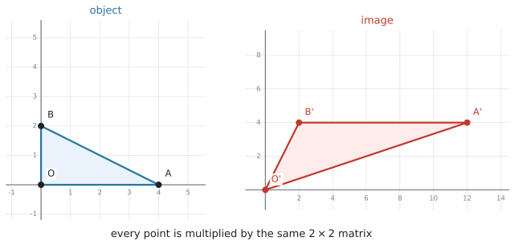{#fig-ahl39-idea width=94%}

@fig-ahl39-idea では、三角形の $3$ つの頂点を**それぞれ縦に並べた形**で書き、そのどれにも**同じ transformation matrix を左から掛けて**います。各頂点に同じ変換を行うことで、その結果として**図形全体が変換される**——これがこの項目の中身です。

### 1. 点は列ベクトルで表し、transformation matrix を左から掛けます {#points}

いつもは点を $(3,\ 1)$ と横に書きますが、この項目では**縦**に書きます。

$$
(x,\ y) \quad \longrightarrow \quad \begin{pmatrix} x \\ y \end{pmatrix}
$$

この、数を縦に並べた形を **column vector**（列ベクトル）といいます。[AHL 1.14](../01-number-and-algebra/ahl-1-14.qmd#order) で **column matrix** と呼んだものと同じで、列が $1$ つだけの行列です。点 $(3,\ 1)$ なら、次のようになります。

$$
\begin{pmatrix} 3 \\ 1 \end{pmatrix}
$$

縦に書くのは、**$2 \times 2$ の transformation matrix を左から掛けるため**です。[AHL 1.14](../01-number-and-algebra/ahl-1-14.qmd#dimension) で見たとおり、行列の積があるのは**内側の数がそろっているとき**だけでした。

$$
(2 \times \underline{2})(\underline{2} \times 1) \ \Rightarrow \ 2 \times 1
$$

$2 \times 2$ と $2 \times 1$ なら内側がそろうので計算でき、答えはまた $2 \times 1$、つまり**点を表す列ベクトル**になります。

そこで、このページでずっと使う形は次のとおりです。

$$
M \begin{pmatrix} x \\ y \end{pmatrix}
$$

- $M$ … **transformation matrix**（変換行列）。$2 \times 2$ です
- $\begin{pmatrix} x \\ y \end{pmatrix}$ … object 側の点
- 計算した結果 … その点の image の座標

では、実際に $1$ つの点を変換してみます。

たとえば $90^\circ$ の anticlockwise rotation（反時計回りの回転）なら、公式集にある

$$
\begin{pmatrix} \cos\theta & -\sin\theta \\ \sin\theta & \cos\theta \end{pmatrix}
$$

に $\theta = 90^\circ$ を入れて

$$
\begin{pmatrix} \cos 90^\circ & -\sin 90^\circ \\ \sin 90^\circ & \cos 90^\circ \end{pmatrix}
= \begin{pmatrix} 0 & -1 \\ 1 & 0 \end{pmatrix}
$$

となり、点 $(3,\ 1)$ の image は

$$
\begin{pmatrix} 0 & -1 \\ 1 & 0 \end{pmatrix}\begin{pmatrix} 3 \\ 1 \end{pmatrix}
= \begin{pmatrix} 0(3) + (-1)(1) \\ 1(3) + 0(1) \end{pmatrix}
= \begin{pmatrix} -1 \\ 3 \end{pmatrix}
$$

です。**答えを書くときは $(-1,\ 3)$ と横にもどして構いません。** 計算のあいだだけ縦にする、と思ってください。

::: {.callout-warning}
## transformation matrix は、いつも**左**に置きます
正しいのは、transformation matrix が左、列ベクトルが右のこの形です。

$$
M \begin{pmatrix} x \\ y \end{pmatrix}
$$

逆にした $\begin{pmatrix} x \\ y \end{pmatrix} M$ とは書けません。$(2 \times 1)(2 \times 2)$ では、**内側の数**（$1$ と $2$）がそろわないので、行列の積そのものが存在しないからです（[AHL 1.14](../01-number-and-algebra/ahl-1-14.qmd#dimension)）。
:::

### 2. 図形は、頂点を並べて一度に動かします {#shapes}

三角形の $3$ 頂点を $1$ つずつ計算してもよいのですが、**$1$ 点を $1$ 列として、横に並べて $1$ つの行列にする**と、transformation matrix を掛けるのが $1$ 回で終わります。

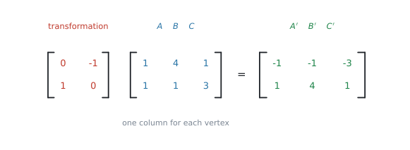{#fig-ahl39-shape width=90%}

@fig-ahl39-shape では、$A(1,1)$、$B(4,1)$、$C(1,3)$ をそれぞれ $1$ 列にして、$3$ 列ぶん横に並べ、$2 \times 3$ の行列にしています。$2 \times 2$ に $2 \times 3$ を掛けるので、内側の $2$ がそろっていて計算できます。答えも $2 \times 3$ で、**列がそのまま $A'$、$B'$、$C'$** になります。

::: {.callout-warning}
## translation があるときは、この形では足せません
$\begin{pmatrix} e \\ f \end{pmatrix}$ は $2 \times 1$ なので、$2 \times 3$ の答えにそのままは足せません。

頂点が $3$ つあるなら、**$\begin{pmatrix} e \\ f \end{pmatrix}$ を $3$ 列ぶん並べたもの**を足すか、$1$ 点ずつ計算してください。試験では、点の数が少ないので $1$ 点ずつのほうが安全です。translation については[第4節](#translation)で扱います。
:::

#### はじめに見た @fig-ahl39-idea も、この形です {#idea-worked}

ページの最初の @fig-ahl39-idea が、**どの点をどこへ動かしていたのか**を、いま並べて書けます。使っている transformation matrix は、次のものです。

$$
M = \begin{pmatrix} 3 & 1 \\ 1 & 2 \end{pmatrix}
$$

object の $3$ 頂点は $O(0,\ 0)$、$A(4,\ 0)$、$B(0,\ 2)$ です。$1$ 点を $1$ 列にして、$3$ 列ぶん横に並べます。

$$
\begin{pmatrix} 3 & 1 \\ 1 & 2 \end{pmatrix}
\begin{pmatrix} 0 & 4 & 0 \\ 0 & 0 & 2 \end{pmatrix}
= \begin{pmatrix} 0 & 12 & 2 \\ 0 & 4 & 4 \end{pmatrix}
$$

答えの列を、左から順に読みます。

| object の点 | 計算 | image の点 |
|---|---|---|
| $O(0,\ 0)$ | $\begin{pmatrix} 3(0) + 1(0) \\ 1(0) + 2(0) \end{pmatrix} = \begin{pmatrix} 0 \\ 0 \end{pmatrix}$ | $O'(0,\ 0)$ |
| $A(4,\ 0)$ | $\begin{pmatrix} 3(4) + 1(0) \\ 1(4) + 2(0) \end{pmatrix} = \begin{pmatrix} 12 \\ 4 \end{pmatrix}$ | $A'(12,\ 4)$ |
| $B(0,\ 2)$ | $\begin{pmatrix} 3(0) + 1(2) \\ 1(0) + 2(2) \end{pmatrix} = \begin{pmatrix} 2 \\ 4 \end{pmatrix}$ | $B'(2,\ 4)$ |

: @fig-ahl39-idea の $3$ 頂点 {#tbl-ahl39-idea}

@fig-ahl39-idea の右の図と見くらべてください。$O'$、$A'$、$B'$ の位置が、この表の右の列と合っています。

::: {.callout-tip}
## 原点だけは、動きません
$O(0,\ 0)$ の image が $O(0,\ 0)$ のままなのは、**どんな transformation matrix を掛けても、$0$ ばかりの列は $0$ のまま**だからです。

だから、transformation matrix だけで表せる変換は、**必ず原点を動かさない**ものになります。次の節で見る公式集の $6$ つが、どれも「原点を中心に」「原点を通る直線で」と書かれているのは、このためです。原点が動く変換を書きたいときは、[第4節](#translation)の translation が要ります。
:::

### 3. 公式集の $6$ つを、図で見分けます {#booklet-six}

公式集の **AHL 3.9** の欄は、`Transformation matrices` という見出しで、$6$ つの transformation matrix が印刷されています。**どれも覚える必要はありません。覚えるのは、どの場面でどれを選ぶかです。**

まず、$6$ つが実際にどう動かすのかを並べて見ます。

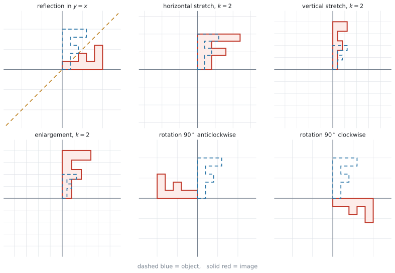{#fig-ahl39-six width=100%}

青い点線が object、赤い実線が image です。以下、$1$ つずつ「**どう動くのか**」と「**公式集ではどう書かれているか**」を並べます。

#### reflection（対称移動） {#reflection}

$1$ 本の直線を鏡にして、その反対側にうつします。@fig-ahl39-six の左上です。鏡の**直線の上にある点は動きません。**

$$
\begin{pmatrix} \cos 2\theta & \sin 2\theta \\ \sin 2\theta & -\cos 2\theta \end{pmatrix}
$$ {#eq-ahl39-reflection}

公式集の説明は `reflection in the line` $y = (\tan\theta)\,x$ です。$\theta$ は、**鏡になる直線が $x$ 軸となす角**を表します。$y = (\tan\theta)x$ という形なので、**鏡になる直線は必ず原点を通ります。**

::: {.callout-important}
## 入るのは $\theta$ ではなく $2\theta$ です
@eq-ahl39-reflection でいちばん引っかかるのはここです。**$\theta$ は「鏡になる直線が $x$ 軸となす角」**で、行列の中に入るのは、その $2$ 倍です。

直線 $y = x$ なら、傾きが $1$ なので $\tan\theta = 1$、つまり $\theta = 45^\circ$ です。入れるのは $2\theta = 90^\circ$ のほうです。

$$
\begin{pmatrix} \cos 90^\circ & \sin 90^\circ \\ \sin 90^\circ & -\cos 90^\circ \end{pmatrix}
= \begin{pmatrix} 0 & 1 \\ 1 & 0 \end{pmatrix}
$$

**検算。** この transformation matrix は $(3,\ 1)$ を $(1,\ 3)$ にうつします。$y = x$ に関する対称移動は $x$ と $y$ を入れかえるので、合っています ✓
:::

よく出る $4$ 本は、次のようになります。

| 鏡になる直線 | $\theta$ | transformation matrix |
|---|---|---|
| $x$ 軸（$y = 0$） | $0^\circ$ | $\begin{pmatrix} 1 & 0 \\ 0 & -1 \end{pmatrix}$ |
| $y = x$ | $45^\circ$ | $\begin{pmatrix} 0 & 1 \\ 1 & 0 \end{pmatrix}$ |
| $y$ 軸 | $90^\circ$ | $\begin{pmatrix} -1 & 0 \\ 0 & 1 \end{pmatrix}$ |
| $y = -x$ | $135^\circ$ | $\begin{pmatrix} 0 & -1 \\ -1 & 0 \end{pmatrix}$ |

: よく出る reflection {#tbl-ahl39-reflections}

::: {.callout-tip}
## 傾きから $\theta$ を出すときは $\tan^{-1}$ です
`reflection in the line y = 2x` のように傾きが $2$ なら、$\tan\theta = 2$ から

$$
\theta = \tan^{-1} 2 = 63.43\ldots^\circ
$$

として、$2\theta = 126.86\ldots^\circ$ を @eq-ahl39-reflection に入れます。**丸めずに、電卓の中の値のまま**進めてください。
:::

#### horizontal stretch（$x$ 軸方向の伸長） {#stretch}

**$x$ 座標だけ**を $k$ 倍にします。@fig-ahl39-six の上の真ん中で、横だけに伸びています。$y$ 軸の上の点は動きません。

$$
\begin{pmatrix} k & 0 \\ 0 & 1 \end{pmatrix}
$$ {#eq-ahl39-hstretch}

公式集の説明は `horizontal stretch / stretch parallel to x-axis with a scale factor of k` です。**scale factor**（拡大率）は「何倍にするか」の意味で、$1$ より小さければ縮みます。

#### vertical stretch（$y$ 軸方向の伸長） {#vstretch}

こんどは **$y$ 座標だけ**を $k$ 倍にします。@fig-ahl39-six の右上で、縦だけに伸びています。$x$ 軸の上の点は動きません。

$$
\begin{pmatrix} 1 & 0 \\ 0 & k \end{pmatrix}
$$ {#eq-ahl39-vstretch}

公式集の説明は `vertical stretch / stretch parallel to y-axis with a scale factor of k` です。

#### enlargement（拡大） {#enlargement}

$x$ と $y$ を**両方とも** $k$ 倍にします。@fig-ahl39-six の左下で、**形を変えずに**大きくなっています。

$$
\begin{pmatrix} k & 0 \\ 0 & k \end{pmatrix}
$$ {#eq-ahl39-enlargement}

公式集の説明は `enlargement, with a scale factor of k, centre (0,0)` です。中心は原点です。

::: {.callout-tip}
## $3$ つは、対角線の数を見れば見分けられます
stretch $2$ つと enlargement は、どれも対角線に数が並んだ形で、見た目が似ています。ちがいは**どこが $k$ になっているか**だけです。

- $\begin{pmatrix} \mathbf{k} & 0 \\ 0 & 1 \end{pmatrix}$ … 左上だけ $k$。**横に伸びます**
- $\begin{pmatrix} 1 & 0 \\ 0 & \mathbf{k} \end{pmatrix}$ … 右下だけ $k$。**縦に伸びます**
- $\begin{pmatrix} \mathbf{k} & 0 \\ 0 & \mathbf{k} \end{pmatrix}$ … 両方 $k$。**形を変えずに大きくします**

enlargement だけが「形が変わらない」変換です。stretch のほうは、正方形が長方形になります。
:::

#### rotation（回転）は、向きで $2$ 種類あります {#rotation}

原点を中心に、図形を回します。@fig-ahl39-six の下の真ん中が **anticlockwise**（反時計回り）、右下が **clockwise**（時計回り）です。原点だけが動きません。

$$
\begin{pmatrix} \cos\theta & -\sin\theta \\ \sin\theta & \cos\theta \end{pmatrix}
\qquad
\begin{pmatrix} \cos\theta & \sin\theta \\ -\sin\theta & \cos\theta \end{pmatrix}
$$ {#eq-ahl39-rotation}

左が anticlockwise、右が clockwise です。公式集の説明は、それぞれ `anticlockwise/counter-clockwise rotation of angle θ about the origin (θ>0)`、`clockwise rotation of angle θ about the origin (θ>0)` です。

@eq-ahl39-rotation の $2$ つは、**マイナスが左下にあるか、右上にあるか**だけが違います。

- マイナスが**右上** … **anticlockwise**（反時計回り）
- マイナスが**左下** … **clockwise**（時計回り）

どちらも $\theta > 0$ で使います。**「時計回りだから $\theta$ を負にする」という操作は要りません。** 公式集に $2$ つ並んでいるのは、そのためです。

::: {.callout-note}
## 負の角で書いても同じ結果になります
anticlockwise の行列に $\theta = -90^\circ$ を入れると、clockwise の行列に $\theta = 90^\circ$ を入れたものと同じになります。

どちらでも正解ですが、**公式集にあるほうを選んだほうが、符号を間違えにくい**です。
:::

#### 問題文から、$6$ つを選びます {#choose}

問題文の言い方と、選ぶ transformation matrix の対応です。

| 問題文の言い方 | 使う transformation matrix |
|---|---|
| `reflection in the line ...` | $\begin{pmatrix} \cos 2\theta & \sin 2\theta \\ \sin 2\theta & -\cos 2\theta \end{pmatrix}$ |
| `stretch parallel to the x-axis` | $\begin{pmatrix} k & 0 \\ 0 & 1 \end{pmatrix}$ |
| `stretch parallel to the y-axis` | $\begin{pmatrix} 1 & 0 \\ 0 & k \end{pmatrix}$ |
| `enlargement, centre (0, 0)` | $\begin{pmatrix} k & 0 \\ 0 & k \end{pmatrix}$ |
| `rotation ... anticlockwise about the origin` | $\begin{pmatrix} \cos\theta & -\sin\theta \\ \sin\theta & \cos\theta \end{pmatrix}$ |
| `rotation ... clockwise about the origin` | $\begin{pmatrix} \cos\theta & \sin\theta \\ -\sin\theta & \cos\theta \end{pmatrix}$ |

: 問題文と transformation matrix の対応 {#tbl-ahl39-choose}

::: {.callout-important}
## 公式集に**ない**ものが $3$ つあります
この $6$ つ以外は、AHL 3.9 の欄に印刷されていません。

| 載っていないもの | どうするか |
|---|---|
| translation を含む形 $A\mathbf{x} + \mathbf{t}$ | シラバスに書かれている形です。**覚えます**（[第4節](#translation)） |
| $\text{area of image} = \lvert \det A \rvert \times \text{area of object}$ | シラバスの Guidance 欄にあります。**覚えます**（[第6節](#determinant)） |
| 合成は「あとにやるほうを**左**に書く」 | **覚えます**（[第5節](#composition)） |

: 公式集にないもの {#tbl-ahl39-notinbooklet}

なお $\det A = ad - bc$ と inverse matrix の式は、公式集の **AHL 1.14** の欄にあります。この項目でもそのまま使えます。
:::

### 4. translation だけは、transformation matrix の外に足します {#translation}

平行移動は、**transformation matrix だけでは書けません。**

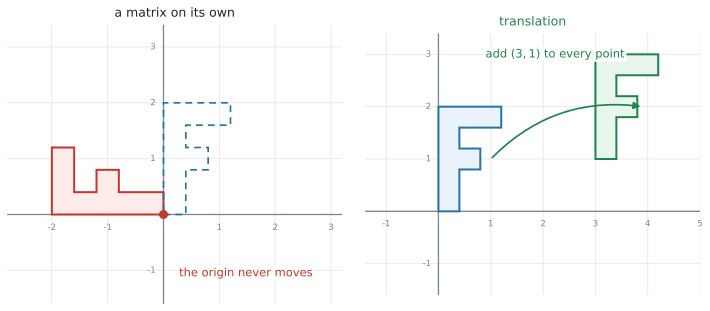{#fig-ahl39-translation width=96%}

理由は @fig-ahl39-translation の左を見ると分かります。$A\begin{pmatrix} 0 \\ 0 \end{pmatrix}$ は、$A$ が何であっても $\begin{pmatrix} 0 \\ 0 \end{pmatrix}$ です。**原点は動きません。** 平行移動は原点も動かすので、transformation matrix では表せないのです。

そこで、シラバスは次の形を使います。

$$
\begin{pmatrix} x' \\ y' \end{pmatrix}
= \begin{pmatrix} a & b \\ c & d \end{pmatrix}\begin{pmatrix} x \\ y \end{pmatrix}
+ \begin{pmatrix} e \\ f \end{pmatrix}
$$ {#eq-ahl39-affine}

$\begin{pmatrix} e \\ f \end{pmatrix}$ が translation の分です。**先に transformation matrix を掛けて、あとから足します。**

::: {.callout-note}
## transformation matrix と matrix transformation
似た言い方が $2$ つ出てきます。

- **transformation matrix**（変換行列）… @eq-ahl39-affine の $\begin{pmatrix} a & b \\ c & d \end{pmatrix}$ の部分。$2 \times 2$ の行列そのものです。
- **matrix transformation**（行列による変換）… @eq-ahl39-affine 全体、つまり translation まで含めた**変換のしかた**のこと。

$\begin{pmatrix} e \\ f \end{pmatrix}$ は transformation matrix の**中には入りません**。シラバスが `Matrix transformations of the form` と書いて、この形を丸ごと示しているのは、そのためです。
:::

たとえば「$2$ 倍に拡大してから、$x$ 方向に $1$、$y$ 方向に $-3$ 動かす」なら

$$
\begin{pmatrix} 2 & 0 \\ 0 & 2 \end{pmatrix}\begin{pmatrix} 3 \\ 1 \end{pmatrix} + \begin{pmatrix} 1 \\ -3 \end{pmatrix}
= \begin{pmatrix} 6 \\ 2 \end{pmatrix} + \begin{pmatrix} 1 \\ -3 \end{pmatrix}
= \begin{pmatrix} 7 \\ -1 \end{pmatrix}
$$

です。

### 5. 合成は、あとにやるほうを左に書きます {#composition}

$2$ つの変換を続けて行うことを **composition**（合成）といいます。

変換 $P$ をしてから変換 $Q$ をするなら、点 $\mathbf{x}$ の行き先は

$$
Q\bigl(P\mathbf{x}\bigr) = (QP)\,\mathbf{x}
$$ {#eq-ahl39-composition}

です。**$1$ つの行列 $QP$ にまとめられます。**

ここで大事なのは順番です。**先にやる $P$ が右、あとにやる $Q$ が左**です。日本語の語順とは逆になります。

そして [AHL 1.14](../01-number-and-algebra/ahl-1-14.qmd#noncommutative) で見たとおり、$QP$ と $PQ$ は**ふつう違う行列**です。つまり、**順番を変えると結果も変わります。**

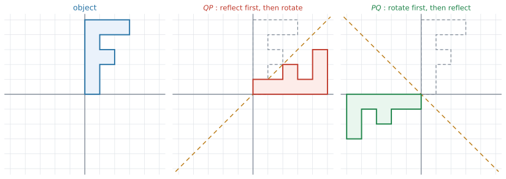{#fig-ahl39-compose width=100%}

@fig-ahl39-compose は、$P$ を「$x$ 軸に関する reflection」、$Q$ を「$90^\circ$ anticlockwise rotation」としたものです。$QP$ は $y = x$ に関する reflection、$PQ$ は $y = -x$ に関する reflection になり、**別の変換**です。

::: {.callout-tip}
## 迷ったら、$1$ 点で確かめてください
$QP$ と $PQ$ のどちらだったか自信がないときは、**わかりやすい点を $1$ つ選んで**、順番どおりに $2$ 回変換してみてください。

$(1,\ 0)$ のような点なら計算が軽く、まとめた行列の $1$ 列目と見くらべるだけで確かめられます。
:::

### 6. determinant は「面積が何倍になるか」です {#determinant}

transformation matrix $A$ で変換すると、図形の面積は $\lvert \det A \rvert$ 倍になります。シラバスも `Geometric interpretation of the determinant of a transformation matrix` と書いています。

$$
\text{area of image} = \lvert \det A \rvert \times \text{area of object}
$$ {#eq-ahl39-area}

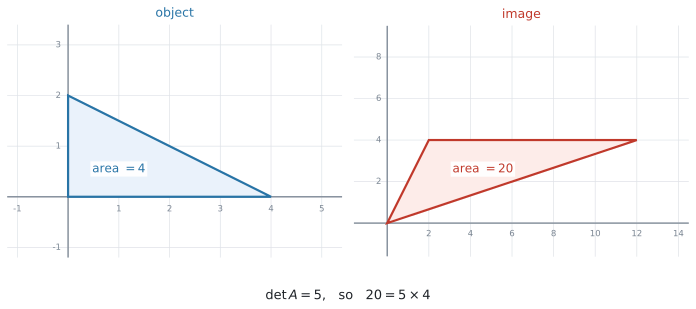{#fig-ahl39-det width=96%}

@fig-ahl39-det の三角形は面積 $4$ で、$\det\begin{pmatrix} 3 & 1 \\ 1 & 2 \end{pmatrix} = 6 - 1 = 5$ なので、像の面積は $5 \times 4 = 20$ です。

#### なぜ絶対値が付くのか {#absolute}

$\det A$ が負になることがあるからです。面積は負になりません。

**$\det A$ が負のときは、図形が裏返っています。** reflection の transformation matrix は、どれも $\det = -1$ です。$-1$ 倍というのは「面積はそのまま、向きだけ裏返る」という意味です。

| $\det A$ | 面積 | 向き |
|---|---|---|
| $\det A > 0$ | $\lvert \det A \rvert$ 倍 | そのまま |
| $\det A < 0$ | $\lvert \det A \rvert$ 倍 | 裏返る |
| $\det A = 0$ | $0$（つぶれる） | ― |

: determinant の読み方 {#tbl-ahl39-det}

$\det A = 0$ のときは、図形が線分か点につぶれてしまいます。このとき inverse matrix が存在しない（[AHL 1.14](../01-number-and-algebra/ahl-1-14.qmd#singular)）ことと、同じことを言っています。**つぶれたものは、もとにもどせません。**

### 7. 像からもどすときは、inverse matrix を使います {#inverse}

「どの点が $(12,\ 5)$ にうつったか」と聞かれることがあります。$A\mathbf{x} = \mathbf{y}$ を $\mathbf{x}$ について解けばよいので、両辺に $A^{-1}$ を**左から**掛けて

$$
\mathbf{x} = A^{-1}\mathbf{y}
$$ {#eq-ahl39-inverse}

です。translation が付いている @eq-ahl39-affine の形なら、**先に引いてから**掛けます。

$$
\mathbf{x} = A^{-1}\bigl(\mathbf{y} - \mathbf{t}\bigr)
$$ {#eq-ahl39-inverse-affine}

順番が逆になることに注意してください。行くときは「掛けてから足す」、もどるときは「引いてから掛ける」です。

### 8. fractal は、同じ変換をくり返して作ります {#fractals}

シラバスは、この項目の最後に **fractal**（フラクタル）を挙げています。難しそうな名前ですが、やっていることは**縮小する変換を何度もくり返す**だけです。

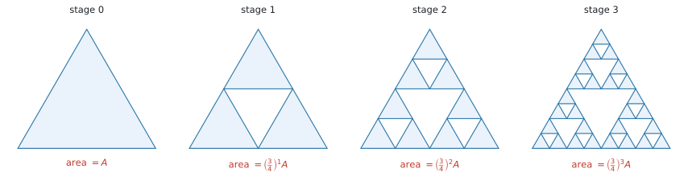{#fig-ahl39-sierpinski width=100%}

@fig-ahl39-sierpinski は **Sierpinski triangle**（シェルピンスキーの三角形）です。$1$ 回の手順は、次の $2$ つでできています。

1. $\begin{pmatrix} \frac{1}{2} & 0 \\ 0 & \frac{1}{2} \end{pmatrix}$ で**半分に縮める**（enlargement, $k = \frac{1}{2}$）
2. その縮んだ図形を **$3$ つ**、translation で置きなおす

面積で見ると、$1$ つあたりが $\left(\frac{1}{2}\right)^{2} = \frac{1}{4}$ になり、それが $3$ つなので

$$
3 \times \frac{1}{4} = \frac{3}{4}
$$

つまり **$1$ 回ごとに面積が $\frac{3}{4}$ 倍**になります。これは公比 $\frac{3}{4}$ の geometric sequence です（[SL 1.3](../../ai-sl/01-number-and-algebra/sl-1-3.qmd)）。$\lvert r \rvert < 1$ なので、$n$ を大きくすると面積は $0$ に近づきます。

**同じ見方で、Koch snowflake（コッホ雪片）は周の長さを追いかけます。**

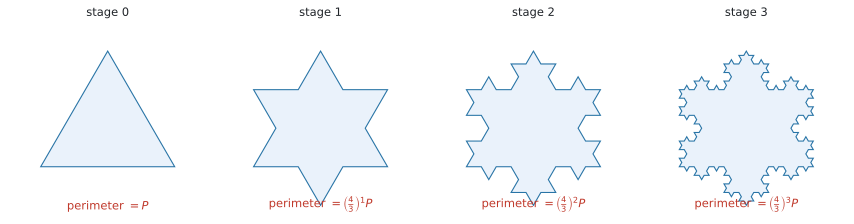{#fig-ahl39-koch width=100%}

@fig-ahl39-koch では、$1$ 本の辺が $\frac{1}{3}$ の長さの辺 $4$ 本に置きかわります。周の長さは $1$ 回ごとに $\frac{4}{3}$ 倍で、こちらは $\lvert r \rvert > 1$ ですから、**いくらでも長くなります。** 面積は有限のままなのに周の長さは無限、というのが、この図形が有名な理由です。

::: {.callout-note}
## self-similar（自己相似）という言葉
どこを拡大しても同じ形が出てくることを **self-similar** といいます。**縮小した自分自身を並べる**という作り方をしているので、こうなります。

試験でこの語が出たら、「**縮小した自分自身のコピーでできている**」という意味だと思ってください。
:::

## Why it works

:::: {.callout-note collapse="true" appearance="simple"}
## クリックすると開きます
ここで説明するのは、**なぜ transformation matrix を掛けるだけで図形が動くのか**、その $1$ 点だけです。

$2 \times 2$ の行列に $\begin{pmatrix} 1 \\ 0 \end{pmatrix}$ を掛けると、答えは **$1$ 列目そのもの**になります。同じように $\begin{pmatrix} 0 \\ 1 \end{pmatrix}$ を掛けると **$2$ 列目**が出ます。

$$
\begin{pmatrix} 3 & 1 \\ 1 & 2 \end{pmatrix}\begin{pmatrix} 1 \\ 0 \end{pmatrix} = \begin{pmatrix} 3 \\ 1 \end{pmatrix}
\qquad
\begin{pmatrix} 3 & 1 \\ 1 & 2 \end{pmatrix}\begin{pmatrix} 0 \\ 1 \end{pmatrix} = \begin{pmatrix} 1 \\ 2 \end{pmatrix}
$$

つまり、**transformation matrix の $2$ つの列は「横向きの $1$ と縦向きの $1$ が、どこへ行くか」を書いたもの**です。

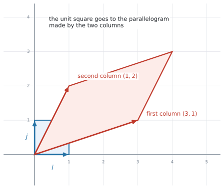{#fig-ahl39-columns width=80%}

平面上のどの点も、横向きと縦向きの組み合わせで書けます。$(3,\ 1)$ は「横に $3$、縦に $1$」です。だから、**この $2$ つの行き先さえ決めれば、残りの点の行き先は自動的に決まります。** transformation matrix は、その $2$ つの行き先を並べただけのものです。

@fig-ahl39-columns で、$1$ 辺 $1$ の正方形が平行四辺形になっています。この平行四辺形の面積が $\lvert \det A \rvert$ で、面積が何倍になるか（@eq-ahl39-area）も、ここから来ています。
::::

## Worked examples

::: {.callout-note appearance="simple"}
問題文は英語です。意味が理解できなかったら、問題文の下の「**日本語訳**」を開いてください。解説は日本語です。
:::

::: {#exm-ahl39-point}
[The transformation $T$ is represented by the matrix $M = \begin{pmatrix} 0 & -1 \\ 1 & 0 \end{pmatrix}$.]{.q-en}

**(a)** [Find the image of the point $P(4,\ 2)$ under $T$.]{.q-en}

**(b)** [Describe fully the transformation $T$.]{.q-en}

<details class="jp-trans">
<summary>日本語訳</summary>

変換 $T$ は行列 $M = \begin{pmatrix} 0 & -1 \\ 1 & 0 \end{pmatrix}$ で表されます。

**(a)** $T$ による点 $P(4,\ 2)$ の像を求めなさい。

**(b)** 変換 $T$ を、もれなく説明しなさい。

</details>

---

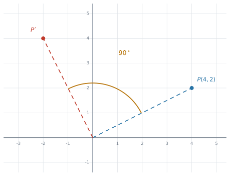{#fig-ahl39-we1 width=68%}

**(a)** 点を[縦に並べて](#points)、左から $M$ を掛けます。

$$
\begin{pmatrix} 0 & -1 \\ 1 & 0 \end{pmatrix}\begin{pmatrix} 4 \\ 2 \end{pmatrix}
= \begin{pmatrix} 0(4) + (-1)(2) \\ 1(4) + 0(2) \end{pmatrix}
= \begin{pmatrix} -2 \\ 4 \end{pmatrix}
$$

答えは $(-2,\ 4)$ です。

**(b)** [第3節の表](#tbl-ahl39-choose)と見くらべます。左下が $1$、右上が $-1$ なので、**anticlockwise の rotation** の形です。

$$
\begin{pmatrix} \cos\theta & -\sin\theta \\ \sin\theta & \cos\theta \end{pmatrix}
= \begin{pmatrix} 0 & -1 \\ 1 & 0 \end{pmatrix}
\quad \Rightarrow \quad \cos\theta = 0,\ \ \sin\theta = 1
$$

$\theta = 90^\circ$ です。

`Describe fully` と言われたら、**角・向き・中心の $3$ つ**を書いてください。$1$ つでも欠けると点になりません。

::: {.model-answer}
**試験ではこう書く**

*A rotation of $90^\circ$ anticlockwise about the origin.*
:::

（原点を中心とする $90^\circ$ の反時計回りの回転、という意味です。）

::: {.callout-note}
## 解答例（答案用紙にはこう書く）
**(a)**
$$
\begin{pmatrix} 0 & -1 \\ 1 & 0 \end{pmatrix}\begin{pmatrix} 4 \\ 2 \end{pmatrix} = \begin{pmatrix} -2 \\ 4 \end{pmatrix}
\quad \Rightarrow \quad (-2,\ 4)
$$

**(b)** *A rotation of $90^\circ$ anticlockwise about the origin.*
:::
:::

::: {#exm-ahl39-area}
[The triangle $OAB$ has vertices $O(0,\ 0)$, $A(4,\ 0)$ and $B(0,\ 3)$. The transformation $S$ is represented by the matrix $N = \begin{pmatrix} 2 & 1 \\ 0 & 3 \end{pmatrix}$.]{.q-en}

**(a)** [Find the coordinates of $A'$ and $B'$, the images of $A$ and $B$ under $S$.]{.q-en}

**(b)** [Find $\det N$.]{.q-en}

**(c)** [Hence find the area of triangle $OA'B'$.]{.q-en}

<details class="jp-trans">
<summary>日本語訳</summary>

三角形 $OAB$ の頂点は $O(0,\ 0)$、$A(4,\ 0)$、$B(0,\ 3)$ です。変換 $S$ は行列 $N = \begin{pmatrix} 2 & 1 \\ 0 & 3 \end{pmatrix}$ で表されます。

**(a)** $S$ による $A$ と $B$ の像 $A'$ と $B'$ の座標を求めなさい。

**(b)** $\det N$ を求めなさい。

**(c)** これを使って、三角形 $OA'B'$ の面積を求めなさい。

</details>

---

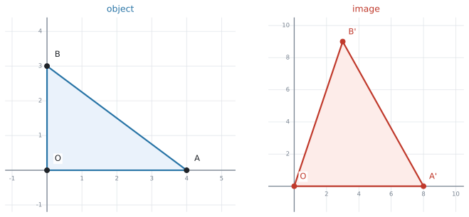{#fig-ahl39-we2 width=94%}

**(a)** $2$ 点を[まとめて](#shapes)計算します。

$$
\begin{pmatrix} 2 & 1 \\ 0 & 3 \end{pmatrix}\begin{pmatrix} 4 & 0 \\ 0 & 3 \end{pmatrix}
= \begin{pmatrix} 8 & 3 \\ 0 & 9 \end{pmatrix}
$$

列がそのまま答えなので、$A'(8,\ 0)$、$B'(3,\ 9)$ です。

**(b)** $\det N = 2(3) - 1(0) = 6$ です。

**(c)** `Hence` と書かれているので、**(b) の $6$ を使え**という指示です。面積を座標から計算しなおす必要はありません。

もとの三角形 $OAB$ は、直角をはさむ辺が $4$ と $3$ なので

$$
\text{area of } OAB = \frac{1}{2}(4)(3) = 6
$$

@eq-ahl39-area より

$$
\text{area of } OA'B' = \lvert 6 \rvert \times 6 = 36
$$

**検算。** $A'(8,0)$、$B'(3,9)$ から直接計算すると $\frac{1}{2}\lvert 8(9) - 0(3) \rvert = 36$ ✓

::: {.callout-note}
## 解答例（答案用紙にはこう書く）
**(a)**
$$
\begin{pmatrix} 2 & 1 \\ 0 & 3 \end{pmatrix}\begin{pmatrix} 4 & 0 \\ 0 & 3 \end{pmatrix} = \begin{pmatrix} 8 & 3 \\ 0 & 9 \end{pmatrix}
\quad \Rightarrow \quad A'(8,\ 0),\ \ B'(3,\ 9)
$$

**(b)** $\det N = 2(3) - 1(0) = 6$

**(c)**
$$
\text{area of } OAB = \tfrac{1}{2}(4)(3) = 6
$$
$$
\text{area of } OA'B' = \lvert 6 \rvert \times 6 = 36
$$
:::
:::

::: {#exm-ahl39-compose}
[$P$ is a reflection in the $x$-axis. $Q$ is a rotation of $90^\circ$ anticlockwise about the origin.]{.q-en}

**(a)** [Write down the matrices $P$ and $Q$.]{.q-en}

**(b)** [Find the single matrix that represents a reflection in the $x$-axis followed by a rotation of $90^\circ$ anticlockwise.]{.q-en}

**(c)** [Show that carrying out the two transformations in the other order gives a different result.]{.q-en}

<details class="jp-trans">
<summary>日本語訳</summary>

$P$ は $x$ 軸に関する対称移動、$Q$ は原点を中心とする $90^\circ$ の反時計回りの回転です。

**(a)** 行列 $P$ と $Q$ を書きなさい。

**(b)** 「$x$ 軸に関する対称移動をしてから、$90^\circ$ 反時計回りに回転する」を表す $1$ つの行列を求めなさい。

**(c)** $2$ つの変換を逆の順で行うと、結果が変わることを示しなさい。

</details>

---

**(a)** $x$ 軸は $y = 0$、つまり傾き $0$ の直線なので $\theta = 0^\circ$ です。@eq-ahl39-reflection に $2\theta = 0^\circ$ を入れます。

$$
P = \begin{pmatrix} \cos 0^\circ & \sin 0^\circ \\ \sin 0^\circ & -\cos 0^\circ \end{pmatrix} = \begin{pmatrix} 1 & 0 \\ 0 & -1 \end{pmatrix}
\qquad
Q = \begin{pmatrix} 0 & -1 \\ 1 & 0 \end{pmatrix}
$$

**(b)** 「$P$ をしてから $Q$」なので、[あとにやる $Q$ を左](#composition)に書きます。

$$
QP = \begin{pmatrix} 0 & -1 \\ 1 & 0 \end{pmatrix}\begin{pmatrix} 1 & 0 \\ 0 & -1 \end{pmatrix}
= \begin{pmatrix} 0 & 1 \\ 1 & 0 \end{pmatrix}
$$

これは $y = x$ に関する reflection です（[表](#tbl-ahl39-reflections)）。

**(c)** 逆の順は $PQ$ です。

$$
PQ = \begin{pmatrix} 1 & 0 \\ 0 & -1 \end{pmatrix}\begin{pmatrix} 0 & -1 \\ 1 & 0 \end{pmatrix}
= \begin{pmatrix} 0 & -1 \\ -1 & 0 \end{pmatrix}
$$

$QP \neq PQ$ なので、結果は変わります。$PQ$ のほうは $y = -x$ に関する reflection です。

`Show that` と言われているので、**$2$ つの行列を並べて、違うと一言書く**ところまでが解答です。

::: {.callout-note}
## 解答例（答案用紙にはこう書く）
**(a)**
$$
P = \begin{pmatrix} 1 & 0 \\ 0 & -1 \end{pmatrix}, \qquad Q = \begin{pmatrix} 0 & -1 \\ 1 & 0 \end{pmatrix}
$$

**(b)**
$$
QP = \begin{pmatrix} 0 & -1 \\ 1 & 0 \end{pmatrix}\begin{pmatrix} 1 & 0 \\ 0 & -1 \end{pmatrix} = \begin{pmatrix} 0 & 1 \\ 1 & 0 \end{pmatrix}
$$

**(c)**
$$
PQ = \begin{pmatrix} 1 & 0 \\ 0 & -1 \end{pmatrix}\begin{pmatrix} 0 & -1 \\ 1 & 0 \end{pmatrix} = \begin{pmatrix} 0 & -1 \\ -1 & 0 \end{pmatrix} \neq QP
$$

*The order changes the result: $QP$ is a reflection in $y = x$, but $PQ$ is a reflection in $y = -x$.*
:::
:::

::: {#exm-ahl39-affine}
[A computer program moves each point $(x,\ y)$ of a design to the point $(x',\ y')$, where]{.q-en}

$$
\begin{pmatrix} x' \\ y' \end{pmatrix} = \begin{pmatrix} 3 & 1 \\ 2 & 1 \end{pmatrix}\begin{pmatrix} x \\ y \end{pmatrix} + \begin{pmatrix} 4 \\ -1 \end{pmatrix}
$$

**(a)** [Find the image of the point $(2,\ 1)$.]{.q-en}

**(b)** [The design has an area of $6\ \text{cm}^{2}$. Find the area of the image, and comment on your answer.]{.q-en}

**(c)** [Find the point whose image is $(12,\ 5)$.]{.q-en}

<details class="jp-trans">
<summary>日本語訳</summary>

あるコンピュータのプログラムは、デザインの各点 $(x,\ y)$ を、次の $(x',\ y')$ に移します。

$$
\begin{pmatrix} x' \\ y' \end{pmatrix} = \begin{pmatrix} 3 & 1 \\ 2 & 1 \end{pmatrix}\begin{pmatrix} x \\ y \end{pmatrix} + \begin{pmatrix} 4 \\ -1 \end{pmatrix}
$$

**(a)** 点 $(2,\ 1)$ の像を求めなさい。

**(b)** このデザインの面積は $6\ \text{cm}^{2}$ です。像の面積を求め、その答えについてコメントしなさい。

**(c)** 像が $(12,\ 5)$ になる点を求めなさい。

</details>

---

**(a)** [掛けてから足します](#translation)。

$$
\begin{pmatrix} 3 & 1 \\ 2 & 1 \end{pmatrix}\begin{pmatrix} 2 \\ 1 \end{pmatrix} = \begin{pmatrix} 7 \\ 5 \end{pmatrix}
\qquad
\begin{pmatrix} 7 \\ 5 \end{pmatrix} + \begin{pmatrix} 4 \\ -1 \end{pmatrix} = \begin{pmatrix} 11 \\ 4 \end{pmatrix}
$$

答えは $(11,\ 4)$ です。

**(b)** 面積を決めるのは transformation matrix のほうだけです。**translation は図形を動かすだけで、大きさを変えません。**

$$
\det \begin{pmatrix} 3 & 1 \\ 2 & 1 \end{pmatrix} = 3(1) - 1(2) = 1
$$

@eq-ahl39-area より、像の面積は $\lvert 1 \rvert \times 6 = 6\ \text{cm}^{2}$ です。

`comment on` と言われているので、**数値だけでは点になりません。**

::: {.model-answer}
**試験ではこう書く**

*Since $\det = 1$, the area is unchanged. The design is moved and its shape is distorted, but it covers the same area of $6\ \text{cm}^{2}$.*
:::

（$\det = 1$ なので面積は変わりません。形はゆがみますが、覆う面積は同じ $6\ \text{cm}^{2}$ です、という意味です。）

**(c)** [引いてから、inverse を掛けます](#inverse)。

$$
\begin{pmatrix} 12 \\ 5 \end{pmatrix} - \begin{pmatrix} 4 \\ -1 \end{pmatrix} = \begin{pmatrix} 8 \\ 6 \end{pmatrix}
$$

$\det = 1$ なので、inverse は割り算なしで書けます。

$$
A^{-1} = \frac{1}{1}\begin{pmatrix} 1 & -1 \\ -2 & 3 \end{pmatrix} = \begin{pmatrix} 1 & -1 \\ -2 & 3 \end{pmatrix}
$$

$$
\begin{pmatrix} 1 & -1 \\ -2 & 3 \end{pmatrix}\begin{pmatrix} 8 \\ 6 \end{pmatrix} = \begin{pmatrix} 2 \\ 2 \end{pmatrix}
$$

答えは $(2,\ 2)$ です。

**検算。** $\begin{pmatrix} 3 & 1 \\ 2 & 1 \end{pmatrix}\begin{pmatrix} 2 \\ 2 \end{pmatrix} + \begin{pmatrix} 4 \\ -1 \end{pmatrix} = \begin{pmatrix} 8 \\ 6 \end{pmatrix} + \begin{pmatrix} 4 \\ -1 \end{pmatrix} = \begin{pmatrix} 12 \\ 5 \end{pmatrix}$ ✓

::: {.callout-note}
## 解答例（答案用紙にはこう書く）
**(a)**
$$
\begin{pmatrix} 3 & 1 \\ 2 & 1 \end{pmatrix}\begin{pmatrix} 2 \\ 1 \end{pmatrix} + \begin{pmatrix} 4 \\ -1 \end{pmatrix} = \begin{pmatrix} 11 \\ 4 \end{pmatrix}
\quad \Rightarrow \quad (11,\ 4)
$$

**(b)**
$$
\det A = 3(1) - 1(2) = 1, \qquad \text{area} = \lvert 1 \rvert \times 6 = 6\ \text{cm}^{2}
$$

*Since $\det = 1$, the area is unchanged.*

**(c)**
$$
A^{-1} = \begin{pmatrix} 1 & -1 \\ -2 & 3 \end{pmatrix}, \qquad
\begin{pmatrix} 1 & -1 \\ -2 & 3 \end{pmatrix}\left[\begin{pmatrix} 12 \\ 5 \end{pmatrix} - \begin{pmatrix} 4 \\ -1 \end{pmatrix}\right] = \begin{pmatrix} 2 \\ 2 \end{pmatrix}
$$

$\Rightarrow (2,\ 2)$
:::
:::

::: {#exm-ahl39-fractal}
[A fractal is built from a triangle of area $64\ \text{cm}^{2}$. At each stage, every triangle is replaced by three triangles, each produced by the transformation matrix $\begin{pmatrix} 0.5 & 0 \\ 0 & 0.5 \end{pmatrix}$ together with a translation.]{.q-en}

**(a)** [Describe the transformation represented by the matrix.]{.q-en}

**(b)** [Show that the total area is multiplied by $\dfrac{3}{4}$ at each stage.]{.q-en}

**(c)** [Find the total area at stage $5$, giving your answer to three significant figures.]{.q-en}

**(d)** [State what happens to the total area as the number of stages increases.]{.q-en}

<details class="jp-trans">
<summary>日本語訳</summary>

面積 $64\ \text{cm}^{2}$ の三角形からフラクタルを作ります。各段階で、すべての三角形が $3$ つの三角形に置きかわります。それぞれは、transformation matrix $\begin{pmatrix} 0.5 & 0 \\ 0 & 0.5 \end{pmatrix}$ と平行移動によって作られます。

**(a)** この行列が表す変換を説明しなさい。

**(b)** 各段階で全体の面積が $\dfrac{3}{4}$ 倍になることを示しなさい。

**(c)** 段階 $5$ での全体の面積を、有効数字 $3$ 桁で求めなさい。

**(d)** 段階の数を増やしていくと、全体の面積がどうなるかを述べなさい。

</details>

---

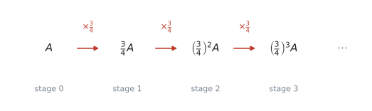{#fig-ahl39-we5 width=88%}

**(a)** 対角線に同じ数が並んでいるので [enlargement](#enlargement) です。

::: {.model-answer}
**試験ではこう書く**

*An enlargement with scale factor $0.5$, centre the origin.*
:::

（原点を中心とする scale factor $0.5$ の拡大、という意味です。scale factor が $1$ より小さいので、実際には縮みます。）

**(b)** 面積の倍率は $\lvert \det \rvert$ です（@eq-ahl39-area）。

$$
\det \begin{pmatrix} 0.5 & 0 \\ 0 & 0.5 \end{pmatrix} = 0.25
$$

三角形 $1$ つあたりの面積は $0.25$ 倍になり、それが $3$ つできるので

$$
3 \times 0.25 = 0.75 = \frac{3}{4}
$$

**(c)** $1$ 段階ごとに $\frac{3}{4}$ 倍なので、これは公比 $\frac{3}{4}$ の geometric sequence です。

$$
64 \times \left(\frac{3}{4}\right)^{5} = 15.1875
$$

有効数字 $3$ 桁で $15.2\ \text{cm}^{2}$ です。

**(d)** $\left\lvert \frac{3}{4} \right\rvert < 1$ なので、段階を進めるほど面積は小さくなります。

::: {.model-answer}
**試験ではこう書く**

*The total area tends to $0$ as the number of stages increases.*
:::

（段階の数が増えると、全体の面積は $0$ に近づきます、という意味です。）

::: {.callout-note}
## 解答例（答案用紙にはこう書く）
**(a)** *An enlargement with scale factor $0.5$, centre the origin.*

**(b)**
$$
\det = 0.5 \times 0.5 = 0.25, \qquad 3 \times 0.25 = 0.75 = \tfrac{3}{4}
$$

**(c)**
$$
64 \times \left(\tfrac{3}{4}\right)^{5} = 15.1875 = 15.2\ \text{cm}^{2} \ (3\ \text{s.f.})
$$

**(d)** *The total area tends to $0$.*
:::
:::

## Common errors

::: {.callout-warning}
## 点を横に書いたまま、transformation matrix に掛けようとする
$\begin{pmatrix} 4 & 2 \end{pmatrix}\begin{pmatrix} 0 & -1 \\ 1 & 0 \end{pmatrix}$ と書いてしまう誤りです。

この形でも計算はできてしまうので、**間違いに気づけない**のが怖いところです。@exm-ahl39-point と同じ数で試すと

$$
\begin{pmatrix} 4 & 2 \end{pmatrix}\begin{pmatrix} 0 & -1 \\ 1 & 0 \end{pmatrix} = \begin{pmatrix} 2 & -4 \end{pmatrix}
$$

となり、正しい答え $(-2,\ 4)$ ではなく $(2,\ -4)$、つまり**時計回りに回した点**が出ます。もっともらしい答えなので、そのまま書いてしまいます。

この項目では、点は必ず**縦**に書いて、transformation matrix を**左**に置いてください（[第1節](#points)）。
:::

::: {.callout-warning}
## reflection の transformation matrix に $\theta$ をそのまま入れる
$y = x$ の reflection で、$\theta = 45^\circ$ を @eq-ahl39-reflection にそのまま入れてしまう誤りです。

入るのは **$2\theta$** です。$45^\circ$ を入れると $\begin{pmatrix} 0.707 & 0.707 \\ 0.707 & -0.707 \end{pmatrix}$ という、意味の分からない行列になります。

**公式集の中に $2\theta$ と印刷されている**ので、書き写すときに落とさないでください。
:::

::: {.callout-warning}
## 合成の順番を、左右まちがえる
「$P$ をしてから $Q$」を $PQ$ と書いてしまう誤りです。正しくは $QP$ です（[第5節](#composition)）。

日本語では「$P$ してから $Q$」と左から読むので、そのまま書きたくなります。**あとにやるほうが左**、と声に出して確かめてください。
:::

::: {.callout-warning}
## rotation の向きを取りちがえる
clockwise なのに anticlockwise の行列を使ってしまう誤りです。

$\theta = 90^\circ$ なら、$(1,\ 0)$ が $(0,\ 1)$ に行くのが anticlockwise、$(0,\ -1)$ に行くのが clockwise です。**$(1,\ 0)$ を $1$ 点だけ入れて確かめてください。** 行列の $1$ 列目を見るだけで済みます。
:::

::: {.callout-warning}
## 面積に絶対値を付けない
$\det A = -3$ のときに、像の面積を $-3$ 倍と書いてしまう誤りです。

**面積は負になりません。** マイナスは「裏返っている」という意味です（[第6節](#absolute)）。@eq-ahl39-area の絶対値記号を落とさないでください。
:::

::: {.callout-warning}
## translation の分まで、面積に掛けてしまう
$A\mathbf{x} + \mathbf{t}$ の形で、$\mathbf{t}$ が面積に影響すると考えてしまう誤りです。

**平行移動は、図形をそのまま滑らせるだけ**です。面積を決めるのは $A$ の determinant だけです。
:::

::: {.callout-warning}
## 像からもどすときに、引く前に inverse を掛ける
$A^{-1}\mathbf{y} - \mathbf{t}$ と書いてしまう誤りです。正しくは $A^{-1}(\mathbf{y} - \mathbf{t})$ です（@eq-ahl39-inverse-affine）。

行くときは「掛ける → 足す」でした。もどるときは、**逆の順で「引く → 掛ける」**になります。
:::

::: {.callout-warning}
## 電卓が Radian のまま
$\cos 90^\circ$ を計算したつもりが $\cos 90\ \text{rad}$ になり、$0$ ではなく $-0.448\ldots$ が出ます。

**行列の成分が全部おかしくなる**ので、答えは大きく外れます。Topic 3 では Degree、と決めておいてください。
:::

::: {.callout-warning}
## `Describe` に対して、行列を書き写して終わる
`Describe fully the transformation` は、**言葉で説明しなさい**という指示です。行列をもう一度書いても点になりません。

rotation なら「角・向き・中心」、enlargement なら「scale factor・中心」、reflection なら「どの直線か」まで書いてください。
:::

::: {.callout-warning}
## fractal の問題で、$1$ つぶんの面積と全体の面積を混ぜる
Sierpinski triangle で、$1$ つの三角形が $\frac{1}{4}$ になることと、全体が $\frac{3}{4}$ になることを取りちがえる誤りです。

**$\frac{1}{4}$ が $3$ つで $\frac{3}{4}$** です。問題文が「$1$ つの面積」と「全体の面積」のどちらを聞いているのか、先に確かめてください。
:::

## Using your GDC (TI-Nspire CX II)

行列の入力そのものは [AHL 1.14 の GDC の節](../01-number-and-algebra/ahl-1-14.qmd#gdc-enter)と同じです。ここでは、この項目でよく使う $5$ つを書きます。

### 1. 角の設定を先に確かめます {#gdc-angle}

rotation と reflection を計算する前に、**必ず** Degree になっているか見てください。

```
ctrl + menu → Settings → Document Settings → Angle: Degree
```

画面の右上に `DEG` と出ていれば大丈夫です。

### 2. transformation matrix を作って、名前を付けます {#gdc-store}

Calculator ページで、[AHL 1.14](../01-number-and-algebra/ahl-1-14.qmd#gdc-enter) と同じメニューから $2 \times 2$ の枠を出します。

```
menu → 7: Matrix & Vector → 1: Create → 1: Matrix
```

枠に $\cos 90$、$-\sin 90$、$\sin 90$、$\cos 90$ を打ちこんだら、名前を付けて保存します。

```
ctrl + sto→
```

に続けて `r` と打てば、以後は `r` と書くだけでこの行列が呼び出せます。

::: {.callout-tip}
## 角のところに式のまま入れてください
$\cos 90^\circ$ を自分で $0$ に直してから打ちこむ必要はありません。**式のまま入れれば、電卓が計算します。**

$\theta = \tan^{-1} 2$ のような割り切れない角のときは、そのほうが**丸めの誤差が入りません**。
:::

### 3. 点や図形を、まとめて変換します {#gdc-apply}

頂点を並べた $2 \times 3$ の行列を、同じメニューから作ります。こちらにも `ctrl + sto→` で名前を付けます。ここでは `b` としました。

あとは、左から掛けるだけです。

```
r * b
```

答えの**列がそれぞれの頂点の像**です（[第2節](#shapes)）。

::: {.callout-warning}
## `b * r` と打つと、`Invalid dimensions` と出ます
$2 \times 3$ に $2 \times 2$ は掛けられないので、電卓が計算を受け付けません。

**transformation matrix は、いつも左**です。
:::

### 4. determinant と逆変換 {#gdc-det}

面積の倍率は `det()` で出せます。

```
det(r)
```

像からもとの点にもどすときは、逆行列を掛けます。

```
r^(-1) * [[12][5]]
```

[AHL 1.14](../01-number-and-algebra/ahl-1-14.qmd#gdc-det) と同じで、`^` キーで $-1$ 乗を打つだけです。translation があるときは、**先に引き算をしてから**掛けてください。

```
r^(-1) * ([[12][5]] - [[4][-1]])
```

### 5. 同じ変換をくり返すとき {#gdc-power}

fractal のように同じ変換を $n$ 回くり返すときは、行列の累乗が使えます。

```
r^5
```

ただし、面積の話だけなら**行列を $5$ 乗する必要はありません。** $\lvert \det \rvert$ を $5$ 乗するほうが速いです。

## Exercises

::: {.callout-note appearance="simple"}
各問題に、折りたたみが3つ付いています。**日本語訳**、**解答例**（答案用紙に書くべきこと。英語です）、**解説**（なぜそうなるか。日本語です）。

まず自分で解いて、次に解答例と見くらべてください。**解説は、合わなかったときだけ開けば十分です。**
:::

::: {.exercise-block}

[1]{.ex-no} [The transformation $R$ is a rotation of $180^\circ$ about the origin. Find the image of the point $(5,\ -2)$ under $R$.]{.q-en}

<details class="jp-trans">
<summary>日本語訳</summary>

変換 $R$ は、原点を中心とする $180^\circ$ の回転です。$R$ による点 $(5,\ -2)$ の像を求めなさい。

</details>

::: {.callout-note collapse="true"}
## 解答例（答案用紙に書くこと）
$$
R = \begin{pmatrix} \cos 180^\circ & -\sin 180^\circ \\ \sin 180^\circ & \cos 180^\circ \end{pmatrix} = \begin{pmatrix} -1 & 0 \\ 0 & -1 \end{pmatrix}
$$

$$
\begin{pmatrix} -1 & 0 \\ 0 & -1 \end{pmatrix}\begin{pmatrix} 5 \\ -2 \end{pmatrix} = \begin{pmatrix} -5 \\ 2 \end{pmatrix}
\quad \Rightarrow \quad (-5,\ 2)
$$
:::

::: {.callout-tip collapse="true"}
## 解説
$180^\circ$ の回転は、時計回りでも反時計回りでも同じ場所に行きます。ですから、@eq-ahl39-rotation のどちらを使っても構いません。

出てくる行列は $\begin{pmatrix} -1 & 0 \\ 0 & -1 \end{pmatrix}$、つまり**符号を両方変えるだけ**です。$(5,\ -2) \to (-5,\ 2)$ となります。
:::

::: {.ex-sep}
:::

[2]{.ex-no} [Write down the matrix that represents a reflection in the $y$-axis, and find the image of the point $(3,\ 7)$.]{.q-en}

<details class="jp-trans">
<summary>日本語訳</summary>

$y$ 軸に関する対称移動を表す行列を書き、点 $(3,\ 7)$ の像を求めなさい。

</details>

::: {.callout-note collapse="true"}
## 解答例（答案用紙に書くこと）
$y$-axis $\Rightarrow \theta = 90^\circ$, so $2\theta = 180^\circ$.

$$
\begin{pmatrix} \cos 180^\circ & \sin 180^\circ \\ \sin 180^\circ & -\cos 180^\circ \end{pmatrix} = \begin{pmatrix} -1 & 0 \\ 0 & 1 \end{pmatrix}
$$

$$
\begin{pmatrix} -1 & 0 \\ 0 & 1 \end{pmatrix}\begin{pmatrix} 3 \\ 7 \end{pmatrix} = \begin{pmatrix} -3 \\ 7 \end{pmatrix}
\quad \Rightarrow \quad (-3,\ 7)
$$
:::

::: {.callout-tip collapse="true"}
## 解説
$y$ 軸はたての線なので、傾きで書くことができません。ですが、**$x$ 軸となす角**なら $90^\circ$ とはっきり言えます。@eq-ahl39-reflection には角を入れるので、こちらで考えれば困りません。

入るのは $2\theta = 180^\circ$ のほうです（[第3節](#reflection)）。

答えは「$x$ 座標だけ符号が変わる」形になり、図で考えたものと一致します。
:::

::: {.ex-sep}
:::

[3]{.ex-no} [A shape is transformed by an enlargement with scale factor $3$, centre the origin.]{.q-en}

**(a)** [Find the image of the point $(2,\ -1)$.]{.q-en}

**(b)** [The shape has an area of $7\ \text{cm}^{2}$. Find the area of the image.]{.q-en}

<details class="jp-trans">
<summary>日本語訳</summary>

ある図形を、原点を中心とする scale factor $3$ の拡大で変換します。

**(a)** 点 $(2,\ -1)$ の像を求めなさい。

**(b)** この図形の面積は $7\ \text{cm}^{2}$ です。像の面積を求めなさい。

</details>

::: {.callout-note collapse="true"}
## 解答例（答案用紙に書くこと）
**(a)**
$$
\begin{pmatrix} 3 & 0 \\ 0 & 3 \end{pmatrix}\begin{pmatrix} 2 \\ -1 \end{pmatrix} = \begin{pmatrix} 6 \\ -3 \end{pmatrix}
\quad \Rightarrow \quad (6,\ -3)
$$

**(b)**
$$
\det = 3(3) - 0(0) = 9, \qquad \text{area} = 9 \times 7 = 63\ \text{cm}^{2}
$$
:::

::: {.callout-tip collapse="true"}
## 解説
**(b)** で「$3$ 倍だから面積も $3$ 倍」としないでください。

長さが $3$ 倍になると、面積は $3^{2} = 9$ 倍です。@eq-ahl39-area の $\det$ を計算すれば、自動的に $9$ が出てきます。**公式に任せるほうが安全です。**
:::

::: {.ex-sep}
:::

[4]{.ex-no} [$S$ is a stretch parallel to the $x$-axis with scale factor $2$. $R$ is a rotation of $90^\circ$ anticlockwise about the origin.]{.q-en}

**(a)** [Find the single matrix representing $S$ followed by $R$.]{.q-en}

**(b)** [Hence find the image of the point $(3,\ 2)$.]{.q-en}

<details class="jp-trans">
<summary>日本語訳</summary>

$S$ は $x$ 軸に平行な scale factor $2$ の伸長、$R$ は原点を中心とする $90^\circ$ の反時計回りの回転です。

**(a)** 「$S$ のあとに $R$」を表す $1$ つの行列を求めなさい。

**(b)** これを使って、点 $(3,\ 2)$ の像を求めなさい。

</details>

::: {.callout-note collapse="true"}
## 解答例（答案用紙に書くこと）
**(a)**
$$
S = \begin{pmatrix} 2 & 0 \\ 0 & 1 \end{pmatrix}, \qquad R = \begin{pmatrix} 0 & -1 \\ 1 & 0 \end{pmatrix}
$$

$$
RS = \begin{pmatrix} 0 & -1 \\ 1 & 0 \end{pmatrix}\begin{pmatrix} 2 & 0 \\ 0 & 1 \end{pmatrix} = \begin{pmatrix} 0 & -1 \\ 2 & 0 \end{pmatrix}
$$

**(b)**
$$
\begin{pmatrix} 0 & -1 \\ 2 & 0 \end{pmatrix}\begin{pmatrix} 3 \\ 2 \end{pmatrix} = \begin{pmatrix} -2 \\ 6 \end{pmatrix}
\quad \Rightarrow \quad (-2,\ 6)
$$
:::

::: {.callout-tip collapse="true"}
## 解説
**(a)** 「$S$ のあとに $R$」なので、**あとにやる $R$ が左**です（[第5節](#composition)）。$SR$ と書くと $\begin{pmatrix} 0 & -2 \\ 1 & 0 \end{pmatrix}$ になり、別の変換になってしまいます。

**(b)** `Hence` は「(a) の行列を使え」という指示です。$S$ と $R$ を $2$ 回に分けて掛けても同じ答えになりますが、まとめた行列を使ったことが分かるように書いてください。
:::

::: {.ex-sep}
:::

[5]{.ex-no} [The triangle $OAB$ has vertices $O(0,\ 0)$, $A(3,\ 0)$ and $B(0,\ 2)$. It is transformed by the matrix $M = \begin{pmatrix} 4 & 2 \\ 1 & 3 \end{pmatrix}$.]{.q-en}

**(a)** [Find the coordinates of $A'$ and $B'$.]{.q-en}

**(b)** [Find the area of triangle $OA'B'$.]{.q-en}

<details class="jp-trans">
<summary>日本語訳</summary>

三角形 $OAB$ の頂点は $O(0,\ 0)$、$A(3,\ 0)$、$B(0,\ 2)$ です。これを行列 $M = \begin{pmatrix} 4 & 2 \\ 1 & 3 \end{pmatrix}$ で変換します。

**(a)** $A'$ と $B'$ の座標を求めなさい。

**(b)** 三角形 $OA'B'$ の面積を求めなさい。

</details>

::: {.callout-note collapse="true"}
## 解答例（答案用紙に書くこと）
**(a)**
$$
\begin{pmatrix} 4 & 2 \\ 1 & 3 \end{pmatrix}\begin{pmatrix} 3 & 0 \\ 0 & 2 \end{pmatrix} = \begin{pmatrix} 12 & 4 \\ 3 & 6 \end{pmatrix}
\quad \Rightarrow \quad A'(12,\ 3),\ \ B'(4,\ 6)
$$

**(b)**
$$
\text{area of } OAB = \tfrac{1}{2}(3)(2) = 3
$$
$$
\det M = 4(3) - 2(1) = 10
$$
$$
\text{area of } OA'B' = \lvert 10 \rvert \times 3 = 30
$$
:::

::: {.callout-tip collapse="true"}
## 解説
**(a)** $A$ と $B$ を並べて $2 \times 2$ にすると、かけ算 $1$ 回で終わります。$O$ は原点なので、transformation matrix を掛けても $O$ のままです（[第2節](#shapes)）。

**(b)** 像の座標から直接計算しても $30$ になりますが、**$\det$ を使うほうが速くて確実**です。

もとの三角形は直角三角形なので、面積は $\frac{1}{2} \times 3 \times 2 = 3$ です。
:::

::: {.ex-sep}
:::

[6]{.ex-no} [A transformation is given by]{.q-en}

$$
\begin{pmatrix} x' \\ y' \end{pmatrix} = \begin{pmatrix} 1 & 0 \\ 0 & -1 \end{pmatrix}\begin{pmatrix} x \\ y \end{pmatrix} + \begin{pmatrix} 0 \\ 6 \end{pmatrix}
$$

**(a)** [Find the images of the points $(2,\ 1)$ and $(5,\ -3)$.]{.q-en}

**(b)** [Describe the transformation represented by the matrix.]{.q-en}

<details class="jp-trans">
<summary>日本語訳</summary>

ある変換が、次の式で与えられています。

$$
\begin{pmatrix} x' \\ y' \end{pmatrix} = \begin{pmatrix} 1 & 0 \\ 0 & -1 \end{pmatrix}\begin{pmatrix} x \\ y \end{pmatrix} + \begin{pmatrix} 0 \\ 6 \end{pmatrix}
$$

**(a)** 点 $(2,\ 1)$ と $(5,\ -3)$ の像を求めなさい。

**(b)** 行列が表す変換を説明しなさい。

</details>

::: {.callout-note collapse="true"}
## 解答例（答案用紙に書くこと）
**(a)**
$$
\begin{pmatrix} 1 & 0 \\ 0 & -1 \end{pmatrix}\begin{pmatrix} 2 \\ 1 \end{pmatrix} + \begin{pmatrix} 0 \\ 6 \end{pmatrix} = \begin{pmatrix} 2 \\ 5 \end{pmatrix}
\quad \Rightarrow \quad (2,\ 5)
$$
$$
\begin{pmatrix} 1 & 0 \\ 0 & -1 \end{pmatrix}\begin{pmatrix} 5 \\ -3 \end{pmatrix} + \begin{pmatrix} 0 \\ 6 \end{pmatrix} = \begin{pmatrix} 5 \\ 9 \end{pmatrix}
\quad \Rightarrow \quad (5,\ 9)
$$

**(b)** *A reflection in the $x$-axis.*
:::

::: {.callout-tip collapse="true"}
## 解説
**(a)** 掛けてから足す、の順です（[第4節](#translation)）。$(2,\ 1)$ なら、まず $(2,\ -1)$ になり、そこに $(0,\ 6)$ を足して $(2,\ 5)$ です。

**(b)** 聞かれているのは **transformation matrix のほうだけ**です。translation まで説明する必要はありません。

$\begin{pmatrix} 1 & 0 \\ 0 & -1 \end{pmatrix}$ は $\theta = 0^\circ$ の reflection、つまり $x$ 軸に関する対称移動です（[表](#tbl-ahl39-reflections)）。
:::

::: {.ex-sep}
:::

[7]{.ex-no} [Describe fully the transformation represented by the matrix $\begin{pmatrix} 0 & 1 \\ 1 & 0 \end{pmatrix}$, and state the value of its determinant.]{.q-en}

<details class="jp-trans">
<summary>日本語訳</summary>

行列 $\begin{pmatrix} 0 & 1 \\ 1 & 0 \end{pmatrix}$ が表す変換をもれなく説明し、その determinant の値を書きなさい。

</details>

::: {.callout-note collapse="true"}
## 解答例（答案用紙に書くこと）
*A reflection in the line $y = x$.*

$$
\det = 0(0) - 1(1) = -1
$$
:::

::: {.callout-tip collapse="true"}
## 解説
$\begin{pmatrix} \cos 2\theta & \sin 2\theta \\ \sin 2\theta & -\cos 2\theta \end{pmatrix}$ と見くらべると、$\cos 2\theta = 0$、$\sin 2\theta = 1$ なので $2\theta = 90^\circ$、$\theta = 45^\circ$ です。$\tan 45^\circ = 1$ なので、鏡になる直線は $y = x$ です。

$\det = -1$ は、**reflection ならいつもそうなります**。面積は変わらず、向きだけ裏返るからです（[第6節](#absolute)）。
:::

::: {.ex-sep}
:::

[8]{.ex-no} [The matrix $M = \begin{pmatrix} 2 & 3 \\ 1 & 2 \end{pmatrix}$ maps a point $P$ to the point $(8,\ 5)$. Find the coordinates of $P$.]{.q-en}

<details class="jp-trans">
<summary>日本語訳</summary>

行列 $M = \begin{pmatrix} 2 & 3 \\ 1 & 2 \end{pmatrix}$ は、点 $P$ を点 $(8,\ 5)$ にうつします。$P$ の座標を求めなさい。

</details>

::: {.callout-note collapse="true"}
## 解答例（答案用紙に書くこと）
$$
\det M = 2(2) - 3(1) = 1, \qquad M^{-1} = \begin{pmatrix} 2 & -3 \\ -1 & 2 \end{pmatrix}
$$

$$
\begin{pmatrix} 2 & -3 \\ -1 & 2 \end{pmatrix}\begin{pmatrix} 8 \\ 5 \end{pmatrix} = \begin{pmatrix} 1 \\ 2 \end{pmatrix}
\quad \Rightarrow \quad P(1,\ 2)
$$
:::

::: {.callout-tip collapse="true"}
## 解説
「うつす前の点」を聞かれているので、inverse matrix の出番です（[第7節](#inverse)）。

$\det M = 1$ なので、割り算が要りません。**$a$ と $d$ を入れかえて、$b$ と $c$ の符号を変える**だけです（[AHL 1.14](../01-number-and-algebra/ahl-1-14.qmd#inverse)）。

**検算。** $\begin{pmatrix} 2 & 3 \\ 1 & 2 \end{pmatrix}\begin{pmatrix} 1 \\ 2 \end{pmatrix} = \begin{pmatrix} 8 \\ 5 \end{pmatrix}$ ✓
:::

::: {.ex-sep}
:::

[9]{.ex-no} [The point $(5,\ 0)$ is rotated $60^\circ$ anticlockwise about the origin. Find the coordinates of the image, giving each coordinate to three significant figures.]{.q-en}

<details class="jp-trans">
<summary>日本語訳</summary>

点 $(5,\ 0)$ を、原点を中心に $60^\circ$ 反時計回りに回転させます。像の座標を、それぞれ有効数字 $3$ 桁で求めなさい。

</details>

::: {.callout-note collapse="true"}
## 解答例（答案用紙に書くこと）
$$
\begin{pmatrix} \cos 60^\circ & -\sin 60^\circ \\ \sin 60^\circ & \cos 60^\circ \end{pmatrix}\begin{pmatrix} 5 \\ 0 \end{pmatrix}
= \begin{pmatrix} 2.5 \\ 4.330\ldots \end{pmatrix}
$$

$\Rightarrow (2.50,\ 4.33)$
:::

::: {.callout-tip collapse="true"}
## 解説
電卓が **Degree** になっているか、先に確かめてください（[GDC 第1節](#gdc-angle)）。Radian のままだと $(-4.76,\ -1.52)$ という、まったく違う答えが出ます。

$\cos 60^\circ$ と $\sin 60^\circ$ は、**式のまま電卓に入れて構いません**（[GDC 第2節](#gdc-store)）。$0.866$ に丸めてから計算すると、$3$ 桁目がずれることがあります。

$x$ 座標はちょうど $2.5$ ですが、有効数字 $3$ 桁と言われているので $2.50$ と書きます。
:::

::: {.ex-sep}
:::

[10]{.ex-no} [The Koch snowflake starts from an equilateral triangle of perimeter $27\ \text{cm}$. At each stage, every straight edge is replaced by four edges, each one third of the length of the edge it replaces.]{.q-en}

**(a)** [Find the perimeter after one stage.]{.q-en}

**(b)** [Find the perimeter after four stages, giving your answer to three significant figures.]{.q-en}

**(c)** [State what happens to the perimeter as the number of stages increases, and justify your answer.]{.q-en}

<details class="jp-trans">
<summary>日本語訳</summary>

コッホ雪片は、周の長さ $27\ \text{cm}$ の正三角形から始まります。各段階で、すべての直線の辺が $4$ 本の辺に置きかわります。それぞれの長さは、もとの辺の $\dfrac{1}{3}$ です。

**(a)** $1$ 段階後の周の長さを求めなさい。

**(b)** $4$ 段階後の周の長さを、有効数字 $3$ 桁で求めなさい。

**(c)** 段階の数が増えると周の長さがどうなるかを述べ、その理由を書きなさい。

</details>

::: {.callout-note collapse="true"}
## 解答例（答案用紙に書くこと）
**(a)**
$$
27 \times \frac{4}{3} = 36\ \text{cm}
$$

**(b)**
$$
27 \times \left(\frac{4}{3}\right)^{4} = 85.33\ldots = 85.3\ \text{cm} \ (3\ \text{s.f.})
$$

**(c)** *The perimeter increases without limit. The common ratio is $\frac{4}{3} > 1$, so the geometric sequence diverges.*
:::

::: {.callout-tip collapse="true"}
## 解説
**(a)** $1$ 本の辺が、長さ $\frac{1}{3}$ の辺 $4$ 本になるので、長さは $4 \times \frac{1}{3} = \frac{4}{3}$ 倍です。$27 \times \frac{4}{3} = 36$ です。

**(b)** $1$ 段階ごとに $\frac{4}{3}$ 倍なので、公比 $\frac{4}{3}$ の geometric sequence です（[SL 1.3](../../ai-sl/01-number-and-algebra/sl-1-3.qmd)）。$4$ 段階なら $\left(\frac{4}{3}\right)^{4}$ を掛けます。

**(c)** `justify` と言われているので、**理由を書かないと点になりません。** 「公比が $1$ より大きいから」が理由です。

@exm-ahl39-fractal の Sierpinski triangle は $\frac{3}{4} < 1$ で $0$ に近づきました。**同じ考え方で、$1$ より大きいか小さいかを見るだけ**です。
:::

:::
