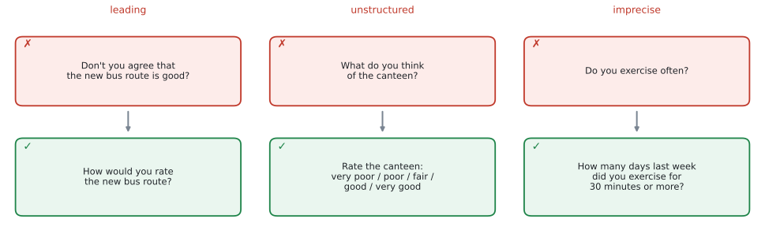
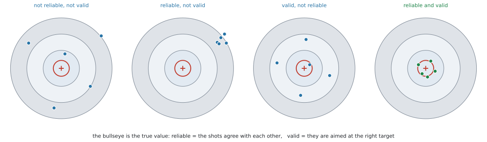
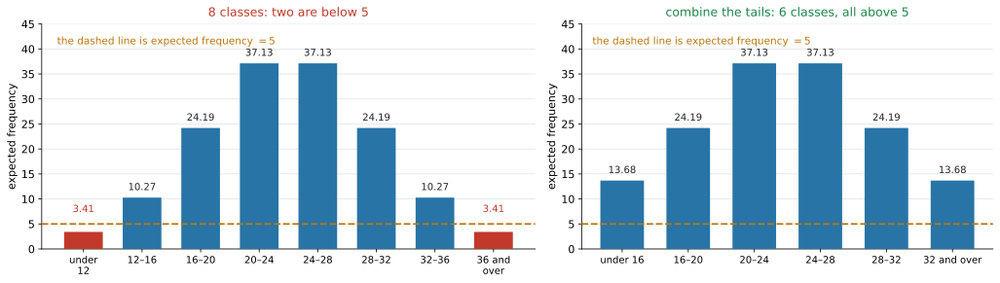
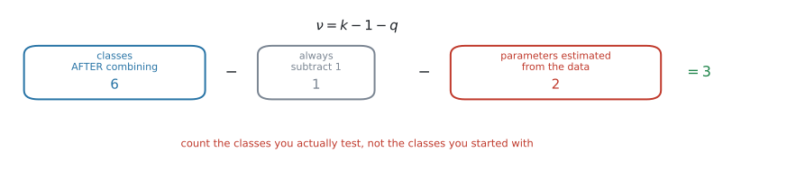

# AHL 4.12 — Data collection and χ² categorisation（データの集め方と χ² のカテゴリ分け） {#sec-ahl-4-12}

::: {.callout-note}
## What you should be able to do
- **survey**（調査）や **questionnaire**（アンケート）の質問を見て、**biased**（かたよった）・**personal**（個人的な）・**unstructured**（選択肢のない）・**imprecise**（あいまいな）ところを指摘し、直せる。
- たくさんある変数の中から、**調べたい問いに関係する変数を選べる**。
- **reliability**（信頼性）と **validity**（妥当性）のちがいを説明し、**test-retest**（再テスト法）・**parallel forms**（平行検査法）・**content**・**criterion-related** の $4$ つを使い分けられる。
- 数値データを $\chi^2$ の表の**カテゴリに区切り**、その区切り方を**説明できる**。
- **expected frequency**（期待度数）が $5$ より大きくなるように、**カテゴリをまとめられる**。
- goodness of fit で、**データから推定した母数の数だけ自由度が減る**ことを使える。
:::

::: {.callout-note}
## SL 4.1 と SL 4.11 の続きです
このページは、$2$ つのページの上に立っています。

| ページ | そこでやったこと | ここで足すこと |
|---|---|---|
| [SL 4.1](../../ai-sl/04-statistics-and-probability/sl-4-1.qmd) | 標本の**取り方**（$5$ つの sampling technique と bias） | **質問のしかた**そのものを設計する |
| [SL 4.11](../../ai-sl/04-statistics-and-probability/sl-4-11.qmd) | $\chi^2$ 検定の**手順**（$5$ ステップと $3$ つの検定） | **カテゴリの作り方**と、**自由度の数え方** |

: このページの位置 {#tbl-ahl412-place}

$\chi^2$ の値も $p$-value も、電卓が出してくれます（[SL 4.11 の GDC の節](../../ai-sl/04-statistics-and-probability/sl-4-11.qmd#gdc-gof)）。新しく手を動かすのは、**期待度数を作るところ**だけです。

そのかわり、**電卓に渡す前と、受け取ったあとの判断**が増えます。どう区切るか、自由度に何を入れるか、そしてその選択を**言葉で説明できるか**。

なお、この項目にも公式集の欄はありません。覚える式は自由度の $1$ 本だけです。その形の意味は[あとで説明します](#why-it-works)。
:::

::: {.callout-important}
## この項目は、計算ではなく「記述」で点が決まります
[SL 4.11](../../ai-sl/04-statistics-and-probability/sl-4-11.qmd) と同じです。シラバスの言葉を見てください。

> Categorizing numerical data in a $\chi^2$ table and **justifying the choice of categorisation**

`justifying`——つまり、**なぜその区切り方にしたのかを書く**ところまでが問題です。表を作って終わりではありません。

質問の設計も、reliability と validity も、**英語の文を書いて答える**設問です。このページでは、その文の型を毎回示します。
:::

## The idea

### 1. データを「作る側」に回ります {#idea}

SL の Topic 4 では、データは**すでにそこにありました**。表が与えられ、それを整理し、検定にかけていました。

この項目では、その手前に立ちます。

$$
\underbrace{\text{何を知りたいか}}_{\text{問い}} \ \to \ \underbrace{\text{どう聞くか}}_{\text{質問の設計}} \ \to \ \underbrace{\text{何を記録するか}}_{\text{変数の選択}} \ \to \ \underbrace{\text{どう区切るか}}_{\text{カテゴリ分け}} \ \to \ \chi^2
$$

**この $4$ 段のどこかで失敗すると、$\chi^2$ をどれだけ正しく計算しても、答えに意味がありません。** シラバスがこの項目を置いているのは、そのためです。

::: {.callout-note}
## Exploration（探究課題・IA）でも、ここが効きます
自分でデータを集めて $\chi^2$ を使うなら、**その集め方を説明する部分**が評価されます。この項目の言葉は、そのまま IA で使えます。
:::

### 2. 質問のしかたで、答えが変わります {#questions}

シラバスは、質問の設計で見るべき点をこう並べています。

> Biased and unbiased, personal, unstructured and structured (with consistent answer choices), and precise questioning.

$4$ つあります。$1$ つずつ見ます。

{#fig-ahl412-questions width=100%}

#### biased と unbiased {#biased}

**biased question**（かたよった質問）は、**答えを一方に誘導する**質問です。**leading question**（誘導質問）ともいいます。

@fig-ahl412-questions の左を見てください。

> ✗ *Don't you agree that the new bus route is good?*

`Don't you agree` と言われると、`No` と答えにくくなります。**質問そのものが、答えを押しています。**

> ✓ *How would you rate the new bus route?*

こちらは、どちらへも答えられます。**unbiased**（かたよっていない）質問です。

::: {.callout-tip}
## 「よい」「便利な」のような語が入っていたら、疑ってください
`the good new route`、`this convenient service`、`the problem of ...` のような言い方は、**答える前に評価を与えています。**

質問文から、**評価を表す形容詞を抜く**——これが直し方です。
:::

#### personal {#personal}

**personal question**（個人的な質問）は、年齢・収入・成績・健康など、**正直に答えにくい**質問です。

聞いてはいけないわけではありません。ただし、

- 答えたくない人が**答えないまま返す**（missing data が増える）
- 答えても、**本当のことを書かない**

ということが起こります。**集まったデータが、その分だけかたよります。**

::: {.callout-note}
## 直し方は $2$ つあります
- **範囲で聞く。** `What is your income?` ではなく、`Which band is your income in?` として、幅のある選択肢を出します
- **匿名にする。** `The questionnaire is anonymous` と最初に書いておきます

答案では、**「なぜ答えにくいのか」と「どう直すのか」の両方**を書いてください。
:::

#### unstructured と structured {#structured}

**unstructured question**（自由回答の質問）は、答えを自由に書かせる質問です。**structured question**（選択式の質問）は、**選択肢から選ばせる**質問です。

@fig-ahl412-questions の真ん中です。

> ✗ *What do you think of the canteen?*
>
> ✓ *Rate the canteen: very poor / poor / fair / good / very good*

シラバスは structured に **(with consistent answer choices)** と付けています。**選択肢がそろっていること**が条件です。

**$\chi^2$ にかけるなら、structured でなければなりません。** 自由に書かれた文章は、そのままでは度数に数えられないからです。

::: {.callout-warning}
## 選択肢は、重ならず、もれなく
$\chi^2$ の表は、**$1$ つの回答が、ちょうど $1$ つのマスに入る**ことを前提にしています。ですから選択肢は

- **重ならない**（`0–10`、`10–20` は $10$ がどちらか分かりません。`0–9`、`10–19` にします）
- **もれがない**（`0–9`、`10–19` だけでは、$20$ 以上の人が入れません。`20 or more` を足します）

の $2$ つをみたす必要があります。**この $2$ つは、[第5節](#categorise)のカテゴリ分けとまったく同じ条件**です。
:::

#### precise questioning {#precise}

**precise question**（正確な質問）は、**誰が読んでも同じ意味になる**質問です。そうでないものを **imprecise**（あいまいな）といいます。

@fig-ahl412-questions の右です。

> ✗ *Do you exercise often?*
>
> ✓ *How many days last week did you exercise for 30 minutes or more?*

`often`（よく）は、人によって意味が違います。週 $1$ 回を `often` と思う人もいれば、毎日でなければ `often` ではないと思う人もいます。**同じ人の同じ生活について、答えがばらついてしまいます。**

直し方は、**期間・量・単位を入れる**ことです。「先週」「$30$ 分以上」「何日」と決めれば、解釈の幅がなくなります。

::: {.callout-tip}
## あいまいな語のリスト
`often`、`regularly`、`a lot`、`good`、`young`、`nearby`、`recently`——どれも人によって意味が変わります。

問題文でこれらを見つけたら、**それが指摘すべき点**です。
:::

### 3. たくさんの変数から、調べるものを選びます {#variables}

シラバスは $2$ 行だけです。

> Selecting relevant variables from many variables.
>
> Choosing relevant and appropriate data to analyse.

現実のデータには、**必要のない列がたくさん入っています。** アンケートを取れば $20$ 問ぶんの答えが集まりますが、$1$ つの問いに答えるのに $20$ 個すべては要りません。

選ぶ基準は $2$ つです。

| 基準 | 中身 |
|---|---|
| **relevant**（関係がある） | その変数が、**立てた問いに直接かかわる**か |
| **appropriate**（扱いに合っている） | その変数が、**使いたい検定に合った型**か |

: 変数を選ぶ $2$ つの基準 {#tbl-ahl412-variables}

::: {.callout-important}
## $\chi^2$ にかけるなら、カテゴリでなければなりません
$\chi^2$ の表に入るのは **度数**です。ですから、変数は**カテゴリになっていること**が必要です。

- はじめからカテゴリのもの（性別、学年、好きな科目）… そのまま使えます
- 数値のもの（身長、点数、時間）… **区切ってカテゴリにします**（[第5節](#categorise)）

数値のまま $\chi^2$ に入れることはできません。**「$168.3$ cm の人が何人」では、どのマスにも $1$ 人ずつしか入らない**からです。
:::

::: {.callout-warning}
## 「関係がありそうだから全部入れる」は、選択ではありません
`Explain which variables you would use` と問われたら、**選んだ理由**を書きます。「多いほうがよい」ではありません。

関係のない変数を混ぜると、表のマスが増え、$1$ マスあたりの度数が小さくなります。**[第5節](#five)の「$5$ より大きい」がみたせなくなる**——これが、余分な変数の実害です。
:::

### 4. reliability と validity は、別のことです {#rel-val}

シラバスが名指ししている、この項目のもう $1$ つの柱です。

> Definition of reliability and validity. Reliability tests. Validity tests.

言葉の意味は、$1$ 行ずつです。

| 語 | 意味 |
|---|---|
| **reliability**（信頼性） | 同じことを**もう一度測ったら、同じ結果になる**か |
| **validity**（妥当性） | それが**測りたかったものを、本当に測っている**か |

: reliability と validity {#tbl-ahl412-relval}

{#fig-ahl412-target width=100%}

@fig-ahl412-target が、この $2$ つの関係です。的の中心が「本当の値」、点が「測った値」です。

- **reliable** … 点どうしが**まとまっている**（何度やっても同じ）
- **valid** … 点が**中心を向いている**（正しいものを測っている）

::: {.callout-important}
## reliable でも valid でないことがあります
@fig-ahl412-target の $2$ 番目を見てください。$5$ 発とも同じところに当たっていますが、**中心から外れています。**

体重計が、いつも $3$ kg 多く出るとします。何度乗っても同じ値が出るので **reliable** ですが、**体重を正しく測っていないので valid ではありません。**

**この $2$ つは別々に確かめる必要があります。** 「同じ結果が出たから正しい」とは言えません。
:::

#### reliability tests {#reliability-tests}

シラバスが挙げているのは $2$ つです。

| 方法 | やること | 何が分かるか |
|---|---|---|
| **test-retest** | **同じ人**に、**同じテスト**を、**時間をおいて**もう一度受けてもらう | $2$ 回の結果が近ければ reliable |
| **parallel forms** | **同じ内容**の**別の問題**（$2$ つの版）を作り、両方受けてもらう | $2$ つの版の結果が近ければ reliable |

: $2$ つの reliability test {#tbl-ahl412-reliability}

::: {.callout-tip}
## $2$ つの使い分け
- **test-retest** … 同じテストをもう一度。ただし、**覚えてしまう**という問題があります。$2$ 回目のほうが点が上がるなら、それは reliability ではなく記憶です。だから**時間をあけます**
- **parallel forms** … 別の問題なので、覚える問題は起きません。ただし、**$2$ つの版が本当に同じ難しさか**を確かめるのが難しくなります

どちらを選んでも構いませんが、`Give a reason` と問われたら、**この長所と短所のどちらかにふれてください。**
:::

どちらの方法でも、確かめるのは**$2$ 回の結果がどれだけ一致しているか**です。実際には、$2$ 組の値の相関係数（[SL 4.4](../../ai-sl/04-statistics-and-probability/sl-4-4.qmd#pearson-r)）を見ます。

#### validity tests {#validity-tests}

こちらも $2$ つです。

| 方法 | やること | 何が分かるか |
|---|---|---|
| **content validity**（内容的妥当性） | 測りたい**内容が、もれなく入っている**かを確かめる | 範囲がそろっていれば valid |
| **criterion-related validity**（基準関連妥当性） | **すでに信用されている別のものさし**と比べる | よく一致していれば valid |

: $2$ つの validity test {#tbl-ahl412-validity}

例で見ます。

- **content** … 学期の数学のテストが、**その学期に習った全部の単元から出ている**か。$1$ 単元だけから出ていたら、content validity は低いです
- **criterion-related** … 新しく作った短い体力テストの結果を、**きちんとした測定機器で測った値**と比べる。近ければ criterion-related validity が高いです

::: {.callout-note}
## $4$ つの名前は、そのまま書けるようにしてください
`test-retest`、`parallel forms`、`content`、`criterion-related`。シラバスが名指ししている $4$ つです。

答案では、**名前だけでなく「何をするのか」を $1$ 行添えて**ください。名前だけでは点になりません。
:::

### 5. 数値データを、カテゴリに区切ります {#categorise}

ここから、この項目の計算に近い部分です。

> Categorizing numerical data in a $\chi^2$ table and justifying the choice of categorisation.

身長・点数・時間のような**数値データ**を $\chi^2$ にかけるには、まず**区間に区切って、度数を数えられる形**にします。区切ってできた $1$ つ $1$ つを **class**（階級）といいます（[SL 4.2](../../ai-sl/04-statistics-and-probability/sl-4-2.qmd#class-interval)）。

区切り方は $1$ 通りではありません。**そこが問われます。**

#### 区切り方の $3$ つの条件 {#three-conditions}

| 条件 | 中身 |
|---|---|
| **重ならない** | $1$ つの値が、$2$ つの class に入らない |
| **もれがない** | どの値も、どこかの class に入る |
| **期待度数が $5$ より大きい** | これが、この項目の中心です |

: 区切り方の条件 {#tbl-ahl412-conditions}

::: {#five .callout-important}
## 期待度数は $5$ より大きく
シラバスの指定は、はっきりしています。

> Appropriate categories should be chosen with **expected frequencies greater than 5**.

見るのは **expected frequency**（期待度数）であって、**observed frequency（観測度数）ではありません。** 実際に $2$ 人しかいない class でも、期待度数が $8$ なら構いません。

$5$ を下回る class があったら、**隣とまとめます**（[次の節](#combine)）。

なぜ $5$ なのかは [Why it works](#why-it-works) で説明します。
:::

#### $5$ 以下の class は、隣とまとめます {#combine}

{#fig-ahl412-combine width=100%}

@fig-ahl412-combine の左は、身長を $8$ つの class に区切ったときの期待度数です。両端の $2$ つが $3.41$ で、**$5$ を下回っています。**

そこで、両端をそれぞれ隣とまとめます。

$$
3.413 + 10.27 = 13.68, \qquad 10.27 + 3.413 = 13.68
$$

右がその結果です。class は $8$ つから **$6$ つ**になり、どれも $5$ を超えました。

::: {.callout-warning}
## まとめるのは、**隣どうし**だけです
いちばん下の class といちばん上の class をまとめてはいけません。**区間としてつながっていないから**です。

数値データの class には**順序があります。** まとめてよいのは、その順序で隣り合っているものだけです。
:::

::: {.callout-tip}
## 両端は「未満」「以上」の形にします
@fig-ahl412-combine の右では、いちばん下が `under 16`、いちばん上が `32 and over` になっています。

**normal distribution のような連続分布を当てはめるときは、この形が必要**です。$8$ より小さい値や $40$ より大きい値にも、モデルは確率を与えているからです。両端を開いておけば、**確率の合計がちょうど $1$** になります。
:::

#### 区切り方を説明する {#justify}

`justify` と問われたら、**上の条件のどれを使ったか**を書きます。型は決まっています。

::: {.model-answer}
**試験ではこう書く**

*The classes do not overlap and cover all the data. The two end classes had expected frequencies below $5$, so each was combined with the class next to it. All six remaining classes now have an expected frequency greater than $5$.*
:::

（重ならず、もれもないこと。両端の期待度数が $5$ 未満だったのでまとめたこと。まとめたあとは全部 $5$ を超えていること——この $3$ 点です。）

### 6. 自由度は、推定した母数の数だけ減ります {#df}

$\chi^2$ goodness of fit の自由度は、SL では**いつも $n-1$** でした。SL 4.11 の試験についての注意書きは、こうなっています。

> the degrees of freedom will always be greater than one. At SL the degrees of freedom for the goodness of fit test will always be $n-1$

**前半の「$1$ より大きい」は、HL でも生きています。** 試験で $\nu = 1$ になる問題は出ません。後半が、HL では変わります。

> Choosing an appropriate number of degrees of freedom when **estimating parameters from data** when carrying out the $\chi^2$ goodness of fit test.

$$
\nu = k - 1 - q
$$ {#eq-ahl412-df}

- $k$ … **検定に使う class の数**（[まとめたあと](#combine)の数です）
- $q$ … **データから推定した parameter（母数）の数**

{#fig-ahl412-df width=100%}

@fig-ahl412-df は、[第5節](#combine)の例に当てはめたものです。$8$ つを $6$ つにまとめ、$\mu$ と $\sigma$ を推定したので $\nu = 6 - 1 - 2 = 3$ です。

#### $q$ は、どう数えるか {#count-q}

**問題文が値を教えてくれたら $0$、データから計算したら $1$ つにつき $1$** です。

| 当てはめる分布 | データから推定するもの | $q$ |
|---|---|---|
| 割合が問題文で与えられている（サイコロが公平、$2:3:5$ など） | なし | $0$ |
| **binomial** $B(n,\ p)$ で、$p$ をデータから出す | $p$ | $1$ |
| **Poisson**（ポアソン分布）で、$m$（平均）をデータから出す | $m$ | $1$ |
| **normal** $N(\mu,\ \sigma^{2})$ で、$\mu$ と $\sigma$ をデータから出す | $\mu$、$\sigma$ | $2$ |
| **normal** で、$\mu$ と $\sigma$ が**問題文に書いてある** | なし | $0$ |

: $q$ の数え方 {#tbl-ahl412-q}

::: {.callout-warning}
## 最後の $2$ 行を、見くらべてください
同じ normal でも、**$\mu$ と $\sigma$ をどこから持ってきたか**で $q$ が変わります。

- 「この工場の製品は $N(50,\ 4)$ に従うと言われている。合うか」→ **与えられている** → $q = 0$
- 「このデータは normal に従うか」→ **データから $\mu$ と $\sigma$ を出すしかない** → $q = 2$

**問題文に数が書いてあるかどうか**を、先に確かめてください。
:::

::: {.callout-important}
## independence の自由度は、変わりません
[SL 4.11](../../ai-sl/04-statistics-and-probability/sl-4-11.qmd) の $\chi^2$ test for independence は、いままでどおり

$$
\nu = (r-1)(c-1)
$$

です。$r$ は行の数、$c$ は列の数。**@eq-ahl412-df を使うのは goodness of fit だけ**です。

（independence でも期待度数を推定してはいますが、その分はすでに $(r-1)(c-1)$ の形に織り込まれています。）
:::

::: {.callout-warning}
## GOF では、自由度を自分で電卓に入れます
`χ² GOF` は `Deg of Freedom` を聞いてきます（[SL 4.11 の GDC の節](../../ai-sl/04-statistics-and-probability/sl-4-11.qmd#gdc-gof)）。

**電卓は、class をいくつまとめたかも、parameter を何個推定したかも知りません。** ここは自分で数えて入れるところです。

@exm-ahl412-normal では、$\nu$ を $3$ にするか $5$ にするかで、**$p$-value が $5$ 倍変わります。**
:::

## Why it works

:::: {.callout-note collapse="true" appearance="simple"}
## クリックすると開きます
ここで説明するのは $2$ つです。**なぜ推定するたびに自由度が $1$ 減るのか**と、**なぜ期待度数が $5$ より大きくないといけないのか**。

### なぜ、推定すると自由度が減るのか {#why-df}

「自由度」は、**自由に決められる数がいくつあるか**という意味です。

class が $k$ 個あって、観測度数を $O_1, O_2, \ldots, O_k$ とします。合計は $n$ で決まっているので、

$$
O_1 + O_2 + \cdots + O_k = n
$$

$k-1$ 個まで自由に決めれば、**最後の $1$ 個は自動的に決まります。** これが $-1$ の意味です。

つぎに、$\mu$ をデータから推定したとします。推定するというのは、**「モデルの平均が、データの平均と一致するように $\mu$ を選ぶ」**ということです。つまり

$$
(\text{モデルの平均}) = (\text{データの平均})
$$

という**式が $1$ 本増えます。$\mu$ を自由に動かせなくなった**、ということです。

**厳密な理由は、この課程の範囲を越えます。** ただ、向きだけは上の $2$ 行で見えます。IB では「**データから決めた parameter $1$ つにつき、自由度が $1$ 減る**」として使います。

$\sigma$ も同じように推定すれば、さらに $1$ つ減ります。だから normal では $q = 2$ です。

$$
\nu = \underbrace{k}_{\text{class の数}} - \underbrace{1}_{\text{合計が $n$}} - \underbrace{q}_{\text{推定した母数}}
$$

**自由度が減ると、同じ $\chi^2$ の値でも $p$-value が小さくなります。** 推定した分だけモデルがデータに寄せてあるので、「ずれが小さくて当たり前」——その分、厳しく見るわけです。

### なぜ、期待度数が $5$ より大きくないといけないのか {#why-five}

$\chi^2$ 統計量は

$$
\chi^2 = \sum \frac{(O - E)^2}{E}
$$

でした（[SL 4.11](../../ai-sl/04-statistics-and-probability/sl-4-11.qmd)）。$p$-value は、この値が **$\chi^2$ 分布に従うとみなして**出しています。

ところが、これは**近似**です。$O$ は整数しか取れないとびとびの値なのに、$\chi^2$ 分布はなめらかな曲線だからです。

$E$ が小さいと、この近似がくずれます。理由は分母を見れば分かります。

$$
E = 2 \ \text{のとき、} \ O \ \text{が} \ 1 \ \text{ずれるだけで} \ \frac{1^2}{2} = 0.5
$$

$$
E = 20 \ \text{のとき、} \ O \ \text{が} \ 1 \ \text{ずれても} \ \frac{1^2}{20} = 0.05
$$

**$E$ が小さい class は、$1$ 人ずれただけで、その項が大きく動きます。** そうなると、$\chi^2$ の値のばらつき方が、なめらかな $\chi^2$ 分布からずれてしまいます。

**困るのは、電卓が返す $p$-value が当てにならなくなること**です。棄却しやすくなるとはかぎらず、逆に棄却しにくくなることもあります。どちらに転ぶかは、表の形によります。

$5$ という数字そのものに深い意味はありません。**近似が実用に耐える目安**として広く使われている値で、シラバスもそれを採っています。
::::

## Worked examples

::: {.callout-note appearance="simple"}
問題文は英語です。意味が理解できなかったら、問題文の下の「**日本語訳**」を開いてください。解説は日本語です。
:::

::: {#exm-ahl412-survey}
[A student wants to find out whether the members of her school use the new library. She plans to ask students the following question.]{.q-en}

> *Don't you think the excellent new library is often useful?*

**(a)** [State two reasons why this question is not well designed.]{.q-en}

**(b)** [Write an improved question that could be used in a $\chi^2$ test for independence.]{.q-en}

<details class="jp-trans">
<summary>日本語訳</summary>

ある生徒が、学校の生徒が新しい図書館を使っているかどうかを調べようとしています。次の質問を生徒にする予定です。

> *Don't you think the excellent new library is often useful?*
>
> （すばらしい新図書館は、よく役に立つと思いませんか。）

**(a)** この質問がうまく設計されていない理由を $2$ つ述べなさい。

**(b)** $\chi^2$ の独立性の検定に使えるような、改善した質問を書きなさい。

</details>

---

**(a)** この $1$ 文には、[第2節](#questions)で見た問題が $3$ つ入っています。

| 問題 | どこに出ているか |
|---|---|
| **biased**（誘導的） | `Don't you think ...?` と `excellent` |
| **imprecise**（あいまい） | `often`——人によって意味が違う |
| **unstructured**（選択肢がない） | `useful` かどうかを、どう答えればよいか決まっていない |

: この質問の問題点 {#tbl-ahl412-we1}

`two reasons` なので、$2$ つ書けば足ります。**どこが悪いのかを、質問文の言葉を引いて示してください。**

::: {.model-answer}
**試験ではこう書く**

*The question is biased: "Don't you think" and "excellent" both push the student towards agreeing.*

*The question is imprecise: "often" means different things to different students, so their answers cannot be compared.*
:::

（誘導的であること、あいまいであること——それぞれ、質問文のどの語がそうさせているかを示しています。）

**(b)** $\chi^2$ test for independence にかけるので、答えが**カテゴリ**になる必要があります（[第3節](#variables)）。

::: {.model-answer}
**試験ではこう書く**

*How many times did you use the library last week?*

*$0$ / $1$–$2$ / $3$–$4$ / $5$ or more*
:::

（$3$ つとも直っています。評価を表す語がなく **unbiased**、「先週」「何回」と決めてあって **precise**、選択肢が重ならず、もれもない **structured**。）

::: {.callout-note}
## 解答例（答案用紙にはこう書く）
**(a)** *It is biased: "Don't you think" and "excellent" lead the student towards a positive answer.*

*It is imprecise: "often" is not defined, so different students will interpret it differently.*

**(b)** *How many times did you use the library last week? $0$ / $1$–$2$ / $3$–$4$ / $5$ or more.*
:::

::: {.callout-tip}
## `two reasons` に $3$ つ書いても、点は増えません
$3$ つ目を書いて時間を使うより、**$2$ つを $1$ 行ずつ、根拠つきで**書くほうが確実です。

「biased です」だけでは足りません。**どの語がそうさせているか**を引いてください。
:::
:::

::: {#exm-ahl412-relval}
[A teacher designs a new $20$-minute test to measure students' arithmetic skill.]{.q-en}

**(a)** [Describe how the teacher could use a test-retest method to check the reliability of the test.]{.q-en}

**(b)** [The results of the new test agree closely with the results of a well-established arithmetic test taken by the same students. State which type of validity this supports, and explain your answer.]{.q-en}

**(c)** [The new test contains only addition questions. Comment on the validity of the test.]{.q-en}

<details class="jp-trans">
<summary>日本語訳</summary>

ある教師が、生徒の計算力を測る新しい $20$ 分のテストを作りました。

**(a)** このテストの reliability を確かめるために、test-retest の方法をどう使えばよいかを説明しなさい。

**(b)** 新しいテストの結果が、同じ生徒が受けた、すでに定評のある計算テストの結果とよく一致しました。これはどの種類の validity を支持するかを述べ、理由を説明しなさい。

**(c)** 新しいテストには足し算の問題しか入っていません。このテストの validity について述べなさい。

</details>

---

**(a)** test-retest は「**同じ人に、同じテストを、時間をおいて**」でした（[第4節](#reliability-tests)）。

`Describe` なので、**やることを順に書きます。** 「時間をおく」理由まで書けると、答案が強くなります。

::: {.model-answer}
**試験ではこう書く**

*Give the same test to the same group of students a second time, after an interval long enough that they do not simply remember their answers. If the two sets of scores agree closely, the test is reliable.*
:::

（同じ生徒に、覚えていない程度の間隔をあけて、同じテストをもう一度。$2$ 回の得点が近ければ reliable、という意味です。）

**(b)** 「**すでに信用されている別のものさしと比べる**」——これが criterion-related validity です（[第4節](#validity-tests)）。

::: {.model-answer}
**試験ではこう書く**

*Criterion-related validity. The new test is being compared with an established test that is already accepted as a measure of arithmetic skill, and the close agreement suggests that the new test measures the same thing.*
:::

（すでに認められているものさしと比べていて、よく一致しているから、という意味です。）

**(c)** 足し算だけでは、**計算力の一部しか測っていません。** 引き算・かけ算・わり算が入っていないからです。これは content validity の問題です。

`Comment on` と言われているので、**どの validity が、なぜ低いのか**を書きます。

::: {.model-answer}
**試験ではこう書く**

*The test has low content validity. Arithmetic skill also includes subtraction, multiplication and division, but the test covers only addition, so it does not cover the whole of what it claims to measure.*
:::

（内容が全体をおおっていないので content validity が低い、という意味です。）

::: {.callout-note}
## 解答例（答案用紙にはこう書く）
**(a)** *Give the same test to the same students again after a suitable interval, and compare the two sets of scores. Close agreement indicates reliability.*

**(b)** *Criterion-related validity: the new test agrees with an established test that is already accepted as measuring arithmetic skill.*

**(c)** *Low content validity: only addition is tested, so the test does not cover the whole of arithmetic skill.*
:::

::: {.callout-warning}
## (c) で「reliable ではない」と書かない
足し算だけのテストでも、**何度受けても同じ点が出るなら reliable です。** 問題は、測っているものが違うこと——つまり validity です（@fig-ahl412-target の $2$ 番目）。

**この取りちがえが、この項目でいちばん多い失点**です。
:::
:::

::: {#exm-ahl412-categorise}
[The times, in minutes, taken by $60$ students to complete a puzzle are to be tested against a proposed model using a $\chi^2$ goodness of fit test. Under the model, the expected frequencies for six equal classes would be]{.q-en}

| class | $0 \le t < 4$ | $4 \le t < 8$ | $8 \le t < 12$ | $12 \le t < 16$ | $16 \le t < 20$ | $t \ge 20$ |
|---|---|---|---|---|---|---|
| expected frequency | $3.1$ | $18.4$ | $21.7$ | $11.6$ | $4.2$ | $1.0$ |

: Expected frequencies under the model {#tbl-ahl412-we3q}

**(a)** [State which classes must be combined, and give a reason.]{.q-en}

**(b)** [Write down the expected frequencies after combining.]{.q-en}

**(c)** [The model has no parameters estimated from the data. Write down the number of degrees of freedom.]{.q-en}

<details class="jp-trans">
<summary>日本語訳</summary>

$60$ 人の生徒がパズルを解くのにかかった時間（分）を、$\chi^2$ 適合度検定で、ある提案されたモデルと比べます。そのモデルのもとでは、$6$ つの等しい階級の期待度数は上の表のようになります。

表の見出しは、`class` が「階級」、`expected frequency` が「期待度数」、`20 or more` が「$20$ 以上」です。

**(a)** まとめなければならない階級を述べ、理由を書きなさい。

**(b)** まとめたあとの期待度数を書きなさい。

**(c)** このモデルでは、データから推定した母数はありません。自由度を書きなさい。

</details>

---

**(a)** [第5節](#five)の条件を使います。$5$ より大きくない class を探します。

$$
3.1 \ (< 5), \qquad 4.2 \ (< 5), \qquad 1.0 \ (< 5)
$$

$3$ つあります。まとめるのは**隣どうし**だけでした（[第5節](#combine)）。

- $0 \le t < 4$（$3.1$）は、隣の $4 \le t < 8$ とまとめます
- $16 \le t < 20$（$4.2$）と $t \ge 20$（$1.0$）は**隣どうし**なので、この $2$ つをまとめます。$4.2 + 1.0 = 5.2$ で、$5$ を超えます

::: {.model-answer}
**試験ではこう書く**

*Combine $0 \le t < 4$ with $4 \le t < 8$, and combine $16 \le t < 20$ with $t \ge 20$. Each of these classes has an expected frequency less than $5$, and every class used in a $\chi^2$ test must have an expected frequency greater than $5$.*
:::

（どれをまとめるかと、その理由（期待度数が $5$ 未満）を書いています。）

**(b)** 足します。

$$
3.1 + 18.4 = 21.5, \qquad 4.2 + 1.0 = 5.2
$$

| class | $0 \le t < 8$ | $8 \le t < 12$ | $12 \le t < 16$ | $t \ge 16$ |
|---|---|---|---|---|
| expected frequency | $21.5$ | $21.7$ | $11.6$ | $5.2$ |

: まとめたあと {#tbl-ahl412-we3}

**検算。** $21.5 + 21.7 + 11.6 + 5.2 = 60$ ✓ もとの合計と同じです。

全部 $5$ を超えました ✓

**(c)** class は $4$ つ、推定した母数は $0$ 個です（@eq-ahl412-df）。

$$
\nu = 4 - 1 - 0 = 3
$$

::: {.callout-note}
## 解答例（答案用紙にはこう書く）
**(a)** *Combine $0 \le t < 4$ with $4 \le t < 8$, and $16 \le t < 20$ with $t \ge 20$, because each has an expected frequency less than $5$.*

**(b)**

| class | $0 \le t < 8$ | $8 \le t < 12$ | $12 \le t < 16$ | $t \ge 16$ |
|---|---|---|---|---|
| $E$ | $21.5$ | $21.7$ | $11.6$ | $5.2$ |

: まとめたあと {#tbl-ahl412-we3ans}

**(c)** $\nu = 4 - 1 - 0 = 3$
:::

::: {.callout-tip}
## まとめたあと、合計が変わっていないことを見てください
期待度数の合計は、いつもデータの個数（ここでは $60$）です。まとめても、**足し合わせているだけなので合計は変わりません。**

$60$ にならなかったら、足し間違いか、写し間違いです。**$5$ 秒の検算**です。
:::
:::

::: {#exm-ahl412-normal}
[The heights, in centimetres, of $150$ plants are shown in the table.]{.q-en}

| height $h$ | $8 \le h < 12$ | $12 \le h < 16$ | $16 \le h < 20$ | $20 \le h < 24$ | $24 \le h < 28$ | $28 \le h < 32$ | $32 \le h < 36$ | $36 \le h < 40$ |
|---|---|---|---|---|---|---|---|---|
| frequency | $3$ | $7$ | $35$ | $30$ | $31$ | $34$ | $6$ | $4$ |

: Heights of $150$ plants {#tbl-ahl412-we4q}

[Using mid-interval values, the mean of the data is $24.0$ cm and the standard deviation is $6.0$ cm.]{.q-en}

[A researcher wishes to test, at the $5\%$ significance level, whether these heights can be modelled by a normal distribution.]{.q-en}

**(a)** [Find the expected frequencies under the normal model, treating the lowest class as "less than $12$" and the highest as "$36$ or more".]{.q-en}

**(b)** [State which classes must be combined, and justify your choice of categorisation.]{.q-en}

**(c)** [Find the number of degrees of freedom.]{.q-en}

**(d)** [Carry out the test and state your conclusion in context.]{.q-en}

<details class="jp-trans">
<summary>日本語訳</summary>

$150$ 本の植物の高さ（cm）が表に示されています。

表の見出しは、`height` が「高さ」、`frequency` が「度数」です。

階級値を使うと、データの平均は $24.0$ cm、標準偏差は $6.0$ cm です。

研究者は、これらの高さが正規分布でモデル化できるかどうかを、有意水準 $5\%$ で検定したいと考えています。

**(a)** 正規分布モデルのもとでの期待度数を求めなさい。ただし、いちばん下の階級は「$12$ 未満」、いちばん上は「$36$ 以上」として扱いなさい。

**(b)** まとめなければならない階級を述べ、階級の選び方の理由を書きなさい。

**(c)** 自由度を求めなさい。

**(d)** 検定を行い、文脈に沿って結論を述べなさい。

</details>

---

**(a)** 高さを表す確率変数を $H$ とします。$\mu = 24.0$、$\sigma = 6.0$ の normal distribution で、各区間の確率を出します（[SL 4.9](../../ai-sl/04-statistics-and-probability/sl-4-9.qmd#area)）。それに $150$ を掛けたものが期待度数です。

いちばん下は $-\infty$ から $12$、いちばん上は $36$ から $\infty$ とします。**そうしないと、確率の合計が $1$ になりません**（[第5節](#combine)）。

$$
P(H < 12) = 0.0228 \quad \Rightarrow \quad E = 150 \times 0.0228 = 3.413
$$

同じように残りも出します。

| class | $< 12$ | $12$–$16$ | $16$–$20$ | $20$–$24$ | $24$–$28$ | $28$–$32$ | $32$–$36$ | $\ge 36$ |
|---|---|---|---|---|---|---|---|---|
| $O$ | $3$ | $7$ | $35$ | $30$ | $31$ | $34$ | $6$ | $4$ |
| $E$ | $3.413$ | $10.27$ | $24.19$ | $37.13$ | $37.13$ | $24.19$ | $10.27$ | $3.413$ |

: 期待度数（$4$ 有効数字） {#tbl-ahl412-we4}

**検算。** $E$ の合計は $150$ です ✓ $O$ の合計も $150$ ✓

**(b)** 両端が $3.413$ で、**$5$ を下回っています**（[第5節](#five)）。それぞれ隣とまとめます。

$$
3.413 + 10.27 = 13.68
$$

| class | $< 16$ | $16$–$20$ | $20$–$24$ | $24$–$28$ | $28$–$32$ | $\ge 32$ |
|---|---|---|---|---|---|---|
| $O$ | $10$ | $35$ | $30$ | $31$ | $34$ | $10$ |
| $E$ | $13.68$ | $24.19$ | $37.13$ | $37.13$ | $24.19$ | $13.68$ |

: まとめたあと {#tbl-ahl412-we4b}

**検算。** まとめても合計は $150$ のままです ✓

::: {.model-answer}
**試験ではこう書く**

*The classes below $12$ and $36$ or more have expected frequencies of $3.41$, which is less than $5$, so each is combined with the class next to it. The six remaining classes do not overlap, cover all the data, and every expected frequency is now greater than $5$.*
:::

（両端の期待度数が $5$ 未満なので隣とまとめたこと、まとめたあとは重なりもなく、もれもなく、全部 $5$ を超えていること——[第5節](#justify)の $3$ 点です。）

**(c)** class は $6$ つ。データから推定した parameter は **$\mu$ と $\sigma$ の $2$ 個**です。問題文が「平均は $24.0$、標準偏差は $6.0$」と書いていますが、**それはデータから計算した値**であって、与えられたモデルの値ではありません（[第6節](#count-q)）。

$$
\nu = 6 - 1 - 2 = 3
$$

**(d)** [SL 4.11 の $5$ ステップ](../../ai-sl/04-statistics-and-probability/sl-4-11.qmd#tbl-5-steps)どおりに進めます。

$H_0$: *The heights can be modelled by a normal distribution.*

$H_1$: *The heights cannot be modelled by a normal distribution.*

$\chi^2$ を組み立てます。

$$
\chi^2 = \frac{(10-13.68)^2}{13.68} + \frac{(35-24.19)^2}{24.19} + \frac{(30-37.13)^2}{37.13} + \cdots
$$

$$
= 0.991 + 4.83 + 1.37 + 1.01 + 3.98 + 0.991 = 13.2
$$

$\nu = 3$ を電卓に入れて（[GDC 第2節](#gdc-gof)）、

$$
p = 0.00429
$$

$p < 0.05$ なので、$H_0$ を **reject** します。

::: {.model-answer}
**試験ではこう書く**

*$\chi^2 = 13.2$, $\nu = 3$, $p = 0.00429$. Since $p < 0.05$, reject $H_0$. There is sufficient evidence at the $5\%$ level that the heights of these plants are not well modelled by a normal distribution.*
:::

（$p$ が $0.05$ より小さいので $H_0$ を棄却し、これらの植物の高さは正規分布ではうまく表せない、という意味です。）

::: {.callout-note}
## 解答例（答案用紙にはこう書く）
**(a)**

| class | $< 12$ | $12$–$16$ | $16$–$20$ | $20$–$24$ | $24$–$28$ | $28$–$32$ | $32$–$36$ | $\ge 36$ |
|---|---|---|---|---|---|---|---|---|
| $E$ | $3.413$ | $10.27$ | $24.19$ | $37.13$ | $37.13$ | $24.19$ | $10.27$ | $3.413$ |

: 期待度数 {#tbl-ahl412-we4ans}

**(b)** *The two end classes have $E = 3.41 < 5$, so each is combined with its neighbour. All six remaining classes then have $E > 5$.*

| class | $< 16$ | $16$–$20$ | $20$–$24$ | $24$–$28$ | $28$–$32$ | $\ge 32$ |
|---|---|---|---|---|---|---|
| $E$ | $13.68$ | $24.19$ | $37.13$ | $37.13$ | $24.19$ | $13.68$ |

: まとめたあと {#tbl-ahl412-we4bans}

**(c)**
$$
\nu = 6 - 1 - 2 = 3
$$

**(d)**
$$
\chi^2 = 13.2, \qquad p = 0.00429 < 0.05
$$

*Reject $H_0$: there is sufficient evidence at the $5\%$ level that the heights are not normally distributed.*
:::

::: {.callout-warning}
## 自由度とまとめ方で、$p$ が大きく変わります
| $\nu$ | どこを間違えたか | $\chi^2$ | $p$ | $5\%$ での結論 |
|---|---|---|---|---|
| **$3$** | **正しい** | **$13.2$** | **$0.00429$** | **reject** ✓ |
| $5$ | まとめたが、$-2$ を忘れた | $13.2$ | $0.0219$ | reject（同じ結論だが $p$ が $5$ 倍） |
| $7$ | まとめなかった（$\chi^2$ も変わる） | $14.1$ | $0.0486$ | かろうじて reject |

: 自由度で $p$ が変わる {#tbl-ahl412-dfcompare}

**この問題では、$5\%$ ならどれも reject になります。** ただし $1\%$ で検定すると、正しい $0.00429$ は reject、$0.0486$ は reject しない——**結論が分かれます。**

$p$ が有意水準の近くに落ちる問題では、**自由度の数え方が答えそのものを決めます。** そして、どれが正しいかは $p$-value を見ても分かりません。**数える段階でしか防げません。**
:::
:::

## Common errors

::: {.callout-warning}
## 自由度から、推定した母数の分を引き忘れる
**この項目でいちばん多い失点です。** SL では $\nu = n-1$ でしたが、HL では @eq-ahl412-df です。

`the mean and standard deviation of the data` という言葉が問題文にあったら、**その $2$ つはデータから推定したもの**です。$q = 2$ になります。
:::

::: {.callout-warning}
## まとめる前の class の数で、自由度を数える
$k$ は「**検定に使う** class の数」です（[第6節](#df)）。$6$ つを $4$ つにまとめたなら、$k = 4$ です。

まとめたら、**その場で $k$ を書き直してください。**
:::

::: {.callout-warning}
## $\mu$ と $\sigma$ が与えられているのに、$2$ を引く
逆の間違いです。**問題文に数が書いてあれば、推定していません。** $q = 0$ です（@tbl-ahl412-q）。

「どこから来た数か」を、そのつど確かめてください。
:::

::: {.callout-warning}
## 観測度数を見て、まとめるかどうかを決める
条件は **expected frequency** についてのものです（[第5節](#five)）。観測度数が $1$ でも、期待度数が $8$ ならまとめません。

**$E$ の行を見てください。$O$ の行ではありません。**
:::

::: {.callout-warning}
## 隣り合っていない class をまとめる
いちばん下といちばん上をまとめると、**区間としてつながらない**ものができます。

数値データの class には順序があります。**まとめてよいのは隣どうしだけ**です（[第5節](#combine)）。
:::

::: {.callout-warning}
## 連続分布を当てはめるとき、両端を閉じたままにする
$12 \le h < 16$ のままだと、$12$ より小さい値の確率が抜けます。**確率の合計が $1$ にならず、期待度数の合計もデータの個数に合いません。**

いちばん下は「未満」、いちばん上は「以上」にしてください（[第5節](#combine)）。**合計が合うかどうかで、その場で気づけます。**
:::

::: {.callout-warning}
## reliability と validity を取りちがえる
- **reliability** … もう一度測っても同じか
- **validity** … 測りたいものを測っているか

**いつも同じ値が出る、ずれた体重計**は reliable ですが valid ではありません（@fig-ahl412-target）。

「同じ結果が出たから正しい」とは書かないでください。
:::

::: {.callout-warning}
## $4$ つの test の名前を、中身なしで書く
`test-retest` とだけ書いても点になりません。**何をするのかを $1$ 行**添えてください（[第4節](#reliability-tests)）。

`Describe` や `Explain` が付いていれば、なおさらです。
:::

::: {.callout-warning}
## 質問の直し方で、選択肢を作らない
$\chi^2$ にかけるなら、答えは**カテゴリ**でなければなりません（[第3節](#variables)）。

`How would you rate the library?` だけでは、まだ自由回答です。**選択肢を並べる**ところまで書いてください。
:::

::: {.callout-warning}
## 選択肢が重なっている、またはもれている
`0–10`、`10–20` は $10$ がどちらか決まりません。`0–9`、`10–19` とします。

上の端も、`20 or more` のように**開いておく**必要があります（[第2節](#structured)）。
:::

## Using your GDC (TI-Nspire CX II)

この項目で電卓が要るのは、**期待度数を作るところ**と、**検定を走らせるところ**の $2$ か所です。

### 1. normal の期待度数を作る {#gdc-normcdf}

区間ごとの確率は `normCdf` で出します（[SL 4.9](../../ai-sl/04-statistics-and-probability/sl-4-9.qmd#area)）。

```
menu → Statistics → Distributions → Normal Cdf
```

$\mu = 24$、$\sigma = 6$ として、

```
normCdf(20, 24, 24, 6)        → 0.24751
normCdf(−9999, 12, 24, 6)     → 0.022750
normCdf(36, 9999, 24, 6)      → 0.022750
```

$150$ を掛ければ期待度数です。

::: {.callout-warning}
## 両端は $\pm 9999$ を使ってください
`normCdf(8, 12, 24, 6)` と打つと、$8$ より小さいぶんが抜けます。**下端は $-9999$、上端は $9999$** と入れてください。

**検算。** 期待度数を全部足して、データの個数になるかを見ます。合わなければ、両端の入れ方を間違えています。
:::

### 2. goodness of fit を走らせる {#gdc-gof}

[SL 4.11 と同じ手順](../../ai-sl/04-statistics-and-probability/sl-4-11.qmd#gdc-gof)です。Lists & Spreadsheet に $2$ 列を作ります。

- 列 A（`obs`）… **まとめたあと**の観測度数 $10, 35, 30, 31, 34, 10$
- 列 B（`exp`）… **まとめたあと**の期待度数 $13.68, 24.19, 37.13, 37.13, 24.19, 13.68$

```
menu → Statistics → Stat Tests → χ² GOF
```

`Deg of Freedom` に、**自分で数えた $\nu$** を入れます。

::: {.callout-important}
## 電卓に入れるのは、まとめたあとのリストです
まとめる前の $8$ 個を入れてしまうと、**$\chi^2$ の値も自由度も変わります**（@tbl-ahl412-dfcompare）。

紙の上でまとめてから、**その $6$ 個だけ**を打ちこんでください。
:::

### 3. 平均と標準偏差を、表から出す {#gdc-onevar}

@exm-ahl412-normal のように階級と度数で与えられたときは、One-Variable Statistics を使います（[SL 4.3](../../ai-sl/04-statistics-and-probability/sl-4-3.qmd#grouped-mean)）。

- 列 A に **mid-interval value**（$10, 14, 18, 22, 26, 30, 34, 38$）
- 列 B に **frequency**（$3, 7, 35, 30, 31, 34, 6, 4$）

```
menu → Statistics → Stat Calculations → One-Variable Statistics
```

`Frequency List` に列 B を指定するのを忘れないでください。$\bar{x} = 24$、$\sigma_x = 6$ が返ります。

::: {.callout-note}
## 使うのは $\sigma_x$ のほうです
出力には $s_x$ と $\sigma_x$ が並びます。当てはめるモデルの $\sigma$ は、**データそのものの標準偏差**から決めるので、**$\sigma_x$** を読みます（[SL 4.3](../../ai-sl/04-statistics-and-probability/sl-4-3.qmd#grouped-mean)）。

**そして、この $2$ つを電卓から読んだ時点で、$q = 2$ が確定します。**
:::

## Exercises

::: {.callout-note appearance="simple"}
各問題に、折りたたみが3つ付いています。**日本語訳**、**解答例**（答案用紙に書くべきこと。英語です）、**解説**（なぜそうなるか。日本語です）。

まず自分で解いて、次に解答例と見くらべてください。**解説は、合わなかったときだけ開けば十分です。**
:::

::: {.exercise-block}

[1]{.ex-no} [A shop owner writes the following question for a customer survey.]{.q-en}

> *How much do you usually spend here?*

**(a)** [Explain why this question is not precise.]{.q-en}

**(b)** [Write an improved version with four answer choices.]{.q-en}

<details class="jp-trans">
<summary>日本語訳</summary>

ある店主が、客への調査のために次の質問を書きました。

> *How much do you usually spend here?*
>
> （ここでふだんいくら使いますか。）

**(a)** この質問が precise でない理由を説明しなさい。

**(b)** $4$ つの選択肢を付けた、改善した質問を書きなさい。

</details>

::: {.callout-note collapse="true"}
## 解答例（答案用紙に書くこと）
**(a)** *"Usually" is not defined: it could mean each visit, each week or each month, so different customers will answer about different things and their answers cannot be compared.*

**(b)** *How much did you spend here today? Under \$10 / \$10 to under \$20 / \$20 to under \$30 / \$30 or more.*
:::

::: {.callout-tip collapse="true"}
## 解説
**(a)** `usually` と `how much` の両方があいまいです（[第2節](#precise)）。$1$ 回あたりなのか、$1$ か月あたりなのかが決まっていません。

::: {.model-answer}
**試験ではこう書く**

*"Usually" does not say over what period, so one customer may answer for a single visit and another for a whole month. The answers would not be comparable.*
:::

**(b)** 直すところは $2$ つです。**期間を決める**（`today`）と、**選択肢を出す**（[第2節](#structured)）。

選択肢は、**重ならず、もれがない**ようにします。`Under \$10`、`\$10 to under \$20`、`\$20 to under \$30`、`\$30 or more` なら、どの金額もちょうど $1$ か所に入ります。

**金額は整数とはかぎりません。** `\$10–\$19`、`\$20–\$29` と書くと、`\$19.50` の人がどこにも入りません。**連続な量では「◯以上、△未満」の形**にしてください。

いちばん上を `\$30 or more` と開いておくのも要点です。`\$30 to under \$40` で止めると、$40$ ドル使った人が入れません。
:::

::: {.ex-sep}
:::

[2]{.ex-no} [A researcher wants to know whether students at a large school prefer to study in the library or at home. She stands outside the library at lunchtime and asks the first $50$ students who come out.]{.q-en}

**(a)** [State the sampling technique she has used.]{.q-en}

**(b)** [Explain why this method will produce biased data for her question.]{.q-en}

<details class="jp-trans">
<summary>日本語訳</summary>

ある研究者が、大きな学校の生徒が図書館で勉強するのが好きか、家で勉強するのが好きかを知りたいと考えています。彼女は昼休みに図書館の外に立ち、出てきた最初の $50$ 人の生徒に質問します。

**(a)** 彼女が使った標本の取り方を述べなさい。

**(b)** この方法が、彼女の問いに対してかたよったデータを生む理由を説明しなさい。

</details>

::: {.callout-note collapse="true"}
## 解答例（答案用紙に書くこと）
**(a)** *Convenience sampling.*

**(b)** *Everyone she asks has just been in the library, so students who prefer to study at home are much less likely to be included. The sample is not representative of all students at the school, and the proportion preferring the library will be overestimated.*
:::

::: {.callout-tip collapse="true"}
## 解説
**(a)** ここは [SL 4.1](../../ai-sl/04-statistics-and-probability/sl-4-1.qmd#sampling-methods) の復習です。「手近な人に聞く」なので **convenience sampling** です。

**(b)** ここが、この項目の考え方です。**調べたい問いと、標本の取り方がかみ合っていません。**

図書館から出てきた人は、**すでに図書館を使うと決めた人**です。家で勉強する生徒は、そもそも図書館の外を通りません。

::: {.model-answer}
**試験ではこう書く**

*All the students asked have just used the library, so students who prefer to study at home are unlikely to be in the sample. The sample is not representative, and the proportion who prefer the library will be too high.*
:::

`Explain why` なので、**「かたよっている」だけでは足りません。** どちらの向きにかたよるか（図書館派が多く出る）まで書いてください。
:::

::: {.ex-sep}
:::

[3]{.ex-no} [A school wants to check the reliability of a new reading test.]{.q-en}

**(a)** [Describe the parallel forms method.]{.q-en}

**(b)** [Give one advantage of using parallel forms rather than test-retest.]{.q-en}

<details class="jp-trans">
<summary>日本語訳</summary>

ある学校が、新しい読解テストの reliability を確かめたいと考えています。

**(a)** parallel forms の方法を説明しなさい。

**(b)** test-retest ではなく parallel forms を使うことの利点を $1$ つ挙げなさい。

</details>

::: {.callout-note collapse="true"}
## 解答例（答案用紙に書くこと）
**(a)** *Write two versions of the test that cover the same content and are of the same difficulty. Give both versions to the same students, and compare the two sets of scores. If they agree closely, the test is reliable.*

**(b)** *The students see different questions, so they cannot simply remember their earlier answers; this problem does affect the test-retest method.*
:::

::: {.callout-tip collapse="true"}
## 解説
**(a)** parallel forms は「**同じ内容の別の問題**を $2$ 版作って、両方受けてもらう」でした（[第4節](#reliability-tests)）。

**「同じ内容・同じ難しさ」**という条件を落とさないでください。難しさが違えば、結果が違っても reliability を測ったことになりません。

::: {.model-answer}
**試験ではこう書く**

*Write two versions of the test that cover the same content and are of the same difficulty. Give both versions to the same students and compare the two sets of scores. If the two sets agree closely, the test is reliable.*
:::


**(b)** test-retest の弱点は、**$2$ 回目に前の答えを覚えている**ことでした。別の問題ならそれが起きません。

::: {.model-answer}
**試験ではこう書く**

*With parallel forms the students answer different questions, so their second set of scores cannot be improved simply by remembering their answers from the first test.*
:::

「$1$ つ挙げなさい」なので、$1$ つで足ります。**その $1$ つを、理由まで書いてください。**
:::

::: {.ex-sep}
:::

[4]{.ex-no} [A driving school claims that its written test measures how safely a person will drive.]{.q-en}

**(a)** [State how criterion-related validity could be investigated for this test.]{.q-en}

**(b)** [The written test contains questions only about road signs. Explain what this suggests about the content validity of the test.]{.q-en}

<details class="jp-trans">
<summary>日本語訳</summary>

ある自動車教習所は、その筆記試験が「その人がどれだけ安全に運転するか」を測っていると主張しています。

**(a)** このテストについて criterion-related validity をどう調べられるかを述べなさい。

**(b)** 筆記試験には道路標識についての問題しか入っていません。これがこのテストの content validity について何を示すかを説明しなさい。

</details>

::: {.callout-note collapse="true"}
## 解答例（答案用紙に書くこと）
**(a)** *Compare the written test scores with an accepted measure of safe driving, such as the number of accidents each driver has in the following year, or an examiner's score from a practical driving test. Close agreement would support criterion-related validity.*

**(b)** *The content validity is low. Safe driving also involves speed control, awareness of other road users and reacting to hazards, but the test covers only road signs, so it does not cover the whole of what it claims to measure.*
:::

::: {.callout-tip collapse="true"}
## 解説
**(a)** criterion-related は「**すでに信用されている別のものさしと比べる**」でした（[第4節](#validity-tests)）。

このテストが測ろうとしているのは「安全な運転」なので、比べる相手も**安全な運転を測っているもの**でなければなりません。実技試験の点数や、その後の事故件数がそれにあたります。

**筆記試験どうしを比べても意味がありません。** 比べる相手を何にするかが、この設問の中身です。

::: {.model-answer}
**試験ではこう書く**

*Compare the written test scores with an accepted measure of safe driving, such as an examiner's score from a practical driving test, or the number of accidents each driver has in the following year. Close agreement would support criterion-related validity.*
:::


**(b)** 標識だけでは、**測りたいものの一部しかおおっていません**（[第4節](#validity-tests)）。

::: {.model-answer}
**試験ではこう書く**

*Safe driving involves much more than knowing road signs, so a test made only of road-sign questions does not cover the whole of what it claims to measure. Its content validity is low.*
:::

**「reliable ではない」と書かないでください。** 何度受けても同じ点が出るなら、このテストは reliable です。問題は validity です。
:::

::: {.ex-sep}
:::

[5]{.ex-no} [A questionnaire records, for each student: name, age in years, class, number of hours of sleep last night, favourite colour, distance from home to school, and score in a concentration test.]{.q-en}

[A researcher wants to test whether the number of hours of sleep is independent of the score in the concentration test.]{.q-en}

**(a)** [Write down the two variables that should be selected.]{.q-en}

**(b)** [Explain why these two variables must be put into classes before a $\chi^2$ test for independence can be carried out.]{.q-en}

<details class="jp-trans">
<summary>日本語訳</summary>

あるアンケートは、生徒ごとに次の項目を記録しています。氏名、年齢（歳）、クラス、昨夜の睡眠時間、好きな色、家から学校までの距離、集中力テストの得点。

研究者は、睡眠時間が集中力テストの得点と独立かどうかを検定したいと考えています。

**(a)** 選ぶべき $2$ つの変数を書きなさい。

**(b)** $\chi^2$ の独立性の検定を行う前に、この $2$ つの変数を階級に分けなければならない理由を説明しなさい。

</details>

::: {.callout-note collapse="true"}
## 解答例（答案用紙に書くこと）
**(a)** *The number of hours of sleep last night, and the score in the concentration test.*

**(b)** *Both variables are numerical, so almost every student would have a different value and each cell of the table would contain only one or two students. A $\chi^2$ test needs frequencies in categories, with expected frequencies greater than $5$, so the values must first be grouped into classes.*
:::

::: {.callout-tip collapse="true"}
## 解説
**(a)** 立てた問いに**直接かかわる**変数だけを選びます（[第3節](#variables)）。名前・クラス・好きな色・距離・年齢は、この問いには関係しません。

**「関係がありそうだから全部入れる」ではありません。**

**(b)** ここがこの設問の中身です。$\chi^2$ の表に入るのは**度数**でした。

睡眠時間を $6.5$ 時間、$7.25$ 時間……とそのまま使うと、**ほとんどの生徒が別のマスに入ってしまいます。** $1$ マスに $1$ 人ずつでは、期待度数が $5$ を超えません（[第5節](#five)）。

::: {.model-answer}
**試験ではこう書く**

*Both variables are numerical, so nearly every student would fall in a different cell and the expected frequencies would be far below $5$. Grouping the values into classes gives cells with enough students for the test to be valid.*
:::
:::

::: {.ex-sep}
:::

[6]{.ex-no} [In a $\chi^2$ goodness of fit test with $80$ observations, the expected frequencies for seven classes are]{.q-en}

| class | A | B | C | D | E | F | G |
|---|---|---|---|---|---|---|---|
| $E$ | $2.4$ | $9.6$ | $21.0$ | $24.8$ | $14.2$ | $4.8$ | $3.2$ |

: Expected frequencies for seven classes {#tbl-ahl412-ex6}

**(a)** [State which classes must be combined, and give a reason.]{.q-en}

**(b)** [Write down the number of classes used in the test.]{.q-en}

**(c)** [The model has one parameter estimated from the data. Find the number of degrees of freedom.]{.q-en}

<details class="jp-trans">
<summary>日本語訳</summary>

$80$ 個の観測値による $\chi^2$ 適合度検定で、$7$ つの階級の期待度数が上のとおりです。

**(a)** まとめなければならない階級を述べ、理由を書きなさい。

**(b)** 検定に使う階級の数を書きなさい。

**(c)** このモデルでは、データから推定した母数が $1$ つあります。自由度を求めなさい。

</details>

::: {.callout-note collapse="true"}
## 解答例（答案用紙に書くこと）
**(a)** *Combine A with B, and combine F with G. Each of A, F and G has an expected frequency less than $5$.*

$$
2.4 + 9.6 = 12.0, \qquad 4.8 + 3.2 = 8.0
$$

**(b)** $5$

**(c)**
$$
\nu = 5 - 1 - 1 = 3
$$
:::

::: {.callout-tip collapse="true"}
## 解説
**(a)** $5$ より大きくないのは A（$2.4$）、F（$4.8$）、G（$3.2$）の $3$ つです。

- A は端なので、隣の B とまとめます。$2.4 + 9.6 = 12.0$ ✓
- F と G は**隣どうし**なので、この $2$ つでまとめます。$4.8 + 3.2 = 8.0$ ✓

**F を E とまとめる必要はありません。** F と G をまとめただけで $5$ を超えるからです。**必要な分だけまとめる**のが原則です。

**検算。** 新しい期待度数は $12.0,\ 21.0,\ 24.8,\ 14.2,\ 8.0$。合計は $80$ ✓

::: {.model-answer}
**試験ではこう書く**

*Combine A with B, and combine F with G. A, F and G each have an expected frequency less than $5$, and every class used in a $\chi^2$ test must have an expected frequency greater than $5$.*
:::


**(b)** $7$ つが $5$ つになりました。

**(c)** @eq-ahl412-df に $k = 5$、$q = 1$ を入れます。

$$
\nu = 5 - 1 - 1 = 3
$$

**$k$ は「まとめたあと」の数**です（[第6節](#df)）。$7$ を使うと $\nu = 5$ になり、$p$-value が変わります。
:::

::: {.ex-sep}
:::

[7]{.ex-no} [For each of the following $\chi^2$ tests, write down the number of degrees of freedom.]{.q-en}

**(a)** [A goodness of fit test with $6$ classes, testing whether a die is fair.]{.q-en}

**(b)** [A goodness of fit test with $8$ classes reduced to $5$ after combining, fitting a normal distribution whose mean and standard deviation are calculated from the data.]{.q-en}

**(c)** [A goodness of fit test with $7$ classes reduced to $6$ after combining, fitting a Poisson distribution whose mean is calculated from the data.]{.q-en}

**(d)** [A test for independence on a $3 \times 4$ contingency table.]{.q-en}

<details class="jp-trans">
<summary>日本語訳</summary>

次のそれぞれの $\chi^2$ 検定について、自由度を書きなさい。

**(a)** $6$ つの階級による適合度検定で、さいころが公平かどうかを調べるもの。

**(b)** $8$ つの階級がまとめたあと $5$ つになった適合度検定で、平均と標準偏差をデータから計算した正規分布を当てはめるもの。

**(c)** $7$ つの階級がまとめたあと $6$ つになった適合度検定で、平均をデータから計算したポアソン分布を当てはめるもの。

**(d)** $3 \times 4$ の分割表による独立性の検定。

</details>

::: {.callout-note collapse="true"}
## 解答例（答案用紙に書くこと）
**(a)** $\nu = 6 - 1 = 5$

**(b)** $\nu = 5 - 1 - 2 = 2$

**(c)** $\nu = 6 - 1 - 1 = 4$

**(d)** $\nu = (3-1)(4-1) = 6$
:::

::: {.callout-tip collapse="true"}
## 解説
**(a)** 「公平」なら確率はどれも $\frac{1}{6}$ と**決まっています。** データから推定するものはありません。$q = 0$ です。

**(b)** $k = 5$（まとめたあと）、$q = 2$（$\mu$ と $\sigma$）。

**(c)** $k = 6$（まとめたあと）、$q = 1$。Poisson の母数は $m$ の $1$ つだけです（公式集では $X \sim \mathrm{Po}(m)$ と書かれます。**AHL 4.17**）。

**(d)** independence は @eq-ahl412-df を**使いません**（[第6節](#df)）。行が $3$、列が $4$ なので $(3-1)(4-1) = 6$ です。

**(a) と (d) は SL のままです。** 変わるのは (b) と (c)、つまり**データから母数を推定したとき**だけです。
:::

::: {.ex-sep}
:::

[8]{.ex-no} [A factory takes $200$ samples of four items each and records the number of defective items in each sample.]{.q-en}

| number defective | $0$ | $1$ | $2$ | $3$ | $4$ |
|---|---|---|---|---|---|
| frequency | $81$ | $88$ | $26$ | $4$ | $1$ |

: Defective items in $200$ samples {#tbl-ahl412-ex8}

[It is proposed that the number of defective items follows a binomial distribution $B(4,\ p)$.]{.q-en}

**(a)** [Show that the value of $p$ estimated from the data is $0.195$.]{.q-en}

**(b)** [The expected frequencies under this model are $83.99$, $81.38$, $29.57$, $4.775$ and $0.2892$. State which classes must be combined, and give a reason.]{.q-en}

**(c)** [Find the number of degrees of freedom.]{.q-en}

**(d)** [Given that $\chi^2 = 1.08$, find the $p$-value and state the conclusion at the $5\%$ level.]{.q-en}

<details class="jp-trans">
<summary>日本語訳</summary>

ある工場が、$4$ 個ずつの標本を $200$ 組取り、それぞれの組に含まれる不良品の数を記録しました。

表の見出しは、`number defective` が「不良品の数」、`frequency` が「度数」です。

不良品の数は二項分布 $B(4,\ p)$ に従うと提案されています。

**(a)** データから推定した $p$ の値が $0.195$ であることを示しなさい。

**(b)** このモデルのもとでの期待度数は $83.99$、$81.38$、$29.57$、$4.775$、$0.2892$ です。まとめなければならない階級を述べ、理由を書きなさい。

**(c)** 自由度を求めなさい。

**(d)** $\chi^2 = 1.08$ であるとき、$p$ 値を求め、$5\%$ での結論を述べなさい。

</details>

::: {.callout-note collapse="true"}
## 解答例（答案用紙に書くこと）
**(a)**
$$
\text{total defectives} = 0(81) + 1(88) + 2(26) + 3(4) + 4(1) = 156
$$
$$
\text{total items} = 4 \times 200 = 800
$$
$$
p = \frac{156}{800} = 0.195
$$

**(b)** *Combine "$3$" with "$4$": their expected frequencies are $4.775$ and $0.2892$, both less than $5$. Together they give $5.06 > 5$.*

**(c)**
$$
\nu = 4 - 1 - 1 = 2
$$

**(d)** *$p = 0.583 > 0.05$, so do not reject $H_0$. There is insufficient evidence at the $5\%$ level that the number of defective items does not follow a binomial distribution.*
:::

::: {.callout-tip collapse="true"}
## 解説
**(a)** $p$ は「$1$ 個が不良品である確率」です。**不良品の総数を、品物の総数で割ります。**

$4$ 個ずつ $200$ 組なので、品物は $800$ 個。不良品は $156$ 個。

$$
p = \frac{156}{800} = 0.195
$$

**(b)** $5$ より大きくないのは $3$（$4.775$）と $4$（$0.2892$）です。**隣どうし**なので、この $2$ つをまとめます。

$$
4.775 + 0.2892 = 5.06 > 5 \quad ✓
$$

**検算。** 期待度数の合計は $83.99 + 81.38 + 29.57 + 5.06 = 200$ ✓

::: {.model-answer}
**試験ではこう書く**

*Combine "$3$" with "$4$". Their expected frequencies, $4.775$ and $0.2892$, are both less than $5$; combined they give $5.06$, which is greater than $5$.*
:::


**(c)** $k = 4$（まとめたあと）、$q = 1$（$p$ をデータから推定した）。

$$
\nu = 4 - 1 - 1 = 2
$$

**この $-1$ を忘れると $\nu = 3$ になります。** (a) で $p$ を計算したこと自体が、$q = 1$ の証拠です。

**(d)** 電卓で $\chi^2 = 1.08$、$\nu = 2$ の $p$-value を出します。$0.583$ です。

（丸めていない $\chi^2 = 1.0766$ から出すと $0.584$ になります。**問題文が $1.08$ と与えているので、$0.583$ で構いません。** どちらでも結論は同じです。）

$p > 0.05$ なので reject しません。

::: {.model-answer}
**試験ではこう書く**

*$p = 0.583 > 0.05$, so do not reject $H_0$. There is insufficient evidence at the $5\%$ level that the number of defective items in a sample of four does not follow a binomial distribution.*
:::

`accept $H_0$` とは書きません（[SL 4.11](../../ai-sl/04-statistics-and-probability/sl-4-11.qmd)）。**「合っていると分かった」ではなく「合っていないとは言えない」**です。
:::

::: {.ex-sep}
:::

[9]{.ex-no} [A student has $30$ measurements of a continuous variable and wants to carry out a $\chi^2$ goodness of fit test. She proposes to use $10$ classes, chosen so that each class would have the same expected frequency.]{.q-en}

**(a)** [Find the expected frequency in each class under her proposal.]{.q-en}

**(b)** [Explain why her choice of categorisation is not appropriate.]{.q-en}

**(c)** [Find the greatest number of equally likely classes she could use.]{.q-en}

<details class="jp-trans">
<summary>日本語訳</summary>

ある生徒が、連続な変量の測定値を $30$ 個もっていて、$\chi^2$ 適合度検定を行いたいと考えています。彼女は、どの階級の期待度数も等しくなるように選んだ $10$ の階級を使おうとしています。

**(a)** この案での各階級の期待度数を求めなさい。

**(b)** 彼女の階級の選び方が適切でない理由を説明しなさい。

**(c)** 期待度数が等しくなるように選べる階級の数の最大値を求めなさい。

</details>

::: {.callout-note collapse="true"}
## 解答例（答案用紙に書くこと）
**(a)**
$$
\frac{30}{10} = 3
$$

**(b)** *Each expected frequency would be $3$, which is less than $5$. Every class in a $\chi^2$ test must have an expected frequency greater than $5$, so this categorisation is not appropriate.*

**(c)**
$$
\frac{30}{k} > 5 \quad \Rightarrow \quad k < 6
$$

*So the greatest number of equally likely classes is $5$.*
:::

::: {.callout-tip collapse="true"}
## 解説
**(a)** 期待度数が等しいので、全体を階級の数で割るだけです。$\dfrac{30}{10} = 3$。

**(b)** $3 < 5$ です（[第5節](#five)）。

::: {.model-answer}
**試験ではこう書く**

*With $10$ equally likely classes each expected frequency is $30 \div 10 = 3$, which is less than $5$. A $\chi^2$ test requires every expected frequency to be greater than $5$, so $10$ classes is too many for only $30$ measurements.*
:::

**(c)** 条件は $\dfrac{30}{k} > 5$、つまり $k < 6$ です。$k$ は整数なので、**いちばん大きいのは $5$** です。

::: {.callout-warning}
## $k = 6$ は使えません
$\dfrac{30}{6} = 5$ ちょうどです。シラバスの条件は `greater than 5` なので、**ちょうど $5$ では足りません**。

不等号が $>$ か $\ge$ かで、答えが $5$ か $6$ かに分かれます。**問題文とシラバスの言葉を、そのまま読んでください。**
:::

**データが少ないほど、使える階級は少なくなります。** $\chi^2$ で細かく区切れないのは、そのためです。
:::

::: {.ex-sep}
:::

[10]{.ex-no} [A student plans an Exploration on whether the time secondary students spend on social media is independent of their year group. She will collect data with an online questionnaire.]{.q-en}

**(a)** [Write a suitable structured question for measuring the time spent on social media.]{.q-en}

**(b)** [Explain how she could check the reliability of her questionnaire.]{.q-en}

**(c)** [She receives $45$ responses and plans a $3 \times 5$ contingency table. Comment on whether this table is appropriate.]{.q-en}

<details class="jp-trans">
<summary>日本語訳</summary>

ある生徒が、中高生がソーシャルメディアに費やす時間が学年と独立かどうかについて Exploration を計画しています。彼女はオンラインのアンケートでデータを集めます。

**(a)** ソーシャルメディアに費やす時間を測るのに適した、選択式の質問を書きなさい。

**(b)** アンケートの reliability をどう確かめられるかを説明しなさい。

**(c)** 回答が $45$ 件集まり、彼女は $3 \times 5$ の分割表を作ろうとしています。この表が適切かどうかについて述べなさい。

</details>

::: {.callout-note collapse="true"}
## 解答例（答案用紙に書くこと）
**(a)** *How many hours did you spend on social media yesterday? Under $1$ / $1$ to under $2$ / $2$ to under $4$ / $4$ or more.*

**(b)** *Use test-retest: ask the same students to complete the same questionnaire again after a short interval, and compare the two sets of answers. If most students give the same answers both times, the questionnaire is reliable.*

**(c)** *A $3 \times 5$ table has $15$ cells, so with $45$ responses the average frequency per cell is only $3$. Many expected frequencies would be less than $5$, so the table is not appropriate. She should use fewer categories, for example a $3 \times 2$ table ($45 \div 6 = 7.5$ per cell), or collect more responses.*
:::

::: {.callout-tip collapse="true"}
## 解説
**(a)** 直すところは $3$ つでした（[第2節](#questions)）。**期間を決める**（`yesterday`）、**選択肢を出す**、**選択肢を重ねず、もれなく**。

いちばん上を `4 or more` と開いておくのを忘れないでください。

**(b)** reliability を確かめる方法は $2$ つでした（[第4節](#reliability-tests)）。アンケートなら test-retest が自然です。**parallel forms（別の版を作る）でも構いません。** 選んだほうを説明してください。

::: {.model-answer}
**試験ではこう書く**

*Use a test-retest method: ask the same students to complete the same questionnaire again after a short interval, and compare the two sets of answers. If most students give the same answers both times, the questionnaire is reliable.*
:::


**(c)** ここがこの問題の中心です。

$$
3 \times 5 = 15 \ \text{マス}, \qquad \frac{45}{15} = 3
$$

$1$ マスあたり平均 $3$ です。**期待度数が $5$ を超えるマスは、ほとんどありません**（[第5節](#five)）。

$3 \times 3$ でも足りません。$\dfrac{45}{9} = 5$ **ちょうど**で、`greater than 5` をみたさないからです（演習 $9$ と同じところです）。時間帯を $2$ つに減らして $3 \times 2$ にすれば、$\dfrac{45}{6} = 7.5$ になります。

::: {.model-answer}
**試験ではこう書く**

*The $3 \times 5$ table has $15$ cells but only $45$ responses, so the average frequency per cell is $3$. Many expected frequencies would be below $5$ and the $\chi^2$ test would not be valid. She should either combine categories to make a smaller table, such as $3 \times 2$ with only two time bands, giving $45 \div 6 = 7.5$ per cell, or collect more responses.*
:::

`Comment on` なので、**「適切でない」だけでは足りません。** 数で示し、**どうすればよいか**まで書いてください（[第3節](#variables)）。
:::

:::
