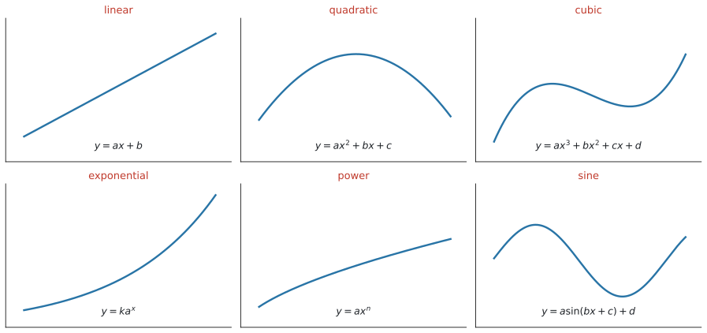
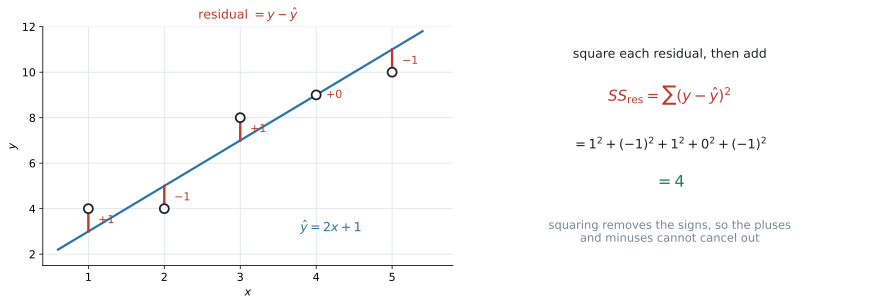
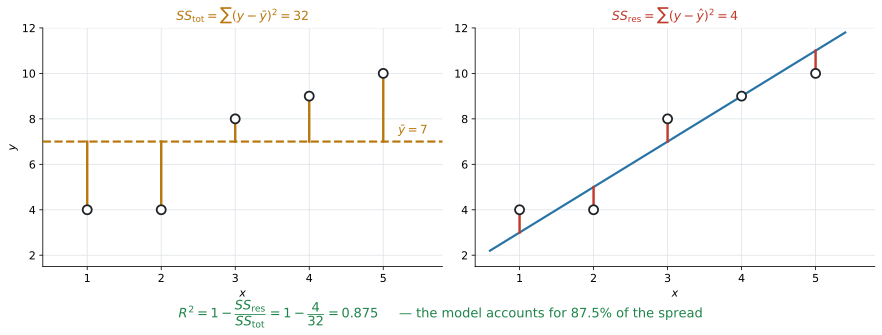
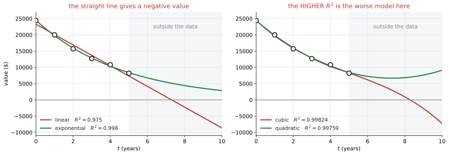

# AHL 4.13 — Non-linear regression（曲線の回帰） {#sec-ahl-4-13}

::: {.callout-note}
## What you should be able to do
- 散布図を見て、**linear・quadratic・cubic・exponential・power・sine** のどれを当てはめるかを選べる。
- 電卓で **regression curve**（回帰曲線）を求め、係数を式の形に書ける。
- **residual**（残差）$y - \hat{y}$ が何かを言い、**$SS_{\text{res}}$**（残差平方和）を手で出せる。
- 回帰曲線が **$SS_{\text{res}}$ を最小にする**曲線だと分かる。
- **coefficient of determination**（決定係数）$R^{2}$ を電卓で出し、**「$y$ のばらつきのうち、モデルで説明できた割合」**として文脈の中で説明できる。
- 線形モデルでは $R^{2} = r^{2}$ だと分かり、**$R^{2}$ だけでモデルを選んではいけない**理由を言える。
:::

::: {.callout-note}
## SL 2.5 と SL 4.4 の続きです
このページは、$2$ つのページの上に立っています。

| ページ | そこでやったこと | ここで足すこと |
|---|---|---|
| [SL 2.5](../../ai-sl/02-functions/sl-2-5.qmd#six-models) | モデルに使う関数の**形**（$6$ つ） | その形を、**データに当てはめる** |
| [SL 4.4](../../ai-sl/04-statistics-and-probability/sl-4-4.qmd) | データに**直線**を当てはめ、$r$ で測る | **曲線**も当てはめ、**$R^{2}$** で測る |

: このページの位置 {#tbl-ahl413-place}

つまり、**SL 4.4 で直線にしかできなかったことを、$6$ つの形すべてに広げる**項目です。曲線の式そのものは SL 2.5 で見たものばかりです（sine のモデルに $c$ が加わる点だけが新しく、**新しい種類の関数は出てきません**）。

なお、この項目にも公式集の欄はありません。式を覚えるより、**$R^{2}$ が何を表しているか**を言えるようにするほうが、そのまま点になります。
:::

::: {.callout-tip}
## 電卓を開きながら、このページを読んでください
シラバスは、この項目について $2$ 回「technology」と書いています。

> Evaluation of least squares regression curves **using technology**
>
> Evaluation of $R^{2}$ **using technology**

**手で回帰曲線を求める問題は出ません。** 電卓が係数と $R^{2}$ を出してくれます。

**問われるのは、その前後です。** どのモデルを選ぶか。出てきた数を、文脈の中でどう説明するか。そして、**その $R^{2}$ をどこまで信じてよいか。**
:::

## The idea

### 1. 直線で足りないときは、曲線を当てはめます {#idea}

[SL 4.4](../../ai-sl/04-statistics-and-probability/sl-4-4.qmd#regression) では、データに**直線**を当てはめました。

しかし、現実のデータは直線に並ぶとはかぎりません。

- 値段を上げていくと、利益は途中まで増えて、そのあと減る——**山の形**
- 車の価値は、毎年**一定の割合で**減る——**下がり方がだんだんゆるくなる形**
- $1$ 年の日照時間は、毎年同じように**くり返す**——**波の形**

こういうデータに直線を引いても、意味のある予測はできません。**同じ手順で、曲線を当てはめる**——それがこの項目です。

::: {.callout-note}
## やることの順番は、SL 4.4 と同じです
$1$. 散布図をかいて、**形を見る**

$2$. その形のモデルを選び、**電卓で係数を出す**

$3$. 係数の意味を、**文脈の中で言葉にする**

$4$. **当てはまり具合**を測る（SL 4.4 は $r$、ここは $R^{2}$）

変わるのは $2$ と $4$ だけです。
:::

### 2. 試験に出る $6$ つのモデル {#models}

シラバスが名指ししています。

> In examinations, questions may be asked on **linear, quadratic, cubic, exponential, power and sine** functions.

{#fig-ahl413-shapes width=100%}

形そのものは [SL 2.5](../../ai-sl/02-functions/sl-2-5.qmd#six-models) で見たものです。ここでは、**どれを選ぶか**と、**電卓のどのメニューを使うか**を並べておきます。

| モデル | 式 | 選ぶ目印 | 電卓のメニュー |
|---|---|---|---|
| **linear** | $y = ax + b$ | まっすぐ並んでいる | `Linear Regression (mx+b)` |
| **quadratic** | $y = ax^{2} + bx + c$ | **山が $1$ つ**、または谷が $1$ つ | `Quadratic Regression` |
| **cubic** | $y = ax^{3} + bx^{2} + cx + d$ | **S 字**になることがあり、quadratic より複雑に曲がる | `Cubic Regression` |
| **exponential** | $y = k a^{x}$ | 一定の**割合**で増える／減る | `Exponential Regression` |
| **power** | $y = a x^{n}$ | $x$ を一定倍すると、$y$ も一定の倍率で変わる | `Power Regression` |
| **sine** | $y = a\sin(bx + c) + d$ | **くり返す** | `Sinusoidal Regression` |

: $6$ つのモデルと、電卓のメニュー {#tbl-ahl413-models}

::: {.callout-important}
## 形を見るのは、散布図です。$R^{2}$ ではありません
モデルを選ぶ順番を取りちがえないでください。

$$
\text{散布図をかく} \ \to \ \text{形を選ぶ} \ \to \ \text{電卓で当てはめる} \ \to \ R^{2} \text{で測る}
$$

**$6$ つ全部を試して、$R^{2}$ がいちばん大きいものを選ぶ**——これは、この項目がいちばん避けたい進め方です（[第8節](#choosing)）。

まず**目で見て、文脈で考えて**ください。「毎年一定の割合で減る」と問題文にあれば、それは exponential です。

同じ割合を掛け続ける増え方は、[SL 1.3 の geometric sequence](../../ai-sl/01-number-and-algebra/sl-1-3.qmd) そのものです。$y = ka^{x}$ の $a$ が、公比にあたります。
:::

::: {.callout-note}
## power と exponential は、別のものです
どちらも曲がった増え方をしますが、**$x$ の場所が違います。**

$$
\underbrace{y = ax^{n}}_{\text{power：$x$ が}\textbf{底}} \qquad \text{と} \qquad \underbrace{y = ka^{x}}_{\text{exponential：$x$ が}\textbf{指数}}
$$

exponential は「**$1$ 増えるごとに $a$ 倍**」、power は「**$2$ 倍になると $2^{n}$ 倍**」です。@tbl-ahl413-models の power の目印は、この $2$ 行目のことを言っています。$x$ が何倍になったかで $y$ の倍率が決まり、**$x$ がどこから始まったかには関係しません。** 問題文が「毎年 $15\%$ 減る」と言えば exponential、「長さの平方根に比例する」と言えば power です。

（power は [SL 2.5 の direct / inverse variation](../../ai-sl/02-functions/sl-2-5.qmd#variation) と同じ形 $y = ax^{n}$ です。SL では $n$ が整数でしたが、この項目では $n$ が整数でなくても構いません。）
:::

### 3. residual — モデルと実際のずれ {#residual}

当てはまり具合を測るには、まず**ずれ**を数にします。

**residual**（残差）は、**実際の値 $-$ モデルの値**です。

$$
\text{residual} = y - \hat{y}
$$ {#eq-ahl413-residual}

$\hat{y}$（「$y$ ハット」）は、**モデルが予測する値**を表す記号です。

{#fig-ahl413-residuals width=100%}

@fig-ahl413-residuals の左を見てください。$5$ 個の点に、モデル $\hat{y} = 2x + 1$ を当てはめてあります。

| $x$ | $1$ | $2$ | $3$ | $4$ | $5$ |
|---|---|---|---|---|---|
| $y$（実際） | $4$ | $4$ | $8$ | $9$ | $10$ |
| $\hat{y}$（モデル） | $3$ | $5$ | $7$ | $9$ | $11$ |
| residual | $+1$ | $-1$ | $+1$ | $0$ | $-1$ |

: residual を出す {#tbl-ahl413-residual}

::: {.callout-warning}
## residual は「たて」のずれです
点から曲線への**いちばん近い距離**ではありません。**同じ $x$ のところで、上下にどれだけ離れているか**です。

@fig-ahl413-residuals の赤い線は、すべて**たて向き**に引いてあります。
:::

**モデルが上にあれば residual は負、下にあれば正**です。点がモデルの上下に散らばっていれば、正と負が混ざります。

### 4. $SS_{\text{res}}$ — ずれを $1$ つの数にまとめる {#ssres}

residual は点の数だけあります。これを **$1$ つの数**にまとめたのが **sum of square residuals**（残差平方和）です。

$$
SS_{\text{res}} = \sum (y - \hat{y})^{2}
$$ {#eq-ahl413-ssres}

@fig-ahl413-residuals の右のとおり、@tbl-ahl413-residual では

$$
SS_{\text{res}} = 1^{2} + (-1)^{2} + 1^{2} + 0^{2} + (-1)^{2} = 4
$$

::: {.callout-tip}
## なぜ、$2$ 乗するのか
そのまま足すと、**正のずれと負のずれが打ち消し合います。** @tbl-ahl413-residual では $1 + (-1) + 1 + 0 + (-1) = 0$ になり、ずれの大きさが消えてしまいました。打ち消し方は場合によりますが、**足し算のままでは「ずれの大きさ」を測れない**という点は変わりません。

$2$ 乗すれば、符号が消えます。**ずれが大きいほど $SS_{\text{res}}$ が大きくなる**、という性質だけが残ります。

$$
SS_{\text{res}} \text{が小さい} \quad \Longleftrightarrow \quad \text{モデルがデータに近い}
$$
:::

::: {.callout-warning}
## $SS_{\text{res}}$ の大きさだけでは、比べられません
$SS_{\text{res}} = 4$ は小さいでしょうか。**それだけでは決まりません。**

- $y$ の単位が円なら、$SS_{\text{res}}$ は「円$^{2}$」の桁になります。単位を変えれば数も変わります
- データの個数が増えれば、項が増えるので $SS_{\text{res}}$ も大きくなります

比べてよいのは、**同じデータに、別のモデルを当てはめたとき**だけです。そこが $SS_{\text{res}}$ の使いどころです。

**単位にもデータの数にも左右されない測り方**が、次の $R^{2}$ です。
:::

### 5. 回帰曲線は、$SS_{\text{res}}$ を最小にする曲線です {#least-squares}

シラバスの言葉は **least squares regression curves** です。「least squares」——**平方（square）の和が最小（least）**、つまり

**$SS_{\text{res}}$ がいちばん小さくなるように、係数を決める。** これが、電卓の中で起きていることです。

@tbl-ahl413-residual のデータに、電卓で直線を当てはめると

$$
\hat{y} = 1.7x + 1.9
$$

が出ます。この直線の $SS_{\text{res}}$ は **$3.1$** で、さっきの $\hat{y} = 2x+1$ の $4$ より小さくなっています。

::: {.callout-note}
## どんな直線を持ってきても、$3.1$ より小さくはなりません
それが「least squares」の意味です。**$y = 1.7x + 1.9$ は、この $5$ 点に対していちばん $SS_{\text{res}}$ が小さい直線**です。

同じことが、linear・quadratic・cubic について成り立ちます。`Quadratic Regression` を選べば、電卓は**$SS_{\text{res}}$ が最小になる放物線**を返します。

（exponential と power では、電卓は**両辺の $\log$ を取って直線に直してから**最小にしています。そのため、$y$ そのものの $SS_{\text{res}}$ が厳密に最小とはかぎりません。試験でこの違いを問われることはありません。）
:::

### 6. $R^{2}$ は「説明できた割合」です {#r2}

$SS_{\text{res}}$ は、単位にもデータの数にも左右されました。そこで、**$y$ のばらつき全体と比べます。**

まず、モデルを使わずに $y$ のばらつきを測ります。**全部の点が $\bar{y}$ からどれだけ離れているか**です。これを **total sum of squares**（総平方和）$SS_{\text{tot}}$ と書きます。

$$
SS_{\text{tot}} = \sum (y - \bar{y})^{2}
$$ {#eq-ahl413-sstot}

{#fig-ahl413-r2 width=100%}

@fig-ahl413-r2 の左が $SS_{\text{tot}} = 32$、右が $SS_{\text{res}} = 4$ です。

**$SS_{\text{tot}}$ が「ばらつきの全部」、$SS_{\text{res}}$ が「モデルでは説明できずに残ったぶん」**です。ですから、割合で見ると

$$
R^{2} = 1 - \frac{SS_{\text{res}}}{SS_{\text{tot}}}
$$ {#eq-ahl413-r2}

@fig-ahl413-r2 の数を入れると

$$
R^{2} = 1 - \frac{4}{32} = 0.875
$$

シラバスの言い方は、こうです。

> $R^{2}$ gives the **proportion of variability in the second variable accounted for by the chosen model**.

::: {.callout-important}
## 答案では、この一文の形で書いてください
$R^{2} = 0.875$ を、数のまま書いても点になりません。**文脈に戻して**ください。

::: {.model-answer}
**試験ではこう書く**

*$R^{2} = 0.875$, so the model accounts for $87.5\%$ of the variability in $y$.*
:::

（このモデルは、$y$ のばらつきの $87.5\%$ を説明している、という意味です。）

$y$ が「利益」なら *variability in the profit*、「日照時間」なら *variability in the number of hours of daylight* と、**その問題の言葉に置きかえます。**
:::

::: {.callout-note}
## $R^{2}$ は $0$ 以上 $1$ 以下です
電卓に**当てはめさせた**モデル（回帰直線・回帰曲線）についての話です。問題文で与えられただけのモデルなら、$R^{2}$ が負になることもあります。

- $R^{2} = 1$ … $SS_{\text{res}} = 0$。**全部の点が曲線の上にある**
- $R^{2}$ が $0$ に近い … モデルを使っても、$\bar{y}$ と言うのとほとんど変わらない

割合なので、$0.875$ は $87.5\%$ と読み替えられます。**パーセントで書くと、意味が伝わりやすくなります。**
:::

::: {.callout-warning}
## $R^{2} = 1 - \dfrac{SS_{\text{res}}}{SS_{\text{tot}}}$ は、計算させられません
シラバスに、はっきりこう書かれています。

> Awareness that $R^{2} = 1 - \dfrac{SS_{\text{res}}}{SS_{\text{tot}}}$ and hence $=1$ if $SS_{\text{res}} = 0$, **may enhance understanding but will not be examined**.

**この式そのものは試験に出ません。** 出るのは、電卓が返した $R^{2}$ を**読んで、文脈で説明すること**です。

ただ、意味を知っておくと $R^{2}$ の説明が書きやすくなります。だからここに置いてあります。

**このページの @exm-ahl413-ssres (b) と演習2・演習8で、この式を使って計算させています。** それは仕組みを分かってもらうためで、**試験でこの形で問われることはありません。**
:::

### 7. 線形モデルでは、$R^{2} = r^{2}$ です {#r2-r}

シラバスが名指ししている関係です。

> The connection between the coefficient of determination and the **Pearson's product moment correlation coefficient** for linear models.

[SL 4.4](../../ai-sl/04-statistics-and-probability/sl-4-4.qmd#pearson-r) の $r$ を $2$ 乗すると、$R^{2}$ になります。

$$
R^{2} = r^{2} \qquad (\text{linear model のときだけ})
$$ {#eq-ahl413-r2r}

@tbl-ahl413-residual のデータに、電卓で**回帰直線**を当てはめると $r = 0.950$ です。

$$
r^{2} = 0.950^{2} \approx 0.903
$$

これは、その回帰直線 $\hat{y} = 1.7x + 1.9$ の $R^{2}$（[第5節](#least-squares)の $SS_{\text{res}} = 3.1$ から $1 - \frac{3.1}{32} = 0.903$）と一致します ✓

**第6節の $0.875$ とは別の数です。** あちらは $\hat{y} = 2x+1$ という、回帰直線ではないモデルの $R^{2}$ でした。$R^{2} = r^{2}$ が成り立つのは、**回帰直線**についてです。

::: {.callout-warning}
## $r$ には符号があり、$R^{2}$ にはありません
これが、$2$ つの大きな違いです。

| | 値の範囲 | 分かること |
|---|---|---|
| **$r$** | $-1 \le r \le 1$ | 強さ**と向き**（正の相関か、負の相関か） |
| **$R^{2}$** | $0 \le R^{2} \le 1$ | 説明できた**割合**だけ |

: $r$ と $R^{2}$ {#tbl-ahl413-r-r2}

$R^{2} = 0.81$ から $r$ を出そうとすると、$r = 0.9$ か $r = -0.9$ かが**決まりません。** 向きは、散布図か傾きの符号を見て決めます。

そして、**$R^{2} = r^{2}$ が使えるのは linear model のときだけ**です。quadratic や sine のモデルに $r$ はありません。
:::

### 8. $R^{2}$ だけでモデルを選んではいけません {#choosing}

この項目でいちばん大事な注意です。シラバスが、わざわざ $1$ 行を使って書いています。

> Awareness that many factors affect the validity of a model and **the coefficient of determination, by itself, is not a good way to decide between different models**.

理由は $2$ つあります。

#### 理由1 — 現実にありえない予測をすることがある {#nonsense}

{#fig-ahl413-compare width=100%}

@fig-ahl413-compare の左は、中古車の価値を $6$ 年ぶん記録したデータです。直線を当てはめると $R^{2} = 0.975$——**十分に高い値**です。

ところが、この直線で $8$ 年後を予測すると

$$
V = -2240 \ \text{ドル}
$$

**価値が負になります。** データの範囲では合っていても、外へ出た瞬間に意味を失います（[SL 4.4 の extrapolation](../../ai-sl/04-statistics-and-probability/sl-4-4.qmd#extrapolation)）。

exponential なら $R^{2} = 0.998$ で、しかも**どこまでいっても正**です。文脈に合っているのは、こちらです。

#### 理由2 — 係数を増やせば、$R^{2}$ はいくらでも上げられる {#more-terms}

@fig-ahl413-compare の右は、同じデータに **quadratic と cubic** を当てはめて並べたものです。

| モデル | 係数の数 | $R^{2}$ | $10$ 年後の予測 |
|---|---|---|---|
| quadratic | $3$ 個 | $0.99759$ | $9100$ ドル |
| **cubic** | $4$ 個 | **$0.99824$** | $-7260$ ドル |

: $R^{2}$ が大きいほうが、よいとはかぎらない {#tbl-ahl413-compare}

**cubic のほうが $R^{2}$ は大きい**のに、$10$ 年後に負の値を出します。**係数が $4$ 個あるぶん、$6$ 個の点に寄り添えている**だけです。差は $0.99759 \to 0.99824$、**$0.001$ 未満**。この差で cubic を選ぶ理由にはなりません。

**とはいえ、quadratic もよいモデルではありません。** @fig-ahl413-compare の右をよく見ると、緑の曲線は $t = 7$ あたりから**上を向いて**います。中古車の価値が $7$ 年目から上がることはありません。$R^{2}$ はどちらも $0.997$ を超えているのに、**どちらも文脈に合っていない**——これが、この節の言いたいことです。合っているのは、[理由1](#nonsense)の exponential のほうでした。

::: {.callout-important}
## モデルを選ぶときに見るもの
$R^{2}$ は、**判断材料の $1$ つ**にすぎません。いっしょに見るのは、次の $3$ つです。

$1$. **散布図の形と合っているか。** 曲線が点の並びをなぞっているか、目で見てください。

$2$. **文脈に合っているか。** 価値は負にならない。人数は整数。日照時間はくり返す——**その量の性質**に、モデルが従っているか。

$3$. **データの外でも、まともな値を出すか。** 予測に使うなら、ここが効きます。

答案では、**$R^{2}$ の値と、この $3$ つのどれか**を組み合わせて書いてください。「$R^{2}$ が大きいから」だけでは、この項目の問いに答えたことになりません。
:::

## Why it works

:::: {.callout-note collapse="true" appearance="simple"}
## クリックすると開きます
ここで説明するのは $2$ つです。**$R^{2}$ の式がなぜあの形なのか**と、**なぜ係数を増やすと $R^{2}$ が下がらないのか**。

どちらも試験には出ません（[第6節](#r2)）。ただ、[第8節](#choosing)の注意が「なぜそうなるのか」は、ここを読むと分かります。

### $R^{2}$ の式の形 {#why-r2}

$SS_{\text{tot}}$ は、**モデルを使わなかったとき**のずれです。何も分からなければ、どの $x$ に対しても「たぶん $\bar{y}$ くらい」と答えるしかありません。そのときの $SS_{\text{res}}$ が、ちょうど $SS_{\text{tot}}$ です。

$$
\hat{y} = \bar{y} \ \text{という「モデル」の} \ SS_{\text{res}} \ = \ \sum (y - \bar{y})^{2} = SS_{\text{tot}}
$$

ですから

$$
\frac{SS_{\text{res}}}{SS_{\text{tot}}} = \frac{\text{モデルを使っても残ったずれ}}{\text{何もしなかったときのずれ}}
$$

これは「**説明できなかった割合**」です。$1$ から引けば「**説明できた割合**」になります。それが @eq-ahl413-r2 の形でした。

- $SS_{\text{res}} = 0$ なら $R^{2} = 1$。**全部の点が曲線の上**
- $SS_{\text{res}} = SS_{\text{tot}}$ なら $R^{2} = 0$。**$\bar{y}$ と言うのと変わらない**

### なぜ、係数を増やすと $R^{2}$ が下がらないのか {#why-more}

[第8節](#more-terms)で、cubic のほうが quadratic より $R^{2}$ が大きくなりました。偶然ではありません。

quadratic の式 $y = ax^{2} + bx + c$ で、$a = 0$ とすれば $y = bx + c$——**直線になります。** つまり、

**quadratic で選べる曲線の中に、直線が全部入っています。**

電卓は $SS_{\text{res}}$ が最小になるものを選ぶので、**quadratic の $SS_{\text{res}}$ が、linear の $SS_{\text{res}}$ より大きくなることはありません。** 同じように、cubic は quadratic を含みます。

$$
SS_{\text{res}}(\text{linear}) \ \ge \ SS_{\text{res}}(\text{quadratic}) \ \ge \ SS_{\text{res}}(\text{cubic})
$$

$SS_{\text{tot}}$ は同じデータなら変わらないので、$R^{2}$ は**下がることがありません**。

::: {.callout-note appearance="simple"}
点が $n$ 個あれば、係数を $n$ 個もつ多項式で**全部の点をぴったり通せます**。そのとき $R^{2} = 1$ です。しかし、それは「モデルが正しい」のではなく「点を丸暗記した」だけです。

**$R^{2}$ は係数を増やすだけで上げられるので、$R^{2}$ が高いことは、よいモデルであることの証明になりません**——これが[第8節](#choosing)の中身です。
:::
::::

## Worked examples

::: {.callout-note appearance="simple"}
問題文は英語です。意味が理解できなかったら、問題文の下の「**日本語訳**」を開いてください。解説は日本語です。
:::

::: {#exm-ahl413-ssres}
[The table shows five data points.]{.q-en}

| $x$ | $1$ | $2$ | $3$ | $4$ | $5$ |
|---|---|---|---|---|---|
| $y$ | $4$ | $4$ | $8$ | $9$ | $10$ |

: Five data points {#tbl-ahl413-we1}

[A student proposes the model $\hat{y} = 2x + 1$.]{.q-en}

**(a)** [Find the residual for each point, and hence find $SS_{\text{res}}$ for this model.]{.q-en}

**(b)** [Given that $SS_{\text{tot}} = 32$, find $R^{2}$ for this model.]{.q-en}

**(c)** [Use technology to find the equation of the regression line of $y$ on $x$, and its value of $SS_{\text{res}}$.]{.q-en}

**(d)** [Explain why the value in part (c) is smaller than the value in part (a).]{.q-en}

<details class="jp-trans">
<summary>日本語訳</summary>

表は $5$ 個のデータの組を示しています。

ある生徒が、モデル $\hat{y} = 2x + 1$ を提案しました。

**(a)** 各点の残差を求め、それを使ってこのモデルの $SS_{\text{res}}$ を求めなさい。

**(b)** $SS_{\text{tot}} = 32$ であるとき、このモデルの $R^{2}$ を求めなさい。

**(c)** 電卓を使って、$y$ の $x$ への回帰直線の式と、その $SS_{\text{res}}$ を求めなさい。

**(d)** (c) の値が (a) の値より小さくなる理由を説明しなさい。

</details>

---

**(a)** まずモデルの値 $\hat{y}$ を出し、実際の $y$ から引きます（@eq-ahl413-residual）。

| $x$ | $1$ | $2$ | $3$ | $4$ | $5$ |
|---|---|---|---|---|---|
| $y$ | $4$ | $4$ | $8$ | $9$ | $10$ |
| $\hat{y} = 2x+1$ | $3$ | $5$ | $7$ | $9$ | $11$ |
| $y - \hat{y}$ | $+1$ | $-1$ | $+1$ | $0$ | $-1$ |

: residual の計算 {#tbl-ahl413-we1a}

$$
SS_{\text{res}} = 1^{2} + (-1)^{2} + 1^{2} + 0^{2} + (-1)^{2} = 4
$$

**検算。** $\hat{y}$ に residual を足すと、もとの $y$ にもどります（$3+1=4$、$5-1=4$、…）。ここがずれていたら、引き算のどこかが誤りです。

**(b)** @eq-ahl413-r2 に入れるだけです。

$$
R^{2} = 1 - \frac{4}{32} = 1 - 0.125 = 0.875
$$

**(c)** 電卓に $x$ と $y$ を入れて `Linear Regression (mx+b)` を走らせます（[GDC 第1節](#gdc-linear)）。

$$
\hat{y} = 1.7x + 1.9
$$

この直線で residual を出し直すと $SS_{\text{res}} = 3.1$ になります。

**(d)** `Explain why` なので、**言葉で理由を書きます。**

::: {.model-answer}
**試験ではこう書く**

*The regression line is the least squares line: its coefficients are chosen so that $SS_{\text{res}}$ is as small as possible. No other straight line can give a smaller value, so $3.1$ must be less than the $4$ obtained from $\hat{y} = 2x + 1$.*
:::

（回帰直線は $SS_{\text{res}}$ を最小にするように係数が決められているので、ほかのどんな直線よりも小さくなる、という意味です。）

::: {.callout-note}
## 解答例（答案用紙にはこう書く）
**(a)** *Residuals: $1$, $-1$, $1$, $0$, $-1$.*

$$
SS_{\text{res}} = 1 + 1 + 1 + 0 + 1 = 4
$$

**(b)**
$$
R^{2} = 1 - \frac{4}{32} = 0.875
$$

**(c)** $\hat{y} = 1.7x + 1.9$, $SS_{\text{res}} = 3.1$

**(d)** *The regression line minimises $SS_{\text{res}}$, so no other straight line can give a smaller value than it.*
:::

::: {.callout-tip}
## この例題で、$R^{2} = r^{2}$ も確かめられます
(c) の直線について電卓が返す $r$ は $0.950$ です。

$$
r^{2} = 0.950^{2} = 0.903
$$

そして (c) の直線の $R^{2}$ も、$1 - \dfrac{3.1}{32} = 0.903$ です ✓（[第7節](#r2-r)）

**(b) の $0.875$ とは違う値**であることに注意してください。$0.875$ は生徒のモデル $\hat{y} = 2x+1$ のもの、$0.903$ は回帰直線のものです。
:::
:::

::: {#exm-ahl413-quad}
[A shop records its daily profit $P$, in dollars, for six different selling prices $x$, in dollars.]{.q-en}

| $x$ | $2$ | $4$ | $6$ | $8$ | $10$ | $12$ |
|---|---|---|---|---|---|---|
| $P$ | $78$ | $150$ | $199$ | $191$ | $160$ | $72$ |

: Selling price and daily profit {#tbl-ahl413-we2}

**(a)** [Explain why a linear model is not appropriate for this data.]{.q-en}

**(b)** [Use technology to find the quadratic regression model for $P$ in terms of $x$, giving the coefficients correct to three significant figures.]{.q-en}

**(c)** [Write down the value of $R^{2}$ and interpret it in context.]{.q-en}

**(d)** [Use your model to find the selling price that gives the greatest profit.]{.q-en}

<details class="jp-trans">
<summary>日本語訳</summary>

ある店が、$6$ 通りの販売価格 $x$（ドル）について、$1$ 日の利益 $P$（ドル）を記録しました。

**(a)** このデータに線形モデルが適さない理由を説明しなさい。

**(b)** 電卓を使って、$P$ を $x$ で表す二次の回帰モデルを求めなさい。係数は有効数字 $3$ 桁で書きなさい。

**(c)** $R^{2}$ の値を書き、文脈の中で説明しなさい。

**(d)** このモデルを使って、利益が最大になる販売価格を求めなさい。

</details>

---

**(a)** 散布図をかくと、**真ん中が高い山の形**になります。値段を上げると、はじめは利益が増えますが、途中から客が減って利益も減るからです。

直線を当てはめても、この山をなぞれません。実際、直線の $R^{2}$ は $0.0000608$——**ほとんど $0$** です。

::: {.model-answer}
**試験ではこう書く**

*The profit increases and then decreases, so the points lie on a curve with a single maximum rather than on a straight line. A linear model would not follow this shape.*
:::

（利益が増えてから減るので、点は山が $1$ つの曲線の上に並んでいて、直線にはならない、という意味です。）

**(b)** `Quadratic Regression` を走らせます（[GDC 第2節](#gdc-curve)）。

$$
P = -5.00x^{2} + 69.9x - 44.2
$$

**検算。** $a$ が負なので、上に凸の山の形です ✓ (a) で見た散布図と合っています。

**(c)** 電卓が $R^{2} = 0.993$ を返します。

::: {.model-answer}
**試験ではこう書く**

*$R^{2} = 0.993$, so the quadratic model accounts for $99.3\%$ of the variability in the daily profit.*
:::

（このモデルが $1$ 日の利益のばらつきの $99.3\%$ を説明している、という意味です。**「利益」という言葉を必ず入れてください。**）

**(d)** 山の頂点を求めます。電卓のグラフで `Maximum` を読んでも、頂点の公式を使っても構いません（[SL 2.4](../../ai-sl/02-functions/sl-2-4.qmd)）。

$$
x = -\frac{69.9}{2 \times (-5.00)} = 6.99
$$

$$
P(6.99) = 200
$$

**約 $7$ ドルのとき、利益は約 $200$ ドル**で最大になります。

::: {.callout-note}
## 解答例（答案用紙にはこう書く）
**(a)** *The profit rises and then falls, so the data has a single maximum and does not lie on a straight line.*

**(b)**
$$
P = -5.00x^{2} + 69.9x - 44.2
$$

**(c)** *$R^{2} = 0.993$: the model accounts for $99.3\%$ of the variability in the daily profit.*

**(d)**
$$
x = 6.99 \quad \Rightarrow \quad P = 200
$$

*The greatest profit, about $200$ dollars, occurs at a selling price of about $7$ dollars.*
:::

::: {.callout-warning}
## (d) は「価格」を聞かれています
`the selling price that gives the greatest profit` なので、答えは **$x = 6.99$**（ドル）です。

$P = 200$ だけを書くと、**聞かれたものと違うもの**を答えたことになります。両方書いておくのが確実です。
:::
:::

::: {#exm-ahl413-compare}
[The value $V$, in dollars, of a car is recorded each year for six years. The age of the car is $t$ years.]{.q-en}

| $t$ | $0$ | $1$ | $2$ | $3$ | $4$ | $5$ |
|---|---|---|---|---|---|---|
| $V$ | $24\,400$ | $20\,000$ | $15\,700$ | $12\,700$ | $10\,800$ | $8200$ |

: Age and value of a car {#tbl-ahl413-we3}

**(a)** [Find the linear regression model for $V$ in terms of $t$, and write down its value of $R^{2}$.]{.q-en}

**(b)** [Find the exponential regression model for $V$ in terms of $t$, and write down its value of $R^{2}$.]{.q-en}

**(c)** [Use each model to predict the value of the car when $t = 8$. Comment on your answers.]{.q-en}

**(d)** [A student fits a cubic model and finds $R^{2} = 0.99824$, which is greater than the value in part (b). Explain why this does not show that the cubic model is better.]{.q-en}

<details class="jp-trans">
<summary>日本語訳</summary>

ある車の価値 $V$（ドル）を、$6$ 年間、毎年記録しました。車の年数は $t$ 年です。

**(a)** $V$ を $t$ で表す線形の回帰モデルを求め、その $R^{2}$ の値を書きなさい。

**(b)** $V$ を $t$ で表す指数の回帰モデルを求め、その $R^{2}$ の値を書きなさい。

**(c)** それぞれのモデルを使って、$t = 8$ のときの車の価値を予測しなさい。その答えについて述べなさい。

**(d)** ある生徒が三次のモデルを当てはめたところ、$R^{2} = 0.99824$ となり、(b) の値より大きくなりました。これによって三次のモデルのほうがよいとは言えない理由を説明しなさい。

</details>

---

**(a)** `Linear Regression (mx+b)` を走らせます。

$$
V = -3190t + 23300, \qquad R^{2} = 0.975
$$

**(b)** `Exponential Regression` を走らせます。

$$
V = 24500(0.807)^{t}, \qquad R^{2} = 0.998
$$

**検算。** $0.807$ は $1$ より小さいので、減っていく形です ✓ 毎年およそ $19\%$ ずつ減る、という意味になります。

::: {.callout-note appearance="simple"}
**exponential と power では、電卓が表示する $R^{2}$ の桁が、ここと少し違うことがあります。** 多くの機種は、両辺の $\log$ を取って**直線に直してから** $R^{2}$ を計算するからです。ここに書いた $0.998$ は、シラバスの言い方どおり「**$V$ のばらつき**のうち説明できた割合」として計算した値です。

答案には、**自分の電卓が表示した値**を書いてください。どちらの出し方でも linear の $0.975$ より大きく、(c) の結論は変わりません。
:::

**(c)** $t = 8$ を、それぞれに入れます。

| モデル | $t = 8$ の予測 |
|---|---|
| linear | $-2240$ ドル |
| exponential | $4400$ ドル |

: $8$ 年後の予測 {#tbl-ahl413-we3c}

::: {.callout-warning appearance="simple"}
**代入するときは、電卓に入っている丸める前の係数を使ってください。** (a) で書いた $-3190$ と $23300$ をそのまま使うと $-2220$ になり、$3$ 桁目が変わります。答案には $3$ 桁で書き、計算は電卓の値で——これは AI 全体の作法です。
:::

`Comment on` と言われているので、**この $2$ つを比べて、意味を書きます。**

::: {.model-answer}
**試験ではこう書く**

*The linear model predicts a value of $-2240$ dollars, which is impossible because a car cannot have a negative value. The exponential model predicts $4400$ dollars, which is sensible. The exponential model also has the larger $R^{2}$, so it is the better model for this data.*
:::

（直線は負の値を出すのでありえない、指数のほうは妥当な値で、$R^{2}$ も大きい、という意味です。）

**(d)** `Explain why` です。[第8節](#more-terms)の内容を、この場面の言葉で書きます。

::: {.model-answer}
**試験ではこう書く**

*A cubic model has four coefficients, while the exponential model has two, so the cubic can be adjusted to pass closer to only six data points. A larger $R^{2}$ obtained in this way does not show that the model is better. The cubic predicts a negative value a few years later, which is impossible for the value of a car, so the exponential model fits the context better.*
:::

（係数が $4$ 個あるので $6$ 個の点に寄り添えるだけで、しかも数年先で負の値を出すからありえない、という意味です。）

::: {.callout-note}
## 解答例（答案用紙にはこう書く）
**(a)** $V = -3190t + 23300$, $R^{2} = 0.975$

**(b)** $V = 24500(0.807)^{t}$, $R^{2} = 0.998$

**(c)**
$$
\text{linear: } V(8) = -2240, \qquad \text{exponential: } V(8) = 4400
$$

*The linear model gives a negative value, which is impossible, so the exponential model is the better one.*

**(d)** *The cubic has four coefficients against two, so it can be made to pass closer to six points. A larger $R^{2}$ alone does not make it a better model, and it predicts a negative value soon after the data ends.*
:::

::: {.callout-warning}
## $R^{2} = 0.975$ を「悪い」と書かない
(a) の $0.975$ は、**それ自体は高い値**です。直線がまずいのは、$R^{2}$ が低いからではなく、**データの外で意味を失うから**です（[第8節](#nonsense)）。

`Comment on` の答案では、**その理由を書いてください。** 「$R^{2}$ が小さいから」は、この問題では正しくありません。
:::
:::

::: {#exm-ahl413-sine}
[The table shows the number of hours of daylight $D$ on the 15th day of each month $m$ in a certain city, where $m = 1$ is January.]{.q-en}

| $m$ | $1$ | $2$ | $3$ | $4$ | $5$ | $6$ | $7$ | $8$ | $9$ | $10$ | $11$ | $12$ |
|---|---|---|---|---|---|---|---|---|---|---|---|---|
| $D$ | $9.1$ | $10.2$ | $11.9$ | $13.7$ | $15.2$ | $15.9$ | $15.4$ | $14.0$ | $12.2$ | $10.5$ | $9.3$ | $8.8$ |

: Hours of daylight {#tbl-ahl413-we4}

**(a)** [Explain why a sine model is appropriate for this data.]{.q-en}

**(b)** [Use technology to find the sinusoidal regression model, giving the coefficients correct to three significant figures.]{.q-en}

**(c)** [Find the period of your model, and comment on its value.]{.q-en}

**(d)** [Write down the value of $R^{2}$ and interpret it in context.]{.q-en}

<details class="jp-trans">
<summary>日本語訳</summary>

表は、ある都市の各月 $m$ の $15$ 日における日照時間 $D$（時間）を示しています。$m = 1$ が $1$ 月です。

**(a)** このデータに正弦のモデルが適している理由を説明しなさい。

**(b)** 電卓を使って正弦の回帰モデルを求めなさい。係数は有効数字 $3$ 桁で書きなさい。

**(c)** モデルの周期を求め、その値について述べなさい。

**(d)** $R^{2}$ の値を書き、文脈の中で説明しなさい。

</details>

---

**(a)** 日照時間は、**毎年同じように増えて減ります。** くり返す量なので、sine のモデルが合います（[SL 2.5](../../ai-sl/02-functions/sl-2-5.qmd#sinusoidal)）。

::: {.model-answer}
**試験ではこう書く**

*The number of hours of daylight increases to a maximum and then decreases, repeating in the same way every year, so a periodic model such as a sine function is appropriate.*
:::

（毎年同じようにくり返すので、周期的なモデルが適している、という意味です。）

**(b)** `Sinusoidal Regression` を走らせます（[GDC 第2節](#gdc-curve)）。

$$
D = 3.47\sin(0.547m - 1.76) + 12.3
$$

**検算。** 電卓に入れる前に、$a$ と $d$ を見積もっておくと安心です。

$$
a \approx \frac{15.9 - 8.8}{2} = 3.55, \qquad d \approx \frac{15.9 + 8.8}{2} = 12.35
$$

出てきた $3.47$ と $12.3$ に近い値です ✓

**(c)** 周期は $\dfrac{2\pi}{b}$ です。[SL 2.5](../../ai-sl/02-functions/sl-2-5.qmd#sinusoidal) では Degree で考えたので $\dfrac{360}{b}$ でした。**同じ式の、角の単位ちがい**です。ここでは電卓が radian で $b$ を返すので、$2\pi$ を使います。

$$
\text{period} = \frac{2\pi}{0.547} = 11.5
$$

`comment on` なので、**この数の意味を書きます。**

::: {.model-answer}
**試験ではこう書く**

*The period is $11.5$ months, which is close to $12$. This is what we expect, because the pattern of daylight repeats once every year.*
:::

（周期が $11.5$ か月で $12$ に近く、$1$ 年でくり返すという事実と合っている、という意味です。）

**(d)** 電卓が $R^{2} = 0.999$ を返します。

::: {.model-answer}
**試験ではこう書く**

*$R^{2} = 0.999$, so the model accounts for $99.9\%$ of the variability in the number of hours of daylight.*
:::

::: {.callout-note}
## 解答例（答案用紙にはこう書く）
**(a)** *The data repeats in the same way each year, so a periodic (sine) model is appropriate.*

**(b)**
$$
D = 3.47\sin(0.547m - 1.76) + 12.3
$$

**(c)**
$$
\text{period} = \frac{2\pi}{0.547} = 11.5 \ \text{months}
$$

*This is close to $12$, as expected for a yearly cycle.*

**(d)** *$R^{2} = 0.999$: the model accounts for $99.9\%$ of the variability in the hours of daylight.*
:::

::: {.callout-warning}
## 電卓は Radian にしてください
`Sinusoidal Regression` の $b$ と $c$ は、**radian で返ってきます。** 設定が Degree のままだと、周期を出すときに $\dfrac{2\pi}{b}$ が使えません。

```
ctrl + doc → Document Settings → Angle: Radian
```

**周期が $11.5$ ではなく $0.2$ のような小さい値になったら、設定を疑ってください。** Degree のままだと $b$ が $31.4$ 前後の大きな値で返るので、$\dfrac{2\pi}{b}$ がとても小さくなります。
:::
:::

## Common errors

::: {.callout-warning}
## $R^{2}$ がいちばん大きいモデルを、そのまま選ぶ
**この項目でいちばん大きな失点です。** シラバスが名指しで注意しています（[第8節](#choosing)）。

$R^{2}$ は判断材料の $1$ つです。**散布図の形・文脈・データの外での値**もいっしょに見てください。
:::

::: {.callout-warning}
## 係数の数を考えずに $R^{2}$ を比べる
cubic は quadratic を、quadratic は linear を含みます。**次数を上げても、$R^{2}$ が下がることはありません**（[Why it works](#why-more)）。

「cubic のほうが $R^{2}$ が大きいから cubic」は、理由になっていません。
:::

::: {.callout-warning}
## $R^{2}$ を数のまま書いて終わる
`interpret` や `comment on` が付いていたら、**「$y$ のばらつきの $\square\%$ を説明している」の形**で、$y$ をその問題の言葉に置きかえて書きます（[第6節](#r2)）。

「$R^{2}$ が高いのでよいモデルです」は、解釈になっていません。
:::

::: {.callout-warning}
## $R^{2}$ を「相関の強さ」と書く
$R^{2}$ は**説明できた割合**です。相関の強さと向きを表すのは $r$ のほうです（@tbl-ahl413-r-r2）。

そして $r$ が使えるのは **linear model のときだけ**です。
:::

::: {.callout-warning}
## $R^{2}$ から $r$ を出すときに、符号を忘れる
$R^{2} = 0.81$ なら $r = 0.9$ **または** $r = -0.9$ です。**$R^{2}$ からは向きが決まりません**（[第7節](#r2-r)）。

散布図か、回帰直線の傾きの符号を見て決めてください。
:::

::: {.callout-warning}
## residual を、点から曲線までの最短距離にする
residual は**たて向き**のずれ $y - \hat{y}$ です（[第3節](#residual)）。斜めに測るのではありません。
:::

::: {.callout-warning}
## residual をそのまま足して、それを $SS_{\text{res}}$ にしてしまう
正と負が打ち消し合ってしまいます。だから **$2$ 乗してから足します**（[第4節](#ssres)）。
:::

::: {.callout-warning}
## $SS_{\text{res}}$ を、別のデータどうしで比べる
$SS_{\text{res}}$ は**単位とデータの個数に左右されます**。比べてよいのは、**同じデータに別のモデルを当てはめたとき**だけです（[第4節](#ssres)）。

データが違うものどうしを比べるなら、$R^{2}$ を使ってください。
:::

::: {.callout-warning}
## power と exponential を取りちがえる
$y = ax^{n}$ が power、$y = ka^{x}$ が exponential です。**$x$ が底か指数か**で見分けます（[第2節](#models)）。

問題文の「毎年 $\square\%$ ずつ」は exponential、「$\square$ に比例する」は power の合図です。
:::

::: {.callout-warning}
## sinusoidal regression を Degree のまま走らせる
$b$ と $c$ が radian で返るので、周期 $\dfrac{2\pi}{b}$ が合わなくなります。**Radian に設定してから**走らせてください。
:::

::: {.callout-warning}
## データの範囲の外まで、そのまま予測する
$R^{2}$ が高くても、**extrapolation の危険は消えません**（[SL 4.4](../../ai-sl/04-statistics-and-probability/sl-4-4.qmd#extrapolation)）。

@exm-ahl413-compare のように、外へ出た瞬間に意味を失うモデルがあります。
:::

## Using your GDC (TI-Nspire CX II)

この項目は、**電卓が主役**です。手順は SL 4.4 とほとんど同じで、選ぶメニューが増えるだけです。

### 1. データを入れて、直線を当てはめる {#gdc-linear}

[SL 4.4](../../ai-sl/04-statistics-and-probability/sl-4-4.qmd#gdc-regression) と同じです。Lists & Spreadsheet に $2$ 列を作り、名前を付けます。

```
menu → Statistics → Stat Calculations → Linear Regression (mx+b)
```

`X List` と `Y List` を指定して `OK`。`m`、`b`、`r`、`r²` が返ります。

::: {.callout-note}
## `r²` が、この項目の $R^{2}$ です
SL 4.4 では読まなかった行です。**linear model では $R^{2} = r^{2}$** なので、同じものです（[第7節](#r2-r)）。
:::

### 2. 曲線を当てはめる {#gdc-curve}

同じメニューの下に、$6$ つのモデルが並んでいます。

```
menu → Statistics → Stat Calculations → Quadratic Regression
                                      → Cubic Regression
                                      → Exponential Regression
                                      → Power Regression
                                      → Sinusoidal Regression
```

入れるものは linear と同じ（`X List` と `Y List`）です。返ってくる係数の名前だけが変わります。

**文字は、電卓に合わせてください。** [第2節](#models)では exponential を $y = ka^{x}$、power を $y = ax^{n}$ と書きましたが、電卓はどちらも `a` と `b` で返します。**中身は同じ**です。

| モデル | 返る係数 | 書き直す式 |
|---|---|---|
| Quadratic | `a`, `b`, `c` | $y = ax^{2} + bx + c$ |
| Cubic | `a`, `b`, `c`, `d` | $y = ax^{3} + bx^{2} + cx + d$ |
| Exponential | `a`, `b` | $y = a b^{x}$ |
| Power | `a`, `b` | $y = a x^{b}$ |
| Sinusoidal | `a`, `b`, `c`, `d` | $y = a\sin(bx + c) + d$ |

: 電卓の係数と、答案に書く式 {#tbl-ahl413-gdc}

:::: {.callout-warning}
## 画面に出ている値を、そのまま写してください
返る値が `R²` と出るか `r²` と出るかは、**選んだモデルによって変わります。** どちらでも、答案には $R^{2}$ と書いて構いません。

**試験でやることは $1$ つです。画面に出た値を、丸めずに書き写す。** これで答えは合います。

::: {.callout-note appearance="simple"}
**ここから先は、意味のほうの話です。**

多項式のモデルでは、この値は「**$y$ のばらつきのうち、モデルで説明できた割合**」です。[第6節](#r2)で見たとおりの意味で、シラバスの言い方もこれです。

**exponential と power は、事情が違います。** 機種によっては、両辺の $\log$ を取って直線に直したあとの値が表示されます。それは「**$\log y$ のばらつきのうち説明できた割合**」であって、**$y$ そのものについての $R^{2}$ とは同じ意味になりません。** 値も少しずれます（[例題3](#exm-ahl413-compare)の注意）。

ですから、$R^{2}$ の値を**モデルどうしの比較に使うとき**は、**同じ出し方の値どうしで比べてください。** 多項式の $R^{2}$ と、$\log$ スケールの $r^{2}$ を並べても、公平な比較になりません。

これも、**$R^{2}$ だけでモデルを選べない理由**の $1$ つです（[第8節](#choosing)）。
:::
::::

::: {.callout-tip}
## 散布図に、当てはめた曲線を重ねる
数だけ見ていると、形が合っているかどうかは分かりません。

```
ctrl + doc → Add Data & Statistics
```

で散布図をかき、

```
menu → Analyze → Regression → Show Quadratic
```

のように重ねてください。**曲線が点の並びをなぞっているか**を、目で確かめる——[第8節](#choosing)の $1$ つ目がこれです。
:::

### 3. Sinusoidal は Radian で {#gdc-radian}

`Sinusoidal Regression` を走らせる前に、角の設定を確かめてください。

```
ctrl + doc → Document Settings → Angle: Radian
```

Degree のままだと $b$ が別の値で返り、周期 $\dfrac{2\pi}{b}$ が合わなくなります。

::: {.callout-note}
## この項目だけ、Radian です
[AHL 3.9](../03-geometry-and-trigonometry/ahl-3-9.qmd) の変換行列は Degree でした。**設定は文書ごとに保存される**ので、切りかえたら戻すのを忘れないでください。
:::

### 4. $SS_{\text{res}}$ は、自分で作ります {#gdc-ssres}

電卓は $SS_{\text{res}}$ を直接は返しません。@exm-ahl413-ssres のような問題では、列を足して作ります。

- 列 C … `=b[] - (2*a[]+1)` のように、**residual** を作る
- 列 D … `=c[]^2`

そして

```
sum(d[])
```

で合計します。**$5$ 点くらいなら、手で書き出したほうが速い**こともあります。

::: {.callout-tip}
## 回帰曲線の residual は、電卓が作ってくれます
`Linear Regression` などを走らせたあと、Lists & Spreadsheet に `stat.resid` という変数ができています。

新しい列に `=stat.resid` と打てば、residual が並びます。その列を $2$ 乗して足せば $SS_{\text{res}}$ です。
:::

## Exercises

::: {.callout-note appearance="simple"}
各問題に、折りたたみが3つ付いています。**日本語訳**、**解答例**（答案用紙に書くべきこと。英語です）、**解説**（なぜそうなるか。日本語です）。

まず自分で解いて、次に解答例と見くらべてください。**解説は、合わなかったときだけ開けば十分です。**
:::

::: {.exercise-block}

[1]{.ex-no} [For each of the following situations, state which of the six models would be most appropriate, and give a reason.]{.q-en}

**(a)** [The population of a town, which grows by about $3\%$ each year.]{.q-en}

**(b)** [The height of water in a harbour, recorded every hour for two days.]{.q-en}

**(c)** [The height of a ball thrown upwards, recorded every $0.2$ seconds until it lands.]{.q-en}

<details class="jp-trans">
<summary>日本語訳</summary>

次のそれぞれの場面について、$6$ つのモデルのうちどれが最も適切かを述べ、理由を書きなさい。

**(a)** 毎年およそ $3\%$ ずつ増える町の人口。

**(b)** $2$ 日間、$1$ 時間ごとに記録した港の水位。

**(c)** 上向きに投げたボールの高さを、着地するまで $0.2$ 秒ごとに記録したもの。

</details>

::: {.callout-note collapse="true"}
## 解答例（答案用紙に書くこと）
**(a)** *Exponential, because the population is multiplied by the same factor each year.*

**(b)** *Sine, because the tide repeats in the same way roughly twice a day.*

**(c)** *Quadratic, because the height rises to a single maximum and then falls.*
:::

::: {.callout-tip collapse="true"}
## 解説
**(a)** 「毎年 $3\%$ ずつ」は、**毎年 $1.03$ 倍**という意味です。同じ割合を掛け続けるのが exponential でした（[第2節](#models)）。

**「毎年 $\square$ 人ずつ増える」だったら linear** です。**掛けるのか、足すのか**を読み分けてください。

**(b)** 潮の満ち引きは**くり返し**ます。くり返す量は sine です。

**(c)** 上がって、下がる。**山が $1$ つ**なので quadratic です。

`give a reason` なので、**理由を必ず書いてください。** モデルの名前だけでは点になりません。

::: {.model-answer}
**試験ではこう書く**

*(a) Exponential, because the population is multiplied by the same factor $1.03$ each year, rather than increased by the same amount.*

*(b) Sine, because the water level repeats the same pattern about twice a day.*

*(c) Quadratic, because the height rises to a single maximum and then falls back symmetrically.*
:::
:::

::: {.ex-sep}
:::

[2]{.ex-no} [The model $\hat{y} = 3x - 2$ is proposed for the following data.]{.q-en}

| $x$ | $1$ | $2$ | $3$ | $4$ |
|---|---|---|---|---|
| $y$ | $2$ | $5$ | $8$ | $12$ |

: Data for question 2 {#tbl-ahl413-ex2}

**(a)** [Find the residual for each point.]{.q-en}

**(b)** [Find $SS_{\text{res}}$.]{.q-en}

**(c)** [Given that $\bar{y} = 6.75$, find $SS_{\text{tot}}$ and hence $R^{2}$.]{.q-en}

<details class="jp-trans">
<summary>日本語訳</summary>

次のデータに、モデル $\hat{y} = 3x - 2$ が提案されています。

**(a)** 各点の残差を求めなさい。

**(b)** $SS_{\text{res}}$ を求めなさい。

**(c)** $\bar{y} = 6.75$ であるとき、$SS_{\text{tot}}$ を求め、それを使って $R^{2}$ を求めなさい。

</details>

::: {.callout-note collapse="true"}
## 解答例（答案用紙に書くこと）
**(a)** *$\hat{y} = 1,\ 4,\ 7,\ 10$, so the residuals are $1$, $1$, $1$, $2$.*

**(b)**
$$
SS_{\text{res}} = 1 + 1 + 1 + 4 = 7
$$

**(c)**
$$
SS_{\text{tot}} = (2-6.75)^{2} + (5-6.75)^{2} + (8-6.75)^{2} + (12-6.75)^{2} = 54.75
$$
$$
R^{2} = 1 - \frac{7}{54.75} = 0.872
$$
:::

::: {.callout-tip collapse="true"}
## 解説
**(a)** $\hat{y}$ を先に全部出してから引くと、間違えにくくなります。

$$
\hat{y} = 1,\ 4,\ 7,\ 10 \quad \Rightarrow \quad y - \hat{y} = 1,\ 1,\ 1,\ 2
$$

**residual が全部正**です。この場合、モデルは全部の点の**下**を通っています。

**(b)** $2$ 乗して足します。$1 + 1 + 1 + 4 = 7$。

**(c)** $SS_{\text{tot}}$ は $\bar{y}$ からのずれの $2$ 乗の合計です（@eq-ahl413-sstot）。

$$
\begin{aligned}
&(-4.75)^{2} + (-1.75)^{2} + 1.25^{2} + 5.25^{2} \\
&\qquad = 22.5625 + 3.0625 + 1.5625 + 27.5625 = 54.75
\end{aligned}
$$

$$
R^{2} = 1 - \frac{7}{54.75} = 0.8721\ldots = 0.872
$$

**この $R^{2}$ は、回帰直線のものではありません。** 与えられたモデル $\hat{y} = 3x-2$ のものです。回帰直線ならもっと大きくなります（[第5節](#least-squares)）。
:::

::: {.ex-sep}
:::

[3]{.ex-no} [A linear regression model is fitted to a set of data and gives $r = -0.84$.]{.q-en}

**(a)** [Write down the value of $R^{2}$.]{.q-en}

**(b)** [Interpret this value in context, where $y$ is the mass of a chemical remaining, in grams.]{.q-en}

**(c)** [A different set of data gives $R^{2} = 0.36$ for a linear model. Find the two possible values of $r$, and explain how you would decide which one applies.]{.q-en}

<details class="jp-trans">
<summary>日本語訳</summary>

あるデータに線形の回帰モデルを当てはめたところ、$r = -0.84$ となりました。

**(a)** $R^{2}$ の値を書きなさい。

**(b)** $y$ が残っている薬品の質量（グラム）であるとき、この値を文脈の中で説明しなさい。

**(c)** 別のデータでは、線形モデルの $R^{2} = 0.36$ でした。$r$ としてありうる $2$ つの値を求め、どちらが当てはまるかをどう決めるかを説明しなさい。

</details>

::: {.callout-note collapse="true"}
## 解答例（答案用紙に書くこと）
**(a)**
$$
R^{2} = (-0.84)^{2} = 0.7056 \approx 0.706
$$

**(b)** *The model accounts for about $70.6\%$ of the variability in the mass of chemical remaining.*

**(c)**
$$
r = \sqrt{0.36} = 0.6 \quad \text{or} \quad r = -0.6
$$

*$R^{2}$ does not show the direction of the relationship. Look at the scatter diagram, or at the sign of the gradient of the regression line: a positive gradient gives $r = 0.6$ and a negative gradient gives $r = -0.6$.*
:::

::: {.callout-tip collapse="true"}
## 解説
**(a)** linear model なので $R^{2} = r^{2}$ です（@eq-ahl413-r2r）。**符号は消えます。**

**(b)** 「割合」として、**その問題の言葉**で書きます（[第6節](#r2)）。

::: {.model-answer}
**試験ではこう書く**

*$R^{2} = 0.706$, so the linear model accounts for about $70.6\%$ of the variability in the mass of chemical remaining.*
:::

**(c)** $2$ 乗して $0.36$ になるのは $0.6$ と $-0.6$ です。

`explain how you would decide` なので、**決め方を書きます。**

::: {.model-answer}
**試験ではこう書く**

*$R^{2}$ does not show the direction of the relationship, so both $0.6$ and $-0.6$ are possible. I would look at the scatter diagram: if it slopes upwards then $r = 0.6$, and if it slopes downwards then $r = -0.6$. The sign of the gradient of the regression line gives the same answer.*
:::

**$R^{2}$ からは向きが決まらない**、というのがこの問題の中心です（[第7節](#r2-r)）。
:::

::: {.ex-sep}
:::

[4]{.ex-no} [The period $T$, in seconds, of a pendulum of length $L$ metres is measured.]{.q-en}

| $L$ | $0.2$ | $0.4$ | $0.6$ | $0.8$ | $1.0$ | $1.2$ |
|---|---|---|---|---|---|---|
| $T$ | $0.90$ | $1.27$ | $1.55$ | $1.80$ | $2.01$ | $2.20$ |

: Length and period of a pendulum {#tbl-ahl413-ex4}

**(a)** [Use technology to find the power regression model for $T$ in terms of $L$, giving the coefficients correct to three significant figures.]{.q-en}

**(b)** [Write down the value of $R^{2}$.]{.q-en}

**(c)** [Theory predicts that $T$ is proportional to $\sqrt{L}$. Comment on whether your model supports this.]{.q-en}

**(d)** [Use your model to predict the period of a pendulum of length $1.5$ metres.]{.q-en}

<details class="jp-trans">
<summary>日本語訳</summary>

長さ $L$ メートルの振り子の周期 $T$（秒）を測定しました。

**(a)** 電卓を使って、$T$ を $L$ で表すべき乗の回帰モデルを求めなさい。係数は有効数字 $3$ 桁で書きなさい。

**(b)** $R^{2}$ の値を書きなさい。

**(c)** 理論では、$T$ は $\sqrt{L}$ に比例するとされています。あなたのモデルがこれを支持するかどうかを述べなさい。

**(d)** このモデルを使って、長さ $1.5$ メートルの振り子の周期を予測しなさい。

</details>

::: {.callout-note collapse="true"}
## 解答例（答案用紙に書くこと）
**(a)**
$$
T = 2.01 L^{0.499}
$$

**(b)** $R^{2} = 1.00$ （より正確には $0.99995$）

**(c)** *The exponent is $0.499$, which is very close to $0.5$, and $L^{0.5} = \sqrt{L}$. So the model does support the theory that $T$ is proportional to $\sqrt{L}$.*

**(d)**
$$
T = 2.01 \times 1.5^{0.499} = 2.46 \ \text{seconds}
$$
:::

::: {.callout-tip collapse="true"}
## 解説
**(a)** 「$\square$ に比例する」という言い方なので power です（[第2節](#models)）。`Power Regression` を選びます。

**(b)** ほとんど $1$ です。$3$ 有効数字では $1.00$ になってしまうので、**電卓の表示をもう少し詳しく書いておく**と丁寧です。

**(c)** ここがこの問題の中心です。$\sqrt{L} = L^{0.5}$ ですから、**指数が $0.5$ に近いかどうか**を見ます。

$$
0.499 \approx 0.5 \quad ✓
$$

::: {.model-answer}
**試験ではこう書く**

*The model gives an exponent of $0.499$, which is very close to $0.5$. Since $L^{0.5} = \sqrt{L}$, the data supports the theory that $T$ is proportional to $\sqrt{L}$.*
:::

**(d)** $L = 1.5$ はデータの範囲（$0.2$ から $1.2$）の**すぐ外**です。少しだけの外挿なので、ふつうは受け入れられます。**ただし「モデルがこの範囲でも成り立つと仮定して」という一言があると丁寧です。**
:::

::: {.ex-sep}
:::

[5]{.ex-no} [A set of data is fitted with three models. The results are shown below.]{.q-en}

| model | number of coefficients | $R^{2}$ |
|---|---|---|
| linear | $2$ | $0.912$ |
| quadratic | $3$ | $0.968$ |
| cubic | $4$ | $0.971$ |

: Three models fitted to the same data {#tbl-ahl413-ex5}

**(a)** [Explain why the $R^{2}$ values cannot decrease down the table.]{.q-en}

**(b)** [State one further piece of information you would need before choosing between the quadratic and cubic models.]{.q-en}

<details class="jp-trans">
<summary>日本語訳</summary>

あるデータに $3$ つのモデルを当てはめました。結果は表のとおりです。

表の見出しは、`model` が「モデル」、`number of coefficients` が「係数の数」です。

**(a)** 表を下に見ていくと $R^{2}$ が減ることはない理由を説明しなさい。

**(b)** 二次と三次のどちらを選ぶかを決める前に必要な情報を、$1$ つ述べなさい。

</details>

::: {.callout-note collapse="true"}
## 解答例（答案用紙に書くこと）
**(a)** *Every straight line is also a quadratic with $a = 0$, and every quadratic is also a cubic with the $x^{3}$ coefficient zero. The regression makes $SS_{\text{res}}$ as small as possible, so allowing an extra coefficient can never make $SS_{\text{res}}$ larger. Since $SS_{\text{tot}}$ is unchanged, $R^{2}$ cannot decrease.*

**(b)** *For example: the scatter diagram, to see whether the data actually has the shape of a cubic; or the context, to check whether the predictions of each model are sensible outside the data.*
:::

::: {.callout-tip collapse="true"}
## 解説
**(a)** [Why it works](#why-more) の内容です。要点は「**あとのモデルは、前のモデルを含んでいる**」ことです。

$y = ax^{2} + bx + c$ で $a = 0$ とすれば直線になります。ですから、quadratic を当てはめる電卓は、**直線も候補として見たうえで**、いちばん $SS_{\text{res}}$ が小さいものを選んでいます。

$SS_{\text{res}}$ が大きくならなければ、$R^{2} = 1 - \dfrac{SS_{\text{res}}}{SS_{\text{tot}}}$ も小さくなりません。**必ず増えるとは限りません**——たとえば点が完全に直線上にあれば、$3$ つとも $R^{2} = 1$ です。

::: {.model-answer}
**試験ではこう書く**

*Every straight line is a quadratic with $a = 0$, and every quadratic is a cubic with the $x^{3}$ coefficient zero. The regression chooses the coefficients that make $SS_{\text{res}}$ as small as possible, so allowing one more coefficient can never make $SS_{\text{res}}$ larger. $SS_{\text{tot}}$ is the same for all three, so $R^{2}$ cannot decrease.*
:::

**(b)** $R^{2}$ の差は $0.968 \to 0.971$ で、**わずか $0.003$** です。係数を $1$ つ増やして、これだけ。

`one further piece of information` なので $1$ つ書けば足ります。散布図でも、文脈でも、外での予測でも構いません（[第8節](#choosing)）。
:::

::: {.ex-sep}
:::

[6]{.ex-no} [The number of bacteria $N$ in a culture is recorded every hour for five hours.]{.q-en}

| $t$ (hours) | $0$ | $1$ | $2$ | $3$ | $4$ | $5$ |
|---|---|---|---|---|---|---|
| $N$ | $50$ | $79$ | $126$ | $199$ | $318$ | $501$ |

: Bacteria count {#tbl-ahl413-ex6}

**(a)** [Use technology to find the exponential regression model for $N$ in terms of $t$, giving the coefficients correct to three significant figures.]{.q-en}

**(b)** [Write down $R^{2}$, and interpret it in context.]{.q-en}

**(c)** [Interpret the value of the base of your model in context.]{.q-en}

<details class="jp-trans">
<summary>日本語訳</summary>

ある培養液の中の細菌の数 $N$ を、$5$ 時間のあいだ $1$ 時間ごとに記録しました。

**(a)** 電卓を使って、$N$ を $t$ で表す指数の回帰モデルを求めなさい。係数は有効数字 $3$ 桁で書きなさい。

**(b)** $R^{2}$ を書き、文脈の中で説明しなさい。

**(c)** モデルの底の値を、文脈の中で説明しなさい。

</details>

::: {.callout-note collapse="true"}
## 解答例（答案用紙に書くこと）
**(a)**
$$
N = 49.9(1.59)^{t}
$$

**(b)** *$R^{2} = 1.00$ (to 3 s.f.): the model accounts for almost all of the variability in the number of bacteria.*

**(c)** *The base $1.59$ means the number of bacteria is multiplied by about $1.59$ each hour, that is, it increases by about $59\%$ per hour.*
:::

::: {.callout-tip collapse="true"}
## 解説
**(a)** `Exponential Regression` を走らせます。$a = 49.9$、$b = 1.59$ が返ります。

**検算。** $t = 0$ のとき $N = 49.9$ で、データの $50$ とほぼ一致します ✓ **$a$ は「はじめの数」**です。

**(b)** 電卓の $R^{2}$ は $0.99997$ ほどで、有効数字 $3$ 桁だと $1.00$ です。**数のまま書かず、文脈に戻します**（[第6節](#r2)）。

::: {.model-answer}
**試験ではこう書く**

*$R^{2} = 1.00$ to three significant figures, so the exponential model accounts for almost all of the variability in the number of bacteria.*
:::

$1.00$ でも「完全に正しいモデル」という意味ではありません。点が $6$ 個しかないことにも注意してください（[第8節](#choosing)）。

**(c)** ここが `interpret` の中身です。底 $1.59$ は「**$1$ 時間で $1.59$ 倍**」という意味です。

::: {.model-answer}
**試験ではこう書く**

*The base is $1.59$, so the number of bacteria is multiplied by about $1.59$ every hour, an increase of about $59\%$ per hour.*
:::

**「$1.59$ 倍」と「$59\%$ 増える」は同じこと**です。どちらか一方でも構いませんが、両方書くと確実です（[SL 2.5](../../ai-sl/02-functions/sl-2-5.qmd#growth-decay)）。
:::

::: {.ex-sep}
:::

[7]{.ex-no} [Explain the difference between $SS_{\text{res}}$ and $R^{2}$ as measures of how well a model fits a set of data.]{.q-en}

<details class="jp-trans">
<summary>日本語訳</summary>

モデルがデータにどれだけよく当てはまっているかの尺度として、$SS_{\text{res}}$ と $R^{2}$ の違いを説明しなさい。

</details>

::: {.callout-note collapse="true"}
## 解答例（答案用紙に書くこと）
*$SS_{\text{res}}$ is the total of the squared residuals. It depends on the units of $y$ and on how many data points there are, so it can only be used to compare different models fitted to the same data.*

*$R^{2}$ compares $SS_{\text{res}}$ with the total spread $SS_{\text{tot}}$, so it is a proportion between $0$ and $1$. It has no units and can be compared between different sets of data.*
:::

::: {.callout-tip collapse="true"}
## 解説
$2$ つの違いは、**単位があるかどうか**です（[第4節](#ssres)、[第6節](#r2)）。

- $SS_{\text{res}}$ … $y$ の単位の $2$ 乗。データが増えれば大きくなる
- $R^{2}$ … 割合。$0$ から $1$ のあいだ

ですから、**「$SS_{\text{res}} = 4$ だからよいモデル」とは言えません。** $4$ が大きいのか小さいのかは、$SS_{\text{tot}}$ と比べてはじめて分かります。

`Explain the difference` なので、**両方について書いてください。** 片方だけでは半分です。

::: {.model-answer}
**試験ではこう書く**

*$SS_{\text{res}}$ is the sum of the squared residuals, so it has the square of the units of $y$ and it grows as more data points are added. It can therefore only be used to compare models fitted to the same data.*

*$R^{2}$ divides the unexplained spread by the total spread, so it is a proportion with no units, always between $0$ and $1$. It can be compared across different sets of data.*
:::
:::

::: {.ex-sep}
:::

[8]{.ex-no} [A student fits a quadratic model to six data points and obtains $R^{2} = 1$.]{.q-en}

**(a)** [State what this tells you about $SS_{\text{res}}$.]{.q-en}

**(b)** [The student concludes that the quadratic model must be the correct model for the situation. Comment on this conclusion.]{.q-en}

<details class="jp-trans">
<summary>日本語訳</summary>

ある生徒が $6$ 個のデータの組に二次のモデルを当てはめ、$R^{2} = 1$ を得ました。

**(a)** これが $SS_{\text{res}}$ について何を示すかを述べなさい。

**(b)** その生徒は、二次のモデルがこの状況の正しいモデルにちがいないと結論しました。この結論について述べなさい。

</details>

::: {.callout-note collapse="true"}
## 解答例（答案用紙に書くこと）
**(a)** *$SS_{\text{res}} = 0$: every data point lies exactly on the curve.*

**(b)** *The conclusion is not justified. $R^{2}$ only measures how close the curve is to these six points; it says nothing about whether the model is right for the situation. The model should also be checked against the context, and against data outside the range used to fit it.*
:::

::: {.callout-tip collapse="true"}
## 解説
**(a)** @eq-ahl413-r2 で $R^{2} = 1$ になるのは $SS_{\text{res}} = 0$ のときだけです。**residual が全部 $0$**、つまり全部の点が曲線の上にあります。

**(b)** `Comment on` なので、**その結論が正しいかどうかと、その理由**を書きます。

$R^{2} = 1$ が言っているのは「**この $6$ 点に近い**」ということだけです。点をぴったり通るモデルは、いくらでも作れます（[Why it works](#why-more)）。

::: {.model-answer}
**試験ではこう書く**

*$R^{2} = 1$ only means the curve passes exactly through these six points. It does not show that the model is correct for the situation: the model should also be checked against the context and against data outside the range used to fit it.*
:::

**「よく当てはまる」と「正しい」は別のことです。** この項目が繰り返し言っているのは、そこです（[第8節](#choosing)）。
:::

::: {.ex-sep}
:::

[9]{.ex-no} [A company's monthly sales $S$, in thousands, are recorded for eight months. A linear model gives $S = 2.4m + 31$ with $R^{2} = 0.81$, and a quadratic model gives $R^{2} = 0.94$.]{.q-en}

**(a)** [Write down the value of $r$ for the linear model, given that sales are increasing.]{.q-en}

**(b)** [The manager wants to predict the sales in month $24$. Explain why neither model should be trusted for this prediction.]{.q-en}

<details class="jp-trans">
<summary>日本語訳</summary>

ある会社の月間売上 $S$（千単位）を $8$ か月間記録しました。線形モデルは $S = 2.4m + 31$、$R^{2} = 0.81$ となり、二次モデルは $R^{2} = 0.94$ となりました。

**(a)** 売上が増えていることを使って、線形モデルの $r$ の値を書きなさい。

**(b)** 経営者は $24$ か月目の売上を予測したいと考えています。どちらのモデルもこの予測には信頼できない理由を説明しなさい。

</details>

::: {.callout-note collapse="true"}
## 解答例（答案用紙に書くこと）
**(a)**
$$
r = \sqrt{0.81} = 0.9
$$

*The gradient is positive, so $r = 0.9$ and not $-0.9$.*

**(b)** *Month $24$ is far outside the eight months of data, so both models would be extrapolating well beyond the range in which they were fitted. There is no evidence that the pattern continues, and the quadratic model in particular may turn and give values that make no sense.*
:::

::: {.callout-tip collapse="true"}
## 解説
**(a)** $R^{2} = 0.81$ から $r = \pm 0.9$。向きは、**傾き $2.4$ が正**であることから決まります（[第7節](#r2-r)）。

問題文の `given that sales are increasing` が、そのためのヒントです。

**(b)** `Explain why` です。データは $8$ か月ぶんしかなく、$24$ か月目は**その $3$ 倍**先です。

::: {.model-answer}
**試験ではこう書く**

*Month $24$ is far outside the range of the data, which covers only eight months. Both models would be extrapolating, and there is no evidence that the pattern continues. The quadratic model may also turn downwards and give a negative value.*
:::

**$R^{2}$ が高いことは、外挿の根拠になりません**（[第8節](#nonsense)）。ここでも $0.94$ は高い値ですが、$24$ か月目とは関係がありません。
:::

::: {.ex-sep}
:::

[10]{.ex-no} [The table shows the temperature $\theta$, in degrees Celsius, of a cup of coffee $t$ minutes after it is poured. The room temperature is $20^\circ$C.]{.q-en}

| $t$ | $0$ | $5$ | $10$ | $15$ | $20$ | $25$ |
|---|---|---|---|---|---|---|
| $\theta$ | $85$ | $67$ | $54$ | $45$ | $38$ | $33$ |

: Cooling coffee {#tbl-ahl413-ex10}

**(a)** [Use technology to find the exponential regression model for $\theta$ in terms of $t$, giving the coefficients correct to three significant figures, and write down $R^{2}$.]{.q-en}

**(b)** [Use your model to predict the temperature after $60$ minutes.]{.q-en}

**(c)** [Comment on the answer to part (b).]{.q-en}

<details class="jp-trans">
<summary>日本語訳</summary>

表は、コーヒーを注いでから $t$ 分後の温度 $\theta$（摂氏）を示しています。室温は $20^\circ$C です。

**(a)** 電卓を使って、$\theta$ を $t$ で表す指数の回帰モデルを求めなさい。係数は有効数字 $3$ 桁で書き、$R^{2}$ も書きなさい。

**(b)** このモデルを使って、$60$ 分後の温度を予測しなさい。

**(c)** (b) の答えについて述べなさい。

</details>

::: {.callout-note collapse="true"}
## 解答例（答案用紙に書くこと）
**(a)**
$$
\theta = 81.6(0.963)^{t}, \qquad R^{2} = 0.990
$$

**(b)**
$$
\theta(60) = 8.45 \ ^\circ\text{C}
$$

**(c)** *This is below the room temperature of $20^\circ$C, which is impossible: the coffee cannot cool below the temperature of the room. The model fits the data well over the first $25$ minutes but is not valid for $t = 60$.*
:::

::: {.callout-tip collapse="true"}
## 解説
**(a)** `Exponential Regression` を走らせます。$R^{2} = 0.990$ で、**当てはまりはよい**です（電卓の表示は $0.991$ など、少し違うことがあります——[例題3](#exm-ahl413-compare)の注意）。

**(b)** そのまま代入します。$8.45\ ^\circ$C。電卓に入っている丸める前の係数を使ってください。

**(c)** ここがこの問題の中心です。**室温が $20^\circ$C** と問題文に書かれています。コーヒーが室温より冷たくなることはありません。

::: {.model-answer}
**試験ではこう書く**

*The predicted temperature of $8.45^\circ$C is below the room temperature of $20^\circ$C, which is impossible. The model fits the data well for the first $25$ minutes, but it is not valid this far outside that range.*
:::

**$R^{2} = 0.990$ でも、こうなります。** モデルが $\theta = ka^{t}$ の形だと、$t$ を大きくすると $0$ に近づいてしまうからです。現実には $20$ に近づきます。

**「$R^{2}$ が高い」と「予測に使える」は別のこと**——[第8節](#choosing)の $2$ つ目と $3$ つ目が、そのまま出ている問題です。

（$\theta = ka^{t} + 20$ の形なら、この問題も表せます。SL 2.5 の $f(x) = ka^{x} + c$ がその形です。ただし、電卓の `Exponential Regression` は $c$ を入れられません。）
:::

:::
