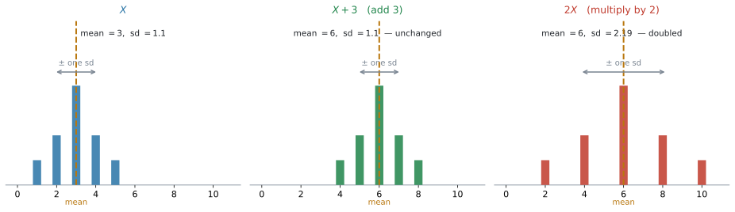
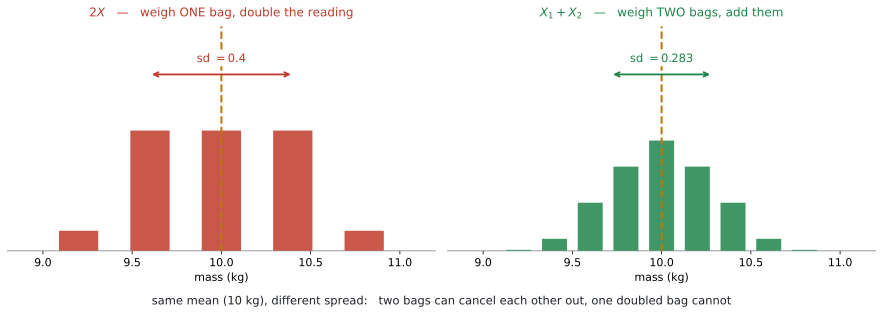
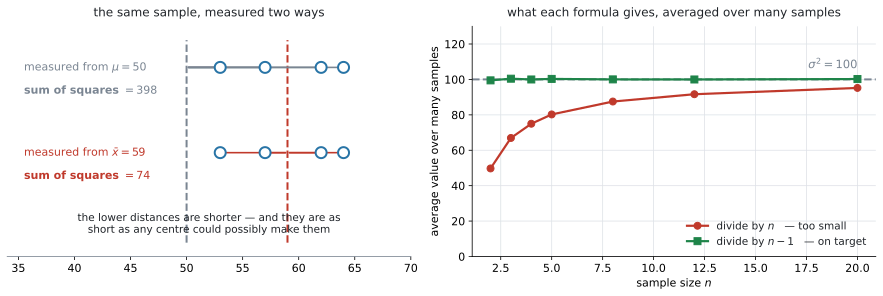

# AHL 4.14 — Linear transformation of a single random variable（確率変数の一次変換） {#sec-ahl-4-14}

::: {.callout-note}
## What you should be able to do
- **$E(aX+b) = aE(X)+b$** と **$\text{Var}(aX+b) = a^{2}\text{Var}(X)$** を使える。
- **standard deviation は $\lvert a \rvert$ 倍**になり、$b$ には影響されないと言える。
- 独立な確率変数の **linear combination**（一次結合）について、$E$ と $\text{Var}$ を求められる。
- **$\text{Var}$ の式は、引き算のときも符号がすべて $+$** になる理由を言える。
- **$2X$ と $X_1 + X_2$ が別のもの**だと分かり、文章題でどちらかを見分けられる。
- $\bar{x}$ と $s_{n-1}^{2}$ が **unbiased estimate**（不偏推定値）だと言え、電卓の $s_x$ がどちらかを見分けられる。
:::

::: {.callout-note}
## SL 4.3 と SL 4.7 の続きです
このページは、$2$ つのページの上に立っています。

| ページ | そこでやったこと | ここで足すこと |
|---|---|---|
| [SL 4.3](../../ai-sl/04-statistics-and-probability/sl-4-3.qmd#constant-changes) | **データ**を $2$ 倍したり $3$ を足したりすると、mean と sd がどうなるか | 同じことを、**確率変数**について式で書く |
| [SL 4.7](../../ai-sl/04-statistics-and-probability/sl-4-7.qmd#expected-value) | $E(X)$ が何かを、確率分布から計算した | $E(X)$ が**分かっているところから先**を計算する |

: このページの位置 {#tbl-ahl414-place}

SL 4.3 では、**数字が並んだデータ**を動かしました。ここで動かすのは**確率変数**です。やっていることは同じですが、**もとの分布を知らなくても答えが出せる**のがこのページの強みです。
:::

::: {.callout-important}
## 公式は、全部 formula booklet にあります
AI HL の公式集 **4.14** の欄に、この $4$ つが並んでいます。

$$
E(aX + b) = aE(X) + b
$$

$$
\text{Var}(aX + b) = a^{2}\,\text{Var}(X)
$$

$$
E(a_1X_1 \pm a_2X_2 \pm \cdots \pm a_nX_n) = a_1E(X_1) \pm a_2E(X_2) \pm \cdots \pm a_nE(X_n)
$$

$$
\text{Var}(a_1X_1 \pm a_2X_2 \pm \cdots \pm a_nX_n) = a_1^{2}\text{Var}(X_1) + a_2^{2}\text{Var}(X_2) + \cdots + a_n^{2}\text{Var}(X_n)
$$

同じ欄に、**$s_{n-1}^{2} = \dfrac{n}{n-1}s_n^{2}$** もあります。

**試験中に配られるので、覚える必要はありません。** 点になるのは、**どれを使うかを決められること**と、**$\text{Var}$ の式の符号がなぜ全部 $+$ なのか**を説明できることです。

なお、$\text{Var}(X)$ そのものを定義から計算する式は載っていません。シラバスにも、こう書かれています。

> **Variance formula will not be required in examinations.**

$\text{Var}(X)$ の値は、**問題文が与えてくれる**か、$np(1-p)$ のような別の公式から出します。
:::

## The idea

### 1. データではなく、確率変数を動かします {#idea}

[SL 4.3](../../ai-sl/04-statistics-and-probability/sl-4-3.qmd#constant-changes) で、こういう表を見ました。

| したこと | mean | standard deviation | variance |
|---|---|---|---|
| **$c$ を足す（引く）** | $c$ だけ増える（減る） | **変わらない** | **変わらない** |
| **$k$ 倍する** | $k$ 倍になる | $\lvert k \rvert$ 倍になる | $k^{2}$ 倍になる |

: SL 4.3 で見た表 {#tbl-ahl414-sl43}

あのときは、$20$ 個の数字が並んだデータを $2$ 倍したり、そこから $3$ を引いたりしました。

**この項目は、同じことを確率変数についてやります。** そして、**書き方が式になります。**

{#fig-ahl414-transform width=100%}

@fig-ahl414-transform の左が、もとの確率変数 $X$ です。$3$ を足すと、**棒がそろって右に動くだけ**で、形はまったく変わりません。$2$ 倍すると、**棒の間隔そのものが広がります。**

見えている絵は SL 4.3 とまったく同じです。違うのは、**$X$ の分布を知らなくても答えられる**という点です。

::: {.callout-tip}
## $E(X)$ と $\text{Var}(X)$ さえ分かれば、それで足ります
「$X$ の平均は $12$、分散は $9$」とだけ書かれた問題が出ます。**分布の形は書かれていません。**

それでも $E(3X+5)$ と $\text{Var}(3X+5)$ は出せます。**公式が、平均と分散だけを材料にしているから**です。

ここがこの項目の便利なところです。**分布を作り直す必要はありません。**
:::

### 2. $aX + b$ という書き方 {#linear}

**linear transformation**（一次変換）は、確率変数を $a$ 倍して $b$ を足すことです。

$$
X \ \longmapsto \ aX + b
$$ {#eq-ahl414-def}

現実の場面では、こういう形で出てきます。

| 場面 | $X$ | 作られる変数 |
|---|---|---|
| タクシー料金 | 走った距離（km） | $2.2X + 3.5$（$1$ km $2.2$ ドル $+$ 基本料金 $3.5$ ドル） |
| 温度の変換 | 摂氏 | $1.8X + 32$（華氏） |
| 歩合給 | 売った個数 | $150X + 8000$（給料） |

: $aX+b$ が出てくる場面 {#tbl-ahl414-contexts}

**$a$ が「$1$ つあたり」、$b$ が「はじめから付いている分」**です。文章題では、この $2$ つを読み分けるところから始まります。

### 3. 平均は、そのまま $a$ 倍して $b$ を足します {#mean}

$$
E(aX + b) = aE(X) + b
$$ {#eq-ahl414-mean}

**$a$ にも $b$ にも、素直に反応します。** 平均が $12$ のものを $3$ 倍して $5$ を足せば、平均は $3 \times 12 + 5 = 41$ です。

#### 記号の読み方 {#mean-symbols}

$E(3X+5)$ は「$3X+5$ という**新しい確率変数**の平均」という意味です。$E$ のカッコの中身は、数ではなく**確率変数**です。

$E(X) = 12$ を代入して $E(3 \times 12 + 5)$ と書いてしまう誤りがあります。$3 \times 12 + 5$ はただの数なので、$E$ を付ける相手ではありません。

### 4. 分散は $a^{2}$ 倍。$b$ は消えます {#variance}

$$
\text{Var}(aX + b) = a^{2}\,\text{Var}(X)
$$ {#eq-ahl414-var}

**右辺に $b$ がありません。** ここがこの公式の中心です。

$b$ を足すのは、@fig-ahl414-transform の真ん中のように、**分布をそのまま横にずらすこと**でした。棒の間隔は変わっていません。散らばりを測る $\text{Var}$ は、**間隔だけを見ている**ので、横にずれても値が変わらないのです。

いっぽう $a$ 倍すると、間隔そのものが $a$ 倍になります。$\text{Var}$ は**差の $2$ 乗**から作られているので、$a^{2}$ 倍です。

::: {.callout-warning}
## $a$ 倍ではなく、$a^{2}$ 倍です
$\text{Var}(X) = 9$ のとき、$\text{Var}(3X+5)$ は $27$ ではありません。

$$
\text{Var}(3X + 5) = 3^{2} \times 9 = 81
$$

**ここは、この項目でいちばん多い失点です。** $\text{Var}$ と書いてあったら、まず「$2$ 乗する係数だ」と思ってください。
:::

### 5. standard deviation は $\lvert a \rvert$ 倍です {#sd}

$\text{Var}$ が $a^{2}$ 倍なら、その平方根である standard deviation は次のようになります。以下、$X$ の standard deviation を $\text{sd}(X)$ と書きます。

$$
\text{sd}(aX + b) = \lvert a \rvert \cdot \text{sd}(X)
$$ {#eq-ahl414-sd}

です。**絶対値が付きます。** 散らばりの大きさは、負になりません。

$a = -2$、$\text{sd}(X) = 3$ なら、$\text{sd}(-2X+1) = 2 \times 3 = 6$ です。$-6$ ではありません。

::: {.callout-note}
## この式は、公式集にありません
公式集にあるのは $\text{Var}(aX+b) = a^{2}\text{Var}(X)$ までです。

ただ、**わざわざ覚えなくても大丈夫**です。$\text{Var}$ を先に出して、最後に平方根をとれば同じ答えになります。

$$
\text{Var}(-2X+1) = 4 \times 9 = 36 \quad \Longrightarrow \quad \text{sd} = \sqrt{36} = 6
$$

平方根は必ず $0$ 以上なので、この順でやれば**符号で迷うこともありません**。SL 4.8 の $\sigma = \sqrt{np(1-p)}$ と同じ進め方です。
:::

### 6. いくつもの確率変数を足すとき — 平均 {#combinations}

確率変数が $2$ つ以上になっても、平均はそのまま足し引きできます。

$$
E(a_1X_1 \pm a_2X_2 \pm \cdots \pm a_nX_n) = a_1E(X_1) \pm a_2E(X_2) \pm \cdots \pm a_nE(X_n)
$$ {#eq-ahl414-ecomb}

$E(X) = 20$、$E(Y) = 8$ なら $E(2X - 3Y) = 2(20) - 3(8) = 16$ です。**書いてあるとおりに計算するだけ**です。

::: {.callout-tip}
## 平均のほうには、条件が付きません
このあとの $\text{Var}$ の式には「独立であること」という条件が付きます。**$E$ のほうには付きません。**

$X$ と $Y$ がどれだけ関係し合っていても、$E(X+Y) = E(X) + E(Y)$ は成り立ちます。

**条件を気にするのは $\text{Var}$ のときだけ**、と覚えておいてください。
:::

### 7. いくつもの確率変数を足すとき — 分散 {#varcomb}

$$
\text{Var}(a_1X_1 \pm a_2X_2 \pm \cdots \pm a_nX_n) = a_1^{2}\text{Var}(X_1) + a_2^{2}\text{Var}(X_2) + \cdots + a_n^{2}\text{Var}(X_n)
$$ {#eq-ahl414-vcomb}

**左辺には $\pm$ があるのに、右辺は全部 $+$ です。** 見落としやすいので、公式集で必ず確かめてください。

$\text{Var}(X) = 16$、$\text{Var}(Y) = 9$ のとき

$$
\text{Var}(2X - 3Y) = 2^{2}(16) + 3^{2}(9) = 64 + 81 = 145
$$

$64 - 81 = -17$ ではありません。**分散が負になることはない**ので、そこでも気づけます。

#### なぜ引き算でも足すのか {#minus}

$\text{Var}(2X-3Y)$ の $-3$ は、@eq-ahl414-var の $a$ にあたります。$a = -3$ を $a^{2}$ に入れると

$$
(-3)^{2} = 9
$$

**$2$ 乗した時点で、符号が消えます。** ですから、引き算でも足し算でも同じ値になります。

考え方でも説明できます。**$Y$ を引いても、$Y$ のばらつきは減りません。** $Y$ がぶれれば、$X-Y$ もぶれます。$2$ つのぶれが重なるので、散らばりは**足される**のです。

::: {.callout-warning}
## この式には「独立」という条件が付きます
シラバスは、はっきりこう書いています。

> Variance of linear combinations of $n$ **independent** random variables.

**independent**（独立）でないときは、@eq-ahl414-vcomb は使えません。

試験では、問題文に `independent` と書かれます。**書かれていないのに使ってしまわないよう**、そこを先に読んでください。
:::

### 8. $2X$ と $X_1 + X_2$ は、別のものです {#two-x}

**この項目でいちばん差がつくところです。**

$$
2X \qquad \text{と} \qquad X_1 + X_2
$$

平均はどちらも $2E(X)$ で同じです。**分散が違います。**

$$
\text{Var}(2X) = 4\,\text{Var}(X) \qquad \text{ですが} \qquad \text{Var}(X_1 + X_2) = 2\,\text{Var}(X)
$$

$5$ kg の袋づめで見ます。$1$ 袋の質量 $X$ は、平均 $5$ kg、standard deviation $0.2$ kg とします。**別々の袋の質量は独立**とします（[第7節](#varcomb)の条件です）。

{#fig-ahl414-2x width=100%}

| | 意味 | $E$ | $\text{Var}$ | sd |
|---|---|---|---|---|
| $2X$ | $1$ 袋を量って、$2$ 倍する | $10$ | $4(0.04) = 0.16$ | $0.4$ |
| $X_1 + X_2$（独立） | $2$ 袋を量って、足す | $10$ | $0.04 + 0.04 = 0.08$ | $0.283$ |

: $2X$ と $X_1+X_2$ {#tbl-ahl414-2x}

#### 違いは「打ち消し合えるかどうか」です {#cancel}

$2X$ では、袋が**$1$ つ**しかありません。その袋が重ければ、$2$ 倍したものも重い。**ずれがそのまま $2$ 倍になります。**

$X_1 + X_2$ では、袋が**$2$ つ**あります。片方が重くても、もう片方が軽ければ、合計は平均に近づきます。**打ち消し合いが起きる**ので、散らばりが小さくなるのです。

@fig-ahl414-2x で、右の棒のほうが真ん中に集まっているのは、そのためです。

#### 文章題での見分け方 {#which}

問題文を読んで、**「いくつのものを量っているか」**を数えてください。

| 問題文 | どちら |
|---|---|
| `the total mass of two bags` | $X_1 + X_2$ |
| `the mass of two bags` | $X_1 + X_2$ |
| `twice the mass of one bag` | $2X$ |
| `the price is doubled` | $2X$ |
| `the total cost of 5 tickets` | $X_1 + \cdots + X_5$ |

: 問題文の読み分け {#tbl-ahl414-which}

**「$2$ つのものがある」なら $X_1+X_2$、「$1$ つのものを $2$ 倍する」なら $2X$** です。

#### $n$ 個のときは {#n-items}

同じ分布の独立な $n$ 個を足すと

$$
E(X_1 + \cdots + X_n) = nE(X), \qquad \text{Var}(X_1 + \cdots + X_n) = n\,\text{Var}(X)
$$ {#eq-ahl414-n}

です。sd は $\sqrt{n} \cdot \text{sd}(X)$ になります。**$n$ 倍ではなく $\sqrt{n}$ 倍**です。

$10$ 袋なら $E = 50$、$\text{Var} = 10(0.04) = 0.4$、$\text{sd} = 0.2\sqrt{10} = 0.632$ kg です。

### 9. $\bar{x}$ は $\mu$ の unbiased estimate です {#unbiased}

**ここから先は、一次変換の続きではありません。** 第8節までで $aX+b$ の話は終わりで、残りの $2$ 節は、シラバスの同じ 4.14 の欄に並んでいる**別の内容**——**sample**（標本）と **unbiased estimate**（不偏推定値）——です。

共通しているのは、[第7節](#varcomb) の $E$ と $\text{Var}$ の式を道具として使う点だけです。話としては、ここから **sample**（標本）と **population**（母集団）に変わります。

population の平均 $\mu$ を知りたいけれど、全部を調べることはできません。そこで sample をとって、その平均

$$
\bar{x} = \sum_{i=1}^{n} \frac{x_i}{n}
$$ {#eq-ahl414-xbar}

を計算します。この $\bar{x}$ を、$\mu$ の推定値として使います。

**unbiased estimate**（不偏推定値）というのは、「**標本を何度もとって平均すると、ちょうど本当の値になる**」という意味です。$1$ 回の $\bar{x}$ が $\mu$ に一致するという意味ではありません。

::: {.callout-note}
## 「不偏」は、狙いがずれていないということです
的に何度も矢を射ることを考えてください。

**unbiased** は「**当たった点の平均が、的の中心にある**」という意味です。$1$ 本ごとに見れば外れています。それでも、**どちらかに片寄ってはいない**——これが不偏です。

「毎回よく当たる」という意味ではありません。それは別の話（ばらつきの大きさ）です。
:::

### 10. $s_{n-1}^{2}$ は $\sigma^{2}$ の unbiased estimate です {#s2}

分散のほうは、少し事情が違います。

$$
s_{n-1}^{2} = \frac{n}{n-1}\,s_n^{2} = \sum_{i=1}^{k} \frac{f_i(x_i - \bar{x})^{2}}{n-1}, \qquad n = \sum_{i=1}^{k} f_i
$$ {#eq-ahl414-s2}

**$n$ ではなく $n-1$ で割ります。** これが $\sigma^{2}$ の unbiased estimate です。

$8$ 個のデータ $12,\ 15,\ 11,\ 18,\ 14,\ 16,\ 13,\ 17$ で見ます。$\bar{x} = 14.5$ で、偏差の $2$ 乗の合計は $42$ です。

$$
s_n^{2} = \frac{42}{8} = 5.25 \qquad \text{に対して} \qquad s_{n-1}^{2} = \frac{42}{7} = 6
$$

公式集の形で計算しても同じです。

$$
s_{n-1}^{2} = \frac{n}{n-1}s_n^{2} = \frac{8}{7} \times 5.25 = 6 \quad ✓
$$

#### 電卓の $s_x$ が、この $s_{n-1}$ です {#calculator}

[SL 4.3](../../ai-sl/04-statistics-and-probability/sl-4-3.qmd#sigma-vs-s) で、電卓の One-Variable Statistics に標準偏差が $2$ つ並ぶことを見ました。

| 電卓の表示 | この項目での名前 | 何で割っているか |
|---|---|---|
| $\sigma_x$ | $s_n$ | $n$ |
| $s_x$ | $s_{n-1}$ | $n-1$ |

: 電卓の $2$ つの標準偏差 {#tbl-ahl414-calc}

**SL では $\sigma_x$ のほうを使いました。** シラバスの SL の欄に「特に断りがなければ、データは母集団として扱う」と書かれていたからです。

**その一文は、HL の欄にはありません。** ですから HL では、$\sigma_x$ を既定と決めてしまわず、**問題文がどちらを求めているかを毎回読みます。** 目印になるのは `sample`、`population`、`unbiased estimate` という語です。

上の $8$ 個のデータなら、電卓は $\sigma_x = 2.29$、$s_x = 2.45$ を返します。$s_x$ を $2$ 乗すれば $6$ です。

::: {.callout-important}
## どちらを聞かれているかは、問題文の言葉で決まります
| 問題文 | 使うもの |
|---|---|
| `Find the standard deviation of the data.` | $\sigma_x$ |
| `The data set is the population.` | $\sigma_x$ |
| `Find an unbiased estimate of the population variance.` | $s_x$ を $2$ 乗する |
| `Find an unbiased estimate of $\sigma^{2}$.` | $s_x$ を $2$ 乗する |

: どちらを読むか {#tbl-ahl414-which-sd}

$1$ つの語だけで決まるわけではないので、**`sample`、`population`、`unbiased estimate` の $3$ つを合わせて読んでください。**

- `an unbiased estimate of the population variance`（母分散の不偏推定値）と書かれていれば、答えは $s_x^{2}$ です
- **与えられたデータそのものの標準偏差**を聞かれているなら、ふつうは $\sigma_x$ です

**「母集団について何か言おうとしているか」**が分かれ目です。判断がつかないときは、$\sigma_x$ と $s_x$ の**どちらを使ったかを答案に書いておく**と、意図が伝わります。
:::

::: {.callout-warning}
## 「不偏推定値」を聞かれたら、答えるのは分散です
`an unbiased estimate of the population variance` と聞かれたら、答えは $s_{n-1}^{2}$、つまり**分散**です。

電卓が返すのは $s_x$（標準偏差）なので、**$2$ 乗するのを忘れないでください。**

上の例なら、$s_x = 2.4494\ldots$ を $2$ 乗して $6$ です。$2.45$ と答えると、標準偏差を答えたことになります。
:::

## Why it works

:::: {.callout-note collapse="true" appearance="simple"}
## クリックすると開きます
ここで説明するのは $2$ つです。**なぜ $\text{Var}$ から $b$ が消えるのか**と、**なぜ $n-1$ で割るのか**。

### なぜ $\text{Var}$ から $b$ が消えるのか {#why-b}

$\text{Var}$ は、**平均からの差**の $2$ 乗を平均したものです。

$X$ に $b$ を足すと、値は $x + b$ になります。平均も $\mu + b$ になります。ですから、差をとると

$$
(x + b) - (\mu + b) = x - \mu
$$

**$b$ が引き算で消えます。** 差が変わらないのだから、その $2$ 乗の平均である $\text{Var}$ も変わりません。

$a$ 倍のほうは、差が

$$
ax - a\mu = a(x - \mu)
$$

となり、$2$ 乗すると $a^{2}(x-\mu)^{2}$ です。**$a^{2}$ が外に出る**ので、$\text{Var}$ も $a^{2}$ 倍になります。

これは [SL 4.3 の Why it works](../../ai-sl/04-statistics-and-probability/sl-4-3.qmd) と同じ説明です。データでも確率変数でも、理由は変わりません。

### なぜ $n$ ではなく $n-1$ で割るのか {#why-n-1}

{#fig-ahl414-unbiased width=100%}

理由は、**$\mu$ が分からないので、代わりに $\bar{x}$ を使っている**ことにあります。

@fig-ahl414-unbiased の左を見てください。同じ $4$ 個の標本について、上は $\mu = 50$ からの距離、下は $\bar{x} = 59$ からの距離を測っています。$2$ 乗の合計は $398$ と $74$ で、**下のほうが小さい**です。

これは偶然ではありません。**$\bar{x}$ は、$2$ 乗の合計がいちばん小さくなる場所**だからです。ほかのどんな数から測っても、これより小さくはなりません（[AHL 4.13 の least squares](ahl-4-13.qmd#least-squares) と、同じ性質です）。

ここで、$2$ つを並べます。

- もし $\mu$ が分かっていて、**$\mu$ からの距離**で計算して $n$ で割ったなら、その値は**平均するとちょうど $\sigma^{2}$** になります
- ところが実際に使えるのは **$\bar{x}$ からの距離**で、そちらは**必ず**小さくなります

ですから $s_n^{2}$ は、**平均すると $\sigma^{2}$ より小さくなります。** 標本のばらつきを、標本自身の中心から測っているせいです。

**$1$ 回ごとに見れば、$s_n^{2}$ が $\sigma^{2}$ を上回ることもあります。** 小さくなるのは、あくまで平均してみたときの話です。

@fig-ahl414-unbiased の右は、それを実際に確かめたものです。$\sigma^{2} = 100$ の母集団から標本を何度もとって、$2$ つの式の値を平均しました。$n$ で割った赤い点は、**いつも $100$ より下**にあります。$n-1$ で割った緑の点は、**$n$ がいくつでも $100$ にのっています。**

$n$ が小さいほど、赤い点のずれが大きくなっていることにも注目してください。$n = 2$ では半分しかありません。$n$ が大きくなればずれは小さくなりますが、**$0$ にはなりません。** ですから、$n$ がいくつであっても $n-1$ で割ります。**小さい標本ほど、その違いが効いてくる**ということです。

::: {.callout-note appearance="simple"}
シラバスは、この点についてこう書いています。

> Demonstration that $E(\bar{X}) = \mu$ and $E(s_{n-1}^{2}) = \sigma^{2}$ **will not be examined, but may help understanding.**

**証明は出ません。** 「$n-1$ で割ると、平均してちょうどよくなる」という事実だけ知っていれば、試験には足ります。
:::
::::

## Worked examples

::: {.callout-note appearance="simple"}
問題文は英語です。意味が理解できなかったら、問題文の下の「**日本語訳**」を開いてください。解説は日本語です。
:::

::: {#exm-ahl414-basic}
[The random variable $X$ has $E(X) = 12$ and $\text{Var}(X) = 9$.]{.q-en}

**(a)** [Find $E(3X + 5)$ and $\text{Var}(3X + 5)$.]{.q-en}

**(b)** [Find the standard deviation of $3X + 5$.]{.q-en}

**(c)** [Find $E(-2X + 1)$ and the standard deviation of $-2X + 1$.]{.q-en}

<details class="jp-trans">
<summary>日本語訳</summary>

確率変数 $X$ について、$E(X) = 12$、$\text{Var}(X) = 9$ です。

**(a)** $E(3X+5)$ と $\text{Var}(3X+5)$ を求めなさい。

**(b)** $3X+5$ の標準偏差を求めなさい。

**(c)** $E(-2X+1)$ と、$-2X+1$ の標準偏差を求めなさい。

</details>

**(a)** 公式集の $2$ つに、そのまま入れます。

$$
E(3X + 5) = 3E(X) + 5 = 3(12) + 5 = 41
$$

$$
\text{Var}(3X + 5) = 3^{2}\,\text{Var}(X) = 9 \times 9 = 81
$$

**$5$ は $\text{Var}$ には入りません**（[第4節](#variance)）。

**(b)** $\text{Var}$ の平方根です。

$$
\text{sd} = \sqrt{81} = 9
$$

**検算。** $\text{sd}(X) = \sqrt{9} = 3$ で、$\lvert 3 \rvert \times 3 = 9$ ✓ [第5節](#sd)の $\lvert a \rvert$ 倍と合っています。

**(c)** $a = -2$ です。

$$
E(-2X + 1) = -2(12) + 1 = -23
$$

$$
\text{Var}(-2X + 1) = (-2)^{2} \times 9 = 4 \times 9 = 36 \quad \Longrightarrow \quad \text{sd} = \sqrt{36} = 6
$$

**平均は負になっても構いません。** 標準偏差は $6$ で、$-6$ にはなりません。

::: {.callout-note}
## 解答例（答案用紙にはこう書く）
**(a)**
$$
E(3X+5) = 3(12) + 5 = 41
$$
$$
\text{Var}(3X+5) = 3^{2}(9) = 81
$$

**(b)**
$$
\text{sd} = \sqrt{81} = 9
$$

**(c)**
$$
E(-2X+1) = -2(12) + 1 = -23
$$
$$
\text{Var}(-2X+1) = (-2)^{2}(9) = 36, \qquad \text{sd} = \sqrt{36} = 6
$$
:::
:::

::: {#exm-ahl414-taxi}
[In a city, the distance $X$ travelled by a taxi journey, in km, has mean $6.5$ and standard deviation $2.5$.]{.q-en}

[The fare, in dollars, for a journey is given by $F = 2.2X + 3.5$.]{.q-en}

**(a)** [Find the mean fare.]{.q-en}

**(b)** [Find the standard deviation of the fare.]{.q-en}

**(c)** [The company increases the fixed charge from \$3.5 to \$5. Comment on the effect this has on the mean and on the standard deviation of the fare.]{.q-en}

<details class="jp-trans">
<summary>日本語訳</summary>

ある都市で、タクシーの $1$ 回の乗車距離 $X$（km）は、平均 $6.5$、標準偏差 $2.5$ です。

$1$ 回の料金（ドル）は $F = 2.2X + 3.5$ で与えられます。

**(a)** 料金の平均を求めなさい。

**(b)** 料金の標準偏差を求めなさい。

**(c)** 会社が基本料金を \$3.5 から \$5 に上げました。これが料金の平均と標準偏差にどう影響するかを述べなさい。

</details>

**(a)** $a = 2.2$、$b = 3.5$ です。

$$
E(F) = 2.2 \times 6.5 + 3.5 = 14.3 + 3.5 = 17.80
$$

料金の平均は **\$17.80** です。

**(b)** 標準偏差なので、$b$ は関係しません。

$$
\text{sd}(F) = 2.2 \times 2.5 = 5.50
$$

**\$5.50** です。$\text{Var}(F) = 5.5^{2} = 30.25$ と出してから平方根をとっても同じです。

**(c)** 基本料金は $b$ にあたります。$b$ が $3.5$ から $5$ に増えると

- **平均は $1.5$ 増えて \$19.30** になります
- **標準偏差は $5.50$ のまま変わりません**

全員の料金が同じだけ上がるので、**料金どうしの差は広がりも縮みもしません。**

::: {.model-answer}
**試験ではこう書く**

*Increasing the fixed charge adds a constant to every fare, so the mean increases by \$1.50 to \$19.30. The standard deviation is unchanged at \$5.50, because adding the same amount to every fare does not change how spread out the fares are.*
:::

（基本料金を上げると、すべての料金に同じ額が足されるので、平均は \$1.50 増えて \$19.30 になる。すべての料金に同じ額を足しても料金の散らばり方は変わらないので、標準偏差は \$5.50 のまま、という意味です。）

::: {.callout-note}
## 解答例（答案用紙にはこう書く）
**(a)**
$$
E(F) = 2.2(6.5) + 3.5 = \$17.80
$$

**(b)**
$$
\text{sd}(F) = 2.2(2.5) = \$5.50
$$

**(c)** *The mean increases by \$1.50 to \$19.30. The standard deviation is unchanged at \$5.50, since adding a constant to every fare does not change the spread.*
:::
:::

::: {#exm-ahl414-comb}
[The independent random variables $X$ and $Y$ have $E(X) = 20$, $\text{Var}(X) = 16$, $E(Y) = 8$ and $\text{Var}(Y) = 9$.]{.q-en}

**(a)** [Find $E(2X - 3Y)$.]{.q-en}

**(b)** [Find $\text{Var}(2X - 3Y)$.]{.q-en}

**(c)** [Find the standard deviation of $2X - 3Y$, giving your answer correct to three significant figures.]{.q-en}

**(d)** [Explain why $\text{Var}(X - Y)$ is larger than $\text{Var}(X)$.]{.q-en}

<details class="jp-trans">
<summary>日本語訳</summary>

独立な確率変数 $X$ と $Y$ について、$E(X) = 20$、$\text{Var}(X) = 16$、$E(Y) = 8$、$\text{Var}(Y) = 9$ です。

**(a)** $E(2X-3Y)$ を求めなさい。

**(b)** $\text{Var}(2X-3Y)$ を求めなさい。

**(c)** $2X-3Y$ の標準偏差を、有効数字 $3$ 桁で求めなさい。

**(d)** $\text{Var}(X-Y)$ が $\text{Var}(X)$ より大きくなる理由を説明しなさい。

</details>

**(a)** 平均は、書いてあるとおりに計算します（[第6節](#combinations)）。

$$
E(2X - 3Y) = 2(20) - 3(8) = 40 - 24 = 16
$$

**(b)** 分散は、**符号が全部 $+$** になります（[第7節](#varcomb)）。

$$
\text{Var}(2X - 3Y) = 2^{2}(16) + 3^{2}(9) = 64 + 81 = 145
$$

**$64 - 81$ ではありません。** $(-3)^{2} = 9$ なので、$Y$ の側も $+$ で入ります。

**(c)**

$$
\text{sd} = \sqrt{145} = 12.0416\ldots = 12.0
$$

**(d)** $Y$ を引いても、$Y$ のばらつきは消えません。

$$
\text{Var}(X - Y) = 16 + 9 = 25 \ > \ 16 = \text{Var}(X)
$$

::: {.model-answer}
**試験ではこう書く**

*$\text{Var}(X-Y) = \text{Var}(X) + \text{Var}(Y) = 16 + 9 = 25$, which is larger than $\text{Var}(X) = 16$. Subtracting $Y$ does not remove the variability of $Y$: whenever $Y$ varies, $X - Y$ varies as well, so the two sources of variability add together.*
:::

（$Y$ を引いても $Y$ のばらつきは消えず、$Y$ がぶれれば $X-Y$ もぶれるので、$2$ つのばらつきが足し合わされる、という意味です。）

::: {.callout-note}
## 解答例（答案用紙にはこう書く）
**(a)**
$$
E(2X-3Y) = 2(20) - 3(8) = 16
$$

**(b)**
$$
\text{Var}(2X-3Y) = 2^{2}(16) + (-3)^{2}(9) = 64 + 81 = 145
$$

**(c)**
$$
\text{sd} = \sqrt{145} = 12.0
$$

**(d)** *$\text{Var}(X-Y) = 16 + 9 = 25 > 16$. Subtracting $Y$ does not remove the variability of $Y$, so the two variances add.*
:::
:::

::: {#exm-ahl414-bags}
[A machine fills bags of rice. The mass, in kg, of a bag is a random variable $X$ with mean $5$ and standard deviation $0.2$. The masses of different bags are independent.]{.q-en}

**(a)** [Find the mean and standard deviation of the total mass of two bags.]{.q-en}

**(b)** [Find the mean and standard deviation of $2X$.]{.q-en}

**(c)** [Explain why your answers to parts (a) and (b) have the same mean but different standard deviations.]{.q-en}

**(d)** [Find the standard deviation of the total mass of ten bags.]{.q-en}

<details class="jp-trans">
<summary>日本語訳</summary>

ある機械が米の袋づめをします。$1$ 袋の質量（kg）は確率変数 $X$ で、平均 $5$、標準偏差 $0.2$ です。別々の袋の質量は独立です。

**(a)** $2$ 袋の合計質量の平均と標準偏差を求めなさい。

**(b)** $2X$ の平均と標準偏差を求めなさい。

**(c)** (a) と (b) の答えで、平均は同じなのに標準偏差が違う理由を説明しなさい。

**(d)** $10$ 袋の合計質量の標準偏差を求めなさい。

</details>

まず $\text{Var}(X) = 0.2^{2} = 0.04$ を出しておきます。

**(a)** 袋が $2$ つなので $X_1 + X_2$ です（[第8節](#which)）。

$$
E(X_1 + X_2) = 5 + 5 = 10
$$

$$
\text{Var}(X_1 + X_2) = 0.04 + 0.04 = 0.08 \quad \Longrightarrow \quad \text{sd} = \sqrt{0.08} = 0.283
$$

**(b)** こちらは袋が $1$ つで、それを $2$ 倍しています。

$$
E(2X) = 2(5) = 10
$$

$$
\text{Var}(2X) = 2^{2}(0.04) = 0.16 \quad \Longrightarrow \quad \text{sd} = \sqrt{0.16} = 0.4
$$

**(c)** 平均が同じなのは、どちらも「$5$ kg $2$ つ分」だからです。違いは、**ものがいくつあるか**です。

$2$ 袋なら、片方が重くても、もう片方が軽ければ打ち消し合います。$1$ 袋を $2$ 倍する場合は、その袋のずれが**そのまま $2$ 倍**になります。

::: {.model-answer}
**試験ではこう書く**

*Both have mean $10$ kg, since each is $2E(X) = 2(5)$. For $X_1 + X_2$ there are two separate bags, so a heavy bag can be balanced by a light one and the variances add: $\text{Var} = 2(0.04) = 0.08$. For $2X$ there is only one bag, and its deviation from the mean is doubled, so $\text{Var} = 2^{2}(0.04) = 0.16$. The total of two bags is therefore less variable than one doubled bag.*
:::

（どちらも「$2$ 袋分の平均」なので平均は同じ $10$ kg。$X_1+X_2$ は袋が $2$ つあるので重い袋と軽い袋が打ち消し合うが、$2X$ は $1$ 袋のずれがそのまま $2$ 倍になる、という意味です。）

**(d)** $10$ 袋なので @eq-ahl414-n を使います。

$$
\text{Var} = 10 \times 0.04 = 0.4 \quad \Longrightarrow \quad \text{sd} = \sqrt{0.4} = 0.632
$$

**検算。** $\text{sd}(X) \times \sqrt{10} = 0.2 \times 3.162\ldots = 0.632$ ✓

::: {.callout-note}
## 解答例（答案用紙にはこう書く）
**(a)**
$$
E(X_1 + X_2) = 10, \qquad \text{Var} = 2(0.04) = 0.08, \qquad \text{sd} = 0.283
$$

**(b)**
$$
E(2X) = 10, \qquad \text{Var} = 2^{2}(0.04) = 0.16, \qquad \text{sd} = 0.4
$$

**(c)** *Both means are $10$ kg. For $X_1 + X_2$ the two bags are separate, so a heavy bag can be offset by a light one and the variances add. For $2X$ the deviation of a single bag is doubled, giving four times the variance. So $2X$ has the larger standard deviation.*

**(d)**
$$
\text{Var} = 10(0.04) = 0.4, \qquad \text{sd} = \sqrt{0.4} = 0.632
$$
:::
:::

::: {#exm-ahl414-unbiased}
[A sample of eight measurements is taken from a large population.]{.q-en}

$$
12, \quad 15, \quad 11, \quad 18, \quad 14, \quad 16, \quad 13, \quad 17
$$

**(a)** [Write down an unbiased estimate of the population mean.]{.q-en}

**(b)** [Find an unbiased estimate of the population variance.]{.q-en}

**(c)** [A student uses technology and writes down $\sigma_x = 2.29$ as the answer to part (b). Explain what is wrong with this.]{.q-en}

<details class="jp-trans">
<summary>日本語訳</summary>

大きな母集団から、$8$ 個の測定値を標本としてとりました。

**(a)** 母平均の不偏推定値を書きなさい。

**(b)** 母分散の不偏推定値を求めなさい。

**(c)** ある生徒が電卓を使い、(b) の答えとして $\sigma_x = 2.29$ と書きました。これのどこが誤っているかを説明しなさい。

</details>

**(a)** 標本平均がそのまま答えです（[第9節](#unbiased)）。

$$
\bar{x} = \frac{116}{8} = 14.5
$$

**(b)** 電卓の One-Variable Statistics から $s_x = 2.4494\ldots$ を読み、**$2$ 乗します**。

$$
s_{n-1}^{2} = 2.4494\ldots^{2} = 6
$$

手で確かめると、偏差の $2$ 乗の合計が $42$ なので

$$
s_{n-1}^{2} = \frac{42}{8-1} = \frac{42}{7} = 6 \quad ✓
$$

**(c)** $2$ か所あります。**$\sigma_x$ は $n$ で割ったもの**なので不偏ではありません。そして**標準偏差**であって、分散ではありません。

::: {.model-answer}
**試験ではこう書く**

*There are two errors. First, $\sigma_x$ divides by $n$, not by $n-1$, so it is not an unbiased estimate of the population variance. The unbiased estimate uses $s_x$, which divides by $n-1$. Second, the question asks for a variance, so the value must be squared: the answer is $s_{n-1}^{2} = 6$, not a standard deviation.*
:::

（$\sigma_x$ は $n$ で割っているので不偏ではなく、また問われているのは分散なので $2$ 乗が必要、という意味です。）

::: {.callout-note}
## 解答例（答案用紙にはこう書く）
**(a)**
$$
\bar{x} = 14.5
$$

**(b)**
$$
s_{n-1}^{2} = \frac{42}{7} = 6
$$

**(c)** *$\sigma_x$ divides by $n$ rather than $n-1$, so it is not unbiased; and it is a standard deviation, whereas the question asks for a variance. The correct answer is $s_{n-1}^{2} = 6$.*
:::
:::

## Common errors

::: {.callout-warning}
## $\text{Var}(aX+b)$ で $a$ を $2$ 乗しない
$\text{Var}(3X+5)$ を $3 \times 9 = 27$ としてしまう誤りです。正しくは $3^{2} \times 9 = 81$（[第4節](#variance)）。

**$\text{Var}$ と見たら、係数は $2$ 乗**です。
:::

::: {.callout-warning}
## $\text{Var}(aX+b)$ に $b$ を足してしまう
$\text{Var}(3X+5) = 81 + 5$ としてしまう誤りです。**$b$ は $\text{Var}$ に一切入りません**（[第4節](#variance)）。

分布を横にずらしただけでは、散らばりは変わらないからです。
:::

::: {.callout-warning}
## 線形結合の $\text{Var}$ で引き算をしてしまう
$\text{Var}(2X-3Y)$ を $64 - 81 = -17$ としてしまう誤りです。**分散が負になることはありません。**

公式集の右辺は**すべて $+$** です（[第7節](#varcomb)）。負が出たら、そこで気づいてください。
:::

::: {.callout-warning}
## $X_1 + X_2$ を $2X$ として計算する
「$2$ 袋の合計」を $\text{Var}(2X) = 4\text{Var}(X)$ としてしまう誤りです。正しくは $2\text{Var}(X)$（[第8節](#two-x)）。

**問題文で、いくつのものを量っているかを数えてください**（[第8節の表](#which)）。
:::

::: {.callout-warning}
## $2X$ を $X_1 + X_2$ として計算する
逆向きの誤りです。`twice the mass of one bag` は、袋が $1$ つです。$\text{Var}(2X) = 4\text{Var}(X)$ になります。

**平均が同じで分散が違う**ので、平均だけ見ていると気づけません。
:::

::: {.callout-warning}
## `independent` と書かれていないのに $\text{Var}$ の公式を使う
$\text{Var}$ の線形結合の公式には、**独立という条件が付いています**（[第7節](#varcomb)）。

$E$ のほうには条件がありません。**混同しないでください。**
:::

::: {.callout-warning}
## standard deviation を $a$ 倍ではなく $a^{2}$ 倍にする
$\text{Var}$ が $a^{2}$ 倍、**sd は $\lvert a \rvert$ 倍**です（[第5節](#sd)）。

迷ったら、**$\text{Var}$ を先に出して、最後に平方根**をとってください。$2$ 段階に分ければ間違えません。
:::

::: {.callout-warning}
## standard deviation を負の値で答える
$a = -2$ のとき、$\text{sd}(-2X+1) = -6$ としてしまう誤りです。

**散らばりの大きさは負になりません。** $\lvert a \rvert$ 倍なので $6$ です（[第5節](#sd)）。
:::

::: {.callout-warning}
## `unbiased estimate` を聞かれて $\sigma_x$ を答える
電卓の $\sigma_x$ は $n$ で割ったものなので、不偏ではありません。**$s_x$ のほう**を読んでください（[第10節](#calculator)）。

**問題文に `unbiased` があるかどうか**が、見分けの基準です。
:::

::: {.callout-warning}
## 不偏推定値を聞かれて、$2$ 乗を忘れる
`an unbiased estimate of the population variance` の答えは**分散**です。電卓が返す $s_x$ は標準偏差なので、**$2$ 乗**します（[第10節](#s2)）。

問題文の最後の語が `variance` か `standard deviation` かを、先に確かめてください。
:::

::: {.callout-warning}
## $E$ のカッコの中に、数を入れてしまう
$E(3X+5)$ を $E(3 \times 12 + 5)$ と書いてしまう誤りです。$E$ のカッコに入るのは**確率変数**で、数ではありません（[第3節](#mean-symbols)）。

$E(3X+5) = 3E(X)+5 = 3(12)+5$ の順で書いてください。
:::

## Using your GDC (TI-Nspire CX II)

この項目は、**手で計算する場面がほとんど**です。電卓を使うのは、$s_{n-1}$ を読むときと、$\text{Var}(X)$ をほかの分布から出すときです。

### 1. $\sigma_x$ と $s_x$ を読む {#gdc-stats}

データから不偏推定値を出すときに使います。

```
menu → Statistics → Stat Calculations → One-Variable Statistics
```

`Num of Lists` は $1$、`X1 List` に列を指定します。返ってくる画面で見るのは $\bar{x}$、$\sigma_x$、$s_x$ の $3$ つです。どれがどれかは、[第10節の表](#calculator)にあります。

**$\sigma_x$ のほうが小さい値**になります。$2$ つ並んでいて、どちらか分からなくなったら、そこで見分けられます（[SL 4.3](../../ai-sl/04-statistics-and-probability/sl-4-3.qmd#sigma-vs-s)）。

### 2. 不偏推定値の分散を出す {#gdc-var}

$s_x$ を読んだら、**画面の値をそのまま $2$ 乗**します。

書き写した $3$ 桁の値ではなく、**電卓に入っている値**を使ってください。$s_x = 2.45$ を $2$ 乗すると $6.0025$ になり、$3$ 桁目が変わります。

One-Variable Statistics を走らせると、結果は `stat.` で始まる変数に自動で入っています。**`var` キー**を押して一覧から `stat.sx` を選べば、丸めずに使えます（[SL 4.11](../../ai-sl/04-statistics-and-probability/sl-4-11.qmd) と同じやり方です）。

```
stat.sx^2
```

### 3. $\text{Var}(X)$ を binomial から出す {#gdc-binomial}

$X \sim B(n, p)$ と書かれていたら、$\text{Var}(X)$ は公式集の

$$
\text{Var}(X) = np(1-p)
$$

から出します（[SL 4.8](../../ai-sl/04-statistics-and-probability/sl-4-8.qmd#mean-variance)）。そのうえで、このページの公式に入れます。

$X \sim B(50,\ 0.3)$ なら $\text{Var}(X) = 50(0.3)(0.7) = 10.5$ で、$\text{Var}(2X+1) = 4(10.5) = 42$ です。

### 4. 平方根を最後にとる {#gdc-sqrt}

standard deviation を聞かれたときは、**$\text{Var}$ を先に出して、最後に平方根**をとってください。

$$
\sqrt{2^{2}(16) + 3^{2}(9)}
$$

のように、電卓に $1$ 行で打ちこんでも構いません。**途中で丸めないほうが確実**です。

## Exercises

::: {.callout-note appearance="simple"}
各問題に、折りたたみが3つ付いています。**日本語訳**、**解答例**（答案用紙に書くべきこと。英語です）、**解説**（なぜそうなるか。日本語です）。

まず自分で解いて、次に解答例と見くらべてください。**解説は、合わなかったときだけ開けば十分です。**
:::

::: {.exercise-block}

[1]{.ex-no} [The random variable $X$ has $E(X) = 15$ and $\text{Var}(X) = 4$. Find $E(2X+7)$, $\text{Var}(2X+7)$ and the standard deviation of $2X+7$.]{.q-en}

<details class="jp-trans">
<summary>日本語訳</summary>

確率変数 $X$ について $E(X) = 15$、$\text{Var}(X) = 4$ です。$E(2X+7)$、$\text{Var}(2X+7)$、および $2X+7$ の標準偏差を求めなさい。

</details>

::: {.callout-note collapse="true"}
## 解答例（答案用紙に書くこと）
$$
E(2X+7) = 2(15) + 7 = 37
$$
$$
\text{Var}(2X+7) = 2^{2}(4) = 16
$$
$$
\text{sd} = \sqrt{16} = 4
$$
:::

::: {.callout-tip collapse="true"}
## 解説
公式集の $2$ つに入れるだけです（[第3節](#mean)、[第4節](#variance)）。

**$7$ は $\text{Var}$ に入りません。** $2$ は $2$ 乗して $4$ になります。

**検算。** $\text{sd}(X) = \sqrt{4} = 2$ なので、$\text{sd}(2X+7) = 2 \times 2 = 4$ ✓
:::

::: {.ex-sep}
:::

[2]{.ex-no} [The random variable $X$ has $E(X) = 30$ and standard deviation $5$. Find $E(0.5X - 2)$ and the standard deviation of $0.5X - 2$.]{.q-en}

<details class="jp-trans">
<summary>日本語訳</summary>

確率変数 $X$ は $E(X) = 30$、標準偏差 $5$ です。$E(0.5X-2)$ と、$0.5X-2$ の標準偏差を求めなさい。

</details>

::: {.callout-note collapse="true"}
## 解答例（答案用紙に書くこと）
$$
E(0.5X - 2) = 0.5(30) - 2 = 13
$$
$$
\text{Var}(X) = 5^{2} = 25
$$
$$
\text{Var}(0.5X - 2) = 0.5^{2}(25) = 6.25, \qquad \text{sd} = \sqrt{6.25} = 2.5
$$
:::

::: {.callout-tip collapse="true"}
## 解説
**与えられているのは標準偏差です。** $\text{Var}$ の公式を使うので、まず $2$ 乗して $\text{Var}(X) = 25$ にします。

$0.5^{2} = 0.25$ なので $\text{Var} = 6.25$、平方根をとって $2.5$ です。

**$\lvert 0.5 \rvert \times 5 = 2.5$** と、[第5節](#sd)から直接出しても構いません ✓
:::

::: {.ex-sep}
:::

[3]{.ex-no} [A shop's daily takings $T$, in yen, have mean $84\,000$ and standard deviation $12\,000$. The shop's daily profit is given by $P = 0.4T - 25\,000$.]{.q-en}

**(a)** [Find the mean daily profit.]{.q-en}

**(b)** [Find the standard deviation of the daily profit.]{.q-en}

**(c)** [The shop's fixed daily costs rise from $25\,000$ yen to $28\,000$ yen. State the effect on the standard deviation of the daily profit, and give a reason.]{.q-en}

<details class="jp-trans">
<summary>日本語訳</summary>

ある店の $1$ 日の売上 $T$（円）は、平均 $84\,000$、標準偏差 $12\,000$ です。$1$ 日の利益は $P = 0.4T - 25\,000$ で与えられます。

問題文の `takings` は「売上」、`profit` は「利益」、`fixed daily costs` は「$1$ 日の固定費」です。

**(a)** $1$ 日の利益の平均を求めなさい。

**(b)** $1$ 日の利益の標準偏差を求めなさい。

**(c)** 店の $1$ 日の固定費が $25\,000$ 円から $28\,000$ 円に上がりました。$1$ 日の利益の標準偏差への影響を述べ、理由を書きなさい。

</details>

::: {.callout-note collapse="true"}
## 解答例（答案用紙に書くこと）
**(a)**
$$
E(P) = 0.4(84\,000) - 25\,000 = 33\,600 - 25\,000 = 8600 \text{ yen}
$$

**(b)**
$$
\text{sd}(P) = 0.4(12\,000) = 4800 \text{ yen}
$$

**(c)** *There is no effect: the standard deviation stays at $4800$ yen. The fixed cost is a constant subtracted from every day's profit, and subtracting the same amount from every value shifts them all together without changing how spread out they are.*
:::

::: {.callout-tip collapse="true"}
## 解説
**(a)(b)** $a = 0.4$、$b = -25\,000$ です。標準偏差には $b$ が入りません（[第4節](#variance)）。

**(c)** `give a reason` なので、**理由を必ず書いてください。** 数値だけでは点になりません。

固定費は、毎日の利益から**同じ額**を引きます。全部が同じだけ下にずれるので、**利益どうしの差は変わりません。**

::: {.model-answer}
**試験ではこう書く**

*The standard deviation is unchanged at $4800$ yen. Raising the fixed cost subtracts the same constant from every day's profit, so all the values shift together and the spread between them is unaffected.*
:::

平均のほうは $3000$ 円下がって $5600$ 円になります。**平均は変わり、標準偏差は変わらない**——ここが、この問題の中心です。
:::

::: {.ex-sep}
:::

[4]{.ex-no} [The independent random variables $X$ and $Y$ have $E(X) = 10$, $\text{Var}(X) = 3$, $E(Y) = 6$ and $\text{Var}(Y) = 5$.]{.q-en}

**(a)** [Find $E(X + Y)$ and $\text{Var}(X + Y)$.]{.q-en}

**(b)** [Find $E(X - Y)$ and $\text{Var}(X - Y)$.]{.q-en}

<details class="jp-trans">
<summary>日本語訳</summary>

独立な確率変数 $X$ と $Y$ について、$E(X) = 10$、$\text{Var}(X) = 3$、$E(Y) = 6$、$\text{Var}(Y) = 5$ です。

**(a)** $E(X+Y)$ と $\text{Var}(X+Y)$ を求めなさい。

**(b)** $E(X-Y)$ と $\text{Var}(X-Y)$ を求めなさい。

</details>

::: {.callout-note collapse="true"}
## 解答例（答案用紙に書くこと）
**(a)**
$$
E(X+Y) = 10 + 6 = 16, \qquad \text{Var}(X+Y) = 3 + 5 = 8
$$

**(b)**
$$
E(X-Y) = 10 - 6 = 4, \qquad \text{Var}(X-Y) = 3 + 5 = 8
$$
:::

::: {.callout-tip collapse="true"}
## 解説
**平均は $16$ と $4$ で違うのに、分散はどちらも $8$ です。** ここがこの問題の狙いです。

$\text{Var}(X-Y)$ の $Y$ の係数は $-1$ です。$(-1)^{2} = 1$ なので、$+$ で入ります（[第7節](#varcomb)）。

$3 - 5 = -2$ としてしまうと、**分散が負**になります。そこで気づけます。

**足しても引いても、ばらつきは重なる**——これが覚えておく形です。
:::

::: {.ex-sep}
:::

[5]{.ex-no} [Two independent random variables $A$ and $B$ have the same variance $v$. Explain why $\text{Var}(A - B)$ is equal to $2v$ and not to $0$.]{.q-en}

<details class="jp-trans">
<summary>日本語訳</summary>

独立な $2$ つの確率変数 $A$ と $B$ は、同じ分散 $v$ をもちます。$\text{Var}(A-B)$ が $0$ ではなく $2v$ になる理由を説明しなさい。

</details>

::: {.callout-note collapse="true"}
## 解答例（答案用紙に書くこと）
$$
\text{Var}(A - B) = 1^{2}\text{Var}(A) + (-1)^{2}\text{Var}(B) = v + v = 2v
$$

*The coefficient of $B$ is $-1$, and squaring it gives $+1$, so the two variances add rather than cancel. Subtracting $B$ does not remove its variability: if $B$ varies then $A - B$ varies too, so both sources of variability contribute.*
:::

::: {.callout-tip collapse="true"}
## 解説
`Explain why` なので、**式と言葉の両方**を書きます。

式のほうは $(-1)^{2} = 1$ です。**$2$ 乗した時点で符号が消えます**（[第7節](#minus)）。

言葉のほうは、こう考えてください。$A$ と $B$ が同じ分布でも、**同じ値が出るわけではありません。** 独立なので、$A$ が大きくて $B$ が小さい日もあります。そのとき $A-B$ は大きくなります。

$\text{Var}(A-B) = 0$ になるのは、**$A-B$ がまったく変動しないとき**、つまり $A$ のぶれと $B$ のぶれが完全に連動しているときだけです。**独立と書かれている以上、それは起こりません。**

::: {.model-answer}
**試験ではこう書く**

*In the formula the coefficient of $B$ is $-1$, and $(-1)^{2} = 1$, so $\text{Var}(A-B) = v + v = 2v$. Subtracting $B$ does not cancel its variability: since $A$ and $B$ are independent, $A$ may be large while $B$ is small, making $A - B$ large. The variance could only be $0$ if $A - B$ never varied, which independence rules out.*
:::
:::

::: {.ex-sep}
:::

[6]{.ex-no} [The length, in cm, of a metal rod produced by a machine is a random variable $X$ with mean $4.2$ and standard deviation $0.15$. The lengths of different rods are independent.]{.q-en}

**(a)** [Find the mean and standard deviation of the total length of three rods placed end to end.]{.q-en}

**(b)** [Find the mean and standard deviation of $3X$.]{.q-en}

**(c)** [State which of the two situations in parts (a) and (b) has the greater standard deviation, and give a reason.]{.q-en}

<details class="jp-trans">
<summary>日本語訳</summary>

ある機械が作る金属棒の長さ（cm）は、確率変数 $X$ で平均 $4.2$、標準偏差 $0.15$ です。別々の棒の長さは独立です。

`end to end` は「端と端をつないで」という意味です。

**(a)** $3$ 本の棒を端と端でつないだときの、全長の平均と標準偏差を求めなさい。

**(b)** $3X$ の平均と標準偏差を求めなさい。

**(c)** (a) と (b) のどちらの標準偏差が大きいかを述べ、理由を書きなさい。

</details>

::: {.callout-note collapse="true"}
## 解答例（答案用紙に書くこと）
$$
\text{Var}(X) = 0.15^{2} = 0.0225
$$

**(a)**
$$
E = 3(4.2) = 12.6 \text{ cm}
$$
$$
\text{Var} = 3(0.0225) = 0.0675, \qquad \text{sd} = \sqrt{0.0675} = 0.260 \text{ cm}
$$

**(b)**
$$
E(3X) = 3(4.2) = 12.6 \text{ cm}
$$
$$
\text{Var}(3X) = 3^{2}(0.0225) = 0.2025, \qquad \text{sd} = \sqrt{0.2025} = 0.45 \text{ cm}
$$

**(c)** *$3X$ has the greater standard deviation ($0.45$ cm against $0.260$ cm). In (a) there are three separate rods, so a long rod can be offset by a short one and the variances add to give $3\text{Var}(X)$. In (b) there is only one rod whose deviation is tripled, giving $3^{2}\text{Var}(X)$.*
:::

::: {.callout-tip collapse="true"}
## 解説
**(a)** 棒が $3$ 本あるので $X_1 + X_2 + X_3$ です。@eq-ahl414-n から $\text{Var} = 3\text{Var}(X)$。

**(b)** $3X$ は $1$ 本を $3$ 倍したものなので、$\text{Var} = 9\text{Var}(X)$ です。**$3$ 倍と $9$ 倍で $3$ 倍の差**がつきます。

**平均はどちらも $12.6$ cm** です。平均だけ見ていると、この $2$ つは区別できません（[第8節](#two-x)）。

**(c)** `give a reason` なので理由が要ります。

::: {.model-answer}
**試験ではこう書く**

*$3X$ has the greater standard deviation. With three separate rods, a rod that is too long can be balanced by one that is too short, so the variances add: $\text{Var} = 3(0.0225) = 0.0675$. With $3X$ there is a single rod whose deviation from the mean is tripled, so $\text{Var} = 3^{2}(0.0225) = 0.2025$.*
:::

現実の場面としても、**$3$ 本つないだほうが長さが安定する**というのは意味の通る結論です。
:::

::: {.ex-sep}
:::

[7]{.ex-no} [A sample of five values is taken from a population.]{.q-en}

$$
22, \quad 25, \quad 19, \quad 24, \quad 20
$$

**(a)** [Write down an unbiased estimate of the population mean.]{.q-en}

**(b)** [Find an unbiased estimate of the population variance.]{.q-en}

<details class="jp-trans">
<summary>日本語訳</summary>

ある母集団から、$5$ 個の値を標本としてとりました。

**(a)** 母平均の不偏推定値を書きなさい。

**(b)** 母分散の不偏推定値を求めなさい。

</details>

::: {.callout-note collapse="true"}
## 解答例（答案用紙に書くこと）
**(a)**
$$
\bar{x} = \frac{110}{5} = 22
$$

**(b)**
$$
s_{n-1}^{2} = \frac{26}{5-1} = \frac{26}{4} = 6.5
$$
:::

::: {.callout-tip collapse="true"}
## 解説
**(a)** $22+25+19+24+20 = 110$ を $5$ で割ります。

**(b)** 電卓の $s_x$ を読んで $2$ 乗するのが速いです。$s_x = 2.5495\ldots$ なので $s_{n-1}^{2} = 6.5$。

手で出すなら、$\bar{x} = 22$ からの偏差が $0,\ 3,\ -3,\ 2,\ -2$。$2$ 乗して足すと $0+9+9+4+4 = 26$。これを **$n-1 = 4$** で割ります。

**$5$ で割ると $5.2$** になり、これは不偏ではありません（[第10節](#s2)）。

**問われているのは variance なので、$2$ 乗した値を答えます。** $2.55$ と書くと標準偏差を答えたことになります。
:::

::: {.ex-sep}
:::

[8]{.ex-no} [For a sample of $10$ values, $s_n = 3.6$, where $s_n$ is the standard deviation found by dividing by $n$. Find an unbiased estimate of the population variance.]{.q-en}

<details class="jp-trans">
<summary>日本語訳</summary>

$10$ 個の値からなる標本について $s_n = 3.6$ です。ここで $s_n$ は $n$ で割って求めた標準偏差です（電卓の $\sigma_x$ にあたります）。母分散の不偏推定値を求めなさい。

</details>

::: {.callout-note collapse="true"}
## 解答例（答案用紙に書くこと）
$$
s_n^{2} = 3.6^{2} = 12.96
$$
$$
s_{n-1}^{2} = \frac{n}{n-1}s_n^{2} = \frac{10}{9} \times 12.96 = 14.4
$$
:::

::: {.callout-tip collapse="true"}
## 解説
**データが与えられていません。** ですから、公式集の

$$
s_{n-1}^{2} = \frac{n}{n-1}s_n^{2}
$$

を使います。これが載っているのは、まさにこういう問題のためです。

順番は $2$ 段階です。まず $s_n$ を **$2$ 乗**して $s_n^{2} = 12.96$。次に $\dfrac{10}{9}$ を掛けます。

$$
\frac{10}{9} \times 12.96 = \frac{129.6}{9} = 14.4
$$

**$3.6$ に $\dfrac{10}{9}$ を掛けてから $2$ 乗する**のは誤りです。$\dfrac{n}{n-1}$ が掛かるのは**分散のほう**です。

**検算。** $14.4 > 12.96$ ✓ 不偏推定値は、$n$ で割ったものより**必ず大きく**なります。
:::

::: {.ex-sep}
:::

[9]{.ex-no} [The random variable $X$ follows a binomial distribution with $X \sim B(50,\ 0.3)$.]{.q-en}

**(a)** [Find $E(X)$ and $\text{Var}(X)$.]{.q-en}

**(b)** [Find $E(2X + 1)$ and $\text{Var}(2X + 1)$.]{.q-en}

<details class="jp-trans">
<summary>日本語訳</summary>

確率変数 $X$ は二項分布 $X \sim B(50,\ 0.3)$ にしたがいます。

**(a)** $E(X)$ と $\text{Var}(X)$ を求めなさい。

**(b)** $E(2X+1)$ と $\text{Var}(2X+1)$ を求めなさい。

</details>

::: {.callout-note collapse="true"}
## 解答例（答案用紙に書くこと）
**(a)**
$$
E(X) = np = 50(0.3) = 15
$$
$$
\text{Var}(X) = np(1-p) = 50(0.3)(0.7) = 10.5
$$

**(b)**
$$
E(2X+1) = 2(15) + 1 = 31
$$
$$
\text{Var}(2X+1) = 2^{2}(10.5) = 42
$$
:::

::: {.callout-tip collapse="true"}
## 解説
**公式集を $2$ か所使います。** $E(X) = np$ と $\text{Var}(X) = np(1-p)$ は SL 4.8 の欄、$E(aX+b)$ と $\text{Var}(aX+b)$ は 4.14 の欄です。

**(a)** $\text{Var}(X)$ の値は問題文には書かれていません。**binomial だと書かれていることが、$\text{Var}(X)$ を出す手がかり**です（[GDC 第3節](#gdc-binomial)）。

**(b)** あとは、このページの公式に入れるだけです。$1$ は $\text{Var}$ に入りません。

**$X$ そのものの分布を作る必要はありません。** $E$ と $\text{Var}$ の値さえあれば足ります（[第1節](#idea)）。
:::

::: {.ex-sep}
:::

[10]{.ex-no} [The random variable $X$ has $E(X) = 8$ and $\text{Var}(X) = 2$. Let $Y = 3X$ and let $Z = X_1 + X_2 + X_3$, where $X_1$, $X_2$ and $X_3$ are independent and have the same distribution as $X$.]{.q-en}

**(a)** [Show that $E(Y) = E(Z)$.]{.q-en}

**(b)** [Find the standard deviation of $Y$ and the standard deviation of $Z$, giving your answers correct to three significant figures.]{.q-en}

**(c)** [Interpret the difference between the two standard deviations in part (b).]{.q-en}

<details class="jp-trans">
<summary>日本語訳</summary>

確率変数 $X$ は $E(X) = 8$、$\text{Var}(X) = 2$ です。$Y = 3X$ とし、$Z = X_1 + X_2 + X_3$ とします。ここで $X_1$、$X_2$、$X_3$ は独立で、$X$ と同じ分布にしたがいます。

**(a)** $E(Y) = E(Z)$ を示しなさい。

**(b)** $Y$ の標準偏差と $Z$ の標準偏差を、有効数字 $3$ 桁で求めなさい。

**(c)** (b) の $2$ つの標準偏差の違いを解釈しなさい。

</details>

::: {.callout-note collapse="true"}
## 解答例（答案用紙に書くこと）
**(a)**
$$
E(Y) = 3E(X) = 3(8) = 24
$$
$$
E(Z) = E(X_1) + E(X_2) + E(X_3) = 8 + 8 + 8 = 24
$$
$$
\text{so } E(Y) = E(Z) = 24
$$

**(b)**
$$
\text{Var}(Y) = 3^{2}(2) = 18, \qquad \text{sd}(Y) = \sqrt{18} = 4.24
$$
$$
\text{Var}(Z) = 2 + 2 + 2 = 6, \qquad \text{sd}(Z) = \sqrt{6} = 2.45
$$

**(c)** *Both $Y$ and $Z$ have mean $24$, but $Z$ is much less variable than $Y$. $Z$ is the total of three separate observations, so a value above the mean can be offset by one below it, and the variances add to $3\text{Var}(X)$. $Y$ is a single observation multiplied by $3$, so its deviation from the mean is tripled and the variance becomes $3^{2}\text{Var}(X)$.*
:::

::: {.callout-tip collapse="true"}
## 解説
**(a)** `Show that` なので、**$2$ つを別々に計算して、同じ値になることを見せます。** 「同じだから」と書くだけでは点になりません。

**(b)** $\text{Var}(Y) = 9(2) = 18$、$\text{Var}(Z) = 3(2) = 6$。**$3$ 倍の差**です。

標準偏差では $\sqrt{18} = 4.243\ldots$ と $\sqrt{6} = 2.449\ldots$ で、比は $\sqrt{3}$ になります。

**(c)** `Interpret` なので、**数を文脈の言葉に戻します**（[第8節](#cancel)）。

::: {.model-answer}
**試験ではこう書く**

*Both have the same mean of $24$, but $Z$ has the smaller standard deviation ($2.45$ against $4.24$). $Z$ adds up three independent observations, so an observation above the mean can be balanced by one below it. $Y$ triples a single observation, so whatever that one observation does is magnified threefold. Adding together several separate observations is therefore more stable than scaling up a single one.*
:::

**「同じ平均でも、散らばりは同じとはかぎらない」**——これがこのページ全体の要点です。
:::

:::
