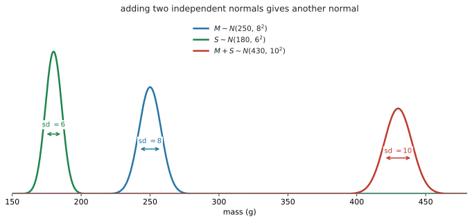
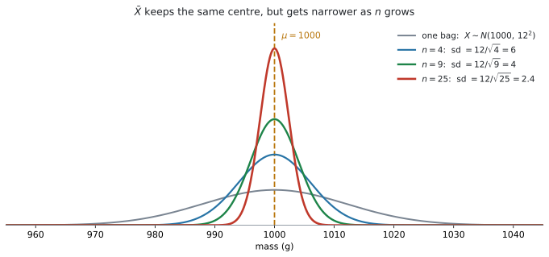
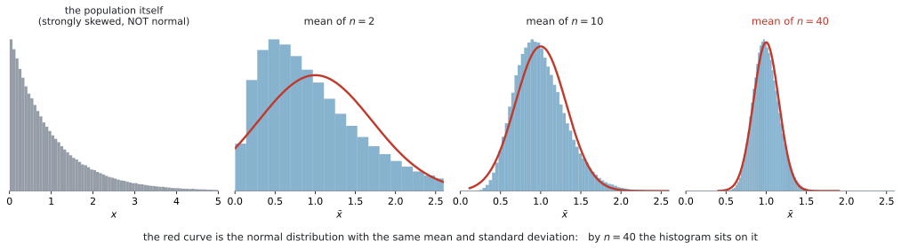

# AHL 4.15 — Linear combinations of normal variables（正規分布の一次結合） {#sec-ahl-4-15}

::: {.callout-note}
## What you should be able to do
- 独立な normal の和や差が、**やはり normal になる**と言える。
- その平均と分散を出して、$N(\mu,\ \sigma^{2})$ の形に書ける。
- そこから **normCdf で確率を求められる**。
- **$\bar{X} \sim N\!\left(\mu,\ \dfrac{\sigma^{2}}{n}\right)$** を使い、標本平均の確率を求められる。
- **central limit theorem**（中心極限定理）が何を言っているかを説明できる。
- もとの分布が normal でないとき、**$n > 30$ なら $\bar{X}$ を normal として扱える**と分かる。
:::

::: {.callout-important}
## AHL 4.14 で足りなかった「形」が、ここで手に入ります
[AHL 4.14](ahl-4-14.qmd) で、$E$ と $\text{Var}$ の出し方を学びました。ただ、そこで止まると**確率が求められません。**

$X \sim N(250,\ 8^{2})$ を $2$ つ足して、$X_1 + X_2$ の平均が $500$、分散が $128$ と分かっても、$P(X_1 + X_2 > 510)$ は出せないのです。**分布の形が分からない**からです。

このページが足すのは、その形です。

> **独立な normal を足しても引いても、出てくるのは normal。**

形が normal だと決まれば、[SL 4.9](../../ai-sl/04-statistics-and-probability/sl-4-9.qmd) の `normCdf` がそのまま使えます。**$E$ と $\text{Var}$ を出す（4.14）→ normal だと分かる（4.15）→ 確率を出す（SL 4.9）**、という $3$ 段構えです。
:::

::: {.callout-note}
## 公式集に、この項目の欄はありません
AI HL の公式集は **4.14 の次が 4.17** です。4.15 の欄は印刷されていません。

ただし、**使う式はすべて 4.14 の欄にあります。**

$$
E(a_1X_1 \pm a_2X_2 \pm \cdots) = a_1E(X_1) \pm a_2E(X_2) \pm \cdots
$$

$$
\text{Var}(a_1X_1 \pm a_2X_2 \pm \cdots) = a_1^{2}\text{Var}(X_1) + a_2^{2}\text{Var}(X_2) + \cdots
$$

このページが足すのは、**「その結果が normal になる」という一点**です。新しく覚える式はありません。
:::

::: {.callout-warning}
## $z$ 値は使いません
[SL 4.9](../../ai-sl/04-statistics-and-probability/sl-4-9.qmd) で見たとおり、シラバスにはっきり書かれています。

> This does **not** involve transformation to the standardized normal variable $z$.

$z = \dfrac{x-\mu}{\sigma}$ に直す必要はありません。**求めた $\mu$ と $\sigma$ を、そのまま `normCdf` に入れます。**

このページで手を動かすのは、**$\sigma$ を正しく出すところ**です。そこから先は、電卓に入れて計算します。
:::

## The idea

### 1. 形が分かってはじめて、確率が出せます {#idea}

[AHL 4.14](ahl-4-14.qmd#combinations) で、独立な確率変数の和について

$$
E(X_1 + X_2) = E(X_1) + E(X_2), \qquad \text{Var}(X_1 + X_2) = \text{Var}(X_1) + \text{Var}(X_2)
$$

を学びました。この $2$ つは、**どんな分布でも**成り立ちます。

しかし、平均と分散だけでは確率は出せません。**同じ平均・同じ分散をもつ分布は、いくらでもあるから**です。

このページが足すのは、次の $1$ 行です。

::: {.callout-important}
## 独立な normal の一次結合は、normal です
$X_1,\ X_2,\ \ldots,\ X_n$ が**独立**で、**それぞれ normal** なら

$$
a_1X_1 \pm a_2X_2 \pm \cdots \pm a_nX_n \quad \text{も normal}
$$ {#eq-ahl415-main}

です。平均と分散は 4.14 のとおりに出します。
:::

シラバスの書き方は、こうです。

> A **linear combination of $n$ independent normal random variables is normally distributed.** In particular, $X \sim N(\mu,\ \sigma^{2}) \Rightarrow \bar{X} \sim N\!\left(\mu,\ \frac{\sigma^{2}}{n}\right)$.

**「normal を入れれば、normal が出てくる」**——これだけです。ほかの分布ではこうなりません。

### 2. 和の standard deviation は、直角三角形の斜辺です {#sum}

$M \sim N(250,\ 8^{2})$ と $S \sim N(180,\ 6^{2})$ が独立なとき、$M + S$ を考えます。

{#fig-ahl415-sum width=100%}

平均は足すだけです。

$$
E(M + S) = 250 + 180 = 430
$$

分散も足します。**standard deviation ではなく、分散を足す**ところが要点です。

$$
\text{Var}(M + S) = 8^{2} + 6^{2} = 64 + 36 = 100 \quad \Longrightarrow \quad \sigma = \sqrt{100} = 10
$$

ですから $M + S \sim N(430,\ 100)$ です。

#### $8 + 6 = 14$ ではありません {#pythagoras}

$\sigma$ は $10$ であって、$14$ ではありません。**$2$ 乗して足して、平方根をとる**——@fig-ahl415-sum の右のとおり、**直角三角形の斜辺と同じ計算**です。

$$
\sigma = \sqrt{\sigma_1^{2} + \sigma_2^{2}}
$$ {#eq-ahl415-sd}

三角形の $2$ 辺が $8$ と $6$ なら、斜辺は $14$ ではなく $10$ でした。**ここが、この項目でいちばん多い失点です。**

::: {.callout-tip}
## 分散のまま計算して、最後に平方根をとってください
$\sigma$ を直接いじろうとすると、足したくなります。

**分散で計算する** → **最後に $\sqrt{\ }$** の順にすれば、迷いません。[AHL 4.14](ahl-4-14.qmd#sd) と同じ進め方です。
:::

### 3. $3$ ステップの型 {#steps}

この項目の問題は、ほとんど同じ形をしています。

| 手順 | やること | 使うもの |
|---|---|---|
| **1** | 平均を出す | [AHL 4.14](ahl-4-14.qmd#combinations) |
| **2** | 分散を出して、平方根で $\sigma$ にする | [AHL 4.14](ahl-4-14.qmd#varcomb) |
| **3** | $N(\mu,\ \sigma^{2})$ を `normCdf` に入れる | [SL 4.9](../../ai-sl/04-statistics-and-probability/sl-4-9.qmd#normcdf) |

: $3$ ステップ {#tbl-ahl415-steps}

**$1$ と $2$ は AHL 4.14、$3$ は SL 4.9 です。** このページが新しく足しているのは、$2$ と $3$ のあいだの「normal だと言ってよい」という一歩だけです。

::: {.callout-important}
## 答案には、$N(\mu,\ \sigma^{2})$ の行を必ず書いてください
電卓に入れる前に、**求めた分布を $1$ 行書く**習慣をつけてください。

*$M + S \sim N(430,\ 100)$*

ここに点が付きます。そして、**書いておくと $\sigma$ と $\sigma^{2}$ を取りちがえません。** $N$ のカッコの $2$ 番目は**分散**、`normCdf` に入れるのは**標準偏差**です。
:::

### 4. 差のときは、平均は引いて、分散は足します {#diff}

ここは [AHL 4.14](ahl-4-14.qmd#minus) と同じですが、大事なのでもう一度書きます。

$$
E(X - Y) = E(X) - E(Y) \qquad \text{ですが} \qquad \text{Var}(X - Y) = \text{Var}(X) + \text{Var}(Y)
$$ {#eq-ahl415-diff}

**平均は引き、分散は足します。** $Y$ の係数は $-1$ で、$(-1)^{2} = 1$ になるからです。

#### 「$A$ のほうが大きい確率」は、差で考えます {#which-bigger}

「$A$ が $B$ より大きい確率を求めなさい」（`Find the probability that A is greater than B`）と聞かれたら、$2$ つを別々に扱うのではなく、**差を $1$ つの確率変数にします。**

$$
D = A - B \quad \text{とおくと} \quad P(A > B) = P(D > 0)
$$ {#eq-ahl415-dgt0}

$D$ も normal なので、$P(D > 0)$ は `normCdf` で出せます。**$2$ つの分布を見くらべるのではなく、$1$ つの分布の面積を見る**——これがこの型の考え方です。

### 5. 標本平均 $\bar{X}$ の分布 {#xbar}

シラバスが `In particular` と名指ししている、この項目のもう $1$ つの中心です。

$$
X \sim N(\mu,\ \sigma^{2}) \quad \Longrightarrow \quad \bar{X} \sim N\!\left(\mu,\ \frac{\sigma^{2}}{n}\right)
$$ {#eq-ahl415-xbar}

$\bar{X}$ は、**大きさ $n$ の標本の平均**です。

{#fig-ahl415-xbar width=92%}

#### 中心は動かず、幅だけが狭くなります {#narrower}

@fig-ahl415-xbar を見てください。$4$ つの曲線は、**すべて $\mu = 1000$ を中心**にしています。違うのは幅だけです。

$$
\sigma_{\bar{X}} = \frac{\sigma}{\sqrt{n}}
$$ {#eq-ahl415-sdxbar}

**$\sigma / n$ ではありません。** 分散が $\sigma^{2}/n$ なので、平方根をとると分母は $\sqrt{n}$ になります。

$\sigma = 12$、$n = 9$ なら $\sigma_{\bar{X}} = \dfrac{12}{3} = 4$ です。$\dfrac{12}{9}$ ではありません。

::: {.callout-note}
## 意味は「平均のほうが、当てにできる」ということです
$1$ 袋の質量は $1000$ g から $20$ g ずれることもあります。しかし **$9$ 袋の平均**が $20$ g もずれることは、めったにありません。

重い袋と軽い袋が打ち消し合うからです（[AHL 4.14](ahl-4-14.qmd#cancel)）。

**$n$ を大きくすれば、$\bar{X}$ は $\mu$ に近いところに集まります。** これが、標本をたくさんとる理由です。
:::

::: {.callout-warning}
## $\bar{X}$ と、$1$ つの $X$ を取りちがえないでください
問題文が

- `the mass of one bag` … $X \sim N(1000,\ 12^{2})$、$\sigma = 12$
- `the mean mass of nine bags` … $\bar{X} \sim N(1000,\ 16)$、$\sigma = 4$
- `the total mass of nine bags` … $\sum X \sim N(9000,\ 1296)$、$\sigma = 36$

の $3$ つを区別します。**$\sigma$ は $12$、$4$、$36$ と全部違います。** 平均のほうは、`one` と `mean` が同じ $1000$ で、`total` だけ $9000$ です。

**平均が同じでも $\sigma$ が違う**——`one` と `mean` の取りちがえが危ないのは、まさにここです。

`one` なのか `mean` なのか `total` なのか——**そこを丸で囲んでから**計算を始めてください。
:::

### 6. 合計で解いても、平均で解いても同じです {#total}

「$n$ 個の合計」と「$n$ 個の平均」は、$n$ 倍の違いしかありません。ですから、**どちらで解いても同じ答え**になります。

$40$ 人の待ち時間で、$1$ 人あたり平均 $4.2$ 分、標準偏差 $2.5$ 分としましょう（この $2$ つから、$\dfrac{2.5^{2}}{40} = 0.15625$ と $40 \times 2.5^{2} = 250$ が出ます）。

| 聞き方 | 分布 | 求める確率 |
|---|---|---|
| 平均が $4.5$ 分を超える | $\bar{X} \sim N(4.2,\ 0.15625)$ | $P(\bar{X} > 4.5)$ |
| 合計が $180$ 分を超える | $\sum X \sim N(168,\ 250)$ | $P(\sum X > 180)$ |

: 同じことを $2$ 通りに聞く {#tbl-ahl415-total}

$180 = 40 \times 4.5$ なので、この $2$ つは**まったく同じ出来事**です。答えも一致します。

**問題文がどちらで聞いているかに、素直に合わせてください。** わざわざ変換する必要はありません。

### 7. Central limit theorem {#clt}

ここまでは、**もとの分布が normal**であることを前提にしてきました。normal でなければ、和も平均も normal にはなりません。

ところが、**$\bar{X}$ だけは、$n$ が大きいと正規に近づいていきます。** ぴったり正規になるわけではありません。

{#fig-ahl415-clt width=100%}

@fig-ahl415-clt のいちばん左は、**まったく normal でない**母集団です。右に大きく尾を引いています。

そこから $n$ 個をとって平均する、ということをくり返して、$\bar{X}$ の分布を描いたのが右の $3$ つです。

- $n = 2$ … まだ歪んでいます
- $n = 10$ … かなり正規に近づいてきました
- $n = 40$ … **赤い正規曲線にほぼ重なっています**

これが **central limit theorem**（中心極限定理）です。

> **同じ母集団から独立にとった観測値の平均 $\bar{X}$ は、母集団が正規分布でなくても、$n$ が大きくなると正規分布に近づく。**

#### 試験では $n > 30$ が目安です {#n30}

シラバスは、こう書いています。

> In general, $\bar{X}$ approaches normality for large $n$, **how large depends upon the distribution from which the sample is taken.** In examinations, **$n > 30$ will be considered sufficient.**

**どれくらい大きければよいかは、もとの分布による**——それが正直なところです。ただし試験では、**$n > 30$ なら十分**と決められています。

$n > 30$ のときは、もとの分布が normal でなくても、$\bar{X}$ を normal として扱ってよい、ということです。

**平均 $\mu$ と分散 $\dfrac{\sigma^{2}}{n}$ は、もとが normal でなくてもそのまま**です（[AHL 4.14](ahl-4-14.qmd#varcomb) から出るので、形は関係ありません）。CLT が足してくれるのは、**形が normal に近い**という一点だけです。

::: {.callout-important}
## 使う前に、$n$ を確かめて、答案に書いてください
CLT を使うときは、**理由を $1$ 行書きます。**

::: {.model-answer}
**試験ではこう書く**

*Since $n = 40 > 30$, by the central limit theorem $\bar{X}$ is approximately normal.*
:::

（$n = 40 > 30$ なので、中心極限定理により $\bar{X}$ はおよそ正規分布にしたがう、という意味です。）

**`approximately`（およそ）という語を入れてください。** ぴったり normal になるわけではありません。
:::

### 8. いつ normal と言ってよいのか {#when}

**答案で書き分けが問われるところです。** $2$ つの場合を、はっきり分けてください。

| もとの分布 | 何を求めるか | normal と言えるか |
|---|---|---|
| **normal** | 和・差・$\bar{X}$ のどれでも | **言える。** $n$ はいくつでもよい |
| **normal でない** | $\bar{X}$（または同じ母集団からの独立な $n$ 個の合計 $X_1 + \cdots + X_n$） | **$n > 30$ なら**、およそ normal（CLT） |
| **normal でない** | $\bar{X}$ で、$n$ が小さい | **言えない。** この課程では扱いません |
| **normal でない** | $1$ つの値 $X$ そのもの | **言えない。** CLT は平均の話です |

: normal と言ってよい場合 {#tbl-ahl415-when}

$2$ つ、注意があります。

#### もとが normal なら、$n$ は小さくてよい {#small-n}

$X \sim N(1000,\ 12^{2})$ から $n = 4$ の標本をとるなら、**$4 < 30$ でも $\bar{X}$ は正確に normal** です。CLT は要りません。@eq-ahl415-xbar がそのまま使えます。

**$n > 30$ が必要になるのは、もとが normal でないときだけ**です。

#### CLT は「データが normal になる」とは言っていません {#not-data}

ここを取りちがえる答案がよくあります。

CLT が言っているのは、**$\bar{X}$ の分布**が正規に近づくということです。**$1$ つ $1$ つのデータの分布は、いくら $n$ を増やしても歪んだままです。**

@fig-ahl415-clt のいちばん左の形は、$n$ をどれだけ大きくしても変わりません。変わるのは、その右の $3$ つのほうです。

## Why it works

:::: {.callout-note collapse="true" appearance="simple"}
## クリックすると開きます
ここで説明するのは $2$ つです。**なぜ $\bar{X}$ の分散が $\dfrac{\sigma^{2}}{n}$ になるのか**と、**CLT がなぜ起きるのか**。

### $\bar{X}$ の分散は、4.14 から出ます {#why-xbar}

$\bar{X}$ は、$n$ 個を足して $n$ で割ったものです。

$$
\bar{X} = \frac{1}{n}\bigl(X_1 + X_2 + \cdots + X_n\bigr)
$$

まず、カッコの中の分散を出します。独立なので、[AHL 4.14](ahl-4-14.qmd#varcomb) から

$$
\text{Var}(X_1 + \cdots + X_n) = \underbrace{\sigma^{2} + \sigma^{2} + \cdots + \sigma^{2}}_{n \text{ 個}} = n\sigma^{2}
$$

次に、$\dfrac{1}{n}$ を掛けます。$\text{Var}(aX) = a^{2}\text{Var}(X)$ なので

$$
\text{Var}(\bar{X}) = \left(\frac{1}{n}\right)^{2} \times n\sigma^{2} = \frac{n\sigma^{2}}{n^{2}} = \frac{\sigma^{2}}{n}
$$

**$\dfrac{1}{n^{2}}$ を掛けて、$n\sigma^{2}$ が入ってくる。** その差し引きで $\dfrac{\sigma^{2}}{n}$ が残ります。

平均のほうは、$E(\bar{X}) = \dfrac{1}{n} \times n\mu = \mu$ で、**$n$ によらず $\mu$ のまま**です。だから @fig-ahl415-xbar で中心が動かないのです。

### CLT は、打ち消し合いの結果です {#why-clt}

証明は、この課程の範囲を大きく超えます。ただ、**なぜそうなるのか**の見当はつけられます。

$\bar{X}$ を作るとき、$n$ 個の値を足しています。歪んだ分布から $1$ 個とれば、その値も歪んだ出方をします。しかし **$40$ 個とって足すと、大きく外れた値は、ふつうの値に埋もれて**いきます。

@fig-ahl415-clt の左の分布では、たまに $4$ や $5$ が出ます。$n = 1$ ならそれがそのまま出ますが、$n = 40$ の平均では、$1$ 個の $5$ は $\dfrac{5}{40}$ ぶんしか効きません。**$1$ 個の極端な値では、平均を動かせなくなる**のです。

その結果、$\bar{X}$ は「たくさんの小さなずれが積み重なったもの」になります。**そういうものは、平均と標準偏差がきちんと決まる分布からとったかぎり、正規分布の形になる**——これが中心極限定理の内容です。

::: {.callout-note appearance="simple"}
シラバスは、この定理について

> **Online simulations are useful for visualisation.**

と書いています。@fig-ahl415-clt は、そのシミュレーションを $1$ 枚の図にしたものです。$n$ を自分で動かせるシミュレーションを触ってみると、$n$ をいくつにすれば正規に近づくかが体で分かります。
:::
::::

## Worked examples

::: {.callout-note appearance="simple"}
問題文は英語です。意味が理解できなかったら、問題文の下の「**日本語訳**」を開いてください。解説は日本語です。
:::

::: {#exm-ahl415-sum}
[In a school canteen, the mass of a main dish, in grams, is $M \sim N(250,\ 8^{2})$ and the mass of a side dish is $S \sim N(180,\ 6^{2})$. The two masses are independent.]{.q-en}

[A meal consists of one main dish and one side dish. Let $T = M + S$ be the total mass of a meal.]{.q-en}

**(a)** [State the distribution of $T$, giving its mean and variance.]{.q-en}

**(b)** [Find $P(T > 445)$.]{.q-en}

**(c)** [Find the probability that the total mass of a meal is between $420$ g and $445$ g.]{.q-en}

<details class="jp-trans">
<summary>日本語訳</summary>

ある学校の食堂で、主菜の質量（グラム）は $M \sim N(250,\ 8^{2})$、副菜の質量は $S \sim N(180,\ 6^{2})$ です。この $2$ つの質量は独立です。

$1$ 食は、主菜 $1$ つと副菜 $1$ つからなります。$1$ 食の合計質量を $T = M + S$ とします。

**(a)** $T$ の分布を、平均と分散を示して述べなさい。

**(b)** $P(T > 445)$ を求めなさい。

**(c)** $1$ 食の合計質量が $420$ g から $445$ g のあいだになる確率を求めなさい。

</details>

**(a)** [第3節](#steps)の $3$ ステップのうち、$1$ と $2$ です。

平均は足します。

$$
E(T) = 250 + 180 = 430
$$

分散も足します。**standard deviation ではなく、分散**です。

$$
\text{Var}(T) = 8^{2} + 6^{2} = 64 + 36 = 100
$$

$M$ も $S$ も normal で、独立なので、$T$ も normal です（@eq-ahl415-main）。

$$
T \sim N(430,\ 100)
$$

**検算。** $\sigma = \sqrt{100} = 10$ です。$8 + 6 = 14$ ではありません（[第2節](#pythagoras)）。

**(b)** $\sigma = 10$ を `normCdf` に入れます。**$100$ ではありません。**

```
normCdf(445, 1E99, 430, 10)
```

$$
P(T > 445) = 0.0668
$$

**(c)** 両端があるので、`normCdf` の $2$ か所を埋めるだけです。

```
normCdf(420, 445, 430, 10)
```

$$
P(420 < T < 445) = 0.775
$$

::: {.callout-note}
## 解答例（答案用紙にはこう書く）
**(a)**
$$
E(T) = 250 + 180 = 430
$$
$$
\text{Var}(T) = 8^{2} + 6^{2} = 100
$$
$$
T \sim N(430,\ 100)
$$

**(b)**
$$
P(T > 445) = 0.0668
$$

**(c)**
$$
P(420 < T < 445) = 0.775
$$
:::

::: {.callout-tip}
## $2$ 杯のコーヒーなら、こうなります
同じ考え方で、**同じ分布のものを $2$ つ**足すこともできます。

$X \sim N(250,\ 8^{2})$ のコーヒーを $2$ 杯なら

$$
X_1 + X_2 \sim N(500,\ 128), \qquad \sigma = \sqrt{128} = 11.3
$$

で、$P(X_1 + X_2 > 510) = 0.188$ です。

**ここで $2X$ としてはいけません。** $2X$ なら分散は $4 \times 64 = 256$、$\sigma = 16$ になり、$P(2X > 510) = 0.266$ と**別の答え**になります（[AHL 4.14](ahl-4-14.qmd#two-x)）。

$2$ 杯あるのか、$1$ 杯を $2$ 倍するのか。**問題文で数えてください。**
:::
:::

::: {#exm-ahl415-diff}
[The lifetime of a battery of brand A, in hours, is $X \sim N(30,\ 4^{2})$. The lifetime of a battery of brand B is $Y \sim N(27,\ 3^{2})$. All lifetimes are independent.]{.q-en}

[One battery of each brand is chosen at random. Let $D = X - Y$.]{.q-en}

**(a)** [State the distribution of $D$.]{.q-en}

**(b)** [Find the probability that the brand A battery lasts longer than the brand B battery.]{.q-en}

**(c)** [Find the probability that the brand A battery lasts at least $5$ hours longer than the brand B battery.]{.q-en}

**(d)** [Explain why the standard deviation of $D$ is not $4 - 3 = 1$.]{.q-en}

<details class="jp-trans">
<summary>日本語訳</summary>

ブランド A の電池の寿命（時間）は $X \sim N(30,\ 4^{2})$、ブランド B の電池の寿命は $Y \sim N(27,\ 3^{2})$ です。すべての寿命は独立です。

`lifetime` は「寿命」、`at least` は「少なくとも」という意味です。

各ブランドから電池を $1$ 個ずつ無作為に選びます。$D = X - Y$ とします。

**(a)** $D$ の分布を述べなさい。

**(b)** ブランド A の電池のほうが、ブランド B の電池より長持ちする確率を求めなさい。

**(c)** ブランド A の電池が、ブランド B の電池より少なくとも $5$ 時間長持ちする確率を求めなさい。

**(d)** $D$ の標準偏差が $4 - 3 = 1$ にならない理由を説明しなさい。

</details>

**(a)** 平均は引きます。分散は**足します**（@eq-ahl415-diff）。

$$
E(D) = 30 - 27 = 3
$$

$$
\text{Var}(D) = 4^{2} + 3^{2} = 16 + 9 = 25
$$

$$
D \sim N(3,\ 25)
$$

$\sigma = \sqrt{25} = 5$ です。

**(b)** 「A のほうが長い」は「$D$ が正」ということです（@eq-ahl415-dgt0）。

$$
P(X > Y) = P(D > 0)
$$

```
normCdf(0, 1E99, 3, 5)
```

$$
P(D > 0) = 0.726
$$

**検算。** $E(D) = 3 > 0$ なので、確率は $0.5$ より大きくなるはずです ✓

**(c)** `at least 5 hours longer` は $D \geq 5$ です。

```
normCdf(5, 1E99, 3, 5)
```

$$
P(D \geq 5) = 0.345
$$

**(d)** $Y$ を引いても、$Y$ のばらつきは消えません。

::: {.model-answer}
**試験ではこう書く**

*Variances add, not standard deviations, and they add even for a difference: $\text{Var}(D) = 4^{2} + 3^{2} = 25$, so the standard deviation is $\sqrt{25} = 5$. Subtracting $Y$ does not remove the variability of $Y$ — if $Y$ varies, so does $X - Y$ — so the two sources of variability combine rather than cancel.*
:::

（分散が足されるのであって標準偏差ではなく、しかも差でも足される。$Y$ を引いても $Y$ のばらつきは消えず、$Y$ がぶれれば $X-Y$ もぶれるので、$2$ つのばらつきは打ち消し合わずに重なる、という意味です。）

::: {.callout-note}
## 解答例（答案用紙にはこう書く）
**(a)**
$$
E(D) = 30 - 27 = 3, \qquad \text{Var}(D) = 4^{2} + 3^{2} = 25
$$
$$
D \sim N(3,\ 25)
$$

**(b)**
$$
P(X > Y) = P(D > 0) = 0.726
$$

**(c)**
$$
P(D \geq 5) = 0.345
$$

**(d)** *Variances add rather than standard deviations, and they add for a difference as well as for a sum: $\text{Var}(D) = 16 + 9 = 25$, so $\sigma = 5$. Subtracting $Y$ does not remove the variability of $Y$.*
:::
:::

::: {#exm-ahl415-xbar}
[The mass of a bag of sugar, in grams, is normally distributed with mean $1000$ and standard deviation $12$.]{.q-en}

**(a)** [Find the probability that a randomly chosen bag has a mass less than $995$ g.]{.q-en}

**(b)** [Nine bags are chosen at random. Find the probability that their mean mass is less than $995$ g.]{.q-en}

**(c)** [Comment on the difference between your answers to parts (a) and (b).]{.q-en}

<details class="jp-trans">
<summary>日本語訳</summary>

砂糖 $1$ 袋の質量（グラム）は、平均 $1000$、標準偏差 $12$ の正規分布にしたがいます。

**(a)** 無作為に選んだ $1$ 袋の質量が $995$ g 未満である確率を求めなさい。

**(b)** $9$ 袋を無作為に選びます。その平均質量が $995$ g 未満である確率を求めなさい。

**(c)** (a) と (b) の答えの違いについて述べなさい。

</details>

**(a)** $1$ 袋なので、$X \sim N(1000,\ 12^{2})$ をそのまま使います。

```
normCdf(-1E99, 995, 1000, 12)
```

$$
P(X < 995) = 0.338
$$

**(b)** $9$ 袋の**平均**なので $\bar{X}$ です（@eq-ahl415-xbar）。

$$
\bar{X} \sim N\!\left(1000,\ \frac{144}{9}\right) = N(1000,\ 16)
$$

$$
\sigma_{\bar{X}} = \frac{12}{\sqrt{9}} = \frac{12}{3} = 4
$$

```
normCdf(-1E99, 995, 1000, 4)
```

$$
P(\bar{X} < 995) = 0.106
$$

**検算。** $\sigma$ が $12$ から $4$ に**小さく**なったので、確率も小さくなるはずです ✓

**(c)** $9$ 袋の平均のほうが、はるかに起こりにくくなっています。

::: {.model-answer}
**試験ではこう書く**

*The probability drops from $0.338$ to $0.106$. For a single bag, one light bag is enough to fall below $995$ g. For the mean of nine bags, all the light bags would have to fail to be offset by heavier ones, which is much less likely. The standard deviation of the mean is $12/\sqrt{9} = 4$, only a third of the standard deviation of a single bag.*
:::

（確率は $0.338$ から $0.106$ に下がる。$1$ 袋なら軽い袋 $1$ つで $995$ g を下回るが、$9$ 袋の平均では軽い袋が重い袋で打ち消されない必要があり、はるかに起こりにくい、という意味です。）

::: {.callout-note}
## 解答例（答案用紙にはこう書く）
**(a)**
$$
X \sim N(1000,\ 144), \qquad P(X < 995) = 0.338
$$

**(b)**
$$
\bar{X} \sim N\!\left(1000,\ \frac{144}{9}\right) = N(1000,\ 16), \qquad \sigma_{\bar{X}} = 4
$$
$$
P(\bar{X} < 995) = 0.106
$$

**(c)** *The probability is much smaller for the mean of nine bags ($0.106$ against $0.338$), because the standard deviation of $\bar{X}$ is $12/\sqrt{9} = 4$, only one third of that of a single bag. Light bags tend to be offset by heavy ones, so the mean of nine bags stays close to $1000$ g.*
:::
:::

::: {#exm-ahl415-clt}
[At a service desk, the time taken to serve one customer has mean $4.2$ minutes and standard deviation $2.5$ minutes. The distribution of these times is strongly skewed and is **not** normal. The times are independent.]{.q-en}

[On one day, $40$ customers are served.]{.q-en}

**(a)** [Explain why the mean serving time for these $40$ customers can be treated as normally distributed.]{.q-en}

**(b)** [Find the probability that the mean serving time for the $40$ customers is greater than $4.5$ minutes.]{.q-en}

**(c)** [Show that the probability that the total serving time for the $40$ customers exceeds $180$ minutes is the same as your answer to part (b).]{.q-en}

<details class="jp-trans">
<summary>日本語訳</summary>

ある受付で、$1$ 人の客に対応する時間は、平均 $4.2$ 分、標準偏差 $2.5$ 分です。この時間の分布は大きく歪んでおり、**正規分布ではありません。** 各時間は独立です。

`service desk` は「受付」、`skewed` は「歪んだ」、`exceeds` は「〜を超える」という意味です。

ある日、$40$ 人の客に対応しました。

**(a)** この $40$ 人の平均対応時間が、正規分布として扱える理由を説明しなさい。

**(b)** $40$ 人の平均対応時間が $4.5$ 分を超える確率を求めなさい。

**(c)** $40$ 人の合計対応時間が $180$ 分を超える確率が、(b) の答えと同じになることを示しなさい。

</details>

**(a)** もとの分布は normal ではありません。ですから @eq-ahl415-main は使えません。使うのは **central limit theorem** です（[第7節](#clt)）。

::: {.model-answer}
**試験ではこう書く**

*The sample size is $n = 40$, which is greater than $30$, so by the central limit theorem the mean serving time $\bar{X}$ is approximately normally distributed, even though the distribution of individual times is not normal.*
:::

（$n = 40 > 30$ なので、個々の時間の分布が正規でなくても、中心極限定理により平均 $\bar{X}$ はおよそ正規分布にしたがう、という意味です。）

**(b)**

$$
\text{Var}(\bar{X}) = \frac{2.5^{2}}{40} = \frac{6.25}{40} = 0.15625
$$

$$
\sigma_{\bar{X}} = \sqrt{0.15625} = 0.395
$$

```
normCdf(4.5, 1E99, 4.2, 0.39528)
```

$$
P(\bar{X} > 4.5) = 0.224
$$

**丸める前の $\sigma$ を使ってください。** $0.395$ で計算しても $3$ 桁目までは同じですが、電卓の値をそのまま使うほうが確実です。

**(c)** 合計 $\sum X$ で考えます。

$$
E\left(\sum X\right) = 40 \times 4.2 = 168, \qquad \text{Var}\left(\sum X\right) = 40 \times 2.5^{2} = 250
$$

$$
\sigma = \sqrt{250} = 15.8
$$

```
normCdf(180, 1E99, 168, 15.811)
```

$$
P\left(\sum X > 180\right) = 0.224
$$

**同じ値になりました。** $180 = 40 \times 4.5$ だからです。「合計が $180$ を超える」と「平均が $4.5$ を超える」は、**言い方が違うだけの同じ出来事**です（[第6節](#total)）。

::: {.callout-note}
## 解答例（答案用紙にはこう書く）
**(a)** *$n = 40 > 30$, so by the central limit theorem $\bar{X}$ is approximately normal, even though the underlying distribution is not.*

**(b)**
$$
\bar{X} \sim N\!\left(4.2,\ \frac{2.5^{2}}{40}\right) = N(4.2,\ 0.15625), \qquad \sigma_{\bar{X}} = 0.395
$$
$$
P(\bar{X} > 4.5) = 0.224
$$

**(c)**
$$
\textstyle\sum X \sim N(168,\ 250), \qquad \sigma = 15.8
$$
$$
\textstyle P\left(\sum X > 180\right) = 0.224
$$
*This is the same event as $\bar{X} > 4.5$, since $180 = 40 \times 4.5$.*
:::
:::

## Common errors

::: {.callout-warning}
## standard deviation を足してしまう
$8$ と $6$ から $14$ としてしまう誤りです。**足すのは分散**で、$\sigma = \sqrt{8^{2}+6^{2}} = 10$ です（[第2節](#pythagoras)）。

**分散で計算して、最後に平方根**——この順にしてください。
:::

::: {.callout-warning}
## 差のときに、分散を引いてしまう
$16 - 9 = 7$ としてしまう誤りです。**差でも分散は足します**（[第4節](#diff)）。

$Y$ の係数 $-1$ は $2$ 乗されて $+1$ になるからです。
:::

::: {.callout-warning}
## `normCdf` に分散を入れてしまう
$N(430,\ 100)$ の $100$ は**分散**です。`normCdf` に入れるのは **$\sigma = 10$** です（[SL 4.9](../../ai-sl/04-statistics-and-probability/sl-4-9.qmd)）。

$100$ を入れると $P(T > 445) = 0.440$ となり、正しい $0.0668$ とはまったく違う答えになります。
:::

::: {.callout-warning}
## $\bar{X}$ の standard deviation を $\dfrac{\sigma}{n}$ にする
$\dfrac{12}{9}$ ではなく $\dfrac{12}{\sqrt{9}} = 4$ です（[第5節](#narrower)）。

**分散が $\dfrac{\sigma^{2}}{n}$** なので、平方根をとると分母は $\sqrt{n}$ になります。
:::

::: {.callout-warning}
## $X_1 + X_2$ を $2X$ として計算する
$2$ つのものを足すのか、$1$ つのものを $2$ 倍するのかで、分散が $2$ 倍と $4$ 倍に分かれます（[AHL 4.14](ahl-4-14.qmd#two-x)）。

**平均は同じになる**ので、平均だけ見ていても気づけません。**問題文で、いくつあるかを数えてください。**
:::

::: {.callout-warning}
## `one` / `mean` / `total` を読み分けない
同じ $9$ 袋でも、$\sigma$ は $12$、$4$、$36$ と $3$ 通りになります（[第5節](#xbar)）。

**問題文のその語を丸で囲んでから**、計算を始めてください。
:::

::: {.callout-warning}
## もとが normal でないのに、$n$ を確かめずに使う
CLT が使えるのは、試験では **$n > 30$** のときです（[第7節](#n30)）。

$n = 10$ で、もとが normal でないなら、**この課程では答えを出せません。** シラバスが $n > 30$ を目安と決めているので、そういう設定は出題されません。
:::

::: {.callout-warning}
## もとが normal なのに、$n > 30$ を要求してしまう
逆向きの誤りです。**もとが normal なら、$n$ がいくつでも $\bar{X}$ は正確に normal** です（[第8節](#small-n)）。

$n = 4$ でも構いません。CLT を持ち出す必要はありません。
:::

::: {.callout-warning}
## CLT を「データが normal に近づく」と説明する
CLT が言っているのは、**$\bar{X}$ の分布**についてです。$1$ つ $1$ つのデータの分布は、$n$ をどれだけ増やしても変わりません（[第8節](#not-data)）。

答案では、**何が normal に近づくのか**をはっきり書いてください。
:::

::: {.callout-warning}
## CLT を使ったのに、理由を書かない
`Explain why` でなくても、CLT を使ったら **$n > 30$ である**ことを $1$ 行書いておきます（[第7節](#n30)）。

`approximately` という語も入れてください。ぴったり normal になるわけではありません。
:::

::: {.callout-warning}
## `independent` と書かれていないのに、分散を足す
分散を足せるのは、**独立なとき**です（[AHL 4.14](ahl-4-14.qmd#varcomb)）。

試験では問題文に `independent` と書かれます。**そこを先に読んでください。**
:::

## Using your GDC (TI-Nspire CX II)

この項目の電卓操作は、**SL 4.9 とまったく同じ**です。新しい機能は使いません。

### 1. Normal Cdf に入れるのは $\sigma$ です {#gdc-normcdf}

```
menu → Statistics → Distributions → Normal Cdf
```

欄は $4$ つです。

| 欄 | 入れるもの |
|---|---|
| `Lower Bound` | 下の端。なければ $-1E99$ |
| `Upper Bound` | 上の端。なければ $1E99$ |
| `μ` | 求めた平均 |
| `σ` | 求めた**標準偏差**。分散ではありません |

: Normal Cdf の $4$ 欄 {#tbl-ahl415-gdc}

**$N(430,\ 100)$ の $100$ をそのまま $\sigma$ の欄に入れないでください。** 入れるのは $\sqrt{100} = 10$ です。

### 2. $\sigma$ は、丸める前の値を使う {#gdc-unrounded}

$\sigma = \sqrt{0.15625} = 0.39528\ldots$ のように**割り切れない**ことがよくあります。

答案には $3$ 桁で書きますが、**`normCdf` には電卓の値をそのまま入れてください。** 前の行の答えは `ans` で呼び出せます。

```
√(2.5^2/40)  →  ans
normCdf(4.5, 1E99, 4.2, ans)
```

### 3. 「$A$ が $B$ より大きい」は $1$ 回で済ませる {#gdc-diff}

$P(X > Y)$ を、$2$ つの分布を見くらべて出そうとしないでください。**$D = X - Y$ を作れば、`normCdf` $1$ 回**で終わります（[第4節](#which-bigger)）。

```
normCdf(0, 1E99, 3, 5)
```

### 4. 逆向きに使うときは Inverse Normal {#gdc-invnorm}

「$P(\bar{X} > k) = 0.05$ となる $k$」のような問題では、`Inverse Normal` を使います（[SL 4.9](../../ai-sl/04-statistics-and-probability/sl-4-9.qmd#inverse)）。

**入れるのは左からの面積**です。右が $0.05$ なら、$0.95$ を入れます。

```
invNorm(0.90, 60, 2.5)
```

たとえばこれは、$N(60,\ 2.5^{2})$ で「上から $10\%$ に入る境目」を求めています。返るのは $63.2$ です。

## Exercises

::: {.callout-note appearance="simple"}
各問題に、折りたたみが3つ付いています。**日本語訳**、**解答例**（答案用紙に書くべきこと。英語です）、**解説**（なぜそうなるか。日本語です）。

まず自分で解いて、次に解答例と見くらべてください。**解説は、合わなかったときだけ開けば十分です。**
:::

::: {.exercise-block}

[1]{.ex-no} [The independent random variables $X$ and $Y$ are such that $X \sim N(50,\ 5^{2})$ and $Y \sim N(30,\ 12^{2})$. State the distribution of $X + Y$ and the distribution of $X - Y$, giving the mean and variance of each.]{.q-en}

<details class="jp-trans">
<summary>日本語訳</summary>

独立な確率変数 $X$ と $Y$ について、$X \sim N(50,\ 5^{2})$、$Y \sim N(30,\ 12^{2})$ です。$X+Y$ の分布と $X-Y$ の分布を、それぞれ平均と分散を示して述べなさい。

</details>

::: {.callout-note collapse="true"}
## 解答例（答案用紙に書くこと）
$$
X + Y \sim N(80,\ 169)
$$
$$
X - Y \sim N(20,\ 169)
$$
:::

::: {.callout-tip collapse="true"}
## 解説
分散は $5^{2} + 12^{2} = 25 + 144 = 169$ です。**和でも差でも同じ**になります（[第4節](#diff)）。

$\sigma = \sqrt{169} = 13$。$5 + 12 = 17$ でも $12 - 5 = 7$ でもありません。

**$5$、$12$、$13$ は直角三角形の $3$ 辺です**（[第2節](#pythagoras)）。

平均だけが $80$ と $20$ で違います。
:::

::: {.ex-sep}
:::

[2]{.ex-no} [Using the random variables $X$ and $Y$ from question 1, find $P(X + Y > 95)$.]{.q-en}

<details class="jp-trans">
<summary>日本語訳</summary>

問題 1 の確率変数 $X$ と $Y$ について、$P(X+Y > 95)$ を求めなさい。

</details>

::: {.callout-note collapse="true"}
## 解答例（答案用紙に書くこと）
$$
X + Y \sim N(80,\ 169), \qquad \sigma = 13
$$
$$
P(X + Y > 95) = 0.124
$$
:::

::: {.callout-tip collapse="true"}
## 解説
問題 1 で出した分布を、そのまま `normCdf` に入れます。

```
normCdf(95, 1E99, 80, 13)
```

**入れるのは $13$ で、$169$ ではありません**（[GDC 第1節](#gdc-normcdf)）。$169$ を入れると $0.465$ という別の答えになります。

**検算。** $95$ は平均 $80$ より上なので、確率は $0.5$ より小さくなるはずです ✓
:::

::: {.ex-sep}
:::

[3]{.ex-no} [The random variable $X$ is normally distributed with mean $20$ and standard deviation $5$. A random sample of $16$ observations is taken. Find the probability that the sample mean is greater than $21.5$.]{.q-en}

<details class="jp-trans">
<summary>日本語訳</summary>

確率変数 $X$ は、平均 $20$、標準偏差 $5$ の正規分布にしたがいます。$16$ 個の観測値からなる無作為標本をとります。標本平均が $21.5$ より大きい確率を求めなさい。

</details>

::: {.callout-note collapse="true"}
## 解答例（答案用紙に書くこと）
$$
\bar{X} \sim N\!\left(20,\ \frac{25}{16}\right), \qquad \sigma_{\bar{X}} = \frac{5}{\sqrt{16}} = 1.25
$$
$$
P(\bar{X} > 21.5) = 0.115
$$
:::

::: {.callout-tip collapse="true"}
## 解説
$X$ が normal なので、$n = 16$ でも $\bar{X}$ は**正確に** normal です（[第8節](#small-n)）。$n > 30$ は要りません。

$\sigma_{\bar{X}} = \dfrac{5}{\sqrt{16}} = \dfrac{5}{4} = 1.25$。**$\dfrac{5}{16}$ ではありません**（[第5節](#narrower)）。

```
normCdf(21.5, 1E99, 20, 1.25)
```

**$1$ つの $X$ なら** $\sigma = 5$ で、$P(X > 21.5)$ は $0.382$ です。標本平均のほうが、ずっと起こりにくくなっています。
:::

::: {.ex-sep}
:::

[4]{.ex-no} [The mass of an empty box, in kg, is $B \sim N(0.4,\ 0.05^{2})$. The mass of its contents is $C \sim N(2.5,\ 0.2^{2})$. The two masses are independent.]{.q-en}

**(a)** [Find the mean and standard deviation of the total mass of a filled box.]{.q-en}

**(b)** [Find the probability that a filled box has a mass greater than $3$ kg.]{.q-en}

<details class="jp-trans">
<summary>日本語訳</summary>

空の箱の質量（kg）は $B \sim N(0.4,\ 0.05^{2})$ です。中身の質量は $C \sim N(2.5,\ 0.2^{2})$ です。この $2$ つの質量は独立です。

`filled box` は「中身の入った箱」という意味です。

**(a)** 中身の入った箱の合計質量の、平均と標準偏差を求めなさい。

**(b)** 中身の入った箱の質量が $3$ kg より大きい確率を求めなさい。

</details>

::: {.callout-note collapse="true"}
## 解答例（答案用紙に書くこと）
**(a)**
$$
E(B + C) = 0.4 + 2.5 = 2.9 \text{ kg}
$$
$$
\text{Var}(B + C) = 0.05^{2} + 0.2^{2} = 0.0025 + 0.04 = 0.0425
$$
$$
\sigma = \sqrt{0.0425} = 0.206 \text{ kg}
$$

**(b)**
$$
B + C \sim N(2.9,\ 0.0425)
$$
$$
P(B + C > 3) = 0.314
$$
:::

::: {.callout-tip collapse="true"}
## 解説
**(a)** 小数の $2$ 乗になるので、桁に気をつけてください。$0.05^{2} = 0.0025$ です。$0.025$ ではありません。

$0.05 + 0.2 = 0.25$ としてしまうと誤りです（[第2節](#pythagoras)）。正しくは $0.206$。

**(b)** $\sigma$ は $\sqrt{0.0425} = 0.20615\ldots$ です。**丸める前の値**を `normCdf` に入れてください（[GDC 第2節](#gdc-unrounded)）。

```
√(0.0425)  →  ans
normCdf(3, 1E99, 2.9, ans)
```

**箱のばらつきは、ほとんど効いていません。** $0.05$ に対して中身が $0.2$ なので、$2$ 乗すると $0.0025$ と $0.04$ で $16$ 倍の差があります。**小さいほうのばらつきは、$2$ 乗するとさらに小さくなる**——これが $2$ 乗して足すことの効き方です。
:::

::: {.ex-sep}
:::

[5]{.ex-no} [The random variable $X$ is normally distributed with standard deviation $\sigma$. A random sample of $n$ observations is taken. Explain why the standard deviation of the sample mean is $\dfrac{\sigma}{\sqrt{n}}$ and not $\dfrac{\sigma}{n}$.]{.q-en}

<details class="jp-trans">
<summary>日本語訳</summary>

確率変数 $X$ は、標準偏差 $\sigma$ の正規分布にしたがいます。$n$ 個の観測値からなる無作為標本をとります。標本平均の標準偏差が $\dfrac{\sigma}{n}$ ではなく $\dfrac{\sigma}{\sqrt{n}}$ になる理由を説明しなさい。

</details>

::: {.callout-note collapse="true"}
## 解答例（答案用紙に書くこと）
$$
\bar{X} = \frac{1}{n}(X_1 + \cdots + X_n)
$$
$$
\text{Var}(X_1 + \cdots + X_n) = n\sigma^{2}
$$
$$
\text{Var}(\bar{X}) = \left(\frac{1}{n}\right)^{2} \times n\sigma^{2} = \frac{\sigma^{2}}{n}
$$
$$
\text{sd}(\bar{X}) = \sqrt{\frac{\sigma^{2}}{n}} = \frac{\sigma}{\sqrt{n}}
$$

*The formula $\text{Var}(aX) = a^{2}\text{Var}(X)$ squares the factor $\frac{1}{n}$, and the $n$ independent variances add to $n\sigma^{2}$. Taking the square root at the end gives $\sqrt{n}$ in the denominator, not $n$.*
:::

::: {.callout-tip collapse="true"}
## 解説
`Explain why` なので、**式を並べて、言葉で締めます。**

要点は $2$ つです。

- $\dfrac{1}{n}$ は **$2$ 乗されて** $\dfrac{1}{n^{2}}$ になる（[AHL 4.14](ahl-4-14.qmd#variance)）
- $n$ 個の分散が足されて $n\sigma^{2}$ になる（[AHL 4.14](ahl-4-14.qmd#varcomb)）

$\dfrac{n\sigma^{2}}{n^{2}} = \dfrac{\sigma^{2}}{n}$ で、**$n$ が $1$ つ約分されて残ります。**

最後に平方根をとるので、分母は $\sqrt{n}$ です（[Why it works](#why-xbar)）。

::: {.model-answer}
**試験ではこう書く**

*Since $\bar{X} = \frac{1}{n}(X_1 + \cdots + X_n)$ and the observations are independent, the variances add to give $n\sigma^{2}$. Multiplying by $\frac{1}{n}$ multiplies the variance by $\left(\frac{1}{n}\right)^{2}$, so $\text{Var}(\bar{X}) = \frac{n\sigma^{2}}{n^{2}} = \frac{\sigma^{2}}{n}$. The standard deviation is the square root of this, which is $\frac{\sigma}{\sqrt{n}}$.*
:::
:::

::: {.ex-sep}
:::

[6]{.ex-no} [The number of minutes a train is late has mean $8.4$ and standard deviation $3.6$. The distribution is not normal. A random sample of $50$ journeys is taken.]{.q-en}

**(a)** [State, with a reason, why the mean delay for these $50$ journeys can be treated as normally distributed.]{.q-en}

**(b)** [Find the probability that the mean delay for the $50$ journeys is less than $8$ minutes.]{.q-en}

<details class="jp-trans">
<summary>日本語訳</summary>

ある列車の遅れ（分）は、平均 $8.4$、標準偏差 $3.6$ です。この分布は正規分布ではありません。$50$ 回の運行からなる無作為標本をとります。

`journey` は「運行」、`delay` は「遅れ」という意味です。

**(a)** この $50$ 回の平均の遅れが正規分布として扱える理由を、根拠を示して述べなさい。

**(b)** $50$ 回の平均の遅れが $8$ 分未満である確率を求めなさい。

</details>

::: {.callout-note collapse="true"}
## 解答例（答案用紙に書くこと）
**(a)** *$n = 50 > 30$, so by the central limit theorem the mean delay $\bar{X}$ is approximately normally distributed, even though the distribution of individual delays is not normal.*

**(b)**
$$
\bar{X} \sim N\!\left(8.4,\ \frac{3.6^{2}}{50}\right) = N(8.4,\ 0.2592), \qquad \sigma_{\bar{X}} = 0.509
$$
$$
P(\bar{X} < 8) = 0.216
$$
:::

::: {.callout-tip collapse="true"}
## 解説
**(a)** `with a reason` なので、**$n > 30$ を必ず書いてください。** 「中心極限定理より」だけでは、根拠になりません。

`approximately` も忘れずに（[第7節](#n30)）。

::: {.model-answer}
**試験ではこう書く**

*The sample size $n = 50$ is greater than $30$, so by the central limit theorem $\bar{X}$ is approximately normally distributed, even though the distribution of individual delays is not normal.*
:::

**(b)** $\text{Var}(\bar{X}) = \dfrac{3.6^{2}}{50} = \dfrac{12.96}{50} = 0.2592$。$\sigma_{\bar{X}} = 0.50911\ldots$

```
√(3.6^2/50)  →  ans
normCdf(-1E99, 8, 8.4, ans)
```

**もとの分布が正規でなくても、平均と標準偏差はそのまま使えます。** CLT が保証してくれるのは**形**だけで、平均と分散は [AHL 4.14](ahl-4-14.qmd) のとおりです。
:::

::: {.ex-sep}
:::

[7]{.ex-no} [For each of the following, state whether the quantity can be treated as normally distributed, and give a reason.]{.q-en}

**(a)** [The sum of $3$ independent observations from a normal distribution.]{.q-en}

**(b)** [The mean of $8$ observations from a distribution that is strongly skewed.]{.q-en}

**(c)** [The mean of $60$ observations from a distribution that is strongly skewed.]{.q-en}

<details class="jp-trans">
<summary>日本語訳</summary>

次のそれぞれについて、正規分布として扱えるかどうかを述べ、理由を書きなさい。

**(a)** 正規分布からの、独立な $3$ 個の観測値の合計。

**(b)** 大きく歪んだ分布からの、$8$ 個の観測値の平均。

**(c)** 大きく歪んだ分布からの、$60$ 個の観測値の平均。

</details>

::: {.callout-note collapse="true"}
## 解答例（答案用紙に書くこと）
**(a)** *Yes. A linear combination of independent normal variables is itself normal, whatever the sample size, so the sum of $3$ observations is exactly normal.*

**(b)** *No. The underlying distribution is not normal, and $n = 8$ is not greater than $30$, so the central limit theorem cannot be applied.*

**(c)** *Yes, approximately. Although the underlying distribution is not normal, $n = 60 > 30$, so by the central limit theorem the mean is approximately normally distributed.*
:::

::: {.callout-tip collapse="true"}
## 解説
[第8節の表](#when)が、そのまま答えになる問題です。

**(a)** もとが normal なら、$n$ は関係ありません（[第8節](#small-n)）。$3$ 個でも $100$ 個でも normal です。しかも**およそ**ではなく**正確に** normal です。

**(b)** もとが normal でなく、$n$ も小さい。**この課程では、正規として扱えません。**

**(c)** もとは normal でないので、CLT に頼ります。$60 > 30$ なので使えます。ただし**およそ**です。

::: {.model-answer}
**試験ではこう書く**

*(a) Yes — a linear combination of independent normal variables is normal for any $n$.*

*(b) No — the distribution is not normal and $n = 8$ is not greater than $30$, so the central limit theorem does not apply.*

*(c) Yes, approximately — the distribution is not normal, but $n = 60 > 30$, so the central limit theorem applies to the mean.*
:::

**(a) と (c) で、`exactly` と `approximately` を書き分けている**ところを見てください。ここが読まれます。
:::

::: {.ex-sep}
:::

[8]{.ex-no} [The random variable $X$ is normally distributed with mean $10$ and standard deviation $2$. Let $X_1$, $X_2$ and $X_3$ be independent observations of $X$.]{.q-en}

**(a)** [Find $P(3X > 36)$.]{.q-en}

**(b)** [Find $P(X_1 + X_2 + X_3 > 36)$.]{.q-en}

**(c)** [Comment on the difference between your two answers.]{.q-en}

<details class="jp-trans">
<summary>日本語訳</summary>

確率変数 $X$ は、平均 $10$、標準偏差 $2$ の正規分布にしたがいます。$X_1$、$X_2$、$X_3$ を $X$ の独立な観測値とします。

**(a)** $P(3X > 36)$ を求めなさい。

**(b)** $P(X_1 + X_2 + X_3 > 36)$ を求めなさい。

**(c)** $2$ つの答えの違いについて述べなさい。

</details>

::: {.callout-note collapse="true"}
## 解答例（答案用紙に書くこと）
**(a)**
$$
3X \sim N(30,\ 3^{2} \times 4) = N(30,\ 36), \qquad \sigma = 6
$$
$$
P(3X > 36) = 0.159
$$

**(b)**
$$
X_1 + X_2 + X_3 \sim N(30,\ 3 \times 4) = N(30,\ 12), \qquad \sigma = 3.46
$$
$$
P(X_1 + X_2 + X_3 > 36) = 0.0416
$$

**(c)** *Both have mean $30$, but the sum of three separate observations has the smaller variance ($12$ against $36$), because a high observation can be offset by a low one. Tripling a single observation triples its deviation from the mean, so $3X$ is much more likely to exceed $36$.*
:::

::: {.callout-tip collapse="true"}
## 解説
[AHL 4.14](ahl-4-14.qmd#two-x) の $2X$ と $X_1+X_2$ を、**確率まで出すところ**まで進めた問題です。

**平均はどちらも $30$** です。それでも確率は $0.159$ と $0.0416$ で、**$3$ 倍以上違います。**

**(a)** $\text{Var}(3X) = 3^{2} \times 4 = 36$。$\sigma = 6$。

**(b)** $\text{Var}(X_1+X_2+X_3) = 4+4+4 = 12$。$\sigma = \sqrt{12} = 3.4641\ldots$

**(c)** `Comment on` なので、**数を文脈に戻して**書きます。

::: {.model-answer}
**試験ではこう書く**

*Both variables have mean $30$, but $3X$ has standard deviation $6$ while the sum has standard deviation $3.46$. With three separate observations a high value can be balanced by a low one, so the total stays closer to $30$. With $3X$ there is only one observation, and its deviation from the mean is tripled, so values far from $30$ are much more likely.*
:::
:::

::: {.ex-sep}
:::

[9]{.ex-no} [The mass of a component, in grams, is normally distributed with mean $500$ and standard deviation $20$. A random sample of $25$ components is taken. Find the value of $k$ such that $P(\bar{X} > k) = 0.05$.]{.q-en}

<details class="jp-trans">
<summary>日本語訳</summary>

ある部品の質量（グラム）は、平均 $500$、標準偏差 $20$ の正規分布にしたがいます。$25$ 個の部品からなる無作為標本をとります。$P(\bar{X} > k) = 0.05$ となる $k$ の値を求めなさい。

</details>

::: {.callout-note collapse="true"}
## 解答例（答案用紙に書くこと）
$$
\bar{X} \sim N\!\left(500,\ \frac{400}{25}\right) = N(500,\ 16), \qquad \sigma_{\bar{X}} = 4
$$
$$
k = 507 \text{ g}
$$
:::

::: {.callout-tip collapse="true"}
## 解説
まず $\bar{X}$ の分布を出します。$\sigma_{\bar{X}} = \dfrac{20}{\sqrt{25}} = \dfrac{20}{5} = 4$。

次に `Inverse Normal` です。求めたいのは「**上側**の面積が $0.05$ になる $k$」ですが、**電卓に入れるのは左からの面積**です（[GDC 第4節](#gdc-invnorm)）。ですから $0.05$ ではなく

$$
1 - 0.05 = 0.95
$$

を入れます。$\mu$ と $\sigma$ の欄には、$1$ 行目で出した $\bar{X}$ の値（$500$ と $4$）を入れます。**もとの $\sigma = 20$ ではありません。**

```
invNorm(0.95, 500, 4)
```

$$
k = 506.579\ldots \approx 507 \text{ g}
$$

**検算。** $k$ は平均 $500$ より**上**にあるはずです ✓ $0.05$ をそのまま入れると $493$ が返り、平均より下になるので、そこで気づけます。
:::

::: {.ex-sep}
:::

[10]{.ex-no} [The mass of an adult, in kg, is normally distributed with mean $72$ and standard deviation $10$. A lift has a maximum load of $620$ kg.]{.q-en}

**(a)** [Eight adults enter the lift. Find the probability that their total mass exceeds the maximum load.]{.q-en}

**(b)** [A student calculates the answer as $P(8X > 620)$, where $X \sim N(72,\ 10^{2})$. Explain why this is not correct.]{.q-en}

<details class="jp-trans">
<summary>日本語訳</summary>

ある大人の体重（kg）は、平均 $72$、標準偏差 $10$ の正規分布にしたがいます。あるエレベーターの最大積載量は $620$ kg です。

`lift` は「エレベーター」、`maximum load` は「最大積載量」という意味です。

**(a)** $8$ 人の大人がエレベーターに乗ります。合計体重が最大積載量を超える確率を求めなさい。

**(b)** ある生徒が、$X \sim N(72,\ 10^{2})$ として答えを $P(8X > 620)$ で計算しました。これが正しくない理由を説明しなさい。

</details>

::: {.callout-note collapse="true"}
## 解答例（答案用紙に書くこと）
**(a)**
$$
X_1 + \cdots + X_8 \sim N(8 \times 72,\ 8 \times 100) = N(576,\ 800)
$$
$$
\sigma = \sqrt{800} = 28.3
$$
$$
P(\text{total} > 620) = 0.0599
$$

**(b)** *$8X$ represents one adult whose mass is multiplied by $8$, not eight different adults. It gives $\text{Var}(8X) = 8^{2} \times 100 = 6400$ and $\sigma = 80$, whereas eight independent adults give $\text{Var} = 8 \times 100 = 800$ and $\sigma = 28.3$. With eight separate adults a heavy person can be offset by a lighter one, so the total varies much less.*
:::

::: {.callout-tip collapse="true"}
## 解説
**(a)** $8$ 人**別々**なので、合計です。

$$
E = 8 \times 72 = 576, \qquad \text{Var} = 8 \times 100 = 800
$$

$\sigma = \sqrt{800} = 28.284\ldots$

```
√800  →  ans
normCdf(620, 1E99, 576, ans)
```

$$
P = 0.0599
$$

**約 $6\%$** です。$100$ 回に $6$ 回ほど、この $8$ 人で積載量を超えることになります。

**(b)** `Explain why` なので、**何が違うのかと、結果がどう変わるか**の両方を書きます。

$8X$ は「$1$ 人の体重を $8$ 倍したもの」で、$\text{Var} = 64 \times 100 = 6400$、$\sigma = 80$ になります。正しい $28.3$ の**$3$ 倍近く**です。

::: {.model-answer}
**試験ではこう書く**

*$8X$ models a single adult whose mass is multiplied by $8$, not eight different adults. Its variance is $8^{2} \times 100 = 6400$, giving $\sigma = 80$, whereas eight independent adults give $\text{Var} = 8 \times 100 = 800$ and $\sigma = 28.3$. Because the eight adults are separate, a heavy person can be offset by a lighter one, so the total mass is much less variable than $8X$ suggests.*
:::

**$2X$ と $X_1+X_2$ の区別**（[AHL 4.14](ahl-4-14.qmd#two-x)）が、そのまま現実の場面に出てくる問題です。
:::

:::
