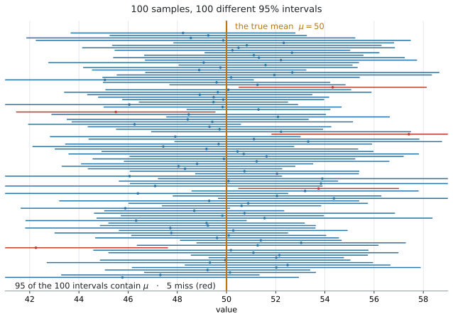
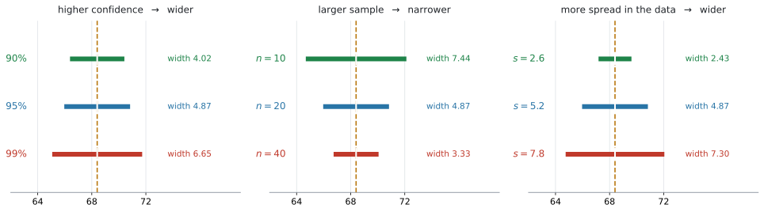
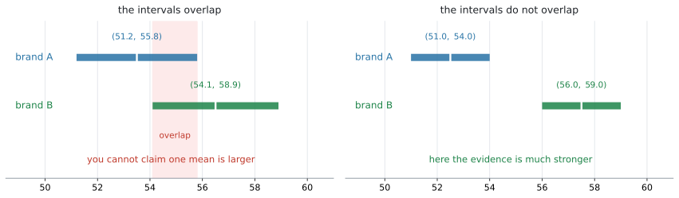

# AHL 4.16 — Confidence intervals for the mean of a normal population（正規母集団の平均の信頼区間） {#sec-ahl-4-16}

::: {.callout-note}
## What you should be able to do
- **confidence interval**（信頼区間）が何を表しているかを、正しい言い方で説明できる。
- **$\sigma$ が分かっているときは normal、分からないときは $t$ 分布**を使う、と判断できる。
- 電卓の `z Interval` と `t Interval` に、データからでも統計量からでも入力でき、**母集団が normal であること**が前提だと言える。
- 区間の**幅を決める $3$ つ**（信頼水準・$n$・ばらつき）を言える。
- 求めた区間を、**問題の文脈の言葉で**解釈して書ける。
- $2$ つの区間が**重なっているとき**、何が言えて何が言えないかを述べられる。
:::

::: {.callout-important}
## AHL 4.15 の $\bar{X}$ を、逆向きに使います
[AHL 4.15](ahl-4-15.qmd#xbar) では、$\mu$ が**分かっている**ところから

$$
\bar{X} \sim N\!\left(\mu,\ \frac{\sigma^{2}}{n}\right)
$$

を使って、$\bar{X}$ がどのあたりに来るかを調べました。

**この項目は、その逆です。** 現実には $\mu$ のほうが分かりません。分かるのは、実際にとった標本の $\bar{x}$ です。そこから

> **$\mu$ は、だいたいどのあたりにあると言えるか。**

を答えるのが confidence interval です。**同じ関係を、反対向きに読む**わけです。
:::

::: {.callout-note}
## 公式集に、この項目の欄はありません
AI HL の公式集は **4.14 の次が 4.17** です。4.16 の欄は印刷されていません。

**そして、手で計算する式も要りません。** 電卓に `z Interval` と `t Interval` という機能があり、それが区間を返します。

**点になるのは、$2$ か所です。**

- **どちらの機能を使うか**を決めること（[第5節](#which)）
- 出てきた区間を、**文脈の言葉で説明する**こと（[第8節](#interpret)）

シラバスも、そこを名指ししています。

> Students should be able to **interpret the meaning of their results in context.**
:::

## The idea

### 1. $1$ つの数では、確からしさが言えません {#idea}

ある工場のチョコレートの重さを調べるとします。$20$ 枚を量って、平均が $48.6$ g でした。

**では、$\mu$ は $48.6$ g なのでしょうか。** そうとはかぎりません。別の $20$ 枚を量れば、$48.2$ g かもしれないし $49.1$ g かもしれません（[AHL 4.15](ahl-4-15.qmd#xbar)）。

$\bar{x} = 48.6$ という **$1$ つの数**（**point estimate**、点推定値）だけでは、**それがどれくらい当てになるのか**が分かりません。

そこで、**幅のある答え**にします。

$$
\text{推定値} \ \pm \ \text{誤差の幅}
$$ {#eq-ahl416-form}

これが **confidence interval**（信頼区間）です。$47.5 < \mu < 49.7$ のような形で答えます。

::: {.callout-tip}
## 区間には、必ず $2$ つの情報が入っています
$(47.5,\ 49.7)$ という区間は、**$2$ つのこと**を同時に言っています。

- **どこか** … 中心が $48.6$。これは $\bar{x}$ そのものです
- **どれくらい確かか** … 幅が $2.2$。狭いほど、はっきりしたことが言えています

「平均は $48.6$ g です」だけでは、$2$ つ目が抜けます。**幅があること**が、点推定値との違いです。
:::

### 2. 「$95\%$ の信頼区間」とは何か {#meaning}

**答案でいちばん問われるのは、この意味のほうです。**

$95\%$ confidence interval とは、**次のような作り方をした区間**のことです。

> 同じやり方で標本をとって区間を作る、ということを何度もくり返すと、**そのうち約 $95\%$ の区間が $\mu$ を含む。**

{#fig-ahl416-meaning width=80%}

@fig-ahl416-meaning は、$\mu = 50$ の母集団から $12$ 個ずつの標本を **$100$ 回**とって、そのたびに $95\%$ 区間を作ったものです。

- 区間は $100$ 本とも**別々の場所**にあります。標本が違うからです
- そのうち **$95$ 本が $\mu = 50$ をまたいで**います
- **$5$ 本は外して**います（赤）

**$95\%$ とは、この $95$ 本のこと**です。

::: {.callout-warning}
## 「$\mu$ がこの区間に入る確率が $95\%$」という言い方には、注意が要ります
$\mu$ は**動きません。** 知らないだけで、$1$ つの決まった値です。

いま手元にある $1$ つの区間を見たとき、それは $\mu$ を**含んでいるか、含んでいないか**のどちらかです。@fig-ahl416-meaning の赤い $5$ 本は、はじめから外しています。

**動くのは区間のほう**です。標本が変われば区間も変わります。$95\%$ は、**その作り方の成績**を表しています。

**答案では、この違いに深入りする必要はありません。** 次の型で書けば十分です（[第8節](#interpret)）。

::: {.model-answer}
**試験ではこう書く**

*We are $95\%$ confident that the mean mass of a chocolate bar lies between $47.5$ g and $49.7$ g.*
:::

**`We are 95% confident that ...`** という書き出しが、そのまま使えます。
:::

### 3. 区間は、いつも「中心 $\pm$ 誤差の幅」の形です {#form}

電卓が返す区間は、必ずこの形をしています。

$$
\bar{x} \ \pm \ (\text{critical value}) \times \underbrace{\frac{\sigma \ \text{または} \ s}{\sqrt{n}}}_{\text{standard error}}
$$ {#eq-ahl416-ci}

$\dfrac{\sigma}{\sqrt{n}}$ は **standard error**（標準誤差）といいます。[AHL 4.15](ahl-4-15.qmd#narrower) で出てきた $\bar{X}$ の standard deviation と、同じものです。**$\sigma$ が分からないときは、代わりに $s$ を入れます。**

**critical value**（臨界値）は、**confidence level**（信頼水準）で決まる数です。$95\%$ なら $1.96$ 前後になります。

::: {.callout-note appearance="simple"}
**この式を手で計算する必要はありません。** 電卓が区間の両端を返します。

ただ、**形を知っていると検算になります。** 電卓が返した $2$ 数の**まん中は、必ず $\bar{x}$** です。そこがずれていたら、入力を間違えています。
:::

### 4. 前提は「母集団が normal であること」です {#assumption}

シラバスの Content 欄は、こう書かれています。

> Confidence intervals for the mean of **a normal population**.

**もとの母集団が normal であること**が、この項目全体の前提です。問題文には `normally distributed` と書かれます。

書かれていないときは、$n$ が大きければ [AHL 4.15 の central limit theorem](ahl-4-15.qmd#clt) が $\bar{X}$ の形を保証してくれるので、区間はほぼ正しく働きます。**試験では、必要な条件は問題文に書かれます。**

::: {.callout-note appearance="simple"}
`State the assumption you have made`（おいた仮定を述べなさい）と聞かれることがあります。そのときは

::: {.model-answer}
**試験ではこう書く**

*It is assumed that the population is normally distributed.*
:::

と書きます。[SL 4.11](../../ai-sl/04-statistics-and-probability/sl-4-11.qmd) の $t$ 検定でも、同じ仮定を書きました。
:::

### 5. $\sigma$ が分かるか分からないかで、使うものが変わります {#which}

**この項目でいちばん失点するのは、ここです。** シラバスが、はっきり指定しています。

> Use of the **normal distribution when $\sigma$ is known** and the **$t$-distribution when $\sigma$ is unknown**, **regardless of sample size.**

表にすると、こうです。

| 問題文にあるもの | 使う分布 | 電卓 |
|---|---|---|
| **母集団**の standard deviation $\sigma$ が与えられている | normal | `z Interval` |
| $\sigma$ が与えられていない（標本から $s$ を出す） | **$t$** | `t Interval` |

: どちらを使うか {#tbl-ahl416-which}

::: {.callout-important}
## `regardless of sample size` — $n$ の大きさは関係ありません
ここを取りちがえる答案が多いところです。

**$n$ が大きければ $t$ ではなく normal でよい、ということはありません。** シラバスは `regardless of sample size` と書いています。

**$\sigma$ が分からないなら、$n = 200$ でも $t$ です。**

[AHL 4.15](ahl-4-15.qmd#n30) の $n > 30$ という目安は、**中心極限定理の話**でした。**別の話です。** 混ぜないでください。
:::

#### 見分け方は「$\sigma$ が問題文にあるか」だけです {#spot}

問題文の言葉で見分けます。

| 問題文の書き方 | 意味 | 使うもの |
|---|---|---|
| `the population standard deviation is $\sigma = 2.5$` | $\sigma$ が与えられた | `z Interval` |
| `it is known from experience that $\sigma = 2.5$` | $\sigma$ が与えられた | `z Interval` |
| `the sample has standard deviation $2.5$` | これは $s$。$\sigma$ ではない | `t Interval` |
| データの列だけが与えられている | $\sigma$ は分からない | `t Interval` |

: 問題文の読み分け {#tbl-ahl416-spot}

**`population` と書いてあるか、`sample` と書いてあるか。** そこに丸を付けてから始めてください（[AHL 4.14](ahl-4-14.qmd#calculator)）。

::: {.callout-note}
## 試験で多いのは、$t$ のほうです
現実には、$\mu$ が分からないのに $\sigma$ だけ分かる、という状況はまれです。ですから **`t Interval` を使う問題のほうがよく出ます。**

`z Interval` が出るのは、「長年の記録から $\sigma$ が分かっている」という設定のときです。
:::

### 6. $t$-distribution は、正規分布より少しだけ広い {#t-dist}

**$t$-distribution**（$t$ 分布）は、[SL 4.11](../../ai-sl/04-statistics-and-probability/sl-4-11.qmd) の $t$ 検定で一度出てきています。この項目でも、**電卓が使うだけ**なので、形を細かく知る必要はありません。

知っておくとよいのは、$2$ つです。

**$1$ つ目。$t$ 分布は、正規分布より裾が厚く、少しだけ広がっています。** ですから臨界値も大きくなります。

| 信頼水準 | normal の臨界値 | $t$ の臨界値（$n = 8$） | $t$ の臨界値（$n = 20$） |
|---|---|---|---|
| $90\%$ | $1.645$ | $1.895$ | $1.729$ |
| $95\%$ | $1.960$ | $2.365$ | $2.093$ |
| $99\%$ | $2.576$ | $3.499$ | $2.861$ |

: critical value の比べ方 {#tbl-ahl416-critical}

**この表は、比べるためのものです。** 試験で critical value を表から引く必要はありません。電卓が区間そのものを返します。

**$\sigma$ が分からないぶん、区間を広めにとって不確かさを埋め合わせている**——そう考えると納得できます。

**$2$ つ目。$n$ が大きくなると、$t$ の臨界値は normal の値に近づきます。** @tbl-ahl416-critical で、$n = 8$ の $2.365$ より $n = 20$ の $2.093$ のほうが $1.960$ に近いことを見てください。

ただし、**どこまでいっても normal より少し大きいまま**です。これが `regardless of sample size` の背景にある事実です。

#### degrees of freedom は $n - 1$ です {#df}

$t$ 分布は、**degrees of freedom**（自由度）によって形が変わります。信頼区間では

$$
\text{degrees of freedom} = n - 1
$$ {#eq-ahl416-df}

です。$n - 1$ で割った $s_{n-1}$ を使うから、というのが理由です（[AHL 4.14](ahl-4-14.qmd#s2)）。

**電卓は自動で計算します。** $n$ を入力すれば、自由度は勝手に決まります。

### 7. 区間の幅を決める $3$ つ {#width}

{#fig-ahl416-width width=100%}

| 変えるもの | 幅への影響 | なぜ |
|---|---|---|
| **信頼水準**を上げる（$95\% \to 99\%$） | **広くなる** | 外す割合を減らすには、広く網を張るしかない |
| **$n$ を増やす** | **狭くなる** | standard error $\dfrac{s}{\sqrt{n}}$ が小さくなる |
| データの**ばらつき**が大きい | **広くなる** | $s$ が大きいと standard error も大きい |

: 幅を決める $3$ つ {#tbl-ahl416-width}

::: {.callout-tip}
## 「確かさ」と「細かさ」は、取り引きの関係です
$99\%$ の区間は $95\%$ より**広く**なります。@fig-ahl416-width の左で、$4.02 \to 4.87 \to 6.65$ と広がっているとおりです。

つまり、**外す危険を減らそうとすると、答えが大ざっぱになります。**

「$\mu$ は $0$ から $1000$ のあいだ」と言えば、まず外しません。しかし、**何も言っていないのと同じ**です。

$95\%$ という水準は、この $2$ つの折り合いとして、よく使われている値です。
:::

::: {.callout-note}
## $t$ のときは、$n$ を $4$ 倍にしても幅はぴったり半分になりません
standard error は $\dfrac{s}{\sqrt{n}}$ なので、$n$ を $4$ 倍にすると **standard error はちょうど半分**になります。

ただし $t$ を使うときは、**臨界値も一緒に小さくなります**（[第6節](#t-dist)）。ですから幅は、半分より**もう少し縮みます。**

$\sigma$ が既知で normal を使うときは、臨界値が動かないので**ちょうど半分**です。
:::

### 8. 文脈の言葉で書く {#interpret}

シラバスが名指ししている、**この項目の答案での中心**です。

> Students should be able to **interpret the meaning of their results in context.**

書き方は、いつも同じ型です。

::: {.callout-important}
## 答案の型
::: {.model-answer}
**試験ではこう書く**

*We are $95\%$ confident that the mean mass of a chocolate bar lies between $47.5$ g and $49.7$ g.*
:::

$3$ つの部品でできています。

1. **`We are 95% confident that`** … 信頼水準
2. **`the mean mass of a chocolate bar`** … **何の平均か**を、その問題の言葉で
3. **`lies between 47.5 g and 49.7 g`** … 区間と**単位**

**$2$ 番目が抜けている答案が、いちばん多い**です。「平均」だけでは足りません。**何の**平均なのかを書いてください。
:::

::: {.callout-warning}
## $\mu$ ではなく、$\bar{x}$ について書いてしまう
*"$95\%$ of the chocolate bars weigh between $47.5$ g and $49.7$ g"* は**誤り**です。

信頼区間が言っているのは、**平均 $\mu$ がどこにあるか**であって、$1$ 枚ずつの重さの話ではありません。

**`the mean ...`** という語を必ず入れてください。
:::

### 9. $2$ つの区間が重なるとき {#compare}

シラバスの Connections 欄に、こう書かれています。

> Claiming brand A is "better" on average than brand B **can mean very little if there is a large overlap** between the confidence intervals of the two means.

{#fig-ahl416-overlap width=100%}

@fig-ahl416-overlap の左では、$2$ つの区間が**重なっています。** brand B の $\bar{x}$ のほうが大きくても、**「B のほうが平均が大きい」とは言い切れません。**

重なっている範囲には、**両方の $\mu$ が同時に入りうる**からです。$\mu_A = \mu_B = 55$ でも、この $2$ つの区間が出てくることがあります。

右のように**重なっていなければ**、話は変わります。**言えることが、ずっと強くなります。**

::: {.callout-important}
## 重なりを見て、答案に書けること
::: {.model-answer}
**試験ではこう書く（重なっているとき）**

*The two confidence intervals overlap between $54.1$ and $55.8$, so it is possible that the two means are equal. The data does not provide enough evidence to claim that brand B has the larger mean.*
:::

（$2$ つの区間は $54.1$ から $55.8$ で重なっているので、$2$ つの平均が等しい可能性がある。B の平均のほうが大きいと言うだけの根拠はない、という意味です。）

**`overlap`（重なる）という語を使う**のが、この型の目印です。
:::

## Why it works

:::: {.callout-note collapse="true" appearance="simple"}
## クリックすると開きます
ここで説明するのは $1$ つです。**なぜ「中心 $\pm$ 誤差の幅」という形になるのか。**

[AHL 4.15](ahl-4-15.qmd#xbar) から、$\sigma$ が分かっているとき

$$
\bar{X} \sim N\!\left(\mu,\ \frac{\sigma^{2}}{n}\right)
$$

でした。この分布で、**まん中の $95\%$** に入る範囲を考えます。臨界値を $1.96$ とすると

$$
\mu - 1.96\frac{\sigma}{\sqrt{n}} \ < \ \bar{X} \ < \ \mu + 1.96\frac{\sigma}{\sqrt{n}}
$$

が、確率 $0.95$ で成り立ちます。**「$\bar{X}$ は $\mu$ の近くに来る」**と読める式です。

ここで、**$\mu$ と $\bar{X}$ を入れかえます。** 上の式を $\mu$ について解きます。

$$
\bar{X} - 1.96\frac{\sigma}{\sqrt{n}} \ < \ \mu \ < \ \bar{X} + 1.96\frac{\sigma}{\sqrt{n}}
$$

**同じ不等式です。** 移項しただけで、成り立つ確率も $0.95$ のままです。

そして、この形は「**$\mu$ は $\bar{X}$ の近くにある**」と読めます。**$\bar{X}$ が $\mu$ の近くに来るなら、$\mu$ も $\bar{X}$ の近くにある**——言いかえただけのようですが、これが信頼区間の作り方そのものです。

実際に標本をとって $\bar{X}$ の値 $\bar{x}$ が決まると、これが @eq-ahl416-ci の区間になります。

::: {.callout-note appearance="simple"}
**「確率 $0.95$」が、どこに掛かっているか**に注意してください。

$\bar{X}$ が**大文字**のあいだは、まだ標本をとっていません。動くのは $\bar{X}$ のほうで、確率はそこに掛かっています。

標本をとって $\bar{x} = 48.6$ と決まったあとは、$\mu$ もその区間も動きません。だから[第2節](#meaning)のような言い方になるのです。

$\sigma$ が分からないときは、$\sigma$ の代わりに $s_{n-1}$ を入れます。**推定値で置きかえたぶん不確かさが増える**ので、$1.96$ ではなく $t$ の臨界値（もう少し大きい値）を使います。
:::
::::

## Worked examples

::: {.callout-note appearance="simple"}
問題文は英語です。意味が理解できなかったら、問題文の下の「**日本語訳**」を開いてください。解説は日本語です。
:::

::: {#exm-ahl416-z}
[The mass of a chocolate bar produced by a machine is normally distributed. From long experience, the population standard deviation is known to be $2.5$ g.]{.q-en}

[A random sample of $20$ bars has a mean mass of $48.6$ g.]{.q-en}

**(a)** [State, with a reason, whether a normal distribution or a $t$-distribution should be used.]{.q-en}

**(b)** [Find a $95\%$ confidence interval for the mean mass of a chocolate bar.]{.q-en}

**(c)** [Interpret your answer to part (b) in context.]{.q-en}

<details class="jp-trans">
<summary>日本語訳</summary>

ある機械が作るチョコレートの重さは、正規分布にしたがいます。長年の記録から、母標準偏差は $2.5$ g と分かっています。

`from long experience` は「長年の記録から」、`population standard deviation` は「母標準偏差」という意味です。

無作為にとった $20$ 枚の標本の平均の重さは $48.6$ g でした。

**(a)** 正規分布と $t$ 分布のどちらを使うべきかを、理由を示して述べなさい。

**(b)** チョコレート $1$ 枚の平均の重さについて、$95\%$ 信頼区間を求めなさい。

**(c)** (b) の答えを、文脈の中で解釈しなさい。

</details>

**(a)** 問題文に `population standard deviation is known to be 2.5` とあります。**$\sigma$ が与えられている**ので、normal です（[第5節](#which)）。

::: {.model-answer}
**試験ではこう書く**

*The population standard deviation $\sigma = 2.5$ is known, so the normal distribution should be used.*
:::

**(b)** `z Interval` に入れます（[GDC 第1節](#gdc-z)）。

```
σ: 2.5      x̄: 48.6      n: 20      C Level: 0.95
```

$$
47.5 < \mu < 49.7
$$

**検算。** 区間のまん中は $\dfrac{47.5 + 49.7}{2} = 48.6 = \bar{x}$ ✓（[第3節](#form)）

手で確かめると、standard error は $\dfrac{2.5}{\sqrt{20}} = 0.559$、臨界値が $1.96$ なので誤差の幅は $1.96 \times 0.559 = 1.10$ です。$48.6 \pm 1.10$ で合っています。

**(c)** [第8節](#interpret)の型で書きます。

::: {.model-answer}
**試験ではこう書く**

*We are $95\%$ confident that the mean mass of a chocolate bar produced by this machine lies between $47.5$ g and $49.7$ g.*
:::

（この機械が作るチョコレート $1$ 枚の**平均**の重さは、$47.5$ g から $49.7$ g のあいだにあると $95\%$ の確信をもって言える、という意味です。）

::: {.callout-note}
## 解答例（答案用紙にはこう書く）
**(a)** *$\sigma = 2.5$ is the known population standard deviation, so the normal distribution is used.*

**(b)**
$$
47.5 < \mu < 49.7 \quad (\text{g})
$$

**(c)** *We are $95\%$ confident that the mean mass of a chocolate bar lies between $47.5$ g and $49.7$ g.*
:::
:::

::: {#exm-ahl416-t}
[A laboratory measures the concentration, in mg per litre, of a chemical in eight samples of water taken from a lake. The concentration is normally distributed.]{.q-en}

| | | | | | | | |
|---|---|---|---|---|---|---|---|
| $12.1$ | $11.8$ | $12.4$ | $12.0$ | $11.6$ | $12.3$ | $12.1$ | $11.7$ |

: Concentration (mg per litre) {#tbl-ahl416-we2}

**(a)** [Find the sample mean and an unbiased estimate of the population standard deviation.]{.q-en}

**(b)** [Find a $95\%$ confidence interval for the mean concentration.]{.q-en}

**(c)** [A scientist claims that the mean concentration is $12.5$ mg per litre. Comment on this claim.]{.q-en}

<details class="jp-trans">
<summary>日本語訳</summary>

ある研究室が、湖から採った $8$ 個の水の標本について、化学物質の濃度（$1$ リットルあたり mg）を測りました。濃度は正規分布にしたがいます。

表の見出しは `Concentration (mg per litre)` で「濃度（$1$ リットルあたり mg）」です。

**(a)** 標本平均と、母標準偏差の不偏推定値を求めなさい。

**(b)** 平均濃度について、$95\%$ 信頼区間を求めなさい。

**(c)** ある科学者が、平均濃度は $12.5$ mg/L だと主張しています。この主張について述べなさい。

</details>

**(a)** データを電卓の列に入れて `One-Variable Statistics` を走らせます。

$$
\bar{x} = 12.0, \qquad s_{n-1} = 0.283
$$

**読むのは $s_x$ のほうです**（[AHL 4.14](ahl-4-14.qmd#calculator)）。$\sigma_x = 0.265$ は不偏推定値ではありません。

**(b)** $\sigma$ は与えられていません。データから $s$ を出したので、**$t$ を使います**（[第5節](#which)）。

データがそのまま与えられているので、`t Interval` の `Data` を選べば、$\bar{x}$ も $s$ も電卓が計算します。

```
Data Input Method: Data      List: (データの列)      C Level: 0.95
```

$$
11.8 < \mu < 12.2
$$

**検算。** まん中は $12.0 = \bar{x}$ ✓

**(c)** 主張の $12.5$ は、区間 $(11.8,\ 12.2)$ の**外**にあります。

::: {.model-answer}
**試験ではこう書く**

*The value $12.5$ lies outside the $95\%$ confidence interval $11.8 < \mu < 12.2$, so the data does not support the scientist's claim. A mean concentration of $12.5$ mg per litre is not consistent with this sample.*
:::

（$12.5$ は $95\%$ 信頼区間の外にあるので、このデータはその主張を支持しない、という意味です。）

::: {.callout-note}
## 解答例（答案用紙にはこう書く）
**(a)**
$$
\bar{x} = 12.0, \qquad s_{n-1} = 0.283
$$

**(b)** *$\sigma$ is unknown, so a $t$-interval is used.*
$$
11.8 < \mu < 12.2 \quad (\text{mg per litre})
$$

**(c)** *$12.5$ lies outside the interval $11.8 < \mu < 12.2$, so the data does not support the claim.*
:::
:::

::: {#exm-ahl416-summary}
[Test scores are normally distributed. A random sample of $20$ students sat a test. The sample mean score was $68.4$ and the unbiased estimate of the population standard deviation was $5.2$.]{.q-en}

**(a)** [Find a $90\%$ confidence interval for the mean score of all students.]{.q-en}

**(b)** [Find a $99\%$ confidence interval for the mean score.]{.q-en}

**(c)** [Comment on how the two intervals differ, and explain why.]{.q-en}

<details class="jp-trans">
<summary>日本語訳</summary>

テストの得点は正規分布にしたがいます。無作為に選んだ $20$ 人の生徒がテストを受けました。標本平均の得点は $68.4$、母標準偏差の不偏推定値は $5.2$ でした。

**(a)** すべての生徒の平均点について、$90\%$ 信頼区間を求めなさい。

**(b)** 平均点について、$99\%$ 信頼区間を求めなさい。

**(c)** $2$ つの区間がどう違うかを述べ、その理由を説明しなさい。

</details>

**(a)** $\sigma$ ではなく**不偏推定値**が与えられています。ですから **$t$** です（[第5節](#which)）。

データの列はないので、`t Interval` の **`Stats`** を選びます（[GDC 第2節](#gdc-t)）。

```
Data Input Method: Stats      x̄: 68.4      sx: 5.2      n: 20      C Level: 0.90
```

$$
66.4 < \mu < 70.4
$$

**(b)** `C Level` を $0.99$ に変えるだけです。

$$
65.1 < \mu < 71.7
$$

**(c)** $99\%$ のほうが**広く**なっています。

生の値は $(66.3894,\ 70.4106)$ と $(65.0734,\ 71.7266)$ です。**幅は、丸める前の値から出します。**

$$
\text{幅} \quad 4.02 \ \to \ 6.65
$$

::: {.model-answer}
**試験ではこう書く**

*The $99\%$ interval is wider than the $90\%$ interval ($6.65$ compared with $4.02$). To be more confident of capturing the population mean, a wider range of values must be included. The extra confidence is gained at the cost of a less precise answer.*
:::

（より高い確信をもって $\mu$ を捉えるには、より広い範囲を含めなければならない。確からしさが増すぶん、答えは大ざっぱになる、という意味です。）

::: {.callout-note}
## 解答例（答案用紙にはこう書く）
**(a)** *$\sigma$ is unknown, so a $t$-interval is used.*
$$
66.4 < \mu < 70.4
$$

**(b)**
$$
65.1 < \mu < 71.7
$$

**(c)** *The $99\%$ interval is wider. A higher confidence level requires a wider interval, so the estimate becomes less precise.*
:::
:::

::: {#exm-ahl416-overlap}
[Two brands of light bulb are tested. For brand A, a $95\%$ confidence interval for the mean lifetime, in hours, is $51.2 < \mu_A < 55.8$. For brand B, a $95\%$ confidence interval is $54.1 < \mu_B < 58.9$.]{.q-en}

**(a)** [Write down the sample mean lifetime for each brand.]{.q-en}

**(b)** [A shop advertises that brand B lasts longer on average than brand A. Comment on this claim.]{.q-en}

<details class="jp-trans">
<summary>日本語訳</summary>

$2$ つのブランドの電球を調べました。ブランド A について、平均寿命（時間）の $95\%$ 信頼区間は $51.2 < \mu_A < 55.8$ です。ブランド B については $54.1 < \mu_B < 58.9$ です。

`light bulb` は「電球」、`lifetime` は「寿命」、`advertises` は「宣伝する」という意味です。

**(a)** 各ブランドの標本平均の寿命を書きなさい。

**(b)** ある店が、ブランド B のほうが平均寿命が長いと宣伝しています。この主張について述べなさい。

</details>

**(a)** 区間の**まん中が $\bar{x}$** です（[第3節](#form)）。

$$
\bar{x}_A = \frac{51.2 + 55.8}{2} = 53.5, \qquad \bar{x}_B = \frac{54.1 + 58.9}{2} = 56.5
$$

**(b)** $\bar{x}_B = 56.5$ のほうが大きいのは確かです。しかし、**$2$ つの区間は重なっています**（[第9節](#compare)）。

$$
54.1 \ \text{から} \ 55.8 \ \text{までが重なりです}
$$

この範囲の値は、**両方の $\mu$ になりえます。** ですから、$\mu_A = \mu_B$ という可能性が残ります。

::: {.model-answer}
**試験ではこう書く**

*Although the sample mean for brand B ($56.5$ hours) is larger than for brand A ($53.5$ hours), the two confidence intervals overlap between $54.1$ and $55.8$ hours. Both means could lie in this overlap, so the two population means could be equal. The data does not provide enough evidence to support the shop's claim.*
:::

（B の標本平均のほうが大きいが、$2$ つの信頼区間は重なっており、両方の平均が重なりの中にある可能性がある。したがって主張を支持するだけの根拠はない、という意味です。）

::: {.callout-note}
## 解答例（答案用紙にはこう書く）
**(a)**
$$
\bar{x}_A = 53.5, \qquad \bar{x}_B = 56.5 \quad (\text{hours})
$$

**(b)** *The intervals overlap between $54.1$ and $55.8$ hours, so the two population means could be equal. Although $\bar{x}_B > \bar{x}_A$, the data does not give enough evidence to claim that brand B lasts longer on average.*
:::
:::

## Common errors

::: {.callout-warning}
## $\sigma$ が分からないのに、normal を使う
`sample standard deviation` や、データの列だけが与えられているときは **$t$** です（[第5節](#which)）。

**`population standard deviation` と書かれているときだけ** normal です。
:::

::: {.callout-warning}
## $n$ が大きいから normal でよい、としてしまう
シラバスは `regardless of sample size` と書いています。**$n = 200$ でも、$\sigma$ が分からなければ $t$** です（[第5節](#which)）。

[AHL 4.15](ahl-4-15.qmd#n30) の $n > 30$ とは、**別の話**です。
:::

::: {.callout-warning}
## $\sigma_x$ を入れてしまう
電卓の `t Interval` に入れるのは **$s_x$**（$n-1$ で割ったもの）です（[AHL 4.14](ahl-4-14.qmd#calculator)）。

$\sigma_x$ を入れると、区間が**狭すぎる**値になります。狭くなる割合は $\sqrt{\dfrac{n-1}{n}}$ で、**$n$ が小さいほど大きく**なります（$n = 8$ で約 $6\%$、$n = 5$ なら約 $11\%$）。
:::

::: {.callout-warning}
## 解釈で `the mean` を書き忘れる
*"$95\%$ of the bars weigh between $47.5$ and $49.7$ g"* は誤りです（[第8節](#interpret)）。

区間が言っているのは、**平均 $\mu$ の居場所**です。$1$ 枚ずつの重さではありません。
:::

::: {.callout-warning}
## 解釈で、文脈の言葉を使わない
*"We are $95\%$ confident that $\mu$ is between $47.5$ and $49.7$"* では足りません。

**「何の平均か」**を、その問題の言葉で書いてください。**単位も**忘れずに。
:::

::: {.callout-warning}
## 「$\mu$ が入る確率は $95\%$」と書く
$\mu$ は動かない $1$ つの値です（[第2節](#meaning)）。

**`We are 95% confident that ...`** という型を使えば、この論点に触れずに済みます。**その型で書いてください。**
:::

::: {.callout-warning}
## 区間が重なっているのに、「こちらが大きい」と結論する
標本平均に差があっても、**区間が重なっていれば $\mu$ が等しい可能性が残ります**（[第9節](#compare)）。

答案では **`overlap`** という語を使って、そこを指摘してください。
:::

::: {.callout-warning}
## 信頼水準を上げれば「よい」答えになると思う
$99\%$ の区間は $95\%$ より**広い**——つまり**大ざっぱ**です（[第7節](#width)）。

**確からしさと細かさは、取り引きの関係**にあります。どちらか一方だけがよくなることはありません。
:::

::: {.callout-warning}
## `C Level` に $95$ と入れる
TI-Nspire の `C Level` には、**小数で $0.95$** と入れます。$95$ と入れるとエラーになります。
:::

::: {.callout-warning}
## 区間を、$1$ つの数で答える
答えは**区間**です。$47.5 < \mu < 49.7$ のように、**両端を書いてください。**

「誤差の幅は $1.10$」だけでは、答えになっていません。
:::

## Using your GDC (TI-Nspire CX II)

この項目は、**電卓の操作そのものが中身**です。使うのは $2$ つのメニューだけです。

```
menu → Statistics → Confidence Intervals
```

ここに `z Interval` と `t Interval` が並んでいます。

### 1. z Interval — $\sigma$ が分かっているとき {#gdc-z}

```
menu → Statistics → Confidence Intervals → z Interval
```

`Data Input Method` を **`Stats`** にすると、次の欄が出ます。

| 欄 | 入れるもの |
|---|---|
| `σ` | 問題文の**母標準偏差** |
| `x̄` | 標本平均 |
| `n` | 標本の大きさ |
| `C Level` | **小数で。** $95\%$ なら $0.95$ |

: z Interval の欄 {#tbl-ahl416-gdc-z}

結果の `CLower` と `CUpper` が、区間の両端です。

### 2. t Interval — $\sigma$ が分からないとき {#gdc-t}

```
menu → Statistics → Confidence Intervals → t Interval
```

**`Data Input Method` の選び方が $2$ 通り**あります。ここが `z Interval` との違いです。

| 問題の与えられ方 | 選ぶもの | 入れるもの |
|---|---|---|
| データの列がある | **`Data`** | 列の名前と `C Level` |
| $\bar{x}$、$s$、$n$ だけがある | **`Stats`** | $\bar{x}$、`sx`、$n$、`C Level` |

: t Interval の $2$ つの入れ方 {#tbl-ahl416-gdc-t}

**データがあるなら `Data` を選んでください。** 電卓が $\bar{x}$ と $s$ を計算するので、書き写す手間も、丸め誤差も入りません。

`Stats` を使うときは、`sx` の欄に入れるのは **$s_{n-1}$**（電卓の $s_x$）です。$\sigma_x$ ではありません。

### 3. 結果の読み方 {#gdc-read}

どちらの機能でも、返ってくる画面には次が並びます。

| 表示 | 意味 |
|---|---|
| `CLower` | 区間の下端 |
| `CUpper` | 区間の上端 |
| `x̄` | 標本平均。**区間のまん中**になっているか確かめる |
| `ME` | margin of error（誤差の幅） |
| `df` | 自由度。`t Interval` のときだけ出る。$n-1$ になっているか確かめる |

: Confidence Interval の結果 {#tbl-ahl416-gdc-read}

**答案には `CLower` と `CUpper` を書きます。** 答えは **$3$ 桁**で書きます。丸めるときは、**画面の値から**丸めてください。

### 4. 検算のしかた {#gdc-check}

$2$ つ、その場でできる確認があります。

- **まん中が $\bar{x}$ か。** $\dfrac{\text{CLower} + \text{CUpper}}{2}$ が $\bar{x}$ になっていなければ、入力が違います
- **`df` が $n - 1$ か。** `t Interval` で $n$ を入れ間違えると、ここに出ます

## Exercises

::: {.callout-note appearance="simple"}
各問題に、折りたたみが3つ付いています。**日本語訳**、**解答例**（答案用紙に書くべきこと。英語です）、**解説**（なぜそうなるか。日本語です）。

まず自分で解いて、次に解答例と見くらべてください。**解説は、合わなかったときだけ開けば十分です。**
:::

::: {.exercise-block}

[1]{.ex-no} [A population is normally distributed with known standard deviation $\sigma = 6$. A random sample of $36$ observations has mean $82$. Find a $95\%$ confidence interval for the population mean.]{.q-en}

<details class="jp-trans">
<summary>日本語訳</summary>

ある母集団は正規分布にしたがい、母標準偏差は $\sigma = 6$ と分かっています。$36$ 個の観測値からなる無作為標本の平均は $82$ でした。母平均の $95\%$ 信頼区間を求めなさい。

</details>

::: {.callout-note collapse="true"}
## 解答例（答案用紙に書くこと）
*$\sigma$ is known, so a $z$-interval is used.*
$$
80.0 < \mu < 84.0
$$
:::

::: {.callout-tip collapse="true"}
## 解説
`known standard deviation σ = 6` とあるので **normal** です（[第5節](#which)）。

```
z Interval → Stats:   σ: 6   x̄: 82   n: 36   C Level: 0.95
```

**検算。** standard error は $\dfrac{6}{\sqrt{36}} = 1$。臨界値 $1.96$ なので誤差の幅は $1.96$。まん中の $82$ から $\pm 1.96$ で、$(80.04,\ 83.96)$ です ✓

$3$ 桁に丸めて $80.0$ と $84.0$ ですが、**$0$ を落として $80$、$84$ と書かないでください。** 有効数字が変わります。
:::

::: {.ex-sep}
:::

[2]{.ex-no} [A normally distributed population is sampled. A random sample of $12$ items has mean $45.2$ and an unbiased estimate of the population standard deviation of $3.8$. Find a $95\%$ confidence interval for the population mean.]{.q-en}

<details class="jp-trans">
<summary>日本語訳</summary>

ある正規母集団から標本をとります。$12$ 個の品物からなる無作為標本の平均は $45.2$、母標準偏差の不偏推定値は $3.8$ でした。母平均の $95\%$ 信頼区間を求めなさい。

</details>

::: {.callout-note collapse="true"}
## 解答例（答案用紙に書くこと）
*$\sigma$ is unknown, so a $t$-interval is used.*
$$
42.8 < \mu < 47.6
$$
:::

::: {.callout-tip collapse="true"}
## 解説
`unbiased estimate of the population standard deviation` は $s_{n-1}$ です。**$\sigma$ ではありません。** ですから **$t$** を使います（[第5節](#which)）。

```
t Interval → Stats:   x̄: 45.2   sx: 3.8   n: 12   C Level: 0.95
```

`df` は $12 - 1 = 11$ で、臨界値は $2.20$ です。

**検算。** まん中は $\dfrac{42.8 + 47.6}{2} = 45.2 = \bar{x}$ ✓
:::

::: {.ex-sep}
:::

[3]{.ex-no} [The mass of an apple is normally distributed. The masses, in grams, of ten randomly chosen apples are]{.q-en}

$$
203, \quad 198, \quad 207, \quad 201, \quad 199, \quad 204, \quad 202, \quad 196, \quad 205, \quad 200
$$

**(a)** [Find the sample mean and an unbiased estimate of the population standard deviation.]{.q-en}

**(b)** [Find a $99\%$ confidence interval for the mean mass of an apple.]{.q-en}

<details class="jp-trans">
<summary>日本語訳</summary>

りんご $1$ 個の重さは正規分布にしたがいます。無作為に選んだ $10$ 個のりんごの重さ（グラム）は、上のとおりです。

**(a)** 標本平均と、母標準偏差の不偏推定値を求めなさい。

**(b)** りんご $1$ 個の平均の重さについて、$99\%$ 信頼区間を求めなさい。

</details>

::: {.callout-note collapse="true"}
## 解答例（答案用紙に書くこと）
**(a)**
$$
\bar{x} = 201.5, \qquad s_{n-1} = 3.37
$$

**(b)** *$\sigma$ is unknown, so a $t$-interval is used.*
$$
198 < \mu < 205 \quad (\text{g})
$$
:::

::: {.callout-tip collapse="true"}
## 解説
**(a)** 合計は $2015$ なので $\bar{x} = 201.5$。$s_x$ のほうを読みます（[AHL 4.14](ahl-4-14.qmd#calculator)）。

**(b)** データの列があるので、`t Interval` の **`Data`** を選べます（[GDC 第2節](#gdc-t)）。$\bar{x}$ と $s$ を書き写す必要がありません。

`df` $= 9$、臨界値は $3.25$ です。**$99\%$ なので、臨界値がかなり大きくなっています。**

生の値は $(198.03,\ 204.97)$ で、$3$ 桁だと $198$ と $205$ です。

**検算。** まん中は $201.5 = \bar{x}$ ✓
:::

::: {.ex-sep}
:::

[4]{.ex-no} [For each of the following, state whether a $z$-interval or a $t$-interval should be used, and give a reason.]{.q-en}

**(a)** [A sample of $8$ measurements, where the population standard deviation is known to be $1.2$.]{.q-en}

**(b)** [A sample of $200$ measurements, where the sample standard deviation is $4.7$ and the population standard deviation is not known.]{.q-en}

**(c)** [A list of $15$ data values, with no other information given.]{.q-en}

<details class="jp-trans">
<summary>日本語訳</summary>

次のそれぞれについて、$z$ 区間と $t$ 区間のどちらを使うべきかを述べ、理由を書きなさい。

**(a)** $8$ 個の測定値からなる標本で、母標準偏差が $1.2$ と分かっている場合。

**(b)** $200$ 個の測定値からなる標本で、標本標準偏差が $4.7$、母標準偏差は分かっていない場合。

**(c)** $15$ 個のデータの値の列だけが与えられ、ほかに情報がない場合。

</details>

::: {.callout-note collapse="true"}
## 解答例（答案用紙に書くこと）
**(a)** *$z$-interval. The population standard deviation is known, so the normal distribution is used.*

**(b)** *$t$-interval. The population standard deviation is unknown, so the $t$-distribution is used regardless of the sample size, even though $n = 200$ is large.*

**(c)** *$t$-interval. Only sample data is given, so the population standard deviation is unknown.*
:::

::: {.callout-tip collapse="true"}
## 解説
[第5節の表](#tbl-ahl416-which)が、そのまま答えになる問題です。

**(a)** $n = 8$ と小さくても、**$\sigma$ が分かっていれば normal** です。$n$ の大きさは関係しません。

**(b)** ここが狙いです。**$n = 200$ でも $t$** です。シラバスの `regardless of sample size` がそのまま出ています。

**(c)** データしかないなら、$s$ は標本から出すしかありません。ですから $t$ です。

::: {.model-answer}
**試験ではこう書く**

*(a) $z$-interval, because $\sigma$ is known.*

*(b) $t$-interval, because $\sigma$ is unknown. The size of the sample does not matter: a $t$-interval is used regardless of sample size.*

*(c) $t$-interval, because only sample data is available and so $\sigma$ is unknown.*
:::

**(b) で `regardless of sample size` に触れているかどうか**が、読まれるところです。
:::

::: {.ex-sep}
:::

[5]{.ex-no} [A normally distributed population has known standard deviation $\sigma = 9$. A sample of $16$ observations gives a $95\%$ confidence interval of width $8.82$.]{.q-en}

**(a)** [Find the width of a $95\%$ confidence interval if the sample size is increased to $64$.]{.q-en}

**(b)** [Explain why increasing the sample size makes the interval narrower.]{.q-en}

<details class="jp-trans">
<summary>日本語訳</summary>

ある正規母集団の母標準偏差は $\sigma = 9$ と分かっています。$16$ 個の観測値からなる標本から作った $95\%$ 信頼区間の幅は $8.82$ でした。

**(a)** 標本の大きさを $64$ に増やしたとき、$95\%$ 信頼区間の幅を求めなさい。

**(b)** 標本を大きくすると区間が狭くなる理由を説明しなさい。

</details>

::: {.callout-note collapse="true"}
## 解答例（答案用紙に書くこと）
**(a)**
$$
\text{width} = \frac{8.82}{2} = 4.41
$$

**(b)** *The width depends on the standard error $\dfrac{\sigma}{\sqrt{n}}$. Multiplying $n$ by $4$ multiplies $\sqrt{n}$ by $2$, so the standard error, and therefore the width, is halved. A larger sample gives a more precise estimate of the mean.*
:::

::: {.callout-tip collapse="true"}
## 解説
**(a)** $\sigma$ が既知なので、臨界値は $1.96$ のまま**動きません。** 変わるのは standard error だけです。

$$
\frac{9}{\sqrt{16}} = 2.25 \qquad \to \qquad \frac{9}{\sqrt{64}} = 1.125
$$

$n$ が $4$ 倍になると $\sqrt{n}$ は $2$ 倍なので、**ちょうど半分**です。

**$t$ を使うときは、ちょうど半分にはなりません。** 臨界値も一緒に小さくなるので、半分より少し狭くなります（[第7節](#width)）。

**(b)** `Explain why` なので、**式と言葉の両方**を書きます。

::: {.model-answer}
**試験ではこう書く**

*The half-width of the interval is the critical value multiplied by the standard error $\dfrac{\sigma}{\sqrt{n}}$. Increasing $n$ decreases $\dfrac{\sigma}{\sqrt{n}}$, so the interval becomes narrower. Intuitively, a larger sample gives more information about the population, so the mean can be pinned down more precisely.*
:::
:::

::: {.ex-sep}
:::

[6]{.ex-no} [A $95\%$ confidence interval for the mean time, in minutes, taken to complete a task is $23.4 < \mu < 26.6$.]{.q-en}

**(a)** [Write down the sample mean.]{.q-en}

**(b)** [Write down the margin of error.]{.q-en}

**(c)** [Interpret the confidence interval in context.]{.q-en}

<details class="jp-trans">
<summary>日本語訳</summary>

ある作業を終えるのにかかる平均時間（分）についての $95\%$ 信頼区間は $23.4 < \mu < 26.6$ です。

`margin of error` は「誤差の幅」という意味です。

**(a)** 標本平均を書きなさい。

**(b)** 誤差の幅を書きなさい。

**(c)** この信頼区間を、文脈の中で解釈しなさい。

</details>

::: {.callout-note collapse="true"}
## 解答例（答案用紙に書くこと）
**(a)**
$$
\bar{x} = \frac{23.4 + 26.6}{2} = 25.0 \text{ minutes}
$$

**(b)**
$$
\text{margin of error} = \frac{26.6 - 23.4}{2} = 1.6 \text{ minutes}
$$

**(c)** *We are $95\%$ confident that the mean time taken to complete the task lies between $23.4$ and $26.6$ minutes.*
:::

::: {.callout-tip collapse="true"}
## 解説
**(a)(b)** 区間は「**中心 $\pm$ 誤差の幅**」の形でした（[第3節](#form)）。ですから中心は**まん中**、誤差の幅は**幅の半分**です。

幅そのものは $3.2$ 分ですが、`margin of error` はその**半分**の $1.6$ 分です。ここを取りちがえないでください。

**(c)** `Interpret` なので、**文脈の言葉で**書きます（[第8節](#interpret)）。

::: {.model-answer}
**試験ではこう書く**

*We are $95\%$ confident that the mean time taken to complete the task lies between $23.4$ and $26.6$ minutes.*
:::

**`the mean time`** と書くこと、**`minutes`** という単位を入れることの $2$ つが、点になるところです。
:::

::: {.ex-sep}
:::

[7]{.ex-no} [Using the confidence interval $23.4 < \mu < 26.6$ from question 6, comment on each of the following claims.]{.q-en}

**(a)** [A manager claims that the mean time is $27$ minutes.]{.q-en}

**(b)** [A worker claims that the mean time is $24$ minutes.]{.q-en}

<details class="jp-trans">
<summary>日本語訳</summary>

問題 6 の信頼区間 $23.4 < \mu < 26.6$ を使って、次のそれぞれの主張について述べなさい。

**(a)** ある管理者は、平均時間は $27$ 分だと主張しています。

**(b)** ある作業者は、平均時間は $24$ 分だと主張しています。

</details>

::: {.callout-note collapse="true"}
## 解答例（答案用紙に書くこと）
**(a)** *$27$ lies outside the interval $23.4 < \mu < 26.6$, so the data does not support the manager's claim.*

**(b)** *$24$ lies inside the interval, so the data is consistent with the worker's claim. However, this does not prove that the mean is exactly $24$ minutes: every other value in the interval is also consistent with the data.*
:::

::: {.callout-tip collapse="true"}
## 解説
**(a)** $27 > 26.6$ なので、区間の**外**です。

**(b)** $24$ は区間の中です。ただし、ここで**言い過ぎないこと**が大事です。

区間の中にある値は、**どれもこのデータと矛盾しません。** $24$ も $25$ も $26$ も、この区間の中です。**「平均は $24$ 分だと証明された」わけではありません。**

::: {.model-answer}
**試験ではこう書く**

*(a) $27$ minutes lies outside the confidence interval, so the data does not support this claim.*

*(b) $24$ minutes lies inside the confidence interval, so the claim is consistent with the data. However, every other value in the interval is also consistent with the data, so this does not show that the mean is exactly $24$ minutes.*
:::

`comment on` なので、**言えることと言えないことの両方**を書くと強い答案になります。
:::

::: {.ex-sep}
:::

[8]{.ex-no} [Two teaching methods are compared. Test scores are normally distributed. A $95\%$ confidence interval for the mean score using method A is $51.0 < \mu_A < 54.0$, and for method B is $56.0 < \mu_B < 59.0$.]{.q-en}

**(a)** [Write down the sample mean score for each method.]{.q-en}

**(b)** [A school decides to use method B. Comment on whether the data supports this decision. Compare your answer with @exm-ahl416-overlap.]{.q-en}

<details class="jp-trans">
<summary>日本語訳</summary>

$2$ つの指導法を比べました。得点は正規分布にしたがいます。指導法 A を使ったときの平均点の $95\%$ 信頼区間は $51.0 < \mu_A < 54.0$、指導法 B については $56.0 < \mu_B < 59.0$ です。

**(a)** 各指導法の標本平均の得点を書きなさい。

**(b)** ある学校が指導法 B を使うことに決めました。データがこの決定を支持しているかどうかを述べなさい。例題4 と見くらべなさい。

</details>

::: {.callout-note collapse="true"}
## 解答例（答案用紙に書くこと）
**(a)**
$$
\bar{x}_A = 52.5, \qquad \bar{x}_B = 57.5
$$

**(b)** *The two confidence intervals do not overlap: the whole of the interval for method A lies below the whole of the interval for method B. Every plausible value of $\mu_A$ is smaller than every plausible value of $\mu_B$, so the data does support the claim that method B gives a higher mean score. This is a stronger conclusion than in the overlapping case, where the two means could have been equal.*
:::

::: {.callout-tip collapse="true"}
## 解説
**例題4 と対になる問題**です。あちらは区間が**重なって**いて、こちらは**重なっていません。**

**(a)** 中点をとります。$\dfrac{51.0 + 54.0}{2} = 52.5$、$\dfrac{56.0 + 59.0}{2} = 57.5$。

**(b)** 例題4 では「言えない」でしたが、ここでは**言えます。**

$\mu_A$ としてありうるのは $54.0$ まで、$\mu_B$ としてありうるのは $56.0$ から。**この $2$ つが重ならない**ので、$\mu_A = \mu_B$ という可能性は残りません。

::: {.model-answer}
**試験ではこう書く**

*The intervals do not overlap, since $54.0 < 56.0$. Every value in the interval for $\mu_A$ is below every value in the interval for $\mu_B$, so the data supports the claim that method B has the higher mean score. In @exm-ahl416-overlap the intervals overlapped, so no such conclusion could be drawn there.*
:::

**重なっているかいないかで、書ける結論がまったく変わります**（[第9節](#compare)）。答案では、まず**重なりを確かめてから**書き始めてください。
:::

::: {.ex-sep}
:::

[9]{.ex-no} [A machine fills packets. The mass of the contents is normally distributed, and the population standard deviation is known to be $15$ g. A sample of $25$ packets has mean $500$ g.]{.q-en}

**(a)** [Find a $90\%$ confidence interval for the mean mass of the contents.]{.q-en}

**(b)** [Find a $99\%$ confidence interval.]{.q-en}

**(c)** [State which interval a quality inspector should prefer, and give a reason.]{.q-en}

<details class="jp-trans">
<summary>日本語訳</summary>

ある機械が袋づめをします。中身の重さは正規分布にしたがい、母標準偏差は $15$ g と分かっています。$25$ 袋の標本の平均は $500$ g でした。

`quality inspector` は「品質検査官」という意味です。

**(a)** 中身の平均の重さについて、$90\%$ 信頼区間を求めなさい。

**(b)** $99\%$ 信頼区間を求めなさい。

**(c)** 品質検査官はどちらの区間を選ぶべきかを述べ、理由を書きなさい。

</details>

::: {.callout-note collapse="true"}
## 解答例（答案用紙に書くこと）
**(a)** *$\sigma$ is known, so a $z$-interval is used.*
$$
495 < \mu < 505 \quad (\text{g})
$$

**(b)**
$$
492 < \mu < 508 \quad (\text{g})
$$

**(c)** *The inspector should prefer the $99\%$ interval. It is wider ($15.5$ g against $9.87$ g) and so gives a less precise estimate, but it is much less likely to miss the true mean, and in quality control the cost of an undetected error is high.*
:::

::: {.callout-tip collapse="true"}
## 解説
**(a)(b)** $\sigma$ が既知なので `z Interval` です。standard error は $\dfrac{15}{\sqrt{25}} = 3$。

生の値は $(495.06,\ 504.94)$ と $(492.27,\ 507.73)$ です。$3$ 桁で $495$ と $505$、$492$ と $508$。

**(c)** `give a reason` なので理由が要ります。**どちらを選んでも、理由が通っていれば正解**になる問題です。

大事なのは、**取り引きの関係**（[第7節](#width)）に触れることです。$99\%$ は当たりやすいが大ざっぱ、$90\%$ は細かいが外しやすい。

::: {.model-answer}
**試験ではこう書く**

*The inspector should prefer the $99\%$ interval. It is wider ($15.5$ g compared with $9.87$ g) and so less precise, but it is much less likely to miss the true mean. In quality control, the cost of failing to detect a problem is usually higher than the cost of a less precise estimate.*
:::

**「どちらか一方が正しい」という問題ではありません。** 両方の性質を比べて書けているかが読まれます。
:::

::: {.ex-sep}
:::

[10]{.ex-no} [Explain why a $95\%$ confidence interval calculated from a sample does not mean that $95\%$ of the population lies within that interval.]{.q-en}

<details class="jp-trans">
<summary>日本語訳</summary>

標本から計算した $95\%$ 信頼区間について、それが「母集団の $95\%$ がその区間に入る」という意味ではない理由を説明しなさい。

</details>

::: {.callout-note collapse="true"}
## 解答例（答案用紙に書くこと）
*A confidence interval is an interval for the population **mean** $\mu$, not for individual values. It is built from the standard error $\dfrac{s}{\sqrt{n}}$, which measures how much the sample mean varies, not how much individual data values vary. Individual values are spread out by about $s$, which is $\sqrt{n}$ times the standard error, so they are spread over a much wider range than the confidence interval.*
:::

::: {.callout-tip collapse="true"}
## 解説
`Explain why` なので、**何と何を取りちがえているのか**をはっきり書きます。

区間の幅を決めているのは $\dfrac{s}{\sqrt{n}}$ です。これは**標本平均のばらつき**であって、**$1$ つ $1$ つの値のばらつき**ではありません（[AHL 4.15](ahl-4-15.qmd#narrower)）。

$1$ つ $1$ つの値は、$s$ くらいの幅で散らばっています。これは **standard error の $\sqrt{n}$ 倍**です。$n = 25$ なら $5$ 倍になります。

ですから、信頼区間の中に母集団の $95\%$ が入る、ということはまずありません。**もっと狭い区間**です。

::: {.model-answer}
**試験ではこう書く**

*The confidence interval estimates the population mean, not individual values. Its width comes from the standard error $\dfrac{s}{\sqrt{n}}$, which describes the variability of the sample mean. Individual values vary by about $s$, which is $\sqrt{n}$ times the standard error, so they are spread over a far wider range than the interval.*
:::

[第8節](#interpret)の Common error と、同じ論点です。
:::

:::
