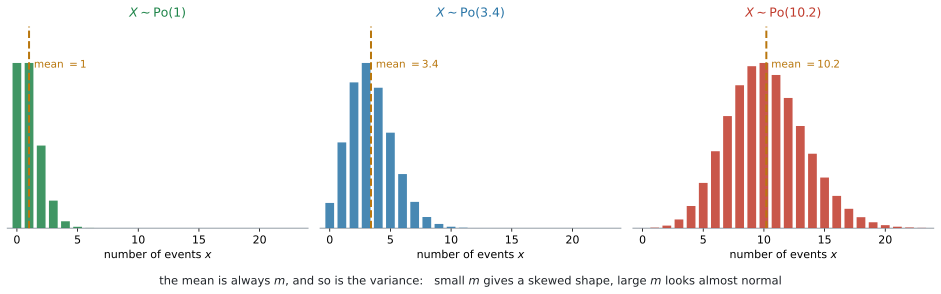
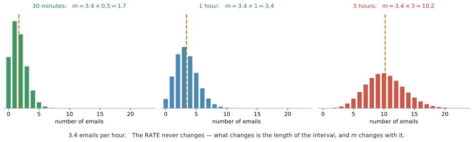
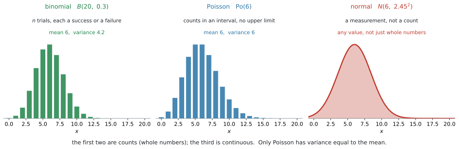

# AHL 4.17 — The Poisson distribution（ポアソン分布） {#sec-ahl-4-17}

::: {.callout-note}
## What you should be able to do
- **Poisson distribution**（ポアソン分布）が使える **$2$ つの条件**を言える。
- $X \sim \mathrm{Po}(m)$ と書き、**$E(X) = m$、$\text{Var}(X) = m$** を使える。
- 電卓の **`Poisson Pdf`** と **`Poisson Cdf`** で確率を求められる。
- **区間の長さを変えたら $m$ も変える**、という計算ができる。
- **独立な $2$ つの Poisson の和**も Poisson になると使える。
- 文脈を読んで、**normal・binomial・Poisson** のどれを使うかを選べる。
:::

::: {.callout-note}
## SL 4.8 の binomial と、対になる分布です
[SL 4.8](../../ai-sl/04-statistics-and-probability/sl-4-8.qmd) の binomial distribution と、よく似た形で使います。

| | binomial | Poisson |
|---|---|---|
| 数えるもの | $n$ 回のうち、成功した回数 | **一定の区間**に起きた回数 |
| 上限 | $n$ 回まで | **なし** |
| 必要な数 | $n$ と $p$ の $2$ つ | **$m$ の $1$ つだけ** |
| 電卓 | `Binomial Pdf` / `Binomial Cdf` | `Poisson Pdf` / `Poisson Cdf` |

: binomial と Poisson {#tbl-ahl417-vs-binomial}

**電卓の使い方は、SL 4.8 とほとんど同じ**です。`Pdf` と `Cdf` の $2$ つを使い分けるところも変わりません（[SL 4.8](../../ai-sl/04-statistics-and-probability/sl-4-8.qmd#two-commands)）。

新しいのは、**$m$ をどう決めるか**（[第5節](#scaling)）、**独立な $2$ つの Poisson の和**（[第6節](#sum)）、**どの分布を選ぶか**（[第7節](#choosing)）の $3$ つです。
:::

::: {.callout-important}
## Formula booklet に載っているもの
AI HL の公式集の **4.17** の欄には、これだけが書かれています。

$$
X \sim \mathrm{Po}(m)
$$

$$
E(X) = m
$$

$$
\text{Var}(X) = m
$$

**確率を出す式は載っていません。** ですから、確率は**すべて電卓で**求めます（[GDC](#gdc-pdf)）。

シラバスにも、こう書かれています。

> **Not required:** **Formal proof of means and variances** for probability distributions.

$E(X) = m$ と $\text{Var}(X) = m$ を**証明する必要はありません。** 配られる式として、そのまま使ってください。
:::

## The idea

### 1. 「一定の区間に、何回起きたか」を数えます {#idea}

こういう場面を考えます。

- $1$ 時間に、この受付に何件の電話がかかってくるか
- $1$ ページに、誤植がいくつあるか
- $1$ km の道路に、ひび割れがいくつあるか

どれも**回数を数えて**います。ここまでは binomial と同じです。

**違うのは、上限がないこと**です。

[SL 4.8](../../ai-sl/04-statistics-and-probability/sl-4-8.qmd#four-conditions) の binomial では、$n$ 回試して何回成功したかを数えました。$n$ 回より多くはなりません。

**電話は違います。** $1$ 時間に何件かかってくるか——$0$ 件かもしれないし、$20$ 件かもしれません。**「何回試したか」という数がありません。**

このような数え方をするのが **Poisson distribution**（ポアソン分布）です。

{#fig-ahl417-shapes width=100%}

@fig-ahl417-shapes を見てください。$m$ が小さいと**左に寄った形**、$m$ が大きくなると**正規分布に似た形**になります。**$x$ は $0$ から始まり、上には限りがありません。**

### 2. 使える条件は $2$ つです {#conditions}

シラバスが、はっきり $2$ つ挙げています。

> Situations in which it is appropriate to use a Poisson distribution as a model:
>
> 1. **Events are independent**
> 2. **Events occur at a uniform average rate** (during the period of interest).

日本語にすると、こうです。

| 条件 | 意味 | 崩れる例 |
|---|---|---|
| **independent** | $1$ 回起きたことが、次に影響しない | インフルエンザの発症数（うつる） |
| **uniform average rate** | 調べている期間のあいだ、**平均の起こりやすさが変わらない** | レストランの来客数（昼と夜で違う） |

: Poisson が使える $2$ 条件 {#tbl-ahl417-conditions}

::: {.callout-important}
## `during the period of interest` に注目してください
$2$ つ目の条件には、**「調べている期間のあいだ」**という但し書きが付いています。

レストランの来客数は、**$1$ 日**で見れば昼と夜で大きく違うので Poisson には向きません。しかし **「午後 $2$ 時から $3$ 時まで」**に区切れば、そのあいだは一定とみなせます。

**「いつも使えない」のではなく、「区間の取り方しだい」**です。答案では、**どの期間について言っているか**をはっきりさせてください。
:::

::: {.callout-warning}
## 条件を聞かれたら、$2$ つとも書いてください
`State two conditions` や `Give a reason why a Poisson model may not be appropriate` は、よく出ます。

::: {.model-answer}
**試験ではこう書く**

*Two conditions: the events occur independently of one another, and they occur at a uniform average rate during the period of interest.*
:::

（$2$ つの条件：事象は互いに独立に起こり、考えている期間のあいだ一定の平均の割合で起こる、という意味です。）
:::

### 3. $X \sim \mathrm{Po}(m)$ という書き方 {#notation}

$$
X \sim \mathrm{Po}(m)
$$ {#eq-ahl417-notation}

と書きます。$\sim$ は「〜にしたがう」で、[SL 4.8](../../ai-sl/04-statistics-and-probability/sl-4-8.qmd#notation) の $X \sim B(n,\ p)$ と同じ読み方です。

#### $m$ は「その区間あたりの平均回数」です {#m-meaning}

**$m$ に入るのは、$1$ つの数だけ**です。binomial では $n$ と $p$ の $2$ つが要りましたが、Poisson は $m$ だけで決まります。

$1$ 時間に平均 $3.4$ 件のメールが届くなら

$$
X \sim \mathrm{Po}(3.4)
$$

です。この $X$ は「**$1$ 時間**に届くメールの数」を表しています。

::: {.callout-warning}
## $m$ は、必ず「どの区間について」かとセットです
$\mathrm{Po}(3.4)$ とだけ書いても、**何の $3.4$ なのか**が分かりません。$1$ 時間あたりなのか、$1$ 日あたりなのか。

**答案には、必ず区間を書いてください。**

*Let $X$ be the number of emails received in one hour. Then $X \sim \mathrm{Po}(3.4)$.*

ここを書かないと、[第5節](#scaling)で必ず混乱します。
:::

### 4. 平均も分散も $m$ です {#mean-var}

Poisson のいちばん目立つ性質です。

$$
E(X) = m, \qquad \text{Var}(X) = m
$$ {#eq-ahl417-mean-var}

**平均と分散が等しくなります。** ほかの分布では、こうはなりません。

standard deviation（標準偏差）が聞かれたら、$\text{Var}$ の平方根をとります（[SL 4.8](../../ai-sl/04-statistics-and-probability/sl-4-8.qmd#mean-variance) と同じです）。

$$
\sigma = \sqrt{m}
$$ {#eq-ahl417-sd}

$\text{Var}(X) = m$ は公式集に載っていますが、$\sigma = \sqrt{m}$ という形では載っていません。**平方根をとるところは、覚える必要があります。**

$m = 6$ なら $E(X) = 6$、$\text{Var}(X) = 6$、$\sigma = \sqrt{6} = 2.45$ です。

::: {.callout-tip}
## 「平均と分散が等しい」は、Poisson が妥当かの目安になります
実際のデータについて「Poisson で模型にしてよいか」と聞かれることがあります。

そのとき使えるのが、この性質です。**データの平均と分散を出して、近ければ Poisson は妥当**、大きく違えば向いていません。

| データ | 判断 |
|---|---|
| 平均 $4.1$、分散 $4.0$ | **近い。** Poisson は妥当そうです |
| 平均 $4.1$、分散 $1.2$ | **離れている。** Poisson には向きません |

: 平均と分散を比べる {#tbl-ahl417-check}

binomial では $\text{Var}(X) = np(1-p)$ で、$1-p < 1$ なので**分散は平均より小さく**なります。分散が平均よりはっきり小さいデータは、Poisson より binomial に近いということです。
:::

### 5. 区間を変えたら、$m$ も変えます {#scaling}

**区間の取りちがえは、この項目でいちばん多い誤りです。**

$1$ 時間に平均 $3.4$ 件なら、$3$ 時間では平均 $3 \times 3.4 = 10.2$ 件です。

**$m$ は、区間の長さに比例します。**

{#fig-ahl417-scaling width=100%}

@fig-ahl417-scaling の $3$ つは、**同じ「$1$ 時間に $3.4$ 件」という割合**です。変わっているのは**区間の長さ**だけで、それにつれて $m$ が変わっています。

| 区間 | $m$ |
|---|---|
| $30$ 分 | $3.4 \times 0.5 = 1.7$ |
| $1$ 時間 | $3.4$ |
| $3$ 時間 | $3.4 \times 3 = 10.2$ |
| $20$ 分 | $3.4 \times \dfrac{20}{60} = 1.13$ |

: 区間と $m$ {#tbl-ahl417-scaling}

::: {.callout-warning}
## $m$ を変え忘れると、答えがまったく違います
$3$ 時間の問題で $m = 3.4$ のまま計算すると、$P(X > 12)$ は $0.0000571$ ほどになります。**正しい答えは $0.228$** です。

$3$ 桁目が違うのではありません。**桁そのものが違います。**

問題文を読んだら、まず **「どの区間か」に丸を付けて**、$m$ を作り直してください。
:::

::: {.callout-tip}
## 割合（rate）と $m$ は、別のものです
「$1$ 時間に $3.4$ 件」は **rate**（割合）です。これは変わりません。

**$m$ は、その rate に区間の長さを掛けたもの**です。区間が変われば $m$ も変わります。

$$
m = (\text{rate}) \times (\text{区間の長さ})
$$

$20$ 分なら $\dfrac{20}{60} = \dfrac{1}{3}$ 時間なので、$3.4 \times \dfrac{1}{3} = 1.13$ です。**分でなく時間に直してから**掛けてください。
:::

### 6. 独立な $2$ つの Poisson を足すと、Poisson です {#sum}

シラバスの $2$ つ目の Content です。

> **Sum of two independent Poisson distributions has a Poisson distribution.**

$X \sim \mathrm{Po}(m_1)$、$Y \sim \mathrm{Po}(m_2)$ が独立なら

$$
X + Y \sim \mathrm{Po}(m_1 + m_2)
$$ {#eq-ahl417-sum}

です。**$m$ を足すだけ**です。この式は公式集には載っていません。**覚える必要があります。**

$2$ 台の機械の故障が、それぞれ $\mathrm{Po}(2.5)$ と $\mathrm{Po}(1.8)$ にしたがい、**独立なら**、$2$ 台合わせた故障の数は $\mathrm{Po}(4.3)$ です。

::: {.callout-note}
## [AHL 4.14](ahl-4-14.qmd#combinations) の結果と、矛盾していません
[AHL 4.14](ahl-4-14.qmd#combinations) と[分散のほう](ahl-4-14.qmd#varcomb)から、独立なら

$$
E(X+Y) = m_1 + m_2, \qquad \text{Var}(X+Y) = m_1 + m_2
$$

です。**平均と分散が、どちらも $m_1 + m_2$** になっています。これは Poisson の性質そのものです（[第4節](#mean-var)）。

AHL 4.14 が言えるのは**平均と分散まで**でした。ここで新しく分かるのは、**形も Poisson のまま**だということです。[AHL 4.15](ahl-4-15.qmd#idea) で normal について同じことを見たのと、同じ構図です。
:::

::: {.callout-warning}
## 引き算は Poisson になりません
$X - Y$ は Poisson では**ありません。** Poisson の値は $0$ 以上の整数ですが、$X - Y$ は**負になりえます。**

足し算だけです。$m$ を引く、という計算はしないでください。
:::

### 7. normal・binomial・Poisson の選び分け {#choosing}

シラバスが、はっきり求めています。

> Given a context, students should be able to **select between the normal, the binomial and the Poisson distributions**, recognizing where a particular distribution is appropriate.

{#fig-ahl417-choosing width=100%}

@fig-ahl417-choosing を見くらべてください。左の $2$ つは**数えたもの**（整数だけ）、右は**測ったもの**です。

見分ける順番は、こうです。

| 問い | はい | いいえ |
|---|---|---|
| **$1$.** 数えているか（整数か）? | $2$ へ | **normal** |
| **$2$.** 「$n$ 回のうち何回」か? | **binomial** | **Poisson** |

: $3$ つの分布の選び分け {#tbl-ahl417-choosing}

具体的に見ます。

| 場面 | 分布 | 理由 |
|---|---|---|
| $50$ 問のテストで、正解した問題数 | **binomial** | $50$ 回のうち何回。上限がある |
| $1$ 時間に受付にかかる電話の数 | **Poisson** | 上限がない。区間あたりの回数 |
| $1$ 本のペットボトルに入る水の量 | **normal** | 量なので、整数とはかぎらない |
| $1$ ページの誤植の数 | **Poisson** | 上限がない |
| $20$ 人のうち、めがねをかけている人数 | **binomial** | $20$ 人のうち何人 |
| ある学年の生徒の身長 | **normal** | 測るもの |

: 場面と分布 {#tbl-ahl417-examples}

::: {.callout-important}
## 見分けの決め手は「上限があるか」です
binomial と Poisson は、どちらも**回数を数えます。** 迷ったら、ここを見てください。

**「$n$ 回のうち」と数えられるなら binomial**、**数えられないなら Poisson** です。

$20$ 人のうち何人、なら $20$ が上限で binomial。$1$ 時間に何件、なら上限がないので Poisson です。

答案で理由を書くときは、**`there is no fixed number of trials`**（試行回数が決まっていない）という言い方が使えます。
:::

## Why it works

:::: {.callout-note collapse="true" appearance="simple"}
## クリックすると開きます
ここで説明するのは $1$ つです。**なぜ独立な Poisson の和が Poisson になるのか**——その見当のつけ方です。

シラバスは

> **Not required:** Formal proof of means and variances for probability distributions.

と書いています。**証明は出ません。** ここは納得のための話です。

### 「区間を合わせる」と考えます {#why-sum}

$X$ が「機械 A の $1$ 時間の故障数」で $\mathrm{Po}(2.5)$、$Y$ が「機械 B の $1$ 時間の故障数」で $\mathrm{Po}(1.8)$ だとします。

$X + Y$ は「**$2$ 台合わせて、$1$ 時間に何回故障したか**」です。

ここで、[第2節](#conditions)の $2$ 条件を、**$2$ 台をひとまとめにした系**について確かめてみます。

- **independent か。** A の故障と B の故障が独立なら、まとめた系でも、$1$ 回の故障が次に影響しません ✓
- **uniform average rate か。** A が一定の割合、B も一定の割合なら、合わせた割合も一定です ✓

**$2$ 条件が、そのまま成り立っています。** ですから、まとめた系も Poisson で表せます。

あとは $m$ だけです。平均は足せるので（[AHL 4.14](ahl-4-14.qmd#combinations)）、$2.5 + 1.8 = 4.3$。**$X + Y \sim \mathrm{Po}(4.3)$** です。

::: {.callout-note appearance="simple"}
[第5節](#scaling)の「区間を $3$ 倍にすると $m$ も $3$ 倍」も、同じ見方でできます。

$1$ 時間ぶんの数を $X_1$、$X_2$、$X_3$ とします。それぞれが $\mathrm{Po}(3.4)$ で独立なら、@eq-ahl417-sum から

$$
X_1 + X_2 + X_3 \sim \mathrm{Po}(3.4 + 3.4 + 3.4) = \mathrm{Po}(10.2)
$$

です。**「区間を足す」ことと「$m$ を足す」ことが、同じになっています。**

足しているのは**別々の $1$ 時間**です。同じ $X$ を $3$ 倍しているのではありません。$3X$ は $\mathrm{Po}(10.2)$ には**なりません**（[AHL 4.14](ahl-4-14.qmd#two-x)）。
:::
::::

## Worked examples

::: {.callout-note appearance="simple"}
問題文は英語です。意味が理解できなかったら、問題文の下の「**日本語訳**」を開いてください。解説は日本語です。
:::

::: {#exm-ahl417-basic}
[The number of emails arriving at an office follows a Poisson distribution with a mean of $3.4$ emails per hour.]{.q-en}

[Let $X$ be the number of emails arriving in one hour.]{.q-en}

**(a)** [Write down $E(X)$ and $\text{Var}(X)$.]{.q-en}

**(b)** [Find $P(X = 2)$.]{.q-en}

**(c)** [Find $P(X \leq 2)$.]{.q-en}

**(d)** [Find the probability that at least $4$ emails arrive in one hour.]{.q-en}

<details class="jp-trans">
<summary>日本語訳</summary>

あるオフィスに届くメールの数は、$1$ 時間あたり平均 $3.4$ 件のポアソン分布にしたがいます。

$X$ を、$1$ 時間に届くメールの数とします。

**(a)** $E(X)$ と $\text{Var}(X)$ を書きなさい。

**(b)** $P(X = 2)$ を求めなさい。

**(c)** $P(X \leq 2)$ を求めなさい。

**(d)** $1$ 時間に少なくとも $4$ 件のメールが届く確率を求めなさい。

</details>

**(a)** 公式集のとおりです。**どちらも $m$** です（[第4節](#mean-var)）。

$$
E(X) = 3.4, \qquad \text{Var}(X) = 3.4
$$

**(b)** ちょうど $2$ 件なので `Poisson Pdf` です（[GDC 第1節](#gdc-pdf)）。

```
Poisson Pdf:   λ: 3.4      X Value: 2
```

$$
P(X = 2) = 0.193
$$

**(c)** $2$ 件**以下**なので `Poisson Cdf` です。$0$ から $2$ までを足します。

```
Poisson Cdf:   λ: 3.4      Lower Bound: 0      Upper Bound: 2
```

$$
P(X \leq 2) = 0.340
$$

**検算。** $P(X=0) + P(X=1) + P(X=2) = 0.0334 + 0.1135 + 0.1929 = 0.3398 = 0.340$ ✓

**(d)** `at least 4` は $X \geq 4$ です。上に限りがないので、**残りを使います**（[SL 4.8](../../ai-sl/04-statistics-and-probability/sl-4-8.qmd#inequalities)）。

$$
P(X \geq 4) = 1 - P(X \leq 3)
$$

```
Poisson Cdf:   λ: 3.4      Lower Bound: 0      Upper Bound: 3
```

$P(X \leq 3) = 0.558$ なので

$$
P(X \geq 4) = 1 - 0.558 = 0.442
$$

**引くのは $P(X \leq 3)$ です。** $P(X \leq 4)$ を引くと $0.256$ という別の答えになります。

::: {.callout-note}
## 解答例（答案用紙にはこう書く）
**(a)**
$$
E(X) = 3.4, \qquad \text{Var}(X) = 3.4
$$

**(b)**
$$
P(X = 2) = 0.193
$$

**(c)**
$$
P(X \leq 2) = 0.340
$$

**(d)**
$$
P(X \geq 4) = 1 - P(X \leq 3) = 1 - 0.558 = 0.442
$$
:::
:::

::: {#exm-ahl417-scaling}
[Emails arrive at an office at a mean rate of $3.4$ per hour, following a Poisson distribution.]{.q-en}

**(a)** [Find the probability that more than $12$ emails arrive in a three-hour period.]{.q-en}

**(b)** [Find the probability that no emails arrive in a period of $30$ minutes.]{.q-en}

<details class="jp-trans">
<summary>日本語訳</summary>

あるオフィスに、$1$ 時間あたり平均 $3.4$ 件の割合でメールが届き、ポアソン分布にしたがいます。

`a mean rate of 3.4 per hour` は「$1$ 時間あたり平均 $3.4$ 件の割合で」という意味です。

**(a)** $3$ 時間のあいだに $12$ 件より多くのメールが届く確率を求めなさい。

**(b)** $30$ 分のあいだに $1$ 件もメールが届かない確率を求めなさい。

</details>

**(a)** **まず $m$ を作り直します**（[第5節](#scaling)）。$3$ 時間なので

$$
m = 3.4 \times 3 = 10.2
$$

$Y$ を「$3$ 時間に届くメールの数」とすると $Y \sim \mathrm{Po}(10.2)$ です。

`more than 12` は $Y \geq 13$ です。**$12$ は含みません。**

$$
P(Y > 12) = 1 - P(Y \leq 12)
$$

```
Poisson Cdf:   λ: 10.2      Lower Bound: 0      Upper Bound: 12
```

$$
P(Y > 12) = 0.228
$$

**(b)** $30$ 分は $0.5$ 時間なので

$$
m = 3.4 \times 0.5 = 1.7
$$

$X$ を「$30$ 分に届くメールの数」とすると、$X \sim \mathrm{Po}(1.7)$ です。`no emails` は $X = 0$ です。

```
Poisson Pdf:   λ: 1.7      X Value: 0
```

$$
P(X = 0) = 0.183
$$

**検算。** $30$ 分の $m$ は $1$ 時間の $m$ の半分です。$1.7 < 3.4$ で、区間が短いぶん平均も小さくなっています ✓

::: {.callout-tip}
## $m$ を変えないと、どうなるか
(a) で $m = 3.4$ のまま計算すると、$P(Y > 12)$ は $0.0000571$ になります。

**正しい $0.228$ の、$4000$ 分の $1$ ほど** です。**必ず区間を確かめて、$m$ を作り直してください。**
:::

::: {.callout-note}
## 解答例（答案用紙にはこう書く）
**(a)**
$$
m = 3.4 \times 3 = 10.2, \qquad Y \sim \mathrm{Po}(10.2)
$$
$$
P(Y > 12) = 1 - P(Y \leq 12) = 0.228
$$

**(b)**
$$
m = 3.4 \times 0.5 = 1.7, \qquad X \sim \mathrm{Po}(1.7)
$$
$$
P(X = 0) = 0.183
$$
:::
:::

::: {#exm-ahl417-sum}
[A factory has two machines. The number of breakdowns per week for machine A follows a Poisson distribution with mean $2.5$, and for machine B a Poisson distribution with mean $1.8$. The two machines break down independently.]{.q-en}

[Let $T$ be the total number of breakdowns per week for the two machines.]{.q-en}

**(a)** [State the distribution of $T$, giving its mean.]{.q-en}

**(b)** [Find $P(T = 5)$.]{.q-en}

**(c)** [Find the probability that there are at most $3$ breakdowns in a week.]{.q-en}

**(d)** [Explain why the answer to part (a) would not be valid if the two machines shared a common power supply.]{.q-en}

<details class="jp-trans">
<summary>日本語訳</summary>

ある工場に $2$ 台の機械があります。機械 A の $1$ 週間あたりの故障回数は平均 $2.5$ のポアソン分布、機械 B は平均 $1.8$ のポアソン分布にしたがいます。$2$ 台は独立に故障します。

`breakdowns` は「故障」、`shared a common power supply` は「共通の電源を使っていた」という意味です。

$T$ を、$2$ 台合わせた $1$ 週間の故障回数とします。

**(a)** $T$ の分布を、平均を示して述べなさい。

**(b)** $P(T = 5)$ を求めなさい。

**(c)** $1$ 週間の故障が多くとも $3$ 回である確率を求めなさい。

**(d)** $2$ 台が共通の電源を使っていたら、(a) の答えが成り立たなくなる理由を説明しなさい。

</details>

**(a)** 独立なので、**$m$ を足すだけ**です（@eq-ahl417-sum）。

$$
T \sim \mathrm{Po}(2.5 + 1.8) = \mathrm{Po}(4.3)
$$

$E(T) = 4.3$ です。$\text{Var}(T)$ も $4.3$ になります。

**(b)**

```
Poisson Pdf:   λ: 4.3      X Value: 5
```

$$
P(T = 5) = 0.166
$$

**(c)** `at most 3` は $T \leq 3$ です。

```
Poisson Cdf:   λ: 4.3      Lower Bound: 0      Upper Bound: 3
```

$$
P(T \leq 3) = 0.377
$$

**検算。** 残りの $P(T \geq 4)$ を電卓で出すと $0.623$ です。$0.377 + 0.623 = 1$ ✓

**(d)** 共通の電源なら、停電したときに**$2$ 台とも同時に止まります。** 独立ではなくなります。

::: {.model-answer}
**試験ではこう書く**

*If the two machines shared a power supply, a power failure would cause both machines to break down at the same time. The breakdowns would then not be independent, and the rule that the sum of two independent Poisson variables is Poisson could not be used.*
:::

（共通の電源なら停電で $2$ 台が同時に止まるので独立でなくなり、和が Poisson になるという規則が使えない、という意味です。）

::: {.callout-note}
## 解答例（答案用紙にはこう書く）
**(a)**
$$
T \sim \mathrm{Po}(4.3), \qquad E(T) = 4.3
$$

**(b)**
$$
P(T = 5) = 0.166
$$

**(c)**
$$
P(T \leq 3) = 0.377
$$

**(d)** *A shared power supply would make the two machines break down together, so the breakdowns would not be independent. The rule for the sum of two independent Poisson variables would not apply.*
:::
:::

::: {#exm-ahl417-choosing}
[For each of the following, state which of the normal, binomial or Poisson distributions is the most appropriate model, and give a reason.]{.q-en}

**(a)** [The number of times a website crashes in a month.]{.q-en}

**(b)** [The number of left-handed students in a class of $28$.]{.q-en}

**(c)** [The time taken by a runner to complete a marathon.]{.q-en}

<details class="jp-trans">
<summary>日本語訳</summary>

次のそれぞれについて、正規分布・二項分布・ポアソン分布のうち、どれが最も適したモデルかを述べ、理由を書きなさい。

`crashes` は「停止する、落ちる」という意味です。

**(a)** $1$ か月にウェブサイトが停止する回数。

**(b)** $28$ 人のクラスにいる左利きの生徒の人数。

**(c)** あるランナーがマラソンを走り終えるのにかかる時間。

</details>

[第7節の表](#tbl-ahl417-choosing)を、順に当てはめます。

**(a)** 回数を数えていますが、**「何回のうち」という上限がありません。** ですから Poisson です。

**(b)** $28$ 人のうち何人、と数えています。**上限が $28$** なので binomial です。

**(c)** 時間は**測るもの**で、整数とはかぎりません。ですから normal です。

::: {.model-answer}
**試験ではこう書く**

*(a) Poisson, because the crashes are counted over a fixed period of time and there is no fixed number of trials and no upper limit on the count.*

*(b) Binomial, because there is a fixed number of trials ($n = 28$ students), each student is either left-handed or not, and the number counted cannot exceed $28$.*

*(c) Normal, because time is a continuous measurement rather than a count.*
:::

（(a) 一定の期間の回数で、試行回数も上限もないから Poisson。(b) $28$ という決まった回数のうち何人かなので binomial。(c) 時間は数えるものでなく測るものなので normal、という意味です。）

::: {.callout-note}
## 解答例（答案用紙にはこう書く）
**(a)** *Poisson — events counted in a fixed interval, with no fixed number of trials and no upper limit.*

**(b)** *Binomial — a fixed number of trials ($n = 28$), each with two outcomes, so the count cannot exceed $28$.*

**(c)** *Normal — time is a continuous measurement, not a count.*
:::
:::

## Common errors

::: {.callout-warning}
## 区間が変わったのに、$m$ を変えない
$1$ 時間に $3.4$ 件なら、$3$ 時間では $10.2$ です（[第5節](#scaling)）。

**答えの桁が変わります。** 問題文の区間に丸を付けてから、$m$ を作り直してください。
:::

::: {.callout-warning}
## 分を時間に直さずに掛ける
$20$ 分なら $3.4 \times 20$ ではありません。$20$ 分は $\dfrac{20}{60}$ 時間なので、$3.4 \times \dfrac{1}{3} = 1.13$ です。

**単位をそろえてから**掛けてください。
:::

::: {.callout-warning}
## `at least 4` を $1 - P(X \leq 4)$ としてしまう
$X \geq 4$ の残りは $X \leq 3$ です。**$1$ つずれます**（[SL 4.8](../../ai-sl/04-statistics-and-probability/sl-4-8.qmd#inequalities)）。

$m = 3.4$ なら、正しい答えは $0.442$、誤ると $0.256$ です。
:::

::: {.callout-warning}
## `more than 12` を $X \geq 12$ とする
`more than 12` は $12$ を**含みません。** $X \geq 13$ です。

`at least 12` なら $X \geq 12$ です。**`more than` と `at least` は違います。**

$m = 10.2$ なら、正しい答えは $0.228$、誤ると $0.326$ です。
:::

::: {.callout-warning}
## $\text{Var}(X)$ に $\sqrt{\ }$ を付け忘れる／付けすぎる
$\text{Var}(X) = m$ で、$\sigma = \sqrt{m}$ です（[第4節](#mean-var)）。

$m = 6$ なら分散が $6$、standard deviation が $2.45$。**問われているのがどちらか**を確かめてください。
:::

::: {.callout-warning}
## 和で $m$ を掛けてしまう
独立な Poisson の和は、**$m$ を足します**（[第6節](#sum)）。$2.5 + 1.8 = 4.3$ であって、$2.5 \times 1.8$ ではありません。
:::

::: {.callout-warning}
## 差も Poisson だと思う
$X - Y$ は Poisson では**ありません**（[第6節](#sum)）。負の値をとりうるからです。

シラバスが言っているのは **`sum`** についてだけです。
:::

::: {.callout-warning}
## 独立の条件を確かめずに、和の規則を使う
`independent` と書かれているかを確かめてください（[第6節](#sum)）。

うつる病気の患者数のように、**$1$ 件が次を引き起こす**場面では使えません。
:::

::: {.callout-warning}
## 上限があるのに Poisson を使う
「$30$ 人のうち何人」は binomial です（[第7節](#choosing)）。

**「$n$ 回のうち」と数えられるかどうか**が、決め手です。
:::

::: {.callout-warning}
## 条件を $1$ つしか書かない
`State two conditions` と言われたら、**independent と uniform average rate の $2$ つ**を書きます（[第2節](#conditions)）。

$2$ つ目には **`during the period of interest`** という但し書きが付いていることも、覚えておいてください。
:::

## Using your GDC (TI-Nspire CX II)

使うのは $2$ つだけです。**SL 4.8 の binomial と、まったく同じ並び**にあります。

```
menu → Statistics → Distributions → Poisson Pdf
                                   → Poisson Cdf
```

::: {.callout-warning}
## 電卓の欄は `λ` と書かれています
公式集は $m$ を使いますが、**電卓の画面には `λ`（ラムダ）と出ます。** 同じものです。

`λ` の欄に $m$ の値を入れてください。**答案には $m$ と書きます。**
:::

### 1. Poisson Pdf — ちょうど $x$ 回 {#gdc-pdf}

$P(X = x)$ を求めるときに使います。

| 欄 | 入れるもの |
|---|---|
| `λ` | $m$ の値 |
| `X Value` | 何回か |

: Poisson Pdf の欄 {#tbl-ahl417-gdc-pdf}

$P(X = 2)$ で $m = 3.4$ なら

```
poissPdf(3.4, 2)
```

### 2. Poisson Cdf — 範囲で {#gdc-cdf}

$P(a \leq X \leq b)$ を求めるときに使います。

| 欄 | 入れるもの |
|---|---|
| `λ` | $m$ の値 |
| `Lower Bound` | 下の端。ふつうは $0$ |
| `Upper Bound` | 上の端 |

: Poisson Cdf の欄 {#tbl-ahl417-gdc-cdf}

**$0$ から始めることに注意してください。** Poisson は $0$ 回もありえます。`Lower Bound` を $1$ にすると、$X = 0$ が抜けます。

```
poissCdf(3.4, 0, 2)
```

### 3. 上に限りがないので、残りを使います {#gdc-tail}

$P(X \geq 4)$ のように**上が開いている**ときは、`Upper Bound` に入れる数がありません。

そこで **$1$ から引きます。**

$$
P(X \geq 4) = 1 - P(X \leq 3)
$$

```
1 - poissCdf(3.4, 0, 3)
```

**$1$ つ小さい数まで**を引く、というところに気をつけてください。

::: {.callout-tip}
## 大きな数を上限にしてもよい
`Upper Bound` に $1E99$ のような大きな数を入れる方法もあります。

```
poissCdf(3.4, 4, 1E99)
```

ただし、**$1$ から引くほうが答案に書きやすい**です。$P(X \geq 4) = 1 - P(X \leq 3)$ という行が、そのまま点になります。
:::

### 4. 英語を $x$ の範囲に直す {#gdc-words}

[SL 4.8](../../ai-sl/04-statistics-and-probability/sl-4-8.qmd#inequalities) と同じ表です。**Poisson でも変わりません。**

| 英語 | $x$ の範囲 | 電卓 |
|---|---|---|
| `exactly 4` | $X = 4$ | `poissPdf(m, 4)` |
| `at most 4` | $X \leq 4$ | `poissCdf(m, 0, 4)` |
| `fewer than 4` | $X \leq 3$ | `poissCdf(m, 0, 3)` |
| `at least 4` | $X \geq 4$ | `1 - poissCdf(m, 0, 3)` |
| `more than 4` | $X \geq 5$ | `1 - poissCdf(m, 0, 4)` |
| `no events` | $X = 0$ | `poissPdf(m, 0)` |

: 英語と範囲 {#tbl-ahl417-words}

## Exercises

::: {.callout-note appearance="simple"}
各問題に、折りたたみが3つ付いています。**日本語訳**、**解答例**（答案用紙に書くべきこと。英語です）、**解説**（なぜそうなるか。日本語です）。

まず自分で解いて、次に解答例と見くらべてください。**解説は、合わなかったときだけ開けば十分です。**
:::

::: {.exercise-block}

[1]{.ex-no} [The random variable $X$ follows a Poisson distribution with $X \sim \mathrm{Po}(2.6)$.]{.q-en}

**(a)** [Find $P(X = 3)$.]{.q-en}

**(b)** [Find $P(X \leq 1)$.]{.q-en}

**(c)** [Find $P(X \geq 2)$.]{.q-en}

<details class="jp-trans">
<summary>日本語訳</summary>

確率変数 $X$ は $X \sim \mathrm{Po}(2.6)$ のポアソン分布にしたがいます。

**(a)** $P(X = 3)$ を求めなさい。

**(b)** $P(X \leq 1)$ を求めなさい。

**(c)** $P(X \geq 2)$ を求めなさい。

</details>

::: {.callout-note collapse="true"}
## 解答例（答案用紙に書くこと）
**(a)**
$$
P(X = 3) = 0.218
$$

**(b)**
$$
P(X \leq 1) = 0.267
$$

**(c)**
$$
P(X \geq 2) = 1 - P(X \leq 1) = 1 - 0.267 = 0.733
$$
:::

::: {.callout-tip collapse="true"}
## 解説
**(a)** ちょうど $3$ なので `Poisson Pdf` です。

**(b)** $1$ 以下なので `Poisson Cdf` で $0$ から $1$ まで。**$0$ から始めます**（[GDC 第2節](#gdc-cdf)）。

**(c)** $X \geq 2$ の残りは $X \leq 1$ です。**(b) の答えがそのまま使えます。**

**検算。** $0.267 + 0.733 = 1$ ✓ この $2$ つは、必ず足して $1$ になります。
:::

::: {.ex-sep}
:::

[2]{.ex-no} [Cars pass a checkpoint at a mean rate of $5$ per hour, following a Poisson distribution.]{.q-en}

**(a)** [Find the probability that no cars pass the checkpoint in a period of $20$ minutes.]{.q-en}

**(b)** [Find the probability that at least one car passes the checkpoint in a period of $20$ minutes.]{.q-en}

<details class="jp-trans">
<summary>日本語訳</summary>

ある検問所を、$1$ 時間あたり平均 $5$ 台の割合で車が通過し、ポアソン分布にしたがいます。

`checkpoint` は「検問所」という意味です。

**(a)** $20$ 分のあいだに $1$ 台も通過しない確率を求めなさい。

**(b)** $20$ 分のあいだに少なくとも $1$ 台が通過する確率を求めなさい。

</details>

::: {.callout-note collapse="true"}
## 解答例（答案用紙に書くこと）
*Let $X$ be the number of cars passing in $20$ minutes.*

$$
m = 5 \times \frac{20}{60} = \frac{5}{3}, \qquad X \sim \mathrm{Po}\!\left(\frac{5}{3}\right)
$$

**(a)**
$$
P(X = 0) = 0.189
$$

**(b)**
$$
P(X \geq 1) = 1 - P(X = 0) = 1 - 0.189 = 0.811
$$
:::

::: {.callout-tip collapse="true"}
## 解説
**まず単位をそろえます。** $20$ 分は $\dfrac{20}{60} = \dfrac{1}{3}$ 時間です（[第5節](#scaling)）。

$$
m = 5 \times \frac{1}{3} = \frac{5}{3}
$$

**$5 \times 20 = 100$ としないでください。** 割合は「$1$ **時間**あたり」です。

**(b)** $X \geq 1$ の残りは $X = 0$ だけです。`Poisson Cdf` を使わなくても、(a) の答えから出せます。

$m$ は電卓に**分数のまま**入れてください。$1.67$ と丸めてから使うと、$3$ 桁目がずれることがあります。
:::

::: {.ex-sep}
:::

[3]{.ex-no} [The independent random variables $X$ and $Y$ follow Poisson distributions with $X \sim \mathrm{Po}(1.4)$ and $Y \sim \mathrm{Po}(2.1)$.]{.q-en}

**(a)** [State the distribution of $X + Y$.]{.q-en}

**(b)** [Find $P(X + Y = 4)$.]{.q-en}

<details class="jp-trans">
<summary>日本語訳</summary>

独立な確率変数 $X$ と $Y$ は、$X \sim \mathrm{Po}(1.4)$、$Y \sim \mathrm{Po}(2.1)$ のポアソン分布にしたがいます。

**(a)** $X + Y$ の分布を述べなさい。

**(b)** $P(X + Y = 4)$ を求めなさい。

</details>

::: {.callout-note collapse="true"}
## 解答例（答案用紙に書くこと）
**(a)**
$$
X + Y \sim \mathrm{Po}(1.4 + 2.1) = \mathrm{Po}(3.5)
$$

**(b)**
$$
P(X + Y = 4) = 0.189
$$
:::

::: {.callout-tip collapse="true"}
## 解説
**(a)** 独立なので $m$ を足します（@eq-ahl417-sum）。

**(b)** $\mathrm{Po}(3.5)$ について `Poisson Pdf` を $1$ 回使うだけです。

**$X$ と $Y$ を別々に計算して足す必要はありません。** 和が $4$ になる組み合わせは $(0,4)$、$(1,3)$、$(2,2)$、$(3,1)$、$(4,0)$ と $5$ 通りありますが、**すべて $\mathrm{Po}(3.5)$ が引き受けてくれます。** これが @eq-ahl417-sum の便利なところです。
:::

::: {.ex-sep}
:::

[4]{.ex-no} [State the two conditions that must hold for a Poisson distribution to be an appropriate model.]{.q-en}

<details class="jp-trans">
<summary>日本語訳</summary>

ポアソン分布が適切なモデルであるために成り立っていなければならない $2$ つの条件を述べなさい。

</details>

::: {.callout-note collapse="true"}
## 解答例（答案用紙に書くこと）
*The events must occur independently of one another, and they must occur at a uniform average rate during the period of interest.*
:::

::: {.callout-tip collapse="true"}
## 解説
シラバスの言葉をそのまま使うのが確実です（[第2節](#conditions)）。

- **independent** … $1$ 回起きたことが、次に影響しない
- **uniform average rate** … 調べている期間のあいだ、平均の割合が変わらない

**$2$ つ目の `during the period of interest` を落とさないでください。** これがあるかないかで、「$1$ 日ではだめだが $1$ 時間ならよい」という判断ができるかどうかが変わります。

::: {.model-answer}
**試験ではこう書く**

*The events occur independently of one another, and they occur at a uniform average rate during the period of interest.*
:::
:::

::: {.ex-sep}
:::

[5]{.ex-no} [For each of the following, state which of the normal, binomial or Poisson distributions is the most appropriate model, and give a reason.]{.q-en}

**(a)** [The number of faulty items in a box of $40$ items.]{.q-en}

**(b)** [The number of customers entering a shop between $2$ pm and $3$ pm.]{.q-en}

**(c)** [The mass of a randomly chosen loaf of bread.]{.q-en}

<details class="jp-trans">
<summary>日本語訳</summary>

次のそれぞれについて、正規分布・二項分布・ポアソン分布のうち、どれが最も適したモデルかを述べ、理由を書きなさい。

`faulty` は「不良の」、`loaf of bread` は「パン $1$ 斤」という意味です。

**(a)** $40$ 個入りの箱の中の、不良品の個数。

**(b)** 午後 $2$ 時から $3$ 時のあいだに店に入る客の数。

**(c)** 無作為に選んだパン $1$ 斤の重さ。

</details>

::: {.callout-note collapse="true"}
## 解答例（答案用紙に書くこと）
**(a)** *Binomial — there is a fixed number of trials ($n = 40$ items), and each item is either faulty or not.*

**(b)** *Poisson — customers are counted over a fixed interval of time, with no fixed number of trials and no upper limit.*

**(c)** *Normal — mass is a continuous measurement rather than a count.*
:::

::: {.callout-tip collapse="true"}
## 解説
[第7節の表](#tbl-ahl417-choosing)の順に見ます。

**(a)** $40$ 個のうち何個。**上限が $40$** なので binomial です。

**(b)** 時間の区間の中で数えています。上限がないので Poisson。

**この問題文が `between 2 pm and 3 pm` と時間を区切っているのは、意味があります。** $1$ 日で見れば客の来かたは一定ではありませんが、$1$ 時間なら一定とみなせます（[第2節](#conditions)）。

**(c)** 重さは測るもので、整数とはかぎりません。normal です。

::: {.model-answer}
**試験ではこう書く**

*(a) Binomial — a fixed number of trials ($n = 40$), each item either faulty or not.*

*(b) Poisson — a count over a fixed time interval, with no fixed number of trials and no upper limit.*

*(c) Normal — mass is a continuous measurement, not a count.*
:::
:::

::: {.ex-sep}
:::

[6]{.ex-no} [A student records the number of birds visiting a feeder in each of $50$ one-hour periods. The mean number is $4.1$ and the variance is $4.0$.]{.q-en}

**(a)** [Explain why these figures suggest that a Poisson model may be appropriate.]{.q-en}

**(b)** [A second student collects data for which the mean is $4.1$ and the variance is $1.2$. Comment on whether a Poisson model is appropriate for this data.]{.q-en}

<details class="jp-trans">
<summary>日本語訳</summary>

ある生徒が、$50$ 回の $1$ 時間の観察それぞれについて、えさ台を訪れる鳥の数を記録しました。平均は $4.1$、分散は $4.0$ でした。

`feeder` は「えさ台」という意味です。

**(a)** これらの数値から、ポアソンのモデルが適切かもしれないと言える理由を説明しなさい。

**(b)** 別の生徒が集めたデータでは、平均が $4.1$、分散が $1.2$ でした。このデータにポアソンのモデルが適切かどうかを述べなさい。

</details>

::: {.callout-note collapse="true"}
## 解答例（答案用紙に書くこと）
**(a)** *For a Poisson distribution the mean and the variance are equal. Here the mean $4.1$ and the variance $4.0$ are very close, which is consistent with a Poisson model.*

**(b)** *The variance $1.2$ is much smaller than the mean $4.1$, so the data is not consistent with a Poisson model, for which the mean and variance should be equal.*
:::

::: {.callout-tip collapse="true"}
## 解説
[第4節](#mean-var)の性質を、逆向きに使う問題です。

**(a)** $E(X) = \text{Var}(X) = m$ でした。データの平均と分散が近ければ、その性質と**矛盾しません。**

**「証明された」わけではありません。** 「妥当そうだ」という言い方にとどめてください。

**(b)** $1.2$ と $4.1$ は大きく離れています。Poisson の性質と合いません。

分散が平均より**小さい**ので、binomial のほうが近い形です（$np(1-p) < np$）。

::: {.model-answer}
**試験ではこう書く**

*(a) A Poisson distribution has equal mean and variance. The values $4.1$ and $4.0$ are very close, so a Poisson model is consistent with this data.*

*(b) The variance $1.2$ is much less than the mean $4.1$. Since a Poisson distribution requires them to be equal, a Poisson model is not appropriate here.*
:::
:::

::: {.ex-sep}
:::

[7]{.ex-no} [The random variable $X$ follows a Poisson distribution with $X \sim \mathrm{Po}(6)$. Find $E(X)$, $\text{Var}(X)$ and the standard deviation of $X$.]{.q-en}

<details class="jp-trans">
<summary>日本語訳</summary>

確率変数 $X$ は $X \sim \mathrm{Po}(6)$ のポアソン分布にしたがいます。$E(X)$、$\text{Var}(X)$、および $X$ の標準偏差を求めなさい。

</details>

::: {.callout-note collapse="true"}
## 解答例（答案用紙に書くこと）
$$
E(X) = 6, \qquad \text{Var}(X) = 6
$$
$$
\sigma = \sqrt{6} = 2.45
$$
:::

::: {.callout-tip collapse="true"}
## 解説
公式集をそのまま使うだけです（[第4節](#mean-var)）。**どちらも $m = 6$** です。

standard deviation は $\text{Var}$ の平方根なので $\sqrt{6} = 2.4494\ldots = 2.45$。

**$6$ の平方根であって、$6$ を $2$ で割るのではありません。**
:::

::: {.ex-sep}
:::

[8]{.ex-no} [The random variable $X$ follows a Poisson distribution with $X \sim \mathrm{Po}(4)$. Let $Y = 3X + 2$.]{.q-en}

**(a)** [Find $E(Y)$ and $\text{Var}(Y)$.]{.q-en}

**(b)** [Explain why $Y$ does not follow a Poisson distribution.]{.q-en}

<details class="jp-trans">
<summary>日本語訳</summary>

確率変数 $X$ は $X \sim \mathrm{Po}(4)$ のポアソン分布にしたがいます。$Y = 3X + 2$ とします。

**(a)** $E(Y)$ と $\text{Var}(Y)$ を求めなさい。

**(b)** $Y$ がポアソン分布にしたがわない理由を説明しなさい。

</details>

::: {.callout-note collapse="true"}
## 解答例（答案用紙に書くこと）
**(a)**
$$
E(Y) = 3E(X) + 2 = 3(4) + 2 = 14
$$
$$
\text{Var}(Y) = 3^{2}\,\text{Var}(X) = 9(4) = 36
$$

**(b)** *For a Poisson distribution the mean and the variance are equal. Here $E(Y) = 14$ but $\text{Var}(Y) = 36$, so $Y$ cannot be Poisson.*
:::

::: {.callout-tip collapse="true"}
## 解説
**(a)** [AHL 4.14](ahl-4-14.qmd#variance) の公式をそのまま使います。$E(X) = \text{Var}(X) = 4$ です。

$2$ は $\text{Var}$ に入りません。$3$ は $2$ 乗されます。

**(b)** ここが狙いです。$14 \neq 36$ なので、**Poisson の性質を満たしていません**（[第4節](#mean-var)）。

もう $1$ つ理由を挙げるなら、$Y = 3X + 2$ のとりうる値は $2,\ 5,\ 8,\ 11,\ \ldots$ で、**$0$ や $1$ をとれません。** Poisson は $0$ から始まる整数すべてをとります。

::: {.model-answer}
**試験ではこう書く**

*A Poisson variable has equal mean and variance, but $E(Y) = 14$ and $\text{Var}(Y) = 36$, which are not equal. So $Y$ is not Poisson. Also, $Y$ can only take the values $2, 5, 8, \ldots$, whereas a Poisson variable takes every whole number from $0$ upwards.*
:::
:::

::: {.ex-sep}
:::

[9]{.ex-no} [A hospital receives emergency calls at a mean rate of $12$ per day, following a Poisson distribution. The rate can be assumed to be uniform throughout the day.]{.q-en}

**(a)** [Find the mean number of calls in a four-hour period.]{.q-en}

**(b)** [Find the probability that exactly $2$ calls are received in a four-hour period.]{.q-en}

**(c)** [Find the probability that at least $3$ calls are received in a four-hour period.]{.q-en}

<details class="jp-trans">
<summary>日本語訳</summary>

ある病院に、$1$ 日あたり平均 $12$ 件の割合で緊急の電話がかかり、ポアソン分布にしたがいます。この割合は $1$ 日を通じて一定とみなせます。

`emergency calls` は「緊急の電話」、`uniform throughout the day` は「$1$ 日を通じて一定」という意味です。

**(a)** $4$ 時間のあいだの電話の平均件数を求めなさい。

**(b)** $4$ 時間のあいだにちょうど $2$ 件かかる確率を求めなさい。

**(c)** $4$ 時間のあいだに少なくとも $3$ 件かかる確率を求めなさい。

</details>

::: {.callout-note collapse="true"}
## 解答例（答案用紙に書くこと）
*Let $X$ be the number of calls in a four-hour period.*

**(a)**
$$
m = 12 \times \frac{4}{24} = 2, \qquad X \sim \mathrm{Po}(2)
$$

**(b)**
$$
P(X = 2) = 0.271
$$

**(c)**
$$
P(X \geq 3) = 1 - P(X \leq 2) = 1 - 0.677 = 0.323
$$
:::

::: {.callout-tip collapse="true"}
## 解説
**(a)** $1$ 日は $24$ 時間なので、$4$ 時間は $\dfrac{4}{24} = \dfrac{1}{6}$ 日です。

$$
m = 12 \times \frac{1}{6} = 2
$$

**単位は「日」でそろえます**（[第5節](#scaling)）。

**(b)** $\mathrm{Po}(2)$ で `Poisson Pdf`。

**(c)** $X \geq 3$ の残りは $X \leq 2$ です。**$X \leq 3$ ではありません。**

問題文の `The rate can be assumed to be uniform throughout the day` は、[第2節](#conditions)の $2$ つ目の条件を、問題が保証してくれている一文です。**これがないと、時間帯で割合が変わってしまいます。**
:::

::: {.ex-sep}
:::

[10]{.ex-no} [A shop owner models the number of customers arriving each hour by a Poisson distribution. Explain why this model might not be appropriate over a whole day, but might be appropriate between $2$ pm and $3$ pm.]{.q-en}

<details class="jp-trans">
<summary>日本語訳</summary>

ある店主が、$1$ 時間ごとに来る客の数をポアソン分布でモデル化しています。このモデルが $1$ 日全体では適切でないかもしれないが、午後 $2$ 時から $3$ 時のあいだなら適切かもしれない理由を説明しなさい。

</details>

::: {.callout-note collapse="true"}
## 解答例（答案用紙に書くこと）
*A Poisson model requires the events to occur at a uniform average rate during the period of interest. Over a whole day the rate at which customers arrive is not uniform: there are likely to be busy periods at lunchtime and after work, and quiet periods at other times. Between $2$ pm and $3$ pm the rate can reasonably be treated as constant, so the condition holds and a Poisson model may be appropriate for that hour.*
:::

::: {.callout-tip collapse="true"}
## 解説
`during the period of interest` という但し書きが、そのまま問われている問題です（[第2節](#conditions)）。

**$1$ 日全体では**、昼どきや夕方は混み、午前中はすいています。**平均の割合が一定ではありません。**

**$1$ 時間に区切れば**、そのあいだは一定とみなせます。同じデータでも、**区間の取り方で条件が成り立ったり成り立たなかったりする**わけです。

::: {.model-answer}
**試験ではこう書く**

*The Poisson model requires a uniform average rate during the period of interest. Over a whole day the arrival rate varies — busier at lunchtime and in the early evening, quieter in the morning — so the condition fails. Within the single hour from $2$ pm to $3$ pm the rate can be treated as constant, so the condition is satisfied and the model may be used for that period.*
:::

**「使える／使えない」の二択ではなく、「どの区間についてか」**——ここが読まれます。
:::

:::
