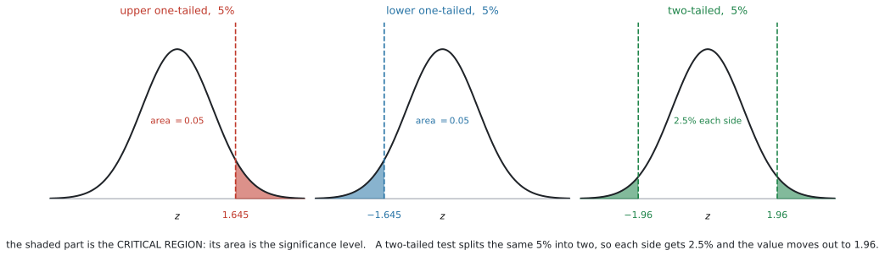
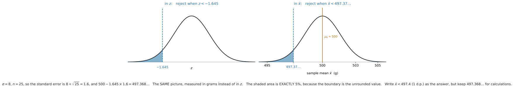
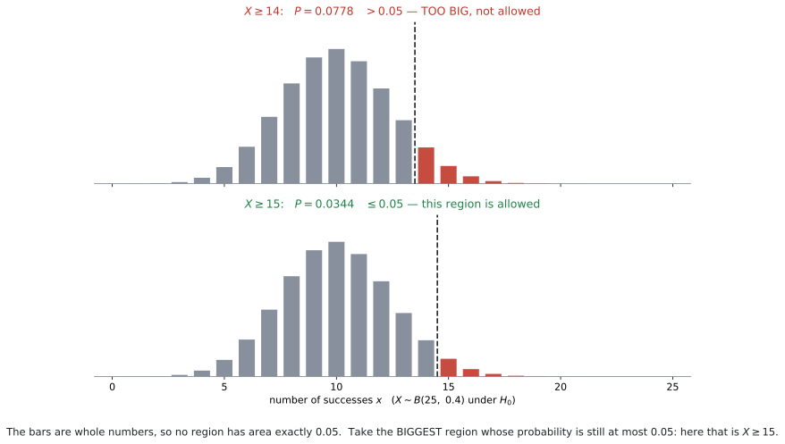

# AHL 4.18a — Critical values and critical regions（臨界値と棄却域） {#sec-ahl-4-18a}

::: {.callout-note}
## What you should be able to do
- **critical value**（臨界値）と **critical region**（棄却域）が何かを言える。
- **$p$-value での判定**と **critical region での判定**が、**同じ判定**だと説明できる。
- 正規分布の critical value（$1.645$、$1.96$、$2.326$、$2.576$）を使い分けられる。
- $z$ のことばで書かれた critical region を、**$\bar{x}$ のことば**に直せる。
- **binomial と Poisson** で、critical region を自分で作れる。
- **答案に書く丸めた値**と、**計算に使う丸める前の値**を使い分けられる。
- 離散分布では **significance level ちょうどにはできない**理由を説明できる。
:::

::: {.callout-note}
## AHL 4.18 は $3$ ページに分かれています
シラバスの AHL 4.18 は、この科目でいちばん中身の多い項目です。この本では $3$ つに分けています。

| ページ | 中身 |
|---|---|
| **AHL 4.18a**（このページ） | critical value と critical region の**考え方** |
| [AHL 4.18b](ahl-4-18b.qmd) | 分布ごとの検定（normal・$t$・binomial・Poisson・$\rho$） |
| [AHL 4.18c](ahl-4-18c.qmd) | Type I error と Type II error |

: AHL 4.18 の $3$ ページ {#tbl-ahl418a-map}

**このページは、$3$ つのうちの土台**です。ここで作る critical region の**確率**が、そのまま AHL 4.18c の Type I error の確率になります。
:::

::: {.callout-note}
## [SL 4.11](../../ai-sl/04-statistics-and-probability/sl-4-11.qmd) の続きです
[SL 4.11](../../ai-sl/04-statistics-and-probability/sl-4-11.qmd) で、**hypothesis test**（仮説検定）の $5$ つのステップを見ました。$H_0$ と $H_1$ を書き、significance level を決め、$p$-value を電卓から読み、比べて結論を書く——という流れです。

**このページで足すのは、判定のしかたをもう $1$ つ覚えることだけ**です。

$p$-value と比べるかわりに、**「この値より外なら reject」という範囲**をあらかじめ決めておきます。その範囲が critical region です。

$5$ つのステップは、そのままです。変わるのは $4$ 番目だけです。
:::

::: {.callout-important}
## Formula booklet に 4.18 の欄はありません
AI HL の公式集は、**4.17 の次が 4.19** です。**4.18 の欄はありません。**

ですから、次の $4$ つの critical value と、[第5節](#xbar)の $\bar{x}_{\text{crit}}$ の式は、**覚える必要があります。**

$$
1.645, \qquad 1.96, \qquad 2.326, \qquad 2.576
$$

（[第4節](#normal-cv)で、どれをいつ使うかを整理します。電卓でも出せますが、試験中に電卓を開くより、覚えているほうが速くて安全です。）
:::

::: {.callout-warning}
## シラバスが「やらなくてよい」と書いている部分があります
> Students will **not be expected to calculate critical regions for $t$-tests**.

**$t$ 検定の critical region は、求めなくてよい**ということです（[第7節](#not-t)）。

> For discrete random variables, hypothesis tests and **critical regions will only be required for one-tailed tests**.

**binomial と Poisson では、片側検定の critical region だけ**です（[第6節](#discrete)）。両側は出ません。
:::

## The idea

### 1. 「どこから先なら reject するか」を、先に決めておきます {#idea}

[SL 4.11](../../ai-sl/04-statistics-and-probability/sl-4-11.qmd#p-value) では、こう進めました。

1. データを集める
2. $p$-value を電卓で出す
3. $p$-value と significance level を比べる

**critical region は、順番を逆にします。**

1. **データを見る前に**、「どこから先が出たら reject するか」を決めておく
2. データを集める
3. その範囲に入っているかどうかだけを見る

この「どこから先」の境目が **critical value**（臨界値）、境目より外の範囲が **critical region**（棄却域）です。

::: {.callout-tip}
## 身近な例で言うと
テストの合格ラインを、**答案を採点する前に**「$60$ 点以上」と決めておくのと同じことです。

先に決めておけば、採点したあとに「この子は $58$ 点だけど、まあいいか」と揺らぐことがありません。

**critical region を先に決めるのも、同じ理由**です。データを見てから基準を動かせないようにしています。
:::

### 2. $p$-value での判定と、まったく同じ判定になります {#two-ways}

**$2$ つの道具は、どちらか一方を選ぶものではありません。同じことを、別の言い方でやっています。**

| | $p$-value で判定 | critical region で判定 |
|---|---|---|
| 見るもの | データから出した確率 | データの値そのもの |
| 比べる相手 | significance level $\alpha$ | critical value |
| reject するのは | $p < \alpha$ のとき | 値が critical region の中にあるとき |

: $2$ つの判定のしかた {#tbl-ahl418a-two-ways}

**この $2$ つは、必ず同じ結論になります。**

理由は、どちらも**同じ大小関係**を見ているからです。

**片側の検定**で考えます。critical region の外側の裾の面積は $\alpha$（離散分布では $\alpha$ 以下）です。データが critical region の中にあれば、**データより外の面積**は**境目より外の面積**より小さくなります。つまり $p$-value が $\alpha$ より小さい、ということです。

**両側の検定**では、$p$-value は片方の裾の面積の $2$ 倍、$\alpha$ も $2$ つの裾に半分ずつ分けたものなので、比べている形は同じです。

::: {.callout-note appearance="simple"}
[第8節](#why)で、この一致を数値で確かめます。
:::

::: {.callout-tip}
## 問題文が、どちらを使うかを指定することがあります
`Find the critical region` と書いてあれば critical region、`Find the p-value` と書いてあれば $p$-value です。**指定があれば、それに従ってください。**

指定がなければ、どちらでも構いません。**そのときは、どちらを使ったのかが分かるように書いてください。**

そして、**時間があればもう一方でも確かめられます。** $2$ つは必ず同じ結論になるので（[第8節](#why)）、食い違ったらどこかで計算を間違えています。
:::

### 3. 片側か両側かで、境目の位置が変わります {#tails}

**significance level $\alpha$ は、critical region の面積です。** この面積をどこに置くかが、片側と両側の違いです。

{#fig-ahl418a-tails width=100%}

@fig-ahl418a-tails を見てください。どの $3$ つも、**塗った部分の面積は合わせて $0.05$** です。

- **one-tailed（片側）**… $H_1$ が $\mu > \mu_0$ か $\mu < \mu_0$ のとき。$5\%$ を**片方の裾にまとめて**置きます。
- **two-tailed（両側）**… $H_1$ が $\mu \neq \mu_0$ のとき。$5\%$ を**半分ずつ**、両方の裾に置きます。

::: {.callout-warning}
## 両側では、境目が外へ動きます
両側にすると、片方の裾は $2.5\%$ しかもらえません。**面積が減ると、境目は外へ動きます。**

$$
1.645 \ \longrightarrow \ 1.96
$$

$H_1$ を読み違えて片側の $1.645$ を使うと、**本当は reject できない値まで reject してしまいます。**

**$H_1$ に $\neq$ があるかどうかを、必ず先に見てください。**
:::

### 4. 正規分布の critical value は、$4$ つ覚えます {#normal-cv}

$\sigma$ が分かっている場合、判定に使う分布は標準正規分布です。よく出るのは、この $4$ つです。

| significance level | one-tailed（片側） | two-tailed（両側） |
|---|---|---|
| $10\%$ | $1.282$ | $1.645$ |
| $5\%$ | $\mathbf{1.645}$ | $\mathbf{1.96}$ |
| $1\%$ | $\mathbf{2.326}$ | $\mathbf{2.576}$ |

: 正規分布の critical value {#tbl-ahl418a-cv}

::: {.callout-tip}
## 表の見方に、$1$ つ仕掛けがあります
**両側 $10\%$ の $1.645$ と、片側 $5\%$ の $1.645$ が同じ数**になっています。

偶然ではありません。両側 $10\%$ は片方の裾が $5\%$、片側 $5\%$ も裾が $5\%$——**同じ面積を切っている**からです。

覚えるべきは「片側か両側か」ではなく、**「片方の裾の面積はいくつか」**です。

表の $1.282$（片側 $10\%$）は、$10\%$ 水準がめったに出ないので、覚えなくて構いません。必要になったら [GDC 第1節](#gdc-inv) で `Area: 0.9` から出せます。
:::

::: {.callout-warning}
## 符号は、$H_1$ の向きで決めます
表の数はすべて正の数です。**下側の検定では、マイナスを付けます。**

| $H_1$ | critical region（$5\%$） |
|---|---|
| $\mu > \mu_0$ | $z > 1.645$ |
| $\mu < \mu_0$ | $z < -1.645$ |
| $\mu \neq \mu_0$ | $z < -1.96$ **または** $z > 1.96$ |

: $H_1$ と critical region {#tbl-ahl418a-signs}

両側のときは、**「または」でつないだ $2$ つの範囲**になります。$1$ つにまとめて書けません。
:::

### 5. $z$ のことばを、$\bar{x}$ のことばに直します {#xbar}

試験では「critical region を $\bar{x}$ で答えなさい」と聞かれることがあります。問題文の単位（グラム、秒、円）で答える形です。

**$\bar{x}$ の分布は、平均が $\mu_0$、standard deviation が $\dfrac{\sigma}{\sqrt{n}}$ の正規分布**です（[AHL 4.15](ahl-4-15.qmd#idea)）。この $\dfrac{\sigma}{\sqrt{n}}$ を **standard error**（標準誤差）といいます（[AHL 4.16](ahl-4-16.qmd#form)）。

ですから、境目はこうなります。

$$
\bar{x}_{\text{crit}} = \mu_0 \pm z_{\text{crit}} \times \frac{\sigma}{\sqrt{n}}
$$ {#eq-ahl418a-xbar}

この式は公式集には載っていません。**覚える必要があります。**

{#fig-ahl418a-xbar width=100%}

@fig-ahl418a-xbar の左右は、**まったく同じ絵**です。目盛りが $z$ かグラムか、という違いしかありません。

[]{#rounding}

::: {.callout-important}
## 丸めた値は「表示用」、判定には丸める前の値を使います
critical value は、たいてい割り切れません。@exm-ahl418a-normal の正確な値は

$$
500 - 1.645 \times 1.6 = 497.368\ldots
$$

です。**critical region を決めているのは、この値**です。

問題文が「小数第1位まで」「有効数字3桁で」と指定していたら、**ふつうに四捨五入して答えます。** ここでは $497.4$ です。特別な丸め方はありません。

**丸めた値は、答案に書くためのもの**です。次の $2$ つでは、**丸める前の値**を使ってください。

| 場面 | 使う値 |
|---|---|
| 答えとして書く | 指定された桁に**四捨五入**した値（$497.4$） |
| 境目に近い観測値を判定する | **丸める前**の $497.368\ldots$ |
| Type II error の確率を計算する（[AHL 4.18c](ahl-4-18c.qmd#normal)） | **丸める前**の $497.368\ldots$ |

: 表示用の値と、計算用の値 {#tbl-ahl418a-rounding}

電卓に保存しておけば、打ち直さずに使えます（[GDC 第2節](#gdc-xbar)）。
:::

::: {.callout-tip}
## 連続分布では、$>$ と $\geq$ の違いは効きません
正規分布では、**$1$ 点ちょうどの確率は $0$** です。

$$
P(\bar{X} = 497.368\ldots) = 0
$$

ですから $\bar{x} < c$ と $\bar{x} \leq c$ は**同じ確率**で、どちらで書いても構いません。

**離散分布は違います。** $P(X = 15)$ は $0$ ではないので、境目の整数を含めるかどうかで確率が変わります（[第6節](#discrete)）。**そこだけは、$\geq$ と $>$ を厳密に区別してください。**
:::

::: {.callout-note appearance="simple"}
critical region を**丸める前の値**で決めているので、正規分布では

$$
P(\text{データが critical region に入る} \mid H_0) = \alpha
$$

がぴったり成り立ちます。これが [AHL 4.18c](ahl-4-18c.qmd#typeI) の Type I error の確率です。

答案に書いた**丸めた値**を確率計算に入れ直すと、$\alpha$ からわずかにずれます。それは「その丸め値が間違い」という意味ではなく、**「精密な計算には丸める前の値を使う」**という意味です。
:::

::: {.callout-tip}
## 符号は「$\pm$」ではなく、向きで選びます
@eq-ahl418a-xbar の $\pm$ は、**両方使うという意味ではありません。**

- 上側の検定（$H_1$: $\mu > \mu_0$）… $+$ だけ
- 下側の検定（$H_1$: $\mu < \mu_0$）… $-$ だけ
- 両側の検定（$H_1$: $\mu \neq \mu_0$）… $+$ と $-$ の**両方**

**$H_1$ を見て、いくつ必要かを決めてください。**
:::

### 6. binomial と Poisson では、ちょうど $\alpha$ にできません {#discrete}

**ここが、この項目でいちばん間違えやすいところです。**

正規分布は連続なので、面積をちょうど $0.05$ に切れます。**binomial と Poisson は、値が整数しかありません。**

$X \sim B(25,\ 0.4)$ を例にとると、$14$ と $15$ のあいだに $X$ が取れる値はありません。ですから、境目を少しずつ動かして確率を $0.05$ に合わせる、ということができません。

{#fig-ahl418a-discrete width=52%}

@fig-ahl418a-discrete が、その様子です。$X \geq 14$ は確率 $0.0778$ で $5\%$ を超えてしまい、$X \geq 15$ は $0.0344$ で $5\%$ に届きません。**ちょうど $0.05$ になる境目は、ありません。**

**では、どちらを選ぶか。** シラバスが決めています。

> The critical region will **maximize the probability of a Type I error while keeping it less than the stated significance level**.

日本語にすると、こうです（シラバスの `less than` は、実際の採点では「$\alpha$ を**超えない**」＝ $\leq \alpha$ の意味で使われます）。

::: {.callout-important}
## 離散分布の critical region の決め方
**確率が $\alpha$ を超えない範囲で、いちばん大きい region を選びます。**

$5\%$ の検定で、上側なら

$$
P(X \geq k) \leq 0.05 \ \text{となる} \ \textbf{最小の} \ k
$$ {#eq-ahl418a-discrete}

を探します。**$k$ が小さいほど region は大きい**ので、「$\alpha$ 以下でいちばん大きい」は「条件を満たす最小の $k$」と同じことです。

下側なら $P(X \leq k) \leq \alpha$ となる**最大の** $k$ です。
:::

::: {.callout-warning}
## $\alpha$ を超えたら、その region は使えません
@fig-ahl418a-discrete の $X \geq 14$ は $0.0778$ で、$0.05$ を**超えています。** これを選ぶと、$H_0$ が正しいのに reject してしまう確率が $5\%$ を超えます。**約束を破ったことになるので、使えません。**

「$0.0778$ のほうが $0.05$ に近いから」という理由で選ばないでください。**近さではなく、超えないかどうか**です。
:::

::: {.callout-warning}
## 逆に、小さすぎる region も選びません
$X \geq 16$ の確率は $0.0132$ で、$0.05$ を超えていません。しかしこれは**必要以上に小さい** region です。

小さくすると、$H_0$ が間違っているときに気づきにくくなります（[AHL 4.18c](ahl-4-18c.qmd) の Type II error です）。

シラバスの `maximize` は、そのためのことばです。**超えない中で、いちばん大きく**取ります。
:::

### 7. $t$ 検定では、critical region を求めなくてよい {#not-t}

シラバスが、はっきり外しています。

> Students will **not be expected to calculate critical regions for $t$-tests**.

$t$ 分布の critical value は、自由度によって変わります。$n = 10$ と $n = 30$ では違う数になり、$4$ つ覚えて済むという話になりません。

**$\sigma$ が分からない場合（$t$ を使う場合）は、$p$-value で判定してください**（[AHL 4.18b](ahl-4-18b.qmd)）。

| 場面 | critical region | 判定 |
|---|---|---|
| $\sigma$ 既知（normal） | **求める** | どちらでもよい |
| $\sigma$ 未知（$t$） | **求めない** | $p$-value で |
| binomial・Poisson | **求める**（片側のみ） | どちらでもよい |

: critical region を求めるのはどこか {#tbl-ahl418a-where}

## Why it works

::: {.callout-tip collapse="true"}
## クリックすると開きます

### 8. $2$ つの判定が一致する理由 {#why}

[第2節](#two-ways)で「$p$-value での判定と critical region での判定は同じ結論になる」と書きました。数値で確かめます。

@exm-ahl418a-normal の設定を使います。$\mu_0 = 500$、$\sigma = 8$、$n = 25$、$H_1$: $\mu < 500$、$5\%$。critical value は $497.368\ldots$（答案には $497.4$）でした。**ここでは丸める前の値で比べます。**

| 観測値 $\bar{x}$ | critical region の中か | $p$-value | $p < 0.05$ か |
|---|---|---|---|
| $496.5$ | **中**（$496.5 < 497.368$） | $0.0144$ | **はい** |
| $497.5$ | 外（$497.5 > 497.368$） | $0.0591$ | いいえ |

: $2$ つの判定は一致する {#tbl-ahl418a-agree}

**$2$ 行とも、左右の答えが一致しています。**

なぜそうなるか。片側の検定で考えます。$p$-value は「観測値より外の面積」、critical region の面積は $\alpha$ です。

**観測値が critical region の中にある**ということは、観測値が境目より外にあるということです。すると「観測値より外の面積」は「境目より外の面積」より**小さく**なります。つまり $p < \alpha$ です。

両側でも、$2$ 倍どうしを比べるので同じことになります。

逆も同じです。**$2$ つは、同じ大小関係を、面積で見るか位置で見るかの違いで表しているだけ**です。

### 9. では、なぜ $2$ つとも学ぶのか {#why-both}

**問われ方が違うから**です。

- `Find the critical region` … 範囲そのものを聞かれています。$p$-value では答えられません。
- `Find the p-value` … 確率を聞かれています。範囲では答えられません。
- `Test at the 5% level` … どちらでも構いません。

そして [AHL 4.18c](ahl-4-18c.qmd) の Type I / Type II error は、**critical region がないと計算できません。** critical region は、そのための道具でもあります。
:::

## Worked examples

::: {#exm-ahl418a-normal}
[A machine fills bags of flour. The mass of a bag is normally distributed with standard deviation $\sigma = 8$ grams. The machine is set to a mean of $500$ grams.]{.q-en}

[A quality inspector suspects that the machine is underfilling. She takes a random sample of $25$ bags and will test at the $5\%$ significance level.]{.q-en}

**(a)** [State the null and alternative hypotheses.]{.q-en}

**(b)** [Find the critical region for $\bar{x}$, giving your value correct to one decimal place.]{.q-en}

**(c)** [The sample mean is $496.5$ grams. State the conclusion of the test, giving a reason.]{.q-en}

<details class="jp-trans">
<summary>日本語訳</summary>

ある機械が小麦粉を袋詰めしています。袋の重さは standard deviation $\sigma = 8$ グラムの正規分布にしたがいます。機械は平均 $500$ グラムに設定されています。

`underfill` は「規定より少なく詰める」という意味です。

品質検査官は、機械が少なく詰めているのではないかと疑っています。無作為に $25$ 袋を選び、有意水準 $5\%$ で検定します。

**(a)** 帰無仮説と対立仮説を書きなさい。

**(b)** $\bar{x}$ の critical region を、値を小数第1位まで求めなさい。

**(c)** 標本平均は $496.5$ グラムでした。理由を付けて、検定の結論を述べなさい。

</details>

**(a)** 「少なく詰めている」を疑っているので、$H_1$ は**下側**です。$H_0$ はいつも「変わっていない」ほうです（[SL 4.11](../../ai-sl/04-statistics-and-probability/sl-4-11.qmd#hypotheses)）。

$$
H_0: \mu = 500, \qquad H_1: \mu < 500
$$

**(b)** まず standard error を出します。

$$
\frac{\sigma}{\sqrt{n}} = \frac{8}{\sqrt{25}} = \frac{8}{5} = 1.6
$$

片側 $5\%$ なので $z_{\text{crit}} = 1.645$。$H_1$ が下側なので、**マイナス**を使います（@eq-ahl418a-xbar）。

$$
\bar{x}_{\text{crit}} = 500 - 1.645 \times 1.6 = 497.368\ldots
$$

小数第1位までと指定されているので、**ふつうに四捨五入して** $497.4$ です。

critical region は $\bar{x} < 497.4$ です。

**検算。** $497.4$ は $500$ より小さくなっています ✓ 下側の検定なので、境目は平均より下にあるはずです。

**(c)** $496.5$ は $497.368\ldots$ より小さいので、観測値は critical region の中にあります。**境目に近くないので、丸めた $497.4$ と比べても同じ結論です**（[第5節](#rounding)）。

::: {.model-answer}
**試験ではこう書く**

*The sample mean $496.5$ g lies in the critical region $\bar{x} < 497.4$ g, so we reject $H_0$ at the $5\%$ significance level. There is sufficient evidence to suggest that the machine is underfilling the bags.*
:::

（標本平均 $496.5$ g は critical region $\bar{x} < 497.4$ g の中にあるので $5\%$ 水準で $H_0$ を棄却する、機械が少なく詰めていることを示す十分な証拠がある、という意味です。）

::: {.callout-warning}
## $H_1$ を `accept` とは書きません
$H_0$ を **reject する**、と書きます。$H_1$ を「正しいと証明した」わけではありません（[SL 4.11](../../ai-sl/04-statistics-and-probability/sl-4-11.qmd#accept)）。

そして、**必ず文脈のことばに戻してください。** 「$H_0$ を棄却する」だけで止めると、点が付かないことがあります。
:::

::: {.callout-note}
## 解答例（答案用紙にはこう書く）
**(a)**
$$
H_0: \mu = 500, \qquad H_1: \mu < 500
$$

**(b)**
$$
\frac{\sigma}{\sqrt{n}} = \frac{8}{\sqrt{25}} = 1.6
$$
$$
\bar{x}_{\text{crit}} = 500 - 1.645 \times 1.6 = 497.368\ldots = 497.4 \ \text{(1 d.p.)}
$$
*Critical region: $\bar{x} < 497.4$ g.*

**(c)** *$496.5 < 497.4$, so the sample mean is in the critical region. Reject $H_0$ at the $5\%$ level: there is evidence that the machine is underfilling.*
:::
:::

::: {#exm-ahl418a-twotail}
[The contents of a bottle of juice are normally distributed with standard deviation $\sigma = 1.5$ ml. The label claims a mean of $20$ ml.]{.q-en}

[A consumer group tests, at the $5\%$ significance level, whether the mean has changed. A random sample of $36$ bottles is taken.]{.q-en}

**(a)** [Write down the alternative hypothesis.]{.q-en}

**(b)** [Find the critical region for $\bar{x}$, giving your values correct to three significant figures.]{.q-en}

**(c)** [The sample mean is $20.55$ ml. State, with a reason, whether the label should be questioned.]{.q-en}

<details class="jp-trans">
<summary>日本語訳</summary>

あるジュースの内容量は standard deviation $\sigma = 1.5$ ml の正規分布にしたがいます。ラベルには平均 $20$ ml と書かれています。

`consumer group` は「消費者団体」という意味です。

消費者団体は、平均が**変わったかどうか**を有意水準 $5\%$ で検定します。無作為に $36$ 本を選びます。

**(a)** 対立仮説を書きなさい。

**(b)** $\bar{x}$ の critical region を、有効数字3桁で求めなさい。

**(c)** 標本平均は $20.55$ ml でした。ラベルを疑うべきかどうかを、理由を付けて述べなさい。

</details>

**(a)** 「変わったかどうか」なので、**どちらの向きも指定していません。両側**です。

$$
H_1: \mu \neq 20
$$

**(b)** standard error は

$$
\frac{\sigma}{\sqrt{n}} = \frac{1.5}{\sqrt{36}} = \frac{1.5}{6} = 0.25
$$

両側 $5\%$ なので $z_{\text{crit}} = 1.96$ です（$1.645$ では**ありません**）。

$$
20 \pm 1.96 \times 0.25 = 20 \pm 0.49
$$

正確には $19.510\ldots$ と $20.489\ldots$ です。有効数字3桁と指定されているので、**ふつうに四捨五入します。**

$$
\bar{x} < 19.5 \quad \text{または} \quad \bar{x} > 20.5
$$

**検算。** $2$ つの境目は $20$ から同じだけ離れています ✓ 両側検定では、境目は必ず $\mu_0$ について対称です。

**(c)** $20.55 > 20.5$ なので、critical region の中です。

::: {.model-answer}
**試験ではこう書く**

*The sample mean $20.55$ ml lies in the critical region $\bar{x} > 20.5$ ml, so we reject $H_0$ at the $5\%$ significance level. There is sufficient evidence that the mean contents differ from the $20$ ml stated on the label, so the label should be questioned.*
:::

（標本平均 $20.55$ ml は critical region $\bar{x} > 20.5$ ml の中にあるので $5\%$ 水準で $H_0$ を棄却する、平均がラベルの $20$ ml と異なるという十分な証拠があるのでラベルは疑うべきだ、という意味です。）

::: {.callout-warning}
## ここで $1.645$ を使うと、答えが変わります
片側の $1.645$ を使ってしまうと、境目は $20 + 1.645 \times 0.25 = 20.411\ldots$ になります。

この問題では、どちらを使っても「reject」という結論は変わりません。**しかし $\bar{x} = 20.45$ だったら、結論が分かれます。** $1.96$ なら reject しませんが、$1.645$ なら reject してしまいます。

**「答えが同じだったから、まあいいか」では済みません。**
:::

::: {.callout-note}
## 解答例（答案用紙にはこう書く）
**(a)**
$$
H_1: \mu \neq 20
$$

**(b)**
$$
\frac{\sigma}{\sqrt{n}} = \frac{1.5}{\sqrt{36}} = 0.25
$$
$$
20 \pm 1.96 \times 0.25 = 20 \pm 0.49
$$
*Critical region: $\bar{x} < 19.5$ or $\bar{x} > 20.5$.*

**(c)** *$20.55 > 20.5$, so the sample mean is in the critical region. Reject $H_0$ at the $5\%$ level: there is evidence that the mean differs from $20$ ml, so the label should be questioned.*
:::
:::

::: {#exm-ahl418a-binom}
[In the past, $40\%$ of customers at a café have chosen the vegetarian option. The owner introduces a new vegetarian dish and believes that the proportion has increased.]{.q-en}

[She records the choices of a random sample of $25$ customers. Let $X$ be the number who choose the vegetarian option, and test at the $5\%$ significance level.]{.q-en}

**(a)** [State the hypotheses in terms of $p$.]{.q-en}

**(b)** [Find the critical region for $X$.]{.q-en}

**(c)** [Find the probability that $X$ lies in the critical region when $H_0$ is true.]{.q-en}

<details class="jp-trans">
<summary>日本語訳</summary>

これまで、あるカフェの客の $40\%$ がベジタリアン向けのメニューを選んでいました。店主は新しいベジタリアン料理を出し、その割合が増えたと考えています。

`vegetarian option` は「ベジタリアン向けの選択肢」という意味です。

無作為に選んだ $25$ 人の客の選択を記録します。$X$ をベジタリアン向けを選んだ人数として、有意水準 $5\%$ で検定します。

**(a)** $p$ を使って仮説を書きなさい。

**(b)** $X$ の critical region を求めなさい。

**(c)** $H_0$ が正しいとき、$X$ が critical region に入る確率を求めなさい。

</details>

**(a)** 「増えた」を疑っているので上側です。

$$
H_0: p = 0.4, \qquad H_1: p > 0.4
$$

**(b)** $H_0$ が正しいとすると $X \sim B(25,\ 0.4)$ です。$P(X \geq k) \leq 0.05$ となる**最小の** $k$ を探します（@eq-ahl418a-discrete）。

電卓で、上から順に試します。

| $k$ | $P(X \geq k)$ | $0.05$ 以下か |
|---|---|---|
| $14$ | $0.0778$ | いいえ |
| $15$ | $\mathbf{0.0344}$ | **はい** |

: $k$ を探す {#tbl-ahl418a-search}

$k = 14$ では $5\%$ を**超えて**しまいます。$k = 15$ で初めて $5\%$ 以下になります。

critical region は $X \geq 15$ です。

**検算。** $H_0$ のもとでの平均は $25 \times 0.4 = 10$ です ✓ 上側の検定なので、critical region が平均より上にあるのは正しい向きです。

**(c)** (b) で出した値がそのまま答えです。

$$
P(X \geq 15) = 0.0344
$$

::: {.callout-tip}
## (c) は「実際の significance level」です
「$5\%$ で検定する」と言いながら、$H_0$ が正しいのに reject してしまう確率は、実際には $0.0344$ です。

**$0.05$ ではありません。** 整数しか取れないので、ちょうどには合わせられないからです（[第6節](#discrete)）。

この $0.0344$ が、[AHL 4.18c](ahl-4-18c.qmd) では **Type I error の確率**と呼ばれます。**同じ数**です。
:::

::: {.callout-note}
## 解答例（答案用紙にはこう書く）
**(a)**
$$
H_0: p = 0.4, \qquad H_1: p > 0.4
$$

**(b)** *Under $H_0$, $X \sim B(25,\ 0.4)$.*
$$
P(X \geq 14) = 0.0778 > 0.05
$$
$$
P(X \geq 15) = 0.0344 < 0.05
$$
*Critical region: $X \geq 15$.*

**(c)**
$$
P(X \geq 15) = 0.0344
$$
:::
:::

::: {#exm-ahl418a-pois}
[A shop receives complaints at a mean rate of $6$ per week, following a Poisson distribution. After a change of supplier, the manager wishes to test whether the rate of complaints has increased.]{.q-en}

[Let $X$ be the number of complaints in one week, and test at the $5\%$ significance level.]{.q-en}

**(a)** [Find the critical region for $X$.]{.q-en}

**(b)** [In the week after the change, $9$ complaints are received. State the conclusion of the test.]{.q-en}

**(c)** [Explain why the critical region $X \geq 12$ would not be used, even though its probability is less than $0.05$.]{.q-en}

<details class="jp-trans">
<summary>日本語訳</summary>

ある店には $1$ 週あたり平均 $6$ 件の割合で苦情が届き、ポアソン分布にしたがいます。仕入先を変えたあと、店長は苦情の割合が増えたかどうかを検定したいと考えています。

`complaint` は「苦情」、`supplier` は「仕入先」という意味です。

$X$ を $1$ 週間の苦情の件数として、有意水準 $5\%$ で検定します。

**(a)** $X$ の critical region を求めなさい。

**(b)** 変更後の週には $9$ 件の苦情が届きました。検定の結論を述べなさい。

**(c)** critical region を $X \geq 12$ としない理由を、その確率が $0.05$ より小さいにもかかわらず、と説明しなさい。

</details>

**(a)** $H_0$: $m = 6$、$H_1$: $m > 6$ です。$H_0$ のもとで $X \sim \mathrm{Po}(6)$（[AHL 4.17](ahl-4-17.qmd#notation)）。

| $k$ | $P(X \geq k)$ | $0.05$ 以下か |
|---|---|---|
| $10$ | $0.0839$ | いいえ |
| $11$ | $\mathbf{0.0426}$ | **はい** |

: Poisson で $k$ を探す {#tbl-ahl418a-pois-search}

critical region は $X \geq 11$ です。

**検算。** $H_0$ のもとでの平均は $6$ です ✓ 上側の検定なので、$11$ が $6$ より上にあるのは正しい向きです。

**(b)** $9 < 11$ なので、critical region の**外**です。

::: {.model-answer}
**試験ではこう書く**

*$9$ is not in the critical region $X \geq 11$, so we do not reject $H_0$ at the $5\%$ significance level. There is insufficient evidence to suggest that the rate of complaints has increased.*
:::

（$9$ は critical region $X \geq 11$ に入っていないので $5\%$ 水準で $H_0$ を棄却しない、苦情の割合が増えたと言うだけの証拠はない、という意味です。）

**(c)** $P(X \geq 12) = 0.0201$ で、たしかに $0.05$ より小さくなっています。しかし、**もっと大きい region が $0.05$ 以下で取れます。**

::: {.model-answer}
**試験ではこう書く**

*The critical region must be as large as possible while its probability stays at or below the significance level. Since $P(X \geq 11) = 0.0426$ is still less than $0.05$, the region $X \geq 11$ is larger than $X \geq 12$ and is still allowed, so $X \geq 12$ is not used.*
:::

（critical region は、その確率が有意水準以下にとどまる範囲で、できるだけ大きく取らなければならない。$P(X \geq 11) = 0.0426$ はまだ $0.05$ より小さく、$X \geq 11$ のほうが $X \geq 12$ より大きくてなお許されるので、$X \geq 12$ は使わない、という意味です。）

::: {.callout-warning}
## `do not reject` であって、`accept` ではありません
(b) で $H_0$ を棄却しませんでした。これは「苦情は増えていないと分かった」という意味では**ありません。**

**「増えたと言えるだけの証拠がなかった」**というだけです（[SL 4.11](../../ai-sl/04-statistics-and-probability/sl-4-11.qmd#accept)）。

英語では *do not reject* $H_0$ または *there is insufficient evidence* と書きます。
:::

::: {.callout-note}
## 解答例（答案用紙にはこう書く）
**(a)** *Under $H_0$, $X \sim \mathrm{Po}(6)$.*
$$
P(X \geq 10) = 0.0839 > 0.05
$$
$$
P(X \geq 11) = 0.0426 < 0.05
$$
*Critical region: $X \geq 11$.*

**(b)** *$9$ is not in the critical region, so do not reject $H_0$ at the $5\%$ level. There is insufficient evidence that the rate of complaints has increased.*

**(c)** *$P(X \geq 11) = 0.0426 < 0.05$, so $X \geq 11$ is allowed and is a larger region than $X \geq 12$. The critical region must be the largest region whose probability does not exceed the significance level.*
:::
:::

## Common errors

::: {.callout-warning}
## 両側検定で $1.645$ を使う
$H_1$ に $\neq$ があったら $1.96$ です。$5\%$ が**半分ずつ**に分かれるので、境目は外へ動きます（[第3節](#tails)）。
:::

::: {.callout-warning}
## $\sigma$ を standard error に直さずに使う
$\bar{x}$ の散らばりは $\sigma$ ではなく $\dfrac{\sigma}{\sqrt{n}}$ です（[第5節](#xbar)）。

@exm-ahl418a-normal で $\sqrt{n}$ を忘れると、$500 - 1.645 \times 8 = 486.8$ となり、$497.4$ からまったく離れてしまいます。
:::

::: {.callout-warning}
## 下側の検定で、マイナスを付け忘れる
$H_1$: $\mu < \mu_0$ なら $z_{\text{crit}} = -1.645$ です。表の数は正のままなので、**自分で符号を決めます**（[第4節](#normal-cv)）。
:::

::: {.callout-warning}
## 離散分布で、$\alpha$ を超える region を選ぶ
@exm-ahl418a-binom の $X \geq 14$ は $0.0778$ です。$0.05$ に**近い**からといって選べません。**超えているものは使えません**（[第6節](#discrete)）。
:::

::: {.callout-warning}
## 離散分布で、小さすぎる region を選ぶ
@exm-ahl418a-pois の $X \geq 12$ は $0.0201$ で $0.05$ を超えていませんが、$X \geq 11$ の $0.0426$ も超えていません。**大きいほうを取ります**（[第6節](#discrete)）。
:::

::: {.callout-warning}
## `at least` と `more than` を取り違える
$P(X \geq 11)$ と $P(X > 11)$ は違います。後者は $P(X \geq 12)$ です（[AHL 4.17](ahl-4-17.qmd#gdc-tail)）。

critical region を書くときも、**$\geq$ か $>$ か**をはっきりさせてください。
:::

::: {.callout-warning}
## $t$ 検定で critical value を探そうとする
シラバスが外しています（[第7節](#not-t)）。$\sigma$ が分からないときは、**$p$-value で判定**してください。
:::

::: {.callout-warning}
## 丸めた値を、精密な判定や Type II error の計算に使う
@exm-ahl418a-normal の正確な critical value は $497.368\ldots$ です。$497.4$ は**答案に書くための値**です（[第5節](#rounding)）。

観測値が $497.39$ だったら、**丸めた $497.4$ と比べると「中」ですが、正確な値と比べると「外」**です。

境目に近いときは、**丸める前の値で比べる**か、$p$-value で判定してください。

[AHL 4.18c](ahl-4-18c.qmd#normal) の Type II error の計算でも、**丸める前の値**を使ってください。丸めた値を入れると、答えの $3$ 桁目がずれることがあります。
:::

::: {.callout-warning}
## critical region を「値」だけで答える
`Find the critical region` に対して $497.4$ とだけ書くと、**範囲になっていません。**

$\bar{x} < 497.4$ のように、**不等号を付けて範囲で答えます。**
:::

::: {.callout-warning}
## 両側の critical region を $1$ つにまとめて書く
$19.5 < \bar{x} < 20.5$ と書くと、**critical region ではなく、その反対の範囲**になってしまいます。

$\bar{x} < 19.5$ **または** $\bar{x} > 20.5$ です（[第4節](#normal-cv)）。
:::

## Using your GDC (TI-Nspire CX II)

### 1. 正規分布の critical value を出す {#gdc-inv}

$4$ つの数（$1.645$、$1.96$、$2.326$、$2.576$）は覚えておくのが速いのですが、電卓でも出せます。

```
menu → Statistics → Distributions → Inverse Normal
```

| 欄 | 入れるもの |
|---|---|
| `Area` | 境目より**左**の面積 |
| `μ` | $0$ |
| `σ` | $1$ |

: `Inverse Normal` で critical value {#tbl-ahl418a-gdc-inv}

::: {.callout-important}
## `Area` は「左の面積」です
`Inverse Normal` は、**左からの面積**を受け取ります。上側 $5\%$ の境目がほしいなら、入れるのは $0.05$ では**なく** $0.95$ です。

| ほしいもの | `Area` に入れる数 | 出てくる値 |
|---|---|---|
| 上側 $5\%$ の境目 | $0.95$ | $1.645$ |
| 下側 $5\%$ の境目 | $0.05$ | $-1.645$ |
| 両側 $5\%$ の上の境目 | $0.975$ | $1.96$ |
| 両側 $5\%$ の下の境目 | $0.025$ | $-1.96$ |

: `Area` に何を入れるか {#tbl-ahl418a-gdc-area}

**両側は $\alpha$ を $2$ で割ってから**考えてください。
:::

### 2. $\bar{x}$ の critical value を、直接出す {#gdc-xbar}

`μ` と `σ` に $0$ と $1$ ではなく、**$\mu_0$ と standard error** を入れると、$\bar{x}$ の境目がそのまま出ます。

@exm-ahl418a-normal なら、こうです。

```
Inverse Normal:   Area: 0.05      μ: 500      σ: 1.6
```

$$
497.368\ldots
$$

$z$ を経由しなくても出せます。**ただし、答案には @eq-ahl418a-xbar の $1$ 行を書いてください。** 電卓から読んだ数だけでは、過程に点が付きません。

### 3. binomial・Poisson の critical region を探す {#gdc-discrete}

**`Binomial Cdf` と `Poisson Cdf` を、$k$ を変えながら何回か使います。**

```
menu → Statistics → Distributions → Binomial Cdf
                                  → Poisson Cdf
```

@exm-ahl418a-binom なら、$P(X \geq 14)$ は「$14$ から $25$ まで」です。

```
Binomial Cdf:   Num Trials, n: 25    Prob Success, p: 0.4
                Lower Bound: 14      Upper Bound: 25
```

::: {.callout-tip}
## Poisson には上限がないので、大きい数を入れます
`Poisson Cdf` の `Upper Bound` には、**$m$ よりずっと大きい数**を入れてください。@exm-ahl418a-pois なら $100$ で十分です。

$\mathrm{Po}(6)$ で $X$ が $100$ を超える確率は、$0$ と区別できないほど小さいからです。
:::

::: {.callout-tip}
## `Inverse Binomial` を使うと、$1$ 回で探せます
`Binomial Cdf` を何回も打つかわりに、こう使えます。

```
menu → Statistics → Distributions → Inverse Binomial
```

`Cumulative Prob` に $0.95$、`Num Trials, n` に $25$、`Prob Success, p` に $0.4$ を入れると、**$P(X \leq k) \geq 0.95$ となる最小の $k$** が出ます。

@exm-ahl418a-binom では $14$ が出ます。**critical region は、その $1$ つ上から**なので $X \geq 15$ です。

**これが使えるのは、上側の検定だけです。** 下側（$H_1$ が $<$）では、`Cumulative Prob` に $\alpha$ を入れて出た $k$ の**$1$ つ下**が境目になります。向きを取り違えると $2$ つずれるので、**下側では `Binomial Cdf` を繰り返すほうが安全です。**

**上側でも $1$ ずれるので、必ず `Binomial Cdf` で確かめてください。** $P(X \geq 15) = 0.0344 \leq 0.05$、$P(X \geq 14) = 0.0778 > 0.05$——この $2$ 行を答案に書けば、$k$ の選び方まで示せます。

Poisson には対応するコマンドがありません。`Poisson Cdf` を繰り返してください。
:::

::: {.callout-warning}
## `Stat Tests` には、binomial 検定も Poisson 検定もありません
```
menu → Statistics → Stat Tests
```
を開くと `z Test`、`t Test`、`1-Prop z Test`、`χ² GOF`、`Linear Reg t Test` などが並んでいます。**binomial 検定と Poisson 検定は、この一覧にありません。**

この $2$ つだけは、`Binomial Cdf` / `Poisson Cdf` で**自分で確率を作ります。**

なお `1-Prop z Test` は名前が近いので選びたくなりますが、**これは正規分布で近似する検定**です。シラバスが求めているのは `Test for proportion using binomial distribution` なので、**別のものです**（[AHL 4.18b](ahl-4-18b.qmd)）。
:::

## Exercises

::: {.callout-note appearance="simple"}
各問題に、折りたたみが3つ付いています。**日本語訳**、**解答例**（答案用紙に書くべきこと。英語です）、**解説**（なぜそうなるか。日本語です）。

まず自分で解いて、次に解答例と見くらべてください。**解説は、合わなかったときだけ開けば十分です。**
:::

::: {.exercise-block}

[1]{.ex-no} [State the critical value of $z$ for each of the following tests.]{.q-en}

**(a)** [A one-tailed test at the $5\%$ significance level, with $H_1: \mu > \mu_0$.]{.q-en}

**(b)** [A two-tailed test at the $5\%$ significance level.]{.q-en}

**(c)** [A one-tailed test at the $1\%$ significance level, with $H_1: \mu < \mu_0$.]{.q-en}

**(d)** [A two-tailed test at the $1\%$ significance level.]{.q-en}

<details class="jp-trans">
<summary>日本語訳</summary>

次のそれぞれの検定について、$z$ の critical value を述べなさい。

**(a)** $H_1: \mu > \mu_0$ の、有意水準 $5\%$ の片側検定。

**(b)** 有意水準 $5\%$ の両側検定。

**(c)** $H_1: \mu < \mu_0$ の、有意水準 $1\%$ の片側検定。

**(d)** 有意水準 $1\%$ の両側検定。

</details>

::: {.callout-note collapse="true"}
## 解答例（答案用紙に書くこと）
**(a)** $z = 1.645$

**(b)** $z = \pm 1.96$

**(c)** $z = -2.326$

**(d)** $z = \pm 2.576$
:::

::: {.callout-tip collapse="true"}
## 解説
**符号は $H_1$ の向きで決めます**（[第4節](#normal-cv)）。

**(a)** $H_1$ が上側なので、正の値だけです。

**(b)** 両側なので $2$ つ。$5\%$ が半分ずつになるので $1.645$ ではなく $1.96$ です。

**(c)** $H_1$ が下側なので**マイナス**です。表の $2.326$ にマイナスを付けます。

**(d)** 両側 $1\%$ なので、片方の裾は $0.5\%$。$2.576$ です。

**検算。** 両側の値は、いつも片側の値より**外側**にあります ✓ $1.96 > 1.645$、$2.576 > 2.326$。
:::

::: {.ex-sep}
:::

[2]{.ex-no} [The lifetime of a type of battery is normally distributed with standard deviation $\sigma = 12$ hours. The manufacturer claims a mean lifetime of $250$ hours. A researcher believes the mean is greater than this, and tests at the $5\%$ significance level using a random sample of $36$ batteries.]{.q-en}

**(a)** [Find the critical region for $\bar{x}$, giving your value correct to one decimal place.]{.q-en}

**(b)** [The sample mean is $254$ hours. State the conclusion of the test.]{.q-en}

<details class="jp-trans">
<summary>日本語訳</summary>

ある種類の電池の寿命は standard deviation $\sigma = 12$ 時間の正規分布にしたがいます。製造元は平均寿命 $250$ 時間と主張しています。ある研究者は平均がこれより大きいと考え、無作為に選んだ $36$ 個の電池を使って有意水準 $5\%$ で検定します。

`lifetime` は「寿命」、`manufacturer` は「製造元」という意味です。

**(a)** $\bar{x}$ の critical region を、値を小数第1位まで求めなさい。

**(b)** 標本平均は $254$ 時間でした。検定の結論を述べなさい。

</details>

::: {.callout-note collapse="true"}
## 解答例（答案用紙に書くこと）
**(a)**
$$
H_0: \mu = 250, \qquad H_1: \mu > 250
$$
$$
\frac{\sigma}{\sqrt{n}} = \frac{12}{\sqrt{36}} = 2
$$
$$
\bar{x}_{\text{crit}} = 250 + 1.645 \times 2 = 253.289\ldots = 253.3 \ \text{(1 d.p.)}
$$
*Critical region: $\bar{x} > 253.3$ hours.*

**(b)** *$254 > 253.3$, so the sample mean is in the critical region. Reject $H_0$ at the $5\%$ level: there is evidence that the mean lifetime is greater than $250$ hours.*
:::

::: {.callout-tip collapse="true"}
## 解説
**(a)** 「より大きい」なので**上側の片側検定**です。$z_{\text{crit}} = 1.645$、符号は $+$ です。

standard error は $\dfrac{12}{\sqrt{36}} = \dfrac{12}{6} = 2$。**$\sqrt{n}$ を忘れないでください。**

$$
250 + 1.645 \times 2 = 253.289\ldots
$$

小数第1位までと指定されているので、**ふつうに四捨五入して** $253.3$ です。

**検算。** 境目が $250$ より**上**にあります ✓ 上側の検定なので、正しい向きです。

**(b)** $254$ は $253.289\ldots$ より大きいので、critical region の中です。境目から離れているので、丸めた $253.3$ と比べても同じ結論になります。

$p$-value で確かめても、同じ結論になります。$P(\bar{X} > 254) = 0.0228 < 0.05$ です（[第8節](#why)）。

**結論は、必ず文脈のことばに戻してください。** 「$H_0$ を棄却する」で止めないでください。
:::

::: {.ex-sep}
:::

[3]{.ex-no} [The diameter of a machine part is normally distributed with standard deviation $\sigma = 0.2$ mm. The target diameter is $1.5$ mm. An engineer tests, at the $1\%$ significance level, whether the mean diameter has changed. A random sample of $25$ parts is measured.]{.q-en}

**(a)** [Find the critical region for $\bar{x}$, giving your values correct to two decimal places.]{.q-en}

**(b)** [The sample mean is $1.62$ mm. State the conclusion of the test.]{.q-en}

<details class="jp-trans">
<summary>日本語訳</summary>

ある機械部品の直径は standard deviation $\sigma = 0.2$ mm の正規分布にしたがいます。目標の直径は $1.5$ mm です。技術者は、平均の直径が**変わったかどうか**を有意水準 $1\%$ で検定します。無作為に $25$ 個の部品を測ります。

`diameter` は「直径」、`engineer` は「技術者」という意味です。

**(a)** $\bar{x}$ の critical region を、値を小数第2位まで求めなさい。

**(b)** 標本平均は $1.62$ mm でした。検定の結論を述べなさい。

</details>

::: {.callout-note collapse="true"}
## 解答例（答案用紙に書くこと）
**(a)**
$$
H_0: \mu = 1.5, \qquad H_1: \mu \neq 1.5
$$
$$
\frac{\sigma}{\sqrt{n}} = \frac{0.2}{\sqrt{25}} = 0.04
$$
$$
1.5 \pm 2.576 \times 0.04 \ \Rightarrow \ 1.39696\ldots \ \text{and} \ 1.60304\ldots
$$
*Critical region: $\bar{x} < 1.40$ mm or $\bar{x} > 1.60$ mm (2 d.p.).*

**(b)** *$1.62 > 1.60$, so the sample mean is in the critical region. Reject $H_0$ at the $1\%$ level: there is evidence that the mean diameter has changed.*
:::

::: {.callout-tip collapse="true"}
## 解説
**(a)** 「変わったかどうか」なので**両側**、しかも $1\%$ です。使うのは $2.576$ です。

$4$ つの数のどれを使うかを、$2$ 段階で決めます。まず $1\%$ か $5\%$ か、次に片側か両側か。**両方そろって $1$ つに決まります。**

standard error は $\dfrac{0.2}{5} = 0.04$。

$$
2.576 \times 0.04 = 0.10304
$$
$$
1.5 - 0.10304 = 1.39696\ldots, \qquad 1.5 + 0.10304 = 1.60304\ldots
$$

小数第2位までと指定されているので、**ふつうに四捨五入して** $1.40$ と $1.60$ です。

**検算。** $2$ つの境目は $1.5$ から同じだけ離れています ✓

**(b)** $1.62$ は $1.60304\ldots$ より大きいので、critical region の中です。**境目に近い値なら、丸める前の $1.60304\ldots$ と比べてください**（[第5節](#rounding)）。

**「または」でつないだ範囲**なので、どちらか一方に入っていれば reject です。
:::

::: {.ex-sep}
:::

[4]{.ex-no} [A seed company claims that $25\%$ of its seeds produce red flowers. A gardener suspects the proportion is higher. She plants a random sample of $30$ seeds and will test at the $5\%$ significance level.]{.q-en}

**(a)** [State the hypotheses in terms of $p$.]{.q-en}

**(b)** [Find the critical region for the number of red flowers, $X$.]{.q-en}

<details class="jp-trans">
<summary>日本語訳</summary>

ある種苗会社は、自社の種の $25\%$ が赤い花をつけると主張しています。ある庭師は、その割合はもっと高いのではないかと考えています。無作為に選んだ $30$ 粒を植え、有意水準 $5\%$ で検定します。

`seed` は「種」、`gardener` は「庭師」という意味です。

**(a)** $p$ を使って仮説を書きなさい。

**(b)** 赤い花の数 $X$ の critical region を求めなさい。

</details>

::: {.callout-note collapse="true"}
## 解答例（答案用紙に書くこと）
**(a)**
$$
H_0: p = 0.25, \qquad H_1: p > 0.25
$$

**(b)** *Under $H_0$, $X \sim B(30,\ 0.25)$.*
$$
P(X \geq 12) = 0.0507 > 0.05
$$
$$
P(X \geq 13) = 0.0216 < 0.05
$$
*Critical region: $X \geq 13$.*
:::

::: {.callout-tip collapse="true"}
## 解説
**この問題は、境目がとても際どいところにあります。**

$$
P(X \geq 12) = 0.0507
$$

$0.05$ を、**わずか $0.0007$ だけ超えています。** これでは使えません（[第6節](#discrete)）。

$$
P(X \geq 13) = 0.0216
$$

こちらは $0.05$ 以下なので、使えます。critical region は $X \geq 13$ です。

::: {.callout-warning}
## $3$ 桁に丸めてから比べないでください
$P(X \geq 12)$ を $3$ 桁に丸めると $0.0507$ ですが、さらに $0.05$ に丸めてしまうと「ちょうど $5\%$ だから使える」と判断してしまいます。

**電卓の画面の値を、そのまま $0.05$ と比べてください。**
:::

**検算。** $H_0$ のもとでの平均は $30 \times 0.25 = 7.5$ です ✓ critical region が $7.5$ より上にあるのは、上側の検定として正しい向きです。
:::

::: {.ex-sep}
:::

[5]{.ex-no} [Faults occur in a length of cable at a mean rate of $4$ per kilometre, following a Poisson distribution. After a change in the manufacturing process, an inspector wishes to test whether the rate of faults has increased. Let $X$ be the number of faults in one kilometre.]{.q-en}

[Find the critical region for $X$ for a test at the $1\%$ significance level.]{.q-en}

<details class="jp-trans">
<summary>日本語訳</summary>

あるケーブルには $1$ km あたり平均 $4$ 個の割合で欠陥があり、ポアソン分布にしたがいます。製造工程を変えたあと、検査官は欠陥の割合が増えたかどうかを検定したいと考えています。$X$ を $1$ km あたりの欠陥の数とします。

`fault` は「欠陥」、`cable` は「ケーブル」、`manufacturing process` は「製造工程」という意味です。

有意水準 $1\%$ の検定について、$X$ の critical region を求めなさい。

</details>

::: {.callout-note collapse="true"}
## 解答例（答案用紙に書くこと）
$$
H_0: m = 4, \qquad H_1: m > 4
$$

*Under $H_0$, $X \sim \mathrm{Po}(4)$.*
$$
P(X \geq 9) = 0.0214 > 0.01
$$
$$
P(X \geq 10) = 0.00813 < 0.01
$$
*Critical region: $X \geq 10$.*
:::

::: {.callout-tip collapse="true"}
## 解説
**$1\%$ の検定です。** $5\%$ と混同しないでください。比べる相手は $0.01$ です。

$$
P(X \geq 9) = 0.0214
$$

$0.01$ を超えているので使えません。

$$
P(X \geq 10) = 0.00813
$$

$0.01$ 以下なので使えます。

**水準を厳しくすると、critical region は小さくなります。** 同じ $\mathrm{Po}(4)$ でも、$5\%$ なら $X \geq 9$（$P = 0.0214$）ですが、$1\%$ では $X \geq 10$ まで動きました。

**検算。** $H_0$ のもとでの平均は $4$ です ✓ $10$ は $4$ よりずっと上で、上側の検定として正しい向きです。
:::

::: {.ex-sep}
:::

[6]{.ex-no} [A wildlife camera records animals passing at a mean rate of $10$ per night, following a Poisson distribution. A researcher believes that recent building work has reduced the rate. Let $X$ be the number of animals recorded in one night.]{.q-en}

[Find the critical region for $X$ for a test at the $5\%$ significance level.]{.q-en}

<details class="jp-trans">
<summary>日本語訳</summary>

ある野生動物用のカメラは、$1$ 晩あたり平均 $10$ 頭の割合で通りかかる動物を記録し、ポアソン分布にしたがいます。ある研究者は、最近の工事によってその割合が減ったと考えています。$X$ を $1$ 晩に記録される動物の数とします。

`wildlife camera` は「野生動物観察用カメラ」、`building work` は「工事」という意味です。

有意水準 $5\%$ の検定について、$X$ の critical region を求めなさい。

</details>

::: {.callout-note collapse="true"}
## 解答例（答案用紙に書くこと）
$$
H_0: m = 10, \qquad H_1: m < 10
$$

*Under $H_0$, $X \sim \mathrm{Po}(10)$.*
$$
P(X \leq 5) = 0.0671 > 0.05
$$
$$
P(X \leq 4) = 0.0293 < 0.05
$$
*Critical region: $X \leq 4$.*
:::

::: {.callout-tip collapse="true"}
## 解説
**これは下側の検定です。** 「減った」を疑っているので $H_1$: $m < 10$ です。

下側では、探し方が逆になります。

$$
P(X \leq k) \leq 0.05 \ \text{となる} \ \textbf{最大の} \ k
$$

**$k$ が大きいほど region は大きい**ので、下側では「最大の $k$」を探します（[第6節](#discrete)）。

$$
P(X \leq 5) = 0.0671 \quad (\text{超えている})
$$
$$
P(X \leq 4) = 0.0293 \quad (\text{使える})
$$

critical region は $X \leq 4$ です。

**検算。** $H_0$ のもとでの平均は $10$ です ✓ 下側の検定なので、critical region が平均より**下**にあるのは正しい向きです。
:::

::: {.ex-sep}
:::

[7]{.ex-no} [A politician claims that $60\%$ of voters in a town support a new park. A local newspaper believes the true proportion is lower and surveys a random sample of $20$ voters. Let $X$ be the number who support the park.]{.q-en}

[Find the critical region for $X$ for a test at the $5\%$ significance level.]{.q-en}

<details class="jp-trans">
<summary>日本語訳</summary>

ある政治家は、町の有権者の $60\%$ が新しい公園に賛成していると主張しています。地元の新聞社は、実際の割合はもっと低いと考え、無作為に選んだ $20$ 人の有権者に調査します。$X$ を公園に賛成する人数とします。

`politician` は「政治家」、`voter` は「有権者」、`survey` は「調査する」という意味です。

有意水準 $5\%$ の検定について、$X$ の critical region を求めなさい。

</details>

::: {.callout-note collapse="true"}
## 解答例（答案用紙に書くこと）
$$
H_0: p = 0.6, \qquad H_1: p < 0.6
$$

*Under $H_0$, $X \sim B(20,\ 0.6)$.*
$$
P(X \leq 8) = 0.0565 > 0.05
$$
$$
P(X \leq 7) = 0.0210 < 0.05
$$
*Critical region: $X \leq 7$.*
:::

::: {.callout-tip collapse="true"}
## 解説
**binomial の下側**です。$H_1$: $p < 0.6$ なので、小さいほうが証拠になります。

$$
P(X \leq 8) = 0.0565 \quad (\text{超えている})
$$
$$
P(X \leq 7) = 0.0210 \quad (\text{使える})
$$

critical region は $X \leq 7$ です。

$0.0565$ も $0.05$ に近い値ですが、**超えているので使えません**（[第6節](#discrete)）。演習4 と同じ形です。

**検算。** $H_0$ のもとでの平均は $20 \times 0.6 = 12$ です ✓ $7$ は $12$ より下で、下側の検定として正しい向きです。
:::

::: {.ex-sep}
:::

[8]{.ex-no} [A student is testing whether a coin is biased towards heads. She will toss it $25$ times and test at the $5\%$ significance level. She finds that the critical region is $X \geq 18$, where $X$ is the number of heads.]{.q-en}

**(a)** [Find the probability that $X$ lies in the critical region when the coin is fair.]{.q-en}

**(b)** [Explain why this probability is not exactly $0.05$.]{.q-en}

<details class="jp-trans">
<summary>日本語訳</summary>

ある生徒が、あるコインが表に偏っているかどうかを検定しています。$25$ 回投げて、有意水準 $5\%$ で検定します。critical region は $X \geq 18$ であることが分かりました。$X$ は表が出た回数です。

`biased towards heads` は「表に偏っている」という意味です。

**(a)** コインが公平なとき、$X$ が critical region に入る確率を求めなさい。

**(b)** この確率がちょうど $0.05$ にならない理由を説明しなさい。

</details>

::: {.callout-note collapse="true"}
## 解答例（答案用紙に書くこと）
**(a)** *Under $H_0$, $X \sim B(25,\ 0.5)$.*
$$
P(X \geq 18) = 0.0216
$$

**(b)**

::: {.model-answer}
*$X$ can only take whole-number values, so the probability of the critical region changes in jumps as the boundary moves from one integer to the next. There is no integer boundary that gives an area of exactly $0.05$, so the region is chosen to be the largest one whose probability does not exceed $0.05$.*
:::

（$X$ は整数の値しか取れないので、境目が $1$ つの整数から次へ動くと critical region の確率は飛び飛びに変わる。ちょうど $0.05$ の面積を与える整数の境目は無いので、確率が $0.05$ を超えない範囲でいちばん大きい region を選ぶ、という意味です。）
:::

::: {.callout-tip collapse="true"}
## 解説
**(a)** $H_0$ は「公平」なので $p = 0.5$、$X \sim B(25,\ 0.5)$ です。

```
Binomial Cdf:   Num Trials, n: 25    Prob Success, p: 0.5
                Lower Bound: 18      Upper Bound: 25
```

$$
P(X \geq 18) = 0.0216
$$

**検算。** $H_0$ のもとでの平均は $25 \times 0.5 = 12.5$ です ✓ $18$ は $12.5$ より上で、上側の検定として正しい向きです。

**(b)** これは [Common errors](#common-errors) の裏返しの問題です。「なぜ $0.05$ ちょうどにできないのか」を、ことばで説明させています。

答えの中心は、**$X$ が整数しか取らないこと**です。連続な分布なら境目をいくらでも細かく動かせますが、$X \geq 16$ と $X \geq 17$ のあいだに区切る場所がありません。

::: {.callout-tip}
## この $X \geq 18$ は、自分で作っても同じになります
$P(X \geq 17) = 0.0539$ で $0.05$ を**超える**ので使えず、$P(X \geq 18) = 0.0216$ で初めて $0.05$ 以下になります（[第6節](#discrete)）。

問題文が与えた region と、[第6節](#discrete)の規則で作る region が**一致しています。**
:::
:::

::: {.ex-sep}
:::

[9]{.ex-no} [A hospital records emergency admissions at a mean rate of $6$ per hour, following a Poisson distribution. For a test at the $5\%$ significance level of $H_0: m = 6$ against $H_1: m > 6$, a student proposes the critical region $X \geq 12$.]{.q-en}

**(a)** [Find the probability that $X$ lies in this region when $H_0$ is true.]{.q-en}

**(b)** [Comment on the student's choice of critical region.]{.q-en}

<details class="jp-trans">
<summary>日本語訳</summary>

ある病院は $1$ 時間あたり平均 $6$ 件の割合で救急の受け入れを記録しており、ポアソン分布にしたがいます。$H_0: m = 6$ に対する $H_1: m > 6$ の有意水準 $5\%$ の検定について、ある生徒が critical region を $X \geq 12$ と提案しました。

`emergency admission` は「救急の受け入れ」という意味です。

**(a)** $H_0$ が正しいとき、$X$ がこの region に入る確率を求めなさい。

**(b)** この生徒の critical region の選び方について論評しなさい。

</details>

::: {.callout-note collapse="true"}
## 解答例（答案用紙に書くこと）
**(a)**
$$
P(X \geq 12) = 0.0201
$$

**(b)**

::: {.model-answer}
*The probability $0.0201$ does not exceed $0.05$, so this region is allowed, but it is not the region that should be used. $P(X \geq 11) = 0.0426$ is also at most $0.05$, and $X \geq 11$ is a larger region. The critical region should be the largest region whose probability does not exceed the significance level, so the correct critical region is $X \geq 11$.*
:::

（確率 $0.0201$ は $0.05$ を超えていないのでこの region は許されるが、使うべき region ではない。$P(X \geq 11) = 0.0426$ も $0.05$ 以下であり、$X \geq 11$ のほうが大きい region である。critical region は確率が有意水準を超えない範囲でいちばん大きいものにすべきなので、正しい critical region は $X \geq 11$ である、という意味です。）
:::

::: {.callout-tip collapse="true"}
## 解説
**(a)** $\mathrm{Po}(6)$ で $X \geq 12$ です。`Poisson Cdf` の `Lower Bound` に $12$、`Upper Bound` に $100$ を入れます（[GDC 第3節](#gdc-discrete)）。

$$
P(X \geq 12) = 0.0201
$$

**(b)** 「間違っている」と切り捨てないでください。**$0.05$ を超えていないので、約束は守れています。**

問題は、**必要以上に小さいこと**です。シラバスの `maximize` に反しています（[第6節](#discrete)）。

答案には、**$X \geq 11$ でも $0.05$ を超えないことを、数値で示してください。** それが「もっと大きい region が取れる」という主張の根拠になります。

$$
P(X \geq 11) = 0.0426 \leq 0.05
$$

@exm-ahl418a-pois (c) と同じ内容を、逆向きから問われています。
:::

::: {.ex-sep}
:::

[10]{.ex-no} [For each of the following situations, state whether a critical region should be calculated, and give a reason.]{.q-en}

**(a)** [A test for a population mean, where the population standard deviation is known.]{.q-en}

**(b)** [A test for a population mean, where the population standard deviation is unknown and is estimated from the sample.]{.q-en}

**(c)** [A two-tailed test for the mean of a Poisson distribution.]{.q-en}

<details class="jp-trans">
<summary>日本語訳</summary>

次のそれぞれの場面について、critical region を計算すべきかどうかを述べ、理由を書きなさい。

**(a)** 母集団の standard deviation が分かっている場合の、母平均の検定。

**(b)** 母集団の standard deviation が分からず、標本から推定する場合の、母平均の検定。

**(c)** ポアソン分布の平均についての両側検定。

</details>

::: {.callout-note collapse="true"}
## 解答例（答案用紙に書くこと）
**(a)**

::: {.model-answer}
*Yes. Since $\sigma$ is known, the test uses the normal distribution, and the critical values $1.645$, $1.96$, $2.326$ and $2.576$ apply.*
:::

**(b)**

::: {.model-answer}
*No. Since $\sigma$ is unknown, the test uses the $t$-distribution, and the syllabus states that students will not be expected to calculate critical regions for $t$-tests. The conclusion should be reached using the $p$-value instead.*
:::

**(c)**

::: {.model-answer}
*No. For discrete random variables the syllabus requires critical regions only for one-tailed tests, so a two-tailed critical region for a Poisson mean would not be asked for.*
:::
:::

::: {.callout-tip collapse="true"}
## 解説
**この問題は計算がありません。** シラバスの範囲そのものを聞いています。試験で直接こう問われることは多くありませんが、**「この場面で何をすべきか」を取り違えると、大問がまるごと崩れます。**

**(a)** $\sigma$ 既知 → normal → critical value は $4$ つの数のどれか（[第4節](#normal-cv)）。

**(b)** $\sigma$ 未知 → $t$ → critical region は求めない（[第7節](#not-t)）。

**$n$ が大きくても $t$ です。** シラバスは `regardless of sample size` と書いています（[AHL 4.16](ahl-4-16.qmd#which)）。「$n$ が $30$ を超えたら normal」という規則は、**この科目では使いません。**

**(c)** 離散分布では**片側だけ**です（[第6節](#discrete)）。

@tbl-ahl418a-where に、この $3$ つがまとめてあります。
:::

:::
