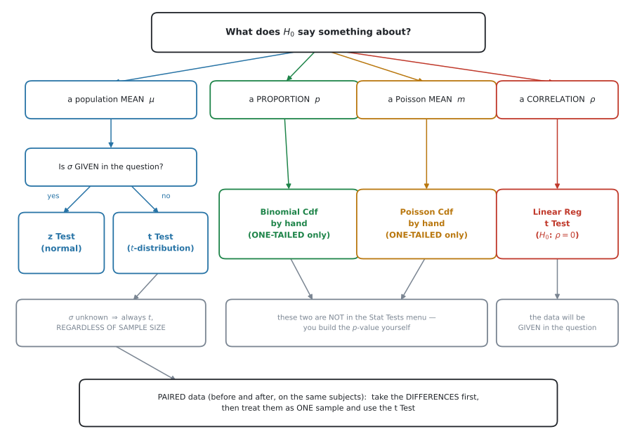

# AHL 4.18b — Tests for a mean, a proportion and $\rho$（平均・割合・相関の検定） {#sec-ahl-4-18b}

::: {.callout-note}
## What you should be able to do
- 場面を読んで、**どの検定を使うか**を選べる。
- $\sigma$ が**分かっているとき** `z Test`、**分からないとき** `t Test` を使い分けられる。
- **matched pairs**（対応のあるデータ）を、差をとって**$1$ 標本**として扱える。
- **binomial** で割合の検定ができる（片側のみ）。
- **Poisson** で平均の検定ができる（片側のみ）。
- **$\rho = 0$**（母相関係数が $0$ か）の検定を、電卓でできる。
- 与えられた **sample variance** を、電卓に入れられる形に直せる。
:::

::: {.callout-note}
## AHL 4.18 の $2$ ページめです
| ページ | 中身 |
|---|---|
| [AHL 4.18a](ahl-4-18a.qmd) | critical value と critical region の考え方 |
| **AHL 4.18b**（このページ） | **分布ごとの検定** |
| [AHL 4.18c](ahl-4-18c.qmd) | Type I error と Type II error |

: AHL 4.18 の $3$ ページ {#tbl-ahl418b-map}

[AHL 4.18a](ahl-4-18a.qmd) は「判定のしかた」でした。このページは「**どの検定を選ぶか**」と「**電卓でどう動かすか**」です。
:::

::: {.callout-note}
## [SL 4.11](../../ai-sl/04-statistics-and-probability/sl-4-11.qmd) の $5$ ステップは、そのまま使います
[SL 4.11](../../ai-sl/04-statistics-and-probability/sl-4-11.qmd#hypotheses) で $\chi^2$ 検定と $t$ 検定（$2$ 標本）を見ました。**手順はまったく同じ**です。

1. $H_0$ と $H_1$ を書く
2. 片側か両側かを決める
3. 検定の名前を書く
4. $p$-value を出す
5. **文脈のことばで結論を書く**

このページで増えるのは、**$3$ 番目の選択肢**だけです。
:::

::: {.callout-important}
## Formula booklet に 4.18 の欄はありません
AI HL の公式集は **4.17 の次が 4.19** です。このページの検定統計量の式（$z$、$t$）も**載っていません。**

ただし、**AI では検定統計量を手で計算する必要はほとんどありません。** 電卓が $p$-value まで出してくれます。

**手で作るのは binomial と Poisson の $2$ つだけ**です（[第5節](#binom)・[第6節](#pois)）。この $2$ つは電卓に検定コマンドがありません。
:::

## The idea

### 1. まず、どの検定かを決めます {#which}

**この項目でいちばん失点するのは、計算ではなく選択です。** 検定を選び違えると、そのあとが全部合っていても点になりません。

{#fig-ahl418b-choose width=100%}

@fig-ahl418b-choose の分かれ道は、**$H_0$ が何について言っているか**です。

| $H_0$ が言っていること | 使う検定 | 電卓 |
|---|---|---|
| **正規母集団**の母平均 $\mu$、**$\sigma$ 既知** | normal | `z Test` |
| **正規母集団**の母平均 $\mu$、**$\sigma$ 未知** | $t$ | `t Test` |
| 母比率（**proportion**）$p$ | binomial | `Binomial Cdf`（手で） |
| Poisson の平均 $m$ | Poisson | `Poisson Cdf`（手で） |
| 母相関係数 $\rho = 0$ | $t$ | `Linear Reg t Test` |

: 検定の選び分け {#tbl-ahl418b-which}

::: {.callout-tip}
## 見分けるコツは「問題文に $\sigma$ があるか」です
**母集団が正規分布だと確かめたうえで**、$\sigma$ が**問題文に数値で書いてあれば** `z Test`、**書いていなければ** `t Test` です。

「母集団の standard deviation は $8$ g である」と書いてあれば $\sigma$ 既知。データだけが与えられていて、そこから散らばりを計算するなら $\sigma$ 未知です。

**$\sigma$ と $s$ は別のもの**です（[AHL 4.14](ahl-4-14.qmd#s2)）。$s$ は標本から計算した推定値なので、$\sigma$ が「与えられた」ことにはなりません。
:::

::: {.callout-important}
## 第2節と第3節は、「母集団が正規分布」が前提です
シラバスの言い方は `Test for population mean for normal distribution` です。**normal distribution** という語が入っています。

**問題文に、母集団が正規分布にしたがうと書いてあることを、まず確かめてください。** `The mass is normally distributed with ...` のような $1$ 文です。

その前提を確かめたうえで、**$\sigma$ が既知なら $z$、未知なら $t$** を選びます。**標本の大きさでは決めません**（[第3節](#t-test)）。

母集団が正規分布と書かれていない場面は、[SL 4.11](../../ai-sl/04-statistics-and-probability/sl-4-11.qmd) の $\chi^2$ 検定や、[第5節](#binom)・[第6節](#pois)の binomial・Poisson の出番です。
:::

### 2. $\sigma$ が分かっているとき：`z Test` {#z-test}

シラバスの言い方です。

> Test for population mean for normal distribution. **Use of the normal distribution when $\sigma$ is known** and the $t$-distribution when $\sigma$ is unknown, regardless of sample size.

$\bar{X}$ の分布は、平均が $\mu$、standard deviation が $\dfrac{\sigma}{\sqrt{n}}$ の正規分布です（[AHL 4.15](ahl-4-15.qmd#idea)）。$\sigma$ が分かっているなら、この分布が**そのまま使えます。**

検定統計量は

$$
z = \frac{\bar{x} - \mu_0}{\dfrac{\sigma}{\sqrt{n}}}
$$ {#eq-ahl418b-z}

です。公式集には載っていません。**覚える必要があります。**

::: {.callout-note appearance="simple"}
とはいえ、**答案で $z$ を計算する必要はふつうありません。** `z Test` に $\mu_0$、$\sigma$、$\bar{x}$、$n$ を入れれば、$z$ も $p$-value も出ます（[GDC 第1節](#gdc-z)）。

@eq-ahl418b-z が要るのは、[AHL 4.18a](ahl-4-18a.qmd#xbar) で critical region を $\bar{x}$ のことばに直すときです。
:::

### 3. $\sigma$ が分からないとき：`t Test` {#t-test}

$\sigma$ が分からなければ、標本から推定した $s$ で代用します。すると、使う分布が正規分布から **$t$ 分布**に変わります（[AHL 4.16](ahl-4-16.qmd#t-dist)）。

$$
t = \frac{\bar{x} - \mu_0}{\dfrac{s}{\sqrt{n}}}, \qquad \text{自由度} \ \nu = n - 1
$$ {#eq-ahl418b-t}

この式も公式集には載っていません。**覚える必要があります。** 自由度が $n - 1$ になる理由は [AHL 4.16](ahl-4-16.qmd#df) にあります。

::: {.callout-important}
## `regardless of sample size` が、この項目の要です
シラバスは、はっきりこう書いています。

> ... and the $t$-distribution when $\sigma$ is unknown, **regardless of sample size**.

**標本がどれだけ大きくても、$\sigma$ が分からなければ $t$ です。**

日本の教科書や一般の統計の本には「$n > 30$ なら正規分布で近似してよい」と書いてあることがあります。**この科目では、その規則を使いません。**

判断の基準は**$n$ ではなく $\sigma$** です。
:::

::: {.callout-warning}
## 「sample variance」を、そのまま電卓に入れないでください
問題文が生のデータではなく、**$\bar{x}$・標本の大きさ・分散**だけを与えてくることがあります。このとき、与えられた分散が**どちらの分散か**を読み分ける必要があります。

| 問題文の言い方 | 記号 | 電卓に入れられるか |
|---|---|---|
| `the sample variance is 14.7` | $s_n^2$ | **そのままでは入れられません** |
| `the unbiased estimate of the population variance is 15.75` | $s_{n-1}^2$ | そのまま使えます |

: どちらの分散か {#tbl-ahl418b-which-var}

`t Test` の `sx` に入れるのは **$s_{n-1}$** のほうです（[AHL 4.14](ahl-4-14.qmd#s2)）。変換は

$$
s_{n-1}^2 = \frac{n}{n-1} \times s_n^2
$$ {#eq-ahl418b-unbiased}

です。$n = 15$ で $s_n^2 = 14.7$ なら

$$
s_{n-1}^2 = \frac{15}{14} \times 14.7 = 15.75, \qquad s_{n-1} = \sqrt{15.75} = 3.97
$$

**この $3.97$ を `sx` に入れます。** $\sqrt{14.7} = 3.83$ を入れると、$t$ も $p$-value もずれます。

この式は公式集には載っていません。**覚える必要があります。**
:::

### 4. matched pairs は、差をとって $1$ 標本にします {#paired}

シラバスの言い方です。

> **The case of matched pairs is to be treated as an example of a single sample technique.**

**matched pairs**（対応のあるデータ）は、同じ人・同じ物について**$2$ 回測ったデータ**です。

- 同じ生徒の、講習の前と後の点数
- 同じ患者の、投薬の前と後の血圧
- 同じ畑の、$2$ 種類の肥料での収穫量

::: {.callout-important}
## $2$ 標本の $t$ 検定を使ってはいけません
[SL 4.11](../../ai-sl/04-statistics-and-probability/sl-4-11.qmd) で扱った $2$ 標本の $t$ 検定（`2-Sample t Test`）は、**別々の $2$ グループ**を比べるものです。

matched pairs は同じ人の $2$ 回なので、**$2$ つの数がペアになっています。** ペアを崩して $2$ グループとして扱うと、その情報が失われます。

**やることは $1$ つ。差をとります。**

$$
d = (\text{後}) - (\text{前})
$$

そして、この $d$ を**$1$ 本のデータ列**として `t Test` にかけます。$H_0$ は「差の平均は $0$」です。

$$
H_0: \mu_d = 0
$$
:::

::: {.callout-tip}
## 正規分布と仮定するのは、$2$ つの母集団ではなく**差**です
$1$ 標本の $t$ 検定を使うので、**$d$ が正規分布にしたがう**ことを仮定します。

**もとの $2$ つの母集団が正規分布かどうかは、問われません。** 前と後で大きく散らばっていても、**差が正規分布に近ければ**この検定は使えます。

答案で仮定を書くときは *the differences are normally distributed* です。*the populations are normally distributed* ではありません。
:::

::: {.callout-tip}
## 差の向きは、自分で決めて、書いておきます
$(\text{後}) - (\text{前})$ でも $(\text{前}) - (\text{後})$ でも構いません。**ただし $H_1$ の向きが逆になります。**

「講習で点数が上がったか」を調べるなら

| 差の取り方 | $H_1$ |
|---|---|
| $d = (\text{後}) - (\text{前})$ | $\mu_d > 0$ |
| $d = (\text{前}) - (\text{後})$ | $\mu_d < 0$ |

: 差の向きと $H_1$ {#tbl-ahl418b-direction}

**答案の最初に「$d = $ 後 $-$ 前 とする」と書いてください。** これがないと、採点者は $H_1$ の向きが合っているか判断できません。
:::

::: {.callout-warning}
## 「$2$ 組の数が同じだけある」＝ matched pairs ではありません
$2$ 組のデータの個数が同じでも、**ペアになっていなければ** matched pairs ではありません。

| 場面 | ペアか |
|---|---|
| 同じ $8$ 人の、講習の前と後 | **matched pairs** |
| $8$ 人の男子と $8$ 人の女子 | **違う**（$2$ 標本） |
| 同じ $10$ 枚の畑の、肥料 A と 肥料 B | **matched pairs** |
| $10$ 本の A 社の電池と $10$ 本の B 社の電池 | **違う**（$2$ 標本） |

: ペアかどうかの見分け {#tbl-ahl418b-ispaired}

**見分け方は $1$ つ。「$1$ 行目どうしを結びつける理由があるか」**です。

同じ人・同じ物なら結びつきます。ただ人数が同じだけなら、$1$ 行目どうしに何の関係もありません。**数が同じというだけで、ペアだと決めないでください。**
:::

::: {.callout-note appearance="simple"}
$2$ 標本の $t$ 検定（`2-Sample t Test`）は [SL 4.11](../../ai-sl/04-statistics-and-probability/sl-4-11.qmd#gdc-ttest) で扱っています。$\sigma_1$ と $\sigma_2$ の**両方が与えられている**ときは、その正規分布版の `2-Sample z Test` を使います。**選び方の考え方は $1$ 標本のときと同じ**で、$\sigma$ が与えられているかどうかで決まります。
:::

### 5. 割合の検定は、binomial で {#binom}

シラバスの言い方です。

> **Test for proportion using binomial distribution.**

**proportion**（割合）が $p_0$ から変わったか、を調べます。$n$ 回のうち何回起きたかを数えるので、$H_0$ のもとで

$$
X \sim B(n,\ p_0)
$$

です（[SL 4.8](../../ai-sl/04-statistics-and-probability/sl-4-8.qmd#notation)）。

::: {.callout-important}
## 電卓に、この検定はありません
`menu → Statistics → Stat Tests` を開いても、**binomial 検定はありません**（[AHL 4.18a](ahl-4-18a.qmd#gdc-discrete)）。

$p$-value を**自分で作ります。**

$$
H_1: p > p_0 \ \text{なら} \quad p\text{-value} = P(X \geq x_{\text{obs}})
$$ {#eq-ahl418b-binom-p}

$$
H_1: p < p_0 \ \text{なら} \quad p\text{-value} = P(X \leq x_{\text{obs}})
$$

**$x_{\text{obs}}$ を含めます。** これが最大の落とし穴です（[第7節](#include)）。
:::

::: {.callout-warning}
## `1-Prop z Test` は、別のものです
`Stat Tests` の $5$ 番に `1-Prop z Test` があります。名前が近いので選びたくなりますが、**これは正規分布で近似する検定**です。

シラバスが求めているのは `Test for proportion using binomial distribution` です。**近似ではなく、binomial そのもの**を使ってください。

$n$ が小さいと、$2$ つの答えははっきり違います。
:::

::: {.callout-warning}
## binomial の検定は、片側だけです
> **Poisson and binomial tests will be one-tailed only.**

$H_1$ に $\neq$ が出ることはありません。**$>$ か $<$ のどちらかです。**
:::

### 6. Poisson の平均の検定 {#pois}

シラバスの言い方です。

> **Test for population mean using Poisson distribution.**

「一定の区間に起きる回数の平均が $m_0$ から変わったか」を調べます。$H_0$ のもとで

$$
X \sim \mathrm{Po}(m_0)
$$

です（[AHL 4.17](ahl-4-17.qmd#notation)）。やり方は binomial とまったく同じです。

$$
H_1: m > m_0 \ \text{なら} \quad p\text{-value} = P(X \geq x_{\text{obs}})
$$ {#eq-ahl418b-pois-p}

::: {.callout-warning}
## 区間が変わったら、$m_0$ も変えます
[AHL 4.17](ahl-4-17.qmd#scaling) と同じです。「$1$ 時間に $2.5$ 件」で $4$ 時間ぶんを調べるなら、$H_0$ のもとでの平均は

$$
m_0 = 2.5 \times 4 = 10
$$

です。**$2.5$ のまま計算すると、答えが桁ごと違います。**
:::

### 7. $x_{\text{obs}}$ を含めるかどうか {#include}

**離散分布の $p$-value で、いちばん間違えるところです。**

$p$-value は「**$H_0$ が正しいとして、観測した値と同じかそれ以上に極端な値が出る確率**」です。

**「観測した値と同じ」を含みます。**

| $H_1$ | 正しい $p$-value | よくある誤り |
|---|---|---|
| $p > p_0$（上側） | $P(X \geq x_{\text{obs}})$ | $P(X > x_{\text{obs}})$ |
| $p < p_0$（下側） | $P(X \leq x_{\text{obs}})$ | $P(X < x_{\text{obs}})$ |

: $x_{\text{obs}}$ を含める {#tbl-ahl418b-include}

::: {.callout-warning}
## $1$ つずれると、答えが半分以下になります
@exm-ahl418b-binom で、$x_{\text{obs}} = 10$ のときの正しい $p$-value は $0.0480$ です。

$P(X > 10) = P(X \geq 11) = 0.0171$ としてしまうと、**$0.36$ 倍**になります。

$0.0480$ と $0.0171$ では、$2\%$ の検定で結論が分かれます。$0.0480$ では棄却できず、$0.0171$ では棄却してしまいます。
:::

### 8. $\rho = 0$ の検定 {#rho}

シラバスの言い方です。

> Use of technology to test the hypothesis that the **population product moment correlation coefficient ($\rho$) is $0$** for bivariate normal distributions.

[SL 4.4](../../ai-sl/04-statistics-and-probability/sl-4-4.qmd) で、標本から $r$ を計算しました。ここで問うのは、**母集団の相関係数 $\rho$（ロー）が $0$ かどうか**です。$\rho$ は **population product moment correlation coefficient**（母積率相関係数）といいます。

$$
H_0: \rho = 0
$$

$H_1$ は、問題文の聞き方で決まります。

| 問題文 | $H_1$ | 側 |
|---|---|---|
| `whether there is a linear correlation` | $\rho \neq 0$ | 両側 |
| `whether there is a positive linear correlation` | $\rho > 0$ | 片側 |
| `whether there is a negative linear correlation` | $\rho < 0$ | 片側 |

: $\rho$ の検定の $H_1$ {#tbl-ahl418b-rho-h1}

**`positive` や `negative` という語があったら片側**です。電卓の `Alternate Hyp` も、それに合わせてください。

::: {.callout-tip}
## $r$ と $\rho$ は別のものです
| 記号 | 読み | 何のもの |
|---|---|---|
| $r$ | アール | **標本**の相関係数。データから計算する |
| $\rho$ | ロー | **母集団**の相関係数。知ることはできない |

: $r$ と $\rho$ {#tbl-ahl418b-r-rho}

$r$ が $0$ でなくても、$\rho$ が $0$ である可能性はあります。**たまたま偏ったデータを引いただけかもしれない**からです。それを確かめるのが、この検定です。
:::

電卓には `Linear Reg t Test` があります。データを $2$ 列に入れて実行するだけです（[GDC 第4節](#gdc-rho)）。

::: {.callout-note appearance="simple"}
シラバスに `In examinations the data will be given` とあります。**データは必ず問題文に出ます。** 自分で集める必要はありません。
:::

::: {.callout-tip}
## $r$ の critical value を与えられることがあります
$p$-value で判定するかわりに、**$r$ そのものを critical value と比べる**形式もあります。

> *The critical value for $r$ at the $5\%$ level with $n = 10$ is $0.632$.*

**比べ方は、$H_1$ の向きで変わります。**

| $H_1$ | 比べ方 |
|---|---|
| $\rho \neq 0$（両側） | $\lvert r \rvert$ を、正の critical value と比べる |
| $\rho > 0$（片側・上側） | $r$ が、正の上側 critical value を**超える**か |
| $\rho < 0$（片側・下側） | $r$ が、負の下側 critical value を**下回る**か |

: $H_1$ と critical value の比べ方 {#tbl-ahl418b-rcrit}

**絶対値を使うのは、両側のときだけ**です。片側で $\lvert r \rvert$ を使うと、**向きが逆のデータでも棄却してしまいます。** たとえば $H_1: \rho > 0$ なのに $r = -0.9$ だったら、$\lvert r \rvert$ は大きくても**棄却してはいけません。**

**その critical value は、必ず問題文に書いてあります。** 自分で求める必要はありません（表も公式集もありません）。**$H_1$ の向きと合っているかを、必ず確かめてください。**

@exm-ahl418b-rho は**両側**なので、$\lvert r \rvert$ で比べます。$\lvert 0.864 \rvert > 0.632$ なので棄却——$p$-value で出した結論と一致します。
:::

## Why it works

::: {.callout-tip collapse="true"}
## クリックすると開きます

### なぜ binomial と Poisson だけ、手で作るのか {#why}

`z Test` も `t Test` も、電卓が $p$-value を出してくれます。なぜ binomial と Poisson だけ違うのでしょうか。

**$p$-value の定義に戻ると、理由が見えます。**

$p$-value は「$H_0$ が正しいとして、観測値と同じかそれ以上に極端な値が出る確率」です。

- **連続な分布**（normal、$t$）… 「それ以上に極端」は**面積**です。面積を出すには積分が要るので、電卓の出番になります。
- **離散な分布**（binomial、Poisson）… 「それ以上に極端」は、**確率を足すだけ**です。

$$
P(X \geq 10) = P(X = 10) + P(X = 11) + \cdots + P(X = 20)
$$

そして、この足し算をやってくれるコマンドは**すでにあります。** `Binomial Cdf` と `Poisson Cdf` です。

**専用の検定コマンドが要らない**、というのが本当のところです。`Cdf` に範囲を入れれば、それがそのまま $p$-value です。

### なぜ $x_{\text{obs}}$ を含めるのか {#why-include}

$p$-value の定義に「観測値と**同じか**それ以上に極端」とあります。**「同じ」が入っています。**

観測した $x_{\text{obs}}$ そのものも、「これくらい極端なことが起きる確率」の一部です。

連続な分布では $P(X = a) = 0$ なので、含めても含めなくても同じでした。**離散では $P(X = a) \neq 0$ なので、はっきり差が出ます。**

@exm-ahl418b-binom では $P(X = 10) = 0.0308$ です。含めるか含めないかで、これだけ変わります。
:::

## Worked examples

::: {.callout-note appearance="simple"}
問題文は英語です。意味が理解できなかったら、問題文の下の「**日本語訳**」を開いてください。解説は日本語です。
:::

::: {#exm-ahl418b-z}
[A machine cuts metal rods. The length of a rod is normally distributed with standard deviation $\sigma = 0.4$ cm. The machine is set to cut rods of length $25$ cm.]{.q-en}

[An engineer takes a random sample of $40$ rods and finds a sample mean of $25.15$ cm. Test, at the $5\%$ significance level, whether the mean length has changed.]{.q-en}

<details class="jp-trans">
<summary>日本語訳</summary>

ある機械が金属の棒を切ります。棒の長さは standard deviation $\sigma = 0.4$ cm の正規分布にしたがいます。機械は長さ $25$ cm に切るよう設定されています。

`rod` は「棒」という意味です。

技術者が無作為に $40$ 本を選んだところ、標本平均は $25.15$ cm でした。平均の長さが**変わったかどうか**を、有意水準 $5\%$ で検定しなさい。

</details>

**まず検定を選びます。** 母平均についてで、**$\sigma = 0.4$ が問題文にあります。** ですから `z Test` です（@tbl-ahl418b-which）。

「変わったかどうか」なので **two-tailed**（両側）です。**one-tailed**（片側）ではありません。

$$
H_0: \mu = 25, \qquad H_1: \mu \neq 25
$$

```
z Test:   μ₀: 25    σ: 0.4    x̄: 25.15    n: 40
          Alternate Hyp: μ ≠ μ₀
```

| 表示 | 値 |
|---|---|
| `z` | $2.37$ |
| `PVal` | $0.0177$ |

: `z Test` の結果 {#tbl-ahl418b-z-out}

$0.0177 < 0.05$ なので $H_0$ を棄却します。

::: {.model-answer}
**試験ではこう書く**

*Since $\sigma$ is known, use a $z$-test.*

*$H_0: \mu = 25$, $H_1: \mu \neq 25$ (two-tailed).*

*$p = 0.0177 < 0.05$, so reject $H_0$ at the $5\%$ significance level. There is sufficient evidence that the mean length of the rods has changed from $25$ cm.*
:::

（$\sigma$ が分かっているので $z$ 検定を使う。$p = 0.0177 < 0.05$ なので $5\%$ 水準で $H_0$ を棄却する。棒の平均の長さが $25$ cm から変わったという十分な証拠がある、という意味です。）

::: {.callout-tip}
## `Alternate Hyp` の欄を、必ず確認してください
両側なのに `μ > μ₀` のままだと、$p$-value が**半分**の $0.00885$ になります。

この問題では結論は変わりませんが、$p$ が $0.06$ 前後のときは**結論が変わります。**

`z Test` を開いたら、まず `Alternate Hyp` を $H_1$ に合わせてください。
:::

::: {.callout-note}
## 解答例（答案用紙にはこう書く）
*$\sigma$ is known, so use a $z$-test.*
$$
H_0: \mu = 25, \qquad H_1: \mu \neq 25
$$
*Two-tailed $z$-test:*
$$
z = 2.37, \qquad p = 0.0177
$$
*$0.0177 < 0.05$, so reject $H_0$ at the $5\%$ level. There is evidence that the mean length has changed from $25$ cm.*
:::
:::

::: {#exm-ahl418b-t}
[A coach claims that his athletes have a mean reaction time of $0.25$ seconds. A researcher tests $8$ of the athletes and records the following reaction times, in seconds.]{.q-en}

$$
0.28, \quad 0.31, \quad 0.24, \quad 0.33, \quad 0.29, \quad 0.27, \quad 0.35, \quad 0.26
$$

[Test, at the $5\%$ significance level, whether the mean reaction time is greater than $0.25$ seconds.]{.q-en}

<details class="jp-trans">
<summary>日本語訳</summary>

あるコーチは、自分の選手たちの反応時間の平均は $0.25$ 秒だと主張しています。ある研究者が $8$ 人の選手を調べ、次の反応時間（秒）を記録しました。

`reaction time` は「反応時間」、`athlete` は「選手」という意味です。

平均の反応時間が $0.25$ 秒より**大きい**かどうかを、有意水準 $5\%$ で検定しなさい。

</details>

**まず検定を選びます。** 母平均についてですが、**$\sigma$ が問題文にありません。** データだけが与えられています。ですから `t Test` です。

$$
H_0: \mu = 0.25, \qquad H_1: \mu > 0.25
$$

Lists & Spreadsheet ページの列 A にデータを入れて、`t Test` を `Data` モードで実行します（[GDC 第2節](#gdc-t)）。

| 表示 | 値 |
|---|---|
| `t` | $3.17$ |
| `PVal` | $0.00786$ |
| `df` | $7$ |
| `x̄` | $0.291$ |
| `sx` | $0.0368$ |
| `n` | $8$ |

: `t Test` の結果 {#tbl-ahl418b-t-out}

$0.00786 < 0.05$ なので $H_0$ を棄却します。

::: {.model-answer}
**試験ではこう書く**

*Since $\sigma$ is unknown, use a $t$-test.*

*$H_0: \mu = 0.25$, $H_1: \mu > 0.25$ (one-tailed).*

*$p = 0.00786 < 0.05$, so reject $H_0$ at the $5\%$ significance level. There is sufficient evidence that the mean reaction time is greater than $0.25$ seconds, so the coach's claim is not supported.*
:::

（$\sigma$ が分からないので $t$ 検定を使う。$p = 0.00786 < 0.05$ なので $5\%$ 水準で $H_0$ を棄却する。平均の反応時間が $0.25$ 秒より大きいという十分な証拠があるので、コーチの主張は支持されない、という意味です。）

**検算。** データの平均は $0.291$ 秒で、$0.25$ より**大きい**です ✓ $H_1$ が上側なので、この向きは正しく、$t$ が正の値になるのと合っています。

::: {.callout-warning}
## $n = 8$ でも $n = 800$ でも、$t$ です
「$n$ が小さいから $t$」ではありません。**$\sigma$ が分からないから $t$** です（[第3節](#t-test)）。
:::

::: {.callout-note}
## 解答例（答案用紙にはこう書く）
*$\sigma$ is unknown, so use a $t$-test.*
$$
H_0: \mu = 0.25, \qquad H_1: \mu > 0.25
$$
*One-tailed $t$-test, $\nu = 7$:*
$$
t = 3.17, \qquad p = 0.00786
$$
*$0.00786 < 0.05$, so reject $H_0$ at the $5\%$ level. There is evidence that the mean reaction time is greater than $0.25$ seconds.*
:::
:::

::: {#exm-ahl418b-paired}
[Eight students take a memory test before and after a training course. Their scores are shown below.]{.q-en}

| Student | A | B | C | D | E | F | G | H |
|---|---|---|---|---|---|---|---|---|
| Before | $62$ | $58$ | $71$ | $55$ | $66$ | $60$ | $69$ | $57$ |
| After | $59$ | $57$ | $66$ | $54$ | $61$ | $58$ | $64$ | $56$ |

: Memory test scores {#tbl-ahl418b-memory}

[The course designer claims that the course improves memory scores. Test her claim at the $5\%$ significance level.]{.q-en}

<details class="jp-trans">
<summary>日本語訳</summary>

$8$ 人の生徒が、訓練コースの前と後に記憶力テストを受けました。得点は上の表のとおりです。

`memory test` は「記憶力テスト」、`training course` は「訓練コース」という意味です。

コースの設計者は、このコースが記憶力の得点を**上げる**と主張しています。有意水準 $5\%$ でこの主張を検定しなさい。

</details>

**同じ生徒を $2$ 回測っています。matched pairs です**（[第4節](#paired)）。差をとります。

「得点が上がる」という主張を調べたいので、$d = (\text{Before}) - (\text{After})$ とすると、**主張が正しいなら $d$ は負**になるはずです。

**向きを分かりやすくするため、$d = (\text{After}) - (\text{Before})$ とします。**

| Student | A | B | C | D | E | F | G | H |
|---|---|---|---|---|---|---|---|---|
| $d$ | $-3$ | $-1$ | $-5$ | $-1$ | $-5$ | $-2$ | $-5$ | $-1$ |

: 差 $d = $ After $-$ Before {#tbl-ahl418b-diff}

**$8$ つとも負**です。得点は全員**下がっています。**

$$
H_0: \mu_d = 0, \qquad H_1: \mu_d > 0
$$

この $d$ を $1$ 本のデータ列として `t Test` にかけると

| 表示 | 値 |
|---|---|
| `t` | $-4.31$ |
| `PVal` | $0.998$ |

: `t Test`（$d$ について） {#tbl-ahl418b-paired-out}

$0.998 > 0.05$ なので、$H_0$ を棄却できません。

::: {.model-answer}
**試験ではこう書く**

*Let $d = (\text{after}) - (\text{before})$. This is a matched-pairs situation, so the differences are treated as a single sample and a $t$-test is used.*

*$H_0: \mu_d = 0$, $H_1: \mu_d > 0$ (one-tailed).*

*$p = 0.998 > 0.05$, so we do not reject $H_0$ at the $5\%$ significance level. There is no evidence that the course improves memory scores. In fact every difference is negative, so the scores went down.*
:::

（$d$ を「後 $-$ 前」とする。これは matched pairs の場面なので、差を $1$ 標本として扱い $t$ 検定を使う。$p = 0.998 > 0.05$ なので $5\%$ 水準で $H_0$ を棄却しない。コースが記憶力の得点を上げるという証拠はない。実際、差はすべて負で、得点は下がっている、という意味です。）

::: {.callout-warning}
## $p = 0.998$ が出たら、向きを確かめてください
$p$-value が $0.5$ を超えて大きいときは、**データが $H_1$ と反対を向いている**という合図です。

ここでは「上がる」を検定したのに、実際は全員下がっていました。**$p$ が $1$ に近いのは、計算ミスではありません。**

答案では、そのことを**ことばで書いてください。** 「証拠がない」で止めず、「むしろ下がっている」まで書くと、読み取れていることが伝わります。
:::

::: {.callout-note}
## 解答例（答案用紙にはこう書く）
*Let $d = (\text{after}) - (\text{before})$: matched pairs, so use a one-sample $t$-test on the differences.*
$$
H_0: \mu_d = 0, \qquad H_1: \mu_d > 0
$$
$$
t = -4.31, \qquad p = 0.998
$$
*$0.998 > 0.05$, so do not reject $H_0$ at the $5\%$ level. There is no evidence that the course improves memory scores; all eight differences are negative, so the scores fell.*
:::
:::

::: {#exm-ahl418b-binom}
[In a large town, $30\%$ of households own a dog. A researcher believes the proportion is higher in one particular neighbourhood. She surveys a random sample of $20$ households in that neighbourhood and finds that $10$ own a dog.]{.q-en}

**(a)** [State the hypotheses.]{.q-en}

**(b)** [Find the $p$-value.]{.q-en}

**(c)** [State the conclusion at the $5\%$ significance level.]{.q-en}

<details class="jp-trans">
<summary>日本語訳</summary>

ある大きな町では、世帯の $30\%$ が犬を飼っています。ある研究者は、特定の地区ではその割合がもっと高いと考えています。その地区で無作為に $20$ 世帯を調べたところ、$10$ 世帯が犬を飼っていました。

`household` は「世帯」、`neighbourhood` は「地区」という意味です。

**(a)** 仮説を書きなさい。

**(b)** $p$-value を求めなさい。

**(c)** 有意水準 $5\%$ での結論を述べなさい。

</details>

**(a)** 割合についてで、「もっと高い」なので上側です。

$$
H_0: p = 0.3, \qquad H_1: p > 0.3
$$

**(b)** $H_0$ のもとで $X \sim B(20,\ 0.3)$ です。上側なので $P(X \geq 10)$——**$10$ を含めます**（[第7節](#include)）。

```
Binomial Cdf:   Num Trials, n: 20    Prob Success, p: 0.3
                Lower Bound: 10      Upper Bound: 20
```

$$
p\text{-value} = P(X \geq 10) = 0.0480
$$

**(c)** $0.0480 < 0.05$ です。

::: {.model-answer}
**試験ではこう書く**

*$p = 0.0480 < 0.05$, so reject $H_0$ at the $5\%$ significance level. There is sufficient evidence that the proportion of households owning a dog in this neighbourhood is greater than $0.3$.*
:::

（$p = 0.0480 < 0.05$ なので $5\%$ 水準で $H_0$ を棄却する。この地区で犬を飼っている世帯の割合が $0.3$ より大きいという十分な証拠がある、という意味です。）

::: {.callout-warning}
## この問題は、境目のすぐ内側です
$0.0480$ は $0.05$ を、わずか $0.002$ だけ下回っています。

**$P(X \geq 11) = 0.0171$ と取り違えると**、$5\%$ では結論は同じ「reject」ですが、**$2\%$ の検定なら分かれます。** $0.0480$ では reject できず、$0.0171$ では reject してしまいます。

**`Lower Bound` に $10$ を入れたか、必ず見直してください。**
:::

::: {.callout-tip}
## [AHL 4.18a](ahl-4-18a.qmd) の critical region で確かめられます
$B(20,\ 0.3)$ の $5\%$ の critical region は $X \geq 10$ です（$P(X \geq 10) = 0.0480 \leq 0.05$、$P(X \geq 9) = 0.113 > 0.05$）。

観測値 $10$ は、ちょうどこの region の**いちばん端**に入っています。**$2$ つの判定が一致しています** ✓
:::

::: {.callout-note}
## 解答例（答案用紙にはこう書く）
**(a)**
$$
H_0: p = 0.3, \qquad H_1: p > 0.3
$$

**(b)** *Under $H_0$, $X \sim B(20,\ 0.3)$.*
$$
p\text{-value} = P(X \geq 10) = 0.0480
$$

**(c)** *$0.0480 < 0.05$, so reject $H_0$ at the $5\%$ level. There is evidence that the proportion of dog-owning households in this neighbourhood is greater than $0.3$.*
:::
:::

::: {#exm-ahl418b-pois}
[A helpline receives calls at a mean rate of $8$ per week, following a Poisson distribution. After the helpline is advertised on local radio, $15$ calls are received in the following week.]{.q-en}

[Test, at the $5\%$ significance level, whether the mean rate of calls has increased.]{.q-en}

<details class="jp-trans">
<summary>日本語訳</summary>

ある相談電話には $1$ 週あたり平均 $8$ 件の割合で電話がかかり、ポアソン分布にしたがいます。地元のラジオで宣伝されたあと、次の $1$ 週間に $15$ 件の電話がありました。

`helpline` は「相談電話」、`advertise` は「宣伝する」という意味です。

電話の平均の割合が**増えた**かどうかを、有意水準 $5\%$ で検定しなさい。

</details>

Poisson の平均についてで、「増えた」なので上側です。**区間は $1$ 週間のままなので、$m_0$ は $8$ のまま**です。

$$
H_0: m = 8, \qquad H_1: m > 8
$$

$H_0$ のもとで $X \sim \mathrm{Po}(8)$。上側なので $P(X \geq 15)$ です。

```
Poisson Cdf:   λ: 8      Lower Bound: 15      Upper Bound: 100
```

$$
p\text{-value} = P(X \geq 15) = 0.0173
$$

$0.0173 < 0.05$ なので $H_0$ を棄却します。

::: {.model-answer}
**試験ではこう書く**

*Under $H_0$, $X \sim \mathrm{Po}(8)$, where $X$ is the number of calls in one week.*

*$H_0: m = 8$, $H_1: m > 8$ (one-tailed).*

*$p\text{-value} = P(X \geq 15) = 0.0173 < 0.05$, so reject $H_0$ at the $5\%$ significance level. There is sufficient evidence that the mean rate of calls has increased.*
:::

（$H_0$ のもとで $X$ を $1$ 週間の電話の件数として $X \sim \mathrm{Po}(8)$ とする。$p$-value $= P(X \geq 15) = 0.0173 < 0.05$ なので $5\%$ 水準で $H_0$ を棄却する。電話の平均の割合が増えたという十分な証拠がある、という意味です。）

**検算。** $H_0$ のもとでの平均は $8$ 件で、観測は $15$ 件でした ✓ 平均よりはっきり多いので、上側の検定で小さい $p$-value が出るのは正しい向きです。

::: {.callout-warning}
## `Upper Bound` を大きくとってください
Poisson には上限がありません。`Upper Bound` に $20$ を入れると $P(15 \leq X \leq 20)$ になってしまい、**$X > 20$ の分が抜けます。**

$\mathrm{Po}(8)$ なら $100$ で十分です（[AHL 4.18a](ahl-4-18a.qmd#gdc-discrete)）。
:::

::: {.callout-note}
## 解答例（答案用紙にはこう書く）
*Let $X$ be the number of calls in one week. Under $H_0$, $X \sim \mathrm{Po}(8)$.*
$$
H_0: m = 8, \qquad H_1: m > 8
$$
$$
p\text{-value} = P(X \geq 15) = 0.0173
$$
*$0.0173 < 0.05$, so reject $H_0$ at the $5\%$ level. There is evidence that the mean rate of calls has increased.*
:::
:::

::: {#exm-ahl418b-rho}
[A gardener records the mass of fertiliser used, $x$ grams, and the height of the plant after four weeks, $y$ cm, for ten plants.]{.q-en}

| $x$ | $4$ | $7$ | $3$ | $9$ | $6$ | $5$ | $8$ | $4$ | $10$ | $7$ |
|---|---|---|---|---|---|---|---|---|---|---|
| $y$ | $22$ | $26$ | $19$ | $31$ | $23$ | $27$ | $25$ | $20$ | $30$ | $24$ |

: Fertiliser and plant height {#tbl-ahl418b-fert}

[Assume that $x$ and $y$ follow a bivariate normal distribution. Test, at the $1\%$ significance level, whether there is a linear correlation between the mass of fertiliser and the height of the plant.]{.q-en}

<details class="jp-trans">
<summary>日本語訳</summary>

ある庭師が、$10$ 本の植物について、使った肥料の重さ $x$ グラムと、$4$ 週間後の植物の高さ $y$ cm を記録しました。

`fertiliser` は「肥料」という意味です。

$x$ と $y$ は **bivariate normal distribution**（二変量正規分布）にしたがうものとします。肥料の重さと植物の高さのあいだに**線形の相関があるかどうか**を、有意水準 $1\%$ で検定しなさい。

</details>

**母相関係数についての検定**です。「相関があるかどうか」で向きの指定がないので**両側**です。

$$
H_0: \rho = 0, \qquad H_1: \rho \neq 0
$$

Lists & Spreadsheet ページの列 A に $x$、列 B に $y$ を入れて、`Linear Reg t Test` を実行します（[GDC 第4節](#gdc-rho)）。

| 表示 | 値 |
|---|---|
| `r` | $0.864$ |
| `t` | $4.85$ |
| `PVal` | $0.00128$ |
| `df` | $8$ |

: `Linear Reg t Test` の結果 {#tbl-ahl418b-rho-out}

$0.00128 < 0.01$ なので $H_0$ を棄却します。

::: {.model-answer}
**試験ではこう書く**

*$H_0: \rho = 0$, $H_1: \rho \neq 0$ (two-tailed).*

*$r = 0.864$, $p = 0.00128 < 0.01$, so reject $H_0$ at the $1\%$ significance level. There is sufficient evidence of a linear correlation between the mass of fertiliser used and the height of the plant.*
:::

（$p = 0.00128 < 0.01$ なので $1\%$ 水準で $H_0$ を棄却する。使った肥料の重さと植物の高さのあいだに線形の相関があるという十分な証拠がある、という意味です。）

::: {.callout-warning}
## 「肥料が背を伸ばした」とは書けません
相関があるという結論は、**因果関係の結論ではありません**（[SL 4.4](../../ai-sl/04-statistics-and-probability/sl-4-4.qmd)）。

たとえば、庭師が元気そうな苗にたくさん肥料をやっていたのかもしれません。

答案には `there is evidence of a linear correlation` と書きます。**`the fertiliser causes the plants to grow taller` とは書きません。**
:::

::: {.callout-note}
## 解答例（答案用紙にはこう書く）
$$
H_0: \rho = 0, \qquad H_1: \rho \neq 0
$$
*Linear Reg $t$-test, $\nu = 8$:*
$$
r = 0.864, \qquad t = 4.85, \qquad p = 0.00128
$$
*$0.00128 < 0.01$, so reject $H_0$ at the $1\%$ level. There is evidence of a linear correlation between the mass of fertiliser and the height of the plant.*
:::
:::

## Common errors

::: {.callout-warning}
## $\sigma$ が与えられているのに `t Test` を使う
問題文に $\sigma$ の数値があれば `z Test` です（[第1節](#which)）。

`t Test` にはそもそも $\sigma$ を入れる欄がありません。**入れる欄がないことに気づいたら、選んだ検定が違います。**
:::

::: {.callout-warning}
## $n$ が大きいから正規分布、としてしまう
シラバスは `regardless of sample size` と書いています（[第3節](#t-test)）。判断は **$\sigma$ で**します。
:::

::: {.callout-warning}
## 個数が同じというだけで matched pairs だと決める
ペアになる理由（同じ人・同じ物）があるかどうかで決めます（[第4節](#paired)）。**個数が同じでも、ペアでないことがあります。**
:::

::: {.callout-warning}
## `sample variance` を $s_{n-1}^2$ と取り違える
@eq-ahl418b-unbiased で直してから電卓に入れます（[第3節](#t-test)）。
:::

::: {.callout-warning}
## $\rho$ の検定で、`positive` / `negative` を見落として両側にする
`positive linear correlation` なら $H_1: \rho > 0$ の**片側**です（[第8節](#rho)）。$p$-value が $2$ 倍になってしまいます。
:::

::: {.callout-warning}
## matched pairs に `2-Sample t Test` を使う
差をとって**$1$ 標本**にします（[第4節](#paired)）。シラバスが `an example of a single sample technique` と書いています。
:::

::: {.callout-warning}
## 差の向きを書かずに $H_1$ を書く
$d = $ 後 $-$ 前 なのか、前 $-$ 後 なのかで、$H_1$ の向きが逆になります。**答案の最初に宣言してください**（[第4節](#paired)）。
:::

::: {.callout-warning}
## 割合の検定に `1-Prop z Test` を使う
シラバスは `using binomial distribution` と指定しています。**近似ではありません**（[第5節](#binom)）。
:::

::: {.callout-warning}
## $p$-value で $x_{\text{obs}}$ を含め忘れる
上側なら $P(X \geq x_{\text{obs}})$ です。$P(X > x_{\text{obs}})$ ではありません（[第7節](#include)）。

@exm-ahl418b-binom では $0.0480$ と $0.0171$ の差になります。
:::

::: {.callout-warning}
## Poisson で、区間を合わせ忘れる
「$1$ 時間あたり」の割合で「$4$ 時間ぶん」を調べるなら、$m_0$ を $4$ 倍します（[第6節](#pois)、[AHL 4.17](ahl-4-17.qmd#scaling)）。
:::

::: {.callout-warning}
## `Poisson Cdf` の `Upper Bound` を小さくとる
Poisson には上限がありません。$m$ よりずっと大きい数を入れてください（@exm-ahl418b-pois）。
:::

::: {.callout-warning}
## `Alternate Hyp` を両側のままにする／片側のままにする
$p$-value が $2$ 倍または半分になります。**`z Test` と `t Test` を開いたら、まずこの欄を見てください**（@exm-ahl418b-z）。
:::

::: {.callout-warning}
## 相関の検定で、因果関係を結論に書く
`there is evidence of a linear correlation` までです。**`causes` とは書きません**（@exm-ahl418b-rho）。
:::

::: {.callout-warning}
## binomial・Poisson で両側検定をしようとする
> Poisson and binomial tests will be **one-tailed only**.

シラバスが外しています（[第5節](#binom)）。
:::

::: {.callout-warning}
## 結論を文脈のことばに戻さない
$H_0$ を `reject` と書いただけで止めると、点が付かないことがあります。**「何についての証拠なのか」を書いてください**（[SL 4.11](../../ai-sl/04-statistics-and-probability/sl-4-11.qmd)）。
:::

## Using your GDC (TI-Nspire CX II)

::: {.callout-note appearance="simple"}
**連続な分布の検定**は、ここから始まります。

```
menu → Statistics → Stat Tests
```

一覧は `z Test`、`t Test`、`2-Sample z Test`、`2-Sample t Test`、`1-Prop z Test`、`2-Prop z Test`、`χ² GOF`、`χ² 2-way Test`、`2-Sample F Test`、`Linear Reg t Test` …と続きます。

**このページで使うのは、$1$ 番、$2$ 番、そして `Linear Reg t Test` の $3$ つだけ**です。

**binomial と Poisson の検定は、ここにはありません**（[第5節](#binom)）。次の節を見てください。
:::

### binomial と Poisson は `Distributions` から {#gdc-discrete}

```
menu → Statistics → Distributions → Binomial Cdf
                                  → Poisson Cdf
```

`Stat Tests` には binomial 検定も Poisson 検定もないので、$p$-value は**この $2$ つで自分で作ります**（[AHL 4.18a](ahl-4-18a.qmd#gdc-discrete)）。

| 欄 | 入れるもの |
|---|---|
| `Num Trials, n` / `λ` | $H_0$ の $n$ と $p_0$、または $m_0$ |
| `Lower Bound` | 上側なら $x_{\text{obs}}$、下側なら $0$ |
| `Upper Bound` | 上側なら $n$（Poisson は $100$ など）、下側なら $x_{\text{obs}}$ |

: `Cdf` で $p$-value を作る {#tbl-ahl418b-gdc-cdf}

**$x_{\text{obs}}$ を含める向き**に注意してください（[第7節](#include)）。

### `z Test`（$\sigma$ が分かっているとき） {#gdc-z}

```
menu → Statistics → Stat Tests → z Test
```

最初に `Data Input Method` で `Data` か `Stats` かを聞かれます。

| 選ぶもの | いつ |
|---|---|
| `Stats` | $\bar{x}$ と $n$ が**数値で与えられている**とき |
| `Data` | **データの列**が与えられているとき |

: `Data` と `Stats` {#tbl-ahl418b-datastats}

`Stats` を選んだときの欄です。

| 欄 | 入れるもの |
|---|---|
| `μ₀` | $H_0$ の平均 |
| `σ` | 母集団の standard deviation |
| `x̄` | 標本平均 |
| `n` | 標本の大きさ |
| `Alternate Hyp` | $H_1$（`≠`／`<`／`>` から選ぶ） |

: `z Test` の入力欄 {#tbl-ahl418b-gdc-z}

### `t Test`（$\sigma$ が分からないとき） {#gdc-t}

```
menu → Statistics → Stat Tests → t Test
```

**$\sigma$ を入れる欄がありません。** これが `z Test` との見た目の違いです。

`Stats` を選んだときの欄です。

| 欄 | 入れるもの |
|---|---|
| `μ₀` | $H_0$ の平均 |
| `x̄` | 標本平均 |
| `sx` | 標本から計算した standard deviation（$s$） |
| `n` | 標本の大きさ |
| `Alternate Hyp` | $H_1$ |

: `t Test` の入力欄（`Stats`） {#tbl-ahl418b-gdc-t}

データが列で与えられているときは `Data` を選び、`List` の欄に列の名前（`a[]` など）を入れます。

::: {.callout-tip}
## 列に名前を付けておくと、選びやすくなります
Lists & Spreadsheet ページで、列 A のいちばん上のグレーの行に `time` などと打っておくと、`List` の欄で **`var` キー**から選べます（[SL 4.11](../../ai-sl/04-statistics-and-probability/sl-4-11.qmd#gdc-ttest)）。

名前を付けないと `a[]` のままですが、それでも動きます。
:::

### matched pairs のとき {#gdc-paired}

**電卓に `Paired t Test` はありません。** 差の列を自分で作ります。

1. 列 A に Before、列 B に After を入れる
2. 列 C のグレーの行の $1$ つ下（式の行）に `=b[]-a[]` と入力する
3. 列 C に差が並ぶので、`t Test` の `Data` モードで列 C を使う

::: {.callout-warning}
## 式は「グレーの行の下」に入れます
Lists & Spreadsheet の各列には、名前の行（グレー）の**すぐ下に式の行**があります。ここに `=b[]-a[]` と入れると、列全体が自動で計算されます。

**データの $1$ 行目に入れると、$1$ つの数しか出ません。**
:::

### `Linear Reg t Test`（$\rho = 0$ の検定） {#gdc-rho}

```
menu → Statistics → Stat Tests → Linear Reg t Test
```

| 欄 | 入れるもの |
|---|---|
| `X List` | $x$ の列 |
| `Y List` | $y$ の列 |
| `Alternate Hyp` | $H_1$（ふつうは `≠ 0`） |

: `Linear Reg t Test` の入力欄 {#tbl-ahl418b-gdc-rho}

結果には `t`、`PVal`、`df`、`r`、`r²`、`a`、`b` が出ます。**必要なのは `r` と `PVal` です。**

::: {.callout-tip}
## `a` と `b` は回帰直線です
`Linear Reg t Test` は、検定と同時に回帰直線 $y = a + bx$ も出します。

**IB の記法とは、$a$ と $b$ が逆**です。IB では $y = ax + b$ と書くので、**電卓の `b` が IB の $a$（傾き）、電卓の `a` が IB の $b$（切片）**にあたります。

この項目では回帰直線は聞かれないことが多いのですが、$1$ つの問題で両方問われることがあります。**そのときだけ注意してください。**
:::

## Exercises

::: {.callout-note appearance="simple"}
各問題に、折りたたみが3つ付いています。**日本語訳**、**解答例**（答案用紙に書くべきこと。英語です）、**解説**（なぜそうなるか。日本語です）。

まず自分で解いて、次に解答例と見くらべてください。**解説は、合わなかったときだけ開けば十分です。**
:::

::: {.exercise-block}

[1]{.ex-no} [For each of the following situations, state which test should be used.]{.q-en}

**(a)** [Testing whether the mean mass of a population of birds is $32$ g, given a sample of $12$ birds and told that the population standard deviation is $4$ g.]{.q-en}

**(b)** [Testing whether the mean mass of a population of birds is $32$ g, given the masses of a sample of $50$ birds and no other information.]{.q-en}

**(c)** [Testing whether the proportion of faulty items produced by a machine has risen above $0.05$.]{.q-en}

**(d)** [Testing whether the blood pressure of a group of patients has changed after treatment, given each patient's reading before and after.]{.q-en}

<details class="jp-trans">
<summary>日本語訳</summary>

次のそれぞれの場面について、どの検定を使うべきかを述べなさい。

**(a)** ある鳥の母集団の平均の重さが $32$ g かどうかの検定。$12$ 羽の標本が与えられ、母集団の standard deviation は $4$ g と教えられている。

**(b)** ある鳥の母集団の平均の重さが $32$ g かどうかの検定。$50$ 羽の標本の重さが与えられ、ほかの情報はない。

**(c)** ある機械が作る不良品の割合が $0.05$ より上がったかどうかの検定。

**(d)** ある患者たちの血圧が治療のあとで変わったかどうかの検定。各患者の治療前と治療後の値が与えられている。

</details>

::: {.callout-note collapse="true"}
## 解答例（答案用紙に書くこと）
**(a)**

::: {.model-answer}
*A $z$-test, because $\sigma$ is known.*
:::

**(b)**

::: {.model-answer}
*A $t$-test, because $\sigma$ is unknown.*
:::

**(c)**

::: {.model-answer}
*A binomial test, one-tailed, because the hypothesis is about a proportion.*
:::

**(d)**

::: {.model-answer}
*A matched-pairs $t$-test: take the differences and treat them as a single sample.*
:::
:::

::: {.callout-tip collapse="true"}
## 解説
**(a) と (b) の違いは、$n$ ではありません。** (a) は $n = 12$ で小さく、(b) は $n = 50$ で大きいのに、**(a) が $z$、(b) が $t$** です。

分かれ目は **$\sigma$ が与えられているかどうか**だけです（[第3節](#t-test)）。

**この $2$ つを並べたのは、`regardless of sample size` を実感してもらうため**です。

**(c)** 割合なので binomial。「上がったか」なので片側です（[第5節](#binom)）。

**(d)** 同じ患者の前と後なので matched pairs です（[第4節](#paired)）。「変わったか」なので両側になります。
:::

::: {.ex-sep}
:::

[2]{.ex-no} [The time taken to complete a task is normally distributed with standard deviation $\sigma = 15$ seconds. A training programme claims to change the mean time from $180$ seconds. A random sample of $50$ workers has a mean time of $184.2$ seconds.]{.q-en}

[Test, at the $5\%$ significance level, whether the mean time is greater than $180$ seconds.]{.q-en}

<details class="jp-trans">
<summary>日本語訳</summary>

ある作業にかかる時間は standard deviation $\sigma = 15$ 秒の正規分布にしたがいます。ある訓練プログラムは、平均時間を $180$ 秒から変えると主張しています。無作為に選んだ $50$ 人の作業者の平均時間は $184.2$ 秒でした。

平均時間が $180$ 秒より**大きい**かどうかを、有意水準 $5\%$ で検定しなさい。

</details>

::: {.callout-note collapse="true"}
## 解答例（答案用紙に書くこと）
*$\sigma$ is known, so use a $z$-test.*
$$
H_0: \mu = 180, \qquad H_1: \mu > 180
$$
*One-tailed $z$-test:*
$$
z = 1.98, \qquad p = 0.0239
$$
*$0.0239 < 0.05$, so reject $H_0$ at the $5\%$ level. There is evidence that the mean time is greater than $180$ seconds.*
:::

::: {.callout-tip collapse="true"}
## 解説
$\sigma = 15$ が与えられているので `z Test` です。

```
z Test:   μ₀: 180   σ: 15   x̄: 184.2   n: 50
          Alternate Hyp: μ > μ₀
```

$$
z = 1.98, \qquad p = 0.0239
$$

**`Alternate Hyp` を `μ > μ₀` にしてください。** `μ ≠ μ₀` のままだと $p = 0.0477$ になります。

この問題では、どちらでも $0.05$ を下回るので結論は同じです。**しかし片側と両側では答えの数値が違うので、書いた $p$ が間違いになります。**

**検算。** standard error は $\dfrac{15}{\sqrt{50}} = 2.12$ で、$184.2 - 180 = 4.2$ はその約 $2$ 倍です ✓ $z \approx 1.98$ と合っています。
:::

::: {.ex-sep}
:::

[3]{.ex-no} [A bakery claims that its loaves have a mean mass of $505$ grams. A consumer measures the masses of ten loaves, in grams:]{.q-en}

$$
512, \quad 505, \quad 498, \quad 517, \quad 509, \quad 503, \quad 515, \quad 508, \quad 511, \quad 502
$$

[Test, at the $5\%$ significance level, whether the mean mass differs from $505$ grams.]{.q-en}

<details class="jp-trans">
<summary>日本語訳</summary>

あるパン屋は、自分のところのパンの平均の重さは $505$ グラムだと主張しています。ある消費者が $10$ 個のパンの重さ（グラム）を測りました。

`loaf`（複数形 `loaves`）は「パン $1$ 斤」という意味です。

平均の重さが $505$ グラムと**異なる**かどうかを、有意水準 $5\%$ で検定しなさい。

</details>

::: {.callout-note collapse="true"}
## 解答例（答案用紙に書くこと）
*$\sigma$ is unknown, so use a $t$-test.*
$$
H_0: \mu = 505, \qquad H_1: \mu \neq 505
$$
*Two-tailed $t$-test, $\nu = 9$:*
$$
t = 1.58, \qquad p = 0.149
$$
*$0.149 > 0.05$, so do not reject $H_0$ at the $5\%$ level. There is insufficient evidence that the mean mass differs from $505$ grams.*
:::

::: {.callout-tip collapse="true"}
## 解説
データだけが与えられていて $\sigma$ がないので、`t Test` です。

列 A にデータを入れ、`Data` モードで実行します。

$$
\bar{x} = 508, \qquad s = 6.02, \qquad t = 1.58, \qquad p = 0.149
$$

「異なるか」なので**両側**です。`Alternate Hyp` を `μ ≠ μ₀` にします。

$0.149$ は $0.05$ よりずっと大きいので、棄却できません。

::: {.callout-warning}
## $H_0$ を `accept` とは書きません
「平均が $505$ g だと分かった」ではありません。**「$505$ g と違うと言えるだけの証拠がなかった」**だけです（[SL 4.11](../../ai-sl/04-statistics-and-probability/sl-4-11.qmd#accept)）。

標本平均は $508$ g で、$505$ g より $3$ g 大きいのです。**それでも「違う」と言い切れるほどの差ではなかった**、というのがこの結論の意味です。
:::

**検算。** 標本平均 $508$ は $505$ より大きいので、$t$ が正なのは正しい向きです ✓
:::

::: {.ex-sep}
:::

[4]{.ex-no} [Seven students take a spelling test before and after a week of practice. Their scores out of $40$ are shown.]{.q-en}

| Student | A | B | C | D | E | F | G |
|---|---|---|---|---|---|---|---|
| Before | $24$ | $31$ | $28$ | $35$ | $22$ | $30$ | $27$ |
| After | $27$ | $33$ | $29$ | $38$ | $26$ | $31$ | $30$ |

: Spelling test scores {#tbl-ahl418b-spelling}

[Test, at the $1\%$ significance level, whether the week of practice improves scores.]{.q-en}

<details class="jp-trans">
<summary>日本語訳</summary>

$7$ 人の生徒が、$1$ 週間の練習の前と後につづりのテストを受けました。$40$ 点満点の得点は上の表のとおりです。

`spelling test` は「つづりのテスト」という意味です。

$1$ 週間の練習が得点を**上げる**かどうかを、有意水準 $1\%$ で検定しなさい。

</details>

::: {.callout-note collapse="true"}
## 解答例（答案用紙に書くこと）
*Let $d = (\text{after}) - (\text{before})$: matched pairs, so use a one-sample $t$-test on the differences.*
$$
H_0: \mu_d = 0, \qquad H_1: \mu_d > 0
$$
*One-tailed $t$-test, $\nu = 6$:*
$$
t = 5.67, \qquad p = 0.000650
$$
*$0.000650 < 0.01$, so reject $H_0$ at the $1\%$ level. There is evidence that the week of practice improves scores.*
:::

::: {.callout-tip collapse="true"}
## 解説
同じ生徒の前と後なので **matched pairs** です。差をとります。

$$
d = 3, \ 2, \ 1, \ 3, \ 4, \ 1, \ 3
$$

$7$ つとも正です。$d = $ 後 $-$ 前 と決めたので、「上がる」は $\mu_d > 0$ です。

列 C に `=b[]-a[]` を入れて差を作り、`t Test` の `Data` モードで列 C を使います（[GDC 第3節](#gdc-paired)）。

$$
\bar{d} = 2.43, \qquad s_d = 1.13, \qquad t = 5.67, \qquad p = 0.000650
$$

**$1\%$ の検定**なので、比べる相手は $0.01$ です。$0.000650$ はそれよりずっと小さいので棄却します。

**検算。** 差が $7$ つとも正なので、$t$ が正で $p$ が小さいのは正しい向きです ✓

@exm-ahl418b-paired と見くらべてください。あちらは差が全部**負**で $p = 0.998$ でした。**同じ手順で、向きだけが逆**です。
:::

::: {.ex-sep}
:::

[5]{.ex-no} [A factory claims that $15\%$ of its output needs reworking. A manager suspects the true proportion is higher and inspects a random sample of $40$ items, finding that $10$ need reworking.]{.q-en}

[Test the manager's suspicion at the $5\%$ significance level.]{.q-en}

<details class="jp-trans">
<summary>日本語訳</summary>

ある工場は、生産物の $15\%$ が手直しを必要とすると主張しています。ある管理者は実際の割合はもっと高いと疑い、無作為に $40$ 個を検査したところ、$10$ 個が手直しを必要としました。

`output` は「生産物」、`rework` は「手直しする」という意味です。

管理者の疑いを、有意水準 $5\%$ で検定しなさい。

</details>

::: {.callout-note collapse="true"}
## 解答例（答案用紙に書くこと）
$$
H_0: p = 0.15, \qquad H_1: p > 0.15
$$
*Under $H_0$, $X \sim B(40,\ 0.15)$.*
$$
p\text{-value} = P(X \geq 10) = 0.0672
$$
*$0.0672 > 0.05$, so do not reject $H_0$ at the $5\%$ level. There is insufficient evidence that the proportion needing reworking is greater than $0.15$.*
:::

::: {.callout-tip collapse="true"}
## 解説
割合の検定なので binomial です。`1-Prop z Test` では**ありません**（[第5節](#binom)）。

```
Binomial Cdf:   Num Trials, n: 40    Prob Success, p: 0.15
                Lower Bound: 10      Upper Bound: 40
```

$$
P(X \geq 10) = 0.0672
$$

**$10$ を含めます**（[第7節](#include)）。$P(X \geq 11) = 0.0299$ としてしまうと、$0.05$ を下回るので**結論が逆になります。**

$0.0672 > 0.05$ なので棄却できません。

**検算。** $H_0$ のもとでの平均は $40 \times 0.15 = 6$ 個です。観測は $10$ 個で、たしかに多いのですが、**$5\%$ の基準を満たすほどではなかった**ということです ✓
:::

::: {.ex-sep}
:::

[6]{.ex-no} [A shop receives returns at a mean rate of $3.5$ per day, following a Poisson distribution. After a change to the return policy, only $1$ return is received on a particular day.]{.q-en}

[Test, at the $5\%$ significance level, whether the mean rate of returns has decreased.]{.q-en}

<details class="jp-trans">
<summary>日本語訳</summary>

ある店には $1$ 日あたり平均 $3.5$ 件の割合で返品があり、ポアソン分布にしたがいます。返品の規則を変えたあと、ある $1$ 日の返品は $1$ 件だけでした。

`return` は「返品」、`return policy` は「返品の規則」という意味です。

返品の平均の割合が**減った**かどうかを、有意水準 $5\%$ で検定しなさい。

</details>

::: {.callout-note collapse="true"}
## 解答例（答案用紙に書くこと）
$$
H_0: m = 3.5, \qquad H_1: m < 3.5
$$
*Under $H_0$, $X \sim \mathrm{Po}(3.5)$.*
$$
p\text{-value} = P(X \leq 1) = 0.136
$$
*$0.136 > 0.05$, so do not reject $H_0$ at the $5\%$ level. There is insufficient evidence that the mean rate of returns has decreased.*
:::

::: {.callout-tip collapse="true"}
## 解説
**これは下側の検定です。** 「減った」なので $H_1$: $m < 3.5$。

下側の $p$-value は $P(X \leq x_{\text{obs}})$ です。**$x_{\text{obs}} = 1$ を含めます**（[第7節](#include)）。

```
Poisson Cdf:   λ: 3.5   Lower Bound: 0   Upper Bound: 1
```

$$
P(X \leq 1) = 0.136
$$

**下側では `Lower Bound` が $0$ です。** 上側と逆になります。

$0.136 > 0.05$ なので棄却できません。

::: {.callout-warning}
## $1$ 日ぶんのデータでは、なかなか結論が出ません
$\mathrm{Po}(3.5)$ で $X = 0$ でも $P(X \leq 0) = 0.0302$ で、やっと $0.05$ を下回ります。

**$1$ 日だけ見ても、判断できることは限られています。** もし $1$ 週間ぶんを見るなら $m_0 = 3.5 \times 7 = 24.5$ になり、はるかに細かい判定ができます（[第6節](#pois)）。
:::
:::

::: {.ex-sep}
:::

[7]{.ex-no} [A biologist records the width, $x$ cm, and the mass, $y$ g, of eight shells.]{.q-en}

| $x$ | $1$ | $2$ | $3$ | $4$ | $5$ | $6$ | $7$ | $8$ |
|---|---|---|---|---|---|---|---|---|
| $y$ | $12$ | $15$ | $13$ | $18$ | $16$ | $20$ | $17$ | $22$ |

: Shell width and mass {#tbl-ahl418b-shell}

[Assume the variables follow a bivariate normal distribution. Test, at the $5\%$ significance level, whether there is a linear correlation between width and mass.]{.q-en}

<details class="jp-trans">
<summary>日本語訳</summary>

ある生物学者が、$8$ 個の貝殻について幅 $x$ cm と重さ $y$ g を記録しました。

`shell` は「貝殻」という意味です。

これらの変数は二変量正規分布にしたがうものとします。幅と重さのあいだに線形の相関があるかどうかを、有意水準 $5\%$ で検定しなさい。

</details>

::: {.callout-note collapse="true"}
## 解答例（答案用紙に書くこと）
$$
H_0: \rho = 0, \qquad H_1: \rho \neq 0
$$
*Linear Reg $t$-test, $\nu = 6$:*
$$
r = 0.855, \qquad t = 4.03, \qquad p = 0.00687
$$
*$0.00687 < 0.05$, so reject $H_0$ at the $5\%$ level. There is evidence of a linear correlation between the width and the mass of the shells.*
:::

::: {.callout-tip collapse="true"}
## 解説
列 A に $x$、列 B に $y$ を入れて `Linear Reg t Test` です（[GDC 第4節](#gdc-rho)）。

$$
r = 0.855, \qquad p = 0.00687
$$

自由度は $\nu = n - 2 = 6$ です。**$n - 1$ ではありません。** $2$ つ引くのは、回帰直線に $2$ つの数（傾きと切片）を使うからです。

「相関があるかどうか」なので**両側**。`Alternate Hyp` は `≠ 0` です。

::: {.callout-warning}
## $r$ の大きさだけでは、判定できません
$r = 0.855$ は大きい値ですが、**「大きいから相関がある」とは言えません。** $n$ が小さければ、偶然でもこれくらいの $r$ は出ます。

$p$-value が「偶然でこれくらいになる確率」を教えてくれます。**判定は $p$ でします。**
:::
:::

::: {.ex-sep}
:::

[8]{.ex-no} [A student is testing $H_0: p = 0.25$ against $H_1: p > 0.25$ using a sample of $30$. She observes $12$ successes and calculates the $p$-value as $P(X > 12) = 0.0216$.]{.q-en}

**(a)** [Explain why her $p$-value is incorrect.]{.q-en}

**(b)** [Find the correct $p$-value.]{.q-en}

<details class="jp-trans">
<summary>日本語訳</summary>

ある生徒が、大きさ $30$ の標本を使って $H_0: p = 0.25$ を $H_1: p > 0.25$ に対して検定しています。成功が $12$ 回観測され、$p$-value を $P(X > 12) = 0.0216$ と計算しました。

**(a)** この $p$-value がなぜ正しくないかを説明しなさい。

**(b)** 正しい $p$-value を求めなさい。

</details>

::: {.callout-note collapse="true"}
## 解答例（答案用紙に書くこと）
**(a)**

::: {.model-answer}
*The $p$-value is the probability of a result at least as extreme as the one observed, and this includes the observed value itself. She has used $P(X > 12)$, which excludes $X = 12$, so she should have used $P(X \geq 12)$.*
:::

（$p$-value は、観測した結果と同じかそれ以上に極端な結果が出る確率であり、これには観測値そのものが含まれる。彼女は $X = 12$ を除く $P(X > 12)$ を使っているので、$P(X \geq 12)$ を使うべきだった、という意味です。）

**(b)** *Under $H_0$, $X \sim B(30,\ 0.25)$.*
$$
p\text{-value} = P(X \geq 12) = 0.0507
$$
:::

::: {.callout-tip collapse="true"}
## 解説
**この $1$ つのずれで、結論が変わります。**

| $p$-value | $5\%$ での判定 |
|---|---|
| 誤り $0.0216$ | reject |
| 正しい $0.0507$ | **do not reject** |

: $1$ つずれると結論が変わる {#tbl-ahl418b-ex8}

$0.0507$ は $0.05$ をわずかに**超えています。** 正しく計算すると、棄却できません。

抜けていたのは $P(X = 12) = 0.0291$ の $1$ 本です。これが $0.0216$ に足されて $0.0507$ になります。

**検算。** $0.0216 + 0.0291 = 0.0507$ ✓

この設定は [AHL 4.18a](ahl-4-18a.qmd) の演習4 と同じ $B(30,\ 0.25)$ です。あちらでは critical region が $X \geq 13$ でした。**観測値 $12$ は critical region に入っていません** ✓ $2$ つの判定が一致しています。
:::

::: {.ex-sep}
:::

[9]{.ex-no} [Customers arrive at a help desk at a mean rate of $2.5$ per hour, following a Poisson distribution. On one afternoon, $18$ customers arrive during a four-hour period. The supervisor wishes to test whether the mean rate has increased.]{.q-en}

**(a)** [State the value of $m$ under $H_0$ for this four-hour period.]{.q-en}

**(b)** [Find the $p$-value and state the conclusion at the $5\%$ significance level.]{.q-en}

<details class="jp-trans">
<summary>日本語訳</summary>

ある案内窓口には $1$ 時間あたり平均 $2.5$ 人の割合で客が来て、ポアソン分布にしたがいます。ある午後、$4$ 時間のあいだに $18$ 人の客が来ました。管理者は平均の割合が増えたかどうかを検定したいと考えています。

`help desk` は「案内窓口」、`supervisor` は「管理者」という意味です。

**(a)** この $4$ 時間について、$H_0$ のもとでの $m$ の値を述べなさい。

**(b)** $p$-value を求め、有意水準 $5\%$ での結論を述べなさい。

</details>

::: {.callout-note collapse="true"}
## 解答例（答案用紙に書くこと）
**(a)**
$$
m = 2.5 \times 4 = 10
$$

**(b)** *Let $X$ be the number of customers in a four-hour period. Under $H_0$, $X \sim \mathrm{Po}(10)$.*
$$
H_0: m = 10, \qquad H_1: m > 10
$$
$$
p\text{-value} = P(X \geq 18) = 0.0143
$$
*$0.0143 < 0.05$, so reject $H_0$ at the $5\%$ level. There is evidence that the mean rate of arrivals has increased.*
:::

::: {.callout-tip collapse="true"}
## 解説
**(a)** 割合は「$1$ 時間あたり $2.5$ 人」ですが、観測したのは**$4$ 時間ぶん**です。$m$ は区間の長さに比例します（[AHL 4.17](ahl-4-17.qmd#scaling)）。

$$
m = 2.5 \times 4 = 10
$$

**(b)**
```
Poisson Cdf:   λ: 10   Lower Bound: 18   Upper Bound: 100
```

$$
P(X \geq 18) = 0.0143
$$

::: {.callout-warning}
## $m = 2.5$ のままだと、答えが $8$ 桁ちがいます
$P(X \geq 18)$ を $\mathrm{Po}(2.5)$ で計算すると $2.15 \times 10^{-10}$ になります。

**「$p$ がとても小さい」ではなく、「区間を合わせ忘れた」という合図**です。答えが $10^{-6}$ より小さくなったら、$m$ を作り直したか確かめてください。
:::

**検算。** $H_0$ のもとでの平均は $10$ 人、観測は $18$ 人です ✓ 平均よりはっきり多く、上側の検定で小さい $p$-value が出るのは正しい向きです。
:::

::: {.ex-sep}
:::

[10]{.ex-no} [A student writes the following in an examination.]{.q-en}

> [*"The sample size is $60$, which is greater than $30$, so I will use a $z$-test even though $\sigma$ is not given."*]{.q-en}

**(a)** [Explain why this reasoning is not correct for this course.]{.q-en}

**(b)** [State which test should be used, and give a reason.]{.q-en}

<details class="jp-trans">
<summary>日本語訳</summary>

ある生徒が、試験で次のように書きました。

> 「標本の大きさは $60$ で $30$ より大きいので、$\sigma$ が与えられていなくても $z$ 検定を使う。」

**(a)** この理由づけが、この科目では正しくない理由を説明しなさい。

**(b)** どの検定を使うべきかを述べ、理由を書きなさい。

</details>

::: {.callout-note collapse="true"}
## 解答例（答案用紙に書くこと）
**(a)**

::: {.model-answer}
*The syllabus states that the $t$-distribution is used when $\sigma$ is unknown, regardless of sample size. The choice of test depends on whether $\sigma$ is known, not on how large the sample is, so the size of $60$ is not a reason to use a $z$-test.*
:::

（シラバスは、$\sigma$ が分からないときは標本の大きさに関係なく $t$ 分布を使うと述べている。検定の選択は $\sigma$ が分かっているかどうかで決まり、標本がどれだけ大きいかでは決まらないので、$60$ という大きさは $z$ 検定を使う理由にならない、という意味です。）

**(b)**

::: {.model-answer}
*A $t$-test should be used, because $\sigma$ is unknown and must be estimated from the sample.*
:::

（$\sigma$ が分からず標本から推定しなければならないので、$t$ 検定を使うべきだ、という意味です。）
:::

::: {.callout-tip collapse="true"}
## 解説
**この生徒の言っていることは、一般の統計では間違いではありません。** $n$ が大きいと $t$ 分布は正規分布にとても近づくので、実務では正規分布で近似することがあります。

**しかし、この科目のシラバスは `regardless of sample size` と書いています**（[第3節](#t-test)）。試験では、この規則で採点されます。

**「一般には正しいが、この科目では使わない」**——そういう規則がいくつかあります。[AHL 4.16](ahl-4-16.qmd#which) の信頼区間でも、まったく同じ規則が使われています。

**判断の基準は $\sigma$ だけ**、と覚えてください。$n$ は関係ありません。
:::

:::
