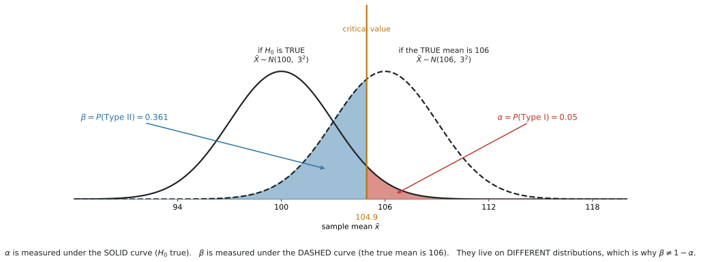
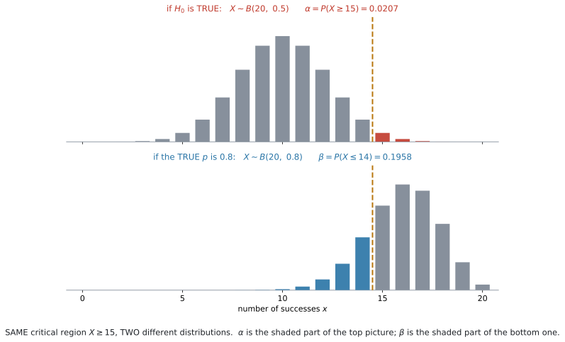
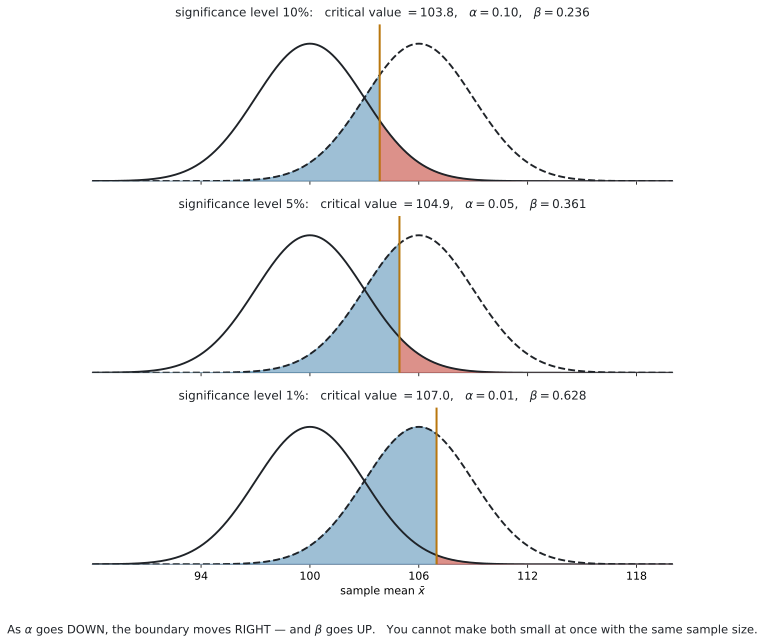

# AHL 4.18c — Type I and Type II errors（第1種・第2種の誤り） {#sec-ahl-4-18c}

::: {.callout-note}
## What you should be able to do
- **Type I error** と **Type II error** を、場面のことばで区別できる。
- **Type I error の確率**を、$H_0$ の分布で critical region に入る確率として計算できる。連続分布では設定した $\alpha$ に等しく、離散分布では一般に $\alpha$ 以下になる。
- **$P(\text{Type II}) = \beta$** を、**対立仮説の具体的な値**の分布から計算できる。
- **$\beta \neq 1 - \alpha$** である理由を説明できる。
- normal（分散既知）・binomial・Poisson の $3$ つで、両方の確率を出せる。
- 検定のあとで、**どちらの誤りが起こりえたか**を言える。
- $\alpha$ を小さくすると $\beta$ が大きくなることを説明できる。
:::

::: {.callout-note}
## AHL 4.18 の $3$ ページめです
| ページ | 中身 |
|---|---|
| [AHL 4.18a](ahl-4-18a.qmd) | critical value と critical region の考え方 |
| [AHL 4.18b](ahl-4-18b.qmd) | 分布ごとの検定 |
| **AHL 4.18c**（このページ） | **Type I error と Type II error** |

: AHL 4.18 の $3$ ページ {#tbl-ahl418c-map}

::: {.callout-important}
## [AHL 4.18a](ahl-4-18a.qmd) の critical region が、そのまま道具になります
このページの計算は、**すべて critical region から出発します。** critical region が求まっていないと、どちらの誤りの確率も出せません。

[AHL 4.18a](ahl-4-18a.qmd#discrete) を先に読んでおいてください。
:::
:::

::: {.callout-warning}
## シラバスが範囲を限っています
> Type I and II errors including calculations of their probabilities.
>
> **Applied to normal with known variance, Poisson and binomial distributions.**

**$3$ つだけ**です。**$t$ 検定には適用しません。** $\sigma$ が分からない場面で Type II error を計算させる問題は出ません。

> For discrete random variables, hypothesis tests and **critical regions will only be required for one-tailed tests**. The critical region will **maximize the probability of a Type I error while keeping it less than the stated significance level**.

binomial と Poisson は、**片側だけ**です。$2$ 文めは [AHL 4.18a](ahl-4-18a.qmd#discrete) の critical region の作り方そのもので、それがそのまま Type I error の確率になります（[第2節](#typeI)）。
:::

::: {.callout-important}
## Formula booklet に 4.18 の欄はありません
$\alpha$ と $\beta$ の計算に、公式はありません。**確率の計算そのもの**です。

覚えるのは、次の $2$ 行だけです。

- $P(\text{Type I})$ は、**$H_0$ の分布**で計算する
- $P(\text{Type II})$ は、**対立仮説の具体的な値の分布**で計算する

**どちらの分布を使うか**——これがこの項目のすべてです。
:::

## The idea

### 1. 判定は $2$ 通り、真実も $2$ 通り。合わせて $4$ つ {#idea}

検定の結論は「reject する」か「reject しない」かの $2$ 通りです。そして $H_0$ は、本当は正しいか正しくないかの $2$ 通りです。

組み合わせると $4$ 通りになります。

| | $H_0$ は本当は**正しい** | $H_0$ は本当は**正しくない** |
|---|---|---|
| $H_0$ を **reject する** | **Type I error** | 正しい判断 |
| $H_0$ を **reject しない** | 正しい判断 | **Type II error** |

: $4$ つの場合 {#tbl-ahl418c-four}

**斜めの $2$ つが正しい判断、残りの $2$ つが誤りです。**

::: {.callout-important}
## $2$ つの誤りを、ことばで言うと
**Type I error**（第1種の誤り）… **正しい $H_0$ を、reject してしまう。**

*Rejecting $H_0$ when $H_0$ is actually true.*

**Type II error**（第2種の誤り）… **正しくない $H_0$ を、reject しない。**

*Failing to reject $H_0$ when $H_0$ is actually false.*

英語では、こう呼ばれることもあります。

| | 別の呼び方 | 意味 |
|---|---|---|
| Type I | **false positive**（偽陽性） | 何もないのに「ある」と言ってしまう |
| Type II | **false negative**（偽陰性） | あるのに「ない」と言ってしまう |

: もう $1$ 組の呼び方 {#tbl-ahl418c-falsepn}

検査の場面では、こちらの言い方のほうがよく使われます。
:::

::: {.callout-tip}
## 裁判にたとえると、覚えやすくなります
$H_0$ は「無罪」です。検定は「有罪と言えるだけの証拠があるか」を調べています。

| | 本当は無罪 | 本当は有罪 |
|---|---|---|
| 有罪と判決（reject） | **Type I**：無実の人を有罪にした | 正しい |
| 無罪と判決（do not reject） | 正しい | **Type II**：犯人を逃した |

: 裁判のたとえ {#tbl-ahl418c-court}

**Type I は「冤罪」、Type II は「取り逃がし」**です。

そして、裁判では冤罪を強く避けます。だから「疑わしきは罰せず」——つまり **$\alpha$ を小さく設定する**わけです。その代わり、犯人を取り逃がしやすくなります。
:::

### 2. $P(\text{Type I})$ は、$H_0$ の分布で計算します {#typeI}

Type I error は「$H_0$ が正しいのに reject する」ことです。つまり、**$H_0$ が正しいという前提のもとで**、データが critical region に入ってしまう確率です。

$$
P(\text{Type I}) = P(\text{データが critical region に入る} \mid H_0 \ \text{が正しい})
$$ {#eq-ahl418c-typeI}

**これは、critical region の確率そのもの**です（[AHL 4.18a](ahl-4-18a.qmd#idea)）。

::: {.callout-important}
## $2$ つの「significance level」を区別してください
| 呼び方 | 意味 |
|---|---|
| **stated significance level** $\alpha$ | 問題文が決めた値（$5\%$ など） |
| **actual significance level** | その critical region で、実際に $H_0$ を棄却してしまう確率 |

: $2$ つの significance level {#tbl-ahl418c-two-alpha}

**連続な分布（normal）では、この $2$ つが一致します。** critical region を**丸める前の critical value**で作るので（[AHL 4.18a](ahl-4-18a.qmd#rounding)）、面積がちょうど $\alpha$ になるからです。

$$
P(\text{Type I}) = \alpha \quad (\text{連続分布})
$$

**離散な分布（binomial・Poisson）では、一致しません。** 整数の境目しか選べないので、実際の値は $\alpha$ より**小さく**なります。

$$
P(\text{Type I}) \leq \alpha \quad (\text{離散分布})
$$
:::

::: {.callout-warning}
## 離散分布では、$\alpha$ ちょうどにはなりません
binomial と Poisson では、critical region の確率は $\alpha$ より**小さく**なります（[AHL 4.18a](ahl-4-18a.qmd#discrete)）。

$B(20,\ 0.5)$ で $X \geq 15$ を critical region にすると

$$
P(\text{Type I}) = P(X \geq 15 \mid p = 0.5) = 0.0207
$$

です。**$0.05$ ではありません。**

`Find the probability of a Type I error` と問われたら、**必ず計算してください。** 「$5\%$ だから $0.05$」と書くと、離散では誤りになります。
:::

### 3. $P(\text{Type II})$ には、$H_1$ の「具体的な値」が要ります {#typeII}

Type II error は「$H_0$ が正しくないのに reject しない」ことです。

**ここで問題が起きます。** $H_1$ が $\mu > 100$ だとして、本当の $\mu$ はいくつなのでしょうか。$101$ かもしれないし、$150$ かもしれません。**値が決まらないと、確率が計算できません。**

::: {.callout-important}
## だから問題文が、必ず「本当の値」を教えてくれます
`Find the probability of a Type II error when the true mean is 106` のように、**具体的な数**が与えられます。

その数を使って分布を作り直し、**critical region の外に入る確率**を求めます。

$$
P(\text{Type II}) = P(\text{データが critical region の外} \mid \text{本当の値})
$$ {#eq-ahl418c-typeII}
:::

::: {.callout-tip}
## $2$ つの確率は、$2$ つの別の分布の上にあります
これがこの項目の中心です。

| | 使う分布 | 見る範囲 |
|---|---|---|
| $P(\text{Type I})$（実際の significance level） | **$H_0$ の値**で作った分布 | critical region の**中** |
| $P(\text{Type II}) = \beta$ | **本当の値**で作った分布 | critical region の**外** |

: $2$ つの誤りの計算 {#tbl-ahl418c-two}

**critical region は同じもの**です。変わるのは、**どの分布の上でその範囲を測るか**だけです。
:::

{#fig-ahl418c-two width=100%}

@fig-ahl418c-two を見てください。**曲線が $2$ 本あります。**

- **実線**… $H_0$ が正しいときの $\bar{X}$ の分布
- **破線**… 本当の平均が $106$ のときの $\bar{X}$ の分布

赤い部分（$\alpha$）は**実線の下**、青い部分（$\beta$）は**破線の下**にあります。**別々の曲線の上で測っています。**

### 4. $\beta = 1 - \alpha$ では、ありません {#not-complement}

**この項目でいちばん多い誤解です。**

$\alpha = 0.05$ なら $\beta = 0.95$——そう考えたくなりますが、**違います。**

@fig-ahl418c-two では $\alpha = 0.05$ で $\beta = 0.361$ です。足しても $1$ になりません。

::: {.callout-important}
## 理由は、$2$ つが別の分布の上にあるからです
足して $1$ になるのは、**同じ分布の上で、範囲を分け合ったとき**です。

$\alpha$ は実線の下、$\beta$ は破線の下にあります。**そもそも同じ全体を分け合っていません。**

実線の下で $\alpha = 0.05$ の反対側は $0.95$ ですが、それは「$H_0$ が正しいときに reject しない確率」であって、Type II error ではありません。**$H_0$ が正しいときは、そもそも Type II error は起こりえません。**
:::

::: {.callout-tip}
## $2$ つの「世界」で分けて考えると、はっきりします {#two-worlds}
@tbl-ahl418c-four の $4$ つを、確率で埋めてみます。

**$H_0$ が正しい世界**では、起こりうるのは上の行の $2$ つだけです。

$$
P(\text{reject} \mid H_0) + P(\text{do not reject} \mid H_0) = \alpha + (1 - \alpha) = 1
$$

**本当の値が $106$ の世界**では、起こりうるのは下の行の $2$ つだけです。

$$
P(\text{reject} \mid \mu = 106) + P(\text{do not reject} \mid \mu = 106)
= (1 - \beta) + \beta = 1
$$

**それぞれの世界の中では、ちゃんと足して $1$ になっています。** $\alpha$ と $\beta$ は別々の世界の住人なので、足しても意味がありません。
:::

::: {.callout-note appearance="simple"}
$1 - \beta$ には名前があり、**power**（検出力）といいます。「$H_0$ が間違っているときに、ちゃんと気づける確率」です。

@fig-ahl418c-two なら $1 - 0.361 = 0.639$ です。

**AI HL のシラバスは power を求めていません。** ただ、$\beta$ の意味を確かめるのに便利なので、覚えておくと役に立ちます。
:::

### 5. normal（分散既知）での計算 {#normal}

手順は $3$ 段階です。

1. **critical value を出す**（[AHL 4.18a](ahl-4-18a.qmd#xbar)）
2. $P(\text{Type I}) = \alpha$（連続なので、ちょうど）
3. **本当の平均で分布を作り直して**、critical region の外の確率を出す

@fig-ahl418c-two の設定（$\mu_0 = 100$、$\sigma = 15$、$n = 25$、片側 $5\%$）でやってみます。

standard error は $\dfrac{15}{\sqrt{25}} = 3$ なので

$$
\bar{x}_{\text{crit}} = 100 + 1.645 \times 3 = 104.9346\ldots \approx 104.9
$$

本当の平均が $106$ なら、$\bar{X} \sim N(106,\ 3^2)$ です。critical region の外は $\bar{x} < 104.9346\ldots$ なので

$$
\beta = P(\bar{X} < 104.9346 \mid \mu = 106) = 0.361
$$

**丸めた $104.9$ ではなく、丸める前の値を使ってください。** $104.9$ で計算すると $0.357$ になり、$3$ 桁目がずれます。

**standard error は変わりません。** 変わるのは**中心だけ**です。

### 6. binomial・Poisson での計算 {#discrete}

離散でも、やることは同じです。**$2$ つの分布を使い分けます。**

{#fig-ahl418c-discrete width=58%}

@fig-ahl418c-discrete は $B(20,\ 0.5)$ と $B(20,\ 0.8)$ です。critical region は**どちらも $X \geq 15$** で同じです。

| | 分布 | 範囲 | 確率 |
|---|---|---|---|
| $\alpha$ | $B(20,\ 0.5)$（$H_0$） | $X \geq 15$ | $0.0207$ |
| $\beta$ | $B(20,\ 0.8)$（本当の値） | $X \leq 14$ | $0.196$ |

: 離散での $2$ つの誤り {#tbl-ahl418c-disc}

::: {.callout-warning}
## 境目の扱いを間違えないでください
critical region が $X \geq 15$ なら、その**外は $X \leq 14$** です。$X < 15$ と書いても同じですが、電卓に入れるのは $0$ から $14$ です。

$X \leq 15$ としてしまうと、**$15$ を二重に数えます**（[AHL 4.18b](ahl-4-18b.qmd#include)）。
:::

### 7. 検定のあとは、どちらか一方しか起こりえません {#after}

**確率を計算するのは、標本をとる前**です。$\alpha$ も $\beta$ も「これから何が起きるか」の確率だからです。

**では、標本をとって結論を出したあとは？**

そのときには、**起こりえた誤りは片方だけ**に決まります。

| 出した結論 | 起こりえた誤り | 起こりえない誤り |
|---|---|---|
| $H_0$ を **reject した** | **Type I** | Type II |
| $H_0$ を **reject しなかった** | **Type II** | Type I |

: 結論を出したあとに起こりえる誤り {#tbl-ahl418c-after}

理由は、定義を読めば分かります。**Type I は「reject してしまう」誤り**なので、reject しなかったのなら起こりようがありません。**Type II は「reject しない」誤り**なので、reject したのなら起こりようがありません。

::: {.callout-important}
## `State which error could have occurred` は、よく出ます
$$
\text{reject した} \ \longrightarrow \ \text{Type I} \qquad
\text{reject しなかった} \ \longrightarrow \ \text{Type II}
$$

**「どちらが起こりえたか」と「どちらが起こりえないか」**の両方の聞き方があります。落ち着いて、**自分がどちらの結論を出したか**を先に確かめてください。

なお、**どちらの場合も「誤りが起きた」とは限りません。** 正しい判断だった可能性のほうが高いのがふつうです。聞かれているのは「**起こりえたのはどちらか**」です。
:::

::: {.callout-warning}
## 結論を出したあとに、$\beta$ を計算させる問題は出ません
$\beta$ は「本当の値」が分からないと計算できません（[第3節](#typeII)）。標本をとったあとでも、本当の値は分からないままです。

問題文が本当の値を教えてくれるのは、**「もし本当は $\mu = 106$ だったら」という仮の話**をしているときだけです。

`Find the probability of a Type II error` と書いてあったら、**問題文のどこかに必ず具体的な値があります。** 見つからなければ、読み落としています。
:::

### 8. $\alpha$ を小さくすると、$\beta$ は大きくなります {#tradeoff}

**$2$ つを同時に小さくすることはできません**（標本の大きさを変えなければ）。

{#fig-ahl418c-tradeoff width=48%}

@fig-ahl418c-tradeoff の $3$ 枚は、**同じ $2$ 本の曲線**です。動いているのは境目だけです。

| significance level | critical value | $\alpha$ | $\beta$ |
|---|---|---|---|
| $10\%$ | $103.8$ | $0.10$ | $0.236$ |
| $5\%$ | $104.9$ | $0.05$ | $0.361$ |
| $1\%$ | $107.0$ | $0.01$ | $0.628$ |

: $\alpha$ を下げると $\beta$ が上がる {#tbl-ahl418c-tradeoff}

$\alpha$ を小さくするには、境目を**外へ**動かします。すると赤い部分は小さくなりますが、**青い部分が大きくなります。**

::: {.callout-tip}
## どちらの誤りが困るかは、場面で決まります
数学だけでは決められません。**何を守りたいか**によります。

| 場面 | 重い誤り | なぜ |
|---|---|---|
| 新しい薬に副作用があるかの検査 | **Type II**（見逃す） | 危険な薬を売ってしまう |
| 医療機器の異常を知らせる警報 | **Type II**（見逃す） | 患者が危険にさらされる |
| 有罪かどうかの裁判 | **Type I**（冤罪） | 無実の人を罰する |
| 工場で製品を全部作り直すかの判断 | **Type I** | 問題ないのに大きな費用がかかる |

: どちらが重いか {#tbl-ahl418c-which-worse}

`Comment on which type of error is more serious` と問われたら、**場面のことばで理由を書いてください。** 「Type I のほうが重い」だけでは点になりません。
:::

::: {.callout-note appearance="simple"}
$2$ つとも**前より**小さくできる方法が、$1$ つだけあります。**標本を大きくすること**です。

$n$ が大きくなると standard error $\dfrac{\sigma}{\sqrt{n}}$ が小さくなり、$2$ 本の曲線が細くなります。**中心は動きませんが、細くなるぶん重なりが減ります。**

有意水準をそのままにすれば $\beta$ だけが小さくなり、そのぶん有意水準も下げられるので、結果として $\alpha$ と $\beta$ の両方を前より小さくできます。
:::

## Why it works

::: {.callout-tip collapse="true"}
## クリックすると開きます

### なぜ $\beta$ には「本当の値」が要るのか {#why}

$H_0$ は $\mu = 100$ のように、**$1$ つの数**を指定します。ですから「$H_0$ が正しいときの分布」は $1$ つに決まります。$\alpha$ が計算できるのは、そのおかげです。

$H_1$ は $\mu > 100$ のように、**範囲**を指定します。$100.1$ も $200$ も、どちらも $H_1$ に含まれます。

**「$H_1$ が正しいときの分布」は、$1$ つに決まりません。** ですから $\beta$ も $1$ つに決まりません。

$$
\mu = 101 \ \text{なら} \ \beta = 0.905, \qquad
\mu = 110 \ \text{なら} \ \beta = 0.0457
$$

（@fig-ahl418c-two の設定です。）

**本当の平均が $H_0$ から遠いほど、見逃しにくくなります。** これは感覚とも合っています。「$1$ g の差」より「$10$ g の差」のほうが気づきやすい、ということです。

だから問題文は、必ず**特定の値**を指定します。それがないと $\beta$ という数が存在しません。

:::

## Worked examples

::: {#exm-ahl418c-binom}
[A coin is tested for bias towards heads. It is tossed $20$ times, and $X$ is the number of heads. The test is carried out at the $5\%$ significance level.]{.q-en}

**(a)** [Find the critical region for $X$.]{.q-en}

**(b)** [Find the probability of a Type I error.]{.q-en}

**(c)** [Find the probability of a Type II error if the true probability of a head is $0.8$.]{.q-en}

<details class="jp-trans">
<summary>日本語訳</summary>

あるコインが表に偏っているかを検定します。$20$ 回投げ、$X$ を表の出た回数とします。有意水準 $5\%$ で検定します。

`bias towards heads` は「表への偏り」という意味です。

**(a)** $X$ の critical region を求めなさい。

**(b)** Type I error の確率を求めなさい。

**(c)** 表の出る本当の確率が $0.8$ のとき、Type II error の確率を求めなさい。

</details>

**(a)** $H_0$: $p = 0.5$、$H_1$: $p > 0.5$。$H_0$ のもとで $X \sim B(20,\ 0.5)$ です。

$P(X \geq k) \leq 0.05$ となる最小の $k$ を探します（[AHL 4.18a](ahl-4-18a.qmd#discrete)）。

| $k$ | $P(X \geq k)$ | $0.05$ 以下か |
|---|---|---|
| $14$ | $0.0577$ | いいえ |
| $15$ | $\mathbf{0.0207}$ | **はい** |

: critical region を探す {#tbl-ahl418c-search}

critical region は $X \geq 15$ です。

**(b)** Type I error は「$H_0$ が正しいのに reject」です。**$H_0$ の分布 $B(20,\ 0.5)$ で**、critical region に入る確率です。

$$
P(\text{Type I}) = P(X \geq 15 \mid p = 0.5) = 0.0207
$$

**(a) で出した値が、そのまま答えです。**

**(c)** 本当の $p$ が $0.8$ なら、$X \sim B(20,\ 0.8)$ に**作り直します。**

Type II error は「reject しない」ことなので、critical region の**外**です。$X \geq 15$ の外は $X \leq 14$ です。

```
Binomial Cdf:   n: 20   p: 0.8   Lower Bound: 0   Upper Bound: 14
```

$$
\beta = P(X \leq 14 \mid p = 0.8) = 0.196
$$

**検算。** $0.0207$ と $0.196$ を足しても、$1$ にはなりません ✓ **なってはいけません**（[第4節](#not-complement)）。

::: {.callout-warning}
## (b) と (c) で、$p$ が違います
**(b) は $p = 0.5$、(c) は $p = 0.8$** です。電卓に入れる `Prob Success` が変わります。

ここを変え忘れるのが、この項目でいちばん多いミスです。**「どちらの世界の話か」を、毎回声に出して確かめてください。**
:::

::: {.callout-note}
## 解答例（答案用紙にはこう書く）
**(a)** *$H_0: p = 0.5$, $H_1: p > 0.5$. Under $H_0$, $X \sim B(20,\ 0.5)$.*
$$
P(X \geq 14) = 0.0577 > 0.05, \qquad P(X \geq 15) = 0.0207 < 0.05
$$
*Critical region: $X \geq 15$.*

**(b)**
$$
P(\text{Type I}) = P(X \geq 15 \mid p = 0.5) = 0.0207
$$

**(c)** *If $p = 0.8$, then $X \sim B(20,\ 0.8)$.*
$$
P(\text{Type II}) = P(X \leq 14 \mid p = 0.8) = 0.196
$$
:::
:::

::: {#exm-ahl418c-pois}
[The number of accidents at a road junction follows a Poisson distribution with a mean of $3$ per month. After a change to the traffic lights, the council tests whether the mean has increased, using the number of accidents in one month and a $5\%$ significance level.]{.q-en}

**(a)** [Show that the critical region is $X \geq 7$.]{.q-en}

**(b)** [Find the probability of a Type I error.]{.q-en}

**(c)** [Find the probability of a Type II error if the true mean is $5$ per month.]{.q-en}

**(d)** [Explain what a Type II error would mean in this context.]{.q-en}

<details class="jp-trans">
<summary>日本語訳</summary>

ある交差点の事故の件数は、$1$ か月あたり平均 $3$ 件のポアソン分布にしたがいます。信号を変えたあと、自治体は平均が増えたかどうかを、$1$ か月の事故件数と有意水準 $5\%$ を使って検定します。

`junction` は「交差点」、`traffic lights` は「信号」、`council` は「自治体」という意味です。

**(a)** critical region が $X \geq 7$ であることを示しなさい。

**(b)** Type I error の確率を求めなさい。

**(c)** 本当の平均が $1$ か月あたり $5$ 件のとき、Type II error の確率を求めなさい。

**(d)** この場面で Type II error が何を意味するかを説明しなさい。

</details>

**(a)** $H_0$: $m = 3$、$H_1$: $m > 3$。$H_0$ のもとで $X \sim \mathrm{Po}(3)$ です。

| $k$ | $P(X \geq k)$ | $0.05$ 以下か |
|---|---|---|
| $6$ | $0.0839$ | いいえ |
| $7$ | $\mathbf{0.0335}$ | **はい** |

: Poisson の critical region {#tbl-ahl418c-pois-search}

$k = 6$ では超えてしまい、$k = 7$ で初めて $0.05$ 以下になります。critical region は $X \geq 7$ です。

**(b)**

$$
P(\text{Type I}) = P(X \geq 7 \mid m = 3) = 0.0335
$$

**(c)** 本当の平均が $5$ なら $X \sim \mathrm{Po}(5)$ です。critical region の外は $X \leq 6$。

```
Poisson Cdf:   λ: 5   Lower Bound: 0   Upper Bound: 6
```

$$
\beta = P(X \leq 6 \mid m = 5) = 0.762
$$

**(d)**

::: {.model-answer}
**試験ではこう書く**

*A Type II error would mean that the mean number of accidents has actually increased after the change to the traffic lights, but the council fails to detect this and concludes that there is no evidence of an increase. The dangerous junction would then be left unchanged.*
:::

（Type II error は、信号を変えたあとで事故の平均件数が実際には増えているのに、自治体がそれに気づかず、増加の証拠はないと結論してしまうことを意味する。その場合、危険な交差点はそのまま放置される、という意味です。）

::: {.callout-warning}
## $\beta = 0.762$ は、とても大きい値です
本当は事故が増えているのに、**$76\%$ の確率で気づけません。**

理由は、**$1$ か月ぶんしか見ていないから**です。$\mathrm{Po}(3)$ と $\mathrm{Po}(5)$ は形が近く、$1$ 回の観測では見分けがつきにくいのです。

$3$ か月ぶんを見れば $m_0 = 9$、$m_1 = 15$ になり、はるかに見分けやすくなります（[AHL 4.17](ahl-4-17.qmd#scaling)）。

**「$\beta$ が大きい」は、計算ミスではなく、その検定の弱さを表しています。**
:::

::: {.callout-note}
## 解答例（答案用紙にはこう書く）
**(a)** *Under $H_0$, $X \sim \mathrm{Po}(3)$.*
$$
P(X \geq 6) = 0.0839 > 0.05, \qquad P(X \geq 7) = 0.0335 < 0.05
$$
*So the critical region is $X \geq 7$.*

**(b)**
$$
P(\text{Type I}) = P(X \geq 7 \mid m = 3) = 0.0335
$$

**(c)** *If $m = 5$, then $X \sim \mathrm{Po}(5)$.*
$$
P(\text{Type II}) = P(X \leq 6 \mid m = 5) = 0.762
$$

**(d)** *A Type II error means the mean number of accidents has really increased but the test does not detect it, so the council wrongly concludes there is no evidence of an increase and leaves the junction unchanged.*
:::
:::

::: {#exm-ahl418c-normal}
[The mass of a bag of sugar is normally distributed with standard deviation $\sigma = 15$ grams. The stated mean is $100$ grams. A consumer group suspects the mean is greater than $100$ grams and tests, at the $5\%$ significance level, using a random sample of $25$ bags.]{.q-en}

**(a)** [Find the critical value of $\bar{x}$.]{.q-en}

**(b)** [Write down the probability of a Type I error.]{.q-en}

**(c)** [Find the probability of a Type II error if the true mean is $106$ grams.]{.q-en}

**(d)** [The test is repeated at the $1\%$ significance level. Find the new probability of a Type II error when the true mean is $106$ grams, and comment on your answer.]{.q-en}

<details class="jp-trans">
<summary>日本語訳</summary>

砂糖の袋の重さは standard deviation $\sigma = 15$ グラムの正規分布にしたがいます。表示されている平均は $100$ グラムです。消費者団体は平均が $100$ グラムより大きいと疑い、無作為に選んだ $25$ 袋を使って有意水準 $5\%$ で検定します。

**(a)** $\bar{x}$ の critical value を求めなさい。

**(b)** Type I error の確率を書きなさい。

**(c)** 本当の平均が $106$ グラムのとき、Type II error の確率を求めなさい。

**(d)** 有意水準 $1\%$ で同じ検定をやり直します。本当の平均が $106$ グラムのときの Type II error の確率を新たに求め、答えについて論評しなさい。

</details>

**(a)** standard error は

$$
\frac{\sigma}{\sqrt{n}} = \frac{15}{\sqrt{25}} = 3
$$

片側 $5\%$、上側なので $z_{\text{crit}} = 1.645$（[AHL 4.18a](ahl-4-18a.qmd#normal-cv)）。

$$
\bar{x}_{\text{crit}} = 100 + 1.645 \times 3 = 104.9346\ldots \approx 104.9
$$

**(b)** 正規分布は連続なので、critical region の面積は**ちょうど** $\alpha$ です。

$$
P(\text{Type I}) = 0.05
$$

計算は要りません。

**(c)** 本当の平均が $106$ なら $\bar{X} \sim N(106,\ 3^2)$ です。**standard error は $3$ のまま、中心だけが動きます。**

critical region の外は $\bar{x} < 104.9346\ldots$ です。**丸める前の値**を入れます。

```
Normal Cdf:   Lower Bound: -1E99   Upper Bound: 104.9346
              μ: 106      σ: 3
```

$$
\beta = P(\bar{X} < 104.9346 \mid \mu = 106) = 0.361
$$

**(d)** $1\%$ なら $z_{\text{crit}} = 2.326$ です。

$$
\bar{x}_{\text{crit}} = 100 + 2.326 \times 3 = 106.9790\ldots \approx 107.0
$$

$$
\beta = P(\bar{X} < 106.9790 \mid \mu = 106) = 0.628
$$

::: {.model-answer}
**試験ではこう書く**

*Lowering the significance level from $5\%$ to $1\%$ moves the critical value further from $100$, which makes the critical region smaller. The probability of a Type I error falls from $0.05$ to $0.01$, but the probability of a Type II error rises from $0.361$ to $0.628$. With the same sample size, reducing one type of error increases the other.*
:::

（有意水準を $5\%$ から $1\%$ に下げると critical value が $100$ からさらに離れ、critical region が小さくなる。Type I error の確率は $0.05$ から $0.01$ に下がるが、Type II error の確率は $0.361$ から $0.628$ に上がる。標本の大きさが同じなら、一方の誤りを減らすともう一方が増える、という意味です。）

**検算。** $\beta$ が $0.361$ から $0.628$ へ**増えました** ✓ @tbl-ahl418c-tradeoff と同じ向きです。

::: {.callout-warning}
## (c) と (d) で、$\mu$ は同じ $106$ です
変えたのは**有意水準**だけで、本当の平均は $106$ のままです。

$\bar{X} \sim N(106,\ 3^2)$ という分布は (c) と (d) で同じで、**比べる境目だけが $104.9$ から $107.0$ に動きます。**
:::

::: {.callout-note}
## 解答例（答案用紙にはこう書く）
**(a)**
$$
\frac{\sigma}{\sqrt{n}} = \frac{15}{\sqrt{25}} = 3
$$
$$
\bar{x}_{\text{crit}} = 100 + 1.645 \times 3 = 104.9346\ldots \approx 104.9 \ \text{g}
$$

**(b)**
$$
P(\text{Type I}) = 0.05
$$

**(c)** *If $\mu = 106$, then $\bar{X} \sim N(106,\ 3^2)$.*
$$
P(\text{Type II}) = P(\bar{X} < 104.9346) = 0.361
$$

**(d)**
$$
\bar{x}_{\text{crit}} = 100 + 2.326 \times 3 = 106.9790\ldots, \qquad
P(\text{Type II}) = P(\bar{X} < 106.9790) = 0.628
$$
*Lowering $\alpha$ from $0.05$ to $0.01$ raises $\beta$ from $0.361$ to $0.628$: with the same sample size, reducing one type of error increases the other.*
:::
:::

## Common errors

::: {.callout-warning}
## $\beta = 1 - \alpha$ としてしまう
$2$ つは**別の分布**の上にあります（[第4節](#not-complement)）。足して $1$ にはなりません。
:::

::: {.callout-warning}
## $\beta$ の計算で、$H_0$ の値のまま電卓に入れる
$\beta$ を出すときは、**本当の値**に入れ替えます（[第3節](#typeII)）。

@exm-ahl418c-binom なら、`Prob Success` を $0.5$ から $0.8$ に変えます。
:::

::: {.callout-warning}
## 離散分布で $P(\text{Type I}) = 0.05$ と書く
離散では $\alpha$ ちょうどになりません（[第2節](#typeI)）。**計算してください。**

@exm-ahl418c-binom では $0.0207$、@exm-ahl418c-pois では $0.0335$ です。
:::

::: {.callout-warning}
## critical region の外の範囲を、$1$ つずらす
$X \geq 15$ の外は $X \leq 14$ です。$X \leq 15$ ではありません（[第6節](#discrete)）。
:::

::: {.callout-warning}
## $\beta$ の計算で standard error を変えてしまう
正規分布では、本当の平均に変えても $\dfrac{\sigma}{\sqrt{n}}$ は**そのまま**です（[第5節](#normal)）。動くのは中心だけです。
:::

::: {.callout-warning}
## $\alpha$ を下げれば $\beta$ も下がると考える
逆です。**$\alpha$ を下げると $\beta$ は上がります**（[第8節](#tradeoff)）。
:::

::: {.callout-warning}
## Type I と Type II を取り違える
**Type I は「正しい $H_0$ を reject」、Type II は「間違った $H_0$ を reject しない」**です。

**動いてしまったほうが Type I**（reject **する**）、**動かなかったほうが Type II**（reject **しない**）。`reject` のうしろに「しない」が付くかどうかで見分けてください（@tbl-ahl418c-four）。
:::

::: {.callout-warning}
## どちらが重いかを、場面のことばで書かない
`Type I is more serious` だけでは点になりません。**「その場面で何が起きるか」**を書いてください（[第8節](#tradeoff)）。
:::

::: {.callout-warning}
## 検定のあとで、両方の誤りが起こりえたと書く
$H_0$ を棄却したなら Type I、棄却しなかったなら Type II——**起こりえるのは片方だけ**です（[第7節](#after)）。
:::

::: {.callout-warning}
## $\beta$ を求めるのに、本当の値を問題文から探さない
$\beta$ は本当の値がないと計算できません（[第3節](#typeII)）。`Find the probability of a Type II error` とあれば、**問題文のどこかに必ず具体的な値があります。**
:::

::: {.callout-warning}
## $t$ 検定で Type II error を計算しようとする
シラバスは `Applied to normal with known variance, Poisson and binomial distributions` と限っています。**$t$ には適用しません。**
:::

## Using your GDC (TI-Nspire CX II)

::: {.callout-note appearance="simple"}
**新しいコマンドはありません。** [AHL 4.18a](ahl-4-18a.qmd#gdc-inv) と [AHL 4.18b](ahl-4-18b.qmd#gdc-z) で使ったものを、**分布の数字だけ入れ替えて**もう一度使います。
:::

### 離散分布のとき {#gdc-discrete}

**$2$ 回、`Cdf` を使います。**

@exm-ahl418c-binom を例にすると、critical region は $X \geq 15$ です。

```
① Type I:    Binomial Cdf   n: 20   p: 0.5   Lower: 15   Upper: 20
② Type II:   Binomial Cdf   n: 20   p: 0.8   Lower: 0    Upper: 14
```

**変わるのは $2$ か所**です。`p` と、範囲の向き。

| | `p` | `Lower` | `Upper` |
|---|---|---|---|
| Type I | $H_0$ の値 | critical region の下端 | 上限 |
| Type II | **本当の値** | $0$ | critical region の下端 $-1$ |

: 離散での入力 {#tbl-ahl418c-gdc-disc}

::: {.callout-tip}
## `Upper` を $1$ 引くところが要です
critical region が $X \geq 15$ なら、その外は $X \leq 14$。**`Upper Bound` は $14$** です。

$15$ と入れると、critical region の $1$ 本ぶんを二重に数えます。
:::

### 正規分布のとき {#gdc-normal}

`Normal Cdf` を使います（[SL 4.9](../../ai-sl/04-statistics-and-probability/sl-4-9.qmd)）。

```
Normal Cdf:   Lower Bound: -1E99      Upper Bound: 104.9346
              μ: 106      σ: 3
```

| 欄 | 入れるもの |
|---|---|
| `μ` | **本当の平均**（$H_0$ の値では**ない**） |
| `σ` | standard error $\dfrac{\sigma}{\sqrt{n}}$ |
| 範囲 | critical region の**外** |

: 正規分布での入力 {#tbl-ahl418c-gdc-norm}

::: {.callout-warning}
## `σ` の欄に $\sigma$ をそのまま入れないでください
$\bar{X}$ の散らばりは $\dfrac{\sigma}{\sqrt{n}}$ です。@exm-ahl418c-normal なら **$3$** であって、$15$ ではありません。

$15$ を入れると $\beta = 0.472$ となり、答えが変わってしまいます。
:::

::: {.callout-tip}
## $-1\text{E}99$ の出し方
`Lower Bound` に「限りなく小さい数」を入れたいときは、$-1$ を打ってから **`EE` キー**（$10$ の指数を入れるキーです）を押し、$99$ と打ちます。画面には `-1E99` と出ます（[SL 4.9](../../ai-sl/04-statistics-and-probability/sl-4-9.qmd)）。

`Inverse Normal` と違い、`Normal Cdf` は**両側の境目**を要求するので、片側だけのときはこれが必要です。
:::

## Exercises

::: {.callout-note appearance="simple"}
各問題に、折りたたみが3つ付いています。**日本語訳**、**解答例**（答案用紙に書くべきこと。英語です）、**解説**（なぜそうなるか。日本語です）。

まず自分で解いて、次に解答例と見くらべてください。**解説は、合わなかったときだけ開けば十分です。**
:::

::: {.exercise-block}

[1]{.ex-no} [A test of $H_0: p = 0.4$ against $H_1: p > 0.4$ uses a sample of size $25$ and the critical region $X \geq 15$.]{.q-en}

**(a)** [Find the probability of a Type I error.]{.q-en}

**(b)** [Find the probability of a Type II error if the true value of $p$ is $0.6$.]{.q-en}

<details class="jp-trans">
<summary>日本語訳</summary>

$H_0: p = 0.4$ を $H_1: p > 0.4$ に対して検定します。標本の大きさは $25$ で、critical region は $X \geq 15$ です。

**(a)** Type I error の確率を求めなさい。

**(b)** $p$ の本当の値が $0.6$ のとき、Type II error の確率を求めなさい。

</details>

::: {.callout-note collapse="true"}
## 解答例（答案用紙に書くこと）
**(a)** *Under $H_0$, $X \sim B(25,\ 0.4)$.*
$$
P(\text{Type I}) = P(X \geq 15 \mid p = 0.4) = 0.0344
$$

**(b)** *If $p = 0.6$, then $X \sim B(25,\ 0.6)$.*
$$
P(\text{Type II}) = P(X \leq 14 \mid p = 0.6) = 0.414
$$
:::

::: {.callout-tip collapse="true"}
## 解説
**(a)** $H_0$ の値 $p = 0.4$ で計算します（[第2節](#typeI)）。

```
Binomial Cdf:   n: 25   p: 0.4   Lower: 15   Upper: 25
```

**(b)** 本当の値 $p = 0.6$ に**入れ替えます**（[第3節](#typeII)）。範囲は critical region の**外**、つまり $X \leq 14$ です。

```
Binomial Cdf:   n: 25   p: 0.6   Lower: 0   Upper: 14
```

**検算。** $0.0344$ と $0.414$ を足しても $1$ になりません ✓ **なってはいけません**（[第4節](#not-complement)）。

この critical region は [AHL 4.18a](ahl-4-18a.qmd) の例題3 と同じものです。
:::

::: {.ex-sep}
:::

[2]{.ex-no} [A test of $H_0: m = 6$ against $H_1: m > 6$ for a Poisson distribution uses the critical region $X \geq 11$.]{.q-en}

**(a)** [Find the probability of a Type I error.]{.q-en}

**(b)** [Find the probability of a Type II error if the true mean is $10$.]{.q-en}

<details class="jp-trans">
<summary>日本語訳</summary>

ポアソン分布について $H_0: m = 6$ を $H_1: m > 6$ に対して検定します。critical region は $X \geq 11$ です。

**(a)** Type I error の確率を求めなさい。

**(b)** 本当の平均が $10$ のとき、Type II error の確率を求めなさい。

</details>

::: {.callout-note collapse="true"}
## 解答例（答案用紙に書くこと）
**(a)** *Under $H_0$, $X \sim \mathrm{Po}(6)$.*
$$
P(\text{Type I}) = P(X \geq 11 \mid m = 6) = 0.0426
$$

**(b)** *If $m = 10$, then $X \sim \mathrm{Po}(10)$.*
$$
P(\text{Type II}) = P(X \leq 10 \mid m = 10) = 0.583
$$
:::

::: {.callout-tip collapse="true"}
## 解説
**(a)** $\mathrm{Po}(6)$ で $X \geq 11$。`Upper Bound` は $100$ など大きい数にします（[AHL 4.18a](ahl-4-18a.qmd#gdc-discrete)）。

**(b)** $\mathrm{Po}(10)$ に入れ替え、$X \leq 10$ の確率です。

```
Poisson Cdf:   λ: 10   Lower: 0   Upper: 10
```

::: {.callout-warning}
## (b) の $10$ が $2$ か所に出ますが、意味が違います
`λ: 10` の $10$ は**本当の平均**、`Upper: 10` の $10$ は **critical region の下端 $11$ から $1$ 引いた数**です。

偶然、同じ数になっています。**混ざらないように、$1$ つずつ確かめてください。**
:::

**検算。** $\beta = 0.583$ は大きめです。$\mathrm{Po}(6)$ と $\mathrm{Po}(10)$ はまだ形が近いので、$1$ 回の観測では見分けにくい——それが数に出ています ✓
:::

::: {.ex-sep}
:::

[3]{.ex-no} [The time taken to process an application is normally distributed with standard deviation $\sigma = 6$ minutes. The office claims a mean of $50$ minutes. A manager tests, at the $5\%$ significance level, whether the mean is greater than $50$ minutes, using a random sample of $36$ applications.]{.q-en}

**(a)** [Find the critical value of $\bar{x}$.]{.q-en}

**(b)** [Write down the probability of a Type I error.]{.q-en}

**(c)** [Find the probability of a Type II error if the true mean is $52$ minutes.]{.q-en}

<details class="jp-trans">
<summary>日本語訳</summary>

ある申請の処理にかかる時間は standard deviation $\sigma = 6$ 分の正規分布にしたがいます。この事務所は平均 $50$ 分だと主張しています。ある管理者が、無作為に選んだ $36$ 件の申請を使い、平均が $50$ 分より大きいかどうかを有意水準 $5\%$ で検定します。

`application` は「申請」という意味です。

**(a)** $\bar{x}$ の critical value を求めなさい。

**(b)** Type I error の確率を書きなさい。

**(c)** 本当の平均が $52$ 分のとき、Type II error の確率を求めなさい。

</details>

::: {.callout-note collapse="true"}
## 解答例（答案用紙に書くこと）
**(a)**
$$
\frac{\sigma}{\sqrt{n}} = \frac{6}{\sqrt{36}} = 1
$$
$$
\bar{x}_{\text{crit}} = 50 + 1.645 \times 1 = 51.6449\ldots \approx 51.6 \ \text{minutes}
$$

**(b)**
$$
P(\text{Type I}) = 0.05
$$

**(c)** *If $\mu = 52$, then $\bar{X} \sim N(52,\ 1^2)$.*
$$
P(\text{Type II}) = P(\bar{X} < 51.6449) = 0.361
$$
:::

::: {.callout-tip collapse="true"}
## 解説
**(a)** standard error は $\dfrac{6}{6} = 1$ です。

$$
50 + 1.645 \times 1 = 51.6449 \ldots
$$

$3$ 桁で $51.6$ です。

**(b)** 正規分布は連続なので、**ちょうど $0.05$** です（[第2節](#typeI)）。計算しません。

**(c)** 中心を $52$ に動かします。**standard error は $1$ のまま**です（[第5節](#normal)）。

```
Normal Cdf:   Lower: -1E99   Upper: 51.6449   μ: 52   σ: 1
```

$$
\beta = 0.361
$$

::: {.callout-tip}
## $\beta$ が @exm-ahl418c-normal と同じ $0.361$ になりました
偶然ではありません。どちらも片側 $5\%$ で、@exm-ahl418c-normal は「$\mu_0$ から $6$、standard error が $3$」、この問題は「$\mu_0$ から $2$、standard error が $1$」——**どちらも standard error $2$ 個ぶん離れています。**

**同じ有意水準なら**、$\beta$ を決めるのは**「本当の値が $\mu_0$ から standard error 何個ぶん離れているか」**だけです。実際の単位や $n$ ではありません。

有意水準が変われば、同じ距離でも $\beta$ は変わります（[第8節](#tradeoff)）。
:::

**検算。** 丸めた $51.6$ ではなく $51.6449$ で計算しました。丸めた $51.6$ を使うと $0.345$ になり、$2$ 桁目からずれます ✓ **$\beta$ の計算では、丸める前の critical value を使ってください。**
:::

::: {.ex-sep}
:::

[4]{.ex-no} [A factory tests batches of components. $H_0$ is that a batch meets the required standard.]{.q-en}

[For each of the following, state whether it describes a Type I error, a Type II error, or a correct decision.]{.q-en}

**(a)** [A batch that meets the standard is rejected.]{.q-en}

**(b)** [A batch that does not meet the standard is accepted for sale.]{.q-en}

**(c)** [A batch that does not meet the standard is rejected.]{.q-en}

**(d)** [For one particular batch the test does not reject $H_0$. State which type of error could have occurred, and which could not.]{.q-en}

<details class="jp-trans">
<summary>日本語訳</summary>

ある工場が部品のまとまりを検査しています。$H_0$ は「そのまとまりが required standard を満たしている」です。

`batch` は「まとまり、ロット」、`component` は「部品」、`meet the standard` は「基準を満たす」という意味です。

次のそれぞれが、Type I error か Type II error か、それとも正しい判断かを述べなさい。

**(a)** 基準を満たしているまとまりが、不合格にされる。

**(b)** 基準を満たしていないまとまりが、販売用に受け入れられる。

**(c)** 基準を満たしていないまとまりが、不合格にされる。

**(d)** ある $1$ つのまとまりについて、検定は $H_0$ を棄却しませんでした。どちらの種類の誤りが起こりえたか、またどちらが起こりえないかを述べなさい。

</details>

::: {.callout-note collapse="true"}
## 解答例（答案用紙に書くこと）
**(a)** *A Type I error: $H_0$ is true but is rejected.*

**(b)** *A Type II error: $H_0$ is false but is not rejected.*

**(c)** *A correct decision: $H_0$ is false and is rejected.*

**(d)**

::: {.model-answer}
*A Type II error could have occurred, because $H_0$ was not rejected and a Type II error is failing to reject a false $H_0$. A Type I error could not have occurred, because that requires $H_0$ to be rejected.*
:::

（Type II error が起こりえた。$H_0$ が棄却されておらず、Type II error は誤った $H_0$ を棄却しないことだからである。Type I error は起こりえない。それには $H_0$ が棄却されている必要があるからである、という意味です。）
:::

::: {.callout-tip collapse="true"}
## 解説
**$H_0$ が何かを、はっきりさせるのが先です。** ここでは「基準を満たしている」が $H_0$ です。

@tbl-ahl418c-four に当てはめます。

**(a)** 基準を満たしている（$H_0$ は正しい）のに不合格（reject）→ **Type I**

**(b)** 満たしていない（$H_0$ は正しくない）のに受け入れた（reject しない）→ **Type II**

**(c)** 満たしていない（$H_0$ は正しくない）ので不合格（reject）→ **正しい判断**

**(d)** **結論を出したあとの問い**です（[第7節](#after)）。

$H_0$ を棄却しなかったのだから、**「棄却してしまう」誤り（Type I）は起こりようがありません。**

残るのは Type II だけです。@tbl-ahl418c-after を見てください。

**「起こりえた」であって、「起きた」ではありません。** 正しい判断だった可能性のほうが高いのがふつうです。

::: {.callout-warning}
## 「不合格」が reject に対応します
日常の「合格・不合格」と、検定の「reject する・しない」は**向きが逆に感じられます。**

このまとまりを**不合格にする**ということは、「基準を満たしている」という $H_0$ を**否定した**ということです。

**毎回、$H_0$ が何かに戻って考えてください。**
:::
:::

::: {.ex-sep}
:::

[5]{.ex-no} [A student writes:]{.q-en}

> [*"The test is carried out at the $5\%$ significance level, so the probability of a Type I error is $0.05$ and the probability of a Type II error is $0.95$."*]{.q-en}

[Explain the error in this reasoning.]{.q-en}

<details class="jp-trans">
<summary>日本語訳</summary>

ある生徒がこう書きました。

> 「有意水準 $5\%$ で検定するので、Type I error の確率は $0.05$、Type II error の確率は $0.95$ である。」

この理由づけの誤りを説明しなさい。

</details>

::: {.callout-note collapse="true"}
## 解答例（答案用紙に書くこと）
::: {.model-answer}
*The two probabilities are calculated under different distributions, so they do not add to $1$. $P(\text{Type I})$ is found assuming $H_0$ is true, while $P(\text{Type II})$ is found assuming a specific alternative value is true. A Type II error cannot even occur when $H_0$ is true. In addition, $P(\text{Type II})$ cannot be found at all until a particular alternative value is given, so it is not determined by the significance level.*
:::

（$2$ つの確率は別々の分布のもとで計算されるので、足して $1$ にはならない。$P(\text{Type I})$ は $H_0$ が正しいという仮定のもとで求め、$P(\text{Type II})$ は特定の対立仮説の値が正しいという仮定のもとで求める。$H_0$ が正しいときには Type II error は起こりえない。さらに、$P(\text{Type II})$ は特定の対立仮説の値が与えられるまで求めることすらできないので、有意水準では決まらない、という意味です。）
:::

::: {.callout-tip collapse="true"}
## 解説
**誤りは $2$ つあります。両方書いてください。**

**$1$ つめ。$\beta = 1 - \alpha$ ではありません**（[第4節](#not-complement)）。$2$ つは別の分布の上にあるので、足す意味がありません。

**$2$ つめ。そもそも $\beta$ は、有意水準だけでは決まりません。** 本当の値が与えられないと計算できません（[第3節](#typeII)）。

$1$ つめだけ書くと、半分の答えになります。**「$0.95$ が違う」だけでなく、「そもそも数が決まらない」まで書いてください。**

なお **$P(\text{Type I}) = 0.05$ のほうは、正規分布なら正しい**です。離散分布なら、これも違います（[第2節](#typeI)）。
:::

::: {.ex-sep}
:::

[6]{.ex-no} [A quantity is normally distributed with standard deviation $\sigma = 10$. A test of $H_0: \mu = 200$ against $H_1: \mu > 200$ uses a random sample of $25$.]{.q-en}

**(a)** [Find the critical value of $\bar{x}$ at the $5\%$ significance level, and the probability of a Type II error when the true mean is $205$.]{.q-en}

**(b)** [Find the critical value of $\bar{x}$ and the probability of a Type II error at the $1\%$ significance level.]{.q-en}

**(c)** [Comment on your answers.]{.q-en}

<details class="jp-trans">
<summary>日本語訳</summary>

ある量は standard deviation $\sigma = 10$ の正規分布にしたがいます。$H_0: \mu = 200$ を $H_1: \mu > 200$ に対して、無作為に選んだ $25$ 個の標本で検定します。

**(a)** 有意水準 $5\%$ での $\bar{x}$ の critical value と、本当の平均が $205$ のときの Type II error の確率を求めなさい。

**(b)** 有意水準 $1\%$ での $\bar{x}$ の critical value と Type II error の確率を求めなさい。

**(c)** 答えについて論評しなさい。

</details>

::: {.callout-note collapse="true"}
## 解答例（答案用紙に書くこと）
$$
\frac{\sigma}{\sqrt{n}} = \frac{10}{\sqrt{25}} = 2
$$

**(a)**
$$
\bar{x}_{\text{crit}} = 200 + 1.645 \times 2 = 203.2897\ldots \approx 203.3
$$
$$
P(\text{Type II}) = P(\bar{X} < 203.2897 \mid \mu = 205) = 0.196
$$

**(b)**
$$
\bar{x}_{\text{crit}} = 200 + 2.326 \times 2 = 204.6527\ldots \approx 204.7
$$
$$
P(\text{Type II}) = P(\bar{X} < 204.6527 \mid \mu = 205) = 0.431
$$

**(c)**

::: {.model-answer}
*Lowering the significance level from $5\%$ to $1\%$ reduces the probability of a Type I error from $0.05$ to $0.01$, but it raises the probability of a Type II error from $0.196$ to $0.431$. With a fixed sample size the two cannot both be made small, so the choice of significance level depends on which error matters more in the situation.*
:::

（有意水準を $5\%$ から $1\%$ に下げると Type I error の確率は $0.05$ から $0.01$ に減るが、Type II error の確率は $0.196$ から $0.431$ に上がる。標本の大きさが決まっていれば $2$ つを同時に小さくはできないので、有意水準の選び方は、その場面でどちらの誤りが重いかによる、という意味です。）
:::

::: {.callout-tip collapse="true"}
## 解説
standard error は $\dfrac{10}{5} = 2$ で、(a) (b) 共通です。

**(a)** $200 + 1.645 \times 2 = 203.2897\ldots$

```
Normal Cdf:   Lower: -1E99   Upper: 203.2897   μ: 205   σ: 2
```

$$
\beta = 0.196
$$

**(b)** $200 + 2.326 \times 2 = 204.6527\ldots$

$$
\beta = 0.431
$$

**(c)** $\beta$ が $0.196$ から $0.431$ へ、**$2$ 倍以上**に増えました。

**この対比が、この問題の中心です**（[第8節](#tradeoff)）。「どちらの誤りを避けたいか」で有意水準を選ぶ、というところまで書いてください。

**検算。** $\alpha$ を下げたら $\beta$ が上がりました ✓ 逆になっていたら、どこかで分布か範囲を取り違えています。
:::

::: {.ex-sep}
:::

[7]{.ex-no} [A test of $H_0: m = 4$ against $H_1: m > 4$ for a Poisson distribution uses the critical region $X \geq 9$.]{.q-en}

**(a)** [Find the probability of a Type II error when the true mean is (i) $6$, (ii) $8$, (iii) $10$.]{.q-en}

**(b)** [Describe how the probability of a Type II error changes as the true mean increases, and explain why.]{.q-en}

<details class="jp-trans">
<summary>日本語訳</summary>

ポアソン分布について $H_0: m = 4$ を $H_1: m > 4$ に対して検定します。critical region は $X \geq 9$ です。

**(a)** 本当の平均が (i) $6$、(ii) $8$、(iii) $10$ のときの Type II error の確率を求めなさい。

**(b)** 本当の平均が増えるにつれて Type II error の確率がどう変わるかを述べ、その理由を説明しなさい。

</details>

::: {.callout-note collapse="true"}
## 解答例（答案用紙に書くこと）
**(a)** *The critical region is $X \geq 9$, so a Type II error occurs when $X \leq 8$.*

**(i)** $P(X \leq 8 \mid m = 6) = 0.847$

**(ii)** $P(X \leq 8 \mid m = 8) = 0.593$

**(iii)** $P(X \leq 8 \mid m = 10) = 0.333$

**(b)**

::: {.model-answer}
*The probability of a Type II error decreases as the true mean increases. When the true mean is far from the value in $H_0$, the observed count is much more likely to fall in the critical region, so the test is much more likely to detect that $H_0$ is false. A small departure from $H_0$ is hard to detect; a large one is easy.*
:::

（本当の平均が大きくなるにつれて Type II error の確率は減る。本当の平均が $H_0$ の値から遠いと、観測される件数が critical region に入る可能性がずっと高くなるので、検定が $H_0$ の誤りを見つけられる可能性がずっと高くなる。$H_0$ からのわずかなずれは見つけにくく、大きなずれは見つけやすい、という意味です。）
:::

::: {.callout-tip collapse="true"}
## 解説
**(a)** critical region が $X \geq 9$ なので、その外は $X \leq 8$ です。**$\lambda$ だけを $6$、$8$、$10$ と入れ替えます。**

```
Poisson Cdf:   λ: 6    Lower: 0   Upper: 8      →  0.847
Poisson Cdf:   λ: 8    Lower: 0   Upper: 8      →  0.593
Poisson Cdf:   λ: 10   Lower: 0   Upper: 8      →  0.333
```

**`Upper: 8` は $3$ 回とも同じ**です。critical region は変わっていません。

**(b)** $0.847 \to 0.593 \to 0.333$ と**減っています。**

理由は [Why it works](#why) で見たことです。**$H_0$ から遠いほど、見逃しにくい。**

**検算。** 単調に減っています ✓ 増えていたら、$\lambda$ と `Upper` を取り違えています。
:::

::: {.ex-sep}
:::

[8]{.ex-no} [A test of $H_0: p = 0.25$ against $H_1: p > 0.25$ uses a sample of size $30$ at the $5\%$ significance level.]{.q-en}

**(a)** [Show that the critical region is $X \geq 13$.]{.q-en}

**(b)** [Find the probability of a Type I error, and explain why it is not $0.05$.]{.q-en}

**(c)** [Find the probability of a Type II error if the true value of $p$ is $0.5$.]{.q-en}

<details class="jp-trans">
<summary>日本語訳</summary>

$H_0: p = 0.25$ を $H_1: p > 0.25$ に対して、大きさ $30$ の標本を使い有意水準 $5\%$ で検定します。

**(a)** critical region が $X \geq 13$ であることを示しなさい。

**(b)** Type I error の確率を求め、それが $0.05$ でない理由を説明しなさい。

**(c)** $p$ の本当の値が $0.5$ のとき、Type II error の確率を求めなさい。

</details>

::: {.callout-note collapse="true"}
## 解答例（答案用紙に書くこと）
**(a)** *Under $H_0$, $X \sim B(30,\ 0.25)$.*
$$
P(X \geq 12) = 0.0507 > 0.05, \qquad P(X \geq 13) = 0.0216 < 0.05
$$
*So the critical region is $X \geq 13$.*

**(b)**
$$
P(\text{Type I}) = P(X \geq 13 \mid p = 0.25) = 0.0216
$$

::: {.model-answer}
*$X$ can only take whole-number values, so the probability of the critical region changes in jumps and cannot be made exactly $0.05$. The region is chosen to be the largest whose probability is still less than $0.05$, and here that probability is $0.0216$.*
:::

（$X$ は整数の値しか取れないので critical region の確率は飛び飛びに変わり、ちょうど $0.05$ にはできない。region は確率が $0.05$ を超えない範囲でいちばん大きいものが選ばれ、ここではその確率が $0.0216$ である、という意味です。）

**(c)** *If $p = 0.5$, then $X \sim B(30,\ 0.5)$.*
$$
P(\text{Type II}) = P(X \leq 12 \mid p = 0.5) = 0.181
$$
:::

::: {.callout-tip collapse="true"}
## 解説
**(a)** $P(X \geq 12) = 0.0507$ で、$0.05$ を**わずかに超えます。** ですから $X \geq 13$ です（[AHL 4.18a](ahl-4-18a.qmd#discrete)）。

**この設定は [AHL 4.18a](ahl-4-18a.qmd) の演習4 と、[AHL 4.18b](ahl-4-18b.qmd) の演習8 と同じ**です。$3$ ページで同じ場面を、違う角度から見ています。

**(b)** $0.0216$ です。$0.05$ の**半分以下**になっています。

これは「損をしている」ようにも見えますが、**$0.05$ を超える region は使えない**のでやむを得ません（[第2節](#typeI)）。

**(c)** $p = 0.5$ に入れ替え、$X \leq 12$ です。

```
Binomial Cdf:   n: 30   p: 0.5   Lower: 0   Upper: 12
```

$$
\beta = 0.181
$$

**検算。** $H_0$ のもとでの平均は $30 \times 0.25 = 7.5$、本当の値では $30 \times 0.5 = 15$ です。$15$ は critical region（$X \geq 13$）の**中**にあるので、$\beta$ が小さめ（$0.181$）になるのは正しい向きです ✓
:::

::: {.ex-sep}
:::

[9]{.ex-no} [A hospital screening test is used to decide whether a patient should be referred for further investigation. Let $H_0$ be that the patient does not have the condition.]{.q-en}

**(a)** [Describe, in context, what a Type I error and a Type II error would mean.]{.q-en}

**(b)** [Comment on which type of error is more serious in this situation.]{.q-en}

<details class="jp-trans">
<summary>日本語訳</summary>

ある病院の検診が、患者をさらに詳しい検査に回すべきかどうかを決めるのに使われています。$H_0$ は「その患者はその病気ではない」とします。

`screening test` は「検診」、`refer for further investigation` は「さらに詳しい検査に回す」、`condition` はここでは「病気」という意味です。

**(a)** Type I error と Type II error が、この場面で何を意味するかを述べなさい。

**(b)** この場面ではどちらの誤りがより重大かを論評しなさい。

</details>

::: {.callout-note collapse="true"}
## 解答例（答案用紙に書くこと）
**(a)**

::: {.model-answer}
*A Type I error means that a patient who does not have the condition is referred for further investigation. A Type II error means that a patient who does have the condition is not referred, so the condition is missed.*
:::

（Type I error は、その病気ではない患者がさらに詳しい検査に回されることを意味する。Type II error は、その病気である患者が回されず、病気が見逃されることを意味する、という意味です。）

**(b)**

::: {.model-answer}
*A Type II error is more serious here, because a patient who has the condition would go untreated and their health could deteriorate. A Type I error causes unnecessary further testing, which costs money and causes the patient anxiety, but it is usually corrected at the next stage. For this reason a screening test is often set up with a fairly large significance level, accepting more Type I errors in order to make Type II errors rare.*
:::

（ここでは Type II error のほうが重大である。病気である患者が治療されないままになり、健康が悪化しうるからだ。Type I error は不要な追加検査を招き、費用がかかり患者に不安を与えるが、ふつうは次の段階で訂正される。このため検診は、Type II error をまれにするために Type I error が増えるのを受け入れて、やや大きめの有意水準で設定されることが多い、という意味です。）
:::

::: {.callout-tip collapse="true"}
## 解説
**この問題に計算はありません。** `Describe, in context` と `Comment on` は、どちらも**ことばで答える問い**です。

**(a) の型は決まっています。**

- Type I …「$H_0$ が正しいのに reject」を、場面のことばに直す
- Type II …「$H_0$ が正しくないのに reject しない」を、場面のことばに直す

**「$H_0$ を棄却する」と書いてはいけません。** 「検査に回す」「回さない」という、この場面のことばに直してください。

**(b) には、決まった正解はありません。** ただし**理由が要ります。**

「Type II のほうが重い」と書くだけでは点になりません。**「病気が見逃されて治療されない」という結果**まで書いて、はじめて理由になります。

::: {.callout-tip}
## 両方の誤りの結果を並べると、強い答えになります
片方だけ書くより、**「Type I ならこうなる、Type II ならこうなる、だからこちらが重い」**と並べたほうが説得力があります。

上の解答例は、その形になっています。
:::
:::

::: {.ex-sep}
:::

[10]{.ex-no} [A bag of coffee beans should have a mean mass of $25$ grams. The mass is normally distributed with standard deviation $\sigma = 2$ grams. A supervisor tests, at the $5\%$ significance level, whether the machine is underfilling, using a random sample of $16$ bags.]{.q-en}

**(a)** [Find the critical region for $\bar{x}$.]{.q-en}

**(b)** [Write down the probability of a Type I error.]{.q-en}

**(c)** [Find the probability of a Type II error if the true mean is $23.5$ grams.]{.q-en}

**(d)** [State one change the supervisor could make that would reduce both types of error, and explain why it works.]{.q-en}

<details class="jp-trans">
<summary>日本語訳</summary>

コーヒー豆の袋は平均 $25$ グラムであるべきです。重さは standard deviation $\sigma = 2$ グラムの正規分布にしたがいます。ある管理者が、無作為に選んだ $16$ 袋を使って、機械が少なく詰めているかどうかを有意水準 $5\%$ で検定します。

`coffee beans` は「コーヒー豆」、`underfill` は「規定より少なく詰める」という意味です。

**(a)** $\bar{x}$ の critical region を求めなさい。

**(b)** Type I error の確率を書きなさい。

**(c)** 本当の平均が $23.5$ グラムのとき、Type II error の確率を求めなさい。

**(d)** $2$ 種類の誤りを両方とも減らすために管理者ができる変更を $1$ つ述べ、それが効く理由を説明しなさい。

</details>

::: {.callout-note collapse="true"}
## 解答例（答案用紙に書くこと）
**(a)**
$$
H_0: \mu = 25, \qquad H_1: \mu < 25
$$
$$
\frac{\sigma}{\sqrt{n}} = \frac{2}{\sqrt{16}} = 0.5
$$
$$
\bar{x}_{\text{crit}} = 25 - 1.645 \times 0.5 = 24.1776\ldots \approx 24.2
$$
*Critical region: $\bar{x} < 24.2$ g.*

**(b)**
$$
P(\text{Type I}) = 0.05
$$

**(c)** *If $\mu = 23.5$, then $\bar{X} \sim N(23.5,\ 0.5^2)$.*
$$
P(\text{Type II}) = P(\bar{X} > 24.1776) = 0.0877
$$

**(d)**

::: {.model-answer}
*The supervisor could take a larger sample. Increasing $n$ reduces the standard error $\sigma / \sqrt{n}$, so both distributions become narrower and overlap less. At the same significance level the probability of a Type II error becomes much smaller, and because of that the supervisor could also lower the significance level, so that both error probabilities end up smaller than before.*
:::

（管理者は標本を大きくすればよい。$n$ を増やすと standard error $\sigma / \sqrt{n}$ が小さくなるので、$2$ つの分布はどちらも細くなり、重なりが減る。同じ有意水準のままなら Type II error の確率が大きく下がり、そのぶん有意水準も下げられるので、結果として $2$ 種類の誤りの確率を両方とも前より小さくできる、という意味です。）
:::

::: {.callout-tip collapse="true"}
## 解説
**(a)** 「少なく詰めている」なので**下側**です。$z_{\text{crit}} = -1.645$（[AHL 4.18a](ahl-4-18a.qmd#normal-cv)）。

standard error は $\dfrac{2}{4} = 0.5$。

$$
25 - 1.645 \times 0.5 = 24.1776\ldots
$$

$3$ 桁で $24.2$ です。

**(b)** 連続なので、ちょうど $0.05$ です。

**(c)** **下側の検定なので、critical region の外は「上」**です。$\bar{x} > 24.177\ldots$ の確率を出します。

```
Normal Cdf:   Lower: 24.1776   Upper: 1E99   μ: 23.5   σ: 0.5
```

$$
\beta = 0.0877
$$

::: {.callout-warning}
## 上側の問題と、範囲の向きが逆になります
これまでの例題は上側の検定だったので、$\beta$ は「境目より**下**」でした。

この問題は下側の検定なので、$\beta$ は「境目より**上**」です。

**critical region の外がどちらか**を、毎回、絵を描いて確かめてください。
:::

**(d)** [第8節](#tradeoff)の最後にある注のことです。

**有意水準を動かすだけでは、片方しか減らせません。** 両方減らすには、**分布そのものを細くする**しかありません。

$$
\frac{\sigma}{\sqrt{n}} \ \text{を小さくする} \ \Longleftarrow \ n \ \text{を大きくする}
$$

$\sigma$ は母集団の性質なので、勝手に変えられません。**変えられるのは $n$ だけ**です。

**検算。** $\beta = 0.0877$ は小さめです。本当の平均 $23.5$ は critical value $24.2$ より**下**にあり、つまり critical region の**中**にあります。見つけやすい状況なので、$\beta$ が小さいのは正しい向きです ✓
:::

:::
