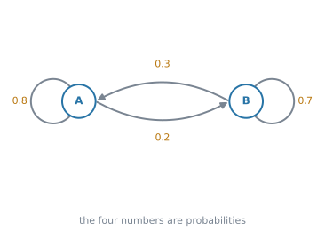
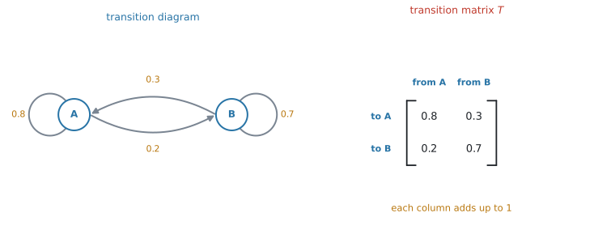
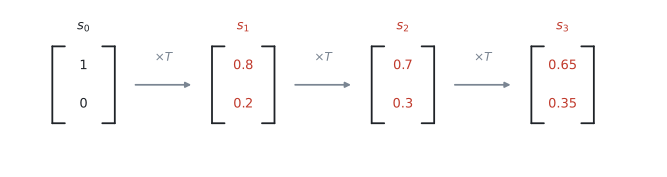
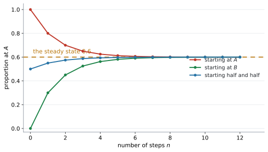
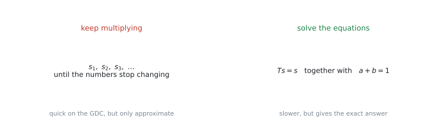
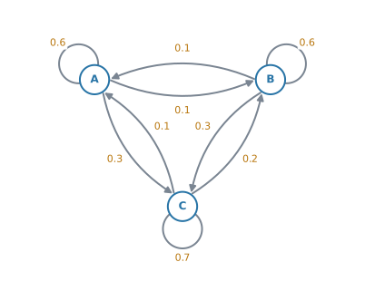
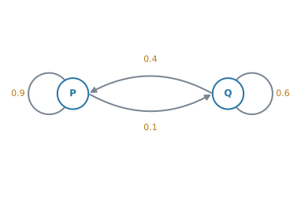
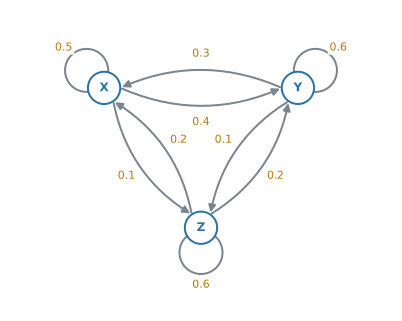

# AHL 4.19 — Transition matrices（推移行列） {#sec-ahl-4-19}

::: {.callout-note}
## What you should be able to do
- **transition diagram**（推移図）から **transition matrix**（推移行列）$T$ を作れる。**列の和が $1$** になることを確かめられる。
- **state matrix**（状態行列）$s_0$ を、縦に並べた確率として書ける。
- $n$ 回後の状態を $s_n = T^{n}s_0$ で求められる。
- **regular Markov chain**（正則マルコフ連鎖）が何かを言える。
- **steady state**（定常状態）を、$2$ 通りの方法で求められる。
- steady state が、**eigenvalue**（固有値）$1$ に対する **eigenvector**（固有ベクトル）を「成分の和が $1$」にそろえたものだと分かる。
- 答えを、割合ではなく**人数や個数**に直して、文脈の言葉で説明できる。
:::

::: {.callout-note}
## $3$ つのページの続きです
この項目は、すでに書いた $3$ つのページの上に立っています。

- [AHL 1.14](../01-number-and-algebra/ahl-1-14.qmd) … 行列の**かけ算**と**累乗**
- [AHL 1.15](../01-number-and-algebra/ahl-1-15.qmd) … **eigenvalue**（固有値）と **eigenvector**（固有ベクトル）
- [AHL 3.15](../03-geometry-and-trigonometry/ahl-3-15.qmd#transition) … transition matrix の**作り方**と、列が「どこから」という向きの約束

新しいのは、**その行列を何度も掛けたら何が起こるか**という $1$ 点です。
:::

## The idea

この項目は、**「毎年これくらいの割合で移る」という状況が、長い目で見てどこに落ち着くか**を調べる項目です。

### 1. state と transition {#states}

まず場面を $1$ つ決めます。

> ある町にスーパーが $2$ 軒、$A$ と $B$ があります。ある月に $A$ で買った人のうち、次の月も $A$ で買うのは $80\%$、$B$ に移るのは $20\%$ です。$B$ で買った人のうち、$A$ に移るのは $30\%$、$B$ を続けるのは $70\%$ です。

このとき、$A$ と $B$ を **state**（状態）といい、$1$ か月ごとの移り変わりを **transition**（推移）といいます。

**この $1$ か月の移り方は、毎月同じ**とします。これが、この項目のいちばん大事な前提です。

### 2. transition diagram に整理します {#diagram}

矢印と確率で書いた図を **transition diagram**（推移図）といいます。

{#fig-ahl419-diagram width=72%}

@fig-ahl419-diagram の自分にもどる矢印（self-loop）が「そのまま残る」割合です。

::: {.callout-tip}
## $1$ つの state から出る矢印を、足して確かめてください
$A$ から出るのは $0.8$（残る）と $0.2$（移る）で、足すと $1$ です。$B$ も $0.3 + 0.7 = 1$ です。

**出ていく先の確率は、必ず合計 $1$** になります。問題文から読み取ったあと、まずここを見てください。$1$ にならなければ、読み落としがあります。
:::

### 3. transition matrix を作ります {#matrix}

図を行列に書き直します。作り方は [AHL 3.15](../03-geometry-and-trigonometry/ahl-3-15.qmd#transition) と同じです。

{#fig-ahl419-matrix width=100%}

$$
T = \begin{pmatrix} 0.8 & 0.3 \\ 0.2 & 0.7 \end{pmatrix}
$$ {#eq-ahl419-T}

::: {.callout-important}
## 列が「どこから」、行が「どこへ」です
シラバスは、こう書いています。

> $T_{ij}$ representing the probability of moving from state $j$ to state $i$

$1$ 列目は「**$A$ から**どこへ行くか」です。上から順に「$A$ へ $0.8$」「$B$ へ $0.2$」。

**$1$ 行目ではありません。** ここを取りちがえると、以後の計算が全部ずれます。

**検算は列の和です。** どの列も $1$ になっていなければ、作り方を間違えています。
:::

### 4. state matrix と、$1$ 回分の推移 {#state}

いまどこにいるかを、**縦に並べた確率**で書きます。これを **state matrix**（状態行列）といいます。

はじめに全員が $A$ で買っているなら

$$
s_0 = \begin{pmatrix} 1 \\ 0 \end{pmatrix}
$$

です。半分ずつなら $\begin{pmatrix} 0.5 \\ 0.5 \end{pmatrix}$ です。**成分の和は、いつも $1$** になります。

$1$ か月後の状態は、$T$ を**左から**掛けるだけです。

$$
s_1 = T s_0 = \begin{pmatrix} 0.8 & 0.3 \\ 0.2 & 0.7 \end{pmatrix}\begin{pmatrix} 1 \\ 0 \end{pmatrix} = \begin{pmatrix} 0.8 \\ 0.2 \end{pmatrix}
$$

$1$ か月後は、$80\%$ が $A$、$20\%$ が $B$ です。

**もう $1$ か月進めるには、また $T$ を掛けます。**

{#fig-ahl419-steps width=98%}

$$
s_2 = T s_1 = \begin{pmatrix} 0.7 \\ 0.3 \end{pmatrix}, \qquad
s_3 = T s_2 = \begin{pmatrix} 0.65 \\ 0.35 \end{pmatrix}
$$

### 5. $n$ 回後は $s_n = T^{n}s_0$ です {#power}

$T$ を $n$ 回掛けるということは、$T^{n}$ を $1$ 回掛けることと同じです。

$$
s_n = T^{n}s_0
$$ {#eq-ahl419-power}

::: {.callout-important}
## この式は、公式集に載っています
公式集の **AHL 4.19** の欄には、この式がそのまま印刷されています。

> $s_n = T^{n}s_0$, where $s_0$ is the initial state

**覚える必要はありません。** 覚えるべきなのは、**$s_0$ が右、$T^{n}$ が左**という順番のほうです。逆に書くと、そもそも計算ができません（[AHL 1.14](../01-number-and-algebra/ahl-1-14.qmd#dimension)）。
:::

$n$ が大きいときは、電卓で $T^{n}$ を出します（[GDC 第2節](#gdc-power)）。

$$
s_4 = T^{4}s_0 = \begin{pmatrix} 0.625 \\ 0.375 \end{pmatrix}, \qquad
s_{10} = T^{10}s_0 = \begin{pmatrix} 0.6003\ldots \\ 0.3996\ldots \end{pmatrix}
$$

**$0.6$ と $0.4$ に近づいていくのが見えます。** これが次の節の話です。

### 6. regular Markov chain {#regular}

このような「毎回同じ確率で移り変わる仕組み」を **Markov chain**（マルコフ連鎖）といいます。

さらに、**$T$ を何乗かすると成分が全部 $0$ より大きくなる**とき、その Markov chain は **regular**（正則）であるといいます。

@eq-ahl419-T の $T$ は、$1$ 乗の時点で $4$ つとも正なので regular です。

**regular なら、$n$ を大きくしたときに $s_n$ が $1$ つの決まった状態に近づきます。** しかも、**どこから出発しても同じところ**に行きます。

{#fig-ahl419-converge width=82%}

@fig-ahl419-converge は、$3$ つの違う出発点から始めたものです。$A$ から始めても、$B$ から始めても、半分ずつから始めても、**$8$ か月ほどで同じ $0.6$ に重なります。**

::: {.callout-warning}
## regular でないと、落ち着かないことがあります
$T = \begin{pmatrix} 0 & 1 \\ 1 & 0 \end{pmatrix}$ は「必ずもう一方へ移る」という仕組みです。列の和はどちらも $1$ ですが、$T^{2}$ は単位行列にもどってしまい、**何乗しても $0$ が消えません。**

このとき $s_n$ は $\begin{pmatrix} 1 \\ 0 \end{pmatrix}$ と $\begin{pmatrix} 0 \\ 1 \end{pmatrix}$ を行き来するだけで、**どこにも落ち着きません。**

試験に出る問題はほとんど regular ですが、**「落ち着く」と言えるのは regular のときだけ**だと知っておいてください。
:::

### 7. steady state の求め方は $2$ 通りあります {#steady}

落ち着いた先の状態を **steady state**（定常状態）といいます。**$T$ を掛けても動かない状態**、つまり

$$
Ts = s
$$ {#eq-ahl419-steady}

を満たす $s$ です。求め方は $2$ つあります。

{#fig-ahl419-steady width=100%}

#### 方法1：何度も掛ける {#repeat}

$T^{20}$ や $T^{50}$ を電卓で出して、$s_0$ に掛けます。数字が変わらなくなったら、そこが steady state です。

**速いですが、出てくるのは近似値です。**

#### 方法2：方程式を解く {#equations}

$s = \begin{pmatrix} a \\ b \end{pmatrix}$ とおいて、@eq-ahl419-steady を成分で書きます。

$$
0.8a + 0.3b = a
$$
$$
0.2a + 0.7b = b
$$

この $2$ 本は、実は**同じことを言っています**（片方を整理すると、もう片方になります）。ですから、これだけでは $a$ と $b$ が決まりません。

そこで、**もう $1$ 本足します。**

$$
a + b = 1
$$ {#eq-ahl419-sumone}

確率の合計は $1$ だからです。$1$ 本目と @eq-ahl419-sumone を連立させて解くと

$$
a = 0.6, \qquad b = 0.4
$$

**検算。** $T\begin{pmatrix} 0.6 \\ 0.4 \end{pmatrix} = \begin{pmatrix} 0.48 + 0.12 \\ 0.12 + 0.28 \end{pmatrix} = \begin{pmatrix} 0.6 \\ 0.4 \end{pmatrix}$ ✓ 動きません。

::: {.callout-important}
## $a + b = 1$ を忘れると、答えが出ません
steady state の設問で、よくある失点です。

$Ts = s$ だけでは、$s = \begin{pmatrix} 0 \\ 0 \end{pmatrix}$ も、$\begin{pmatrix} 1.2 \\ 0.8 \end{pmatrix}$ も条件を満たしてしまいます。**確率として意味があるのは、合計が $1$ のものだけ**です。

シラバスは `Examination questions will state when exact solutions obtained from solving equations are required` と書いています。**`exact` と書かれていたら、方法2**です。
:::

### 8. steady state は、固有値 $1$ の eigenvector です {#eigen}

@eq-ahl419-steady の $Ts = s$ を、もう一度見てください。

$$
Ts = 1 \cdot s
$$

これは [AHL 1.15](../01-number-and-algebra/ahl-1-15.qmd) で見た **eigenvector の式そのもの**です。固有値が $1$ の場合になっています。

シラバスも、こう書いています。

> Awareness that the solution is the eigenvector corresponding to the eigenvalue equal to $1$

@eq-ahl419-T の $T$ の固有値は $1$ と $0.5$ です。固有値 $1$ の eigenvector は $\begin{pmatrix} 3 \\ 2 \end{pmatrix}$（の定数倍）で、**成分の和が $1$ になるように $5$ で割ると**

$$
\begin{pmatrix} 0.6 \\ 0.4 \end{pmatrix}
$$

steady state と一致します ✓

::: {.callout-note}
## transition matrix には、必ず固有値 $1$ があります
列の和がどれも $1$ だからです。ですから、steady state は**必ず存在します**。

ただし「そこに近づいていく」と言えるのは、[regular](#regular) のときだけです。$\begin{pmatrix} 0 & 1 \\ 1 & 0 \end{pmatrix}$ にも固有値 $1$ があり、steady state は $\begin{pmatrix} 0.5 \\ 0.5 \end{pmatrix}$ ですが、$s_n$ はそこへ行きません。
:::

## Why it works

:::: {.callout-note collapse="true" appearance="simple"}
## クリックすると開きます
ここで説明するのは、**なぜ $T s$ が次の状態になるのか**、その $1$ 点だけです。

次の月に $A$ にいる人は、$2$ 通りの来かたをします。

- いま $A$ にいて、そのまま残る人 … $0.8 \times (\text{いま } A \text{ の割合})$
- いま $B$ にいて、$A$ に移ってくる人 … $0.3 \times (\text{いま } B \text{ の割合})$

この $2$ つを足したものが、次の月に $A$ にいる割合です。

$$
(\text{次の } A) = 0.8a + 0.3b
$$

これは、$T$ の **$1$ 行目**と $s$ の積そのものです。行列のかけ算は「$1$ 行目と縦ベクトルを掛けて足す」でした（[AHL 1.14](../01-number-and-algebra/ahl-1-14.qmd#howto)）。

**つまり、行列のかけ算が、来かたを全部足す作業をそのまま行っている**わけです。$T$ の $1$ 行目が「$A$ へ来る道」、$2$ 行目が「$B$ へ来る道」を集めています。

行が「どこへ」だったのは、このためです。
::::

## Worked examples

::: {.callout-note appearance="simple"}
問題文は英語です。意味が理解できなかったら、問題文の下の「**日本語訳**」を開いてください。解説は日本語です。
:::

::: {#exm-ahl419-build}
[Each month, $80\%$ of the customers of supermarket $A$ shop there again the next month, and $20\%$ move to supermarket $B$. Of the customers of $B$, $30\%$ move to $A$ and $70\%$ stay at $B$.]{.q-en}

**(a)** [Write down the transition matrix $T$, using the order $A$, $B$.]{.q-en}

**(b)** [This month, half of the customers shop at $A$ and half at $B$. Find the proportion shopping at each supermarket next month.]{.q-en}

<details class="jp-trans">
<summary>日本語訳</summary>

毎月、スーパー $A$ の客のうち $80\%$ は翌月も $A$ で買い、$20\%$ はスーパー $B$ に移ります。$B$ の客のうち、$30\%$ は $A$ に移り、$70\%$ は $B$ を続けます。

**(a)** $A$、$B$ の順で、推移行列 $T$ を書きなさい。

**(b)** 今月は客の半分が $A$、半分が $B$ で買っています。翌月にそれぞれで買う客の割合を求めなさい。

</details>

---

**(a)** [列が「どこから」](#matrix)でした。$1$ 列目は「$A$ から」です。

$$
T = \begin{pmatrix} 0.8 & 0.3 \\ 0.2 & 0.7 \end{pmatrix}
$$

**検算。** $0.8 + 0.2 = 1$、$0.3 + 0.7 = 1$ ✓

**(b)** 「半分ずつ」を state matrix にします。

$$
s_0 = \begin{pmatrix} 0.5 \\ 0.5 \end{pmatrix}
$$

$T$ を左から掛けます。

$$
s_1 = \begin{pmatrix} 0.8 & 0.3 \\ 0.2 & 0.7 \end{pmatrix}\begin{pmatrix} 0.5 \\ 0.5 \end{pmatrix}
= \begin{pmatrix} 0.4 + 0.15 \\ 0.1 + 0.35 \end{pmatrix}
= \begin{pmatrix} 0.55 \\ 0.45 \end{pmatrix}
$$

$A$ が $55\%$、$B$ が $45\%$ です。

**検算。** $0.55 + 0.45 = 1$ ✓ 合計が $1$ にならなければ、どこかで間違えています。

::: {.callout-note}
## 解答例（答案用紙にはこう書く）
**(a)**
$$
T = \begin{pmatrix} 0.8 & 0.3 \\ 0.2 & 0.7 \end{pmatrix}
$$

**(b)**
$$
s_1 = \begin{pmatrix} 0.8 & 0.3 \\ 0.2 & 0.7 \end{pmatrix}\begin{pmatrix} 0.5 \\ 0.5 \end{pmatrix} = \begin{pmatrix} 0.55 \\ 0.45 \end{pmatrix}
$$

*$55\%$ at $A$ and $45\%$ at $B$.*
:::
:::

::: {#exm-ahl419-power}
[The transition matrix $T = \begin{pmatrix} 0.8 & 0.3 \\ 0.2 & 0.7 \end{pmatrix}$ describes the movement of customers each month. This month all $5000$ customers shop at $A$.]{.q-en}

**(a)** [Find the proportion shopping at each supermarket after $4$ months.]{.q-en}

**(b)** [Find the number of customers at each supermarket after $4$ months.]{.q-en}

**(c)** [Find the proportion at each supermarket after $10$ months, giving your answers to three significant figures. Comment on your answer.]{.q-en}

<details class="jp-trans">
<summary>日本語訳</summary>

推移行列 $T = \begin{pmatrix} 0.8 & 0.3 \\ 0.2 & 0.7 \end{pmatrix}$ は、毎月の客の移動を表しています。今月は $5000$ 人の客が全員 $A$ で買っています。

**(a)** $4$ か月後に、それぞれのスーパーで買う客の割合を求めなさい。

**(b)** $4$ か月後の、それぞれのスーパーの客の人数を求めなさい。

**(c)** $10$ か月後の割合を、有効数字 $3$ 桁で求めなさい。その答えについてコメントしなさい。

</details>

---

**(a)** 全員が $A$ なので、$s_0 = \begin{pmatrix} 1 \\ 0 \end{pmatrix}$ です。@eq-ahl419-power を使います。

$$
s_4 = T^{4}\begin{pmatrix} 1 \\ 0 \end{pmatrix} = \begin{pmatrix} 0.625 \\ 0.375 \end{pmatrix}
$$

$T^{4}$ は電卓で出します（[GDC 第2節](#gdc-power)）。

**(b)** 割合に人数を掛けるだけです。

$$
5000 \times 0.625 = 3125, \qquad 5000 \times 0.375 = 1875
$$

**検算。** $3125 + 1875 = 5000$ ✓

**(c)**

$$
s_{10} = T^{10}\begin{pmatrix} 1 \\ 0 \end{pmatrix} = \begin{pmatrix} 0.600390\ldots \\ 0.399609\ldots \end{pmatrix}
$$

有効数字 $3$ 桁で $0.600$ と $0.400$ です。

`Comment on` と言われているので、**数値だけでは点になりません。**

::: {.model-answer}
**試験ではこう書く**

*The proportions have almost stopped changing: after $10$ months they are very close to $0.6$ and $0.4$. The chain is settling down to its steady state.*
:::

（$10$ か月後にはほとんど変化しなくなり、$0.6$ と $0.4$ に非常に近い。定常状態に落ち着きつつある、という意味です。）

::: {.callout-note}
## 解答例（答案用紙にはこう書く）
**(a)**
$$
s_4 = T^{4}\begin{pmatrix} 1 \\ 0 \end{pmatrix} = \begin{pmatrix} 0.625 \\ 0.375 \end{pmatrix}
$$

**(b)**
$$
5000 \times 0.625 = 3125 \ \text{at } A, \qquad 5000 \times 0.375 = 1875 \ \text{at } B
$$

**(c)**
$$
s_{10} = \begin{pmatrix} 0.600 \\ 0.400 \end{pmatrix} \ (3\ \text{s.f.})
$$

*The proportions are settling down to the steady state $0.6$ and $0.4$.*
:::
:::

::: {#exm-ahl419-steady}
[The transition matrix is $T = \begin{pmatrix} 0.8 & 0.3 \\ 0.2 & 0.7 \end{pmatrix}$.]{.q-en}

**(a)** [Find the exact steady state probability matrix.]{.q-en}

**(b)** [Interpret your answer in context, given that there are $5000$ customers in total.]{.q-en}

<details class="jp-trans">
<summary>日本語訳</summary>

推移行列は $T = \begin{pmatrix} 0.8 & 0.3 \\ 0.2 & 0.7 \end{pmatrix}$ です。

**(a)** 定常状態の確率行列を、正確な値で求めなさい。

**(b)** 客が全部で $5000$ 人であるとして、その答えを文脈の中で解釈しなさい。

</details>

---

**(a)** `exact` と書かれているので、[方程式を解く方法](#equations)です。電卓で $T^{50}$ を出す方法では、近似値しか得られません。

$s = \begin{pmatrix} a \\ b \end{pmatrix}$ とおいて、$Ts = s$ を書きます。

$$
0.8a + 0.3b = a
$$

整理すると

$$
-0.2a + 0.3b = 0 \quad \Rightarrow \quad 2a = 3b
$$

これと $a + b = 1$（@eq-ahl419-sumone）を連立させます。$b = 1 - a$ を代入して

$$
2a = 3(1 - a) \quad \Rightarrow \quad 5a = 3 \quad \Rightarrow \quad a = 0.6
$$

$$
b = 0.4
$$

$$
s = \begin{pmatrix} 0.6 \\ 0.4 \end{pmatrix}
$$

**検算。** $T s = \begin{pmatrix} 0.48 + 0.12 \\ 0.12 + 0.28 \end{pmatrix} = \begin{pmatrix} 0.6 \\ 0.4 \end{pmatrix}$ ✓

**(b)** 割合を人数に直し、**それが何を意味するか**を言葉で書きます。

::: {.model-answer}
**試験ではこう書く**

*In the long term, $3000$ customers shop at $A$ and $2000$ shop at $B$ each month. Customers keep moving between the two shops, but these numbers stay the same.*
:::

（長い目で見ると毎月 $3000$ 人が $A$、$2000$ 人が $B$ で買う。客は移り続けるが、この人数は変わらない、という意味です。）

::: {.callout-note}
## 解答例（答案用紙にはこう書く）
**(a)**
$$
0.8a + 0.3b = a \quad \Rightarrow \quad 2a = 3b
$$
$$
a + b = 1 \quad \Rightarrow \quad a = 0.6,\ b = 0.4
$$
$$
s = \begin{pmatrix} 0.6 \\ 0.4 \end{pmatrix}
$$

**(b)** *In the long term $3000$ customers shop at $A$ and $2000$ at $B$.*
:::
:::

::: {#exm-ahl419-three}
[A delivery van is always parked overnight at one of three depots $A$, $B$ and $C$. The transition diagram below shows the probabilities of where it is parked the following night.]{.q-en}

{width=56%}

**(a)** [Write down the transition matrix $T$, using the order $A$, $B$, $C$.]{.q-en}

**(b)** [Tonight the van is at $A$. Find the probability that it is at $C$ two nights later.]{.q-en}

**(c)** [Find the long-term probability that the van is at each depot.]{.q-en}

<details class="jp-trans">
<summary>日本語訳</summary>

ある配送車は、毎晩 $3$ つの車庫 $A$、$B$、$C$ のどれかに停まります。下の推移図は、翌晩どこに停まるかの確率を表しています。

**(a)** $A$、$B$、$C$ の順で、推移行列 $T$ を書きなさい。

**(b)** 今晩、車は $A$ にいます。$2$ 晩後に $C$ にいる確率を求めなさい。

**(c)** それぞれの車庫にいる長期的な確率を求めなさい。

</details>

---

**(a)** $1$ 列目は「**$A$ から**」です。図の $A$ から出る矢印を、上から $A$、$B$、$C$ の順に拾います。$A$ に残るのが $0.6$、$B$ へ $0.1$、$C$ へ $0.3$ です。

$$
T = \begin{pmatrix}
0.6 & 0.1 & 0.1 \\
0.1 & 0.6 & 0.2 \\
0.3 & 0.3 & 0.7
\end{pmatrix}
$$

**検算。** 列の和はすべて $1$ です ✓

**(b)** $s_0 = \begin{pmatrix} 1 \\ 0 \\ 0 \end{pmatrix}$ として、$2$ 回進めます。

$$
s_2 = T^{2}\begin{pmatrix} 1 \\ 0 \\ 0 \end{pmatrix} = \begin{pmatrix} 0.4 \\ 0.18 \\ 0.42 \end{pmatrix}
$$

聞かれているのは $C$ なので、**$3$ 番目の成分**です。

$$
0.42
$$

**どの成分を答えるか**を、最後に確かめてください。

**(c)** `long-term` は steady state のことです。$Ts = s$ と、成分の和が $1$ を連立させます。

$$
s = \begin{pmatrix} 0.2 \\ 0.3 \\ 0.5 \end{pmatrix}
$$

**検算。** $T s$ を計算すると、$1$ 行目が $0.12 + 0.03 + 0.05 = 0.2$ ✓ 同じように $2$ 行目が $0.3$、$3$ 行目が $0.5$ になります。

$3$ 状態の連立方程式は手で解くと大変なので、**電卓で解いて構いません**（[GDC 第4節](#gdc-solve)）。

::: {.callout-note}
## 解答例（答案用紙にはこう書く）
**(a)**
$$
T = \begin{pmatrix} 0.6 & 0.1 & 0.1 \\ 0.1 & 0.6 & 0.2 \\ 0.3 & 0.3 & 0.7 \end{pmatrix}
$$

**(b)**
$$
s_2 = T^{2}\begin{pmatrix} 1 \\ 0 \\ 0 \end{pmatrix} = \begin{pmatrix} 0.4 \\ 0.18 \\ 0.42 \end{pmatrix}
\quad \Rightarrow \quad P(C) = 0.42
$$

**(c)**
$$
s = \begin{pmatrix} 0.2 \\ 0.3 \\ 0.5 \end{pmatrix}
$$
:::
:::

::: {#exm-ahl419-eigen}
[The transition matrix $T = \begin{pmatrix} 0.8 & 0.3 \\ 0.2 & 0.7 \end{pmatrix}$ has eigenvalues $1$ and $0.5$.]{.q-en}

**(a)** [Find an eigenvector corresponding to the eigenvalue $1$.]{.q-en}

**(b)** [Explain how this eigenvector is related to the steady state.]{.q-en}

<details class="jp-trans">
<summary>日本語訳</summary>

推移行列 $T = \begin{pmatrix} 0.8 & 0.3 \\ 0.2 & 0.7 \end{pmatrix}$ の固有値は $1$ と $0.5$ です。

**(a)** 固有値 $1$ に対する固有ベクトルを $1$ つ求めなさい。

**(b)** この固有ベクトルが定常状態とどう関係しているかを説明しなさい。

</details>

---

**(a)** $T\mathbf{v} = 1 \cdot \mathbf{v}$ を解きます（[AHL 1.15](../01-number-and-algebra/ahl-1-15.qmd)）。$\mathbf{v} = \begin{pmatrix} x \\ y \end{pmatrix}$ とおくと

$$
0.8x + 0.3y = x \quad \Rightarrow \quad 0.3y = 0.2x \quad \Rightarrow \quad 2x = 3y
$$

$y = 2$ とすれば $x = 3$ です。

$$
\mathbf{v} = \begin{pmatrix} 3 \\ 2 \end{pmatrix}
$$

**定数倍はどれでも正解です**（[AHL 1.15](../01-number-and-algebra/ahl-1-15.qmd)）。$\begin{pmatrix} 6 \\ 4 \end{pmatrix}$ でも構いません。

**(b)** steady state の式 $Ts = s$ は、$Ts = 1 \cdot s$ と書けます。これは固有値 $1$ の eigenvector の式そのものです。

違いは **$1$ つだけ**で、steady state は確率なので**成分の和が $1$** でなければなりません。

$$
\frac{1}{3 + 2}\begin{pmatrix} 3 \\ 2 \end{pmatrix} = \begin{pmatrix} 0.6 \\ 0.4 \end{pmatrix}
$$

::: {.model-answer}
**試験ではこう書く**

*The steady state satisfies $Ts = s$, which is the eigenvector equation for the eigenvalue $1$. So the steady state is the eigenvector $\begin{pmatrix} 3 \\ 2 \end{pmatrix}$ scaled so that its entries add up to $1$, giving $\begin{pmatrix} 0.6 \\ 0.4 \end{pmatrix}$.*
:::

（定常状態は $Ts = s$ を満たし、これは固有値 $1$ の固有ベクトルの式である。だから定常状態は、成分の和が $1$ になるようにそろえた固有ベクトルである、という意味です。）

::: {.callout-note}
## 解答例（答案用紙にはこう書く）
**(a)**
$$
0.8x + 0.3y = x \quad \Rightarrow \quad 2x = 3y \quad \Rightarrow \quad \mathbf{v} = \begin{pmatrix} 3 \\ 2 \end{pmatrix}
$$

**(b)** *$Ts = s$ is the eigenvector equation for eigenvalue $1$. Scaling $\begin{pmatrix} 3 \\ 2 \end{pmatrix}$ so that the entries add to $1$ gives the steady state $\begin{pmatrix} 0.6 \\ 0.4 \end{pmatrix}$.*
:::
:::

## Common errors

::: {.callout-warning}
## 行と列を取りちがえて $T$ を作る
**この項目で、いちばん多い失点です。** 列が「どこから」、行が「どこへ」でした（[第3節](#matrix)）。

書き終えたら、**列の和が $1$ になっているか**を必ず見てください。$1$ にならない列があれば、向きを取りちがえています。
:::

::: {.callout-warning}
## $s_0 T^{n}$ と書く
順番が逆です。$s_0$ は $2 \times 1$、$T^{n}$ は $2 \times 2$ なので、この順では**内側の数がそろわず、計算そのものが存在しません**（[AHL 1.14](../01-number-and-algebra/ahl-1-14.qmd#dimension)）。

公式集にも $s_n = T^{n}s_0$ と、**$T$ が左**で印刷されています。
:::

::: {.callout-warning}
## $a + b = 1$ を書かずに、$Ts = s$ だけで解こうとする
$Ts = s$ の $2$ 本は同じことを言っているので、これだけでは答えが $1$ つに決まりません（[第7節](#equations)）。

**確率の合計が $1$** という式を、必ず $1$ 本足してください。
:::

::: {.callout-warning}
## `exact` と書いてあるのに、電卓で $T^{50}$ を出す
`exact` は「正確な値で」という指示です。$T^{50}$ から読んだ値は、画面には $0.6$ と出ていても**電卓が丸めた近似値**です。$0.6$ が本当の値だと確かめたことにはならないので、**そのままでは点になりません。**

シラバスも `Examination questions will state when exact solutions obtained from solving equations are required` と書いています。**問題文にこの語があるかを、先に見てください。**
:::

::: {.callout-warning}
## $n$ を $1$ つずらす
「$3$ 年後」なのに $T^{4}$ を計算してしまう誤りです。

$s_0$ が**いまの状態**で、$s_1$ が **$1$ 回進んだあと**です。「$3$ 年後」なら $T^{3}$ です。

問題文が「$2020$ 年に始めて $2023$ 年は」のような書き方をしているときは、**差を取ってから**指数にしてください。
:::

::: {.callout-warning}
## 答える成分をまちがえる
$3$ 状態の問題で $s_2$ を出したあと、聞かれているのが $C$ なのに $1$ 番目の成分を書いてしまう誤りです。

**state の順番を、行列の左に書きこんでおいてください。** $A$、$B$、$C$ と縦に書いておけば、読みまちがえません。
:::

::: {.callout-warning}
## 割合のまま答えて、人数に直さない
問題文が `Find the number of customers` なら、**人数**を答えます。$0.625$ ではなく $3125$ です。

逆に `Find the probability` なら、人数ではなく確率です。**問題文の最後の名詞**を見てください。
:::

::: {.callout-warning}
## 「長期的には全員が $A$ に行く」と考える
$A$ の残る率が $0.8$、$B$ が $0.7$ で $A$ のほうが高いので、そう考えたくなります。

しかし steady state は $0.6$ と $0.4$ で、**$B$ にも人が残り続けます。** 出ていく人と入ってくる人が、つり合っているからです。

**直感ではなく、計算した値を答えてください。**
:::

::: {.callout-warning}
## steady state を「もう誰も動かない」と説明する
steady state でも、**人は毎月移り続けています。** 変わらないのは**割合**だけです。

`Interpret` の設問でここを書けると、答案が強くなります。@exm-ahl419-steady の模範解答を見てください。
:::

## Using your GDC (TI-Nspire CX II)

$T^{10}$ や $3$ 元の連立方程式は、手では厳しいところです。**この項目は、電卓の使い方そのものが中身**になります。

### 1. $T$ と $s_0$ を打ちこむ {#gdc-enter}

[AHL 1.14](../01-number-and-algebra/ahl-1-14.qmd#gdc-enter) と同じ手順です。

```
menu → 7: Matrix & Vector → 1: Create → 1: Matrix
```

$T$ は $2 \times 2$（または $3 \times 3$）、$s_0$ は $2 \times 1$（または $3 \times 1$）です。名前を付けて保存します。

```
ctrl + sto→
```

に続けて `t`、`s` と打っておくと、あとが速くなります。

::: {.callout-tip}
## 確率は小数のまま入れて構いません
$0.8$ や $0.3$ は、そのまま打ってください。分数に直す必要はありません。

ただし **`exact` を求められている問題では、電卓の答えをそのまま書かない**でください（[第7節](#equations)）。
:::

### 2. $T^{n}s_0$ を出す {#gdc-power}

`^` キーで指数を打つだけです。

```
t^4 * s
t^10 * s
```

**$T^{n}$ を先に出してから $s_0$ を掛けても、同じ答え**になります。どちらでも構いません。

::: {.callout-warning}
## `s * t^4` と打つとエラーになります
$2 \times 1$ に $2 \times 2$ は掛けられないので、`Invalid dimensions` と出ます。

**行列がいつも左**です。
:::

### 3. steady state を、近似で見る {#gdc-limit}

大きい $n$ を入れて、数字が動かなくなるのを見ます。

```
t^30 * s
t^50 * s
```

$2$ つが同じに見えたら、そこが steady state です。**`exact` と書かれていない問題では、これで十分**です。

::: {.callout-tip}
## $T^{n}$ そのものを見ると、もっとはっきりします
$n$ を大きくすると、**$T^{n}$ の列がどれも同じ**になっていきます。

```
t^50
```

$\begin{pmatrix} 0.6 & 0.6 \\ 0.4 & 0.4 \end{pmatrix}$ に近づきます。**どの列も同じ**ということは、[どこから出発しても同じところに行く](#regular)ということです。@fig-ahl419-converge を、数字で見たものになります。
:::

### 4. 連立方程式で、正確に解く {#gdc-solve}

`exact` のときは、方程式を解きます。$2$ 状態なら手で解けますが、$3$ 状態では電卓が確実です。

```
menu → Algebra → Solve System of Linear Equations
```

式の数を聞かれるので、**状態の数と同じ**を入れます。$3$ 状態なら $3$ 本です。

$Ts = s$ から $2$ 本、合計が $1$ の式を $1$ 本、あわせて $3$ 本を入れます。

```
0.6a + 0.1b + 0.1c = a
0.1a + 0.6b + 0.2c = b
a + b + c = 1
```

::: {.callout-warning}
## $Ts = s$ の式を、全部は入れないでください
$3$ 状態なら $Ts = s$ から $3$ 本出ますが、そのうち **$1$ 本は残りの $2$ 本から作れてしまいます。**

$3$ 本全部と $a+b+c=1$ の合計 $4$ 本を入れると、電卓が扱えない形になることがあります。**$Ts = s$ から $2$ 本＋合計の式 $1$ 本**にしてください。
:::

### 5. eigenvector から出す {#gdc-eigen}

[AHL 1.15](../01-number-and-algebra/ahl-1-15.qmd) の機能も使えます。

```
menu → Matrix & Vector → Advanced → Eigenvectors
```

固有値 $1$ に対応する列を読み、**成分の和が $1$ になるように割ります。**

::: {.callout-note}
## 電卓の eigenvector は、長さ $1$ にそろえて返ってきます
成分の和ではなく、**$\sqrt{x^{2} + y^{2}} = 1$** になるようにそろえられて出てきます。$\begin{pmatrix} 0.832\ldots \\ 0.554\ldots \end{pmatrix}$ のような形です。

**そのままでは steady state ではありません。** 足して $1$ になるように割り直してください。$0.832 + 0.554 = 1.386$ で割ると $0.6$ と $0.4$ になります。
:::

## Exercises

::: {.callout-note appearance="simple"}
各問題に、折りたたみが3つ付いています。**日本語訳**、**解答例**（答案用紙に書くべきこと。英語です）、**解説**（なぜそうなるか。日本語です）。

まず自分で解いて、次に解答例と見くらべてください。**解説は、合わなかったときだけ開けば十分です。**
:::

::: {.exercise-block}

[1]{.ex-no} [Three matrices are given below.]{.q-en}

$$
P = \begin{pmatrix} 0.3 & 0.6 \\ 0.7 & 0.4 \end{pmatrix}, \qquad
Q = \begin{pmatrix} 0.3 & 0.6 \\ 0.7 & 0.3 \end{pmatrix}, \qquad
R = \begin{pmatrix} 0.5 & 0.25 \\ 0.5 & 0.75 \end{pmatrix}
$$

[State which of these could be a transition matrix, giving a reason for each answer.]{.q-en}

<details class="jp-trans">
<summary>日本語訳</summary>

$3$ つの行列が下に与えられています。

これらのうちどれが推移行列になりうるかを述べ、それぞれについて理由を書きなさい。

</details>

::: {.callout-note collapse="true"}
## 解答例（答案用紙に書くこと）
*$P$ and $R$ could be transition matrices: every column adds up to $1$ and no entry is negative.*

*$Q$ could not: the second column gives $0.6 + 0.3 = 0.9 \neq 1$.*
:::

::: {.callout-tip collapse="true"}
## 解説
見るのは**列**です（[第3節](#matrix)）。行ではありません。

- $P$ … $0.3+0.7 = 1$、$0.6+0.4 = 1$ ✓
- $Q$ … $0.3+0.7 = 1$ ですが、$0.6+0.3 = 0.9$ ✗
- $R$ … $0.5+0.5 = 1$、$0.25+0.75 = 1$ ✓

`giving a reason` と書かれているので、**どの列が合わないか**まで書いてください。「$Q$ は違う」だけでは点になりません。
:::

::: {.ex-sep}
:::

[2]{.ex-no} [A machine is in one of two states, $P$ (working) or $Q$ (broken), at the start of each day. The transition diagram is shown below.]{.q-en}

{width=52%}

**(a)** [Write down the transition matrix $T$, using the order $P$, $Q$.]{.q-en}

**(b)** [Today, the probability that the machine is working is $0.7$. Find the probability that it is working tomorrow.]{.q-en}

<details class="jp-trans">
<summary>日本語訳</summary>

ある機械は、毎日のはじめに $P$（稼働中）か $Q$（故障中）のどちらかの状態にあります。推移図が下に示されています。

**(a)** $P$、$Q$ の順で推移行列 $T$ を書きなさい。

**(b)** 今日、機械が稼働している確率は $0.7$ です。明日稼働している確率を求めなさい。

</details>

::: {.callout-note collapse="true"}
## 解答例（答案用紙に書くこと）
**(a)**
$$
T = \begin{pmatrix} 0.9 & 0.4 \\ 0.1 & 0.6 \end{pmatrix}
$$

**(b)**
$$
s_1 = \begin{pmatrix} 0.9 & 0.4 \\ 0.1 & 0.6 \end{pmatrix}\begin{pmatrix} 0.7 \\ 0.3 \end{pmatrix} = \begin{pmatrix} 0.75 \\ 0.25 \end{pmatrix}
$$

*The probability that it is working tomorrow is $0.75$.*
:::

::: {.callout-tip collapse="true"}
## 解説
**(a)** $1$ 列目は「$P$ から」です。$P$ に残るのが $0.9$、$Q$ へ行くのが $0.1$。$2$ 列目は「$Q$ から」で、$P$ へ $0.4$、$Q$ に残るのが $0.6$ です。

**検算。** $0.9+0.1 = 1$、$0.4+0.6 = 1$ ✓

**(b)** 「稼働の確率が $0.7$」なら、故障は $0.3$ です。**$s_0$ の成分は合計 $1$** になります。

$$
0.9(0.7) + 0.4(0.3) = 0.63 + 0.12 = 0.75
$$
:::

::: {.ex-sep}
:::

[3]{.ex-no} [For the machine in question 2, the machine is working today. Find the probability that it is working $5$ days later, giving your answer to three significant figures.]{.q-en}

<details class="jp-trans">
<summary>日本語訳</summary>

問題 2 の機械について、今日は稼働しています。$5$ 日後に稼働している確率を、有効数字 $3$ 桁で求めなさい。

</details>

::: {.callout-note collapse="true"}
## 解答例（答案用紙に書くこと）
$$
s_5 = T^{5}\begin{pmatrix} 1 \\ 0 \end{pmatrix} = \begin{pmatrix} 0.80625 \\ 0.19375 \end{pmatrix}
$$

*The probability is $0.806$ (3 s.f.).*
:::

::: {.callout-tip collapse="true"}
## 解説
「今日は稼働している」ので $s_0 = \begin{pmatrix} 1 \\ 0 \end{pmatrix}$ です。

$5$ 日後なので $T^{5}$ です。$T^{6}$ ではありません（[Common errors](#common-errors)）。

電卓で `t^5 * s` と打つだけです（[GDC 第2節](#gdc-power)）。
:::

::: {.ex-sep}
:::

[4]{.ex-no} [For the machine in question 2, find the exact long-term probability that the machine is working.]{.q-en}

<details class="jp-trans">
<summary>日本語訳</summary>

問題 2 の機械について、長期的に稼働している確率を、正確な値で求めなさい。

</details>

::: {.callout-note collapse="true"}
## 解答例（答案用紙に書くこと）
$$
0.9a + 0.4b = a \quad \Rightarrow \quad 0.4b = 0.1a \quad \Rightarrow \quad a = 4b
$$
$$
a + b = 1 \quad \Rightarrow \quad 4b + b = 1 \quad \Rightarrow \quad b = 0.2,\ a = 0.8
$$

*The long-term probability that the machine is working is $0.8$.*
:::

::: {.callout-tip collapse="true"}
## 解説
`exact` があるので、[方程式を解きます](#equations)。$T^{50}$ を電卓で出す方法では点になりません。

$Ts = s$ の $1$ 本目と、$a + b = 1$ を連立させます。

**検算。** $T\begin{pmatrix} 0.8 \\ 0.2 \end{pmatrix} = \begin{pmatrix} 0.72 + 0.08 \\ 0.08 + 0.12 \end{pmatrix} = \begin{pmatrix} 0.8 \\ 0.2 \end{pmatrix}$ ✓
:::

::: {.ex-sep}
:::

[5]{.ex-no} [A bird is observed each morning at one of three feeding sites $X$, $Y$ and $Z$. The transition diagram is shown below.]{.q-en}

{width=54%}

**(a)** [Write down the transition matrix $T$, using the order $X$, $Y$, $Z$.]{.q-en}

**(b)** [On day $0$ the probabilities of the bird being at $X$, $Y$ and $Z$ are $0.5$, $0.25$ and $0.25$. Find the probability that it is at $Y$ on day $2$.]{.q-en}

<details class="jp-trans">
<summary>日本語訳</summary>

ある鳥が、毎朝 $3$ つの餌場 $X$、$Y$、$Z$ のどれかで観察されます。推移図が下に示されています。

**(a)** $X$、$Y$、$Z$ の順で推移行列 $T$ を書きなさい。

**(b)** $0$ 日目に、鳥が $X$、$Y$、$Z$ にいる確率は $0.5$、$0.25$、$0.25$ です。$2$ 日目に $Y$ にいる確率を求めなさい。

</details>

::: {.callout-note collapse="true"}
## 解答例（答案用紙に書くこと）
**(a)**
$$
T = \begin{pmatrix} 0.5 & 0.3 & 0.2 \\ 0.4 & 0.6 & 0.2 \\ 0.1 & 0.1 & 0.6 \end{pmatrix}
$$

**(b)**
$$
s_2 = T^{2}\begin{pmatrix} 0.5 \\ 0.25 \\ 0.25 \end{pmatrix} = \begin{pmatrix} 0.3525 \\ 0.435 \\ 0.2125 \end{pmatrix}
$$

*The probability that the bird is at $Y$ on day $2$ is $0.435$.*
:::

::: {.callout-tip collapse="true"}
## 解説
**(a)** $1$ 列目は「$X$ から」です。$X$ に残るのが $0.5$、$Y$ へ $0.4$、$Z$ へ $0.1$。

**検算。** どの列も合計 $1$ ✓

**(b)** 聞かれているのは $Y$ なので、**$2$ 番目の成分**です。$0.3525$ ではありません。

**検算。** $0.3525 + 0.435 + 0.2125 = 1$ ✓
:::

::: {.ex-sep}
:::

[6]{.ex-no} [For the bird in question 5, find the long-term probability of being at each site.]{.q-en}

<details class="jp-trans">
<summary>日本語訳</summary>

問題 5 の鳥について、それぞれの餌場にいる長期的な確率を求めなさい。

</details>

::: {.callout-note collapse="true"}
## 解答例（答案用紙に書くこと）
$$
s = \begin{pmatrix} 0.35 \\ 0.45 \\ 0.2 \end{pmatrix}
$$
:::

::: {.callout-tip collapse="true"}
## 解説
`exact` とは書かれていないので、**どちらの方法でも構いません**（[第7節](#steady)）。

電卓で `t^40` を出して列を読むか、連立方程式を解きます（[GDC 第4節](#gdc-solve)）。

$$
0.5a + 0.3b + 0.2c = a, \qquad 0.4a + 0.6b + 0.2c = b
$$
$$
a + b + c = 1
$$

**検算。** $T s$ の $1$ 行目は $0.175 + 0.135 + 0.04 = 0.35$ ✓ 合計も $0.35+0.45+0.2 = 1$ ✓
:::

::: {.ex-sep}
:::

[7]{.ex-no} [A transition matrix is given by $S = \begin{pmatrix} 0 & 1 \\ 1 & 0 \end{pmatrix}$, with initial state $s_0 = \begin{pmatrix} 1 \\ 0 \end{pmatrix}$.]{.q-en}

**(a)** [Find $s_1$, $s_2$ and $s_3$.]{.q-en}

**(b)** [Explain why this Markov chain does not settle down to a steady state.]{.q-en}

<details class="jp-trans">
<summary>日本語訳</summary>

推移行列が $S = \begin{pmatrix} 0 & 1 \\ 1 & 0 \end{pmatrix}$、初期状態が $s_0 = \begin{pmatrix} 1 \\ 0 \end{pmatrix}$ で与えられています。

**(a)** $s_1$、$s_2$、$s_3$ を求めなさい。

**(b)** このマルコフ連鎖が定常状態に落ち着かない理由を説明しなさい。

</details>

::: {.callout-note collapse="true"}
## 解答例（答案用紙に書くこと）
**(a)**
$$
s_1 = \begin{pmatrix} 0 \\ 1 \end{pmatrix}, \qquad s_2 = \begin{pmatrix} 1 \\ 0 \end{pmatrix}, \qquad s_3 = \begin{pmatrix} 0 \\ 1 \end{pmatrix}
$$

**(b)** *The chain is not regular: $S^{2}$ is the identity matrix, so every power of $S$ still contains zeros. The state alternates between $\begin{pmatrix} 1 \\ 0 \end{pmatrix}$ and $\begin{pmatrix} 0 \\ 1 \end{pmatrix}$ and never approaches a single state.*
:::

::: {.callout-tip collapse="true"}
## 解説
**(a)** $S$ は「必ずもう一方へ移る」という行列です。$1$ 回ごとに入れかわるだけです。

**(b)** 理由は $2$ つ書けます。**行き来しているという事実**と、**regular でないこと**です（[第6節](#regular)）。

$S^{2} = I$、$S^{3} = S$、$S^{4} = I$ … と、$0$ がずっと残ります。

なお、この $S$ にも steady state $\begin{pmatrix} 0.5 \\ 0.5 \end{pmatrix}$ は**存在します**。$Ss = s$ を解けば出てきます。**存在することと、そこへ近づくことは別**です（[第8節](#eigen)）。
:::

::: {.ex-sep}
:::

[8]{.ex-no} [A city has $20\ 000$ commuters. Each uses the bus, the train or a bicycle. The long-term probabilities of using each are $0.2$, $0.3$ and $0.5$.]{.q-en}

**(a)** [Find the long-term number of commuters using each form of transport.]{.q-en}

**(b)** [A student says: "In the long term nobody changes how they travel." Comment on this statement.]{.q-en}

<details class="jp-trans">
<summary>日本語訳</summary>

ある都市には $20\ 000$ 人の通勤者がいます。それぞれバス、電車、自転車のいずれかを使います。それぞれを使う長期的な確率は $0.2$、$0.3$、$0.5$ です。

**(a)** それぞれの交通手段を使う通勤者の長期的な人数を求めなさい。

**(b)** ある生徒が「長期的には、誰も交通手段を変えない」と言いました。この発言についてコメントしなさい。

</details>

::: {.callout-note collapse="true"}
## 解答例（答案用紙に書くこと）
**(a)**
$$
20\,000 \times 0.2 = 4000 \ \text{(bus)}
$$
$$
20\,000 \times 0.3 = 6000 \ \text{(train)}
$$
$$
20\,000 \times 0.5 = 10\,000 \ \text{(bicycle)}
$$

**(b)** *The statement is not correct. Commuters do keep changing how they travel, but the numbers changing in each direction balance out, so the totals stay at $4000$, $6000$ and $10\,000$.*
:::

::: {.callout-tip collapse="true"}
## 解説
**(a)** 確率に人数を掛けるだけです。**検算。** $4000 + 6000 + 10\,000 = 20\,000$ ✓

**(b)** ここがこの項目の**いちばん大事な理解**です。steady state は「誰も動かない」という意味ではありません。

**動いている人はいるけれど、出ていく人と入ってくる人がつり合っている**ので、人数が変わらないのです。

`Comment on` なので、**正しくない理由**まで書いてください。「違います」だけでは点になりません。
:::

:::
