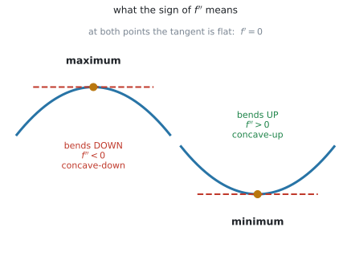
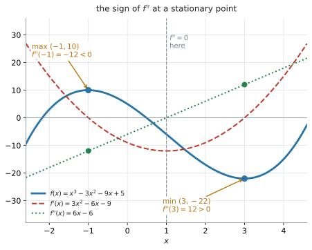
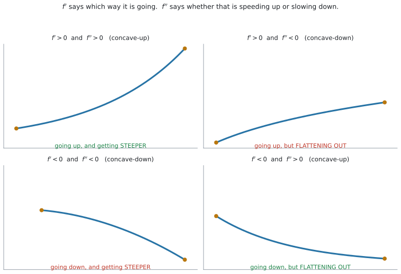

# AHL 5.10 — The second derivative（2階導関数） {#sec-ahl-5-10}

::: {.callout-note}
## What you should be able to do
- $f''(x)$、$\dfrac{d^{2}y}{dx^{2}}$、$\ddot{x}$ という書き方を読み、使い分けられる。
- **$2$ 回続けて微分**して、second derivative を求められる。
- **second derivative test** を使って、stationary point が maximum か minimum かを決められる。
- $f''(a) = 0$ のときは **この test では決まらない**ことを知り、$f'$ の符号に切り替えられる。
- **concave-up**（$f'' > 0$）と **concave-down**（$f'' < 0$）を使い分けられる。
- $f'$ と $f''$ の符号を合わせて読み、**「増えているが、増え方は鈍っている」**のような説明を英語で書ける。
:::

## The idea

### 1. $2$ 回微分するだけです {#idea}

**second derivative**（$2$ 階導関数）は、**導関数をもう $1$ 回微分したもの**です。

$$
f(x) \ \xrightarrow{\ \text{微分}\ } \ f'(x) \ \xrightarrow{\ \text{微分}\ } \ f''(x)
$$

たとえば $f(x) = x^{3} - 3x^{2} - 9x + 5$ なら

$$
f'(x) = 3x^{2} - 6x - 9
$$

$$
f''(x) = 6x - 6
$$

です。$1$ 回目も $2$ 回目も、使うのは同じべき乗の公式です（[SL 5.3](../../ai-sl/05-calculus/sl-5-3.qmd#rule)）。

::: {.callout-tip}
## $f'$ を書いてから、それを微分してください
$f''$ を「$f$ から一気に」出そうとしないでください。**必ず $f'$ を紙に書いてから**、その式を微分します。

途中の $f'$ は、あとで stationary point を求めるときにも使います。**書いておけば $2$ 度使えます。**
:::

#### Second derivative の書き方は $3$ 通りあります {#notation}

シラバスは、Guidance 欄でこう書いています。

> Both forms of notation, $\dfrac{d^{2}y}{dx^{2}}$ and $f''(x)$ for the second derivative.

| 書き方 | 読み方 | よく使う場面 |
|---|---|---|
| $f''(x)$ | エフ・ダブルプライム・エックス | $f(x) = \ldots$ と書かれているとき |
| $\dfrac{d^{2}y}{dx^{2}}$ | ディー $2$ ワイ・ディーエックス $2$ 乗 | $y = \ldots$ と書かれているとき |
| $\ddot{x}$ | エックス・ツードット | 時間 $t$ で $2$ 回微分するとき |

: $3$ つの書き方 {#tbl-ahl510-notation}

**どれも同じもの**です。問題文が使っている書き方に合わせて答えてください。

::: {.callout-warning}
## $\dfrac{d^{2}y}{dx^{2}}$ の $2$ の位置に注意してください
上は $d^{2}y$、下は $dx^{2}$ です。**上は $d$ の右肩、下は $x$ の右肩**につきます。

$\left(\dfrac{dy}{dx}\right)^{2}$ とはまったく別のものです。$\left(\dfrac{dy}{dx}\right)^{2}$ は「傾きを $2$ 乗した数」で、$\dfrac{d^{2}y}{dx^{2}}$ は「もう $1$ 回微分したもの」です。
:::

$\ddot{x}$ の書き方は [AHL 5.13](ahl-5-13.qmd#dot) でも使います。**点の数が、微分した回数**です。

### 2. $f''$ は「$f'$ がどう変わっているか」を表します {#meaning}

**この節が、この項目の中心です。** ここが分かれば、あとは全部そこから出てきます。

$f''$ は $f'$ を微分したものでした。ですから $f''$ が表しているのは、**$f'$（接線の傾き）がどのように変化しているか**です。

$$
f''(x) > 0 \quad \Longrightarrow \quad f'(x) \ \text{は、どんどん増えている}
$$

$$
f''(x) < 0 \quad \Longrightarrow \quad f'(x) \ \text{は、どんどん減っている}
$$

**$f''$ が見ているのは $f$ ではなく、$f'$ です。** ここを取り違えないでください。

#### stationary point で何が起きるか {#turning}

stationary point（停留点）は、$f'(a) = 0$ となる点でした（[SL 5.6](../../ai-sl/05-calculus/sl-5-6.qmd#stationary)）。そこで $f''$ の符号を見ると、山か谷かが決まります。

**$f''(a) > 0$ のとき。** $f'$ は増えていきます。その $f'$ が $a$ で $0$ を通るのですから、$f'$ は**負から正へ**変わります。

$$
f' : \quad - \ \longrightarrow \ 0 \ \longrightarrow \ +
$$

傾きが「下り → 平ら → 上り」と変わるのですから、$f$ のグラフはそこで**谷**です。つまり **minimum** です。

**$f''(a) < 0$ のとき。** $f'$ は減っていきます。その $f'$ が $a$ で $0$ を通るのですから、$f'$ は**正から負へ**変わります。

$$
f' : \quad + \ \longrightarrow \ 0 \ \longrightarrow \ -
$$

「上り → 平ら → 下り」ですから、$f$ のグラフはそこで**山**、つまり **maximum** です。

{#fig-ahl510-shape width=70%}

@fig-ahl510-shape が、いま説明した $2$ つです。どちらの点でも接線は水平（$f' = 0$）で、**違うのは曲がり方だけ**です。

| stationary point | 曲線の形 | $f''$ の符号 |
|---|---|---|
| **maximum**（山） | 上に出っぱる。$\cap$ の形 | **負** |
| **minimum**（谷） | 下にへこむ。$\cup$ の形 | **正** |

: 形と符号 {#tbl-ahl510-shape}

::: {.callout-tip}
## $\cup$ の形が「正」です
$\cup$ は**上を向いた入れ物**の形です。上向き＝正、と結びつけてください。$f'' > 0$ のとき、その形になります。

山（$\cap$）はその逆さまなので、負です。
:::

### 3. concave-up と concave-down {#concavity}

第2節では、**stationary point での** $f''$ の符号を見ました。じつは $f''$ の符号は、**stationary point でなくても**意味があります。$f'$ が増えているか減っているかは、どこででも言えるからです。

シラバスは、この $2$ 語を名指ししています。

> Use of the terms "concave-up" for $f''(x) > 0$, and "concave-down" for $f''(x) < 0$.

$$
f''(x) > 0 \ \Rightarrow \ \textbf{concave-up}（下に凸）
\qquad\qquad
f''(x) < 0 \ \Rightarrow \ \textbf{concave-down}（上に凸）
$$ {#eq-ahl510-concave}

**日本の教科書の「下に凸」「上に凸」と同じもの**です。ただし試験は英語なので、**concave-up / concave-down のほうを覚えてください。**

::: {.callout-warning}
## 「上」「下」が日本語と英語で逆に聞こえます
- **concave-up** … $\cup$ の形。日本語では「**下**に凸」
- **concave-down** … $\cap$ の形。日本語では「**上**に凸」

英語は「どちらへ**曲がっている**か」、日本語は「どちらへ**出っぱっている**か」で言っています。**訳語で覚えようとせず、$\cup$ と $\cap$ の形で覚えてください。**
:::

さきほどの $f(x) = x^{3} - 3x^{2} - 9x + 5$ なら、$f''(x) = 6x - 6$ です。

$$
6x - 6 > 0 \quad \Longleftrightarrow \quad x > 1
$$

ですから **$x > 1$ で concave-up、$x < 1$ で concave-down** です。

### 4. second derivative test — 山か谷かを $1$ 回の代入で決めます {#test}

第2節で見たことを、そのまま道具にしたものが **second derivative test** です。

[SL 5.6](../../ai-sl/05-calculus/sl-5-6.qmd#stationary) では、$f'(x) = 0$ を解いて stationary point を出したあと、**その前後で $f'$ の符号がどう変わるか**を調べて maximum か minimum かを決めていました。停留点 $1$ つにつき、左右の値を入れて調べる必要がありました。

**second derivative test なら、$1$ 回の代入で済みます。**

$$
f'(a) = 0 \ \text{のとき} \qquad
\begin{cases}
f''(a) < 0 & \Rightarrow \ \textbf{maximum} \\[4pt]
f''(a) > 0 & \Rightarrow \ \textbf{minimum}
\end{cases}
$$ {#eq-ahl510-main}

**$f'(a) = 0$ が前提です。** stationary point を先に見つけてから使う道具で、どこでも使えるわけではありません。

{#fig-ahl510-graph width=72%}

@fig-ahl510-graph は、$f(x) = x^{3} - 3x^{2} - 9x + 5$ を、$f'$ と $f''$ といっしょに描いたものです。

$$
f'(x) = 3(x-3)(x+1) = 0 \quad \Longrightarrow \quad x = -1, \qquad x = 3
$$

$$
f''(-1) = -12 < 0 \quad \Longrightarrow \quad \textbf{maximum}
$$

$$
f''(3) = 12 > 0 \quad \Longrightarrow \quad \textbf{minimum}
$$

座標は $(-1,\ 10)$ と $(3,\ -22)$ です。**答えは点なので、$y$ 座標も要ります**（[SL 5.6 第3節](../../ai-sl/05-calculus/sl-5-6.qmd#coordinates)）。

第3節で見た concavity も、この図で確かめられます。曲線は $x = 1$ を境に形を変えていて、そこが $f'' = 0$ の場所です。

::: {.callout-note appearance="simple"}
ここで言う maximum・minimum は、**local maximum・local minimum**（極大・極小）です。$f''$ が教えてくれるのは**その点のまわりの形だけ**で、定義域全体でいちばん大きい値かどうかは分かりません（[SL 5.6 第4節](../../ai-sl/05-calculus/sl-5-6.qmd#local-global)）。
:::

**$f''(a) = 0$ が出たときは、この test では決まりません。** その場合は $f'$ の符号に戻ってください（[SL 5.6 第2節](../../ai-sl/05-calculus/sl-5-6.qmd#sign)、理由は [Why it works](#why-fails)）。

### 5. $f'$ と $f''$ の $4$ つの組み合わせ {#four}

**$f'$ と $f''$ は、別のことを言っています。**

- $f'$ … **どちらへ向かっているか**（増えているか、減っているか）
- $f''$ … **その勢いが増しているか、弱まっているか**

{#fig-ahl510-four width=100%}

@fig-ahl510-four が、その $4$ 通りです。

| $f'$ | $f''$ | 形 | 読み方 | 英語ではこう書く |
|---|---|---|---|---|
| $+$ | $+$ | concave-up | 増えていて、**増え方も速くなっている** | *increasing at an increasing rate* |
| $+$ | $-$ | concave-down | 増えているが、**増え方は鈍ってきている** | *increasing at a decreasing rate* |
| $-$ | $-$ | concave-down | 減っていて、**減り方が速くなっている** | *decreasing at an increasing rate* |
| $-$ | $+$ | concave-up | 減っているが、**減り方は鈍ってきている** | *decreasing at a decreasing rate* |

: $f'$ と $f''$ を合わせて読む {#tbl-ahl510-four}

**試験で点になるのは、この表の右の $2$ 列**です。数値を出したあと、$2$ 行目や $4$ 行目の言い方で英語を $1$ 文書けるかどうかで差がつきます。

::: {.callout-tip}
## 「増えている」と「増え方が増している」は別です
$f' > 0$ でも $f'' < 0$ なら、**増えてはいるが、頭打ちに向かっている**という意味です。

たとえば「新製品の売上は伸びているが、伸びは鈍ってきている」という状況が、ちょうどこれです（@tbl-ahl510-four の $2$ 行目 — *increasing at a decreasing rate*）。

`Comment on` や `Interpret` では、**$2$ つを分けて書いてください。**
:::

### 6. concavity が変わる点 {#inflexion}

concave-up の区間と concave-down の区間の**境目**にある点を、**point of inflexion**（変曲点）といいます。

シラバスの Guidance 欄は、こう書いています。

> Awareness that a point of inflexion is a point at which the concavity changes and interpretation of this in context.

**awareness**（知っていること）と **interpretation**（意味の説明）と書かれています。**求め方の練習が求められているわけではありません。** ですから、このページでも「意味」までにします。

concave-up は $f'' > 0$、concave-down は $f'' < 0$ でした（[第3節](#concavity)）。ですから point of inflexion は、**$f''(x)$ の符号が変わるところ**です。

$$
f''(x) \ \text{の符号が変わる点} \quad \Longleftrightarrow \quad \textbf{point of inflexion}
$$

::: {.callout-warning}
## $f'' = 0$ というだけでは足りません
符号が**変わる**ことが条件です。$f''(a) = 0$ でも、その前後で符号が変わらなければ point of inflexion ではありません。

$f(x) = x^{4}$ がその例です。$f''(x) = 12x^{2}$ は $x = 0$ で $0$ になりますが、前後どちらでも正のままなので、$x = 0$ は point of inflexion ではなく **minimum** です（[Why it works](#why-fails)）。
:::

$f(x) = x^{3} - 3x^{2} - 9x + 5$ なら、$x = 1$ で concave-down から concave-up に変わります。この $(1,\ -6)$ が point of inflexion です。

::: {.callout-important}
## 文脈では「勢いの変わり目」です
point of inflexion は、**最大でも最小でもありません。** 増えつづけている途中にあることもあります。

意味は「**変化の勢いが折り返した瞬間**」です。どちら向きに折り返すかは、concavity がどちらへ変わるかで決まります。

| concavity の変わり方 | その点で起きること |
|---|---|
| concave-up → concave-down | 増え方（勢い）が**いちばん強かった**瞬間 |
| concave-down → concave-up | 増え方（勢い）が**いちばん弱かった**瞬間 |

: どちら向きに折り返すか {#tbl-ahl510-inflexion}

- 感染者数のグラフで concave-up → concave-down なら … 増えてはいるが、**増加のペースが下がりはじめた**日
- 売上のグラフで concave-up → concave-down なら … 伸びが**いちばん急だった**時点

`Interpret` で聞かれたら、「そこで数が減りはじめる」と書かないでください。**変わるのは数そのものではなく、変化の勢い**です。

さきほどの $(1,\ -6)$ は concave-down → concave-up なので、**$f$ の減り方がいちばん急だった点**です。実際 $f'(1) = -12$ が $f'$ の最小値です。
:::

## Why it works

::: {.callout-tip collapse="true"}
## クリックすると開きます

### なぜ $f'' < 0$ が maximum なのか {#why-test}

[第2節](#meaning)で見たとおり、$f''(a) < 0$ は「$a$ のところで $f'$ が減っている」という意味です。$f'$ は $a$ で $0$ を通り、そこで減っているのですから、$a$ の**手前では正**、$a$ の**先では負**になります。

$$
f' : \quad + \ \longrightarrow \ 0 \ \longrightarrow \ -
$$

これは [SL 5.6 第2節](../../ai-sl/05-calculus/sl-5-6.qmd#sign) の **maximum** の並びそのものです。$f''(a) > 0$ なら向きが逆になり、**minimum** の並びになります。

つまり second derivative test は、**SL 5.6 でやっていた「符号の変化を調べる」作業を、$f''$ という $1$ つの数に押しこんだもの**です。新しい原理ではなく、同じことの近道です。

### なぜ $f'' = 0$ では決まらないのか {#why-fails}

$f''(a) = 0$ は、「**その点で $f'$ が増えても減ってもいない**」という意味です。

けれども、$f'$ がその点の**前後**でどう動くかまでは分かりません。$f'$ が $0$ をはさんで符号を変えるのか、変えないのかが、この $1$ つの数からは読めないのです。

$2$ つの例で確かめます。どちらも $x = 0$ で $f'(0) = 0$、$f''(0) = 0$ です。

| 関数 | $x = 0$ での様子 |
|---|---|
| $f(x) = x^{4}$ | $f'(x) = 4x^{3}$、$f''(x) = 12x^{2}$。$x = 0$ は **minimum** |
| $f(x) = x^{3}$ | $f'(x) = 3x^{2}$、$f''(x) = 6x$。$x = 0$ は **maximum でも minimum でもない** |

: $f'' = 0$ では見分けられません {#tbl-ahl510-fails}

**$f(x) = x^{4}$** … $f'(x) = 4x^{3}$ なので

$$
f'(-1) = -4 < 0, \qquad f'(1) = 4 > 0
$$

負から正へ変わっています。**minimum** です。

**$f(x) = x^{3}$** … $f'(x) = 3x^{2}$ なので

$$
f'(-1) = 3 > 0, \qquad f'(1) = 3 > 0
$$

**符号が変わりません。** ですから山でも谷でもなく、[SL 5.6](../../ai-sl/05-calculus/sl-5-6.qmd#local-global) でいう **stationary point of inflexion**（変曲点となる停留点）です。

**同じ $f''(0) = 0$ から、$2$ つの違う結論が出ました。** だから $f'' = 0$ のときは、$f'$ の符号に戻るしかありません。
:::

## Worked examples

::: {.callout-note appearance="simple"}
問題文は英語です。意味が理解できなかったら、問題文の下の「**日本語訳**」を開いてください。解説は日本語です。
:::

::: {#exm-ahl510-cubic}
[Let $f(x) = x^{3} - 3x^{2} - 9x + 5$.]{.q-en}

**(a)** [Find $f'(x)$ and $f''(x)$.]{.q-en}

**(b)** [Find the coordinates of the stationary points of the graph of $f$.]{.q-en}

**(c)** [Use the second derivative test to determine the nature of each stationary point.]{.q-en}

<details class="jp-trans">
<summary>日本語訳</summary>

$f(x) = x^{3} - 3x^{2} - 9x + 5$ とします。

`the nature of` は「その点が maximum なのか minimum なのか」という意味です。

**(a)** $f'(x)$ と $f''(x)$ を求めなさい。

**(b)** $f$ のグラフの stationary point の座標を求めなさい。

**(c)** second derivative test を使って、それぞれの stationary point がどちらなのかを決定しなさい。

</details>

---

**(a)** べき乗の公式で、$2$ 回続けて微分します（[第1節](#idea)）。

$$
f'(x) = 3x^{2} - 6x - 9
$$

$$
f''(x) = 6x - 6
$$

**(b)** stationary point は $f'(x) = 0$ です（[SL 5.6](../../ai-sl/05-calculus/sl-5-6.qmd#stationary)）。

$$
3x^{2} - 6x - 9 = 3(x-3)(x+1) = 0 \quad \Longrightarrow \quad x = -1, \qquad x = 3
$$

$y$ 座標は、**もとの $f$ に代入**して出します。

$$
f(-1) = -1 - 3 + 9 + 5 = 10
$$

$$
f(3) = 27 - 27 - 27 + 5 = -22
$$

座標は $(-1,\ 10)$ と $(3,\ -22)$ です。

**(c)** $f''$ に代入します（@eq-ahl510-main）。

$$
f''(-1) = -6 - 6 = -12 < 0 \quad \Longrightarrow \quad \text{maximum}
$$

$$
f''(3) = 18 - 6 = 12 > 0 \quad \Longrightarrow \quad \text{minimum}
$$

**検算。** $f'$ の符号でも確かめます。$f'(0) = -9 < 0$、$f'(-2) = 12 + 12 - 9 = 15 > 0$ なので、$x = -1$ の前後で $+ \to -$。maximum です ✓（[SL 5.6 第2節](../../ai-sl/05-calculus/sl-5-6.qmd#sign)）

::: {.callout-note}
## 解答例（答案用紙にはこう書く）
**(a)**
$$
f'(x) = 3x^{2} - 6x - 9, \qquad f''(x) = 6x - 6
$$

**(b)**
$$
3(x-3)(x+1) = 0 \quad \Longrightarrow \quad x = -1, \ 3
$$
$$
f(-1) = 10, \qquad f(3) = -22
$$
$$
(-1,\ 10) \quad \text{and} \quad (3,\ -22)
$$

**(c)**
$$
f''(-1) = -12 < 0 \quad \Longrightarrow \quad (-1,\ 10) \ \text{is a maximum}
$$
$$
f''(3) = 12 > 0 \quad \Longrightarrow \quad (3,\ -22) \ \text{is a minimum}
$$
:::
:::

::: {#exm-ahl510-cooling}
[A cup of coffee is left to cool. Its temperature, in $^{\circ}$C, after $t$ minutes is modelled by]{.q-en}

$$
T(t) = 20 + 60e^{-0.2t}, \qquad t \geq 0
$$

**(a)** [Find $T'(t)$ and $T''(t)$.]{.q-en}

**(b)** [Find the value of $T'(5)$ and the value of $T''(5)$.]{.q-en}

**(c)** [State whether the graph of $T$ is concave-up or concave-down, giving a reason.]{.q-en}

**(d)** [Interpret your answers to part (b) in the context of the model.]{.q-en}

<details class="jp-trans">
<summary>日本語訳</summary>

コーヒーが冷めていきます。$t$ 分後の温度（$^{\circ}$C）が、上の式でモデル化されています。

`to cool` は「冷める」、`giving a reason` は「理由を示して」という意味です。

**(a)** $T'(t)$ と $T''(t)$ を求めなさい。

**(b)** $T'(5)$ と $T''(5)$ の値を求めなさい。

**(c)** $T$ のグラフが concave-up か concave-down かを、理由を示して述べなさい。

**(d)** (b) の答えの意味を、このモデルの文脈で説明しなさい。

</details>

---

**(a)** $e^{-0.2t}$ には中身があるので **chain rule** です（[AHL 5.9b](ahl-5-9b.qmd#chain)）。中身 $-0.2t$ の微分は $-0.2$ です。

$$
T'(t) = 60 \times (-0.2)e^{-0.2t} = -12e^{-0.2t}
$$

もう $1$ 回、同じように微分します。

$$
T''(t) = -12 \times (-0.2)e^{-0.2t} = 2.4e^{-0.2t}
$$

**定数 $20$ の微分は $0$ です。** $1$ 回目で消えているので、$2$ 回目には出てきません。

**(b)** $t = 5$ を入れます。$e^{-1} = 0.3679$ です。

$$
T'(5) = -12e^{-1} = -4.4146 \approx -4.41
$$

$$
T''(5) = 2.4e^{-1} = 0.8829 \approx 0.883
$$

**(c)** $e^{-0.2t}$ はいつも正なので、$T''(t) = 2.4e^{-0.2t}$ も**いつも正**です。

::: {.model-answer}
**試験ではこう書く**

*The graph is concave-up, since $T''(t) = 2.4e^{-0.2t} > 0$ for all $t \geq 0$.*
:::

（$e^{-0.2t}$ はつねに正なので $T''$ もつねに正、よって concave-up である、という意味です。）

**(d)** $T' < 0$ と $T'' > 0$ の組み合わせです。@tbl-ahl510-four の $4$ 行目にあたります。

::: {.model-answer}
**試験ではこう書く**

*After $5$ minutes the coffee is cooling at a rate of $4.41\ ^{\circ}$C per minute. Since $T''(5) = 0.883 > 0$, the rate of cooling is decreasing, so the coffee is still getting colder but more and more slowly.*
:::

（$5$ 分後、コーヒーは毎分 $4.41\ ^{\circ}$C の割合で冷めている。$T''(5) > 0$ なので冷める速さは小さくなっており、まだ冷めてはいるが、そのペースは落ちている、という意味です。）

**検算。** $T(5) = 20 + 60e^{-1} = 42.07$、$T(6) = 20 + 60e^{-1.2} = 38.07$ で、$1$ 分で $4.0$ 度下がっています。$T'(5) = -4.41$ と近い値です ✓ さらに $T(10) = 28.12$、$T(11) = 26.65$ で、こちらは $1$ 分で $1.5$ 度。**冷め方が遅くなっています** ✓

::: {.callout-note}
## 解答例（答案用紙にはこう書く）
**(a)**
$$
T'(t) = -12e^{-0.2t}, \qquad T''(t) = 2.4e^{-0.2t}
$$

**(b)**
$$
T'(5) = -12e^{-1} = -4.41, \qquad T''(5) = 2.4e^{-1} = 0.883
$$

**(c)** *Concave-up, since $T''(t) = 2.4e^{-0.2t} > 0$ for all $t \geq 0$.*

**(d)** *After $5$ minutes the temperature is falling at $4.41\ ^{\circ}$C per minute. As $T''(5) > 0$, this rate of fall is decreasing, so the coffee is cooling more and more slowly.*
:::
:::

::: {#exm-ahl510-fails}
[Let $f(x) = x^{4} - 4x^{3}$.]{.q-en}

**(a)** [Show that the stationary points of the graph of $f$ occur at $x = 0$ and $x = 3$.]{.q-en}

**(b)** [Use the second derivative test to determine the nature of the stationary point at $x = 3$.]{.q-en}

**(c)** [Explain why the second derivative test cannot be used at $x = 0$, and determine the nature of that stationary point by another method.]{.q-en}

<details class="jp-trans">
<summary>日本語訳</summary>

$f(x) = x^{4} - 4x^{3}$ とします。

`occur at` は「〜のところで起こる」、**(a)** $f$ のグラフの stationary point が $x = 0$ と $x = 3$ で起こることを示しなさい。

**(b)** second derivative test を使って、$x = 3$ の stationary point がどちらなのかを決定しなさい。

**(c)** $x = 0$ では second derivative test が使えない理由を説明し、その stationary point がどちらなのかを別の方法で決定しなさい。

</details>

---

**(a)** `Show that` なので、途中をすべて書きます。

$$
f'(x) = 4x^{3} - 12x^{2} = 4x^{2}(x - 3)
$$

$$
4x^{2}(x-3) = 0 \quad \Longrightarrow \quad x = 0, \qquad x = 3
$$

**(b)**

$$
f''(x) = 12x^{2} - 24x
$$

$$
f''(3) = 108 - 72 = 36 > 0 \quad \Longrightarrow \quad \text{minimum}
$$

$y$ 座標は $f(3) = 81 - 108 = -27$ なので、$(3,\ -27)$ が minimum です。

**(c)** $x = 0$ を $f''$ に入れます。

$$
f''(0) = 0 - 0 = 0
$$

**$0$ が出たので、この test では決まりません**（[Why it works](#why-fails)）。$f'$ の符号に戻ります（[SL 5.6 第2節](../../ai-sl/05-calculus/sl-5-6.qmd#sign)）。

$$
f'(-1) = 4(1)(-4) = -16 < 0
$$

$$
f'(1) = 4(1)(-2) = -8 < 0
$$

**両側とも負で、符号が変わりません。** ですから maximum でも minimum でもありません。

::: {.model-answer}
**試験ではこう書く**

*Since $f''(0) = 0$, the second derivative test gives no information at $x = 0$. Using the sign of $f'$ instead: $f'(-1) = -16 < 0$ and $f'(1) = -8 < 0$, so $f'$ does not change sign at $x = 0$. The point $(0,\ 0)$ is therefore neither a maximum nor a minimum; it is a stationary point of inflexion.*
:::

（$f''(0) = 0$ なので test では何も分からない。$f'$ の符号は $x = 0$ の前後で変わらないので、$(0, 0)$ は maximum でも minimum でもなく、stationary point of inflexion である、という意味です。）

**検算。** $f'(x) = 4x^{2}(x-3)$ の $4x^{2}$ は、$x \neq 0$ ではつねに正です。ですから $f'$ の符号は $(x-3)$ だけで決まり、$x < 3$ ではずっと負 ✓ $x = 0$ の前後で変わらないことが、式からも読めます。

::: {.callout-note}
## 解答例（答案用紙にはこう書く）
**(a)**
$$
f'(x) = 4x^{3} - 12x^{2} = 4x^{2}(x-3) = 0
$$
$$
x = 0 \quad \text{or} \quad x = 3
$$

**(b)**
$$
f''(x) = 12x^{2} - 24x, \qquad f''(3) = 36 > 0
$$
$$
(3,\ -27) \ \text{is a minimum}
$$

**(c)**
$$
f''(0) = 0, \ \text{so the test gives no information.}
$$
$$
f'(-1) = -16 < 0, \qquad f'(1) = -8 < 0
$$
*$f'$ does not change sign, so $(0,\ 0)$ is neither a maximum nor a minimum; it is a stationary point of inflexion.*
:::
:::

::: {#exm-ahl510-kinematics}
[A particle moves in a straight line. Its displacement, in metres, at time $t$ seconds is]{.q-en}

$$
s = t^{3} - 6t^{2} + 9t, \qquad t \geq 0
$$

**(a)** [Find $\dot{s}$ and $\ddot{s}$.]{.q-en}

**(b)** [Find the times at which the particle is at rest.]{.q-en}

**(c)** [Use $\ddot{s}$ to determine whether the displacement is a maximum or a minimum at each of these times.]{.q-en}

<details class="jp-trans">
<summary>日本語訳</summary>

ある粒子が直線上を動きます。時刻 $t$ 秒における変位（メートル）は上の式です。

`at rest` は「静止している」という意味です。

**(a)** $\dot{s}$ と $\ddot{s}$ を求めなさい。

**(b)** 粒子が静止する時刻を求めなさい。

**(c)** $\ddot{s}$ を使って、それぞれの時刻で変位が maximum か minimum かを決定しなさい。

</details>

---

**(a)** 点の数が微分の回数です（@tbl-ahl510-notation）。

$$
\dot{s} = 3t^{2} - 12t + 9
$$

$$
\ddot{s} = 6t - 12
$$

**$\dot{s}$ が velocity（速度）、$\ddot{s}$ が acceleration（加速度）** です（[AHL 5.13](ahl-5-13.qmd#dot)）。

**(b)** `at rest` は $v = 0$、つまり $\dot{s} = 0$ です。

$$
3t^{2} - 12t + 9 = 3(t-1)(t-3) = 0 \quad \Longrightarrow \quad t = 1, \qquad t = 3
$$

どちらも $t \geq 0$ をみたしています。

**(c)** $\ddot{s}$ に代入します（@eq-ahl510-main）。

$$
\ddot{s}(1) = 6 - 12 = -6 < 0 \quad \Longrightarrow \quad s \ \text{は maximum}
$$

$$
\ddot{s}(3) = 18 - 12 = 6 > 0 \quad \Longrightarrow \quad s \ \text{は minimum}
$$

$$
s(1) = 1 - 6 + 9 = 4, \qquad s(3) = 27 - 54 + 27 = 0
$$

**$t = 1$ までは前へ進み、そこで折り返します（$s = 4$ m）。$t = 3$ で出発点に戻ります。**

**検算。** $1 < t < 3$ では $\dot{s} = 3(t-1)(t-3) < 0$、つまり後ろ向きに動いています ✓ $t > 3$ では $\dot{s} > 0$ なので、また前へ進みます。$s(4) = 4$、$s(5) = 20$ です。**$s = 4$ は local maximum であって、いちばん遠い地点ではありません**（[SL 5.6 第4節](../../ai-sl/05-calculus/sl-5-6.qmd#local-global)）。

::: {.callout-note}
## 解答例（答案用紙にはこう書く）
**(a)**
$$
\dot{s} = 3t^{2} - 12t + 9, \qquad \ddot{s} = 6t - 12
$$

**(b)**
$$
\dot{s} = 0 \quad \Longrightarrow \quad 3(t-1)(t-3) = 0
$$
$$
t = 1 \ \text{s}, \qquad t = 3 \ \text{s}
$$

**(c)**
$$
\ddot{s}(1) = -6 < 0 \quad \Longrightarrow \quad s \ \text{is a maximum},\ s = 4 \ \text{m}
$$
$$
\ddot{s}(3) = 6 > 0 \quad \Longrightarrow \quad s \ \text{is a minimum},\ s = 0 \ \text{m}
$$
:::
:::

## Common errors

::: {.callout-warning}
## $f'' > 0$ を maximum だと答える
**誤り**：$f''(a) = 12 > 0$ を見て「正だから山」と書く。

**正しくは**：$f'' > 0$ は **minimum**（谷）です（@eq-ahl510-main）。

$\cup$ の形が正、と結びつけてください（[第2節](#meaning)）。**この項目でいちばん多い失点です。**
:::

::: {.callout-warning}
## $f''(a) = 0$ で「point of inflexion です」と書く
**誤り**：$f''(a) = 0$ が出た時点で、「したがって $a$ は point of inflexion」と結論する。

$f(x) = x^{4}$ は $x = 0$ で $f'' = 0$ ですが、そこは **minimum** です（@tbl-ahl510-fails）。

**正しくは**：$f'' = 0$ で分かるのは「この test が使えない」ことだけです。$f'$ の符号に戻ってください（[Why it works](#why-fails)）。
:::

::: {.callout-warning}
## $f''$ を求めるのに、$f$ をもう一度微分してしまう
**誤り**：$f$ を微分して $f'$ を出したあと、また $f$ を微分して $f''$ と書く。

**正しくは**：$f''$ は **$f'$ を微分したもの**です（[第1節](#idea)）。$f'$ を紙に書いてから、その式を微分してください。
:::

::: {.callout-warning}
## $\dfrac{d^{2}y}{dx^{2}}$ と $\left(\dfrac{dy}{dx}\right)^{2}$ を混同する
**誤り**：$\dfrac{dy}{dx} = 3x^{2}$ から $\dfrac{d^{2}y}{dx^{2}} = 9x^{4}$ と書く（$2$ 乗してしまっている）。

**正しくは**：$\dfrac{d^{2}y}{dx^{2}} = 6x$ です。**$2$ 乗ではなく、もう $1$ 回微分**します（[第1節](#notation)）。
:::

::: {.callout-warning}
## concave-up と concave-down を、日本語の「上・下」で覚える
**誤り**：「concave-**up** だから**上**に凸」と考える。

**正しくは**：concave-up は $\cup$ の形で、日本語では「**下**に凸」です（[第3節](#concavity)）。

**$\cup$ と $\cap$ の形で覚えてください。** 訳語をたどると逆になります。
:::

::: {.callout-warning}
## stationary point の答えを $x$ だけで書く
**誤り**：$x = -1$ で maximum、と書いて終わる。

**正しくは**：$(-1,\ 10)$ と**座標**で書きます（[SL 5.6 第3節](../../ai-sl/05-calculus/sl-5-6.qmd#coordinates)）。$y$ は**もとの $f$** に代入して出します。$f'$ や $f''$ に代入しないでください。
:::

::: {.callout-warning}
## `Interpret` に、数値だけで答える
**誤り**：$T''(5) = 0.883$ とだけ書く。

**正しくは**：$f'$ と $f''$ を**合わせて**読み、$1$ 文で書きます（@tbl-ahl510-four）。

*The coffee is still cooling, but more and more slowly.* のように、「向き」と「勢い」の $2$ つを言ってください（@exm-ahl510-cooling）。
:::

## Using your GDC (TI-Nspire CX II)

$f''$ の**式**は自分で書きます。電卓は、**その式が合っているかを確かめる**ために使います。

### 1. ある点での $f''$ の値を出す {#gdc-deriv}

[AHL 5.9a](ahl-5-9a.qmd#gdc-deriv) で使ったものと同じ機能です。

```
menu → Calculus → Derivative at a Point
```

ダイアログに **`Derivative`** の欄があり、`1st Derivative` と `2nd Derivative` を選べます。`2nd Derivative` を選ぶと、$2$ 階微分のテンプレートが出ます。**画面に出てくる形のまま**入れてください。

$$
\left. \frac{d^{2}}{dx^{2}}\left(x^{3} - 3x^{2} - 9x + 5\right) \right|_{x=3}
$$

返るのは $12$。自分で作った $f''(x) = 6x - 6$ に $x = 3$ を入れても $12$ ✓

::: {.callout-note appearance="simple"}
**OS の版によって、この欄の見え方が違うことがあります。** 見つからなければ、**`1st Derivative` を、自分で作った $f'(x)$ に対して**使ってください。$f'$ をもう $1$ 回微分したものが $f''$ ですから、これでも $f''(a)$ の値が出ます。

**自分の $f''(x)$ に代入するだけでは検算になりません。** $f''$ の式そのものを間違えていたら、同じ間違いがそのまま出るからです。
:::

### 2. $f$、$f'$、$f''$ を重ねて描く {#gdc-graph}

$3$ つを同じ画面に描くと、関係が目で見えます。

- $f1(x) = x^{3} - 3x^{2} - 9x + 5$
- $f2(x) = 3x^{2} - 6x - 9$
- $f3(x) = 6x - 6$

見るところは $2$ つです。

1. **$f_1$ が水平なところで、$f_2$ が $x$ 軸を横切る**（[SL 5.6](../../ai-sl/05-calculus/sl-5-6.qmd#fdash-gdc)）
2. **そこでの $f_3$ の符号**が、山か谷かを決めている

@fig-ahl510-graph が、この $3$ 本を重ねた絵です。

### 3. maximum / minimum を直接出して確かめる {#gdc-analyze}

答えが合っているかは、グラフ機能でも確かめられます。

```
menu → Analyze Graph → Maximum （または Minimum）
```

$(-1,\ 10)$ と $(3,\ -22)$ が出れば合っています（[SL 5.6](../../ai-sl/05-calculus/sl-5-6.qmd#analyze)）。

::: {.callout-tip}
## 答案には test を書いてください
`Use the second derivative test` と指定されている問題では、**グラフで出した答えだけでは点になりません。** $f''(a)$ の値と、その符号から出した結論を書いてください。

**電卓は検算に使います。**
:::

### 4. 確かめ方 {#gdc-check}

$4$ つあります。

1. $f'' > 0$ を **minimum** と書いたか（@eq-ahl510-main）
2. 答えを**座標**で書いたか。$y$ は**もとの $f$** に代入したか
3. $f''(a) = 0$ が出たら、**$f'$ の符号に切り替えた**か（[Why it works](#why-fails)）
4. numerical derivative の $2$ 階微分の値と、自分の $f''(x)$ に代入した値が合うか

## Exercises

::: {.callout-note appearance="simple"}
各問題に、折りたたみが3つ付いています。**日本語訳**、**解答例**（答案用紙に書くべきこと。英語です）、**解説**（なぜそうなるか。日本語です）。

まず自分で解いて、次に解答例と見くらべてください。**解説は、合わなかったときだけ開けば十分です。**
:::

::: {.exercise-block}

[1]{.ex-no} [Let $y = x^{3} - 6x^{2} + 5$. Find $\dfrac{dy}{dx}$ and $\dfrac{d^{2}y}{dx^{2}}$.]{.q-en}

<details class="jp-trans">
<summary>日本語訳</summary>

$y = x^{3} - 6x^{2} + 5$ とします。$\dfrac{dy}{dx}$ と $\dfrac{d^{2}y}{dx^{2}}$ を求めなさい。

</details>

::: {.callout-note collapse="true"}
## 解答例（答案用紙に書くこと）
$$
\frac{dy}{dx} = 3x^{2} - 12x
$$
$$
\frac{d^{2}y}{dx^{2}} = 6x - 12
$$
:::

::: {.callout-tip collapse="true"}
## 解説
$2$ 回続けて微分するだけです（[第1節](#idea)）。

定数 $5$ の微分は $0$ なので、$1$ 回目で消えます。**$2$ 回目には出てきません。**

**$\dfrac{dy}{dx}$ を書いてから、それを微分してください。** もとの $y$ をもう一度微分するのではありません。
:::

::: {.ex-sep}
:::

[2]{.ex-no} [Let $f(x) = 2x^{3} + 3x^{2} - 12x$.]{.q-en}

**(a)** [Find the coordinates of the stationary points of the graph of $f$.]{.q-en}

**(b)** [Use the second derivative test to determine the nature of each stationary point.]{.q-en}

<details class="jp-trans">
<summary>日本語訳</summary>

$f(x) = 2x^{3} + 3x^{2} - 12x$ とします。

**(a)** $f$ のグラフの stationary point の座標を求めなさい。

**(b)** second derivative test を使って、それぞれの stationary point がどちらなのかを決定しなさい。

</details>

::: {.callout-note collapse="true"}
## 解答例（答案用紙に書くこと）
**(a)**
$$
f'(x) = 6x^{2} + 6x - 12 = 6(x+2)(x-1) = 0
$$
$$
x = -2 \quad \text{or} \quad x = 1
$$
$$
f(-2) = 20, \qquad f(1) = -7
$$
$$
(-2,\ 20) \quad \text{and} \quad (1,\ -7)
$$

**(b)**
$$
f''(x) = 12x + 6
$$
$$
f''(-2) = -18 < 0 \quad \Longrightarrow \quad (-2,\ 20) \ \text{is a maximum}
$$
$$
f''(1) = 18 > 0 \quad \Longrightarrow \quad (1,\ -7) \ \text{is a minimum}
$$
:::

::: {.callout-tip collapse="true"}
## 解説
@exm-ahl510-cubic と同じ形です。

**(a)** $6x^{2} + 6x - 12 = 6(x^{2} + x - 2) = 6(x+2)(x-1)$ と、まず $6$ でくくると因数分解しやすくなります。

$y$ 座標は**もとの $f$** に代入します。

$$
f(-2) = -16 + 12 + 24 = 20, \qquad f(1) = 2 + 3 - 12 = -7
$$

**(b)** $f'' = 12x + 6$ に代入するだけです。**負が maximum、正が minimum** です（@eq-ahl510-main）。

**検算。** $f'(0) = -12 < 0$ で、$-2 < x < 1$ では減っています。$x = -2$ が山、$x = 1$ が谷という結論と合っています ✓
:::

::: {.ex-sep}
:::

[3]{.ex-no} [Let $f(x) = e^{x} - 3x$. Find the coordinates of the stationary point of the graph of $f$, and use the second derivative test to determine its nature. Give each coordinate to three significant figures.]{.q-en}

<details class="jp-trans">
<summary>日本語訳</summary>

$f(x) = e^{x} - 3x$ とします。$f$ のグラフの stationary point の座標を求め、second derivative test を使ってどちらなのかを決定しなさい。座標はそれぞれ有効数字 $3$ 桁で答えなさい。

</details>

::: {.callout-note collapse="true"}
## 解答例（答案用紙に書くこと）
$$
f'(x) = e^{x} - 3 = 0 \quad \Longrightarrow \quad x = \ln 3 = 1.10
$$
$$
f(\ln 3) = 3 - 3\ln 3 = -0.296
$$
$$
f''(x) = e^{x}, \qquad f''(\ln 3) = 3 > 0
$$
$$
(1.10,\ -0.296) \ \text{is a minimum}
$$
:::

::: {.callout-tip collapse="true"}
## 解説
$e^{x}$ の微分は $e^{x}$ です（[AHL 5.9a](ahl-5-9a.qmd#five)）。**$2$ 回微分しても $e^{x}$ のまま**なので、$f''(x) = e^{x}$ です。

$e^{x} = 3$ を解くと $x = \ln 3 = 1.0986$。$e^{\ln 3} = 3$ なので

$$
f(\ln 3) = 3 - 3(1.0986) = -0.2958
$$

**丸める前の $\ln 3$ を使って $y$ を計算してください**（[AHL 5.9b](ahl-5-9b.qmd#gdc-solve)）。

$f''(\ln 3) = e^{\ln 3} = 3 > 0$ なので **minimum** です。

**検算。** $e^{x} > 0$ なので $f'' > 0$ がつねに成り立ちます。この曲線は**どこでも concave-up** で、山はひとつもありません ✓
:::

::: {.ex-sep}
:::

[4]{.ex-no} [State, with a reason, whether the graph of $y = x^{2} - 4x$ is concave-up or concave-down.]{.q-en}

<details class="jp-trans">
<summary>日本語訳</summary>

$y = x^{2} - 4x$ のグラフが concave-up か concave-down かを、理由を示して述べなさい。

</details>

::: {.callout-note collapse="true"}
## 解答例（答案用紙に書くこと）
$$
\frac{dy}{dx} = 2x - 4, \qquad \frac{d^{2}y}{dx^{2}} = 2
$$
*The second derivative is $2 > 0$ for all $x$, so the graph is concave-up everywhere.*
:::

::: {.callout-tip collapse="true"}
## 解説
`State, with a reason` なので、**答えと理由の両方**が要ります。理由は **$f''$ の符号**です（@eq-ahl510-concave）。

$\dfrac{d^{2}y}{dx^{2}} = 2$ は $x$ を含まない定数なので、**どこでも正**です。

::: {.model-answer}
**試験ではこう書く**

*Since $\dfrac{d^{2}y}{dx^{2}} = 2 > 0$ for all values of $x$, the graph is concave-up for all $x$.*
:::

**放物線が $\cup$ の形をしていることと合っています** ✓ $x^{2}$ の係数が正だからです。
:::

::: {.ex-sep}
:::

[5]{.ex-no} [Let $f(x) = x^{3}$. Find $f''(x)$, and state the values of $x$ for which the graph of $f$ is concave-up.]{.q-en}

<details class="jp-trans">
<summary>日本語訳</summary>

$f(x) = x^{3}$ とします。$f''(x)$ を求め、$f$ のグラフが concave-up になる $x$ の値を述べなさい。

</details>

::: {.callout-note collapse="true"}
## 解答例（答案用紙に書くこと）
$$
f'(x) = 3x^{2}, \qquad f''(x) = 6x
$$
$$
6x > 0 \quad \Longleftrightarrow \quad x > 0
$$
*The graph is concave-up for $x > 0$.*
:::

::: {.callout-tip collapse="true"}
## 解説
concave-up は $f'' > 0$ の区間です（@eq-ahl510-concave）。$f'' = 6x$ なので、**$x$ の符号がそのまま $f''$ の符号**になります。

- $x > 0$ … concave-up（$\cup$ の形）
- $x < 0$ … concave-down（$\cap$ の形）

$x = 0$ で形が変わるので、そこが point of inflexion です（[第6節](#inflexion)）。

**この曲線は $x = 0$ で $f' = 0$ にもなっています。** ただし [Why it works](#why-fails) で見たとおり、そこは maximum でも minimum でもありません。
:::

::: {.ex-sep}
:::

[6]{.ex-no} [Let $y = \ln x$, for $x > 0$. Find $\dfrac{d^{2}y}{dx^{2}}$, and state whether the graph is concave-up or concave-down.]{.q-en}

<details class="jp-trans">
<summary>日本語訳</summary>

$x > 0$ について $y = \ln x$ とします。$\dfrac{d^{2}y}{dx^{2}}$ を求め、グラフが concave-up か concave-down かを述べなさい。

</details>

::: {.callout-note collapse="true"}
## 解答例（答案用紙に書くこと）
$$
\frac{dy}{dx} = \frac{1}{x} = x^{-1}
$$
$$
\frac{d^{2}y}{dx^{2}} = -x^{-2} = -\frac{1}{x^{2}}
$$
*Since $x^{2} > 0$ for $x > 0$, we have $\dfrac{d^{2}y}{dx^{2}} < 0$, so the graph is concave-down.*
:::

::: {.callout-tip collapse="true"}
## 解説
$\ln x$ の微分は $\dfrac{1}{x}$ です（[AHL 5.9a](ahl-5-9a.qmd#five)）。**$2$ 回目は、べき乗の形に書き直してから**微分します（[AHL 5.9a](ahl-5-9a.qmd#rewrite)）。

$$
\frac{1}{x} = x^{-1} \quad \Longrightarrow \quad (-1)x^{-2} = -\frac{1}{x^{2}}
$$

**マイナスが付きます。** $-\dfrac{1}{x^{2}}$ は $x > 0$ でつねに負なので concave-down です。

**検算。** $y = \ln x$ は増えつづけますが、右へ行くほど平らになります。これは @tbl-ahl510-four の $2$ 行目（$f' > 0$、$f'' < 0$）です ✓
:::

::: {.ex-sep}
:::

[7]{.ex-no} [The number of people $P$ infected with a virus, $t$ days after the start of an outbreak, satisfies $\dfrac{dP}{dt} > 0$ and $\dfrac{d^{2}P}{dt^{2}} < 0$ on a certain day. Comment on what this tells you about the outbreak on that day.]{.q-en}

<details class="jp-trans">
<summary>日本語訳</summary>

ある感染症の流行が始まってから $t$ 日後に感染している人数 $P$ について、ある日には $\dfrac{dP}{dt} > 0$ かつ $\dfrac{d^{2}P}{dt^{2}} < 0$ が成り立っています。この日の流行について、これが何を表しているかコメントしなさい。

</details>

::: {.callout-note collapse="true"}
## 解答例（答案用紙に書くこと）
*Since $\dfrac{dP}{dt} > 0$, the number of infected people is still increasing on that day. Since $\dfrac{d^{2}P}{dt^{2}} < 0$, the rate of increase is falling, so new infections are being added more and more slowly. The outbreak is still growing, but the growth is slowing down.*
:::

::: {.callout-tip collapse="true"}
## 解説
@tbl-ahl510-four の $2$ 行目（$f' > 0$、$f'' < 0$）です。

要点は $2$ つで、**両方書かないと点になりません。**

- $\dfrac{dP}{dt} > 0$ … 人数は**まだ増えている**
- $\dfrac{d^{2}P}{dt^{2}} < 0$ … その**増え方が鈍っている**

**「人数が減っている」と書くのは誤りです。** 減っているのは増加のペースであって、人数そのものではありません（[第6節](#inflexion)）。

::: {.model-answer}
**試験ではこう書く**

*The number of infected people is still rising, since $\dfrac{dP}{dt} > 0$. However $\dfrac{d^{2}P}{dt^{2}} < 0$, so the rate at which new people are infected is decreasing: the outbreak is still growing but is slowing down.*
:::
:::

::: {.ex-sep}
:::

[8]{.ex-no} [Let $f(x) = x^{4}$.]{.q-en}

**(a)** [Show that $f'(0) = 0$ and $f''(0) = 0$.]{.q-en}

**(b)** [Explain why the second derivative test cannot be used here, and determine the nature of the stationary point at $x = 0$.]{.q-en}

<details class="jp-trans">
<summary>日本語訳</summary>

$f(x) = x^{4}$ とします。

**(a)** $f'(0) = 0$ かつ $f''(0) = 0$ であることを示しなさい。

**(b)** ここで second derivative test が使えない理由を説明し、$x = 0$ の stationary point がどちらなのかを決定しなさい。

</details>

::: {.callout-note collapse="true"}
## 解答例（答案用紙に書くこと）
**(a)**
$$
f'(x) = 4x^{3}, \qquad f'(0) = 0
$$
$$
f''(x) = 12x^{2}, \qquad f''(0) = 0
$$

**(b)** *Since $f''(0) = 0$, the second derivative test gives no information. Using the sign of $f'$ instead:*
$$
f'(-1) = -4 < 0, \qquad f'(1) = 4 > 0
$$
*$f'$ changes from negative to positive, so $(0,\ 0)$ is a minimum.*
:::

::: {.callout-tip collapse="true"}
## 解説
**(b)** が、このページで押さえたいところです（[Why it works](#why-fails)）。

$f''(0) = 0$ を見て「point of inflexion」と書かないでください。**この関数の $x = 0$ は、はっきりと minimum** です。

やることは [SL 5.6](../../ai-sl/05-calculus/sl-5-6.qmd#sign) の方法に戻るだけです。$f'$ に $x = -1$ と $x = 1$ を入れて、符号の変化を見ます。

$$
- \ \longrightarrow \ 0 \ \longrightarrow \ + \qquad \Longrightarrow \qquad \text{minimum}
$$

::: {.model-answer}
**試験ではこう書く**

*Since $f''(0) = 0$, the second derivative test gives no information at $x = 0$. Using the sign of $f'$: $f'(-1) = -4 < 0$ and $f'(1) = 4 > 0$, so $f'$ changes from negative to positive and $(0,\ 0)$ is a minimum.*
:::

**検算。** $x^{4}$ は $x \neq 0$ でつねに正、$x = 0$ で $0$ です。ですから $(0, 0)$ が最小である、と直接言うこともできます ✓
:::

::: {.ex-sep}
:::

[9]{.ex-no} [The displacement of a particle, in metres, is $s = t^{3} - 3t^{2}$ for $t \geq 0$. Find $\dot{s}$ and $\ddot{s}$, and find the time at which the acceleration is zero.]{.q-en}

<details class="jp-trans">
<summary>日本語訳</summary>

ある粒子の変位は、$t \geq 0$ について $s = t^{3} - 3t^{2}$ メートルです。$\dot{s}$ と $\ddot{s}$ を求め、加速度が $0$ になる時刻を求めなさい。

</details>

::: {.callout-note collapse="true"}
## 解答例（答案用紙に書くこと）
$$
\dot{s} = 3t^{2} - 6t \ \text{m s}^{-1}
$$
$$
\ddot{s} = 6t - 6 \ \text{m s}^{-2}
$$
$$
6t - 6 = 0 \quad \Longrightarrow \quad t = 1 \ \text{s}
$$
:::

::: {.callout-tip collapse="true"}
## 解説
点の数が微分の回数です（@tbl-ahl510-notation）。$\ddot{s}$ が acceleration です（[AHL 5.13](ahl-5-13.qmd#idea)）。

**聞かれているのは $\ddot{s} = 0$ であって、$\dot{s} = 0$ ではありません。** `at rest`（静止）なら $\dot{s} = 0$ ですが、この問題は `acceleration is zero` です（[AHL 5.13 第3節](ahl-5-13.qmd#down)）。

$t = 1$ の前後で $\ddot{s}$ の符号が変わる、つまり $s$ のグラフの concavity が変わります。**この $t = 1$ は、速度がいちばん小さくなる時刻**です。

**検算。** $\dot{s} = 3t^{2} - 6t = 3(t-1)^{2} - 3$ なので、$t = 1$ で最小値 $-3$ をとります ✓
:::

::: {.ex-sep}
:::

[10]{.ex-no} [A student finds that a function $f$ has $f'(2) = 0$ and $f''(2) = 5$, and writes]{.q-en}

$$
f''(2) = 5 > 0, \ \text{so} \ x = 2 \ \text{gives a maximum.}
$$

[Identify the error and write down the correct conclusion.]{.q-en}

<details class="jp-trans">
<summary>日本語訳</summary>

ある生徒が、関数 $f$ について $f'(2) = 0$、$f''(2) = 5$ であることを求め、上のように書きました。誤りを指摘し、正しい結論を書きなさい。

</details>

::: {.callout-note collapse="true"}
## 解答例（答案用紙に書くこと）
*The student has the test the wrong way round. A positive second derivative means the curve is concave-up at that point, so the stationary point is a minimum, not a maximum.*
$$
f''(2) = 5 > 0 \quad \Longrightarrow \quad x = 2 \ \text{gives a minimum.}
$$
:::

::: {.callout-tip collapse="true"}
## 解説
$f'' > 0$ は **minimum** です（@eq-ahl510-main）。この項目でいちばん多い取り違えです。

**形で確かめてください。** $f'' > 0$ は concave-up、つまり $\cup$ の形です。$\cup$ の底は谷なので minimum です（@tbl-ahl510-shape）。

::: {.model-answer}
**試験ではこう書く**

*The signs are reversed. Since $f''(2) = 5 > 0$, the graph is concave-up at $x = 2$, so the stationary point is a minimum. A maximum would require $f''(2) < 0$.*
:::
:::

:::
