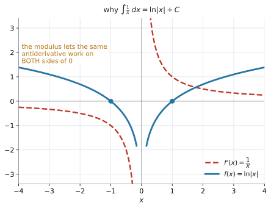

# AHL 5.11a — Standard integrals（基本の積分と定積分） {#sec-ahl-5-11a}

::: {.callout-note}
## What you should be able to do
- $\sin x$、$\cos x$、$\dfrac{1}{\cos^{2}x}$、$e^{x}$ の不定積分を書ける。
- **$n = -1$ のとき**、つまり $\displaystyle\int\frac{1}{x}\,dx = \ln|x| + C$ を使える。
- $x^{n}$ を **$n$ が分数のとき**にも積分できる。
- $\sqrt{x}$ や $\dfrac{3}{x^{2}}$ を**べき乗の形に書き直してから**積分できる。
- **$+C$** を必ず書き、**boundary condition** から $C$ の値を決められる。
- [**定積分の式を先に書き**](#write)、数値で答える問題では電卓で値を出せる。
- 電卓を **Radian** にしてから計算できる。
:::

::: {.callout-important}
## 公式集の 5.11 の欄
$5$ つ印刷されています。

$$
\int \frac{1}{x}\,dx = \ln|x| + C
$$ {#eq-ahl511a-ln}

$$
\int \sin x\,dx = -\cos x + C
$$ {#eq-ahl511a-sin}

$$
\int \cos x\,dx = \sin x + C
$$ {#eq-ahl511a-cos}

$$
\int \frac{1}{\cos^{2}x}\,dx = \tan x + C
$$ {#eq-ahl511a-tan}

$$
\int e^{x}\,dx = e^{x} + C
$$ {#eq-ahl511a-exp}

べき乗の公式は、$5.5$ の欄にあります。

$$
\int x^{n}\,dx = \frac{x^{\,n+1}}{n+1} + C, \qquad n \neq -1
$$ {#eq-ahl511a-power}

**全部配られるので、覚える必要はありません。** 身につけるべきなのは、**どの欄を見るか**です。$\dfrac{1}{x}$ だけは $5.5$ の欄ではなく $5.11$ の欄、というのがこの項目の分かれ道です（[第2節](#minus-one)）。
:::

::: {.callout-note}
## SL 5.5 の「$n \neq -1$」という穴が、ここで埋まります
[SL 5.5](../../ai-sl/05-calculus/sl-5-5.qmd) では、べき乗の公式に $n \neq -1$ という条件が付いていました。$n = -1$ のとき $\dfrac{x^{0}}{0}$ となって、$0$ で割ることになるからです。

**その場合の答えが、$\ln|x| + C$ です**（@eq-ahl511a-ln）。公式集では、べき乗の公式とは**別の欄**に印刷されています。

このページで増えるのは、次の $2$ つです。

1. **$n = -1$ を含む、すべての有理数 $n$** で積分できるようになる
2. **$\sin$、$\cos$、$\dfrac{1}{\cos^{2}x}$、$e^{x}$** が積分できるようになる

中身が $x$ そのものでない形（$\sin(2x+5)$ など）は、[AHL 5.11b](ahl-5-11b.qmd) で扱います。
:::

## The idea

### 1. 微分の表を、逆から読むだけです {#idea}

積分は微分の逆です（[SL 5.5](../../ai-sl/05-calculus/sl-5-5.qmd#reverse)）。ですから、新しく覚えることはありません。**[AHL 5.9a](ahl-5-9a.qmd#five) の表を、右から左へ読む**だけです。

| 微分すると（[AHL 5.9a](ahl-5-9a.qmd#five)） | 積分すると（このページ） |
|---|---|
| $\sin x \ \to \ \cos x$ | $\displaystyle\int \cos x\,dx = \sin x + C$ |
| $\cos x \ \to \ -\sin x$ | $\displaystyle\int \sin x\,dx = -\cos x + C$ |
| $\tan x \ \to \ \dfrac{1}{\cos^{2}x}$ | $\displaystyle\int \dfrac{1}{\cos^{2}x}\,dx = \tan x + C$ |
| $e^{x} \ \to \ e^{x}$ | $\displaystyle\int e^{x}\,dx = e^{x} + C$ |
| $\ln x \ \to \ \dfrac{1}{x}$（$x > 0$） | $\displaystyle\int \dfrac{1}{x}\,dx = \ln\lvert x \rvert + C$ |

: 微分と積分は表裏です {#tbl-ahl511a-pairs}

::: {.callout-warning}
## マイナスが付くのは $\sin$ を積分したときです
微分では **$\cos$** にマイナスが付きました。積分では **$\sin$** に付きます。**逆になります。**

$$
\int \sin x\,dx = -\cos x + C
$$

$$
\int \cos x\,dx = \sin x + C
$$

**符号で迷ったら、答えを微分して確かめてください。** $-\cos x$ を微分すると $-(-\sin x) = \sin x$ で、もとに戻ります ✓
:::

::: {.callout-warning}
## $\dfrac{1}{\cos^{2}x}$ は、$\cos x = 0$ のところでは考えません
$\tan x$ は $x = \dfrac{\pi}{2}$ で定義されていません。ですから、**$x = \dfrac{\pi}{2}$ をまたぐ定積分は出てきません。**

$\displaystyle\int_{0}^{\pi}\frac{1}{\cos^{2}x}\,dx$ に $\bigl[\tan x\bigr]_{0}^{\pi}$ を当てはめると $0$ という答えが出ますが、被積分関数はずっと正なので、**$0$ になるはずがありません。** 区間の中に $\cos x = 0$ が入っていないか、先に確かめてください。
:::

### 2. $n = -1$ のときだけ、別の公式です {#minus-one}

@eq-ahl511a-power には $n \neq -1$ という条件が付いています。$n = -1$ を入れてみると、その理由が分かります。

$$
\frac{x^{\,-1+1}}{-1+1} = \frac{x^{0}}{0}
$$

**分母が $0$ になってしまいます。** ですから、この場合だけ別に用意されています。

$$
\int \frac{1}{x}\,dx = \ln|x| + C
$$

$\dfrac{1}{x} = x^{-1}$ ですから、**$x^{-1}$ を見たら $\ln|x|$** と結びつけてください。

#### **modulus**（絶対値）が付く理由 {#abs}

$\ln$ の中身は**正でなければなりません。** けれども $\dfrac{1}{x}$ は $x < 0$ でも定義されています。

{#fig-ahl511a-lnabs width=100%}

@fig-ahl511a-lnabs の (a) を見てください。赤の破線が $\dfrac{1}{x}$、青が $\ln|x|$ です。**$x < 0$ の側にも、ちゃんと青い曲線があります。** modulus を付けておけば、**$1$ つの式で両側をまかなえます。**

なぜそれでうまくいくのかは、[Why it works](#why-abs) で確かめられます。

::: {.callout-tip}
## $x > 0$ と書いてあれば、$\ln x$ と書いても構いません
問題文に $x > 0$ という条件があるときは、$|x| = x$ なので $\ln x$ でも同じです。

**迷ったら $\ln|x|$ と書いてください。** 公式集がその形で印刷しているので、どちらの場合も正しくなります。
:::

### 3. 分数のべき乗も積分できます {#rational}

シラバスの Content 欄は、この項目の $1$ 行目をこう書いています。

> Definite and indefinite integration of $x^{n}$ where $n \in \mathbb{Q}$, including $n = -1$, $\sin x$, $\cos x$, $\dfrac{1}{\cos^{2}x}$ and $e^{x}$.

$n \in \mathbb{Q}$ は「$n$ は有理数」です（[AHL 5.9a 第2節](ahl-5-9a.qmd#rational)）。**公式そのものは変わりません。**

$$
\int x^{\frac{1}{2}}\,dx = \frac{x^{\frac{3}{2}}}{\frac{3}{2}} + C = \frac{2}{3}x^{\frac{3}{2}} + C
$$

**分母が分数になったら、逆数を掛けます。** $\div \dfrac{3}{2}$ は $\times \dfrac{2}{3}$ です。

#### 積分する前に、べき乗の形に書き直します {#rewrite}

微分のときと同じです（[AHL 5.9a](ahl-5-9a.qmd#rewrite)）。

| 問題文の形 | べき乗の形 | 積分すると |
|---|---|---|
| $\sqrt{x}$ | $x^{\frac{1}{2}}$ | $\dfrac{2}{3}x^{\frac{3}{2}} + C$ |
| $\dfrac{1}{\sqrt{x}}$ | $x^{-\frac{1}{2}}$ | $2x^{\frac{1}{2}} + C$ |
| $\dfrac{3}{x^{2}}$ | $3x^{-2}$ | $-3x^{-1} + C = -\dfrac{3}{x} + C$ |
| $\dfrac{1}{x}$ | $x^{-1}$ | $\ln\lvert x \rvert + C$ ← **別の公式** |

: 書き直してから積分する {#tbl-ahl511a-rewrite}

**いちばん下の行だけ、べき乗の公式が使えません。** 書き直したあとに指数が $-1$ になっていないか、必ず見てください。

### 4. 項ごとに積分して、$+C$ を $1$ つ書きます {#terms}

式がいくつかの項の和なら、**項ごとに積分して並べます。**

$$
\int \left(3\sin x - 2e^{x} + \frac{4}{x}\right)dx = -3\cos x - 2e^{x} + 4\ln|x| + C
$$

**係数はそのまま残ります。** $3\sin x$ の積分は $-\cos x$ ではなく $-3\cos x$ です。

::: {.callout-important}
## $+C$ は $1$ つだけです
項ごとに $C$ を書く必要はありません。**式全体の最後に $1$ つ**書きます（[SL 5.5](../../ai-sl/05-calculus/sl-5-5.qmd#plusc)）。

**そして、書き忘れると減点されます。** 不定積分で $+C$ が無いのは、この項目で一番多い失点です。
:::

### 5. 定積分 {#definite}

定積分には $+C$ が要りません。$C$ が引き算で消えるからです（[SL 5.5](../../ai-sl/05-calculus/sl-5-5.qmd#definite)）。

$$
\int_{a}^{b} f(x)\,dx = \bigl[F(x)\bigr]_{a}^{b} = F(b) - F(a)
$$

@fig-ahl511a-lnabs の (b) は、$y = \dfrac{1}{x}$ と $x$ 軸ではさまれた $x = 1$ から $x = 3$ までの面積です。

$$
\int_{1}^{3}\frac{1}{x}\,dx = \bigl[\ln|x|\bigr]_{1}^{3} = \ln 3 - \ln 1 = \ln 3 = 1.10 \ (3 \text{ s.f.})
$$

#### まず式を書きます {#write}

[SL 5.5](../../ai-sl/05-calculus/sl-5-5.qmd#write-first) で見たとおり、シラバスの SL 5.5 の Guidance 欄には「面積を計算する前に、正しい式を先に書くこと」とあります。**AHL 5.11 に同じ一文はありません**が、式の行が method mark になるのは HL でも変わりません。

$$
\int_{1}^{3}\frac{1}{x}\,dx \qquad ← \textbf{これを書くこと自体に点が付きます}
$$

下端・上端・**integrand**（被積分関数）・$dx$ の $4$ つがそろっているか確かめてください。

#### 値は電卓で出します {#by-gdc}

AI HL は $3$ つの paper すべてで電卓が使えます。**数値で答える定積分は、電卓で出して構いません**（[GDC 第2節](#gdc-integral)）。

```
menu → Calculus → Numerical Integral
下 1   上 3   式 1/x   変数 x
```

$1.0986\ldots$ と出ます。$\displaystyle\int$ のテンプレート（$9$ キーの右のパレット）からも、同じものが入ります。

::: {.callout-important}
## ただし、問題文の言葉で決まります
次の $3$ つでは、電卓の値だけでは点になりません。

| 問題文 | やること |
|---|---|
| `Find` + 不定積分（端が付いていない $\int$） | **anti-derivative**（原始関数）の式を書く。電卓は式を返しません |
| `the exact value` | $\ln 2$ や $\dfrac{83}{12}$ のように、小数に直さずに書く |
| `Show that` | 与えられた答えに向かって、途中をすべて書く |

: 電卓で済むかどうかの見分け方 {#tbl-ahl511a-when}

**このページの例題と演習は、ほとんどがこの $3$ つです。** ですから、原始関数を書く力がまず要ります。**電卓は検算と、数値で答える問題のためのもの**だと思ってください。
:::

### 6. boundary condition から $C$ を決めます {#boundary}

$+C$ が付いたままでは、答えが $1$ つに決まりません。**$1$ 組の値**が与えられれば、$C$ が決まります（[SL 5.5](../../ai-sl/05-calculus/sl-5-5.qmd#boundary)）。

$\dfrac{dy}{dx} = 2\cos x + \dfrac{3}{x}$ で、$x = 1$ のとき $y = 5$ とします。

$$
y = 2\sin x + 3\ln|x| + C
$$

$x = 1$、$y = 5$ を入れます。$\ln 1 = 0$ です。

$$
5 = 2\sin 1 + 0 + C
$$

$$
C = 5 - 2\sin 1 = 5 - 1.6829 = 3.3171
$$

$$
y = 2\sin x + 3\ln|x| + 3.32 \qquad (3 \text{ s.f.})
$$

**$\sin 1$ は radian です。** 次の節を見てください。

### 7. 電卓は Radian にしてください {#radian}

$\sin$ や $\cos$ の入った積分では、**角の設定が Radian でないと、まったく違う値**が出ます（[AHL 5.9a](ahl-5-9a.qmd#hl-radian)）。

```
doc → Settings → Document Settings → Angle: Radian
```

HL の試験では、$^{\circ}$ が書いていなければ radian です。**$\displaystyle\int_{0}^{\pi/4}\frac{1}{\cos^{2}x}\,dx$ のように、積分の端に $\pi$ が出てきたら、まず設定を確かめてください。**

## Why it works

::: {.callout-tip collapse="true"}
## クリックすると開きます

ここでは、公式集に載っている $2$ つの式が**なぜその形なのか**を確かめます。

### なぜ $\ln|x|$ に modulus が要るのか {#why-abs}

$x > 0$ のときは、そのままです。$\ln x$ を微分すると $\dfrac{1}{x}$ でした（[AHL 5.9a](ahl-5-9a.qmd#five)）。

問題は $x < 0$ のときです。$\ln x$ は定義されていません。そこで $\ln(-x)$ を微分してみます。中身の微分を掛けます（[AHL 5.9b](ahl-5-9b.qmd#chain)）。

$$
\frac{d}{dx}\ln(-x) = \frac{1}{-x} \times (-1) = \frac{1}{x}
$$

**$x < 0$ でも、$\ln(-x)$ の微分は $\dfrac{1}{x}$ になりました。**

- $x > 0$ なら $\ln x$
- $x < 0$ なら $\ln(-x)$

この $2$ つを $1$ つの式で書いたものが $\ln|x|$ です。$|x|$ は「$x$ が正ならそのまま、負なら符号を変える」という意味だからです。

@fig-ahl511a-lnabs の (a) の青い曲線が、左右で対称になっているのはこのためです。

::: {.callout-note appearance="simple"}
**$x = 0$ をまたぐ定積分は考えません。** $\dfrac{1}{x}$ は $x = 0$ で定義されていないので、$\displaystyle\int_{-1}^{1}\frac{1}{x}\,dx$ のような形は AI HL では出てきません。
:::

### なぜ $\dfrac{1}{\cos^{2}x}$ の積分が $\tan x$ なのか {#why-tan}

これは覚える必要のない式です。**$\tan x$ を微分すると $\dfrac{1}{\cos^{2}x}$ だった**（[AHL 5.9a](ahl-5-9a.qmd#tan)）というだけのことです。

積分は微分の逆ですから、$\dfrac{1}{\cos^{2}x}$ を積分すれば $\tan x$ に戻ります。

**$\dfrac{1}{\cos^{2}x}$ という形を見たら、$\tan$ を思い浮かべてください。** 分母に $\cos$ の $2$ 乗がある、というのが目印です。

$x = \dfrac{\pi}{3}$ で確かめます。

$$
\int_{0}^{\pi/3}\frac{1}{\cos^{2}x}\,dx = \bigl[\tan x\bigr]_{0}^{\pi/3} = \sqrt{3} - 0 = 1.73
$$

電卓の Numerical Integral（Radian）でも $1.7321$ になります ✓
:::

## Worked examples

::: {.callout-note appearance="simple"}
問題文は英語です。意味が理解できなかったら、問題文の下の「**日本語訳**」を開いてください。解説は日本語です。
:::

::: {#exm-ahl511a-terms}
[Find $\displaystyle\int\left(3\sin x - 2e^{x} + \frac{4}{x}\right)dx$, for $x > 0$.]{.q-en}

<details class="jp-trans">
<summary>日本語訳</summary>

$x > 0$ について、$\displaystyle\int\left(3\sin x - 2e^{x} + \dfrac{4}{x}\right)dx$ を求めなさい。

</details>

---

項ごとに積分します（[第4節](#terms)）。

- $3\sin x$ → $-3\cos x$（@eq-ahl511a-sin。**マイナスが付きます**）
- $-2e^{x}$ → $-2e^{x}$（@eq-ahl511a-exp。$e^{x}$ は変わりません）
- $\dfrac{4}{x}$ → $4\ln|x|$（@eq-ahl511a-ln。$x^{-1}$ なのでべき乗の公式は使えません）

$$
\int\left(3\sin x - 2e^{x} + \frac{4}{x}\right)dx = -3\cos x - 2e^{x} + 4\ln|x| + C
$$

**検算。** 答えを微分すると

$$
3\sin x - 2e^{x} + \frac{4}{x}
$$

でもとに戻ります ✓ **不定積分は、必ず微分して確かめられます。**

::: {.callout-note}
## 解答例（答案用紙にはこう書く）
$$
\int\left(3\sin x - 2e^{x} + \frac{4}{x}\right)dx = -3\cos x - 2e^{x} + 4\ln|x| + C
$$
:::
:::

::: {#exm-ahl511a-root}
[Let $f(x) = \sqrt{x} + \dfrac{3}{x^{2}}$, for $x > 0$.]{.q-en}

**(a)** [Write $f(x)$ in the form $x^{p} + 3x^{q}$.]{.q-en}

**(b)** [Find $\displaystyle\int f(x)\,dx$.]{.q-en}

**(c)** [Find $\displaystyle\int_{1}^{4} f(x)\,dx$, giving your answer as an exact fraction.]{.q-en}

<details class="jp-trans">
<summary>日本語訳</summary>

$x > 0$ について $f(x) = \sqrt{x} + \dfrac{3}{x^{2}}$ とします。

`as an exact fraction` は「分数のままの正確な値で」という意味です。

**(a)** $f(x)$ を $x^{p} + 3x^{q}$ の形で書きなさい。

**(b)** $\displaystyle\int f(x)\,dx$ を求めなさい。

**(c)** $\displaystyle\int_{1}^{4} f(x)\,dx$ を、正確な分数で求めなさい。

</details>

---

**(a)** 根号と分数を、べき乗の形に直します（@tbl-ahl511a-rewrite）。

$$
f(x) = x^{\frac{1}{2}} + 3x^{-2}
$$

**(b)** それぞれ指数に $1$ を足して、その数で割ります（@eq-ahl511a-power）。**項ごとの段階では $C$ を書かず、最後に $1$ つ付けます。**

$$
\int x^{\frac{1}{2}}\,dx = \frac{x^{\frac{3}{2}}}{\frac{3}{2}} = \frac{2}{3}x^{\frac{3}{2}}
$$

$$
\int 3x^{-2}\,dx = \frac{3x^{-1}}{-1} = -3x^{-1} = -\frac{3}{x}
$$

$$
\int f(x)\,dx = \frac{2}{3}x^{\frac{3}{2}} - \frac{3}{x} + C
$$

**もとの指数は $-2$ です。$-2 \neq -1$ なので、べき乗の公式が使えます。** $1$ を足した $-1$ で割るだけで、$\ln$ にはなりません。

**(c)** (b) で作った原始関数に、$4$ と $1$ を入れて引きます。$4^{\frac{3}{2}} = 8$ です。

$$
\int_{1}^{4} f(x)\,dx = \left[\frac{2}{3}x^{\frac{3}{2}} - \frac{3}{x}\right]_{1}^{4}
$$

$$
= \left(\frac{16}{3} - \frac{3}{4}\right) - \left(\frac{2}{3} - 3\right)
$$

$$
= \frac{14}{3} + \frac{9}{4} = \frac{56}{12} + \frac{27}{12} = \frac{83}{12}
$$

**検算。** 電卓の Numerical Integral で $\displaystyle\int_{1}^{4}\left(\sqrt{x} + \frac{3}{x^{2}}\right)dx$ を計算すると $6.9167$。$\dfrac{83}{12} = 6.9167$ ✓（[GDC 第2節](#gdc-integral)）

::: {.callout-note}
## 解答例（答案用紙にはこう書く）
**(a)**
$$
f(x) = x^{\frac{1}{2}} + 3x^{-2}
$$

**(b)**
$$
\int f(x)\,dx = \frac{2}{3}x^{\frac{3}{2}} - \frac{3}{x} + C
$$

**(c)**
$$
\int_{1}^{4} f(x)\,dx = \left[\frac{2}{3}x^{\frac{3}{2}} - \frac{3}{x}\right]_{1}^{4} = \left(\frac{16}{3} - \frac{3}{4}\right) - \left(\frac{2}{3} - 3\right) = \frac{83}{12}
$$
:::
:::

::: {#exm-ahl511a-tan}
[**(a)** Write down $\displaystyle\int \frac{1}{\cos^{2}x}\,dx$.]{.q-en}

**(b)** [Hence show that $\displaystyle\int_{0}^{\pi/4} \frac{1}{\cos^{2}x}\,dx = 1$.]{.q-en}

<details class="jp-trans">
<summary>日本語訳</summary>

**(a)** $\displaystyle\int \dfrac{1}{\cos^{2}x}\,dx$ を書きなさい。

**(b)** それを使って、$\displaystyle\int_{0}^{\pi/4} \dfrac{1}{\cos^{2}x}\,dx = 1$ であることを示しなさい。

`Write down` は「計算はほとんど要らない。答えだけ書けばよい」、`Hence` は「それを使って」、`Show that` は「与えられた答えに向かって、途中を全部書く」という意味です。

</details>

---

**(a)** 公式集の $5.11$ の欄にあります（@eq-ahl511a-tan）。

$$
\int \frac{1}{\cos^{2}x}\,dx = \tan x + C
$$

**(b)** `Show that` なので、**途中をすべて書きます。** 電卓の値だけでは点になりません（[第5節](#by-gdc)）。

$$
\int_{0}^{\pi/4} \frac{1}{\cos^{2}x}\,dx = \bigl[\tan x\bigr]_{0}^{\pi/4}
$$

$$
= \tan\frac{\pi}{4} - \tan 0 = 1 - 0 = 1
$$

**検算。** 電卓を Radian にして Numerical Integral で計算すると $1$ です ✓（[第7節](#radian)）

::: {.callout-note}
## 解答例（答案用紙にはこう書く）
**(a)**
$$
\int \frac{1}{\cos^{2}x}\,dx = \tan x + C
$$

**(b)**
$$
\int_{0}^{\pi/4} \frac{1}{\cos^{2}x}\,dx = \bigl[\tan x\bigr]_{0}^{\pi/4} = \tan\frac{\pi}{4} - \tan 0 = 1 - 0 = 1
$$
:::
:::

::: {#exm-ahl511a-tank}
[Water flows into a tank. The rate of flow, in litres per minute, at time $t$ minutes is]{.q-en}

$$
\frac{dV}{dt} = 5 + 4\cos t, \qquad t \geq 0
$$

[When $t = 0$ the tank contains $20$ litres.]{.q-en}

**(a)** [Find an expression for $V$ in terms of $t$.]{.q-en}

**(b)** [Find the volume of water in the tank when $t = 3$.]{.q-en}

**(c)** [Show that the volume is always increasing.]{.q-en}

**(d)** [Interpret the value of $\displaystyle\int_{0}^{3}\left(5 + 4\cos t\right)dt$ in the context of the question.]{.q-en}

<details class="jp-trans">
<summary>日本語訳</summary>

タンクに水が流れこんでいます。時刻 $t$ 分における流量（毎分リットル）は上の式です。$t = 0$ のとき、タンクには $20$ リットル入っています。

`the rate of flow` は「流れる速さ」、`in terms of` は「〜を使って」、`Show that` は「与えられた答えに向かって、途中を全部書く」という意味です。

**(a)** $V$ を $t$ を使って表す式を求めなさい。

**(b)** $t = 3$ のときのタンクの水の量を求めなさい。

**(c)** 水の量がつねに増えていることを示しなさい。

**(d)** $\displaystyle\int_{0}^{3}\left(5 + 4\cos t\right)dt$ の値の意味を、この問題の文脈で説明しなさい。

</details>

---

**(a)** $\dfrac{dV}{dt}$ から $V$ に戻るので、積分します。

$$
V = \int (5 + 4\cos t)\,dt = 5t + 4\sin t + C
$$

$t = 0$ のとき $V = 20$ です。$\sin 0 = 0$ なので

$$
20 = 0 + 0 + C \quad \Longrightarrow \quad C = 20
$$

$$
V = 5t + 4\sin t + 20
$$

**(b)** $t = 3$ を入れます。**radian です**（[第7節](#radian)）。

$$
V = 15 + 4\sin 3 + 20 = 15 + 0.5645 + 20 = 35.56 \approx 35.6 \ \text{litres}
$$

**(c)** `Show that` なので、理由を書きます。$\cos t$ の値は、いつも $-1$ 以上 $1$ 以下です。

$$
-1 \leq \cos t \leq 1 \quad \Longrightarrow \quad -4 \leq 4\cos t \leq 4
$$

$$
1 \leq 5 + 4\cos t \leq 9
$$

**$\dfrac{dV}{dt}$ は、いちばん小さくても $1$ です。** つまりつねに正なので、$V$ は増えつづけます。

::: {.model-answer}
**試験ではこう書く**

*Since $-1 \leq \cos t \leq 1$, we have $1 \leq 5 + 4\cos t \leq 9$. So $\dfrac{dV}{dt} \geq 1 > 0$ for all $t$, and the volume is always increasing.*
:::

（$\cos t$ は $-1$ 以上 $1$ 以下だから $\dfrac{dV}{dt}$ は $1$ 以上、つまりつねに正なので体積は増えつづける、という意味です。）

**検算。** $t = 3$ で $\dfrac{dV}{dt} = 5 + 4\cos 3 = 1.04 > 0$ ✓ いちばん小さくなるあたりでも正です。

**(d)** この定積分は**変化率の積分**なので、値は「増えた量」です（[SL 5.5](../../ai-sl/05-calculus/sl-5-5.qmd#rate)）。電卓で計算すると $15.6$ です（[GDC 第2節](#gdc-integral)）。

::: {.model-answer}
**試験ではこう書く**

*It is the volume of water, in litres, that flows into the tank during the first $3$ minutes. Its value is $15.6$ litres, which agrees with $V(3) - V(0) = 35.6 - 20 = 15.6$.*
:::

（最初の $3$ 分間にタンクに流れこんだ水の量（リットル）である。値は $15.6$ リットルで、$V(3) - V(0) = 15.6$ と一致する、という意味です。）

::: {.callout-note}
## 解答例（答案用紙にはこう書く）
**(a)**
$$
V = \int (5 + 4\cos t)\,dt = 5t + 4\sin t + C
$$
$$
t = 0, \ V = 20 \quad \Longrightarrow \quad C = 20
$$
$$
V = 5t + 4\sin t + 20
$$

**(b)**
$$
V(3) = 15 + 4\sin 3 + 20 = 35.6 \ \text{litres}
$$

**(c)** *Since $-1 \leq \cos t \leq 1$, $\dfrac{dV}{dt} = 5 + 4\cos t \geq 1 > 0$ for all $t$, so $V$ is always increasing.*

**(d)** *It is the volume of water, in litres, that flows into the tank during the first $3$ minutes: $15.6$ litres.*
:::
:::

## Common errors

::: {.callout-warning}
## $\displaystyle\int\frac{1}{x}\,dx$ にべき乗の公式を使う
**誤り**：$x^{-1}$ を見て $\dfrac{x^{0}}{0} + C$ と書く、あるいは $\dfrac{1}{2}x^{-2}$ のような形を書く。

べき乗の公式には $n \neq -1$ という条件が付いています（@eq-ahl511a-power）。

**正しくは**：$\ln|x| + C$ です（@eq-ahl511a-ln）。**書き直したあとの指数が $-1$ かどうか**を、必ず見てください（[第2節](#minus-one)）。
:::

::: {.callout-warning}
## $\sin$ の積分のマイナスを落とす
**誤り**：$\displaystyle\int \sin x\,dx = \cos x + C$ と書く。

微分ではマイナスが付くのは $\cos$、積分では $\sin$ です。**逆になります**（[第1節](#idea)）。

**正しくは**：$-\cos x + C$ です。**答えを微分して確かめれば**すぐ分かります。
:::

::: {.callout-warning}
## $+C$ を書き忘れる
**誤り**：不定積分の答えを $-3\cos x - 2e^{x} + 4\ln|x|$ で止める。

**正しくは**：$+C$ が要ります（[第4節](#terms)）。

**定積分には要りません。** 端の値を引くときに消えるからです（[第5節](#definite)）。**「$\int$ に上下の数が付いているか」で見分けてください。**
:::

::: {.callout-warning}
## 絶対値を書かない
**誤り**：$\displaystyle\int\frac{1}{x}\,dx = \ln x + C$ と書く（問題文に $x > 0$ が無いのに）。

**正しくは**：$\ln|x| + C$ です。公式集もその形です（[第2節](#abs)）。

$x > 0$ と書いてあるときだけ、$\ln x$ でも構いません。
:::

::: {.callout-warning}
## 分数で割るところを間違える
**誤り**：$\displaystyle\int x^{\frac{1}{2}}\,dx$ を $\dfrac{3}{2}x^{\frac{3}{2}}$ と書く（掛けてしまっている）。

**正しくは**：$\dfrac{x^{\frac{3}{2}}}{\frac{3}{2}} = \dfrac{2}{3}x^{\frac{3}{2}}$ です。**割るので、逆数を掛けます**（[第3節](#rational)）。

**検算は微分です。** $\dfrac{2}{3}x^{\frac{3}{2}}$ を微分すると $\dfrac{2}{3} \times \dfrac{3}{2}x^{\frac{1}{2}} = x^{\frac{1}{2}}$ ✓
:::

::: {.callout-warning}
## 電卓が `Degree` のまま、$\sin$ の入った積分を計算する
**誤り**：$\displaystyle\int_{0}^{\pi/4}\frac{1}{\cos^{2}x}\,dx$ を degree の設定で計算する。

エラーは出ませんが、値がまったく違います。

**正しくは**：`doc → Settings → Document Settings → Angle: Radian` にしてから計算します（[第7節](#radian)）。
:::

::: {.callout-warning}
## 積分の式を書かずに、電卓の値だけを書く
**誤り**：面積や合計を聞かれて、いきなり $6.92$ とだけ書く。

$\displaystyle\int_{1}^{4}\left(\sqrt{x} + \frac{3}{x^{2}}\right)dx$ という**式の行に点が付きます**（[第5節](#write)）。

**正しくは**：式を書いてから値を出します。値が違っていても、式が合っていれば部分点になります。
:::

::: {.callout-warning}
## `Show that` なのに、電卓の値だけを書く
**誤り**：$\displaystyle\int_{0}^{\pi/4}\frac{1}{\cos^{2}x}\,dx = 1$ を示せ、と言われて「電卓で $1$ でした」と書く。

`Show that` は、**与えられた答えに向かって途中を全部書く**指示です（[第5節](#by-gdc)）。

**正しくは**：$\bigl[\tan x\bigr]_{0}^{\pi/4} = \tan\dfrac{\pi}{4} - \tan 0 = 1$ と、原始関数と代入を書きます。
:::

## Using your GDC (TI-Nspire CX II)

AI HL は $3$ つの paper すべてで電卓が使えます。**定積分の値は、電卓で出すのがふつうです。**

### 1. `Angle` を `Radian` にする {#gdc-radian}

```
doc → Settings → Document Settings → Angle: Radian
```

計算画面で $\sin 1$ を計算して、$0.841$ が出れば Radian です（[AHL 5.9a](ahl-5-9a.qmd#gdc-radian)）。$0.0175$ が出たら Degree なので、直してください。

### 2. 定積分を計算する {#gdc-integral}

```
menu → Calculus → Numerical Integral
```

下端・上端・式・変数の $4$ つを入れます。

| 入れるところ | @exm-ahl511a-tank (d) の場合 |
|---|---|
| 下 | $0$ |
| 上 | $3$ |
| 式 | `5+4cos(x)` |
| 変数 | `x` |

: Numerical Integral の入れ方 {#tbl-ahl511a-gdc}

$15.564$ と出ます。**数値で答える問題は、これで終わりです。**

**検算にも同じ機能を使います。** @exm-ahl511a-root (c) の式を入れると $6.9167$ で、手で出した $\dfrac{83}{12}$ と一致します ✓

::: {.callout-warning}
## 電卓は「式」を返しません
Numerical Integral が返すのは、**ある区間の値だけ**です。$\displaystyle\int f(x)\,dx$（不定積分）を聞かれたら、**原始関数の式を自分で書く**しかありません（[第5節](#by-gdc)）。
:::

### 3. グラフで確かめる {#gdc-graph}

面積として見たいときは、グラフから出せます。

```
f1(x) = 1/x
menu → Analyze Graph → Integral
```

下端と上端を指定すると、**塗られた面積と値**が画面に出ます（[SL 5.5](../../ai-sl/05-calculus/sl-5-5.qmd#graphs)）。@fig-ahl511a-lnabs の (b) と同じ絵になります。

**曲線が $x$ 軸の下に入っていないか**も、同時に確かめられます。

### 4. 確かめ方 {#gdc-check}

$4$ つあります。

1. **不定積分は、答えを微分して**もとに戻るか
2. **$+C$** を書いたか（定積分なら書いていないか）
3. **`Angle` が `Radian`** か
4. 手で出した定積分の値と、Numerical Integral の値が合うか

## Exercises

::: {.callout-note appearance="simple"}
各問題に、折りたたみが3つ付いています。**日本語訳**、**解答例**（答案用紙に書くべきこと。英語です）、**解説**（なぜそうなるか。日本語です）。

まず自分で解いて、次に解答例と見くらべてください。**解説は、合わなかったときだけ開けば十分です。**
:::

::: {.exercise-block}

[1]{.ex-no} [Find $\displaystyle\int (4\cos x - e^{x})\,dx$.]{.q-en}

<details class="jp-trans">
<summary>日本語訳</summary>

$\displaystyle\int (4\cos x - e^{x})\,dx$ を求めなさい。

</details>

::: {.callout-note collapse="true"}
## 解答例（答案用紙に書くこと）
$$
\int (4\cos x - e^{x})\,dx = 4\sin x - e^{x} + C
$$
:::

::: {.callout-tip collapse="true"}
## 解説
項ごとに積分します（[第4節](#terms)）。$\cos$ の積分にはマイナスが付きません（@eq-ahl511a-cos）。

**係数 $4$ はそのまま残ります。**

**検算。** $4\sin x - e^{x}$ を微分すると $4\cos x - e^{x}$ ✓
:::

::: {.ex-sep}
:::

[2]{.ex-no} [Find $\displaystyle\int \frac{6}{x}\,dx$, for $x > 0$.]{.q-en}

<details class="jp-trans">
<summary>日本語訳</summary>

$x > 0$ について $\displaystyle\int \dfrac{6}{x}\,dx$ を求めなさい。

</details>

::: {.callout-note collapse="true"}
## 解答例（答案用紙に書くこと）
$$
\int \frac{6}{x}\,dx = 6\ln|x| + C
$$
:::

::: {.callout-tip collapse="true"}
## 解説
$\dfrac{6}{x} = 6x^{-1}$ です。**指数が $-1$ なので、べき乗の公式は使えません**（[第2節](#minus-one)）。

$$
\int \frac{6}{x}\,dx = 6\int\frac{1}{x}\,dx = 6\ln|x| + C
$$

**係数 $6$ は $\ln$ の前に残ります。** $\ln|6x|$ ではありません。

問題文に $x > 0$ とあるので、$6\ln x + C$ と書いても構いません（[第2節](#abs)）。
:::

::: {.ex-sep}
:::

[3]{.ex-no} [Find $\displaystyle\int x^{\frac{3}{2}}\,dx$.]{.q-en}

<details class="jp-trans">
<summary>日本語訳</summary>

$\displaystyle\int x^{\frac{3}{2}}\,dx$ を求めなさい。

</details>

::: {.callout-note collapse="true"}
## 解答例（答案用紙に書くこと）
$$
\int x^{\frac{3}{2}}\,dx = \frac{x^{\frac{5}{2}}}{\frac{5}{2}} + C = \frac{2}{5}x^{\frac{5}{2}} + C
$$
:::

::: {.callout-tip collapse="true"}
## 解説
指数に $1$ を足します。$\dfrac{3}{2} + 1 = \dfrac{5}{2}$ です。

**$1$ を $\dfrac{2}{2}$ に直してから足す**と間違えません（[第3節](#rational)）。

$\div \dfrac{5}{2}$ は $\times \dfrac{2}{5}$ です。

**検算。** $\dfrac{2}{5}x^{\frac{5}{2}}$ を微分すると $\dfrac{2}{5} \times \dfrac{5}{2}x^{\frac{3}{2}} = x^{\frac{3}{2}}$ ✓
:::

::: {.ex-sep}
:::

[4]{.ex-no} [Find $\displaystyle\int \left(\frac{2}{x^{2}} + \sqrt{x}\right)dx$, for $x > 0$.]{.q-en}

<details class="jp-trans">
<summary>日本語訳</summary>

$x > 0$ について $\displaystyle\int \left(\dfrac{2}{x^{2}} + \sqrt{x}\right)dx$ を求めなさい。

</details>

::: {.callout-note collapse="true"}
## 解答例（答案用紙に書くこと）
$$
\int \left(2x^{-2} + x^{\frac{1}{2}}\right)dx = \frac{2x^{-1}}{-1} + \frac{2}{3}x^{\frac{3}{2}} + C
$$
$$
= -\frac{2}{x} + \frac{2}{3}x^{\frac{3}{2}} + C
$$
:::

::: {.callout-tip collapse="true"}
## 解説
まず**べき乗の形に書き直します**（@tbl-ahl511a-rewrite）。

$$
\frac{2}{x^{2}} = 2x^{-2}, \qquad \sqrt{x} = x^{\frac{1}{2}}
$$

$-2 + 1 = -1$ で、**割る数は $-1$**（$0$ ではありません）。ですからべき乗の公式が使えます。$\ln$ にはなりません。

**$\dfrac{2}{x^{2}}$ と $\dfrac{2}{x}$ を取り違えないでください。** $\ln$ になるのは $\dfrac{2}{x}$ のほうだけです。
:::

::: {.ex-sep}
:::

[5]{.ex-no} [Find the exact value of $\displaystyle\int_{1}^{2} \frac{1}{x}\,dx$.]{.q-en}

<details class="jp-trans">
<summary>日本語訳</summary>

$\displaystyle\int_{1}^{2} \dfrac{1}{x}\,dx$ の正確な値を求めなさい。

`the exact value` は「小数に直さない正確な値」という意味です。

</details>

::: {.callout-note collapse="true"}
## 解答例（答案用紙に書くこと）
$$
\int_{1}^{2} \frac{1}{x}\,dx = \bigl[\ln|x|\bigr]_{1}^{2} = \ln 2 - \ln 1 = \ln 2
$$
:::

::: {.callout-tip collapse="true"}
## 解説
`exact value` と言われているので、**$0.693$ ではなく $\ln 2$ と書きます。**

$\ln 1 = 0$ です。$e^{0} = 1$ だからです。

**定積分なので $+C$ は要りません**（[第5節](#definite)）。

**検算。** Numerical Integral で $0.6931$。$\ln 2 = 0.6931$ ✓
:::

::: {.ex-sep}
:::

[6]{.ex-no} [Find the exact value of $\displaystyle\int_{0}^{\pi/3} \sin x\,dx$.]{.q-en}

<details class="jp-trans">
<summary>日本語訳</summary>

$\displaystyle\int_{0}^{\pi/3} \sin x\,dx$ の正確な値を求めなさい。

</details>

::: {.callout-note collapse="true"}
## 解答例（答案用紙に書くこと）
$$
\int_{0}^{\pi/3} \sin x\,dx = \bigl[-\cos x\bigr]_{0}^{\pi/3}
$$
$$
= -\cos\frac{\pi}{3} + \cos 0 = -\frac{1}{2} + 1 = \frac{1}{2}
$$
:::

::: {.callout-tip collapse="true"}
## 解説
$\sin$ の積分は $-\cos$ です（@eq-ahl511a-sin）。

**マイナスが $2$ 回出ます。** 原始関数のマイナスと、$[\ ]$ の中で下端を引くときのマイナスです。

$$
\bigl[-\cos x\bigr]_{0}^{\pi/3} = \left(-\cos\frac{\pi}{3}\right) - \left(-\cos 0\right) = -\frac{1}{2} + 1
$$

$\dfrac{\pi}{3}$ は $60^{\circ}$ で、$\cos 60^{\circ} = \dfrac{1}{2}$ です（[AHL 5.9a](ahl-5-9a.qmd#what-radian)）。

**検算。** Numerical Integral（Radian）で $0.5$ ✓
:::

::: {.ex-sep}
:::

[7]{.ex-no} [Find the exact value of $\displaystyle\int_{\pi/6}^{\pi/3} \frac{1}{\cos^{2}x}\,dx$.]{.q-en}

<details class="jp-trans">
<summary>日本語訳</summary>

$\displaystyle\int_{\pi/6}^{\pi/3} \dfrac{1}{\cos^{2}x}\,dx$ の正確な値を求めなさい。

</details>

::: {.callout-note collapse="true"}
## 解答例（答案用紙に書くこと）
$$
\int_{\pi/6}^{\pi/3} \frac{1}{\cos^{2}x}\,dx = \bigl[\tan x\bigr]_{\pi/6}^{\pi/3}
$$
$$
= \tan\frac{\pi}{3} - \tan\frac{\pi}{6} = \sqrt{3} - \frac{1}{\sqrt{3}} = \frac{2}{\sqrt{3}}
$$
:::

::: {.callout-tip collapse="true"}
## 解説
$\dfrac{1}{\cos^{2}x}$ の積分は $\tan x$ です（@eq-ahl511a-tan）。

$\dfrac{\pi}{3} = 60^{\circ}$、$\dfrac{\pi}{6} = 30^{\circ}$ です。

$$
\sqrt{3} - \frac{1}{\sqrt{3}} = \frac{3}{\sqrt{3}} - \frac{1}{\sqrt{3}} = \frac{2}{\sqrt{3}}
$$

**検算。** $\dfrac{2}{\sqrt{3}} = 1.1547$。Numerical Integral（Radian）でも $1.1547$ ✓ 有効数字 $3$ 桁なら $1.15$ です。
:::

::: {.ex-sep}
:::

[8]{.ex-no} [Find $\displaystyle\int \left(5e^{x} + \frac{1}{\cos^{2}x}\right)dx$.]{.q-en}

<details class="jp-trans">
<summary>日本語訳</summary>

$\displaystyle\int \left(5e^{x} + \dfrac{1}{\cos^{2}x}\right)dx$ を求めなさい。

</details>

::: {.callout-note collapse="true"}
## 解答例（答案用紙に書くこと）
$$
\int \left(5e^{x} + \frac{1}{\cos^{2}x}\right)dx = 5e^{x} + \tan x + C
$$
:::

::: {.callout-tip collapse="true"}
## 解説
どちらも公式集の $5.11$ の欄にあります（@eq-ahl511a-exp、@eq-ahl511a-tan）。

$e^{x}$ の積分は $e^{x}$ のままです。**係数 $5$ は残ります。**

**$+C$ は $1$ つだけ**です（[第4節](#terms)）。

**検算。** $5e^{x} + \tan x$ を微分すると $5e^{x} + \dfrac{1}{\cos^{2}x}$ ✓
:::

::: {.ex-sep}
:::

[9]{.ex-no} [A chemical is produced at a rate of $\dfrac{dm}{dt} = \dfrac{6}{t}$ grams per hour, where $t \geq 1$ is the time in hours. When $t = 1$ the mass produced is $0$ grams.]{.q-en}

**(a)** [Find an expression for $m$ in terms of $t$.]{.q-en}

**(b)** [Find the mass produced after $5$ hours.]{.q-en}

<details class="jp-trans">
<summary>日本語訳</summary>

ある化学物質が、毎時 $\dfrac{dm}{dt} = \dfrac{6}{t}$ グラムの割合で作られています。$t \geq 1$ は時間（単位は時間）です。$t = 1$ のとき、作られた質量は $0$ グラムです。

**(a)** $m$ を $t$ を使って表す式を求めなさい。

**(b)** $5$ 時間後に作られた質量を求めなさい。

</details>

::: {.callout-note collapse="true"}
## 解答例（答案用紙に書くこと）
**(a)**
$$
m = \int \frac{6}{t}\,dt = 6\ln|t| + C
$$
$$
t = 1, \ m = 0 \quad \Longrightarrow \quad 0 = 6\ln 1 + C = C
$$
$$
m = 6\ln t \qquad (t \geq 1)
$$

**(b)**
$$
m(5) = 6\ln 5 = 9.66 \ \text{grams}
$$
:::

::: {.callout-tip collapse="true"}
## 解説
$\dfrac{dm}{dt}$ から $m$ に戻るので積分します（[第6節](#boundary)）。

$\dfrac{6}{t} = 6t^{-1}$ なので $\ln$ です（[第2節](#minus-one)）。

$t \geq 1$ なので $|t| = t$、$\ln 1 = 0$ より $C = 0$ です。

$$
m(5) = 6\ln 5 = 6 \times 1.60944 = 9.6566
$$

**検算。** Numerical Integral で $\displaystyle\int_{1}^{5}\frac{6}{t}\,dt$ を計算すると $9.657$ ✓ **積分の値がそのまま「$1$ 時間目から $5$ 時間目までに作られた量」**です。
:::

::: {.ex-sep}
:::

[10]{.ex-no} [A student writes]{.q-en}

$$
\int \frac{1}{x}\,dx = \frac{x^{0}}{0} + C
$$

[Identify the error and write down the correct integral.]{.q-en}

<details class="jp-trans">
<summary>日本語訳</summary>

ある生徒が上のように書きました。誤りを指摘し、正しい積分を書きなさい。

</details>

::: {.callout-note collapse="true"}
## 解答例（答案用紙に書くこと）
*The student has used the power rule with $n = -1$, but that rule requires $n \neq -1$: it gives a division by zero. The formula booklet has a separate result for this case,*
$$
\int \frac{1}{x}\,dx = \ln|x| + C
$$
:::

::: {.callout-tip collapse="true"}
## 解説
$\dfrac{1}{x} = x^{-1}$ なので $n = -1$ です。べき乗の公式（@eq-ahl511a-power）には $n \neq -1$ という条件が付いています。

$$
\frac{x^{\,-1+1}}{-1+1} = \frac{x^{0}}{0}
$$

**分母が $0$ になるので、計算できません**（[第2節](#minus-one)）。

::: {.model-answer}
**試験ではこう書く**

*The power rule $\int x^{n}dx = \dfrac{x^{n+1}}{n+1} + C$ only applies when $n \neq -1$. Here $n = -1$, so the formula divides by zero. The correct result is $\int \dfrac{1}{x}dx = \ln|x| + C$.*
:::

**条件の付いた公式を使うときは、条件を先に確かめてください。**
:::

:::
