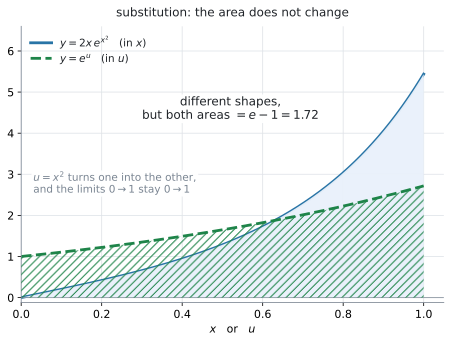

# AHL 5.11b — Integration by inspection and substitution（見て積分する方法・置換積分） {#sec-ahl-5-11b}

::: {.callout-note}
## What you should be able to do
- 中身が $ax + b$ の形なら、**inspection**（見て積分する方法）で積分できる。
- 中身が $ax + b$ でないときは、**substitution**（$u$ を置く）で積分できる。
- $\displaystyle\int f(g(x))\,g'(x)\,dx$ の形を見分けられる。
- $\displaystyle\int \frac{f'(x)}{f(x)}\,dx = \ln|f(x)| + C$ の形に気づける。
- 定積分では、**上端と下端も $u$ に直せる**。
- 答えを微分して、もとに戻るか確かめられる。
:::

::: {.callout-important}
## 公式集の 5.11 の欄に、この方法の公式はありません
使うのは、$5.9$ の欄に印刷されている **chain rule** です。

$$
y = g(u), \ \text{where} \ u = f(x) \ \Rightarrow \ \frac{dy}{dx} = \frac{dy}{du} \times \frac{du}{dx}
$$ {#eq-ahl511b-chain}

**これを逆から読むのが、このページの中身**です。公式集の $5.11$ の欄にあるのは、[AHL 5.11a](ahl-5-11a.qmd) で見た $5$ つの積分だけで、**inspection や substitution のやり方は印刷されていません。**

シラバスの Content 欄は、こう書いています。

> Integration by inspection, or substitution of the form $\displaystyle\int f(g(x))g'(x)\,dx$.

**$2$ つの方法が挙げられています。** どちらで書いても正解です。このページでは、**式の形で使い分ける**やり方を示します。
:::

::: {.callout-note}
## [AHL 5.11a](ahl-5-11a.qmd) の $5$ つを、先に見ておいてください
このページで積分するのは、$\sin$、$\cos$、$\dfrac{1}{\cos^{2}x}$、$e^{x}$、$\dfrac{1}{x}$、$x^{n}$ を**組み合わせた**式です。ひとつひとつの積分は [AHL 5.11a](ahl-5-11a.qmd#idea) にあります。

**電卓は Radian にしてください**（[AHL 5.11a](ahl-5-11a.qmd#radian)）。
:::

## The idea

### 1. chain rule を、逆から読みます {#idea}

$\sin(2x+5)$ を積分したいとします。公式集にあるのは $\displaystyle\int \sin x\,dx = -\cos x + C$ だけで、**中身が $2x+5$ のときの式はありません。**

そこで、**答えを予想して、微分して確かめる**という進め方をします。

{#fig-ahl511b-sub width=100%}

@fig-ahl511b-sub の (a) がその流れです。

1. まず $-\cos(2x+5)$ だろう、と**予想する**
2. それを微分すると、chain rule で $2\sin(2x+5)$。**$2$ 倍だけ大きい**
3. だから $\dfrac{1}{2}$ を掛けて、$-\dfrac{1}{2}\cos(2x+5) + C$

**微分すると余分な数が出てくるので、その数で割っておく。** これがこのページの中心です。

### 2. 中身が $ax + b$ のとき — inspection {#linear}

中身が **$x$ の $1$ 次式**（$2x+5$、$3x+2$、$4x$ など）のときは、微分で出てくる余分な数が**定数**です。ですから、その定数で割るだけで終わります。

$$
\int \sin(2x+5)\,dx = -\frac{1}{2}\cos(2x+5) + C
$$

シラバスの Guidance 欄が挙げている例の $1$ つです。

> Examples: $\displaystyle\int\sin(2x+5)\,dx$, $\displaystyle\int\frac{1}{3x+2}\,dx$, $\displaystyle\int 4x\sin x^{2}\,dx$, $\displaystyle\int\frac{\sin x}{\cos x}\,dx$.

**はじめの $2$ つがこの節、後ろの $2$ つは[第3節](#sub)と[第4節](#log-form)で扱います。** $\displaystyle\int 4x\sin x^{2}\,dx$ の $4x$ は係数であって、中身ではありません。

#### 手順は $3$ つです {#linear-steps}

$\displaystyle\int \frac{1}{3x+2}\,dx$ でやってみます。

1. **中身を $x$ だと思って積分する** … $\dfrac{1}{x}$ の積分は $\ln|x|$ なので、$\ln|3x+2|$
2. **それを微分してみる** … $\dfrac{1}{3x+2} \times 3 = \dfrac{3}{3x+2}$ で、**$3$ 倍**
3. **$3$ で割る**

$$
\int \frac{1}{3x+2}\,dx = \frac{1}{3}\ln|3x+2| + C
$$

**割るのは、中身の $x$ の係数**です。

#### よく出る形 {#linear-table}

以下では $a \neq 0$ とします（$a = 0$ なら中身が定数になり、$\dfrac{1}{a}$ が書けません）。

| $\displaystyle\int \ldots dx$ | 答え |
|---|---|
| $\sin(ax+b)$ | $-\dfrac{1}{a}\cos(ax+b) + C$ |
| $\cos(ax+b)$ | $\dfrac{1}{a}\sin(ax+b) + C$ |
| $e^{ax+b}$ | $\dfrac{1}{a}e^{ax+b} + C$ |
| $\dfrac{1}{ax+b}$ | $\dfrac{1}{a}\ln\lvert ax+b \rvert + C$ |
| $(ax+b)^{n}$ | $\dfrac{(ax+b)^{\,n+1}}{a(n+1)} + C$（$n \neq -1$） |

: 中身が $1$ 次式のとき {#tbl-ahl511b-linear}

**どれも「$\dfrac{1}{a}$ を掛ける」だけ**です。表を覚えるのではなく、[手順](#linear-steps)のほうを身につけてください。

::: {.callout-warning}
## 中身が $1$ 次式でなければ、この方法は使えません
$\displaystyle\int \sin(x^{2})\,dx$ に「$\dfrac{1}{2x}$ を掛ける」ことはできません。$2x$ は**定数ではない**からです。

$\dfrac{1}{2x}\cos(x^{2})$ を微分しても、$\sin(x^{2})$ には戻りません。**定数でしか割れません。**

中身が $1$ 次式でないときは、次の節へ進んでください。
:::

### 3. 中身が $1$ 次式でないとき — substitution {#sub}

$\displaystyle\int 4x\sin(x^{2})\,dx$ を考えます。中身は $x^{2}$ で、$1$ 次式ではありません。

けれども、**中身 $x^{2}$ の微分である $2x$ が、式の中にすでにある**ことに注目してください。$4x = 2 \times 2x$ です。

$$
\int 4x\sin(x^{2})\,dx = \int 2\sin(\underbrace{x^{2}}_{u}) \cdot \underbrace{2x\,dx}_{du}
$$

これが、シラバスの言う $\displaystyle\int f(g(x))g'(x)\,dx$ の形です。

#### $u$ に何を置くか {#set-u}

**中身を $u$ に置きます。** [AHL 5.9b](ahl-5-9b.qmd#set-u) で chain rule のときに置いたものと同じです。

| 式 | $u$ に置くもの | $\dfrac{du}{dx}$ |
|---|---|---|
| $4x\sin(x^{2})$ | $u = x^{2}$ | $2x$ |
| $\dfrac{\sin x}{\cos x}$ | $u = \cos x$（**分母**） | $-\sin x$ |
| $2xe^{x^{2}}$ | $u = x^{2}$ | $2x$ |
| $\cos x\,e^{\sin x}$ | $u = \sin x$ | $\cos x$ |
| $6x(x^{2}+1)^{3}$ | $u = x^{2}+1$ | $2x$ |

: $u$ の置き方 {#tbl-ahl511b-u}

**置いたあと、$\dfrac{du}{dx}$ が式の残りに（定数倍を除いて）現れているかを確かめてください。** 現れていなければ、その置き方では進めません。

**$2$ 行目だけは「中身」ではなく、分母を置いています。** 分数の形はこのあと[第4節](#log-form)で別に扱います。

#### 手順は $4$ つです {#sub-steps}

$\displaystyle\int 4x\sin(x^{2})\,dx$ で、順にやります。

1. **$u$ を置く**

$$
u = x^{2}
$$

2. **$du$ を作る**

$$
\frac{du}{dx} = 2x \quad \Longrightarrow \quad du = 2x\,dx
$$

3. **式を $u$ だけに書きかえる**。$4x\,dx = 2 \times 2x\,dx = 2\,du$ です。

$$
\int 4x\sin(x^{2})\,dx = \int 2\sin u\,du = -2\cos u + C
$$

4. **$u$ を $x$ に戻す**

$$
= -2\cos(x^{2}) + C
$$

**最後に戻すのを忘れないでください。** 答えに $u$ が残っていると点になりません。

::: {.callout-tip}
## $du = 2x\,dx$ という書き方について
$\dfrac{du}{dx}$ は分数ではありませんが、**置換積分ではこう書いて計算してよい**ことになっています。

$$
\frac{du}{dx} = 2x \quad \Longrightarrow \quad du = 2x\,dx
$$

「$dx$ を右辺に移した」と思って構いません。答案でもこの形で書けます。
:::

### 4. $\displaystyle\int \frac{f'(x)}{f(x)}\,dx$ の形 {#log-form}

シラバスの $4$ つ目の例は $\displaystyle\int\dfrac{\sin x}{\cos x}\,dx$ です。$u = \cos x$ と置くと $du = -\sin x\,dx$、つまり $\sin x\,dx = -du$ です。

$$
\int \frac{\sin x}{\cos x}\,dx = \int \frac{-du}{u} = -\ln|u| + C = -\ln|\cos x| + C
$$

これは、次の形の $1$ つの例です。

$$
\int \frac{f'(x)}{f(x)}\,dx = \ln|f(x)| + C
$$ {#eq-ahl511b-log}

**分子が、分母を微分したものになっている**とき、答えは $\ln$ の形になります。

::: {.callout-warning}
## 分母が $0$ になる点をまたぐ区間では使えません
$-\ln|\cos x|$ は $x = \dfrac{\pi}{2}$ で定義されていません。$\dfrac{1}{x}$ で $x = 0$ をまたげないのと同じ理由です（[AHL 5.11a](ahl-5-11a.qmd#why-abs)）。

**定積分のときは、区間の中に $f(x) = 0$ が入っていないかを先に確かめてください。**
:::

**ここでの $f$ は「分母」のことです。** [第3節](#sub)で $f$ と書いたのは合成関数の外側でした。**同じ文字ですが、役が違います。**

::: {.callout-tip}
## 分母を微分して、分子と見くらべてください
$\displaystyle\int \dfrac{2x}{x^{2}+4}\,dx$ なら、分母 $x^{2}+4$ を微分すると $2x$。**分子とぴったり同じ**です。ですから

$$
\int \frac{2x}{x^{2}+4}\,dx = \ln(x^{2}+4) + C
$$

$x^{2}+4$ はつねに正なので、この場合は絶対値を書かなくても構いません。

**定数倍だけ違うときは、その定数で調整します。** $\displaystyle\int \dfrac{x}{x^{2}+4}\,dx$ なら分子が半分なので、答えも $\dfrac{1}{2}\ln(x^{2}+4) + C$ です。
:::

### 5. 定積分では、上端と下端も $u$ に直します {#definite}

定積分を置換で解くときは、**$x$ の端を $u$ の端に直します。** 直したあとは、$x$ に戻す必要がありません。

$\displaystyle\int_{0}^{1} 2xe^{x^{2}}\,dx$ でやってみます。$u = x^{2}$、$du = 2x\,dx$ です。

| $x$ | $u = x^{2}$ |
|---|---|
| 下端 $0$ | $0$ |
| 上端 $1$ | $1$ |

: 端も置きかえます {#tbl-ahl511b-limits}

$$
\int_{0}^{1} 2xe^{x^{2}}\,dx = \int_{0}^{1} e^{u}\,du = \bigl[e^{u}\bigr]_{0}^{1} = e - 1
$$

@fig-ahl511b-sub の (b) が、この $2$ つの積分です。**曲線の形は違うのに、面積が同じ**になっています。それが置換の意味です。

::: {.callout-warning}
## 端を直したら、$x$ に戻してはいけません
$u$ の端に直したあとで $x$ に戻すと、**同じ置きかえを $2$ 回やってしまう**ことになります。

- **端を $u$ に直す** → そのまま $u$ で計算して終わり
- **端をそのままにする** → $x$ に戻してから、$x$ の端を入れる

**どちらか一方**です。混ぜないでください。
:::

### 6. どちらを使うか {#choose}

式を見たら、この順で問いかけてください。

| 式の形 | 使う方法 |
|---|---|
| 中身が $ax+b$（$1$ 次式） | **inspection**。定数で割る（[第2節](#linear)） |
| 中身が $1$ 次式でなく、**その微分が式の中にある** | **substitution**。$u$ を置く（[第3節](#sub)） |
| 分子が分母の微分になっている | **$\ln\lvert f(x) \rvert$**（[第4節](#log-form)） |
| 中身がなく、そのまま公式に入る | [AHL 5.11a](ahl-5-11a.qmd#idea) の公式 |

: 形で選びます {#tbl-ahl511b-which}

::: {.callout-note appearance="simple"}
**inspection で解ける形は、substitution でも解けます。** $u = 2x+5$ と置いても、$\displaystyle\int\sin(2x+5)\,dx$ は同じ答えになります。

書く量が少ないので inspection のほうが速い、というだけです。**どちらで書いても正解です。**
:::

### 7. 検算は、微分するだけです {#check}

不定積分には、**必ず使える検算**があります。**答えを微分して、もとの式に戻るか見る**だけです。

$$
\frac{d}{dx}\left(-\frac{1}{2}\cos(2x+5)\right) = -\frac{1}{2} \times \bigl(-\sin(2x+5)\bigr) \times 2 = \sin(2x+5) \ ✓
$$

**この項目の失点は、ほとんどが定数の付け間違いです。** 微分して確かめれば、その場で見つかります。

## Why it works

::: {.callout-tip collapse="true"}
## クリックすると開きます

### なぜ「定数で割る」でよいのか {#why-linear}

$F(x)$ が $f(x)$ の原始関数だとします。つまり $F'(x) = f(x)$ です。

ここで $F(ax+b)$ を微分してみます。chain rule で、中身 $ax+b$ の微分 $a$ が掛かります（[AHL 5.9b](ahl-5-9b.qmd#chain)）。

$$
\frac{d}{dx}F(ax+b) = f(ax+b) \times a
$$

**出てきた式は、ほしいものの $a$ 倍**です。ですから、はじめから $\dfrac{1}{a}$ を掛けておけばよいことになります。

$$
\frac{d}{dx}\left(\frac{1}{a}F(ax+b)\right) = f(ax+b)
$$

$$
\int f(ax+b)\,dx = \frac{1}{a}F(ax+b) + C
$$

**$a$ が定数だから、微分の外に出せた**わけです。$a$ が $x$ を含んでいたら、この計算は成り立ちません。中身が $1$ 次式のときにしか使えないのは、そのためです。

### なぜ置換で $dx$ を $du$ に替えられるのか {#why-sub}

$F$ を $f$ の原始関数とします。$F(g(x))$ を微分すると、chain rule で

$$
\frac{d}{dx}F(g(x)) = f(g(x)) \times g'(x)
$$

です。**右辺は、シラバスが書いている $\displaystyle\int f(g(x))g'(x)\,dx$ の中身そのもの**です。ですから

$$
\int f(g(x))\,g'(x)\,dx = F(g(x)) + C
$$

となります。$u = g(x)$ と書けば、右辺は $F(u) + C$、つまり $\displaystyle\int f(u)\,du$ です。

$$
\int f(g(x))\,g'(x)\,dx = \int f(u)\,du
$$

**$g'(x)\,dx$ のかたまりが $du$ になる**、というのが「$du = g'(x)\,dx$」という書き方の意味です。

::: {.callout-note appearance="simple"}
ですから、置換がうまくいくのは **$g'(x)$ が（定数倍を除いて）式の中にある**ときだけです。

$\displaystyle\int \sin(x^{2})\,dx$ には $2x$ がありません。**この積分は、どんな方法でも $x$ の式では書けません。** 試験に出るとしたら定積分の形で、値だけを電卓で出します。
:::

### なぜ定積分では端を直せるのか {#why-limits}

$x = a$ のとき $u = g(a)$、$x = b$ のとき $u = g(b)$ です。

$$
\int_{a}^{b} f(g(x))g'(x)\,dx = \bigl[F(g(x))\bigr]_{a}^{b} = F(g(b)) - F(g(a))
$$

$$
\int_{g(a)}^{g(b)} f(u)\,du = \bigl[F(u)\bigr]_{g(a)}^{g(b)} = F(g(b)) - F(g(a))
$$

**まったく同じ値**になりました。@fig-ahl511b-sub の (b) で、形の違う $2$ つの図形の面積が同じなのは、このためです。
:::

## Worked examples

::: {.callout-note appearance="simple"}
問題文は英語です。意味が理解できなかったら、問題文の下の「**日本語訳**」を開いてください。解説は日本語です。
:::

::: {#exm-ahl511b-linear}
[Find each of the following.]{.q-en}

**(a)** [$\displaystyle\int \sin(2x+5)\,dx$]{.q-en}

**(b)** [$\displaystyle\int \frac{1}{3x+2}\,dx$]{.q-en}

**(c)** [$\displaystyle\int e^{4x}\,dx$]{.q-en}

<details class="jp-trans">
<summary>日本語訳</summary>

次のそれぞれを求めなさい。

**(a)** $\displaystyle\int \sin(2x+5)\,dx$

**(b)** $\displaystyle\int \dfrac{1}{3x+2}\,dx$

**(c)** $\displaystyle\int e^{4x}\,dx$

</details>

---

どれも中身が $1$ 次式なので **inspection** です（@tbl-ahl511b-which）。

**(a)** 中身を $x$ だと思うと $-\cos(2x+5)$。微分すると $2\sin(2x+5)$ で $2$ 倍なので、$2$ で割ります（[第2節](#linear-steps)）。

$$
\int \sin(2x+5)\,dx = -\frac{1}{2}\cos(2x+5) + C
$$

**(b)** 中身を $x$ だと思うと $\ln|3x+2|$。微分すると $\dfrac{3}{3x+2}$ で $3$ 倍なので、$3$ で割ります。

$$
\int \frac{1}{3x+2}\,dx = \frac{1}{3}\ln|3x+2| + C
$$

**(c)** 中身を $x$ だと思うと $e^{4x}$。微分すると $4e^{4x}$ で $4$ 倍なので、$4$ で割ります。

$$
\int e^{4x}\,dx = \frac{1}{4}e^{4x} + C
$$

**検算。** (a) を微分します（[第7節](#check)）。

$$
-\frac{1}{2} \times \bigl(-\sin(2x+5)\bigr) \times 2 = \sin(2x+5) \ ✓
$$

::: {.callout-note}
## 解答例（答案用紙にはこう書く）
**(a)**
$$
\int \sin(2x+5)\,dx = -\frac{1}{2}\cos(2x+5) + C
$$

**(b)**
$$
\int \frac{1}{3x+2}\,dx = \frac{1}{3}\ln|3x+2| + C
$$

**(c)**
$$
\int e^{4x}\,dx = \frac{1}{4}e^{4x} + C
$$
:::
:::

::: {#exm-ahl511b-sub}
[Use the substitution $u = x^{2}$ to find $\displaystyle\int 6x\cos(x^{2})\,dx$.]{.q-en}

<details class="jp-trans">
<summary>日本語訳</summary>

置換 $u = x^{2}$ を使って、$\displaystyle\int 6x\cos(x^{2})\,dx$ を求めなさい。

`Use the substitution` は「この置換を使いなさい」という指示です。**指定されたら、その置き方で書いてください。**

</details>

---

手順の $4$ つに沿って進めます（[第3節](#sub-steps)）。

**1. $u$ を置く。**

$$
u = x^{2}
$$

**2. $du$ を作る。**

$$
\frac{du}{dx} = 2x \quad \Longrightarrow \quad du = 2x\,dx
$$

**3. 式を $u$ だけにする。** もとの式には $6x\,dx$ があります。$6x\,dx = 3 \times 2x\,dx = 3\,du$ です。

$$
\int 6x\cos(x^{2})\,dx = \int 3\cos u\,du = 3\sin u + C
$$

**4. $x$ に戻す。**

$$
= 3\sin(x^{2}) + C
$$

**検算。** 微分します。chain rule で中身 $x^{2}$ の微分 $2x$ が掛かります。

$$
\frac{d}{dx}\left(3\sin(x^{2})\right) = 3\cos(x^{2}) \times 2x = 6x\cos(x^{2}) \ ✓
$$

::: {.callout-note}
## 解答例（答案用紙にはこう書く）
$$
u = x^{2}, \qquad \frac{du}{dx} = 2x, \qquad du = 2x\,dx
$$
$$
\int 6x\cos(x^{2})\,dx = \int 3\cos u\,du = 3\sin u + C
$$
$$
= 3\sin(x^{2}) + C
$$
:::
:::

::: {#exm-ahl511b-log}
[Find $\displaystyle\int \frac{\sin x}{\cos x}\,dx$.]{.q-en}

<details class="jp-trans">
<summary>日本語訳</summary>

$\displaystyle\int \dfrac{\sin x}{\cos x}\,dx$ を求めなさい。

</details>

---

分母 $\cos x$ を微分すると $-\sin x$ で、**分子と符号だけ違います。** ですから $\ln$ の形になります（[第4節](#log-form)）。

置換で書きます。

$$
u = \cos x, \qquad \frac{du}{dx} = -\sin x \quad \Longrightarrow \quad \sin x\,dx = -du
$$

$$
\int \frac{\sin x}{\cos x}\,dx = \int \frac{-du}{u} = -\ln|u| + C
$$

$$
= -\ln|\cos x| + C
$$

**絶対値が要ります。** $\cos x$ は負にもなるからです（[AHL 5.11a](ahl-5-11a.qmd#abs)）。

**検算。** 微分します。

$$
\frac{d}{dx}\left(-\ln|\cos x|\right) = -\frac{1}{\cos x} \times (-\sin x) = \frac{\sin x}{\cos x} \ ✓
$$

::: {.callout-note}
## 解答例（答案用紙にはこう書く）
$$
u = \cos x, \qquad du = -\sin x\,dx
$$
$$
\int \frac{\sin x}{\cos x}\,dx = -\int \frac{1}{u}\,du = -\ln|u| + C
$$
$$
= -\ln|\cos x| + C
$$
:::
:::

::: {#exm-ahl511b-definite}
[**(a)** Use the substitution $u = x^{2}$ to show that $\displaystyle\int_{0}^{1} 2xe^{x^{2}}\,dx = \int_{0}^{1} e^{u}\,du$.]{.q-en}

**(b)** [Hence find the exact value of $\displaystyle\int_{0}^{1} 2xe^{x^{2}}\,dx$.]{.q-en}

<details class="jp-trans">
<summary>日本語訳</summary>

**(a)** 置換 $u = x^{2}$ を使って、$\displaystyle\int_{0}^{1} 2xe^{x^{2}}\,dx = \displaystyle\int_{0}^{1} e^{u}\,du$ であることを示しなさい。

**(b)** それを使って、$\displaystyle\int_{0}^{1} 2xe^{x^{2}}\,dx$ の正確な値を求めなさい。

</details>

---

**(a)** `Show that` なので、途中をすべて書きます。

$$
u = x^{2}, \qquad \frac{du}{dx} = 2x \quad \Longrightarrow \quad du = 2x\,dx
$$

**端も $u$ に直します**（[第5節](#definite)）。

$$
x = 0 \ \Rightarrow \ u = 0, \qquad x = 1 \ \Rightarrow \ u = 1
$$

$$
\int_{0}^{1} 2xe^{x^{2}}\,dx = \int_{0}^{1} e^{u}\,du
$$

**この問題では、端がたまたま $0$ と $1$ のまま変わりません。** $0^{2} = 0$、$1^{2} = 1$ だからです。**いつもそうなるわけではありません。**

**(b)** $u$ のままで計算します。$x$ に戻す必要はありません。

$$
\int_{0}^{1} e^{u}\,du = \bigl[e^{u}\bigr]_{0}^{1} = e^{1} - e^{0} = e - 1
$$

**`exact value` と言われているので、$1.72$ ではなく $e - 1$ と書きます**（[AHL 5.11a](ahl-5-11a.qmd#by-gdc)）。

**検算。** 電卓の Numerical Integral で $\displaystyle\int_{0}^{1} 2xe^{x^{2}}\,dx$ を計算すると $1.7183$。$e - 1 = 1.7183$ ✓（[GDC 第2節](#gdc-integral)）

@fig-ahl511b-sub の (b) が、この $2$ つの積分の絵です。**曲線の形は違うのに、面積は同じ**になっています。

::: {.callout-note}
## 解答例（答案用紙にはこう書く）
**(a)**
$$
u = x^{2}, \qquad du = 2x\,dx
$$
$$
x = 0 \ \Rightarrow \ u = 0, \qquad x = 1 \ \Rightarrow \ u = 1
$$
$$
\int_{0}^{1} 2xe^{x^{2}}\,dx = \int_{0}^{1} e^{u}\,du
$$

**(b)**
$$
\int_{0}^{1} e^{u}\,du = \bigl[e^{u}\bigr]_{0}^{1} = e - 1
$$
:::
:::

## Common errors

::: {.callout-warning}
## 中身が $1$ 次式なのに、定数で割り忘れる
**誤り**：$\displaystyle\int \sin(2x+5)\,dx = -\cos(2x+5) + C$ と書く。

微分すると $2\sin(2x+5)$ になり、**$2$ 倍大きい**式に戻ってしまいます。

**正しくは**：$-\dfrac{1}{2}\cos(2x+5) + C$ です（[第2節](#linear-steps)）。

**この項目でいちばん多い失点です。** 微分して確かめれば必ず見つかります（[第7節](#check)）。
:::

::: {.callout-warning}
## 定数でないもので割ろうとする
**誤り**：$\displaystyle\int \sin(x^{2})\,dx = -\dfrac{1}{2x}\cos(x^{2}) + C$ と書く。

$2x$ は定数ではないので、微分の外に出せません（[Why it works](#why-linear)）。

**正しくは**：この式は、そのままでは積分できません。$2x$ が式の中にある $\displaystyle\int 2x\sin(x^{2})\,dx$ なら置換で解けます（[第3節](#sub)）。

**「中身の微分が式の中にあるか」を先に見てください。**
:::

::: {.callout-warning}
## 答えに $u$ が残ったまま
**誤り**：$\displaystyle\int 4x\sin(x^{2})\,dx = -2\cos u + C$ で止める。

$u$ は途中で置いただけの文字です。**問題文には $u$ がありません。**

**正しくは**：$-2\cos(x^{2}) + C$ と、$x$ に戻します（[第3節](#sub-steps)）。

**ただし定積分で端を $u$ に直した場合は、戻さなくて構いません**（[第5節](#definite)）。
:::

::: {.callout-warning}
## 定積分で、端を $2$ 回置きかえる
**誤り**：端を $u$ に直したのに、答えを $x$ に戻してから $x$ の端を入れる。

**正しくは**：どちらか一方です（[第5節](#definite)）。

- 端を $u$ に直したら、**$u$ のまま**計算して終わり
- 端をそのままにしたら、**$x$ に戻して**から $x$ の端を入れる
:::

::: {.callout-warning}
## $\dfrac{f'}{f}$ の形で、絶対値を落とす
**誤り**：$\displaystyle\int \dfrac{\sin x}{\cos x}\,dx = -\ln(\cos x) + C$ と書く。

$\cos x$ は負にもなるので、$\ln$ の中身が負になってしまいます。

**正しくは**：$-\ln|\cos x| + C$ です（@eq-ahl511b-log）。

$x^{2}+4$ のように**つねに正**だと分かっている場合だけ、絶対値なしで書けます（[第4節](#log-form)）。
:::

::: {.callout-warning}
## $\displaystyle\int \frac{1}{ax+b}\,dx$ を、べき乗の公式で解こうとする
**誤り**：$(3x+2)^{-1}$ を見て、$\dfrac{(3x+2)^{0}}{3 \times 0}$ と書く。

指数が $-1$ なので、べき乗の公式は使えません（[AHL 5.11a](ahl-5-11a.qmd#minus-one)）。

**正しくは**：$\dfrac{1}{3}\ln|3x+2| + C$ です（@tbl-ahl511b-linear）。
:::

::: {.callout-warning}
## $du$ を作らずに、$dx$ のまま $u$ に書きかえる
**誤り**：$\displaystyle\int 4x\sin(x^{2})\,dx$ を $\displaystyle\int 4x\sin u\,dx$ と書いて止まる。

$u$ と $x$ が混ざったままでは、積分できません。

**正しくは**：$du = 2x\,dx$ を作り、**$x$ を全部消して**から積分します（[第3節](#sub-steps)）。

$x$ が残っていたら、**置き方が違うか、この方法では解けない式**です。
:::

## Using your GDC (TI-Nspire CX II)

`exact value` や `Show that` でなければ、定積分の値は電卓で出して構いません（[AHL 5.11a](ahl-5-11a.qmd#by-gdc)）。ただし電卓は**原始関数の式を返しません。** このページの問題はどれも式を書かせるものなので、**式は自分で書き、電卓は検算に使います。**

### 1. `Angle` を `Radian` にする {#gdc-radian}

```
doc → Settings → Document Settings → Angle: Radian
```

$\sin$ や $\cos$ が入った積分では必須です（[AHL 5.11a](ahl-5-11a.qmd#radian)）。

### 2. 定積分で確かめる {#gdc-integral}

```
menu → Calculus → Numerical Integral
```

**自分で出した原始関数に端を入れた値**と、電卓の値を比べます。

| 比べるもの | @exm-ahl511b-definite の場合 |
|---|---|
| 電卓の Numerical Integral | $1.7183$ |
| 自分の答え $e - 1$ | $1.7183$ ✓ |

: $2$ つの値を比べる {#tbl-ahl511b-check}

**定数の付け間違いは、これでほぼ全部見つかります。** $\dfrac{1}{2}$ を忘れていれば、値がちょうど $2$ 倍ずれるからです。

### 3. 不定積分は、微分で確かめる {#gdc-deriv}

不定積分には端がないので、Numerical Integral では確かめられません。**自分の答えを微分**してください。

```
menu → 4: Calculus → 1: Numerical Derivative at a Point
```

$-\dfrac{1}{2}\cos(2x+5)$ を $x = 1$ で微分すると $0.657$。もとの式 $\sin(2 \times 1 + 5) = \sin 7 = 0.657$ ✓

**$1$ 点で合えば、まず合っています。**

### 4. 確かめ方 {#gdc-check}

$4$ つあります。

1. **答えを微分して**もとに戻るか（[第7節](#check)）
2. **$+C$** を書いたか（定積分なら書いていないか）
3. **$u$ を $x$ に戻した**か（端を直した定積分は除く）
4. **`Angle` が `Radian`** か

## Exercises

::: {.callout-note appearance="simple"}
各問題に、折りたたみが3つ付いています。**日本語訳**、**解答例**（答案用紙に書くべきこと。英語です）、**解説**（なぜそうなるか。日本語です）。

まず自分で解いて、次に解答例と見くらべてください。**解説は、合わなかったときだけ開けば十分です。**
:::

::: {.exercise-block}

[1]{.ex-no} [Find $\displaystyle\int \cos 3x\,dx$.]{.q-en}

<details class="jp-trans">
<summary>日本語訳</summary>

$\displaystyle\int \cos 3x\,dx$ を求めなさい。

</details>

::: {.callout-note collapse="true"}
## 解答例（答案用紙に書くこと）
$$
\int \cos 3x\,dx = \frac{1}{3}\sin 3x + C
$$
:::

::: {.callout-tip collapse="true"}
## 解説
中身が $3x$（$1$ 次式）なので **inspection** です（@tbl-ahl511b-linear）。

$\sin 3x$ を微分すると $3\cos 3x$ で $3$ 倍。だから $3$ で割ります。

**検算。** $\dfrac{1}{3}\sin 3x$ を微分すると $\dfrac{1}{3} \times \cos 3x \times 3 = \cos 3x$ ✓
:::

::: {.ex-sep}
:::

[2]{.ex-no} [Find $\displaystyle\int (3x-1)^{4}\,dx$.]{.q-en}

<details class="jp-trans">
<summary>日本語訳</summary>

$\displaystyle\int (3x-1)^{4}\,dx$ を求めなさい。

</details>

::: {.callout-note collapse="true"}
## 解答例（答案用紙に書くこと）
$$
\int (3x-1)^{4}\,dx = \frac{(3x-1)^{5}}{3 \times 5} + C = \frac{1}{15}(3x-1)^{5} + C
$$
:::

::: {.callout-tip collapse="true"}
## 解説
中身が $1$ 次式なので inspection です。**$2$ つで割ります。**

- べき乗の公式の $n+1 = 5$
- 中身 $3x-1$ の係数 $3$

$5 \times 3 = 15$ で割ります（@tbl-ahl511b-linear）。

**展開する必要はありません。** $(3x-1)^{4}$ を展開すると $5$ 項になり、時間もかかって間違えやすくなります。

**検算。** $\dfrac{1}{15}(3x-1)^{5}$ を微分すると $\dfrac{1}{15} \times 5(3x-1)^{4} \times 3 = (3x-1)^{4}$ ✓
:::

::: {.ex-sep}
:::

[3]{.ex-no} [Find $\displaystyle\int e^{5x+2}\,dx$.]{.q-en}

<details class="jp-trans">
<summary>日本語訳</summary>

$\displaystyle\int e^{5x+2}\,dx$ を求めなさい。

</details>

::: {.callout-note collapse="true"}
## 解答例（答案用紙に書くこと）
$$
\int e^{5x+2}\,dx = \frac{1}{5}e^{5x+2} + C
$$
:::

::: {.callout-tip collapse="true"}
## 解説
$e^{ax+b}$ は $\dfrac{1}{a}e^{ax+b}$ です（@tbl-ahl511b-linear）。**割るのは $x$ の係数 $5$ だけ**で、$+2$ は関係ありません。

$+2$ は微分しても消えるので、割る数には影響しません。

**検算。** $\dfrac{1}{5}e^{5x+2}$ を微分すると $\dfrac{1}{5} \times e^{5x+2} \times 5 = e^{5x+2}$ ✓
:::

::: {.ex-sep}
:::

[4]{.ex-no} [Find $\displaystyle\int \frac{1}{2x-7}\,dx$.]{.q-en}

<details class="jp-trans">
<summary>日本語訳</summary>

$\displaystyle\int \dfrac{1}{2x-7}\,dx$ を求めなさい。

</details>

::: {.callout-note collapse="true"}
## 解答例（答案用紙に書くこと）
$$
\int \frac{1}{2x-7}\,dx = \frac{1}{2}\ln|2x-7| + C
$$
:::

::: {.callout-tip collapse="true"}
## 解説
$\dfrac{1}{ax+b}$ は $\dfrac{1}{a}\ln|ax+b|$ です（@tbl-ahl511b-linear）。

**べき乗の公式ではありません。** 指数が $-1$ だからです（[AHL 5.11a](ahl-5-11a.qmd#minus-one)）。

**絶対値を忘れないでください。** $2x-7$ は $x < 3.5$ で負になります。

**検算。** $\dfrac{1}{2}\ln|2x-7|$ を微分すると $\dfrac{1}{2} \times \dfrac{1}{2x-7} \times 2 = \dfrac{1}{2x-7}$ ✓
:::

::: {.ex-sep}
:::

[5]{.ex-no} [Use the substitution $u = x^{2}+1$ to find $\displaystyle\int 6x(x^{2}+1)^{3}\,dx$.]{.q-en}

<details class="jp-trans">
<summary>日本語訳</summary>

置換 $u = x^{2}+1$ を使って、$\displaystyle\int 6x(x^{2}+1)^{3}\,dx$ を求めなさい。

</details>

::: {.callout-note collapse="true"}
## 解答例（答案用紙に書くこと）
$$
u = x^{2}+1, \qquad \frac{du}{dx} = 2x, \qquad du = 2x\,dx
$$
$$
\int 6x(x^{2}+1)^{3}\,dx = \int 3u^{3}\,du = \frac{3u^{4}}{4} + C
$$
$$
= \frac{3}{4}(x^{2}+1)^{4} + C
$$
:::

::: {.callout-tip collapse="true"}
## 解説
中身 $x^{2}+1$ の微分は $2x$ です。**式の中に $6x = 3 \times 2x$ があります**（@tbl-ahl511b-u）。

$$
6x\,dx = 3 \times 2x\,dx = 3\,du
$$

なので $\displaystyle\int 3u^{3}\,du$ になります。

**最後に $x$ に戻してください**（[第3節](#sub-steps)）。

**検算。** $\dfrac{3}{4}(x^{2}+1)^{4}$ を微分すると $\dfrac{3}{4} \times 4(x^{2}+1)^{3} \times 2x = 6x(x^{2}+1)^{3}$ ✓
:::

::: {.ex-sep}
:::

[6]{.ex-no} [Find $\displaystyle\int \frac{4x}{x^{2}+9}\,dx$.]{.q-en}

<details class="jp-trans">
<summary>日本語訳</summary>

$\displaystyle\int \dfrac{4x}{x^{2}+9}\,dx$ を求めなさい。

</details>

::: {.callout-note collapse="true"}
## 解答例（答案用紙に書くこと）
$$
u = x^{2}+9, \qquad du = 2x\,dx
$$
$$
\int \frac{4x}{x^{2}+9}\,dx = \int \frac{2}{u}\,du = 2\ln|u| + C
$$
$$
= 2\ln(x^{2}+9) + C
$$
:::

::: {.callout-tip collapse="true"}
## 解説
分母 $x^{2}+9$ を微分すると $2x$ で、**分子はその $2$ 倍**です（[第4節](#log-form)）。ですから

$$
\int \frac{4x}{x^{2}+9}\,dx = 2\int \frac{2x}{x^{2}+9}\,dx = 2\ln|x^{2}+9| + C
$$

**定数倍だけ違うときは、その定数を前に出します。**

$x^{2}+9$ はつねに正なので、**絶対値は書かなくても構いません。** 書いても間違いではありません。

**検算。** $2\ln(x^{2}+9)$ を微分すると $2 \times \dfrac{2x}{x^{2}+9} = \dfrac{4x}{x^{2}+9}$ ✓
:::

::: {.ex-sep}
:::

[7]{.ex-no} [Find $\displaystyle\int \cos x\,e^{\sin x}\,dx$.]{.q-en}

<details class="jp-trans">
<summary>日本語訳</summary>

$\displaystyle\int \cos x\,e^{\sin x}\,dx$ を求めなさい。

</details>

::: {.callout-note collapse="true"}
## 解答例（答案用紙に書くこと）
$$
u = \sin x, \qquad du = \cos x\,dx
$$
$$
\int \cos x\,e^{\sin x}\,dx = \int e^{u}\,du = e^{u} + C
$$
$$
= e^{\sin x} + C
$$
:::

::: {.callout-tip collapse="true"}
## 解説
$e$ の肩に乗っている $\sin x$ が「中身」です。その微分 $\cos x$ が、**式の中にそのままあります**（@tbl-ahl511b-u）。

$u = \sin x$ と置くと $du = \cos x\,dx$ なので、式全体が $\displaystyle\int e^{u}\,du$ になります。

**きれいに消えたら、置き方が合っています。** $x$ が残ったら、置き方を見直してください。

**検算。** $e^{\sin x}$ を微分すると $e^{\sin x} \times \cos x$ ✓
:::

::: {.ex-sep}
:::

[8]{.ex-no} [Use the substitution $u = \sin x$ to find the exact value of $\displaystyle\int_{0}^{\pi/2} \sin x\cos x\,dx$.]{.q-en}

<details class="jp-trans">
<summary>日本語訳</summary>

置換 $u = \sin x$ を使って、$\displaystyle\int_{0}^{\pi/2} \sin x\cos x\,dx$ の正確な値を求めなさい。

</details>

::: {.callout-note collapse="true"}
## 解答例（答案用紙に書くこと）
$$
u = \sin x, \qquad du = \cos x\,dx
$$
$$
x = 0 \ \Rightarrow \ u = 0, \qquad x = \frac{\pi}{2} \ \Rightarrow \ u = 1
$$
$$
\int_{0}^{\pi/2} \sin x\cos x\,dx = \int_{0}^{1} u\,du = \left[\frac{u^{2}}{2}\right]_{0}^{1} = \frac{1}{2}
$$
:::

::: {.callout-tip collapse="true"}
## 解説
$u = \sin x$ と置くと $du = \cos x\,dx$。残りの $\sin x$ が $u$ になります。

**端も直します**（[第5節](#definite)）。

$$
\sin 0 = 0, \qquad \sin\frac{\pi}{2} = 1
$$

**直したら、$x$ に戻す必要はありません。** $u$ のまま $0$ から $1$ で計算します。

**検算。** Numerical Integral（Radian）で $\displaystyle\int_{0}^{\pi/2}\sin x\cos x\,dx$ を計算すると $0.5$ ✓
:::

::: {.ex-sep}
:::

[9]{.ex-no} [Find $\displaystyle\int \frac{\ln x}{x}\,dx$, for $x > 0$.]{.q-en}

<details class="jp-trans">
<summary>日本語訳</summary>

$x > 0$ について $\displaystyle\int \dfrac{\ln x}{x}\,dx$ を求めなさい。

</details>

::: {.callout-note collapse="true"}
## 解答例（答案用紙に書くこと）
$$
u = \ln x, \qquad \frac{du}{dx} = \frac{1}{x}, \qquad du = \frac{1}{x}\,dx
$$
$$
\int \frac{\ln x}{x}\,dx = \int u\,du = \frac{u^{2}}{2} + C
$$
$$
= \frac{(\ln x)^{2}}{2} + C
$$
:::

::: {.callout-tip collapse="true"}
## 解説
$\dfrac{\ln x}{x}$ は $\ln x \times \dfrac{1}{x}$ と読めます。**$\ln x$ の微分が $\dfrac{1}{x}$** なので、$u = \ln x$ と置けます。

$$
\int \frac{\ln x}{x}\,dx = \int \ln x \cdot \frac{1}{x}\,dx = \int u\,du
$$

**$\ln(\ln x)$ ではありません。** $\displaystyle\int\dfrac{f'}{f}$ の形（[第4節](#log-form)）と混同しないでください。$f = \ln x$ とすると $f' = \dfrac{1}{x}$ なので、この式は**分子が $f$、掛かっているのが $f'$**、つまり $f \times f'$ の形です。

$\ln(\ln x)$ になるのは $\displaystyle\int\dfrac{1}{x\ln x}\,dx$ のほうです。**そちらは分子が $\dfrac{1}{x}$、分母が $\ln x$** で、$\dfrac{f'}{f}$ の形になっています。

**検算。** $\dfrac{(\ln x)^{2}}{2}$ を微分すると $\dfrac{2\ln x}{2} \times \dfrac{1}{x} = \dfrac{\ln x}{x}$ ✓
:::

::: {.ex-sep}
:::

[10]{.ex-no} [A student writes]{.q-en}

$$
\int \sin(2x+5)\,dx = -\cos(2x+5) + C
$$

[Identify the error and write down the correct integral.]{.q-en}

<details class="jp-trans">
<summary>日本語訳</summary>

ある生徒が上のように書きました。誤りを指摘し、正しい積分を書きなさい。

</details>

::: {.callout-note collapse="true"}
## 解答例（答案用紙に書くこと）
*Differentiating the student's answer gives*
$$
\frac{d}{dx}\bigl(-\cos(2x+5)\bigr) = 2\sin(2x+5)
$$
*which is twice the original function, because the chain rule brings out a factor of $2$. The answer must be divided by $2$:*
$$
\int \sin(2x+5)\,dx = -\frac{1}{2}\cos(2x+5) + C
$$
:::

::: {.callout-tip collapse="true"}
## 解説
中身 $2x+5$ の微分 $2$ が、chain rule で外に出てきます（[第2節](#linear)）。

$$
\frac{d}{dx}\bigl(-\cos(2x+5)\bigr) = \sin(2x+5) \times 2
$$

**$2$ 倍大きい**ので、はじめから $\dfrac{1}{2}$ を掛けておく必要があります。

::: {.model-answer}
**試験ではこう書く**

*The student has not divided by the coefficient of $x$ inside the function. Differentiating $-\cos(2x+5)$ gives $2\sin(2x+5)$, which is $2$ times too large, so the correct answer is $-\dfrac{1}{2}\cos(2x+5) + C$.*
:::

**答えを微分するだけで見つかる誤りです**（[第7節](#check)）。
:::

:::
