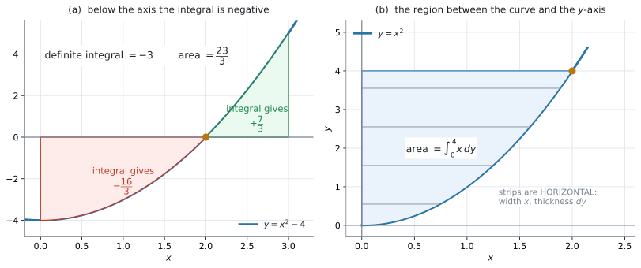

# AHL 5.12a — Area of a region enclosed by a curve and the $x$ or $y$-axes（曲線と軸で囲まれた面積） {#sec-ahl-5-12a}

::: {.callout-note}
## What you should be able to do
- **面積**と**定積分の値**が別のものだと分かる。
- 曲線が $x$ 軸の**下**に入るとき、$\displaystyle\int_{a}^{b}|y|\,dx$ で面積を求められる。
- $y = 0$ になる $x$ で**区間を区切り**、絶対値をとってから足せる。
- 曲線と **$y$ 軸**ではさまれた面積を、$\displaystyle\int_{a}^{b}|x|\,dy$ で求められる。
- そのために、$y = f(x)$ を **$x = g(y)$ に直し、端も $y$ の値に直せる**。
- 計算の前に、**積分の式を書ける**。
:::

::: {.callout-important}
## 公式集の 5.12 の欄（面積）
$2$ つ印刷されています。

$$
A = \int_{a}^{b} |y|\,dx
$$ {#eq-ahl512a-x}

$$
A = \int_{a}^{b} |x|\,dy
$$ {#eq-ahl512a-y}

見出しは「**Area of region enclosed by a curve and $x$ or $y$-axes**」です。

**配られるので、覚える必要はありません。** 身につけるべきなのは、**どちらの式を使うか**と、**modulus**（絶対値）**が何をしているか**です。

$1$ つ目は $x$ 軸ではさまれた面積、$2$ つ目は **$y$ 軸**ではさまれた面積です。どちらにも modulus が付いているのが、SL との違いです（[第2節](#negative)）。
:::

::: {.callout-note}
## SL 5.5 で「$f(x) > 0$ のとき」と断ったところが、ここで広がります
[SL 5.5](../../ai-sl/05-calculus/sl-5-5.qmd) では、SL の公式集の欄にこう書かれていました。

> Area of region enclosed by a curve $y = f(x)$ and the $x$-axis, where $f(x) > 0$

そこでは**曲線が $x$ 軸より上にある場合だけ**を扱いました。

**HL の公式集には、この欄そのものがありません。** 面積の式は $5.12$ の欄の $\displaystyle\int\lvert y \rvert\,dx$ だけで、$f(x) > 0$ という条件はどこにも出てきません。

シラバスの Guidance 欄も、一言だけ書いています。

> Including negative integrals.

このページで増えるのは、次の $2$ つです。

1. 曲線が **$x$ 軸の下**に入ってもよくなる
2. **$y$ 軸**ではさまれた面積も求められるようになる

回転体の体積は [AHL 5.12b](ahl-5-12b.qmd) で扱います。
:::

## The idea

### 1. 面積は $\displaystyle\int|y|\,dx$ です {#idea}

面積を求める式は、SL のときとほとんど同じです。**違うのは絶対値だけ**です。

$$
A = \int_{a}^{b} |y|\,dx
$$

曲線がずっと $x$ 軸より上にあるなら、$|y| = y$ なので SL とまったく同じ式になります。

$$
y > 0 \ \text{のとき} \qquad A = \int_{a}^{b} y\,dx
$$

**絶対値が効いてくるのは、軸の下に入るときだけ**です。ですから、まず**図をかいて、軸を横切るかどうかを見る**のが最初の仕事になります。

### 2. 軸の下に入ると、定積分は負になります {#negative}

$y = x^{2} - 4$ を、$0 \leq x \leq 3$ で考えます。

{#fig-ahl512a-area width=100%}

@fig-ahl512a-area の (a) がその図です。$x = 2$ で $x$ 軸を横切っています。

まず、そのまま定積分を計算します。

$$
\int_{0}^{3}\left(x^{2}-4\right)dx = \left[\frac{x^{3}}{3} - 4x\right]_{0}^{3} = 9 - 12 = -3
$$

**負の値が出ました。** 面積が負になることはありませんから、**これは面積ではありません。**

#### 手順は $3$ つです {#steps}

1. **$y = 0$ を解く**（区切る $x$ を出す）
2. 区間ごとに定積分を計算する
3. **絶対値をとってから**足す

$y = x^{2} - 4 = 0$ より $x = 2$ です（$0 \leq x \leq 3$ の中にあります）。

$$
\int_{0}^{2}\left(x^{2}-4\right)dx = \left(\frac{8}{3} - 8\right) - 0 = -\frac{16}{3}
$$

$$
\int_{2}^{3}\left(x^{2}-4\right)dx = (9 - 12) - \left(\frac{8}{3} - 8\right) = \frac{7}{3}
$$

$$
A = \left|-\frac{16}{3}\right| + \left|\frac{7}{3}\right| = \frac{16}{3} + \frac{7}{3} = \frac{23}{3}
$$

**定積分は $-3$、面積は $\dfrac{23}{3} = 7.67$ です。** まったく違う数です。

::: {.callout-note appearance="simple"}
[AHL 5.13](ahl-5-13.qmd#distance) の **displacement**（変位）と **distance travelled**（進んだ道のり）が、これとまったく同じ仕組みです。あちらは $\displaystyle\int v\,dt$ と $\displaystyle\int |v|\,dt$、こちらは $\displaystyle\int y\,dx$ と $\displaystyle\int |y|\,dx$ です。
:::

#### 電卓なら、絶対値を付けて一度に出せます {#abs-gdc}

区切らずに、$|y|$ をそのまま積分することもできます。

```
Numerical Integral:  下 0  上 3  式 abs(x^2-4)  変数 x
```

$7.6667$ と出ます（[GDC 第2節](#gdc-abs)）。

::: {.callout-important}
## 答えだけでよいときと、区切って書くべきときがあります
- **数値を答えるだけ**なら、`abs` を付けて電卓で一度に出して構いません
- **`Show that` や、部分点のある問題**では、上の $3$ 段（区切る → 区間ごとに積分 → 絶対値をとって足す）を書いてください

**電卓の $\displaystyle\int|y|\,dx$ は、その検算に使えます。**
:::

### 3. 「面積」と「定積分の値」は、別のことばです {#area-vs-integral}

問題文が何を聞いているかで、答えが変わります。

| 問題文 | 求めるもの | $y = x^{2}-4$、$0 \leq x \leq 3$ なら |
|---|---|---|
| `Find` と書かれ、$\displaystyle\int_{0}^{3} y\,dx$ が示されている | **定積分の値**。負にもなる | $-3$ |
| `Find the area of the region` | **面積**。負にならない | $\dfrac{23}{3} = 7.67$ |

: 聞かれているのはどちらか {#tbl-ahl512a-which}

**問題文の `area` という語を、丸で囲んでから始めてください。** この項目の失点は、ほとんどここです。

### 4. $y$ 軸ではさまれた面積 {#y-axis}

公式集の $2$ つ目は、$x$ と $y$ が入れかわった形です（@eq-ahl512a-y）。

$$
A = \int_{a}^{b} |x|\,dy
$$

@fig-ahl512a-area の (b) を見てください。$y = x^{2}$ と **$y$ 軸**ではさまれた、$y = 0$ から $y = 4$ までの部分です。

定積分は、**細長い短ざく**（細長い長方形）を足し合わせたものです（[SL 5.5](../../ai-sl/05-calculus/sl-5-5.qmd#definite)）。**その短ざくが、横向きになります。**

- $x$ 軸のとき … たて $y$、よこ $dx$ の**縦**の短ざく
- $y$ 軸のとき … よこ $x$、たて $dy$ の**横**の短ざく

#### 式を $x = g(y)$ に直します {#rearrange}

$\displaystyle\int x\,dy$ を計算するには、**$x$ を $y$ の式で書かなければなりません。**

$$
y = x^{2} \quad \Longrightarrow \quad x = \sqrt{y} \qquad (x \geq 0)
$$

**$2$ 乗のように偶数乗の式は、$x$ について解くと $2$ つになります。** $y = x^{2}$ なら $x = \pm\sqrt{y}$ です。どちらを使うかは、図のどちら側の部分かで決まります。@fig-ahl512a-area の (b) は $x \geq 0$ の側なので $x = \sqrt{y}$ です。

**$3$ 乗のように奇数乗なら、解は $1$ つだけ**です。

| もとの式 | $x = g(y)$ に直すと |
|---|---|
| $y = x^{2}$（$x \geq 0$） | $x = \sqrt{y} = y^{\frac{1}{2}}$ |
| $y = x^{3}$ | $x = \sqrt[3]{y} = y^{\frac{1}{3}}$ |
| $y = 2x$ | $x = \dfrac{y}{2}$ |
| $y = e^{x}$ | $x = \ln y$ |

: $x$ について解き直す {#tbl-ahl512a-rearrange}

**$y$ 軸の左側（$x < 0$）の部分なら、$x$ が負になります。** そのときに modulus が効いてきます。

#### 端も $y$ の値に直します {#limits}

積分の変数が $y$ になったので、**端も $y$ の値**でなければなりません。

問題文が $y$ の範囲で書いてくれていれば、そのまま使えます。$x$ の範囲で書かれていたら、直します。

$$
x = 0 \ \Rightarrow \ y = 0, \qquad x = 2 \ \Rightarrow \ y = 4
$$

$$
A = \int_{0}^{4} \sqrt{y}\,dy = \left[\frac{2}{3}y^{\frac{3}{2}}\right]_{0}^{4} = \frac{2}{3}(8) = \frac{16}{3}
$$

**検算。** $0 \leq x \leq 2$ の長方形（よこ $2$、たて $4$）の面積は $8$ です。曲線の下の面積は $\displaystyle\int_{0}^{2}x^{2}\,dx = \dfrac{8}{3}$。残りが $8 - \dfrac{8}{3} = \dfrac{16}{3}$ ✓

### 5. どちらの式を使うか {#choose}

**問題文が「どの軸ではさまれているか」を言っています。**

| 問題文 | 使う式 | 端は |
|---|---|---|
| `the curve and the x-axis` | $\displaystyle\int \lvert y \rvert\,dx$ | $x$ の値 |
| `the curve and the y-axis` | $\displaystyle\int \lvert x \rvert\,dy$ | $y$ の値 |

: どちらの軸か {#tbl-ahl512a-axis}

**$y$ 軸と言われたら、式を $x = g(y)$ に直す**という一手間が増えます。増えるのは、その一手間です。

## Why it works

::: {.callout-tip collapse="true"}
## クリックすると開きます

ここでは、公式集の $2$ つの式が**なぜその形なのか**を確かめます。

### なぜ絶対値を付けると面積になるのか {#why-abs}

定積分は、**細長い短ざくの面積を足し合わせたもの**でした（[SL 5.5](../../ai-sl/05-calculus/sl-5-5.qmd#definite)）。$1$ 枚の短ざくは、たて $y$、よこ $dx$ の長方形です。

曲線が $x$ 軸より**下**にあるとき、$y$ は負です。ですから $y\,dx$ も負になり、**足すと引かれてしまいます。**

図形としての高さは、$y$ が $-2$ なら $2$ です。つまり **$|y|$** です。ですから

$$
\text{短ざくの面積} = |y| \times dx
$$

これを足し合わせたものが @eq-ahl512a-x です。

@fig-ahl512a-area の (a) で言うと、$0 \leq x \leq 2$ の部分を**軸の上に折り返す**わけです。折り返せば、その部分が $+\dfrac{16}{3}$ の面積として数えられます。

### なぜ $\displaystyle\int x\,dy$ が横向きの面積なのか {#why-y}

短ざくの向きを $90^{\circ}$ 回しただけです。

- $x$ 軸のとき … たて $y$、よこ $dx$ の**縦**の短ざく
- $y$ 軸のとき … よこ $x$、たて $dy$ の**横**の短ざく

@fig-ahl512a-area の (b) に引いてある横線が、その短ざくです。$1$ 枚の面積は $x \times dy$ で、これを $y = a$ から $y = b$ まで足し合わせると @eq-ahl512a-y になります。

**$x$ が負の側（$y$ 軸の左）にある部分では、$x$ が負になります。** だから、こちらの式にも絶対値が付いています。

### $2$ つの面積を足すと長方形になります {#rectangle}

@fig-ahl512a-area の (b) の面積は $\dfrac{16}{3}$ でした。いっぽう、同じ曲線の**下**の面積は

$$
\int_{0}^{2}x^{2}\,dx = \left[\frac{x^{3}}{3}\right]_{0}^{2} = \frac{8}{3}
$$

です。**この $2$ つを足すと**

$$
\frac{16}{3} + \frac{8}{3} = 8
$$

で、よこ $2$・たて $4$ の長方形の面積になります。**曲線が長方形を $2$ つに切り分けている**わけです。

$y$ 軸の面積を出したあとは、この足し算で検算できます。
:::

## Worked examples

::: {.callout-note appearance="simple"}
問題文は英語です。意味が理解できなかったら、問題文の下の「**日本語訳**」を開いてください。解説は日本語です。
:::

::: {#exm-ahl512a-cross}
[Let $y = x^{2} - 4$.]{.q-en}

**(a)** [Find $\displaystyle\int_{0}^{3}\left(x^{2}-4\right)dx$.]{.q-en}

**(b)** [Find the area of the region enclosed by the curve and the $x$-axis for $0 \leq x \leq 3$.]{.q-en}

**(c)** [Explain why your answers to parts (a) and (b) are different.]{.q-en}

<details class="jp-trans">
<summary>日本語訳</summary>

$y = x^{2} - 4$ とします。

`the region enclosed by` は「〜で囲まれた領域」という意味です。

**(a)** $\displaystyle\int_{0}^{3}\left(x^{2}-4\right)dx$ を求めなさい。

**(b)** $0 \leq x \leq 3$ で、この曲線と $x$ 軸で囲まれた領域の面積を求めなさい。

**(c)** (a) と (b) の答えが違う理由を説明しなさい。

</details>

---

**(a)** そのまま積分します。

$$
\int_{0}^{3}\left(x^{2}-4\right)dx = \left[\frac{x^{3}}{3} - 4x\right]_{0}^{3} = 9 - 12 = -3
$$

**(b)** `area` と書かれているので、絶対値が要ります（@eq-ahl512a-x）。まず $y = 0$ を解いて区切ります（[第2節](#steps)）。

$$
x^{2} - 4 = 0 \quad \Longrightarrow \quad x = 2 \qquad (0 \leq x \leq 3 \ \text{の中にあります})
$$

$$
\int_{0}^{2}\left(x^{2}-4\right)dx = \frac{8}{3} - 8 = -\frac{16}{3}
$$

$$
\int_{2}^{3}\left(x^{2}-4\right)dx = -3 - \left(-\frac{16}{3}\right) = \frac{7}{3}
$$

（$-3$ は (a) で出した $\displaystyle\int_{0}^{3}$ の値です。$\displaystyle\int_{0}^{3} = \displaystyle\int_{0}^{2} + \displaystyle\int_{2}^{3}$ を使いました。）

**絶対値をとってから足します。**

$$
A = \frac{16}{3} + \frac{7}{3} = \frac{23}{3} = 7.67
$$

**(c)** 曲線が $x$ 軸を横切っているからです。

::: {.model-answer}
**試験ではこう書く**

*The curve is below the $x$-axis for $0 \leq x < 2$, so that part of the integral is negative and is subtracted. The definite integral therefore gives $-3$, while the area counts that part as positive and gives $\dfrac{23}{3}$.*
:::

（$0 \leq x < 2$ では曲線が $x$ 軸の下にあるので、その部分の積分は負になり、引かれてしまう。定積分は $-3$ になるが、面積はその部分を正として数えるので $\dfrac{23}{3}$ になる、という意味です。）

**検算。** 電卓で $\displaystyle\int_{0}^{3}\left|x^{2}-4\right|dx$ を計算すると $7.6667$ ✓ $\dfrac{23}{3} = 7.6667$ です（[GDC 第2節](#gdc-abs)）。

::: {.callout-note}
## 解答例（答案用紙にはこう書く）
**(a)**
$$
\int_{0}^{3}\left(x^{2}-4\right)dx = \left[\frac{x^{3}}{3}-4x\right]_{0}^{3} = 9 - 12 = -3
$$

**(b)**
$$
x^{2}-4 = 0 \quad \Longrightarrow \quad x = 2
$$
$$
\int_{0}^{2}\left(x^{2}-4\right)dx = -\frac{16}{3}, \qquad \int_{2}^{3}\left(x^{2}-4\right)dx = \frac{7}{3}
$$
$$
A = \frac{16}{3} + \frac{7}{3} = \frac{23}{3} = 7.67
$$

**(c)** *The curve lies below the $x$-axis for $0 \leq x < 2$, so that part of the integral is negative. The area counts it as positive instead.*
:::
:::

::: {#exm-ahl512a-sin}
[Consider the curve $y = \sin x$ for $0 \leq x \leq 2\pi$.]{.q-en}

**(a)** [Show that $\displaystyle\int_{0}^{2\pi}\sin x\,dx = 0$.]{.q-en}

**(b)** [Find the area of the region enclosed by the curve and the $x$-axis for $0 \leq x \leq 2\pi$.]{.q-en}

<details class="jp-trans">
<summary>日本語訳</summary>

$0 \leq x \leq 2\pi$ における曲線 $y = \sin x$ を考えます。

`Show that` は「与えられた答えに向かって、途中を全部書く」という意味です。

**(a)** $\displaystyle\int_{0}^{2\pi}\sin x\,dx = 0$ であることを示しなさい。

**(b)** $0 \leq x \leq 2\pi$ で、この曲線と $x$ 軸で囲まれた領域の面積を求めなさい。

</details>

---

**(a)** `Show that` なので、途中をすべて書きます。$\sin$ の積分は $-\cos$ です（[AHL 5.11a](ahl-5-11a.qmd#idea)）。

$$
\int_{0}^{2\pi}\sin x\,dx = \bigl[-\cos x\bigr]_{0}^{2\pi} = -\cos 2\pi + \cos 0 = -1 + 1 = 0
$$

**(b)** $\sin x = 0$ になるのは、$0 \leq x \leq 2\pi$ の中では $x = 0$、$\pi$、$2\pi$ です。**区切るのは $x = \pi$** です。

$$
\int_{0}^{\pi}\sin x\,dx = \bigl[-\cos x\bigr]_{0}^{\pi} = 1 + 1 = 2
$$

$$
\int_{\pi}^{2\pi}\sin x\,dx = \bigl[-\cos x\bigr]_{\pi}^{2\pi} = -1 - 1 = -2
$$

$$
A = |2| + |-2| = 4
$$

**定積分は $0$、面積は $4$ です。** 上下がちょうど打ち消し合っています。

**検算。** 電卓で $\displaystyle\int_{0}^{2\pi}\left|\sin x\right|dx$ を計算すると $4$ ✓ **Radian にしてから**計算してください（[AHL 5.11a](ahl-5-11a.qmd#radian)）。

::: {.callout-note}
## 解答例（答案用紙にはこう書く）
**(a)**
$$
\int_{0}^{2\pi}\sin x\,dx = \bigl[-\cos x\bigr]_{0}^{2\pi} = -1 - (-1) = 0
$$

**(b)**
$$
\sin x = 0 \quad \Longrightarrow \quad x = \pi \qquad (0 < x < 2\pi)
$$
$$
\int_{0}^{\pi}\sin x\,dx = 2, \qquad \int_{\pi}^{2\pi}\sin x\,dx = -2
$$
$$
A = 2 + 2 = 4
$$
:::
:::

::: {#exm-ahl512a-yaxis}
[The curve $y = x^{2}$ is drawn for $x \geq 0$.]{.q-en}

**(a)** [Write $x$ in terms of $y$.]{.q-en}

**(b)** [Find the area of the region enclosed by the curve, the $y$-axis and the line $y = 4$.]{.q-en}

<details class="jp-trans">
<summary>日本語訳</summary>

$x \geq 0$ について、曲線 $y = x^{2}$ が描かれています。

`in terms of` は「〜を使って」という意味です。

**(a)** $x$ を $y$ を使って表しなさい。

**(b)** この曲線、$y$ 軸、および直線 $y = 4$ で囲まれた領域の面積を求めなさい。

</details>

---

**(a)** $x$ について解きます（@tbl-ahl512a-rearrange）。$x \geq 0$ と書かれているので、正のほうだけです。

$$
y = x^{2} \quad \Longrightarrow \quad x = \sqrt{y} = y^{\frac{1}{2}}
$$

**(b)** `the y-axis` とあるので、$\displaystyle\int \lvert x \rvert\,dy$ です（@eq-ahl512a-y）。この領域では $x \geq 0$ なので $|x| = x$ です。

**端は $y$ の値**です（[第4節](#limits)）。領域は $y = 0$ から $y = 4$ までです。

$$
A = \int_{0}^{4} y^{\frac{1}{2}}\,dy = \left[\frac{2}{3}y^{\frac{3}{2}}\right]_{0}^{4}
$$

$4^{\frac{3}{2}} = 8$ なので

$$
A = \frac{2}{3}(8) - 0 = \frac{16}{3} = 5.33
$$

**検算。** よこ $2$・たて $4$ の長方形の面積が $8$、曲線の下の面積が $\displaystyle\int_{0}^{2}x^{2}\,dx = \dfrac{8}{3}$。残りは $8 - \dfrac{8}{3} = \dfrac{16}{3}$ ✓（[Why it works](#rectangle)）

::: {.callout-note}
## 解答例（答案用紙にはこう書く）
**(a)**
$$
x = \sqrt{y} \qquad (x \geq 0)
$$

**(b)**
$$
A = \int_{0}^{4} \sqrt{y}\,dy = \left[\frac{2}{3}y^{\frac{3}{2}}\right]_{0}^{4} = \frac{16}{3} = 5.33
$$
:::
:::

::: {#exm-ahl512a-gdc}
[Let $y = x^{3} - 4x$.]{.q-en}

**(a)** [Find the values of $x$ for which the curve meets the $x$-axis.]{.q-en}

**(b)** [Find the area of the region enclosed by the curve and the $x$-axis for $-1 \leq x \leq 2$.]{.q-en}

<details class="jp-trans">
<summary>日本語訳</summary>

$y = x^{3} - 4x$ とします。

`meets the x-axis` は「$x$ 軸と交わる」という意味です。

**(a)** この曲線が $x$ 軸と交わる $x$ の値を求めなさい。

**(b)** $-1 \leq x \leq 2$ で、この曲線と $x$ 軸で囲まれた領域の面積を求めなさい。

</details>

---

**(a)** $y = 0$ を解きます。因数分解できます。

$$
x^{3} - 4x = x\left(x^{2}-4\right) = x(x-2)(x+2) = 0
$$

$$
x = -2, \qquad x = 0, \qquad x = 2
$$

**(b)** $-1 \leq x \leq 2$ の中にあるのは **$x = 0$** だけです（$x = -2$ は範囲の外、$x = 2$ は端）。ですから、区切るのは $x = 0$ です。

$$
\int_{-1}^{0}\left(x^{3}-4x\right)dx = \left[\frac{x^{4}}{4} - 2x^{2}\right]_{-1}^{0} = 0 - \left(\frac{1}{4} - 2\right) = \frac{7}{4}
$$

$$
\int_{0}^{2}\left(x^{3}-4x\right)dx = (4 - 8) - 0 = -4
$$

$$
A = \frac{7}{4} + 4 = \frac{23}{4} = 5.75
$$

**検算。** 電卓で $\displaystyle\int_{-1}^{2}\left|x^{3}-4x\right|dx$ を計算すると $5.75$ ✓ そのまま積分すると $-\dfrac{9}{4} = -2.25$ で、面積とは違います。

::: {.callout-note}
## 解答例（答案用紙にはこう書く）
**(a)**
$$
x(x-2)(x+2) = 0 \quad \Longrightarrow \quad x = -2,\ 0,\ 2
$$

**(b)**
$$
\int_{-1}^{0}\left(x^{3}-4x\right)dx = \frac{7}{4}, \qquad \int_{0}^{2}\left(x^{3}-4x\right)dx = -4
$$
$$
A = \frac{7}{4} + 4 = \frac{23}{4} = 5.75
$$
:::
:::

## Common errors

::: {.callout-warning}
## 面積を聞かれているのに、そのまま積分して負の値を答える
**誤り**：$A = \displaystyle\int_{0}^{3}\left(x^{2}-4\right)dx = -3$ と書く。

**面積が負になることはありません**（@eq-ahl512a-x）。

**正しくは**：$y = 0$ で区切り、絶対値をとってから足します（[第2節](#steps)）。答えは $\dfrac{23}{3}$ です。

**この項目でいちばん多い失点です。**
:::

::: {.callout-warning}
## 区切らずに、答え全体の絶対値をとる
**誤り**：$\left|\displaystyle\int_{0}^{3}\left(x^{2}-4\right)dx\right| = |-3| = 3$ と書く。

これは**打ち消し合ったあとの値**の絶対値です。打ち消しは、絶対値をとる**前に**起きています。

**正しくは**：区間ごとに積分してから、それぞれの絶対値を足します。$\dfrac{16}{3} + \dfrac{7}{3} = \dfrac{23}{3}$ です。

$y = \sin x$ の例（@exm-ahl512a-sin）なら、この誤りは $0$ という答えを出してしまいます。
:::

::: {.callout-warning}
## 区切る点を、範囲の外まで拾ってしまう
**誤り**：$y = x^{3}-4x$ で、$-1 \leq x \leq 2$ なのに $x = -2$ でも区切ろうとする。

**正しくは**：$y = 0$ の解のうち、**その区間の中にあるものだけ**で区切ります（@exm-ahl512a-gdc）。

範囲を先に紙に書いてから、解を照らし合わせてください。
:::

::: {.callout-warning}
## $y$ 軸の面積で、$y = f(x)$ のまま積分する
**誤り**：$\displaystyle\int_{0}^{4} x^{2}\,dy$ と書く（$x$ が残っている）。

積分の変数が $y$ なら、**中身も $y$ の式**でなければなりません。

**正しくは**：$x = \sqrt{y}$ に直してから、$\displaystyle\int_{0}^{4}\sqrt{y}\,dy$ とします（[第4節](#rearrange)）。
:::

::: {.callout-warning}
## $y$ 軸の面積で、端を $x$ の値のままにする
**誤り**：$y = x^{2}$、$0 \leq x \leq 2$ の $y$ 軸側の面積を $\displaystyle\int_{0}^{2}\sqrt{y}\,dy$ と書く。

$x = 2$ に対応するのは $y = 4$ です。

**正しくは**：$\displaystyle\int_{0}^{4}\sqrt{y}\,dy$ です（[第4節](#limits)）。**式を $y$ に直したら、端も $y$ に直します。**
:::

::: {.callout-warning}
## 図をかかずに始める
**誤り**：$y = x^{2}-4$ が軸を横切ることに気づかないまま、そのまま積分する。

**正しくは**：**先に $y = 0$ を解くか、電卓でグラフを見てください**（[GDC 第1節](#gdc-graph)）。横切っていなければ、絶対値は要りません。
:::

::: {.callout-warning}
## `Show that` なのに、電卓の値だけを書く
**誤り**：$\displaystyle\int_{0}^{2\pi}\sin x\,dx = 0$ を示せ、と言われて「電卓で $0$ でした」と書く。

**正しくは**：$\bigl[-\cos x\bigr]_{0}^{2\pi} = -1 + 1 = 0$ と、原始関数と代入を書きます（[AHL 5.11a](ahl-5-11a.qmd#by-gdc)）。
:::

## Using your GDC (TI-Nspire CX II)

グラフを見てから計算するのが、この項目のいちばん確実なやり方です。

### 1. グラフで、軸を横切るか見る {#gdc-graph}

```
f1(x) = x^2-4
menu → Analyze Graph → Zero
```

**横切っていれば絶対値が要り、横切っていなければ要りません。** ここを見ずに始めると、[Common errors](#common-errors) の $1$ つ目になります。

`menu → Analyze Graph → Integral` を使うと、**塗られた面積と値**が画面に出ます（[SL 5.5](../../ai-sl/05-calculus/sl-5-5.qmd#graphs)）。$x$ 軸の下の部分は、**負の値**として表示されます。

### 2. 絶対値を付けて、一度に計算する {#gdc-abs}

```
menu → Calculus → Numerical Integral
下 0   上 3   式 abs(x^2-4)   変数 x
```

$7.6667$ と出ます。

| 入れる式 | 出るもの |
|---|---|
| `x^2-4` | 定積分の値 $-3$ |
| `abs(x^2-4)` | 面積 $7.67$ |

: `abs` を付けるかどうか {#tbl-ahl512a-gdc}

**`abs` を付けるだけで、答えがまったく変わります。** 問題文の `area` を丸で囲んでから電卓に向かってください。

### 3. $y$ 軸の面積も、同じ機能で出せます {#gdc-y}

変数の名前を $y$ にする必要はありません。**電卓の中では文字はただの入れ物**なので、$x$ のまま入れて構いません。

```
Numerical Integral:  下 0  上 4  式 √(x)  変数 x
```

$5.3333$ と出ます。$\dfrac{16}{3} = 5.3333$ ✓

**ただし答案では、$\displaystyle\int_{0}^{4}\sqrt{y}\,dy$ と $y$ で書いてください。**

### 4. 確かめ方 {#gdc-check}

$4$ つあります。

1. **面積が正**になっているか
2. **$y = 0$ の解**を、区間の中だけで拾ったか
3. $y$ 軸の問題なら、**式も端も $y$ に直した**か
4. `abs` を付けた電卓の値と、手で出した値が合うか

## Exercises

::: {.callout-note appearance="simple"}
各問題に、折りたたみが3つ付いています。**日本語訳**、**解答例**（答案用紙に書くべきこと。英語です）、**解説**（なぜそうなるか。日本語です）。

まず自分で解いて、次に解答例と見くらべてください。**解説は、合わなかったときだけ開けば十分です。**
:::

::: {.exercise-block}

[1]{.ex-no} [Find the area of the region enclosed by the curve $y = x^{2}$ and the $x$-axis for $0 \leq x \leq 3$.]{.q-en}

<details class="jp-trans">
<summary>日本語訳</summary>

$0 \leq x \leq 3$ で、曲線 $y = x^{2}$ と $x$ 軸で囲まれた領域の面積を求めなさい。

</details>

::: {.callout-note collapse="true"}
## 解答例（答案用紙に書くこと）
$$
A = \int_{0}^{3} x^{2}\,dx = \left[\frac{x^{3}}{3}\right]_{0}^{3} = 9
$$
:::

::: {.callout-tip collapse="true"}
## 解説
$y = x^{2}$ は、$0 \leq x \leq 3$ で**ずっと $x$ 軸の上**にあります。ですから $|y| = y$ で、絶対値は要りません（[第1節](#idea)）。

**横切らない問題も出ます。** 先に確かめる習慣をつけてください（[GDC 第1節](#gdc-graph)）。
:::

::: {.ex-sep}
:::

[2]{.ex-no} [Let $y = x - 3$.]{.q-en}

**(a)** [Find $\displaystyle\int_{0}^{4}(x-3)\,dx$.]{.q-en}

**(b)** [Find the area of the region enclosed by the line and the $x$-axis for $0 \leq x \leq 4$.]{.q-en}

<details class="jp-trans">
<summary>日本語訳</summary>

$y = x - 3$ とします。

**(a)** $\displaystyle\int_{0}^{4}(x-3)\,dx$ を求めなさい。

**(b)** $0 \leq x \leq 4$ で、この直線と $x$ 軸で囲まれた領域の面積を求めなさい。

</details>

::: {.callout-note collapse="true"}
## 解答例（答案用紙に書くこと）
**(a)**
$$
\int_{0}^{4}(x-3)\,dx = \left[\frac{x^{2}}{2}-3x\right]_{0}^{4} = 8 - 12 = -4
$$

**(b)**
$$
x - 3 = 0 \quad \Longrightarrow \quad x = 3
$$
$$
\int_{0}^{3}(x-3)\,dx = -\frac{9}{2}, \qquad \int_{3}^{4}(x-3)\,dx = \frac{1}{2}
$$
$$
A = \frac{9}{2} + \frac{1}{2} = 5
$$
:::

::: {.callout-tip collapse="true"}
## 解説
直線でも、やることは同じです（[第2節](#steps)）。

$$
\int_{0}^{3}(x-3)\,dx = \frac{9}{2} - 9 = -\frac{9}{2}
$$

$$
\int_{3}^{4}(x-3)\,dx = (8-12) - \left(-\frac{9}{2}\right) = \frac{1}{2}
$$

**検算。** これは三角形が $2$ つです。$0 \leq x \leq 3$ の三角形は底辺 $3$・高さ $3$ で面積 $4.5$、$3 \leq x \leq 4$ は底辺 $1$・高さ $1$ で面積 $0.5$。合わせて $5$ ✓
:::

::: {.ex-sep}
:::

[3]{.ex-no} [Find the area of the region enclosed by the curve $y = x^{2} - 9$ and the $x$-axis for $0 \leq x \leq 3$.]{.q-en}

<details class="jp-trans">
<summary>日本語訳</summary>

$0 \leq x \leq 3$ で、曲線 $y = x^{2} - 9$ と $x$ 軸で囲まれた領域の面積を求めなさい。

</details>

::: {.callout-note collapse="true"}
## 解答例（答案用紙に書くこと）
$$
\int_{0}^{3}\left(x^{2}-9\right)dx = \left[\frac{x^{3}}{3}-9x\right]_{0}^{3} = 9 - 27 = -18
$$
*The curve is below the $x$-axis for $0 \leq x < 3$, so $y$ does not change sign and*
$$
A = |-18| = 18
$$
:::

::: {.callout-tip collapse="true"}
## 解説
$x^{2}-9 = 0$ の解は $x = \pm 3$ で、$0 \leq x \leq 3$ の**内側**にはありません。ですから **$y$ は区間の中で符号を変えず**、$0 \leq x < 3$ でずっと負です。

**符号が変わらないときに限り**、$\displaystyle\int\lvert y \rvert\,dx$ は $\left\lvert\displaystyle\int y\,dx\right\rvert$ と一致します。ですから、この問題では区切らずに済みます（[第2節](#steps)）。

**符号が変わるかどうかを先に確かめてから**、この近道を使ってください。変わる場合にやると、[Common errors](#common-errors) の $2$ つ目の誤りになります。

**検算。** 電卓で $\displaystyle\int_{0}^{3}\left|x^{2}-9\right|dx$ を計算すると $18$ ✓
:::

::: {.ex-sep}
:::

[4]{.ex-no} [Find the area of the region enclosed by the curve $y = \cos x$ and the $x$-axis for $0 \leq x \leq \pi$.]{.q-en}

<details class="jp-trans">
<summary>日本語訳</summary>

$0 \leq x \leq \pi$ で、曲線 $y = \cos x$ と $x$ 軸で囲まれた領域の面積を求めなさい。

</details>

::: {.callout-note collapse="true"}
## 解答例（答案用紙に書くこと）
$$
\cos x = 0 \quad \Longrightarrow \quad x = \frac{\pi}{2}
$$
$$
\int_{0}^{\pi/2}\cos x\,dx = \bigl[\sin x\bigr]_{0}^{\pi/2} = 1
$$
$$
\int_{\pi/2}^{\pi}\cos x\,dx = \bigl[\sin x\bigr]_{\pi/2}^{\pi} = -1
$$
$$
A = 1 + 1 = 2
$$
:::

::: {.callout-tip collapse="true"}
## 解説
$\cos$ の積分は $\sin$ です。**マイナスは付きません**（[AHL 5.11a](ahl-5-11a.qmd#idea)）。

$0 \leq x \leq \pi$ で $\cos x = 0$ になるのは $x = \dfrac{\pi}{2}$ だけです。そこで区切ります。

**そのまま積分すると $0$** になります。@exm-ahl512a-sin と同じ形です。

**検算。** Radian にして、電卓で $\displaystyle\int_{0}^{\pi}\left|\cos x\right|dx$ を計算すると $2$ ✓
:::

::: {.ex-sep}
:::

[5]{.ex-no} [The curve $y = x^{3}$ is drawn. Find the area of the region enclosed by the curve, the $y$-axis and the line $y = 8$.]{.q-en}

<details class="jp-trans">
<summary>日本語訳</summary>

曲線 $y = x^{3}$ が描かれています。この曲線、$y$ 軸、および直線 $y = 8$ で囲まれた領域の面積を求めなさい。

</details>

::: {.callout-note collapse="true"}
## 解答例（答案用紙に書くこと）
$$
y = x^{3} \quad \Longrightarrow \quad x = y^{\frac{1}{3}}
$$
$$
A = \int_{0}^{8} y^{\frac{1}{3}}\,dy = \left[\frac{3}{4}y^{\frac{4}{3}}\right]_{0}^{8} = \frac{3}{4}(16) = 12
$$
:::

::: {.callout-tip collapse="true"}
## 解説
`the y-axis` なので $\displaystyle\int \lvert x \rvert\,dy$ です（@eq-ahl512a-y）。

まず $x$ について解きます（@tbl-ahl512a-rearrange）。$y = x^{3}$ は $3$ 乗なので、解は $1$ つだけです。

$$
x = \sqrt[3]{y} = y^{\frac{1}{3}}
$$

積分は $\dfrac{1}{3} + 1 = \dfrac{4}{3}$、$\div\dfrac{4}{3}$ は $\times\dfrac{3}{4}$ です。$8^{\frac{4}{3}} = \left(\sqrt[3]{8}\right)^{4} = 2^{4} = 16$。

**検算。** よこ $2$・たて $8$ の長方形の面積は $16$。曲線の下の面積は $\displaystyle\int_{0}^{2}x^{3}\,dx = 4$。$16 - 4 = 12$ ✓（[Why it works](#rectangle)）
:::

::: {.ex-sep}
:::

[6]{.ex-no} [Find the area of the region enclosed by the line $y = 2x$, the $y$-axis and the line $y = 6$.]{.q-en}

<details class="jp-trans">
<summary>日本語訳</summary>

直線 $y = 2x$、$y$ 軸、および直線 $y = 6$ で囲まれた領域の面積を求めなさい。

</details>

::: {.callout-note collapse="true"}
## 解答例（答案用紙に書くこと）
$$
y = 2x \quad \Longrightarrow \quad x = \frac{y}{2}
$$
$$
A = \int_{0}^{6} \frac{y}{2}\,dy = \left[\frac{y^{2}}{4}\right]_{0}^{6} = 9
$$
:::

::: {.callout-tip collapse="true"}
## 解説
直線でも手順は同じです。$x$ について解いて、$y$ で積分します（[第4節](#rearrange)）。

**検算。** この領域は三角形です。$y = 6$ のとき $x = 3$ なので、底辺 $3$・高さ $6$ の直角三角形。

$$
\frac{1}{2} \times 3 \times 6 = 9 \ ✓
$$

**直線の問題は、必ず図形の公式で検算できます。**
:::

::: {.ex-sep}
:::

[7]{.ex-no} [Let $y = x^{3} - 3x^{2} + 2x$.]{.q-en}

**(a)** [Find the values of $x$ for which $y = 0$.]{.q-en}

**(b)** [Find the area of the region enclosed by the curve and the $x$-axis for $0 \leq x \leq 2$.]{.q-en}

<details class="jp-trans">
<summary>日本語訳</summary>

$y = x^{3} - 3x^{2} + 2x$ とします。

**(a)** $y = 0$ となる $x$ の値を求めなさい。

**(b)** $0 \leq x \leq 2$ で、この曲線と $x$ 軸で囲まれた領域の面積を求めなさい。

</details>

::: {.callout-note collapse="true"}
## 解答例（答案用紙に書くこと）
**(a)**
$$
x\left(x^{2}-3x+2\right) = x(x-1)(x-2) = 0
$$
$$
x = 0,\ 1,\ 2
$$

**(b)**
$$
\int_{0}^{1}\left(x^{3}-3x^{2}+2x\right)dx = \left[\frac{x^{4}}{4}-x^{3}+x^{2}\right]_{0}^{1} = \frac{1}{4}
$$
$$
\int_{1}^{2}\left(x^{3}-3x^{2}+2x\right)dx = 0 - \frac{1}{4} = -\frac{1}{4}
$$
$$
A = \frac{1}{4} + \frac{1}{4} = \frac{1}{2}
$$
:::

::: {.callout-tip collapse="true"}
## 解説
**(a)** まず $x$ でくくります。残りは因数分解できます。

**(b)** 区間の**中**にある解は $x = 1$ だけです。$x = 0$ と $x = 2$ は端なので、区切りには使いません（[第2節](#steps)）。

$$
\left[\frac{x^{4}}{4}-x^{3}+x^{2}\right]_{0}^{2} = 4 - 8 + 4 = 0
$$

**そのまま積分すると $0$** です。上下が打ち消し合っています。

**検算。** 電卓で $\displaystyle\int_{0}^{2}\left|x^{3}-3x^{2}+2x\right|dx$ を計算すると $0.5$ ✓
:::

::: {.ex-sep}
:::

[8]{.ex-no} [Find the area of the region enclosed by the curve $y = 4 - x^{2}$ and the $x$-axis.]{.q-en}

<details class="jp-trans">
<summary>日本語訳</summary>

曲線 $y = 4 - x^{2}$ と $x$ 軸で囲まれた領域の面積を求めなさい。

</details>

::: {.callout-note collapse="true"}
## 解答例（答案用紙に書くこと）
$$
4 - x^{2} = 0 \quad \Longrightarrow \quad x = -2, \ 2
$$
$$
A = \int_{-2}^{2}\left(4-x^{2}\right)dx = \left[4x - \frac{x^{3}}{3}\right]_{-2}^{2}
$$
$$
= \left(8 - \frac{8}{3}\right) - \left(-8 + \frac{8}{3}\right) = \frac{32}{3} = 10.7
$$
:::

::: {.callout-tip collapse="true"}
## 解説
**この問題には区間が書かれていません。** そのときは、**曲線が軸と交わる点のあいだ**が区間になります。この曲線は $x$ 軸と $x = -2$ と $x = 2$ の $2$ 点でしか交わらないので、そのあいだが答える範囲です。

**交点が $3$ つ以上ある曲線では、領域も $2$ つ以上になります。** その場合は、隣り合う交点のあいだごとに求めて足します（@exm-ahl512a-gdc の曲線がその例です）。

ですから、まず $y = 0$ を解いて $x = \pm 2$ を出します。

$-2 \leq x \leq 2$ では $4 - x^{2} \geq 0$、つまり**ずっと軸の上**です。絶対値は要りません。

**検算。** 電卓で $\displaystyle\int_{-2}^{2}\left(4-x^{2}\right)dx$ を計算すると $10.667$ ✓ $\dfrac{32}{3} = 10.667$ です。
:::

::: {.ex-sep}
:::

[9]{.ex-no} [Explain why the value of $\displaystyle\int_{a}^{b} y\,dx$ can be zero even when the region enclosed by the curve and the $x$-axis has a positive area.]{.q-en}

<details class="jp-trans">
<summary>日本語訳</summary>

曲線と $x$ 軸で囲まれた領域の面積が正であっても、$\displaystyle\int_{a}^{b} y\,dx$ の値が $0$ になりうる理由を説明しなさい。

</details>

::: {.callout-note collapse="true"}
## 解答例（答案用紙に書くこと）
*Where the curve lies below the $x$-axis, $y$ is negative, so that part of the integral contributes a negative amount. If the region above the axis and the region below the axis have equal areas, the two contributions cancel and the integral is zero. The area, however, uses $|y|$, so both parts contribute positively and the total is not zero.*
:::

::: {.callout-tip collapse="true"}
## 解説
`Explain why` なので、**式と言葉の両方**を書きます。

要点は $2$ つで、両方書かないと点になりません。

- 軸の下では $y < 0$ なので、その区間の積分は**負**になる
- 面積は $|y|$ を使うので、その区間も**正**として足される

$y = \sin x$ を $0$ から $2\pi$ まで積分すると $0$ ですが、面積は $4$ です（@exm-ahl512a-sin）。これがその例です。

::: {.model-answer}
**試験ではこう書く**

*Below the $x$-axis $y$ is negative, so $\int y\,dx$ subtracts that part. If the areas above and below are equal, they cancel and the integral is $0$. The area uses $\int |y|\,dx$, which adds both parts, so it is positive. For example $\int_{0}^{2\pi}\sin x\,dx = 0$ but the area is $4$.*
:::
:::

::: {.ex-sep}
:::

[10]{.ex-no} [A student is asked for the area of the region enclosed by the curve $y = x^{2}-4$ and the $x$-axis for $0 \leq x \leq 3$, and writes]{.q-en}

$$
A = \left|\int_{0}^{3}\left(x^{2}-4\right)dx\right| = |-3| = 3
$$

[Identify the error and write down the correct method.]{.q-en}

<details class="jp-trans">
<summary>日本語訳</summary>

ある生徒が、$0 \leq x \leq 3$ における曲線 $y = x^{2}-4$ と $x$ 軸で囲まれた領域の面積を聞かれて、上のように書きました。誤りを指摘し、正しい方法を書きなさい。

</details>

::: {.callout-note collapse="true"}
## 解答例（答案用紙に書くこと）
*The student has taken the modulus after integrating, but the positive and negative parts have already cancelled inside the integral. The modulus must be taken on $y$ before integrating, or the interval must be split where $y = 0$.*
$$
x^{2}-4 = 0 \quad \Longrightarrow \quad x = 2
$$
$$
A = \left|-\frac{16}{3}\right| + \left|\frac{7}{3}\right| = \frac{23}{3} = 7.67
$$
:::

::: {.callout-tip collapse="true"}
## 解説
公式集の式は $\displaystyle\int_{a}^{b}|y|\,dx$ です（@eq-ahl512a-x）。**絶対値は $y$ に付いていて、積分の外ではありません。**

- 正しい形 … $\displaystyle\int_{a}^{b}\lvert y \rvert\,dx$
- 誤った形 … $\left\lvert \displaystyle\int_{a}^{b} y\,dx \right\rvert$

生徒のやり方だと、**打ち消し合ったあとの数**の絶対値をとることになります（[Common errors](#common-errors) の $2$ つ目）。

::: {.model-answer}
**試験ではこう書く**

*The modulus belongs inside the integral: the correct formula is $\int_{0}^{3}|y|\,dx$, not $\left|\int_{0}^{3} y\,dx\right|$. The parts above and below the axis cancel before the modulus is applied. Splitting at $x = 2$ gives $A = \frac{16}{3} + \frac{7}{3} = \frac{23}{3}$.*
:::

**検算。** 電卓で `abs` を付けて計算すると $7.67$ で、$3$ ではありません ✓
:::

:::
