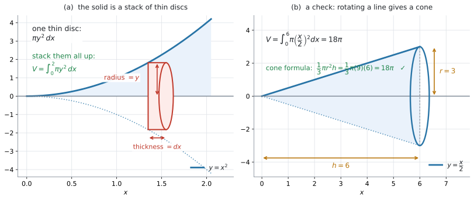

# AHL 5.12b — Volumes of revolution（回転体の体積） {#sec-ahl-5-12b}

::: {.callout-note}
## What you should be able to do
- **volume of revolution**（回転体の体積）が、薄い円板を積み重ねたものだと説明できる。
- $x$ 軸のまわりの回転で、$V = \displaystyle\int_{a}^{b}\pi y^{2}\,dx$ を使える。
- $y$ 軸のまわりの回転で、$V = \displaystyle\int_{a}^{b}\pi x^{2}\,dy$ を使える。
- そのために、**$x^{2}$ を $y$ の式に直し、端も $y$ の値に直せる**。
- 体積の式に**絶対値が要らない**理由を説明できる。
- 答えに $\pi$ を残した形と小数の形の**両方**を書き、単位（cm$^{3}$ など）を付けられる。
:::

::: {.callout-important}
## 公式集の 5.12 の欄（体積）
$2$ つ印刷されています。

$$
V = \int_{a}^{b}\pi y^{2}\,dx
$$ {#eq-ahl512b-x}

$$
V = \int_{a}^{b}\pi x^{2}\,dy
$$ {#eq-ahl512b-y}

見出しは「**Volume of revolution about $x$ or $y$-axes**」です。

**配られるので、覚える必要はありません。** 身につけるべきなのは、**どちらの軸のまわりに回すのか**を読み取ることと、**$y$ 軸のときに式を $y$ に直す**ことの $2$ つです。

シラバスの Guidance 欄も、この $2$ 式をそのまま書いています。
:::

::: {.callout-note}
## 面積の式との違いは、modulus の有無です
面積の式には **modulus**（絶対値）が付いていましたが（[AHL 5.12a](ahl-5-12a.qmd#idea)）、**体積の式には付いていません。**

$$
A = \int_{a}^{b}\lvert y \rvert\,dx \qquad\qquad V = \int_{a}^{b}\pi y^{2}\,dx
$$

$y$ が負でも $y^{2}$ は正になるので、**$2$ 乗が絶対値の代わりをしています**（[第2節](#no-abs)）。

積分そのものは [AHL 5.11a](ahl-5-11a.qmd) と [AHL 5.11b](ahl-5-11b.qmd) の道具で足ります。**新しい積分のやり方は出てきません。**
:::

## The idea

### 1. 薄い円板を、積み重ねます {#idea}

曲線と $x$ 軸ではさまれた領域を、**$x$ 軸のまわりに $1$ 回転**させると、立体ができます。これを **solid of revolution**（回転体）といいます。

{#fig-ahl512b-vol width=100%}

@fig-ahl512b-vol の (a) を見てください。回転体を、軸に垂直な薄い **disc**（円板）に切り分けます。

$1$ 枚の円板は、

- **半径**が、その位置での $y$
- **厚み**が $dx$

の **cylinder**（円柱）です。cylinder の体積は $\pi r^{2}h$（公式集の Prior learning の欄）ですから、$1$ 枚の体積は

$$
\pi y^{2} \times dx
$$

です。**これを $x = a$ から $x = b$ まで足し合わせた**ものが、@eq-ahl512b-x です。

$$
V = \int_{a}^{b}\pi y^{2}\,dx
$$

### 2. $x$ 軸のまわりの回転 {#x-axis}

$y = x^{2}$ を、$0 \leq x \leq 2$ で $x$ 軸のまわりに回します。

#### 手順は $4$ つです {#steps}

1. **$y$ を $x$ の式で書く** … $y = x^{2}$
2. **$2$ 乗する** … $y^{2} = x^{4}$
3. **$\pi$ を付けて積分する**

$$
V = \int_{0}^{2}\pi x^{4}\,dx = \pi\left[\frac{x^{5}}{5}\right]_{0}^{2} = \pi \times \frac{32}{5} = \frac{32\pi}{5}
$$

4. **小数にして、単位を付ける**

$$
V = \frac{32\pi}{5} = 20.1
$$

::: {.callout-tip}
## $\pi$ は積分の外に出せます
$\pi$ は定数なので、$\displaystyle\int$ の前に出しておくと計算が楽になります。

$$
\int_{a}^{b}\pi y^{2}\,dx = \pi\int_{a}^{b} y^{2}\,dx
$$

**ただし、出したまま書き忘れないでください。** $\pi$ の付け忘れは、この項目で最も多い失点です。
:::

#### $2$ 乗するので、負は消えます {#no-abs}

面積のときは、曲線が $x$ 軸の下に入ると絶対値が要りました（[AHL 5.12a](ahl-5-12a.qmd#negative)）。**体積では要りません。**

$y = -3$ でも $y = 3$ でも、円板の半径は $3$ です。$y^{2}$ はどちらも $9$ になります。

$$
(-3)^{2} = 3^{2} = 9
$$

**回転させてしまえば、軸の上か下かは関係なくなります。** ですから、体積の式には絶対値がありません。

::: {.callout-note appearance="simple"}
$V = \displaystyle\int_{a}^{b}\pi\lvert y \rvert^{2}\,dx$ と書いても、値は同じなので点は引かれません。**ただし要りません。** 公式集は $\displaystyle\int_{a}^{b}\pi y^{2}\,dx$ の形です。
:::

**曲線が軸を横切っても、そのまま積分して構いません。** それぞれの $x$ に対して円板が $1$ 枚できるだけで、重なりは起きません。

::: {.callout-note appearance="simple"}
たとえば $y = x^{3}-4x$ を $-2 \leq x \leq 2$ で $x$ 軸のまわりに回すと、山と谷が別々の場所にあるので、$2$ つのふくらみが並んだ立体になります。$\displaystyle\int_{-2}^{2}\pi y^{2}\,dx = \dfrac{2048\pi}{105} = 61.3$ が、そのまま体積です。

**面積（[AHL 5.12a](ahl-5-12a.qmd#negative)）と違って、区切る必要がありません。** ここが体積のほうが楽なところです。
:::

### 3. $y$ 軸のまわりの回転 {#y-axis}

公式集の $2$ つ目は、$x$ と $y$ が入れかわった形です（@eq-ahl512b-y）。

$$
V = \int_{a}^{b}\pi x^{2}\,dy
$$

円板が**横向きに積まれる**、と思ってください。$1$ 枚の円板は

- **半径**が、その高さでの $x$
- **厚み**が $dy$

です。

#### $x^{2}$ を $y$ の式に直します {#rearrange}

積分の変数が $y$ なので、**中身も $y$ の式**でなければなりません（[AHL 5.12a](ahl-5-12a.qmd#rearrange)）。

$y = x^{2}$ を $0 \leq y \leq 4$ で $y$ 軸のまわりに回すなら、**必要なのは $x^{2}$ であって $x$ ではありません。**

$$
y = x^{2} \quad \Longrightarrow \quad x^{2} = y
$$

::: {.callout-tip}
## $x$ を求めなくてよいことがあります
式に入るのは $x^{2}$ です。ですから $y = x^{2}$ のときは、**$x = \sqrt{y}$ に直す手間さえ要りません。** そのまま $x^{2} = y$ と読めます。

面積のとき（[AHL 5.12a](ahl-5-12a.qmd#rearrange)）は $x$ そのものが要ったので、$\sqrt{y}$ に直す必要がありました。**体積のほうが楽になる**場合があります。
:::

| もとの式 | $x^{2}$ を $y$ で書くと |
|---|---|
| $y = x^{2}$ | $x^{2} = y$ |
| $y = 3x$ | $x^{2} = \dfrac{y^{2}}{9}$ |
| $y = \sqrt{x}$ | $x^{2} = y^{4}$ |
| $y = \dfrac{x^{2}}{4}$ | $x^{2} = 4y$ |

: $x^{2}$ を $y$ の式に直す {#tbl-ahl512b-rearrange}

#### 端も $y$ の値に直します {#limits}

$$
V = \int_{0}^{4}\pi y\,dy = \pi\left[\frac{y^{2}}{2}\right]_{0}^{4} = \pi \times 8 = 8\pi = 25.1
$$

**$x$ 軸のときの $\dfrac{32\pi}{5} = 20.1$ とは違う値です。** 回す領域も違います。$x$ 軸のときは曲線の**下**、$y$ 軸のときは曲線の**左**の部分でした。**同じ曲線でも、軸が変われば領域も立体も変わります。**

### 4. どちらの軸か、先に決めます {#choose}

**問題文が「どの軸のまわりに回すか」を必ず言っています。**

| 問題文 | 使う式 | 直すもの | 端は |
|---|---|---|---|
| `about the x-axis` | $\displaystyle\int\pi y^{2}\,dx$ | $y$ を $x$ の式で | $x$ の値 |
| `about the y-axis` | $\displaystyle\int\pi x^{2}\,dy$ | $x^{2}$ を $y$ の式で | $y$ の値 |

: どちらの軸のまわりか {#tbl-ahl512b-axis}

**`about the ...` の部分を丸で囲んでから始めてください。** 軸を取り違えると、途中がすべて合っていても答えが違います。

### 5. 単位を付けます {#units}

長さが cm なら、体積は **cm$^{3}$** です。

$$
V = 8\pi \ \text{cm}^{3} = 25.1 \ \text{cm}^{3}
$$

::: {.callout-tip}
## $\pi$ を残した形も書いてください
`exact value` と言われたら $8\pi$、そうでなければ $25.1$ です（[AHL 5.11a](ahl-5-11a.qmd#by-gdc)）。

**両方書いておけば、どちらを聞かれていても答えになります。**
:::

## Why it works

::: {.callout-tip collapse="true"}
## クリックすると開きます

ここでは、公式集の式が**なぜ $\pi y^{2}$ という形なのか**と、それが**知っている立体で合うこと**を確かめます。

### なぜ $\pi y^{2}$ なのか {#why}

回転体を、軸に垂直な平面で薄く切ります。切り口はいつも**円**です。回転させて作った立体だからです。

@fig-ahl512b-vol の (a) の赤い部分が、その $1$ 枚です。

- 円の**半径**は、その位置での曲線の高さ、つまり $y$
- 円の**面積**は $\pi y^{2}$（公式集の Prior learning の欄）
- 板の**厚み**を $dx$ とすると、体積は $\pi y^{2} \times dx$

これを $x = a$ から $x = b$ まで足し合わせると、@eq-ahl512b-x になります。

**定積分が「短ざくを足し合わせたもの」だったのと、まったく同じ組み立て**です（[AHL 5.12a](ahl-5-12a.qmd#why-abs)）。違うのは、足すものが長方形ではなく円板だということだけです。

$y$ 軸のまわりなら、板を横向きに積むだけです。半径が $x$、厚みが $dy$ になって @eq-ahl512b-y ができます。

### 円錐の公式が出てきます {#cone}

$y = \dfrac{x}{2}$ を $0 \leq x \leq 6$ で $x$ 軸のまわりに回すと、**cone**（円錐）ができます。

@fig-ahl512b-vol の (b) がその絵です。$x = 6$ のとき $y = 3$ なので、半径 $3$、高さ $6$ の円錐です。

$$
V = \int_{0}^{6}\pi\left(\frac{x}{2}\right)^{2}dx = \pi\int_{0}^{6}\frac{x^{2}}{4}\,dx = \pi\left[\frac{x^{3}}{12}\right]_{0}^{6} = 18\pi
$$

円錐の公式（公式集の $3.1$ の欄）でも確かめられます。

$$
V = \frac{1}{3}\pi r^{2}h = \frac{1}{3}\pi(9)(6) = 18\pi \ ✓
$$

**知っている立体で答えが合うことを $1$ 回見ておくと、式が信用できるようになります。**

一般に、$y = mx$ を $0$ から $h$ まで回すと

$$
V = \int_{0}^{h}\pi m^{2}x^{2}\,dx = \frac{\pi m^{2}h^{3}}{3}
$$

で、$r = mh$ と書き直せば $\dfrac{1}{3}\pi r^{2}h$ になります。**円錐の公式そのものが、この積分から出てきます。**
:::

## Worked examples

::: {.callout-note appearance="simple"}
問題文は英語です。意味が理解できなかったら、問題文の下の「**日本語訳**」を開いてください。解説は日本語です。
:::

::: {#exm-ahl512b-x}
[The region enclosed by the curve $y = x^{2}$, the $x$-axis and the line $x = 2$ is rotated $360^{\circ}$ about the $x$-axis. Find the volume of the solid formed, giving your answer in terms of $\pi$ and correct to three significant figures.]{.q-en}

<details class="jp-trans">
<summary>日本語訳</summary>

曲線 $y = x^{2}$、$x$ 軸、および直線 $x = 2$ で囲まれた領域を、$x$ 軸のまわりに $360^{\circ}$ 回転させます。できた立体の体積を、$\pi$ を使った形と、有効数字 $3$ 桁の両方で求めなさい。

`is rotated 360° about` は「〜のまわりに $1$ 回転させる」、`in terms of π` は「$\pi$ を残した形で」という意味です。

</details>

---

`about the x-axis` なので @eq-ahl512b-x です（@tbl-ahl512b-axis）。手順の $4$ つに沿って進めます（[第2節](#steps)）。

**1. $y$ を $x$ の式で書く。**

$$
y = x^{2}
$$

**2. $2$ 乗する。**

$$
y^{2} = \left(x^{2}\right)^{2} = x^{4}
$$

**3. $\pi$ を付けて積分する。** 端は $x$ の値で、$0$ から $2$ です。

$$
V = \int_{0}^{2}\pi x^{4}\,dx = \pi\left[\frac{x^{5}}{5}\right]_{0}^{2} = \pi\left(\frac{32}{5}\right) = \frac{32\pi}{5}
$$

**4. 小数にして、単位を付ける。** この問題では単位が示されていないので、数だけです。

$$
V = \frac{32\pi}{5} = 20.1
$$

**検算。** 電卓で $\displaystyle\int_{0}^{2}\pi x^{4}\,dx$ を計算すると $20.106$ ✓（[GDC 第1節](#gdc-integral)）

**大きさの見当も合っています。** この立体は、半径 $4$・高さ $2$ の円柱（体積 $32\pi \approx 101$）の中にすっぽり入るので、$20.1$ は妥当な大きさです。

::: {.callout-note}
## 解答例（答案用紙にはこう書く）
$$
V = \int_{0}^{2}\pi\left(x^{2}\right)^{2}dx = \pi\int_{0}^{2} x^{4}\,dx
$$
$$
= \pi\left[\frac{x^{5}}{5}\right]_{0}^{2} = \frac{32\pi}{5} = 20.1
$$
:::
:::

::: {#exm-ahl512b-y}
[The region enclosed by the curve $y = x^{2}$, the $y$-axis and the line $y = 4$ is rotated $360^{\circ}$ about the $y$-axis.]{.q-en}

**(a)** [Write $x^{2}$ in terms of $y$.]{.q-en}

**(b)** [Find the volume of the solid formed, giving your answer in terms of $\pi$.]{.q-en}

<details class="jp-trans">
<summary>日本語訳</summary>

曲線 $y = x^{2}$、$y$ 軸、および直線 $y = 4$ で囲まれた領域を、$y$ 軸のまわりに $360^{\circ}$ 回転させます。

**(a)** $x^{2}$ を $y$ を使って表しなさい。

**(b)** できた立体の体積を、$\pi$ を使った形で求めなさい。

</details>

---

**(a)** 式に入るのは $x^{2}$ です。$x$ そのものは要りません（[第3節](#rearrange)）。

$$
y = x^{2} \quad \Longrightarrow \quad x^{2} = y
$$

**(b)** `about the y-axis` なので @eq-ahl512b-y です。**端も $y$ の値**で、$0$ から $4$ です（[第3節](#limits)）。

$$
V = \int_{0}^{4}\pi x^{2}\,dy = \pi\int_{0}^{4} y\,dy
$$

$$
= \pi\left[\frac{y^{2}}{2}\right]_{0}^{4} = \pi\left(\frac{16}{2}\right) = 8\pi
$$

$$
= 25.1
$$

**検算。** この立体は、半径 $2$・高さ $4$ の円柱（体積 $16\pi$）の**内側**にあり、**原点をとがった先とする**半径 $2$・高さ $4$ の円錐（体積 $\dfrac{1}{3}\pi(4)(4) = \dfrac{16\pi}{3} = 5.33\pi$）より**大きい**はずです。$8\pi$ はそのあいだにあります ✓

**@exm-ahl512b-x と同じ曲線ですが、答えが違います。** $x$ 軸なら $\dfrac{32\pi}{5}$、$y$ 軸なら $8\pi$ です。**回す軸が変われば、別の立体になります。**

::: {.callout-note}
## 解答例（答案用紙にはこう書く）
**(a)**
$$
x^{2} = y
$$

**(b)**
$$
V = \int_{0}^{4}\pi y\,dy = \pi\left[\frac{y^{2}}{2}\right]_{0}^{4} = 8\pi = 25.1
$$
:::
:::

::: {#exm-ahl512b-cone}
[The region enclosed by the line $y = \dfrac{x}{2}$, the $x$-axis and the line $x = 6$ is rotated $360^{\circ}$ about the $x$-axis.]{.q-en}

**(a)** [Show that the volume of the solid formed is $18\pi$.]{.q-en}

**(b)** [The solid is a cone. Write down its radius and its height, and verify your answer to part (a) using the formula for the volume of a cone.]{.q-en}

<details class="jp-trans">
<summary>日本語訳</summary>

直線 $y = \dfrac{x}{2}$、$x$ 軸、および直線 $x = 6$ で囲まれた領域を、$x$ 軸のまわりに $360^{\circ}$ 回転させます。

`verify` は「正しいことを示す根拠を書く」という意味です。ここでは別のやり方で同じ答えを出します。

**(a)** できた立体の体積が $18\pi$ であることを示しなさい。

**(b)** この立体は円錐です。その半径と高さを書き、円錐の体積の公式を使って (a) の答えを確かめなさい。

</details>

---

**(a)** `Show that` なので、途中をすべて書きます。

$$
y^{2} = \left(\frac{x}{2}\right)^{2} = \frac{x^{2}}{4}
$$

$$
V = \int_{0}^{6}\pi\frac{x^{2}}{4}\,dx = \frac{\pi}{4}\int_{0}^{6}x^{2}\,dx
$$

$$
= \frac{\pi}{4}\left[\frac{x^{3}}{3}\right]_{0}^{6} = \frac{\pi}{4} \times \frac{216}{3} = \frac{\pi}{4} \times 72 = 18\pi
$$

**(b)** @fig-ahl512b-vol の (b) を見てください。$x = 6$ のとき $y = 3$ です。

- **半径** $r = 3$（いちばん外側の $y$ の値）
- **高さ** $h = 6$（回した軸に沿った長さ）

円錐の体積の公式（公式集の $3.1$ の欄）に入れます。

$$
V = \frac{1}{3}\pi r^{2}h = \frac{1}{3}\pi(3)^{2}(6) = \frac{1}{3}\pi(9)(6) = 18\pi \ ✓
$$

**$2$ つのやり方で同じ答えになりました。**

::: {.callout-note}
## 解答例（答案用紙にはこう書く）
**(a)**
$$
V = \int_{0}^{6}\pi\left(\frac{x}{2}\right)^{2}dx = \frac{\pi}{4}\left[\frac{x^{3}}{3}\right]_{0}^{6} = \frac{\pi}{4}(72) = 18\pi
$$

**(b)**
$$
r = 3, \qquad h = 6
$$
$$
\frac{1}{3}\pi r^{2}h = \frac{1}{3}\pi(9)(6) = 18\pi \ ✓
$$
:::
:::

::: {#exm-ahl512b-bowl}
[A bowl is designed by rotating the curve $y = \dfrac{x^{2}}{4}$, for $0 \leq y \leq 9$, through $360^{\circ}$ about the $y$-axis. All lengths are in centimetres.]{.q-en}

**(a)** [Find the radius of the top of the bowl.]{.q-en}

**(b)** [Find the volume of the bowl, correct to three significant figures.]{.q-en}

**(c)** [The designer states that the bowl holds more than half a litre. Determine whether this is correct.]{.q-en}

<details class="jp-trans">
<summary>日本語訳</summary>

$0 \leq y \leq 9$ について、曲線 $y = \dfrac{x^{2}}{4}$ を $y$ 軸のまわりに $360^{\circ}$ 回転させて、ボウルを設計します。長さの単位はすべてセンチメートルです。

`holds` は「（容器が）入る」、`Determine whether` は「〜かどうかを、根拠を示したうえで判断しなさい」という意味です。

**(a)** ボウルの口の半径を求めなさい。

**(b)** ボウルの容積を、有効数字 $3$ 桁で求めなさい。

**(c)** 設計者は、このボウルには $0.5$ リットルより多く入ると述べています。これが正しいかどうかを判断しなさい。

</details>

---

**(a)** 口は $y = 9$ のところです。

$$
9 = \frac{x^{2}}{4} \quad \Longrightarrow \quad x^{2} = 36 \quad \Longrightarrow \quad x = 6
$$

半径は $6$ cm です（長さなので正のほうをとります）。

**(b)** `about the y-axis` なので @eq-ahl512b-y です。**$x^{2}$ を $y$ の式に直します**（@tbl-ahl512b-rearrange）。

$$
y = \frac{x^{2}}{4} \quad \Longrightarrow \quad x^{2} = 4y
$$

$$
V = \int_{0}^{9}\pi(4y)\,dy = 4\pi\left[\frac{y^{2}}{2}\right]_{0}^{9} = 4\pi\left(\frac{81}{2}\right) = 162\pi
$$

$$
V = 508.9 \approx 509 \ \text{cm}^{3}
$$

**(c)** $1$ リットルは $1000$ cm$^{3}$ なので、$0.5$ リットルは $500$ cm$^{3}$ です。

$$
509 > 500
$$

::: {.model-answer}
**試験ではこう書く**

*The volume is $162\pi = 509$ cm$^{3}$. Half a litre is $500$ cm$^{3}$, and $509 > 500$, so the designer is correct. However the bowl holds only about $9$ cm$^{3}$ more than half a litre, so the claim is only just true.*
:::

（体積は $509$ cm$^{3}$。$0.5$ リットルは $500$ cm$^{3}$ で、$509 > 500$ なので設計者は正しい。ただし差は $9$ cm$^{3}$ ほどしかないので、ぎりぎりである、という意味です。）

**検算。** 半径 $6$・高さ $9$ の円柱の体積は $\pi(36)(9) = 324\pi$ で、$162\pi$ はそのちょうど半分です。

**$y = ax^{2}$ を、$y = 0$ から $y$ 軸のまわりに回した形は、いつも外側の円柱のちょうど半分になります** ✓ $x$ 軸のまわりや、$y = 0$ から始まらない場合には成り立ちません。

::: {.callout-note}
## 解答例（答案用紙にはこう書く）
**(a)**
$$
9 = \frac{x^{2}}{4} \quad \Longrightarrow \quad x^{2} = 36, \qquad x = 6 \ \text{cm}
$$

**(b)**
$$
x^{2} = 4y
$$
$$
V = \int_{0}^{9}4\pi y\,dy = 4\pi\left[\frac{y^{2}}{2}\right]_{0}^{9} = 162\pi = 509 \ \text{cm}^{3}
$$

**(c)** *Half a litre is $500$ cm$^{3}$. Since $509 > 500$, the designer is correct, although the bowl holds only about $9$ cm$^{3}$ more.*
:::
:::

## Common errors

::: {.callout-warning}
## $\pi$ を書き忘れる
**誤り**：$V = \displaystyle\int_{0}^{2}x^{4}\,dx = \dfrac{32}{5}$ と書く。

**正しくは**：$\dfrac{32\pi}{5}$ です（@eq-ahl512b-x）。

$\pi$ を積分の外に出したあと、**最後に戻し忘れる**のがよくある形です（[第2節](#steps)）。答えを書く前に、$\pi$ があるか見てください。
:::

::: {.callout-warning}
## $2$ 乗しない
**誤り**：$V = \displaystyle\int_{0}^{2}\pi x^{2}\,dx$ と書く（$y = x^{2}$ をそのまま入れている）。

式に入るのは $y$ ではなく **$y^{2}$** です。$y = x^{2}$ なら $y^{2} = x^{4}$ です。

**正しくは**：$\displaystyle\int_{0}^{2}\pi x^{4}\,dx$ です（[第2節](#steps)）。

**「$2$ 乗する」を、独立した $1$ 段として書いてください。**
:::

::: {.callout-warning}
## 回す軸を取り違える
**誤り**：`about the y-axis` なのに $\displaystyle\int\pi y^{2}\,dx$ を使う。

同じ曲線でも、$x$ 軸なら $\dfrac{32\pi}{5}$、$y$ 軸なら $8\pi$ です（@exm-ahl512b-x、@exm-ahl512b-y）。**まったく違う立体**です。

**正しくは**：`about the ...` を丸で囲んでから式を選びます（@tbl-ahl512b-axis）。
:::

::: {.callout-warning}
## $y$ 軸の回転で、式を $y$ に直さない
**誤り**：$\displaystyle\int_{0}^{4}\pi x^{2}\,dy$ と書いたまま、$x$ を残して計算しようとする。

積分の変数が $y$ なら、**中身も $y$ の式**でなければなりません。

**正しくは**：$x^{2} = y$ に直して $\displaystyle\int_{0}^{4}\pi y\,dy$ とします（[第3節](#rearrange)）。
:::

::: {.callout-warning}
## $y$ 軸の回転で、端を $x$ の値のままにする
**誤り**：$y = x^{2}$、$0 \leq x \leq 2$ を $y$ 軸で回すとき、$\displaystyle\int_{0}^{2}\pi y\,dy$ と書く。

$x = 2$ に対応するのは $y = 4$ です。

**正しくは**：$\displaystyle\int_{0}^{4}\pi y\,dy$ です（[第3節](#limits)）。**式を $y$ に直したら、端も $y$ に直します。**
:::

::: {.callout-warning}
## 単位を書かない、または cm$^{2}$ と書く
**誤り**：$509$ とだけ書く。あるいは $509$ cm$^{2}$ と書く。

**体積なので cm$^{3}$** です（[第5節](#units)）。

**正しくは**：$509$ cm$^{3}$ です。**面積は $2$ 乗、体積は $3$ 乗**と結びつけてください。
:::

## Using your GDC (TI-Nspire CX II)

式を立てるところが、この項目の中身です。電卓は、値を出すのと検算に使います。

### 1. 体積を計算する {#gdc-integral}

```
menu → Calculus → Numerical Integral
下 0   上 2   式 π*x^4   変数 x
```

$20.1062$ と出ます（表示桁の設定によって、見える桁数は変わります）。

::: {.callout-warning}
## $\pi$ は専用のキーで入れてください
`3.14` と打つと、丸めた値で計算が進みます（[AHL 5.9c](ahl-5-9c.qmd#gdc-deriv)）。キーボードの $\pi$ のキーを使ってください。

**$\pi$ を式に入れ忘れると、答えが $\pi$ 分の $1$ になります。** $\pi$ を入れたつもりなのに $6.4$ のような値が出たら、それを疑ってください。
:::

### 2. $\pi$ を残した形も出せます {#gdc-exact}

$\pi$ を入れずに積分して、答えに $\pi$ を付ける、というやり方もあります。

```
Numerical Integral:  下 0  上 2  式 x^4  変数 x
```

$6.4$ と出ます。$6.4 = \dfrac{32}{5}$ なので、答えは $\dfrac{32\pi}{5}$ です。

**分数に直しにくいときは、$\pi$ を入れたまま計算して小数で答えてください。**

### 3. $y$ 軸の回転も、同じ機能で出せます {#gdc-y}

変数の名前を $y$ にする必要はありません。**電卓の中では文字はただの入れ物**なので、$x$ のまま入れて構いません（[AHL 5.12a](ahl-5-12a.qmd#gdc-y)）。

```
Numerical Integral:  下 0  上 9  式 π*4x  変数 x
```

$508.938$ と出ます。**ただし答案では $\displaystyle\int_{0}^{9}4\pi y\,dy$ と $y$ で書いてください。**

### 4. 確かめ方 {#gdc-check}

$4$ つあります。

1. **$\pi$** が答えに入っているか
2. **$2$ 乗**したか（$y$ ではなく $y^{2}$ を積分したか）
3. 軸が合っているか。$y$ 軸なら**式も端も $y$**（@tbl-ahl512b-axis）
4. **単位が cm$^{3}$** か

::: {.callout-tip}
## 知っている立体で、上限を確かめられます
回転体は、**それを包む円柱の中**に入ります。半径 $R$・高さ $h$ の円柱の体積は $\pi R^{2}h$ です。

@exm-ahl512b-x なら、半径 $4$・高さ $2$ の円柱の体積が $32\pi \approx 101$。答えの $20.1$ はその中に収まっています ✓

**答えが円柱の体積より大きくなっていたら、どこかで間違えています。** ただしこれは上限の確認なので、$\pi$ の付け忘れのような**小さくなる誤り**は見つかりません。そちらは[第1節](#gdc-integral)の注意で防いでください。
:::

## Exercises

::: {.callout-note appearance="simple"}
各問題に、折りたたみが3つ付いています。**日本語訳**、**解答例**（答案用紙に書くべきこと。英語です）、**解説**（なぜそうなるか。日本語です）。

まず自分で解いて、次に解答例と見くらべてください。**解説は、合わなかったときだけ開けば十分です。**
:::

::: {.exercise-block}

[1]{.ex-no} [The region enclosed by the line $y = 2x$, the $x$-axis and the line $x = 3$ is rotated $360^{\circ}$ about the $x$-axis. Find the volume of the solid formed, giving your answer in terms of $\pi$.]{.q-en}

<details class="jp-trans">
<summary>日本語訳</summary>

直線 $y = 2x$、$x$ 軸、および直線 $x = 3$ で囲まれた領域を、$x$ 軸のまわりに $360^{\circ}$ 回転させます。できた立体の体積を、$\pi$ を使った形で求めなさい。

</details>

::: {.callout-note collapse="true"}
## 解答例（答案用紙に書くこと）
$$
V = \int_{0}^{3}\pi(2x)^{2}\,dx = 4\pi\int_{0}^{3}x^{2}\,dx
$$
$$
= 4\pi\left[\frac{x^{3}}{3}\right]_{0}^{3} = 4\pi(9) = 36\pi
$$
:::

::: {.callout-tip collapse="true"}
## 解説
$(2x)^{2} = 4x^{2}$ です。**$2$ も $2$ 乗されます**（[第2節](#steps)）。$2x^{2}$ ではありません。

**検算。** これは円錐です。$x = 3$ で $y = 6$ なので、半径 $6$・高さ $3$。

$$
\frac{1}{3}\pi(36)(3) = 36\pi \ ✓
$$

（[Why it works](#cone)）
:::

::: {.ex-sep}
:::

[2]{.ex-no} [The region enclosed by the curve $y = x^{3}$, the $x$-axis and the line $x = 1$ is rotated $360^{\circ}$ about the $x$-axis. Find the volume of the solid formed, giving your answer in terms of $\pi$.]{.q-en}

<details class="jp-trans">
<summary>日本語訳</summary>

曲線 $y = x^{3}$、$x$ 軸、および直線 $x = 1$ で囲まれた領域を、$x$ 軸のまわりに $360^{\circ}$ 回転させます。できた立体の体積を、$\pi$ を使った形で求めなさい。

</details>

::: {.callout-note collapse="true"}
## 解答例（答案用紙に書くこと）
$$
V = \int_{0}^{1}\pi\left(x^{3}\right)^{2}dx = \pi\int_{0}^{1}x^{6}\,dx
$$
$$
= \pi\left[\frac{x^{7}}{7}\right]_{0}^{1} = \frac{\pi}{7}
$$
:::

::: {.callout-tip collapse="true"}
## 解説
$\left(x^{3}\right)^{2} = x^{6}$ です。**指数は掛けます**（[SL 1.5](../../ai-sl/01-number-and-algebra/sl-1-5.qmd)）。$x^{5}$ ではありません。

$$
\frac{\pi}{7} = 0.449
$$

**検算。** 半径 $1$・高さ $1$ の円柱の体積は $\pi = 3.14$。答えの $0.449$ はその中に収まっています ✓
:::

::: {.ex-sep}
:::

[3]{.ex-no} [The region enclosed by the curve $y = \sqrt{x}$, the $x$-axis and the lines $x = 1$ and $x = 4$ is rotated $360^{\circ}$ about the $x$-axis. Find the volume of the solid formed, correct to three significant figures.]{.q-en}

<details class="jp-trans">
<summary>日本語訳</summary>

曲線 $y = \sqrt{x}$、$x$ 軸、および直線 $x = 1$、$x = 4$ で囲まれた領域を、$x$ 軸のまわりに $360^{\circ}$ 回転させます。できた立体の体積を、有効数字 $3$ 桁で求めなさい。

</details>

::: {.callout-note collapse="true"}
## 解答例（答案用紙に書くこと）
$$
V = \int_{1}^{4}\pi\left(\sqrt{x}\right)^{2}dx = \pi\int_{1}^{4}x\,dx
$$
$$
= \pi\left[\frac{x^{2}}{2}\right]_{1}^{4} = \pi\left(8 - \frac{1}{2}\right) = \frac{15\pi}{2} = 23.6
$$
:::

::: {.callout-tip collapse="true"}
## 解説
$\left(\sqrt{x}\right)^{2} = x$ です。**根号が消えて、いちばん短い形になります。**

$2$ 乗すると楽になるのが、この問題の見どころです。面積のほうは $\displaystyle\int\sqrt{x}\,dx$ で分数の指数が要りますが、体積では要りません。

**端が $1$ から始まる**ことに注意してください。$0$ ではありません。

**検算。** 電卓で $\displaystyle\int_{1}^{4}\pi x\,dx$ を計算すると $23.562$ ✓
:::

::: {.ex-sep}
:::

[4]{.ex-no} [The region enclosed by the curve $y = e^{x}$, the $x$-axis and the lines $x = 0$ and $x = 1$ is rotated $360^{\circ}$ about the $x$-axis. Find the volume of the solid formed, correct to three significant figures.]{.q-en}

<details class="jp-trans">
<summary>日本語訳</summary>

曲線 $y = e^{x}$、$x$ 軸、および直線 $x = 0$、$x = 1$ で囲まれた領域を、$x$ 軸のまわりに $360^{\circ}$ 回転させます。できた立体の体積を、有効数字 $3$ 桁で求めなさい。

</details>

::: {.callout-note collapse="true"}
## 解答例（答案用紙に書くこと）
$$
V = \int_{0}^{1}\pi\left(e^{x}\right)^{2}dx = \pi\int_{0}^{1}e^{2x}\,dx
$$
$$
= \pi\left[\frac{e^{2x}}{2}\right]_{0}^{1} = \frac{\pi}{2}\left(e^{2}-1\right) = 10.0
$$
:::

::: {.callout-tip collapse="true"}
## 解説
$\left(e^{x}\right)^{2} = e^{2x}$ です。**指数は掛けます。** $e^{x^{2}}$ ではありません。

$e^{2x}$ の積分は $\dfrac{1}{2}e^{2x}$ です。中身が $1$ 次式なので、$x$ の係数 $2$ で割ります（[AHL 5.11b](ahl-5-11b.qmd#linear)）。

$$
\frac{\pi}{2}\left(e^{2}-1\right) = \frac{\pi}{2}(6.389) = 10.036
$$

**検算。** 電卓で $\displaystyle\int_{0}^{1}\pi e^{2x}\,dx$ を計算すると $10.036$ ✓
:::

::: {.ex-sep}
:::

[5]{.ex-no} [The region enclosed by the curve $y = x^{2}$, the $y$-axis and the line $y = 9$ is rotated $360^{\circ}$ about the $y$-axis. Find the volume of the solid formed, giving your answer in terms of $\pi$.]{.q-en}

<details class="jp-trans">
<summary>日本語訳</summary>

曲線 $y = x^{2}$、$y$ 軸、および直線 $y = 9$ で囲まれた領域を、$y$ 軸のまわりに $360^{\circ}$ 回転させます。できた立体の体積を、$\pi$ を使った形で求めなさい。

</details>

::: {.callout-note collapse="true"}
## 解答例（答案用紙に書くこと）
$$
x^{2} = y
$$
$$
V = \int_{0}^{9}\pi y\,dy = \pi\left[\frac{y^{2}}{2}\right]_{0}^{9} = \frac{81\pi}{2}
$$
:::

::: {.callout-tip collapse="true"}
## 解説
`about the y-axis` なので @eq-ahl512b-y です。**$x^{2}$ をそのまま $y$ に置きかえられます**（[第3節](#rearrange)）。

**端は $y$ の値**で、$0$ から $9$ です。$0$ から $3$ ではありません。

$$
\frac{81\pi}{2} = 127
$$

**検算。** 半径 $3$・高さ $9$ の円柱の体積は $\pi(9)(9) = 81\pi$。答えはちょうどその半分です ✓ $y = ax^{2}$ を $y = 0$ から $y$ 軸で回すと、外側の円柱のちょうど半分になります（@exm-ahl512b-bowl）。
:::

::: {.ex-sep}
:::

[6]{.ex-no} [The region enclosed by the line $y = 3x$, the $y$-axis and the line $y = 6$ is rotated $360^{\circ}$ about the $y$-axis. Find the volume of the solid formed, giving your answer in terms of $\pi$.]{.q-en}

<details class="jp-trans">
<summary>日本語訳</summary>

直線 $y = 3x$、$y$ 軸、および直線 $y = 6$ で囲まれた領域を、$y$ 軸のまわりに $360^{\circ}$ 回転させます。できた立体の体積を、$\pi$ を使った形で求めなさい。

</details>

::: {.callout-note collapse="true"}
## 解答例（答案用紙に書くこと）
$$
y = 3x \quad \Longrightarrow \quad x = \frac{y}{3}, \qquad x^{2} = \frac{y^{2}}{9}
$$
$$
V = \int_{0}^{6}\pi\frac{y^{2}}{9}\,dy = \frac{\pi}{9}\left[\frac{y^{3}}{3}\right]_{0}^{6} = \frac{\pi}{9}(72) = 8\pi
$$
:::

::: {.callout-tip collapse="true"}
## 解説
まず $x$ について解き、それから $2$ 乗します（@tbl-ahl512b-rearrange）。

$$
x = \frac{y}{3} \quad \Longrightarrow \quad x^{2} = \frac{y^{2}}{9}
$$

**$\dfrac{y}{9}$ ではありません。** 分母も $2$ 乗されます。

**検算。** これは円錐です。$y = 6$ のとき $x = 2$ なので、半径 $2$・高さ $6$。

$$
\frac{1}{3}\pi(4)(6) = 8\pi \ ✓
$$
:::

::: {.ex-sep}
:::

[7]{.ex-no} [The region enclosed by the curve $y = \dfrac{1}{x}$, the $x$-axis and the lines $x = 1$ and $x = 3$ is rotated $360^{\circ}$ about the $x$-axis. Find the volume of the solid formed, giving your answer in terms of $\pi$.]{.q-en}

<details class="jp-trans">
<summary>日本語訳</summary>

曲線 $y = \dfrac{1}{x}$、$x$ 軸、および直線 $x = 1$、$x = 3$ で囲まれた領域を、$x$ 軸のまわりに $360^{\circ}$ 回転させます。できた立体の体積を、$\pi$ を使った形で求めなさい。

</details>

::: {.callout-note collapse="true"}
## 解答例（答案用紙に書くこと）
$$
y^{2} = \frac{1}{x^{2}} = x^{-2}
$$
$$
V = \int_{1}^{3}\pi x^{-2}\,dx = \pi\left[-\frac{1}{x}\right]_{1}^{3}
$$
$$
= \pi\left(-\frac{1}{3} + 1\right) = \frac{2\pi}{3}
$$
:::

::: {.callout-tip collapse="true"}
## 解説
**$2$ 乗してから、指数が $-1$ かどうかを見てください**（[AHL 5.11a](ahl-5-11a.qmd#minus-one)）。

$y = \dfrac{1}{x}$ の**面積**なら $\ln$ が出ますが、$y^{2} = x^{-2}$ の**体積**では指数が $-2$ なので、べき乗の公式が使えます。$\ln$ にはなりません。

$$
\int x^{-2}\,dx = \frac{x^{-1}}{-1} = -\frac{1}{x}
$$

$$
\frac{2\pi}{3} = 2.09
$$

**検算。** 電卓で $\displaystyle\int_{1}^{3}\dfrac{\pi}{x^{2}}\,dx$ を計算すると $2.0944$ ✓
:::

::: {.ex-sep}
:::

[8]{.ex-no} [The region enclosed by the line $y = mx$, the $x$-axis and the line $x = h$ is rotated $360^{\circ}$ about the $x$-axis, where $m > 0$ and $h > 0$. Show that the volume of the solid formed is $\dfrac{1}{3}\pi r^{2}h$, where $r = mh$.]{.q-en}

<details class="jp-trans">
<summary>日本語訳</summary>

$m > 0$、$h > 0$ とします。直線 $y = mx$、$x$ 軸、および直線 $x = h$ で囲まれた領域を、$x$ 軸のまわりに $360^{\circ}$ 回転させます。できた立体の体積が $\dfrac{1}{3}\pi r^{2}h$（ただし $r = mh$）であることを示しなさい。

</details>

::: {.callout-note collapse="true"}
## 解答例（答案用紙に書くこと）
$$
V = \int_{0}^{h}\pi(mx)^{2}dx = \pi m^{2}\int_{0}^{h}x^{2}\,dx
$$
$$
= \pi m^{2}\left[\frac{x^{3}}{3}\right]_{0}^{h} = \frac{\pi m^{2}h^{3}}{3}
$$
$$
= \frac{1}{3}\pi (mh)^{2} h = \frac{1}{3}\pi r^{2}h
$$
:::

::: {.callout-tip collapse="true"}
## 解説
`Show that` なので、**与えられた形に向かって**書きます（[AHL 5.11a](ahl-5-11a.qmd#by-gdc)）。

最後の $1$ 行が要です。$m^{2}h^{3} = (mh)^{2}h$ と書きかえます。

$$
(mh)^{2}h = m^{2}h^{2} \times h = m^{2}h^{3} \ ✓
$$

$r = mh$ は、$x = h$ のときの $y$ の値、つまり**円錐の底面の半径**です。

**これで、円錐の体積の公式が積分から出てきました**（[Why it works](#cone)）。文字が入っていても、やることは数のときと同じです。
:::

::: {.ex-sep}
:::

[9]{.ex-no} [Explain why the formula for a volume of revolution does not need a modulus sign, even though the formula for an area does.]{.q-en}

<details class="jp-trans">
<summary>日本語訳</summary>

面積の公式には絶対値の記号が必要なのに、回転体の体積の公式には必要ない理由を説明しなさい。

</details>

::: {.callout-note collapse="true"}
## 解答例（答案用紙に書くこと）
*In the area formula the height of a strip is $y$, which is negative when the curve is below the $x$-axis, so the modulus is needed to make each strip contribute a positive amount. In the volume formula the radius of a disc appears as $y^{2}$, and $y^{2}$ is never negative, so every disc already contributes a positive amount. The squaring does the job of the modulus.*
:::

::: {.callout-tip collapse="true"}
## 解説
`Explain why` なので、**式と言葉の両方**を書きます。

要点は $2$ つで、両方書かないと点になりません。

- 面積の短ざくの高さは $y$ で、軸の下では**負**になる（[AHL 5.12a](ahl-5-12a.qmd#why-abs)）
- 体積の円板の半径は $y$ だが、式に入るのは $y^{2}$ で、**負にならない**

$(-3)^{2} = 3^{2} = 9$ という $1$ 行を書き添えると、はっきりします。

::: {.model-answer}
**試験ではこう書く**

*The area formula uses $y$ itself as the height of a strip, and $y < 0$ below the $x$-axis, so a modulus is needed. The volume formula uses $y^{2}$, which is positive whether $y$ is positive or negative — for example $(-3)^{2} = 3^{2} = 9$ — so no modulus is needed.*
:::
:::

::: {.ex-sep}
:::

[10]{.ex-no} [A student is asked for the volume of the solid formed when the region enclosed by $y = x^{2}$, the $x$-axis and the line $x = 2$ is rotated $360^{\circ}$ about the $x$-axis, and writes]{.q-en}

$$
V = \int_{0}^{2} x^{2}\,dx = \frac{8}{3}
$$

[Identify two errors and write down the correct working.]{.q-en}

<details class="jp-trans">
<summary>日本語訳</summary>

ある生徒が、$y = x^{2}$、$x$ 軸、および直線 $x = 2$ で囲まれた領域を $x$ 軸のまわりに $360^{\circ}$ 回転させたときにできる立体の体積を聞かれて、上のように書きました。誤りを $2$ つ指摘し、正しい計算を書きなさい。

</details>

::: {.callout-note collapse="true"}
## 解答例（答案用紙に書くこと）
*First, the student has not squared $y$: the formula uses $y^{2} = \left(x^{2}\right)^{2} = x^{4}$, not $x^{2}$. Second, the factor $\pi$ is missing. The correct working is*
$$
V = \int_{0}^{2}\pi\left(x^{2}\right)^{2}dx = \pi\left[\frac{x^{5}}{5}\right]_{0}^{2} = \frac{32\pi}{5} = 20.1
$$
:::

::: {.callout-tip collapse="true"}
## 解説
生徒が計算したのは、**曲線の下の面積**です（[AHL 5.12a](ahl-5-12a.qmd#idea)）。体積ではありません。

$$
\int_{0}^{2}x^{2}\,dx = \frac{8}{3} \qquad ← \text{これは面積}
$$

足りないものが $2$ つあります。

1. **$2$ 乗**（$y$ ではなく $y^{2}$）
2. **$\pi$**

::: {.model-answer}
**試験ではこう書く**

*Two things are missing. The integrand must be $y^{2} = x^{4}$, not $y = x^{2}$, and the factor $\pi$ must be included. Correctly, $V = \int_{0}^{2}\pi x^{4}\,dx = \dfrac{32\pi}{5} = 20.1$.*
:::

**検算。** $\dfrac{8}{3} = 2.67$ と $20.1$ では、桁が違います。**大きさの見当をつけていれば気づけます**（[GDC 第4節](#gdc-check)）。
:::

:::
