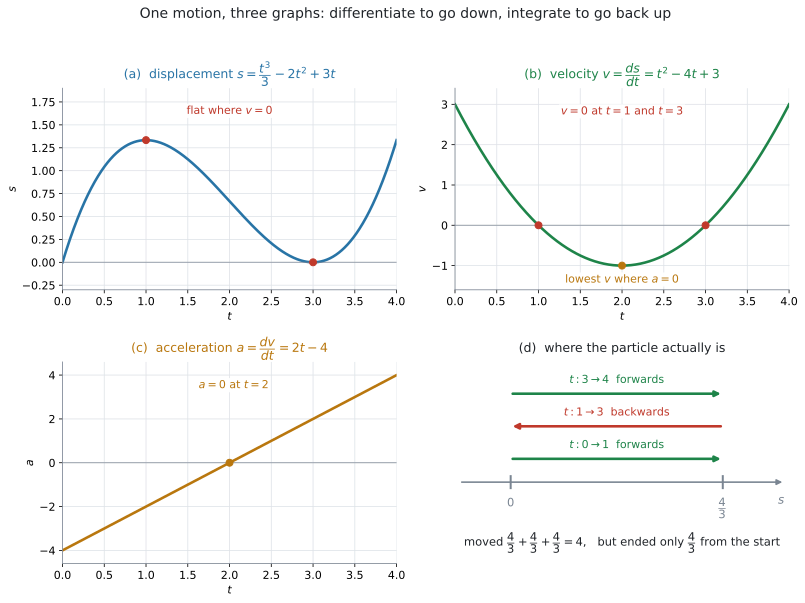
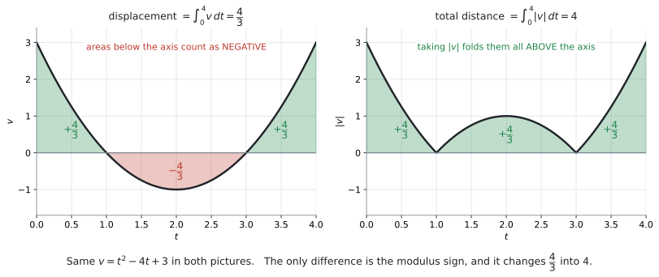

# AHL 5.13 — Kinematics（運動力学） {#sec-ahl-5-13}

::: {.callout-note}
## What you should be able to do
- **displacement**（変位）$s$、**velocity**（速度）$v$、**acceleration**（加速度）$a$ の関係を説明できる。
- $v = \dfrac{ds}{dt}$、$a = \dfrac{dv}{dt} = \dfrac{d^{2}s}{dt^{2}}$ を使って、微分で $s \to v \to a$ と進める。
- $v$ が $s$ の式で与えられたとき、$a = v\dfrac{dv}{ds}$ を使える。
- 積分で $v \to s$ と戻り、初期条件から定数を決められる。
- **displacement $= \displaystyle\int_{t_1}^{t_2} v\,dt$** と **total distance $= \displaystyle\int_{t_1}^{t_2} |v|\,dt$** を書き分けられる。
- **speed**（速さ）が $|v|$ であることを使い、最大の速さを求められる。
- $\dot{x}$、$\ddot{x}$ という書き方を読める。
:::

## The idea

### 1. $s$、$v$、$a$ は、微分でつながっています {#idea}

まっすぐな線の上を動く **particle**（粒子。大きさを考えない、点のような物体）を考えます。時刻 $t$ に、

- どこにいるか … **displacement**（変位）$s$
- どれくらいの速さで、どちら向きに動いているか … **velocity**（速度）$v$
- 速度がどう変わっているか … **acceleration**（加速度）$a$

この $3$ つは、**微分でつながっています。**

$$
s \ \xrightarrow{\ \text{微分}\ } \ v \ \xrightarrow{\ \text{微分}\ } \ a
$$

$$
v = \frac{ds}{dt}, \qquad a = \frac{dv}{dt} = \frac{d^{2}s}{dt^{2}} = v\frac{dv}{ds}
$$ {#eq-ahl513-chain}

公式集の $5.13$ の欄には、この $a$ の式と、次の $2$ つが印刷されています。

$$
\text{distance travelled from } t_1 \text{ to } t_2 = \int_{t_1}^{t_2} |v(t)|\,dt
$$ {#eq-ahl513-dist}

$$
\text{displacement from } t_1 \text{ to } t_2 = \int_{t_1}^{t_2} v(t)\,dt
$$ {#eq-ahl513-disp}

**ただし $v = \dfrac{ds}{dt}$ は印刷されていません。** これだけは覚えてください。とはいえ「速度は、位置の変化の速さ」という意味そのものなので、忘れにくい式です。

**新しい微分の公式も、新しい積分の公式も出てきません。** 使うのは [SL 5.3](../../ai-sl/05-calculus/sl-5-3.qmd) の微分と [SL 5.5](../../ai-sl/05-calculus/sl-5-5.qmd) の積分だけで、新しいのは **$s$、$v$、$a$ が微分でつながっているという見方**のほうです。

**逆向きは積分です。**

$$
a \ \xrightarrow{\ \text{積分}\ } \ v \ \xrightarrow{\ \text{積分}\ } \ s
$$

このページでやることは、この行き来だけです。

{#fig-ahl513-links width=100%}

@fig-ahl513-links は、$v = t^{2} - 4t + 3$ で動く物体を $4$ つの絵で見たものです。(a) から (c) が $3$ つのグラフ、(d) が数直線の上の動きです。**どれも同じ $1$ つの運動**を見ています。

- (a) の $s$ が水平になっているところで、(b) の $v$ が $0$ になっています
- (b) の $v$ がいちばん下になっているところで、(c) の $a$ が $0$ になっています
- (d) は、この物体が**実際にどこにいるか**です。前へ進み、戻り、また前へ進んでいます

### 2. 記号と単位 {#notation}

| 量 | 記号 | 単位の例 | 意味 |
|---|---|---|---|
| **displacement**（変位） | $s$ | m | 基準の点から見た**位置**。負にもなる |
| **velocity**（速度） | $v$ | m s$^{-1}$ | 位置の変化の速さ。**向きを含む**ので負にもなる |
| **speed**（速さ） | $\lvert v \rvert$ | m s$^{-1}$ | 速度の**大きさ**。負にならない |
| **acceleration**（加速度） | $a$ | m s$^{-2}$ | 速度の変化の速さ。負にもなる |

: 記号と単位 {#tbl-ahl513-symbols}

::: {.callout-important}
## displacement と distance、velocity と speed
**どちらも「向きを含むか、含まないか」の違い**です。

- **displacement**（変位）… 向きを含む。$-3$ m は「基準から $3$ m 手前」
- **distance**（道のり・距離）… 向きを含まない。負になりません
- **velocity**（速度）… 向きを含む。$-2$ m s$^{-1}$ は「逆向きに毎秒 $2$ m」
- **speed**（速さ）… 向きを含まない。$|-2| = 2$ m s$^{-1}$

シラバスも、そこを一行で書いています。

> **Speed is the magnitude of velocity.**

英語の問題文では、この $4$ つが厳密に使い分けられます。**どちらを聞かれているかを、丸で囲んでから解いてください。**
:::

#### ドットの書き方 {#dot}

シラバスは、もう $1$ つの書き方も挙げています。

> Use of $\dot{x} = \dfrac{dx}{dt}$ and $\ddot{x} = \dfrac{d^{2}x}{dt^{2}}$.

$x$ の上の**点の数が、$t$ で微分した回数**です。

$$
\dot{x} = \frac{dx}{dt}, \qquad \ddot{x} = \frac{d^{2}x}{dt^{2}}
$$ {#eq-ahl513-dot}

::: {.callout-note appearance="simple"}
**この書き方は、$t$ で微分するときにだけ使います。** ですから kinematics では便利です。$\dot{s} = v$、$\ddot{s} = a$ と書けます。

**答案では、どちらの書き方でも構いません。** ただし、**問題文がドットで書いてきたら読めるようにしておいてください。**
:::

### 3. 微分で下へ進みます {#down}

$s$ の式が与えられたら、微分するだけです。@fig-ahl513-links の例なら

$$
s = \frac{t^{3}}{3} - 2t^{2} + 3t
$$

$$
v = \frac{ds}{dt} = t^{2} - 4t + 3
$$

$$
a = \frac{dv}{dt} = 2t - 4
$$

です（[SL 5.3](../../ai-sl/05-calculus/sl-5-3.qmd#rule) のべき乗の公式）。

**$v = 0$ と $a = 0$ には、それぞれ意味があります。**

| 条件 | 意味 | この例では |
|---|---|---|
| $v = 0$ | **一瞬静止する**（**instantaneously at rest**）。前後で $v$ の**符号が変われば**、向きも変わる | $t = 1$、$t = 3$ |
| $a = 0$ | **velocity（速度）が極大・極小になる候補。** 前後で $a$ の符号が変わるかを確かめる | $t = 2$ |
| $v > 0$ | $s$ が増える向きに動いている | $t < 1$、$t > 3$ |
| $v < 0$ | $s$ が減る向きに動いている | $1 < t < 3$ |

: $v = 0$ と $a = 0$ の読み方 {#tbl-ahl513-zero}

::: {.callout-warning}
## `at rest`（静止している）は $v = 0$ です。$a = 0$ ではありません
`Find the times when the particle is at rest` と聞かれたら、解くのは

$$
v = 0
$$

です。$a = 0$ を解くと、**velocity（速度）が極大・極小になる候補**が得られます。ただし、**前後で $a$ の符号が変わるか**を確かめる必要があります。$v = 0$ とは別のものです。
:::

::: {.callout-tip}
## `changes direction`（向きを変える）も $v = 0$ です
ただし、**$v = 0$ になっただけでは足りません。** $v$ の**符号が変わる**必要があります。

この例では $t = 1$ と $t = 3$ の前後で $v$ の符号が変わるので、どちらも向きが変わります。

$v = (t-2)^{2}$ のような式だと、$t = 2$ で $v = 0$ になりますが**符号は変わりません。** この場合、向きは変わらず、一瞬止まるだけです。
:::

#### second derivative とのつながり {#second-derivative}

シラバスは、[AHL 5.10](ahl-5-10.qmd) にこのリンクを付けています。

> Link to: kinematics (AHL5.13) and second order differential equations (AHL5.18).

$a = \dfrac{d^{2}s}{dt^{2}}$ は、**変位 $s$ の second derivative** です。つまり **acceleration は second derivative そのもの**で、[AHL 5.10](ahl-5-10.qmd) でやったことが、そのまま言葉を変えて出てきています。

| [AHL 5.10](ahl-5-10.qmd) の言い方 | kinematics での言い方 |
|---|---|
| $f'$ | velocity $v = \dot{s}$ |
| $f''$ | acceleration $a = \ddot{s}$ |
| $f'' > 0$（concave-up） | 速度が増えている |
| $f'' < 0$（concave-down） | 速度が減っている |

: 同じものを $2$ つの言葉で {#tbl-ahl513-kin}

ですから [AHL 5.10 第5節](ahl-5-10.qmd#four) の「増えているが、増え方は鈍ってきている」は、kinematics では「**前へ進んでいるが、減速している**」（$v > 0$、$a < 0$）にあたります。

[AHL 5.18](ahl-5-18.qmd) の $\dfrac{d^{2}x}{dt^{2}}$ も、同じ second derivative です。

### 4. $v$ が $s$ の式のときは、$a = v\dfrac{dv}{ds}$ {#vdvds}

公式集の $1$ 行目にある、$3$ 番目の書き方です（@eq-ahl513-chain）。

$$
a = v\frac{dv}{ds}
$$

**使うのは、$v$ が $t$ ではなく $s$ の式で与えられたとき**だけです。

たとえば $v = 2s + 3$ と書かれていると、$\dfrac{dv}{dt}$ は直接出せません。$v$ が $t$ の式ではないからです。そこで $s$ で微分します。

$$
\frac{dv}{ds} = 2
$$

$$
a = v\frac{dv}{ds} = (2s + 3) \times 2 = 4s + 6
$$

となります。**$t$ を通らずに $a$ が出ました。**

::: {.callout-tip}
## 手で微分できない形でも、$1$ 点なら電卓で出せます
$v = \sqrt{9 + 4s}$ のように平方根が入っていると、$\dfrac{dv}{ds}$ の**式**を出すには chain rule（合成関数の微分法）が要ります。これは [AHL 5.9b](ahl-5-9b.qmd#chain) の内容です。

ただし、**ある $1$ 点での $a$ を聞かれているだけ**なら、電卓の numerical derivative で $\dfrac{dv}{ds}$ の値を出し、$v$ の値と掛ければ済みます（[GDC 第3節](#gdc-deriv)）。
:::

::: {.callout-tip}
## 見分け方は「$v$ が何の式か」だけです
| $v$ が与えられた形 | 使う式 |
|---|---|
| $v$ が **$t$ の式**（例：$v = t^{2} - 4t + 3$） | $a = \dfrac{dv}{dt}$ |
| $v$ が **$s$ の式**（例：$v = 2s + 3$） | $a = v\dfrac{dv}{ds}$ |

: どちらの式を使うか {#tbl-ahl513-which}

**$v$ の式の中に $t$ があるか、$s$ があるか。** そこを見てから始めてください。
:::

### 5. 積分で上へ戻ります {#up}

$v$ から $s$ に戻るときは、積分します。公式集の $3$ 行目です（@eq-ahl513-disp）。

$$
\text{displacement from } t_1 \text{ to } t_2 = \int_{t_1}^{t_2} v(t)\,dt
$$

**これは「$t_1$ から $t_2$ までの位置の変化」**です。$t_1$ での位置がどこであれ、そこから**位置がどれだけ変わったか**を表します。後戻りしたぶんは、差し引かれます。

::: {.callout-important}
## `displacement` は、$2$ つの意味で使われます
- `the displacement between` … 時刻が $2$ つ書いてあれば、**位置の変化** $s(t_2) - s(t_1)$ です。初期条件は要りません
- `the displacement when` … 時刻が $1$ つなら、そのときの**位置**です。$t = 0$ での位置が与えられていなければ答えられません

**時刻が $2$ つ書いてあれば変化、$1$ つなら位置**です。問題文が初期条件を書いているかどうかでも見分けられます。
:::

同じ例で、$t = 0$ から $t = 4$ までを計算します。

$$
\int_{0}^{4}(t^{2} - 4t + 3)\,dt = \left[\frac{t^{3}}{3} - 2t^{2} + 3t\right]_{0}^{4} = \frac{64}{3} - 32 + 12 = \frac{4}{3}
$$

**$4$ 秒たった時点で、出発点から $\dfrac{4}{3}$ m のところにいます。**

::: {.callout-important}
## 位置そのものを聞かれたら、初期条件が要ります
$\displaystyle\int v\,dt$ が返すのは**位置の変化**です。**いまどこにいるか**を答えるには、出発点が要ります。

不定積分で書くと

$$
s = \int v\,dt = \frac{t^{3}}{3} - 2t^{2} + 3t + C
$$

で、$t = 0$ のとき $s = 0$ なら $C = 0$ です（[SL 5.5](../../ai-sl/05-calculus/sl-5-5.qmd#boundary)）。

**$a$ から $v$ に戻るときも、まったく同じです。** $a = 6t - 4$ で、$t = 0$ のとき $v = 5$ なら

$$
v = \int (6t - 4)\,dt = 3t^{2} - 4t + C
$$

$$
5 = 0 - 0 + C \quad \Longrightarrow \quad C = 5
$$

$$
v = 3t^{2} - 4t + 5
$$

です。

**$+C$ を忘れないでください。** 位置を聞かれているのに変化だけを答えると、**答えそのものが違う値**になります。
:::

### 6. 道のりは、$|v|$ を積分します {#distance}

**この項目でいちばん失点するのは、ここです。**

$$
\text{total distance travelled} = \int_{t_1}^{t_2} |v(t)|\,dt
$$

同じ例で、$t = 0$ から $t = 4$ までの**道のり**を求めます。

{#fig-ahl513-area width=100%}

@fig-ahl513-area の左が displacement、右が total distance です。**式の違いは絶対値だけ**ですが、答えは $\dfrac{4}{3}$ と $4$ でまったく違います。

**手で求めるときは、$v = 0$ になる時刻で区切ります。**

$$
\int_{0}^{1} v\,dt = \frac{4}{3}, \qquad \int_{1}^{3} v\,dt = -\frac{4}{3}, \qquad \int_{3}^{4} v\,dt = \frac{4}{3}
$$

$$
\text{total distance} = \frac{4}{3} + \frac{4}{3} + \frac{4}{3} = 4
$$

**マイナスの区間を、プラスに直してから足します。**

::: {.callout-important}
## 手順は $3$ つです
1. **$v = 0$ を解く**（区切る時刻を出す）
2. 区間ごとに $\displaystyle\int v\,dt$ を計算する
3. **絶対値をとってから**足す

電卓なら $\displaystyle\int_{t_1}^{t_2}|v|\,dt$ を一度に計算できます（[GDC 第2節](#gdc-dist)）。**答えだけならそれで十分**ですが、`Show that` や部分点のある問題では、上の $3$ 段を書いてください。
:::

::: {.callout-warning}
## $v$ が符号を変えないなら、$2$ つは一致します
$0 \le t \le 1$ のように、$v$ がずっと正の区間だけを聞かれているなら

$$
\int v\,dt = \int |v|\,dt
$$

です。**区切る必要もありません。** 区切りが要るのは、**途中で向きが変わるとき**だけです。

ですから、まず **$v = 0$ がその区間の中にあるか**を確かめてください。
:::

### 7. speed は $|v|$ です {#speed}

シラバスの一行です。

> Speed is the magnitude of velocity.

$$
\text{speed} = |v|
$$ {#eq-ahl513-speed}

$v = -1$ m s$^{-1}$ なら、speed は $1$ m s$^{-1}$ です。**speed が負になることはありません。**

#### 最大の speed は、どこで起きるか {#max-speed}

`Find the maximum speed` と聞かれたら、候補は $2$ 種類です。

1. **$a = 0$ になる時刻**（velocity が極大・極小になる候補）
2. **区間の両端**

同じ例で、$1 \le t \le 3$ の範囲を考えます。$a = 2t - 4 = 0$ より $t = 2$。

$$
v(2) = 4 - 8 + 3 = -1 \quad \Longrightarrow \quad \text{speed} = |-1| = 1 \ \text{m s}^{-1}
$$

両端は $v(1) = 0$、$v(3) = 0$ なので、**最大の speed は $1$ m s$^{-1}$**（$t = 2$ のとき）です。

::: {.callout-warning}
## $v$ の最大と speed の最大は、別のことがあります
$v$ がいちばん**大きい**のと、$|v|$ がいちばん**大きい**のは違います。

すぐ上の $1 \leq t \leq 3$ を見てください。$v$ の最大は $0$（$t = 1$ と $t = 3$）ですが、speed の最大は $1$（$t = 2$）です。**起きる時刻も、値も違います。**

$0 \leq t \leq 4$ に広げると、$v$ の最大も speed の最大も $3$ になり、今度は一致します。

**$v$ が負になる区間があるときは、必ず $|v|$ で考えてください。**
:::

## Why it works

::: {.callout-tip collapse="true"}
## クリックすると開きます

### なぜ $\displaystyle\int v\,dt$ が「位置の変化」なのか {#why-disp}

$v = \dfrac{ds}{dt}$ でした。ですから $v$ の原始関数は $s$ そのものです。

$$
\int_{t_1}^{t_2} v\,dt = \bigl[s\bigr]_{t_1}^{t_2} = s(t_2) - s(t_1)
$$

**「終わりの位置 $-$ 始めの位置」**、つまり位置の変化です。$s(t_1)$ が引かれてしまうので、**出発点の情報は消えます。** だから位置そのものを聞かれたら初期条件が要るのです（[第5節](#up)）。

### なぜ $|v|$ にすると道のりになるのか {#why-dist}

$v < 0$ の区間では、$\displaystyle\int v\,dt$ は負の値を返します。「戻った」ぶんが**引かれる**ということです。

道のりでは、戻ったぶんも**足し**たい。ですから、その区間だけ符号を反転させます。それが $|v|$ です。

@fig-ahl513-area の右の絵は、左の絵の**軸の下の部分を、上に折り返した**ものです。折り返せば、面積はすべて正のまま足されます。

### なぜ $a = v\dfrac{dv}{ds}$ なのか {#why-vdvds}

$v$ が $s$ の関数で、$s$ が $t$ の関数のとき、$\dfrac{dv}{dt}$ を **$2$ 段に分けて**書きます。

$$
a = \frac{dv}{dt} = \frac{dv}{ds} \times \frac{ds}{dt}
$$

「$t$ で微分する」を、「$s$ で微分してから、$s$ を $t$ で微分したものを掛ける」に分けたわけです。ここで $\dfrac{ds}{dt} = v$ ですから

$$
a = \frac{dv}{ds} \times v = v\frac{dv}{ds}
$$

となります。**$t$ を経由せずに $a$ が出る**、というのがこの式の値打ちです。

::: {.callout-note appearance="simple"}
この分け方を **chain rule**（合成関数の微分法）といいます。一般の形は [AHL 5.9b](ahl-5-9b.qmd#chain) で扱います。ここでは、$a = v\dfrac{dv}{ds}$ という結果だけ使えれば十分です。
:::

::: {.callout-note appearance="simple"}
## $v^{2} = u^{2} + 2as$ との関係
$a$ が**一定**のとき、$a = v\dfrac{dv}{ds}$ から $v^{2} = u^{2} + 2as$ が出てきます（$u$ は $s = 0$ での速度）。

たとえば $v = \sqrt{9 + 4s}$、つまり $v^{2} = 3^{2} + 2 \times 2 \times s$ なら、$u = 3$、$a = 2$ です。

**使えるのは $a$ が一定のときだけ**です。[第3節](#down)の $a = 2t - 4$ や、[第4節](#vdvds)の $a = 4s + 6$ のように $a$ が変わる場合には使えません。**この式は AI の公式集にもありません。** 検算に使うだけにしてください。
:::
:::

## Worked examples

::: {.callout-note appearance="simple"}
問題文は英語です。意味が理解できなかったら、問題文の下の「**日本語訳**」を開いてください。解説は日本語です。
:::

::: {#exm-ahl513-poly}
[A particle moves in a straight line. Its velocity, in m s$^{-1}$, at time $t$ seconds is]{.q-en}

$$
v = t^{2} - 4t + 3, \qquad t \geq 0
$$

**(a)** [Find the times at which the particle is at rest.]{.q-en}

**(b)** [Find an expression for the acceleration, and find the time at which the acceleration is zero.]{.q-en}

**(c)** [Find the maximum speed of the particle for $1 \leq t \leq 3$.]{.q-en}

<details class="jp-trans">
<summary>日本語訳</summary>

ある粒子が直線上を動きます。時刻 $t$ 秒における速度（m s$^{-1}$）は上の式です。

`at rest` は「静止している」、`an expression for` は「〜を表す式」という意味です。

**(a)** 粒子が静止する時刻を求めなさい。

**(b)** 加速度を表す式を求め、加速度が $0$ になる時刻を求めなさい。

**(c)** $1 \leq t \leq 3$ における粒子の最大の速さを求めなさい。

</details>

---

**(a)** `at rest` は $v = 0$ です（[第3節](#down)）。

$$
t^{2} - 4t + 3 = 0
$$

$$
(t - 1)(t - 3) = 0 \quad \Longrightarrow \quad t = 1, \qquad t = 3
$$

**検算。** どちらも $t \geq 0$ をみたしています ✓

**(b)** $v$ は $t$ の式なので、$t$ で微分します（@tbl-ahl513-which）。

$$
a = \frac{dv}{dt} = 2t - 4
$$

$$
2t - 4 = 0 \quad \Longrightarrow \quad t = 2
$$

**(c)** speed は $|v|$ です（[第7節](#speed)）。候補は **$a = 0$ の時刻**と**両端**です。

$$
v(1) = 0, \qquad v(2) = 4 - 8 + 3 = -1, \qquad v(3) = 0
$$

$$
\text{speed} = |{-1}| = 1
$$

最大の速さは $1$ m s$^{-1}$（$t = 2$ のとき）です。

**検算。** $1 \leq t \leq 3$ では $v \leq 0$ なので、**speed がいちばん大きいのは $v$ がいちばん小さいところ**です。$t = 2$ で合っています ✓

::: {.callout-note}
## 解答例（答案用紙にはこう書く）
**(a)**
$$
v = 0 \quad \Longrightarrow \quad (t-1)(t-3) = 0
$$
$$
t = 1, \qquad t = 3
$$

**(b)**
$$
a = \frac{dv}{dt} = 2t - 4
$$
$$
a = 0 \quad \Longrightarrow \quad t = 2
$$

**(c)**
$$
v(2) = -1, \qquad \text{speed} = |{-1}| = 1 \ \text{m s}^{-1}
$$
:::
:::

::: {#exm-ahl513-dist}
[For the particle in @exm-ahl513-poly, the displacement is $0$ when $t = 0$.]{.q-en}

**(a)** [Find the displacement of the particle when $t = 4$.]{.q-en}

**(b)** [Find the total distance travelled by the particle in the first $4$ seconds.]{.q-en}

**(c)** [Explain why your answers to parts (a) and (b) are different.]{.q-en}

<details class="jp-trans">
<summary>日本語訳</summary>

例題1 の粒子について、$t = 0$ のとき変位は $0$ です。

`total distance travelled` は「進んだ道のりの合計」という意味です。

**(a)** $t = 4$ のときの粒子の変位を求めなさい。

**(b)** 最初の $4$ 秒間に粒子が進んだ道のりの合計を求めなさい。

**(c)** (a) と (b) の答えが違う理由を説明しなさい。

</details>

---

**(a)** displacement は $v$ をそのまま積分します（@eq-ahl513-disp）。$t = 0$ で $s = 0$ なので、$0$ から $4$ までの定積分がそのまま位置になります。

$$
s = \int_{0}^{4}(t^{2} - 4t + 3)\,dt = \left[\frac{t^{3}}{3} - 2t^{2} + 3t\right]_{0}^{4}
$$

$$
= \frac{64}{3} - 32 + 12 = \frac{4}{3} = 1.33 \ \text{m}
$$

**(b)** total distance は $|v|$ を積分します（@eq-ahl513-dist）。$v = 0$ になるのは $t = 1$ と $t = 3$ なので、そこで区切ります（[第6節](#distance)）。

$$
\int_{0}^{1} v\,dt = \left[\frac{t^{3}}{3} - 2t^{2} + 3t\right]_{0}^{1} = \frac{1}{3} - 2 + 3 = \frac{4}{3}
$$

$$
\int_{1}^{3} v\,dt = (9 - 18 + 9) - \frac{4}{3} = -\frac{4}{3}
$$

$$
\int_{3}^{4} v\,dt = \frac{4}{3} - 0 = \frac{4}{3}
$$

**絶対値をとってから足します。**

$$
\text{total distance} = \frac{4}{3} + \frac{4}{3} + \frac{4}{3} = 4 \ \text{m}
$$

**検算。** 電卓で $\displaystyle\int_{0}^{4}|v|\,dt$ を計算すると $4$ です ✓（[GDC 第2節](#gdc-dist)）

**(c)** 途中で向きが変わっているからです。

::: {.model-answer}
**試験ではこう書く**

*The particle changes direction at $t = 1$ and $t = 3$. Between $t = 1$ and $t = 3$ the velocity is negative, so the particle moves backwards and that part of the integral is negative. The displacement counts this backward motion as a loss, giving $\dfrac{4}{3}$ m, while the total distance counts it as extra travelling, giving $4$ m.*
:::

（粒子は $t = 1$ と $t = 3$ で向きを変える。$1 < t < 3$ では速度が負なので後ろへ動き、その区間の積分は負になる。変位はその後戻りを差し引いて $\dfrac{4}{3}$ m、道のりは進んだぶんとして足して $4$ m になる、という意味です。）

::: {.callout-note}
## 解答例（答案用紙にはこう書く）
**(a)**
$$
s = \int_{0}^{4}(t^{2}-4t+3)\,dt = \frac{4}{3} = 1.33 \ \text{m}
$$

**(b)**
$$
v = 0 \quad \Longrightarrow \quad t = 1,\ 3
$$
$$
\int_{0}^{1} v\,dt = \frac{4}{3}, \qquad \int_{1}^{3} v\,dt = -\frac{4}{3}, \qquad \int_{3}^{4} v\,dt = \frac{4}{3}
$$
$$
\text{total distance} = \frac{4}{3} + \frac{4}{3} + \frac{4}{3} = 4 \ \text{m}
$$

**(c)** *The velocity is negative for $1 < t < 3$, so the particle moves backwards. The displacement subtracts this motion, while the total distance adds it.*
:::
:::

::: {#exm-ahl513-vdvds}
[The velocity $v$, in m s$^{-1}$, of a particle is given in terms of its displacement $s$ metres by]{.q-en}

$$
v = 2s + 3, \qquad s \geq 0
$$

**(a)** [Find an expression for the acceleration of the particle.]{.q-en}

**(b)** [Find the acceleration when $s = 4$.]{.q-en}

**(c)** [State, with a reason, whether the acceleration is constant.]{.q-en}

<details class="jp-trans">
<summary>日本語訳</summary>

ある粒子の速度 $v$（m s$^{-1}$）が、変位 $s$（メートル）を使って上のように与えられています。

`in terms of` は「〜を使って表すと」という意味です。

**(a)** この粒子の加速度を表す式を求めなさい。

**(b)** $s = 4$ のときの加速度を求めなさい。

**(c)** 加速度が一定かどうかを、理由を示して述べなさい。

</details>

---

**(a)** $v$ が **$s$ の式**なので、$a = v\dfrac{dv}{ds}$ を使います（@tbl-ahl513-which）。

$v = 2s + 3$ は $1$ 次式なので、$s$ で微分すると係数がそのまま残ります（[SL 5.3](../../ai-sl/05-calculus/sl-5-3.qmd#special)）。

$$
\frac{dv}{ds} = 2
$$

$$
a = v\frac{dv}{ds} = (2s + 3) \times 2 = 4s + 6
$$

**(b)** $s = 4$ を入れます。

$$
a = 4 \times 4 + 6 = 22 \ \text{m s}^{-2}
$$

**検算。** $s = 4$ のとき $v = 2(4) + 3 = 11$ で、$a = 11 \times 2 = 22$ ✓ 式に入れても、値で計算しても同じです。

**(c)** $a$ の式に $s$ が残っています。

::: {.model-answer}
**試験ではこう書く**

*No. The acceleration is $a = 4s + 6$, which still contains $s$, so it changes as the particle moves. For example, $a = 6$ m s$^{-2}$ when $s = 0$ but $a = 22$ m s$^{-2}$ when $s = 4$.*
:::

（一定ではない。加速度は $a = 4s + 6$ で $s$ が残っているので、粒子が動くにつれて変わる。たとえば $s = 0$ では $6$ m s$^{-2}$、$s = 4$ では $22$ m s$^{-2}$ である、という意味です。）

::: {.callout-note}
## 解答例（答案用紙にはこう書く）
**(a)**
$$
\frac{dv}{ds} = 2
$$
$$
a = v\frac{dv}{ds} = (2s + 3) \times 2 = 4s + 6
$$

**(b)**
$$
a = 4(4) + 6 = 22 \ \text{m s}^{-2}
$$

**(c)** *No. $a = 4s + 6$ still contains $s$, so the acceleration changes as $s$ changes: $a = 6$ when $s = 0$ and $a = 22$ when $s = 4$.*
:::
:::

::: {#exm-ahl513-gdc}
[A particle moves in a straight line with velocity, in m s$^{-1}$,]{.q-en}

$$
v = 5 - e^{0.4t}, \qquad t \geq 0
$$

**(a)** [Find the time at which the particle is at rest.]{.q-en}

**(b)** [Find the displacement of the particle between $t = 0$ and $t = 6$.]{.q-en}

**(c)** [Find the total distance travelled by the particle between $t = 0$ and $t = 6$.]{.q-en}

<details class="jp-trans">
<summary>日本語訳</summary>

ある粒子が、上の速度（m s$^{-1}$）で直線上を動きます。

**(a)** 粒子が静止する時刻を求めなさい。

**(b)** $t = 0$ から $t = 6$ までの粒子の変位を求めなさい。

**(c)** $t = 0$ から $t = 6$ までに粒子が進んだ道のりの合計を求めなさい。

</details>

---

**(a)** $v = 0$ を解きます。この式は手では解きにくいので、電卓を使います（[GDC 第1節](#gdc-rest)）。

$\texttt{nSolve}\left(5 - e^{0.4x} = 0,\ x,\ 0,\ 10\right)$

$$
t = 4.02 \ \text{s}
$$

**(b)** displacement は $v$ の定積分です。

`Integral` に、見たままの形で入れます。

$$
\int_{0}^{6} \left(5 - e^{0.4t}\right) dt = 4.94 \ \text{m}
$$

**(c)** total distance は $|v|$ の定積分です。

`Integral` に、見たままの形で入れます。

$$
\int_{0}^{6} \left| 5 - e^{0.4t} \right| dt
$$

$$
\int_{0}^{6} |v|\,dt = 15.3 \ \text{m}
$$

**検算。** $t = 4.02$ で区切ると、前半が $+10.12$、後半が $-5.176$ です。足すと $4.94$（変位）、絶対値をとって足すと $15.30$（道のり）で、どちらも合っています ✓

**変位より道のりのほうがずっと大きい**のは、粒子が $t = 4.02$ で折り返して、大きく戻ってきているからです。

::: {.callout-note}
## 解答例（答案用紙にはこう書く）
**(a)**
$$
5 - e^{0.4t} = 0 \quad \Longrightarrow \quad t = 4.02 \ \text{s}
$$

**(b)**
$$
\int_{0}^{6}\left(5 - e^{0.4t}\right)dt = 4.94 \ \text{m}
$$

**(c)**
$$
\int_{0}^{6}\left|5 - e^{0.4t}\right|dt = 15.3 \ \text{m}
$$
:::

::: {.callout-tip}
## 電卓の値は、丸める前のものを使ってください
(a) で出した $4.02$ を使って区間を分けると、答えが少しずれます。**$\displaystyle\int|v|\,dt$ を一度に計算する**か、電卓の `ans` で丸める前の値を使ってください（[AHL 5.16a](ahl-5-16a.qmd#gdc-home)）。
:::
:::

## Common errors

::: {.callout-warning}
## 道のりを聞かれているのに、$v$ をそのまま積分する
**誤り**：total distance を $\displaystyle\int_{0}^{4} v\,dt = \dfrac{4}{3}$ と答える。

$v < 0$ の区間が引かれてしまいます。それは displacement の値です（[第6節](#distance)）。

**正しくは**：$\displaystyle\int_{0}^{4}|v|\,dt = 4$。$v = 0$ で区切って、絶対値をとってから足します。
:::

::: {.callout-warning}
## `at rest` を $a = 0$ で解く
**誤り**：`Find when the particle is at rest` で $a = 0$ を解く。

`at rest` は「止まっている」ことなので、$v = 0$ です（[第3節](#down)）。

**正しくは**：$v = 0$ を解きます。$a = 0$ が出すのは、velocity（速度）が極大・極小になる候補の時刻です。
:::

::: {.callout-warning}
## speed を聞かれているのに、負の値を答える
**誤り**：`Find the speed` と聞かれて、$t = 2$ での値を $-1$ と答える。

speed は velocity の**大きさ**です。負にはなりません（[第7節](#speed)）。

**正しくは**：$|-1| = 1$ m s$^{-1}$。`velocity` と聞かれたときだけ $-1$ です。
:::

::: {.callout-warning}
## $v$ が $s$ の式なのに、$t$ で微分しようとする
**誤り**：$v = 2s + 3$ を $t$ で微分しようとして、手が止まる。

$v$ が $t$ の式でないので、$\dfrac{dv}{dt}$ は直接出せません。

**正しくは**：$a = v\dfrac{dv}{ds}$ を使います（@tbl-ahl513-which）。
:::

::: {.callout-warning}
## 位置を聞かれているのに、$+C$ を忘れる
**誤り**：$v$ を積分して $s = \dfrac{t^{3}}{3} - 2t^{2} + 3t$ と書き、$+C$ を落とす。

不定積分が返すのは**位置の変化**までです。位置そのものには出発点が要ります（[第5節](#up)）。

**正しくは**：$+C$ を書き、$t = 0$ のときの $s$ から $C$ を決めます。
:::

::: {.callout-warning}
## 区間の中で $v$ が符号を変えないのに、わざわざ区切る
**誤り**：$0 \leq t \leq 1$ で $v > 0$ なのに、道のりを求めるために区切ろうとする。

その区間に $v = 0$ がなければ、$\displaystyle\int v\,dt$ と $\displaystyle\int|v|\,dt$ は同じです。

**正しくは**：まず **$v = 0$ がその区間にあるか**を確かめます（[第6節](#distance)）。
:::

::: {.callout-warning}
## 単位を書かない
**誤り**：$4$、$1.33$ と数字だけ書く。

kinematics の答えには、m、m s$^{-1}$、m s$^{-2}$、s のどれかが付きます。

**正しくは**：$4$ m、$1.33$ m、$1$ m s$^{-1}$ のように書きます（@tbl-ahl513-symbols）。
:::

::: {.callout-warning}
## 電卓が degree のまま、$\sin$ の入った式を計算する
**誤り**：$v = t\sin t$ の積分を、degree の設定のまま計算する。

$\sin t$ のように、三角関数の中身に $^{\circ}$ が付いていないときは、その数は **radian**（弧度。角を度ではなく実数で測る測り方）です。$\sin(30t)$ のように degree で書かれたモデル（[SL 2.5](../../ai-sl/02-functions/sl-2-5.qmd)）とは別ものです。

**正しくは**：

```
doc → Settings → Document Settings → Angle: Radian
```

**この項目が終わったら Degree に戻してください。** Topic 2 の sinusoidal model や Topic 3 の三角比は degree で解きます（[SL 3.4](../../ai-sl/03-geometry-and-trigonometry/sl-3-4.qmd)）。
:::

## Using your GDC (TI-Nspire CX II)

AI HL は**$3$ つの paper すべてで電卓が使えます。** kinematics は、電卓の使いどころがはっきりしている項目です。

### 1. $v = 0$ を解く {#gdc-rest}

因数分解できないときは `nSolve` です（[SL 5.3](../../ai-sl/05-calculus/sl-5-3.qmd#solve)）。

$\texttt{nSolve}\left(5 - e^{0.4x} = 0,\ x,\ 0,\ 10\right)$

**`nSolve` は解を $1$ つずつ返します。** 解が複数あるときは、範囲を変えて何回か使ってください。

::: {.callout-warning}
## $e$ は `e^x` のキーで入れます
キーボードの `e` の文字を打つと、ただの変数になってしまいます（[AHL 1.9](../01-number-and-algebra/ahl-1-9.qmd)）。
:::

グラフから読みたいときは、$v$ をグラフに描いて $x$ 軸との交点を出します。

- $f1(x) = 5 - e^{0.4x}$
- `menu → Analyze Graph → Zero`

**グラフを見ておくと、$v$ の符号がどこで変わるかも同時に分かります。** 道のりの計算で区切る場所が、そのまま見えます。

### 2. 変位と道のりを計算する {#gdc-dist}

どちらも `Integral` です（[SL 5.5](../../ai-sl/05-calculus/sl-5-5.qmd#calc)）。

```
menu → Calculus → Integral
```

**違うのは、式に絶対値を付けるかどうかだけ**です。

| 求めるもの | 入れる式 |
|---|---|
| displacement | $\displaystyle\int_{0}^{6}\left(5 - e^{0.4t}\right)dt$ |
| total distance | $\displaystyle\int_{0}^{6}\left\lvert 5 - e^{0.4t} \right\rvert dt$ |

: 変位と道のりの入れ分け {#tbl-ahl513-gdc}

::: {.callout-important}
## 絶対値を付けるだけで、答えが変わります
@exm-ahl513-gdc なら $4.94$ と $15.3$ です。**$3$ 倍以上違います。**

問題文の `displacement` と `total distance travelled` を、**丸で囲んでから**電卓に向かってください。
:::

::: {.callout-tip}
## 手で区切る方法も、答案では有効です
`Show that` や、途中に点がある問題では、$v = 0$ で区切って区間ごとに積分し、絶対値をとって足す形を書いてください（[第6節](#distance)）。

**電卓の $\displaystyle\int|v|\,dt$ は、その検算に使えます。**
:::

### 3. ある時刻の $a$ を確かめる {#gdc-deriv}

$a$ の**式**は自分で書きます。電卓が返すのは、$1$ 点での値だけです（[SL 5.3](../../ai-sl/05-calculus/sl-5-3.qmd#nderiv)）。

```
menu → Calculus → Derivative at a Point
```

微分のテンプレートに、**画面に出てくる形のまま**入れます。

$$
\left. \frac{d}{dt}\left(t^{2} - 4t + 3\right) \right|_{t=3}
$$

返るのは $2$。自分で作った $a = 2t - 4$ に $t = 3$ を入れても $2$ ✓

**$1$ 点で合えば、式はまず合っています。**

### 4. 確かめ方 {#gdc-check}

$4$ つあります。

1. **道のりが、変位の絶対値以上**になっているか。逆になっていたら、絶対値の付け忘れです
2. **speed が負になっていないか**
3. **単位**が付いているか
4. $v$ のグラフを描いて、**符号の変わり目**が自分の出した時刻と合っているか

::: {.callout-tip}
## グラフを描くと、答えの見当がつきます
$v$ のグラフを描けば、「軸の上の面積」と「軸の下の面積」が目で見えます。上の面積を $P$、下の面積を $N$ とすると

$$
\text{道のり} - |\text{変位}| = (P + N) - |P - N| = 2\min(P,\ N)
$$

です。**上と下の、小さいほうの $2$ 倍**が差になります。ですから、**どちらか一方しかなければ差は $0$**、つまり道のりと変位の大きさは一致します。
:::

## Exercises

::: {.callout-note appearance="simple"}
各問題に、折りたたみが3つ付いています。**日本語訳**、**解答例**（答案用紙に書くべきこと。英語です）、**解説**（なぜそうなるか。日本語です）。

まず自分で解いて、次に解答例と見くらべてください。**解説は、合わなかったときだけ開けば十分です。**
:::

::: {.exercise-block}

[1]{.ex-no} [A particle has velocity $v = 3t^{2} - 12t$ m s$^{-1}$ for $t \geq 0$. Find an expression for the acceleration, and find the times at which the particle is at rest.]{.q-en}

<details class="jp-trans">
<summary>日本語訳</summary>

ある粒子の速度は、$t \geq 0$ について $v = 3t^{2} - 12t$ m s$^{-1}$ です。加速度を表す式を求め、粒子が静止する時刻を求めなさい。

</details>

::: {.callout-note collapse="true"}
## 解答例（答案用紙に書くこと）
$$
a = \frac{dv}{dt} = 6t - 12 \ \text{m s}^{-2}
$$
$$
v = 0 \quad \Longrightarrow \quad 3t(t - 4) = 0
$$
$$
t = 0 \ \text{s}, \qquad t = 4 \ \text{s}
$$
:::

::: {.callout-tip collapse="true"}
## 解説
$v$ は $t$ の式なので、$t$ で微分します（@tbl-ahl513-which）。

`at rest` は $v = 0$ です（[第3節](#down)）。$3t^{2} - 12t = 3t(t-4)$ と因数分解します。

**$t = 0$ も答えです。** 「出発した瞬間は止まっていた」ということで、$t \geq 0$ の範囲に入っています。
:::

::: {.ex-sep}
:::

[2]{.ex-no} [The displacement of a particle is $x = t^{3} - 3t^{2} - 9t$ metres for $t \geq 0$. Find $\dot{x}$ and $\ddot{x}$, and find the time at which the particle is at rest.]{.q-en}

<details class="jp-trans">
<summary>日本語訳</summary>

ある粒子の変位は、$t \geq 0$ について $x = t^{3} - 3t^{2} - 9t$ メートルです。$\dot{x}$ と $\ddot{x}$ を求め、粒子が静止する時刻を求めなさい。

</details>

::: {.callout-note collapse="true"}
## 解答例（答案用紙に書くこと）
$$
\dot{x} = 3t^{2} - 6t - 9 \ \text{m s}^{-1}
$$
$$
\ddot{x} = 6t - 6 \ \text{m s}^{-2}
$$
$$
\dot{x} = 0 \quad \Longrightarrow \quad 3(t - 3)(t + 1) = 0
$$
$$
t = 3 \ \text{s}
$$
:::

::: {.callout-tip collapse="true"}
## 解説
$\dot{x}$ は $\dfrac{dx}{dt}$、$\ddot{x}$ は $\dfrac{d^{2}x}{dt^{2}}$ です（[第2節](#dot)）。つまり、$1$ 回微分と $2$ 回微分です（@eq-ahl513-chain）。

**点の数を数えてください。** $1$ つなら velocity、$2$ つなら acceleration です。

$3t^{2} - 6t - 9 = 3(t^{2} - 2t - 3) = 3(t-3)(t+1)$ なので、$t = 3$ と $t = -1$。

**$t = -1$ は答えになりません。** 問題文が $t \geq 0$ と言っているからです。**範囲の確認を忘れないでください。**
:::

::: {.ex-sep}
:::

[3]{.ex-no} [A particle moves with velocity $v = 2t - 6$ m s$^{-1}$ for $0 \leq t \leq 5$.]{.q-en}

**(a)** [Find the displacement of the particle between $t = 0$ and $t = 5$.]{.q-en}

**(b)** [Find the total distance travelled between $t = 0$ and $t = 5$.]{.q-en}

<details class="jp-trans">
<summary>日本語訳</summary>

ある粒子が、$0 \leq t \leq 5$ で $v = 2t - 6$ m s$^{-1}$ の速度で動きます。

**(a)** $t = 0$ から $t = 5$ までの変位を求めなさい。

**(b)** $t = 0$ から $t = 5$ までに進んだ道のりの合計を求めなさい。

</details>

::: {.callout-note collapse="true"}
## 解答例（答案用紙に書くこと）
**(a)**
$$
\int_{0}^{5}(2t - 6)\,dt = \left[t^{2} - 6t\right]_{0}^{5} = 25 - 30 = -5 \ \text{m}
$$

**(b)**
$$
v = 0 \quad \Longrightarrow \quad t = 3
$$
$$
\int_{0}^{3} v\,dt = 9 - 18 = -9, \qquad \int_{3}^{5} v\,dt = -5 - (-9) = 4
$$
$$
\text{total distance} = 9 + 4 = 13 \ \text{m}
$$
:::

::: {.callout-tip collapse="true"}
## 解説
**(a)** そのまま積分します。答えが**負**なのは、$5$ 秒後に出発点より**手前**にいるという意味です。

**(b)** $v = 0$ になる $t = 3$ で区切ります（[第6節](#distance)）。

$0 \leq t < 3$ では $v < 0$ なので後ろへ、$3 < t \leq 5$ では $v > 0$ なので前へ動いています。

$$
|-9| + |4| = 13
$$

**検算。** 道のり $13$ は、変位の絶対値 $5$ より大きくなっています ✓ 逆になったら、どこかで符号を間違えています。
:::

::: {.ex-sep}
:::

[4]{.ex-no} [A particle has velocity $v = t^{2} - 5t + 4$ m s$^{-1}$.]{.q-en}

**(a)** [Find the velocity and the speed of the particle when $t = 3$.]{.q-en}

**(b)** [State, with a reason, the direction in which the particle is moving when $t = 3$.]{.q-en}

<details class="jp-trans">
<summary>日本語訳</summary>

ある粒子の速度は $v = t^{2} - 5t + 4$ m s$^{-1}$ です。

**(a)** $t = 3$ のときの粒子の速度と速さを求めなさい。

**(b)** $t = 3$ のときに粒子が動いている向きを、理由を示して述べなさい。

</details>

::: {.callout-note collapse="true"}
## 解答例（答案用紙に書くこと）
**(a)**
$$
v(3) = 9 - 15 + 4 = -2 \ \text{m s}^{-1}
$$
$$
\text{speed} = |-2| = 2 \ \text{m s}^{-1}
$$

**(b)** *The velocity is negative, so the particle is moving in the direction of decreasing $s$.*
:::

::: {.callout-tip collapse="true"}
## 解説
**(a)** velocity は $-2$、speed は $2$ です。**符号を落とすのも、付けたままにするのも、どちらも失点します**（[第7節](#speed)）。

**(b)** `State, with a reason` なので、**答えと理由の両方**が要ります。

::: {.model-answer}
**試験ではこう書く**

*Since $v(3) = -2 < 0$, the velocity is negative, so the particle is moving in the direction of decreasing $s$.*
:::
:::

::: {.ex-sep}
:::

[5]{.ex-no} [The velocity $v$ m s$^{-1}$ of a particle is given in terms of its displacement $s$ metres by $v = \sqrt{9 + 4s}$. Use your GDC to find the acceleration of the particle when $s = 4$.]{.q-en}

<details class="jp-trans">
<summary>日本語訳</summary>

ある粒子の速度 $v$（m s$^{-1}$）は、変位 $s$（メートル）を使って $v = \sqrt{9 + 4s}$ と表されます。$s = 4$ のときの粒子の加速度を、GDC を使って求めなさい。

</details>

::: {.callout-note collapse="true"}
## 解答例（答案用紙に書くこと）
$$
v = \sqrt{9 + 16} = 5 \ \text{m s}^{-1}
$$
$$
\frac{dv}{ds} = 0.4 \quad (s = 4)
$$
$$
a = v\frac{dv}{ds} = 5 \times 0.4 = 2 \ \text{m s}^{-2}
$$
:::

::: {.callout-tip collapse="true"}
## 解説
$v$ が **$s$ の式**なので、$a = v\dfrac{dv}{ds}$ です（@tbl-ahl513-which）。

$\dfrac{dv}{ds}$ の**式**を出すには chain rule が要ります（[AHL 5.9b](ahl-5-9b.qmd#chain)）。ここでは $s = 4$ という $1$ 点だけなので、電卓の numerical derivative で足ります（[GDC 第3節](#gdc-deriv)）。

$$
\left. \frac{d}{dx}\left(\sqrt{9 + 4x}\right) \right|_{x=4}
$$

返るのは $0.4$ です。$v = \sqrt{9 + 16} = 5$ なので

$$
a = 5 \times 0.4 = 2
$$

**検算。** $v^{2} = 9 + 4s = 3^{2} + 2 \times 2 \times s$ なので、$u = 3$、$a = 2$ の等加速度運動です（[Why it works](#why-vdvds)）。ほかの $s$ で計算しても $a = 2$ になります ✓
:::

::: {.ex-sep}
:::

[6]{.ex-no} [A particle moves with velocity $v = t \sin t$ m s$^{-1}$ for $0 \leq t \leq 4$, where $t$ is in seconds.]{.q-en}

**(a)** [Find the displacement of the particle between $t = 0$ and $t = 4$.]{.q-en}

**(b)** [Find the total distance travelled between $t = 0$ and $t = 4$.]{.q-en}

<details class="jp-trans">
<summary>日本語訳</summary>

ある粒子が、$0 \leq t \leq 4$ で $v = t \sin t$ m s$^{-1}$ の速度で動きます。$t$ の単位は秒です。

**(a)** $t = 0$ から $t = 4$ までの変位を求めなさい。

**(b)** $t = 0$ から $t = 4$ までに進んだ道のりの合計を求めなさい。

</details>

::: {.callout-note collapse="true"}
## 解答例（答案用紙に書くこと）
**(a)**
$$
\int_{0}^{4} t \sin t \, dt = 1.86 \ \text{m}
$$

**(b)**
$$
\int_{0}^{4} \left|t \sin t\right| dt = 4.43 \ \text{m}
$$
:::

::: {.callout-tip collapse="true"}
## 解説
手では積分しにくい式なので、電卓で計算します（[GDC 第2節](#gdc-dist)）。

**`Angle` を `Radian` にしてください。** degree のままだと、まったく違う値が出ます。終わったら Degree に戻します（Common errors の最後の項目を見てください）。

`Integral` に、見たままの形で入れます。

$$
\int_{0}^{4} t\sin t\ dt \qquad\qquad \int_{0}^{4} \left| t\sin t \right| dt
$$

**検算。** $v = 0$ になるのは $t = \pi = 3.14$ のときです。そこで区切ると、前半が $+3.142$、後半が $-1.284$。足すと $1.86$、絶対値をとって足すと $4.43$ ✓
:::

::: {.ex-sep}
:::

[7]{.ex-no} [A particle has acceleration $a = 6t - 4$ m s$^{-2}$. When $t = 0$ the velocity of the particle is $5$ m s$^{-1}$.]{.q-en}

**(a)** [Find an expression for the velocity of the particle.]{.q-en}

**(b)** [Find the velocity when $t = 2$.]{.q-en}

<details class="jp-trans">
<summary>日本語訳</summary>

ある粒子の加速度は $a = 6t - 4$ m s$^{-2}$ です。$t = 0$ のとき、粒子の速度は $5$ m s$^{-1}$ です。

**(a)** 粒子の速度を表す式を求めなさい。

**(b)** $t = 2$ のときの速度を求めなさい。

</details>

::: {.callout-note collapse="true"}
## 解答例（答案用紙に書くこと）
**(a)**
$$
v = \int (6t - 4)\,dt = 3t^{2} - 4t + C
$$
$$
t = 0, \ v = 5 \quad \Longrightarrow \quad C = 5
$$
$$
v = 3t^{2} - 4t + 5 \ \text{m s}^{-1}
$$

**(b)**
$$
v(2) = 12 - 8 + 5 = 9 \ \text{m s}^{-1}
$$
:::

::: {.callout-tip collapse="true"}
## 解説
$a$ から $v$ に戻るので、積分します（[第5節](#up)）。

**$+C$ を必ず書いてください**（[SL 5.5](../../ai-sl/05-calculus/sl-5-5.qmd#plusc)）。$t = 0$ のときの値が与えられているのは、$C$ を決めるためです。

**検算。** 出した $v$ を微分すると $6t - 4$ で、もとの $a$ に戻ります ✓
:::

::: {.ex-sep}
:::

[8]{.ex-no} [A particle moves in a straight line for $0 \leq t \leq 5$. Its velocity is positive for $0 \leq t < 2$, zero at $t = 2$, and negative for $2 < t \leq 5$. The total distance travelled is $20$ m and the displacement is $4$ m. Find the distance travelled by the particle while it is moving backwards.]{.q-en}

<details class="jp-trans">
<summary>日本語訳</summary>

ある粒子が $0 \leq t \leq 5$ で直線上を動きます。速度は $0 \leq t < 2$ で正、$t = 2$ で $0$、$2 < t \leq 5$ で負です。進んだ道のりの合計は $20$ m、変位は $4$ m です。粒子が後ろ向きに動いているあいだに進んだ道のりを求めなさい。

</details>

::: {.callout-note collapse="true"}
## 解答例（答案用紙に書くこと）
*Let $F$ be the distance travelled forwards and $B$ the distance travelled backwards.*
$$
F + B = 20, \qquad F - B = 4
$$
$$
2F = 24 \quad \Longrightarrow \quad F = 12, \qquad B = 8
$$
*The particle travels $8$ m while moving backwards.*
:::

::: {.callout-tip collapse="true"}
## 解説
前へ進んだ道のりを $F$、後ろへ進んだ道のりを $B$ とします。どちらも正の数です。

- **道のり**は、両方を**足し**ます … $F + B = 20$
- **変位**は、後ろへ進んだぶんを**引き**ます … $F - B = 4$

連立して $F = 12$、$B = 8$ です。

**検算。** $12 + 8 = 20$ ✓ $12 - 8 = 4$ ✓

これは [第6節](#distance) の関係を、逆向きに使う問題です。
:::

::: {.ex-sep}
:::

[9]{.ex-no} [Explain why the total distance travelled by a particle over an interval of time can be greater than the magnitude of its displacement over the same interval.]{.q-en}

<details class="jp-trans">
<summary>日本語訳</summary>

ある時間の区間で粒子が進んだ道のりの合計が、同じ区間での変位の大きさより大きくなることがある理由を説明しなさい。

</details>

::: {.callout-note collapse="true"}
## 解答例（答案用紙に書くこと）
*The displacement is $\int v \, dt$, so an interval in which $v$ is negative contributes a negative amount and is subtracted. The total distance is $\int |v| \, dt$, so the same interval contributes a positive amount and is added. If the particle changes direction, some of the motion is subtracted from the displacement but added to the distance, so the distance is greater. The two are equal only when $v$ does not change sign.*
:::

::: {.callout-tip collapse="true"}
## 解説
`Explain why` なので、**式と言葉の両方**を書きます。

要点は $2$ つです。

- 変位は $\displaystyle\int v\,dt$ で、$v < 0$ の区間は**引かれます**
- 道のりは $\displaystyle\int |v|\,dt$ で、同じ区間が**足されます**

そして、**$v$ が符号を変えないときだけ、$2$ つは一致します**（[第6節](#distance)）。この一文を書けると強い答案になります。

::: {.model-answer}
**試験ではこう書く**

*Displacement is $\int v \, dt$, so intervals where $v < 0$ are subtracted. Total distance is $\int |v| \, dt$, so those intervals are added instead. Whenever the particle changes direction the backward motion is subtracted from the displacement but added to the distance, making the distance larger. The two are equal only if $v$ never changes sign.*
:::
:::

::: {.ex-sep}
:::

[10]{.ex-no} [A particle has velocity $v = t^{2} - 4t + 3$ m s$^{-1}$. A student is asked for the total distance travelled between $t = 0$ and $t = 4$, and writes]{.q-en}

$$
\int_{0}^{4}\left(t^{2} - 4t + 3\right)dt = \frac{4}{3} \ \text{m}
$$

[Identify the error and write down the correct method.]{.q-en}

<details class="jp-trans">
<summary>日本語訳</summary>

ある粒子の速度は $v = t^{2} - 4t + 3$ m s$^{-1}$ です。ある生徒が、$t = 0$ から $t = 4$ までに進んだ道のりの合計を聞かれて、上のように書きました。誤りを指摘し、正しい方法を書きなさい。

</details>

::: {.callout-note collapse="true"}
## 解答例（答案用紙に書くこと）
*The student has found the displacement, not the total distance. Since $v = 0$ at $t = 1$ and $t = 3$, the velocity is negative for $1 < t < 3$, and that part of the integral is subtracted instead of added.*

*The total distance is*
$$
\int_{0}^{4}\left|t^{2} - 4t + 3\right| dt = \frac{4}{3} + \frac{4}{3} + \frac{4}{3} = 4 \ \text{m}
$$
:::

::: {.callout-tip collapse="true"}
## 解説
生徒が計算したのは **displacement** です（@eq-ahl513-disp）。道のりは絶対値を付けた形です（@eq-ahl513-dist）。

$v = (t-1)(t-3)$ なので、$1 < t < 3$ で $v < 0$。**この区間が引かれてしまっている**のが誤りです。

::: {.model-answer}
**試験ではこう書く**

*The integral of $v$ gives the displacement, not the total distance. The velocity is negative for $1 < t < 3$, so that part is subtracted rather than added. The total distance is $\int_{0}^{4}|v|\,dt$, which equals $\frac{4}{3} + \frac{4}{3} + \frac{4}{3} = 4$ m.*
:::

**検算。** 道のり $4$ は、変位 $\dfrac{4}{3}$ より大きくなっています ✓（[GDC 第4節](#gdc-check)）
:::

:::
