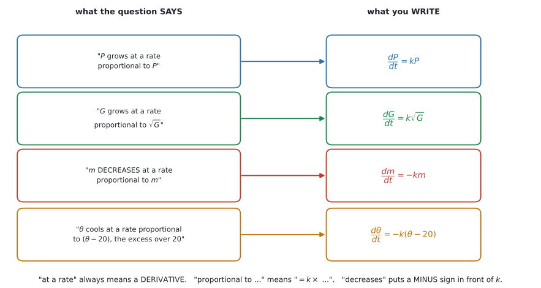
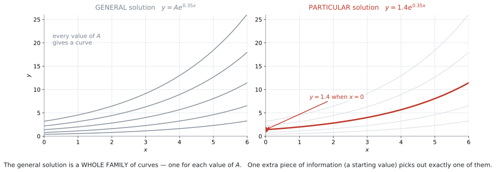
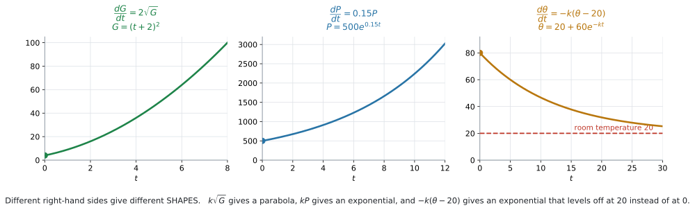

# AHL 5.14 — Setting up a differential equation（微分方程式を立てる） {#sec-ahl-5-14}

::: {.callout-note}
## What you should be able to do
- 問題文のことばから、**differential equation**（微分方程式）を立てられる。
- 「**〜に比例する**」を $= k \times (\text{〜})$ と書ける。
- 「**減る**」のときに、$k$ の前に**マイナス**を付けられる。
- **separation of variables**（変数分離）で解ける。
- **general solution**（一般解）と **particular solution**（特殊解）を区別できる。
- $\dfrac{dy}{dx} = ky$ の解が**指数関数**になることを示せる。
:::

::: {.callout-note}
## この項目は、微分と積分の「使いどころ」です
[SL 5.3](../../ai-sl/05-calculus/sl-5-3.qmd) で微分を、[SL 5.5](../../ai-sl/05-calculus/sl-5-5.qmd) で積分を計算しました。**計算のしかたはそこで済んでいます。**

このページで新しいのは、**$2$ つのこと**だけです。

1. **ことばから式を立てる**（[第2節](#setup)）
2. **その式を、積分を使って解く**（[第4節](#separate)）

$1$ 番が、この項目の本体です。**シラバスの Content の $1$ 行目が、まさに「文脈から微分方程式を立てること」**です。

計算そのものは、[SL 5.5](../../ai-sl/05-calculus/sl-5-5.qmd#rule) の積分と、AHL 5.11 の標準的な積分（$\dfrac{1}{x}$、$e^x$ など）で足ります。
:::

::: {.callout-important}
## Formula booklet に 5.14 の欄はありません
AI HL の公式集の Topic 5 は、**5.13 の次が 5.16** です。**5.14 と 5.15 の欄はありません。**

変数分離のやり方は**書かれていません。覚える必要があります。**

使う積分のほうは、公式集に載っています。$\dfrac{1}{x}$ と $e^x$ は **5.11 の Standard integrals** の欄です。

$$
\int \frac{1}{x}\, dx = \ln|x| + C, \qquad \int e^x\, dx = e^x + C
$$

べき乗のほうは **5.5** の欄です（[SL 5.5](../../ai-sl/05-calculus/sl-5-5.qmd#rule) で使ったものです）。

$$
\int x^n\, dx = \frac{x^{n+1}}{n+1} + C \quad (n \neq -1)
$$

**式は配られますが、「どう使うか」は配られません。**
:::

## The idea

### 1. 分からないのが「数」ではなく「関数」です {#idea}

ふつうの方程式では、分からないのは**数**です。

$$
2x + 3 = 11 \ \Longrightarrow \ x = 4
$$

**differential equation**（微分方程式）では、分からないのは**関数**です。

$$
\frac{dy}{dx} = 2x \ \Longrightarrow \ y = x^2 + C
$$

答えが $x^2 + C$ という**関数**になっています。

::: {.callout-tip}
## 「微分方程式」とは、導関数が入った方程式のことです
$\dfrac{dy}{dx}$ や $\dfrac{dP}{dt}$ が式の中に出てくれば、それは微分方程式です。

**解くとは、その式を満たす関数を見つけること**です。

上の例なら、$y = x^2 + C$ を微分すると $2x$ になります。**もとの式が成り立っています。** これが「解けた」ということです。
:::

::: {.callout-note appearance="simple"}
[SL 5.5](../../ai-sl/05-calculus/sl-5-5.qmd#reverse) で「微分の逆」として積分を学びました。**微分方程式を解くのは、その延長**です。
:::

### 2. ことばから式を立てます {#setup}

**この項目でいちばん問われるところです。** シラバスの Content の $1$ 行目です。

> **Setting up a model/differential equation from a context.**

やることは $3$ つの読みかえだけです。

{#fig-ahl514-words width=100%}

| 問題文のことば | 式にすると |
|---|---|
| `the rate of change of` $P$ ／ $P$ `grows at a rate` | $\dfrac{dP}{dt}$ |
| `is proportional to` $(\ \cdot\ )$ | $= k \times (\ \cdot\ )$ |
| `decreases` / `falls` / `is lost` | $k$ の前に $-$ |

: ことばと式の対応 {#tbl-ahl514-words}

@fig-ahl514-words に、この $3$ つを組み合わせた $4$ 例を並べました。**出題のほとんどが、この形です。**

::: {.callout-important}
## シラバスが挙げている例が、そのまま出ます
> **Example:** The growth of an algae $G$, at time $t$, is proportional to $\sqrt{G}$.

これを式にすると

$$
\frac{dG}{dt} = k\sqrt{G}
$$

です。@exm-ahl514-algae で、実際に解きます。
:::

::: {.callout-warning}
## 「何が何に比例するのか」を、はっきりさせてください
`proportional to` の直後にあるものが、$k$ に掛かります。

| 文 | 式 |
|---|---|
| `the rate is proportional to` $P$ | $\dfrac{dP}{dt} = kP$ |
| `the rate is proportional to` $P^2$ | $\dfrac{dP}{dt} = kP^2$ |
| `the rate is proportional to` $t$ | $\dfrac{dP}{dt} = kt$ |
| `the rate is inversely proportional to` $P$ | $\dfrac{dP}{dt} = \dfrac{k}{P}$ |
| `the rate is constant, at` $5$ `per minute` | $\dfrac{dP}{dt} = 5$ |

: 何に比例するかで、式が変わる {#tbl-ahl514-prop}

**$P$ に比例するのか、$t$ に比例するのか**——読み違えると、解の形がまるごと変わります。
:::

::: {.callout-tip}
## 「差に比例する」は、カッコで囲みます
*proportional to the difference between $\theta$ and $20$* なら、比例するのは $(\theta - 20)$ です。

$$
\frac{d\theta}{dt} = -k(\theta - 20)
$$

**カッコを忘れて $-k\theta - 20$ と書かないでください。** まったく別の式になります。

これは **Newton's law of cooling**（ニュートンの冷却の法則）と呼ばれ、$20$ は周りの温度です。@exm-ahl514-cooling で扱います。
:::

::: {.callout-tip}
## 「入る」と「出る」が両方あるときは、引き算です
*Water flows in at $5$ litres per minute and leaks out at a rate proportional to $\sqrt{V}$* のような場面では、$2$ つを組み合わせます。

$$
\frac{dV}{dt} = \underbrace{5}_{\text{入る}} - \underbrace{k\sqrt{V}}_{\text{出る}}
$$

**$\dfrac{dV}{dt}$ は「増える向き」を正にとる**ので、入るぶんが $+$、出るぶんが $-$ です。

一定の割合で入るぶんには、**$V$ が付きません。** 「毎分 $5$ リットル」は、水そうにどれだけ入っていても $5$ だからです。

（この形は変数分離では手で解きにくいので、AI HL では**式を立てるところまで**が問われます。解くほうは、シラバスの AHL 5.16（Euler's method）で扱います。）
:::

### 3. 比例定数 $k$ の符号 {#k}

**$k$ は問題文には出てきません。自分で置きます。**

$$
k \ \text{は} \ \textbf{正の定数} \ \text{として置くのがふつうです}
$$

そのうえで、**減るときはマイナスを付けます。**

| 場面 | 式 |
|---|---|
| 増える | $\dfrac{dP}{dt} = kP$ |
| 減る | $\dfrac{dP}{dt} = -kP$ |

: 増減と符号 {#tbl-ahl514-sign}

::: {.callout-note appearance="simple"}
$k$ を「符号込み」で置いて、$\dfrac{dP}{dt} = kP$ のまま「$k$ が負なら減る」としても間違いではありません。**どちらでも構いませんが、答案の中で一貫させてください。**

この本では、**$k > 0$ として置き、減るときは $-k$ と書く**ほうで統一します。
:::

::: {.callout-warning}
## $k$ の値は、たいてい後から決まります
$k$ が最初から数で与えられることは、あまりありません。

**データが $2$ 組与えられて、そこから $k$ を求める**——これが典型的な流れです（@exm-ahl514-cooling）。

$1$ 組だけなら積分定数 $C$ が決まり、$2$ 組あれば $C$ と $k$ の両方が決まります。
:::

### 4. separation of variables（変数分離） {#separate}

シラバスの Content の $2$ 行目です。

> **Solving by separation of variables.**

**やり方は $3$ 段階です。**

$$
\frac{dy}{dx} = f(x)\,g(y)
$$

のように、右辺が「$x$ だけの式」と「$y$ だけの式」の**積**になっているときに使えます。

**手順1.** $y$ を左、$x$ を右に集めます。

$$
\frac{1}{g(y)}\, dy = f(x)\, dx
$$

**手順2.** 両辺を積分します。

$$
\int \frac{1}{g(y)}\, dy = \int f(x)\, dx
$$

**手順3. constant of integration**（積分定数）$C$ を**片側だけ**に付けて、$y$ について解きます。

::: {.callout-important}
## $C$ は、片側に $1$ つだけです
両辺に $C_1$ と $C_2$ を付けても、移項すれば $1$ つにまとまります。

$$
C_2 - C_1 = C
$$

**最初から右辺に $1$ つだけ書いてください。** 答案が短くなります。
:::

::: {.callout-warning}
## $dy$ と $dx$ を「移項」しているように見えますが
$\dfrac{dy}{dx}$ は分数ではありません。ですから、本当は「移項」ではありません。

**なぜこの操作が許されるのか**は、[Why it works](#why) で説明します（折りたたみを開いてください）。

**試験では、この形で書いて構いません。** 採点でも認められています。
:::

### 5. general solution と particular solution {#general}

シラバスが、この語を名指ししています。

> The term **"general solution"**.

**general solution**（一般解）… $C$（または $A$）が入ったままの解。**曲線の族**を表します。

**particular solution**（特殊解）… 条件から $C$ が決まった、**$1$ 本だけ**の解。

{#fig-ahl514-family width=100%}

@fig-ahl514-family の左は、$A$ を変えて描いた曲線です。**どれも同じ微分方程式を満たします。** 右のように「$x = 0$ のとき $y = 1.4$」と言われて初めて、$1$ 本に決まります。

::: {.callout-tip}
## 条件は `boundary condition` や `initial condition` と呼ばれます
「$t = 0$ のとき $P = 500$」のような情報です。**$t = 0$ のものを initial condition（初期条件）**といいます。

[SL 5.5](../../ai-sl/05-calculus/sl-5-5.qmd#boundary) で、積分定数を決めるのに同じことをしました。**まったく同じ作業**です。
:::

::: {.callout-warning}
## `Find the general solution` に、$C$ を消して答えない
問題文が `general solution` と言っているなら、**$C$（または $A$）は残したまま**が答えです。

逆に、条件が与えられているのに $C$ を残したままだと、**答えになっていません。**

**問題文がどちらを求めているか、必ず確かめてください。**
:::

### 6. $\dfrac{dy}{dx} = ky$ の解は、指数関数です {#exponential}

シラバスが、この形を名指ししています。

> **Example:** An exponential model as a solution of $\dfrac{dy}{dx} = ky$.

**変数分離でやってみます。**

$$
\frac{1}{y}\, dy = k\, dx
$$

$$
\int \frac{1}{y}\, dy = \int k\, dx
$$

$$
\ln|y| = kx + C
$$

両辺を $e$ の肩に乗せます。

$$
|y| = e^{kx + C} = e^C \cdot e^{kx}
$$

$e^C$ は正の定数です。$y$ が負のときは $y = -e^{C}e^{kx}$ になるので、**符号もこみで** $A$ と置きます。

$$
y = Ae^{kx}
$$ {#eq-ahl514-exponential}

こうすると、**$A$ は任意の定数**です（$A = 0$ なら $y = 0$ で、これももとの式を満たします）。

**この形は覚えてしまってください。** 出てくる回数がとても多く、毎回導いていると時間が足りません。

::: {.callout-important}
## 「$\ln$ から $e$ へ」の $1$ 行を、省かないでください
$\ln|y| = kx + C$ で止めると、**解が $y$ について解けていません。**

$$
\ln|y| = kx + C \ \longrightarrow \ y = Ae^{kx}
$$

この $1$ 行が抜けると、点が引かれることがあります。$e^C$ を $A$ と置き直したことも、$1$ 語書いておくと安全です。
:::

::: {.callout-tip}
## $k$ の符号が、増えるか減るかを決めます
| $k$ | $y = Ae^{kx}$ の形 |
|---|---|
| $k > 0$ | **増える**（exponential growth） |
| $k < 0$ | **減る**（exponential decay） |

: $k$ の符号と解の形 {#tbl-ahl514-ksign}

[SL 2.5](../../ai-sl/02-functions/sl-2-5.qmd) の指数モデルと、同じ形です。**あちらは「そういう形だ」と与えられていました。ここでは、微分方程式から出てきます。**
:::

### 7. 解を、文脈のことばに戻します {#interpret}

答えが出たら、**もとの場面のことばで書きます。**

{#fig-ahl514-models width=100%}

@fig-ahl514-models を見てください。右辺が違えば、**解の形がまるごと違います。**

::: {.callout-tip}
## 単位を書いてください
$P$ が「個体数」、$t$ が「年」なら、答えにも単位が要ります。

**$k$ にも単位があります。** $\dfrac{dP}{dt} = kP$ で $t$ が年なら、$k$ の単位は**「$1$ 年あたり」**（$\text{year}^{-1}$）です。

*Find the value of $k$* と聞かれたら、数だけでなく単位も書けると安全です。
:::

::: {.callout-warning}
## 「いつまでも増え続ける」ことに注意してください
$P = Ae^{kt}$ は、$k > 0$ ならどこまでも増えます。**現実には、そうはなりません。**

*Comment on the validity of the model for large $t$* と問われたら、そこを書きます。

::: {.model-answer}
**試験ではこう書く**

*The model predicts that the population keeps growing without limit as $t$ increases. In reality food, space or other resources would limit the population, so the model is not reasonable for large values of $t$.*
:::

（このモデルは $t$ が増えると個体数が限りなく増え続けると予測する。実際には食料や空間などの資源が個体数を制限するので、$t$ が大きいところではこのモデルは妥当でない、という意味です。）
:::

## Why it works

::: {.callout-tip collapse="true"}
## クリックすると開きます

### なぜ $dy$ と $dx$ を分けてよいのか {#why}

$\dfrac{dy}{dx}$ は分数ではありません。**それなのに、なぜ分数のように動かせるのでしょうか。**

本当にやっているのは、**両辺を $x$ で積分すること**です。

$$
\frac{dy}{dx} = f(x)\,g(y)
$$

両辺を $g(y)$ で割ります。

$$
\frac{1}{g(y)} \cdot \frac{dy}{dx} = f(x)
$$

**両辺を $x$ で積分します。**

$$
\int \frac{1}{g(y)} \cdot \frac{dy}{dx}\, dx = \int f(x)\, dx
$$

左辺に注目してください。$y$ は $x$ の関数なので、これは **chain rule の逆**の形です。$\dfrac{1}{g(y)}$ の原始関数を $H(y)$ とすると、$\dfrac{d}{dx}H(y) = \dfrac{1}{g(y)} \cdot \dfrac{dy}{dx}$ ですから、左辺は $H(y)$ です。

$$
\int \frac{1}{g(y)}\, dy = \int f(x)\, dx
$$

と書いたものと、**同じ結果になります。**

**「$dy$ を移項する」は、この計算の短い書き方**です。分数の計算をしているのではなく、chain rule を逆向きに使っています。

### だから、$g(y) = 0$ のところは別あつかいです {#zero}

上の $1$ 行目で $g(y)$ で割りました。**$g(y) = 0$ になる $y$ では、この計算は使えません。**

$\dfrac{dy}{dx} = ky$ なら $y = 0$ がそれにあたります。$y = 0$（ずっと $0$ のまま）も、実はこの微分方程式の解です。

[第6節](#exponential)で $A$ を**符号こみの任意の定数**として置いたので、$A = 0$ とすれば $y = 0$ が出てきます。**結果としては拾えています。** AI HL では、ここを気にする必要はありません。
:::

## Worked examples

::: {.callout-note appearance="simple"}
問題文は英語です。意味が理解できなかったら、問題文の下の「**日本語訳**」を開いてください。解説は日本語です。
:::

::: {#exm-ahl514-setup}
[Write down a differential equation for each of the following situations. In each case $k$ is a positive constant.]{.q-en}

**(a)** [The number of bacteria, $N$, in a dish increases at a rate proportional to $N$.]{.q-en}

**(b)** [The mass, $m$ grams, of a radioactive substance decreases at a rate proportional to $m$.]{.q-en}

**(c)** [The depth of water, $h$ cm, in a leaking tank falls at a rate proportional to $\sqrt{h}$.]{.q-en}

**(d)** [The temperature, $\theta\ ^\circ$C, of a drink changes at a rate proportional to the difference between $\theta$ and the room temperature of $22\ ^\circ$C. The drink is hotter than the room.]{.q-en}

<details class="jp-trans">
<summary>日本語訳</summary>

次のそれぞれの場面について、微分方程式を書きなさい。どの場合も $k$ は正の定数とします。

`dish` は「（実験用の）皿」、`radioactive substance` は「放射性物質」、`leaking tank` は「水がもれる水そう」という意味です。

**(a)** 皿の中の細菌の数 $N$ が、$N$ に比例する割合で増える。

**(b)** 放射性物質の質量 $m$ グラムが、$m$ に比例する割合で減る。

**(c)** 水がもれる水そうの水の深さ $h$ cm が、$\sqrt{h}$ に比例する割合で下がる。

**(d)** 飲み物の温度 $\theta\ ^\circ$C が、$\theta$ と室温 $22\ ^\circ$C の差に比例する割合で変化する。飲み物は室温より熱い。

</details>

**この例題には、計算がありません。** ことばを式に直すだけです（[第2節](#setup)）。

**(a)** 「増える」ので、そのままです。

$$
\frac{dN}{dt} = kN
$$

**(b)** 「減る」ので、**マイナス**を付けます（[第3節](#k)）。

$$
\frac{dm}{dt} = -km
$$

**(c)** 「下がる」ので**マイナス**、比例するのは $\sqrt{h}$ です。

$$
\frac{dh}{dt} = -k\sqrt{h}
$$

**(d)** 差なので、**カッコで囲みます。**

$$
\frac{d\theta}{dt} = -k(\theta - 22)
$$

**検算。** 飲み物は室温より熱いので $\theta > 22$、つまり $(\theta - 22) > 0$ です。$-k(\theta - 22) < 0$ なので、**温度は下がります** ✓ 熱い飲み物は冷めるので、正しい向きです。

::: {.callout-warning}
## (d) で $-k\theta - 22$ と書かないでください
比例するのは**差そのもの**です。カッコが必要です（[第2節](#setup)）。

$-k\theta - 22$ だと「$\theta$ に比例する部分から $22$ を引く」という、まったく別の意味になります。
:::

::: {.callout-note}
## 解答例（答案用紙にはこう書く）
**(a)**
$$
\frac{dN}{dt} = kN
$$

**(b)**
$$
\frac{dm}{dt} = -km
$$

**(c)**
$$
\frac{dh}{dt} = -k\sqrt{h}
$$

**(d)**
$$
\frac{d\theta}{dt} = -k(\theta - 22)
$$
:::
:::

::: {#exm-ahl514-algae}
[The mass of algae in a pond, $G$ grams at time $t$ days, grows at a rate proportional to $\sqrt{G}$.]{.q-en}

[When $t = 0$ the mass is $4$ grams, and when $t = 2$ the mass is $16$ grams.]{.q-en}

**(a)** [Write down a differential equation for $G$.]{.q-en}

**(b)** [Solve the differential equation to find $G$ in terms of $t$.]{.q-en}

**(c)** [Find the mass of algae when $t = 5$.]{.q-en}

<details class="jp-trans">
<summary>日本語訳</summary>

池の藻の質量 $G$ グラムは、時刻 $t$ 日において $\sqrt{G}$ に比例する割合で増えます。

`algae` は「藻」、`pond` は「池」という意味です。

$t = 0$ のとき質量は $4$ グラム、$t = 2$ のとき $16$ グラムです。

**(a)** $G$ についての微分方程式を書きなさい。

**(b)** 微分方程式を解いて、$G$ を $t$ の式で表しなさい。

**(c)** $t = 5$ のときの藻の質量を求めなさい。

</details>

**(a)** シラバスが挙げている形そのものです。

$$
\frac{dG}{dt} = k\sqrt{G}
$$

**(b)** 変数分離します（[第4節](#separate)）。$G$ を左、$t$ を右へ。

$$
\frac{1}{\sqrt{G}}\, dG = k\, dt
$$

$\dfrac{1}{\sqrt{G}} = G^{-1/2}$ なので、べき乗の積分の公式が使えます（[SL 5.5](../../ai-sl/05-calculus/sl-5-5.qmd#rule)）。

$$
\int G^{-1/2}\, dG = \int k\, dt
$$

$$
\frac{G^{1/2}}{\tfrac{1}{2}} = kt + C
$$

$$
2\sqrt{G} = kt + C
$$

**条件を入れます。** $t = 0$ のとき $G = 4$：

$$
2\sqrt{4} = 0 + C \ \Longrightarrow \ C = 4
$$

$t = 2$ のとき $G = 16$：

$$
2\sqrt{16} = 2k + 4 \ \Longrightarrow \ 8 = 2k + 4 \ \Longrightarrow \ k = 2
$$

$$
2\sqrt{G} = 2t + 4 \ \Longrightarrow \ \sqrt{G} = t + 2
$$

$$
G = (t+2)^2
$$

（$t \geq 0$ なので $t + 2 > 0$ です。根号はそのまま外れます。）

**検算。** $G = (t+2)^2$ を微分すると $\dfrac{dG}{dt} = 2(t+2)$ です。いっぽう $k\sqrt{G} = 2\sqrt{(t+2)^2} = 2(t+2)$ ✓ **もとの式が成り立っています。**

**(c)**

$$
G = (5+2)^2 = 49
$$

$t = 5$ のとき $49$ グラムです。

::: {.callout-tip}
## 解いたら、必ずもとの式に戻して確かめてください
微分方程式の答えは、**微分すれば確かめられます。** これは計算ミスを見つけるいちばん確実な方法です。

$$
\text{解を微分} \ \longrightarrow \ \text{もとの右辺と一致するか}
$$

**$30$ 秒で済みます。** 試験でも、時間があれば必ずやってください。
:::

::: {.callout-warning}
## $\dfrac{1}{\sqrt{G}}$ の積分を $\ln$ にしないでください
$\ln$ になるのは $\dfrac{1}{G}$ のときだけです。$\dfrac{1}{\sqrt{G}} = G^{-1/2}$ は、**指数が $-1$ ではない**のでべき乗の公式を使います。

$$
\int G^{-1/2}\, dG = \frac{G^{1/2}}{1/2} = 2\sqrt{G}
$$
:::

::: {.callout-note}
## 解答例（答案用紙にはこう書く）
**(a)**
$$
\frac{dG}{dt} = k\sqrt{G}
$$

**(b)**
$$
\int G^{-1/2}\, dG = \int k\, dt
$$
$$
2\sqrt{G} = kt + C
$$
*When $t = 0$, $G = 4$:*  $\ 2(2) = C$, *so* $C = 4$.

*When $t = 2$, $G = 16$:*  $\ 2(4) = 2k + 4$, *so* $k = 2$.
$$
2\sqrt{G} = 2t + 4, \qquad \sqrt{G} = t + 2
$$
$$
G = (t+2)^2
$$

**(c)**
$$
G = (5+2)^2 = 49 \ \text{grams}
$$
:::
:::

::: {#exm-ahl514-exponential}
[A population of bacteria, $P$, grows at a rate proportional to $P$. Time $t$ is measured in hours.]{.q-en}

**(a)** [Show that the general solution of the differential equation is $P = Ae^{kt}$, where $A$ is a constant.]{.q-en}

**(b)** [Given that $P = 500$ when $t = 0$ and that $k = 0.15$, find $P$ when $t = 10$.]{.q-en}

**(c)** [Find the time taken for the population to double.]{.q-en}

<details class="jp-trans">
<summary>日本語訳</summary>

細菌の個体数 $P$ が、$P$ に比例する割合で増えます。時間 $t$ は時間（hour）で測ります。

**(a)** この微分方程式の一般解が $P = Ae^{kt}$（$A$ は定数）であることを示しなさい。

**(b)** $t = 0$ のとき $P = 500$、$k = 0.15$ とします。$t = 10$ のときの $P$ を求めなさい。

**(c)** 個体数が $2$ 倍になるのにかかる時間を求めなさい。

</details>

**(a)** 微分方程式は $\dfrac{dP}{dt} = kP$ です。変数分離します。

$$
\int \frac{1}{P}\, dP = \int k\, dt
$$

$$
\ln|P| = kt + C
$$

両辺を $e$ の肩に乗せます。

$$
|P| = e^{kt + C} = e^{C}e^{kt}
$$

$e^C$ は定数なので、**符号もこみで** $A$ と置きます。

$$
P = Ae^{kt}
$$

**個体数なので $P > 0$** で、絶対値は外れます。

**(b)** $t = 0$ のとき $P = 500$：

$$
500 = Ae^{0} = A \ \Longrightarrow \ A = 500
$$

$$
P = 500e^{0.15t}
$$

$$
P = 500e^{0.15 \times 10} = 500e^{1.5} = 2240.8\ldots
$$

個体数なので、$3$ 桁で $2240$ です（整数まで出すなら $2241$ 匹）。

**(c)** $2$ 倍になるのは $P = 1000$ のときです。

$$
1000 = 500e^{0.15t} \ \Longrightarrow \ 2 = e^{0.15t}
$$

$$
0.15t = \ln 2 \ \Longrightarrow \ t = \frac{\ln 2}{0.15} = 4.62 \ \text{hours}
$$

**検算。** $t = 4.62$ を (b) の式に入れると $500e^{0.15 \times 4.62} = 999.85\ldots$ です。丸める前の $t = 4.6210$ なら $1000.0$ ✓

::: {.callout-tip}
## (c) は $A$ に関係しません
$$
2A = Ae^{kt} \ \Longrightarrow \ 2 = e^{kt}
$$

$A$ が約分で消えます。**倍になる時間は、最初の値によらない**——これが指数増加の性質です。

$4.62$ 時間ごとに $2$ 倍、というのがこの細菌のペースです。$500$ から始めても $5000$ から始めても、同じ $4.62$ 時間です。
:::

::: {.callout-note}
## 解答例（答案用紙にはこう書く）
**(a)** $\dfrac{dP}{dt} = kP$
$$
\int \frac{1}{P}\, dP = \int k\, dt
$$
$$
\ln|P| = kt + C
$$
$$
P = e^{kt+C} = e^{C}e^{kt} = Ae^{kt} \quad \text{where } A \text{ is a constant}
$$

**(b)** *When $t = 0$, $P = 500$, so $A = 500$.*
$$
P = 500e^{0.15t}
$$
$$
P = 500e^{1.5} = 2240
$$

**(c)**
$$
1000 = 500e^{0.15t}, \qquad 2 = e^{0.15t}
$$
$$
t = \frac{\ln 2}{0.15} = 4.62 \ \text{hours}
$$
:::
:::

::: {#exm-ahl514-cooling}
[A cup of coffee is placed in a room at a constant temperature of $20\ ^\circ$C. The temperature of the coffee, $\theta\ ^\circ$C after $t$ minutes, falls at a rate proportional to the difference between $\theta$ and $20$.]{.q-en}

[Initially the coffee is at $80\ ^\circ$C, and after $5$ minutes it is at $60\ ^\circ$C.]{.q-en}

**(a)** [Write down a differential equation for $\theta$.]{.q-en}

**(b)** [Show that $\theta = 20 + Ae^{-kt}$.]{.q-en}

**(c)** [Find the values of $A$ and $k$.]{.q-en}

**(d)** [Find the temperature of the coffee after $15$ minutes.]{.q-en}

<details class="jp-trans">
<summary>日本語訳</summary>

$1$ 杯のコーヒーが、一定の温度 $20\ ^\circ$C の部屋に置かれています。$t$ 分後のコーヒーの温度 $\theta\ ^\circ$C は、$\theta$ と $20$ の差に比例する割合で下がります。

はじめコーヒーは $80\ ^\circ$C で、$5$ 分後には $60\ ^\circ$C です。

**(a)** $\theta$ についての微分方程式を書きなさい。

**(b)** $\theta = 20 + Ae^{-kt}$ となることを示しなさい。

**(c)** $A$ と $k$ の値を求めなさい。

**(d)** $15$ 分後のコーヒーの温度を求めなさい。

</details>

**(a)** 差に比例し、下がるので

$$
\frac{d\theta}{dt} = -k(\theta - 20)
$$

**(b)** 変数分離します。

$$
\int \frac{1}{\theta - 20}\, d\theta = \int -k\, dt
$$

$$
\ln|\theta - 20| = -kt + C
$$

$$
\theta - 20 = e^{-kt + C} = Ae^{-kt}
$$

$$
\theta = 20 + Ae^{-kt}
$$

**コーヒーは室温より熱いので $\theta > 20$** で、絶対値は外れます。

**(c)** $t = 0$ のとき $\theta = 80$：

$$
80 = 20 + A \ \Longrightarrow \ A = 60
$$

$t = 5$ のとき $\theta = 60$：

$$
60 = 20 + 60e^{-5k} \ \Longrightarrow \ 40 = 60e^{-5k} \ \Longrightarrow \ e^{-5k} = \frac{2}{3}
$$

$$
-5k = \ln\frac{2}{3} \ \Longrightarrow \ k = \frac{1}{5}\ln\frac{3}{2} = 0.0811
$$

**(d)**

$$
\theta = 20 + 60e^{-0.0811 \times 15} = 20 + 60(0.2963\ldots) = 37.8
$$

$15$ 分後、およそ $37.8\ ^\circ$C です。

**検算。** $5$ 分で $80 \to 60$、つまり差が $60 \to 40$ で $\dfrac{2}{3}$ 倍になりました。$15$ 分は $5$ 分の $3$ 倍なので、差は $\left(\dfrac{2}{3}\right)^3 = \dfrac{8}{27}$ 倍です。

$$
20 + 60 \times \frac{8}{27} = 20 + 17.78 = 37.8
$$

✓ 一致しました。

::: {.callout-tip}
## $\dfrac{1}{\theta - 20}$ の積分は $\ln|\theta - 20|$ です
中身が $\theta$ ではなく $\theta - 20$ ですが、$\theta$ で微分すると $1$ なので、そのまま $\ln$ になります。

$$
\frac{d}{d\theta}\ln|\theta - 20| = \frac{1}{\theta - 20}
$$

**中身の微分が $1$ でないときは、そうはなりません。** たとえば $\dfrac{1}{2\theta - 20}$ なら $\dfrac{1}{2}\ln|2\theta - 20|$ です（AHL 5.11 の **integration by substitution**（置換積分））。
:::

::: {.callout-warning}
## 冷めても $0\ ^\circ$C にはなりません
$t$ を大きくすると $e^{-kt} \to 0$ なので、$\theta \to 20$ です。

**室温で止まります。** @fig-ahl514-models の右のグラフが、その様子です。

$\theta = 20 + Ae^{-kt}$ の $20$ は、**この「行き着く先」**を表しています。指数の項だけの $\theta = Ae^{-kt}$ だと $0$ に向かってしまい、場面に合いません。
:::

::: {.callout-note}
## 解答例（答案用紙にはこう書く）
**(a)**
$$
\frac{d\theta}{dt} = -k(\theta - 20)
$$

**(b)**
$$
\int \frac{1}{\theta - 20}\, d\theta = \int -k\, dt
$$
$$
\ln|\theta - 20| = -kt + C
$$
$$
\theta - 20 = Ae^{-kt}, \qquad \theta = 20 + Ae^{-kt} \quad \text{where } A \text{ is a constant}
$$

**(c)** *When $t = 0$, $\theta = 80$:* $\ 80 = 20 + A$, *so* $A = 60$.

*When $t = 5$, $\theta = 60$:*
$$
40 = 60e^{-5k}, \qquad e^{-5k} = \frac{2}{3}
$$
$$
k = \frac{1}{5}\ln\frac{3}{2} = 0.0811
$$

**(d)**
$$
\theta = 20 + 60e^{-0.0811 \times 15} = 37.8\ ^\circ\text{C}
$$
:::
:::

## Common errors

::: {.callout-warning}
## 「差に比例」でカッコを忘れる
$-k(\theta - 20)$ です。$-k\theta - 20$ ではありません（[第2節](#setup)）。
:::

::: {.callout-warning}
## 「減る」のにマイナスを付けない
$k$ を正の定数として置いたなら、減るときは $-k$ です（[第3節](#k)）。

**答えの向きで気づけます。** 冷めるはずのコーヒーが熱くなったら、符号が違っています。
:::

::: {.callout-warning}
## 何に比例するかを読み違える
$P$ に比例するのか、$t$ に比例するのか、$\sqrt{P}$ に比例するのか。**`proportional to` の直後を見てください**（@tbl-ahl514-prop）。
:::

::: {.callout-warning}
## $\dfrac{1}{\sqrt{y}}$ の積分を $\ln$ にする
$\ln$ になるのは $\dfrac{1}{y}$ だけです。$\dfrac{1}{\sqrt{y}} = y^{-1/2}$ はべき乗の公式です（@exm-ahl514-algae）。
:::

::: {.callout-warning}
## $\ln|y| = kx + C$ で止める
$y$ について解けていません。$y = Ae^{kx}$ まで進めてください（[第6節](#exponential)）。
:::

::: {.callout-warning}
## $e^{kx+C}$ を $e^{kx} + e^C$ とする
指数法則は $e^{a+b} = e^a \times e^b$ です。**足し算ではありません**（[AHL 1.9](../01-number-and-algebra/ahl-1-9.qmd)）。
:::

::: {.callout-warning}
## 積分定数 $C$ を付け忘れる
不定積分には必ず $C$ が要ります（[SL 5.5](../../ai-sl/05-calculus/sl-5-5.qmd#plusc)）。**$C$ がないと、条件を使えません。**
:::

::: {.callout-warning}
## `general solution` を聞かれて、$C$ を消してしまう
条件が与えられていないのに $C$ に値を入れることはできません（[第5節](#general)）。
:::

::: {.callout-warning}
## $k$ を求めるとき、$e$ を外し忘れる
$e^{-5k} = \dfrac{2}{3}$ から $k$ を出すには、**両辺の $\ln$ をとります**（@exm-ahl514-cooling）。
:::

::: {.callout-warning}
## 解を微分して確かめない
$30$ 秒でできる検算です（@exm-ahl514-algae）。**微分してもとの右辺に戻れば、正しい解です。**
:::

## Using your GDC (TI-Nspire CX II)

::: {.callout-important}
## この項目は、手で解くのが基本です
`Find the general solution` や `Show that ...` と問われたら、**過程を書かないと点になりません。** 電卓の答えだけでは足りません。

電卓は、**答えを確かめるため**に使ってください。
:::

### 解が正しいか、微分して確かめる {#gdc-check}

```
menu → 4: Calculus → 1: Numerical Derivative at a Point
```

**TI-Nspire CX II（CAS でない機種）は、微分の「式」を返しません。** 返すのは**ある $1$ 点での値**だけです（[SL 5.3](../../ai-sl/05-calculus/sl-5-3.qmd#nderiv)）。

ですから、**$1$ 点で合わせて確かめます。**

@exm-ahl514-algae なら、$t = 3$ を選びます。

| 手順 | 出るもの |
|---|---|
| $G = (t+2)^2$ の $t = 3$ での微分係数を電卓で出す | $10$ |
| もとの右辺 $2\sqrt{G}$ に $G = (3+2)^2 = 25$ を入れる | $2 \times 5 = 10$ |

: $1$ 点で突き合わせる {#tbl-ahl514-gdc-check}

**$2$ つが一致すれば、解はまず合っています。**

::: {.callout-tip}
## $1$ 点だけで十分です
すべての $t$ で確かめる必要はありません。**$1$ 点で合わなければ、その時点で解が違う**と分かります。

心配なら $2$ 点で試してください。それでも $1$ 分かかりません。
:::

### 数値の検算 {#gdc-value}

条件を入れたあとの式が正しいか、**与えられた点を代入して確かめます。**

@exm-ahl514-cooling なら、$\theta = 20 + 60e^{-0.0811t}$ に $t = 5$ を入れて $60$ になるかを見ます。

```
20 + 60·e^(-0.0811 × 5)
```

$59.9986\ldots$ と出れば正しいと分かります（$k$ を $3$ 桁に丸めているので、ぴったり $60$ にはなりません）。

::: {.callout-warning}
## $k$ は、丸める前の値で計算してください
$k = \dfrac{1}{5}\ln\dfrac{3}{2}$ を $0.0811$ に丸めてから (d) を計算すると、$3$ 桁目がずれることがあります。

**電卓に $\dfrac{1}{5}\ln\dfrac{3}{2}$ をそのまま入れる**か、変数に保存して使ってください。

@exm-ahl514-cooling ではたまたまどちらも $37.8$ になりますが、**演習5 では $44.1$ と $44.2$ に分かれます。** 「今回は同じだった」で済ませないでください。

```
(1/5)·ln(3/2) → k
```

矢印は `ctrl` + `var` です。
:::

### `deSolve` は使えますか {#gdc-desolve}

**TI-Nspire CX II の非 CAS 版には、`deSolve` はありません。** CAS 版にはありますが、**IB の試験で使えるのは非 CAS 版**です。

ですから、**変数分離は手でできるようにしておく必要があります。**

::: {.callout-note appearance="simple"}
シラバスの **AHL 5.15**（slope fields）と **AHL 5.16**（Euler's method）では、**式で解かずに**微分方程式を扱う方法を学びます。手で解けない式は、そちらで扱います。
:::

## Exercises

::: {.callout-note appearance="simple"}
各問題に、折りたたみが3つ付いています。**日本語訳**、**解答例**（答案用紙に書くべきこと。英語です）、**解説**（なぜそうなるか。日本語です）。

まず自分で解いて、次に解答例と見くらべてください。**解説は、合わなかったときだけ開けば十分です。**
:::

::: {.exercise-block}

[1]{.ex-no} [Write down a differential equation for each situation. In each case $k$ is a positive constant.]{.q-en}

**(a)** [The value, $V$ dollars, of a car decreases at a rate proportional to $V$.]{.q-en}

**(b)** [The height, $h$ cm, of a plant increases at a rate proportional to $\sqrt{h}$.]{.q-en}

**(c)** [The number of fish, $F$, in a lake increases at a rate proportional to the square of $F$.]{.q-en}

**(d)** [The amount of a drug in the blood, $D$ mg, decreases at a rate proportional to the difference between $D$ and $5$ mg.]{.q-en}

**(e)** [The rate at which a chemical dissolves is inversely proportional to the mass, $M$ grams, already dissolved.]{.q-en}

**(f)** [Water flows into a tank at a constant rate of $5$ litres per minute, and at the same time leaks out at a rate proportional to $\sqrt{V}$, where $V$ litres is the volume in the tank.]{.q-en}

<details class="jp-trans">
<summary>日本語訳</summary>

次のそれぞれの場面について、微分方程式を書きなさい。どの場合も $k$ は正の定数とします。

`drug` は「薬」、`blood` は「血液」という意味です。

**(a)** 車の価値 $V$ ドルが、$V$ に比例する割合で減る。

**(b)** 植物の高さ $h$ cm が、$\sqrt{h}$ に比例する割合で増える。

**(c)** 湖の魚の数 $F$ が、$F$ の $2$ 乗に比例する割合で増える。

**(d)** 血液中の薬の量 $D$ mg が、$D$ と $5$ mg の差に比例する割合で減る。

**(e)** ある化学物質が溶ける割合が、すでに溶けた質量 $M$ グラムに**反比例する**。

**(f)** 水そうに毎分 $5$ リットルの一定の割合で水が入り、同時に $\sqrt{V}$ に比例する割合でもれ出す。$V$ リットルは水そうの中の体積。

</details>

::: {.callout-note collapse="true"}
## 解答例（答案用紙に書くこと）
**(a)**
$$
\frac{dV}{dt} = -kV
$$

**(b)**
$$
\frac{dh}{dt} = k\sqrt{h}
$$

**(c)**
$$
\frac{dF}{dt} = kF^2
$$

**(d)**
$$
\frac{dD}{dt} = -k(D - 5)
$$

**(e)**
$$
\frac{dM}{dt} = \frac{k}{M}
$$

**(f)**
$$
\frac{dV}{dt} = 5 - k\sqrt{V}
$$
:::

::: {.callout-tip collapse="true"}
## 解説
**(a)** 「減る」のでマイナス（[第3節](#k)）。

**(b)** 「増える」のでそのまま。比例するのは $\sqrt{h}$ です。

**(c)** *the square of $F$* は $F^2$ です。**$\sqrt{F}$ ではありません。** 英語をよく読んでください。

**(d)** 差なのでカッコで囲みます（[第2節](#setup)）。

**(e)** `inversely proportional to` $M$ は、**$M$ で割る**という意味です（@tbl-ahl514-prop）。

$$
\frac{dM}{dt} = k \times \frac{1}{M} = \frac{k}{M}
$$

**$-kM$ ではありません。** 「反比例」と「減る」は別のことです。この場合、$M$ が増えるほど溶けるのが**遅くなり**ますが、$M$ 自体は増え続けます。

**(f)** **$2$ つの流れがあります。** 入るぶんと、出るぶんです。

$$
\frac{dV}{dt} = (\text{入る割合}) - (\text{出る割合}) = 5 - k\sqrt{V}
$$

入る割合は「毎分 $5$ リットル」で**一定**なので、$V$ が付きません。出る割合は $\sqrt{V}$ に比例します。

**引き算の順を逆にしないでください。** $\dfrac{dV}{dt}$ は「増える向き」を正にとるので、**入る $-$ 出る**です。

**検算。** (d) で $D > 5$ なら $-k(D-5) < 0$ で減ります ✓ 薬は体から抜けていくので、正しい向きです。$D$ は $5$ mg に近づいて止まります。

(f) で $5 = k\sqrt{V}$ になると $\dfrac{dV}{dt} = 0$ で、**水位が止まります** ✓ 入る量と出る量がつり合った状態です。
:::

::: {.ex-sep}
:::

[2]{.ex-no} [A population $P$ satisfies $\dfrac{dP}{dt} = 0.08P$, where $t$ is measured in years. When $t = 0$, $P = 2000$.]{.q-en}

**(a)** [Find $P$ in terms of $t$.]{.q-en}

**(b)** [Find the population when $t = 10$.]{.q-en}

**(c)** [Find the time taken for the population to double.]{.q-en}

<details class="jp-trans">
<summary>日本語訳</summary>

個体数 $P$ が $\dfrac{dP}{dt} = 0.08P$ を満たします。$t$ は年で測ります。$t = 0$ のとき $P = 2000$ です。

**(a)** $P$ を $t$ の式で表しなさい。

**(b)** $t = 10$ のときの個体数を求めなさい。

**(c)** 個体数が $2$ 倍になるのにかかる時間を求めなさい。

</details>

::: {.callout-note collapse="true"}
## 解答例（答案用紙に書くこと）
**(a)**
$$
\int \frac{1}{P}\, dP = \int 0.08\, dt
$$
$$
\ln|P| = 0.08t + C, \qquad P = Ae^{0.08t} \quad \text{where } A \text{ is a constant}
$$
*When $t = 0$, $P = 2000$, so $A = 2000$.*
$$
P = 2000e^{0.08t}
$$

**(b)**
$$
P = 2000e^{0.8} = 4450
$$

**(c)**
$$
4000 = 2000e^{0.08t}, \qquad 2 = e^{0.08t}
$$
$$
t = \frac{\ln 2}{0.08} = 8.66 \ \text{years}
$$
:::

::: {.callout-tip collapse="true"}
## 解説
**(a)** $\dfrac{dP}{dt} = kP$ の形なので、答えは $Ae^{kt}$ です（[第6節](#exponential)）。$k = 0.08$ がすでに与えられています。

$t = 0$ を入れると $e^0 = 1$ なので、**$A$ は最初の値そのもの**です。

**(b)** $2000e^{0.8} = 4451.08\ldots$ です。個体数なので $3$ 桁で $4450$、あるいは「およそ $4450$ 匹」と書きます。

**(c)** $A$ は約分で消えます（@exm-ahl514-exponential）。

**検算。** $t = 8.66$ を (a) の式に入れると $2000e^{0.08 \times 8.66} = 3998.6\ldots$ です。丸める前の $t = 8.6643$ なら $4000.0$ ✓
:::

::: {.ex-sep}
:::

[3]{.ex-no} [Water leaks from a tank. The volume of water, $V$ litres after $t$ minutes, decreases at a rate proportional to $\sqrt{V}$.]{.q-en}

[When $t = 0$, $V = 400$, and when $t = 10$, $V = 100$.]{.q-en}

**(a)** [Show that $V = (20 - t)^2$.]{.q-en}

**(b)** [Find the time at which the tank becomes empty.]{.q-en}

<details class="jp-trans">
<summary>日本語訳</summary>

水そうから水がもれています。$t$ 分後の水の体積 $V$ リットルは、$\sqrt{V}$ に比例する割合で減ります。

$t = 0$ のとき $V = 400$、$t = 10$ のとき $V = 100$ です。

**(a)** $V = (20 - t)^2$ となることを示しなさい。

**(b)** 水そうが空になる時刻を求めなさい。

</details>

::: {.callout-note collapse="true"}
## 解答例（答案用紙に書くこと）
**(a)**
$$
\frac{dV}{dt} = -k\sqrt{V}
$$
$$
\int V^{-1/2}\, dV = \int -k\, dt
$$
$$
2\sqrt{V} = -kt + C
$$
*When $t = 0$, $V = 400$:* $\ 2(20) = C$, *so* $C = 40$.

*When $t = 10$, $V = 100$:* $\ 2(10) = -10k + 40$, *so* $k = 2$.
$$
2\sqrt{V} = -2t + 40, \qquad \sqrt{V} = 20 - t
$$
$$
V = (20 - t)^2
$$

**(b)** *The tank is empty when $V = 0$:*
$$
(20 - t)^2 = 0 \ \Longrightarrow \ t = 20 \ \text{minutes}
$$
:::

::: {.callout-tip collapse="true"}
## 解説
@exm-ahl514-algae と**同じ形で、符号だけが逆**です。減るのでマイナスが付きます。

$$
2\sqrt{V} = -kt + C
$$

**検算。** $V = (20-t)^2$ を微分すると $\dfrac{dV}{dt} = -2(20-t)$ です。いっぽう $-k\sqrt{V} = -2(20-t)$ ✓

**(b)** $\sqrt{V} = 20 - t$ なので、$t = 20$ で $\sqrt{V} = 0$、つまり $V = 0$ です。

::: {.callout-warning}
## $t > 20$ では、このモデルは使えません
$t = 25$ を入れると $V = 25$ となり、**水が増えてしまいます。** 空になったあとは、この式は場面に合いません。

*State the range of values of $t$ for which the model is valid* と問われたら、こう書きます。

::: {.model-answer}
*The model is valid for $0 \leq t \leq 20$. After $t = 20$ the tank is empty, but the equation would predict the volume increasing again, which cannot happen.*
:::

（このモデルは $0 \leq t \leq 20$ で妥当である。$t = 20$ より後は水そうが空だが、この式は体積がまた増えると予測してしまい、それは起こりえない、という意味です。）
:::
:::

::: {.ex-sep}
:::

[4]{.ex-no} [Consider the differential equation $\dfrac{dy}{dx} = ky$, where $k$ is a constant.]{.q-en}

**(a)** [Find the general solution.]{.q-en}

**(b)** [Describe the behaviour of $y$ as $x$ increases when (i) $k > 0$ and (ii) $k < 0$.]{.q-en}

<details class="jp-trans">
<summary>日本語訳</summary>

微分方程式 $\dfrac{dy}{dx} = ky$（$k$ は定数）を考えます。

**(a)** 一般解を求めなさい。

**(b)** $x$ が増えるときの $y$ のふるまいを、(i) $k > 0$ のとき、(ii) $k < 0$ のときについて述べなさい。

</details>

::: {.callout-note collapse="true"}
## 解答例（答案用紙に書くこと）
**(a)**
$$
\int \frac{1}{y}\, dy = \int k\, dx
$$
$$
\ln|y| = kx + C
$$
$$
y = Ae^{kx} \quad \text{where } A \text{ is a constant}
$$

**(b) (i)**

::: {.model-answer}
*When $k > 0$ the exponent $kx$ increases as $x$ increases, so $y$ increases without limit. This is exponential growth.*
:::

（$k > 0$ のとき $x$ が増えると指数 $kx$ も増えるので、$y$ は限りなく増える。これは指数的増加である、という意味です。）

**(b) (ii)**

::: {.model-answer}
*When $k < 0$ the exponent $kx$ decreases as $x$ increases, so $y$ tends towards $0$ but never reaches it. This is exponential decay.*
:::

（$k < 0$ のとき $x$ が増えると指数 $kx$ は減るので、$y$ は $0$ に近づくが決して $0$ にはならない。これは指数的減衰である、という意味です。）
:::

::: {.callout-tip collapse="true"}
## 解説
**(a)** シラバスが名指ししている形です（[第6節](#exponential)）。**この導き方は、そのまま書けるようにしてください。**

`general solution` と聞かれているので、**$A$ は残したまま**が答えです（[第5節](#general)）。

**(b)** ことばで答える問いなので、`.model-answer` の型で書きます。

**(ii) で「$0$ になる」と書かないでください。** $e^{kx}$ は正の数なので、$0$ にはなりません。**近づくだけ**です。

$A$ の符号は聞かれていませんが、$A < 0$ なら曲線は $x$ 軸の下側にあり、増減の向きが逆になります。**$A > 0$ を前提に書くなら、そう $1$ 語添えると丁寧です。**
:::

::: {.ex-sep}
:::

[5]{.ex-no} [A metal bar is taken out of a furnace into a room at $18\ ^\circ$C. Its temperature, $\theta\ ^\circ$C after $t$ minutes, satisfies $\dfrac{d\theta}{dt} = -k(\theta - 18)$.]{.q-en}

[Initially $\theta = 90$, and when $t = 4$, $\theta = 66$.]{.q-en}

**(a)** [Find $\theta$ in terms of $t$.]{.q-en}

**(b)** [Find the temperature of the bar after $10$ minutes.]{.q-en}

<details class="jp-trans">
<summary>日本語訳</summary>

金属の棒が炉から取り出され、$18\ ^\circ$C の部屋に置かれます。$t$ 分後の温度 $\theta\ ^\circ$C は $\dfrac{d\theta}{dt} = -k(\theta - 18)$ を満たします。

`furnace` は「炉」という意味です。

はじめ $\theta = 90$ で、$t = 4$ のとき $\theta = 66$ です。

**(a)** $\theta$ を $t$ の式で表しなさい。

**(b)** $10$ 分後の棒の温度を求めなさい。

</details>

::: {.callout-note collapse="true"}
## 解答例（答案用紙に書くこと）
**(a)**
$$
\int \frac{1}{\theta - 18}\, d\theta = \int -k\, dt
$$
$$
\ln|\theta - 18| = -kt + C, \qquad \theta = 18 + Ae^{-kt} \quad \text{where } A \text{ is a constant}
$$
*When $t = 0$, $\theta = 90$:* $\ A = 72$.

*When $t = 4$, $\theta = 66$:*
$$
48 = 72e^{-4k}, \qquad e^{-4k} = \frac{2}{3}, \qquad k = \frac{1}{4}\ln\frac{3}{2} = 0.101 \ (3 \text{ s.f.})
$$
$$
\theta = 18 + 72e^{-kt}
$$

**(b)** *Using the unrounded value of $k$:*
$$
\theta = 18 + 72\left(\tfrac{2}{3}\right)^{2.5} = 44.1\ ^\circ\text{C}
$$
:::

::: {.callout-tip collapse="true"}
## 解説
@exm-ahl514-cooling とまったく同じ形です。室温が $20$ から $18$ に変わっただけです。

$$
k = \frac{1}{4}\ln\frac{3}{2} = 0.101366\ldots
$$

**(b) では、丸める前の $k$ を使ってください**（[GDC 第2節](#gdc-value)）。$0.101$ で計算すると $44.2$ となり、**$3$ 桁目がずれます。**

**検算。** $4$ 分で差が $72 \to 48$、つまり $\dfrac{2}{3}$ 倍でした。$10$ 分は $4$ 分の $2.5$ 倍なので、差は $\left(\dfrac{2}{3}\right)^{2.5}$ 倍です。

$$
18 + 72 \times \left(\frac{2}{3}\right)^{2.5} = 18 + 26.13 = 44.1
$$

✓ 一致しました。
:::

::: {.ex-sep}
:::

[6]{.ex-no} [A radioactive substance decays so that its mass, $m$ grams after $t$ days, satisfies $\dfrac{dm}{dt} = -km$. Initially the mass is $50$ grams, and the half-life of the substance is $8$ days.]{.q-en}

**(a)** [Find the value of $k$.]{.q-en}

**(b)** [Find the mass remaining after $20$ days.]{.q-en}

<details class="jp-trans">
<summary>日本語訳</summary>

ある放射性物質が崩壊し、$t$ 日後の質量 $m$ グラムは $\dfrac{dm}{dt} = -km$ を満たします。はじめの質量は $50$ グラムで、この物質の半減期は $8$ 日です。

`decay` は「崩壊する」、`half-life` は「半減期」（質量が半分になるのにかかる時間）という意味です。

**(a)** $k$ の値を求めなさい。

**(b)** $20$ 日後に残っている質量を求めなさい。

</details>

::: {.callout-note collapse="true"}
## 解答例（答案用紙に書くこと）
**(a)** *The general solution is $m = Ae^{-kt}$, and $A = 50$.*
$$
25 = 50e^{-8k}, \qquad e^{-8k} = \frac{1}{2}
$$
$$
8k = \ln 2, \qquad k = \frac{\ln 2}{8} = 0.0866 \ \text{per day}
$$

**(b)**
$$
m = 50e^{-0.0866434 \times 20} = 8.84 \ \text{grams}
$$
:::

::: {.callout-tip collapse="true"}
## 解説
**(a)** 半減期とは「$m$ が半分になるまでの時間」です。**$t = 8$ のとき $m = 25$** と読みかえます。

$$
e^{-8k} = \frac{1}{2}
$$

両辺の $\ln$ をとります。$\ln\dfrac{1}{2} = -\ln 2$ なので、$-8k = -\ln 2$、つまり $k = \dfrac{\ln 2}{8}$ です。

**単位は「$1$ 日あたり」**です（[第7節](#interpret)）。

**(b)** $20$ 日は半減期 $2.5$ 個ぶんです。

$$
m = 50 \times \left(\frac{1}{2}\right)^{2.5} = 8.8388\ldots
$$

$3$ 桁で $8.84$ グラムです。

**検算。** $e$ を使って $50e^{-0.0866434 \times 20}$ としても $8.8388\ldots$ です ✓ **半減期で数える方法と、指数で計算する方法が一致しています。**

::: {.callout-tip}
## 半減期は、最初の量によりません
$$
\frac{A}{2} = Ae^{-kt} \ \Longrightarrow \ \frac{1}{2} = e^{-kt}
$$

$A$ が消えます。@exm-ahl514-exponential の「倍になる時間」と同じ理屈です。
:::
:::

::: {.ex-sep}
:::

[7]{.ex-no} [The number of people, $N$, who have heard a rumour in a town increases at a rate proportional to $N$. When $t = 0$ days, $N = 40$, and when $t = 3$, $N = 160$.]{.q-en}

**(a)** [Find $N$ in terms of $t$.]{.q-en}

**(b)** [Find the number of people who have heard the rumour after $5$ days.]{.q-en}

**(c)** [Explain why this model cannot be reasonable for large values of $t$.]{.q-en}

<details class="jp-trans">
<summary>日本語訳</summary>

ある町でうわさを聞いた人の数 $N$ は、$N$ に比例する割合で増えます。$t = 0$ 日のとき $N = 40$、$t = 3$ のとき $N = 160$ です。

`rumour` は「うわさ」という意味です。

**(a)** $N$ を $t$ の式で表しなさい。

**(b)** $5$ 日後にうわさを聞いた人の数を求めなさい。

**(c)** このモデルが $t$ の大きいところで妥当でない理由を説明しなさい。

</details>

::: {.callout-note collapse="true"}
## 解答例（答案用紙に書くこと）
**(a)** $\dfrac{dN}{dt} = kN$, *so* $N = Ae^{kt}$ *and* $A = 40$.
$$
160 = 40e^{3k}, \qquad e^{3k} = 4, \qquad k = \frac{\ln 4}{3} = 0.462
$$
$$
N = 40e^{0.462t}
$$

**(b)**
$$
N = 40e^{5k} = 40 \times 10.08 = 403 \ \text{people}
$$

**(c)**

::: {.model-answer}
*The model predicts that $N$ grows without limit, but the number of people who can hear the rumour cannot exceed the population of the town. Once most of the town has heard it, the number who have not yet heard it becomes small, so the rate of increase must slow down rather than keep growing.*
:::

（このモデルは $N$ が限りなく増えると予測するが、うわさを聞ける人の数は町の人口を超えられない。町のほとんどが聞いてしまえば、まだ聞いていない人の数が少なくなるので、増える割合は増え続けるのではなく遅くなるはずである、という意味です。）
:::

::: {.callout-tip collapse="true"}
## 解説
**(a)** $3$ 日で $40 \to 160$、つまり $4$ 倍です。

$$
e^{3k} = 4 \ \Longrightarrow \ k = \frac{\ln 4}{3} = 0.4620981\ldots
$$

**(b)** 丸める前の $k$ で計算します。$40e^{5k} = 40 \times 4^{5/3} = 403.17\ldots$ で、人数なので $403$ 人です。

**検算。** $3$ 日で $4$ 倍なので、$6$ 日なら $16$ 倍で $640$ 人。$5$ 日はその手前なので、$403$ は妥当な位置です ✓

**(c)** [第7節](#interpret)の内容です。

**「限りなく増えるから」だけでは足りません。** 「なぜ現実にはそうならないか」——**人口という上限がある**ことまで書いてください。

**「聞いていない人が減るから、増える速さも落ちるはず」**まで書ければ十分です。
:::

::: {.ex-sep}
:::

[8]{.ex-no} [A student solves $\dfrac{dy}{dx} = 3y$ and writes:]{.q-en}

> [*"$\ln y = 3x + C$, so $y = e^{3x} + e^{C}$."*]{.q-en}

**(a)** [Identify the error.]{.q-en}

**(b)** [Write down the correct general solution.]{.q-en}

<details class="jp-trans">
<summary>日本語訳</summary>

ある生徒が $\dfrac{dy}{dx} = 3y$ を解いて、次のように書きました。

> 「$\ln y = 3x + C$、よって $y = e^{3x} + e^{C}$」

**(a)** 誤りを指摘しなさい。

**(b)** 正しい一般解を書きなさい。

</details>

::: {.callout-note collapse="true"}
## 解答例（答案用紙に書くこと）
**(a)**

::: {.model-answer}
*The student has written $e^{3x + C}$ as $e^{3x} + e^{C}$. The law of exponents gives $e^{a+b} = e^{a} \times e^{b}$, a product and not a sum, so $e^{3x+C} = e^{C}e^{3x}$.*
:::

（この生徒は $e^{3x+C}$ を $e^{3x} + e^{C}$ と書いてしまっている。指数法則は $e^{a+b} = e^a \times e^b$ で、和ではなく積なので、$e^{3x+C} = e^{C}e^{3x}$ である、という意味です。）

**(b)**
$$
y = Ae^{3x} \quad \text{where } A \text{ is a constant}
$$
:::

::: {.callout-tip collapse="true"}
## 解説
**指数法則の間違いです**（[AHL 1.9](../01-number-and-algebra/ahl-1-9.qmd)）。

$$
e^{a+b} = e^{a} \times e^{b} \qquad (\text{積です})
$$

**すぐ気づく方法があります。** $y = e^{3x} + e^C$ を微分してみてください。

$$
\frac{dy}{dx} = 3e^{3x}
$$

いっぽう $3y = 3e^{3x} + 3e^{C}$ です。**$3e^C$ の分だけ合いません。**

**検算。** 正しい $y = Ae^{3x}$ なら $\dfrac{dy}{dx} = 3Ae^{3x} = 3y$ ✓ ぴったり合います。

**微分して確かめる**という習慣があれば、この種の間違いは自分で見つけられます。
:::

::: {.ex-sep}
:::

[9]{.ex-no} [The mass of a chemical, $M$ kg, in a reaction changes at a rate proportional to $M$. The mass is measured in kilograms and the time $t$ in hours.]{.q-en}

**(a)** [Write down the differential equation, taking $k$ to be a positive constant, given that the mass is decreasing.]{.q-en}

**(b)** [State the units of $k$.]{.q-en}

**(c)** [The mass falls from $30$ kg to $12$ kg in $6$ hours. Find the value of $k$.]{.q-en}

<details class="jp-trans">
<summary>日本語訳</summary>

ある反応における化学物質の質量 $M$ kg は、$M$ に比例する割合で変化します。質量はキログラム、時間 $t$ は時間（hour）で測ります。

`chemical` は「化学物質」、`reaction` は「反応」という意味です。

**(a)** 質量が減っているとして、$k$ を正の定数とする微分方程式を書きなさい。

**(b)** $k$ の単位を述べなさい。

**(c)** 質量が $6$ 時間で $30$ kg から $12$ kg に減りました。$k$ の値を求めなさい。

</details>

::: {.callout-note collapse="true"}
## 解答例（答案用紙に書くこと）
**(a)**
$$
\frac{dM}{dt} = -kM
$$

**(b)**

::: {.model-answer}
*$\dfrac{dM}{dt}$ has units of kg per hour and $M$ has units of kg, so $k$ has units of per hour (hour$^{-1}$).*
:::

（$\dfrac{dM}{dt}$ の単位は kg 毎時、$M$ の単位は kg なので、$k$ の単位は毎時（hour$^{-1}$）である、という意味です。）

**(c)** $M = 30e^{-kt}$
$$
12 = 30e^{-6k}, \qquad e^{-6k} = 0.4
$$
$$
k = -\frac{\ln 0.4}{6} = \frac{\ln 2.5}{6} = 0.153 \ \text{per hour}
$$
:::

::: {.callout-tip collapse="true"}
## 解説
**(b)** 単位は、**式の両辺で合わせて**考えます（[第7節](#interpret)）。

$$
\underbrace{\frac{dM}{dt}}_{\text{kg/hour}} = -k \times \underbrace{M}_{\text{kg}}
$$

$k$ が kg を kg/hour に変えるので、$k$ の単位は $\text{hour}^{-1}$ です。

**$k$ に単位がない、と考えないでください。** 比例定数にも単位があります。

**(c)** $\dfrac{12}{30} = 0.4$ です。

$$
e^{-6k} = 0.4 \ \Longrightarrow \ -6k = \ln 0.4
$$

$\ln 0.4$ は負の数なので、$k$ は正になります。$\ln 0.4 = -\ln 2.5$ と書きかえると、マイナスが消えて見やすくなります。

$$
k = \frac{\ln 2.5}{6} = 0.15272\ldots
$$

**検算。** $30e^{-0.15272 \times 6} = 30 \times 0.4 = 12$ ✓
:::

::: {.ex-sep}
:::

[10]{.ex-no} [The population of a town, $P$, grows at a rate proportional to $P$. In the year $2020$ the population was $8000$, and in $2026$ it was $12\,000$. Let $t$ be the number of years after $2020$.]{.q-en}

**(a)** [Find $P$ in terms of $t$.]{.q-en}

**(b)** [Predict the population in $2035$.]{.q-en}

**(c)** [Find the year in which the population is predicted to reach $20\,000$.]{.q-en}

<details class="jp-trans">
<summary>日本語訳</summary>

ある町の人口 $P$ は、$P$ に比例する割合で増えます。$2020$ 年の人口は $8000$ 人、$2026$ 年には $12\,000$ 人でした。$t$ を $2020$ 年からの経過年数とします。

**(a)** $P$ を $t$ の式で表しなさい。

**(b)** $2035$ 年の人口を予測しなさい。

**(c)** 人口が $20\,000$ 人に達すると予測される年を求めなさい。

</details>

::: {.callout-note collapse="true"}
## 解答例（答案用紙に書くこと）
**(a)** $\dfrac{dP}{dt} = kP$, *so* $P = Ae^{kt}$ *and* $A = 8000$.
$$
12\,000 = 8000e^{6k}, \qquad e^{6k} = 1.5
$$
$$
k = \frac{\ln 1.5}{6} = 0.0676 \ \text{per year (3 s.f.)}
$$
$$
P = 8000e^{kt}
$$

**(b)** *In $2035$, $t = 15$. Using the unrounded value of $k$:*
$$
P = 8000 \times 1.5^{2.5} = 22\,045 \approx 22\,000
$$

**(c)**
$$
20\,000 = 8000e^{kt}, \qquad e^{kt} = 2.5
$$
$$
t = \frac{\ln 2.5}{k} = 13.6
$$
*Since $t = 0$ is $2020$, the population reaches $20\,000$ when $t = 13.6$, that is during $2033$.*
:::

::: {.callout-tip collapse="true"}
## 解説
**(a)** **$t$ の原点をどこに置くかを、まず決めます。** 問題文が「$2020$ 年からの経過年数」と指定しているので、$2020$ 年が $t = 0$、$2026$ 年が $t = 6$ です。

$$
\frac{12\,000}{8000} = 1.5 \ \Longrightarrow \ e^{6k} = 1.5
$$

**(b)** $2035$ 年は $t = 15$ です。$8000 \times 1.5^{2.5} = 22\,045.4\ldots$ で、人口なので $22\,000$ 人ほどと書きます。

**(c)** $t = 13.55\ldots$ です。

::: {.callout-warning}
## 「$t = 13.6$」で止めないでください
問われているのは**年**です。(b) と同じで、**$2020 + t$ が年**になります。

$$
2020 + 13.6 = 2033.6
$$

**$2033$ 年の途中**です。$t = 13$ が $2033$ 年のはじめ、$t = 14$ が $2034$ 年のはじめで、$13.6$ はそのあいだにあります。**まだ $2034$ 年には入っていません。**

答えは **$2033$ 年**です。

`Find the year` と問われたら、**年で答えてください。** $t$ の値のままでは答えになっていません。
:::

**検算。** $2020$ 年に $8000$ 人、$6$ 年で $1.5$ 倍。$12$ 年で $2.25$ 倍の $18\,000$ 人、$18$ 年で $3.375$ 倍の $27\,000$ 人です。$20\,000$ 人はその間にあり、$13.6$ 年という答えは正しい位置にあります ✓
:::

:::
