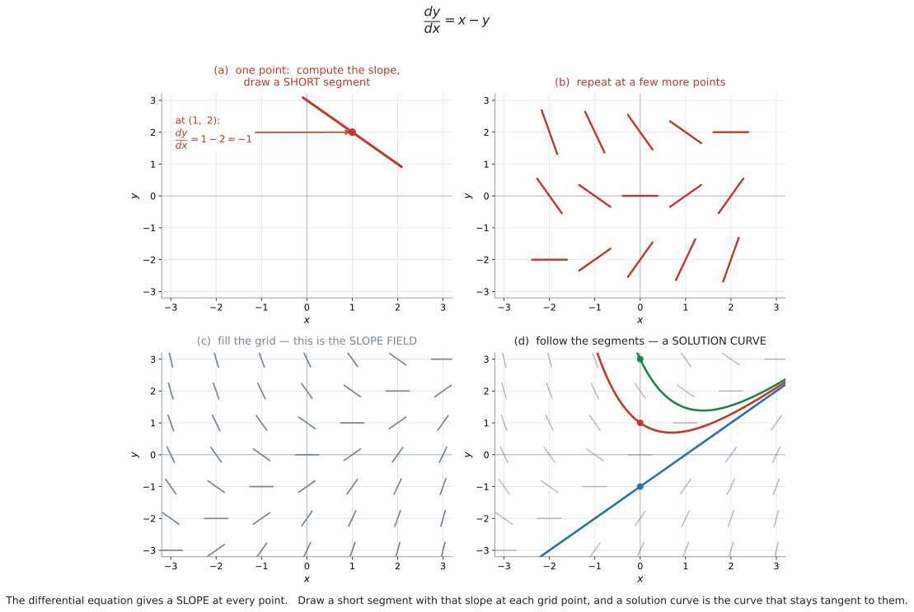
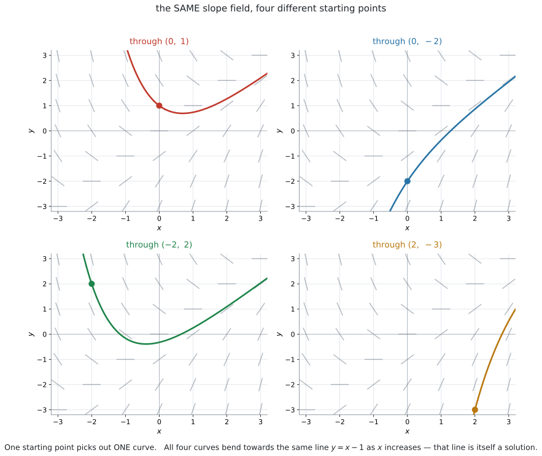
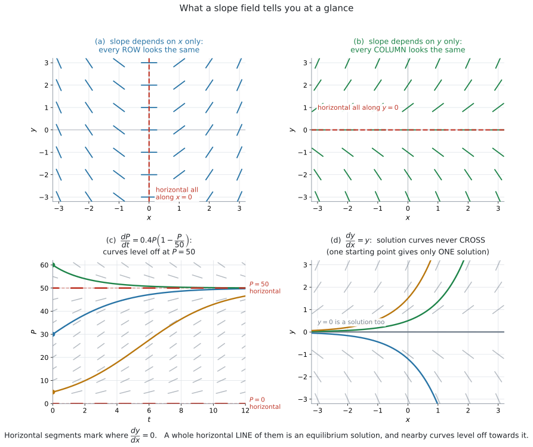
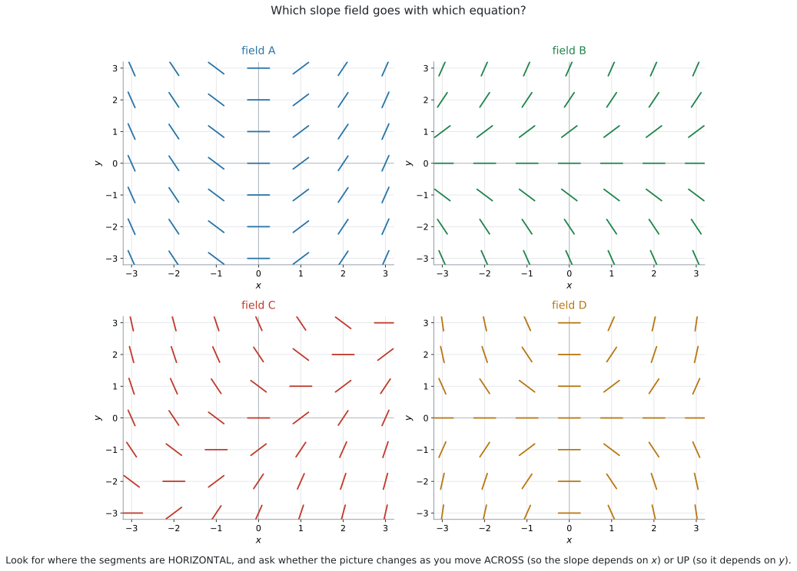
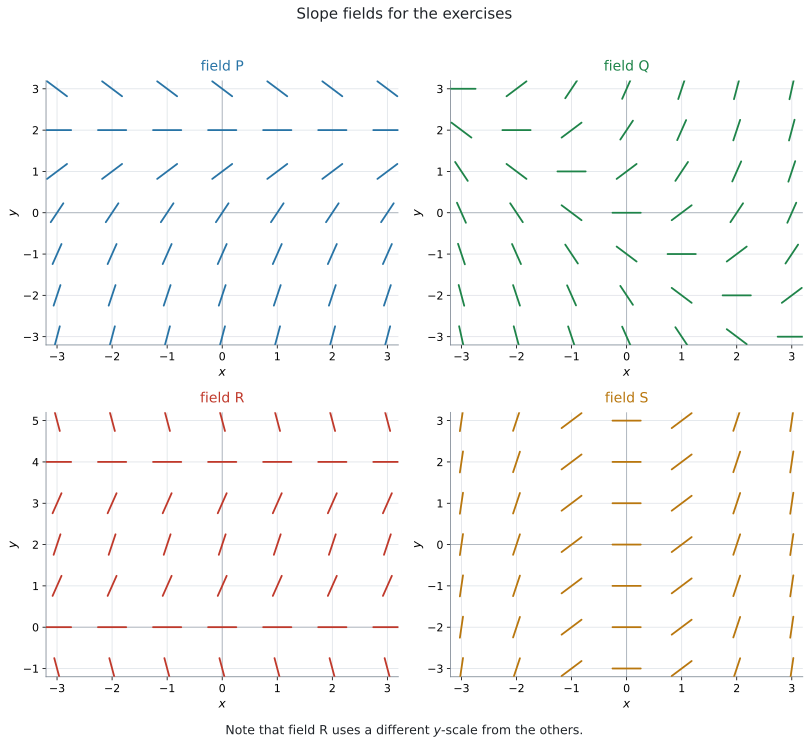

# AHL 5.15 — Slope fields（傾きの場） {#sec-ahl-5-15}

::: {.callout-note}
## What you should be able to do
- **slope field**（傾きの場）が何を表しているか説明できる。
- 微分方程式から、**各点の傾き**を計算して短い線分をかける。
- 印刷された slope field の上に、**solution curve**（解曲線）をかき込める。
- **initial condition**（初期条件）が与えられたとき、通る曲線が $1$ 本に決まることを説明できる。
- 場を見て、**式と場を対応づけられる**。
- **equilibrium solution**（平衡解）と、$x$ が大きいときのふるまいを読み取れる。
:::

::: {.callout-note}
## この項目は「解かずに、形を見る」方法です
[AHL 5.14](ahl-5-14.qmd) では、微分方程式を**変数分離で解きました。** しかし、**手で解ける微分方程式は、ごく一部です。**

たとえば $\dfrac{dy}{dx} = x - y$ や $\dfrac{dV}{dt} = 5 - k\sqrt{V}$ は、AI HL の範囲では手で解けません。

**それでも、解のグラフの形は分かります。** そのための道具が slope field です。

シラバスは、この項目にこう書いています。

> **Content:** Slope fields and their diagrams.
>
> **Guidance:** Students will be required to use and interpret slope fields.

**`use and interpret`**——**使うこと**（曲線をかき込むこと）と**読み取ること**の $2$ つです。「解くこと」は求められていません。
:::

::: {.callout-important}
## Formula booklet に 5.15 の欄はありません
AI HL の公式集の Topic 5 は、**5.13 の次が 5.16** です。**5.14 と 5.15 の欄はありません。**

この項目には、そもそも覚える公式がありません。**やることは「代入して、線分をかく」だけ**です。

ただし、**やり方そのものは覚える必要があります。** どこにも書かれていないからです。
:::

## The idea

### 1. 微分方程式は、各点での「傾き」を教えてくれます {#idea}

$$
\frac{dy}{dx} = x - y
$$

この式の左辺 $\dfrac{dy}{dx}$ は、**グラフの傾き**です（[SL 5.1](../../ai-sl/05-calculus/sl-5-1.qmd)）。

ですから、この式はこう読めます。

> 点 $(x,\ y)$ を教えてくれれば、そこでの**傾きを答えます。**

たとえば $(1,\ 2)$ なら

$$
\frac{dy}{dx} = 1 - 2 = -1
$$

**解が何なのか分からなくても、傾きだけは計算できます。** ここがこの項目の出発点です。

::: {.callout-tip}
## 解を知らなくても、傾きは分かります
ふつうは「関数が分かってから、微分して傾きを出す」順番です。

微分方程式では、**その逆**です。**傾きのほうが先に分かっていて、関数を知りません。**

$$
\text{関数} \ \longrightarrow \ \text{傾き} \quad \text{ではなく} \quad \text{傾き} \ \longrightarrow \ \text{関数}
$$

slope field は、**先に分かっている「傾き」を、平面じゅうに書き出したもの**です。
:::

::: {.callout-warning}
## $\dfrac{dy}{dx} = x - y$ は、$y$ も右辺に入っています
$\dfrac{dy}{dx} = 2x$ なら、$x$ を決めれば傾きが決まります。

しかし $\dfrac{dy}{dx} = x - y$ では、**$x$ だけでは決まりません。** $y$ も要ります。

だから、**平面上の「点」ごとに**傾きが決まるのです。「$x$ ごと」ではありません。
:::

### 2. slope field のかき方 {#build}

**やることは $3$ 段階です。**

::: {.callout-note appearance="simple"}
**手順1.** 格子の点を $1$ つ選び、その $x$ と $y$ を右辺に代入して**傾きを計算する。**

**手順2.** その点を中心に、その傾きの**短い線分**をかく。

**手順3.** ほかの格子点でも、同じことをくり返す。
:::

{#fig-ahl515-build width=100%}

@fig-ahl515-build がその流れです。(a) で $1$ 点、(b) で数点、(c) で格子全体、(d) で解曲線です。

::: {.callout-important}
## 線分は「短く」、そして「長さをそろえて」かきます
線分が表しているのは**向きだけ**です。**長さには意味がありません。**

ですから、

- **短く**かきます（となりの線分とつながらない長さ）。
- **長さは全部そろえます**（傾きが急なところだけ長くしない）。

@fig-ahl515-build の (c) を見てください。傾きが $-3$ の線分も $0$ の線分も、**同じ長さ**です。
:::

::: {.callout-tip}
## 「傾きが同じになる点」をまとめて処理すると速いです
$\dfrac{dy}{dx} = x - y$ で傾きが $-1$ になるのは

$$
x - y = -1, \quad \text{つまり} \quad y = x + 1
$$

の上のすべての点です。$(0,\ 1)$、$(1,\ 2)$、$(2,\ 3)$、$(-1,\ 0)$……**この直線上では、線分の向きが全部同じ**になります。

$1$ 点ずつ計算するより、**「この直線の上は全部この向き」**とまとめたほうが、はるかに速く終わります。

同じように、傾きが $0$ になるのは $y = x$ の上です。**まずここを見つけると、絵の骨格ができます。**
:::

::: {.callout-warning}
## 線分に矢印を付けないでください
slope field の線分は、**向き（direction）ではなく傾き（slope）**を表します。

$\dfrac{dy}{dx} = -1$ は「右下がり」であって、「左上へ進む」でも「右下へ進む」でもありません。

**ただの線分**でかいてください。矢印を付けると、意味が変わってしまいます。
:::

### 3. 線分をたどると、解曲線になります {#follow}

slope field ができたら、**線分に沿ってなめらかな曲線をかきます。**

{#fig-ahl515-follow width=100%}

@fig-ahl515-follow の $4$ 枚は、**すべて同じ場**です。違うのは**出発点だけ**です。

::: {.callout-important}
## 曲線は、線分を「切る」のではなく「なでる」ようにかきます
解曲線は、通る点で**線分と同じ傾き**になっていなければなりません。

つまり、線分と**接する**ようにかきます。**線分を横切ってはいけません。**

$$
\text{解曲線の傾き} = \text{その点の線分の傾き}
$$

かき終わったら、**曲線に沿って目で追ってください。** どこかで線分と食い違っていたら、そこが間違いです。
:::

::: {.callout-tip}
## 「線分から線分へ乗り換えていく」と考えると、かきやすいです
出発点の線分の向きにすこし進み、そこにある線分の向きにまたすこし進み……とくり返します。

**これを数値でやるのが AHL 5.16 の Euler's method** です。slope field は、その**絵**にあたります。
:::

### 4. 出発点が $1$ つ決まれば、曲線が $1$ 本に決まります {#particular}

@fig-ahl515-follow の $4$ 枚は、同じ場から**別々の曲線**を取り出しています。

- 場だけ与えられている → 曲線は**無数**にある（**general solution**、一般解）
- 出発点も与えられている → 曲線は**$1$ 本**に決まる（**particular solution**、特殊解）

**この区別は [AHL 5.14](ahl-5-14.qmd#general) とまったく同じ**です。あちらは式で、こちらは絵で見ています。

::: {.callout-tip}
## 出発点は `initial condition` として与えられます
*Sketch the solution curve that passes through* $(0,\ 1)$ のように書かれます。

答案では、**その点に印を付けてから**曲線をかいてください。**採点者は、まずそこを見ます。**
:::

::: {.callout-warning}
## 曲線は、図の端まで（あるいは指定された範囲まで）かいてください
点のまわりに少しだけかいて終わり、では点になりません。

**範囲が** *for* $-3 \leq x \leq 3$ **のように指定されていたら、その範囲いっぱいまで**かきます。
:::

### 5. 場から読み取れること {#read}

`interpret` と言われたら、見るところは決まっています。

{#fig-ahl515-features width=100%}

| 見るところ | 分かること |
|---|---|
| **水平**な線分がある点 | そこで $\dfrac{dy}{dx} = 0$ |
| 水平な線分が**横一直線**に並ぶ | その直線が **equilibrium solution**（平衡解） |
| どの**行**も同じ絵 | 傾きが $x$ だけで決まる |
| どの**列**も同じ絵 | 傾きが $y$ だけで決まる |
| 線分が全部**右上がり** | $y$ はずっと増える |
| 曲線どうしが**交わらない** | $1$ 点の傾きは $1$ つしかないから |

: slope field の読みどころ {#tbl-ahl515-read}

@fig-ahl515-features の $4$ 枚は、この表のうち $4$ つを絵にしたものです。上から順に、$1$ 行目・$2$ 行目・$3$ 行目・$6$ 行目にあたります。

::: {.callout-important}
## equilibrium solution（平衡解）が、いちばんよく問われます
水平な線分が**横一直線に並んでいたら**、その高さの水平な直線そのものが解です。

@fig-ahl515-features の (c) では、$P = 50$ の高さで線分がすべて水平です。ですから

$$
P = 50 \quad (\text{ずっと } 50 \text{ のまま})
$$

が解の $1$ つです。**そして、まわりの曲線はこの高さに向かって寝ていきます。**

式でいえば、$\dfrac{dP}{dt} = 0.4P\left(1 - \dfrac{P}{50}\right)$ に $P = 50$ を入れると $0$ になる、ということです。

**$P = 0$ も同じ**です。$0$ を入れると $0$ になります。
:::

::: {.callout-tip}
## 「どの行も同じ」「どの列も同じ」の見分け
@fig-ahl515-features の (a) は $\dfrac{dy}{dx} = x$ です。右辺に $y$ がないので、**上下に動いても絵が変わりません。**

(b) は $\dfrac{dy}{dx} = y$ です。右辺に $x$ がないので、**左右に動いても絵が変わりません。**

$$
\text{右辺に } y \text{ が無い} \ \Longrightarrow \ \text{縦に動かしても同じ}
$$

$$
\text{右辺に } x \text{ が無い} \ \Longrightarrow \ \text{横に動かしても同じ}
$$

**この $2$ つだけで、選択肢が半分に減ります。**
:::

::: {.callout-warning}
## 解曲線どうしは、交わりません
@fig-ahl515-features の (d) を見てください。$4$ 本の曲線が、**どこでも交わっていません。**

理由は $1$ つです。もし $2$ 本が点 $A$ で交わったら、$A$ での傾きが $2$ 通りあることになります。**でも、$\dfrac{dy}{dx} = f(x,\ y)$ が返す値は $1$ つだけ**です。

*Explain why two solution curves cannot cross* と問われたら、こう書きます。

::: {.model-answer}
**試験ではこう書く**

*At any point $(x,\ y)$ the differential equation gives exactly one value of $\dfrac{dy}{dx}$, so only one slope is possible there. Two curves crossing at that point would need two different slopes, which is impossible.*
:::

（どの点 $(x,\ y)$ でも微分方程式は $\dfrac{dy}{dx}$ の値をただ $1$ つ返すので、そこでの傾きは $1$ 通りしかない。$2$ 本の曲線がその点で交われば $2$ つの異なる傾きが必要になり、それはありえない、という意味です。）
:::

### 6. 式と場を対応させる {#match}

**選択問題としてよく出ます。**

{#fig-ahl515-match width=100%}

@fig-ahl515-match の $4$ 枚は、次の $4$ つの式のどれかです。

$$
\frac{dy}{dx} = x, \qquad \frac{dy}{dx} = y, \qquad \frac{dy}{dx} = x - y, \qquad \frac{dy}{dx} = xy
$$

**手順は $2$ つだけです。**

::: {.callout-note appearance="simple"}
**手順1.** **水平な線分はどこにあるか**を見る。右辺 $= 0$ を解いた場所と合うか。

**手順2.** **横に動かすと変わるか、縦に動かすと変わるか**を見る。
:::

| 式 | $\dfrac{dy}{dx} = 0$ になるところ |
|---|---|
| $\dfrac{dy}{dx} = x$ | $x = 0$（**縦**の直線） |
| $\dfrac{dy}{dx} = y$ | $y = 0$（**横**の直線） |
| $\dfrac{dy}{dx} = x - y$ | $y = x$（**斜め**の直線） |
| $\dfrac{dy}{dx} = xy$ | $x = 0$ **と** $y = 0$（**十字**） |

: 水平な線分の場所で見分ける {#tbl-ahl515-match}

**$4$ つとも場所が違います。** ですから、水平な線分を探すだけで区別できます。@exm-ahl515-match で実際にやります。

::: {.callout-tip}
## $1$ 点だけ代入してみるのも、確実な方法です
迷ったら、**分かりやすい点を $1$ つ選んで**両方を見くらべます。

$(2,\ 1)$ なら

| 式 | 傾き |
|---|---|
| $\dfrac{dy}{dx} = x$ | $2$（かなり急な右上がり） |
| $\dfrac{dy}{dx} = y$ | $1$（$45^\circ$ の右上がり） |
| $\dfrac{dy}{dx} = x - y$ | $1$ |
| $\dfrac{dy}{dx} = xy$ | $2$ |

: $(2,\ 1)$ での傾き {#tbl-ahl515-point}

$(2,\ 1)$ だけでは、(i) と (iv) が同じ $2$、(ii) と (iii) が同じ $1$ で、**絞りきれません。そのときは、もう $1$ 点**足します。

$(1,\ 2)$ を足すと、$4$ つの式の傾きは順に $1$、$2$、$-1$、$2$ です。**$2$ 点の組で見れば、$4$ つ全部が区別できます。**
:::

### 7. slope field で分からないこと {#limits}

**slope field は「絵」です。数値の答えは出ません。**

| 問われかた | slope field で答えられるか |
|---|---|
| *Sketch the solution curve through ...* | ✅ できる |
| *Describe the behaviour as $x$ increases* | ✅ できる |
| *Write down the equilibrium solution* | ✅ できる |
| *Find $y$ when $x = 2$, correct to 3 s.f.* | ❌ 図からは無理 |
| *Find the general solution* | ❌ 式を解く（[AHL 5.14](ahl-5-14.qmd#separate)） |

: slope field でできること、できないこと {#tbl-ahl515-limits}

**数値がほしいときは、AHL 5.16 の Euler's method** を使います。slope field はその**下絵**にあたります。

::: {.callout-note appearance="simple"}
つまり、微分方程式の扱いかたには $3$ つあります。

1. **式で解く**（[AHL 5.14](ahl-5-14.qmd)、変数分離）… 正確な式が出るが、解ける式が限られる
2. **絵で見る**（AHL 5.15、slope field）… どんな式でも使えるが、数値は出ない
3. **数値で追う**（AHL 5.16、Euler's method）… どんな式でも使えて、数値も出るが、近似

**$3$ つとも、同じ微分方程式を別の角度から見ています。**
:::

## Why it works

::: {.callout-tip collapse="true"}
## クリックすると開きます

### なぜ「線分に接するようにかく」と、解になるのか {#why}

$y = g(x)$ が微分方程式 $\dfrac{dy}{dx} = f(x,\ y)$ の解である、というのは

$$
g'(x) = f\bigl(x,\ g(x)\bigr) \quad \text{が、すべての } x \text{ で成り立つ}
$$

という意味です。

左辺 $g'(x)$ は、**曲線の点 $(x,\ g(x))$ での傾き**です。

右辺 $f(x,\ g(x))$ は、**その点にかいた線分の傾き**です。

つまり、この式が言っているのは

$$
\text{曲線の傾き} = \text{その点の線分の傾き}
$$

だけです。**「線分に接している」という条件そのもの**が、微分方程式の中身なのです。

だから、**線分に接するようにかいた曲線は、解のグラフになります。** 逆に、解のグラフはどこでも線分に接しています。

### なぜ、出発点を $1$ つ決めると曲線が $1$ 本に決まるのか {#unique}

出発点 $(x_0,\ y_0)$ にいるとします。そこでの傾きは $f(x_0,\ y_0)$ で、**$1$ つに決まっています。**

ですから、そこからほんの少し進んだ先も決まります。その新しい点でも傾きが $1$ つに決まり、また少し進めます。

**この操作をくり返すと、行き先は $1$ 通りしかありません。** 選ぶ余地がどこにもないからです。

::: {.callout-note appearance="simple"}
数学としては、これは **existence and uniqueness theorem**（存在と一意性の定理）と呼ばれるもので、$f$ がなめらかなら成り立ちます。

**IB では、この定理の名前も証明も要りません。** 「$1$ 点の傾きは $1$ つだから、曲線は $1$ 本」で十分です。
:::

### 曲線が交わらないことと、平衡解の関係 {#equilibrium-why}

$y = c$（水平な直線）が解になっているとき、**ほかの解曲線はこの直線をまたげません。** またぐには交わるしかなく、それはできないからです。

だから、@fig-ahl515-features の (c) で $P = 50$ より下から出発した曲線は、**$50$ を超えません。** $50$ に近づくだけです。

上から出発した曲線は、**$50$ より下に落ちません。** やはり $50$ に近づきます。

**平衡解が「壁」になっている**——これが、あの絵の見え方の理由です。
:::

## Worked examples

::: {.callout-note appearance="simple"}
問題文は英語です。意味が理解できなかったら、問題文の下の「**日本語訳**」を開いてください。解説は日本語です。
:::

::: {#exm-ahl515-values}
[Consider the differential equation $\dfrac{dy}{dx} = x - y$.]{.q-en}

**(a)** [Find the slope of a solution curve at each of the points $(0,\ 0)$, $(1,\ 2)$, $(-1,\ 2)$ and $(2,\ 1)$.]{.q-en}

**(b)** [Find the equation of the line on which all the segments of the slope field are horizontal.]{.q-en}

**(c)** [Find the equation of the line on which every segment has slope $-1$.]{.q-en}

<details class="jp-trans">
<summary>日本語訳</summary>

微分方程式 $\dfrac{dy}{dx} = x - y$ を考えます。

**(a)** 点 $(0,\ 0)$、$(1,\ 2)$、$(-1,\ 2)$、$(2,\ 1)$ のそれぞれにおける解曲線の傾きを求めなさい。

**(b)** slope field の線分がすべて水平になる直線の方程式を求めなさい。

**(c)** すべての線分の傾きが $-1$ になる直線の方程式を求めなさい。

</details>

**(a)** 代入するだけです。

$$
(0,\ 0): \ 0 - 0 = 0
$$

$$
(1,\ 2): \ 1 - 2 = -1
$$

$$
(-1,\ 2): \ -1 - 2 = -3
$$

$$
(2,\ 1): \ 2 - 1 = 1
$$

**(b)** 水平とは $\dfrac{dy}{dx} = 0$ のことです。

$$
x - y = 0 \ \Longrightarrow \ y = x
$$

**(c)**

$$
x - y = -1 \ \Longrightarrow \ y = x + 1
$$

**検算。** (a) の $(1,\ 2)$ は $y = x + 1$ の上にあります（$2 = 1 + 1$）。そして傾きは $-1$ でした ✓ (b) の直線 $y = x$ 上の点、たとえば $(2,\ 2)$ なら $2 - 2 = 0$ で水平です ✓

::: {.callout-tip}
## (b) と (c) は、$1$ 本ずつ「等傾線」を求めています
$x - y = m$ を満たす点の集まりは、**傾きが $m$ でそろう直線**です。

$m$ を変えると、平行な直線が次々に出てきます。@fig-ahl515-build の (c) を見ると、**斜め $45^\circ$ の帯ごとに線分の向きがそろっている**のが分かります。

**この構造に気づくと、手でかくのがとても速くなります。**
:::

::: {.callout-note}
## 解答例（答案用紙にはこう書く）
**(a)**
$$
(0,\ 0): \ 0, \qquad (1,\ 2): \ -1, \qquad (-1,\ 2): \ -3, \qquad (2,\ 1): \ 1
$$

**(b)** *Horizontal means* $\dfrac{dy}{dx} = 0$:
$$
x - y = 0, \qquad y = x
$$

**(c)**
$$
x - y = -1, \qquad y = x + 1
$$
:::
:::

::: {#exm-ahl515-match}
[The four slope fields A, B, C and D are shown in @fig-ahl515-match.]{.q-en}

[Match each field with one of the following differential equations.]{.q-en}

$$
\text{(i) } \frac{dy}{dx} = x \qquad \text{(ii) } \frac{dy}{dx} = y \qquad \text{(iii) } \frac{dy}{dx} = x - y \qquad \text{(iv) } \frac{dy}{dx} = xy
$$

[Justify your answer for field D.]{.q-en}

<details class="jp-trans">
<summary>日本語訳</summary>

$4$ つの slope field A、B、C、D が @fig-ahl515-match に示されています。

`Match` は「対応させなさい」、`Justify` は「理由を述べなさい」という意味です。

それぞれの場を、次の微分方程式のどれかと対応させなさい。

field D については、その理由を述べなさい。

</details>

**水平な線分がどこにあるかを見ます**（[第6節](#match)）。

**field A** … 水平な線分が、$y$ 軸（$x = 0$）上に**縦一列**に並んでいます。上下に動いても絵が変わりません。$\Rightarrow$ **(i) $\dfrac{dy}{dx} = x$**

**field B** … 水平な線分が、$x$ 軸（$y = 0$）上に**横一列**に並んでいます。左右に動いても絵が変わりません。$\Rightarrow$ **(ii) $\dfrac{dy}{dx} = y$**

**field C** … 水平な線分が**斜め**（$y = x$）に並んでいます。$\Rightarrow$ **(iii) $\dfrac{dy}{dx} = x - y$**

**field D** … 水平な線分が**十字**（$x = 0$ と $y = 0$ の両方）に並んでいます。$\Rightarrow$ **(iv) $\dfrac{dy}{dx} = xy$**

**検算。** field D で $(2,\ 1)$ を見ると、傾きは $2 \times 1 = 2$ で、かなり急な右上がりのはずです。$(-2,\ 1)$ なら $-2 \times 1 = -2$ で、急な右下がりです。**図はそうなっています** ✓

::: {.callout-note}
## 解答例（答案用紙にはこう書く）
$$
\text{A} \to \text{(i)}, \qquad \text{B} \to \text{(ii)}, \qquad \text{C} \to \text{(iii)}, \qquad \text{D} \to \text{(iv)}
$$

**Justification for D**

::: {.model-answer}
*In field D the segments are horizontal along both the $x$-axis and the $y$-axis. Setting $\dfrac{dy}{dx} = 0$ in equation (iv) gives $xy = 0$, that is $x = 0$ or $y = 0$, which is exactly this cross shape. None of the other three equations gives horizontal segments along two lines.*
:::

（field D では $x$ 軸上と $y$ 軸上の両方で線分が水平である。式 (iv) で $\dfrac{dy}{dx} = 0$ とすると $xy = 0$、つまり $x = 0$ または $y = 0$ となり、まさにこの十字の形である。ほかの $3$ つの式は、$2$ 本の直線上で水平にはならない、という意味です。）
:::

::: {.callout-warning}
## `Justify` と言われたら、$1$ 語で終わらせないでください
「D は (iv)」だけでは点になりません。**「なぜそう言えるか」**を書きます。

いちばん書きやすいのは、**水平な線分の場所**です。「$\dfrac{dy}{dx} = 0$ を解くと、この形になる」という $1$ 文で足ります。

数値を $1$ 点あげるのも有効です。「$(2,\ 1)$ で式は $2$ を与え、図の線分も急な右上がりである」のように書けます。
:::
:::

::: {#exm-ahl515-sketch}
[@fig-ahl515-build part (c) shows the slope field for $\dfrac{dy}{dx} = x - y$.]{.q-en}

**(a)** [On a copy of this field, sketch the solution curve that passes through $(0,\ 1)$.]{.q-en}

**(b)** [Describe the behaviour of this solution curve as $x$ increases.]{.q-en}

**(c)** [Show that $y = x - 1$ is a solution of the differential equation.]{.q-en}

<details class="jp-trans">
<summary>日本語訳</summary>

@fig-ahl515-build の (c) は $\dfrac{dy}{dx} = x - y$ の slope field です。

**(a)** この場を写した図の上に、点 $(0,\ 1)$ を通る解曲線をかきなさい。

**(b)** $x$ が増えるときのこの解曲線のふるまいを述べなさい。

**(c)** $y = x - 1$ がこの微分方程式の解であることを示しなさい。

</details>

**(a)** @fig-ahl515-follow の左上に、その曲線がかいてあります。**先に自分でかいてから**見くらべてください。

**かき方の順番。** まず $(0,\ 1)$ に印を付けます。そこでの傾きは $0 - 1 = -1$ なので、**右下がり**で出発します。

右へ進むと、曲線はいったん下がってから底を打ち、そのあと**右上がりの直線に沿っていきます。**

左へ進むと、曲線は**急に上へ**立ち上がります。

**(b)** ことばで答える問いです。

::: {.model-answer}
**試験ではこう書く**

*As $x$ increases the curve first decreases, reaches a minimum, and then increases. For large $x$ it approaches the straight line $y = x - 1$ from above.*
:::

（$x$ が増えると曲線ははじめ減少し、極小をとり、そのあと増加する。$x$ が大きいところでは直線 $y = x - 1$ に非常に近づき、上から近づいていく、という意味です。）

**(c)** $y = x - 1$ を微分すると

$$
\frac{dy}{dx} = 1
$$

いっぽう、右辺に $y = x - 1$ を入れると

$$
x - y = x - (x - 1) = 1
$$

**両方とも $1$ で一致しました。** ですから $y = x - 1$ は解です。

**検算。** この直線上の点、たとえば $(2,\ 1)$ で場の線分を見ると、傾きは $2 - 1 = 1$ です。**直線 $y = x - 1$ の傾きも $1$** ✓ 直線が線分に接しています。

::: {.callout-tip}
## (b) の「極小」は、場から読めます
曲線が水平になるのは、$y = x$ の上を横切るときです（@exm-ahl515-values の (b)）。

$(0,\ 1)$ から出発した曲線は $y = x$ を $1$ 回だけ横切り、**そこが極小**です。その左では傾きが負（$y > x$）、右では正（$y < x$）だからです。

**式を解かずに、極小の存在まで言えます。**
:::

::: {.callout-warning}
## 「$y = x - 1$ に近づく」と「$y = x - 1$ になる」は違います
曲線は $y = x - 1$ に**限りなく近づきますが、重なりません。**

もし重なったら、そこで $2$ 本の解曲線が交わることになってしまいます（[第5節](#read)）。

答案では、`approaches` や `gets closer and closer to` と書いてください。`becomes` や `equals` は避けます。
:::

::: {.callout-note}
## 解答例（答案用紙にはこう書く）
**(a)** *(sketch on the field: mark $(0,\ 1)$, start with slope $-1$, curve down to a minimum where it crosses $y = x$, then follow the segments up towards the line $y = x - 1$)*

**(b)**

::: {.model-answer}
*As $x$ increases the curve first decreases, reaches a minimum, and then increases. For large $x$ it approaches the line $y = x - 1$ from above.*
:::

**(c)** *If* $y = x - 1$ *then* $\dfrac{dy}{dx} = 1$.
$$
x - y = x - (x - 1) = 1
$$
*Both sides equal $1$, so $y = x - 1$ satisfies the differential equation.*
:::
:::

::: {#exm-ahl515-logistic}
[A population of fish, $P$, in a lake at time $t$ years is modelled by]{.q-en}

$$
\frac{dP}{dt} = 0.4P\left(1 - \frac{P}{50}\right)
$$

[where $P$ is measured in thousands. The slope field is shown in @fig-ahl515-features, part (c).]{.q-en}

**(a)** [Show that $P = 50$ gives a horizontal segment at every value of $t$.]{.q-en}

**(b)** [Write down the other value of $P$ for which this happens.]{.q-en}

**(c)** [Describe what the model predicts for a lake that starts with $P = 5$.]{.q-en}

**(d)** [Describe what the model predicts for a lake that starts with $P = 60$.]{.q-en}

<details class="jp-trans">
<summary>日本語訳</summary>

時刻 $t$ 年における湖の魚の個体数 $P$ が、上の式でモデル化されています。$P$ は千匹単位です。slope field は @fig-ahl515-features の (c) に示されています。

**(a)** $P = 50$ のとき、どの $t$ の値でも線分が水平になることを示しなさい。

**(b)** 同じことが起こるもう $1$ つの $P$ の値を書きなさい。

**(c)** $P = 5$ から始まる湖について、このモデルが予測することを述べなさい。

**(d)** $P = 60$ から始まる湖について、このモデルが予測することを述べなさい。

</details>

**(a)** $P = 50$ を代入します。

$$
\frac{dP}{dt} = 0.4 \times 50 \times \left(1 - \frac{50}{50}\right) = 20 \times (1 - 1) = 20 \times 0 = 0
$$

**$t$ が式に出てきません。** ですから、どの $t$ でも $0$ です。線分は水平になります。

**(b)** $0.4P\left(1 - \dfrac{P}{50}\right) = 0$ となるのは、$P = 50$ のほかに

$$
P = 0
$$

のときです。（魚がいなければ、増えも減りもしません。）

**(c)** $P = 5$ のとき

$$
\frac{dP}{dt} = 0.4 \times 5 \times \left(1 - \frac{5}{50}\right) = 2 \times 0.9 = 1.8 > 0
$$

**増えます。** そして $P = 50$ を超えることはありません（[第5節](#read)）。

::: {.model-answer}
**試験ではこう書く**

*The population increases. The rate of increase grows at first and then slows down, and the population levels off towards $50$ thousand fish without ever reaching it.*
:::

（個体数は増える。増加の割合ははじめ大きくなり、そのあと小さくなって、$5$ 万匹に向かって寝ていくが、そこに達することはない、という意味です。）

**(d)** $P = 60$ のとき

$$
\frac{dP}{dt} = 0.4 \times 60 \times \left(1 - \frac{60}{50}\right) = 24 \times (-0.2) = -4.8 < 0
$$

**減ります。**

::: {.model-answer}
**試験ではこう書く**

*The population decreases. It falls towards $50$ thousand fish and levels off there, approaching $50$ from above.*
:::

（個体数は減る。$5$ 万匹に向かって下がり、上から $50$ に近づいて、そこで寝ていく、という意味です。）

**検算。** (c) と (d) で、片方は下から、もう片方は上から $50$ に向かっています。**どちらも $50$ に近づく**——@fig-ahl515-features の (c) の絵と一致しています ✓ $P = 30$ でも計算してみると $0.4 \times 30 \times (1 - 0.6) = 4.8 > 0$ で、やはり増えて $50$ に向かいます。

::: {.callout-tip}
## この形は **logistic model**（ロジスティックモデル）と呼ばれます
$$
\frac{dP}{dt} = kP\left(1 - \frac{P}{L}\right)
$$

$L$ が **carrying capacity**（環境収容力）です。ここでは $L = 50$ です。

[AHL 5.14](ahl-5-14.qmd#interpret) の $\dfrac{dP}{dt} = kP$ は、いつまでも増え続けてしまうのが弱点でした。**ロジスティックモデルは、上限で止まります。**

**この式も変数分離の形にはなりますが、その積分は AI HL の範囲を超えます。** AI HL では、slope field で扱えば十分です。
:::

::: {.callout-warning}
## 「$50$ に達する」と書かないでください
$P = 50$ 自体が解なので、下から来た曲線が $50$ に**触れることはありません**（[Why it works](#equilibrium-why)）。

*approaches $50$*、*levels off towards $50$*、*tends to $50$* と書きます。
:::

::: {.callout-note}
## 解答例（答案用紙にはこう書く）
**(a)**
$$
\frac{dP}{dt} = 0.4(50)\left(1 - \frac{50}{50}\right) = 20 \times 0 = 0 \quad \text{for all } t
$$

**(b)** $P = 0$

**(c)**
$$
\frac{dP}{dt} = 0.4(5)(1 - 0.1) = 1.8 > 0
$$

::: {.model-answer}
*The population increases, and levels off towards $50$ thousand without reaching it.*
:::

**(d)**
$$
\frac{dP}{dt} = 0.4(60)(1 - 1.2) = -4.8 < 0
$$

::: {.model-answer}
*The population decreases, and levels off towards $50$ thousand from above.*
:::
:::
:::

## Common errors

::: {.callout-warning}
## 線分を長くかきすぎる
線分が表すのは**向きだけ**です。となりとつながるほど長くかくと、絵が読めなくなります（[第2節](#build)）。
:::

::: {.callout-warning}
## 傾きが急なところだけ、線分を長くする
**長さは全部そろえます。** 長さに意味はありません（[第2節](#build)）。
:::

::: {.callout-warning}
## 線分に矢印を付ける
slope field は**傾き**の絵で、**向き**の絵ではありません。ただの線分でかいてください（[第2節](#build)）。
:::

::: {.callout-warning}
## 解曲線が線分を横切ってしまう
曲線はどこでも線分と**同じ傾き**でなければなりません（[第3節](#follow)）。**かいたあと、目で追って確かめてください。**
:::

::: {.callout-warning}
## 出発点に印を付けない
*through* $(0,\ 1)$ と指定されたら、**その点をはっきり通す**ことが採点の対象です（[第4節](#particular)）。
:::

::: {.callout-warning}
## 曲線を短くしか引かない
指定された範囲、あるいは図の端まで引いてください（[第4節](#particular)）。
:::

::: {.callout-warning}
## 平衡解を「超えて」しまう
$P = 50$ が解なら、ほかの曲線はそれをまたげません（[Why it works](#equilibrium-why)）。
:::

::: {.callout-warning}
## 「近づく」を「達する」と書く
`approaches` と `reaches` は違います（@exm-ahl515-logistic）。
:::

::: {.callout-warning}
## `Justify` に理由を書かない
対応を書くだけでは点になりません。**水平な線分の場所**か、**$1$ 点の傾きの値**を根拠にしてください（@exm-ahl515-match）。
:::

::: {.callout-warning}
## 図から数値を読んで、$3$ 桁で答える
slope field は絵です。**精密な値は出せません**（@tbl-ahl515-limits）。数値がほしいときは AHL 5.16 の Euler's method です。
:::

## Using your GDC (TI-Nspire CX II)

::: {.callout-important}
## 試験では、slope field は「印刷されて配られます」
*Sketch the slope field* と一から手でかかせる出題は、あまりありません。**ふつうは図が与えられ、その上に曲線をかいたり、読み取ったりします。**

ですから、電卓は**練習と確認のため**に使ってください。
:::

::: {.callout-important}
## Press-to-Test（試験モード）では、微分方程式の機能が使えません
IB の試験では、電卓を **Press-to-Test** の状態にします。このモードでは、**微分方程式の機能（Diff Eq）が止められます。**

つまり、**下で説明する操作は、試験中には使えません。** 家や授業での練習用です。

試験では slope field は**印刷されて配られる**ので、それで困ることはありません。
:::

### 電卓で slope field を表示する（練習用） {#gdc-plot}

**Graphs のアプリで、グラフの種類を「Diff Eq」に切り替えます。**

```
Graphs → menu → Graph Entry/Edit → Diff Eq
```

すると、$y = $ ではなく **$y1' = $** という入力欄が出ます。ここに右辺を入れます。

| 入れるもの | 例 |
|---|---|
| $y1'$ | `x - y1` |
| Initial Conditions の $x0$ | `0` |
| Initial Conditions の $y1_0$ | `1` |

: Diff Eq の入力 {#tbl-ahl515-gdc}

**変数名に注意してください。** 右辺の $y$ は、電卓では **`y1`** と書きます。$x$ はそのまま `x` です。

初期条件を入れると、**場と一緒に解曲線も表示されます。**

::: {.callout-warning}
## 変数を `y` と書くと、うまくいきません
入力欄が $y1'$ なので、右辺でも **`y1`** を使います。

`x - y` と入れると、$y$ が別の未定義な変数として扱われ、思ったとおりになりません。
:::

::: {.callout-tip}
## 初期条件は、あとから増やせます
$y1'$ の行の Initial Conditions は、**カンマで区切って複数入れられます。**

```
x0 = 0,   y1_0 = 1, -1, 3
```

とすると、**$3$ 本の解曲線が同時に**出ます。@fig-ahl515-build の (d) と同じ絵です。

**「同じ場から出る、いくつもの曲線」を目で見るのに、いちばん速い方法**です。
:::

### 表示を整える {#gdc-window}

線分が細かすぎたり粗すぎたりするときは、窓と場の設定を変えます。

```
menu → Window/Zoom → Window Settings
```

$x$ と $y$ の範囲を、$-3$ から $3$ くらいにすると見やすくなります。

場そのものの設定（線分の本数など）は、$y1'$ の入力欄の**右はしにある設定ボタン**から開きます。`Field Resolution` を上げすぎると、線分が細かくなって絵がつぶれます。

::: {.callout-note appearance="simple"}
機種やソフトの版によって、メニューの並びや名前が少し違うことがあります。**Press-to-Test でない状態なら、`menu` の中に「Diff Eq」があります。** 見つからないときは、`menu` を上から順に見てください。
:::

### 電卓の絵を、そのまま答案に写さないでください {#gdc-caution}

**試験で配られる図と、電卓の絵は別物です。**

答案でやることは、

1. 配られた図の上に、**指定された点を通る曲線をかく**
2. 図から**ことばで**読み取る

の $2$ つです。電卓は、**自分の答えが合っているかを見るため**に使ってください。

::: {.callout-warning}
## 電卓は数値の答えも出しますが、この項目では聞かれません
Diff Eq のグラフをトレースすれば、$x = 2$ での $y$ の値も読めます。

しかし、**それは AHL 5.16（Euler's method）の内容**です。5.15 で求められているのは `use and interpret`——**かくことと、読み取ること**です。
:::

## Exercises

::: {.callout-note appearance="simple"}
各問題に、折りたたみが3つ付いています。**日本語訳**、**解答例**（答案用紙に書くべきこと。英語です）、**解説**（なぜそうなるか。日本語です）。

まず自分で解いて、次に解答例と見くらべてください。**解説は、合わなかったときだけ開けば十分です。**
:::

演習の $2$ 番以降では、次の $4$ つの場を使います。

{#fig-ahl515-exercises width=100%}

::: {.exercise-block}

[1]{.ex-no} [Consider the differential equation $\dfrac{dy}{dx} = x + y$.]{.q-en}

**(a)** [Find the slope at each of the points $(0,\ 0)$, $(1,\ 1)$, $(2,\ -1)$ and $(-2,\ -1)$.]{.q-en}

**(b)** [Find the equation of the line along which every segment is horizontal.]{.q-en}

**(c)** [Find the equation of the line along which every segment has slope $2$.]{.q-en}

<details class="jp-trans">
<summary>日本語訳</summary>

微分方程式 $\dfrac{dy}{dx} = x + y$ を考えます。

**(a)** 点 $(0,\ 0)$、$(1,\ 1)$、$(2,\ -1)$、$(-2,\ -1)$ における傾きを求めなさい。

**(b)** すべての線分が水平になる直線の方程式を求めなさい。

**(c)** すべての線分の傾きが $2$ になる直線の方程式を求めなさい。

</details>

::: {.callout-note collapse="true"}
## 解答例（答案用紙に書くこと）
**(a)**
$$
(0,\ 0): \ 0, \qquad (1,\ 1): \ 2, \qquad (2,\ -1): \ 1, \qquad (-2,\ -1): \ -3
$$

**(b)**
$$
x + y = 0, \qquad y = -x
$$

**(c)**
$$
x + y = 2, \qquad y = 2 - x
$$
:::

::: {.callout-tip collapse="true"}
## 解説
**(a)** 代入するだけです。$(2,\ -1)$ は $2 + (-1) = 1$、$(-2,\ -1)$ は $-2 + (-1) = -3$ です。

**符号のミスがいちばん多いところです。** $y$ が負の点で、ていねいに計算してください。

**(b)** 水平とは $\dfrac{dy}{dx} = 0$ のことです（[第5節](#read)）。

**(c)** 傾きが $2$ になる点は、$x + y = 2$ の上に並びます。**(b) の直線と平行**です。

**検算。** (a) の $(1,\ 1)$ は $x + y = 2$ の上にあります。そして傾きは $2$ でした ✓ (a) の $(0,\ 0)$ は $y = -x$ の上にあり、傾きは $0$ でした ✓
:::

::: {.ex-sep}
:::

[2]{.ex-no} [@fig-ahl515-exercises shows four slope fields P, Q, R and S.]{.q-en}

[Match each field with one of the following differential equations. Note that field R uses a different $y$-scale from the other three.]{.q-en}

$$
\text{(i) } \frac{dy}{dx} = x^2 \qquad \text{(ii) } \frac{dy}{dx} = 2 - y \qquad \text{(iii) } \frac{dy}{dx} = y(4 - y) \qquad \text{(iv) } \frac{dy}{dx} = x + y
$$

<details class="jp-trans">
<summary>日本語訳</summary>

@fig-ahl515-exercises に $4$ つの slope field P、Q、R、S が示されています。

それぞれの場を、上の微分方程式のどれかと対応させなさい。**field R の図だけ、$y$ の目盛りが他の $3$ つと違うことに注意してください。**

</details>

::: {.callout-note collapse="true"}
## 解答例（答案用紙に書くこと）
$$
\text{P} \to \text{(ii)}, \qquad \text{Q} \to \text{(iv)}, \qquad \text{R} \to \text{(iii)}, \qquad \text{S} \to \text{(i)}
$$
:::

::: {.callout-tip collapse="true"}
## 解説
**水平な線分を探します**（[第6節](#match)）。

| 式 | $\dfrac{dy}{dx} = 0$ になるところ | 場 |
|---|---|---|
| (i) $x^2$ | $x = 0$（縦の直線）。しかも**傾きは決して負にならない** | S |
| (ii) $2 - y$ | $y = 2$（横の直線が $1$ 本） | P |
| (iii) $y(4 - y)$ | $y = 0$ **と** $y = 4$（横の直線が $2$ 本） | R |
| (iv) $x + y$ | $y = -x$（斜めの直線） | Q |

: 水平な線分の場所 {#tbl-ahl515-ex2}

**S がいちばん見分けやすい**かもしれません。$x^2 \geq 0$ なので、**右下がりの線分が $1$ つもありません。**

**P と R は、どちらも横の直線ですが本数が違います。** P は $1$ 本（$y = 2$）、R は $2$ 本（$y = 0$ と $y = 4$）です。

**検算。** Q で $(1,\ 1)$ を見ると $1 + 1 = 2$ で急な右上がり、$(-2,\ -1)$ なら $-3$ で急な右下がりです。図と合っています ✓
:::

::: {.ex-sep}
:::

[3]{.ex-no} [Field P in @fig-ahl515-exercises is the slope field of $\dfrac{dy}{dx} = 2 - y$.]{.q-en}

**(a)** [Write down the equilibrium solution.]{.q-en}

**(b)** [Verify that this is a solution of the differential equation.]{.q-en}

**(c)** [Describe the behaviour, as $x$ increases, of the solution curve through $(0,\ 0)$.]{.q-en}

<details class="jp-trans">
<summary>日本語訳</summary>

@fig-ahl515-exercises の field P は $\dfrac{dy}{dx} = 2 - y$ の slope field です。

`equilibrium solution` は「平衡解」、`Verify` は「（正しいことを）確かめなさい」という意味です。

**(a)** 平衡解を書きなさい。

**(b)** それが微分方程式の解であることを確かめなさい。

**(c)** 点 $(0,\ 0)$ を通る解曲線の、$x$ が増えるときのふるまいを述べなさい。

</details>

::: {.callout-note collapse="true"}
## 解答例（答案用紙に書くこと）
**(a)** $y = 2$

**(b)** *If* $y = 2$ *(a constant) then* $\dfrac{dy}{dx} = 0$.
$$
2 - y = 2 - 2 = 0
$$
*Both sides are $0$, so $y = 2$ is a solution.*

**(c)**

::: {.model-answer}
*The curve starts at $(0,\ 0)$ with slope $2$, so it increases. The slope gets smaller as $y$ gets closer to $2$, so the curve levels off and approaches the line $y = 2$ from below without reaching it.*
:::
:::

::: {.callout-tip collapse="true"}
## 解説
**(a)** 場を見ると、$y = 2$ の高さで線分が**すべて水平**です（[第5節](#read)）。

**(b)** **定数関数の微分は $0$** です。ですから左辺は $0$。右辺も $2 - 2 = 0$ で一致します。

`Verify` は「両辺を計算して、一致することを見せる」という意味です。**両辺とも書いてください。**

**(c)** $(0,\ 0)$ での傾きは $2 - 0 = 2$ です。増えます。

$y$ が $2$ に近づくと $2 - y$ が小さくなるので、**傾きがゆるくなります。**

**検算。** 実際に解くと $y = 2 - 2e^{-x}$ です（変数分離、[AHL 5.14](ahl-5-14.qmd#separate)）。これを微分すると $\dfrac{dy}{dx} = 2e^{-x}$ で、$2 - y = 2 - (2 - 2e^{-x}) = 2e^{-x}$ ✓ $x$ を大きくすると $e^{-x} \to 0$ なので $y \to 2$ です。**場から読み取ったことと一致しています。**
:::

::: {.ex-sep}
:::

[4]{.ex-no} [Field R in @fig-ahl515-exercises is the slope field of $\dfrac{dy}{dx} = y(4 - y)$.]{.q-en}

**(a)** [Write down the two equilibrium solutions.]{.q-en}

**(b)** [Describe the behaviour of the solution curve through $(0,\ 1)$ as $x$ increases.]{.q-en}

**(c)** [Describe the behaviour of the solution curve through $(0,\ 5)$ as $x$ increases.]{.q-en}

<details class="jp-trans">
<summary>日本語訳</summary>

@fig-ahl515-exercises の field R は $\dfrac{dy}{dx} = y(4 - y)$ の slope field です。

**(a)** $2$ つの平衡解を書きなさい。

**(b)** 点 $(0,\ 1)$ を通る解曲線の、$x$ が増えるときのふるまいを述べなさい。

**(c)** 点 $(0,\ 5)$ を通る解曲線の、$x$ が増えるときのふるまいを述べなさい。

</details>

::: {.callout-note collapse="true"}
## 解答例（答案用紙に書くこと）
**(a)** $y = 0$ *and* $y = 4$

**(b)**

::: {.model-answer}
*At $(0,\ 1)$ the slope is $1 \times 3 = 3 > 0$, so the curve increases. It increases towards $y = 4$ and levels off there, approaching $4$ from below without reaching it.*
:::

**(c)**

::: {.model-answer}
*At $(0,\ 5)$ the slope is $5 \times (-1) = -5 < 0$, so the curve decreases. It decreases towards $y = 4$ and levels off there, approaching $4$ from above without reaching it.*
:::
:::

::: {.callout-tip collapse="true"}
## 解説
**(a)** $y(4 - y) = 0$ を解きます。$y = 0$ または $y = 4$ です。

**場でも確かめられます。** $y = 0$ と $y = 4$ の高さで、線分が横一列に水平です。

**(b)** $y = 1$ での傾きは $1 \times (4 - 1) = 3$ で正です。**増えます。**

そして $y = 4$ は平衡解なので、**それを超えることはできません**（[Why it works](#equilibrium-why)）。

**(c)** $y = 5$ での傾きは $5 \times (4 - 5) = -5$ で負です。**減ります。**

やはり $y = 4$ を下回ることはできません。

**検算。** $2$ つの平衡解のあいだ（$0 \leq y \leq 4$）では、$y = 2$（まん中）の傾き $2 \times 2 = 4$ が**いちばん急**です。$y = 1$ でも $y = 3$ でも $3$ です。field R を見ると、$y = 2$ のあたりの線分がいちばん立っています ✓

なお、平衡解の**外側**では、もっと急になります。$y = 5$ でも $y = -1$ でも $|-5| = 5$ です。field R の上端の線分が急な右下がりなのは、そのためです。

::: {.callout-warning}
## $y = 0$ は「不安定」です
$y$ が $0$ より少しでも大きければ増えて $4$ へ、少しでも小さければ（$y = -1$ なら傾きは $-1 \times 5 = -5$）どんどん減ります。

**$0$ から離れていきます。** いっぽう $y = 4$ には、上からも下からも近づきます。

**IB でこの区別（安定・不安定）の用語は問われません**が、場を見て「近づくのか、離れるのか」を答えられるようにしてください。
:::
:::

::: {.ex-sep}
:::

[5]{.ex-no} [Field S in @fig-ahl515-exercises is the slope field of $\dfrac{dy}{dx} = x^2$.]{.q-en}

**(a)** [Explain why no segment in this field has a negative slope.]{.q-en}

**(b)** [Write down the only value of $x$ at which the segments are horizontal.]{.q-en}

**(c)** [Explain why every row of the field looks the same.]{.q-en}

<details class="jp-trans">
<summary>日本語訳</summary>

@fig-ahl515-exercises の field S は $\dfrac{dy}{dx} = x^2$ の slope field です。

`row` は「（横の）行」という意味です。

**(a)** この場に傾きが負の線分が $1$ つもない理由を説明しなさい。

**(b)** 線分が水平になる唯一の $x$ の値を書きなさい。

**(c)** この場のどの行も同じに見える理由を説明しなさい。

</details>

::: {.callout-note collapse="true"}
## 解答例（答案用紙に書くこと）
**(a)**

::: {.model-answer}
*The slope is $x^2$, and the square of any real number is greater than or equal to $0$. So the slope is never negative.*
:::

**(b)** $x = 0$

**(c)**

::: {.model-answer}
*The right-hand side $x^2$ does not contain $y$, so the slope depends only on $x$. Moving up or down does not change the slope, so every horizontal row of the field is identical to every other row.*
:::
:::

::: {.callout-tip collapse="true"}
## 解説
**(a)** $x^2 \geq 0$ です。**これだけで足ります。**

**(b)** $x^2 = 0$ となるのは $x = 0$ だけです。$y$ 軸の上で、線分が水平になっています。

**(c)** ここが [第5節](#read) の @tbl-ahl515-read の $3$ 行目です。

**右辺に $y$ が入っていない**ので、$y$ を変えても傾きが変わりません。

::: {.callout-warning}
## (a) と (c) は、どちらも `Explain` です
理由を**文で**書いてください。「$x^2 \geq 0$」だけを書いて終わりにすると、点にならないことがあります。

**「$x^2$ は $0$ 以上だから、傾きは負にならない」**と、結論まで書きます。
:::

**検算。** この微分方程式は手でも解けます。$y = \dfrac{x^3}{3} + C$ です。微分すると $x^2$ ✓ $x = 0$ で $\dfrac{dy}{dx} = 0$、つまり**変曲点**があります。図の $y$ 軸上で線分が水平なのは、そのためです。
:::

::: {.ex-sep}
:::

[6]{.ex-no} [Consider the differential equation $\dfrac{dy}{dx} = x - y$, whose slope field is shown in @fig-ahl515-build, part (c).]{.q-en}

**(a)** [Sketch the solution curve that passes through $(0,\ 3)$, for $-3 \leq x \leq 3$.]{.q-en}

**(b)** [State the coordinates of the point at which this curve has a minimum, giving a reason.]{.q-en}

<details class="jp-trans">
<summary>日本語訳</summary>

微分方程式 $\dfrac{dy}{dx} = x - y$ を考えます。その slope field は @fig-ahl515-build の (c) に示されています。

**(a)** 点 $(0,\ 3)$ を通る解曲線を、$-3 \leq x \leq 3$ の範囲でかきなさい。

**(b)** この曲線が極小をとる点の座標を、理由を付けて述べなさい。

</details>

::: {.callout-note collapse="true"}
## 解答例（答案用紙に書くこと）
**(a)** *(mark $(0,\ 3)$; the slope there is $0 - 3 = -3$, so start steeply downwards; the curve falls, flattens as it crosses the line $y = x$, then rises and approaches $y = x - 1$ from above)*

**(b)**

::: {.model-answer}
*The minimum is where $\dfrac{dy}{dx} = 0$, that is where $y = x$. Reading from the field, the curve crosses $y = x$ at approximately $(1.4,\ 1.4)$, so the minimum is at approximately $(1.4,\ 1.4)$.*
:::
:::

::: {.callout-tip collapse="true"}
## 解説
**(a)** @fig-ahl515-build の (d) の緑の曲線が、これです。

**出発点の傾きは $-3$** です。かなり急な右下がりから始めてください。

**(b)** 極小は $\dfrac{dy}{dx} = 0$ のところ、つまり **$y = x$ を横切るところ**です（@exm-ahl515-values）。

::: {.callout-warning}
## 図から読む値は、おおよそで構いません
`giving a reason` と言われているので、**大事なのは「$y = x$ の上」と書くこと**です。

座標そのものは図から読むしかないので、$1$ 桁の精度で十分です。**`approximately` や `about` を付けておくと安全です。**

正確な値がほしければ、Euler's method（AHL 5.16）か、電卓のグラフを使います。
:::

**検算。** 実際に解くと $y = x - 1 + 4e^{-x}$ です（$y(0) = 3$）。**この解き方（一階線形微分方程式）は AI HL の範囲外です。** ここでは、微分してもとの式に戻ることだけを見てください。$\dfrac{dy}{dx} = 1 - 4e^{-x} = 0$ より $e^{-x} = 0.25$、つまり $x = \ln 4 = 1.386\ldots$ です。**図から読んだ $1.4$ と一致しています** ✓ そのときの $y$ は $1.386 - 1 + 1 = 1.386$ で、たしかに $y = x$ の上にあります。
:::

::: {.ex-sep}
:::

[7]{.ex-no} [Field Q in @fig-ahl515-exercises is the slope field of $\dfrac{dy}{dx} = x + y$.]{.q-en}

**(a)** [Show that $y = -x - 1$ is a solution of this differential equation.]{.q-en}

**(b)** [On the field, this line separates the curves that eventually rise from those that eventually fall. Suggest why a solution curve cannot move from one side of this line to the other.]{.q-en}

<details class="jp-trans">
<summary>日本語訳</summary>

@fig-ahl515-exercises の field Q は $\dfrac{dy}{dx} = x + y$ の slope field です。

`separates` は「分ける」、`eventually` は「最終的に」という意味です。

**(a)** $y = -x - 1$ がこの微分方程式の解であることを示しなさい。

**(b)** この場では、この直線が「最終的に上がる曲線」と「最終的に下がる曲線」を分けています。解曲線がこの直線の一方の側から他方の側へ移れない理由を述べなさい。

</details>

::: {.callout-note collapse="true"}
## 解答例（答案用紙に書くこと）
**(a)** *If* $y = -x - 1$ *then* $\dfrac{dy}{dx} = -1$.
$$
x + y = x + (-x - 1) = -1
$$
*Both sides equal $-1$, so $y = -x - 1$ is a solution.*

**(b)**

::: {.model-answer}
*The line $y = -x - 1$ is itself a solution curve. To move from one side of it to the other, another solution curve would have to cross it, and at the crossing point two different solution curves would pass through the same point. That is impossible, because the differential equation gives only one slope at each point.*
:::
:::

::: {.callout-tip collapse="true"}
## 解説
**(a)** @exm-ahl515-sketch の (c) と同じやり方です。**左辺と右辺を別々に計算して、一致を見せます。**

$y = -x - 1$ の傾きは $-1$（一次関数の係数）です。

**(b)** [第5節](#read)の「交わらない」を使います。

**「この直線自体が解である」→「解どうしは交われない」→「だからまたげない」**という $3$ 段の理屈です。

::: {.callout-warning}
## 「解曲線である」の $1$ 語を落とさないでください
交われないのは**解曲線どうし**です。ふつうの直線なら、解曲線はいくらでも横切ります。

**まず (a) で「これは解だ」と示したこと**が、(b) の根拠になっています。**$2$ つの小問がつながっています。**
:::

**検算。** 実際に解くと $y = Ae^{x} - x - 1$ です（**この解き方は AI HL の範囲外です。** 結果だけ使います）。微分すると $Ae^x - 1$、いっぽう $x + y = Ae^x - 1$ ✓ $A = 0$ が問題の直線です。$A > 0$ なら $x$ が大きいとき上がり、$A < 0$ なら下がります。**符号が変わることはありません** ✓
:::

::: {.ex-sep}
:::

[8]{.ex-no} [A student is asked to sketch the solution curve of $\dfrac{dy}{dx} = y$ through the point $(0,\ 2)$, using field B in @fig-ahl515-match.]{.q-en}

[The student draws a curve that starts at $(0,\ 2)$, decreases, crosses the $x$-axis and continues downwards.]{.q-en}

[Identify the error in the student's sketch, and describe the correct behaviour.]{.q-en}

<details class="jp-trans">
<summary>日本語訳</summary>

ある生徒が、@fig-ahl515-match の field B を使って、$\dfrac{dy}{dx} = y$ の点 $(0,\ 2)$ を通る解曲線をかくよう求められました。

生徒は、$(0,\ 2)$ から始まり、減少し、$x$ 軸を横切り、そのまま下がり続ける曲線をかきました。

`Identify the error` は「誤りを指摘しなさい」という意味です。

生徒のスケッチの誤りを指摘し、正しいふるまいを述べなさい。

</details>

::: {.callout-note collapse="true"}
## 解答例（答案用紙に書くこと）
::: {.model-answer}
*At $(0,\ 2)$ the slope is $y = 2$, which is positive, so the curve must increase, not decrease. The student has the curve going the wrong way.*

*Also, $y = 0$ is itself a solution of the equation, so no other solution curve can cross the $x$-axis.*

*The correct curve increases from $(0,\ 2)$, rising more and more steeply as $x$ increases, and as $x$ decreases it falls towards the $x$-axis without ever reaching it.*
:::
:::

::: {.callout-tip collapse="true"}
## 解説
**誤りが $2$ つあります。**

**誤り1.** 出発点の傾きです。$\dfrac{dy}{dx} = y$ に $y = 2$ を入れると $2$ で、**正**です。増えなければなりません。

**誤り2.** $x$ 軸を横切っている点です。$y = 0$ を入れると $\dfrac{dy}{dx} = 0$ なので、**$y = 0$ 自体が解**です。ほかの解曲線は、これをまたげません（[Why it works](#equilibrium-why)）。

::: {.callout-warning}
## `Identify the error` では、「何が」「なぜ」を両方書きます
「増えるべきなのに減っている」だけでは半分です。**「$(0,\ 2)$ での傾きが $+2$ だから」**という根拠を添えてください。

@fig-ahl515-features の (d) が、この場の正しい絵です。

**誤りが $2$ つある問題も出ます。** $1$ つ見つけて安心せず、**図全体を見てください。**
:::

**検算。** 解は $y = 2e^{x}$ です（[AHL 5.14](ahl-5-14.qmd#exponential)）。$x = 1$ で $5.44$、$x = -1$ で $0.736$、$x = -3$ で $0.0996$ です。**どこまで行っても正で、$0$ になりません** ✓
:::

::: {.ex-sep}
:::

[9]{.ex-no} [The height of a plant, $h$ cm after $t$ days, is modelled by $\dfrac{dh}{dt} = 0.5h\left(1 - \dfrac{h}{40}\right)$.]{.q-en}

**(a)** [Show that $\dfrac{dh}{dt} = 0$ when $h = 40$.]{.q-en}

**(b)** [Find $\dfrac{dh}{dt}$ when $h = 10$ and when $h = 20$.]{.q-en}

**(c)** [A plant is $10$ cm tall when $t = 0$. Describe how its height changes over time, according to this model.]{.q-en}

**(d)** [Comment on whether the model is reasonable for a real plant.]{.q-en}

<details class="jp-trans">
<summary>日本語訳</summary>

$t$ 日後の植物の高さ $h$ cm が、$\dfrac{dh}{dt} = 0.5h\left(1 - \dfrac{h}{40}\right)$ でモデル化されています。

**(a)** $h = 40$ のとき $\dfrac{dh}{dt} = 0$ となることを示しなさい。

**(b)** $h = 10$ のときと $h = 20$ のときの $\dfrac{dh}{dt}$ を求めなさい。

**(c)** $t = 0$ のとき植物の高さは $10$ cm です。このモデルによれば、高さが時間とともにどう変化するかを述べなさい。

**(d)** このモデルが実際の植物にとって妥当かどうかを論じなさい。

</details>

::: {.callout-note collapse="true"}
## 解答例（答案用紙に書くこと）
**(a)**
$$
\frac{dh}{dt} = 0.5(40)\left(1 - \frac{40}{40}\right) = 20 \times 0 = 0
$$

**(b)**
$$
h = 10: \ 0.5(10)(1 - 0.25) = 5 \times 0.75 = 3.75 \ \text{cm per day}
$$
$$
h = 20: \ 0.5(20)(1 - 0.5) = 10 \times 0.5 = 5 \ \text{cm per day}
$$

**(c)**

::: {.model-answer}
*The plant grows. The growth rate increases at first, reaching its largest value at $h = 20$ cm, and then decreases. The height levels off towards $40$ cm and never exceeds it.*
:::

**(d)**

::: {.model-answer}
*The model is reasonable in that real plants grow quickly at first and then slow down towards a maximum height, and the limit of $40$ cm is realistic for many plants. However, the model predicts that the plant keeps growing for ever, getting closer and closer to $40$ cm, whereas a real plant stops growing after some time and may later lose height. The model also ignores water, light and temperature.*
:::
:::

::: {.callout-tip collapse="true"}
## 解説
**@exm-ahl515-logistic と同じロジスティックモデル**です。$L = 40$、$k = 0.5$ です。

**(b)** $h = 20$（$40$ のちょうど半分）で、伸びがいちばん速くなっています。

**これはロジスティックモデルの性質です。** $L$ の半分のところで、増加が最大になります。

| $h$ | $\dfrac{dh}{dt}$ |
|---|---|
| $5$ | $2.19$ |
| $10$ | $3.75$ |
| $20$ | $5$ |
| $30$ | $3.75$ |
| $40$ | $0$ |

: 高さと伸びの速さ {#tbl-ahl515-ex9}

**(c)** `Describe` なので、ことばで書きます。**「増える」だけでは足りません。** 「はじめ速くなって、そのあと遅くなる」「$40$ に向かって寝ていく」まで書きます。

**(d)** `Comment on` なので、**よい点と弱い点の両方**を書くのが安全です。

**検算。** $h = 10$ と $h = 30$ で $\dfrac{dh}{dt}$ がどちらも $3.75$ です。$0.5h\left(1 - \dfrac{h}{40}\right)$ は $h$ の二次式で、**$h = 20$ を軸とする上に凸の放物線**だからです ✓ $h = 40$ と $h = 0$ の両方で $0$ になるのも、それと合っています。
:::

::: {.ex-sep}
:::

[10]{.ex-no} [Consider the differential equation $\dfrac{dy}{dx} = y - x^2$.]{.q-en}

**(a)** [Find the equation of the curve on which every segment of the slope field is horizontal.]{.q-en}

**(b)** [Find the slope at each of the points $(0,\ 1)$, $(1,\ 1)$ and $(2,\ 1)$.]{.q-en}

**(c)** [A solution curve passes through $(1,\ 1)$. State whether it is increasing or decreasing there, giving a reason.]{.q-en}

**(d)** [Explain why the slope field for this equation looks different from the slope field for $\dfrac{dy}{dx} = y$.]{.q-en}

<details class="jp-trans">
<summary>日本語訳</summary>

微分方程式 $\dfrac{dy}{dx} = y - x^2$ を考えます。

**(a)** slope field のすべての線分が水平になる曲線の方程式を求めなさい。

**(b)** 点 $(0,\ 1)$、$(1,\ 1)$、$(2,\ 1)$ における傾きを求めなさい。

**(c)** ある解曲線が点 $(1,\ 1)$ を通ります。そこで増加しているか減少しているかを、理由を付けて述べなさい。

**(d)** この式の slope field が $\dfrac{dy}{dx} = y$ の slope field と違って見える理由を説明しなさい。

</details>

::: {.callout-note collapse="true"}
## 解答例（答案用紙に書くこと）
**(a)**
$$
y - x^2 = 0, \qquad y = x^2
$$

**(b)**
$$
(0,\ 1): \ 1 - 0 = 1, \qquad (1,\ 1): \ 1 - 1 = 0, \qquad (2,\ 1): \ 1 - 4 = -3
$$

**(c)**

::: {.model-answer}
*At $(1,\ 1)$ the slope is $0$, so the curve is neither increasing nor decreasing there: it is momentarily horizontal. The point $(1,\ 1)$ lies on the curve $y = x^2$, where every segment is horizontal.*
:::

**(d)**

::: {.model-answer}
*For $\dfrac{dy}{dx} = y$ the right-hand side contains no $x$, so the slope depends only on $y$ and every vertical column of the field is identical to every other column. For $\dfrac{dy}{dx} = y - x^2$ the right-hand side contains $x$ as well, so the slope changes as you move across the field, and the columns are no longer identical.*
:::
:::

::: {.callout-tip collapse="true"}
## 解説
**(a)** 水平になるところは、**直線とはかぎりません。** ここでは放物線 $y = x^2$ です。

**「水平になるのは直線の上」と思い込まないでください。**

**(b)** $(2,\ 1)$ で $1 - 4 = -3$ です。**$x^2$ の計算を先にしてください。**

**(c)** ここが引っかけです。傾きが $0$ なので、**「増加」でも「減少」でもありません。**

::: {.callout-warning}
## 「どちらでもない」も、りっぱな答えです
`State whether it is increasing or decreasing` と聞かれても、**$0$ なら $0$ と答えます。**

無理にどちらかを選ばないでください。**理由（$1 - 1^2 = 0$）を書けば、それで点になります。**
:::

**(d)** @tbl-ahl515-read の $3$ 行目と $4$ 行目です。

$\dfrac{dy}{dx} = y$ は $x$ を含まないので、**横に動いても変わりません。** $y - x^2$ は $x$ を含むので、変わります。

**検算。** $(0,\ 1)$、$(1,\ 1)$、$(2,\ 1)$ は同じ高さ $y = 1$ の点です。傾きは $1$、$0$、$-3$ と**全部違います** ✓ 右辺に $x$ が入っているからです。もし $\dfrac{dy}{dx} = y$ なら、$3$ 点とも傾きは $1$ で同じになります。
:::

:::
