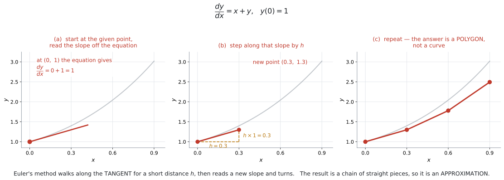
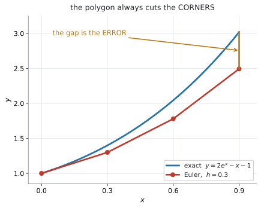
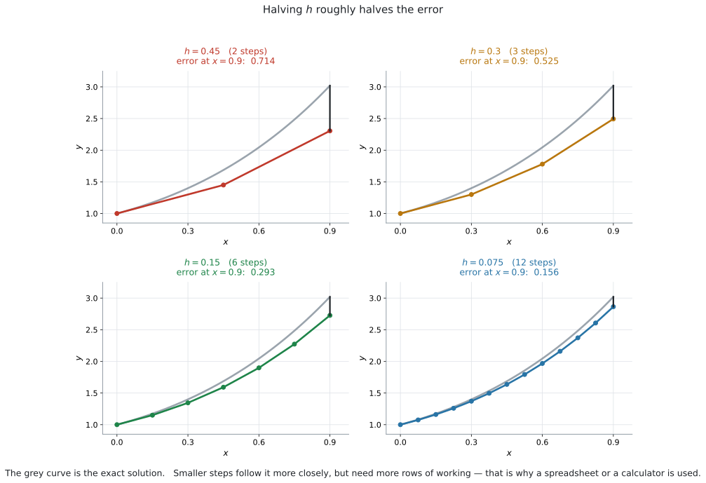
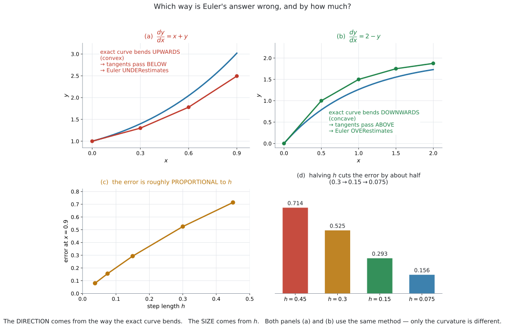
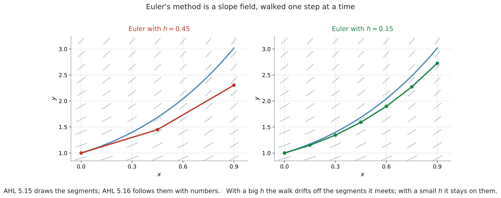

# AHL 5.16a — Euler's method（オイラー法） {#sec-ahl-5-16a}

::: {.callout-note}
## What you should be able to do
- **Euler's method**（オイラー法）が何をしているか、ことばで説明できる。
- 公式集の式を使って、$1$ 歩ずつ**表**を作れる。
- **step length**（刻み幅）$h$ の意味が分かる。
- 出た値が **approximation**（近似値）であることを説明できる。
- 誤差が**どちら向きに、どれくらい**出るかを説明できる。
- スプレッドシートや GDC で、歩数の多い計算ができる。
:::

## The idea

### 1. 傾きが分かれば、少し先が予想できます {#idea}

[AHL 5.14](ahl-5-14.qmd) で**式で解き**、[AHL 5.15](ahl-5-15.qmd) で**絵で見ました。** このページは **$3$ つ目、数値で追う**方法です。

| 方法 | 出てくるもの | 使えるとき |
|---|---|---|
| [AHL 5.14](ahl-5-14.qmd) separation of variables | **正確な式** | 変数分離できる式のときだけ |
| [AHL 5.15](ahl-5-15.qmd) slope field | **絵**（数値は出ない） | どんな式でも |
| **AHL 5.16 Euler's method** | **数値**（近似） | どんな式でも |

: 微分方程式の $3$ つの扱いかた {#tbl-ahl516a-three}

シラバスも **`approximate`**（近似）と書いています。**ぴったりの答えは出ません。**

[AHL 5.15](ahl-5-15.qmd#idea) で見たように、微分方程式は**どの点でも傾きを教えてくれます。**

$$
\frac{dy}{dx} = x + y
$$

点 $(0,\ 1)$ なら、傾きは $0 + 1 = 1$ です。

**では、そこから少しだけ進んだ先の $y$ は、いくつでしょうか。**

正確には分かりません。しかし、**傾き $1$ でまっすぐ進んだ**とすれば、見当はつきます。$x$ が $0.3$ だけ増えれば、$y$ は $1 \times 0.3 = 0.3$ 増えて $1.3$ です。

{#fig-ahl516a-step width=100%}

@fig-ahl516a-step の (a) と (b) が、この $1$ 歩です。

**そして、着いた先でもう一度、傾きを聞きます。** 新しい点 $(0.3,\ 1.3)$ での傾きは $0.3 + 1.3 = 1.6$ です。今度はその向きに進みます。

**これをくり返すのが Euler's method です。** (c) のように、答えは**折れ線**になります。

{#fig-ahl516a-gap width=65%}

::: {.callout-important}
## 折れ線なので、本当の曲線からはずれます
@fig-ahl516a-gap を見てください。本当の解は曲がっているのに、Euler は**まっすぐ**進みます。

そのため、**角を内側に切ってしまいます。** これが誤差です。

$$
\text{Euler の答え} \neq \text{正確な答え}
$$

**「近似値です」と言えることが、この項目では大事です。**
:::

::: {.callout-tip}
## [SL 5.4](../../ai-sl/05-calculus/sl-5-4.qmd) の tangent（接線）と同じことです
ある点での接線は、**その点の近くで曲線とよく似ています。**

Euler's method は、その接線を**少しだけ**たどって、また新しい接線に乗りかえる、というくり返しです。

**「少しだけ」が $h$ です。** $h$ が小さいほど、接線から離れる前に乗りかえられます。
:::

### 2. 公式の読み方 {#formula}

使う式は**公式集に載っています（5.16 の欄）。覚える必要はありません。**

$$
y_{n+1} = y_n + h \times f(x_n,\ y_n), \qquad x_{n+1} = x_n + h
$$ {#eq-ahl516a-euler}

> where $h$ is a constant (step length)

**記号が多く見えますが、言っていることは $1$ つです。**

| 記号 | 意味 |
|---|---|
| $n$ | **何歩目か**（$0$ 歩目、$1$ 歩目、……） |
| $x_n,\ y_n$ | $n$ 歩目にいる点 |
| $f(x_n,\ y_n)$ | **その点での傾き**（右辺に代入するだけ） |
| $h$ | **step length**（刻み幅）。$1$ 歩の横幅 |
| $h \times f(x_n,\ y_n)$ | **$1$ 歩で $y$ が増える量** |

: 公式の記号 {#tbl-ahl516a-symbols}

ことばにすると、こうなります。

$$
(\text{次の } y) = (\text{今の } y) + (\text{横に進む幅}) \times (\text{今の傾き})
$$

::: {.callout-warning}
## $f(x_n,\ y_n)$ は「新しい関数」ではありません
$f(x,\ y)$ は、**微分方程式の右辺そのもの**です。

$\dfrac{dy}{dx} = x + y$ なら $f(x,\ y) = x + y$、$\dfrac{dy}{dx} = 2 - y$ なら $f(x,\ y) = 2 - y$ です。

**新しく何かを求める必要はありません。** 今いる点の $x$ と $y$ を、右辺に入れるだけです。
:::

::: {.callout-warning}
## $x$ の更新を忘れないでください
公式には $2$ 本の式があります。$y$ だけ進めて $x$ を置き去りにすると、**次の歩の傾きが間違います。**

$$
x_{n+1} = x_n + h
$$

**右辺に $x$ が入っていない微分方程式**（たとえば $\dfrac{dy}{dx} = 2 - y$）なら $x$ を使わずに済みますが、$\dfrac{dy}{dx} = x + y$ のような式では、$x$ がずれると全部ずれます。
:::

### 3. 表にすると間違えません {#table}

**手で歩くときは、必ず表を作ってください。** 頭の中でやると、どこかで $h$ を掛け忘れます。

列は、$n$ を入れて $5$ つです。慣れたら $h \times f$ の列は省いて、$4$ つでも構いません。

| $n$ | $x_n$ | $y_n$ | $f(x_n,\ y_n)$ | $h \times f$ |
|---|---|---|---|---|
| $0$ | $0$ | $1$ | $0 + 1 = 1$ | $0.1$ |
| $1$ | $0.1$ | $1.1$ | $0.1 + 1.1 = 1.2$ | $0.12$ |
| $2$ | $0.2$ | $1.22$ | $0.2 + 1.22 = 1.42$ | $0.142$ |
| $3$ | $0.3$ | $1.362$ | | |

: $\dfrac{dy}{dx} = x + y$、$y(0) = 1$、$h = 0.1$ {#tbl-ahl516a-table}

**読み方はこうです。** いちばん右の $h \times f$ を、$1$ つ下の行の $y$ に**足します。**

$$
1 + 0.1 = 1.1, \qquad 1.1 + 0.12 = 1.22, \qquad 1.22 + 0.142 = 1.362
$$

@exm-ahl516a-basic で、この表をゼロから作ります。

::: {.callout-tip}
## 答えは「最後の行の $y$」です
表を作り終えたら、**求められている $x$ の行**を見ます。上の表なら $x = 0.3$ の行で、$y \approx 1.362$ です。

**$h \times f$ の列は、答えではありません。** 途中の計算です。
:::

### 4. 刻み幅（step length）$h$ {#h}

{#fig-ahl516a-h width=100%}

@fig-ahl516a-h の $4$ 枚は、**同じ微分方程式を、$h$ だけ変えて**解いたものです。

| $h$ | 歩数 number of steps（$x = 0.9$ まで） | $x = 0.9$ での誤差 |
|---|---|---|
| $0.45$ | $2$ | $0.714$ |
| $0.3$ | $3$ | $0.525$ |
| $0.15$ | $6$ | $0.293$ |
| $0.075$ | $12$ | $0.156$ |

: $h$ を半分にすると、誤差もおよそ半分 {#tbl-ahl516a-hs}

**$h$ を小さくすると正確になりますが、歩数（number of steps）が増えます。** $h$ を半分にすれば、歩数は $2$ 倍です。

$$
(\text{歩数}) = \frac{(\text{進みたい幅})}{h}
$$

::: {.callout-important}
## 歩数の数えかたを間違えないでください
「$x = 0$ から $x = 0.3$ まで、$h = 0.1$ で」なら、**$3$ 歩**です。

$$
\frac{0.3 - 0}{0.1} = 3
$$

表の行は、$n = 0,\ 1,\ 2,\ 3$ の**$4$ 行**になります。**行の数と歩数は $1$ 違います。**

$n = 3$ の行まで書いて、そこで止めてください。$4$ 歩目を進むと、$x = 0.4$ まで行ってしまいます。
:::

::: {.callout-tip}
## $h$ は問題文で必ず指定されます
自分で決めることはありません。*with step length $h = 0.2$* のように書かれています。

**指定された $h$ を、そのまま使ってください。**
:::

### 5. 誤差の向きと大きさ {#error}

{#fig-ahl516a-error width=100%}

**向きは、解曲線の曲がり方で決まります。**

@fig-ahl516a-error の (a) と (b) を見くらべてください。

| 解曲線の曲がり方 | 接線の位置 | Euler の答え |
|---|---|---|
| 上に曲がる（**concave-up**、下に凸） | 曲線の**下**を通る | **小さめ**に出る |
| 下に曲がる（**concave-down**、上に凸） | 曲線の**上**を通る | **大きめ**に出る |

: 誤差の向き {#tbl-ahl516a-direction}

**大きさは $h$ で決まります。** @tbl-ahl516a-hs のとおり、$h$ に**ほぼ比例**します。

::: {.callout-warning}
## この向きの判定は、曲がり方が途中で変わらないときの話です
解曲線が途中で concave-up から concave-down に変わると、**ずれの向きも変わることがあります。**

AI HL で出るのはほとんどが**曲がり方の変わらない**場面ですが、*Explain why* と問われたら、**見ている区間で**の曲がり方を根拠にしてください。
:::

::: {.callout-tip}
## 「concave-up かどうか」は、グラフか $2$ 階微分で見ます
グラフが与えられていれば、見れば分かります。

式で言うなら、**second derivative**（$2$ 階導関数）が正なら concave-up です。second derivative そのものは [AHL 5.10](ahl-5-10.qmd) で扱います。**concave-up / concave-down は、シラバスが名指ししている言葉です**（AHL 5.10 の Guidance 欄）。

$$
\frac{d^2y}{dx^2} > 0 \ \Longrightarrow \ \text{concave-up（下に凸）}
$$

$y = 2e^x - x - 1$ なら $\dfrac{d^2y}{dx^2} = 2e^x > 0$ で、**いつでも concave-up** です。だから @fig-ahl516a-error の (a) は、ずっと小さめに出ます。
:::

::: {.callout-important}
## 答えを書くとき、「近似値」と分かるようにしてください
Euler の答えは近似です。

*Find an approximation for $y$ when $x = 0.3$* と問われたら、$y \approx 1.362$ のように **$\approx$** で書きます。

*Comment on the accuracy of your answer* と問われたら、こう書きます。

**書くことは $3$ つです。** ①近似であること、②どちら向きにずれるか（曲がり方を根拠に）、③どうすればよくなるか。

次は、解曲線が **concave-up** の場合の書き方です。

::: {.model-answer}
**試験ではこう書く**

*The value is only an approximation, because Euler's method replaces the curve by a chain of straight line segments. The exact solution curve bends upwards, so the tangent segments lie below it and the estimate is too small. Using a smaller step length $h$ would reduce the error.*
:::

（この値は近似にすぎない。Euler 法は曲線を直線のつながりで置きかえているからである。正確な解曲線は上に曲がっているので、接線は曲線の下を通り、推定値は小さすぎる。刻み幅 $h$ を小さくすれば誤差は減る、という意味です。）

**concave-down のときは、②だけを入れかえます。** *bends downwards → tangent segments lie above it → the estimate is too large* です（@tbl-ahl516a-direction）。
:::

### 6. slope field の上を歩いています {#field}

{#fig-ahl516a-field width=100%}

@fig-ahl516a-field は、[AHL 5.15](ahl-5-15.qmd) の slope field の上に、Euler の折れ線を重ねたものです。

**やっていることは同じ**です。線分の向きに進む——それを絵でやるのが 5.15、数でやるのが 5.16 です。

$h$ が大きいと、**途中で出会う線分を無視して**進んでしまいます。$h$ が小さければ、線分に沿ったまま進めます。

::: {.callout-tip}
## slope field が与えられたら、答えの見当がつきます
表を作ったあとで、**その値が場の絵と合っているか**を見てください。

たとえば場が右上がりばかりなのに $y$ が減っていたら、どこかで計算を間違えています。**$30$ 秒でできる検算です。**
:::

### 7. スプレッドシートと、試験での扱い {#tech}

シラバスの Guidance が、はっきり書いています。

> Spreadsheets should be used to find approximate solutions to differential equations.
>
> In examinations, values will be generated using permissible technology.

**歩数が多い問題は、手では解きません。** スプレッドシートか GDC を使います（[GDC 第1節](#gdc-sheet)）。

::: {.callout-note appearance="simple"}
それでも、このページでは**まず手で $2$〜$3$ 歩たどります。**

式に何を入れているのかが分かっていないと、**電卓の出した数が正しいかどうか判断できない**からです。手で $3$ 歩できれば、$300$ 歩は電卓に任せられます。
:::

## Why it works

::: {.callout-tip collapse="true"}
## クリックすると開きます

### なぜ「傾き × 幅」を足してよいのか {#why}

[SL 5.1](../../ai-sl/05-calculus/sl-5-1.qmd) で、導関数はこう定義されました。

$$
\frac{dy}{dx} = \lim_{h \to 0} \frac{y(x+h) - y(x)}{h}
$$

**$h$ が小さいときは、極限を取る前の式でも近い**はずです。

$$
\frac{dy}{dx} \approx \frac{y(x+h) - y(x)}{h}
$$

両辺に $h$ を掛けて、$y(x+h)$ について解きます。

$$
y(x+h) \approx y(x) + h \times \frac{dy}{dx}
$$

**右辺の $\dfrac{dy}{dx}$ を、微分方程式が教えてくれます。** それが $f(x,\ y)$ です。

$$
y(x+h) \approx y(x) + h \times f(x,\ y)
$$

これが @eq-ahl516a-euler そのものです。**公式は、導関数の定義を「途中で止めた」だけ**です。

### なぜ誤差は $h$ に比例するのか {#why-error}

**$1$ 歩あたりの誤差**は、$h^2$ に比例します。接線と曲線の離れ方が、$h$ の $2$ 乗で効いてくるからです（曲がり方が $\dfrac{d^2y}{dx^2}$ で決まるため）。

いっぽう、決まった幅 $X$ を進むのに必要な**歩数**は $\dfrac{X}{h}$ です。

$$
(\text{全体の誤差}) \approx (\text{1 歩の誤差}) \times (\text{歩数}) \approx h^2 \times \frac{X}{h} = hX
$$

**$h$ の $1$ 乗が残ります。** だから $h$ を半分にすると、誤差もおよそ半分になります（@tbl-ahl516a-hs）。

::: {.callout-note appearance="simple"}
この計算は **AI HL では問われません。** 「$h$ を小さくすれば誤差が減る」と言えれば十分です。

なぜ $2$ 乗が $1$ 乗になるのかが気になった人のために書いてあります。
:::

### 誤差は、たまってから減りません {#why-accumulate}

$1$ 歩目でずれると、$2$ 歩目は**ずれた点から**始まります。そこで読む傾きも、本当の傾きではありません。

つまり、**誤差は歩くほどたまります。** @fig-ahl516a-gap で、右へ行くほど差が開いているのは、そのためです。

だから、**「$x = 5$ での値を $h = 1$ で」のような問題では、答えはかなり粗くなります。** 近似だと言い添えてください。
:::

## Worked examples

::: {.callout-note appearance="simple"}
問題文は英語です。意味が理解できなかったら、問題文の下の「**日本語訳**」を開いてください。解説は日本語です。
:::

::: {#exm-ahl516a-basic}
[Consider the differential equation $\dfrac{dy}{dx} = x + y$ with $y = 1$ when $x = 0$.]{.q-en}

**(a)** [Use Euler's method with a step length of $h = 0.1$ to find an approximation for $y$ when $x = 0.3$.]{.q-en}

**(b)** [The exact solution is $y = 2e^{x} - x - 1$. Find the exact value of $y$ when $x = 0.3$.]{.q-en}

**(c)** [Find the error in the approximation.]{.q-en}

<details class="jp-trans">
<summary>日本語訳</summary>

微分方程式 $\dfrac{dy}{dx} = x + y$ を考えます。$x = 0$ のとき $y = 1$ です。

`step length` は「刻み幅」、`an approximation` は「近似値」という意味です。

**(a)** 刻み幅 $h = 0.1$ の Euler 法を使って、$x = 0.3$ のときの $y$ の近似値を求めなさい。

**(b)** 正確な解は $y = 2e^{x} - x - 1$ です。$x = 0.3$ のときの $y$ の正確な値を求めなさい。

**(c)** 近似値の誤差を求めなさい。

</details>

---

**(a)** $f(x,\ y) = x + y$ です。$x = 0$ から $x = 0.3$ まで、$h = 0.1$ なので **$3$ 歩**です（[第4節](#h)）。

**$n = 0$：** $x_0 = 0$、$y_0 = 1$

$$
f(0,\ 1) = 0 + 1 = 1
$$

$$
y_1 = 1 + 0.1 \times 1 = 1.1, \qquad x_1 = 0.1
$$

**$n = 1$：**

$$
f(0.1,\ 1.1) = 0.1 + 1.1 = 1.2
$$

$$
y_2 = 1.1 + 0.1 \times 1.2 = 1.22, \qquad x_2 = 0.2
$$

**$n = 2$：**

$$
f(0.2,\ 1.22) = 0.2 + 1.22 = 1.42
$$

$$
y_3 = 1.22 + 0.1 \times 1.42 = 1.362, \qquad x_3 = 0.3
$$

$$
y \approx 1.362 \quad (x = 0.3 \text{ のとき})
$$

**(b)**

$$
y = 2e^{0.3} - 0.3 - 1 = 2(1.34985\ldots) - 1.3 = 1.39972
$$

$3$ 桁で $1.40$ です。

**(c)**

$$
1.39972 - 1.362 = 0.0377
$$

**検算。** Euler の答え $1.362$ は、正確な値 $1.400$ より**小さく**出ています ✓ $y = 2e^x - x - 1$ の $2$ 階微分は $2e^x > 0$ で concave-up なので、@tbl-ahl516a-direction のとおり**小さめ**になるはずです。向きが合っています。

::: {.callout-warning}
## $x$ の列を忘れないでください
$2$ 歩目の傾きは $0.1 + 1.1$ です。$0 + 1.1$ ではありません。

**$x$ も $h$ ずつ増えます**（[第2節](#formula)）。
:::

::: {.callout-tip}
## 途中で丸めないでください
この例題はきれいな数ですが、そうでないときは**電卓の `ans` を使ってつなげます**（[GDC 第2節](#gdc-home)）。

$3$ 桁に丸めながら $10$ 歩進むと、**丸めの誤差が Euler の誤差に上乗せ**されます。
:::

::: {.callout-note}
## 解答例（答案用紙にはこう書く）
**(a)**

| $n$ | $x_n$ | $y_n$ | $f(x_n, y_n)$ |
|---|---|---|---|
| $0$ | $0$ | $1$ | $1$ |
| $1$ | $0.1$ | $1.1$ | $1.2$ |
| $2$ | $0.2$ | $1.22$ | $1.42$ |
| $3$ | $0.3$ | $1.362$ | |

: {#tbl-ahl516a-ans1}

$$
y \approx 1.36 \quad (3 \text{ s.f.})
$$

**(b)**
$$
y = 2e^{0.3} - 0.3 - 1 = 1.40 \quad (3 \text{ s.f.})
$$

**(c)**
$$
\text{error} = 1.39972 - 1.362 = 0.0377
$$
:::
:::

::: {#exm-ahl516a-smaller}
[The same differential equation $\dfrac{dy}{dx} = x + y$ with $y(0) = 1$ is solved again, this time with $h = 0.05$.]{.q-en}

[This gives $y \approx 1.380$ when $x = 0.3$.]{.q-en}

**(a)** [State how many steps are needed.]{.q-en}

**(b)** [The exact value is $1.39972$. Show that halving the step length has roughly halved the error.]{.q-en}

**(c)** [Explain why a smaller step length gives a better approximation.]{.q-en}

<details class="jp-trans">
<summary>日本語訳</summary>

同じ微分方程式 $\dfrac{dy}{dx} = x + y$、$y(0) = 1$ を、今度は $h = 0.05$ で解きます。その結果、$x = 0.3$ のとき $y \approx 1.380$ となります。

**(a)** 必要な歩数を書きなさい。

**(b)** 正確な値は $1.39972$ です。刻み幅を半分にすると誤差がおよそ半分になることを示しなさい。

**(c)** 刻み幅が小さいほうがよい近似になる理由を説明しなさい。

</details>

---

**(a)**

$$
\frac{0.3 - 0}{0.05} = 6 \ \text{歩}
$$

**(b)** @exm-ahl516a-basic の $h = 0.1$ での誤差は $0.0377$ でした。

$h = 0.05$ での誤差は

$$
1.39972 - 1.380 = 0.0197
$$

$$
\frac{0.0377}{0.0197} = 1.91 \approx 2
$$

**およそ半分になっています。**

**(c)** ことばで答える問いです。

::: {.model-answer}
**試験ではこう書く**

*Euler's method replaces the curve by straight segments, and each segment leaves the curve because the curve bends. A smaller step length means each straight segment is shorter, so it stays closer to the curve before a new slope is taken. The total error is therefore smaller.*
:::

（Euler 法は曲線を直線の区間で置きかえており、曲線が曲がるために各区間は曲線から離れていく。刻み幅が小さいほど各区間は短くなり、次の傾きを取るまでに曲線から離れる量が少ない。したがって全体の誤差も小さくなる、という意味です。）

**検算。** $h$ を半分にしたのに、誤差はちょうど半分にはなりません（$1.91$ 倍で、$2$ 倍ではありません）。**「およそ」がついているのは、そのためです** ✓ [Why it works](#why-error) の見積もりも「およそ」です。

::: {.callout-warning}
## 「$h$ を $0$ にすればよい」ではありません
$h$ を小さくすると歩数が増えます。$h = 0.001$ なら $300$ 歩です。

**手では終わりません。** そこでスプレッドシートを使います（[第7節](#tech)）。

また、歩数が非常に多くなると、**丸めの誤差**が積み重なって、かえって悪くなることもあります。
:::

::: {.callout-note}
## 解答例（答案用紙にはこう書く）
**(a)**
$$
\frac{0.3}{0.05} = 6 \ \text{steps}
$$

**(b)** *With $h = 0.1$:* $\ 1.39972 - 1.362 = 0.0377$

*With $h = 0.05$:* $\ 1.39972 - 1.380 = 0.0197$
$$
\frac{0.0377}{0.0197} = 1.91 \approx 2
$$
*So halving $h$ has roughly halved the error.*

**(c)**

::: {.model-answer}
*A smaller step length means each straight segment is shorter, so it stays closer to the curve before a new slope is taken, and the total error is smaller.*
:::
:::
:::

::: {#exm-ahl516a-cooling}
[A metal block cools in a room. Its temperature $\theta\ ^\circ$C after $t$ minutes satisfies]{.q-en}

$$
\frac{d\theta}{dt} = -0.1(\theta - 20), \qquad \theta = 90 \text{ when } t = 0.
$$

**(a)** [Use Euler's method with $h = 1$ to estimate the temperature after $3$ minutes.]{.q-en}

**(b)** [The exact temperature after $3$ minutes is $71.9\ ^\circ$C, correct to $3$ significant figures. Comment on the accuracy of your estimate.]{.q-en}

<details class="jp-trans">
<summary>日本語訳</summary>

金属の塊が部屋で冷えています。$t$ 分後の温度 $\theta\ ^\circ$C は、上の微分方程式を満たします。$t = 0$ のとき $\theta = 90$ です。

**(a)** $h = 1$ の Euler 法を使って、$3$ 分後の温度を推定しなさい。

**(b)** $3$ 分後の正確な温度は、有効数字 $3$ 桁で $71.9\ ^\circ$C です。あなたの推定値の正確さについてコメントしなさい。

</details>

---

**(a)** $f(t,\ \theta) = -0.1(\theta - 20)$ です。**右辺に $t$ が入っていません**が、やり方は同じです。

**$n = 0$：** $t_0 = 0$、$\theta_0 = 90$

$$
f = -0.1(90 - 20) = -0.1 \times 70 = -7
$$

$$
\theta_1 = 90 + 1 \times (-7) = 83, \qquad t_1 = 1
$$

**$n = 1$：**

$$
f = -0.1(83 - 20) = -6.3
$$

$$
\theta_2 = 83 + 1 \times (-6.3) = 76.7, \qquad t_2 = 2
$$

**$n = 2$：**

$$
f = -0.1(76.7 - 20) = -5.67
$$

$$
\theta_3 = 76.7 + 1 \times (-5.67) = 71.03, \qquad t_3 = 3
$$

$3$ 分後、およそ $71.0\ ^\circ$C です。

**(b)**

::: {.model-answer}
**試験ではこう書く**

*The estimate $71.0\ ^\circ$C is close to the exact value $71.9\ ^\circ$C, but it is too small by about $0.9\ ^\circ$C. The solution curve is concave-up, so the tangent segments lie below it. The step length $h = 1$ is quite large compared with the $3$ minutes being covered, so only three steps are taken; a smaller step length would give a closer estimate.*
:::

（推定値 $71.0\ ^\circ$C は正確な値 $71.9\ ^\circ$C に近いが、およそ $0.9\ ^\circ$C 小さすぎる。解曲線は下に凸なので、接線は曲線の下を通る。刻み幅 $h = 1$ は、対象の $3$ 分に対して大きく、$3$ 歩しか進んでいない。刻み幅を小さくすれば、より近い推定値が得られる、という意味です。）

**検算。** $f$ が毎回**負**なので、温度は下がり続けるはずです。$90 \to 83 \to 76.7 \to 71.03$ ✓ 熱いものは冷めるので、向きが合っています。

さらに、$\theta$ は室温 $20$ に近づくはずで、**$20$ を下回ってはいけません**（[AHL 5.14](ahl-5-14.qmd#interpret) の Newton's law of cooling）。$71.03 > 20$ ✓

::: {.callout-tip}
## 減る場面では、$h \times f$ が負になります
$h \times f = 1 \times (-7) = -7$ です。**これを足します。** 引くのではありません。

$$
\theta_1 = 90 + (-7) = 83
$$

公式は $y_{n+1} = y_n + h \times f$ のままです。**符号は $f$ が持っています。**
:::

::: {.callout-warning}
## 「かなり正確です」だけでは足りません
`Comment on the accuracy` は、**近似の質を論じる問い**です。$3$ つ書けると安全です。

1. **近いのか、離れているのか**（数で）
2. **どちら向きにずれているか**と、その理由
3. **どうすればよくなるか**（$h$ を小さくする）
:::

::: {.callout-note}
## 解答例（答案用紙にはこう書く）
**(a)**

| $n$ | $t_n$ | $\theta_n$ | $f = -0.1(\theta_n - 20)$ |
|---|---|---|---|
| $0$ | $0$ | $90$ | $-7$ |
| $1$ | $1$ | $83$ | $-6.3$ |
| $2$ | $2$ | $76.7$ | $-5.67$ |
| $3$ | $3$ | $71.03$ | |

: {#tbl-ahl516a-ans3}

$$
\theta \approx 71.0\ ^\circ\text{C}
$$

**(b)**

::: {.model-answer}
*The estimate $71.0\ ^\circ$C is about $0.9\ ^\circ$C below the exact value $71.9\ ^\circ$C. The solution curve is concave-up, so the tangent segments lie below it and Euler's method underestimates. A smaller step length would give a closer estimate.*
:::
:::
:::

::: {#exm-ahl516a-over}
[Consider $\dfrac{dy}{dx} = 2 - y$ with $y = 0$ when $x = 0$.]{.q-en}

**(a)** [Use Euler's method with $h = 0.5$ to find an approximation for $y$ when $x = 2$.]{.q-en}

**(b)** [The exact value is $1.73$, correct to $3$ significant figures. State whether Euler's method has overestimated or underestimated, and explain why.]{.q-en}

<details class="jp-trans">
<summary>日本語訳</summary>

$\dfrac{dy}{dx} = 2 - y$、$x = 0$ のとき $y = 0$、を考えます。

`overestimated` は「大きすぎる値を出した」、`underestimated` は「小さすぎる値を出した」という意味です。

**(a)** $h = 0.5$ の Euler 法を使って、$x = 2$ のときの $y$ の近似値を求めなさい。

**(b)** 正確な値は有効数字 $3$ 桁で $1.73$ です。Euler 法が大きく出たか小さく出たかを述べ、その理由を説明しなさい。

</details>

---

**(a)** $x = 0$ から $x = 2$ まで、$h = 0.5$ なので **$4$ 歩**です。

$f(x,\ y) = 2 - y$ で、**$x$ は右辺に入っていません。**

| $n$ | $x_n$ | $y_n$ | $f = 2 - y_n$ | $h \times f$ |
|---|---|---|---|---|
| $0$ | $0$ | $0$ | $2$ | $1$ |
| $1$ | $0.5$ | $1$ | $1$ | $0.5$ |
| $2$ | $1$ | $1.5$ | $0.5$ | $0.25$ |
| $3$ | $1.5$ | $1.75$ | $0.25$ | $0.125$ |
| $4$ | $2$ | $1.875$ | | |

: $\dfrac{dy}{dx} = 2 - y$、$h = 0.5$ {#tbl-ahl516a-over}

$$
y \approx 1.875
$$

**(b)** $1.875 > 1.73$ なので、**大きく出ています。**

::: {.model-answer}
**試験ではこう書く**

*Euler's method has overestimated. The solution curve is concave-down, that is it bends downwards, so each tangent segment lies above the curve. Every step therefore lands slightly too high, and the errors build up.*
:::

（Euler 法は大きく見積もっている。解曲線は上に凸、つまり下向きに曲がっているので、各接線の区間は曲線の上を通る。したがって毎回わずかに高い位置に着き、その誤差が積み重なる、という意味です。）

**検算。** この式は [AHL 5.15](ahl-5-15.qmd#read) で見たとおり、**$y = 2$ が平衡解**です。表の $y$ は $0 \to 1 \to 1.5 \to 1.75 \to 1.875$ と、$2$ に近づいています ✓ 向きが合っています。

正確な解は $y = 2 - 2e^{-x}$ で、$\dfrac{d^2y}{dx^2} = -2e^{-x} < 0$ です。**concave-down** ✓ @tbl-ahl516a-direction のとおり大きめに出ます。

::: {.callout-warning}
## Euler が「いつも小さめ」ではありません
@exm-ahl516a-basic と @exm-ahl516a-cooling は小さめでしたが、この例題は**大きめ**です。

**曲がり方で決まります**（@tbl-ahl516a-direction）。「Euler はいつも小さく出る」と覚えないでください。
:::

::: {.callout-tip}
## 平衡解を越えないのは、たまたまではありません
$y$ が $2$ に近づくと $f = 2 - y$ が小さくなるので、**歩幅の縦の伸びも小さくなります。**

ただし $h$ が大きすぎると、**$y = 2$ を飛び越えることがあります。** $h = 1.5$ で $1$ 歩目を計算してみてください。$y_1 = 0 + 1.5 \times 2 = 3$ で、平衡解の反対側に出てしまいます。

**$h$ が大きすぎると、答えが場面に合わなくなります。**
:::

::: {.callout-note}
## 解答例（答案用紙にはこう書く）
**(a)**

| $n$ | $x_n$ | $y_n$ | $f = 2 - y_n$ |
|---|---|---|---|
| $0$ | $0$ | $0$ | $2$ |
| $1$ | $0.5$ | $1$ | $1$ |
| $2$ | $1$ | $1.5$ | $0.5$ |
| $3$ | $1.5$ | $1.75$ | $0.25$ |
| $4$ | $2$ | $1.875$ | |

: {#tbl-ahl516a-ans4}

$$
y \approx 1.88 \quad (3 \text{ s.f.})
$$

**(b)**

::: {.model-answer}
*Euler's method has overestimated, since $1.875 > 1.73$. The solution curve is concave-down, so each tangent segment lies above the curve and every step lands slightly too high.*
:::
:::
:::

## Common errors

::: {.callout-warning}
## $h$ を掛け忘れる
$y_{n+1} = y_n + h \times f$ です。$y_n + f$ ではありません（[第2節](#formula)）。

**$h$ が $1$ のときだけ、たまたま同じ答えになります。** @exm-ahl516a-cooling がその場合なので、そこで身についてしまわないよう注意してください。
:::

::: {.callout-warning}
## $x$ を更新しない
$x_{n+1} = x_n + h$ も公式のうちです（[第2節](#formula)）。$x$ が止まっていると、$2$ 歩目から傾きが違います。
:::

::: {.callout-warning}
## 歩数を $1$ 間違える
$x = 0$ から $x = 0.3$ まで $h = 0.1$ なら **$3$ 歩**、表は **$4$ 行**です（[第4節](#h)）。
:::

::: {.callout-warning}
## 新しい傾きを、古い点で計算する
$n$ 歩目の傾きは、**$n$ 歩目の点** $(x_n,\ y_n)$ で計算します。$1$ つ前の点ではありません。
:::

::: {.callout-warning}
## 途中で丸める
$3$ 桁に丸めながら進むと、丸めの誤差がたまります（@exm-ahl516a-basic）。**電卓の中で値をつないでください。**
:::

::: {.callout-warning}
## 「$=$」で答えを書く
Euler の答えは近似です。**$\approx$ を使ってください**（[第5節](#error)）。
:::

::: {.callout-warning}
## 「Euler はいつも小さめ」と覚える
曲がり方で決まります（@tbl-ahl516a-direction、@exm-ahl516a-over）。
:::

::: {.callout-warning}
## 誤差の向きを聞かれて、理由を書かない
*Explain why* なら、**接線が曲線の上を通るのか下を通るのか**まで書きます（[第5節](#error)）。
:::

::: {.callout-warning}
## 減る場面で、$h \times f$ を引いてしまう
公式は**足す**ままです。符号は $f$ が持っています（@exm-ahl516a-cooling）。
:::

::: {.callout-warning}
## 表を作らずに暗算する
$3$ 歩でも、表を作ったほうが速くて確実です（[第3節](#table)）。
:::

## Using your GDC (TI-Nspire CX II)

::: {.callout-important}
## この項目は、試験モードでも使えます
[AHL 5.15](ahl-5-15.qmd#gdc-plot) の Diff Eq のグラフは、Press-to-Test（試験モード）では使えませんでした。

**Lists & Spreadsheet は使えます。** ですから、ここで説明する方法は**試験でもそのまま使えます。**
:::

### Lists & Spreadsheet で表を作る {#gdc-sheet}

シラバスが *"Spreadsheets should be used"* と書いている方法です。

```
ctrl + doc → Add Lists & Spreadsheet
```

@exm-ahl516a-basic（$\dfrac{dy}{dx} = x + y$、$y(0) = 1$、$h = 0.1$）を例にします。

| セル | 入れるもの | 意味 |
|---|---|---|
| `A1` | `0` | $x_0$ |
| `B1` | `1` | $y_0$ |
| `A2` | `=a1+0.1` | $x_{n+1} = x_n + h$ |
| `B2` | `=b1+0.1*(a1+b1)` | $y_{n+1} = y_n + h \times f(x_n, y_n)$ |

: Euler 法をスプレッドシートに入れる {#tbl-ahl516a-sheet}

`A2` と `B2` を入れたら、その $2$ つのセルを選んで**下へコピー**します。

```
menu → Data → Fill
```

下向きに範囲を伸ばして `enter` を押すと、**何十行でも一気に**できます。

うまく選べないときは、**列ごとに $1$ つずつ** `Fill` してください。結果は同じです。

::: {.callout-important}
## `a1` と `a[]` は別ものです
この本のほかのページでは `=a[]` という書き方を使いました（[SL 1.4](../../ai-sl/01-number-and-algebra/sl-1-4.qmd)）。あれは**列ぜんぶ**を指します。

Euler 法では、**$1$ つ上のセル**を指す必要があります。ですから `a1`、`b1` のように**角かっこなし**で書きます。

そして、**列の名前の行（グレー）ではなく、ふつうのセルに入れてください。** グレーの行の式は列全体に働くので、$1$ つ上を参照する形にはなりません。
:::

::: {.callout-warning}
## $f(x,\ y)$ の書き写しを間違えないでください
`B2` の中の `(a1+b1)` の部分が、微分方程式の右辺です。

| 微分方程式 | `B2` に入れるもの |
|---|---|
| $\dfrac{dy}{dx} = x + y$ | `=b1+0.1*(a1+b1)` |
| $\dfrac{dy}{dx} = 2 - y$ | `=b1+0.5*(2-b1)` |
| $\dfrac{d\theta}{dt} = -0.1(\theta - 20)$ | `=b1+1*(-0.1*(b1-20))` |

: 右辺の書き写し {#tbl-ahl516a-sheet2}

**$h$ の値も、式の中に入っています。** $h$ を変えるときは、`A2` と `B2` の両方を直してください。
:::

### 計算画面で $1$ 歩ずつ進める {#gdc-home}

歩数が少ないときは、Calculator ページのほうが速いこともあります。

まず初期値を変数に入れます。

```
0 → x
1 → y
```

矢印は `ctrl` + `var` です。

次に、$1$ 歩ぶんを **$2$ 行**に分けて打ちます。**$y$ が先です。**

```
y+0.1*(x+y) → y
x+0.1 → x
```

$2$ 歩目からは、**打ち直しません。** `▲` で $1$ つ前の入力を選び、`enter` で入力欄に戻して、もう一度 `enter` を押します。これを $2$ 行ぶんくり返すと、$1$ 歩進みます。

::: {.callout-note appearance="simple"}
$2$ 行を `:` でつないで $1$ 行にすることもできますが、**表示されるのは最後の結果だけ**です。$y$ の値を見たいので、この本では $2$ 行に分けています。
:::

::: {.callout-warning}
## 順番が大事です
**$y$ を先に、$x$ を後に**更新します。

$y$ の新しい値を計算するときには、**古い $x$** が必要だからです。先に $x$ を進めてしまうと、$1$ 歩ぶんずれた傾きを使うことになります。
:::

::: {.callout-tip}
## 表示桁数を増やしておいてください
```
doc → Settings → Document Settings
```

`Display Digits` を `Float 10` などにしておくと、途中の値が丸められずに見えます。
:::

## Exercises

::: {.callout-note appearance="simple"}
各問題に、折りたたみが3つ付いています。**日本語訳**、**解答例**（答案用紙に書くべきこと。英語です）、**解説**（なぜそうなるか。日本語です）。

まず自分で解いて、次に解答例と見くらべてください。**解説は、合わなかったときだけ開けば十分です。**
:::

::: {.exercise-block}

[1]{.ex-no} [Consider $\dfrac{dy}{dx} = x^2 + y$ with $y = 2$ when $x = 1$.]{.q-en}

[Use Euler's method with $h = 0.2$ to find the point reached after one step.]{.q-en}

<details class="jp-trans">
<summary>日本語訳</summary>

$\dfrac{dy}{dx} = x^2 + y$、$x = 1$ のとき $y = 2$、を考えます。

$h = 0.2$ の Euler 法で、$1$ 歩進んだ点を求めなさい。

</details>

::: {.callout-note collapse="true"}
## 解答例（答案用紙に書くこと）
$$
f(1,\ 2) = 1^2 + 2 = 3
$$
$$
y_1 = 2 + 0.2 \times 3 = 2.6, \qquad x_1 = 1 + 0.2 = 1.2
$$
*The point reached is* $(1.2,\ 2.6)$.
:::

::: {.callout-tip collapse="true"}
## 解説
公式に入れるだけです（[第2節](#formula)）。

$$
y_{n+1} = y_n + h \times f(x_n,\ y_n)
$$

**$x$ も忘れずに進めてください。** 答えは「点」なので、$x$ と $y$ の両方が要ります。

$1^2 = 1$ です。**$x^2$ の計算を先にしてください。**

**検算。** 傾きが $3$ で正なので、$y$ は増えるはずです。$2 \to 2.6$ ✓
:::

::: {.ex-sep}
:::

[2]{.ex-no} [Consider $\dfrac{dy}{dx} = x - y$ with $y = 1$ when $x = 0$.]{.q-en}

**(a)** [Use Euler's method with $h = 0.25$ to find an approximation for $y$ when $x = 1$.]{.q-en}

**(b)** [The exact value is $0.736$, correct to $3$ significant figures. Find the error.]{.q-en}

<details class="jp-trans">
<summary>日本語訳</summary>

$\dfrac{dy}{dx} = x - y$、$x = 0$ のとき $y = 1$、を考えます。

**(a)** $h = 0.25$ の Euler 法で、$x = 1$ のときの $y$ の近似値を求めなさい。

**(b)** 正確な値は有効数字 $3$ 桁で $0.736$ です。誤差を求めなさい。

</details>

::: {.callout-note collapse="true"}
## 解答例（答案用紙に書くこと）
**(a)**

| $n$ | $x_n$ | $y_n$ | $f = x_n - y_n$ |
|---|---|---|---|
| $0$ | $0$ | $1$ | $-1$ |
| $1$ | $0.25$ | $0.75$ | $-0.5$ |
| $2$ | $0.5$ | $0.625$ | $-0.125$ |
| $3$ | $0.75$ | $0.59375$ | $0.15625$ |
| $4$ | $1$ | $0.6328125$ | |

: {#tbl-ahl516a-ex2}

$$
y \approx 0.633 \quad (3 \text{ s.f.})
$$

**(b)**
$$
0.736 - 0.633 = 0.103
$$
:::

::: {.callout-tip collapse="true"}
## 解説
$4$ 歩です（$1 \div 0.25 = 4$）。表は $5$ 行になります（[第4節](#h)）。

**傾きが途中で正に変わります。** $n = 3$ で $0.75 - 0.59375 = 0.15625 > 0$ です。ここから $y$ は増えはじめます。

$y$ が $1 \to 0.75 \to 0.625 \to 0.594$ と減り、そのあと $0.633$ に増えているのは、**間違いではありません。**

**検算。** [AHL 5.15](ahl-5-15.qmd) で見たとおり、$\dfrac{dy}{dx} = x - y$ の傾きが $0$ になるのは $y = x$ の上です。$n = 2$ から $n = 3$ のあいだで $y$ が $x$ を下回っています（$0.625 > 0.5$ だが $0.594 < 0.75$）✓ そこで折り返しています。

正確な解は $y = x - 1 + 2e^{-x}$ で、$\dfrac{d^2y}{dx^2} = 2e^{-x} > 0$、つまり concave-up です。ですから Euler は**小さめ**に出ます。$0.633 < 0.736$ ✓（この解き方は AI HL の範囲外です。向きの確認にだけ使っています。）
:::

::: {.ex-sep}
:::

[3]{.ex-no} [The same differential equation $\dfrac{dy}{dx} = x - y$ with $y(0) = 1$ is solved with $h = 0.5$ instead.]{.q-en}

**(a)** [Show that this gives $y \approx 0.5$ when $x = 1$.]{.q-en}

**(b)** [The exact value is $0.736$. State which step length gives the better approximation, giving a reason.]{.q-en}

<details class="jp-trans">
<summary>日本語訳</summary>

同じ微分方程式 $\dfrac{dy}{dx} = x - y$、$y(0) = 1$ を、今度は $h = 0.5$ で解きます。

**(a)** これによって $x = 1$ のとき $y \approx 0.5$ となることを示しなさい。

**(b)** 正確な値は $0.736$ です。どちらの刻み幅がよい近似を与えるかを、理由を付けて述べなさい。

</details>

::: {.callout-note collapse="true"}
## 解答例（答案用紙に書くこと）
**(a)**

| $n$ | $x_n$ | $y_n$ | $f = x_n - y_n$ |
|---|---|---|---|
| $0$ | $0$ | $1$ | $-1$ |
| $1$ | $0.5$ | $0.5$ | $0$ |
| $2$ | $1$ | $0.5$ | |

: {#tbl-ahl516a-ex3}

$$
y \approx 0.5
$$

**(b)**

::: {.model-answer}
*The step length $h = 0.25$ gives the better approximation. Its error is $0.736 - 0.633 = 0.103$, while the error for $h = 0.5$ is $0.736 - 0.5 = 0.236$. A smaller step length uses shorter straight segments, which stay closer to the curve.*
:::
:::

::: {.callout-tip collapse="true"}
## 解説
**(a)** $2$ 歩です。$n = 1$ で傾きがちょうど $0$ になるので、$2$ 歩目では $y$ が変わりません。

$$
y_2 = 0.5 + 0.5 \times 0 = 0.5
$$

**(b)** `giving a reason` なので、**数と理由の両方**を書きます（[第5節](#error)）。

誤差は $0.236$ と $0.103$ で、**およそ $2$ 倍**です。$h$ も $2$ 倍なので、@tbl-ahl516a-hs のとおりです。

**検算。** $\dfrac{0.236}{0.103} = 2.29$ です。「およそ $2$ 倍」と言えます ✓ ぴったり $2$ にならないのは、比例が近似だからです（[Why it works](#why-error)）。
:::

::: {.ex-sep}
:::

[4]{.ex-no} [Consider $\dfrac{dy}{dx} = 2xy$ with $y = 1$ when $x = 0$.]{.q-en}

[Copy and complete the table, using Euler's method with $h = 0.1$.]{.q-en}

| $n$ | $x_n$ | $y_n$ | $f(x_n,\ y_n)$ |
|---|---|---|---|
| $0$ | $0$ | $1$ | |
| $1$ | | | |
| $2$ | | | |
| $3$ | | | |

: {#tbl-ahl516a-ex4blank}

<details class="jp-trans">
<summary>日本語訳</summary>

$\dfrac{dy}{dx} = 2xy$、$x = 0$ のとき $y = 1$、を考えます。

`Copy and complete the table` は「表を書き写して完成させなさい」という意味です。

$h = 0.1$ の Euler 法を使って、表を完成させなさい。

</details>

::: {.callout-note collapse="true"}
## 解答例（答案用紙に書くこと）

| $n$ | $x_n$ | $y_n$ | $f = 2x_n y_n$ |
|---|---|---|---|
| $0$ | $0$ | $1$ | $0$ |
| $1$ | $0.1$ | $1$ | $0.2$ |
| $2$ | $0.2$ | $1.02$ | $0.408$ |
| $3$ | $0.3$ | $1.0608$ | |

: {#tbl-ahl516a-ex4}

$$
y \approx 1.06 \quad \text{when } x = 0.3 \quad (3 \text{ s.f.})
$$
:::

::: {.callout-tip collapse="true"}
## 解説
**$1$ 行目の傾きが $0$ です。** $f(0,\ 1) = 2 \times 0 \times 1 = 0$ なので、$1$ 歩目では $y$ が動きません。

$$
y_1 = 1 + 0.1 \times 0 = 1
$$

**$y$ が変わらないのは、間違いではありません。** $x = 0$ では傾きが $0$ だからです。

$2$ 歩目からは動きます。

$$
f(0.1,\ 1) = 2 \times 0.1 \times 1 = 0.2, \qquad y_2 = 1 + 0.02 = 1.02
$$

$$
f(0.2,\ 1.02) = 2 \times 0.2 \times 1.02 = 0.408, \qquad y_3 = 1.02 + 0.0408 = 1.0608
$$

**検算。** 正確な解は $y = e^{x^2}$ です。微分すると $2xe^{x^2} = 2xy$ ✓ $x = 0.3$ なら $e^{0.09} = 1.0942$ です。

Euler の $1.0608$ は**小さめ**に出ています。$y = e^{x^2}$ は $x > 0$ で concave-up なので、@tbl-ahl516a-direction のとおりです ✓
:::

::: {.ex-sep}
:::

[5]{.ex-no} [A population of fish $P$, in thousands after $t$ years, satisfies]{.q-en}

$$
\frac{dP}{dt} = 0.2P\left(1 - \frac{P}{500}\right), \qquad P = 100 \text{ when } t = 0.
$$

**(a)** [Use Euler's method with $h = 2$ to estimate $P$ when $t = 6$.]{.q-en}

**(b)** [State one reason why this estimate may not be accurate.]{.q-en}

<details class="jp-trans">
<summary>日本語訳</summary>

$t$ 年後の魚の個体数 $P$（千匹単位）が、上の式を満たします。$t = 0$ のとき $P = 100$ です。

**(a)** $h = 2$ の Euler 法を使って、$t = 6$ のときの $P$ を推定しなさい。

**(b)** この推定値が正確でないかもしれない理由を $1$ つ述べなさい。

</details>

::: {.callout-note collapse="true"}
## 解答例（答案用紙に書くこと）
**(a)**

| $n$ | $t_n$ | $P_n$ | $f = 0.2P_n\left(1 - \dfrac{P_n}{500}\right)$ |
|---|---|---|---|
| $0$ | $0$ | $100$ | $16$ |
| $1$ | $2$ | $132$ | $19.43$ |
| $2$ | $4$ | $170.9$ | $22.49$ |
| $3$ | $6$ | $215.9$ | |

: {#tbl-ahl516a-ex5}

$$
P \approx 216 \ \text{thousand fish}
$$

**(b)**

::: {.model-answer}
*The step length $h = 2$ years is large, so only three steps are taken over six years. Each step follows a straight line while the true solution curve bends, so the errors build up and the estimate may be some way from the exact value.*
:::
:::

::: {.callout-tip collapse="true"}
## 解説
[AHL 5.15](ahl-5-15.qmd) で見た **logistic model**（ロジスティックモデル）です。上限は $500$ です。

$$
f(0,\ 100) = 0.2 \times 100 \times \left(1 - \frac{100}{500}\right) = 20 \times 0.8 = 16
$$

$$
P_1 = 100 + 2 \times 16 = 132
$$

$$
f = 0.2 \times 132 \times \left(1 - \frac{132}{500}\right) = 26.4 \times 0.736 = 19.43
$$

$$
P_2 = 132 + 2 \times 19.43 = 170.9
$$

$$
f = 0.2 \times 170.9 \times \left(1 - \frac{170.9}{500}\right) = 34.17 \times 0.6582 = 22.49
$$

$$
P_3 = 170.9 + 2 \times 22.49 = 215.9
$$

**検算。** $P$ は上限 $500$ に向かって増えるはずです。$100 \to 132 \to 171 \to 216$ ✓ まだ $500$ の半分以下なので、増え方が**速くなっている**はずです。傾きが $16 \to 19.4 \to 22.5$ と大きくなっています ✓ （$P = 250$ で増加が最大になります。）

**(b)** `State one reason` なので、$1$ つで足ります。$h$ が大きいこと、または近似であることを書きます。

**「電卓が壊れているかもしれない」のような答えは、点になりません。** 方法そのものの性質を書いてください。
:::

::: {.ex-sep}
:::

[6]{.ex-no} [Consider $\dfrac{dy}{dx} = 3 - y$ with $y = 0$ when $x = 0$.]{.q-en}

**(a)** [Use Euler's method with $h = 0.5$ to find an approximation for $y$ when $x = 2$.]{.q-en}

**(b)** [The exact value is $2.59$, correct to $3$ significant figures. Explain why Euler's method has overestimated.]{.q-en}

<details class="jp-trans">
<summary>日本語訳</summary>

$\dfrac{dy}{dx} = 3 - y$、$x = 0$ のとき $y = 0$、を考えます。

**(a)** $h = 0.5$ の Euler 法で、$x = 2$ のときの $y$ の近似値を求めなさい。

**(b)** 正確な値は有効数字 $3$ 桁で $2.59$ です。Euler 法が大きく見積もった理由を説明しなさい。

</details>

::: {.callout-note collapse="true"}
## 解答例（答案用紙に書くこと）
**(a)**

| $n$ | $x_n$ | $y_n$ | $f = 3 - y_n$ |
|---|---|---|---|
| $0$ | $0$ | $0$ | $3$ |
| $1$ | $0.5$ | $1.5$ | $1.5$ |
| $2$ | $1$ | $2.25$ | $0.75$ |
| $3$ | $1.5$ | $2.625$ | $0.375$ |
| $4$ | $2$ | $2.8125$ | |

: {#tbl-ahl516a-ex6}

$$
y \approx 2.81 \quad (3 \text{ s.f.})
$$

**(b)**

::: {.model-answer}
*The solution curve rises steeply at first and then flattens out towards $y = 3$, so it is concave-down. Each tangent segment therefore lies above the curve, and every step lands slightly too high. The errors accumulate, so the final value $2.81$ is larger than the exact value $2.59$.*
:::
:::

::: {.callout-tip collapse="true"}
## 解説
@exm-ahl516a-over と**同じ形で、平衡解が $3$ になっただけ**です。

**毎回、傾きがちょうど半分になっています。** $3 \to 1.5 \to 0.75 \to 0.375$ です。

これは $h \times$（傾き）を足すと、次の $3 - y$ がちょうど半分になるからです。

$$
3 - (y + 0.5(3 - y)) = 0.5(3 - y)
$$

**(b)** `Explain why` なので、**曲がり方**を根拠にします（[第5節](#error)）。

**検算。** 正確な解は $y = 3 - 3e^{-x}$ で、$\dfrac{d^2y}{dx^2} = -3e^{-x} < 0$、つまり concave-down です ✓ $x = 2$ なら $3 - 3e^{-2} = 2.594$ で、問題文の $2.59$ と合っています ✓
:::

::: {.ex-sep}
:::

[7]{.ex-no} [A student uses Euler's method on $\dfrac{dy}{dx} = x + 2y$ with $y = 1$ when $x = 0$ and $h = 0.1$.]{.q-en}

[The student writes:]{.q-en}

> $f(0,\ 1) = 0 + 2 = 2$, so $y_1 = 1 + 2 = 3$ and $x_1 = 0$.

[Identify the two errors in this working, and give the correct values of $x_1$ and $y_1$.]{.q-en}

<details class="jp-trans">
<summary>日本語訳</summary>

ある生徒が、$\dfrac{dy}{dx} = x + 2y$、$x = 0$ のとき $y = 1$、$h = 0.1$ について Euler 法を使いました。

生徒は上のように書きました。

`Identify the two errors` は「$2$ つの誤りを指摘しなさい」という意味です。

この計算の $2$ つの誤りを指摘し、$x_1$ と $y_1$ の正しい値を求めなさい。

</details>

::: {.callout-note collapse="true"}
## 解答例（答案用紙に書くこと）
::: {.model-answer}
*First, the student has not multiplied the slope by the step length. The formula is $y_1 = y_0 + h \times f(x_0,\ y_0)$, so the increase should be $0.1 \times 2 = 0.2$, not $2$.*

*Second, the student has not updated $x$. The formula $x_1 = x_0 + h$ gives $x_1 = 0.1$, not $0$.*
:::

$$
y_1 = 1 + 0.1 \times 2 = 1.2, \qquad x_1 = 0 + 0.1 = 0.1
$$
:::

::: {.callout-tip collapse="true"}
## 解説
**傾きの計算そのものは合っています。** $f(0,\ 1) = 0 + 2 \times 1 = 2$ です。

間違いは、そのあとの $2$ 行です。

| 生徒の式 | 正しい式 |
|---|---|
| $y_1 = 1 + 2$ | $y_1 = 1 + \mathbf{0.1 \times} 2$ |
| $x_1 = 0$ | $x_1 = 0 + \mathbf{0.1}$ |

: $2$ つの誤り {#tbl-ahl516a-ex7}

どちらも [Common errors](#common-errors) の $1$ 番目と $2$ 番目です。

::: {.callout-warning}
## $2$ つと言われたら、$2$ つ探してください
$1$ つ見つけて満足しないでください。**問題文が個数を言っているときは、その数だけあります。**
:::

**検算。** $h$ を掛け忘れると、$1$ 歩で $y$ が $1 \to 3$ と $2$ 倍以上になります。**$0.1$ しか進んでいないのに、これは大きすぎます** ✓ 答えの大きさを見るだけでも、気づけます。
:::

::: {.ex-sep}
:::

[8]{.ex-no} [@fig-ahl516a-field shows the slope field of $\dfrac{dy}{dx} = x + y$ with two Euler approximations drawn on it, one with $h = 0.45$ and one with $h = 0.15$.]{.q-en}

**(a)** [Describe how the $h = 0.45$ path behaves compared with the slope field segments it passes.]{.q-en}

**(b)** [Suggest why the $h = 0.15$ path stays closer to the exact curve.]{.q-en}

<details class="jp-trans">
<summary>日本語訳</summary>

@fig-ahl516a-field は $\dfrac{dy}{dx} = x + y$ の slope field で、その上に $h = 0.45$ と $h = 0.15$ の $2$ つの Euler 近似が描かれています。

**(a)** $h = 0.45$ の経路が、通過する slope field の線分と比べてどうふるまうかを述べなさい。

**(b)** $h = 0.15$ の経路のほうが正確な曲線に近いままである理由を述べなさい。

</details>

::: {.callout-note collapse="true"}
## 解答例（答案用紙に書くこと）
**(a)**

::: {.model-answer}
*The $h = 0.45$ path matches the segment only at the point where each step begins. As the step continues, the segments it passes become steeper, but the path keeps the old slope, so it falls below them.*
:::

**(b)**

::: {.model-answer}
*With $h = 0.15$ the path takes a new slope more often, so it has less distance in which to drift away from the segments before correcting itself. It therefore stays closer to the exact solution curve.*
:::
:::

::: {.callout-tip collapse="true"}
## 解説
[第6節](#field)の内容です。

**Euler は、歩の「始まり」でしか場と合っていません。** 進むあいだ、場のほうは変わり続けています。

**$h$ が大きいほど、そのずれが大きくなります。**

**検算。** 図の $h = 0.45$ の折れ線は、$2$ 歩で $x = 0.9$ に着いています。$h = 0.15$ は $6$ 歩です ✓ $0.9 \div 0.45 = 2$、$0.9 \div 0.15 = 6$ で、[第4節](#h)の数え方と合っています。
:::

::: {.ex-sep}
:::

[9]{.ex-no} [For a certain differential equation, Euler's method gives these errors at $x = 1$.]{.q-en}

| step length $h$ | error |
|---|---|
| $0.4$ | $0.096$ |
| $0.2$ | $0.049$ |
| $0.1$ | $0.025$ |

: {#tbl-ahl516a-ex9}

**(a)** [Describe the relationship between the step length and the error.]{.q-en}

**(b)** [Estimate the error when $h = 0.05$.]{.q-en}

**(c)** [Explain why the errors are not exactly halved each time.]{.q-en}

<details class="jp-trans">
<summary>日本語訳</summary>

ある微分方程式について、Euler 法の $x = 1$ での誤差が上の表のようになりました。

**(a)** 刻み幅と誤差の関係を述べなさい。

**(b)** $h = 0.05$ のときの誤差を推定しなさい。

**(c)** 誤差が毎回ちょうど半分にならない理由を説明しなさい。

</details>

::: {.callout-note collapse="true"}
## 解答例（答案用紙に書くこと）
**(a)**

::: {.model-answer}
*Each time the step length is halved, the error is roughly halved as well. The error is approximately proportional to $h$.*
:::

**(b)**
$$
0.025 \div 2 \approx 0.013
$$

**(c)**

::: {.model-answer}
*The proportionality is only an approximation. The size of each step's error depends on how sharply the curve bends, and the curvature is not the same at every point along the path, so the total error does not scale exactly.*
:::
:::

::: {.callout-tip collapse="true"}
## 解説
**(a)** 比を計算します。

$$
\frac{0.096}{0.049} = 1.96, \qquad \frac{0.049}{0.025} = 1.96
$$

どちらも $2$ に近いので、**$h$ に比例**しています（@tbl-ahl516a-hs）。

**(b)** $0.025$ の半分で、およそ $0.013$ です。

**「およそ」を付けてください。** 表の比が $1.96$ なので、$0.0128$ 前後になります。

**(c)** [Why it works](#why-error) の内容です。**$1$ 歩の誤差は曲がり方で決まる**ので、進む場所によって少しずつ違います。

**検算。** $h$ が $4$ 分の $1$（$0.4 \to 0.1$）になったとき、誤差は $0.096 \to 0.025$ で、$3.84$ 分の $1$ です ✓ $4$ に近く、比例と合っています。
:::

::: {.ex-sep}
:::

[10]{.ex-no} [The height of water in a tank, $H$ cm after $t$ minutes, satisfies]{.q-en}

$$
\frac{dH}{dt} = 6 - 2\sqrt{H}, \qquad H = 4 \text{ when } t = 0.
$$

**(a)** [Separating the variables gives $\displaystyle\int \frac{1}{6 - 2\sqrt{H}}\, dH = \int dt$. Explain why this integral cannot be evaluated using the methods of AHL 5.14.]{.q-en}

**(b)** [Use Euler's method with $h = 0.5$ to estimate $H$ when $t = 1.5$.]{.q-en}

**(c)** [Find the height at which the water level stops changing.]{.q-en}

**(d)** [Comment on whether your answer to part (b) is consistent with your answer to part (c).]{.q-en}

<details class="jp-trans">
<summary>日本語訳</summary>

$t$ 分後の水そうの水位 $H$ cm が、上の式を満たします。$t = 0$ のとき $H = 4$ です。

**(a)** 変数分離すると $\displaystyle\int \dfrac{1}{6 - 2\sqrt{H}}\, dH = \int dt$ となります。この積分が AHL 5.14 の方法では計算できない理由を説明しなさい。

**(b)** $h = 0.5$ の Euler 法で、$t = 1.5$ のときの $H$ を推定しなさい。

**(c)** 水位が変化しなくなる高さを求めなさい。

**(d)** (b) の答えが (c) の答えと矛盾していないかコメントしなさい。

</details>

::: {.callout-note collapse="true"}
## 解答例（答案用紙に書くこと）
**(a)**

::: {.model-answer}
*The integral $\int \frac{1}{6 - 2\sqrt{H}}\, dH$ is not one of the standard integrals in the formula booklet, and it is not of the form $\int \frac{1}{u}\, du$ or $\int u^{n}\, du$. Evaluating it needs a substitution beyond the methods of AHL 5.14, so the equation cannot be solved by hand in this course.*
:::

**(b)**

| $n$ | $t_n$ | $H_n$ | $f = 6 - 2\sqrt{H_n}$ |
|---|---|---|---|
| $0$ | $0$ | $4$ | $2$ |
| $1$ | $0.5$ | $5$ | $1.5279$ |
| $2$ | $1$ | $5.7639$ | $1.1984$ |
| $3$ | $1.5$ | $6.3631$ | |

: {#tbl-ahl516a-ex10}

$$
H \approx 6.36 \ \text{cm} \quad (3 \text{ s.f.})
$$

**(c)** *The level stops changing when* $\dfrac{dH}{dt} = 0$:
$$
6 - 2\sqrt{H} = 0, \qquad \sqrt{H} = 3, \qquad H = 9
$$

**(d)**

::: {.model-answer}
*The estimate $6.36$ cm is below $9$ cm, and the slopes in the table are still positive and decreasing, so the level is still rising and slowing down. This is consistent with the level approaching $9$ cm but not yet having reached it.*
:::
:::

::: {.callout-tip collapse="true"}
## 解説
**(a)** **変数を分けること自体はできます。** 右辺に $t$ が入っていないので、そのまま両辺を分けられます。

$$
\int \frac{1}{6 - 2\sqrt{H}}\, dH = \int dt
$$

**できないのは、左辺の積分のほうです。** これは公式集の Standard integrals（AHL 5.11）のどれにも当てはまらず、$\dfrac{1}{u}$ や $u^n$ の形にもなっていません。置換積分が要りますが、そこは AI HL の範囲を超えます。

**この形は [AHL 5.14](ahl-5-14.qmd) でも「式を立てるところまで」とされていました。** 数値で解くのが、まさにこの項目で習うことです。

::: {.callout-warning}
## 「変数分離できない」と書かないでください
$6 - 2\sqrt{H}$ は引き算ですが、$1 \times (6 - 2\sqrt{H})$ と見れば $f(t)\,g(H)$ の形です。**分けることはできます。**

[AHL 5.14](ahl-5-14.qmd) の冷却の問題も $-k(\theta - 20)$ という引き算でしたが、変数分離で解けました。

**問題は積分のほうだ**、と書いてください。
:::

**(b)**

$$
f = 6 - 2\sqrt{4} = 6 - 4 = 2, \qquad H_1 = 4 + 0.5 \times 2 = 5
$$

$$
f = 6 - 2\sqrt{5} = 6 - 4.4721 = 1.5279, \qquad H_2 = 5 + 0.7639 = 5.7639
$$

$$
f = 6 - 2\sqrt{5.7639} = 6 - 4.8016 = 1.1984, \qquad H_3 = 5.7639 + 0.5992 = 6.3631
$$

**$\sqrt{\ }$ は丸めずに電卓の中でつないでください**（[GDC 第2節](#gdc-home)）。

**(c)** 水位が止まるのは、入る量と出る量がつり合うときです。[AHL 5.15](ahl-5-15.qmd#read) の **equilibrium solution**（平衡解）と同じ考え方です。

**(d)** `Comment on ... consistent with` は、**$2$ つの答えを突き合わせる**問いです。

$6.36 < 9$ で、傾きがまだ正なので、**矛盾していません。**

**検算。** 傾きが $2 \to 1.53 \to 1.20$ と小さくなっています ✓ $H$ が $9$ に近づくほど $6 - 2\sqrt{H}$ は $0$ に近づくので、正しい向きです。

$H = 9$ を入れると $6 - 2 \times 3 = 0$ ✓ (c) の答えが合っています。

::: {.callout-warning}
## $h$ が大きすぎると、平衡解を飛び越えます
この問題を $h = 3$ でやると、$1$ 歩目で $H_1 = 4 + 3 \times 2 = 10 > 9$ です。

**水位が上限を越えてしまいます。** 出た数が場面に合っているかどうかは、いつも確かめてください（@exm-ahl516a-over）。
:::
:::

:::
