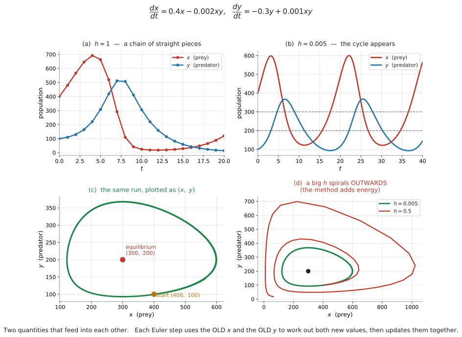
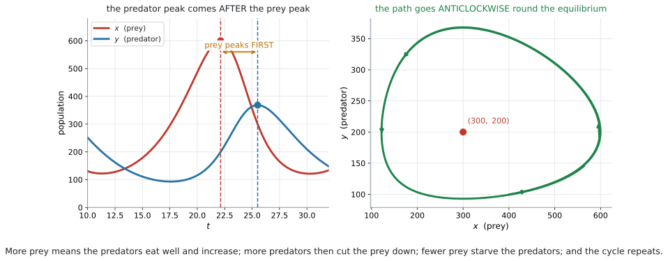

# AHL 5.16b — Euler's method for coupled systems（連立系のオイラー法） {#sec-ahl-5-16b}

::: {.callout-note}
## What you should be able to do
- **coupled system**（連立系）が何を表しているか説明できる。
- 公式集の $3$ 本の式を使って、$1$ 歩ずつ表を作れる。
- **新しい値を計算するときは、古い $x$ と古い $y$ の両方を使う**ことが分かる。
- **predator–prey model**（捕食者・被食者モデル）の結果を読み取れる。
- **equilibrium point**（平衡点）を求められる。
- $(x,\ y)$ 平面の **trajectory**（軌道）が何を表すか分かる。
:::

::: {.callout-note}
## [AHL 5.16a](ahl-5-16a.qmd) の続きです
シラバスの AHL 5.16 は、**$2$ つの部分**からできています。

| 部分 | 中身 | ページ |
|---|---|---|
| 前半 | $1$ つの微分方程式 $\dfrac{dy}{dx} = f(x,\ y)$ | [AHL 5.16a](ahl-5-16a.qmd) |
| 後半 | **連立系** $\dfrac{dx}{dt} = f_1$、$\dfrac{dy}{dt} = f_2$ | このページ |

: AHL 5.16 の $2$ つの部分 {#tbl-ahl516b-two}

シラバスは、後半にこう書いています。

> **Content:** Numerical solution of the coupled system $\dfrac{dx}{dt} = f_1(x,\ y,\ t)$ and $\dfrac{dy}{dt} = f_2(x,\ y,\ t)$.
>
> **Guidance:** Contexts could include predator-prey models.

**やり方は [AHL 5.16a](ahl-5-16a.qmd) とまったく同じ**です。歩き方が $1$ 本から $2$ 本に増えるだけです。

先に [AHL 5.16a](ahl-5-16a.qmd) を読んでください。
:::

::: {.callout-important}
## 公式集に載っています（5.16 の欄、$2$ つ目）
$$
\begin{aligned}
x_{n+1} &= x_n + h \times f_1(x_n,\ y_n,\ t_n) \\
y_{n+1} &= y_n + h \times f_2(x_n,\ y_n,\ t_n) \\
t_{n+1} &= t_n + h
\end{aligned}
$$ {#eq-ahl516b-euler}

> where $h$ is a constant (step length)

**覚える必要はありません。** 試験で配られます。

**覚えておくのは、右辺にはどこも「$n$」しか出てこない**ということです。ここがこの項目でいちばん間違えるところです（[第3節](#old)）。
:::

## The idea

### 1. $2$ つの量が、互いに影響しあいます {#idea}

[AHL 5.16a](ahl-5-16a.qmd) では、変わる量が $y$ の $1$ つだけでした。

**現実には、$2$ つの量が絡み合っている場面がよくあります。**

- ウサギの数とキツネの数
- $2$ つのタンクの水量
- 感染している人の数と、回復した人の数

ウサギが増えればキツネの餌が増え、キツネが増えればウサギが減ります。**片方だけを見ていても、話が進みません。**

そこで、式を $2$ 本立てます。

$$
\frac{dx}{dt} = f_1(x,\ y,\ t), \qquad \frac{dy}{dt} = f_2(x,\ y,\ t)
$$

**どちらの右辺にも、$x$ と $y$ の両方が出てきます。** これが「連立」の意味です。

::: {.callout-tip}
## 独立変数が $t$ に変わります
[AHL 5.16a](ahl-5-16a.qmd) では $\dfrac{dy}{dx}$ で、$x$ が独立変数でした。

連立系では、**$x$ も $y$ も変わる量**です。ですから、時間 $t$ を独立変数にします。

$$
x = x(t), \qquad y = y(t)
$$

**$t$ が $h$ ずつ進み、そのたびに $x$ と $y$ の両方が動きます。**
:::

::: {.callout-warning}
## 右辺に $t$ が入っていないことも多いです
公式は $f_1(x,\ y,\ t)$ と書いてありますが、**実際の問題では $t$ が右辺に出てこない**ことがほとんどです。

$$
\frac{dx}{dt} = 0.4x - 0.002xy
$$

$t$ が無くても、**式の形は変わりません。** $t$ の列は「今、何時か」を数えるためだけに使います。
:::

### 2. 公式の読み方 {#formula}

$$
\begin{aligned}
x_{n+1} &= x_n + h \times f_1(x_n,\ y_n,\ t_n) \\
y_{n+1} &= y_n + h \times f_2(x_n,\ y_n,\ t_n) \\
t_{n+1} &= t_n + h
\end{aligned}
$$

**$1$ 本目だけ見れば、[AHL 5.16a](ahl-5-16a.qmd#formula) と同じ形**です。

$$
(\text{次の } x) = (\text{今の } x) + (\text{時間の幅}) \times (\text{今の } x \text{ の変化率})
$$

$2$ 本目も同じです。$3$ 本目は、時計を進めるだけです。

| 記号 | 意味 |
|---|---|
| $n$ | 何歩目か |
| $x_n,\ y_n,\ t_n$ | $n$ 歩目の $x$、$y$、時刻 |
| $f_1(x_n,\ y_n,\ t_n)$ | その時点での $\dfrac{dx}{dt}$ |
| $f_2(x_n,\ y_n,\ t_n)$ | その時点での $\dfrac{dy}{dt}$ |

: 連立系の公式の記号 {#tbl-ahl516b-symbols}

### 3. 古い値で両方を計算してから、まとめて更新します {#old}

**この項目で、いちばん点を落とすところです。**

公式の右辺を、もう一度よく見てください。

$$
y_{n+1} = y_n + h \times f_2(\underbrace{x_n}_{\text{古い } x},\ y_n,\ t_n)
$$

**$x_{n+1}$ ではなく $x_n$ です。** つまり、

::: {.callout-important}
## 手順は必ずこの順です
1. **古い** $x_n$ と $y_n$ を使って、$f_1$ と $f_2$ を**両方**計算する
2. そのあとで、$x$ と $y$ を**同時に**新しい値に置きかえる

**$x$ を先に更新して、その新しい $x$ で $y$ を計算してはいけません。**
:::

例で見ます。$\dfrac{dx}{dt} = x + 2y$、$\dfrac{dy}{dt} = 3x - y$、$(x,\ y) = (1,\ 2)$、$h = 0.1$ とします。

**正しいやり方**

$$
f_1 = 1 + 2(2) = 5, \qquad f_2 = 3(1) - 2 = 1
$$

$$
x_1 = 1 + 0.1(5) = 1.5, \qquad y_1 = 2 + 0.1(1) = 2.1
$$

**よくある間違い**（新しい $x = 1.5$ を使ってしまう）

$$
f_2 = 3(1.5) - 2 = 2.5 \ \Longrightarrow \ y_1 = 2 + 0.1(2.5) = 2.25 \quad \text{✗}
$$

**$2.1$ と $2.25$ で、答えが違います。**

::: {.callout-tip}
## 表を作れば、自然に正しくなります
$f_1$ と $f_2$ の列を、**同じ行に**書いてください。

| $n$ | $t_n$ | $x_n$ | $y_n$ | $f_1$ | $f_2$ |
|---|---|---|---|---|---|
| $0$ | $0$ | $1$ | $2$ | $5$ | $1$ |
| $1$ | $0.1$ | $1.5$ | $2.1$ | $5.7$ | $2.4$ |
| $2$ | $0.2$ | $2.07$ | $2.34$ | | |

: 連立系の表 {#tbl-ahl516b-table}

**$1$ つの行の中は、すべて同じ時刻の値です。** 行を作り終えてから、次の行に移ります。

**行をまたいで値を持ってこない**——これだけ守れば間違えません。
:::

### 4. predator–prey model {#predator}

シラバスが名指ししている場面です。

> Contexts could include predator-prey models.

$x$ を **prey**（被食者、餌になる動物）、$y$ を **predator**（捕食者）とします。

$$
\frac{dx}{dt} = 0.4x - 0.002xy, \qquad \frac{dy}{dt} = -0.3y + 0.001xy
$$

**それぞれの項に意味があります。**

| 項 | 意味 |
|---|---|
| $+0.4x$ | 捕食者がいなければ、prey は増える |
| $-0.002xy$ | **出会うと食べられる**（$x$ と $y$ の**積**） |
| $-0.3y$ | 餌がなければ、predator は減る |
| $+0.001xy$ | **食べたぶん、predator が増える** |

: 各項の意味 {#tbl-ahl516b-terms}

::: {.callout-important}
## $xy$ の項が「出会い」を表しています
なぜ $x + y$ ではなく $xy$ なのでしょうか。

**出会う回数は、両方の数に比例する**からです。ウサギが $2$ 倍いれば出会いは $2$ 倍、キツネも $2$ 倍なら $4$ 倍です。

$$
(\text{出会う回数}) \propto x \times y
$$

**片方が $0$ なら、出会いは $0$ です。** $x + y$ ではそうなりません。
:::

::: {.callout-warning}
## 符号が $2$ 本の式で逆になります
$-0.002xy$ と $+0.001xy$ です。**捕食者にとっては得、被食者にとっては損**だからです。

**係数も同じとはかぎりません。** ウサギ $1$ 匹でキツネが $1$ 匹増えるわけではないので、$0.002$ と $0.001$ のように違う数になります。
:::

### 5. 結果の読み方 {#interpret}

{#fig-ahl516b-system width=100%}

@fig-ahl516b-system の (a) は $h = 1$、(b) は $h = 0.005$ です。**$h$ を小さくすると、なめらかな周期的な動きが見えてきます。**

{#fig-ahl516b-cycle width=100%}

@fig-ahl516b-cycle が、この動きの中身です。

::: {.callout-note appearance="simple"}
**$4$ つの段階がくり返されます。**

1. prey が増える（捕食者がまだ少ない）
2. 餌が多いので、**predator が増える**
3. 捕食者が多いので、**prey が減る**
4. 餌が減って、**predator も減る** → 1 へ戻る
:::

::: {.callout-important}
## prey のピークが先、predator のピークが後です
@fig-ahl516b-cycle の左を見てください。**$x$ の山が先、$y$ の山が後**です。

理由は $1$ つです。**捕食者が増えるには、まず餌が増えている必要がある**からです。

*Describe the relationship between the two populations* と問われたら、こう書きます。

::: {.model-answer}
**試験ではこう書く**

*Both populations rise and fall in a repeating cycle of the same period. The prey population reaches its maximum first, and the predator population reaches its maximum a short time later, because the predators can only increase once there is plenty of prey to eat.*
:::

（どちらの個体数も同じ周期でくり返し増減する。被食者の個体数が先に最大となり、捕食者の個体数はその少しあとに最大となる。捕食者は、食べる被食者が十分にいてはじめて増えられるからである、という意味です。）
:::

### 6. 平衡点 {#equilibrium}

**両方の変化率が同時に $0$ になる点**を、**equilibrium point**（平衡点）といいます。

::: {.callout-note appearance="simple"}
`equilibrium point` という語そのものは、シラバスでは **AHL 5.17**（phase portrait）に出てきます。

ただし、**Euler の表が正しいかを判断するのにとても役に立つ**ので、ここで先に扱います。
:::

$$
\frac{dx}{dt} = 0 \quad \text{かつ} \quad \frac{dy}{dt} = 0
$$

上のモデルなら

$$
0.4x - 0.002xy = 0 \ \Longrightarrow \ x(0.4 - 0.002y) = 0 \ \Longrightarrow \ y = 200
$$

$$
-0.3y + 0.001xy = 0 \ \Longrightarrow \ y(-0.3 + 0.001x) = 0 \ \Longrightarrow \ x = 300
$$

**平衡点は $(300,\ 200)$ です。**

::: {.callout-tip}
## 両方から $x$ と $y$ をくくり出してください
$0.4x - 0.002xy = 0$ の両辺を $x$ で割りたくなりますが、**$x = 0$ の場合を落とします。**

$$
x(0.4 - 0.002y) = 0 \ \Longrightarrow \ x = 0 \ \text{または} \ y = 200
$$

**$(0,\ 0)$ も平衡点です。** どちらもいなければ、何も起こりません。

問題が聞いているのはふつう**もう $1$ つのほう**ですが、$x = 0$ を書き落とさないでください。
:::

::: {.callout-warning}
## 平衡点は「$x$ の値」ではなく「点」です
答えは $(300,\ 200)$ という**点**です。$x = 300$ だけでは半分です。

そして、**この predator–prey の形では**、$x$ の式から出るのが $y$ の値、$y$ の式から出るのが $x$ の値になります。**入れ替わります。** $xy$ の項があるからです。@fig-ahl516b-system の (c) で、位置を確かめてください。

**ほかの形の連立系では、そうなるとはかぎりません。** 演習8 では $\dfrac{da}{dt} = 0$ から $b = 2a$ という**関係**しか出ません。
:::

### 7. $(x,\ y)$ 平面に描く {#phase}

@fig-ahl516b-system の (c) は、**時間を消して** $x$ と $y$ だけを描いたものです。この曲線を **trajectory**（軌道）といいます。

**閉じた輪になっています。** 同じところをぐるぐる回る——それが「周期的」ということです。

@fig-ahl516b-cycle の右に矢印を入れてあります。**反時計回り**です。

::: {.callout-tip}
## 回る向きは、右端の点を見れば分かります
$x$ がいちばん大きい点（右端）では、prey が最大です。そこでは **predator がまだ増えている最中**なので、$y$ が上がります。

$$
\text{右端で上向き} \ \Longrightarrow \ \text{反時計回り}
$$

**$1$ 点だけ調べれば、向きが決まります。**
:::

::: {.callout-note appearance="simple"}
この $(x,\ y)$ 平面の図を、シラバスの **AHL 5.17** では **phase portrait**（相図）と呼んで、くわしく扱います。

**AHL 5.16 では、Euler で出した点を並べて描くところまで**です。
:::

### 8. スプレッドシートで {#tech}

歩数が増えるので、**手で解くのは $2$〜$3$ 歩まで**です。

列は $3$ つ（$t$、$x$、$y$）で足ります。$f_1$ と $f_2$ は式の中に入れてしまうので、列にしなくても構いません。やり方は [GDC 第1節](#gdc-sheet)です。

## Why it works

::: {.callout-tip collapse="true"}
## クリックすると開きます

### $1$ 本のときと、まったく同じ理屈です {#why}

[AHL 5.16a](ahl-5-16a.qmd#why) で見たとおり、$h$ が小さいとき

$$
x(t+h) \approx x(t) + h \times \frac{dx}{dt}
$$

が成り立ちます。**この式は $x$ についてのものです。** $y$ についても、同じことが別に成り立ちます。

$$
y(t+h) \approx y(t) + h \times \frac{dy}{dt}
$$

**$2$ 本を並べて、同じ $h$ で同時に進めるだけ**です。新しい考え方は要りません。

### なぜ「古い値」で計算するのか {#why-old}

上の $2$ 本の式で、右辺の $\dfrac{dx}{dt}$ と $\dfrac{dy}{dt}$ は、**どちらも時刻 $t$ での値**です。

時刻 $t$ での $\dfrac{dy}{dt}$ を出すには、**時刻 $t$ での $x$** が要ります。$t + h$ での $x$ ではありません。

**新しい $x$ を使ってしまうと、$2$ 本の式が「同じ瞬間」の話でなくなります。** それが [第3節](#old) の間違いです。

### $h$ が大きいと、輪が閉じません {#why-spiral}

@fig-ahl516b-system の (d) を見てください。$h = 0.5$ の軌道は、**外へ外へと広がっています。**

本当の解は閉じた輪なのに、Euler の折れ線は毎回**輪の外側へ**はみ出します。接線が輪の外を通るからです。

**そのずれが $1$ 周ごとにたまって、渦巻きになります。**

::: {.callout-note appearance="simple"}
このふるまいは **AI HL では問われません。** ただし、*Comment on the reliability of your answer* と聞かれたときに、「$h$ が大きいと長い時間では信用できない」と書ける材料になります。

シラバスは Enrichment として **Runge–Kutta methods** を挙げています。これは、この弱点を減らす、もっと精度の高い方法です。**試験には出ません。**
:::
:::

## Worked examples

::: {.callout-note appearance="simple"}
問題文は英語です。意味が理解できなかったら、問題文の下の「**日本語訳**」を開いてください。解説は日本語です。
:::

::: {#exm-ahl516b-basic}
[Consider the coupled system]{.q-en}

$$
\frac{dx}{dt} = x + 2y, \qquad \frac{dy}{dt} = 3x - y
$$

[with $x = 1$ and $y = 2$ when $t = 0$.]{.q-en}

[Use Euler's method with $h = 0.1$ to find approximations for $x$ and $y$ when $t = 0.2$.]{.q-en}

<details class="jp-trans">
<summary>日本語訳</summary>

上の連立系を考えます。$t = 0$ のとき $x = 1$、$y = 2$ です。

`coupled system` は「連立系」という意味です。

$h = 0.1$ の Euler 法を使って、$t = 0.2$ のときの $x$ と $y$ の近似値を求めなさい。

</details>

---

**$2$ 歩です。**

**$n = 0$：** $t_0 = 0$、$x_0 = 1$、$y_0 = 2$

$$
f_1 = 1 + 2(2) = 5, \qquad f_2 = 3(1) - 2 = 1
$$

**$2$ つとも、古い $x = 1$ と古い $y = 2$ で計算しました**（[第3節](#old)）。

$$
x_1 = 1 + 0.1(5) = 1.5, \qquad y_1 = 2 + 0.1(1) = 2.1, \qquad t_1 = 0.1
$$

**$n = 1$：**

$$
f_1 = 1.5 + 2(2.1) = 5.7, \qquad f_2 = 3(1.5) - 2.1 = 2.4
$$

$$
x_2 = 1.5 + 0.1(5.7) = 2.07, \qquad y_2 = 2.1 + 0.1(2.4) = 2.34, \qquad t_2 = 0.2
$$

$$
x \approx 2.07, \qquad y \approx 2.34
$$

**検算。** $f_1$ も $f_2$ も正なので、$x$ と $y$ の**どちらも増える**はずです。$1 \to 1.5 \to 2.07$、$2 \to 2.1 \to 2.34$ ✓

::: {.callout-warning}
## $f_2$ に $1.5$ を使わないでください
$2$ 歩目の $f_2$ は $3(1.5) - 2.1$ です。ここでの $1.5$ は、**$1$ 歩目で確定した $x_1$** なので正しい値です。

間違えるのは **$1$ 歩目**のほうです。$f_2 = 3(1) - 2$ であって、$3(1.5) - 2$ ではありません（[第3節](#old)）。
:::

::: {.callout-note}
## 解答例（答案用紙にはこう書く）

| $n$ | $t_n$ | $x_n$ | $y_n$ | $f_1 = x_n + 2y_n$ | $f_2 = 3x_n - y_n$ |
|---|---|---|---|---|---|
| $0$ | $0$ | $1$ | $2$ | $5$ | $1$ |
| $1$ | $0.1$ | $1.5$ | $2.1$ | $5.7$ | $2.4$ |
| $2$ | $0.2$ | $2.07$ | $2.34$ | | |

: {#tbl-ahl516b-ans1}

$$
x \approx 2.07, \qquad y \approx 2.34
$$
:::
:::

::: {#exm-ahl516b-error}
[A student solves the system of @exm-ahl516b-basic and writes:]{.q-en}

> $f_1 = 1 + 2(2) = 5$, so $x_1 = 1.5$.
>
> Then $f_2 = 3(1.5) - 2 = 2.5$, so $y_1 = 2 + 0.1(2.5) = 2.25$.

**(a)** [Identify the error in the student's method.]{.q-en}

**(b)** [Explain why this method gives the wrong value.]{.q-en}

<details class="jp-trans">
<summary>日本語訳</summary>

ある生徒が @exm-ahl516b-basic の系を解いて、上のように書きました。

**(a)** 生徒の方法の誤りを指摘しなさい。

**(b)** この方法が誤った値を与える理由を説明しなさい。

</details>

---

**(a)**

::: {.model-answer}
**試験ではこう書く**

*The student has used the new value $x_1 = 1.5$ when calculating $f_2$. The formula requires $f_2(x_n,\ y_n,\ t_n)$, that is the OLD value $x_0 = 1$. The correct calculation is $f_2 = 3(1) - 2 = 1$, giving $y_1 = 2.1$.*
:::

（生徒は $f_2$ を計算するときに新しい値 $x_1 = 1.5$ を使ってしまっている。公式が要求しているのは $f_2(x_n,\ y_n,\ t_n)$、つまり古い値 $x_0 = 1$ である。正しい計算は $f_2 = 3(1) - 2 = 1$ で、$y_1 = 2.1$ となる、という意味です。）

**(b)**

::: {.model-answer}
**試験ではこう書く**

*Both derivatives describe the rates of change at the same instant $t = 0$. The value $x_1 = 1.5$ belongs to the later time $t = 0.1$, so mixing it into $f_2$ combines two different moments and the step no longer follows the system.*
:::

（どちらの導関数も、同じ瞬間 $t = 0$ における変化率を表している。$x_1 = 1.5$ は後の時刻 $t = 0.1$ の値なので、それを $f_2$ に混ぜると $2$ つの異なる瞬間を組み合わせることになり、その $1$ 歩はもう系に従っていない、という意味です。）

**検算。** 正しい $y_1$ は $2.1$、生徒の $y_1$ は $2.25$ です。差は $0.15$ で、**$1$ 歩目からすでにずれています** ✓ このずれは、あとの歩にそのまま持ち越されます。

::: {.callout-tip}
## この間違いは、電卓でも起こります
スプレッドシートで `y` の列の式に、**同じ行の新しい `x` を参照**してしまうと、まったく同じことが起こります。

**参照するのは、いつも $1$ つ上の行です**（[GDC 第1節](#gdc-sheet)）。
:::

::: {.callout-note}
## 解答例（答案用紙にはこう書く）
**(a)**

::: {.model-answer}
*The student used the new value $x_1 = 1.5$ in $f_2$. The formula uses $f_2(x_n,\ y_n,\ t_n)$, so the old value $x_0 = 1$ is required: $f_2 = 3(1) - 2 = 1$ and $y_1 = 2.1$.*
:::

**(b)**

::: {.model-answer}
*Both rates of change are evaluated at the same instant $t = 0$. Using $x_1$, which belongs to $t = 0.1$, mixes two different times.*
:::
:::
:::

::: {#exm-ahl516b-predator}
[In a nature reserve, $x$ is the number of rabbits and $y$ is the number of foxes, both after $t$ years. They are modelled by]{.q-en}

$$
\frac{dx}{dt} = 0.4x - 0.002xy, \qquad \frac{dy}{dt} = -0.3y + 0.001xy.
$$

[Initially there are $400$ rabbits and $100$ foxes.]{.q-en}

**(a)** [Use Euler's method with $h = 1$ to estimate the two populations after $2$ years.]{.q-en}

**(b)** [Find the equilibrium point of the system, other than $(0,\ 0)$.]{.q-en}

**(c)** [Interpret the term $-0.002xy$ in the first equation.]{.q-en}

<details class="jp-trans">
<summary>日本語訳</summary>

自然保護区で、$t$ 年後のウサギの数を $x$、キツネの数を $y$ とします。上の式でモデル化されています。

`nature reserve` は「自然保護区」、`rabbits` は「ウサギ」、`foxes` は「キツネ」という意味です。

はじめ、ウサギが $400$ 匹、キツネが $100$ 匹います。

**(a)** $h = 1$ の Euler 法を使って、$2$ 年後の $2$ つの個体数を推定しなさい。

**(b)** $(0,\ 0)$ 以外の平衡点を求めなさい。

**(c)** $1$ 本目の式の $-0.002xy$ の項を解釈しなさい。

</details>

---

**(a) $n = 0$：** $t_0 = 0$、$x_0 = 400$、$y_0 = 100$

$$
f_1 = 0.4(400) - 0.002(400)(100) = 160 - 80 = 80
$$

$$
f_2 = -0.3(100) + 0.001(400)(100) = -30 + 40 = 10
$$

$$
x_1 = 400 + 1(80) = 480, \qquad y_1 = 100 + 1(10) = 110
$$

**$n = 1$：**

$$
f_1 = 0.4(480) - 0.002(480)(110) = 192 - 105.6 = 86.4
$$

$$
f_2 = -0.3(110) + 0.001(480)(110) = -33 + 52.8 = 19.8
$$

$$
x_2 = 480 + 86.4 = 566.4, \qquad y_2 = 110 + 19.8 = 129.8
$$

$2$ 年後、**ウサギがおよそ $566$ 匹、キツネがおよそ $130$ 匹**です。

**(b)** [第6節](#equilibrium)のとおりです。

$$
x(0.4 - 0.002y) = 0 \ \Longrightarrow \ y = 200 \quad (x \neq 0)
$$

$$
y(-0.3 + 0.001x) = 0 \ \Longrightarrow \ x = 300 \quad (y \neq 0)
$$

**平衡点は $(300,\ 200)$ です。**

**(c)**

::: {.model-answer}
**試験ではこう書く**

*The term $-0.002xy$ is the rate at which rabbits are lost to foxes. It is negative because rabbits are removed, and it depends on the product $xy$ because the number of encounters between rabbits and foxes depends on how many there are of each.*
:::

（$-0.002xy$ の項は、キツネによってウサギが失われる割合である。ウサギが減るので負であり、ウサギとキツネの出会いの回数は両方の数によって決まるので、積 $xy$ に依存する、という意味です。）

**検算。** はじめ $x = 400 > 300$、$y = 100 < 200$ です。平衡点より**ウサギが多く、キツネが少ない**状態なので、**両方増える**はずです ✓ $400 \to 480 \to 566$、$100 \to 110 \to 130$ で、向きが合っています。

::: {.callout-warning}
## $h = 1$ 年は、かなり大きい刻み幅です
@fig-ahl516b-system の (a) がその粗さです。**$2$ 歩ぶんなら大きくは外れませんが、$20$ 年ぶんを $h = 1$ で計算した値は信用できません。**

*Comment on the reliability* と問われたら、そこを書いてください（[Why it works](#why-spiral)）。
:::

::: {.callout-note}
## 解答例（答案用紙にはこう書く）
**(a)**

| $n$ | $t_n$ | $x_n$ | $y_n$ | $f_1$ | $f_2$ |
|---|---|---|---|---|---|
| $0$ | $0$ | $400$ | $100$ | $80$ | $10$ |
| $1$ | $1$ | $480$ | $110$ | $86.4$ | $19.8$ |
| $2$ | $2$ | $566.4$ | $129.8$ | | |

: {#tbl-ahl516b-ans3}

*About $566$ rabbits and $130$ foxes.*

**(b)**
$$
x(0.4 - 0.002y) = 0 \ \Rightarrow \ y = 200; \qquad y(-0.3 + 0.001x) = 0 \ \Rightarrow \ x = 300
$$
*The equilibrium point is* $(300,\ 200)$.

**(c)**

::: {.model-answer}
*It is the rate at which rabbits are eaten by foxes. It is negative because rabbits are lost, and it depends on $xy$ because the number of encounters depends on both populations.*
:::
:::
:::

::: {#exm-ahl516b-read}
[@fig-ahl516b-cycle shows the two populations of @exm-ahl516b-predator over a longer time, computed with a small step length.]{.q-en}

**(a)** [Describe the relationship between the two populations.]{.q-en}

**(b)** [The right-hand diagram shows the same information plotted as $(x,\ y)$. Explain what it means that this path is a closed loop.]{.q-en}

**(c)** [Suggest why the estimate in @exm-ahl516b-predator, which used $h = 1$, may not be reliable over $20$ years.]{.q-en}

<details class="jp-trans">
<summary>日本語訳</summary>

@fig-ahl516b-cycle は、@exm-ahl516b-predator の $2$ つの個体数を、小さい刻み幅で長い時間について計算したものです。

`a closed loop` は「閉じた輪」という意味です。

**(a)** $2$ つの個体数の関係を述べなさい。

**(b)** 右の図は同じ情報を $(x,\ y)$ として描いたものです。この経路が閉じた輪であることが何を意味するかを説明しなさい。

**(c)** @exm-ahl516b-predator の $h = 1$ を使った推定が、$20$ 年にわたっては信用できないかもしれない理由を述べなさい。

</details>

---

**(a)**

::: {.model-answer}
**試験ではこう書く**

*Both populations rise and fall in a repeating cycle with the same period. The rabbit population reaches its maximum first, and the fox population reaches its maximum a short time afterwards, because the foxes can only increase once there are plenty of rabbits.*
:::

（どちらの個体数も同じ周期でくり返し増減する。ウサギの個体数が先に最大となり、キツネの個体数はその少しあとに最大となる。キツネはウサギが十分にいてはじめて増えられるからである、という意味です。）

**(b)**

::: {.model-answer}
**試験ではこう書く**

*A closed loop means the pair $(x,\ y)$ returns to exactly the values it started from, so the whole cycle repeats. The two populations are periodic and neither dies out nor grows without limit.*
:::

（閉じた輪は、組 $(x,\ y)$ が出発したときの値にちょうど戻ることを意味し、したがって周期全体がくり返される。$2$ つの個体数は周期的で、絶滅もせず、限りなく増えもしない、という意味です。）

**(c)**

::: {.model-answer}
**試験ではこう書く**

*With $h = 1$ year, twenty steps would be needed and each one follows a straight line while the true solution curves. The errors build up, and over a full cycle the estimated path drifts away from the true closed loop, so the values after $20$ years could be well out.*
:::

（$h = 1$ 年では $20$ 歩が必要で、真の解が曲がるあいだ、それぞれの歩は直線をたどる。誤差が積み重なり、$1$ 周を通じて推定された経路は真の閉じた輪から離れていくので、$20$ 年後の値はかなりずれる可能性がある、という意味です。）

**検算。** @fig-ahl516b-system の (d) が、まさにその様子です ✓ $h = 0.5$ でも外へ広がっているので、$h = 1$ ならもっと大きくずれます。

::: {.callout-tip}
## 「周期」も読み取れます
**山から次の山までの間隔が周期です。**

@fig-ahl516b-system の (b) には山が $2$ つ見えています。$t = 3$ 前後と $t = 22$ 前後です。**周期はおよそ $19$ 年**です。

（@fig-ahl516b-cycle の左は $t = 10$ から $32$ までを拡大したもので、山が $1$ つしか入っていません。周期はこちらでは測れません。）

*Estimate the period* と問われたら、**山から山まで**を読んでください。
:::

::: {.callout-note}
## 解答例（答案用紙にはこう書く）
**(a)**

::: {.model-answer}
*Both populations cycle with the same period. The rabbits peak first and the foxes peak shortly afterwards, since the foxes can only increase when there are plenty of rabbits.*
:::

**(b)**

::: {.model-answer}
*The pair $(x,\ y)$ returns to its starting values, so the behaviour repeats. Both populations are periodic; neither dies out nor grows without limit.*
:::

**(c)**

::: {.model-answer}
*Twenty steps of straight-line approximation would be needed, and the errors accumulate, so the estimated path drifts away from the true cycle.*
:::
:::
:::

## Common errors

::: {.callout-warning}
## 新しい $x$ を使って $y$ を計算する
**この項目で最も多い間違いです**（[第3節](#old)、@exm-ahl516b-error）。$f_1$ と $f_2$ は、**同じ行の古い値**で計算します。
:::

::: {.callout-warning}
## $h$ を掛け忘れる
[AHL 5.16a](ahl-5-16a.qmd) と同じです。$x_{n+1} = x_n + h \times f_1$ です。
:::

::: {.callout-warning}
## $t$ の列を作らない
$3$ 本目の式 $t_{n+1} = t_n + h$ も公式のうちです。**「何年後か」を答えるのに要ります。**
:::

::: {.callout-warning}
## $xy$ の項を $x + y$ にする
出会いの回数は**積**に比例します（[第4節](#predator)）。
:::

::: {.callout-warning}
## $2$ 本の式で $xy$ の符号を同じにする
被食者側は $-$、捕食者側は $+$ です（[第4節](#predator)）。
:::

::: {.callout-warning}
## predator–prey で、平衡点の $x$ と $y$ を取り違える
$xy$ の項がある predator–prey の形では、$\dfrac{dx}{dt} = 0$ から出るのが **$y$ の値**、$\dfrac{dy}{dt} = 0$ から出るのが **$x$ の値**です（[第6節](#equilibrium)）。**ほかの形では、そうなるとはかぎりません。**
:::

::: {.callout-warning}
## 平衡点を $1$ つの数で答える
答えは $(300,\ 200)$ という**点**です（[第6節](#equilibrium)）。
:::

::: {.callout-warning}
## $(0,\ 0)$ を書き落とす
$x = 0$ かつ $y = 0$ も平衡点です（[第6節](#equilibrium)）。
:::

::: {.callout-warning}
## どちらが先にピークになるかを逆にする
**prey が先、predator が後**です（[第5節](#interpret)）。
:::

::: {.callout-warning}
## $h$ が大きいまま、長い時間の答えを信用する
連立系では、誤差が $1$ 周ごとにたまります（[Why it works](#why-spiral)）。
:::

## Using your GDC (TI-Nspire CX II)

::: {.callout-important}
## 試験モードでも使えます
Lists & Spreadsheet は Press-to-Test で止められていません（[AHL 5.16a](ahl-5-16a.qmd#gdc-sheet)）。**ここで説明する方法は、試験でもそのまま使えます。**
:::

### $5$ 列のスプレッドシートを作る {#gdc-sheet}

```
ctrl + doc → Add Lists & Spreadsheet
```

@exm-ahl516b-predator（$h = 1$）を例にします。

| セル | 入れるもの |
|---|---|
| `A1` | `0` |
| `B1` | `400` |
| `C1` | `100` |
| `A2` | `=a1+1` |
| `B2` | `=b1+1*(0.4*b1-0.002*b1*c1)` |
| `C2` | `=c1+1*(-0.3*c1+0.001*b1*c1)` |

: 連立系をスプレッドシートに入れる {#tbl-ahl516b-sheet}

`A2`、`B2`、`C2` を選んで、下へコピーします。

```
menu → Data → Fill
```

うまく選べないときは、**列ごとに $1$ つずつ** `Fill` してください。結果は同じです。

::: {.callout-important}
## `B2` も `C2` も、参照するのは $1$ 行上だけです
`C2` の式の中に `b2` を書いてはいけません。**`b1` です。**

これが [第3節](#old) の「古い値を使う」を、スプレッドシートで実現する形です。

`b2` と書くと、@exm-ahl516b-error の生徒とまったく同じ間違いになります。
:::

::: {.callout-warning}
## セル参照に角かっこは付けません
`a1`、`b1`、`c1` です。`a[]` は**列ぜんぶ**を指すので、ここでは使えません（[AHL 5.16a](ahl-5-16a.qmd#gdc-sheet)）。
:::

### $(x,\ y)$ の軌道を描く {#gdc-plot}

列 B と C ができたら、**散布図**にすれば @fig-ahl516b-system の (c) の形が出ます。

```
ctrl + doc → Add Data & Statistics
```

$x$ 軸に列 B、$y$ 軸に列 C を割りあてます。

::: {.callout-tip}
## 列に名前を付けておいてください
列のいちばん上のグレーの行に `t`、`x`、`y` と打っておくと、Data & Statistics で選びやすくなります（[SL 4.2](../../ai-sl/04-statistics-and-probability/sl-4-2.qmd)）。
:::

### 答えの確かめ方 {#gdc-check}

1. **符号**が場面に合っているか（増えるはずのものが増えているか）
2. **平衡点**を計算して、そこを中心に回っているか
3. **$h$ を半分**にして、答えが大きく変わらないか

::: {.callout-tip}
## 平衡点を先に求めておくと、表の値を判断できます
@exm-ahl516b-predator なら $(300,\ 200)$ です。

表の $x$ が $300$ より大きく、$y$ が $200$ より小さいうちは、**両方増える**はずです。表がそうなっていなければ、どこかで間違えています。
:::

## Exercises

::: {.callout-note appearance="simple"}
各問題に、折りたたみが3つ付いています。**日本語訳**、**解答例**（答案用紙に書くべきこと。英語です）、**解説**（なぜそうなるか。日本語です）。

まず自分で解いて、次に解答例と見くらべてください。**解説は、合わなかったときだけ開けば十分です。**
:::

::: {.exercise-block}

[1]{.ex-no} [Consider $\dfrac{dx}{dt} = 2x - y$ and $\dfrac{dy}{dt} = x + 3y$, with $x = 1$ and $y = 0$ when $t = 0$.]{.q-en}

[Use Euler's method with $h = 0.1$ to find $x$ and $y$ after one step.]{.q-en}

<details class="jp-trans">
<summary>日本語訳</summary>

$\dfrac{dx}{dt} = 2x - y$、$\dfrac{dy}{dt} = x + 3y$、$t = 0$ のとき $x = 1$、$y = 0$、を考えます。

$h = 0.1$ の Euler 法で、$1$ 歩後の $x$ と $y$ を求めなさい。

</details>

::: {.callout-note collapse="true"}
## 解答例（答案用紙に書くこと）
$$
f_1 = 2(1) - 0 = 2, \qquad f_2 = 1 + 3(0) = 1
$$
$$
x_1 = 1 + 0.1(2) = 1.2, \qquad y_1 = 0 + 0.1(1) = 0.1, \qquad t_1 = 0.1
$$
:::

::: {.callout-tip collapse="true"}
## 解説
公式に入れるだけです（[第2節](#formula)）。

**$f_2$ を計算するとき、$x$ は $1$ のままです。** $1.2$ ではありません（[第3節](#old)）。

**検算。** どちらの $f$ も正なので、$x$ も $y$ も増えます ✓ $y$ は $0$ から始まりますが、$f_2 = 1 > 0$ なので動き出します。
:::

::: {.ex-sep}
:::

[2]{.ex-no} [For the same system as question 1, find $x$ and $y$ when $t = 0.2$.]{.q-en}

<details class="jp-trans">
<summary>日本語訳</summary>

問題1と同じ系について、$t = 0.2$ のときの $x$ と $y$ を求めなさい。

</details>

::: {.callout-note collapse="true"}
## 解答例（答案用紙に書くこと）

| $n$ | $t_n$ | $x_n$ | $y_n$ | $f_1 = 2x_n - y_n$ | $f_2 = x_n + 3y_n$ |
|---|---|---|---|---|---|
| $0$ | $0$ | $1$ | $0$ | $2$ | $1$ |
| $1$ | $0.1$ | $1.2$ | $0.1$ | $2.3$ | $1.5$ |
| $2$ | $0.2$ | $1.43$ | $0.25$ | | |

: {#tbl-ahl516b-ex2}

$$
x \approx 1.43, \qquad y \approx 0.25
$$
:::

::: {.callout-tip collapse="true"}
## 解説
$2$ 歩目の $f$ は、$1$ 歩目で確定した $x_1 = 1.2$、$y_1 = 0.1$ で計算します。

$$
f_1 = 2(1.2) - 0.1 = 2.3, \qquad f_2 = 1.2 + 3(0.1) = 1.5
$$

$$
x_2 = 1.2 + 0.23 = 1.43, \qquad y_2 = 0.1 + 0.15 = 0.25
$$

**検算。** $y$ の増え方が速くなっています（$0.1 \to 0.15$）。$f_2 = x + 3y$ で、$x$ も $y$ も増えているので、向きが合っています ✓
:::

::: {.ex-sep}
:::

[3]{.ex-no} [A student solving question 1 writes:]{.q-en}

> $f_1 = 2 - 0 = 2$, so $x_1 = 1.2$. Then $f_2 = 1.2 + 3(0) = 1.2$, so $y_1 = 0.12$.

[Identify the error, and state the correct value of $y_1$.]{.q-en}

<details class="jp-trans">
<summary>日本語訳</summary>

問題1を解いているある生徒が、上のように書きました。

誤りを指摘し、$y_1$ の正しい値を述べなさい。

</details>

::: {.callout-note collapse="true"}
## 解答例（答案用紙に書くこと）
::: {.model-answer}
*The student used the new value $x_1 = 1.2$ when calculating $f_2$. Euler's method requires $f_2(x_n,\ y_n,\ t_n)$, that is the old value $x_0 = 1$.*
:::

$$
f_2 = 1 + 3(0) = 1, \qquad y_1 = 0 + 0.1(1) = 0.1
$$
:::

::: {.callout-tip collapse="true"}
## 解説
@exm-ahl516b-error と同じ間違いです（[第3節](#old)）。

**$f_1$ の計算は合っています。** 間違いは $f_2$ の $1$ か所だけです。

**検算。** 生徒の $0.12$ と正しい $0.1$ の差は $0.02$ です。**$1$ 歩でこれだけずれます** ✓ このあと歩くほど差は開きます。
:::

::: {.ex-sep}
:::

[4]{.ex-no} [In a lake, $x$ is the number of small fish and $y$ is the number of large fish, both after $t$ years. They are modelled by]{.q-en}

$$
\frac{dx}{dt} = 0.5x - 0.004xy, \qquad \frac{dy}{dt} = -0.2y + 0.002xy.
$$

[Initially $x = 200$ and $y = 50$.]{.q-en}

[Use Euler's method with $h = 1$ to estimate both populations after $2$ years.]{.q-en}

<details class="jp-trans">
<summary>日本語訳</summary>

湖で、$t$ 年後の小さい魚の数を $x$、大きい魚の数を $y$ とします。上の式でモデル化されています。

はじめ $x = 200$、$y = 50$ です。

$h = 1$ の Euler 法を使って、$2$ 年後の両方の個体数を推定しなさい。

</details>

::: {.callout-note collapse="true"}
## 解答例（答案用紙に書くこと）

| $n$ | $t_n$ | $x_n$ | $y_n$ | $f_1$ | $f_2$ |
|---|---|---|---|---|---|
| $0$ | $0$ | $200$ | $50$ | $60$ | $10$ |
| $1$ | $1$ | $260$ | $60$ | $67.6$ | $19.2$ |
| $2$ | $2$ | $327.6$ | $79.2$ | | |

: {#tbl-ahl516b-ex4}

*About $328$ small fish and $79$ large fish.*
:::

::: {.callout-tip collapse="true"}
## 解説
$$
f_1 = 0.5(200) - 0.004(200)(50) = 100 - 40 = 60
$$

$$
f_2 = -0.2(50) + 0.002(200)(50) = -10 + 20 = 10
$$

$$
x_1 = 260, \qquad y_1 = 60
$$

$$
f_1 = 0.5(260) - 0.004(260)(60) = 130 - 62.4 = 67.6
$$

$$
f_2 = -0.2(60) + 0.002(260)(60) = -12 + 31.2 = 19.2
$$

$$
x_2 = 327.6, \qquad y_2 = 79.2
$$

**魚は整数なので、答えは整数で書きます。**

**検算。** 平衡点は問題5で求めますが、$(100,\ 125)$ です。はじめ $x = 200 > 100$、$y = 50 < 125$ なので、**両方増える**はずです ✓
:::

::: {.ex-sep}
:::

[5]{.ex-no} [For the system in question 4, find the equilibrium point at which neither population is zero.]{.q-en}

<details class="jp-trans">
<summary>日本語訳</summary>

問題4の系について、どちらの個体数も $0$ でない平衡点を求めなさい。

</details>

::: {.callout-note collapse="true"}
## 解答例（答案用紙に書くこと）
$$
0.5x - 0.004xy = 0 \ \Longrightarrow \ x(0.5 - 0.004y) = 0 \ \Longrightarrow \ y = 125
$$
$$
-0.2y + 0.002xy = 0 \ \Longrightarrow \ y(-0.2 + 0.002x) = 0 \ \Longrightarrow \ x = 100
$$
*The equilibrium point is* $(100,\ 125)$.
:::

::: {.callout-tip collapse="true"}
## 解説
[第6節](#equilibrium)のとおりです。

**$1$ 本目から $y$、$2$ 本目から $x$ が出ます。入れ替わります。**

$$
y = \frac{0.5}{0.004} = 125, \qquad x = \frac{0.2}{0.002} = 100
$$

**検算。** $(100,\ 125)$ を両方の式に入れると

$$
0.5(100) - 0.004(100)(125) = 50 - 50 = 0 \ ✓
$$

$$
-0.2(125) + 0.002(100)(125) = -25 + 25 = 0 \ ✓
$$

**両方 $0$ になりました。** これが平衡点の定義です。
:::

::: {.ex-sep}
:::

[6]{.ex-no} [@fig-ahl516b-cycle shows a predator–prey model over time.]{.q-en}

**(a)** [State which population reaches its maximum first.]{.q-en}

**(b)** [Explain why this happens.]{.q-en}

<details class="jp-trans">
<summary>日本語訳</summary>

@fig-ahl516b-cycle は、ある predator–prey モデルの時間変化を示しています。

**(a)** どちらの個体数が先に最大になるかを述べなさい。

**(b)** それが起こる理由を説明しなさい。

</details>

::: {.callout-note collapse="true"}
## 解答例（答案用紙に書くこと）
**(a)** *The prey population $x$ reaches its maximum first.*

**(b)**

::: {.model-answer}
*The predators can only increase while there is plenty of prey to eat. So the predator numbers keep rising after the prey numbers have started to fall, and the predator maximum comes later. Once the prey has fallen far enough, the predators begin to decrease as well.*
:::
:::

::: {.callout-tip collapse="true"}
## 解説
[第5節](#interpret)のとおりです。

**「捕食者は、餌があってはじめて増える」**——この $1$ 文が理由です。

**検算。** 図の左で、赤（prey）の点線が青（predator）の点線より**左**にあります ✓ $x$ の山が $t \approx 22$、$y$ の山が $t \approx 25.5$ です。

::: {.callout-warning}
## 「同時に最大になる」ではありません
$2$ つのグラフは**ずれています。** そのずれこそが、このモデルの中身です。
:::
:::

::: {.ex-sep}
:::

[7]{.ex-no} [The trajectory of a predator–prey system in the $(x,\ y)$ plane is a closed loop around its equilibrium point.]{.q-en}

**(a)** [At the point where $x$ is largest, state whether $y$ is increasing or decreasing, giving a reason.]{.q-en}

**(b)** [Hence state the direction in which the trajectory is traced.]{.q-en}

<details class="jp-trans">
<summary>日本語訳</summary>

ある predator–prey 系の $(x,\ y)$ 平面における軌道は、平衡点のまわりの閉じた輪です。

`trajectory` は「軌道」、`traced` は「たどられる」という意味です。

**(a)** $x$ が最大になる点で、$y$ が増加しているか減少しているかを、理由を付けて述べなさい。

**(b)** したがって、軌道がたどられる向きを述べなさい。

</details>

::: {.callout-note collapse="true"}
## 解答例（答案用紙に書くこと）
**(a)**

::: {.model-answer}
*At that point the prey population is at its largest, so there is plenty of food and the predators are still increasing. Therefore $y$ is increasing.*
:::

**(b)** *The trajectory is traced anticlockwise.*
:::

::: {.callout-tip collapse="true"}
## 解説
[第7節](#phase)のとおりです。

$x$ が最大の点は、輪の**右端**です。そこで $y$ が増えるので、**上向き**に進みます。

$$
\text{右端で上向き} \ \Longrightarrow \ \text{反時計回り}
$$

**検算。** @fig-ahl516b-cycle の右の矢印を見てください ✓ 右端で上を向いています。

別の見方もできます。$x$ が最大ということは $\dfrac{dx}{dt} = 0$ なので、そこで $0.4x = 0.002xy$、つまり $y = 200$ です。**平衡点と同じ高さ**です。そこから上へ進むので、反時計回りになります。
:::

::: {.ex-sep}
:::

[8]{.ex-no} [Two tanks are connected. The volume of liquid in tank A is $a$ litres and in tank B is $b$ litres, after $t$ minutes. They satisfy]{.q-en}

$$
\frac{da}{dt} = -0.2a + 0.1b, \qquad \frac{db}{dt} = 0.2a - 0.3b.
$$

[Initially $a = 100$ and $b = 0$.]{.q-en}

**(a)** [Use Euler's method with $h = 1$ to estimate $a$ and $b$ after $2$ minutes.]{.q-en}

**(b)** [Explain what the term $0.2a$ represents in each equation.]{.q-en}

<details class="jp-trans">
<summary>日本語訳</summary>

$2$ つのタンクがつながっています。$t$ 分後のタンク A の液量を $a$ リットル、タンク B を $b$ リットルとします。上の式を満たします。

`connected` は「つながっている」、`tank` は「タンク」という意味です。

はじめ $a = 100$、$b = 0$ です。

**(a)** $h = 1$ の Euler 法で、$2$ 分後の $a$ と $b$ を推定しなさい。

**(b)** それぞれの式で $0.2a$ の項が何を表すかを説明しなさい。

</details>

::: {.callout-note collapse="true"}
## 解答例（答案用紙に書くこと）
**(a)**

| $n$ | $t_n$ | $a_n$ | $b_n$ | $f_1$ | $f_2$ |
|---|---|---|---|---|---|
| $0$ | $0$ | $100$ | $0$ | $-20$ | $20$ |
| $1$ | $1$ | $80$ | $20$ | $-14$ | $10$ |
| $2$ | $2$ | $66$ | $30$ | | |

: {#tbl-ahl516b-ex8}

$$
a \approx 66 \ \text{litres}, \qquad b \approx 30 \ \text{litres}
$$

**(b)**

::: {.model-answer}
*The term $0.2a$ is the rate at which liquid flows out of tank A and into tank B. It is negative in the first equation because that liquid leaves A, and positive in the second because the same liquid arrives in B.*
:::
:::

::: {.callout-tip collapse="true"}
## 解説
$$
f_1 = -0.2(100) + 0.1(0) = -20, \qquad f_2 = 0.2(100) - 0.3(0) = 20
$$

$$
a_1 = 80, \qquad b_1 = 20
$$

$$
f_1 = -0.2(80) + 0.1(20) = -16 + 2 = -14
$$

$$
f_2 = 0.2(80) - 0.3(20) = 16 - 6 = 10
$$

$$
a_2 = 66, \qquad b_2 = 30
$$

**(b)** **同じ項が、片方では $-$、もう片方では $+$** で出てきます。移動する液体だからです。

**検算。** はじめ合計は $100$ です。$1$ 分後は $80 + 20 = 100$ ✓ しかし $2$ 分後は $66 + 30 = 96$ で、**減っています。**

これは間違いではありません。$2$ 本の式を足すと

$$
\frac{d}{dt}(a + b) = (-0.2a + 0.1b) + (0.2a - 0.3b) = -0.2b
$$

となります。$B$ から出ていく $0.3b$ のうち、$0.1b$ は A に戻り、**残りの $0.2b$ が系の外へ出ていきます。**

$1$ 分後に $b = 20$ なので、次の $1$ 分で減るのは $0.2 \times 20 = 4$ です。$100 - 4 = 96$ ✓ 合っています。

::: {.callout-warning}
## 「合計が保存される」と決めてかからないでください
係数が対称でないときは、**中身が外へ出ていく**モデルです。式をよく見てください。
:::
:::

::: {.ex-sep}
:::

[9]{.ex-no} [For a predator–prey system, Euler's method with $h = 2$ produces a trajectory that spirals outwards, while $h = 0.1$ produces a closed loop.]{.q-en}

**(a)** [Explain why the two results differ.]{.q-en}

**(b)** [State which result is more likely to be correct, giving a reason.]{.q-en}

<details class="jp-trans">
<summary>日本語訳</summary>

ある predator–prey 系について、$h = 2$ の Euler 法では外へ渦を巻く軌道が出て、$h = 0.1$ では閉じた輪が出ました。

`spirals outwards` は「外へ渦を巻く」という意味です。

**(a)** $2$ つの結果が異なる理由を説明しなさい。

**(b)** どちらの結果がより正しそうかを、理由を付けて述べなさい。

</details>

::: {.callout-note collapse="true"}
## 解答例（答案用紙に書くこと）
**(a)**

::: {.model-answer}
*Euler's method follows a straight line for each step, while the true trajectory curves. With $h = 2$ each straight piece is long, so it leaves the true loop by a large amount, and these errors build up around the loop into a spiral. With $h = 0.1$ each piece is short and stays close to the true path.*
:::

**(b)**

::: {.model-answer}
*The result with $h = 0.1$ is more likely to be correct, because a smaller step length gives a smaller error at every step.*
:::
:::

::: {.callout-tip collapse="true"}
## 解説
[Why it works](#why-spiral) の内容です。

@fig-ahl516b-system の (d) が、まさにこの絵です。

**(b)** `giving a reason` なので、**「$h$ が小さいほうが誤差が小さい」**まで書きます。

**検算。** [AHL 5.16a](ahl-5-16a.qmd#h) で見たとおり、誤差は $h$ にほぼ比例します。$h = 2$ と $h = 0.1$ では $20$ 倍の違いです ✓
:::

::: {.ex-sep}
:::

[10]{.ex-no} [A disease spreads in a school. The number of infected students is $x$ and the number of recovered students is $y$, both after $t$ days. They are modelled by]{.q-en}

$$
\frac{dx}{dt} = 0.3x - 0.1x, \qquad \frac{dy}{dt} = 0.1x.
$$

**(a)** [Use Euler's method with $h = 1$ and $x = 20$, $y = 0$ at $t = 0$ to estimate $x$ and $y$ after $3$ days.]{.q-en}

**(b)** [Explain why the term $0.1x$ appears in both equations, with opposite signs in effect.]{.q-en}

**(c)** [Comment on whether this model is realistic for a school of $500$ students over a long period.]{.q-en}

<details class="jp-trans">
<summary>日本語訳</summary>

学校で病気が広がっています。$t$ 日後の感染している生徒の数を $x$、回復した生徒の数を $y$ とします。上の式でモデル化されています。

`disease` は「病気」、`infected` は「感染した」、`recovered` は「回復した」という意味です。

**(a)** $h = 1$、$t = 0$ のとき $x = 20$、$y = 0$ として、Euler 法で $3$ 日後の $x$ と $y$ を推定しなさい。

**(b)** $0.1x$ の項が両方の式に、実質的に逆の符号で現れる理由を説明しなさい。

**(c)** $500$ 人の学校について、長期間にわたってこのモデルが現実的かどうかコメントしなさい。

</details>

::: {.callout-note collapse="true"}
## 解答例（答案用紙に書くこと）
**(a)** *Here* $f_1 = 0.3x - 0.1x = 0.2x$ *and* $f_2 = 0.1x$.

| $n$ | $t_n$ | $x_n$ | $y_n$ | $f_1 = 0.2x_n$ | $f_2 = 0.1x_n$ |
|---|---|---|---|---|---|
| $0$ | $0$ | $20$ | $0$ | $4$ | $2$ |
| $1$ | $1$ | $24$ | $2$ | $4.8$ | $2.4$ |
| $2$ | $2$ | $28.8$ | $4.4$ | $5.76$ | $2.88$ |
| $3$ | $3$ | $34.56$ | $7.28$ | | |

: {#tbl-ahl516b-ex10}

*About $35$ infected and $7$ recovered.*

**(b)**

::: {.model-answer}
*The term $0.1x$ is the rate at which infected students recover. They leave the infected group, which is why it is subtracted in the first equation, and they join the recovered group, which is why it is added in the second.*
:::

**(c)**

::: {.model-answer}
*The model is not realistic over a long period. Since $\dfrac{dx}{dt} = 0.2x$, the number of infected students grows exponentially without limit, so it would eventually exceed $500$, which is impossible. A realistic model would slow the spread as the number of students still available to infect runs out.*
:::
:::

::: {.callout-tip collapse="true"}
## 解説
**(a)** **$f_1$ をまとめてから使ってください。** $0.3x - 0.1x = 0.2x$ です。

$$
x_1 = 20 + 1(4) = 24, \qquad y_1 = 0 + 1(2) = 2
$$

$$
x_2 = 24 + 4.8 = 28.8, \qquad y_2 = 2 + 2.4 = 4.4
$$

$$
x_3 = 28.8 + 5.76 = 34.56, \qquad y_3 = 4.4 + 2.88 = 7.28
$$

**人数なので、答えは整数にします。**

**(b)** **移る人は、消えるのではなく、移動します。** 問題8のタンクと同じ考え方です。

**(c)** `Comment on whether ... realistic` なので、**弱点を具体的に**書きます。

この式は $\dfrac{dx}{dt} = 0.2x$ なので、[AHL 5.14](ahl-5-14.qmd#interpret) の指数増加そのものです。**上限がありません。**

**検算。** $x$ が毎回 $1.2$ 倍になっています。$20 \to 24 \to 28.8 \to 34.56$ ✓ $20 \times 1.2^3 = 34.56$ で一致します。

この調子だと、**Euler の表の値**が $500$ を超えるのは $20 \times 1.2^n > 500$、つまり $n \geq 18$ のときです。**$18$ 日目に学校の全員を超えてしまいます。**

（式そのもの $x = 20e^{0.2t}$ で計算すると $t = 16.1$ 日です。**Euler の値のほうが小さめ**なので、こちらのほうが遅く見えています。）

::: {.callout-warning}
## この系は、実は「連立」になりきっていません
$1$ 本目の右辺に $y$ が入っていないので、**$x$ だけで完結**しています。$y$ は $x$ から決まるだけです。

@exm-ahl516b-predator のように**互いに影響しあう**のが、連立系の本来の姿です。**式をよく見て、どちらの型かを見分けてください。**
:::
:::

:::
