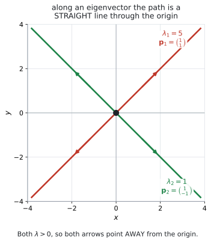
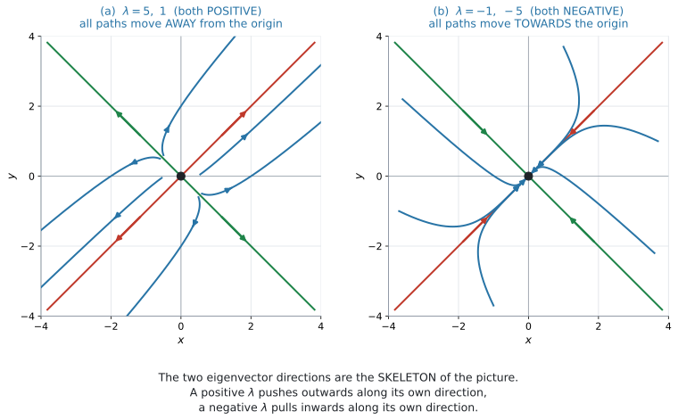
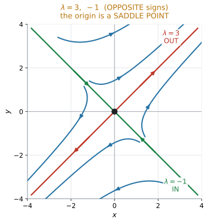
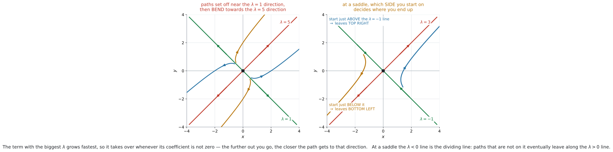

# AHL 5.17a — Phase portraits: real eigenvalues（異なる実固有値の相図） {#sec-ahl-5-17a}

::: {.callout-note}
## What you should be able to do
- 連立微分方程式を**行列の形** $\dfrac{d\mathbf{X}}{dt} = M\mathbf{X}$ に書ける。
- **eigenvalue**（固有値）と **eigenvector**（固有ベクトル）を求められる（[AHL 1.15](../01-number-and-algebra/ahl-1-15.qmd)）。
- 公式集の**厳密解**を書き、初期条件から $A$ と $B$ を決められる。
- $\lambda$ の**符号**から、原点から離れるか近づくかを言える。
- **node**（結節点）と **saddle point**（鞍点）を見分けられる。
- **phase portrait**（相図）に **trajectory**（軌道）をかき込める。
:::

::: {.callout-note}
## このページで扱う範囲
| 固有値 | 絵の形 | ページ |
|---|---|---|
| **異なる $2$ つの実数** | 直線・node・**saddle point** | このページ |
| **複素数・純虚数** | **spiral**・円・楕円 | [AHL 5.17b](ahl-5-17b.qmd) |

: AHL 5.17 の $2$ つの部分 {#tbl-ahl517a-two}

このページでは、シラバスで**式による解法が求められている、異なる $2$ つの実固有値**の場合を扱います。[AHL 5.17b](ahl-5-17b.qmd) では式を書かず、**絵の形だけ**を読みます。
:::

## The idea

このページでは、次の連立微分方程式を例に使います。

$$
\frac{dx}{dt} = 3x + 2y, \qquad \frac{dy}{dt} = 2x + 3y
$$

この $2$ 本の式は、**点 $(x,\ y)$ が、その場所から次にどちらへ動くか**を表しています。動いた跡が **trajectory**（軌道）、軌道を何本もかいた絵が **phase portrait**（相図）です。

相図は、次の順で作ります。

::: {.callout-note appearance="simple"}
1. $2$ 本の微分方程式を、**行列**でまとめる（[第1節](#idea)）
2. 解が**まっすぐ進む方向**があることを知る（[第2節](#straight)）
3. **固有値**と**固有ベクトル**を求めて、**一般解**を作る（[第3節](#general)）
4. **初期条件**から、定数 $A$ と $B$ を決める（[第4節](#initial)）
5. 固有値の**符号**で矢印の向きを決め、絵をかく（[第5節](#signs)〜[第8節](#sketch)）
:::

**固有ベクトルが相図の基本となる方向を示し、固有値がその方向で増えるか減るかを示します。** このページは、この $1$ 行を $8$ つの節に分けたものです。

### 1. 行列の形に書きます {#idea}

**この節ですること：$2$ 本の式を、$1$ 本の行列の式にまとめます。**

[AHL 5.16b](ahl-5-16b.qmd) では、連立系を Euler 法で**数値的に**追いました。このページで扱うのは、**右辺が $x$ と $y$ の一次式だけ**という特別な場合です。この形なら、**厳密な解の式**が書けます。

$$
\frac{dx}{dt} = ax + by, \qquad \frac{dy}{dt} = cx + dy
$$

**$xy$ の項がありません。** [AHL 5.16b](ahl-5-16b.qmd#predator) の predator–prey モデルには $xy$ があったので、この方法は使えません。**そちらは Euler 法で扱います。**

まず、$2$ つの成分を縦に並べたものに、名前を付けます。

$$
\mathbf{X}(t) = \begin{pmatrix} x(t) \\ y(t) \end{pmatrix}
$$

$\mathbf{X}(t)$ は、**時刻 $t$ に点がいる場所**です。これを微分するときは、**成分ごとに**微分します。

$$
\frac{d\mathbf{X}}{dt} = \begin{pmatrix} \dfrac{dx}{dt} \\[2mm] \dfrac{dy}{dt} \end{pmatrix}
$$

ここに、例の $2$ 本の式

$$
\frac{dx}{dt} = 3x + 2y, \qquad \frac{dy}{dt} = 2x + 3y
$$

を入れます。右辺は、行列とベクトルの積で書けます。

$$
\frac{d\mathbf{X}}{dt} = \begin{pmatrix} 3 & 2 \\ 2 & 3 \end{pmatrix} \mathbf{X}
$$

この行列に $M$ という名前を付ければ、

$$
M = \begin{pmatrix} 3 & 2 \\ 2 & 3 \end{pmatrix}
\qquad \Longrightarrow \qquad
\frac{d\mathbf{X}}{dt} = M\mathbf{X}
$$

です。**$2$ 本の式が、$1$ 本になりました。**

| 記号 | 意味 |
|---|---|
| $\mathbf{X}(t)$ | 時刻 $t$ における**点の位置** |
| $\dfrac{d\mathbf{X}}{dt}$ | その点の**速度**。つまり、次に進む向き |
| $M$ | 動き方を決める**係数行列** |
| $M\mathbf{X}$ | 位置 $\mathbf{X}$ にいるときの**速度ベクトル** |

: $\dfrac{d\mathbf{X}}{dt} = M\mathbf{X}$ の記号 {#tbl-ahl517a-symbols}

**大文字の $\mathbf{X}$ は点そのもの、小文字の $x$ はその横の成分**です。このページでは、ずっとこの書き分けを使います。

::: {.callout-tip}
## 係数を、そのまま並べるだけです
**$1$ 行目の式の係数が $M$ の $1$ 行目、$2$ 行目の式の係数が $M$ の $2$ 行目**です。

$$
\begin{aligned}
\frac{dx}{dt} &= 3x + 2y && \longrightarrow \quad M \text{ の } 1 \text{ 行目 } (\,3 \ \ 2\,) \\[2mm]
\frac{dy}{dt} &= 2x + 3y && \longrightarrow \quad M \text{ の } 2 \text{ 行目 } (\,2 \ \ 3\,)
\end{aligned}
$$

左の列が $x$ の係数、右の列が $y$ の係数です。

**$y$ の項が無いときは $0$ を書いてください。** $\dfrac{dx}{dt} = 4x$ なら $(\,4 \ \ 0\,)$ です。
:::

::: {.callout-warning}
## 定数項があると、この形になりません
$\dfrac{dx}{dt} = 3x + 2y + 5$ のように**定数が付いている**と、$M\mathbf{X}$ の形には書けません。$xy$ の項も同じです。

シラバスの形は $ax + by$ **だけ**です。
:::

### 2. eigenvector から、直線上を進む方向が分かります {#straight}

**この節ですること：なぜ相図に $2$ 本の直線が現れるのかを、見ておきます。**

$\dfrac{d\mathbf{X}}{dt} = M\mathbf{X}$ でしたから、**$M\mathbf{X}$ は、点 $\mathbf{X}$ にいるときの速度ベクトル**です。

ふつう、$\mathbf{X}$ と $M\mathbf{X}$ は**別の向き**を向いています。進むたびに向きが変わるので、軌道は**曲線**になります。

ところが、ある特別なベクトル $\mathbf{p}$ については、

$$
M\mathbf{p} = \lambda \mathbf{p}
$$

となることがあります。この $\mathbf{p}$ が **eigenvector**（固有ベクトル）、$\lambda$ が **eigenvalue**（固有値）です（[AHL 1.15](../01-number-and-algebra/ahl-1-15.qmd#idea)）。

右辺の $\lambda\mathbf{p}$ は、$\mathbf{p}$ の**定数倍**です。ですから $M\mathbf{p}$ は、$\mathbf{p}$ と**同じ直線の上**にあります。

点が固有ベクトルの直線の上にあれば、**速度もその直線に沿います。** 直線から横へ外れる速度が無いので、**軌道はその直線から出られません。**

::: {.callout-tip}
## 固有ベクトルは、位置ベクトルと速度ベクトルが平行になる特別な方向です
$$
\mathbf{X} \text{ の向き} \ = \ M\mathbf{X} \text{ の向き} \quad \Longrightarrow \quad \text{その直線の上を、まっすぐ進む}
$$

この $2$ 本の直線が、相図の**骨組み**になります。
:::

この例では、あとで計算するように、$2$ つの固有ベクトルの方向は $\begin{pmatrix} 1 \\ 1 \end{pmatrix}$ と $\begin{pmatrix} 1 \\ -1 \end{pmatrix}$ です。まずは、この $2$ 方向が相図の骨組みになることを見てみましょう。

{#fig-ahl517a-eigen width=58%}

@fig-ahl517a-eigen の**赤い直線**が $\mathbf{p}_1 = \begin{pmatrix} 1 \\ 1 \end{pmatrix}$（$\lambda_1 = 5$）、**緑の直線**が $\mathbf{p}_2 = \begin{pmatrix} 1 \\ -1 \end{pmatrix}$（$\lambda_2 = 1$）の向きです。

この $2$ 本の上では、軌道は曲がらずにまっすぐ進みます。**どちらの固有値も正**なので、矢印はどちらも原点から**離れる**向きです。

固有ベクトルの直線の上の解は、次の形になります。

$$
\mathbf{X}(t) = C e^{\lambda t}\mathbf{p}
$$

**なぜこの形になるのでしょうか。** 点がこの直線から出られないのなら、位置はいつも「$\mathbf{p}$ の何倍か」で書けます。その倍率を $c(t)$ とします。

$$
\mathbf{X}(t) = c(t)\,\mathbf{p}
$$

**左辺**を計算します。$\mathbf{p}$ は動かないベクトルなので、微分するのは $c(t)$ だけです。

$$
\frac{d\mathbf{X}}{dt} = c'(t)\,\mathbf{p}
$$

**右辺**も計算します。$c(t)$ はただの数なので、行列の外に出せます。そして $M\mathbf{p} = \lambda\mathbf{p}$ でした。

$$
M\mathbf{X} = M\bigl(c(t)\,\mathbf{p}\bigr) = c(t)\,M\mathbf{p} = c(t)\,\lambda\mathbf{p} = \lambda c(t)\,\mathbf{p}
$$

もとの微分方程式が $\dfrac{d\mathbf{X}}{dt} = M\mathbf{X}$ でしたから、この $2$ つは等しくなります。

$$
c'(t)\,\mathbf{p} = \lambda c(t)\,\mathbf{p}
$$

**どちらも「$\mathbf{p}$ の何倍か」という形**です。$\mathbf{p}$ は $\mathbf{0}$ ではないので、$2$ つが同じベクトルになるには**倍率どうしが等しい**しかありません。

$$
c'(t) = \lambda\, c(t)
$$

これは**倍率 $c(t)$ についての、見慣れた微分方程式**です（[AHL 5.14](ahl-5-14.qmd#exponential)）。答えは $c(t) = C e^{\lambda t}$ ですから、$\mathbf{X}(t) = C e^{\lambda t}\mathbf{p}$ になります。

- $\lambda > 0$ なら、$e^{\lambda t}$ は時間とともに**大きくなる**
- $\lambda < 0$ なら、$e^{\lambda t}$ は時間とともに **$0$ へ近づく**

ですから、**固有値の符号だけで、その直線の上の矢印の向きが決まります。**

| $\lambda$ | その直線の上での動き |
|---|---|
| $\lambda > 0$ | 原点から**離れる** |
| $\lambda < 0$ | 原点に**近づく** |

: eigenvector の直線の上での動き {#tbl-ahl517a-line}

::: {.callout-tip}
## $\dfrac{dx}{dt} = \lambda x$ と同じ形です
点が固有ベクトルの直線の上にあるとき、$M\mathbf{X} = \lambda\mathbf{X}$ なので

$$
\frac{d\mathbf{X}}{dt} = \lambda \mathbf{X}
$$

です。これは [AHL 5.14](ahl-5-14.qmd#exponential) の $\dfrac{dy}{dx} = ky$ とまったく同じ形で、答えも同じく **$e^{\lambda t}$ 倍**になります。

**@eq-ahl517a-exact の $e^{\lambda t}$ は、ここから来ています。**
:::

### 3. 一般解 {#general}

**この節ですること：$2$ 本の直線の動きを足して、解の式を作ります。**

[第2節](#straight)で見たように、固有ベクトル $\mathbf{p}$ の方向では

$$
\mathbf{X}(t) = C e^{\lambda t}\mathbf{p}
$$

が解になります。

固有値が $2$ つあれば、この特別な解も $2$ つできます。**その $2$ つを足したものも、また解です**（[Why it works](#why)）。これが **general solution**（一般解）です。

$$
\mathbf{X} = A\mathbf{p}_1 e^{\lambda_1 t} + B\mathbf{p}_2 e^{\lambda_2 t}
$$ {#eq-ahl517a-exact}

この式は**公式集に載っています（5.17 の欄）。覚える必要はありません。**

$\lambda_1,\ \lambda_2$ が eigenvalue、$\mathbf{p}_1,\ \mathbf{p}_2$ がそれぞれの eigenvector、$A$ と $B$ は初期条件から決まる定数です。**$2$ 本の直線の動きを、足し合わせただけ**です。

ただし、**$\det(M - \lambda I) = 0$ は公式集に載っていません**（[AHL 1.15](../01-number-and-algebra/ahl-1-15.qmd#char)）。そちらは覚えてください。

**この式に入れる $\lambda$ と $\mathbf{p}$ は、自分で求めます。** 手順は $3$ つです。

::: {.callout-note appearance="simple"}
**手順1.** $\det(M - \lambda I) = 0$ から $\lambda_1,\ \lambda_2$ を出す。

**手順2.** それぞれの $\lambda$ について eigenvector $\mathbf{p}$ を出す。

**手順3.** @eq-ahl517a-exact に入れる。
:::

**手順1と2は [AHL 1.15](../01-number-and-algebra/ahl-1-15.qmd) そのもの**です。新しいのは手順3だけです。

では、このページの例

$$
M = \begin{pmatrix} 3 & 2 \\ 2 & 3 \end{pmatrix}
$$

で、実際にやってみます。

#### 手順1：固有値を求める {#step1}

$$
\det(M - \lambda I) = \begin{vmatrix} 3 - \lambda & 2 \\ 2 & 3 - \lambda \end{vmatrix} = (3 - \lambda)^{2} - 4 = 0
$$

展開して整理します。

$$
\lambda^{2} - 6\lambda + 5 = 0 \ \Longrightarrow \ (\lambda - 5)(\lambda - 1) = 0
$$

$$
\lambda_1 = 5, \qquad \lambda_2 = 1
$$

**異なる $2$ つの実数**になりました。ですから、このページの方法が使えます。

::: {.callout-tip}
## characteristic equation は、行列から直接書けます
いま解いた $\lambda^{2} - 6\lambda + 5 = 0$ を **characteristic equation**（特性方程式）といいます。

対角に並ぶ $2$ つの数の和（**trace**）と $\det M$ を使えば、行列式を展開せずに書けます（[AHL 1.15](../01-number-and-algebra/ahl-1-15.qmd#expand)）。

$$
\lambda^{2} - (\text{trace})\lambda + \det M = 0
$$

この例なら trace $= 3 + 3 = 6$、$\det M = 9 - 4 = 5$ です。
:::

#### 手順2：固有ベクトルを求める {#step2}

$\lambda_1 = 5$ のほうからです。$\mathbf{p} = \begin{pmatrix} a \\ b \end{pmatrix}$ とおいて、$(M - 5I)\mathbf{p} = \mathbf{0}$ を解きます。

$$
\begin{pmatrix} -2 & 2 \\ 2 & -2 \end{pmatrix}\begin{pmatrix} a \\ b \end{pmatrix} = \begin{pmatrix} 0 \\ 0 \end{pmatrix}
\quad \Longrightarrow \quad -2a + 2b = 0 \quad \Longrightarrow \quad b = a
$$

$a = 1$ を選べば、$\mathbf{p}_1 = \begin{pmatrix} 1 \\ 1 \end{pmatrix}$ です。

$\lambda_2 = 1$ も同じようにします。

$$
\begin{pmatrix} 2 & 2 \\ 2 & 2 \end{pmatrix}\begin{pmatrix} a \\ b \end{pmatrix} = \begin{pmatrix} 0 \\ 0 \end{pmatrix}
\quad \Longrightarrow \quad 2a + 2b = 0 \quad \Longrightarrow \quad b = -a
$$

$a = 1$ を選べば、$\mathbf{p}_2 = \begin{pmatrix} 1 \\ -1 \end{pmatrix}$ です。

#### 手順3：一般解を書く {#step3}

@eq-ahl517a-exact に、出した $\lambda$ と $\mathbf{p}$ を入れるだけです。

$$
\mathbf{X} = A\begin{pmatrix} 1 \\ 1 \end{pmatrix}e^{5t} + B\begin{pmatrix} 1 \\ -1 \end{pmatrix}e^{t}
$$

成分で書けば、こうなります。

$$
x = Ae^{5t} + Be^{t}, \qquad y = Ae^{5t} - Be^{t}
$$

**$A$ と $B$ は、まだ決まりません。** 決めるには、出発点が $1$ つ要ります。それが次の節です。

### 4. 初期条件で $A$ と $B$ を決めます {#initial}

**この節ですること：与えられた出発点から、$A$ と $B$ を決めます。**

$t = 0$ を入れると $e^{0} = 1$ なので、

$$
\mathbf{X}(0) = A\mathbf{p}_1 + B\mathbf{p}_2
$$

**これは連立方程式です。** $A$ と $B$ について解きます。

続きをやってみます。[第3節](#step3)の一般解に、出発点 $\mathbf{X}(0) = \begin{pmatrix} 1 \\ 3 \end{pmatrix}$ を入れます。

$$
\begin{pmatrix} 1 \\ 3 \end{pmatrix} = A\begin{pmatrix} 1 \\ 1 \end{pmatrix} + B\begin{pmatrix} 1 \\ -1 \end{pmatrix}
$$

上の成分と下の成分で、$1$ 本ずつ式ができます。

$$
A + B = 1, \qquad A - B = 3
$$

足せば $2A = 4$ なので

$$
A = 2, \qquad B = -1
$$

です。これで、出発点 $(1,\ 3)$ から出る軌道の式が決まりました。

$$
\mathbf{X} = 2\begin{pmatrix} 1 \\ 1 \end{pmatrix}e^{5t} - \begin{pmatrix} 1 \\ -1 \end{pmatrix}e^{t}
$$

::: {.callout-warning}
## $\mathbf{p}$ を何倍かして使うと、$A$ と $B$ も変わります
eigenvector は[何倍しても正解](../01-number-and-algebra/ahl-1-15.qmd#notunique)ですが、**$\mathbf{p}$ を $2$ 倍にすれば、$A$ は半分**になります。

**最終的な $\mathbf{X}$ は同じ**です。ですから、$A$ と $B$ の値だけを見て「違う」と思わないでください。

答案では、**自分が使った $\mathbf{p}$ を必ず書いて**ください。
:::

### 5. $\lambda$ の符号で、絵が決まります {#signs}

**この節ですること：固有値の符号で、原点のまわりの絵を $3$ つに分けます。**

{#fig-ahl517a-nodes width=100%}

@fig-ahl517a-nodes の (a) と (b)、そして[第6節](#saddle)の @fig-ahl517a-saddle が、$3$ つの場合です。

| $\lambda_1,\ \lambda_2$ | 原点の呼び名 | 動き（答案の言い方） | 図 |
|---|---|---|---|
| **両方とも正** | **unstable node**（不安定な結節点） | 原点以外のすべての軌道が原点から**離れる**。`all solutions move away from the origin` | @fig-ahl517a-nodes (a) |
| **両方とも負** | **stable node**（安定な結節点） | 原点以外のすべての軌道が原点に**近づく**。`all solutions move towards the origin` | @fig-ahl517a-nodes (b) |
| **符号が違う** | **saddle point**（鞍点） | 固有ベクトルの向きによって、**近づく**ものと**離れる**ものがある。`the origin is a saddle point` | @fig-ahl517a-saddle（[第6節](#saddle)） |

: 異なる $2$ つの実固有値の $3$ つの場合 {#tbl-ahl517a-signs}

*Describe the long-term behaviour* と問われたら、**表の英語をそのまま使う**のがいちばん安全です。シラバスの言い方だからです。

::: {.callout-tip}
## 原点は、いつも平衡点です
$\mathbf{X} = \mathbf{0}$ を入れると $M\mathbf{0} = \mathbf{0}$ です。

つまり **$(0,\ 0)$ では、どちらの変化率も $0$** です（[AHL 5.16b](ahl-5-16b.qmd#equilibrium)）。

この形の系では、**平衡点は原点だけ**です（$\det M \neq 0$ のとき）。ですから「平衡点を求めよ」と聞かれることはあまりなく、**原点のまわりの様子**が問われます。
:::

### 6. saddle point {#saddle}

**この節ですること：符号が違うときの軌道を、くわしく見ます。**

{#fig-ahl517a-saddle width=58%}

@fig-ahl517a-saddle が saddle です。**$2$ 本の直線が、逆のことをしています。**

- $\lambda = 3$（正）の固有ベクトルの直線上 … 軌道は原点から**出ていく**
- $\lambda = -1$（負）の固有ベクトルの直線上 … 軌道は原点に**入ってくる**

**この $2$ 本の直線の上にない一般の軌道**は、最後には **$\lambda = 3$ の固有ベクトルの向きへ**離れていきます。出発点によっては、その前に**いったん原点に近づいてから向きを変えます。**

**「すべての軌道が、近づいてから離れる」わけではありません。**

- $\lambda = -1$ の固有ベクトルの直線上 … そのまま原点に近づき続けます（離れません）
- $\lambda = 3$ の固有ベクトルの直線上 … 最初から離れる一方です
- それ以外 … 最後は $\lambda = 3$ の向きへ離れます。近づく段階があるかどうかは、**出発点の位置しだい**です

::: {.callout-important}
## 「馬の鞍」の形です
前後は下がっていて、左右は上がっている——馬の鞍（saddle）の真ん中と同じです。

$$
\text{片方の向きには安定、もう片方には不安定}
$$

*State the nature of the equilibrium point* と問われたら、**`saddle point`** と書きます。
:::

::: {.callout-warning}
## $\lambda$ が $2$ つとも実数でも、符号が違えば node ではありません
「両方実数だから node」ではありません。**符号を見てください**（@tbl-ahl517a-signs）。

$\det M < 0$ なら、$\lambda$ の積が負、つまり**符号が違う**ので saddle です。**行列式だけで判定できます。**
:::

### 7. 長い目で見ると {#longrun}

**この節ですること：一般解の $2$ つの項をくらべて、最後にどちらの向きが勝つかを見ます。**

{#fig-ahl517a-longrun width=100%}

$$
\mathbf{X} = A\mathbf{p}_1 e^{5t} + B\mathbf{p}_2 e^{t}
$$

$t$ が大きくなると、**$e^{5t}$ のほうがずっと速く育ちます。** ですから、$A \neq 0$ であれば $2$ つ目の項は相対的に小さくなり、

$$
\mathbf{X} \approx A\mathbf{p}_1 e^{5t} \qquad (A \neq 0 \text{ で、} t \text{ が大きいとき})
$$

**軌道は $\mathbf{p}_1$ の向きに近づいていきます。** @fig-ahl517a-longrun の左が、その様子です。

::: {.callout-tip}
## 「大きいほうの $\lambda$ が勝つ」と覚えてください
$2$ つとも負でも同じです。$e^{-t}$ と $e^{-5t}$ なら、$e^{-5t}$ のほうが速く $0$ になるので、**残るのは $e^{-t}$ のほう**です。

$$
\text{係数が } 0 \text{ でなければ、大きいほうの } \lambda \text{ の項が支配的になる}
$$

「大きい」は**符号こみ**です。$-1$ と $-5$ なら、$-1$ のほうが大きい数です。

**ただし、その項の係数が $0$ の場合は例外です。** たとえば初期条件がもう一方の固有ベクトルの上にあると、大きい固有値に対応する項は**最初から現れません**（その係数が $0$ だからです）。そのときは、軌道はもう一方の固有ベクトルの直線の上を動き続けます。
:::

::: {.callout-warning}
## saddle では、出発点の側で行き先が変わります
@fig-ahl517a-longrun の右を見てください。

$\lambda < 0$ の直線が**分かれ目**です。その**上**から出発すれば右上へ、**下**から出発すれば左下へ出ていきます。

$$
A > 0 \ \Longrightarrow \ +\mathbf{p}_1 \text{ の向き}, \qquad A < 0 \ \Longrightarrow \ -\mathbf{p}_1 \text{ の向き}
$$

**$A$ の符号で決まります。** 初期条件を分解すれば、計算で確かめられます。
:::

### 8. 軌道のかき方 {#sketch}

**この節ですること：ここまでを使って、実際に相図をかきます。**

**手順は $4$ つです。**

::: {.callout-note appearance="simple"}
1. **$2$ 本の eigenvector の直線**を、原点を通るように引く
2. それぞれに、$\lambda$ の符号にしたがって**矢印**を付ける（正なら外向き、負なら内向き）
3. 与えられた**出発点に印**を付ける
4. $2$ 本の直線と矛盾しないように、**なめらかな曲線**をかく
:::

::: {.callout-important}
## 矢印を必ず付けてください
phase portrait では、**曲線だけでは足りません。** どちら向きに進むかが、この項目の中身だからです。

**矢印の無い図は、点になりません。**
:::

::: {.callout-warning}
## 軌道どうしは交わりません
[AHL 5.15](ahl-5-15.qmd#read) と同じ理由です。ここで扱う系では、**initial condition から解が $1$ つに定まる**からです。

**eigenvector の直線も、またげません。** 直線そのものが軌道だからです。
:::

## Why it works

::: {.callout-tip collapse="true"}
## クリックすると開きます

### なぜ足し合わせてよいのか {#why}

$\mathbf{X}_1 = \mathbf{p}_1 e^{\lambda_1 t}$ が解であることは、直接確かめられます。

$$
\frac{d\mathbf{X}_1}{dt} = \lambda_1 \mathbf{p}_1 e^{\lambda_1 t}, \qquad
M\mathbf{X}_1 = (M\mathbf{p}_1) e^{\lambda_1 t} = \lambda_1 \mathbf{p}_1 e^{\lambda_1 t}
$$

**両方とも同じです** ✓ 同じく $\mathbf{X}_2 = \mathbf{p}_2 e^{\lambda_2 t}$ も解です。

では $A\mathbf{X}_1 + B\mathbf{X}_2$ はどうでしょうか。

$$
\frac{d}{dt}(A\mathbf{X}_1 + B\mathbf{X}_2) = A\frac{d\mathbf{X}_1}{dt} + B\frac{d\mathbf{X}_2}{dt} = AM\mathbf{X}_1 + BM\mathbf{X}_2 = M(A\mathbf{X}_1 + B\mathbf{X}_2)
$$

**これも解です。** 微分も行列も、足し算と定数倍をそのまま通すからです。

### なぜ $2$ つで足りるのか {#why-two}

$\mathbf{p}_1$ と $\mathbf{p}_2$ が**平行でなければ**、平面上のどんなベクトルも $A\mathbf{p}_1 + B\mathbf{p}_2$ の形に書けます。

$\lambda_1 \neq \lambda_2$ なら、$\mathbf{p}_1$ と $\mathbf{p}_2$ は平行になりません。ですから、**どんな初期条件でも $A$ と $B$ が決まります。**

::: {.callout-note appearance="simple"}
シラバスが *"Systems will have **distinct, non-zero**, eigenvalues"* と限定しているのは、このためです。

$\lambda$ が重解のときは、この形では足りません。**AI HL では出ません。**
:::

### saddle の分かれ目 {#why-saddle}

$$
\mathbf{X} = A\mathbf{p}_1 e^{3t} + B\mathbf{p}_2 e^{-t}
$$

$t$ が大きいとき、$e^{-t} \to 0$ なので $2$ つ目は消えます。残るのは $A\mathbf{p}_1 e^{3t}$ です。

- $A > 0$ … $+\mathbf{p}_1$ の向きへ
- $A < 0$ … $-\mathbf{p}_1$ の向きへ
- $A = 0$ … **$\mathbf{p}_1$ の項が最初から無い** ので、$\mathbf{p}_2$ の直線に沿って原点へ

**$A = 0$ になるのが、ちょうど $\lambda < 0$ の直線の上**です。だから、そこが分かれ目になります。
:::

## Worked examples

::: {.callout-note appearance="simple"}
問題文は英語です。意味が理解できなかったら、問題文の下の「**日本語訳**」を開いてください。解説は日本語です。
:::

::: {#exm-ahl517a-node}
[Consider the system]{.q-en}

$$
\frac{dx}{dt} = 3x + 2y, \qquad \frac{dy}{dt} = 2x + 3y
$$

**(a)** [Find the eigenvalues and corresponding eigenvectors of the matrix of the system.]{.q-en}

**(b)** [Write down the general solution.]{.q-en}

**(c)** [Given that $x = 1$ and $y = 3$ when $t = 0$, find the particular solution.]{.q-en}

**(d)** [Describe the long-term behaviour of the solution.]{.q-en}

<details class="jp-trans">
<summary>日本語訳</summary>

上の連立系を考えます。

`corresponding` は「対応する」、`the general solution` は「一般解」、`the particular solution` は「特殊解」という意味です。

**(a)** この系の行列の固有値と、対応する固有ベクトルを求めなさい。

**(b)** 一般解を書きなさい。

**(c)** $t = 0$ のとき $x = 1$、$y = 3$ とします。特殊解を求めなさい。

**(d)** 解の長期的なふるまいを述べなさい。

</details>

---

**(a)** 行列は $M = \begin{pmatrix} 3 & 2 \\ 2 & 3 \end{pmatrix}$ です。

対角の和は $6$、$\det M = 9 - 4 = 5$ なので

$$
\lambda^{2} - 6\lambda + 5 = 0 \ \Longrightarrow \ (\lambda - 5)(\lambda - 1) = 0
$$

$$
\lambda_1 = 5, \qquad \lambda_2 = 1
$$

**$\lambda = 5$：** $(M - 5I)\mathbf{p} = \mathbf{0}$ より

$$
\begin{pmatrix} -2 & 2 \\ 2 & -2 \end{pmatrix}\begin{pmatrix} p_1 \\ p_2 \end{pmatrix} = \begin{pmatrix} 0 \\ 0 \end{pmatrix}
\ \Longrightarrow \ -2p_1 + 2p_2 = 0 \ \Longrightarrow \ p_2 = p_1
$$

$$
\mathbf{p}_1 = \begin{pmatrix} 1 \\ 1 \end{pmatrix}
$$

**$\lambda = 1$：**

$$
\begin{pmatrix} 2 & 2 \\ 2 & 2 \end{pmatrix}\begin{pmatrix} p_1 \\ p_2 \end{pmatrix} = \begin{pmatrix} 0 \\ 0 \end{pmatrix}
\ \Longrightarrow \ p_2 = -p_1
$$

$$
\mathbf{p}_2 = \begin{pmatrix} 1 \\ -1 \end{pmatrix}
$$

**(b)**

$$
\mathbf{X} = A\begin{pmatrix} 1 \\ 1 \end{pmatrix}e^{5t} + B\begin{pmatrix} 1 \\ -1 \end{pmatrix}e^{t}
$$

**(c)** $t = 0$ を入れます。

$$
\begin{pmatrix} 1 \\ 3 \end{pmatrix} = A\begin{pmatrix} 1 \\ 1 \end{pmatrix} + B\begin{pmatrix} 1 \\ -1 \end{pmatrix}
$$

$$
A + B = 1, \qquad A - B = 3
$$

$$
A = 2, \qquad B = -1
$$

$$
\mathbf{X} = 2\begin{pmatrix} 1 \\ 1 \end{pmatrix}e^{5t} - \begin{pmatrix} 1 \\ -1 \end{pmatrix}e^{t}
$$

成分で書けば $x = 2e^{5t} - e^{t}$、$y = 2e^{5t} + e^{t}$ です。

**(d)**

::: {.model-answer}
**試験ではこう書く**

*Both eigenvalues are positive, so all solutions move away from the origin. Since $5 > 1$, the term in $e^{5t}$ grows much faster, so for large $t$ the path becomes close to the direction of $\begin{pmatrix} 1 \\ 1 \end{pmatrix}$, moving away into the first quadrant.*
:::

（どちらの固有値も正なので、すべての解は原点から離れる。$5 > 1$ なので $e^{5t}$ の項のほうがずっと速く増え、$t$ が大きいところでは経路は $\begin{pmatrix} 1 \\ 1 \end{pmatrix}$ の向きに近づき、第1象限へ離れていく、という意味です。）

**検算。** (c) の解に $t = 0$ を入れると $2(1,1) - (1,-1) = (2-1,\ 2+1) = (1,\ 3)$ ✓ 初期条件と一致しました。

もう $1$ つ。$x = 2e^{5t} - e^{t}$ を微分すると $10e^{5t} - e^{t}$ です。いっぽう $3x + 2y = 3(2e^{5t} - e^{t}) + 2(2e^{5t} + e^{t}) = 6e^{5t} - 3e^{t} + 4e^{5t} + 2e^{t} = 10e^{5t} - e^{t}$ ✓ **もとの式が成り立っています。**

::: {.callout-tip}
## $A$ と $B$ は、$2$ 元 $1$ 次方程式です
$\mathbf{p}_1$ と $\mathbf{p}_2$ が $\binom{1}{1}$ と $\binom{1}{-1}$ のときは、**足せば $A$、引けば $B$** が出ます。

$$
A = \frac{x_0 + y_0}{2}, \qquad B = \frac{x_0 - y_0}{2}
$$

**これは、この $2$ つの eigenvector のときだけの近道**です。ほかの形では、ふつうに連立方程式を解いてください。
:::

::: {.callout-note}
## 解答例（答案用紙にはこう書く）
**(a)** $M = \begin{pmatrix} 3 & 2 \\ 2 & 3 \end{pmatrix}$
$$
\lambda^{2} - 6\lambda + 5 = 0, \qquad \lambda = 5 \text{ or } 1
$$
$$
\lambda = 5: \ \mathbf{p}_1 = \begin{pmatrix} 1 \\ 1 \end{pmatrix}, \qquad
\lambda = 1: \ \mathbf{p}_2 = \begin{pmatrix} 1 \\ -1 \end{pmatrix}
$$

**(b)**
$$
\mathbf{X} = A\begin{pmatrix} 1 \\ 1 \end{pmatrix}e^{5t} + B\begin{pmatrix} 1 \\ -1 \end{pmatrix}e^{t}
$$

**(c)** *When $t = 0$:* $\ A + B = 1$, $\ A - B = 3$, *so* $A = 2$, $B = -1$.
$$
\mathbf{X} = 2\begin{pmatrix} 1 \\ 1 \end{pmatrix}e^{5t} - \begin{pmatrix} 1 \\ -1 \end{pmatrix}e^{t}
$$

**(d)**

::: {.model-answer}
*Both eigenvalues are positive, so all solutions move away from the origin. As $t$ increases the $e^{5t}$ term dominates, so the path approaches the direction of $\begin{pmatrix} 1 \\ 1 \end{pmatrix}$.*
:::
:::
:::

::: {#exm-ahl517a-saddle}
[Consider the system]{.q-en}

$$
\frac{dx}{dt} = x + 2y, \qquad \frac{dy}{dt} = 2x + y
$$

**(a)** [Show that the eigenvalues are $3$ and $-1$, and find the corresponding eigenvectors.]{.q-en}

**(b)** [State the nature of the equilibrium point at the origin, giving a reason.]{.q-en}

**(c)** [Sketch a phase portrait, showing the two eigenvector directions and the direction of motion.]{.q-en}

<details class="jp-trans">
<summary>日本語訳</summary>

上の連立系を考えます。

`the nature of the equilibrium point` は「平衡点の種類」という意味です。

**(a)** 固有値が $3$ と $-1$ であることを示し、対応する固有ベクトルを求めなさい。

**(b)** 原点にある平衡点の種類を、理由を付けて述べなさい。

**(c)** $2$ つの固有ベクトルの向きと運動の向きを示して、相図をかきなさい。

</details>

---

**(a)** $M = \begin{pmatrix} 1 & 2 \\ 2 & 1 \end{pmatrix}$、対角の和 $2$、$\det M = 1 - 4 = -3$。

$$
\lambda^{2} - 2\lambda - 3 = 0 \ \Longrightarrow \ (\lambda - 3)(\lambda + 1) = 0
$$

$\lambda = 3$ または $-1$ ✓

**$\lambda = 3$：** $-2p_1 + 2p_2 = 0$ より $\mathbf{p}_1 = \begin{pmatrix} 1 \\ 1 \end{pmatrix}$

**$\lambda = -1$：** $2p_1 + 2p_2 = 0$ より $\mathbf{p}_2 = \begin{pmatrix} 1 \\ -1 \end{pmatrix}$

**(b)**

::: {.model-answer}
**試験ではこう書く**

*The eigenvalues $3$ and $-1$ are real and have opposite signs, so the origin is a saddle point.*
:::

（固有値 $3$ と $-1$ は実数で符号が異なるので、原点は鞍点である、という意味です。）

**(c)** @fig-ahl517a-saddle が、この系の相図です。

**かき方**（[第8節](#sketch)）。

1. $y = x$ の直線を引き、$\lambda = 3 > 0$ なので**外向き**の矢印
2. $y = -x$ の直線を引き、$\lambda = -1 < 0$ なので**内向き**の矢印
3. そのあいだに、**近づいてから $y = x$ の向きへ離れる**曲線を数本

**検算。** $\det M = -3 < 0$ です。$\lambda$ の積は $\det M$ に等しいので、**積が負 = 符号が違う** ✓ saddle であることが、固有値を出す前に分かります（[第6節](#saddle)）。

対角の和も確かめます。$3 + (-1) = 2$ で、$M$ の対角の和 $1 + 1 = 2$ と一致 ✓

::: {.callout-warning}
## `Sketch` では、矢印と直線が採点対象です
曲線の形だけでは足りません（[第8節](#sketch)）。

- $2$ 本の直線（式も書く）
- それぞれの矢印の向き
- あいだの曲線

**この $3$ つがそろって、はじめて完成です。**
:::

::: {.callout-note}
## 解答例（答案用紙にはこう書く）
**(a)** $M = \begin{pmatrix} 1 & 2 \\ 2 & 1 \end{pmatrix}$
$$
\lambda^{2} - 2\lambda - 3 = 0, \qquad (\lambda - 3)(\lambda + 1) = 0, \qquad \lambda = 3 \text{ or } -1
$$
$$
\lambda = 3: \ \mathbf{p}_1 = \begin{pmatrix} 1 \\ 1 \end{pmatrix}, \qquad
\lambda = -1: \ \mathbf{p}_2 = \begin{pmatrix} 1 \\ -1 \end{pmatrix}
$$

**(b)**

::: {.model-answer}
*The eigenvalues are real with opposite signs, so the origin is a saddle point.*
:::

**(c)** *(sketch: the line $y = x$ with arrows pointing away from the origin; the line $y = -x$ with arrows pointing towards the origin; curved trajectories in between, coming in near $y = -x$ and leaving near $y = x$)*
:::
:::

::: {#exm-ahl517a-stable}
[Two neighbouring towns exchange residents. Let $x$ and $y$ be the differences (in thousands) between each town's population and its long-term level, after $t$ years. They satisfy]{.q-en}

$$
\frac{dx}{dt} = -3x + 2y, \qquad \frac{dy}{dt} = 2x - 3y,
$$

[with $x = 4$ and $y = 0$ when $t = 0$.]{.q-en}

**(a)** [Find the eigenvalues.]{.q-en}

**(b)** [Find the particular solution.]{.q-en}

**(c)** [Comment on what the model predicts for the two towns in the long term.]{.q-en}

<details class="jp-trans">
<summary>日本語訳</summary>

隣りあう $2$ つの町が住民をやりとりしています。$t$ 年後の、それぞれの町の人口と長期的な水準との差（千人単位）を $x$、$y$ とします。上の式を満たし、$t = 0$ のとき $x = 4$、$y = 0$ です。

`neighbouring` は「隣りあう」、`residents` は「住民」、`long-term level` は「長期的な水準」という意味です。

**(a)** 固有値を求めなさい。

**(b)** 特殊解を求めなさい。

**(c)** このモデルが $2$ つの町について長期的に予測することをコメントしなさい。

</details>

---

**(a)** $M = \begin{pmatrix} -3 & 2 \\ 2 & -3 \end{pmatrix}$、対角の和 $-6$、$\det M = 9 - 4 = 5$。

$$
\lambda^{2} + 6\lambda + 5 = 0 \ \Longrightarrow \ (\lambda + 1)(\lambda + 5) = 0
$$

$$
\lambda = -1, \qquad \lambda = -5
$$

**(b)** eigenvector は @exm-ahl517a-node と同じ形です。

**$\lambda = -1$：** $-2p_1 + 2p_2 = 0$ より $\begin{pmatrix} 1 \\ 1 \end{pmatrix}$

**$\lambda = -5$：** $2p_1 + 2p_2 = 0$ より $\begin{pmatrix} 1 \\ -1 \end{pmatrix}$

$$
\mathbf{X} = A\begin{pmatrix} 1 \\ 1 \end{pmatrix}e^{-t} + B\begin{pmatrix} 1 \\ -1 \end{pmatrix}e^{-5t}
$$

$t = 0$ で $\begin{pmatrix} 4 \\ 0 \end{pmatrix}$ なので $A + B = 4$、$A - B = 0$、つまり $A = B = 2$。

$$
\mathbf{X} = 2\begin{pmatrix} 1 \\ 1 \end{pmatrix}e^{-t} + 2\begin{pmatrix} 1 \\ -1 \end{pmatrix}e^{-5t}
$$

**(c)**

::: {.model-answer}
**試験ではこう書く**

*Both eigenvalues are negative, so both $x$ and $y$ tend to zero as $t$ increases. The model predicts that each town's population settles down to its long-term level, and the differences disappear. The $e^{-5t}$ term dies away much faster than the $e^{-t}$ term, so after a short time the two differences become almost equal to each other.*
:::

（どちらの固有値も負なので、$t$ が増えると $x$ も $y$ も $0$ に近づく。このモデルは、それぞれの町の人口が長期的な水準に落ち着き、差が消えることを予測している。$e^{-5t}$ の項は $e^{-t}$ の項よりずっと速く消えるので、しばらくすると $2$ つの差はほぼ等しくなる、という意味です。）

**検算。** $t = 0$ で $2(1,1) + 2(1,-1) = (4,\ 0)$ ✓

$t$ を大きくすると、成分は $x = 2e^{-t} + 2e^{-5t}$、$y = 2e^{-t} - 2e^{-5t}$ です。$t = 2$ なら $x = 0.271 + 0.0000908 = 0.271$、$y = 0.271 - 0.0000908 = 0.271$ ✓ **ほぼ等しくなっています。**

::: {.callout-tip}
## $x$ と $y$ が「差」であることに注意してください
この問題の $x$ は人口そのものではなく、**基準からのずれ**です。ですから $0$ に近づくことが「落ち着く」を意味します。

**問題文が何を $x$ と置いているか**、必ず読んでください。この項目の形は $\dfrac{dx}{dt} = ax + by$ で定数項が付かないので、**「ずれ」を変数にする問題文が多くなります**（[第1節](#idea)）。
:::

::: {.callout-note}
## 解答例（答案用紙にはこう書く）
**(a)**
$$
\lambda^{2} + 6\lambda + 5 = 0, \qquad \lambda = -1 \text{ or } -5
$$

**(b)**
$$
\lambda = -1: \begin{pmatrix} 1 \\ 1 \end{pmatrix}, \qquad \lambda = -5: \begin{pmatrix} 1 \\ -1 \end{pmatrix}
$$
$$
\mathbf{X} = A\begin{pmatrix} 1 \\ 1 \end{pmatrix}e^{-t} + B\begin{pmatrix} 1 \\ -1 \end{pmatrix}e^{-5t}
$$
*When $t = 0$:* $\ A + B = 4$, $\ A - B = 0$, *so* $A = B = 2$.
$$
\mathbf{X} = 2\begin{pmatrix} 1 \\ 1 \end{pmatrix}e^{-t} + 2\begin{pmatrix} 1 \\ -1 \end{pmatrix}e^{-5t}
$$

**(c)**

::: {.model-answer}
*Both eigenvalues are negative, so $x$ and $y$ both tend to zero: each town settles to its long-term level. The $e^{-5t}$ term dies away faster, so the two differences soon become almost equal.*
:::
:::
:::

::: {#exm-ahl517a-classify}
[For each system, state whether the origin is a stable node, an unstable node or a saddle point. Do not find the eigenvectors.]{.q-en}

**(a)** $\dfrac{dx}{dt} = 4x + y$, $\ \dfrac{dy}{dt} = x + 4y$

**(b)** $\dfrac{dx}{dt} = -2x + y$, $\ \dfrac{dy}{dt} = x - 2y$

**(c)** $\dfrac{dx}{dt} = y$, $\ \dfrac{dy}{dt} = 2x + y$

<details class="jp-trans">
<summary>日本語訳</summary>

それぞれの系について、原点が stable node、unstable node、saddle point のどれかを述べなさい。固有ベクトルは求めなくても構いません。

</details>

---

**対角の和と $\det$ だけで判定できます**（[第6節](#saddle)）。

**(a)** $M = \begin{pmatrix} 4 & 1 \\ 1 & 4 \end{pmatrix}$、和 $8$、$\det = 16 - 1 = 15$。

$$
\lambda^{2} - 8\lambda + 15 = 0 \ \Longrightarrow \ \lambda = 5,\ 3
$$

両方正なので **unstable node**。

**(b)** $M = \begin{pmatrix} -2 & 1 \\ 1 & -2 \end{pmatrix}$、和 $-4$、$\det = 4 - 1 = 3$。

$$
\lambda^{2} + 4\lambda + 3 = 0 \ \Longrightarrow \ \lambda = -1,\ -3
$$

両方負なので **stable node**。

**(c)** $M = \begin{pmatrix} 0 & 1 \\ 2 & 1 \end{pmatrix}$、和 $1$、$\det = 0 - 2 = -2$。

$$
\lambda^{2} - \lambda - 2 = 0 \ \Longrightarrow \ \lambda = 2,\ -1
$$

符号が違うので **saddle point**。

**検算。** (c) は $\det M = -2 < 0$ です。**$\det$ が負なら必ず saddle** なので、固有値を出す前に分かります ✓

(a) と (b) は $\det > 0$ なので $\lambda$ の符号は同じです。あとは**対角の和の符号**を見れば、正か負かが決まります。(a) は $+8$ で両方正、(b) は $-4$ で両方負 ✓

::: {.callout-tip}
## $\det$ と対角の和で、$3$ つを見分けられます
$\Delta = (\text{対角の和})^{2} - 4\det M$ とおきます。

| | 判定 |
|---|---|
| $\Delta < 0$ | **複素数** → [AHL 5.17b](ahl-5-17b.qmd) |
| $\Delta > 0$ かつ $\det M < 0$ | **saddle point** |
| $\Delta > 0$ かつ $\det M > 0$ かつ 対角の和 $> 0$ | **unstable node**（両方正） |
| $\Delta > 0$ かつ $\det M > 0$ かつ 対角の和 $< 0$ | **stable node**（両方負） |

: $\Delta$・$\det$・対角の和による見分け {#tbl-ahl517a-quick}

$\lambda$ の**積が $\det M$**、**和が対角の和**だからです（[AHL 1.15](../01-number-and-algebra/ahl-1-15.qmd#expand)）。

**$\Delta$ を先に見てください。** $\det M > 0$ でも $\Delta < 0$ なら複素数で、node ではありません（[AHL 5.17b](ahl-5-17b.qmd)）。

**ただし、答案には固有値そのものを書いてください。** この表は、検算と見当づけのためのものです。
:::

::: {.callout-note}
## 解答例（答案用紙にはこう書く）
**(a)** $\lambda^{2} - 8\lambda + 15 = 0$, $\ \lambda = 5,\ 3$ — *both positive, so an unstable node.*

**(b)** $\lambda^{2} + 4\lambda + 3 = 0$, $\ \lambda = -1,\ -3$ — *both negative, so a stable node.*

**(c)** $\lambda^{2} - \lambda - 2 = 0$, $\ \lambda = 2,\ -1$ — *opposite signs, so a saddle point.*
:::
:::

## Common errors

::: {.callout-warning}
## 行列を作るときに、係数を並べ間違える
$1$ 行目の式の係数が $M$ の $1$ 行目です（[第1節](#idea)）。**$x$ の係数が左、$y$ の係数が右**です。
:::

::: {.callout-warning}
## $\lambda$ と $\mathbf{p}$ の組み合わせを取り違える
$\lambda_1$ には $\mathbf{p}_1$、$\lambda_2$ には $\mathbf{p}_2$ です。**入れかえると、まったく違う解になります**（[AHL 1.15](../01-number-and-algebra/ahl-1-15.qmd#pd)）。
:::

::: {.callout-warning}
## $e^{\lambda t}$ の $\lambda$ を書き忘れる
$e^{t}$ ではなく $e^{5t}$ です。**指数に $\lambda$ が入ります**（[第3節](#general)）。
:::

::: {.callout-warning}
## 初期条件を $t = 0$ で使わない
$e^{0} = 1$ なので、$\mathbf{X}(0) = A\mathbf{p}_1 + B\mathbf{p}_2$ です（[第4節](#initial)）。**$e$ を残したまま連立方程式にしないでください。**
:::

::: {.callout-warning}
## 「両方実数だから node」とする
符号を見てください。**符号が違えば saddle** です（@tbl-ahl517a-signs）。
:::

::: {.callout-warning}
## 大きいほうの $\lambda$ を、絶対値で選ぶ
$-1$ と $-5$ なら、**大きいのは $-1$** です。符号こみで比べます（[第7節](#longrun)）。
:::

::: {.callout-warning}
## sketch に矢印を付けない
向きが、この項目の中身です（[第8節](#sketch)）。**矢印の無い図は点になりません。**
:::

::: {.callout-warning}
## eigenvector の直線を、軌道が横切ってしまう
直線そのものが軌道なので、またげません（[第8節](#sketch)）。
:::

::: {.callout-warning}
## 定数項や $xy$ の項がある系に、この方法を使う
シラバスの形は $ax + by$ だけです（[第1節](#idea)）。**$xy$ があるものは [AHL 5.16b](ahl-5-16b.qmd) の Euler 法**です。
:::

::: {.callout-warning}
## 電卓の eigenvector を、そのまま答案に書く
電卓は長さ $1$ に直して返します。**整数の比に直してください**（[AHL 1.15](../01-number-and-algebra/ahl-1-15.qmd#gdc-eigvec)）。
:::

## Using your GDC (TI-Nspire CX II)

::: {.callout-important}
## 固有値・固有ベクトルの操作は [AHL 1.15](../01-number-and-algebra/ahl-1-15.qmd#gdc-eigval) に書いてあります
このページで新しく必要になる操作はありません。**同じ `eigVl()` と `eigVc()` を使います。**

ここでは、**この項目ならではの使いどころ**だけを書きます。
:::

### 固有値を出して、場合分けを確かめる {#gdc-eig}

```
menu → Matrix & Vector → Advanced → Eigenvalues
```

$\lambda$ が $2$ つとも実数で返れば、このページの内容です。**複素数（`i` が付いた形）で返れば、[AHL 5.17b](ahl-5-17b.qmd)** に進んでください。

::: {.callout-warning}
## 電卓の答えは、手計算の代わりにはなりません
`Find the eigenvalues` と問われたら、**characteristic equation を書いて解く過程**が要ります。

電卓は**検算**に使ってください。
:::

### 軌道を描いてみる {#gdc-plot}

Graphs のパラメトリック表示で、$x(t)$ と $y(t)$ を入れると軌道が見えます。

```
Graphs → menu → Graph Entry/Edit → Parametric
```

::: {.callout-warning}
## 試験では、自分で手でかきます
`Sketch a phase portrait` は**手描きが求められます。** 電卓の絵を写すのではありません。

また、Diff Eq のグラフ機能は Press-to-Test で止められています（[AHL 5.15](ahl-5-15.qmd#gdc-plot)）。**パラメトリック表示は使えます。**
:::

## Exercises

::: {.callout-note appearance="simple"}
各問題に、折りたたみが3つ付いています。**日本語訳**、**解答例**（答案用紙に書くべきこと。英語です）、**解説**（なぜそうなるか。日本語です）。

まず自分で解いて、次に解答例と見くらべてください。**解説は、合わなかったときだけ開けば十分です。**
:::

::: {.exercise-block}

[1]{.ex-no} [Write the system $\dfrac{dx}{dt} = 3x + 4y$, $\ \dfrac{dy}{dt} = x$ in the form $\dfrac{d\mathbf{X}}{dt} = M\mathbf{X}$, and find the eigenvalues.]{.q-en}

<details class="jp-trans">
<summary>日本語訳</summary>

連立系 $\dfrac{dx}{dt} = 3x + 4y$、$\dfrac{dy}{dt} = x$ を $\dfrac{d\mathbf{X}}{dt} = M\mathbf{X}$ の形に書き、固有値を求めなさい。

</details>

::: {.callout-note collapse="true"}
## 解答例（答案用紙に書くこと）
$$
\frac{d}{dt}\begin{pmatrix} x \\ y \end{pmatrix} = \begin{pmatrix} 3 & 4 \\ 1 & 0 \end{pmatrix}\begin{pmatrix} x \\ y \end{pmatrix}
$$
$$
\lambda^{2} - 3\lambda - 4 = 0, \qquad \lambda = 4 \text{ or } -1
$$
:::

::: {.callout-tip collapse="true"}
## 解説
$2$ 行目に $y$ が出てこないので、**そこは $0$** です（[第1節](#idea)）。

$$
\frac{dy}{dt} = 1 \cdot x + 0 \cdot y
$$

**$0$ を書き落とすと、$2 \times 2$ の行列になりません。**

対角の和は $3 + 0 = 3$、$\det M = 0 - 4 = -4$ です。

$$
\lambda^{2} - 3\lambda - 4 = 0 \ \Longrightarrow \ (\lambda - 4)(\lambda + 1) = 0
$$

**検算。** $M\begin{pmatrix} x \\ y \end{pmatrix} = \begin{pmatrix} 3x + 4y \\ x \end{pmatrix}$ ✓ もとの右辺に戻りました。

$4 + (-1) = 3$（対角の和）✓ $4 \times (-1) = -4$（$\det$）✓ 符号が違うので、原点は saddle です。
:::

::: {.ex-sep}
:::

[2]{.ex-no} [Consider $\dfrac{dx}{dt} = 2x + y$, $\ \dfrac{dy}{dt} = x + 2y$.]{.q-en}

**(a)** [Find the eigenvalues and eigenvectors.]{.q-en}

**(b)** [Write down the general solution.]{.q-en}

**(c)** [State the nature of the origin.]{.q-en}

<details class="jp-trans">
<summary>日本語訳</summary>

$\dfrac{dx}{dt} = 2x + y$、$\dfrac{dy}{dt} = x + 2y$ を考えます。

**(a)** 固有値と固有ベクトルを求めなさい。

**(b)** 一般解を書きなさい。

**(c)** 原点の種類を述べなさい。

</details>

::: {.callout-note collapse="true"}
## 解答例（答案用紙に書くこと）
**(a)** $M = \begin{pmatrix} 2 & 1 \\ 1 & 2 \end{pmatrix}$
$$
\lambda^{2} - 4\lambda + 3 = 0, \qquad \lambda = 3 \text{ or } 1
$$
$$
\lambda = 3: \begin{pmatrix} 1 \\ 1 \end{pmatrix}, \qquad \lambda = 1: \begin{pmatrix} 1 \\ -1 \end{pmatrix}
$$

**(b)**
$$
\mathbf{X} = A\begin{pmatrix} 1 \\ 1 \end{pmatrix}e^{3t} + B\begin{pmatrix} 1 \\ -1 \end{pmatrix}e^{t}
$$

**(c)** *Both eigenvalues are positive, so the origin is an unstable node: all solutions move away from the origin.*
:::

::: {.callout-tip collapse="true"}
## 解説
対角の和 $4$、$\det = 4 - 1 = 3$ です。

$$
\lambda^{2} - 4\lambda + 3 = 0 \ \Longrightarrow \ (\lambda - 3)(\lambda - 1) = 0
$$

**$\lambda = 3$：** $(2-3)p_1 + p_2 = 0$ より $p_2 = p_1$、つまり $\binom{1}{1}$

**$\lambda = 1$：** $(2-1)p_1 + p_2 = 0$ より $p_2 = -p_1$、つまり $\binom{1}{-1}$

**検算。** $3 + 1 = 4$（対角の和）✓、$3 \times 1 = 3$（$\det$）✓ 両方合いました。
:::

::: {.ex-sep}
:::

[3]{.ex-no} [Consider $\dfrac{dx}{dt} = -x + 3y$, $\ \dfrac{dy}{dt} = 3x - y$.]{.q-en}

**(a)** [Show that the origin is a saddle point.]{.q-en}

**(b)** [Find the equations of the two straight-line trajectories.]{.q-en}

**(c)** [Sketch a phase portrait, showing the two straight lines, the direction of motion on each, and two other trajectories.]{.q-en}

<details class="jp-trans">
<summary>日本語訳</summary>

$\dfrac{dx}{dt} = -x + 3y$、$\dfrac{dy}{dt} = 3x - y$ を考えます。

`straight-line trajectories` は「直線になる軌道」という意味です。

**(a)** 原点が鞍点であることを示しなさい。

**(b)** $2$ 本の直線の軌道の方程式を求めなさい。

**(c)** $2$ 本の直線、それぞれの上での運動の向き、およびほかの軌道 $2$ 本を示して、相図をかきなさい。

</details>

::: {.callout-note collapse="true"}
## 解答例（答案用紙に書くこと）
**(a)** $M = \begin{pmatrix} -1 & 3 \\ 3 & -1 \end{pmatrix}$
$$
\lambda^{2} + 2\lambda - 8 = 0, \qquad (\lambda - 2)(\lambda + 4) = 0, \qquad \lambda = 2 \text{ or } -4
$$
*The eigenvalues are real with opposite signs, so the origin is a saddle point.*

**(b)**
$$
\lambda = 2: \begin{pmatrix} 1 \\ 1 \end{pmatrix} \ \Rightarrow \ y = x \qquad
\lambda = -4: \begin{pmatrix} 1 \\ -1 \end{pmatrix} \ \Rightarrow \ y = -x
$$

**(c)** *(sketch: the line $y = x$ with arrows pointing AWAY from the origin, since $\lambda = 2 > 0$; the line $y = -x$ with arrows pointing TOWARDS the origin, since $\lambda = -4 < 0$; two curved trajectories in between, each coming in near $y = -x$, turning, and leaving near $y = x$)*
:::

::: {.callout-tip collapse="true"}
## 解説
対角の和 $-2$、$\det = 1 - 9 = -8$ です。

$$
\lambda^{2} - (-2)\lambda + (-8) = \lambda^{2} + 2\lambda - 8 = 0
$$

**(b)** eigenvector が $\binom{1}{1}$ なら、その向きの直線は原点を通る **$y = x$** です。

**「eigenvector を答える」のではなく「直線の方程式を答える」問い**なので、$y = x$ の形に直してください。

**(c)** かき方は [第8節](#sketch) のとおりです。**矢印の向きが、$\lambda$ の符号で決まる**ところが要点です。

@fig-ahl517a-saddle と、同じ形の絵になります。

**検算。** $\Delta = (-2)^{2} - 4(-8) = 4 + 32 = 36 > 0$ で実数、$\det M = -8 < 0$ なので saddle ✓（@tbl-ahl517a-quick）。$2 + (-4) = -2$ ✓、$2 \times (-4) = -8$ ✓
:::

::: {.ex-sep}
:::

[4]{.ex-no} [The system $\dfrac{dx}{dt} = 5x - 2y$, $\ \dfrac{dy}{dt} = -2x + 2y$ has eigenvalues $6$ and $1$.]{.q-en}

**(a)** [Find an eigenvector for each eigenvalue.]{.q-en}

**(b)** [Write down the general solution.]{.q-en}

<details class="jp-trans">
<summary>日本語訳</summary>

系 $\dfrac{dx}{dt} = 5x - 2y$、$\dfrac{dy}{dt} = -2x + 2y$ の固有値は $6$ と $1$ です。

**(a)** それぞれの固有値に対する固有ベクトルを $1$ つ求めなさい。

**(b)** 一般解を書きなさい。

</details>

::: {.callout-note collapse="true"}
## 解答例（答案用紙に書くこと）
**(a)** $\lambda = 6$:
$$
(5 - 6)p_1 - 2p_2 = 0 \ \Longrightarrow \ -p_1 = 2p_2 \ \Longrightarrow \ \mathbf{p}_1 = \begin{pmatrix} 2 \\ -1 \end{pmatrix}
$$
$\lambda = 1$:
$$
(5 - 1)p_1 - 2p_2 = 0 \ \Longrightarrow \ 4p_1 = 2p_2 \ \Longrightarrow \ \mathbf{p}_2 = \begin{pmatrix} 1 \\ 2 \end{pmatrix}
$$

**(b)**
$$
\mathbf{X} = A\begin{pmatrix} 2 \\ -1 \end{pmatrix}e^{6t} + B\begin{pmatrix} 1 \\ 2 \end{pmatrix}e^{t}
$$
:::

::: {.callout-tip collapse="true"}
## 解説
**eigenvector が $\binom{1}{1}$ や $\binom{1}{-1}$ とはかぎりません。** これまでの例題は対称な行列だったので、たまたま同じ形でした。

$\lambda = 6$ のとき、$1$ 行目は $-p_1 - 2p_2 = 0$ です。$p_2 = 1$ と置くと $p_1 = -2$ で $\binom{-2}{1}$、$p_2 = -1$ と置くと $\binom{2}{-1}$ です。**どちらでも正解**です（[AHL 1.15](../01-number-and-algebra/ahl-1-15.qmd#notunique)）。

**検算。** $6 + 1 = 7$、対角の和は $5 + 2 = 7$ ✓ $6 \times 1 = 6$、$\det = 10 - 4 = 6$ ✓

さらに $M\mathbf{p}_1$ を計算すると $\begin{pmatrix} 5(2) - 2(-1) \\ -2(2) + 2(-1) \end{pmatrix} = \begin{pmatrix} 12 \\ -6 \end{pmatrix} = 6\begin{pmatrix} 2 \\ -1 \end{pmatrix}$ ✓ **ちょうど $6$ 倍**になりました。
:::

::: {.ex-sep}
:::

[5]{.ex-no} [A system has general solution]{.q-en}

$$
\mathbf{X} = A\begin{pmatrix} 1 \\ 2 \end{pmatrix}e^{4t} + B\begin{pmatrix} 1 \\ -1 \end{pmatrix}e^{-2t}.
$$

**(a)** [Find $A$ and $B$ given that $x = 5$ and $y = 4$ when $t = 0$.]{.q-en}

**(b)** [Describe what happens to the trajectory as $t$ increases.]{.q-en}

<details class="jp-trans">
<summary>日本語訳</summary>

ある系の一般解が上の式です。

**(a)** $t = 0$ のとき $x = 5$、$y = 4$ として、$A$ と $B$ を求めなさい。

**(b)** $t$ が増えるときに軌道がどうなるかを述べなさい。

</details>

::: {.callout-note collapse="true"}
## 解答例（答案用紙に書くこと）
**(a)** *When $t = 0$:*
$$
A + B = 5, \qquad 2A - B = 4
$$
*Adding:* $\ 3A = 9$, *so* $A = 3$ *and* $B = 2$.

**(b)**

::: {.model-answer}
*The eigenvalues have opposite signs, so the origin is a saddle point. As $t$ increases the $e^{-2t}$ term dies away and the $e^{4t}$ term grows, so the trajectory moves away from the origin, approaching the direction of $\begin{pmatrix} 1 \\ 2 \end{pmatrix}$. Since $A = 3 > 0$ it leaves in the direction of $+\begin{pmatrix} 1 \\ 2 \end{pmatrix}$, into the first quadrant.*
:::
:::

::: {.callout-tip collapse="true"}
## 解説
**(a)** 成分で書くと

$$
x = A + B = 5, \qquad y = 2A - B = 4
$$

足すと $3A = 9$、$A = 3$。$B = 2$ です。

**(b)** $\lambda = 4$ と $-2$ で符号が違うので saddle です（@tbl-ahl517a-signs）。

**$A$ の符号を見るところ**が、この問題の要点です（[第7節](#longrun)）。$A = 3 > 0$ なので、$+\binom{1}{2}$ の向き、つまり第1象限へ出ていきます。

**検算。** $t = 0$ を入れると $3\binom{1}{2} + 2\binom{1}{-1} = \binom{3+2}{6-2} = \binom{5}{4}$ ✓
:::

::: {.ex-sep}
:::

[6]{.ex-no} [For each system, state whether the origin is a stable node, an unstable node or a saddle point.]{.q-en}

**(a)** $\dfrac{dx}{dt} = -4x + y$, $\ \dfrac{dy}{dt} = 2x - 3y$

**(b)** $\dfrac{dx}{dt} = x + 4y$, $\ \dfrac{dy}{dt} = 2x - y$

**(c)** $\dfrac{dx}{dt} = 3x + y$, $\ \dfrac{dy}{dt} = y$

<details class="jp-trans">
<summary>日本語訳</summary>

それぞれの系について、原点が stable node、unstable node、saddle point のどれかを述べなさい。

</details>

::: {.callout-note collapse="true"}
## 解答例（答案用紙に書くこと）
**(a)** $\lambda^{2} + 7\lambda + 10 = 0$, $\ \lambda = -2,\ -5$ — *both negative, so a stable node.*

**(b)** $\lambda^{2} - 9 = 0$, $\ \lambda = 3,\ -3$ — *opposite signs, so a saddle point.*

**(c)** $\lambda^{2} - 4\lambda + 3 = 0$, $\ \lambda = 3,\ 1$ — *both positive, so an unstable node.*
:::

::: {.callout-tip collapse="true"}
## 解説
**(a)** 対角の和 $-7$、$\det = 12 - 2 = 10$。

**(b)** 対角の和 $0$、$\det = -1 - 8 = -9$。**$\det < 0$ なので saddle** です（@tbl-ahl517a-quick）。

$$
\lambda^{2} - 0\lambda + (-9) = \lambda^{2} - 9 = 0 \ \Longrightarrow \ \lambda = \pm 3
$$

**(c)** 対角の和 $4$、$\det = 3 - 0 = 3$。

$\dfrac{dy}{dt} = y$ は $x$ を含まないので、$M = \begin{pmatrix} 3 & 1 \\ 0 & 1 \end{pmatrix}$ です。**左下に $0$ を書いてください。**

**検算。** (c) は三角行列なので、**対角の $3$ と $1$ がそのまま固有値**です ✓ 対角の和 $4$、積 $3$ とも合っています。
:::

::: {.ex-sep}
:::

[7]{.ex-no} [Consider $\dfrac{dx}{dt} = -2x + y$, $\ \dfrac{dy}{dt} = x - 2y$ with $x = 6$, $y = 2$ when $t = 0$.]{.q-en}

**(a)** [Find the particular solution.]{.q-en}

**(b)** [Find the value of $y$ when $t = 1$, correct to $3$ significant figures.]{.q-en}

<details class="jp-trans">
<summary>日本語訳</summary>

$\dfrac{dx}{dt} = -2x + y$、$\dfrac{dy}{dt} = x - 2y$、$t = 0$ のとき $x = 6$、$y = 2$、を考えます。

**(a)** 特殊解を求めなさい。

**(b)** $t = 1$ のときの $y$ の値を、有効数字 $3$ 桁で求めなさい。

</details>

::: {.callout-note collapse="true"}
## 解答例（答案用紙に書くこと）
**(a)** $M = \begin{pmatrix} -2 & 1 \\ 1 & -2 \end{pmatrix}$
$$
\lambda^{2} + 4\lambda + 3 = 0, \qquad \lambda = -1 \text{ or } -3
$$
$$
\lambda = -1: \begin{pmatrix} 1 \\ 1 \end{pmatrix}, \qquad \lambda = -3: \begin{pmatrix} 1 \\ -1 \end{pmatrix}
$$
*When $t = 0$:* $\ A + B = 6$, $\ A - B = 2$, *so* $A = 4$, $B = 2$.
$$
\mathbf{X} = 4\begin{pmatrix} 1 \\ 1 \end{pmatrix}e^{-t} + 2\begin{pmatrix} 1 \\ -1 \end{pmatrix}e^{-3t}
$$

**(b)**
$$
y = 4e^{-1} - 2e^{-3} = 1.4715 - 0.0996 = 1.3719 = 1.37 \ (3 \text{ s.f.})
$$
:::

::: {.callout-tip collapse="true"}
## 解説
対角の和 $-4$、$\det = 4 - 1 = 3$ です。

**(b)** $y$ の成分は $4e^{-t} - 2e^{-3t}$ です。**$\mathbf{p}_2$ の $2$ 番目の成分が $-1$** なので、マイナスが付きます。

$$
y = 4e^{-1} - 2e^{-3} = 1.4715 - 0.0996 = 1.3719
$$

$3$ 桁で $1.37$ です。

**検算。** $x = 4e^{-1} + 2e^{-3} = 1.4715 + 0.0996 = 1.5711$ です。

$t = 0$ では $x = 6$、$y = 2$ でしたから、**どちらも減っています** ✓ 固有値が両方負なので、正しい向きです。

$t$ をもっと大きくすると、$e^{-3t}$ が先に消えて $x \approx y \approx 4e^{-t}$ になります。**$2$ つが近づいていく**のも、[第7節](#longrun) のとおりです。
:::

::: {.ex-sep}
:::

[8]{.ex-no} [A student is asked to classify the origin for the system with matrix $M = \begin{pmatrix} 1 & 6 \\ 1 & 2 \end{pmatrix}$.]{.q-en}

[The student writes:]{.q-en}

> $\lambda^2 - 3\lambda + 8 = 0$, which has no real roots, so the origin is a saddle point.

[Identify the two errors, and give the correct classification.]{.q-en}

<details class="jp-trans">
<summary>日本語訳</summary>

ある生徒が、行列 $M = \begin{pmatrix} 1 & 6 \\ 1 & 2 \end{pmatrix}$ の系について原点を分類するよう求められ、上のように書きました。

**$2$ つの誤り**を指摘し、正しい分類を述べなさい。

</details>

::: {.callout-note collapse="true"}
## 解答例（答案用紙に書くこと）
::: {.model-answer}
*First, the constant term should be $\det M = 1 \times 2 - 6 \times 1 = -4$, not $+8$. The correct equation is $\lambda^{2} - 3\lambda - 4 = 0$.*

*Second, "no real roots" would not give a saddle point in any case; a saddle point needs two real eigenvalues with opposite signs.*
:::

$$
\lambda^{2} - 3\lambda - 4 = 0 \ \Longrightarrow \ (\lambda - 4)(\lambda + 1) = 0 \ \Longrightarrow \ \lambda = 4,\ -1
$$

*The eigenvalues are real with opposite signs, so the origin IS a saddle point.*
:::

::: {.callout-tip collapse="true"}
## 解説
**$\det$ の計算間違いです。** $ad - bc = 1 \times 2 - 6 \times 1 = 2 - 6 = -4$ です。生徒は $6 \times 1$ を足してしまったようです。

**$2$ つ目は、理由づけの間違いです。** 「実数解がない」なら固有値は複素数で、そのときは spiral か円・楕円です（[AHL 5.17b](ahl-5-17b.qmd)）。**saddle にはなりません。**

**結論はたまたま合っています。** しかし途中が両方とも違うので、点にはなりません。

**検算。** $4 + (-1) = 3$（対角の和 $1 + 2 = 3$）✓ $4 \times (-1) = -4$（$\det$）✓

::: {.callout-warning}
## 「答えが合っていたから良い」ではありません
`Identify the errors` のような問いは、**過程を見る**ためのものです。

日ごろから、**対角の和と $\det$ で検算する**習慣を付けてください（@tbl-ahl517a-quick）。
:::
:::

::: {.ex-sep}
:::

[9]{.ex-no} [@fig-ahl517a-saddle shows a phase portrait with a saddle point at the origin. The eigenvector for the positive eigenvalue is $\begin{pmatrix} 1 \\ 1 \end{pmatrix}$ and for the negative eigenvalue is $\begin{pmatrix} 1 \\ -1 \end{pmatrix}$.]{.q-en}

**(a)** [A trajectory starts at $(2,\ -1)$. Determine the direction in which it eventually leaves, giving a reason.]{.q-en}

**(b)** [Explain what happens to a trajectory that starts exactly on the line $y = -x$.]{.q-en}

<details class="jp-trans">
<summary>日本語訳</summary>

@fig-ahl517a-saddle は、原点に鞍点がある相図です。正の固有値の固有ベクトルは $\begin{pmatrix} 1 \\ 1 \end{pmatrix}$、負のほうは $\begin{pmatrix} 1 \\ -1 \end{pmatrix}$ です。

`eventually` は「最終的に」という意味です。

**(a)** ある軌道が $(2,\ -1)$ から出発します。最終的に離れていく向きを、理由を付けて求めなさい。

**(b)** ちょうど直線 $y = -x$ の上から出発した軌道がどうなるかを説明しなさい。

</details>

::: {.callout-note collapse="true"}
## 解答例（答案用紙に書くこと）
**(a)** *Writing* $\begin{pmatrix} 2 \\ -1 \end{pmatrix} = A\begin{pmatrix} 1 \\ 1 \end{pmatrix} + B\begin{pmatrix} 1 \\ -1 \end{pmatrix}$:
$$
A + B = 2, \qquad A - B = -1, \qquad A = 0.5, \qquad B = 1.5
$$

::: {.model-answer}
*Since $A = 0.5 > 0$, the growing term is $+0.5\begin{pmatrix} 1 \\ 1 \end{pmatrix}e^{\lambda_1 t}$, so the trajectory eventually leaves in the direction of $\begin{pmatrix} 1 \\ 1 \end{pmatrix}$, into the first quadrant.*
:::

**(b)**

::: {.model-answer}
*On the line $y = -x$ the point is a multiple of $\begin{pmatrix} 1 \\ -1 \end{pmatrix}$, so $A = 0$ and only the term with the negative eigenvalue is present. The trajectory therefore stays on that line and moves towards the origin, getting closer without ever reaching it.*
:::
:::

::: {.callout-tip collapse="true"}
## 解説
**(a)** [第7節](#longrun)のとおり、**$A$ の符号**が行き先を決めます。

$(2,\ -1)$ は $y = -x$ の**上**（$-1 > -2$）なので、右上へ出ていきます。

**(b)** $A = 0$ になる特別な場合です（[Why it works](#why-saddle)）。

**この直線の上にいるかぎり、そこから外れません。** eigenvector の直線そのものが軌道だからです（[第8節](#sketch)）。

**検算。** $(2,-1)$ で $A = 0.5$、$B = 1.5$ です。足し戻すと $0.5(1,1) + 1.5(1,-1) = (0.5+1.5,\ 0.5-1.5) = (2,\ -1)$ ✓
:::

::: {.ex-sep}
:::

[10]{.ex-no} [In a chemical reaction, $x$ and $y$ are the amounts (in grams) of two substances, $t$ minutes after the start. They satisfy]{.q-en}

$$
\frac{dx}{dt} = -5x + 3y, \qquad \frac{dy}{dt} = 3x - 5y,
$$

[with $x = 10$ and $y = 0$ when $t = 0$.]{.q-en}

**(a)** [Find the eigenvalues, and state what they tell you about the long-term behaviour.]{.q-en}

**(b)** [Find the particular solution.]{.q-en}

**(c)** [Find the time at which $x = y$.]{.q-en}

**(d)** [Comment on whether this model is realistic for large $t$.]{.q-en}

<details class="jp-trans">
<summary>日本語訳</summary>

ある化学反応で、開始 $t$ 分後の $2$ つの物質の量（グラム）を $x$、$y$ とします。上の式を満たし、$t = 0$ のとき $x = 10$、$y = 0$ です。

**(a)** 固有値を求め、それが長期的なふるまいについて何を示すかを述べなさい。

**(b)** 特殊解を求めなさい。

**(c)** $x = y$ となる時刻を求めなさい。

**(d)** このモデルが $t$ が大きいときに現実的かどうかコメントしなさい。

</details>

::: {.callout-note collapse="true"}
## 解答例（答案用紙に書くこと）
**(a)** $M = \begin{pmatrix} -5 & 3 \\ 3 & -5 \end{pmatrix}$
$$
\lambda^{2} + 10\lambda + 16 = 0, \qquad (\lambda + 2)(\lambda + 8) = 0, \qquad \lambda = -2 \text{ or } -8
$$

::: {.model-answer}
*Both eigenvalues are negative, so both amounts tend to zero: all solutions move towards the origin.*
:::

**(b)**
$$
\lambda = -2: \begin{pmatrix} 1 \\ 1 \end{pmatrix}, \qquad \lambda = -8: \begin{pmatrix} 1 \\ -1 \end{pmatrix}
$$
*When $t = 0$:* $\ A + B = 10$, $\ A - B = 0$, *so* $A = B = 5$.
$$
\mathbf{X} = 5\begin{pmatrix} 1 \\ 1 \end{pmatrix}e^{-2t} + 5\begin{pmatrix} 1 \\ -1 \end{pmatrix}e^{-8t}
$$

**(c)** $x = y$ *when* $5e^{-2t} + 5e^{-8t} = 5e^{-2t} - 5e^{-8t}$:
$$
10e^{-8t} = 0
$$
*This has no solution, so $x$ and $y$ are never exactly equal.*

**(d)**

::: {.model-answer}
*The model predicts that both amounts approach zero, so eventually almost none of either substance is left. In a real reaction the total mass cannot simply disappear, so the model is not realistic for large $t$ unless the substances are being converted into something else that is not counted here.*
:::
:::

::: {.callout-tip collapse="true"}
## 解説
対角の和 $-10$、$\det = 25 - 9 = 16$ です。

**(c) が引っかけです。** 差を計算すると

$$
x - y = 10e^{-8t}
$$

$e^{-8t}$ は**決して $0$ になりません**（[AHL 5.14](ahl-5-14.qmd#exponential)）。ですから $x = y$ になる時刻はありません。

**「$x$ と $y$ は近づくが、一致しない」**——これが答えです。

**検算。** $t = 1$ で $x = 5e^{-2} + 5e^{-8} = 0.6767 + 0.0017 = 0.6784$、$y = 0.6767 - 0.0017 = 0.6750$ です。**近いけれど、等しくありません** ✓

$t = 0$ では $x = 10$、$y = 0$ ✓ 初期条件と合っています。

**(d)** `Comment on whether ... realistic` なので、**モデルの弱点を具体的に**書きます。

::: {.callout-warning}
## 「$0$ になる」と「$0$ に近づく」を区別してください
$e^{-2t}$ は $0$ に近づきますが、$0$ にはなりません（[AHL 5.15](ahl-5-15.qmd#read)）。

答案では `tend to zero`、`approach zero` と書きます。`become zero` は避けてください。
:::
:::

:::
