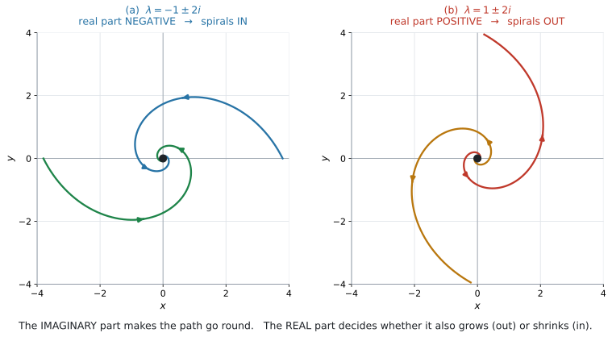
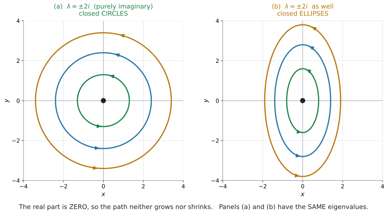
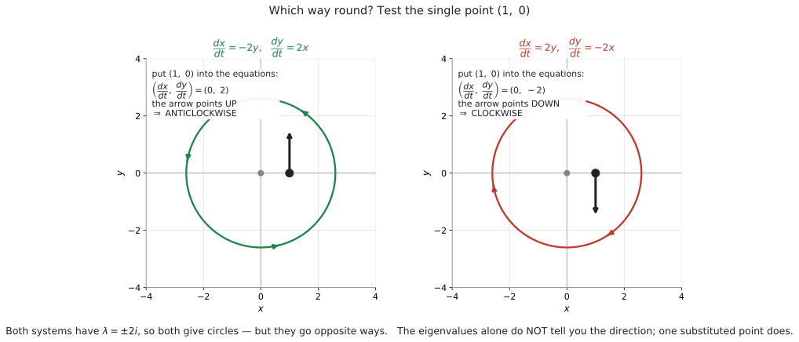

# AHL 5.17b — Phase portraits: complex eigenvalues（複素固有値の相図） {#sec-ahl-5-17b}

::: {.callout-note}
## What you should be able to do
- characteristic equation に**実数解が無い**場合を見分けられる。
- 複素数の固有値を、$a \pm bi$ の形で書ける。
- **実部の符号**から、原点へ近づくか離れるかを言える。
- **純虚数**のとき、軌道が**閉じた曲線**（円・楕円）になることを言える。
- **回る向き**を、$1$ 点を代入して決められる。
- $6$ 通りの場合を、すべて見分けられる。
:::

## The idea

### 1. 実数解が無いとき {#complex}

扱う連立系は [AHL 5.17a](ahl-5-17a.qmd) と同じ形で、**固有値の出し方も同じ**です。違うのは、**$\lambda$ が虚数になる**場合（characteristic equation の解が実数にならない場合）を見ることです。

| 判別式 | 固有値 | 絵 | ページ |
|---|---|---|---|
| $> 0$ | 実数で $2$ つ | 直線・node・saddle | [AHL 5.17a](ahl-5-17a.qmd) |
| $< 0$ | **複素数**（$a \pm bi$） | **spiral**・円・楕円 | このページ |

: 判別式で分かれます {#tbl-ahl517b-split}

**このページでは、厳密解を求めません。** シラバスが `exact solutions` を、固有値が異なる $2$ つの実数の場合に限定しているからです。求められるのは **qualitative analysis**（定性的な分析）——**固有値を出して、絵の形を答える**ことだけです。同じ理由で、**複素数の固有ベクトルを求めることもありません。**

固有値は、[AHL 5.17a](ahl-5-17a.qmd#step1) と同じく $\det(M - \lambda I) = 0$ から出します。この式は**公式集に載っていません**（[AHL 1.15](../01-number-and-algebra/ahl-1-15.qmd#char)）。**このページでも使うので、覚えてください。**

たとえば $M = \begin{pmatrix} -1 & -2 \\ 2 & -1 \end{pmatrix}$ でやってみます。

$$
\det(M - \lambda I) = \begin{vmatrix} -1 - \lambda & -2 \\ 2 & -1 - \lambda \end{vmatrix} = (-1 - \lambda)^{2} + 4 = 0
$$

展開して整理します。

$$
\lambda^{2} + 2\lambda + 5 = 0
$$

これは $\lambda$ の $2$ 次方程式です。**判別式が負なら、解は複素数**になります（[AHL 1.12a](../01-number-and-algebra/ahl-1-12a.qmd#quadratic)）。

$$
\Delta = 2^{2} - 4(5) = 4 - 20 = -16 < 0
$$

ですから、解は複素数です。

$$
\lambda = \frac{-2 \pm \sqrt{4 - 20}}{2} = \frac{-2 \pm \sqrt{-16}}{2} = \frac{-2 \pm 4i}{2} = -1 \pm 2i
$$

::: {.callout-tip}
## 行列から直接書く方法もあります
対角に並ぶ $2$ つの数の和（**対角の和、trace**）と $\det M$ を使えば、行列式を展開せずに書けます（[AHL 5.17a](ahl-5-17a.qmd#step1)）。

$$
\lambda^{2} - (\text{対角の和})\lambda + \det M = 0
$$

この例なら対角の和が $-2$、$\det M = 1 + 4 = 5$ なので、同じ $\lambda^{2} + 2\lambda + 5 = 0$ になります。判別式も

$$
\Delta = (\text{対角の和})^{2} - 4\det M
$$

で出せます。
:::

::: {.callout-tip}
## $2$ つの固有値は、必ずセットで出てきます
係数が実数なので、複素数の解は **conjugate pair**（共役な組）になります。

$$
a + bi \quad \text{と} \quad a - bi
$$

**片方だけ、ということはありません。** $-1 + 2i$ が出たら、もう $1$ つは必ず $-1 - 2i$ です。

ですから、答えは $\lambda = -1 \pm 2i$ と $1$ 行で書けます。
:::

::: {.callout-warning}
## $\sqrt{-16} = 4i$ です
$\sqrt{-16}$ を $-4$ と書かないでください。

$$
\sqrt{-16} = \sqrt{16}\sqrt{-1} = 4i
$$

**$2$ で割るのを忘れない**でください。$\dfrac{-2 \pm 4i}{2} = -1 \pm 2i$ です。
:::

### 2. 実部が、近づくか離れるかを決めます {#real-part}

{#fig-ahl517b-spiral width=100%}

@fig-ahl517b-spiral の (a) と (b) を見くらべてください。**どちらも回っています**が、片方は内へ、もう片方は外へ向かっています。

| 実部 | 動き | 図 |
|---|---|---|
| **負**（$a < 0$） | 原点へ**近づく**（spiral in） | @fig-ahl517b-spiral (a) |
| **正**（$a > 0$） | 原点から**離れる**（spiral out） | @fig-ahl517b-spiral (b) |
| **$0$**（純虚数） | どちらでもない。**閉じた曲線** | @fig-ahl517b-closed（[第3節](#imaginary)） |

: 実部で決まる {#tbl-ahl517b-real}

::: {.callout-important}
## シラバスの言い方
> If the eigenvalues are:
>
> - **Positive or complex with positive real part**, all solutions move away from the origin
> - **Negative or complex with negative real part**, all solutions move towards the origin
> - **Complex**, the solutions form a spiral
> - **Imaginary**, the solutions form a circle or ellipse

**実部の話と「spiral になる」話が、別の行になっている**ことに注意してください。

$\lambda = -1 \pm 2i$ なら、**$2$ つとも答えます。**

::: {.model-answer}
**試験ではこう書く**

*The eigenvalues are complex, so the solutions form a spiral. The real part is $-1$, which is negative, so all solutions move towards the origin.*
:::

（固有値は複素数なので、解は渦を巻く。実部は $-1$ で負なので、すべての解は原点に近づく、という意味です。）
:::

::: {.callout-tip}
## なぜ実部だけを見ればよいのか
シラバスの AHL 1.13 の exponential form を思い浮かべてください。

$$
e^{(a + bi)t} = e^{at} \times e^{ibt}
$$

**$e^{at}$ が大きさ、$e^{ibt}$ が回転**です。大きさを決めるのは $a$、つまり実部だけです。

**AI HL では、この式を書く必要はありません。** 「実部が大きさ、虚部が回転」とだけ覚えてください。
:::

### 3. 純虚数なら、閉じた曲線 {#imaginary}

実部が $0$ のとき、$\lambda = \pm bi$ です。大きさが変わらないので、**同じところを回り続けます。**

{#fig-ahl517b-closed width=100%}

@fig-ahl517b-closed の (a) と (b) が、その $2$ つです。

::: {.callout-important}
## 円になるとはかぎりません
@fig-ahl517b-closed の (a) と (b) は、**固有値が同じ $\pm 2i$** です。それでも、片方は円、もう片方は楕円です。

シラバスも `a circle or ellipse` と、**両方**書いています。

*State the shape of the trajectories* と問われたら、**「円または楕円」**と答えるのが安全です。$M$ を見ただけで、どちらかを断定することは求められていません。
:::

::: {.callout-tip}
## 対角の和が $0$ なら、実部は $0$ です
$2$ つの固有値の和は、対角の和に等しいのでした（[AHL 1.15](../01-number-and-algebra/ahl-1-15.qmd#expand)）。

$$
(a + bi) + (a - bi) = 2a = (\text{対角の和})
$$

**対角の和が $0$ ⟺ 実部が $0$** です。$M = \begin{pmatrix} 0 & -2 \\ 2 & 0 \end{pmatrix}$ は対角の和が $0$ なので、計算する前に純虚数だと分かります。
:::

### 4. 回る向きは、$1$ 点を代入して決めます {#direction}

{#fig-ahl517b-direction width=100%}

**固有値だけでは、回る向きは分かりません。** @fig-ahl517b-direction の $2$ つは、どちらも $\lambda = \pm 2i$ ですが、逆向きに回っています。

**やり方は $1$ つです。** 分かりやすい点、たとえば $(1,\ 0)$ を右辺に代入します。

$$
\frac{dx}{dt} = -2y, \qquad \frac{dy}{dt} = 2x
$$

$(1,\ 0)$ を入れると

$$
\left(\frac{dx}{dt},\ \frac{dy}{dt}\right) = (0,\ 2)
$$

**上を向いています。** $x$ 軸の正の側で上向きなら、**anticlockwise**（反時計回り）です。

| $(1,\ 0)$ での $\dfrac{dy}{dt}$ | 回る向き |
|---|---|
| **正**（上向き） | **anticlockwise**（反時計回り） |
| **負**（下向き） | **clockwise**（時計回り） |

: $(1,\ 0)$ で向きを決める {#tbl-ahl517b-dir}

::: {.callout-tip}
## $(1,\ 0)$ を入れると、$M$ の左の列がそのまま出ます
$$
\begin{pmatrix} a & b \\ c & d \end{pmatrix}\begin{pmatrix} 1 \\ 0 \end{pmatrix} = \begin{pmatrix} a \\ c \end{pmatrix}
$$

つまり、**$c$（左下の数）の符号だけ**を見れば決まります。

$$
c > 0 \ \Longrightarrow \ \text{反時計回り}, \qquad c < 0 \ \Longrightarrow \ \text{時計回り}
$$

**答案には、代入したところを書いてください。** 「左下の数を見た」だけでは、根拠として弱いです。
:::

::: {.callout-warning}
## 別の点を使っても構いませんが、$0$ になる点は避けてください
$(0,\ 0)$ は平衡点なので、$(0,\ 0)$ が返ってきて何も分かりません。

$(1,\ 0)$ か $(0,\ 1)$ が便利です。**$(0,\ 1)$ を使うなら、$\dfrac{dx}{dt}$ の符号を見ます**（左向きなら反時計回り）。
:::

### 5. $6$ 通りの場合のまとめ {#five}

シラバスは $5$ つの箇条書きで書いていますが、それは**「どちらへ動くか」と「どんな形か」を別々に述べた**ものです。見分ける場合分けは、次の **$6$ 通り**になります。

| 固有値 | 原点の呼び名 | 絵 |
|---|---|---|
| 実数、**両方正** | unstable node | 原点以外の軌道は原点から**離れる** |
| 実数、**両方負** | stable node | 原点以外の軌道は原点に**近づく** |
| 実数、**符号が違う** | **saddle point** | 向きによって**近づく**ものと**離れる**ものがある（[AHL 5.17a](ahl-5-17a.qmd#saddle)） |
| 複素数、**実部が正** | unstable spiral | **外へ渦を巻く** |
| 複素数、**実部が負** | stable spiral | **内へ渦を巻く** |
| **純虚数**（実部 $0$） | centre（下の注意を見てください） | **円または楕円** |

: 見分ける $6$ 通り {#tbl-ahl517b-five}

::: {.callout-note appearance="simple"}
上の $3$ 行が [AHL 5.17a](ahl-5-17a.qmd)、下の $3$ 行がこのページです。
:::

::: {.callout-tip}
## 判定の順番
1. $\det(M - \lambda I) = 0$ から **$\lambda$ を求める**（または characteristic equation の**判別式**だけを見る）
   - 実数なら → [AHL 5.17a](ahl-5-17a.qmd) の $3$ つ
   - 複素数なら → このページ
2. 複素数なら、**実部の符号**を見る
3. 回る向きが要るなら、**$(1,\ 0)$ を代入**する

**この順番でやれば、迷いません。**
:::

::: {.callout-warning}
## `node` と `centre` は、シラバスには出てこない語です
シラバスが名指ししているのは **saddle point**、**equilibrium point**、**stable population** の $3$ つだけです。

**node**（結節点）も **centre**（中心）も、教科書で広く使われている便利な呼び名ですが、シラバスの語ではありません。

答案では、呼び名だけで済ませず、**どう動くかを必ず書いてください。**

- node → `all solutions move away from / towards the origin`
- centre → `the solutions form a circle or ellipse`

**呼び名を書くのは構いません。** 動きの説明を添えれば、どちらの採点者にも通じます。
:::

### 6. 軌道のかき方 {#sketch}

複素数の場合、**eigenvector の直線がありません。** ですから [AHL 5.17a](ahl-5-17a.qmd#sketch) とは手順が変わります。

::: {.callout-note appearance="simple"}
1. 原点に印を付ける
2. $(1,\ 0)$ を代入して、**回る向き**を決める
3. 実部の符号にしたがって、**内へ・外へ・閉じたまま**をかく
4. **矢印**を付ける
:::

::: {.callout-important}
## 矢印が無いと、内向きか外向きか分かりません
渦の絵は、**矢印の向きを変えるだけで意味が逆になります。**

$$
\text{同じ渦の絵} + \text{内向きの矢印} = \text{stable}
$$

$$
\text{同じ渦の絵} + \text{外向きの矢印} = \text{unstable}
$$

**矢印は必ず付けてください。**
:::

### 7. 文脈での読みかた {#context}

シラバスは、読み取るべきものを挙げています。

> Sketching trajectories and using phase portraits to identify key features such as **equilibrium points**, **stable populations** and **saddle points**.

| 絵 | 文脈での意味 |
|---|---|
| stable spiral（内向き） | **振動しながら落ち着く** |
| unstable spiral（外向き） | **振動が大きくなっていく** |
| 円・楕円 | **同じ振れ幅で振動し続ける** |

: 渦の形が意味すること {#tbl-ahl517b-context}

::: {.callout-tip}
## `stable populations` とは、落ち着き先のことです
[AHL 5.16b](ahl-5-16b.qmd#equilibrium) の平衡点と同じ考え方です。この形の系では、**平衡点は原点だけ**です。

問題文の $x$ が「基準からのずれ」なら、**原点に近づく = もとの水準に落ち着く**という意味になります（[AHL 5.17a](ahl-5-17a.qmd#exm-ahl517a-stable) の $2$ つの町の例題と同じ読み方です）。
:::

## Why it works

::: {.callout-tip collapse="true"}
## クリックすると開きます

### なぜ回るのか {#why}

いちばん簡単な例で見ます。

$$
\frac{dx}{dt} = -y, \qquad \frac{dy}{dt} = x
$$

$r^{2} = x^{2} + y^{2}$ とおいて、$t$ で微分してみます。

$$
\frac{d}{dt}(x^{2} + y^{2}) = 2x\frac{dx}{dt} + 2y\frac{dy}{dt} = 2x(-y) + 2y(x) = 0
$$

**原点からの距離が変わりません。** ですから、円を描きます。

この $M = \begin{pmatrix} 0 & -1 \\ 1 & 0 \end{pmatrix}$ の固有値は、対角の和 $0$、$\det = 1$ なので

$$
\lambda^{2} + 1 = 0 \ \Longrightarrow \ \lambda = \pm i
$$

**純虚数です。** 実部 $0$ と「距離が変わらない」が、ちょうど対応しています。

### 実部があると、渦になります {#why-spiral}

$$
\frac{dx}{dt} = ax - y, \qquad \frac{dy}{dt} = x + ay
$$

同じ計算をします。

$$
\frac{d}{dt}(x^{2} + y^{2}) = 2x(ax - y) + 2y(x + ay) = 2ax^{2} + 2ay^{2} = 2a(x^{2} + y^{2})
$$

$r^2 = x^2+y^2$ と書けば $\dfrac{dr^{2}}{dt} = 2a\,r^{2}$ で、[AHL 5.14](ahl-5-14.qmd#exponential) の形です。

$$
r^{2} = r_0^{2}\,e^{2at}
$$

**$a > 0$ なら距離が増え、$a < 0$ なら減ります。** 回りながら、そうなる——それが渦です。

この $M$ の固有値は、対角の和 $2a$、$\det = a^{2} + 1$ なので

$$
\lambda^{2} - 2a\lambda + (a^{2} + 1) = 0 \ \Longrightarrow \ \lambda = a \pm i
$$

**実部がちょうど $a$ です** ✓ [第2節](#real-part)の規則が、ここから出ています。

::: {.callout-note appearance="simple"}
この計算は **AI HL では問われません。** 「実部が大きさを決める」と言えれば十分です。
:::

### なぜ楕円になることがあるのか {#why-ellipse}

$$
\frac{dx}{dt} = -y, \qquad \frac{dy}{dt} = 4x
$$

今度は $4x^{2} + y^{2}$ を微分してみます。

$$
\frac{d}{dt}(4x^{2} + y^{2}) = 8x(-y) + 2y(4x) = -8xy + 8xy = 0
$$

**$4x^{2} + y^{2}$ が一定**です。これは楕円の式です。

$x^{2} + y^{2}$ ではなく $4x^{2} + y^{2}$ が保たれるので、円ではなく楕円になります。**どちらが保たれるかは、係数で決まります。**
:::

## Worked examples

::: {.callout-note appearance="simple"}
問題文は英語です。意味が理解できなかったら、問題文の下の「**日本語訳**」を開いてください。解説は日本語です。
:::

::: {#exm-ahl517b-spiral}
[Consider the system]{.q-en}

$$
\frac{dx}{dt} = -x - 2y, \qquad \frac{dy}{dt} = 2x - y
$$

**(a)** [Find the eigenvalues.]{.q-en}

**(b)** [Describe the behaviour of the solutions as $t$ increases.]{.q-en}

**(c)** [Determine whether the trajectories are traced clockwise or anticlockwise, giving a reason.]{.q-en}

<details class="jp-trans">
<summary>日本語訳</summary>

上の連立系を考えます。

`traced` は「たどられる」、`clockwise` は「時計回り」、`anticlockwise` は「反時計回り」という意味です。

**(a)** 固有値を求めなさい。

**(b)** $t$ が増えるときの解のふるまいを述べなさい。

**(c)** 軌道が時計回りか反時計回りかを、理由を付けて判定しなさい。

</details>

---

**(a)** $M = \begin{pmatrix} -1 & -2 \\ 2 & -1 \end{pmatrix}$、対角の和 $-2$、$\det M = 1 + 4 = 5$。

$$
\lambda^{2} + 2\lambda + 5 = 0
$$

$$
\lambda = \frac{-2 \pm \sqrt{4 - 20}}{2} = \frac{-2 \pm 4i}{2} = -1 \pm 2i
$$

**(b)**

::: {.model-answer}
**試験ではこう書く**

*The eigenvalues are complex, so the solutions form a spiral. The real part is $-1$, which is negative, so all solutions move towards the origin. The trajectories spiral inwards, getting closer and closer to the origin without reaching it.*
:::

（固有値は複素数なので、解は渦を巻く。実部は $-1$ で負なので、すべての解は原点に近づく。軌道は内向きに渦を巻き、原点に達することなく近づいていく、という意味です。）

**(c)** $(1,\ 0)$ を代入します（[第4節](#direction)）。

$$
\frac{dx}{dt} = -1 - 0 = -1, \qquad \frac{dy}{dt} = 2 - 0 = 2
$$

::: {.model-answer}
**試験ではこう書く**

*At the point $(1,\ 0)$ the equations give $\dfrac{dx}{dt} = -1$ and $\dfrac{dy}{dt} = 2$. Since $\dfrac{dy}{dt} > 0$, the path is moving upwards on the positive $x$-axis, so the trajectories are traced anticlockwise.*
:::

（点 $(1,\ 0)$ で式は $\dfrac{dx}{dt} = -1$、$\dfrac{dy}{dt} = 2$ を与える。$\dfrac{dy}{dt} > 0$ なので、$x$ 軸の正の側で経路は上向きに動いており、したがって軌道は反時計回りにたどられる、という意味です。）

**検算。** 判別式は $(-2)^{2} - 4(5) = 4 - 20 = -16 < 0$ ✓ 複素数になるはずです。

固有値の和は $(-1+2i) + (-1-2i) = -2$ で、対角の和 $-1 + (-1) = -2$ と一致 ✓

積は $(-1)^{2} - (2i)^{2} = 1 + 4 = 5$ で、$\det M = 5$ と一致 ✓

@fig-ahl517b-spiral の (a) が、この系の絵です。

::: {.callout-warning}
## (b) では $2$ つ書いてください
「渦を巻く」（複素数だから）と「原点に近づく」（実部が負だから）は、**別のこと**です（[第2節](#real-part)）。

片方だけだと、点が半分になります。
:::

::: {.callout-note}
## 解答例（答案用紙にはこう書く）
**(a)** $M = \begin{pmatrix} -1 & -2 \\ 2 & -1 \end{pmatrix}$
$$
\lambda^{2} + 2\lambda + 5 = 0, \qquad \lambda = \frac{-2 \pm \sqrt{-16}}{2} = -1 \pm 2i
$$

**(b)**

::: {.model-answer}
*The eigenvalues are complex, so the solutions form a spiral. The real part $-1$ is negative, so all solutions move towards the origin.*
:::

**(c)** *At $(1,\ 0)$:* $\ \dfrac{dx}{dt} = -1$, $\ \dfrac{dy}{dt} = 2$.

::: {.model-answer}
*Since $\dfrac{dy}{dt} > 0$ on the positive $x$-axis, the trajectories are traced anticlockwise.*
:::
:::
:::

::: {#exm-ahl517b-circle}
[Consider the system $\dfrac{dx}{dt} = -2y$, $\ \dfrac{dy}{dt} = 2x$.]{.q-en}

**(a)** [Show that the eigenvalues are purely imaginary.]{.q-en}

**(b)** [State the shape of the trajectories.]{.q-en}

**(c)** [Show that $x^{2} + y^{2}$ is constant along a trajectory.]{.q-en}

<details class="jp-trans">
<summary>日本語訳</summary>

$\dfrac{dx}{dt} = -2y$、$\dfrac{dy}{dt} = 2x$ を考えます。

`purely imaginary` は「純虚数」、`constant along a trajectory` は「軌道に沿って一定」という意味です。

**(a)** 固有値が純虚数であることを示しなさい。

**(b)** 軌道の形を述べなさい。

**(c)** 軌道に沿って $x^{2} + y^{2}$ が一定であることを示しなさい。

</details>

---

**(a)** $M = \begin{pmatrix} 0 & -2 \\ 2 & 0 \end{pmatrix}$、対角の和 $0$、$\det M = 0 + 4 = 4$。

$$
\lambda^{2} - 0\lambda + 4 = 0 \ \Longrightarrow \ \lambda^{2} = -4 \ \Longrightarrow \ \lambda = \pm 2i
$$

**実部が $0$ なので、純虚数です。**

**(b)**

::: {.model-answer}
**試験ではこう書く**

*The eigenvalues are purely imaginary, so the trajectories are closed curves: circles or ellipses.*
:::

（固有値は純虚数なので、軌道は閉じた曲線、すなわち円または楕円である、という意味です。）

**(c)**

$$
\frac{d}{dt}(x^{2} + y^{2}) = 2x\frac{dx}{dt} + 2y\frac{dy}{dt} = 2x(-2y) + 2y(2x) = -4xy + 4xy = 0
$$

微分が $0$ なので、**$x^{2} + y^{2}$ は一定**です。

**検算。** $x^{2} + y^{2}$ が一定ということは、原点からの距離が変わらないということです。**この系では、軌道は円**になります ✓ @fig-ahl517b-closed の (a) と一致します。

対角の和が $0$ なので、[第3節](#imaginary)のとおり実部は $0$ です ✓ 計算する前に分かります。

::: {.callout-tip}
## (b) では「円または楕円」と書いてください
(c) でこの系が**円**だと分かりますが、**(b) の時点では固有値しか使っていません。**

固有値が $\pm 2i$ の系には、円になるものも楕円になるものもあります（@fig-ahl517b-closed の (a) と (b)）。ですから、(b) の答えは `circles or ellipses` です。
:::

::: {.callout-warning}
## $\dfrac{d}{dt}(x^{2})$ は $2x$ ではありません
$x$ は $t$ の関数なので、chain rule が要ります（AHL 5.9）。

$$
\frac{d}{dt}(x^{2}) = 2x \cdot \frac{dx}{dt}
$$

**$\dfrac{dx}{dt}$ を掛け忘れないでください。** ここを落とすと、(c) が示せません。
:::

::: {.callout-note}
## 解答例（答案用紙にはこう書く）
**(a)** $M = \begin{pmatrix} 0 & -2 \\ 2 & 0 \end{pmatrix}$
$$
\lambda^{2} + 4 = 0, \qquad \lambda = \pm 2i
$$
*The real part is $0$, so the eigenvalues are purely imaginary.*

**(b)**

::: {.model-answer}
*The trajectories are closed curves: circles or ellipses.*
:::

**(c)**
$$
\frac{d}{dt}(x^{2} + y^{2}) = 2x(-2y) + 2y(2x) = 0
$$
*So $x^{2} + y^{2}$ is constant along a trajectory.*
:::
:::

::: {#exm-ahl517b-classify}
[For each system, describe the behaviour of the solutions near the origin.]{.q-en}

**(a)** $\dfrac{dx}{dt} = 2x - y$, $\ \dfrac{dy}{dt} = x + 2y$

**(b)** $\dfrac{dx}{dt} = -2x - 3y$, $\ \dfrac{dy}{dt} = 3x - 2y$

**(c)** $\dfrac{dx}{dt} = 3x + y$, $\ \dfrac{dy}{dt} = x + 3y$

<details class="jp-trans">
<summary>日本語訳</summary>

それぞれの系について、原点の近くでの解のふるまいを述べなさい。

</details>

---

**判別式を先に見ます**（[第5節](#five)）。

**(a)** 対角の和 $4$、$\det = 4 + 1 = 5$。判別式 $16 - 20 = -4 < 0$。

$$
\lambda^{2} - 4\lambda + 5 = 0 \ \Longrightarrow \ \lambda = \frac{4 \pm \sqrt{-4}}{2} = 2 \pm i
$$

::: {.model-answer}
*Complex with positive real part $2$, so the solutions spiral outwards, away from the origin.*
:::

**(b)** 対角の和 $-4$、$\det = 4 + 9 = 13$。判別式 $16 - 52 = -36 < 0$。

$$
\lambda^{2} + 4\lambda + 13 = 0 \ \Longrightarrow \ \lambda = \frac{-4 \pm \sqrt{-36}}{2} = -2 \pm 3i
$$

::: {.model-answer}
*Complex with negative real part $-2$, so the solutions spiral inwards, towards the origin.*
:::

**(c)** 対角の和 $6$、$\det = 9 - 1 = 8$。判別式 $36 - 32 = 4 > 0$。

$$
\lambda^{2} - 6\lambda + 8 = 0 \ \Longrightarrow \ \lambda = 4,\ 2
$$

::: {.model-answer}
*Real and both positive, so all solutions move away from the origin (an unstable node).*
:::

**検算。** (c) だけ判別式が正でした。**$36 - 32 = 4$ で、$\sqrt{4} = 2$ ときれいな数**になります ✓ 実数解が出るはずです。

(a) と (b) は、固有値の積を確かめます。$(2+i)(2-i) = 4 + 1 = 5$ ✓、$(-2+3i)(-2-3i) = 4 + 9 = 13$ ✓ どちらも $\det M$ と一致しました。

::: {.callout-tip}
## 判別式は、暗算でできることが多いです
$$
\Delta = (\text{対角の和})^{2} - 4\det M
$$

(a) は $4^2 - 4(5) = 16 - 20$、(b) は $(-4)^2 - 4(13) = 16 - 52$ です。

**符号だけ分かれば十分**なので、正確な値を出す必要はありません。
:::

::: {.callout-note}
## 解答例（答案用紙にはこう書く）
**(a)** $\lambda^{2} - 4\lambda + 5 = 0$, $\ \lambda = 2 \pm i$

::: {.model-answer}
*Complex with positive real part, so the solutions spiral outwards, away from the origin.*
:::

**(b)** $\lambda^{2} + 4\lambda + 13 = 0$, $\ \lambda = -2 \pm 3i$

::: {.model-answer}
*Complex with negative real part, so the solutions spiral inwards, towards the origin.*
:::

**(c)** $\lambda^{2} - 6\lambda + 8 = 0$, $\ \lambda = 4,\ 2$

::: {.model-answer}
*Real and both positive, so all solutions move away from the origin (an unstable node).*
:::
:::
:::

::: {#exm-ahl517b-context}
[Two coupled tanks are disturbed from their normal levels. Let $x$ and $y$ be the differences (in cm) from the normal levels, $t$ minutes later. They satisfy]{.q-en}

$$
\frac{dx}{dt} = -0.2x - 3y, \qquad \frac{dy}{dt} = 3x - 0.2y.
$$

**(a)** [Find the eigenvalues.]{.q-en}

**(b)** [Sketch the trajectory that starts at $(4,\ 0)$.]{.q-en}

**(c)** [Comment on what the model predicts for the tanks.]{.q-en}

<details class="jp-trans">
<summary>日本語訳</summary>

つながった $2$ つのタンクが、通常の水位から乱されました。$t$ 分後の通常水位からの差（cm）を $x$、$y$ とします。上の式を満たします。

`disturbed` は「乱された」、`normal levels` は「通常の水位」という意味です。

**(a)** 固有値を求めなさい。

**(b)** $(4,\ 0)$ から始まる軌道をかきなさい。

**(c)** このモデルがタンクについて予測することをコメントしなさい。

</details>

---

**(a)** 対角の和 $-0.4$、$\det M = 0.04 + 9 = 9.04$。

$$
\lambda^{2} + 0.4\lambda + 9.04 = 0
$$

$$
\lambda = \frac{-0.4 \pm \sqrt{0.16 - 36.16}}{2} = \frac{-0.4 \pm \sqrt{-36}}{2} = \frac{-0.4 \pm 6i}{2} = -0.2 \pm 3i
$$

**(b)** 手順は [第6節](#sketch) のとおりです。

$(1,\ 0)$ を代入すると $\dfrac{dy}{dt} = 3 > 0$ なので、**反時計回り**です。

実部が $-0.2$ で負なので、**内向きの渦**をかきます。$(4,\ 0)$ に印を付けて、そこから反時計回りに、少しずつ原点へ近づく渦をかきます。

**(c)**

::: {.model-answer}
**試験ではこう書く**

*The eigenvalues are complex with a small negative real part, so the levels oscillate about their normal values while the size of the oscillation slowly dies away. The model predicts that both tanks eventually settle back to their normal levels, but only after many oscillations, because the real part $-0.2$ is small compared with the imaginary part $3$.*
:::

（固有値は複素数で実部が小さな負の値なので、水位は通常の値のまわりで振動し、振動の大きさはゆっくり小さくなる。このモデルは、両方のタンクが最終的に通常の水位に戻ることを予測しているが、実部 $-0.2$ が虚部 $3$ にくらべて小さいため、それには何度も振動を繰り返す必要がある、という意味です。）

**検算。** 判別式 $0.16 - 4(9.04) = 0.16 - 36.16 = -36 < 0$ ✓ 複素数です。

固有値の和 $(-0.2 + 3i) + (-0.2 - 3i) = -0.4$ ✓ 対角の和と一致。

積 $(-0.2)^{2} + 3^{2} = 0.04 + 9 = 9.04$ ✓ $\det M$ と一致。

::: {.callout-tip}
## 実部と虚部の「大きさくらべ」が、意味を持ちます
$1$ 周まわるのにかかる時間は、虚部で決まります。振幅が $e^{-0.2t}$ で減るので、**$1$ 周のあいだにはあまり減りません。**

**「ゆっくり落ち着く」**というのが、この系の姿です。実部が $-3$ なら、$1$ 周もしないうちに収まります。

**AI HL では、周期の計算までは求められません。** 「実部が小さいので、ゆっくり」と言えれば十分です。
:::

::: {.callout-warning}
## $x$ と $y$ が「差」であることを忘れないでください
[AHL 5.17a](ahl-5-17a.qmd#idea) と同じで、この形の系には定数項が付きません。ですから、問題文は**基準からのずれ**を変数にしています。

**原点に近づく = 通常の水位に戻る**、という読みかえが要ります。
:::

::: {.callout-note}
## 解答例（答案用紙にはこう書く）
**(a)**
$$
\lambda^{2} + 0.4\lambda + 9.04 = 0, \qquad \lambda = \frac{-0.4 \pm \sqrt{-36}}{2} = -0.2 \pm 3i
$$

**(b)** *(sketch: mark $(4,\ 0)$; at $(1,\ 0)$, $\dfrac{dy}{dt} = 3 > 0$ so the motion is anticlockwise; the real part is negative so draw a spiral winding anticlockwise slowly inwards towards the origin, with arrows)*

**(c)**

::: {.model-answer}
*The eigenvalues are complex with a small negative real part, so the levels oscillate about their normal values while the oscillation slowly dies away. Both tanks eventually settle back to their normal levels, but only after many oscillations.*
:::
:::
:::

## Common errors

::: {.callout-warning}
## $\sqrt{-16}$ を $-4$ とする
$\sqrt{-16} = 4i$ です（[第1節](#complex)）。
:::

::: {.callout-warning}
## $2$ で割るのを忘れる
$\dfrac{-2 \pm 4i}{2} = -1 \pm 2i$ です。**分母の $2$ は、両方の項に効きます**（[第1節](#complex)）。
:::

::: {.callout-warning}
## 実部と虚部を取り違える
$-1 \pm 2i$ の実部は $-1$、虚部は $2$ です。**近づくか離れるかを決めるのは実部**です（[第2節](#real-part)）。
:::

::: {.callout-warning}
## 「渦を巻く」だけ書いて、向きを書かない
複素数なら渦、実部の符号で内か外——**$2$ つとも要ります**（@exm-ahl517b-spiral）。
:::

::: {.callout-warning}
## 純虚数なのに「円」と断定する
`circle or ellipse` です（[第3節](#imaginary)）。**固有値だけでは、どちらかは決まりません。**
:::

::: {.callout-warning}
## 回る向きを、固有値から決めようとする
固有値では決まりません。**$1$ 点を代入してください**（[第4節](#direction)）。
:::

::: {.callout-warning}
## 向きの判定に $(0,\ 0)$ を使う
平衡点なので $(0,\ 0)$ が返ってきます（[第4節](#direction)）。**$(1,\ 0)$ を使ってください。**
:::

::: {.callout-warning}
## sketch に矢印を付けない
渦の絵は、矢印が無いと内向きか外向きか分かりません（[第6節](#sketch)）。
:::

::: {.callout-warning}
## 複素数の固有ベクトルを求めようとする
**AI HL では求められません**（このページ冒頭の注意）。厳密解が要るのは実数で異なる場合だけです。
:::

::: {.callout-warning}
## $\dfrac{d}{dt}(x^{2})$ で chain rule を落とす
$2x \cdot \dfrac{dx}{dt}$ です（@exm-ahl517b-circle）。
:::

## Using your GDC (TI-Nspire CX II)

::: {.callout-important}
## 複素数の固有値も、そのまま返ってきます
[AHL 1.15](../01-number-and-algebra/ahl-1-15.qmd#gdc-eigval) と同じコマンドです。

```
menu → Matrix & Vector → Advanced → Eigenvalues
```

$\{-1 - 2 \cdot i,\ -1 + 2 \cdot i\}$ のように、**`i` の付いた形**で返ります。
:::

### 複素数を表示させる設定 {#gdc-complex}

機種の設定によっては、複素数の答えが出ないことがあります。

```
doc → Settings → Document Settings
```

`Real or Complex` を **`Rectangular`** にしておいてください。`Real` のままだと、`Error: Non-real result` のようになります。

::: {.callout-tip}
## `Rectangular` は $a + bi$ の形のことです
`Polar` にすると、$r\,e^{i\theta}$ の形で返ってきます（シラバスの AHL 1.13 の exponential form）。

**この項目では実部が見たい**ので、`Rectangular` が便利です。
:::

### 判別式だけ見る {#gdc-disc}

固有値まで出さなくても、**判別式の符号**が分かれば場合分けはできます（[第5節](#five)）。

$(\text{対角の和})^{2} - 4 \times (\texttt{det})$

`det()` は次のところにあります。

```
menu → Matrix & Vector
```

の中の `Determinant` から入れられます（[AHL 1.14](../01-number-and-algebra/ahl-1-14.qmd#gdc-det) と同じです）。

::: {.callout-warning}
## 答案には、固有値そのものを書いてください
`Find the eigenvalues` と問われたら、**characteristic equation を書いて解く過程**が要ります。

判別式は、**場合分けの見当をつけるため**のものです。
:::

### 軌道を描いてみる {#gdc-plot}

[AHL 5.17a](ahl-5-17a.qmd#gdc-plot) と同じく、Graphs のパラメトリック表示が使えます。ただし複素数の場合、**$x(t)$ と $y(t)$ の式を自分で作る必要があります**（このページでは求めません）。

**もっと手軽なのは、[AHL 5.16b](ahl-5-16b.qmd#gdc-sheet) の Lists & Spreadsheet で Euler 法を回し、散布図にする方法**です。渦の形がそのまま出ます。

::: {.callout-tip}
## Euler 法で渦を見るときは、$h$ を小さくしてください
[AHL 5.16b](ahl-5-16b.qmd#why-spiral) で見たとおり、$h$ が大きいと**外へ広がる誤差**が出ます。

純虚数の場合（本当は閉じた曲線）でも、$h$ が大きいと**外向きの渦に見えてしまいます。** $h = 0.01$ くらいにしてください。
:::

## Exercises

::: {.callout-note appearance="simple"}
各問題に、折りたたみが3つ付いています。**日本語訳**、**解答例**（答案用紙に書くべきこと。英語です）、**解説**（なぜそうなるか。日本語です）。

まず自分で解いて、次に解答例と見くらべてください。**解説は、合わなかったときだけ開けば十分です。**
:::

::: {.exercise-block}

[1]{.ex-no} [Find the eigenvalues of $M = \begin{pmatrix} 2 & -1 \\ 1 & 2 \end{pmatrix}$.]{.q-en}

<details class="jp-trans">
<summary>日本語訳</summary>

$M = \begin{pmatrix} 2 & -1 \\ 1 & 2 \end{pmatrix}$ の固有値を求めなさい。

</details>

::: {.callout-note collapse="true"}
## 解答例（答案用紙に書くこと）
$$
\lambda^{2} - 4\lambda + 5 = 0
$$
$$
\lambda = \frac{4 \pm \sqrt{16 - 20}}{2} = \frac{4 \pm 2i}{2} = 2 \pm i
$$
:::

::: {.callout-tip collapse="true"}
## 解説
対角の和 $4$、$\det = 4 + 1 = 5$ です（[AHL 1.15](../01-number-and-algebra/ahl-1-15.qmd#expand)）。

$$
\sqrt{-4} = 2i
$$

**$2$ で割るのを忘れないでください**（[第1節](#complex)）。

**検算。** $(2+i)(2-i) = 4 - i^{2} = 4 + 1 = 5$ ✓ $\det M$ と一致しました。
:::

::: {.ex-sep}
:::

[2]{.ex-no} [For the system $\dfrac{dx}{dt} = -2x - 3y$, $\ \dfrac{dy}{dt} = 3x - 2y$:]{.q-en}

**(a)** [Find the eigenvalues.]{.q-en}

**(b)** [Describe the behaviour of the solutions as $t$ increases.]{.q-en}

**(c)** [Sketch the phase portrait, showing the direction of motion.]{.q-en}

<details class="jp-trans">
<summary>日本語訳</summary>

連立系 $\dfrac{dx}{dt} = -2x - 3y$、$\dfrac{dy}{dt} = 3x - 2y$ について。

**(a)** 固有値を求めなさい。

**(b)** $t$ が増えるときの解のふるまいを述べなさい。

**(c)** 運動の向きを示して、相図をかきなさい。

</details>

::: {.callout-note collapse="true"}
## 解答例（答案用紙に書くこと）
**(a)**
$$
\lambda^{2} + 4\lambda + 13 = 0, \qquad \lambda = \frac{-4 \pm \sqrt{-36}}{2} = -2 \pm 3i
$$

**(b)**

::: {.model-answer}
*The eigenvalues are complex, so the solutions form a spiral. The real part $-2$ is negative, so all solutions move towards the origin: the trajectories spiral inwards.*
:::

**(c)** *At $(1,\ 0)$:* $\ \dfrac{dy}{dt} = 3 > 0$, *so the motion is anticlockwise.*

*(sketch: a spiral winding anticlockwise inwards towards the origin, with arrows on it)*
:::

::: {.callout-tip collapse="true"}
## 解説
対角の和 $-4$、$\det = 4 + 9 = 13$。判別式 $16 - 52 = -36 < 0$ です。

$$
\sqrt{-36} = 6i, \qquad \lambda = \frac{-4 \pm 6i}{2} = -2 \pm 3i
$$

**(b) は $2$ つ書きます**（[第2節](#real-part)）。「渦」と「内向き」です。

**(c)** 向きは $(1,\ 0)$ の代入で決めます（[第4節](#direction)）。左下の数が $+3$ なので反時計回りです。@fig-ahl517b-spiral の (a) と同じ形の絵になります。

**検算。** 和 $-4$ ✓、積 $4 + 9 = 13$ ✓
:::

::: {.ex-sep}
:::

[3]{.ex-no} [For the system $\dfrac{dx}{dt} = -3y$, $\ \dfrac{dy}{dt} = 3x$:]{.q-en}

**(a)** [Show that the eigenvalues are purely imaginary.]{.q-en}

**(b)** [State the shape of the trajectories.]{.q-en}

**(c)** [Determine the direction in which they are traced.]{.q-en}

<details class="jp-trans">
<summary>日本語訳</summary>

連立系 $\dfrac{dx}{dt} = -3y$、$\dfrac{dy}{dt} = 3x$ について。

**(a)** 固有値が純虚数であることを示しなさい。

**(b)** 軌道の形を述べなさい。

**(c)** たどられる向きを判定しなさい。

</details>

::: {.callout-note collapse="true"}
## 解答例（答案用紙に書くこと）
**(a)** $M = \begin{pmatrix} 0 & -3 \\ 3 & 0 \end{pmatrix}$, *trace* $= 0$, $\det = 9$.
$$
\lambda^{2} + 9 = 0, \qquad \lambda = \pm 3i
$$
*The real part is $0$, so the eigenvalues are purely imaginary.*

**(b)**

::: {.model-answer}
*The trajectories are closed curves: circles or ellipses.*
:::

**(c)** *At $(1,\ 0)$:* $\ \dfrac{dy}{dt} = 3 > 0$.

::: {.model-answer}
*The motion is upwards on the positive $x$-axis, so the trajectories are traced anticlockwise.*
:::
:::

::: {.callout-tip collapse="true"}
## 解説
**対角の和が $0$** なので、計算する前に実部が $0$ だと分かります（[第3節](#imaginary)）。

**(c)** $(1,\ 0)$ を代入すると $\dfrac{dx}{dt} = 0$、$\dfrac{dy}{dt} = 3$ です。**まっすぐ上**を向いています。

**検算。** $\dfrac{d}{dt}(x^{2} + y^{2}) = 2x(-3y) + 2y(3x) = 0$ ✓ **距離が一定**なので、この系では円になります（[Why it works](#why)）。
:::

::: {.ex-sep}
:::

[4]{.ex-no} [For the system $\dfrac{dx}{dt} = 4y$, $\ \dfrac{dy}{dt} = -x$:]{.q-en}

**(a)** [Find the eigenvalues.]{.q-en}

**(b)** [Determine the direction in which the trajectories are traced, giving a reason.]{.q-en}

<details class="jp-trans">
<summary>日本語訳</summary>

連立系 $\dfrac{dx}{dt} = 4y$、$\dfrac{dy}{dt} = -x$ について。

**(a)** 固有値を求めなさい。

**(b)** 軌道のたどられる向きを、理由を付けて判定しなさい。

</details>

::: {.callout-note collapse="true"}
## 解答例（答案用紙に書くこと）
**(a)** $M = \begin{pmatrix} 0 & 4 \\ -1 & 0 \end{pmatrix}$, *trace* $= 0$, $\det = 0 - (4)(-1) = 4$.
$$
\lambda^{2} + 4 = 0, \qquad \lambda = \pm 2i
$$

**(b)** *At $(1,\ 0)$:* $\ \dfrac{dx}{dt} = 0$, $\ \dfrac{dy}{dt} = -1$.

::: {.model-answer}
*Since $\dfrac{dy}{dt} < 0$, the motion is downwards on the positive $x$-axis, so the trajectories are traced clockwise.*
:::
:::

::: {.callout-tip collapse="true"}
## 解説
$\det = ad - bc = 0 \times 0 - 4 \times (-1) = 4$ です。**マイナス同士で正**になります。

**(b)** 問題3とくらべてください。固有値は $\pm 3i$ と $\pm 2i$ で似ていますが、**向きが逆**です（[第4節](#direction)）。

**左下の数**を見ると、問題3は $+3$、この問題は $-1$ です。符号が違うので、向きも逆になります。

**検算。** $\dfrac{d}{dt}(x^{2} + 4y^{2}) = 2x(4y) + 8y(-x) = 8xy - 8xy = 0$ ✓ **$x^{2} + 4y^{2}$ が一定**なので、これは楕円です（[Why it works](#why-ellipse)）。円ではありません。
:::

::: {.ex-sep}
:::

[5]{.ex-no} [For each system, state whether the origin is a node, a saddle point, a spiral, or closed curves (a centre).]{.q-en}

**(a)** $\dfrac{dx}{dt} = x - 2y$, $\ \dfrac{dy}{dt} = 2x + y$

**(b)** $\dfrac{dx}{dt} = 2x + 3y$, $\ \dfrac{dy}{dt} = x$

**(c)** $\dfrac{dx}{dt} = -x - 5y$, $\ \dfrac{dy}{dt} = x + y$

<details class="jp-trans">
<summary>日本語訳</summary>

それぞれの系について、原点が node、saddle point、spiral、閉じた曲線（centre）のどれかを述べなさい。

</details>

::: {.callout-note collapse="true"}
## 解答例（答案用紙に書くこと）
**(a)** *trace* $= 2$, $\det = 1 + 4 = 5$, $\Delta = 4 - 20 = -16 < 0$
$$
\lambda = 1 \pm 2i
$$

::: {.model-answer}
*A spiral, moving outwards away from the origin.*
:::

**(b)** *trace* $= 2$, $\det = 0 - 3 = -3$, $\Delta = 4 + 12 = 16 > 0$
$$
\lambda = 3,\ -1
$$

::: {.model-answer}
*A saddle point.*
:::

**(c)** *trace* $= 0$, $\det = -1 + 5 = 4$, $\Delta = 0 - 16 = -16 < 0$
$$
\lambda = \pm 2i
$$

::: {.model-answer}
*Closed curves (a centre): the solutions form a circle or ellipse.*
:::
:::

::: {.callout-tip collapse="true"}
## 解説
**判別式 → 実部**の順です（[第5節](#five)）。

**(a)** $\Delta < 0$ で複素数、実部 $1 > 0$ なので**外向きの spiral**。

**(b)** $\Delta > 0$ で実数。$\det < 0$ なので**符号が違い、saddle** です（[AHL 5.17a](ahl-5-17a.qmd#saddle)）。

**(c)** 対角の和 $0$ なので実部 $0$、**閉じた曲線**です。

**検算。** (c) は $\det = (-1)(1) - (-5)(1) = -1 + 5 = 4$ です。$\lambda^{2} + 4 = 0$ ✓

$\lambda = \pm 2i$ の積は $(2i)(-2i) = -4i^{2} = 4$ ✓ $\det$ と一致します。
:::

::: {.ex-sep}
:::

[6]{.ex-no} [A system has eigenvalues $\lambda = -0.5 \pm 4i$.]{.q-en}

**(a)** [Describe the trajectories.]{.q-en}

**(b)** [Explain why the trajectories take many turns before getting close to the origin.]{.q-en}

<details class="jp-trans">
<summary>日本語訳</summary>

ある系の固有値が $\lambda = -0.5 \pm 4i$ です。

**(a)** 軌道を述べなさい。

**(b)** 軌道が原点に近づくまでに何回も回る理由を説明しなさい。

</details>

::: {.callout-note collapse="true"}
## 解答例（答案用紙に書くこと）
**(a)**

::: {.model-answer}
*The eigenvalues are complex, so the trajectories form a spiral. The real part $-0.5$ is negative, so they spiral inwards towards the origin.*
:::

**(b)**

::: {.model-answer}
*The imaginary part $4$ controls how fast the path turns, and the real part $-0.5$ controls how fast it shrinks. Here the imaginary part is eight times the size of the real part, so the path goes round many times while the distance from the origin is still only shrinking slowly.*
:::
:::

::: {.callout-tip collapse="true"}
## 解説
**(b)** [第7節](#context)と @exm-ahl517b-context の考え方です。

**大きさは $e^{-0.5t}$ で減り、回転は $4t$ で進みます。** $1$ 周（$2\pi$ ラジアン）に要するのは $t = \dfrac{2\pi}{4} \approx 1.57$ で、そのあいだに大きさは $e^{-0.5 \times 1.57} = e^{-0.785} = 0.456$ 倍にしかなりません。

**$1$ 周ごとに半分ほどになるだけ**なので、小さくなりきるまでに何周もします。

**AI HL では、この計算までは求められません。** 「虚部が実部よりずっと大きいから」と言えれば十分です。

**検算。** 実部が $-4$、虚部が $0.5$ だったら逆になります。$1$ 周に $t = \dfrac{2\pi}{0.5} \approx 12.6$ かかり、そのあいだに $e^{-4 \times 12.6}$ でほぼ $0$ です。**$1$ 周する前に原点に着いてしまいます** ✓
:::

::: {.ex-sep}
:::

[7]{.ex-no} [A student is asked to find the eigenvalues of $M = \begin{pmatrix} -1 & -4 \\ 1 & -1 \end{pmatrix}$ and writes:]{.q-en}

> $\lambda^2 + 2\lambda + 5 = 0$, so $\lambda = \dfrac{-2 \pm \sqrt{-16}}{2} = -2 \pm 4i$.

[Identify the error, and give the correct eigenvalues.]{.q-en}

<details class="jp-trans">
<summary>日本語訳</summary>

ある生徒が $M = \begin{pmatrix} -1 & -4 \\ 1 & -1 \end{pmatrix}$ の固有値を求めるよう言われ、上のように書きました。

誤りを指摘し、正しい固有値を述べなさい。

</details>

::: {.callout-note collapse="true"}
## 解答例（答案用紙に書くこと）
::: {.model-answer}
*The student has not divided both terms by $2$. Since $\sqrt{-16} = 4i$, the correct working is $\dfrac{-2 \pm 4i}{2} = -1 \pm 2i$, not $-2 \pm 4i$.*
:::

$$
\lambda = -1 \pm 2i
$$
:::

::: {.callout-tip collapse="true"}
## 解説
**characteristic equation は合っています。** 対角の和 $-2$、$\det = 1 + 4 = 5$ で $\lambda^{2} + 2\lambda + 5 = 0$ ✓

間違いは**最後の $1$ 行だけ**です。分母の $2$ が、**両方の項**に効きます（[第1節](#complex)）。

**検算。** 生徒の答え $-2 \pm 4i$ の和は $-4$ です。対角の和は $-2$ なので**合いません** ✓ 正しい $-1 \pm 2i$ の和は $-2$ で一致します。

積でも確かめられます。$(-1)^{2} + 2^{2} = 5$ ✓ 生徒の答えなら $4 + 16 = 20$ で、$\det = 5$ と合いません。

::: {.callout-warning}
## 和と積で検算する習慣を付けてください
複素数でも、**和 = 対角の和、積 = $\det$** はそのまま成り立ちます（[AHL 1.15](../01-number-and-algebra/ahl-1-15.qmd#expand)）。

$$
(a+bi)(a-bi) = a^{2} + b^{2}
$$

**$10$ 秒で確かめられます。**
:::
:::

::: {.ex-sep}
:::

[8]{.ex-no} [@fig-ahl517b-closed parts (a) and (b) both come from systems with eigenvalues $\pm 2i$, yet the pictures are different.]{.q-en}

**(a)** [State what the two pictures have in common.]{.q-en}

**(b)** [Explain why knowing the eigenvalues is not enough to decide between a circle and an ellipse.]{.q-en}

<details class="jp-trans">
<summary>日本語訳</summary>

@fig-ahl517b-closed の (a) と (b) は、どちらも固有値が $\pm 2i$ の系から来ていますが、絵は違います。

**(a)** $2$ つの絵に共通することを述べなさい。

**(b)** 固有値を知るだけでは円と楕円を区別できない理由を説明しなさい。

</details>

::: {.callout-note collapse="true"}
## 解答例（答案用紙に書くこと）
**(a)**

::: {.model-answer}
*In both pictures the trajectories are closed curves around the origin, traced in the same direction, and neither moves towards nor away from the origin.*
:::

**(b)**

::: {.model-answer}
*The eigenvalues depend only on the trace and the determinant of the matrix, which are two numbers, while the matrix has four entries. Different matrices can share the same trace and determinant but stretch the plane differently, so the closed curves can be circles in one case and ellipses in another.*
:::
:::

::: {.callout-tip collapse="true"}
## 解説
**(b)** ここが要点です。$\lambda$ を決めるのは**対角の和と $\det$ の $2$ つの数**だけですが、行列には**$4$ つの数**があります。

$$
\begin{pmatrix} 0 & -2 \\ 2 & 0 \end{pmatrix} \quad \text{と} \quad \begin{pmatrix} 0 & -1 \\ 4 & 0 \end{pmatrix}
$$

どちらも対角の和 $0$、$\det = 4$ です。**それでも中身は違います。**

だから、シラバスも `a circle or ellipse` と両方書いています（[第3節](#imaginary)）。

**検算。** $2$ つ目の行列で $\dfrac{d}{dt}(4x^{2} + y^{2}) = 8x(-y) + 2y(4x) = 0$ ✓ **$4x^{2} + y^{2}$ が一定**なので楕円です。$1$ つ目では $x^{2} + y^{2}$ が一定で、円です（[Why it works](#why-ellipse)）。
:::

::: {.ex-sep}
:::

[9]{.ex-no} [In a mechanical system, $x$ is the displacement from equilibrium (in cm) and $y$ is a related quantity, $t$ seconds after the start. They satisfy]{.q-en}

$$
\frac{dx}{dt} = -0.1x - 2y, \qquad \frac{dy}{dt} = 2x - 0.1y,
$$

[with $x = 3$ and $y = 0$ when $t = 0$.]{.q-en}

**(a)** [Find the eigenvalues.]{.q-en}

**(b)** [Determine the direction in which the trajectory is traced.]{.q-en}

**(c)** [Comment on what the model predicts for the displacement.]{.q-en}

<details class="jp-trans">
<summary>日本語訳</summary>

ある機械の系で、開始 $t$ 秒後の平衡位置からの変位（cm）を $x$、関連する量を $y$ とします。上の式を満たし、$t = 0$ のとき $x = 3$、$y = 0$ です。

`displacement` は「変位」、`mechanical` は「機械の」という意味です。

**(a)** 固有値を求めなさい。

**(b)** 軌道のたどられる向きを判定しなさい。

**(c)** このモデルが変位について予測することをコメントしなさい。

</details>

::: {.callout-note collapse="true"}
## 解答例（答案用紙に書くこと）
**(a)** *trace* $= -0.2$, $\det = 0.01 + 4 = 4.01$
$$
\lambda^{2} + 0.2\lambda + 4.01 = 0, \qquad \lambda = \frac{-0.2 \pm \sqrt{-16}}{2} = -0.1 \pm 2i
$$

**(b)** *At $(1,\ 0)$:* $\ \dfrac{dy}{dt} = 2 > 0$.

::: {.model-answer}
*The motion is upwards on the positive $x$-axis, so the trajectory is traced anticlockwise.*
:::

**(c)**

::: {.model-answer}
*The eigenvalues are complex with a small negative real part, so the displacement oscillates about the equilibrium position while the size of the oscillation slowly decreases. The model predicts that the system eventually comes to rest at equilibrium, but only after many oscillations, since $0.1$ is small compared with $2$.*
:::
:::

::: {.callout-tip collapse="true"}
## 解説
判別式は $(-0.2)^{2} - 4(4.01) = 0.04 - 16.04 = -16$ です。

$$
\sqrt{-16} = 4i, \qquad \lambda = \frac{-0.2 \pm 4i}{2} = -0.1 \pm 2i
$$

**(c)** @exm-ahl517b-context と同じ形です。**振動しながら、ゆっくり収まる**——これが答えです。

**検算。** 和 $-0.2$ ✓ 積 $(-0.1)^{2} + 2^{2} = 0.01 + 4 = 4.01$ ✓ $\det$ と一致しました。

$1$ 周に $t = \dfrac{2\pi}{2} \approx 3.14$ 秒かかり、そのあいだに振幅は $e^{-0.1 \times 3.14} = 0.73$ 倍です。**$1$ 周で $3$ 割ほどしか減りません。**
:::

::: {.ex-sep}
:::

[10]{.ex-no} [Consider the family of systems]{.q-en}

$$
\frac{dx}{dt} = kx - y, \qquad \frac{dy}{dt} = x + ky,
$$

[where $k$ is a constant.]{.q-en}

**(a)** [Show that the eigenvalues are $k \pm i$.]{.q-en}

**(b)** [State the value of $k$ for which the trajectories are closed curves.]{.q-en}

**(c)** [Describe how the phase portrait changes as $k$ increases through that value.]{.q-en}

<details class="jp-trans">
<summary>日本語訳</summary>

$k$ を定数として、上の連立系の族を考えます。

`the family of systems` は「系の族」、`increases through that value` は「その値を通り越して増える」という意味です。

**(a)** 固有値が $k \pm i$ であることを示しなさい。

**(b)** 軌道が閉じた曲線になる $k$ の値を書きなさい。

**(c)** $k$ がその値を通り越して増えるとき、相図がどう変わるかを述べなさい。

</details>

::: {.callout-note collapse="true"}
## 解答例（答案用紙に書くこと）
**(a)** $M = \begin{pmatrix} k & -1 \\ 1 & k \end{pmatrix}$, *trace* $= 2k$, $\det = k^{2} + 1$.
$$
\lambda^{2} - 2k\lambda + (k^{2} + 1) = 0
$$
$$
\lambda = \frac{2k \pm \sqrt{4k^{2} - 4(k^{2} + 1)}}{2} = \frac{2k \pm \sqrt{-4}}{2} = \frac{2k \pm 2i}{2} = k \pm i
$$

**(b)** $k = 0$

**(c)**

::: {.model-answer}
*For $k < 0$ the real part is negative, so the trajectories spiral inwards towards the origin. At $k = 0$ the eigenvalues are purely imaginary and the trajectories are closed curves. For $k > 0$ the real part is positive, so the trajectories spiral outwards, away from the origin.*
:::
:::

::: {.callout-tip collapse="true"}
## 解説
**(a)** 判別式が $-4$ で、**$k$ によらず負**です。ですから、どんな $k$ でも固有値は複素数になります。

$$
4k^{2} - 4(k^{2} + 1) = 4k^{2} - 4k^{2} - 4 = -4
$$

**$k^{2}$ が消えるところ**が、この問題のしかけです。

**(b)** 実部が $k$ なので、$k = 0$ で純虚数です（[第3節](#imaginary)）。

**(c)** *as $k$ increases through that value* は「$k$ が $0$ より小さいところから、$0$ を通って、$0$ より大きくなるとき」という意味です。**$3$ つの場合を、順に書いてください。**

**検算。** $k = 0$ なら $M = \begin{pmatrix} 0 & -1 \\ 1 & 0 \end{pmatrix}$ で、[Why it works](#why) で扱った系そのものです ✓ 円になります。

$k = 1$ なら $\lambda = 1 \pm i$ で、@exm-ahl517b-classify の (a) と同じ実部の符号です ✓ 外向きの渦になります。

::: {.callout-warning}
## 「$k$ が変わると絵が変わる」問題は、境目が問われます
$k = 0$ が境目です。**境目のところで何が起こるか**を書けるようにしてください。

この系では、内向きの渦 → 閉じた曲線 → 外向きの渦、と**連続的に変わります。**
:::
:::

:::
