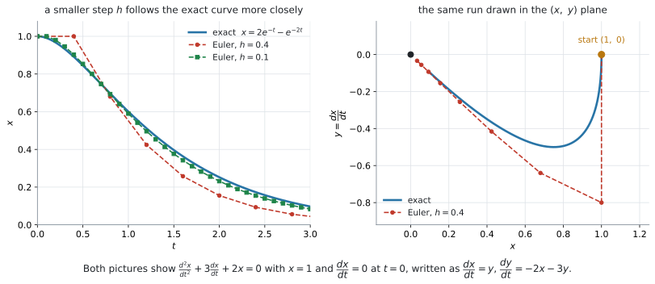
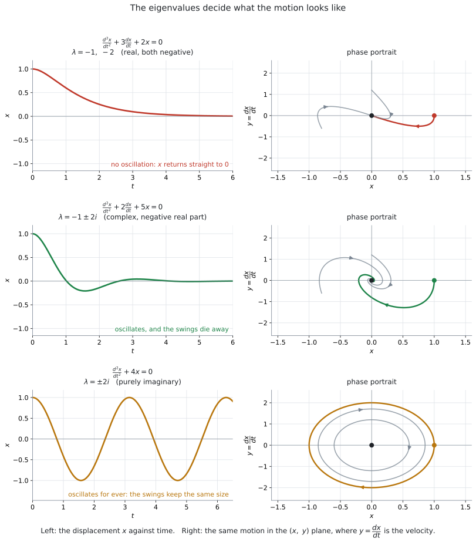

# AHL 5.18 — Second order differential equations（2階微分方程式） {#sec-ahl-5-18}

::: {.callout-note}
## What you should be able to do
- $\dfrac{d^{2}x}{dt^{2}} = f\!\left(x,\ \dfrac{dx}{dt},\ t\right)$ を、$y = \dfrac{dx}{dt}$ とおいて**連立1階**に書きかえられる。
- 書きかえた系に **Euler 法**を使い、表を作って進められる（[AHL 5.16b](ahl-5-16b.qmd)）。
- $\dfrac{d^{2}x}{dt^{2}} + a\dfrac{dx}{dt} + bx = 0$ を**行列の形**に書き、eigenvalue（固有値）を求められる。
- 実で異なる固有値のとき、**厳密解**を書き、初期条件から定数を決められる（[AHL 5.17a](ahl-5-17a.qmd)）。
- 固有値の型から、**振動するかどうか**と**おさまるかどうか**を言える。
- phase portrait（相図）の縦軸が**速度**であることを説明できる。
:::

::: {.callout-important}
## 新しいのは「書きかえ」の一手だけです
これまでのページで扱ってきたのは、**1階**の微分方程式でした。

- [AHL 5.16b](ahl-5-16b.qmd) … 連立1階を **Euler 法**で数値的に追う
- [AHL 5.17a](ahl-5-17a.qmd) … 連立1階の**厳密解**と phase portrait

このページで出てくるのは、$\dfrac{d^{2}x}{dt^{2}}$ という**2階**の式です。そのままでは、どちらの方法も使えません。

**そこで、$y = \dfrac{dx}{dt}$ とおきます。** これだけで、2階の式が**連立1階**に変わり、上の $2$ つがそのまま使えるようになります。

シラバスも、この書きかえを名指ししています。

> Write as coupled first order equations $\dfrac{dx}{dt} = y$ and $\dfrac{dy}{dt} = f(x,\ y,\ t)$.

**新しい公式も、新しい電卓機能もありません。** 覚えることは、この一手だけです。
:::

::: {.callout-note}
## AHL 5.18 専用の欄は、公式集にありません
AI HL の公式集は **5.17 で終わっています。** 5.18 の欄は印刷されていません。

使うのは、すでにある $2$ つです。

- **5.16 の欄**（$2$ つ目）… 連立系の Euler 法
- **5.17 の欄** … 連立系の厳密解 $\mathbf{x} = A\mathbf{p}_1 e^{\lambda_1 t} + B\mathbf{p}_2 e^{\lambda_2 t}$

**書きかえたあとは、いつもの $2$ つ**というわけです。

**ただし、$\det(M - \lambda I) = 0$ は公式集に載っていません**（[AHL 5.17b](ahl-5-17b.qmd)）。**これは覚えておく必要があります。**
:::

## The idea

### 1. 2階の式は、そのままでは進められません {#idea}

たとえば、ばねにつるしたおもりの動きは

$$
\frac{d^{2}x}{dt^{2}} + 3\frac{dx}{dt} + 2x = 0
$$ {#eq-ahl518-spring}

のような式で表されます。$x$ は「つりあいの位置からのずれ」、$t$ は時刻です。

**Euler 法は、この式には使えません。** [AHL 5.16a](ahl-5-16a.qmd#formula) の公式は

$$
y_{n+1} = y_n + h \times f(x_n,\ y_n)
$$

でした。**このページでは、動く量が $x$、独立変数が時刻 $t$ です。** ですから文字を $y \to x$、$x \to t$ と読みかえます。

$$
x_{n+1} = x_n + h \times f(x_n,\ t_n)
$$

右辺に要るのは $\dfrac{dx}{dt}$ です。ところが上の式が教えてくれるのは $\dfrac{d^{2}x}{dt^{2}}$ のほうで、**$\dfrac{dx}{dt}$ そのものは書かれていません。**

そこで、**$\dfrac{dx}{dt}$ にも名前を付けて、いっしょに追いかけます。**

### 2. $y = \dfrac{dx}{dt}$ とおくと、連立1階になります {#convert}

**$\dfrac{dx}{dt}$ を $y$ と呼ぶ**ことにします。

$$
y = \frac{dx}{dt}
$$ {#eq-ahl518-sub}

すると $2$ 本の式が手に入ります。

**$1$ 本目**は、いま決めたことをそのまま書いたものです。

$$
\frac{dx}{dt} = y
$$

**$2$ 本目**は、もとの2階の式です。$\dfrac{d^{2}x}{dt^{2}}$ は「$\dfrac{dx}{dt}$ の微分」、つまり $\dfrac{dy}{dt}$ ですから

$$
\frac{d^{2}x}{dt^{2}} = \frac{d}{dt}\!\left(\frac{dx}{dt}\right) = \frac{dy}{dt}
$$

と置きかえられます。まとめると

$$
\boxed{\ \frac{d^{2}x}{dt^{2}} = f\!\left(x,\ \frac{dx}{dt},\ t\right) \quad \Longrightarrow \quad \frac{dx}{dt} = y, \qquad \frac{dy}{dt} = f(x,\ y,\ t)\ }
$$ {#eq-ahl518-convert}

**これで、$x$ と $y$ の連立1階になりました。** ここから先は [AHL 5.16b](ahl-5-16b.qmd) と [AHL 5.17a](ahl-5-17a.qmd) の内容です。

#### 書きかえの手順は $3$ つです {#steps}

1. $y = \dfrac{dx}{dt}$ とおき、**$1$ 本目**に $\dfrac{dx}{dt} = y$ と書く
2. もとの式を $\dfrac{d^{2}x}{dt^{2}} = \ldots$ の形に直す
3. 右辺の $\dfrac{dx}{dt}$ をすべて $y$ に書きかえ、左辺を $\dfrac{dy}{dt}$ にする

@eq-ahl518-spring でやってみます。まず $\dfrac{d^{2}x}{dt^{2}} = -2x - 3\dfrac{dx}{dt}$ と直し、$\dfrac{dx}{dt}$ を $y$ にします。

$$
\frac{dx}{dt} = y, \qquad \frac{dy}{dt} = -2x - 3y
$$ {#eq-ahl518-spring2}

::: {.callout-important}
## $y$ は、$x$ の「速さ」です
$y = \dfrac{dx}{dt}$ は、**$x$ が変わる速さ**です。ばねの問題なら、おもりの**速度**そのものです。

ですから、**初期条件は $2$ つ**必要です。「どこにいるか」（$x$ の値）だけでは足りず、「どちらへどれくらいの速さで動いているか」（$y$ の値）も要ります。

たとえば `released from rest`（静かに手をはなす）と書かれ、そのときの位置が $x = 1$ なら

$$
x = 1, \qquad y = 0 \qquad (t = 0)
$$

です。**`from rest`（静止した状態から）は $y = 0$** という意味です。
:::

::: {.callout-warning}
## $y$ は、新しい未知の関数です
$y$ は「もう $1$ つの量」ではなく、**$x$ の導関数に付けた名前**です。ですから $x$ と $y$ は独立ではありません。

このことは、答えを見ると分かります。$x$ の式が出たら、$y$ はそれを微分したものになっているはずです。**そこが検算になります。**
:::

### 3. Euler 法は、5.16b のままです {#euler}

書きかえてしまえば、使う公式は [AHL 5.16b](ahl-5-16b.qmd#formula) の公式集の欄そのままです。

$$
x_{n+1} = x_n + h \times y_n
$$

$$
y_{n+1} = y_n + h \times f_2(x_n,\ y_n,\ t_n)
$$

$$
t_{n+1} = t_n + h
$$

**$1$ 本目の右辺が $y_n$ になっている**ところが、このページらしいところです。$f_1(x,\ y,\ t) = y$ だからです。$f_2$ のほうは、**もとの $2$ 階の式の右辺 $f$ そのもの**です。

::: {.callout-important}
## 新しい値を使わないでください
$y_{n+1}$ を計算するときに使うのは、**$x_n$ と $y_n$**（古い値）です。さきに求めた $x_{n+1}$ を入れてはいけません（[AHL 5.16b](ahl-5-16b.qmd#old)）。

$1$ 行ぶんを全部そろえてから、次の行へ進みます。
:::

@eq-ahl518-spring2 を、$x = 1$、$y = 0$、$h = 0.1$ から $1$ 歩進めてみます。

$$
x_1 = 1 + 0.1 \times 0 = 1
$$

$$
y_1 = 0 + 0.1 \times (-2 \times 1 - 3 \times 0) = -0.2
$$

$t = 0.1$ のとき $x \approx 1$、$y \approx -0.2$ です。**位置はまだほとんど動いていませんが、速度は負になりました。** おもりが動きはじめたところです。

{#fig-ahl518-euler width=100%}

@fig-ahl518-euler の左を見てください。**$h$ を小さくするほど、Euler 法の折れ線は本当の曲線に近づきます**（[AHL 5.16a](ahl-5-16a.qmd#h)）。右は、そのうち $h = 0.4$ の計算を $(x,\ y)$ 平面に描いたものです。

### 4. $\dfrac{d^{2}x}{dt^{2}} + a\dfrac{dx}{dt} + bx = 0$ を行列にする {#matrix}

シラバスは、$2$ 階の式のうち**この形**を名指ししています。

> Solutions of $\dfrac{d^{2}x}{dt^{2}} + a\dfrac{dx}{dt} + bx = 0$ can also be investigated using the phase portrait method in AHL 5.17 above.

書きかえると

$$
\frac{dx}{dt} = y, \qquad \frac{dy}{dt} = -bx - ay
$$

です。右辺が **$ax + by$ の形**（$x$ と $y$ の項だけで、定数項も $t$ もありません）なので、[AHL 5.17a](ahl-5-17a.qmd) の方法がそのまま使えます。行列に書くと

$$
\frac{d\mathbf{x}}{dt} = M\mathbf{x}, \qquad M = \begin{pmatrix} 0 & 1 \\ -b & -a \end{pmatrix}
$$ {#eq-ahl518-matrix}

となります。

::: {.callout-important}
## $1$ 行目は、いつも $(0,\ 1)$ です
$M$ の $1$ 行目は $\dfrac{dx}{dt} = y$ を表しています。$x$ の係数が $0$、$y$ の係数が $1$ なので、**どんな $a$、$b$ でも $(0,\ 1)$** です。

変わるのは $2$ 行目だけで、**もとの式の係数の符号を変えて並べます。**

$$
\frac{d^{2}x}{dt^{2}} + 3\frac{dx}{dt} + 2x = 0 \quad \Longrightarrow \quad M = \begin{pmatrix} 0 & 1 \\ -2 & -3 \end{pmatrix}
$$

$-2$ が $x$ の係数、$-3$ が $\dfrac{dx}{dt}$ の係数から来ています。**順番が入れかわる**ので、気をつけてください。
:::

### 5. 実で異なる固有値のときは、厳密解が書けます {#exact}

あとは [AHL 5.17a](ahl-5-17a.qmd#general) のとおりです。$\det(M - \lambda I) = 0$ から固有値を出し、公式集の式にあてはめます。

$$
\mathbf{x} = A\mathbf{p}_1 e^{\lambda_1 t} + B\mathbf{p}_2 e^{\lambda_2 t}
$$

この形の $M$ には、うれしい性質があります。

::: {.callout-tip}
## eigenvector は、いつも $\binom{1}{\lambda}$ です
$M = \begin{pmatrix} 0 & 1 \\ -b & -a \end{pmatrix}$ の固有値 $\lambda$ に対する eigenvector は

$$
\mathbf{p} = \binom{1}{\lambda}
$$ {#eq-ahl518-vec}

です。$(M - \lambda I)\mathbf{p} = \mathbf{0}$ の $1$ 行目が $-\lambda p_1 + p_2 = 0$、つまり $p_2 = \lambda p_1$ になるからです。

**$\lambda$ を求めたら、eigenvector はもう書けています。** 検算にも使えます。
:::

したがって

$$
x = Ae^{\lambda_1 t} + Be^{\lambda_2 t}, \qquad y = A\lambda_1 e^{\lambda_1 t} + B\lambda_2 e^{\lambda_2 t}
$$ {#eq-ahl518-exact}

です。**$y$ は $x$ を微分したものになっています。** @eq-ahl518-sub のとおりで、これが検算になります。

$A$ と $B$ は、$t = 0$ の $2$ つの条件から決めます。

$$
x(0) = A + B, \qquad y(0) = A\lambda_1 + B\lambda_2
$$

::: {.callout-warning}
## この課程で厳密解を求めるのは、実で異なる固有値のときだけです
複素数の固有値でも、解の式そのものは存在します。ただし、**この課程では求められていません。** シラバスは、[AHL 5.17a](ahl-5-17a.qmd) でこう限定しています。

> Calculation of exact solutions is only required for the case of **real distinct eigenvalues**.

固有値が**複素数**のときは、式を書くのではなく**絵で読みます**（[AHL 5.17b](ahl-5-17b.qmd)・[第6節](#damping)）。

固有値が**重解**（$\lambda_1 = \lambda_2$）になる場合は、**この課程では出題されません。** シラバスの AHL 5.17 に、こう書かれているからです。

> Systems will have **distinct, non-zero, eigenvalues**.
:::

### 6. 固有値の型で、動き方が決まります {#damping}

$M$ の特性方程式は

$$
\det(M - \lambda I) = \lambda^{2} + a\lambda + b = 0
$$ {#eq-ahl518-char}

です。ですから、**$a$ と $b$ を見れば、動き方の見当がつきます。** 判別式を

$$
\Delta = a^{2} - 4b
$$

とおきます。解の公式から

$$
\lambda = \frac{-a \pm \sqrt{\Delta}}{2}
$$ {#eq-ahl518-lambda}

ですから、**$\Delta < 0$ のとき、$2$ つの固有値の実部はどちらも $-\dfrac{a}{2}$** です。

{#fig-ahl518-cases width=100%}

| $a$ と $b$ | 固有値 | 動き方 | 図 |
|---|---|---|---|
| $a > 0$、$b > 0$、$\Delta > 0$ | 実で異なる、**両方負** | **振動せずに** $0$ へ戻る | 上の行 |
| $a > 0$、$b > 0$、$\Delta < 0$ | 複素数、**実部が負** | **振動しながら** $0$ へ戻る | 中の行（[AHL 5.17b](ahl-5-17b.qmd)） |
| $a = 0$、$b > 0$ | **純虚数** | **振動が続く**（大きさが変わらない） | 下の行（[AHL 5.17b](ahl-5-17b.qmd)） |
| $a < 0$、$b > 0$、$\Delta < 0$ | 複素数、**実部が正** | **振動しながら大きくなる** | [AHL 5.17b](ahl-5-17b.qmd) |
| $b < 0$ | 実で異なる、**異符号** | ほとんどの出発点で**離れていく**（saddle point） | [AHL 5.17a](ahl-5-17a.qmd#saddle) |

: 固有値と動き方 {#tbl-ahl518-cases}

::: {.callout-note}
## $a$ は「ブレーキ」の強さです
ばねの問題なら、$a\dfrac{dx}{dt}$ の項は**速さに比例してじゃまをする力**（空気の抵抗のような、速さに比例する抵抗）を表しています。

境目は $\Delta = a^{2} - 4b = 0$、つまり $a = 2\sqrt{b}$ です（$b > 0$ のとき）。

- $a = 0$ … じゃまがないので、**いつまでも揺れ続けます**（@fig-ahl518-cases の下の行）
- $0 < a < 2\sqrt{b}$（$\Delta < 0$）… **揺れながら、だんだんおさまります**（中の行）
- $a > 2\sqrt{b}$（$\Delta > 0$）… **揺れる前におさまります**（上の行）

**$2$ 階の式を、自分で立てる必要はありません**（$1$ 階の式をことばから立てる問題は [AHL 5.14](ahl-5-14.qmd) で出ます）。シラバスにこう書かれています。

> Understanding the occurrence of simple second order differential equations in physical phenomena would aid understanding but **in examinations the equation will be given.**

問われるのは、**与えられた式を書きかえて、解いて、動きを言葉で説明する**ところです。
:::

::: {.callout-warning}
## `overdamped` のような英語は、この課程の用語ではありません
物理では、上の表の $1$ 行目を `overdamped`、$2$ 行目を `underdamped` と呼びます。ただし、**AI HL のシラバスにはこれらの語はありません。**

答案では、$\lambda$ の型と、**動きの言葉**で書いてください。

::: {.model-answer}
**試験ではこう書く**

*The eigenvalues are real and both negative, so $x$ returns to $0$ without oscillating.*

*The eigenvalues are complex with negative real part, so $x$ oscillates with decreasing amplitude and tends to $0$.*
:::
:::

### 7. phase portrait の縦軸は「速度」です {#sketch}

@fig-ahl518-cases の右の列が phase portrait です。上の行が [AHL 5.17a](ahl-5-17a.qmd#sketch)、中と下の行が [AHL 5.17b](ahl-5-17b.qmd) と同じ絵ですが、**この項目では縦軸に意味があります。**

- **横軸 $x$** … いまの位置
- **縦軸 $y = \dfrac{dx}{dt}$** … いまの速度

ですから、絵の読み方も具体的になります。

| 絵の場所 | 意味 |
|---|---|
| $x$ 軸を横切る（$y = 0$） | **速度が $0$**。折り返す瞬間です |
| $y$ 軸を横切る（$x = 0$） | **つりあいの位置**を通過する瞬間 |
| 原点 | 動かずに止まっている状態 |
| 原点に近づく | **おさまっていく** |

: phase portrait の読み方 {#tbl-ahl518-read}

**閉じた輪**（下の行）は、**同じ動きがくり返される**ことを表しています。開いて原点に巻きつく渦は、**くり返しながら小さくなっていく**ことを表しています。

### 8. スプレッドシートで {#tech}

シラバスの Use of technology に、こう書かれています。

> Use of spreadsheets to generate values.

列は $3$ つ（$t$、$x$、$y$）で足ります。$1$ 本目の式が $\dfrac{dx}{dt} = y$ なので、**$x$ の列は「$1$ つ上の $x$ に $h \times$（$1$ つ上の $y$）を足すだけ」**です。やり方は [GDC 第1節](#gdc-sheet)にあります。

## Why it works

::: {.callout-tip collapse="true"}
## クリックすると開きます

### なぜ書きかえてよいのか {#why}

$y = \dfrac{dx}{dt}$ とおいたとき、$2$ 本の式は**もとの式と同じことを言っています。**

連立系の解 $(x,\ y)$ があったとします。$1$ 本目から $y = \dfrac{dx}{dt}$ なので、$2$ 本目の左辺 $\dfrac{dy}{dt}$ は $\dfrac{d^{2}x}{dt^{2}}$ です。ですから $2$ 本目は

$$
\frac{d^{2}x}{dt^{2}} = f\!\left(x,\ \frac{dx}{dt},\ t\right)
$$

と同じ式になります。**逆向きも同じです。** もとの式の解 $x$ に対して $y = \dfrac{dx}{dt}$ と決めれば、$2$ 本ともみたされます。

**情報が増えても減ってもいません。** 名前を $1$ つ増やして、$2$ 階を $1$ 階に「ならした」だけです。

### なぜ行列が $\begin{pmatrix} 0 & 1 \\ -b & -a \end{pmatrix}$ になるのか {#why-matrix}

$\dfrac{d^{2}x}{dt^{2}} + a\dfrac{dx}{dt} + bx = 0$ を $\dfrac{d^{2}x}{dt^{2}} = \ldots$ の形にすると

$$
\frac{d^{2}x}{dt^{2}} = -a\frac{dx}{dt} - bx
$$

です。$\dfrac{dx}{dt}$ を $y$ に書きかえて

$$
\frac{dy}{dt} = -bx - ay
$$

となります。**$x$ の係数が $-b$、$y$ の係数が $-a$。** これが行列の $2$ 行目です。$1$ 行目は $\dfrac{dx}{dt} = 0 \cdot x + 1 \cdot y$ なので $(0,\ 1)$ です。

### 特性方程式が、もとの式とそっくりになります {#why-char}

$M = \begin{pmatrix} 0 & 1 \\ -b & -a \end{pmatrix}$ について

$$
\det(M - \lambda I) = \begin{vmatrix} -\lambda & 1 \\ -b & -a-\lambda \end{vmatrix} = (-\lambda)(-a-\lambda) - (1)(-b) = \lambda^{2} + a\lambda + b
$$

です。もとの式で $\dfrac{d^{2}x}{dt^{2}} \to \lambda^{2}$、$\dfrac{dx}{dt} \to \lambda$、$x \to 1$ と置きかえたものと**同じ形**になっています。

::: {.callout-warning}
これは**検算に使ってください。** 答案には、まず $M$ を書きます。**$M$ を書かずに $\lambda^{2} + a\lambda + b = 0$ から始めると、どこから出したのかが読めません。**

$M$ を書いたあとは、[AHL 5.17a](ahl-5-17a.qmd#general) のとおり、$\det(M - \lambda I) = 0$ か、$\lambda^{2} - (\text{対角の和})\lambda + \det M = 0$ のどちらで進めても構いません。ただし `Find the eigenvalues` と問われたときは、**$\det(M - \lambda I) = 0$ の行を残す**のが確実です。
:::
:::

## Worked examples

::: {.callout-note appearance="simple"}
問題文は英語です。意味が理解できなかったら、問題文の下の「**日本語訳**」を開いてください。解説は日本語です。
:::

::: {#exm-ahl518-euler}
[The displacement $x$ of a mass on a spring, at time $t$ seconds, satisfies]{.q-en}

$$
\frac{d^{2}x}{dt^{2}} + 3\frac{dx}{dt} + 2x = 0
$$

[The mass is released from rest at $x = 1$, so that $x = 1$ and $\dfrac{dx}{dt} = 0$ when $t = 0$.]{.q-en}

**(a)** [Write the equation as two coupled first order differential equations.]{.q-en}

**(b)** [Use Euler's method with a step length of $h = 0.1$ to find approximations for $x$ and $\dfrac{dx}{dt}$ when $t = 0.2$.]{.q-en}

**(c)** [Interpret your value of $\dfrac{dx}{dt}$ when $t = 0.2$ in the context of the motion.]{.q-en}

<details class="jp-trans">
<summary>日本語訳</summary>

ばねにつるしたおもりの、時刻 $t$ 秒における変位 $x$ は、上の式をみたします。

`displacement` は「変位」、`released from rest` は「静止した状態から手をはなす」、`step length` は「刻み幅」という意味です。

おもりは $x = 1$ の位置で静かにはなされます。つまり $t = 0$ のとき $x = 1$、$\dfrac{dx}{dt} = 0$ です。

**(a)** この式を、$2$ 本の連立1階微分方程式として書きなさい。

**(b)** 刻み幅 $h = 0.1$ の Euler 法を使って、$t = 0.2$ のときの $x$ と $\dfrac{dx}{dt}$ の近似値を求めなさい。

**(c)** $t = 0.2$ のときの $\dfrac{dx}{dt}$ の値を、運動の文脈で解釈しなさい。

</details>

---

**(a)** $y = \dfrac{dx}{dt}$ とおきます（[第2節](#convert)）。もとの式を $\dfrac{d^{2}x}{dt^{2}} = -2x - 3\dfrac{dx}{dt}$ と直し、$\dfrac{dx}{dt}$ を $y$ にします。

$$
\frac{dx}{dt} = y, \qquad \frac{dy}{dt} = -2x - 3y
$$

**(b)** $2$ 歩です。**まず表を作ります**（[AHL 5.16a](ahl-5-16a.qmd#table)）。$1$ 行ぶんを全部そろえてから、次の行へ進みます（[第3節](#euler)）。

| $n$ | $t_n$ | $x_n$ | $y_n$ |
|---|---|---|---|
| $0$ | $0$ | $1$ | $0$ |
| $1$ | $0.1$ | $1$ | $-0.2$ |
| $2$ | $0.2$ | $0.98$ | $-0.34$ |

: $h = 0.1$ の Euler 法 {#tbl-ahl518-table}

計算は、こうです。

**$n = 0$：** $t_0 = 0$、$x_0 = 1$、$y_0 = 0$

$$
x_1 = 1 + 0.1 \times 0 = 1
$$

$$
y_1 = 0 + 0.1 \times (-2 \times 1 - 3 \times 0) = -0.2
$$

**$n = 1$：** $t_1 = 0.1$、$x_1 = 1$、$y_1 = -0.2$

$$
x_2 = 1 + 0.1 \times (-0.2) = 0.98
$$

$$
y_2 = -0.2 + 0.1 \times (-2 \times 1 - 3 \times (-0.2)) = -0.2 + 0.1 \times (-1.4) = -0.34
$$

$t = 0.2$ のとき $x \approx 0.98$、$\dfrac{dx}{dt} \approx -0.34$ です。

**検算。** $y_2$ の計算に使ったのは $x_1 = 1$ と $y_1 = -0.2$ で、$x_2 = 0.98$ ではありません ✓

**(c)** $\dfrac{dx}{dt}$ は**速度**です（[第2節](#convert)）。

::: {.model-answer}
**試験ではこう書く**

*The value $\dfrac{dx}{dt} \approx -0.34$ is the velocity of the mass. It is negative, so at $t = 0.2$ the mass is moving back towards $x = 0$, and it is doing so at about $0.34$ units per second.*
:::

（$\dfrac{dx}{dt} \approx -0.34$ はおもりの速度である。負なので、$t = 0.2$ ではおもりは $x = 0$ のほうへ、毎秒 $0.34$ ほどの速さで戻っている、という意味です。）

::: {.callout-note}
## 解答例（答案用紙にはこう書く）
**(a)**
$$
\frac{dx}{dt} = y, \qquad \frac{dy}{dt} = -2x - 3y
$$

**(b)**
$$
x_1 = 1, \qquad y_1 = -0.2
$$
$$
x_2 = 0.98, \qquad y_2 = -0.34
$$
$$
x \approx 0.98, \qquad \frac{dx}{dt} \approx -0.34 \quad (t = 0.2)
$$

**(c)** *$\dfrac{dx}{dt} \approx -0.34$ is the velocity. It is negative, so the mass is moving back towards $x = 0$ at $t = 0.2$.*
:::
:::

::: {#exm-ahl518-exact}
[For the same differential equation]{.q-en}

$$
\frac{d^{2}x}{dt^{2}} + 3\frac{dx}{dt} + 2x = 0
$$

[with $x = 1$ and $\dfrac{dx}{dt} = 0$ when $t = 0$:]{.q-en}

**(a)** [Write the coupled system in the form $\dfrac{d\mathbf{x}}{dt} = M\mathbf{x}$ and find the eigenvalues of $M$.]{.q-en}

**(b)** [Hence find an exact expression for $x$ in terms of $t$.]{.q-en}

**(c)** [An Euler approximation with $h = 0.1$ gives $x \approx 0.98$ when $t = 0.2$. Comment on this approximation.]{.q-en}

<details class="jp-trans">
<summary>日本語訳</summary>

同じ微分方程式について、$t = 0$ のとき $x = 1$、$\dfrac{dx}{dt} = 0$ とします。

`Hence` は「これを使って」、`an exact expression` は「厳密な式」という意味です。

**(a)** 連立系を $\dfrac{d\mathbf{x}}{dt} = M\mathbf{x}$ の形に書き、$M$ の固有値を求めなさい。

**(b)** これを使って、$x$ を $t$ の式で厳密に表しなさい。

**(c)** $h = 0.1$ の Euler 法では、$t = 0.2$ のとき $x \approx 0.98$ となります。この近似について述べなさい。

</details>

---

**(a)** [第4節](#matrix)のとおりです。$1$ 行目は $(0,\ 1)$、$2$ 行目は係数の符号を変えて並べます。

$$
M = \begin{pmatrix} 0 & 1 \\ -2 & -3 \end{pmatrix}
$$

$$
\det(M - \lambda I) = \begin{vmatrix} -\lambda & 1 \\ -2 & -3-\lambda \end{vmatrix} = \lambda^{2} + 3\lambda + 2 = 0
$$

$$
(\lambda + 1)(\lambda + 2) = 0 \quad \Longrightarrow \quad \lambda_1 = -1, \qquad \lambda_2 = -2
$$

**実で異なる**ので、厳密解が書けます（[第5節](#exact)）。

**(b)** eigenvector は $\binom{1}{\lambda}$ です（@eq-ahl518-vec）。

$$
\mathbf{p}_1 = \binom{1}{-1}, \qquad \mathbf{p}_2 = \binom{1}{-2}
$$

$$
\binom{x}{y} = A\binom{1}{-1}e^{-t} + B\binom{1}{-2}e^{-2t}
$$

初期条件を入れます。$t = 0$ で $x = 1$、$y = 0$ なので

$$
A + B = 1, \qquad -A - 2B = 0
$$

$2$ 本目から $A = -2B$。$1$ 本目に入れて $-2B + B = 1$、つまり $B = -1$、$A = 2$ です。

$$
x = 2e^{-t} - e^{-2t}
$$

**検算。** $\dfrac{dx}{dt} = -2e^{-t} + 2e^{-2t}$ で、$t = 0$ のとき $-2 + 2 = 0$ ✓ また $x(0) = 2 - 1 = 1$ ✓

**(c)** 厳密な値を出します。

$$
x(0.2) = 2e^{-0.2} - e^{-0.4} = 0.967
$$

::: {.model-answer}
**試験ではこう書く**

*The exact value is $x = 0.967$, while Euler's method with $h = 0.1$ gives $x \approx 0.980$. The approximation is too large by about $0.013$, which is about $1.3\%$. Euler's method uses the gradient at the start of each step, so over a curve that is bending it drifts away from the exact solution. Using a smaller step length would reduce the error.*
:::

（厳密な値は $0.967$ で、$h = 0.1$ の Euler 法は $0.980$ を返す。約 $0.013$、$1.3\%$ ほど大きい。Euler 法は各歩のはじめの傾きを使うので、曲がっている曲線ではずれていく。刻み幅を小さくすれば誤差は小さくなる、という意味です。）

::: {.callout-note}
## 解答例（答案用紙にはこう書く）
**(a)**
$$
M = \begin{pmatrix} 0 & 1 \\ -2 & -3 \end{pmatrix}
$$
$$
\det(M - \lambda I) = \lambda^{2} + 3\lambda + 2 = 0 \quad \Longrightarrow \quad \lambda = -1,\ -2
$$

**(b)**
$$
\mathbf{p}_1 = \binom{1}{-1}, \qquad \mathbf{p}_2 = \binom{1}{-2}
$$
$$
A + B = 1, \qquad -A - 2B = 0 \quad \Longrightarrow \quad A = 2,\ B = -1
$$
$$
x = 2e^{-t} - e^{-2t}
$$

**(c)** *The exact value is $x = 0.967$, so Euler's method overestimates by about $0.013$. Euler's method uses the gradient at the start of each step, so it drifts from a curve that is bending; a smaller $h$ would reduce the error.*
:::
:::

::: {#exm-ahl518-complex}
[A damped oscillation satisfies]{.q-en}

$$
\frac{d^{2}x}{dt^{2}} + 2\frac{dx}{dt} + 5x = 0
$$

**(a)** [Write the equation as a coupled system in matrix form and find the eigenvalues.]{.q-en}

**(b)** [Describe the motion of the oscillation.]{.q-en}

**(c)** [State, with a reason, whether an exact expression for $x$ is required in this course.]{.q-en}

<details class="jp-trans">
<summary>日本語訳</summary>

ある減衰振動は、上の式をみたします。

`damped oscillation` は「減衰する振動」、`Describe` は「述べなさい」という意味です。

**(a)** この式を連立系として行列の形に書き、固有値を求めなさい。

**(b)** この振動の運動について述べなさい。

**(c)** この課程で $x$ の厳密な式が必要かどうかを、理由を示して述べなさい。

</details>

---

**(a)**

$$
M = \begin{pmatrix} 0 & 1 \\ -5 & -2 \end{pmatrix}
$$

$$
\det(M - \lambda I) = \lambda^{2} + 2\lambda + 5 = 0
$$

判別式は $\Delta = 2^{2} - 4 \times 5 = -16 < 0$ なので、複素数です。

$$
\lambda = \frac{-2 \pm \sqrt{-16}}{2} = -1 \pm 2i
$$

**(b)** [第6節](#damping)の表の $2$ 行目です。

::: {.model-answer}
**試験ではこう書く**

*The eigenvalues are complex, so the motion oscillates. Their real part is $-1$, which is negative, so the size of each swing decreases and $x \to 0$ as $t$ increases. In the phase portrait the trajectory spirals inwards to the origin.*
:::

（固有値が複素数なので振動する。実部が $-1$ で負なので、揺れの大きさは小さくなり、$t$ が増えると $x \to 0$ になる。相図では、軌道が原点へ渦を巻いて入る、という意味です。）

**(c)** シラバスの限定を答えます。

::: {.model-answer}
**試験ではこう書く**

*No. Exact solutions are only required when the eigenvalues are real and distinct. Here they are complex, so only a qualitative description of the motion is required.*
:::

（不要である。厳密解が求められるのは固有値が実で異なるときだけで、ここでは複素数なので、運動の定性的な説明だけでよい、という意味です。）

::: {.callout-note}
## 解答例（答案用紙にはこう書く）
**(a)**
$$
M = \begin{pmatrix} 0 & 1 \\ -5 & -2 \end{pmatrix}
$$
$$
\lambda^{2} + 2\lambda + 5 = 0 \quad \Longrightarrow \quad \lambda = -1 \pm 2i
$$

**(b)** *The eigenvalues are complex, so the motion oscillates. The real part $-1$ is negative, so the swings get smaller and $x \to 0$; the trajectory spirals in to the origin.*

**(c)** *No. Exact solutions are only required for real distinct eigenvalues, and here the eigenvalues are complex.*
:::
:::

::: {#exm-ahl518-general}
[A driven system satisfies]{.q-en}

$$
\frac{d^{2}x}{dt^{2}} = \sin t - 0.5\frac{dx}{dt} - x
$$

[with $x = 0$ and $\dfrac{dx}{dt} = 1$ when $t = 0$.]{.q-en}

**(a)** [Write the equation as two coupled first order differential equations.]{.q-en}

**(b)** [Use Euler's method with $h = 0.1$ to find approximations for $x$ and $\dfrac{dx}{dt}$ when $t = 0.2$.]{.q-en}

**(c)** [Explain why the eigenvalue method cannot be used for this equation.]{.q-en}

<details class="jp-trans">
<summary>日本語訳</summary>

ある強制振動の系は、上の式をみたします。$t = 0$ のとき $x = 0$、$\dfrac{dx}{dt} = 1$ です。

`driven system` は「外から力を加えられている系」という意味です。

**(a)** この式を、$2$ 本の連立1階微分方程式として書きなさい。

**(b)** $h = 0.1$ の Euler 法を使って、$t = 0.2$ のときの $x$ と $\dfrac{dx}{dt}$ の近似値を求めなさい。

**(c)** この式に固有値の方法が使えない理由を説明しなさい。

</details>

---

**(a)** $y = \dfrac{dx}{dt}$ とおくだけです。右辺の $t$ は、そのまま残します。

$$
\frac{dx}{dt} = y, \qquad \frac{dy}{dt} = \sin t - 0.5y - x
$$

**(b)** 右辺に $t$ があるので、**$t$ の値も使います**（[AHL 5.16b](ahl-5-16b.qmd#formula)）。

**$n = 0$：** $t_0 = 0$、$x_0 = 0$、$y_0 = 1$

$$
x_1 = 0 + 0.1 \times 1 = 0.1
$$

$$
y_1 = 1 + 0.1 \times (\sin 0 - 0.5 \times 1 - 0) = 1 + 0.1 \times (-0.5) = 0.95
$$

**$n = 1$：** $t_1 = 0.1$、$x_1 = 0.1$、$y_1 = 0.95$

$$
x_2 = 0.1 + 0.1 \times 0.95 = 0.195
$$

$$
y_2 = 0.95 + 0.1 \times (\sin 0.1 - 0.5 \times 0.95 - 0.1) = 0.902
$$

$t = 0.2$ のとき $x \approx 0.195$、$\dfrac{dx}{dt} \approx 0.902$ です。

**検算。** 電卓は **radian** にしておきます。$\sin 0.1 = 0.0998$ です。degree のままだと $0.00175$ になり、答えが変わります。

**(c)** [第4節](#matrix)が使えるのは、右辺が $ax + by$ の形のとき、つまり **$x$ と $y$ の項だけ**でできているときです。定数項や $t$ の項があると、この形になりません（[AHL 5.17a](ahl-5-17a.qmd#idea)）。

::: {.model-answer}
**試験ではこう書く**

*The eigenvalue method applies to a system of the form $\dfrac{dx}{dt} = ax + by$, $\dfrac{dy}{dt} = cx + dy$, in which the right hand sides contain only $x$ and $y$. Here $\dfrac{dy}{dt}$ contains the term $\sin t$, which depends on $t$, so the system cannot be written as $\dfrac{d\mathbf{x}}{dt} = M\mathbf{x}$ and Euler's method must be used instead.*
:::

（固有値の方法は、右辺が $x$ と $y$ だけでできている系に使える。ここでは $\dfrac{dy}{dt}$ に $t$ による項 $\sin t$ があるので、$\dfrac{d\mathbf{x}}{dt} = M\mathbf{x}$ の形に書けず、Euler 法を使うことになる、という意味です。）

::: {.callout-note}
## 解答例（答案用紙にはこう書く）
**(a)**
$$
\frac{dx}{dt} = y, \qquad \frac{dy}{dt} = \sin t - 0.5y - x
$$

**(b)**
$$
x_1 = 0.1, \qquad y_1 = 0.95
$$
$$
x_2 = 0.195, \qquad y_2 = 0.902
$$
$$
x \approx 0.195, \qquad \frac{dx}{dt} \approx 0.902 \quad (t = 0.2)
$$

**(c)** *The right hand side contains $\sin t$, so the system is not of the form $\dfrac{dx}{dt} = ax + by$, $\dfrac{dy}{dt} = cx + dy$. It cannot be written as $\dfrac{d\mathbf{x}}{dt} = M\mathbf{x}$, so eigenvalues cannot be used and Euler's method is needed.*
:::
:::

## Common errors

::: {.callout-warning}
## 行列の $2$ 行目の符号を変えない
**誤り**：$\dfrac{d^{2}x}{dt^{2}} + 3\dfrac{dx}{dt} + 2x = 0$ から $M = \begin{pmatrix} 0 & 1 \\ 2 & 3 \end{pmatrix}$ とする。

$\dfrac{d^{2}x}{dt^{2}} = -2x - 3\dfrac{dx}{dt}$ と**移項してから**読むので、符号は反対になります（[第4節](#matrix)）。

**正しくは**：$M = \begin{pmatrix} 0 & 1 \\ -2 & -3 \end{pmatrix}$。
:::

::: {.callout-warning}
## 行列の $2$ 行目で、係数の順番を入れかえる
**誤り**：$M = \begin{pmatrix} 0 & 1 \\ -3 & -2 \end{pmatrix}$ とする。

$2$ 行目は $\dfrac{dy}{dt} = -bx - ay$ なので、**左の欄が $x$ の係数、右の欄が $\dfrac{dx}{dt}$ の係数**です。

**正しくは**：$-2$（$x$ の係数）が左、$-3$（$\dfrac{dx}{dt}$ の係数）が右です。
:::

::: {.callout-warning}
## Euler 法で、新しい $x$ を使ってしまう
**誤り**：$y_{n+1}$ を計算するときに、いま求めた $x_{n+1}$ を入れる。

$2$ 本の式は**同じ瞬間**の話なので、どちらの右辺にも $x_n$ と $y_n$（古い値）を入れます（[AHL 5.16b](ahl-5-16b.qmd#old)）。

**正しくは**：$1$ 行ぶんをそろえてから、次の行へ進みます。
:::

::: {.callout-warning}
## 初期条件を $1$ つしか使わない
**誤り**：$x(0)$ だけを使って $A$ と $B$ を決めようとする。

$2$ 階の式なので、定数は $A$ と $B$ の $2$ つあります。決めるには条件が $2$ つ要ります。

**正しくは**：$x(0) = A + B$ と $\dfrac{dx}{dt}(0) = A\lambda_1 + B\lambda_2$ を連立させます（[第5節](#exact)）。
:::

::: {.callout-warning}
## `from rest` を読み落とす
**誤り**：`released from rest` と書かれ、位置が $x = 2$ の問題を、$x(0) = 2$ だけと読む。

`from rest`（静止した状態から）は、**速度が $0$** という条件です。

**正しくは**：$x(0) = 2$ と $\dfrac{dx}{dt}(0) = 0$ の $2$ つです（[第2節](#convert)）。
:::

::: {.callout-warning}
## 複素固有値のときに、厳密解の式を書こうとする
**誤り**：$\lambda = -1 \pm 2i$ から $x = Ae^{(-1+2i)t} + Be^{(-1-2i)t}$ と書く。

この式そのものが誤りというわけではありませんが、**この課程では求められていません。** $A$ と $B$ が複素数になり、実数の $x$ に直す作業はシラバスの範囲外です。

**正しくは**：振動するか、おさまるかを**言葉で**述べます（[第6節](#damping)）。
:::

::: {.callout-warning}
## $y$ を、$x$ と無関係な量だと思う
**誤り**：$x$ の答えを出したあと、$y$ を別に求めなおす。

$y$ は $\dfrac{dx}{dt}$ に付けた名前です。$x$ が出たら、$y$ は**それを微分したもの**です（[第2節](#convert)）。

**正しくは**：$y = \dfrac{dx}{dt}$ を検算に使います。合っていなければ、$A$ か $B$ が違っています。
:::

::: {.callout-warning}
## $t$ が入っている式に、固有値の方法を使う
**誤り**：$\dfrac{d^{2}x}{dt^{2}} = \sin t - x$ を行列に書こうとする。

行列に書けるのは、右辺が **$ax + by$ の形**のときだけです。定数項や $t$ の項があると書けません（[第4節](#matrix)）。

**正しくは**：$t$ の項があるときは Euler 法を使います（@exm-ahl518-general）。
:::

## Using your GDC (TI-Nspire CX II)

::: {.callout-important}
## 試験モードでも使えます
Lists & Spreadsheet は Press-to-Test で止められていません（[AHL 5.16a](ahl-5-16a.qmd#gdc-sheet)）。**ここで説明する方法は、試験でもそのまま使えます。**
:::

### $3$ 列のスプレッドシートで進める {#gdc-sheet}

```
ctrl + doc → Add Lists & Spreadsheet
```

@exm-ahl518-euler（$h = 0.1$）を例にします。

| セル | 入れるもの | 意味 |
|---|---|---|
| `A1` | `0` | $t_0$ |
| `B1` | `1` | $x_0$ |
| `C1` | `0` | $y_0$ |
| `A2` | `=a1+0.1` | $t_{n+1} = t_n + h$ |
| `B2` | `=b1+0.1*c1` | $x_{n+1} = x_n + h y_n$ |
| `C2` | `=c1+0.1*(-2*b1-3*c1)` | $y_{n+1} = y_n + h f(x_n, y_n, t_n)$ |

: $2$ 階の式をスプレッドシートに入れる {#tbl-ahl518-sheet}

`A2`、`B2`、`C2` を選んで、下へコピーします。

```
menu → Data → Fill
```

うまく選べないときは、**列ごとに $1$ つずつ** `Fill` してください。結果は同じです。

::: {.callout-important}
## `B2` の式が、このページらしいところです
`B2` は `=b1+0.1*c1` です。**$x$ の列は、$1$ つ上の $y$ を足すだけ**になります。$\dfrac{dx}{dt} = y$ だからです。

`C2` の中に `b2` を書いてはいけません。**`b1` です**（[AHL 5.16b](ahl-5-16b.qmd#gdc-sheet)）。
:::

::: {.callout-warning}
## セル参照に角かっこは付けません
`a1`、`b1`、`c1` です。`a[]` は**列ぜんぶ**を指すので、ここでは使えません。
:::

右辺に $t$ があるときは、`A` 列を使います。@exm-ahl518-general なら

```
C2:  =c1+0.1*(sin(a1)-0.5*c1-b1)
```

です。**角度の設定を radian にしておいてください。**

### 固有値で場合分けを確かめる {#gdc-eig}

```
menu → 7: Matrix & Vector → B: Advanced → 4: Eigenvalues
```

$\begin{pmatrix} 0 & 1 \\ -b & -a \end{pmatrix}$ を入れます。実数が $2$ つ返れば厳密解が書け、複素数（`i` が付いた形）で返れば言葉で説明する問題です（[第6節](#damping)）。

::: {.callout-warning}
## 電卓の答えは、手計算の代わりにはなりません
`Find the eigenvalues` と問われたら、**$\det(M - \lambda I) = 0$ を書いて解く過程**が要ります。電卓は**検算**に使ってください（[AHL 5.17a](ahl-5-17a.qmd#gdc-eig)）。
:::

### 確かめ方 {#gdc-check}

$3$ つあります。

1. **$y$ が $x$ の導関数になっているか。** 出した $x$ を微分して、$y$ と一致するか見ます（[AHL 5.14](ahl-5-14.qmd#gdc-check)）
2. **$t = 0$ で初期条件に合うか。** $x(0)$ と $\dfrac{dx}{dt}(0)$ の $2$ つとも確かめます
3. **$h$ を半分**にして、Euler 法の答えが大きく変わらないか

::: {.callout-tip}
## 厳密解と Euler 法を、同じ表で見くらべられます
スプレッドシートに $4$ 列目を作り、`D2` に厳密解の式を入れておくと、**$1$ 行ごとの誤差**が見えます。@exm-ahl518-exact なら $2e^{-t} - e^{-2t}$ で、$t$ の欄には `a2` を入れます。

**$e$ は `e^x` のキーで入れてください。** キーボードの `e` の文字を打つと、ただの変数になってしまいます（[AHL 1.9](../01-number-and-algebra/ahl-1-9.qmd)）。

さらに $5$ 列目に `=b2-d2` を入れておくと、**誤差そのもの**が並びます。$h$ を変えたときに誤差がどう動くかも、その場で分かります。
:::

## Exercises

::: {.callout-note appearance="simple"}
各問題に、折りたたみが3つ付いています。**日本語訳**、**解答例**（答案用紙に書くべきこと。英語です）、**解説**（なぜそうなるか。日本語です）。

まず自分で解いて、次に解答例と見くらべてください。**解説は、合わなかったときだけ開けば十分です。**
:::

::: {.exercise-block}

[1]{.ex-no} [Write $\dfrac{d^{2}x}{dt^{2}} + 5\dfrac{dx}{dt} + 6x = 0$ as two coupled first order differential equations.]{.q-en}

<details class="jp-trans">
<summary>日本語訳</summary>

$\dfrac{d^{2}x}{dt^{2}} + 5\dfrac{dx}{dt} + 6x = 0$ を、$2$ 本の連立1階微分方程式として書きなさい。

</details>

::: {.callout-note collapse="true"}
## 解答例（答案用紙に書くこと）
$$
\frac{dx}{dt} = y, \qquad \frac{dy}{dt} = -6x - 5y
$$
:::

::: {.callout-tip collapse="true"}
## 解説
$y = \dfrac{dx}{dt}$ とおきます。もとの式を $\dfrac{d^{2}x}{dt^{2}} = -6x - 5\dfrac{dx}{dt}$ と直してから、$\dfrac{dx}{dt}$ を $y$ にします（[第2節](#convert)）。

**符号に気をつけてください。** 移項したので $-6$ と $-5$ です。
:::

::: {.ex-sep}
:::

[2]{.ex-no} [Write $\dfrac{d^{2}x}{dt^{2}} = 4t - x - 2\dfrac{dx}{dt}$ as two coupled first order differential equations.]{.q-en}

<details class="jp-trans">
<summary>日本語訳</summary>

$\dfrac{d^{2}x}{dt^{2}} = 4t - x - 2\dfrac{dx}{dt}$ を、$2$ 本の連立1階微分方程式として書きなさい。

</details>

::: {.callout-note collapse="true"}
## 解答例（答案用紙に書くこと）
$$
\frac{dx}{dt} = y, \qquad \frac{dy}{dt} = 4t - x - 2y
$$
:::

::: {.callout-tip collapse="true"}
## 解説
すでに $\dfrac{d^{2}x}{dt^{2}} = \ldots$ の形なので、$\dfrac{dx}{dt}$ を $y$ に書きかえるだけです。

**$4t$ はそのまま残します。** 書きかえるのは $\dfrac{dx}{dt}$ だけです。

この式は右辺に $t$ があるので、**固有値の方法は使えません**（[第4節](#matrix)）。Euler 法を使います。
:::

::: {.ex-sep}
:::

[3]{.ex-no} [Consider $\dfrac{d^{2}x}{dt^{2}} + 4\dfrac{dx}{dt} + 3x = 0$, with $x = 2$ and $\dfrac{dx}{dt} = 0$ when $t = 0$. Use Euler's method with $h = 0.1$ to find approximations for $x$ and $\dfrac{dx}{dt}$ when $t = 0.2$.]{.q-en}

<details class="jp-trans">
<summary>日本語訳</summary>

$\dfrac{d^{2}x}{dt^{2}} + 4\dfrac{dx}{dt} + 3x = 0$ を考えます。$t = 0$ のとき $x = 2$、$\dfrac{dx}{dt} = 0$ です。$h = 0.1$ の Euler 法を使って、$t = 0.2$ のときの $x$ と $\dfrac{dx}{dt}$ の近似値を求めなさい。

</details>

::: {.callout-note collapse="true"}
## 解答例（答案用紙に書くこと）
$$
\frac{dx}{dt} = y, \qquad \frac{dy}{dt} = -3x - 4y
$$
$$
x_1 = 2, \qquad y_1 = -0.6
$$
$$
x_2 = 1.94, \qquad y_2 = -0.96
$$
$$
x \approx 1.94, \qquad \frac{dx}{dt} \approx -0.96 \quad (t = 0.2)
$$
:::

::: {.callout-tip collapse="true"}
## 解説
**$n = 0$：** $x_1 = 2 + 0.1 \times 0 = 2$、$y_1 = 0 + 0.1 \times (-3 \times 2 - 4 \times 0) = -0.6$

**$n = 1$：** $x_2 = 2 + 0.1 \times (-0.6) = 1.94$、$y_2 = -0.6 + 0.1 \times (-3 \times 2 - 4 \times (-0.6)) = -0.6 + 0.1 \times (-3.6) = -0.96$

**$y_2$ に使うのは $x_1 = 2$ です。** $x_2 = 1.94$ ではありません（[第3節](#euler)）。

**検算。** $x$ は $2$ から減り、$y$ は負。おもりが $x = 0$ のほうへ動きはじめている、という形になっています ✓
:::

::: {.ex-sep}
:::

[4]{.ex-no} [Write $\dfrac{d^{2}x}{dt^{2}} + 5\dfrac{dx}{dt} + 6x = 0$ in the form $\dfrac{d\mathbf{x}}{dt} = M\mathbf{x}$ and find the eigenvalues of $M$.]{.q-en}

<details class="jp-trans">
<summary>日本語訳</summary>

$\dfrac{d^{2}x}{dt^{2}} + 5\dfrac{dx}{dt} + 6x = 0$ を $\dfrac{d\mathbf{x}}{dt} = M\mathbf{x}$ の形に書き、$M$ の固有値を求めなさい。

</details>

::: {.callout-note collapse="true"}
## 解答例（答案用紙に書くこと）
$$
M = \begin{pmatrix} 0 & 1 \\ -6 & -5 \end{pmatrix}
$$
$$
\det(M - \lambda I) = \lambda^{2} + 5\lambda + 6 = 0
$$
$$
(\lambda + 2)(\lambda + 3) = 0 \quad \Longrightarrow \quad \lambda = -2,\ -3
$$
:::

::: {.callout-tip collapse="true"}
## 解説
$1$ 行目は $(0,\ 1)$、$2$ 行目は $-6$（$x$ の係数）と $-5$（$\dfrac{dx}{dt}$ の係数）です（[第4節](#matrix)）。

$$
\det(M - \lambda I) = (-\lambda)(-5-\lambda) - (1)(-6) = \lambda^{2} + 5\lambda + 6
$$

**検算。** 対角の和は $-5$、$\det M$ は $6$ です。$\lambda_1 + \lambda_2 = -5$、$\lambda_1 \lambda_2 = 6$ になっています ✓
:::

::: {.ex-sep}
:::

[5]{.ex-no} [Using the eigenvalues from question 4, find an exact expression for $x$ if $x = 1$ and $\dfrac{dx}{dt} = 0$ when $t = 0$.]{.q-en}

<details class="jp-trans">
<summary>日本語訳</summary>

問題 4 で求めた固有値を使って、$t = 0$ のとき $x = 1$、$\dfrac{dx}{dt} = 0$ である場合の $x$ を、厳密な式で求めなさい。

</details>

::: {.callout-note collapse="true"}
## 解答例（答案用紙に書くこと）
$$
\mathbf{p}_1 = \binom{1}{-2}, \qquad \mathbf{p}_2 = \binom{1}{-3}
$$
$$
\binom{x}{y} = A\binom{1}{-2}e^{-2t} + B\binom{1}{-3}e^{-3t}
$$
$$
A + B = 1, \qquad -2A - 3B = 0
$$
$$
A = 3, \qquad B = -2
$$
$$
x = 3e^{-2t} - 2e^{-3t}
$$
:::

::: {.callout-tip collapse="true"}
## 解説
eigenvector は $\binom{1}{\lambda}$ です（@eq-ahl518-vec）。ですから $\binom{1}{-2}$ と $\binom{1}{-3}$。

$$
\binom{x}{y} = A\binom{1}{-2}e^{-2t} + B\binom{1}{-3}e^{-3t}
$$

$t = 0$ を入れると $A + B = 1$ と $-2A - 3B = 0$。$2$ 本目から $A = -\dfrac{3}{2}B$ で、$1$ 本目に入れて $B = -2$、$A = 3$ です。

**検算。** $\dfrac{dx}{dt} = -6e^{-2t} + 6e^{-3t}$ で、$t = 0$ のとき $-6 + 6 = 0$ ✓ $x(0) = 3 - 2 = 1$ ✓
:::

::: {.ex-sep}
:::

[6]{.ex-no} [For each of the following, state whether $x$ oscillates, and whether $x \to 0$ as $t$ increases. Give a reason in each case.]{.q-en}

**(a)** [$\dfrac{d^{2}x}{dt^{2}} + 6\dfrac{dx}{dt} + 5x = 0$]{.q-en}

**(b)** [$\dfrac{d^{2}x}{dt^{2}} + \dfrac{dx}{dt} + 4x = 0$]{.q-en}

**(c)** [$\dfrac{d^{2}x}{dt^{2}} + 9x = 0$]{.q-en}

<details class="jp-trans">
<summary>日本語訳</summary>

次のそれぞれについて、$x$ が振動するかどうかと、$t$ が増えるとき $x \to 0$ になるかどうかを述べなさい。それぞれ理由も書きなさい。

</details>

::: {.callout-note collapse="true"}
## 解答例（答案用紙に書くこと）
**(a)** *$\lambda^{2} + 6\lambda + 5 = 0$ gives $\lambda = -1,\ -5$: real and both negative. $x$ does not oscillate, and $x \to 0$.*

**(b)** *$\lambda^{2} + \lambda + 4 = 0$ has discriminant $1 - 16 = -15 < 0$, so the eigenvalues are complex with real part $-\dfrac{1}{2}$. $x$ oscillates, and $x \to 0$.*

**(c)** *$\lambda^{2} + 9 = 0$ gives $\lambda = \pm 3i$: purely imaginary. $x$ oscillates and does not tend to $0$; the swings keep the same size.*
:::

::: {.callout-tip collapse="true"}
## 解説
@tbl-ahl518-cases を、そのまま使う問題です。$\Delta = a^{2} - 4b$ の符号を見ます。

**(a)** $\Delta = 36 - 20 = 16 > 0$。実で異なり、和が $-6$、積が $5$ なので両方負です。

**(b)** $\Delta = 1 - 16 = -15 < 0$。複素数で、実部は $-\dfrac{a}{2} = -\dfrac{1}{2}$ です。

**(c)** $a = 0$ なので、ブレーキがありません。純虚数になり、揺れが止まりません。

ここは固有値そのものを問われていないので、$M$ を書かずに $\lambda^{2} + a\lambda + b = 0$ から始めて構いません（[Why it works](#why-char)）。**`Find the eigenvalues` と問われたときは、$M$ と $\det(M - \lambda I) = 0$ の行を残してください。**

::: {.model-answer}
**試験ではこう書く**

*(a) Real distinct negative eigenvalues, so no oscillation and $x \to 0$.*

*(b) Complex eigenvalues with negative real part, so $x$ oscillates with decreasing amplitude and $x \to 0$.*

*(c) Purely imaginary eigenvalues, so $x$ oscillates with constant amplitude and does not tend to $0$.*
:::
:::

::: {.ex-sep}
:::

[7]{.ex-no} [Consider $\dfrac{d^{2}x}{dt^{2}} - x = 0$.]{.q-en}

**(a)** [Find the eigenvalues of the corresponding matrix $M$.]{.q-en}

**(b)** [Describe what happens to $x$ as $t$ increases, for a starting point that is not the origin.]{.q-en}

<details class="jp-trans">
<summary>日本語訳</summary>

$\dfrac{d^{2}x}{dt^{2}} - x = 0$ を考えます。

**(a)** 対応する行列 $M$ の固有値を求めなさい。

**(b)** 原点でない点から出発したとき、$t$ が増えると $x$ がどうなるかを述べなさい。

</details>

::: {.callout-note collapse="true"}
## 解答例（答案用紙に書くこと）
**(a)**
$$
M = \begin{pmatrix} 0 & 1 \\ 1 & 0 \end{pmatrix}, \qquad \det(M - \lambda I) = \lambda^{2} - 1 = 0
$$
$$
\lambda = 1,\ -1
$$

**(b)** *The eigenvalues are real with opposite signs, so the origin is a saddle point. The term in $e^{t}$ grows, so for almost every starting point $|x|$ increases without limit as $t$ increases.*
:::

::: {.callout-tip collapse="true"}
## 解説
ここは $a = 0$、$b = -1$ です。$-b = 1$、$-a = 0$ なので

$$
M = \begin{pmatrix} 0 & 1 \\ 1 & 0 \end{pmatrix}
$$

$\Delta = a^{2} - 4b = 0 + 4 = 4 > 0$ で、$\det M = b = -1 < 0$。**異符号**なので saddle point です（@tbl-ahl518-cases のいちばん下の行）。

$x = Ae^{t} + Be^{-t}$ の形になり、$e^{t}$ の項が効いてきます。

::: {.model-answer}
**試験ではこう書く**

*The eigenvalues $1$ and $-1$ have opposite signs, so the origin is a saddle point. The solution contains a term in $e^{t}$, which grows, so $|x|$ increases without limit as $t$ increases.*
:::

**これは「おさまらない」場合です。** $b < 0$ だと、$x$ を引き戻す向きの力がありません。

::: {.callout-note appearance="simple"}
解答例が *almost every* と書いているのは、**例外が $1$ 本だけある**からです。$\mathbf{p}_2 = \binom{1}{-1}$ の直線の上から出発したときは $A = 0$ になり、$x = Be^{-t} \to 0$ です（[AHL 5.17a](ahl-5-17a.qmd#saddle)）。

saddle point では、この $1$ 本だけが原点に入っていきます。
:::
:::

::: {.ex-sep}
:::

[8]{.ex-no} [A phase portrait for $\dfrac{d^{2}x}{dt^{2}} + a\dfrac{dx}{dt} + bx = 0$ is drawn with $x$ on the horizontal axis and $y = \dfrac{dx}{dt}$ on the vertical axis. A trajectory crosses the horizontal axis at the point $(0.4,\ 0)$. Interpret this crossing in terms of the motion.]{.q-en}

<details class="jp-trans">
<summary>日本語訳</summary>

$\dfrac{d^{2}x}{dt^{2}} + a\dfrac{dx}{dt} + bx = 0$ の相図を、横軸 $x$、縦軸 $y = \dfrac{dx}{dt}$ で描きます。ある軌道が、点 $(0.4,\ 0)$ で横軸を横切ります。この横切りを、運動の言葉で解釈しなさい。

</details>

::: {.callout-note collapse="true"}
## 解答例（答案用紙に書くこと）
*On the horizontal axis $y = \dfrac{dx}{dt} = 0$, so the velocity is zero. At that moment the object is at $x = 0.4$ and is momentarily at rest, so it is turning round: it has stopped moving one way and is about to move the other way.*
:::

::: {.callout-tip collapse="true"}
## 解説
縦軸は**速度**です（[第7節](#sketch)）。ですから横軸の上では $y = 0$、つまり**速度が $0$** です。

位置は $x = 0.4$ で、そこで一瞬止まっています。**折り返しの瞬間**です。

::: {.model-answer}
**試験ではこう書く**

*At this point $\dfrac{dx}{dt} = 0$, so the object is momentarily at rest at $x = 0.4$. It is the turning point of the motion: the object stops there and then moves back the other way.*
:::

**「$x = 0$ を通る瞬間」ではありません。** それは縦軸を横切るときの話です。
:::

::: {.ex-sep}
:::

[9]{.ex-no} [Explain why two initial conditions are needed to determine the motion described by $\dfrac{d^{2}x}{dt^{2}} + a\dfrac{dx}{dt} + bx = 0$, whereas $\dfrac{dx}{dt} = kx$ needs only one.]{.q-en}

<details class="jp-trans">
<summary>日本語訳</summary>

$\dfrac{d^{2}x}{dt^{2}} + a\dfrac{dx}{dt} + bx = 0$ が表す運動を決めるには初期条件が $2$ つ必要で、$\dfrac{dx}{dt} = kx$ には $1$ つで足りる理由を説明しなさい。

</details>

::: {.callout-note collapse="true"}
## 解答例（答案用紙に書くこと）
*Writing $y = \dfrac{dx}{dt}$ turns the second order equation into a system in two unknown functions, $x$ and $y$, so its general solution contains two arbitrary constants $A$ and $B$. Two conditions are needed to determine them. The equation $\dfrac{dx}{dt} = kx$ has one unknown function and one arbitrary constant, so one condition is enough. Physically, knowing where the object is does not say how fast it is moving; both are needed.*
:::

::: {.callout-tip collapse="true"}
## 解説
`Explain why` なので、**式の理由と、場面の理由の両方**を書くと強い答案になります。

式のほうは、$y = \dfrac{dx}{dt}$ とおくと**未知の関数が $2$ つ**になり、一般解に $A$ と $B$ の $2$ つの定数が出ることです（[第5節](#exact)）。

場面のほうは、**「どこにいるか」だけでは動きが決まらない**ことです。同じ位置でも、右へ動いているか左へ動いているかで、その先はまったく変わります（[第2節](#convert)）。

::: {.model-answer}
**試験ではこう書く**

*Substituting $y = \dfrac{dx}{dt}$ gives a system in two unknown functions, so the general solution has two arbitrary constants and two conditions are needed. In context, the position alone does not determine the motion: the velocity at that instant is also needed.*
:::
:::

::: {.ex-sep}
:::

[10]{.ex-no} [A student writes $\dfrac{d^{2}x}{dt^{2}} + 7\dfrac{dx}{dt} + 12x = 0$ as $\dfrac{d\mathbf{x}}{dt} = M\mathbf{x}$ with $M = \begin{pmatrix} 0 & 1 \\ 7 & 12 \end{pmatrix}$. Identify the two errors and write down the correct matrix.]{.q-en}

<details class="jp-trans">
<summary>日本語訳</summary>

ある生徒が、$\dfrac{d^{2}x}{dt^{2}} + 7\dfrac{dx}{dt} + 12x = 0$ を $M = \begin{pmatrix} 0 & 1 \\ 7 & 12 \end{pmatrix}$ として $\dfrac{d\mathbf{x}}{dt} = M\mathbf{x}$ の形に書きました。$2$ つの誤りを指摘し、正しい行列を書きなさい。

</details>

::: {.callout-note collapse="true"}
## 解答例（答案用紙に書くこと）
*First, the signs are wrong. Rearranging gives $\dfrac{d^{2}x}{dt^{2}} = -12x - 7\dfrac{dx}{dt}$, so the entries are negative.*

*Second, the two entries are in the wrong order. The first column multiplies $x$ and the second column multiplies $y$, so $-12$ comes first and $-7$ second.*

$$
M = \begin{pmatrix} 0 & 1 \\ -12 & -7 \end{pmatrix}
$$
:::

::: {.callout-tip collapse="true"}
## 解説
$2$ 行目は $\dfrac{dy}{dt} = -12x - 7y$ です（[第4節](#matrix)）。

- **符号**：移項するので、$+12$ と $+7$ が $-12$ と $-7$ になります
- **順番**：左の欄が $x$ の係数、右の欄が $y$ の係数です。生徒は $7$ と $12$ を、もとの式に出てくる順に並べてしまっています

::: {.model-answer}
**試験ではこう書く**

*The signs should be negative, because $\dfrac{d^{2}x}{dt^{2}} = -12x - 7\dfrac{dx}{dt}$, and the entries should be in the order $-12$ then $-7$, since the first column multiplies $x$ and the second multiplies $y$. The correct matrix is $M = \begin{pmatrix} 0 & 1 \\ -12 & -7 \end{pmatrix}$.*
:::

**検算。** $\det(M - \lambda I) = \lambda^{2} + 7\lambda + 12$ が、もとの式の係数とそろっていれば正しい行列です（[Why it works](#why-char)）。$\lambda = -3,\ -4$ です。
:::

:::
