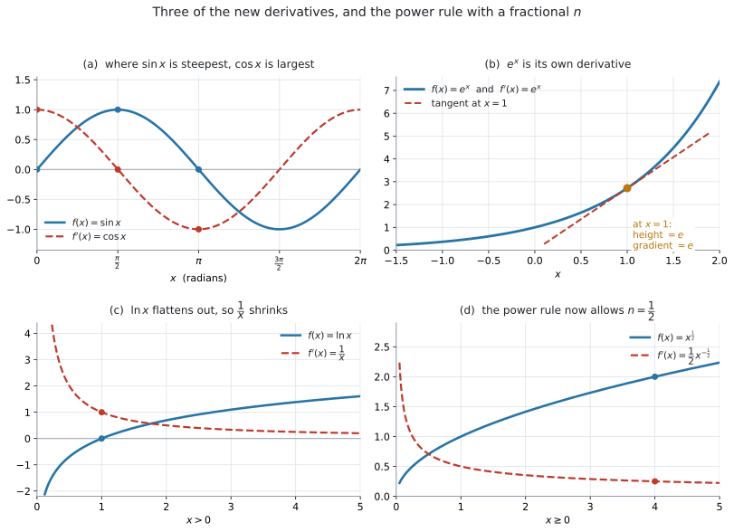
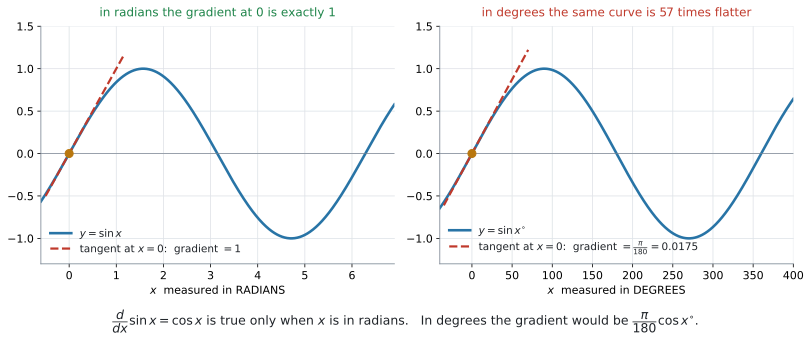

# AHL 5.9a — Derivatives of $\sin x$, $\cos x$, $\tan x$, $e^{x}$, $\ln x$ and $x^{n}$（三角関数・指数関数・対数関数と有理数乗の導関数） {#sec-ahl-5-9a}

::: {.callout-note}
## What you should be able to do
- $\sin x$、$\cos x$、$\tan x$、$e^{x}$、$\ln x$ の導関数を書ける。
- べき乗の公式 $f(x) = ax^{n} \Rightarrow f'(x) = anx^{\,n-1}$ を、**$n$ が分数のとき**にも使える。
- $\sqrt{x}$ や $\dfrac{4}{\sqrt{x}}$ を**べき乗の形に書き直してから**微分できる。
- 項がいくつあっても、**項ごとに**微分できる。
- 三角関数の微分の公式が **radian**（弧度）**のときだけ**成り立つことを説明できる。
- 電卓の `Angle` を `Radian` にしてから計算できる。
:::

::: {.callout-important}
## 公式集の 5.9 の欄（前半）
新しい導関数は $5$ つあり、**すべて印刷されています。**

$$
f(x) = \sin x \ \Rightarrow \ f'(x) = \cos x
$$ {#eq-ahl59a-sin}

$$
f(x) = \cos x \ \Rightarrow \ f'(x) = -\sin x
$$ {#eq-ahl59a-cos}

$$
f(x) = \tan x \ \Rightarrow \ f'(x) = \frac{1}{\cos^{2} x}
$$ {#eq-ahl59a-tan}

$$
f(x) = e^{x} \ \Rightarrow \ f'(x) = e^{x}
$$ {#eq-ahl59a-exp}

$$
f(x) = \ln x \ \Rightarrow \ f'(x) = \frac{1}{x}
$$ {#eq-ahl59a-ln}

**試験中に配られるので、覚える必要はありません。** 覚えるべきなのは、**どれを使う場面なのか**と、**電卓を radian にしておくこと**の $2$ つです。
:::

## The idea

### 1. SL では、べき乗しか微分できませんでした {#idea}

[SL 5.3](../../ai-sl/05-calculus/sl-5-3.qmd) で使った公式は、$1$ 本だけでした。

$$
f(x) = a x^{n} \ \Rightarrow \ f'(x) = a\,n\,x^{\,n-1}
$$ {#eq-ahl59a-power}

**この公式も、公式集の 5.3 の欄にあります。** ただし印刷されているのは $f(x) = x^{n} \Rightarrow f'(x) = nx^{\,n-1}$ で、**係数 $a$ が付いていません。** 試験に出るのは係数の付いた形なので、覚えるのは上の形にしてください（[SL 5.3](../../ai-sl/05-calculus/sl-5-3.qmd)）。

$3x^{5}$ も $\dfrac{6}{x^{2}} = 6x^{-2}$ も、これで微分できます。**けれども $\sin x$ や $e^{x}$ は、べき乗の形をしていません。** ですから、この公式では手が出ませんでした。

この **5.9a** で増えるのは、次の $2$ つです。

1. **$n$ が分数のときも使える**ようになる（$\sqrt{x}$ が微分できる）
2. **べき乗以外の $5$ つ**の導関数が加わる（$\sin$、$\cos$、$\tan$、$e^{x}$、$\ln x$）

シラバスの 5.9 は、これで終わりではありません。**$2$ つの式を組み合わせた形の微分**が [AHL 5.9b](ahl-5-9b.qmd) に、**同時に変わる $2$ つの量**の扱いが [AHL 5.9c](ahl-5-9c.qmd) にあります。このページは、その $2$ つの土台になります。

{#fig-ahl59a-derivs width=100%}

@fig-ahl59a-derivs に、$4$ つの例をまとめました。青が $f$、赤の破線が $f'$ です。

- (a) $\sin x$ がいちばん急なところ（$x = 0$）で、$\cos x$ がいちばん大きくなっています
- (b) $e^{x}$ は、高さと傾きが**いつも同じ数**です
- (c) $\ln x$ は右へ行くほど平らになり、それに合わせて $\dfrac{1}{x}$ が小さくなっています
- (d) $\sqrt{x}$ も、べき乗の公式で微分できるようになります

### 2. $n$ が分数でもよくなります {#rational}

シラバスの Content 欄は、この項目の $1$ 行目をこう書いています。

> The derivatives of $\sin x$, $\cos x$, $\tan x$, $e^{x}$, $\ln x$, $x^{n}$ where $n \in \mathbb{Q}$.

$n \in \mathbb{Q}$ は「$n$ は **rational number**（有理数、つまり分数で書ける数）」という意味です。SL のシラバスでは $n \in \mathbb{Z}$（整数）でした。

**公式そのものは変わりません。** 変わったのは、$n$ に入れてよい数の範囲だけです。

$$
f(x) = x^{\frac{1}{2}} \ \Rightarrow \ f'(x) = \frac{1}{2}x^{-\frac{1}{2}}
$$

$$
f(x) = x^{\frac{2}{3}} \ \Rightarrow \ f'(x) = \frac{2}{3}x^{-\frac{1}{3}}
$$

やることは SL のときと同じ $2$ 手です。**指数を前に下ろして掛け、指数から $1$ を引く**（[SL 5.3](../../ai-sl/05-calculus/sl-5-3.qmd#rule)）。

::: {.callout-note appearance="simple"}
$\dfrac{1}{2} - 1 = -\dfrac{1}{2}$、$\dfrac{2}{3} - 1 = -\dfrac{1}{3}$ です。**分数から $1$ を引くところ**で計算を間違える人が多いので、そこだけ声に出して確かめてください。
:::

#### 微分する前に、べき乗の形に書き直します {#rewrite}

試験の問題文は $x^{\frac{1}{2}}$ とは書かず、$\sqrt{x}$ と書いてきます。**そのままでは公式に入りません。** 先に書き直します。

| 問題文の形 | べき乗の形 | 微分すると |
|---|---|---|
| $\sqrt{x}$ | $x^{\frac{1}{2}}$ | $\dfrac{1}{2}x^{-\frac{1}{2}}$ |
| $\dfrac{1}{\sqrt{x}}$ | $x^{-\frac{1}{2}}$ | $-\dfrac{1}{2}x^{-\frac{3}{2}}$ |
| $\dfrac{4}{\sqrt{x}}$ | $4x^{-\frac{1}{2}}$ | $-2x^{-\frac{3}{2}}$ |
| $x\sqrt{x}$ | $x^{\frac{3}{2}}$ | $\dfrac{3}{2}x^{\frac{1}{2}}$ |
| $\sqrt[3]{x^{2}}$ | $x^{\frac{2}{3}}$ | $\dfrac{2}{3}x^{-\frac{1}{3}}$ |

: 根号をべき乗に直す {#tbl-ahl59a-rewrite}

**この書き直しは [SL 1.5](../../ai-sl/01-number-and-algebra/sl-1-5.qmd) の指数法則です。** 新しい規則ではありません。

::: {.callout-warning}
## 公式が使えるのは、微分できて、導関数の式も定義される範囲です
@tbl-ahl59a-rewrite の公式は、**もとの関数が微分可能で、導関数の式も定義される範囲**で使います。

- $\sqrt{x} = x^{\frac{1}{2}}$ の導関数 $\dfrac{1}{2\sqrt{x}}$ は、**$x > 0$** で使う式です。$x = 0$ では分母が $0$ になります
- $x^{\frac{2}{3}}$ は $x = 0$ でも**値はあります**（$0$ です）が、そこでは**微分できません**。導関数 $\dfrac{2}{3}x^{-\frac{1}{3}}$ の式は **$x \neq 0$** で使います

試験では domain が $x > 0$ と指定されていることがほとんどなので、実際に困ることは多くありません。**指定があったら、それに従ってください。**
:::

### 3. 新しい $5$ つの導関数 {#five}

@eq-ahl59a-sin から @eq-ahl59a-ln までの $5$ つを、表にまとめます。

| $f(x)$ | $f'(x)$ | 気をつけるところ |
|---|---|---|
| $\sin x$ | $\cos x$ | 符号は付きません |
| $\cos x$ | $-\sin x$ | **マイナスが付きます** |
| $\tan x$ | $\dfrac{1}{\cos^{2} x}$ | $2$ 乗するのは $\cos x$ 全体です。$\cos x = 0$ になる $x$ では考えません |
| $e^{x}$ | $e^{x}$ | **変わりません** |
| $\ln x$ | $\dfrac{1}{x}$ | $x > 0$ でだけ考えます |

: 新しい $5$ つ {#tbl-ahl59a-five}

::: {.callout-tip}
## $\sin \to \cos \to -\sin \to -\cos \to \sin$
$\sin x$ を微分すると $\cos x$、$\cos x$ を微分すると $-\sin x$ です。もう $2$ 回微分すると $\sin x$ に戻ります。

$$
\sin x \ \to \ \cos x \ \to \ -\sin x \ \to \ -\cos x \ \to \ \sin x
$$

**マイナスが出るのは $\cos$ を微分したとき**です。この向きだけ覚えておけば、符号で迷いません。
:::

#### $\tan x$ の $2$ 乗は、$\cos x$ 全体に付きます {#tan}

公式集は $\dfrac{1}{\cos^{2} x}$ と書いています。$\cos^{2}x$ は $(\cos x)^{2}$、つまり **$\cos x$ を計算してから $2$ 乗する**という意味です。

$$
\frac{1}{\cos^{2} x} = \frac{1}{(\cos x)^{2}}
$$

$\cos(x^{2})$ でも $\cos(2x)$ でもありません。$x = \dfrac{\pi}{4}$ で確かめます。

$$
\cos\frac{\pi}{4} = \frac{1}{\sqrt{2}} \quad \Longrightarrow \quad \frac{1}{\left(\frac{1}{\sqrt{2}}\right)^{2}} = \frac{1}{\frac{1}{2}} = 2
$$

**$\tan x$ の傾きは $x = \dfrac{\pi}{4}$ で $2$ です。**

::: {.callout-note appearance="simple"}
教科書によっては、これを $\sec^{2}x$ と書きます。**AI の公式集は $\dfrac{1}{\cos^{2}x}$ の形で印刷しています。** 答案では公式集と同じ形で書いておけば確実です。
:::

#### $e^{x}$ に、べき乗の公式は使えません {#not-power}

$e^{x}$ は「**$x$ が指数の位置にある**」形です。$x^{n}$ は「$x$ が下にある」形です。**別ものなので、公式も別です。**

$$
\frac{d}{dx}\left(x^{3}\right) = 3x^{2}, \qquad \frac{d}{dx}\left(e^{x}\right) = e^{x}
$$

$e^{x}$ を微分して $xe^{x-1}$ とするのは、この $2$ つを取り違えた形です。**$x$ が上にあるか下にあるかを、先に見てください。**

### 4. $\sin$、$\cos$、$\tan$ の公式は、radian のときだけです {#radian}

@eq-ahl59a-sin の $\dfrac{d}{dx}\sin x = \cos x$ は、**$x$ を radian で測っているときにだけ**成り立ちます。

{#fig-ahl59a-radian width=100%}

@fig-ahl59a-radian の左と右は、**同じ形の曲線**です。違うのは横軸の目盛りだけです。

- 左（radian）… $x = 0$ での傾きは、ちょうど $1$。$\cos 0 = 1$ と一致します
- 右（degree）… $x = 0$ での傾きは $\dfrac{\pi}{180} = 0.0175$。$\cos 0 = 1$ とは合いません

degree では、$1$ 周が $360$ という**大きな数**で測られます。radian の $1$ 周は $2\pi = 6.28$ ですから、目盛りが $\dfrac{360}{2\pi} = 57.3$ 倍細かくなり、グラフは横に $57.3$ 倍引き伸ばされます。引き伸ばせば、傾きはそのぶん緩くなります。$\dfrac{\pi}{180}$ という余分な数が付いてしまうので、**公式が使えるのは radian のときだけ**です。

#### radian とは {#what-radian}

**radian**（弧度）は、角を**実数で**測るやり方です。degree のように $360$ で $1$ 周と決めるのではなく、**半径 $1$ の円の弧の長さ**で角を測ります。

半径 $1$ の円の周は $2\pi$ ですから、$1$ 周が $2\pi$ radian です。半周なら $\pi$ radian、つまり

$$
180^{\circ} = \pi \ \text{radian}
$$ {#eq-ahl59a-conv}

です。この $1$ 本から、必要な変換はすべて作れます。

| degree | radian |
|---|---|
| $30^{\circ}$ | $\dfrac{\pi}{6}$ |
| $45^{\circ}$ | $\dfrac{\pi}{4}$ |
| $60^{\circ}$ | $\dfrac{\pi}{3}$ |
| $90^{\circ}$ | $\dfrac{\pi}{2}$ |
| $180^{\circ}$ | $\pi$ |
| $360^{\circ}$ | $2\pi$ |

: よく出る角 {#tbl-ahl59a-conv}

$1$ radian は $\dfrac{180}{\pi} = 57.3^{\circ}$ ぐらいです。**この項目で必要なのは、ここまでです。** radian そのもの（扇形の弧長や面積での使い方）は **AHL 3.7** で扱います。

::: {.callout-tip}
## 単位が書いていなければ radian です
$\sin 2$ と書いてあったら、$2^{\circ}$ ではなく **$2$ radian** の意味です。degree のときは、必ず $\sin 30^{\circ}$ のように $^{\circ}$ が付きます。

シラバスの **AHL 2.9** の Guidance 欄にも、そう書かれています。

> Radian measure should be assumed unless otherwise indicated by the use of the degree symbol, for example with $f(x) = \sin x^{\circ}$.
:::

#### HL の試験では、radian が既定です {#hl-radian}

シラバスの AHL Topic 3 の冒頭に、この一行があります。

> On HL examination papers radian measure should be assumed unless otherwise indicated.

**SL のときとは逆になります。** SL では degree が中心でしたが（[SL 3.4](../../ai-sl/03-geometry-and-trigonometry/sl-3-4.qmd)）、HL では **$^{\circ}$ が書いていなければ radian** です。

ですから、電卓の設定はこうします。

```
doc → Settings → Document Settings → Angle: Radian
```

::: {.callout-warning}
## $^{\circ}$ が付いた問題は、記号を自分で入れます
$\sin 40^{\circ}$ のように $^{\circ}$ が書いてある問題も出ます。そのときも、**設定は Radian のままで構いません。** 度の記号を自分で入れれば、正しく計算されます（[GDC 第1節](#gdc-radian)）。

設定を行き来すると、戻し忘れが起きます。設定を変え忘れたまま計算すると、**まったく違う値**が出ます。しかもエラーにはならないので、気づきにくい失点です。
:::

### 5. 項ごとに微分します {#terms}

式がいくつかの項の和でできているときは、**項ごとに微分して、そのまま並べます。** SL のときと同じです。

$$
f(x) = 3\sin x - 2e^{x} + \ln x
$$

$$
f'(x) = 3\cos x - 2e^{x} + \frac{1}{x}
$$

**係数はそのまま残ります。** $3\sin x$ の微分は $\cos x$ ではなく $3\cos x$ です。

$x = 1$ を入れてみます。

$$
f'(1) = 3\cos 1 - 2e^{1} + 1 = 1.62 - 5.44 + 1 = -2.82
$$

**この $\cos 1$ は radian です。** 電卓が degree のままだと $3\cos 1^{\circ} = 3.00$ になり、答えが $-1.44$ とずれます。

### 6. この $5$ つを、どこで使うか {#use}

シラバスは、この項目に次のリンクを付けています。

> Link to: maximum and minimum points (SL5.6) and optimisation (SL5.7).

つまり、**SL でやったことが、そのまま使える関数の種類だけ広がる**ということです。

| SL で学んだこと | ここで何が変わるか |
|---|---|
| 接線の傾き（[SL 5.4](../../ai-sl/05-calculus/sl-5-4.qmd)） | $y = \tan x$ の接線も出せる |
| 増加・減少（[SL 5.2](../../ai-sl/05-calculus/sl-5-2.qmd)） | $f'(x)$ の符号を、$\sin$ や $\ln$ の式でも調べられる |
| 極大・極小（[SL 5.6](../../ai-sl/05-calculus/sl-5-6.qmd)） | $e^{x} - 4x$ のような式でも $f'(x) = 0$ を解ける |
| 最適化（[SL 5.7](../../ai-sl/05-calculus/sl-5-7.qmd)） | 面積や体積の式に $\sqrt{x}$ が入っていても扱える |

: SL の内容が、そのまま広がります {#tbl-ahl59a-use}

**このページでは、新しい解き方は出てきません。** 微分できる関数が増えるだけです。$\sqrt{x^{2}+9}$ のように、根号の中身が $x$ そのものでない形は [AHL 5.9b](ahl-5-9b.qmd) で扱います。

## Why it works

::: {.callout-tip collapse="true"}
## クリックすると開きます

### なぜ radian でないと成り立たないのか {#why-radian}

導関数は「$x$ が少し増えたとき、$y$ がどれだけ増えるか」の割合です（[SL 5.1](../../ai-sl/05-calculus/sl-5-1.qmd#chord)）。ですから、**$x$ を何で測るかを変えると、値が変わります。**

$x = 0$ のあたりで考えます。radian なら、$x$ が小さいとき

$$
\sin x \approx x
$$

です。$x = 0.1$ なら $\sin 0.1 = 0.0998$、$x = 0.01$ なら $\sin 0.01 = 0.0099998$。**ほとんど同じ数**になります。だから傾きは $1$ です。

degree で同じことをすると

$$
\sin(0.1^{\circ}) = 0.00174\ldots
$$

で、$x$ の $\dfrac{1}{57.3}$ ほどしかありません。**傾きは $\dfrac{\pi}{180} = 0.0175$ になります。**

この違いは、$\sin$ という関数のせいではなく、**横軸の目盛りの取り方**のせいです。degree は $1$ 周を $360$ に切るので、radian の $2\pi \approx 6.28$ に比べて目盛りが細かく、グラフが横に引き伸ばされます。引き伸ばせば、傾きはそのぶん緩くなります。

$\sin x \approx x$ が成り立つ測り方、つまり radian のときにだけ、$\dfrac{d}{dx}\sin x = \cos x$ という余分な数の付かない形になります。**radian は、微分がいちばんきれいになるように選ばれた測り方**だと思ってください。

### なぜ $e^{x}$ だけが自分自身なのか {#why-e}

$y = 2^{x}$ でも $y = 3^{x}$ でも、微分するともとの形に**比例した**式になります。

$$
\frac{d}{dx}\left(a^{x}\right) = k \times a^{x}
$$

この $k$ は $a$ によって決まる数で、$a = 2$ なら $k = 0.693$、$a = 3$ なら $k = 1.099$ です。

**$a$ を $2$ から $3$ へ動かすと、$k$ は $0.693$ から $1.099$ へ動きます。** 途中のどこかで $k = 1$ になるはずです。**その $a$ の値が $e = 2.718\ldots$ です。**

$k = 1$ ということは

$$
\frac{d}{dx}\left(e^{x}\right) = 1 \times e^{x} = e^{x}
$$

つまり、**微分しても変わらない**ということです。@fig-ahl59a-derivs の (b) で、$x = 1$ における高さと傾きがどちらも $e$ になっているのは、このためです。

$e$ は「たまたまきれいな数」ではなく、**微分が自分自身になるように選んだ数**です。
:::

## Worked examples

::: {.callout-note appearance="simple"}
問題文は英語です。意味が理解できなかったら、問題文の下の「**日本語訳**」を開いてください。解説は日本語です。
:::

::: {#exm-ahl59a-terms}
[Let $f(x) = 3\sin x - 2e^{x} + \ln x$, for $x > 0$.]{.q-en}

**(a)** [Find $f'(x)$.]{.q-en}

**(b)** [Find $f'(1)$, giving your answer to three significant figures.]{.q-en}

<details class="jp-trans">
<summary>日本語訳</summary>

$x > 0$ について $f(x) = 3\sin x - 2e^{x} + \ln x$ とします。

`to three significant figures` は「有効数字 $3$ 桁で」という意味です。

**(a)** $f'(x)$ を求めなさい。

**(b)** $f'(1)$ を、有効数字 $3$ 桁で求めなさい。

</details>

---

**(a)** 項ごとに微分します（[第5節](#terms)）。使うのは @eq-ahl59a-sin、@eq-ahl59a-exp、@eq-ahl59a-ln の $3$ つです。

- $3\sin x$ → $3\cos x$（係数 $3$ はそのまま）
- $-2e^{x}$ → $-2e^{x}$（$e^{x}$ は変わらない）
- $\ln x$ → $\dfrac{1}{x}$

$$
f'(x) = 3\cos x - 2e^{x} + \frac{1}{x}
$$

**(b)** $x = 1$ を入れます。**電卓を Radian にしてから**計算してください（[GDC 第1節](#gdc-radian)）。

$$
f'(1) = 3\cos 1 - 2e + 1
$$

$$
= 1.6209 - 5.4366 + 1 = -2.8157 \approx -2.82
$$

**検算。** 電卓の numerical derivative に $f(x)$ そのものを入れて $x = 1$ で微分すると $-2.82$ です ✓（[GDC 第2節](#gdc-deriv)）

::: {.callout-note}
## 解答例（答案用紙にはこう書く）
**(a)**
$$
f'(x) = 3\cos x - 2e^{x} + \frac{1}{x}
$$

**(b)**
$$
f'(1) = 3\cos 1 - 2e + 1 = -2.82
$$
:::
:::

::: {#exm-ahl59a-root}
[Let $f(x) = \sqrt{x} + \dfrac{4}{\sqrt{x}}$, for $x > 0$.]{.q-en}

**(a)** [Write $f(x)$ in the form $x^{p} + 4x^{q}$.]{.q-en}

**(b)** [Find $f'(x)$.]{.q-en}

**(c)** [Show that $f'(4) = 0$, and write down the coordinates of the stationary point of the graph of $f$.]{.q-en}

<details class="jp-trans">
<summary>日本語訳</summary>

$x > 0$ について $f(x) = \sqrt{x} + \dfrac{4}{\sqrt{x}}$ とします。

`in the form` は「〜の形に」、`stationary point` は「$f'(x) = 0$ になる点」という意味です。

**(a)** $f(x)$ を $x^{p} + 4x^{q}$ の形で書きなさい。

**(b)** $f'(x)$ を求めなさい。

**(c)** $f'(4) = 0$ であることを示し、$f$ のグラフの stationary point の座標を書きなさい。

</details>

---

**(a)** 根号をべき乗に直します（@tbl-ahl59a-rewrite）。

$$
\sqrt{x} = x^{\frac{1}{2}}, \qquad \frac{4}{\sqrt{x}} = 4x^{-\frac{1}{2}}
$$

$$
f(x) = x^{\frac{1}{2}} + 4x^{-\frac{1}{2}}
$$

**(b)** べき乗の公式を、それぞれの項に使います（@eq-ahl59a-power）。$n$ が分数でも、やることは同じです（[第2節](#rational)）。

$$
\frac{d}{dx}\left(x^{\frac{1}{2}}\right) = \frac{1}{2}x^{\frac{1}{2}-1} = \frac{1}{2}x^{-\frac{1}{2}}
$$

$$
\frac{d}{dx}\left(4x^{-\frac{1}{2}}\right) = 4 \times \left(-\frac{1}{2}\right)x^{-\frac{1}{2}-1} = -2x^{-\frac{3}{2}}
$$

$$
f'(x) = \frac{1}{2}x^{-\frac{1}{2}} - 2x^{-\frac{3}{2}}
$$

**(c)** $x = 4$ を入れます。$4^{\frac{1}{2}} = 2$、$4^{\frac{3}{2}} = 8$ です。

$$
f'(4) = \frac{1}{2} \times \frac{1}{2} - 2 \times \frac{1}{8} = \frac{1}{4} - \frac{1}{4} = 0
$$

$y$ 座標も要ります（[SL 5.6](../../ai-sl/05-calculus/sl-5-6.qmd#coordinates)）。

$$
f(4) = \sqrt{4} + \frac{4}{\sqrt{4}} = 2 + 2 = 4
$$

stationary point（停留点）は $(4,\ 4)$ です。

**検算。** $f'(1) = \dfrac{1}{2} - 2 = -\dfrac{3}{2} < 0$、$f'(9) = \dfrac{1}{6} - \dfrac{2}{27} = \dfrac{5}{54} > 0$ です。$x = 4$ の前で減り、後ろで増えているので、**$(4,\ 4)$ は minimum** です ✓

::: {.callout-note}
## 解答例（答案用紙にはこう書く）
**(a)**
$$
f(x) = x^{\frac{1}{2}} + 4x^{-\frac{1}{2}}
$$

**(b)**
$$
f'(x) = \frac{1}{2}x^{-\frac{1}{2}} - 2x^{-\frac{3}{2}}
$$

**(c)**
$$
f'(4) = \frac{1}{2}\left(\frac{1}{2}\right) - 2\left(\frac{1}{8}\right) = \frac{1}{4} - \frac{1}{4} = 0
$$
$$
f(4) = 2 + 2 = 4
$$
$$
\text{stationary point}: \ (4,\ 4)
$$
:::
:::

::: {#exm-ahl59a-tan}
[The curve $y = \tan x$ passes through the point where $x = \dfrac{\pi}{4}$.]{.q-en}

**(a)** [Find the gradient of the curve at this point.]{.q-en}

**(b)** [Find the equation of the tangent to the curve at this point, giving your answer in the form $y = mx + c$.]{.q-en}

<details class="jp-trans">
<summary>日本語訳</summary>

曲線 $y = \tan x$ は、$x = \dfrac{\pi}{4}$ の点を通ります。

`the gradient of the curve` は「その点での接線の傾き」という意味です。

**(a)** この点における曲線の傾きを求めなさい。

**(b)** この点における接線の方程式を、$y = mx + c$ の形で求めなさい。

</details>

---

**(a)** $\tan x$ の導関数は $\dfrac{1}{\cos^{2}x}$ です（@eq-ahl59a-tan）。$2$ 乗するのは $\cos x$ 全体です（[第3節](#tan)）。

$$
\frac{dy}{dx} = \frac{1}{\cos^{2}x}
$$

$$
\cos\frac{\pi}{4} = \frac{1}{\sqrt{2}} \quad \Longrightarrow \quad \cos^{2}\frac{\pi}{4} = \frac{1}{2}
$$

$$
\frac{dy}{dx} = \frac{1}{\frac{1}{2}} = 2
$$

**(b)** 接線には、傾きのほかに**通る点**が要ります（[SL 5.4](../../ai-sl/05-calculus/sl-5-4.qmd#y-coordinate)）。

$$
y = \tan\frac{\pi}{4} = 1 \quad \Longrightarrow \quad \text{点は} \ \left(\frac{\pi}{4},\ 1\right)
$$

$$
y - 1 = 2\left(x - \frac{\pi}{4}\right)
$$

$$
y = 2x - \frac{\pi}{2} + 1 = 2x - 0.571
$$

**検算。** $x = \dfrac{\pi}{4} = 0.7854$ を代入すると $2(0.7854) - 0.571 = 1.00$ ✓ 接点を通っています。

::: {.callout-note}
## 解答例（答案用紙にはこう書く）
**(a)**
$$
\frac{dy}{dx} = \frac{1}{\cos^{2}x}
$$
$$
\frac{dy}{dx}\bigg|_{x = \frac{\pi}{4}} = \frac{1}{\left(\frac{1}{\sqrt{2}}\right)^{2}} = 2
$$

**(b)**
$$
y = \tan\frac{\pi}{4} = 1
$$
$$
y - 1 = 2\left(x - \frac{\pi}{4}\right)
$$
$$
y = 2x - 0.571
$$
:::
:::

::: {#exm-ahl59a-model}
[The depth of water in a harbour, in metres, is modelled by]{.q-en}

$$
h(t) = 4 + 2\sin t, \qquad 0 \leq t \leq 12
$$

[where $t$ is the time in hours after midnight.]{.q-en}

**(a)** [Find $\dfrac{dh}{dt}$.]{.q-en}

**(b)** [Find the value of $\dfrac{dh}{dt}$ when $t = 1$.]{.q-en}

**(c)** [Interpret your answer to part (b) in the context of the model.]{.q-en}

<details class="jp-trans">
<summary>日本語訳</summary>

ある港の水深（メートル）が、上の式でモデル化されています。$t$ は真夜中からの時間（時間単位）です。

`Interpret ... in the context of the model` は「モデルの文脈で、答えの意味を説明しなさい」という意味です。

**(a)** $\dfrac{dh}{dt}$ を求めなさい。

**(b)** $t = 1$ のときの $\dfrac{dh}{dt}$ の値を求めなさい。

**(c)** (b) の答えの意味を、このモデルの文脈で説明しなさい。

</details>

---

**(a)** 定数 $4$ の微分は $0$、$2\sin t$ の微分は $2\cos t$ です（@eq-ahl59a-sin）。

$$
\frac{dh}{dt} = 2\cos t
$$

**(b)** $t$ に $^{\circ}$ が付いていないので、**radian** です（[第4節](#radian)）。

$$
\frac{dh}{dt}\bigg|_{t=1} = 2\cos 1 = 1.0806 \approx 1.08
$$

**(c)** 数値だけでは点になりません。**単位を付けて、増えているのか減っているのかを言ってください**（[SL 5.1](../../ai-sl/05-calculus/sl-5-1.qmd#units)）。

::: {.model-answer}
**試験ではこう書く**

*One hour after midnight the depth of the water is increasing at a rate of $1.08$ metres per hour.*
:::

（真夜中の $1$ 時間後、水深は毎時 $1.08$ メートルの割合で増えている、という意味です。）

**検算。** $t = 1$ radian のとき $\cos 1 > 0$ なので $\dfrac{dh}{dt} > 0$、つまり増えています。$h(1) = 5.68$、$h(1.1) = 5.78$ と、実際に増えています ✓

::: {.callout-note}
## 解答例（答案用紙にはこう書く）
**(a)**
$$
\frac{dh}{dt} = 2\cos t
$$

**(b)**
$$
\frac{dh}{dt} = 2\cos 1 = 1.08
$$

**(c)** *One hour after midnight the depth is increasing at a rate of $1.08$ metres per hour.*
:::
:::

## Common errors

::: {.callout-warning}
## $\cos x$ を微分して、マイナスを落とす
**誤り**：$\dfrac{d}{dx}(\cos x) = \sin x$ と書く。

**正しくは**：$-\sin x$ です（@eq-ahl59a-cos）。$\sin \to \cos$ は符号なし、$\cos \to -\sin$ は符号ありです（[第3節](#five)）。

公式集に印刷されているので、**書く前に見てください。**
:::

::: {.callout-warning}
## $e^{x}$ に、べき乗の公式を当てはめる
**誤り**：$\dfrac{d}{dx}\left(e^{x}\right) = xe^{x-1}$ と書く。

$x^{n}$ は $x$ が**下**、$e^{x}$ は $x$ が**上**です。別の形なので、別の公式です（[第3節](#not-power)）。

**正しくは**：$e^{x}$ のままです（@eq-ahl59a-exp）。
:::

::: {.callout-warning}
## $\dfrac{1}{\cos^{2}x}$ の $2$ 乗を、$x$ に付ける
**誤り**：$\dfrac{d}{dx}(\tan x)$ を $\dfrac{1}{\cos x^{2}}$ や $\dfrac{1}{\cos 2x}$ と書く。

$\cos^{2}x$ は $(\cos x)^{2}$ です。**$\cos$ を計算してから $2$ 乗します**（[第3節](#tan)）。

**正しくは**：$x = \dfrac{\pi}{4}$ なら $\cos\dfrac{\pi}{4} = 0.7071$、$0.7071^{2} = 0.5$、答えは $2$ です。
:::

::: {.callout-warning}
## 電卓が `Degree` のまま計算する
**誤り**：$3\cos 1 - 2e + 1$ を degree の設定で計算して、$-1.44$ と答える。

degree だと $\cos 1^{\circ} = 0.9998$ になり、radian の $\cos 1 = 0.5403$ とはまったく違う値です。

**正しくは**：`doc → Settings → Document Settings → Angle: Radian` にしてから計算します。答えは $-2.82$ です（[GDC 第1節](#gdc-radian)）。

**エラーは出ません。** 見た目は正常なまま、値だけがずれます。
:::

::: {.callout-warning}
## $\sqrt{x}$ や $\dfrac{4}{\sqrt{x}}$ を、書き直さずに微分しようとする
**誤り**：$\sqrt{x}$ を見て手が止まる、あるいは $\dfrac{1}{2\sqrt{x}}$ を当てずっぽうで書く。

べき乗の公式は、$x^{n}$ の形になっていないと使えません。

**正しくは**：$x^{\frac{1}{2}}$、$4x^{-\frac{1}{2}}$ に直してから微分します（@tbl-ahl59a-rewrite）。
:::

::: {.callout-warning}
## 係数を落とす
**誤り**：$3\sin x$ を微分して $\cos x$ と書く。$5e^{x}$ を微分して $e^{x}$ と書く。

**正しくは**：$3\cos x$、$5e^{x}$ です。**係数はそのまま前に残ります**（[第5節](#terms)）。

これは [SL 5.3](../../ai-sl/05-calculus/sl-5-3.qmd) でいちばん多かった失点と同じものです。関数が変わっても、同じところで落とします。
:::

::: {.callout-warning}
## 指数から $1$ を引くところを間違える
**誤り**：$x^{\frac{1}{2}}$ を微分して $\dfrac{1}{2}x^{\frac{1}{2}}$ と書く（指数を減らし忘れる）。あるいは $-\dfrac{1}{2}$ を $\dfrac{1}{2}$ と書く。

**正しくは**：$\dfrac{1}{2} - 1 = -\dfrac{1}{2}$ なので $\dfrac{1}{2}x^{-\frac{1}{2}}$ です（[第2節](#rational)）。

**分数の引き算だけ、紙の端で書いてから**入れてください。
:::

## Using your GDC (TI-Nspire CX II)

AI HL は、$3$ つの paper すべてで電卓が使えます。この項目では、**設定**がいちばん大事です。

### 1. `Angle` を `Radian` にする {#gdc-radian}

```
doc → Settings → Document Settings → Angle: Radian
```

HL の試験では、$^{\circ}$ が書いていなければ radian です（[第4節](#hl-radian)）。**試験が始まったら、まずここを変えてください。**

::: {.callout-important}
## 合っているかを $1$ 回で確かめる方法
計算画面で $\sin 1$ を計算してください。

| 出た値 | 設定 |
|---|---|
| $0.841\ldots$ | **Radian**（正しい） |
| $0.0175\ldots$ | Degree（直してください） |

: 設定の確かめ方 {#tbl-ahl59a-check}

$1$ 秒で確かめられます。**計算を始める前に、毎回これをやってください。**
:::

::: {.callout-tip}
## $^{\circ}$ が付いた問題では、設定を変えなくても解けます
Degree に戻さなくても、$40^{\circ}$ のように**度の記号を自分で入れれば**、radian 設定のまま正しく計算できます。度の記号は、記号パレットから選べます。

**設定を行き来するより、こちらのほうが間違えにくい**です。設定を変えた場合は、変えたことを忘れないでください。
:::

### 2. $1$ 点での微分係数を確かめる {#gdc-deriv}

$f'(x)$ の**式**は自分で書きます。電卓が返すのは、ある $1$ 点での値だけです（[SL 5.3](../../ai-sl/05-calculus/sl-5-3.qmd#nderiv)）。

```
menu → 4: Calculus → 1: Numerical Derivative at a Point
式 3sin(x)-2e^(x)+ln(x)   点 x = 1
```

返るのは $-2.82$ です。自分で作った $f'(x) = 3\cos x - 2e^{x} + \dfrac{1}{x}$ に $x = 1$ を入れても $-2.82$ ✓

**$1$ 点で合えば、式はまず合っています。** 符号の落とし忘れは、たいていこれで見つかります。

::: {.callout-warning}
## $e$ は `e^x` のキーで入れます
キーボードの `e` の文字を打つと、ただの変数になってしまいます（[AHL 1.9](../01-number-and-algebra/ahl-1-9.qmd)）。
:::

### 3. グラフで確かめる {#gdc-graph}

$f$ と、自分で作った $f'$ を、同じ画面に描きます。

```
f1(x) = 3sin(x)-2e^(x)+ln(x)
f2(x) = 3cos(x)-2e^(x)+1/x
```

**$f_1$ が水平なところで、$f_2$ が $x$ 軸を横切っていれば合っています。**（[SL 5.6](../../ai-sl/05-calculus/sl-5-6.qmd#fdash-gdc)）

@fig-ahl59a-derivs の (a) が、その例です。$\sin x$ が水平になる $x = \dfrac{\pi}{2}$ で、$\cos x$ が $x$ 軸を横切っています。

**この確かめ方が使えるのは、$f$ が水平になるところがある式のとき**です。$e^{x}$ や $\ln x$ のように、ずっと増え続ける式では使えません。そのときは [GDC 第2節](#gdc-deriv) の $1$ 点での確かめを使ってください。

### 4. 確かめ方 {#gdc-check}

$4$ つあります。

1. **`Angle` が `Radian` か**（@tbl-ahl59a-check）
2. **$\cos$ を微分したところに、マイナスが付いているか**
3. **係数が残っているか**（$3\sin x \to 3\cos x$）
4. numerical derivative の値と、**自分の $f'(x)$ に代入した値**が合うか

## Exercises

::: {.callout-note appearance="simple"}
各問題に、折りたたみが3つ付いています。**日本語訳**、**解答例**（答案用紙に書くべきこと。英語です）、**解説**（なぜそうなるか。日本語です）。

まず自分で解いて、次に解答例と見くらべてください。**解説は、合わなかったときだけ開けば十分です。**
:::

::: {.exercise-block}

[1]{.ex-no} [Differentiate $y = 4\sin x - 3\cos x$ with respect to $x$.]{.q-en}

<details class="jp-trans">
<summary>日本語訳</summary>

$y = 4\sin x - 3\cos x$ を $x$ について微分しなさい。

`with respect to` は「〜について」という意味です。$x$ について微分しなさい、ということです。

</details>

::: {.callout-note collapse="true"}
## 解答例（答案用紙に書くこと）
$$
\frac{dy}{dx} = 4\cos x + 3\sin x
$$
:::

::: {.callout-tip collapse="true"}
## 解説
項ごとに微分します（[第5節](#terms)）。

- $4\sin x$ → $4\cos x$
- $-3\cos x$ → $-3 \times (-\sin x) = +3\sin x$

**$2$ つ目でマイナスが $2$ 回出ます。** $\cos$ の微分のマイナスと、もとの式のマイナスです。$(-3) \times (-1) = +3$ なので、答えは $+3\sin x$ になります（@eq-ahl59a-cos）。

**符号を落とすと $-3\sin x$ になり、間違いです。**
:::

::: {.ex-sep}
:::

[2]{.ex-no} [Let $f(x) = 2e^{x} + 5\ln x$, for $x > 0$. Find $f'(1)$, giving your answer to three significant figures.]{.q-en}

<details class="jp-trans">
<summary>日本語訳</summary>

$x > 0$ について $f(x) = 2e^{x} + 5\ln x$ とします。$f'(1)$ を、有効数字 $3$ 桁で求めなさい。

</details>

::: {.callout-note collapse="true"}
## 解答例（答案用紙に書くこと）
$$
f'(x) = 2e^{x} + \frac{5}{x}
$$
$$
f'(1) = 2e + 5 = 10.4
$$
:::

::: {.callout-tip collapse="true"}
## 解説
$e^{x}$ の微分は $e^{x}$（@eq-ahl59a-exp）、$\ln x$ の微分は $\dfrac{1}{x}$（@eq-ahl59a-ln）です。

$5\ln x$ の微分は $\dfrac{5}{x}$ です。**係数 $5$ は、分子に残ります。** $\dfrac{1}{5x}$ ではありません。

$$
f'(1) = 2(2.71828) + 5 = 5.4366 + 5 = 10.4366
$$

**検算。** numerical derivative に $f(x)$ を入れて $x = 1$ で微分すると $10.4$ ✓（[GDC 第2節](#gdc-deriv)）
:::

::: {.ex-sep}
:::

[3]{.ex-no} [Let $y = x^{\frac{3}{2}}$, for $x \geq 0$. Find $\dfrac{dy}{dx}$, and hence find the gradient of the curve when $x = 4$.]{.q-en}

<details class="jp-trans">
<summary>日本語訳</summary>

$x \geq 0$ について $y = x^{\frac{3}{2}}$ とします。$\dfrac{dy}{dx}$ を求め、それを使って $x = 4$ のときの曲線の傾きを求めなさい。

`hence` は「それを使って」という意味です。前の答えを使いなさい、という指示です。

</details>

::: {.callout-note collapse="true"}
## 解答例（答案用紙に書くこと）
$$
\frac{dy}{dx} = \frac{3}{2}x^{\frac{1}{2}}
$$
$$
\frac{dy}{dx}\bigg|_{x=4} = \frac{3}{2}\sqrt{4} = \frac{3}{2}(2) = 3
$$
:::

::: {.callout-tip collapse="true"}
## 解説
指数を前に下ろして、$1$ を引きます（[第2節](#rational)）。

$$
\frac{3}{2} - 1 = \frac{1}{2}
$$

**ここが分数の引き算です。** $\dfrac{3}{2} - 1 = \dfrac{3}{2} - \dfrac{2}{2} = \dfrac{1}{2}$ と、$1$ を $\dfrac{2}{2}$ に直してから引くと確実です。

$x^{\frac{1}{2}} = \sqrt{x}$ なので、$x = 4$ では $2$ です。
:::

::: {.ex-sep}
:::

[4]{.ex-no} [Let $f(x) = \dfrac{8}{\sqrt{x}}$, for $x > 0$. Find $f'(4)$.]{.q-en}

<details class="jp-trans">
<summary>日本語訳</summary>

$x > 0$ について $f(x) = \dfrac{8}{\sqrt{x}}$ とします。$f'(4)$ を求めなさい。

</details>

::: {.callout-note collapse="true"}
## 解答例（答案用紙に書くこと）
$$
f(x) = 8x^{-\frac{1}{2}}
$$
$$
f'(x) = 8\left(-\frac{1}{2}\right)x^{-\frac{3}{2}} = -4x^{-\frac{3}{2}}
$$
$$
f'(4) = -\frac{4}{4^{\frac{3}{2}}} = -\frac{4}{8} = -0.5
$$
:::

::: {.callout-tip collapse="true"}
## 解説
まず**べき乗の形に書き直します**（@tbl-ahl59a-rewrite）。$\dfrac{8}{\sqrt{x}} = 8x^{-\frac{1}{2}}$ です。

指数の引き算は $-\dfrac{1}{2} - 1 = -\dfrac{3}{2}$。**負の数から $1$ を引くので、絶対値は大きくなります。**

$4^{\frac{3}{2}} = \left(\sqrt{4}\right)^{3} = 2^{3} = 8$ です。

**検算。** $f(x) = \dfrac{8}{\sqrt{x}}$ は $x$ が増えると減る式なので、$f'(4)$ は負のはずです ✓
:::

::: {.ex-sep}
:::

[5]{.ex-no} [Find the gradient of the curve $y = \tan x$ at the point where $x = \dfrac{\pi}{3}$.]{.q-en}

<details class="jp-trans">
<summary>日本語訳</summary>

曲線 $y = \tan x$ の、$x = \dfrac{\pi}{3}$ の点における傾きを求めなさい。

</details>

::: {.callout-note collapse="true"}
## 解答例（答案用紙に書くこと）
$$
\frac{dy}{dx} = \frac{1}{\cos^{2}x}
$$
$$
\cos\frac{\pi}{3} = \frac{1}{2} \quad \Longrightarrow \quad \cos^{2}\frac{\pi}{3} = \frac{1}{4}
$$
$$
\frac{dy}{dx} = \frac{1}{\frac{1}{4}} = 4
$$
:::

::: {.callout-tip collapse="true"}
## 解説
$\dfrac{\pi}{3}$ は $60^{\circ}$ です（@tbl-ahl59a-conv）。$\cos 60^{\circ} = \dfrac{1}{2}$ ですから、$2$ 乗して $\dfrac{1}{4}$、逆数をとって $4$ です。

**$2$ 乗するのは $\cos x$ 全体**です（[第3節](#tan)）。$\cos\left(\dfrac{\pi}{3}\right)^{2}$ と読み違えると、まったく違う値になります。

**検算。** 電卓を Radian にして、numerical derivative に $\tan(x)$ を入れ、$x = \pi/3$ で微分すると $4$ です ✓
:::

::: {.ex-sep}
:::

[6]{.ex-no} [Let $f(x) = \dfrac{6}{x^{2}} + 3\sqrt{x}$, for $x > 0$. Find $f'(4)$.]{.q-en}

<details class="jp-trans">
<summary>日本語訳</summary>

$x > 0$ について $f(x) = \dfrac{6}{x^{2}} + 3\sqrt{x}$ とします。$f'(4)$ を求めなさい。

</details>

::: {.callout-note collapse="true"}
## 解答例（答案用紙に書くこと）
$$
f(x) = 6x^{-2} + 3x^{\frac{1}{2}}
$$
$$
f'(x) = -12x^{-3} + \frac{3}{2}x^{-\frac{1}{2}}
$$
$$
f'(4) = -\frac{12}{64} + \frac{3}{2}\left(\frac{1}{2}\right) = -\frac{3}{16} + \frac{3}{4} = \frac{9}{16} = 0.5625
$$
:::

::: {.callout-tip collapse="true"}
## 解説
$2$ つの項を、それぞれべき乗の形に直します（@tbl-ahl59a-rewrite）。

- $\dfrac{6}{x^{2}} = 6x^{-2}$ … これは SL の範囲でもできた形です
- $3\sqrt{x} = 3x^{\frac{1}{2}}$ … 分数の指数なので、この項目で初めて微分できます

$x = 4$ では $4^{-3} = \dfrac{1}{64}$、$4^{-\frac{1}{2}} = \dfrac{1}{2}$ です。

$$
-12 \times \frac{1}{64} = -\frac{3}{16} = -0.1875, \qquad \frac{3}{2} \times \frac{1}{2} = 0.75
$$

**検算。** $-0.1875 + 0.75 = 0.5625$ ✓ numerical derivative でも $0.5625$ です。
:::

::: {.ex-sep}
:::

[7]{.ex-no} [Let $f(x) = x - \ln x$, for $x > 0$.]{.q-en}

**(a)** [Find the $x$-coordinate of the stationary point of the graph of $f$.]{.q-en}

**(b)** [State, with a reason, whether this point is a maximum or a minimum.]{.q-en}

<details class="jp-trans">
<summary>日本語訳</summary>

$x > 0$ について $f(x) = x - \ln x$ とします。

**(a)** $f$ のグラフの stationary point の $x$ 座標を求めなさい。

**(b)** この点が maximum か minimum かを、理由を示して述べなさい。

</details>

::: {.callout-note collapse="true"}
## 解答例（答案用紙に書くこと）
**(a)**
$$
f'(x) = 1 - \frac{1}{x}
$$
$$
1 - \frac{1}{x} = 0 \quad \Longrightarrow \quad x = 1
$$

**(b)** *Minimum. For $0 < x < 1$, $f'(x) < 0$ (for example $f'(0.5) = -1$), and for $x > 1$, $f'(x) > 0$ (for example $f'(2) = 0.5$). The gradient changes from negative to positive, so the point is a minimum.*
:::

::: {.callout-tip collapse="true"}
## 解説
**(a)** $x$ の微分は $1$、$\ln x$ の微分は $\dfrac{1}{x}$ です（@eq-ahl59a-ln）。

$$
1 = \frac{1}{x} \quad \Longrightarrow \quad x = 1
$$

**(b)** `State, with a reason` なので、**答えと理由の両方**が要ります。$f'$ の符号を、$x = 1$ の左右で調べます（[SL 5.6](../../ai-sl/05-calculus/sl-5-6.qmd#sign)）。

$$
f'(0.5) = 1 - 2 = -1 < 0, \qquad f'(2) = 1 - 0.5 = 0.5 > 0
$$

負から正へ変わるので minimum です。

::: {.model-answer}
**試験ではこう書く**

*Since $f'(0.5) = -1 < 0$ and $f'(2) = 0.5 > 0$, the gradient changes from negative to positive at $x = 1$, so the stationary point is a minimum.*
:::
:::

::: {.ex-sep}
:::

[8]{.ex-no} [Let $f(x) = e^{x} - 4x$. Find the coordinates of the stationary point of the graph of $f$, giving each coordinate to three significant figures.]{.q-en}

<details class="jp-trans">
<summary>日本語訳</summary>

$f(x) = e^{x} - 4x$ とします。$f$ のグラフの stationary point の座標を、それぞれ有効数字 $3$ 桁で求めなさい。

</details>

::: {.callout-note collapse="true"}
## 解答例（答案用紙に書くこと）
$$
f'(x) = e^{x} - 4
$$
$$
e^{x} - 4 = 0 \quad \Longrightarrow \quad x = \ln 4 = 1.386
$$
$$
f(\ln 4) = 4 - 4\ln 4 = -1.545
$$
$$
(1.39,\ -1.55)
$$
:::

::: {.callout-tip collapse="true"}
## 解説
$e^{x}$ の微分は $e^{x}$、$-4x$ の微分は $-4$ です。

$e^{x} = 4$ を解くと $x = \ln 4$ です（[SL 1.5](../../ai-sl/01-number-and-algebra/sl-1-5.qmd)）。$\ln 4 = 1.3863$。

$y$ 座標も必要です。$e^{\ln 4} = 4$ なので

$$
f(\ln 4) = 4 - 4(1.3863) = 4 - 5.5452 = -1.5452
$$

**丸める前の $x = \ln 4$ を電卓に入れたまま、$y$ を計算してください。** 丸めた $1.39$ を代入し直すと $-1.5452$ になり、値がわずかにずれます。この問題では $3$ 桁に丸めればどちらも $-1.55$ ですが、桁数を多く求められる問題では答えが変わります。

**検算。** グラフを描いて `menu → Analyze Graph → Minimum` を使うと $(1.39,\ -1.55)$ が出ます ✓（[SL 5.6](../../ai-sl/05-calculus/sl-5-6.qmd#analyze)）
:::

::: {.ex-sep}
:::

[9]{.ex-no} [A student differentiates $y = \cos x$ and writes $\dfrac{dy}{dx} = \sin x$. Identify the error and write down the correct derivative.]{.q-en}

<details class="jp-trans">
<summary>日本語訳</summary>

ある生徒が $y = \cos x$ を微分して、$\dfrac{dy}{dx} = \sin x$ と書きました。誤りを指摘し、正しい導関数を書きなさい。

</details>

::: {.callout-note collapse="true"}
## 解答例（答案用紙に書くこと）
*The student has left out the negative sign. The formula booklet gives*
$$
f(x) = \cos x \ \Rightarrow \ f'(x) = -\sin x
$$
*so the correct derivative is $\dfrac{dy}{dx} = -\sin x$.*
:::

::: {.callout-tip collapse="true"}
## 解説
$\cos x$ を微分するとマイナスが付きます（@eq-ahl59a-cos）。$\sin x$ を微分するときは付きません。**片方だけに付く**ので、取り違えやすいところです。

グラフでも確かめられます。$x$ が $0$ から少し増えると $\cos x$ は**減り**ます。ですから $x = 0$ の近くで導関数は**負**でなければなりません。$\sin x$ は $x > 0$ の近くで正なので、符号が合いません。

**この公式は公式集に印刷されています。** 書く前に見れば防げる誤りです。

::: {.model-answer}
**試験ではこう書く**

*The student has left out the negative sign. The formula booklet gives $f(x) = \cos x \Rightarrow f'(x) = -\sin x$, so the correct derivative is $-\sin x$.*
:::
:::

::: {.ex-sep}
:::

[10]{.ex-no} [Let $f(x) = \ln x + \sin x$, for $x > 0$.]{.q-en}

**(a)** [Find $f'(x)$.]{.q-en}

**(b)** [Use your GDC to find $f'(2)$, and check your answer by substituting into your expression from part (a).]{.q-en}

<details class="jp-trans">
<summary>日本語訳</summary>

$x > 0$ について $f(x) = \ln x + \sin x$ とします。

**(a)** $f'(x)$ を求めなさい。

**(b)** GDC を使って $f'(2)$ を求め、(a) で求めた式に代入して答えを確かめなさい。

</details>

::: {.callout-note collapse="true"}
## 解答例（答案用紙に書くこと）
**(a)**
$$
f'(x) = \frac{1}{x} + \cos x
$$

**(b)**
$$
f'(2) = \frac{1}{2} + \cos 2 = 0.5 - 0.4161 = 0.0839
$$
:::

::: {.callout-tip collapse="true"}
## 解説
**(a)** $\ln x$ → $\dfrac{1}{x}$、$\sin x$ → $\cos x$ です。

**(b)** 電卓を **Radian** にしてから使ってください（[GDC 第1節](#gdc-radian)）。

```
menu → 4: Calculus → 1: Numerical Derivative at a Point
式 ln(x)+sin(x)   点 x = 2
```

返るのは $0.0839$ です。

**$\cos 2$ は負**です。$2$ radian は $115^{\circ}$ ほどで、$90^{\circ}$ を過ぎているからです。$\cos 2 = -0.4161$。

$$
0.5 + (-0.4161) = 0.0839
$$

**検算。** $2$ つの方法で $0.0839$ が一致しました ✓ 電卓が Degree のままだと $\cos 2^{\circ} = 0.9994$ になり、答えが $1.50$ とまったく違う値になります。
:::

:::
