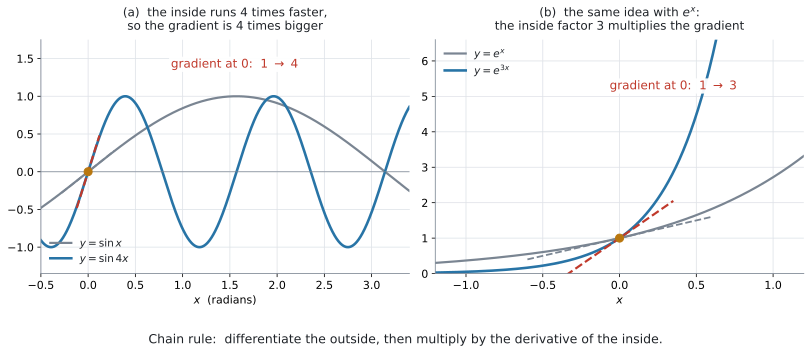

# AHL 5.9b — The chain, product and quotient rules（合成関数・積・商の微分法） {#sec-ahl-5-9b}

::: {.callout-note}
## What you should be able to do
- 式の形を見て、**chain / product / quotient のどれを使うか**を先に決められる。
- **chain rule** で $(2x+1)^{5}$、$e^{3x}$、$\sin 4x$、$\ln(x^{2}+1)$ のような「中身のある」関数を微分できる。
- **product rule** で $x^{2}e^{x}$ のような**掛け算**の形を微分できる。
- **quotient rule** で $\dfrac{x}{x^{2}+1}$ のような**分数**の形を微分できる。
- quotient rule の**引き算の順番**を間違えずに書ける。
- $2$ つのルールが重なる式（$x^{2}\sin 3x$ など）を扱える。
:::

::: {.callout-important}
## 公式集の 5.9 の欄（後半）
$3$ つとも印刷されています。

$$
y = g(u), \ \text{where} \ u = f(x) \ \Rightarrow \ \frac{dy}{dx} = \frac{dy}{du} \times \frac{du}{dx}
$$ {#eq-ahl59b-chain}

$$
y = uv \ \Rightarrow \ \frac{dy}{dx} = u\frac{dv}{dx} + v\frac{du}{dx}
$$ {#eq-ahl59b-product}

$$
y = \frac{u}{v} \ \Rightarrow \ \frac{dy}{dx} = \frac{v\dfrac{du}{dx} - u\dfrac{dv}{dx}}{v^{2}}
$$ {#eq-ahl59b-quotient}

**試験中に配られるので、覚える必要はありません。** 覚えるべきなのは、**どの式にどれを使うか**です。ここを間違えると、正しい公式を見ながら間違った答えを出すことになります。
:::

::: {.callout-note}
## [AHL 5.9a](ahl-5-9a.qmd) の $5$ つを、先に見ておいてください
このページで微分するのは、$\sin$、$\cos$、$\tan$、$e^{x}$、$\ln x$、$x^{n}$ を**組み合わせた**式です。ひとつひとつの導関数は [AHL 5.9a](ahl-5-9a.qmd#five) にあります。

**電卓は Radian にしてください**（[AHL 5.9a GDC 第1節](ahl-5-9a.qmd#gdc-radian)）。
:::

## The idea

### 1. $3$ つのルールは、式の形で選びます {#idea}

新しい公式が $3$ つ増えますが、**使い分けは式の形を見るだけ**です。

| 式の形 | 例 | 使うルール |
|---|---|---|
| かっこや関数の**中身**が $x$ そのものでない | $(2x+1)^{5}$、$e^{3x}$、$\sin 4x$ | **chain rule** |
| $2$ つの式の**掛け算** | $x^{2}e^{x}$、$x\sin x$ | **product rule** |
| $2$ つの式の**割り算** | $\dfrac{x}{x^{2}+1}$、$\dfrac{e^{x}}{x}$ | **quotient rule** |

: 形で選びます {#tbl-ahl59b-which}

**先に形を見て、使うルールを紙に書いてから**計算を始めてください。この項目の失点は、計算そのものより「別のルールを使った」ことで起きます。

### 2. chain rule — 外を微分して、中の微分を掛ける {#chain}

$(2x+1)^{5}$ を展開してから微分することもできますが、$5$ 乗を展開するのは大変です。**展開せずに済ませる**のが chain rule です。

{#fig-ahl59b-chain width=100%}

@fig-ahl59b-chain の (a) は、$y = \sin x$ と $y = \sin 4x$ を重ねたものです。$\sin 4x$ は、$x$ が $1$ 進むあいだに**中身が $4$ 進みます。** そのぶん波が $4$ 倍の速さで動くので、$x = 0$ での傾きも $1$ から $4$ になります。(b) の $e^{3x}$ でも同じで、傾きが $3$ 倍になります。

**「中身が何倍の速さで動くか」が、そのまま傾きの倍率になる。** これが chain rule です。

$$
\frac{dy}{dx} = \frac{dy}{du} \times \frac{du}{dx}
$$

#### $u$ に何を置くか {#set-u}

$u$ には、**かっこの中身**、あるいは **$\sin$ や $\ln$ の中身**を置きます。

| 式 | $u$ に置くもの | $y$ を $u$ で書くと |
|---|---|---|
| $(2x+1)^{5}$ | $u = 2x+1$ | $y = u^{5}$ |
| $e^{3x}$ | $u = 3x$ | $y = e^{u}$ |
| $\sin 4x$ | $u = 4x$ | $y = \sin u$ |
| $\ln(x^{2}+1)$ | $u = x^{2}+1$ | $y = \ln u$ |
| $\sqrt{3x+4}$ | $u = 3x+4$ | $y = u^{\frac{1}{2}}$ |

: $u$ の置き方 {#tbl-ahl59b-u}

**$u$ を置いたら、$y$ が $u$ だけの式になっているか確かめてください。** $x$ が残っていたら、置き方が違います。

#### 手順は $3$ つです {#chain-steps}

$y = (2x+1)^{5}$ でやってみます。

1. **$u$ を置く** … $u = 2x+1$、$y = u^{5}$
2. **$2$ つを別々に微分する**

$$
\frac{dy}{du} = 5u^{4}, \qquad \frac{du}{dx} = 2
$$

3. **掛けて、$u$ を $x$ に戻す**

$$
\frac{dy}{dx} = 5u^{4} \times 2 = 10u^{4} = 10(2x+1)^{4}
$$

**最後に $u$ を戻すのを忘れないでください。** 答えに $u$ が残っていると点になりません。

::: {.callout-tip}
## 慣れたら、$u$ を書かずに済ませられます
「**外を微分して、中の微分を掛ける**」と唱えながら書けば、$1$ 行で終わります。

$$
\frac{d}{dx}(2x+1)^{5} = \underbrace{5(2x+1)^{4}}_{\text{外}} \times \underbrace{2}_{\text{中}} = 10(2x+1)^{4}
$$

**ただし、慣れるまでは $u$ を書いてください。** 途中式があるほうが部分点も取りやすくなります。
:::

#### よく出る形 {#chain-table}

| $y$ | $\dfrac{dy}{dx}$ |
|---|---|
| $(ax+b)^{n}$ | $an(ax+b)^{n-1}$ |
| $e^{ax}$ | $ae^{ax}$ |
| $\sin(ax)$ | $a\cos(ax)$ |
| $\cos(ax)$ | $-a\sin(ax)$ |
| $\ln(f(x))$ | $\dfrac{f'(x)}{f(x)}$ |

: chain rule のよく出る形 {#tbl-ahl59b-common}

**どれも「中の微分を掛ける」だけ**です。表を覚えるのではなく、手順のほうを身につけてください。

### 3. product rule — 掛け算の形 {#product}

$x^{2}e^{x}$ のように、$2$ つの式が掛かっている形です。

::: {.callout-warning}
## それぞれを微分して掛ける、ではありません
$$
\frac{d}{dx}\left(x^{2}e^{x}\right) \neq 2x \times e^{x}
$$

微分は、掛け算をそのまま通り抜けません。**$2$ つの項の和**になります（@eq-ahl59b-product）。
:::

$$
\frac{dy}{dx} = u\frac{dv}{dx} + v\frac{du}{dx}
$$

**片方ずつ微分して、$2$ つ足す**と読んでください。

- $v$ を微分して $u$ を掛ける
- $u$ を微分して $v$ を掛ける
- 足す

#### $u$ と $v$ の決め方 {#uv}

**どちらを $u$ にしても構いません。** 足し算なので、順番が変わるだけです。

$y = x^{2}e^{x}$ で $u = x^{2}$、$v = e^{x}$ とすると

$$
\frac{du}{dx} = 2x, \qquad \frac{dv}{dx} = e^{x}
$$

$$
\frac{dy}{dx} = x^{2}e^{x} + e^{x}(2x) = xe^{x}(x+2)
$$

{#fig-ahl59b-product width=100%}

@fig-ahl59b-product の (b) を見てください。青が $y = x^{2}e^{x}$、赤の破線が求めた導関数です。**曲線が水平になっている $x = -2$ と $x = 0$ で、導関数が $0$ になっています。** 求めた式が合っている証拠です。

もし $2x \times e^{x}$（誤った形）なら、$0$ になるのは $x = 0$ だけで、$x = -2$ での水平が説明できません。

::: {.callout-tip}
## $4$ つの箱を先に書いてから始めます
$$
u = \underline{\phantom{xxxx}} \qquad \frac{du}{dx} = \underline{\phantom{xxxx}}
$$
$$
v = \underline{\phantom{xxxx}} \qquad \frac{dv}{dx} = \underline{\phantom{xxxx}}
$$

**$4$ つ埋めてから、公式に入れる。** この順で書くと、掛け合わせを間違えにくくなります。
:::

### 4. quotient rule — 割り算の形 {#quotient}

$\dfrac{x}{x^{2}+1}$ のように、分数の形です。

$$
\frac{dy}{dx} = \frac{v\dfrac{du}{dx} - u\dfrac{dv}{dx}}{v^{2}}
$$

**$u$ は分子、$v$ は分母**です。ここを取り違えると、答えの符号が逆になります。

#### 引き算の順番が決まっています {#order}

product rule は足し算なので順番が自由でしたが、**quotient rule は引き算なので順番が固定**です。

$$
\underbrace{v\frac{du}{dx}}_{\text{分母} \times \text{分子の微分}} \ - \ \underbrace{u\frac{dv}{dx}}_{\text{分子} \times \text{分母の微分}}
$$

**先に来るのは、分母 $\times$ 分子の微分**です。逆に書くと、答え全体の符号が反対になります。

::: {.callout-tip}
## 分母の $v^{2}$ を先に書いてしまう
$$
\frac{dy}{dx} = \frac{\phantom{v\frac{du}{dx} - u\frac{dv}{dx}}}{v^{2}}
$$

**分母を先に書いて、それから分子を埋める。** こうすると $v^{2}$ の書き忘れがなくなります。
:::

$y = \dfrac{x}{x^{2}+1}$ でやってみます。$u = x$、$v = x^{2}+1$ です。

$$
\frac{du}{dx} = 1, \qquad \frac{dv}{dx} = 2x
$$

$$
\frac{dy}{dx} = \frac{(x^{2}+1)(1) - x(2x)}{(x^{2}+1)^{2}} = \frac{x^{2}+1-2x^{2}}{(x^{2}+1)^{2}} = \frac{1-x^{2}}{(x^{2}+1)^{2}}
$$

#### quotient rule を使わずに済む形もあります {#avoid}

分数だからといって、いつも quotient rule が要るわけではありません。**分子も分母も $x$ のべき乗だけ**なら、書き直せばルールそのものが要らなくなります。

$$
\frac{x^{2}+3x}{x} = x + 3 \quad \Longrightarrow \quad \frac{dy}{dx} = 1
$$

$$
\frac{5}{x^{3}} = 5x^{-3} \quad \Longrightarrow \quad \frac{dy}{dx} = -15x^{-4}
$$

**まず、約分や簡単な式変形ができないかを確かめてください。** できなければ quotient rule を使います。

$\dfrac{e^{x}}{x}$ のように分子に $e^{x}$ や $\sin x$ が入っていると、書き直しても product rule が要るので、手間は変わりません。分母が $x^{2}+1$ や $e^{x}+1$ のような**和になっている**ときは、**ふつうは quotient rule が必要**です。

### 5. ルールが重なるとき {#combine}

$y = x^{2}\sin 3x$ は、**掛け算**の形（product rule）ですが、$\sin 3x$ の部分にも**中身**があります（chain rule）。

**外側から順に**進めます。

1. まず全体は掛け算なので、**product rule**。$u = x^{2}$、$v = \sin 3x$
2. $\dfrac{dv}{dx}$ を出すときに、**chain rule**。$\sin 3x$ → $3\cos 3x$

$$
\frac{du}{dx} = 2x, \qquad \frac{dv}{dx} = 3\cos 3x
$$

$$
\frac{dy}{dx} = x^{2}(3\cos 3x) + \sin 3x \,(2x) = 3x^{2}\cos 3x + 2x\sin 3x
$$

**内側の chain rule を忘れて $\cos 3x$ と書く**のが、いちばん多い誤りです。$3$ が消えます。

### 6. どのルールか、先に決めます {#decide}

式を見たら、この順で問いかけてください。

1. **分数の形か** → はい なら、まず約分や式変形ができないかを見る。できなければ quotient rule（[第4節](#avoid)）
2. **掛け算の形か** → はい なら product rule
3. **かっこや $\sin$、$\ln$ の中身が $x$ そのものでないか** → はい なら chain rule
4. どれでもない → [AHL 5.9a](ahl-5-9a.qmd#five) の公式をそのまま使う

$1$ つの式で、$2$ つ以上あてはまることもあります（[第5節](#combine)）。**そのときは外側から順に**適用します。

## Why it works

::: {.callout-tip collapse="true"}
## クリックすると開きます

### なぜ chain rule で掛けるのか {#why-chain}

$\dfrac{dy}{dx}$ は「$x$ が $1$ 増えると $y$ がどれだけ増えるか」でした（[SL 5.1](../../ai-sl/05-calculus/sl-5-1.qmd#rate)）。

いま $x$ → $u$ → $y$ と $2$ 段になっているとします。

- $x$ が**少し**増えると、$u$ はその $\dfrac{du}{dx}$ 倍だけ増える
- $u$ が少し増えると、$y$ はその $\dfrac{dy}{du}$ 倍だけ増える

ですから、$x$ が少し増えたときに $y$ が増える量は、**$2$ つの倍率を掛けたもの**です。

$$
\frac{dy}{dx} = \frac{dy}{du} \times \frac{du}{dx}
$$

歯車を $2$ つつないだと思ってください。$1$ 段目が $3$ 倍、$2$ 段目が $4$ 倍なら、全体では $12$ 倍です。

@fig-ahl59b-chain の (a) はその $1$ 段目だけを見たものです。$u = 4x$ なので $\dfrac{du}{dx} = 4$、つまり中身が $4$ 倍の速さで動きます。だから傾きが $4$ 倍になりました。

### なぜ product rule が $2$ 項の和になるのか {#why-product}

@fig-ahl59b-product の (a) を見てください。たて $v$、よこ $u$ の長方形の面積が $uv$ です。

$x$ が少し増えて、$u$ が $\delta u$、$v$ が $\delta v$ だけ増えたとします。**増えた面積は $3$ つの部分**に分かれます。

$$
\underbrace{v\,\delta u}_{\text{よこに伸びた分}} \ + \ \underbrace{u\,\delta v}_{\text{たてに伸びた分}} \ + \ \underbrace{\delta u\,\delta v}_{\text{角の小さな四角}}
$$

導関数を出すには、この増えた面積を **$x$ の増分 $\delta x$ で割ります。**

$$
v\frac{\delta u}{\delta x} \ + \ u\frac{\delta v}{\delta x} \ + \ \delta u\frac{\delta v}{\delta x}
$$

$\delta x$ を $0$ に近づけると、はじめの $2$ つは $v\dfrac{du}{dx}$ と $u\dfrac{dv}{dx}$ になります。**$3$ つ目には $\delta u$ という因子が残ったまま**で、その $\delta u$ も $0$ に近づきます。ですから $3$ つ目だけが消えて

$$
\frac{d}{dx}(uv) = v\frac{du}{dx} + u\frac{dv}{dx}
$$

が残ります。**角の小さな四角だけが落ちる**のは、そこに $\delta u$ が余分に掛かっているからです。

**「片方だけ動かして、もう片方だけ動かして、足す」**という形になるのは、そのためです。

### なぜ quotient rule で引くのか {#why-quotient}

$y = \dfrac{u}{v}$ は、$y \times v = u$ と書けます。**掛け算の形になった**ので、product rule が使えます。

$$
\frac{d}{dx}(yv) = y\frac{dv}{dx} + v\frac{dy}{dx} = \frac{du}{dx}
$$

$\dfrac{dy}{dx}$ について解きます。

$$
v\frac{dy}{dx} = \frac{du}{dx} - y\frac{dv}{dx}
$$

ここで $y = \dfrac{u}{v}$ を入れて

$$
v\frac{dy}{dx} = \frac{du}{dx} - \frac{u}{v}\frac{dv}{dx}
$$

両辺を $v$ で割り、右辺を通分すると

$$
\frac{dy}{dx} = \frac{v\dfrac{du}{dx} - u\dfrac{dv}{dx}}{v^{2}}
$$

**引き算になるのは、$y\dfrac{dv}{dx}$ を移項したから**です。移項すれば符号が変わります。順番が固定なのも、ここから来ています。
:::

## Worked examples

::: {.callout-note appearance="simple"}
問題文は英語です。意味が理解できなかったら、問題文の下の「**日本語訳**」を開いてください。解説は日本語です。
:::

::: {#exm-ahl59b-chain}
[Differentiate each of the following with respect to $x$.]{.q-en}

**(a)** [$y = (2x+1)^{5}$]{.q-en}

**(b)** [$y = e^{3x}$]{.q-en}

**(c)** [$y = \sin 4x$]{.q-en}

**(d)** [Hence find the gradient of the curve in part (a) when $x = 1$.]{.q-en}

<details class="jp-trans">
<summary>日本語訳</summary>

次のそれぞれを $x$ について微分しなさい。

**(a)** $y = (2x+1)^{5}$

**(b)** $y = e^{3x}$

**(c)** $y = \sin 4x$

**(d)** それを使って、(a) の曲線の $x = 1$ における傾きを求めなさい。

</details>

---

どれも「中身」があるので **chain rule** です（@tbl-ahl59b-which）。

**(a)** $u = 2x+1$ と置くと $y = u^{5}$ です（@tbl-ahl59b-u）。

$$
\frac{dy}{du} = 5u^{4}, \qquad \frac{du}{dx} = 2
$$

$$
\frac{dy}{dx} = 5u^{4} \times 2 = 10(2x+1)^{4}
$$

**(b)** $u = 3x$ と置くと $y = e^{u}$ です。

$$
\frac{dy}{du} = e^{u}, \qquad \frac{du}{dx} = 3
$$

$$
\frac{dy}{dx} = e^{3x} \times 3 = 3e^{3x}
$$

**(c)** $u = 4x$ と置くと $y = \sin u$ です。

$$
\frac{dy}{du} = \cos u, \qquad \frac{du}{dx} = 4
$$

$$
\frac{dy}{dx} = \cos 4x \times 4 = 4\cos 4x
$$

**(d)** (a) の式に $x = 1$ を入れます。

$$
10(2 \times 1 + 1)^{4} = 10 \times 3^{4} = 10 \times 81 = 810
$$

**検算。** numerical derivative に $(2x+1)^{5}$ を入れて $x = 1$ で微分すると $810$ です ✓（[GDC 第1節](#gdc-deriv)）

::: {.callout-note}
## 解答例（答案用紙にはこう書く）
**(a)**
$$
u = 2x+1, \qquad y = u^{5}
$$
$$
\frac{dy}{dx} = 5u^{4} \times 2 = 10(2x+1)^{4}
$$

**(b)**
$$
\frac{dy}{dx} = 3e^{3x}
$$

**(c)**
$$
\frac{dy}{dx} = 4\cos 4x
$$

**(d)**
$$
\frac{dy}{dx}\bigg|_{x=1} = 10(3)^{4} = 810
$$
:::
:::

::: {#exm-ahl59b-product}
[Let $f(x) = x^{2}e^{x}$.]{.q-en}

**(a)** [Find $f'(x)$, giving your answer in a factorised form.]{.q-en}

**(b)** [Find $f'(1)$, giving your answer to three significant figures.]{.q-en}

**(c)** [Find the $x$-coordinates of the stationary points of the graph of $f$.]{.q-en}

<details class="jp-trans">
<summary>日本語訳</summary>

$f(x) = x^{2}e^{x}$ とします。

`in a factorised form` は「因数分解した形で」という意味です。

**(a)** $f'(x)$ を、因数分解した形で求めなさい。

**(b)** $f'(1)$ を、有効数字 $3$ 桁で求めなさい。

**(c)** $f$ のグラフの stationary point の $x$ 座標を求めなさい。

</details>

---

**(a)** $x^{2}$ と $e^{x}$ の**掛け算**なので **product rule** です（@eq-ahl59b-product）。$4$ つの箱を先に埋めます（[第3節](#uv)）。

$$
u = x^{2}, \qquad \frac{du}{dx} = 2x
$$

$$
v = e^{x}, \qquad \frac{dv}{dx} = e^{x}
$$

$$
f'(x) = u\frac{dv}{dx} + v\frac{du}{dx} = x^{2}e^{x} + e^{x}(2x)
$$

$e^{x}$ と $x$ が両方の項に入っているので、くくり出します。

$$
f'(x) = xe^{x}(x+2)
$$

**(b)** $x = 1$ を入れます。

$$
f'(1) = 1 \times e^{1} \times 3 = 3e = 8.1548 \approx 8.15
$$

**(c)** stationary point は $f'(x) = 0$ です（[SL 5.6](../../ai-sl/05-calculus/sl-5-6.qmd#stationary)）。

$$
xe^{x}(x+2) = 0
$$

**$e^{x}$ は決して $0$ になりません。** ですから $x = 0$ または $x + 2 = 0$。

$$
x = 0, \qquad x = -2
$$

**検算。** @fig-ahl59b-product の (b) で、曲線が水平になっているのは $x = -2$ と $x = 0$ です ✓

::: {.callout-note}
## 解答例（答案用紙にはこう書く）
**(a)**
$$
u = x^{2}, \quad \frac{du}{dx} = 2x, \qquad v = e^{x}, \quad \frac{dv}{dx} = e^{x}
$$
$$
f'(x) = x^{2}e^{x} + 2xe^{x} = xe^{x}(x+2)
$$

**(b)**
$$
f'(1) = 3e = 8.15
$$

**(c)**
$$
xe^{x}(x+2) = 0, \qquad e^{x} \neq 0
$$
$$
x = 0, \qquad x = -2
$$
:::
:::

::: {#exm-ahl59b-quotient}
[Let $y = \dfrac{x}{x^{2}+1}$.]{.q-en}

**(a)** [Find $\dfrac{dy}{dx}$.]{.q-en}

**(b)** [Find the value of $\dfrac{dy}{dx}$ when $x = 2$.]{.q-en}

**(c)** [Find the coordinates of the stationary points of the curve.]{.q-en}

<details class="jp-trans">
<summary>日本語訳</summary>

$y = \dfrac{x}{x^{2}+1}$ とします。

**(a)** $\dfrac{dy}{dx}$ を求めなさい。

**(b)** $x = 2$ のときの $\dfrac{dy}{dx}$ の値を求めなさい。

**(c)** この曲線の stationary point の座標を求めなさい。

</details>

---

**(a)** 分数の形で、分母に $x$ 以外のものが入っているので **quotient rule** です（[第4節](#avoid)）。

$$
u = x, \qquad \frac{du}{dx} = 1
$$

$$
v = x^{2}+1, \qquad \frac{dv}{dx} = 2x
$$

分母の $v^{2}$ を先に書いてから、分子を埋めます。

$$
\frac{dy}{dx} = \frac{(x^{2}+1)(1) - x(2x)}{(x^{2}+1)^{2}}
$$

$$
= \frac{x^{2}+1-2x^{2}}{(x^{2}+1)^{2}} = \frac{1-x^{2}}{(x^{2}+1)^{2}}
$$

**(b)** $x = 2$ を入れます。

$$
\frac{dy}{dx} = \frac{1-4}{(4+1)^{2}} = \frac{-3}{25} = -0.12
$$

**(c)** 分数が $0$ になるのは、**分子が $0$ のとき**だけです。

$$
1 - x^{2} = 0 \quad \Longrightarrow \quad x = 1, \qquad x = -1
$$

$y$ 座標も要ります（[SL 5.6](../../ai-sl/05-calculus/sl-5-6.qmd#coordinates)）。

$$
x = 1: \quad y = \frac{1}{2}, \qquad x = -1: \quad y = \frac{-1}{2}
$$

座標は $\left(1,\ \dfrac{1}{2}\right)$ と $\left(-1,\ -\dfrac{1}{2}\right)$ です。

**検算。** (b) で $x = 2$ での傾きが負でした。$x = 1$ を過ぎると減り始めるということなので、$x = 1$ が maximum であることと合っています ✓

::: {.callout-note}
## 解答例（答案用紙にはこう書く）
**(a)**
$$
u = x, \quad \frac{du}{dx} = 1, \qquad v = x^{2}+1, \quad \frac{dv}{dx} = 2x
$$
$$
\frac{dy}{dx} = \frac{(x^{2}+1)(1) - x(2x)}{(x^{2}+1)^{2}} = \frac{1-x^{2}}{(x^{2}+1)^{2}}
$$

**(b)**
$$
\frac{dy}{dx}\bigg|_{x=2} = \frac{-3}{25} = -0.12
$$

**(c)**
$$
1 - x^{2} = 0 \quad \Longrightarrow \quad x = \pm 1
$$
$$
\left(1,\ \frac{1}{2}\right), \qquad \left(-1,\ -\frac{1}{2}\right)
$$
:::
:::

::: {#exm-ahl59b-combine}
[Let $y = x^{2}\sin 3x$.]{.q-en}

**(a)** [Find $\dfrac{dy}{dx}$.]{.q-en}

**(b)** [Find the equation of the tangent to the curve at the point where $x = \dfrac{\pi}{6}$, giving your answer in the form $y = mx + c$.]{.q-en}

<details class="jp-trans">
<summary>日本語訳</summary>

$y = x^{2}\sin 3x$ とします。

**(a)** $\dfrac{dy}{dx}$ を求めなさい。

**(b)** $x = \dfrac{\pi}{6}$ の点における接線の方程式を、$y = mx + c$ の形で求めなさい。

</details>

---

**(a)** 全体は $x^{2}$ と $\sin 3x$ の**掛け算**なので、まず **product rule** です。そのうえで $\sin 3x$ を微分するときに **chain rule** が要ります（[第5節](#combine)）。

$$
u = x^{2}, \qquad \frac{du}{dx} = 2x
$$

$$
v = \sin 3x, \qquad \frac{dv}{dx} = 3\cos 3x
$$

$\dfrac{dv}{dx}$ の $3$ が、中身 $3x$ の微分です。**ここを落とすのが、この形でいちばん多い誤りです。**

$$
\frac{dy}{dx} = x^{2}(3\cos 3x) + \sin 3x\,(2x) = 3x^{2}\cos 3x + 2x\sin 3x
$$

**(b)** 傾きと通る点の $2$ つが要ります（[SL 5.4](../../ai-sl/05-calculus/sl-5-4.qmd#y-coordinate)）。$x = \dfrac{\pi}{6}$ のとき $3x = \dfrac{\pi}{2}$ なので

$$
\sin\frac{\pi}{2} = 1, \qquad \cos\frac{\pi}{2} = 0
$$

です。まず $y$ 座標。

$$
y = \left(\frac{\pi}{6}\right)^{2} \times 1 = \frac{\pi^{2}}{36} = 0.2742
$$

次に傾き。

$$
\frac{dy}{dx} = 3\left(\frac{\pi}{6}\right)^{2}(0) + 2\left(\frac{\pi}{6}\right)(1) = \frac{\pi}{3} = 1.0472
$$

$$
y - 0.2742 = 1.0472\left(x - \frac{\pi}{6}\right)
$$

$$
y = 1.05x - 0.274
$$

**検算。** $x = \dfrac{\pi}{6} = 0.5236$ を入れると $1.0472(0.5236) - 0.2742 = 0.2742$ ✓ 接点を通っています。

::: {.callout-note}
## 解答例（答案用紙にはこう書く）
**(a)**
$$
u = x^{2}, \quad \frac{du}{dx} = 2x, \qquad v = \sin 3x, \quad \frac{dv}{dx} = 3\cos 3x
$$
$$
\frac{dy}{dx} = 3x^{2}\cos 3x + 2x\sin 3x
$$

**(b)**
$$
y\left(\frac{\pi}{6}\right) = \frac{\pi^{2}}{36} = 0.274
$$
$$
\frac{dy}{dx}\bigg|_{x = \frac{\pi}{6}} = \frac{\pi}{3} = 1.047
$$
$$
y - 0.274 = 1.047\left(x - \frac{\pi}{6}\right)
$$
$$
y = 1.05x - 0.274
$$
:::
:::

::: {#exm-ahl59b-model}
[The concentration of a drug in a patient's blood, in mg per litre, $t$ hours after the dose is given, is modelled by]{.q-en}

$$
C(t) = 5t\,e^{-0.5t}, \qquad t \geq 0
$$

**(a)** [Find $C'(t)$, giving your answer in a factorised form.]{.q-en}

**(b)** [Find $C'(1)$.]{.q-en}

**(c)** [Interpret your answer to part (b) in the context of the model.]{.q-en}

**(d)** [Find the time at which the concentration is greatest, and find this greatest concentration.]{.q-en}

<details class="jp-trans">
<summary>日本語訳</summary>

ある薬を投与してから $t$ 時間後の、血液中の薬の濃度（$1$ リットルあたり mg）が、上の式でモデル化されています。

`concentration` は「濃度」、`Interpret ... in the context of the model` は「モデルの文脈で、答えの意味を説明しなさい」という意味です。

**(a)** $C'(t)$ を、因数分解した形で求めなさい。

**(b)** $C'(1)$ を求めなさい。

**(c)** (b) の答えの意味を、このモデルの文脈で説明しなさい。

**(d)** 濃度が最大になる時刻と、そのときの濃度を求めなさい。

</details>

---

**(a)** $5t$ と $e^{-0.5t}$ の**掛け算**なので **product rule**、そのうえで $e^{-0.5t}$ に**中身**があるので **chain rule** です（[第5節](#combine)）。

$$
u = 5t, \qquad \frac{du}{dt} = 5
$$

$$
v = e^{-0.5t}, \qquad \frac{dv}{dt} = -0.5e^{-0.5t}
$$

$\dfrac{dv}{dt}$ の $-0.5$ が、中身 $-0.5t$ の微分です。

$$
C'(t) = 5t\left(-0.5e^{-0.5t}\right) + e^{-0.5t}(5) = e^{-0.5t}(5 - 2.5t)
$$

$$
C'(t) = 2.5e^{-0.5t}(2 - t)
$$

**(b)** $t = 1$ を入れます。

$$
C'(1) = 2.5e^{-0.5}(1) = 2.5 \times 0.6065 = 1.5163 \approx 1.52
$$

**(c)** 数値だけでは点になりません。**単位を付けて、増えているのか減っているのかを言ってください**（[SL 5.1](../../ai-sl/05-calculus/sl-5-1.qmd#units)）。

::: {.model-answer}
**試験ではこう書く**

*One hour after the dose, the concentration of the drug is increasing at a rate of $1.52$ mg per litre per hour.*
:::

（投与の $1$ 時間後、薬の濃度は $1$ 時間あたり $1.52$ mg／リットルの割合で増えている、という意味です。）

**(d)** 最大になるのは $C'(t) = 0$ のところです（[SL 5.6](../../ai-sl/05-calculus/sl-5-6.qmd#stationary)）。

$$
2.5e^{-0.5t}(2 - t) = 0
$$

**$e^{-0.5t}$ は決して $0$ になりません。** ですから $2 - t = 0$、つまり $t = 2$ です。

$$
C(2) = 5(2)e^{-1} = 10 \times 0.3679 = 3.6788 \approx 3.68
$$

投与の $2$ 時間後に、$3.68$ mg／リットルで最大になります。

**検算。** $C'(1) = 1.52 > 0$（まだ増えている）、$C'(3) = 2.5e^{-1.5}(-1) = -0.558 < 0$（もう減っている）。$t = 2$ の前後で符号が変わっているので、そこが最大です ✓

::: {.callout-note}
## 解答例（答案用紙にはこう書く）
**(a)**
$$
u = 5t, \quad \frac{du}{dt} = 5, \qquad v = e^{-0.5t}, \quad \frac{dv}{dt} = -0.5e^{-0.5t}
$$
$$
C'(t) = -2.5t\,e^{-0.5t} + 5e^{-0.5t} = 2.5e^{-0.5t}(2 - t)
$$

**(b)**
$$
C'(1) = 2.5e^{-0.5} = 1.52
$$

**(c)** *One hour after the dose the concentration is increasing at a rate of $1.52$ mg per litre per hour.*

**(d)**
$$
C'(t) = 0, \qquad e^{-0.5t} \neq 0 \quad \Longrightarrow \quad t = 2 \ \text{hours}
$$
$$
C(2) = 10e^{-1} = 3.68 \ \text{mg per litre}
$$
:::
:::

## Common errors

::: {.callout-warning}
## chain rule で「中の微分」を掛け忘れる
**誤り**：$\dfrac{d}{dx}(2x+1)^{5} = 5(2x+1)^{4}$ と書く。$\dfrac{d}{dx}\sin 3x = \cos 3x$ と書く。

外を微分しただけで止まっています。

**正しくは**：$10(2x+1)^{4}$、$3\cos 3x$ です。**中身の微分を掛けます**（[第2節](#chain-steps)）。

$x = 1$ で確かめると、正しい値は $810$、誤った値は $405$ です。**倍率のぶんだけずれます。**
:::

::: {.callout-warning}
## product rule を使わず、それぞれ微分して掛ける
**誤り**：$\dfrac{d}{dx}\left(x^{2}e^{x}\right) = 2x \times e^{x}$ と書く。

微分は掛け算をそのまま通り抜けません（[第3節](#product)）。

**正しくは**：$x^{2}e^{x} + 2xe^{x} = xe^{x}(x+2)$ です。

@fig-ahl59b-product の (b) で確かめられます。誤った式だと、$x = -2$ で曲線が水平になることを説明できません。
:::

::: {.callout-warning}
## quotient rule の引き算を、逆に書く
**誤り**：$\dfrac{u\dfrac{dv}{dx} - v\dfrac{du}{dx}}{v^{2}}$ と書く。

**答え全体の符号が反対**になります。$\dfrac{x}{x^{2}+1}$ なら $\dfrac{x^{2}-1}{(x^{2}+1)^{2}}$ という、正しい答えの $-1$ 倍が出ます。

**正しくは**：先に来るのは **分母 $\times$ 分子の微分**です（[第4節](#order)）。公式集の並びをそのまま写してください。
:::

::: {.callout-warning}
## quotient rule で $v^{2}$ を書き忘れる
**誤り**：分子だけを書いて、分母を $v$ のままにする。あるいは分母を書かない。

**正しくは**：分母は $v^{2}$ です。**分母を先に書いてから分子を埋める**と防げます（[第4節](#order)）。
:::

::: {.callout-warning}
## $\cos^{2}x$ と $\cos(x^{2})$ を取り違える
**誤り**：$y = \cos(x^{2})$ を微分して $-2x\sin x$ と書く（$\sin$ の中身が $x$ になっている）。

$\cos(x^{2})$ は **chain rule**（中身が $x^{2}$）、$(\cos x)^{2}$ も **chain rule**（外が $2$ 乗、中身が $\cos x$）ですが、**$u$ の置き方が違います。**

**正しくは**：$\cos(x^{2})$ なら $u = x^{2}$ で $-2x\sin(x^{2})$。$(\cos x)^{2}$ なら $u = \cos x$ で $-2\cos x\sin x$ です。

**かっこがどこに付いているか**を、まず確かめてください。
:::

::: {.callout-warning}
## 重なった形で、内側のルールを忘れる
**誤り**：$x^{2}\sin 3x$ を微分して $3x^{2}\cos x + 2x\sin 3x$ と書く（$\cos$ の中身が $x$ になっている）。

product rule は正しく使えていますが、$\sin 3x$ の微分で中身が消えています。

**正しくは**：$3x^{2}\cos 3x + 2x\sin 3x$ です（[第5節](#combine)）。**外から内へ、$1$ 段ずつ**進めてください。
:::

::: {.callout-warning}
## 書き直せば済む分数に、quotient rule を使う
**誤り**：$\dfrac{5}{x^{3}}$ に quotient rule を使い、計算を長くして符号を落とす。

**正しくは**：$5x^{-3}$ に書き直して $-15x^{-4}$ です（[第4節](#avoid)）。

**分子も分母も $x$ のべき乗なら、書き直すほうが速くて確実**です。$\dfrac{e^{x}}{x}$ のように分子が $x$ のべき乗でない場合は、書き直しても product rule が要るので、quotient rule のままで構いません。
:::

::: {.callout-warning}
## 答えに $u$ が残ったまま
**誤り**：$\dfrac{dy}{dx} = 10u^{4}$ で止める。

$u$ は途中で置いただけの文字です。**問題文には $u$ がありません。**

**正しくは**：$10(2x+1)^{4}$ と、$x$ の式に戻してから書きます（[第2節](#chain-steps)）。
:::

## Using your GDC (TI-Nspire CX II)

$f'(x)$ の**式**は、自分で書くしかありません。電卓ができるのは、**その式が合っているかを確かめること**です。

### 1. $1$ 点で確かめる {#gdc-deriv}

```
menu → 4: Calculus → 1: Numerical Derivative at a Point
```

もとの式を入れて、ある $x$ での値を出します。**自分の作った $f'(x)$ に、同じ $x$ を入れた値と比べます。**

| やること | 例 | 出る値 |
|---|---|---|
| もとの式を電卓で**微分**する | $(2x+1)^{5}$ を $x = 1$ で | $810$ |
| 自分の $f'(x)$ に**代入**する | $10(2x+1)^{4}$ に $x = 1$ を | $810$ ✓ |

: $1$ 点で比べる {#tbl-ahl59b-check}

**$2$ 行目は、電卓の微分機能に入れるのではありません。** 自分の作った式に、ただ数を代入するだけです。

**chain rule の掛け忘れは、これでほぼ全部見つかります。** 掛け忘れると、値が倍率のぶんだけずれるからです。

::: {.callout-warning}
## $\sin$、$\cos$、$\tan$ が入っているときは Radian に
```
doc → Settings → Document Settings → Angle: Radian
```

HL では $^{\circ}$ が書いていなければ radian です（[AHL 5.9a](ahl-5-9a.qmd#hl-radian)）。$e$ は `e^x` のキーで入れてください。
:::

### 2. グラフで確かめる {#gdc-graph}

もとの式と、自分の作った導関数を、同じ画面に描きます。

```
f1(x) = x^2*e^(x)
f2(x) = x*e^(x)*(x+2)
```

**$f_1$ が水平なところで $f_2$ が $x$ 軸を横切っていれば、まず合っています**（[SL 5.6](../../ai-sl/05-calculus/sl-5-6.qmd#fdash-gdc)）。@fig-ahl59b-product の (b) が、その確かめ方の絵です。

### 3. stationary point を確かめる {#gdc-stat}

$f'(x) = 0$ を手で解いたあと、グラフで確かめられます。

```
menu → Analyze Graph → Minimum （または Maximum）
```

`nSolve` で $f'(x) = 0$ を直接解くこともできます（[SL 5.6](../../ai-sl/05-calculus/sl-5-6.qmd#nsolve)）。

**`nSolve` は解を $1$ つずつ返します。** $x = 0$ と $x = -2$ の両方を出すには、**範囲を変えて $2$ 回**使ってください。

```
nSolve(x*e^(x)*(x+2)=0, x, -3, -1)
nSolve(x*e^(x)*(x+2)=0, x, -1, 1)
```

### 4. 確かめ方 {#gdc-check}

$4$ つあります。

1. **使ったルールが、式の形に合っているか**（@tbl-ahl59b-which）
2. **chain rule で、中身の微分を掛けたか**
3. **quotient rule で、引き算の順番と $v^{2}$ が正しいか**
4. numerical derivative の値と、**自分の式に代入した値**が合うか（@tbl-ahl59b-check）

## Exercises

::: {.callout-note appearance="simple"}
各問題に、折りたたみが3つ付いています。**日本語訳**、**解答例**（答案用紙に書くべきこと。英語です）、**解説**（なぜそうなるか。日本語です）。

まず自分で解いて、次に解答例と見くらべてください。**解説は、合わなかったときだけ開けば十分です。**
:::

::: {.exercise-block}

[1]{.ex-no} [Differentiate $y = (3x-2)^{4}$ with respect to $x$.]{.q-en}

<details class="jp-trans">
<summary>日本語訳</summary>

$y = (3x-2)^{4}$ を $x$ について微分しなさい。

</details>

::: {.callout-note collapse="true"}
## 解答例（答案用紙に書くこと）
$$
u = 3x-2, \qquad y = u^{4}
$$
$$
\frac{dy}{dx} = 4u^{3} \times 3 = 12(3x-2)^{3}
$$
:::

::: {.callout-tip collapse="true"}
## 解説
かっこの中身が $x$ そのものではないので **chain rule** です（@tbl-ahl59b-which）。

外を微分して $4(3x-2)^{3}$、中の微分 $3$ を掛けて $12(3x-2)^{3}$ です。

**$3$ を掛け忘れると $4(3x-2)^{3}$ になり、値が $3$ 分の $1$ になります。**

**検算。** $x = 1$ で、正しい答えは $12(1)^{3} = 12$。numerical derivative でも $12$ です ✓
:::

::: {.ex-sep}
:::

[2]{.ex-no} [Differentiate $y = e^{5x} + \sin 2x$ with respect to $x$.]{.q-en}

<details class="jp-trans">
<summary>日本語訳</summary>

$y = e^{5x} + \sin 2x$ を $x$ について微分しなさい。

</details>

::: {.callout-note collapse="true"}
## 解答例（答案用紙に書くこと）
$$
\frac{dy}{dx} = 5e^{5x} + 2\cos 2x
$$
:::

::: {.callout-tip collapse="true"}
## 解説
項ごとに、それぞれ chain rule を使います（@tbl-ahl59b-common）。

- $e^{5x}$ → 外は $e^{5x}$、中の微分は $5$ → $5e^{5x}$
- $\sin 2x$ → 外は $\cos 2x$、中の微分は $2$ → $2\cos 2x$

**足し算はそのまま並べます。** ここに product rule は要りません。$e^{5x}$ と $\sin 2x$ は掛かっていないからです。
:::

::: {.ex-sep}
:::

[3]{.ex-no} [Let $f(x) = \ln(x^{2}+1)$. Find $f'(2)$.]{.q-en}

<details class="jp-trans">
<summary>日本語訳</summary>

$f(x) = \ln(x^{2}+1)$ とします。$f'(2)$ を求めなさい。

</details>

::: {.callout-note collapse="true"}
## 解答例（答案用紙に書くこと）
$$
u = x^{2}+1, \qquad f(x) = \ln u
$$
$$
f'(x) = \frac{1}{x^{2}+1} \times 2x = \frac{2x}{x^{2}+1}
$$
$$
f'(2) = \frac{4}{5} = 0.8
$$
:::

::: {.callout-tip collapse="true"}
## 解説
$\ln$ の中身が $x$ ではないので **chain rule** です。

$\ln u$ の微分は $\dfrac{1}{u}$（[AHL 5.9a](ahl-5-9a.qmd#five)）、中の微分は $2x$ です。

$$
\frac{d}{dx}\ln(f(x)) = \frac{f'(x)}{f(x)}
$$

という形になります（@tbl-ahl59b-common）。**分子が「中身の微分」、分母が「中身そのもの」**です。

**検算。** $f'(2) = \dfrac{2(2)}{4+1} = \dfrac{4}{5} = 0.8$。numerical derivative でも $0.8$ ✓
:::

::: {.ex-sep}
:::

[4]{.ex-no} [Let $y = \sqrt{3x+4}$. Find the value of $\dfrac{dy}{dx}$ when $x = 4$.]{.q-en}

<details class="jp-trans">
<summary>日本語訳</summary>

$y = \sqrt{3x+4}$ とします。$x = 4$ のときの $\dfrac{dy}{dx}$ の値を求めなさい。

</details>

::: {.callout-note collapse="true"}
## 解答例（答案用紙に書くこと）
$$
u = 3x+4, \qquad y = u^{\frac{1}{2}}
$$
$$
\frac{dy}{dx} = \frac{1}{2}u^{-\frac{1}{2}} \times 3 = \frac{3}{2\sqrt{3x+4}}
$$
$$
\frac{dy}{dx}\bigg|_{x=4} = \frac{3}{2\sqrt{16}} = \frac{3}{8} = 0.375
$$
:::

::: {.callout-tip collapse="true"}
## 解説
根号を**べき乗の形に直してから**、chain rule を使います（[AHL 5.9a](ahl-5-9a.qmd#rewrite)）。

$u = 3x+4$ と置くと $y = u^{\frac{1}{2}}$ です。$\dfrac{dy}{du} = \dfrac{1}{2}u^{-\frac{1}{2}}$、$\dfrac{du}{dx} = 3$。

$$
\frac{dy}{dx} = \frac{3}{2}u^{-\frac{1}{2}} = \frac{3}{2\sqrt{3x+4}}
$$

$x = 4$ のとき $3(4)+4 = 16$、$\sqrt{16} = 4$ です。

**検算。** $\dfrac{3}{2 \times 4} = 0.375$。numerical derivative でも $0.375$ ✓
:::

::: {.ex-sep}
:::

[5]{.ex-no} [Let $y = x^{2}e^{x}$.]{.q-en}

**(a)** [Find $\dfrac{dy}{dx}$, giving your answer in a factorised form.]{.q-en}

**(b)** [Hence find the $x$-coordinates of the stationary points of the curve.]{.q-en}

<details class="jp-trans">
<summary>日本語訳</summary>

$y = x^{2}e^{x}$ とします。

**(a)** $\dfrac{dy}{dx}$ を、因数分解した形で求めなさい。

**(b)** それを使って、この曲線の stationary point の $x$ 座標を求めなさい。

</details>

::: {.callout-note collapse="true"}
## 解答例（答案用紙に書くこと）
**(a)**
$$
u = x^{2}, \quad \frac{du}{dx} = 2x, \qquad v = e^{x}, \quad \frac{dv}{dx} = e^{x}
$$
$$
\frac{dy}{dx} = x^{2}e^{x} + 2xe^{x} = xe^{x}(x+2)
$$

**(b)**
$$
xe^{x}(x+2) = 0, \qquad e^{x} \neq 0
$$
$$
x = 0, \qquad x = -2
$$
:::

::: {.callout-tip collapse="true"}
## 解説
掛け算の形なので **product rule** です（@eq-ahl59b-product）。@exm-ahl59b-product と同じ式です。

**(b)** で大事なのは、**$e^{x}$ が決して $0$ にならない**ことです。ですから $e^{x} = 0$ という解は出てきません。$x = 0$ と $x = -2$ の $2$ つだけです。

**検算。** @fig-ahl59b-product の (b) で、曲線が水平になっているのは $x = -2$ と $x = 0$ ✓
:::

::: {.ex-sep}
:::

[6]{.ex-no} [Let $y = x\sin x$. Find the value of $\dfrac{dy}{dx}$ when $x = \dfrac{\pi}{2}$.]{.q-en}

<details class="jp-trans">
<summary>日本語訳</summary>

$y = x\sin x$ とします。$x = \dfrac{\pi}{2}$ のときの $\dfrac{dy}{dx}$ の値を求めなさい。

</details>

::: {.callout-note collapse="true"}
## 解答例（答案用紙に書くこと）
$$
u = x, \quad \frac{du}{dx} = 1, \qquad v = \sin x, \quad \frac{dv}{dx} = \cos x
$$
$$
\frac{dy}{dx} = x\cos x + \sin x
$$
$$
\frac{dy}{dx}\bigg|_{x = \frac{\pi}{2}} = \frac{\pi}{2}(0) + 1 = 1
$$
:::

::: {.callout-tip collapse="true"}
## 解説
$x$ と $\sin x$ の掛け算なので **product rule** です。

$\sin x$ の中身は $x$ そのものなので、**chain rule は要りません。** 掛ける「中の微分」は $1$ です。

$x = \dfrac{\pi}{2}$ では $\cos\dfrac{\pi}{2} = 0$、$\sin\dfrac{\pi}{2} = 1$ なので、第 $1$ 項が消えて $1$ だけが残ります。

**検算。** 電卓を Radian にして、numerical derivative に $x\sin(x)$ を入れ、$x = \pi/2$ で微分すると $1$ です ✓
:::

::: {.ex-sep}
:::

[7]{.ex-no} [Let $y = \dfrac{x}{x^{2}+1}$. Find the value of $\dfrac{dy}{dx}$ when $x = 2$.]{.q-en}

<details class="jp-trans">
<summary>日本語訳</summary>

$y = \dfrac{x}{x^{2}+1}$ とします。$x = 2$ のときの $\dfrac{dy}{dx}$ の値を求めなさい。

</details>

::: {.callout-note collapse="true"}
## 解答例（答案用紙に書くこと）
$$
u = x, \quad \frac{du}{dx} = 1, \qquad v = x^{2}+1, \quad \frac{dv}{dx} = 2x
$$
$$
\frac{dy}{dx} = \frac{(x^{2}+1)(1) - x(2x)}{(x^{2}+1)^{2}} = \frac{1-x^{2}}{(x^{2}+1)^{2}}
$$
$$
\frac{dy}{dx}\bigg|_{x=2} = \frac{-3}{25} = -0.12
$$
:::

::: {.callout-tip collapse="true"}
## 解説
分母に $x$ 以外のものが入っているので **quotient rule** です（[第4節](#avoid)）。@exm-ahl59b-quotient と同じ式です。

**引き算の順番**を確かめてください。先に来るのは $v\dfrac{du}{dx}$、つまり **分母 $\times$ 分子の微分**です（[第4節](#order)）。

逆に書くと $\dfrac{x^{2}-1}{(x^{2}+1)^{2}}$ となり、$x = 2$ で $+0.12$ という**符号違いの答え**が出ます。

**検算。** numerical derivative で $-0.12$ ✓ 符号まで合っているかを見てください。
:::

::: {.ex-sep}
:::

[8]{.ex-no} [Let $f(x) = \dfrac{e^{x}}{x}$, for $x \neq 0$. Find $f'(2)$, giving your answer to three significant figures.]{.q-en}

<details class="jp-trans">
<summary>日本語訳</summary>

$x \neq 0$ について $f(x) = \dfrac{e^{x}}{x}$ とします。$f'(2)$ を、有効数字 $3$ 桁で求めなさい。

</details>

::: {.callout-note collapse="true"}
## 解答例（答案用紙に書くこと）
$$
u = e^{x}, \quad \frac{du}{dx} = e^{x}, \qquad v = x, \quad \frac{dv}{dx} = 1
$$
$$
f'(x) = \frac{xe^{x} - e^{x}(1)}{x^{2}} = \frac{e^{x}(x-1)}{x^{2}}
$$
$$
f'(2) = \frac{e^{2}(1)}{4} = 1.85
$$
:::

::: {.callout-tip collapse="true"}
## 解説
分数の形なので **quotient rule** です。$u$ が分子の $e^{x}$、$v$ が分母の $x$ です。**$u$ と $v$ を取り違えないでください。**

$e^{x}x^{-1}$ と書き直して product rule を使っても、同じ答えになります。ただし**分子が $x$ のべき乗ではない**ので、書き直しても手間は減りません（[第4節](#avoid)）。

$$
f'(2) = \frac{7.389 \times 1}{4} = 1.8473
$$

**検算。** numerical derivative で $1.85$ ✓
:::

::: {.ex-sep}
:::

[9]{.ex-no} [Let $y = x^{2}\sin 3x$. Find $\dfrac{dy}{dx}$.]{.q-en}

<details class="jp-trans">
<summary>日本語訳</summary>

$y = x^{2}\sin 3x$ とします。$\dfrac{dy}{dx}$ を求めなさい。

</details>

::: {.callout-note collapse="true"}
## 解答例（答案用紙に書くこと）
$$
u = x^{2}, \quad \frac{du}{dx} = 2x, \qquad v = \sin 3x, \quad \frac{dv}{dx} = 3\cos 3x
$$
$$
\frac{dy}{dx} = 3x^{2}\cos 3x + 2x\sin 3x
$$
:::

::: {.callout-tip collapse="true"}
## 解説
**$2$ つのルールが重なります**（[第5節](#combine)）。

1. 全体は掛け算 → **product rule**
2. $\sin 3x$ を微分するとき → **chain rule**

$\dfrac{dv}{dx} = 3\cos 3x$ の $3$ が、chain rule の「中の微分」です。**ここを落として $\cos 3x$ と書くのが、いちばん多い誤りです。**

**検算。** $x = \dfrac{\pi}{6}$ を入れると $3x = \dfrac{\pi}{2}$ なので $\cos 3x = 0$、$\sin 3x = 1$。

$$
\frac{dy}{dx} = 0 + 2\left(\frac{\pi}{6}\right)(1) = \frac{\pi}{3} = 1.047
$$

numerical derivative でも $1.047$ です ✓（@exm-ahl59b-combine）
:::

::: {.ex-sep}
:::

[10]{.ex-no} [A student differentiates $y = x^{2}e^{x}$ and writes]{.q-en}

$$
\frac{dy}{dx} = 2xe^{x}
$$

[Identify the error and write down the correct derivative.]{.q-en}

<details class="jp-trans">
<summary>日本語訳</summary>

ある生徒が $y = x^{2}e^{x}$ を微分して、上のように書きました。誤りを指摘し、正しい導関数を書きなさい。

</details>

::: {.callout-note collapse="true"}
## 解答例（答案用紙に書くこと）
*The student has differentiated $x^{2}$ and left $e^{x}$ unchanged, instead of using the product rule. The product rule gives*
$$
\frac{dy}{dx} = x^{2}e^{x} + e^{x}(2x) = xe^{x}(x+2)
$$
*so the term $x^{2}e^{x}$ is missing from the student's answer.*
:::

::: {.callout-tip collapse="true"}
## 解説
$x^{2}$ と $e^{x}$ は掛かっているので、**片方だけ微分するわけにはいきません**（[第3節](#product)）。

正しくは $2$ 項の和です。生徒の答えには、$x^{2}\dfrac{d}{dx}\left(e^{x}\right) = x^{2}e^{x}$ の項がありません。

**グラフで確かめられます。** 生徒の式 $2xe^{x}$ が $0$ になるのは $x = 0$ だけです。ところが @fig-ahl59b-product の (b) を見ると、曲線は $x = -2$ でも水平になっています。**その点を説明できない**ので、式が違うと分かります。

::: {.model-answer}
**試験ではこう書く**

*The student differentiated only the first factor. Since $y$ is a product, the product rule is needed: $\dfrac{dy}{dx} = x^{2}e^{x} + 2xe^{x} = xe^{x}(x+2)$. The student's answer is missing the term $x^{2}e^{x}$.*
:::
:::

:::
