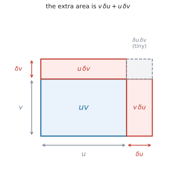
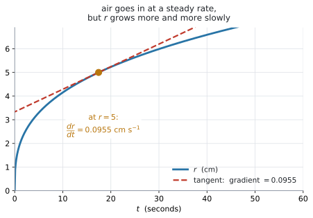

# AHL 5.9b — The chain, product and quotient rules, and related rates of change（合成関数・積・商の微分法と、関連する変化率） {#sec-ahl-5-9b}

::: {.callout-note}
## What you should be able to do
- 式の形を見て、**chain / product / quotient のどれを使うか**を先に決められる。
- **chain rule** で $(2x+1)^{5}$、$e^{3x}$、$\sin 4x$、$\ln(x^{2}+1)$ のような「中身のある」関数を微分できる。
- **product rule** で $x^{2}e^{x}$ のような**掛け算**の形を微分できる。
- **quotient rule** で $\dfrac{x}{x^{2}+1}$ のような**分数**の形を微分できる。
- quotient rule の**引き算の順番**を間違えずに書ける。
- $2$ つのルールが重なる式（$x^{2}\sin 3x$ など）を扱える。
- 「$2$ つの量が同時に変わる」問題を、$\dfrac{dA}{dt} = \dfrac{dA}{dr} \times \dfrac{dr}{dt}$ の形に書ける。
- $2$ つの rate が分かっているとき、残りの $1$ つを求められる。
- 図形の公式から、$\dfrac{dV}{dr}$ や $\dfrac{dA}{dx}$ を作れる。
- 変数が $2$ つ出てきたとき、**関係式を使って $1$ つに減らして**から微分できる。
- 答えに**正しい単位**を付けられる。
- 答えの意味を、文脈のなかで英語で説明できる。
:::

::: {.callout-important}
## 公式集の 5.9 の欄（後半）
$3$ つとも印刷されています。

$$
y = g(u), \ \text{where} \ u = f(x) \ \Rightarrow \ \frac{dy}{dx} = \frac{dy}{du} \times \frac{du}{dx}
$$ {#eq-ahl59b-chain}

$$
y = uv \ \Rightarrow \ \frac{dy}{dx} = u\frac{dv}{dx} + v\frac{du}{dx}
$$ {#eq-ahl59b-product}

$$
y = \frac{u}{v} \ \Rightarrow \ \frac{dy}{dx} = \frac{v\dfrac{du}{dx} - u\dfrac{dv}{dx}}{v^{2}}
$$ {#eq-ahl59b-quotient}

**試験中に配られるので、覚える必要はありません。** 覚えるべきなのは、**どの式にどれを使うか**です。ここを間違えると、正しい公式を見ながら間違った答えを出すことになります。
:::

::: {.callout-note}
## [AHL 5.9a](ahl-5-9a.qmd) の $5$ つを、先に見ておいてください
このページで微分するのは、$\sin$、$\cos$、$\tan$、$e^{x}$、$\ln x$、$x^{n}$ を**組み合わせた**式です。ひとつひとつの導関数は [AHL 5.9a](ahl-5-9a.qmd#five) にあります。

**電卓は Radian にしてください**（[AHL 5.9a GDC 第1節](ahl-5-9a.qmd#gdc-radian)）。
:::

## The idea

### 1. $3$ つのルールは、式の形で選びます {#idea}

新しい公式が $3$ つ増えますが、**使い分けは式の形を見るだけ**です。

| 式の形 | 例 | 使うルール |
|---|---|---|
| かっこや関数の**中身**が $x$ そのものでない | $(2x+1)^{5}$、$e^{3x}$、$\sin 4x$ | **chain rule** |
| $2$ つの式の**掛け算** | $x^{2}e^{x}$、$x\sin x$ | **product rule** |
| $2$ つの式の**割り算** | $\dfrac{x}{x^{2}+1}$、$\dfrac{e^{x}}{x}$ | **quotient rule** |

: 形で選びます {#tbl-ahl59b-which}

**先に形を見て、使うルールを紙に書いてから**計算を始めてください。

### 2. chain rule — 外を微分して、中の微分を掛ける {#chain}

$(2x+1)^{5}$ を展開してから微分することもできますが、$5$ 乗を展開するのは大変です。**展開せずに済ませる**のが chain rule です。

chain rule は、公式では次のように表されます。

$$
\frac{dy}{dx} = \frac{dy}{du} \times \frac{du}{dx}
$$

#### 手順は $3$ つです {#chain-steps}

$y = (2x+1)^{5}$ でやってみます。

1. **$u$ を置く** … $u = 2x+1$、$y = u^{5}$
2. **$2$ つを別々に微分する**

$$
\frac{dy}{du} = 5u^{4}, \qquad \frac{du}{dx} = 2
$$

3. **掛けて、$u$ を $x$ に戻す**

$$
\frac{dy}{dx} = 5u^{4} \times 2 = 10u^{4} = 10(2x+1)^{4}
$$

**最後に $u$ を戻すのを忘れないでください。** 答えに $u$ が残っていると点になりません。

#### $u$ に何を置くか {#set-u}

$y$ が $x$ の式のままでは微分しにくいとき、$x$ の式の一部を $u$ と置き換えて、**$y$ を $u$ で微分しやすい形**に直します。そのうえで、$u$ で微分した結果に、**$u$ を $x$ で微分したもの**を掛けます。

| 式 | $u$ に置くもの | $y$ を $u$ で書くと |
|---|---|---|
| $(2x+1)^{5}$ | $u = 2x+1$ | $y = u^{5}$ |
| $e^{3x}$ | $u = 3x$ | $y = e^{u}$ |
| $\sin 4x$ | $u = 4x$ | $y = \sin u$ |
| $\ln(x^{2}+1)$ | $u = x^{2}+1$ | $y = \ln u$ |
| $\sqrt{3x+4}$ | $u = 3x+4$ | $y = u^{\frac{1}{2}}$ |

: $u$ の置き方 {#tbl-ahl59b-u}

**$u$ を置いたら、$y$ が $u$ だけの式になっているか確かめてください。** $x$ が残っていたら、置き方が違います。

::: {.callout-tip}
## 慣れたら、$u$ を書かずに済ませられます
「**外を微分して、中の微分を掛ける**」と唱えながら書けば、$1$ 行で終わります。

$$
\frac{d}{dx}(2x+1)^{5} = \underbrace{5(2x+1)^{4}}_{\text{外}} \times \underbrace{2}_{\text{中の微分}} = 10(2x+1)^{4}
$$

**ただし、慣れるまでは $u$ を書いてください。** 途中式があるほうが部分点も取りやすくなります。
:::

#### 慣れたら、chain rule を使わずとも求められます {#chain-table}

| $y$ | $\dfrac{dy}{dx}$ |
|---|---|
| $(ax+b)^{n}$ | $an(ax+b)^{n-1}$ |
| $e^{ax}$ | $ae^{ax}$ |
| $\sin(ax)$ | $a\cos(ax)$ |
| $\cos(ax)$ | $-a\sin(ax)$ |
| $\ln(f(x))$ | $\dfrac{f'(x)}{f(x)}$ |

: chain rule のよく出る形 {#tbl-ahl59b-common}

**どれも「中の微分を掛ける」だけ**です。まずは手順を身につけてください。慣れてくると、この形はそのまま書けるようになります。

### 3. product rule — 掛け算の形 {#product}

$x^{2}e^{x}$ のように、**積の形になっている場合は product rule を使います。**

$$
\frac{dy}{dx} = u\frac{dv}{dx} + v\frac{du}{dx}
$$

$u$ と $v$ の積で表されている $y$ を $x$ で微分して $\dfrac{dy}{dx}$ を求めるためには、**$v$ を微分して $u$ を掛けたもの**と、**$u$ を微分して $v$ を掛けたもの**を足します。

#### $u$ と $v$ の決め方 {#uv}

**どちらを $u$ にしても構いません。** 足し算なので、順番が変わるだけです。

$y = x^{2}e^{x}$ で $u = x^{2}$、$v = e^{x}$ とすると

$$
\frac{du}{dx} = 2x, \qquad \frac{dv}{dx} = e^{x}
$$

$$
\frac{dy}{dx} = x^{2}e^{x} + e^{x}(2x) = x^{2}e^{x} + 2xe^{x}
$$

::: {.callout-tip}
## $4$ つの式を先に書いてから始めます
$$
u = \underline{\phantom{xxxx}} \qquad \frac{du}{dx} = \underline{\phantom{xxxx}}
$$
$$
v = \underline{\phantom{xxxx}} \qquad \frac{dv}{dx} = \underline{\phantom{xxxx}}
$$

**$4$ つ埋めてから、公式に入れる。** この順で書くと、掛け合わせを間違えにくくなります。
:::

### 4. quotient rule — 割り算の形 {#quotient}

$\dfrac{x}{x^{2}+1}$ のように、**分数の形の関数を微分するときは quotient rule を使います。**

$$
\frac{dy}{dx} = \frac{v\dfrac{du}{dx} - u\dfrac{dv}{dx}}{v^{2}}
$$

**$u$ は分子、$v$ は分母**です。ここを取り違えると、答えの符号が逆になります。

#### 引き算の順番が決まっています {#order}

product rule は足し算なので順番が自由でしたが、**quotient rule は引き算なので順番が固定**です。

$$
\underbrace{v\frac{du}{dx}}_{\text{分母} \times \text{分子の微分}} \ - \ \underbrace{u\frac{dv}{dx}}_{\text{分子} \times \text{分母の微分}}
$$

**先に来るのは、分母 $\times$ 分子の微分**です。逆に書くと、答え全体の符号が反対になります。

::: {.callout-tip}
## 分母の $v^{2}$ を先に書いてしまう
$$
\frac{dy}{dx} = \frac{\phantom{v\frac{du}{dx} - u\frac{dv}{dx}}}{v^{2}}
$$

**分母を先に書いて、それから分子を埋める。** こうすると $v^{2}$ の書き忘れがなくなります。
:::

$y = \dfrac{x}{x^{2}+1}$ でやってみます。$u = x$、$v = x^{2}+1$ です。

$$
\frac{du}{dx} = 1, \qquad \frac{dv}{dx} = 2x
$$

$$
\frac{dy}{dx} = \frac{(x^{2}+1)(1) - x(2x)}{(x^{2}+1)^{2}} = \frac{x^{2}+1-2x^{2}}{(x^{2}+1)^{2}} = \frac{1-x^{2}}{(x^{2}+1)^{2}}
$$

#### quotient rule を使わずに済む形もあります {#avoid}

分数だからといって、いつも quotient rule が要るわけではありません。**分子も分母も $x^{n}$ の形だけ**なら、書き直せばルールそのものが要らなくなります。

$$
\frac{x^{2}+3x}{x} = x + 3 \quad \Longrightarrow \quad \frac{dy}{dx} = 1
$$

$$
\frac{5}{x^{3}} = 5x^{-3} \quad \Longrightarrow \quad \frac{dy}{dx} = -15x^{-4}
$$

**まず、約分や簡単な式変形ができないかを確かめてください。** できなければ quotient rule を使います。

$\dfrac{e^{x}}{x}$ のように分子に $e^{x}$ や $\sin x$ が入っていると、書き直しても product rule が要るので、手間は変わりません。分母が $x^{2}+1$ や $e^{x}+1$ のような**和になっている**ときは、**ふつうは quotient rule が必要**です。

### 5. ルールが重なるとき {#combine}

$y = x^{2}\sin 3x$ は、**掛け算**の形（product rule）ですが、$\sin 3x$ の部分にも**中身**があります（chain rule）。

**外側から順に**進めます。

1. まず全体は掛け算なので、**product rule**。$u = x^{2}$、$v = \sin 3x$
2. $\dfrac{dv}{dx}$ を出すときに、**chain rule**。$\sin 3x$ → $3\cos 3x$

$$
\frac{du}{dx} = 2x, \qquad \frac{dv}{dx} = 3\cos 3x
$$

$$
\frac{dy}{dx} = x^{2}(3\cos 3x) + \sin 3x \,(2x) = 3x^{2}\cos 3x + 2x\sin 3x
$$

**内側の chain rule を忘れて $\cos 3x$ と書く**のが、いちばん多い誤りです。

chain rule が不安なときは、$\sin 3x$ を別のところに書き出して、$u = 3x$ と置き、$\dfrac{dy}{dx} = \dfrac{dy}{du} \times \dfrac{du}{dx}$ の形をていねいにたどってください（[第2節](#chain)）。

### 6. どのルールか、先に決めます {#decide}

式を見たら、この順で問いかけてください。

1. **分数の形か** → はい なら、まず約分や式変形ができないかを見る。できなければ quotient rule（[第4節](#avoid)）
2. **掛け算の形か** → はい なら product rule
3. **かっこや $\sin$、$\ln$ の中身が $x$ そのものでないか** → はい なら chain rule
4. どれでもない → [AHL 5.9a](ahl-5-9a.qmd#five) の公式をそのまま使う

$1$ つの式で、$2$ つ以上あてはまることもあります（[第5節](#combine)）。**そのときは外側から順に**適用します。

### 7. $2$ つの量が、同時に変わります {#rates}

風船に空気を入れると、**体積 $V$ も半径 $r$ も、同時に大きくなります。** どちらも時間 $t$ とともに変わっています。

- $\dfrac{dV}{dt}$ … 体積が $1$ 秒あたりどれだけ増えるか
- $\dfrac{dr}{dt}$ … 半径が $1$ 秒あたりどれだけ増えるか

この $2$ つは、無関係ではありません。$V$ と $r$ が $V = \dfrac{4}{3}\pi r^{3}$ でつながっているので、**変化の速さもつながっています。**

問題文は、たいてい片方だけを教えてくれます。

> Air is pumped into a balloon at a rate of $30$ cm$^{3}$ s$^{-1}$.

これは $\dfrac{dV}{dt} = 30$ です。そして

> Find the rate at which the radius is increasing when $r = 5$.

と、もう片方の $\dfrac{dr}{dt}$ を聞いてきます。**これが related rates です。**

ここで使うのは、**このページですでに見た chain rule $1$ 本だけ**です（[第2節](#chain)）。$V$ は $r$ で決まり、$r$ は $t$ で決まります。$2$ 段になっているので、つないで掛けます。

$$
\frac{dV}{dt} = \frac{dV}{dr} \times \frac{dr}{dt}
$$ {#eq-ahl59c-main}

$3$ つのうち **$2$ つが分かれば、残りの $1$ つが出ます**。

### 8. 手順は $4$ つです {#steps}

風船の例（$\dfrac{dV}{dt} = 30$、$r = 5$ のときの $\dfrac{dr}{dt}$）でやってみます。

1. **問題文の数を、記号に直す**

$$
\frac{dV}{dt} = 30, \qquad r = 5, \qquad \frac{dr}{dt} = \ ?
$$

2. **図形の公式を書いて、微分する**

$$
V = \frac{4}{3}\pi r^{3} \quad \Longrightarrow \quad \frac{dV}{dr} = 4\pi r^{2}
$$

3. **値を入れる**

$$
\frac{dV}{dr}\bigg|_{r=5} = 4\pi(25) = 100\pi
$$

4. **chain rule に入れて、求めるものについて解く**

$$
30 = 100\pi \times \frac{dr}{dt}
$$

$$
\frac{dr}{dt} = \frac{30}{100\pi} = 0.0955 \ \text{cm s}^{-1}
$$

::: {.callout-important}
## 値を入れるのは、微分したあとです
$r = 5$ を**先に**代入して $V = \dfrac{4}{3}\pi(125)$ としてしまうと、$V$ がただの数になり、微分すると $0$ になってしまいます。

**順番は「微分してから代入」**です。この順を守ってください。

これは**変わる文字**についての話です。円柱の半径のように**変わらない**数なら、先に入れて構いません（[演習13](#exercises)）。
:::

### 9. 単位を書きます {#units}

rate の単位は、**「上の単位 ÷ 下の単位」**です。

| rate | 単位 | 読み方 |
|---|---|---|
| $\dfrac{dV}{dt}$ | cm$^{3}$ s$^{-1}$ | 毎秒 何 cm$^{3}$ |
| $\dfrac{dr}{dt}$ | cm s$^{-1}$ | 毎秒 何 cm |
| $\dfrac{dA}{dt}$ | cm$^{2}$ s$^{-1}$ | 毎秒 何 cm$^{2}$ |
| $\dfrac{dV}{dr}$ | cm$^{2}$ | （時間が入りません） |
| $\dfrac{dC}{dt}$ | ドル／日 | $1$ 日あたり何ドル |

: rate の単位 {#tbl-ahl59c-units}

**図形でなくても同じです。** 費用 $C$ ドルと日数なら、$\dfrac{dC}{dt}$ の単位は「ドル ÷ 日」です。

**$\dfrac{dV}{dr}$ だけは時間の単位が付きません。** これは「半径が $1$ cm 増えると体積がどれだけ増えるか」で、時間とは関係がないからです。

単位を書くだけで点になることがあります（[SL 5.1](../../ai-sl/05-calculus/sl-5-1.qmd#units)）。**必ず付けてください。**

## Why it works

::: {.callout-tip collapse="true"}
## クリックすると開きます

### なぜ chain rule で掛けるのか {#why-chain}

$\dfrac{dy}{dx}$ は「$x$ が $1$ 増えると $y$ がどれだけ増えるか」でした（[SL 5.1](../../ai-sl/05-calculus/sl-5-1.qmd#rate)）。

いま $x$ → $u$ → $y$ と $2$ 段になっているとします。

- $x$ が**少し**増えると、$u$ はその $\dfrac{du}{dx}$ 倍だけ増える
- $u$ が少し増えると、$y$ はその $\dfrac{dy}{du}$ 倍だけ増える

ですから、$x$ が少し増えたときに $y$ が増える量は、**$2$ つの倍率を掛けたもの**です。

$$
\frac{dy}{dx} = \frac{dy}{du} \times \frac{du}{dx}
$$

歯車を $2$ つつないだと思ってください。$1$ 段目が $3$ 倍、$2$ 段目が $4$ 倍なら、全体では $12$ 倍です。

$y = \sin 4x$ なら $u = 4x$ で $\dfrac{du}{dx} = 4$、つまり中身が $4$ 倍の速さで動きます。だから傾きも $4$ 倍になります。

### なぜ product rule が $2$ 項の和になるのか {#why-product}

{#fig-ahl59b-product width=62%}

@fig-ahl59b-product を見てください。たて $v$、よこ $u$ の長方形の面積が $uv$ です。

$x$ が少し増えて、$u$ が $\delta u$、$v$ が $\delta v$ だけ増えたとします。**増えた面積は $3$ つの部分**に分かれます。

$$
\underbrace{v\,\delta u}_{\text{よこに伸びた分}} \ + \ \underbrace{u\,\delta v}_{\text{たてに伸びた分}} \ + \ \underbrace{\delta u\,\delta v}_{\text{角の小さな四角}}
$$

導関数を出すには、この増えた面積を **$x$ の増分 $\delta x$ で割ります。**

$$
v\frac{\delta u}{\delta x} \ + \ u\frac{\delta v}{\delta x} \ + \ \delta u\frac{\delta v}{\delta x}
$$

$\delta x$ を $0$ に近づけると、はじめの $2$ つは $v\dfrac{du}{dx}$ と $u\dfrac{dv}{dx}$ になります。**$3$ つ目には $\delta u$ という因子が残ったまま**で、その $\delta u$ も $0$ に近づきます。ですから $3$ つ目だけが消えて

$$
\frac{d}{dx}(uv) = v\frac{du}{dx} + u\frac{dv}{dx}
$$

が残ります。**角の小さな四角だけが落ちる**のは、そこに $\delta u$ が余分に掛かっているからです。

**「片方だけ動かして、もう片方だけ動かして、足す」**という形になるのは、そのためです。

### なぜ quotient rule で引くのか {#why-quotient}

$y = \dfrac{u}{v}$ は、$y \times v = u$ と書けます。**掛け算の形になった**ので、product rule が使えます。

$$
\frac{d}{dx}(yv) = y\frac{dv}{dx} + v\frac{dy}{dx} = \frac{du}{dx}
$$

$\dfrac{dy}{dx}$ について解きます。

$$
v\frac{dy}{dx} = \frac{du}{dx} - y\frac{dv}{dx}
$$

ここで $y = \dfrac{u}{v}$ を入れて

$$
v\frac{dy}{dx} = \frac{du}{dx} - \frac{u}{v}\frac{dv}{dx}
$$

両辺を $v$ で割り、右辺を通分すると

$$
\frac{dy}{dx} = \frac{v\dfrac{du}{dx} - u\dfrac{dv}{dx}}{v^{2}}
$$

**引き算になるのは、$y\dfrac{dv}{dx}$ を移項したから**です。移項すれば符号が変わります。順番が固定なのも、ここから来ています。

### なぜ $2$ つの rate を掛けるのか {#why}

導関数は「$1$ 増えると、どれだけ増えるか」の割合でした（[SL 5.1](../../ai-sl/05-calculus/sl-5-1.qmd#rate)）。

風船で考えます。いま $r = 5$ で、$\dfrac{dV}{dr} = 100\pi$ です。これは

> **半径が $1$ cm 増えると、体積は $100\pi$ cm$^{3}$ 増える**

という意味です。そして $\dfrac{dr}{dt} = 0.0955$ なら

> **$1$ 秒で、半径は $0.0955$ cm 増える**

です。ですから $1$ 秒で増える体積は

$$
100\pi \ \times \ 0.0955 \ \approx \ 30 \ \text{cm}^{3}
$$

**$2$ つの倍率を掛けたもの**になります。これが @eq-ahl59c-main です。

歯車を思い浮かべてください。$1$ 段目（時間 → 半径）が $0.0955$ 倍、$2$ 段目（半径 → 体積）が $100\pi$ 倍なら、全体では $30$ 倍です（[歯車のたとえ](#why-chain)）。

### なぜ風船はだんだんふくらみにくくなるのか {#why-slow}

{#fig-ahl59c-rates width=66%}

@fig-ahl59c-rates を見てください。空気は**一定の速さ**で入っているのに、半径のグラフはだんだん平らになっています。

理由は $\dfrac{dV}{dr} = 4\pi r^{2}$ にあります。**$r$ が大きくなると、この値は $r^{2}$ に比例して大きくなります。**

$$
r = 5: \ \ 100\pi, \qquad r = 10: \ \ 400\pi
$$

$\dfrac{dr}{dt} = \dfrac{dV/dt}{dV/dr}$ ですから、分母が $4$ 倍になれば $\dfrac{dr}{dt}$ は $\dfrac{1}{4}$ になります。

$$
r = 5: \ \ 0.0955, \qquad r = 10: \ \ 0.0239 \ \text{cm s}^{-1}
$$

**同じ量の空気でも、大きい風船では表面を薄く広げるだけになる。** だから半径はゆっくりしか伸びません。
:::

## Worked examples

::: {.callout-note appearance="simple"}
問題文は英語です。意味が理解できなかったら、問題文の下の「**日本語訳**」を開いてください。解説は日本語です。
:::

::: {#exm-ahl59b-chain}
[Differentiate each of the following with respect to $x$.]{.q-en}

**(a)** [$y = (2x+1)^{5}$]{.q-en}

**(b)** [$y = e^{3x}$]{.q-en}

**(c)** [$y = \sin 4x$]{.q-en}

**(d)** [Hence find the gradient of the curve in part (a) when $x = 1$.]{.q-en}

<details class="jp-trans">
<summary>日本語訳</summary>

次のそれぞれを $x$ について微分しなさい。

**(a)** $y = (2x+1)^{5}$

**(b)** $y = e^{3x}$

**(c)** $y = \sin 4x$

**(d)** それを使って、(a) の曲線の $x = 1$ における傾きを求めなさい。

</details>

---

どれも「中身」があるので **chain rule** です（@tbl-ahl59b-which）。

**(a)** $u = 2x+1$ と置くと $y = u^{5}$ です（@tbl-ahl59b-u）。

$$
\frac{dy}{du} = 5u^{4}, \qquad \frac{du}{dx} = 2
$$

$$
\frac{dy}{dx} = 5u^{4} \times 2 = 10(2x+1)^{4}
$$

**(b)** $u = 3x$ と置くと $y = e^{u}$ です。

$$
\frac{dy}{du} = e^{u}, \qquad \frac{du}{dx} = 3
$$

$$
\frac{dy}{dx} = e^{3x} \times 3 = 3e^{3x}
$$

**(c)** $u = 4x$ と置くと $y = \sin u$ です。

$$
\frac{dy}{du} = \cos u, \qquad \frac{du}{dx} = 4
$$

$$
\frac{dy}{dx} = \cos 4x \times 4 = 4\cos 4x
$$

**(d)** (a) の式に $x = 1$ を入れます。

$$
10(2 \times 1 + 1)^{4} = 10 \times 3^{4} = 10 \times 81 = 810
$$

**検算。** numerical derivative に $(2x+1)^{5}$ を入れて $x = 1$ で微分すると $810$ です ✓（[GDC 第1節](#gdc-deriv)）

::: {.callout-note}
## 解答例（答案用紙にはこう書く）
**(a)**
$$
u = 2x+1, \qquad y = u^{5}
$$
$$
\frac{dy}{dx} = 5u^{4} \times 2 = 10(2x+1)^{4}
$$

**(b)**
$$
\frac{dy}{dx} = 3e^{3x}
$$

**(c)**
$$
\frac{dy}{dx} = 4\cos 4x
$$

**(d)**
$$
\frac{dy}{dx}\bigg|_{x=1} = 10(3)^{4} = 810
$$
:::
:::

::: {#exm-ahl59b-product}
[Let $f(x) = x^{2}e^{x}$.]{.q-en}

**(a)** [Find $f'(x)$, giving your answer in a factorised form.]{.q-en}

**(b)** [Find $f'(1)$, giving your answer to three significant figures.]{.q-en}

**(c)** [Find the $x$-coordinates of the stationary points of the graph of $f$.]{.q-en}

<details class="jp-trans">
<summary>日本語訳</summary>

$f(x) = x^{2}e^{x}$ とします。

`in a factorised form` は「因数分解した形で」という意味です。

**(a)** $f'(x)$ を、因数分解した形で求めなさい。

**(b)** $f'(1)$ を、有効数字 $3$ 桁で求めなさい。

**(c)** $f$ のグラフの stationary point の $x$ 座標を求めなさい。

</details>

---

**(a)** $x^{2}$ と $e^{x}$ の**掛け算**なので **product rule** です（@eq-ahl59b-product）。$4$ つの式を先に埋めます（[第3節](#uv)）。

$$
u = x^{2}, \qquad \frac{du}{dx} = 2x
$$

$$
v = e^{x}, \qquad \frac{dv}{dx} = e^{x}
$$

$$
f'(x) = u\frac{dv}{dx} + v\frac{du}{dx} = x^{2}e^{x} + e^{x}(2x)
$$

$e^{x}$ と $x$ が両方の項に入っているので、くくり出します。

$$
f'(x) = xe^{x}(x+2)
$$

**(b)** $x = 1$ を入れます。

$$
f'(1) = 1 \times e^{1} \times 3 = 3e = 8.1548 \approx 8.15
$$

**(c)** stationary point は $f'(x) = 0$ です（[SL 5.6](../../ai-sl/05-calculus/sl-5-6.qmd#stationary)）。

$$
xe^{x}(x+2) = 0
$$

**$e^{x}$ は決して $0$ になりません。** ですから $x = 0$ または $x + 2 = 0$。

$$
x = 0, \qquad x = -2
$$

**検算。** グラフを描くと、$y = x^{2}e^{x}$ が水平になっているのは $x = -2$ と $x = 0$ です ✓

::: {.callout-note}
## 解答例（答案用紙にはこう書く）
**(a)**
$$
u = x^{2}, \quad \frac{du}{dx} = 2x, \qquad v = e^{x}, \quad \frac{dv}{dx} = e^{x}
$$
$$
f'(x) = x^{2}e^{x} + 2xe^{x} = xe^{x}(x+2)
$$

**(b)**
$$
f'(1) = 3e = 8.15
$$

**(c)**
$$
xe^{x}(x+2) = 0, \qquad e^{x} \neq 0
$$
$$
x = 0, \qquad x = -2
$$
:::
:::

::: {#exm-ahl59b-quotient}
[Let $y = \dfrac{x}{x^{2}+1}$.]{.q-en}

**(a)** [Find $\dfrac{dy}{dx}$.]{.q-en}

**(b)** [Find the value of $\dfrac{dy}{dx}$ when $x = 2$.]{.q-en}

**(c)** [Find the coordinates of the stationary points of the curve.]{.q-en}

<details class="jp-trans">
<summary>日本語訳</summary>

$y = \dfrac{x}{x^{2}+1}$ とします。

**(a)** $\dfrac{dy}{dx}$ を求めなさい。

**(b)** $x = 2$ のときの $\dfrac{dy}{dx}$ の値を求めなさい。

**(c)** この曲線の stationary point の座標を求めなさい。

</details>

---

**(a)** 分数の形で、分母に $x$ 以外のものが入っているので **quotient rule** です（[第4節](#avoid)）。

$$
u = x, \qquad \frac{du}{dx} = 1
$$

$$
v = x^{2}+1, \qquad \frac{dv}{dx} = 2x
$$

分母の $v^{2}$ を先に書いてから、分子を埋めます。

$$
\frac{dy}{dx} = \frac{(x^{2}+1)(1) - x(2x)}{(x^{2}+1)^{2}}
$$

$$
= \frac{x^{2}+1-2x^{2}}{(x^{2}+1)^{2}} = \frac{1-x^{2}}{(x^{2}+1)^{2}}
$$

**(b)** $x = 2$ を入れます。

$$
\frac{dy}{dx} = \frac{1-4}{(4+1)^{2}} = \frac{-3}{25} = -0.12
$$

**(c)** 分数が $0$ になるのは、**分子が $0$ のとき**だけです。

$$
1 - x^{2} = 0 \quad \Longrightarrow \quad x = 1, \qquad x = -1
$$

$y$ 座標も要ります（[SL 5.6](../../ai-sl/05-calculus/sl-5-6.qmd#coordinates)）。

$$
x = 1: \quad y = \frac{1}{2}, \qquad x = -1: \quad y = \frac{-1}{2}
$$

座標は $\left(1,\ \dfrac{1}{2}\right)$ と $\left(-1,\ -\dfrac{1}{2}\right)$ です。

**検算。** (b) で $x = 2$ での傾きが負でした。$x = 1$ を過ぎると減り始めるということなので、$x = 1$ が maximum であることと合っています ✓

::: {.callout-note}
## 解答例（答案用紙にはこう書く）
**(a)**
$$
u = x, \quad \frac{du}{dx} = 1, \qquad v = x^{2}+1, \quad \frac{dv}{dx} = 2x
$$
$$
\frac{dy}{dx} = \frac{(x^{2}+1)(1) - x(2x)}{(x^{2}+1)^{2}} = \frac{1-x^{2}}{(x^{2}+1)^{2}}
$$

**(b)**
$$
\frac{dy}{dx}\bigg|_{x=2} = \frac{-3}{25} = -0.12
$$

**(c)**
$$
1 - x^{2} = 0 \quad \Longrightarrow \quad x = \pm 1
$$
$$
\left(1,\ \frac{1}{2}\right), \qquad \left(-1,\ -\frac{1}{2}\right)
$$
:::
:::

::: {#exm-ahl59b-combine}
[Let $y = x^{2}\sin 3x$.]{.q-en}

**(a)** [Find $\dfrac{dy}{dx}$.]{.q-en}

**(b)** [Find the equation of the tangent to the curve at the point where $x = \dfrac{\pi}{6}$, giving your answer in the form $y = mx + c$.]{.q-en}

<details class="jp-trans">
<summary>日本語訳</summary>

$y = x^{2}\sin 3x$ とします。

**(a)** $\dfrac{dy}{dx}$ を求めなさい。

**(b)** $x = \dfrac{\pi}{6}$ の点における接線の方程式を、$y = mx + c$ の形で求めなさい。

</details>

---

**(a)** 全体は $x^{2}$ と $\sin 3x$ の**掛け算**なので、まず **product rule** です。そのうえで $\sin 3x$ を微分するときに **chain rule** が要ります（[第5節](#combine)）。

$$
u = x^{2}, \qquad \frac{du}{dx} = 2x
$$

$$
v = \sin 3x, \qquad \frac{dv}{dx} = 3\cos 3x
$$

$\dfrac{dv}{dx}$ の $3$ が、中身 $3x$ の微分です。**ここを落とすのが、この形でいちばん多い誤りです。**

$$
\frac{dy}{dx} = x^{2}(3\cos 3x) + \sin 3x\,(2x) = 3x^{2}\cos 3x + 2x\sin 3x
$$

**(b)** 傾きと通る点の $2$ つが要ります（[SL 5.4](../../ai-sl/05-calculus/sl-5-4.qmd#y-coordinate)）。$x = \dfrac{\pi}{6}$ のとき $3x = \dfrac{\pi}{2}$ なので

$$
\sin\frac{\pi}{2} = 1, \qquad \cos\frac{\pi}{2} = 0
$$

です。まず $y$ 座標。

$$
y = \left(\frac{\pi}{6}\right)^{2} \times 1 = \frac{\pi^{2}}{36} = 0.2742
$$

次に傾き。

$$
\frac{dy}{dx} = 3\left(\frac{\pi}{6}\right)^{2}(0) + 2\left(\frac{\pi}{6}\right)(1) = \frac{\pi}{3} = 1.0472
$$

$$
y - 0.2742 = 1.0472\left(x - \frac{\pi}{6}\right)
$$

$$
y = 1.05x - 0.274
$$

**検算。** $x = \dfrac{\pi}{6} = 0.5236$ を入れると $1.0472(0.5236) - 0.2742 = 0.2742$ ✓ 接点を通っています。

::: {.callout-note}
## 解答例（答案用紙にはこう書く）
**(a)**
$$
u = x^{2}, \quad \frac{du}{dx} = 2x, \qquad v = \sin 3x, \quad \frac{dv}{dx} = 3\cos 3x
$$
$$
\frac{dy}{dx} = 3x^{2}\cos 3x + 2x\sin 3x
$$

**(b)**
$$
y\left(\frac{\pi}{6}\right) = \frac{\pi^{2}}{36} = 0.274
$$
$$
\frac{dy}{dx}\bigg|_{x = \frac{\pi}{6}} = \frac{\pi}{3} = 1.047
$$
$$
y - 0.274 = 1.047\left(x - \frac{\pi}{6}\right)
$$
$$
y = 1.05x - 0.274
$$
:::
:::

::: {#exm-ahl59b-model}
[The concentration of a drug in a patient's blood, in mg per litre, $t$ hours after the dose is given, is modelled by]{.q-en}

$$
C(t) = 5t\,e^{-0.5t}, \qquad t \geq 0
$$

**(a)** [Find $C'(t)$, giving your answer in a factorised form.]{.q-en}

**(b)** [Find $C'(1)$.]{.q-en}

**(c)** [Interpret your answer to part (b) in the context of the model.]{.q-en}

**(d)** [Find the time at which the concentration is greatest, and find this greatest concentration.]{.q-en}

<details class="jp-trans">
<summary>日本語訳</summary>

ある薬を投与してから $t$ 時間後の、血液中の薬の濃度（$1$ リットルあたり mg）が、上の式でモデル化されています。

`concentration` は「濃度」、`Interpret ... in the context of the model` は「モデルの文脈で、答えの意味を説明しなさい」という意味です。

**(a)** $C'(t)$ を、因数分解した形で求めなさい。

**(b)** $C'(1)$ を求めなさい。

**(c)** (b) の答えの意味を、このモデルの文脈で説明しなさい。

**(d)** 濃度が最大になる時刻と、そのときの濃度を求めなさい。

</details>

---

**(a)** $5t$ と $e^{-0.5t}$ の**掛け算**なので **product rule**、そのうえで $e^{-0.5t}$ に**中身**があるので **chain rule** です（[第5節](#combine)）。

$$
u = 5t, \qquad \frac{du}{dt} = 5
$$

$$
v = e^{-0.5t}, \qquad \frac{dv}{dt} = -0.5e^{-0.5t}
$$

$\dfrac{dv}{dt}$ の $-0.5$ が、中身 $-0.5t$ の微分です。

$$
C'(t) = 5t\left(-0.5e^{-0.5t}\right) + e^{-0.5t}(5) = e^{-0.5t}(5 - 2.5t)
$$

$$
C'(t) = 2.5e^{-0.5t}(2 - t)
$$

**(b)** $t = 1$ を入れます。

$$
C'(1) = 2.5e^{-0.5}(1) = 2.5 \times 0.6065 = 1.5163 \approx 1.52
$$

**(c)** 数値だけでは点になりません。**単位を付けて、増えているのか減っているのかを言ってください**（[SL 5.1](../../ai-sl/05-calculus/sl-5-1.qmd#units)）。

::: {.model-answer}
**試験ではこう書く**

*One hour after the dose, the concentration of the drug is increasing at a rate of $1.52$ mg per litre per hour.*
:::

（投与の $1$ 時間後、薬の濃度は $1$ 時間あたり $1.52$ mg／リットルの割合で増えている、という意味です。）

**(d)** 最大になるのは $C'(t) = 0$ のところです（[SL 5.6](../../ai-sl/05-calculus/sl-5-6.qmd#stationary)）。

$$
2.5e^{-0.5t}(2 - t) = 0
$$

**$e^{-0.5t}$ は決して $0$ になりません。** ですから $2 - t = 0$、つまり $t = 2$ です。

$$
C(2) = 5(2)e^{-1} = 10 \times 0.3679 = 3.6788 \approx 3.68
$$

投与の $2$ 時間後に、$3.68$ mg／リットルで最大になります。

**検算。** $C'(1) = 1.52 > 0$（まだ増えている）、$C'(3) = 2.5e^{-1.5}(-1) = -0.558 < 0$（もう減っている）。$t = 2$ の前後で符号が変わっているので、そこが最大です ✓

::: {.callout-note}
## 解答例（答案用紙にはこう書く）
**(a)**
$$
u = 5t, \quad \frac{du}{dt} = 5, \qquad v = e^{-0.5t}, \quad \frac{dv}{dt} = -0.5e^{-0.5t}
$$
$$
C'(t) = -2.5t\,e^{-0.5t} + 5e^{-0.5t} = 2.5e^{-0.5t}(2 - t)
$$

**(b)**
$$
C'(1) = 2.5e^{-0.5} = 1.52
$$

**(c)** *One hour after the dose the concentration is increasing at a rate of $1.52$ mg per litre per hour.*

**(d)**
$$
C'(t) = 0, \qquad e^{-0.5t} \neq 0 \quad \Longrightarrow \quad t = 2 \ \text{hours}
$$
$$
C(2) = 10e^{-1} = 3.68 \ \text{mg per litre}
$$
:::
:::

::: {#exm-ahl59c-circle}
[An oil spill on the surface of the sea forms a circle. The radius of the circle is increasing at a rate of $0.2$ m s$^{-1}$.]{.q-en}

**(a)** [Write down an expression for the area $A$ of the circle in terms of its radius $r$.]{.q-en}

**(b)** [Find the rate at which the area is increasing when the radius is $10$ m.]{.q-en}

<details class="jp-trans">
<summary>日本語訳</summary>

海面に広がった油が円の形になっています。この円の半径は、毎秒 $0.2$ m の割合で大きくなっています。

`at a rate of` は「〜の割合で」、`in terms of` は「〜を使って」という意味です。

**(a)** 円の面積 $A$ を、半径 $r$ を使って表す式を書きなさい。

**(b)** 半径が $10$ m のときに、面積が増える割合を求めなさい。

</details>

---

**(a)** 円の面積の公式です（公式集の Prior learning の欄）。

$$
A = \pi r^{2}
$$

**(b)** 手順の $4$ つに沿って進めます（[第8節](#steps)）。

**1. 記号に直します。**

$$
\frac{dr}{dt} = 0.2, \qquad r = 10, \qquad \frac{dA}{dt} = \ ?
$$

**2. 微分します。**

$$
\frac{dA}{dr} = 2\pi r
$$

**3. 値を入れます。**

$$
\frac{dA}{dr}\bigg|_{r=10} = 2\pi(10) = 20\pi
$$

**4. chain rule です。**

$$
\frac{dA}{dt} = \frac{dA}{dr} \times \frac{dr}{dt} = 20\pi \times 0.2 = 4\pi = 12.6 \ \text{m}^{2}\text{s}^{-1}
$$

**検算。** $0.2$ 秒たつと半径は $10.04$ m になります。面積の増分は $\pi(10.04^{2} - 10^{2}) = 2.52$ m$^{2}$。$1$ 秒あたりに直すと $12.6$ m$^{2}$ ✓

::: {.callout-note}
## 解答例（答案用紙にはこう書く）
**(a)**
$$
A = \pi r^{2}
$$

**(b)**
$$
\frac{dA}{dr} = 2\pi r = 20\pi \quad (r = 10)
$$
$$
\frac{dA}{dt} = \frac{dA}{dr} \times \frac{dr}{dt} = 20\pi \times 0.2 = 12.6 \ \text{m}^{2}\text{s}^{-1}
$$
:::
:::

::: {#exm-ahl59c-balloon}
[A spherical balloon is being inflated. Air is pumped in at a constant rate of $30$ cm$^{3}$ s$^{-1}$.]{.q-en}

**(a)** [Find the rate at which the radius is increasing when the radius is $5$ cm.]{.q-en}

**(b)** [Find the rate at which the radius is increasing when the radius is $10$ cm.]{.q-en}

**(c)** [Comment on your answers to parts (a) and (b).]{.q-en}

<details class="jp-trans">
<summary>日本語訳</summary>

球形の風船をふくらませています。空気は、毎秒 $30$ cm$^{3}$ の一定の割合で入れられています。

`inflated` は「ふくらませる」、`at a constant rate` は「一定の割合で」という意味です。

**(a)** 半径が $5$ cm のときに、半径が増える割合を求めなさい。

**(b)** 半径が $10$ cm のときに、半径が増える割合を求めなさい。

**(c)** (a) と (b) の答えについてコメントしなさい。

</details>

---

**(a)** 球の体積の公式を使います（公式集の $3.1$ の欄）。

$$
V = \frac{4}{3}\pi r^{3} \quad \Longrightarrow \quad \frac{dV}{dr} = 4\pi r^{2}
$$

$$
\frac{dV}{dr}\bigg|_{r=5} = 4\pi(25) = 100\pi
$$

$$
\frac{dV}{dt} = \frac{dV}{dr} \times \frac{dr}{dt}
$$

$$
30 = 100\pi \times \frac{dr}{dt}
$$

$$
\frac{dr}{dt} = \frac{30}{100\pi} = 0.0955 \ \text{cm s}^{-1}
$$

**(b)** 同じ式で、$r = 10$ とします。

$$
\frac{dV}{dr}\bigg|_{r=10} = 4\pi(100) = 400\pi
$$

$$
\frac{dr}{dt} = \frac{30}{400\pi} = 0.0239 \ \text{cm s}^{-1}
$$

**(c)** 数値だけでは点になりません。**何がどうなったのか**を、理由とともに書いてください。

::: {.model-answer}
**試験ではこう書く**

*The radius is increasing about four times more slowly when $r = 10$ than when $r = 5$. Although air enters at a constant rate, $\dfrac{dV}{dr} = 4\pi r^{2}$ grows as $r$ increases, so the same volume of air produces a smaller increase in radius. The balloon therefore expands more and more slowly.*
:::

（$r = 10$ のときの半径の増え方は、$r = 5$ のときのおよそ $4$ 分の $1$ になっている。空気は一定の割合で入っているが、$\dfrac{dV}{dr} = 4\pi r^{2}$ は $r$ が大きくなると増えるので、同じ量の空気でも半径の増え方は小さくなる、という意味です。）

**検算。** $r$ が $2$ 倍になると $\dfrac{dV}{dr}$ は $4$ 倍です。$\dfrac{0.0955}{0.0239} = 4.0$ ✓ @fig-ahl59c-rates の曲線が平らになっていくのも、これと同じことです。

::: {.callout-note}
## 解答例（答案用紙にはこう書く）
**(a)**
$$
V = \frac{4}{3}\pi r^{3}, \qquad \frac{dV}{dr} = 4\pi r^{2} = 100\pi \quad (r = 5)
$$
$$
30 = 100\pi \times \frac{dr}{dt} \quad \Longrightarrow \quad \frac{dr}{dt} = 0.0955 \ \text{cm s}^{-1}
$$

**(b)**
$$
\frac{dV}{dr} = 400\pi \quad (r = 10)
$$
$$
\frac{dr}{dt} = \frac{30}{400\pi} = 0.0239 \ \text{cm s}^{-1}
$$

**(c)** *The radius grows about four times more slowly at $r = 10$. Since $\dfrac{dV}{dr} = 4\pi r^{2}$ increases with $r$, the same rate of air flow produces a smaller rate of increase in the radius.*
:::
:::

::: {#exm-ahl59c-cone}
[Water is poured into a container in the shape of a cone with its vertex at the bottom. At all times the radius of the water surface is half the depth of the water. Water is poured in at a rate of $20$ cm$^{3}$ s$^{-1}$.]{.q-en}

**(a)** [Show that the volume of water, in cm$^{3}$, when the depth is $h$ cm, is given by $V = \dfrac{\pi h^{3}}{12}$.]{.q-en}

**(b)** [Find the rate at which the depth is increasing when the depth is $6$ cm.]{.q-en}

<details class="jp-trans">
<summary>日本語訳</summary>

頂点を下にした円錐形の容器に、水を注いでいます。水面の半径は、つねに水の深さの半分です。水は毎秒 $20$ cm$^{3}$ の割合で注がれます。

`vertex` は「頂点」、`depth` は「深さ」という意味です。

**(a)** 深さが $h$ cm のときの水の体積（cm$^{3}$）が $V = \dfrac{\pi h^{3}}{12}$ で与えられることを示しなさい。

**(b)** 深さが $6$ cm のときに、深さが増える割合を求めなさい。

</details>

---

**(a)** 円錐の体積の公式には、$r$ と $h$ の $2$ つが入っています（公式集の $3.1$ の欄）。

$$
V = \frac{1}{3}\pi r^{2}h
$$

このままでは微分できないので、**$1$ 文字に減らします**。問題文が

> the radius of the water surface is half the depth

と書いているので $r = \dfrac{h}{2}$ です。代入します。

$$
V = \frac{1}{3}\pi\left(\frac{h}{2}\right)^{2}h = \frac{1}{3}\pi \times \frac{h^{2}}{4} \times h = \frac{\pi h^{3}}{12}
$$

**(b)**

$$
\frac{dV}{dh} = \frac{3\pi h^{2}}{12} = \frac{\pi h^{2}}{4}
$$

$$
\frac{dV}{dh}\bigg|_{h=6} = \frac{36\pi}{4} = 9\pi
$$

$$
\frac{dV}{dt} = \frac{dV}{dh} \times \frac{dh}{dt}
$$

$$
20 = 9\pi \times \frac{dh}{dt}
$$

$$
\frac{dh}{dt} = \frac{20}{9\pi} = 0.707 \ \text{cm s}^{-1}
$$

**検算。** $h = 6$ のとき $r = 3$ なので、水面の面積は $\pi(9) = 28.3$ cm$^{2}$ です。$\dfrac{dV}{dh} = 9\pi = 28.3$ と一致しています ✓

**これは偶然ではありません。** 深さを少しだけ増やすと、水面の形をした**薄い板**が $1$ 枚乗ります。その体積は「水面の面積 $\times$ 厚さ」ですから、$\dfrac{dV}{dh}$ はそのまま水面の面積になります。

::: {.callout-note}
## 解答例（答案用紙にはこう書く）
**(a)**
$$
V = \frac{1}{3}\pi r^{2}h, \qquad r = \frac{h}{2}
$$
$$
V = \frac{1}{3}\pi\left(\frac{h}{2}\right)^{2}h = \frac{\pi h^{3}}{12}
$$

**(b)**
$$
\frac{dV}{dh} = \frac{\pi h^{2}}{4} = 9\pi \quad (h = 6)
$$
$$
20 = 9\pi \times \frac{dh}{dt} \quad \Longrightarrow \quad \frac{dh}{dt} = 0.707 \ \text{cm s}^{-1}
$$
:::
:::

::: {#exm-ahl59c-cube}
[The edge length of a cube is increasing at a rate of $0.1$ cm s$^{-1}$. At a certain instant the edge length is $5$ cm.]{.q-en}

**(a)** [Find the rate at which the volume of the cube is increasing at this instant.]{.q-en}

**(b)** [Find the rate at which the total surface area of the cube is increasing at this instant.]{.q-en}

<details class="jp-trans">
<summary>日本語訳</summary>

立方体の $1$ 辺の長さが、毎秒 $0.1$ cm の割合で長くなっています。ある瞬間、$1$ 辺の長さは $5$ cm です。

`edge length` は「辺の長さ」、`at this instant` は「この瞬間に」という意味です。

**(a)** この瞬間に、立方体の体積が増える割合を求めなさい。

**(b)** この瞬間に、立方体の表面積が増える割合を求めなさい。

</details>

---

$1$ 辺を $x$ とします。

$$
\frac{dx}{dt} = 0.1, \qquad x = 5
$$

**(a)** 立方体の体積は $V = x^{3}$ です。

$$
\frac{dV}{dx} = 3x^{2} = 3(25) = 75
$$

$$
\frac{dV}{dt} = \frac{dV}{dx} \times \frac{dx}{dt} = 75 \times 0.1 = 7.5 \ \text{cm}^{3}\text{s}^{-1}
$$

**(b)** 立方体には正方形の面が $6$ つあるので、表面積は $A = 6x^{2}$ です。**これは公式集にありません。** $1$ 辺 $x$ の正方形が $6$ 枚、と考えて自分で作ります。

$$
\frac{dA}{dx} = 12x = 60
$$

$$
\frac{dA}{dt} = 60 \times 0.1 = 6 \ \text{cm}^{2}\text{s}^{-1}
$$

**検算。** $0.1$ 秒後の $1$ 辺は $5.01$ cm です。$5.01^{3} - 5^{3} = 0.7515$、$1$ 秒あたりに直すと $7.5$ cm$^{3}$ ✓ 表面積も $6(5.01^{2}) - 6(25) = 0.6006$、$1$ 秒あたり $6.0$ cm$^{2}$ ✓

::: {.callout-note}
## 解答例（答案用紙にはこう書く）
**(a)**
$$
V = x^{3}, \qquad \frac{dV}{dx} = 3x^{2} = 75 \quad (x = 5)
$$
$$
\frac{dV}{dt} = 75 \times 0.1 = 7.5 \ \text{cm}^{3}\text{s}^{-1}
$$

**(b)**
$$
A = 6x^{2}, \qquad \frac{dA}{dx} = 12x = 60 \quad (x = 5)
$$
$$
\frac{dA}{dt} = 60 \times 0.1 = 6 \ \text{cm}^{2}\text{s}^{-1}
$$
:::
:::

## Common errors

::: {.callout-warning}
## chain rule で「中の微分」を掛け忘れる
**誤り**：$\dfrac{d}{dx}(2x+1)^{5} = 5(2x+1)^{4}$ と書く。$\dfrac{d}{dx}\sin 3x = \cos 3x$ と書く。

外を微分しただけで止まっています。

**正しくは**：$10(2x+1)^{4}$、$3\cos 3x$ です。**中身の微分を掛けます**（[第2節](#chain-steps)）。

$x = 1$ で確かめると、正しい値は $810$、誤った値は $405$ です。**倍率のぶんだけずれます。**
:::

::: {.callout-warning}
## product rule を使わず、それぞれ微分して掛ける
**誤り**：$\dfrac{d}{dx}\left(x^{2}e^{x}\right) = 2x \times e^{x}$ と書く。

微分は掛け算をそのまま通り抜けません（[第3節](#product)）。

**正しくは**：$x^{2}e^{x} + 2xe^{x} = xe^{x}(x+2)$ です。

グラフでも確かめられます。誤った式だと $0$ になるのは $x = 0$ だけで、$x = -2$ で曲線が水平になることを説明できません。
:::

::: {.callout-warning}
## quotient rule の引き算を、逆に書く
**誤り**：$\dfrac{u\dfrac{dv}{dx} - v\dfrac{du}{dx}}{v^{2}}$ と書く。

**答え全体の符号が反対**になります。$\dfrac{x}{x^{2}+1}$ なら $\dfrac{x^{2}-1}{(x^{2}+1)^{2}}$ という、正しい答えの $-1$ 倍が出ます。

**正しくは**：先に来るのは **分母 $\times$ 分子の微分**です（[第4節](#order)）。公式集の並びをそのまま写してください。
:::

::: {.callout-warning}
## quotient rule で $v^{2}$ を書き忘れる
**誤り**：分子だけを書いて、分母を $v$ のままにする。あるいは分母を書かない。

**正しくは**：分母は $v^{2}$ です。**分母を先に書いてから分子を埋める**と防げます（[第4節](#order)）。
:::

::: {.callout-warning}
## $\cos^{2}x$ と $\cos(x^{2})$ を取り違える
**誤り**：$y = \cos(x^{2})$ を微分して $-2x\sin x$ と書く（$\sin$ の中身が $x$ になっている）。

$\cos(x^{2})$ は **chain rule**（中身が $x^{2}$）、$(\cos x)^{2}$ も **chain rule**（外が $2$ 乗、中身が $\cos x$）ですが、**$u$ の置き方が違います。**

**正しくは**：$\cos(x^{2})$ なら $u = x^{2}$ で $-2x\sin(x^{2})$。$(\cos x)^{2}$ なら $u = \cos x$ で $-2\cos x\sin x$ です。

**かっこがどこに付いているか**を、まず確かめてください。
:::

::: {.callout-warning}
## 重なった形で、内側のルールを忘れる
**誤り**：$x^{2}\sin 3x$ を微分して $3x^{2}\cos x + 2x\sin 3x$ と書く（$\cos$ の中身が $x$ になっている）。

product rule は正しく使えていますが、$\sin 3x$ の微分で中身が消えています。

**正しくは**：$3x^{2}\cos 3x + 2x\sin 3x$ です（[第5節](#combine)）。**外から内へ、$1$ 段ずつ**進めてください。
:::

::: {.callout-warning}
## 書き直せば済む分数に、quotient rule を使う
**誤り**：$\dfrac{5}{x^{3}}$ に quotient rule を使い、計算を長くして符号を落とす。

**正しくは**：$5x^{-3}$ に書き直して $-15x^{-4}$ です（[第4節](#avoid)）。

**分子も分母も $x^{n}$ の形なら、書き直すほうが速くて確実**です。$\dfrac{e^{x}}{x}$ のように分子が $x^{n}$ の形でない場合は、書き直しても product rule が要るので、quotient rule のままで構いません。
:::

::: {.callout-warning}
## 答えに $u$ が残ったまま
**誤り**：$\dfrac{dy}{dx} = 10u^{4}$ で止める。

$u$ は途中で置いただけの文字です。**問題文には $u$ がありません。**

**正しくは**：$10(2x+1)^{4}$ と、$x$ の式に戻してから書きます（[第2節](#chain-steps)）。
:::

::: {.callout-warning}
## $\dfrac{dr}{dt}$ を掛け忘れる
**誤り**：円の半径が毎秒 $0.2$ m 増えるとき、$r = 10$ での $\dfrac{dA}{dt}$ を $2\pi(10) = 62.8$ と答える。

出したのは $\dfrac{dA}{dr}$ で、**時間の情報がまだ入っていません。** 単位も m$^{2}$ ÷ m $=$ m で、答えの m$^{2}$ s$^{-1}$ になっていません。

**正しくは**：$20\pi \times 0.2 = 12.6$ m$^{2}$ s$^{-1}$ です（@eq-ahl59c-main）。

**単位を書けば気づけます。** これがこの項目で最も多い失点です。
:::

::: {.callout-warning}
## 微分する前に、値を代入してしまう
**誤り**：$r = 5$ を先に入れて $V = \dfrac{4}{3}\pi(125) = 523.6$ とし、それから微分して $0$ になる。

代入すると $V$ はただの数になり、微分すると $0$ です。

**正しくは**：**微分してから代入**します（[第8節](#steps)）。$\dfrac{dV}{dr} = 4\pi r^{2}$ を作ってから $r = 5$ を入れます。
:::

::: {.callout-warning}
## 掛けるところで、割ってしまう
**誤り**：$\dfrac{dV}{dt} = 30$、$\dfrac{dV}{dr} = 100\pi$ から $\dfrac{dr}{dt} = 30 \times 100\pi = 9425$ と答える。

$\dfrac{dr}{dt}$ は @eq-ahl59c-main の**右辺にある**ので、割り算で出します。

**正しくは**：$30 = 100\pi \times \dfrac{dr}{dt}$ を解いて $0.0955$ cm s$^{-1}$ です。

**@eq-ahl59c-main をそのまま書いて、数を入れてから解いてください。** 掛けるか割るかを最初に決めようとすると、間違えます。
:::

::: {.callout-warning}
## 文字が $2$ つ残ったまま微分しようとする
**誤り**：円錐で $V = \dfrac{1}{3}\pi r^{2}h$ のまま $\dfrac{dV}{dh} = \dfrac{1}{3}\pi r^{2}$ と書く。

$r$ も $h$ と一緒に変わるので、$r$ を定数として扱うことはできません。

**正しくは**：問題文の関係式（$r = \dfrac{h}{2}$ など）を代入して、**$h$ だけの式にしてから**微分します（@exm-ahl59c-cone）。
:::

::: {.callout-warning}
## 単位を書かない、または間違える
**誤り**：$0.0955$ とだけ書く。あるいは $\dfrac{dr}{dt}$ に cm$^{3}$ s$^{-1}$ と書く。

**正しくは**：$\dfrac{dr}{dt}$ は長さ ÷ 時間なので cm s$^{-1}$ です（@tbl-ahl59c-units）。

$\dfrac{dV}{dr}$ には**時間の単位が付きません。** ここも取り違えやすいところです。
:::

::: {.callout-warning}
## `Comment on` に、数値だけで答える
**誤り**：(c) で「$0.0955$ と $0.0239$ です」とだけ書く。

計算はもう (a)(b) で終わっています。**(c) が聞いているのは、その $2$ つを比べて分かることです。**

**正しくは**：「$4$ 倍ゆっくりになる」ことと、「$\dfrac{dV}{dr} = 4\pi r^{2}$ が $r$ とともに増えるから」という理由を、英語で $1$ 〜 $2$ 文書きます（@exm-ahl59c-balloon）。
:::

::: {.callout-warning}
## 「増えている」のか「減っている」のかを書かない
**誤り**：水が抜けている問題で $\dfrac{dV}{dt} = 20$ と書く。

抜けているなら**負**です。$\dfrac{dV}{dt} = -20$ と書きます。

**正しくは**：問題文の `is poured in` / `is leaking out`、`increasing` / `decreasing` を丸で囲んでから、符号を決めてください。
:::

## Using your GDC (TI-Nspire CX II)

$f'(x)$ の**式**は、自分で書くしかありません。電卓ができるのは、**その式が合っているかを確かめること**です。

### 1. $1$ 点で確かめる {#gdc-deriv}

```
menu → Calculus → Derivative at a Point
```

微分のテンプレートが出るので、**画面に出てくる形のまま**入れます。**自分の作った $f'(x)$ に、同じ $x$ を入れた値と比べます。**

$$
\left. \frac{d}{dx}\left((2x+1)^{5}\right) \right|_{x=1}
$$

| やること | 例 | 出る値 |
|---|---|---|
| もとの式を電卓で**微分**する | $(2x+1)^{5}$ を $x = 1$ で | $810$ |
| 自分の $f'(x)$ に**代入**する | $10(2x+1)^{4}$ に $x = 1$ を | $810$ ✓ |

: $1$ 点で比べる {#tbl-ahl59b-check}

**$2$ 行目は、電卓の微分機能に入れるのではありません。** 自分の作った式に、ただ数を代入するだけです。

**chain rule の掛け忘れは、これでほぼ全部見つかります。** 掛け忘れると、値が倍率のぶんだけずれるからです。

::: {.callout-warning}
## $\sin$、$\cos$、$\tan$ が入っているときは Radian に
```
doc → Settings → Document Settings → Angle: Radian
```

HL では $^{\circ}$ が書いていなければ radian です（[AHL 5.9a](ahl-5-9a.qmd#hl-radian)）。$e$ は `e^x` のキーで入れてください。
:::

### 2. グラフで確かめる {#gdc-graph}

もとの式と、自分の作った導関数を、同じ画面に描きます。

- $f1(x) = x^{2} \times e^{x}$
- $f2(x) = x \times e^{x} \times \left(x + 2\right)$

**$f_1$ が水平なところで $f_2$ が $x$ 軸を横切っていれば、まず合っています**（[SL 5.6](../../ai-sl/05-calculus/sl-5-6.qmd#fdash-gdc)）。

### 3. stationary point を確かめる {#gdc-stat}

$f'(x) = 0$ を手で解いたあと、グラフで確かめられます。

```
menu → Analyze Graph → Minimum （または Maximum）
```

`nSolve` で $f'(x) = 0$ を直接解くこともできます（[SL 5.6](../../ai-sl/05-calculus/sl-5-6.qmd#nsolve)）。

**`nSolve` は解を $1$ つずつ返します。** $x = 0$ と $x = -2$ の両方を出すには、**範囲を変えて $2$ 回**使ってください。

- $\texttt{nSolve}\left(x \times e^{x} \times \left(x + 2\right) = 0,\ x,\ -3,\ -1\right)$
- $\texttt{nSolve}\left(x \times e^{x} \times \left(x + 2\right) = 0,\ x,\ -1,\ 1\right)$

**related rates（第7〜9節）では、式を立てるところが中身です。** 電卓は、微分と最後の割り算を確かめるために使います。

### 4. related rates の $\dfrac{dV}{dr}$ を確かめる {#gdc-rates}

related rates でも、自分で作った導関数を $1$ 点で確かめます（[GDC 第1節](#gdc-deriv)）。

```
menu → Calculus → Derivative at a Point
```

$$
\left. \frac{d}{dx}\left(\frac{4}{3}\pi x^{3}\right) \right|_{x=5}
$$

返るのは $314.159$、つまり $100\pi$ です。自分で作った $4\pi r^{2}$ に $r = 5$ を入れても $314.159$ ✓

::: {.callout-tip}
## $\pi$ は専用のキーで入れます
`3.14` と打つと、丸めた値で計算が進みます。キーボードの **$\pi$ のキー**を使ってください。

答えを $\pi$ の形のまま書けると、丸め誤差が入りません。
:::

### 5. 最後の割り算を確かめる {#gdc-solve}

$\dfrac{dr}{dt}$ を出すときの割り算は、電卓に $\pi$ のまま入れてください。

$\dfrac{30}{100 \times \pi}$

$0.0954929\ldots$ と出ます。**$3$ 桁に丸めて $0.0955$** です。

::: {.callout-warning}
## 丸めた値を、次の計算に使わないでください
$100\pi$ を $314$ にしてから割ると $0.09554$ になります。この問題では $3$ 桁に丸めればどちらも $0.0955$ ですが、**$4$ 桁目からはもうずれています。** 桁数を多く求められる問題や、この値をさらに次の計算に使う問題では、答えが変わります。

**丸めるのは、最後の $1$ 回だけ**です（[AHL 5.16a](ahl-5-16a.qmd#gdc-home)）。
:::

### 6. `nSolve` で解く {#gdc-nsolve}

方程式の形のまま解くこともできます。`nSolve` は `menu → Algebra → Numerical Solve` から入れられます（[SL 1.8](../../ai-sl/01-number-and-algebra/sl-1-8.qmd#nsolve)）。

$\texttt{nSolve}\left(30 = 100 \times \pi \times x,\ x,\ 0,\ 1\right)$

**式を書き写すだけなので、掛けるか割るかで迷わずに済みます。**

## Exercises

::: {.callout-note appearance="simple"}
各問題に、折りたたみが3つ付いています。**日本語訳**、**解答例**（答案用紙に書くべきこと。英語です）、**解説**（なぜそうなるか。日本語です）。

まず自分で解いて、次に解答例と見くらべてください。**解説は、合わなかったときだけ開けば十分です。**
:::

::: {.exercise-block}

[1]{.ex-no} [Differentiate $y = (3x-2)^{4}$ with respect to $x$.]{.q-en}

<details class="jp-trans">
<summary>日本語訳</summary>

$y = (3x-2)^{4}$ を $x$ について微分しなさい。

</details>

::: {.callout-note collapse="true"}
## 解答例（答案用紙に書くこと）
$$
u = 3x-2, \qquad y = u^{4}
$$
$$
\frac{dy}{dx} = 4u^{3} \times 3 = 12(3x-2)^{3}
$$
:::

::: {.callout-tip collapse="true"}
## 解説
かっこの中身が $x$ そのものではないので **chain rule** です（@tbl-ahl59b-which）。

外を微分して $4(3x-2)^{3}$、中の微分 $3$ を掛けて $12(3x-2)^{3}$ です。

**$3$ を掛け忘れると $4(3x-2)^{3}$ になり、値が $3$ 分の $1$ になります。**

**検算。** $x = 1$ で、正しい答えは $12(1)^{3} = 12$。numerical derivative でも $12$ です ✓
:::

::: {.ex-sep}
:::

[2]{.ex-no} [Differentiate $y = e^{5x} + \sin 2x$ with respect to $x$.]{.q-en}

<details class="jp-trans">
<summary>日本語訳</summary>

$y = e^{5x} + \sin 2x$ を $x$ について微分しなさい。

</details>

::: {.callout-note collapse="true"}
## 解答例（答案用紙に書くこと）
$$
\frac{dy}{dx} = 5e^{5x} + 2\cos 2x
$$
:::

::: {.callout-tip collapse="true"}
## 解説
項ごとに、それぞれ chain rule を使います（@tbl-ahl59b-common）。

- $e^{5x}$ → 外は $e^{5x}$、中の微分は $5$ → $5e^{5x}$
- $\sin 2x$ → 外は $\cos 2x$、中の微分は $2$ → $2\cos 2x$

**足し算はそのまま並べます。** ここに product rule は要りません。$e^{5x}$ と $\sin 2x$ は掛かっていないからです。
:::

::: {.ex-sep}
:::

[3]{.ex-no} [Let $f(x) = \ln(x^{2}+1)$. Find $f'(2)$.]{.q-en}

<details class="jp-trans">
<summary>日本語訳</summary>

$f(x) = \ln(x^{2}+1)$ とします。$f'(2)$ を求めなさい。

</details>

::: {.callout-note collapse="true"}
## 解答例（答案用紙に書くこと）
$$
u = x^{2}+1, \qquad f(x) = \ln u
$$
$$
f'(x) = \frac{1}{x^{2}+1} \times 2x = \frac{2x}{x^{2}+1}
$$
$$
f'(2) = \frac{4}{5} = 0.8
$$
:::

::: {.callout-tip collapse="true"}
## 解説
$\ln$ の中身が $x$ ではないので **chain rule** です。

$\ln u$ の微分は $\dfrac{1}{u}$（[AHL 5.9a](ahl-5-9a.qmd#five)）、中の微分は $2x$ です。

$$
\frac{d}{dx}\ln(f(x)) = \frac{f'(x)}{f(x)}
$$

という形になります（@tbl-ahl59b-common）。**分子が「中身の微分」、分母が「中身そのもの」**です。

**検算。** $f'(2) = \dfrac{2(2)}{4+1} = \dfrac{4}{5} = 0.8$。numerical derivative でも $0.8$ ✓
:::

::: {.ex-sep}
:::

[4]{.ex-no} [Let $y = \sqrt{3x+4}$. Find the value of $\dfrac{dy}{dx}$ when $x = 4$.]{.q-en}

<details class="jp-trans">
<summary>日本語訳</summary>

$y = \sqrt{3x+4}$ とします。$x = 4$ のときの $\dfrac{dy}{dx}$ の値を求めなさい。

</details>

::: {.callout-note collapse="true"}
## 解答例（答案用紙に書くこと）
$$
u = 3x+4, \qquad y = u^{\frac{1}{2}}
$$
$$
\frac{dy}{dx} = \frac{1}{2}u^{-\frac{1}{2}} \times 3 = \frac{3}{2\sqrt{3x+4}}
$$
$$
\frac{dy}{dx}\bigg|_{x=4} = \frac{3}{2\sqrt{16}} = \frac{3}{8} = 0.375
$$
:::

::: {.callout-tip collapse="true"}
## 解説
根号を **$x^{n}$ の形に直してから**、chain rule を使います（[AHL 5.9a](ahl-5-9a.qmd#rewrite)）。

$u = 3x+4$ と置くと $y = u^{\frac{1}{2}}$ です。$\dfrac{dy}{du} = \dfrac{1}{2}u^{-\frac{1}{2}}$、$\dfrac{du}{dx} = 3$。

$$
\frac{dy}{dx} = \frac{3}{2}u^{-\frac{1}{2}} = \frac{3}{2\sqrt{3x+4}}
$$

$x = 4$ のとき $3(4)+4 = 16$、$\sqrt{16} = 4$ です。

**検算。** $\dfrac{3}{2 \times 4} = 0.375$。numerical derivative でも $0.375$ ✓
:::

::: {.ex-sep}
:::

[5]{.ex-no} [Let $y = x^{2}e^{x}$.]{.q-en}

**(a)** [Find $\dfrac{dy}{dx}$, giving your answer in a factorised form.]{.q-en}

**(b)** [Hence find the $x$-coordinates of the stationary points of the curve.]{.q-en}

<details class="jp-trans">
<summary>日本語訳</summary>

$y = x^{2}e^{x}$ とします。

**(a)** $\dfrac{dy}{dx}$ を、因数分解した形で求めなさい。

**(b)** それを使って、この曲線の stationary point の $x$ 座標を求めなさい。

</details>

::: {.callout-note collapse="true"}
## 解答例（答案用紙に書くこと）
**(a)**
$$
u = x^{2}, \quad \frac{du}{dx} = 2x, \qquad v = e^{x}, \quad \frac{dv}{dx} = e^{x}
$$
$$
\frac{dy}{dx} = x^{2}e^{x} + 2xe^{x} = xe^{x}(x+2)
$$

**(b)**
$$
xe^{x}(x+2) = 0, \qquad e^{x} \neq 0
$$
$$
x = 0, \qquad x = -2
$$
:::

::: {.callout-tip collapse="true"}
## 解説
掛け算の形なので **product rule** です（@eq-ahl59b-product）。@exm-ahl59b-product と同じ式です。

**(b)** で大事なのは、**$e^{x}$ が決して $0$ にならない**ことです。ですから $e^{x} = 0$ という解は出てきません。$x = 0$ と $x = -2$ の $2$ つだけです。

**検算。** $y = x^{2}e^{x}$ のグラフを描くと、曲線が水平になっているのは $x = -2$ と $x = 0$ です ✓
:::

::: {.ex-sep}
:::

[6]{.ex-no} [Let $y = x\sin x$. Find the value of $\dfrac{dy}{dx}$ when $x = \dfrac{\pi}{2}$.]{.q-en}

<details class="jp-trans">
<summary>日本語訳</summary>

$y = x\sin x$ とします。$x = \dfrac{\pi}{2}$ のときの $\dfrac{dy}{dx}$ の値を求めなさい。

</details>

::: {.callout-note collapse="true"}
## 解答例（答案用紙に書くこと）
$$
u = x, \quad \frac{du}{dx} = 1, \qquad v = \sin x, \quad \frac{dv}{dx} = \cos x
$$
$$
\frac{dy}{dx} = x\cos x + \sin x
$$
$$
\frac{dy}{dx}\bigg|_{x = \frac{\pi}{2}} = \frac{\pi}{2}(0) + 1 = 1
$$
:::

::: {.callout-tip collapse="true"}
## 解説
$x$ と $\sin x$ の掛け算なので **product rule** です。

$\sin x$ の中身は $x$ そのものなので、**chain rule は要りません。** 掛ける「中の微分」は $1$ です。

$x = \dfrac{\pi}{2}$ では $\cos\dfrac{\pi}{2} = 0$、$\sin\dfrac{\pi}{2} = 1$ なので、第 $1$ 項が消えて $1$ だけが残ります。

**検算。** 電卓を Radian にして、numerical derivative に $x\sin(x)$ を入れ、$x = \pi/2$ で微分すると $1$ です ✓
:::

::: {.ex-sep}
:::

[7]{.ex-no} [Let $y = \dfrac{x}{x^{2}+1}$. Find the value of $\dfrac{dy}{dx}$ when $x = 2$.]{.q-en}

<details class="jp-trans">
<summary>日本語訳</summary>

$y = \dfrac{x}{x^{2}+1}$ とします。$x = 2$ のときの $\dfrac{dy}{dx}$ の値を求めなさい。

</details>

::: {.callout-note collapse="true"}
## 解答例（答案用紙に書くこと）
$$
u = x, \quad \frac{du}{dx} = 1, \qquad v = x^{2}+1, \quad \frac{dv}{dx} = 2x
$$
$$
\frac{dy}{dx} = \frac{(x^{2}+1)(1) - x(2x)}{(x^{2}+1)^{2}} = \frac{1-x^{2}}{(x^{2}+1)^{2}}
$$
$$
\frac{dy}{dx}\bigg|_{x=2} = \frac{-3}{25} = -0.12
$$
:::

::: {.callout-tip collapse="true"}
## 解説
分母に $x$ 以外のものが入っているので **quotient rule** です（[第4節](#avoid)）。@exm-ahl59b-quotient と同じ式です。

**引き算の順番**を確かめてください。先に来るのは $v\dfrac{du}{dx}$、つまり **分母 $\times$ 分子の微分**です（[第4節](#order)）。

逆に書くと $\dfrac{x^{2}-1}{(x^{2}+1)^{2}}$ となり、$x = 2$ で $+0.12$ という**符号違いの答え**が出ます。

**検算。** numerical derivative で $-0.12$ ✓ 符号まで合っているかを見てください。
:::

::: {.ex-sep}
:::

[8]{.ex-no} [Let $f(x) = \dfrac{e^{x}}{x}$, for $x \neq 0$. Find $f'(2)$, giving your answer to three significant figures.]{.q-en}

<details class="jp-trans">
<summary>日本語訳</summary>

$x \neq 0$ について $f(x) = \dfrac{e^{x}}{x}$ とします。$f'(2)$ を、有効数字 $3$ 桁で求めなさい。

</details>

::: {.callout-note collapse="true"}
## 解答例（答案用紙に書くこと）
$$
u = e^{x}, \quad \frac{du}{dx} = e^{x}, \qquad v = x, \quad \frac{dv}{dx} = 1
$$
$$
f'(x) = \frac{xe^{x} - e^{x}(1)}{x^{2}} = \frac{e^{x}(x-1)}{x^{2}}
$$
$$
f'(2) = \frac{e^{2}(1)}{4} = 1.85
$$
:::

::: {.callout-tip collapse="true"}
## 解説
分数の形なので **quotient rule** です。$u$ が分子の $e^{x}$、$v$ が分母の $x$ です。**$u$ と $v$ を取り違えないでください。**

$e^{x}x^{-1}$ と書き直して product rule を使っても、同じ答えになります。ただし**分子が $x^{n}$ の形ではない**ので、書き直しても手間は減りません（[第4節](#avoid)）。

$$
f'(2) = \frac{7.389 \times 1}{4} = 1.8473
$$

**検算。** numerical derivative で $1.85$ ✓
:::

::: {.ex-sep}
:::

[9]{.ex-no} [Let $y = x^{2}\sin 3x$. Find $\dfrac{dy}{dx}$.]{.q-en}

<details class="jp-trans">
<summary>日本語訳</summary>

$y = x^{2}\sin 3x$ とします。$\dfrac{dy}{dx}$ を求めなさい。

</details>

::: {.callout-note collapse="true"}
## 解答例（答案用紙に書くこと）
$$
u = x^{2}, \quad \frac{du}{dx} = 2x, \qquad v = \sin 3x, \quad \frac{dv}{dx} = 3\cos 3x
$$
$$
\frac{dy}{dx} = 3x^{2}\cos 3x + 2x\sin 3x
$$
:::

::: {.callout-tip collapse="true"}
## 解説
**$2$ つのルールが重なります**（[第5節](#combine)）。

1. 全体は掛け算 → **product rule**
2. $\sin 3x$ を微分するとき → **chain rule**

$\dfrac{dv}{dx} = 3\cos 3x$ の $3$ が、chain rule の「中の微分」です。**ここを落として $\cos 3x$ と書くのが、いちばん多い誤りです。**

**検算。** $x = \dfrac{\pi}{6}$ を入れると $3x = \dfrac{\pi}{2}$ なので $\cos 3x = 0$、$\sin 3x = 1$。

$$
\frac{dy}{dx} = 0 + 2\left(\frac{\pi}{6}\right)(1) = \frac{\pi}{3} = 1.047
$$

numerical derivative でも $1.047$ です ✓（@exm-ahl59b-combine）
:::

::: {.ex-sep}
:::

[10]{.ex-no} [A student differentiates $y = x^{2}e^{x}$ and writes]{.q-en}

$$
\frac{dy}{dx} = 2xe^{x}
$$

[Identify the error and write down the correct derivative.]{.q-en}

<details class="jp-trans">
<summary>日本語訳</summary>

ある生徒が $y = x^{2}e^{x}$ を微分して、上のように書きました。誤りを指摘し、正しい導関数を書きなさい。

</details>

::: {.callout-note collapse="true"}
## 解答例（答案用紙に書くこと）
*The student has differentiated $x^{2}$ and left $e^{x}$ unchanged, instead of using the product rule. The product rule gives*
$$
\frac{dy}{dx} = x^{2}e^{x} + e^{x}(2x) = xe^{x}(x+2)
$$
*so the term $x^{2}e^{x}$ is missing from the student's answer.*
:::

::: {.callout-tip collapse="true"}
## 解説
$x^{2}$ と $e^{x}$ は掛かっているので、**片方だけ微分するわけにはいきません**（[第3節](#product)）。

正しくは $2$ 項の和です。生徒の答えには、$x^{2}\dfrac{d}{dx}\left(e^{x}\right) = x^{2}e^{x}$ の項がありません。

**グラフで確かめられます。** 生徒の式 $2xe^{x}$ が $0$ になるのは $x = 0$ だけです。ところが $y = x^{2}e^{x}$ のグラフは、$x = -2$ でも水平になっています。**その点を説明できない**ので、式が違うと分かります。

::: {.model-answer}
**試験ではこう書く**

*The student differentiated only the first factor. Since $y$ is a product, the product rule is needed: $\dfrac{dy}{dx} = x^{2}e^{x} + 2xe^{x} = xe^{x}(x+2)$. The student's answer is missing the term $x^{2}e^{x}$.*
:::
:::

::: {.ex-sep}
:::

[11]{.ex-no} [The side length of a square is increasing at a rate of $0.3$ cm s$^{-1}$. Find the rate at which the area of the square is increasing when the side length is $8$ cm.]{.q-en}

<details class="jp-trans">
<summary>日本語訳</summary>

正方形の $1$ 辺の長さが、毎秒 $0.3$ cm の割合で長くなっています。$1$ 辺の長さが $8$ cm のときに、面積が増える割合を求めなさい。

</details>

::: {.callout-note collapse="true"}
## 解答例（答案用紙に書くこと）
$$
A = x^{2}, \qquad \frac{dA}{dx} = 2x = 16 \quad (x = 8)
$$
$$
\frac{dA}{dt} = \frac{dA}{dx} \times \frac{dx}{dt} = 16 \times 0.3 = 4.8 \ \text{cm}^{2}\text{s}^{-1}
$$
:::

::: {.callout-tip collapse="true"}
## 解説
分かっているのは $\dfrac{dx}{dt} = 0.3$ と $x = 8$、求めるのは $\dfrac{dA}{dt}$ です（[第8節](#steps)）。

$\dfrac{dA}{dx} = 16$ で止めないでください。それは「$1$ 辺が $1$ cm 増えたときの面積の増え方」で、時間が入っていません。

**単位が cm$^{2}$ s$^{-1}$ になっているか**を確かめてください（@tbl-ahl59c-units）。
:::

::: {.ex-sep}
:::

[12]{.ex-no} [The radius of a sphere is increasing at a rate of $0.05$ cm s$^{-1}$. Find the rate at which the surface area of the sphere is increasing when the radius is $4$ cm.]{.q-en}

<details class="jp-trans">
<summary>日本語訳</summary>

球の半径が、毎秒 $0.05$ cm の割合で大きくなっています。半径が $4$ cm のときに、球の表面積が増える割合を求めなさい。

</details>

::: {.callout-note collapse="true"}
## 解答例（答案用紙に書くこと）
$$
A = 4\pi r^{2}, \qquad \frac{dA}{dr} = 8\pi r = 32\pi \quad (r = 4)
$$
$$
\frac{dA}{dt} = 32\pi \times 0.05 = 1.6\pi = 5.03 \ \text{cm}^{2}\text{s}^{-1}
$$
:::

::: {.callout-tip collapse="true"}
## 解説
球の表面積 $A = 4\pi r^{2}$ は公式集の $3.1$ の欄にあります。**体積の $\dfrac{4}{3}\pi r^{3}$ と取り違えないでください。**

問題文の `surface area` を丸で囲んでから始めると防げます。

$$
\frac{dA}{dt} = 32\pi \times 0.05 = 1.6\pi = 5.0265
$$

**検算。** numerical derivative に $4\pi x^{2}$ を入れて $x = 4$ で微分すると $100.53 = 32\pi$ ✓
:::

::: {.ex-sep}
:::

[13]{.ex-no} [Water is poured into a cylinder of radius $3$ cm at a rate of $15$ cm$^{3}$ s$^{-1}$. Find the rate at which the depth of the water is increasing.]{.q-en}

<details class="jp-trans">
<summary>日本語訳</summary>

半径 $3$ cm の円柱に、毎秒 $15$ cm$^{3}$ の割合で水を注いでいます。水の深さが増える割合を求めなさい。

</details>

::: {.callout-note collapse="true"}
## 解答例（答案用紙に書くこと）
$$
V = \pi r^{2}h = 9\pi h
$$
$$
\frac{dV}{dh} = 9\pi
$$
$$
15 = 9\pi \times \frac{dh}{dt} \quad \Longrightarrow \quad \frac{dh}{dt} = \frac{15}{9\pi} = 0.531 \ \text{cm s}^{-1}
$$
:::

::: {.callout-tip collapse="true"}
## 解説
円柱では、**半径が変わりません。** ですから $r = 3$ を先に入れて構いません。「微分してから代入」の順を守るのは**変わる文字**についてで、変わらない数はこの限りではありません（[第8節](#steps)）。円錐のときと違うのはここです（@exm-ahl59c-cone）。

$V = 9\pi h$ は $h$ の $1$ 次式なので、微分すると $9\pi$（定数）です。

**深さの増え方が一定になる**ことに注意してください。円柱はどの高さでも断面積が同じだからです。円錐（@exm-ahl59c-cone）では、深くなるほどゆっくりになります。

**答えに深さが出てこない**のは、そのためです。問題文が深さを指定していないのも、そういう理由です。
:::

::: {.ex-sep}
:::

[14]{.ex-no} [The area of a circle is increasing at a rate of $8$ cm$^{2}$ s$^{-1}$. Find the rate at which the radius is increasing when the radius is $4$ cm.]{.q-en}

<details class="jp-trans">
<summary>日本語訳</summary>

円の面積が、毎秒 $8$ cm$^{2}$ の割合で大きくなっています。半径が $4$ cm のときに、半径が増える割合を求めなさい。

</details>

::: {.callout-note collapse="true"}
## 解答例（答案用紙に書くこと）
$$
A = \pi r^{2}, \qquad \frac{dA}{dr} = 2\pi r = 8\pi \quad (r = 4)
$$
$$
8 = 8\pi \times \frac{dr}{dt} \quad \Longrightarrow \quad \frac{dr}{dt} = \frac{1}{\pi} = 0.318 \ \text{cm s}^{-1}
$$
:::

::: {.callout-tip collapse="true"}
## 解説
@exm-ahl59c-circle と**逆向き**の問題です。今度は $\dfrac{dA}{dt}$ が分かっていて、$\dfrac{dr}{dt}$ を求めます。

書く式は同じです。

$$
\frac{dA}{dt} = \frac{dA}{dr} \times \frac{dr}{dt}
$$

**分かっている $2$ つを入れてから解く**だけです。$8 = 8\pi \times \dfrac{dr}{dt}$ なので $\dfrac{dr}{dt} = \dfrac{1}{\pi}$。

**検算。** $\dfrac{1}{\pi} = 0.3183$。$8\pi \times 0.3183 = 8.0$ ✓ もとの式に戻して合っています。
:::

::: {.ex-sep}
:::

[15]{.ex-no} [The volume of a cube is increasing at a rate of $12$ cm$^{3}$ s$^{-1}$. Find the rate at which the edge length is increasing when the edge length is $2$ cm.]{.q-en}

<details class="jp-trans">
<summary>日本語訳</summary>

立方体の体積が、毎秒 $12$ cm$^{3}$ の割合で大きくなっています。$1$ 辺の長さが $2$ cm のときに、$1$ 辺が長くなる割合を求めなさい。

</details>

::: {.callout-note collapse="true"}
## 解答例（答案用紙に書くこと）
$$
V = x^{3}, \qquad \frac{dV}{dx} = 3x^{2} = 12 \quad (x = 2)
$$
$$
12 = 12 \times \frac{dx}{dt} \quad \Longrightarrow \quad \frac{dx}{dt} = 1 \ \text{cm s}^{-1}
$$
:::

::: {.callout-tip collapse="true"}
## 解説
$\dfrac{dV}{dx} = 3(4) = 12$ と、$\dfrac{dV}{dt} = 12$ が**たまたま同じ数**になります。ここで混乱しないでください。**意味はまったく違います。**

- $\dfrac{dV}{dx} = 12$ … $1$ 辺が $1$ cm 増えると、体積が $12$ cm$^{3}$ 増える
- $\dfrac{dV}{dt} = 12$ … $1$ 秒で、体積が $12$ cm$^{3}$ 増える

$\dfrac{dx}{dt} = \dfrac{12}{12} = 1$ cm s$^{-1}$ です。**単位を付けて書き分けてください**（@tbl-ahl59c-units）。
:::

::: {.ex-sep}
:::

[16]{.ex-no} [A company's daily cost, in dollars, of producing $x$ units of a product is modelled by]{.q-en}

$$
C = 500 + 20x + 0.1x^{2}
$$

[The number of units produced each day is increasing at a rate of $5$ units per day. Find the rate at which the daily cost is increasing when $x = 100$.]{.q-en}

<details class="jp-trans">
<summary>日本語訳</summary>

ある会社が、$x$ 個の製品を作るときの $1$ 日あたりの費用（ドル）が、上の式でモデル化されています。$1$ 日に作る個数は、$1$ 日あたり $5$ 個の割合で増えています。$x = 100$ のときに、$1$ 日あたりの費用が増える割合を求めなさい。

</details>

::: {.callout-note collapse="true"}
## 解答例（答案用紙に書くこと）
$$
\frac{dC}{dx} = 20 + 0.2x = 40 \quad (x = 100)
$$
$$
\frac{dC}{dt} = \frac{dC}{dx} \times \frac{dx}{dt} = 40 \times 5 = 200
$$
*The daily cost is increasing at a rate of \$200 per day.*
:::

::: {.callout-tip collapse="true"}
## 解説
**図形でなくても、まったく同じ形の問題です。** 使う式も @eq-ahl59c-main と同じです。

- $\dfrac{dC}{dx} = 40$ … 製品を $1$ 個増やすと、費用が $40$ ドル増える
- $\dfrac{dx}{dt} = 5$ … $1$ 日に $5$ 個ずつ増えている
- 掛けて $\dfrac{dC}{dt} = 200$ … $1$ 日に $200$ ドルずつ増えている

**単位は「ドル ÷ 日」**です（@tbl-ahl59c-units）。答えには `per day` を付けてください。
:::

::: {.ex-sep}
:::

[17]{.ex-no} [A spherical balloon is being inflated at a rate of $50$ cm$^{3}$ s$^{-1}$. Find the rate at which the radius is increasing when the radius is $10$ cm.]{.q-en}

<details class="jp-trans">
<summary>日本語訳</summary>

球形の風船が、毎秒 $50$ cm$^{3}$ の割合でふくらまされています。半径が $10$ cm のときに、半径が増える割合を求めなさい。

</details>

::: {.callout-note collapse="true"}
## 解答例（答案用紙に書くこと）
$$
V = \frac{4}{3}\pi r^{3}, \qquad \frac{dV}{dr} = 4\pi r^{2} = 400\pi \quad (r = 10)
$$
$$
50 = 400\pi \times \frac{dr}{dt} \quad \Longrightarrow \quad \frac{dr}{dt} = \frac{50}{400\pi} = 0.0398 \ \text{cm s}^{-1}
$$
:::

::: {.callout-tip collapse="true"}
## 解説
@exm-ahl59c-balloon と同じ形で、数だけ違います。

$$
\frac{dr}{dt} = \frac{50}{1256.6} = 0.03979
$$

**$3$ 桁に丸めて $0.0398$** です。$400\pi$ を $1257$ に丸めてから割ると $0.03978$ になり、$4$ 桁目からずれます。**$\pi$ のまま計算してください**（[GDC 第5節](#gdc-solve)）。

**検算。** @exm-ahl59c-balloon (b) では $\dfrac{dV}{dt} = 30$ で $0.0239$ でした。空気の量が $\dfrac{50}{30}$ 倍なので、$0.0239 \times \dfrac{50}{30} = 0.0398$ ✓
:::

::: {.ex-sep}
:::

[18]{.ex-no} [A spherical balloon is inflated at a constant rate. Explain why the radius of the balloon increases more and more slowly as the balloon gets bigger.]{.q-en}

<details class="jp-trans">
<summary>日本語訳</summary>

球形の風船が、一定の割合でふくらまされています。風船が大きくなるにつれて半径の増え方がだんだんゆっくりになる理由を説明しなさい。

</details>

::: {.callout-note collapse="true"}
## 解答例（答案用紙に書くこと）
*Since $V = \dfrac{4}{3}\pi r^{3}$, we have $\dfrac{dV}{dr} = 4\pi r^{2}$, and*
$$
\frac{dr}{dt} = \frac{dV/dt}{4\pi r^{2}}
$$
*As $r$ increases, $4\pi r^{2}$ increases, so with $\dfrac{dV}{dt}$ constant the value of $\dfrac{dr}{dt}$ decreases. The same volume of air must spread over a larger surface, so the radius grows more slowly.*
:::

::: {.callout-tip collapse="true"}
## 解説
`Explain why` なので、**式と言葉の両方**が要ります（[Why it works](#why-slow)）。

要点は $2$ つです。

- $\dfrac{dV}{dr} = 4\pi r^{2}$ は、$r$ が大きくなると**増える**
- @eq-ahl59c-main を $\dfrac{dr}{dt}$ について解くと、その $4\pi r^{2}$ が**分母**にくる

分母が大きくなれば、$\dfrac{dr}{dt}$ は小さくなります。

@fig-ahl59c-rates の曲線が、右へ行くほど平らになっているのがこれです。

::: {.model-answer}
**試験ではこう書く**

*From $V = \dfrac{4}{3}\pi r^{3}$ we get $\dfrac{dV}{dr} = 4\pi r^{2}$, so $\dfrac{dr}{dt} = \dfrac{dV/dt}{4\pi r^{2}}$. The rate $\dfrac{dV}{dt}$ is constant, but $4\pi r^{2}$ increases as $r$ increases, so $\dfrac{dr}{dt}$ becomes smaller. The radius therefore grows more and more slowly.*
:::
:::

::: {.ex-sep}
:::

[19]{.ex-no} [The radius of a circle is increasing at a rate of $0.2$ cm s$^{-1}$. A student is asked for the rate at which the area is increasing when the radius is $10$ cm, and writes]{.q-en}

$$
\frac{dA}{dt} = 2\pi r = 20\pi = 62.8
$$

[Identify the error and write down the correct working.]{.q-en}

<details class="jp-trans">
<summary>日本語訳</summary>

ある円の半径が、毎秒 $0.2$ cm の割合で大きくなっています。ある生徒が、半径が $10$ cm のときに面積が増える割合を聞かれて、上のように書きました。誤りを指摘し、正しい計算を書きなさい。

</details>

::: {.callout-note collapse="true"}
## 解答例（答案用紙に書くこと）
*The student has found $\dfrac{dA}{dr}$, not $\dfrac{dA}{dt}$, and has not used the rate at which the radius is changing. The correct working is*
$$
\frac{dA}{dt} = \frac{dA}{dr} \times \frac{dr}{dt} = 20\pi \times 0.2 = 12.6 \ \text{cm}^{2}\text{s}^{-1}
$$
:::

::: {.callout-tip collapse="true"}
## 解説
生徒が出した $20\pi$ は $\dfrac{dA}{dr}$ です。**「半径が $1$ cm 増えたら面積がどれだけ増えるか」**であって、時間はまだ入っていません（@tbl-ahl59c-units）。

**単位を見れば分かります。** $2\pi r$ の単位は cm で、答えの cm$^{2}$ s$^{-1}$ とは合いません。

$\dfrac{dr}{dt} = 0.2$ を掛けて、はじめて時間あたりの割合になります（@eq-ahl59c-main）。

::: {.model-answer}
**試験ではこう書く**

*The student stopped after finding $\dfrac{dA}{dr} = 2\pi r = 20\pi$, which is not a rate with respect to time. The chain rule gives $\dfrac{dA}{dt} = \dfrac{dA}{dr} \times \dfrac{dr}{dt} = 20\pi \times 0.2 = 12.6$ cm$^{2}$ s$^{-1}$.*
:::

**この誤りは、単位を書く習慣があれば防げます。**
:::

::: {.ex-sep}
:::

[20]{.ex-no} [A rectangle has length twice its width. The width is increasing at a rate of $0.5$ cm s$^{-1}$.]{.q-en}

**(a)** [Show that the area $A$ of the rectangle, in terms of its width $w$, is $A = 2w^{2}$.]{.q-en}

**(b)** [Find the rate at which the area is increasing when the width is $3$ cm.]{.q-en}

<details class="jp-trans">
<summary>日本語訳</summary>

ある長方形は、縦の長さが横の長さの $2$ 倍です。横の長さ（width）は、毎秒 $0.5$ cm の割合で長くなっています。

**(a)** 長方形の面積 $A$ を、$w$ を使って表すと $A = 2w^{2}$ になることを示しなさい。

**(b)** $w$ が $3$ cm のときに、面積が増える割合を求めなさい。

</details>

::: {.callout-note collapse="true"}
## 解答例（答案用紙に書くこと）
**(a)**
$$
\text{length} = 2w
$$
$$
A = w \times 2w = 2w^{2}
$$

**(b)**
$$
\frac{dA}{dw} = 4w = 12 \quad (w = 3)
$$
$$
\frac{dA}{dt} = 12 \times 0.5 = 6 \ \text{cm}^{2}\text{s}^{-1}
$$
:::

::: {.callout-tip collapse="true"}
## 解説
**(a)** 最初は文字が $2$ つ（縦と横）あります。「縦は横の $2$ 倍」という関係式で、**$w$ だけに減らします**。円錐の例（@exm-ahl59c-cone）と同じ手順です。

**(b)** あとは @eq-ahl59c-main に入れるだけです。

**検算。** $0.1$ 秒後の $w$ は $3.05$ cm。$2(3.05)^{2} - 2(9) = 0.605$ で、$1$ 秒あたりに直すと $6.05$。$6$ に近い値になっています ✓（時間を短くするほど $6$ に近づきます）
:::

:::
