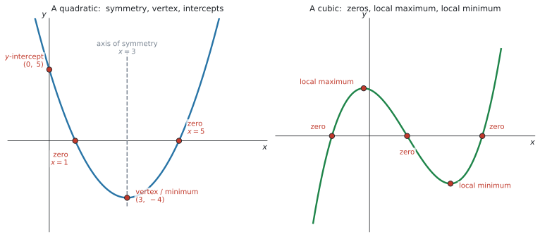
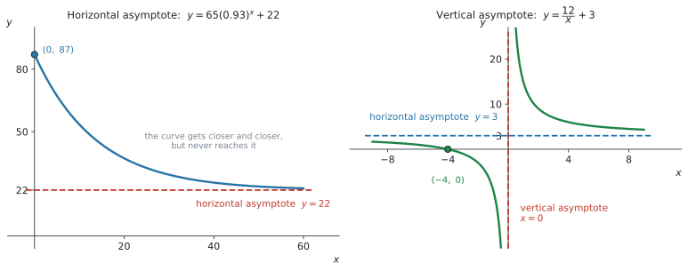
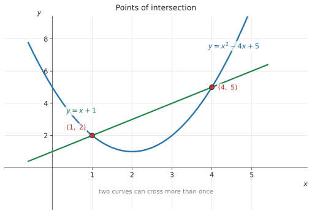

# SL 2.4 — Key features of graphs（グラフの重要な特徴） {#sec-sl-2-4}

::: {.callout-note}
## What you should be able to do
- グラフの **key features** が何なのかを、英語の名前で言える。
- **zero・root・$x$-intercept が同じもの**だと分かる。
- **最大値・最小値**を電卓で読み、**値と座標を書き分けられる**。
- **axis of symmetry** と **vertex** を求められる。
- **vertical asymptote** と **horizontal asymptote** の式を書ける。
- **2つのグラフの交点**を電卓で求められる。
:::

::: {.callout-important}
## Formula booklet には、この項目の式はありません
公式集の Topic 2 の欄には、**SL 2.1 と SL 2.5 の式しかありません。**

ただし、SL 2.5 の欄に載っている**次の式は、この項目でそのまま使えます。**

$$
f(x) = ax^{2} + bx + c \ \Rightarrow \ \text{axis of symmetry is } x = -\frac{b}{2a}
$$

**配られるので、覚える必要はありません。** 覚えるべきなのは、**key features の英語の名前**のほうです。
:::

::: {.callout-tip}
## 電卓を開きながら読んでください
シラバスの Guidance 欄に、はっきり **using graphing technology** と書かれています。

> Maximum and minimum values; intercepts; symmetry; vertex; zeros of functions or roots of equations; vertical and horizontal asymptotes **using graphing technology**.

**この項目は、電卓の操作そのものが中身です。** 読むだけでは身につきません。`ctrl + doc → 2: Add Graphs` を開いた状態で読み進めてください。
:::

## The idea

SL 2.3 でグラフを「かく・読む」練習をしました。**この項目は、その「読む」ほうに名前を付けて整理します。**

### 1. key features の一覧 {#key-features}

シラバスの Guidance 欄に並んでいるものが、そのまま**答えられるようにしておくもののリスト**です。

| English | 日本語 | どういうものか |
|---|---|---|
| maximum value | 最大値 | グラフの山の高さ |
| minimum value | 最小値 | グラフの谷の深さ |
| intercepts | 切片 | 軸と交わる点（$x$-intercept・$y$-intercept） |
| symmetry | 対称性 | 折り返して重なる線（axis of symmetry） |
| vertex | 頂点 | 2次関数の山・谷の点 |
| zeros / roots | 零点・解 | $f(x) = 0$ になる $x$ |
| vertical asymptote | 垂直漸近線 | グラフが近づいていく縦の線 |
| horizontal asymptote | 水平漸近線 | グラフが近づいていく横の線 |

: SL 2.4 で答えられるようにする key features {#tbl-sl24-features}

@fig-sl24-features に、まとめて示しました。

{#fig-sl24-features width=100%}

::: {.callout-note}
## SL 2.3 との関係
SL 2.3 で「**key features にラベルを付けなさい**」と言われました。**その key features の中身が、この項目です。**

つまり **SL 2.4 で名前と求め方を覚え、SL 2.3 のかき方でそれを紙に書く**、という関係になっています。
:::

### 2. zero・root・$x$-intercept は同じものです {#zeros-roots}

シラバスの言い方は、こうです。

> **zeros of functions** or **roots of equations**

**同じ $x$ を、3つの言い方で呼んでいるだけ**です。

| 言い方 | どういう場面で使うか |
|---|---|
| **zero** of the function $f$ | 関数の話をしているとき |
| **root** of the equation $f(x) = 0$ | 方程式の話をしているとき |
| **$x$-intercept** of the graph | グラフの話をしているとき |

: 同じものの3つの呼び方 {#tbl-sl24-zeros}

$f(x) = x^{2} - 6x + 5$ なら、$x = 1$ と $x = 5$ が

- $f$ の **zeros**
- $x^{2} - 6x + 5 = 0$ の **roots**
- グラフの **$x$-intercepts**

です。**どれで聞かれても、電卓でやることは同じ**です。

```
menu → 6: Analyze Graph → 1: Zero
```

::: {.callout-warning}
## ただし、答えの書き方は変わります
**聞かれ方によって、答えの形が変わります。**

- `Find the zeros of f.` → $x = 1$、$x = 5$（**数**を答える）
- `Write down the coordinates of the x-intercepts.` → $(1,\ 0)$、$(5,\ 0)$（**座標**を答える）

**`coordinates` と書いてあったら、必ず $(\ ,\ )$ の形で答えてください。**
:::

### 3. 最大値・最小値は「値」と「点」を書き分けます {#max-min}

ここが、この項目で一番落とすところです。

| 聞かれ方 | 答えるもの | 例 |
|---|---|---|
| the **maximum value** | $y$ の値だけ | $20$ |
| the **coordinates of the maximum point** | 座標 | $(2,\ 20)$ |
| the **value of $x$** at which the maximum occurs | $x$ の値だけ | $2$ |

: 最大値の3つの聞かれ方 {#tbl-sl24-maxmin}

電卓は $(2,\ 20)$ という**座標で**出してきます。ですから、**そこから聞かれたぶんだけを取り出す**という作業が必ず入ります。

#### local maximum と local minimum {#local}

@fig-sl24-features の右側の cubic には、**山と谷が1つずつ**あります。この山は「**そのあたりで一番高い**」だけで、グラフ全体で一番高いわけではありません（右へ行けば、もっと高くなります）。

このような山を **local maximum**（極大）、谷を **local minimum**（極小）と呼びます。

**domain が指定されている問題では、端の点にも気をつけてください。** 山より端のほうが高いことがあります。

::: {.callout-note}
## Topic 5 では、別のやり方で調べます
Topic 2 では、maximum や minimum を**グラフと GDC から読み取ります。** [Topic 5](../05-calculus/sl-5-1.qmd) では、**derivative**（導関数）を使って、その場所を数学的に調べます。
:::

::: {.callout-tip}
## 文脈のある問題では、言葉まで書きます
*The maximum profit is 200 dollars.* のように、**数だけでなく「何が」「いくつ」なのか**を1文で書くのが AI SL の点の取り方です。

$(15,\ 200)$ とだけ書いて終わると、**聞かれたことに答えていない**ことになります。
:::

### 4. axis of symmetry と vertex {#symmetry-vertex}

2次関数のグラフは、**縦の線について左右対称**です。その線を **axis of symmetry**（対称軸）といいます。

公式集（SL 2.5 の欄）に、次の式が載っています。

$$
f(x) = ax^{2} + bx + c \ \Rightarrow \ \text{axis of symmetry is } x = -\frac{b}{2a}
$$ {#eq-sl24-axis}

$f(x) = x^{2} - 6x + 5$ なら $a = 1$、$b = -6$ なので

$$
x = -\frac{-6}{2(1)} = 3
$$

**検算。** $f(1) = 0$ と $f(5) = 0$ の真ん中は $\dfrac{1 + 5}{2} = 3$ ✓（@fig-sl24-features 左）

#### axis of symmetry は「式」で答えます {#axis-equation}

答えは **$x = 3$** です。**$3$ とだけ書くと点になりません。**

axis of symmetry は**線**なので、線の式で答える必要があります。

#### vertex は、そこに代入して出します {#vertex}

**vertex**（頂点）は、axis of symmetry の上にあります。ですから $x = 3$ を式に入れれば $y$ が出ます。

$$
f(3) = 3^{2} - 6(3) + 5 = -4 \ \Rightarrow \ \text{vertex } (3,\ -4)
$$

電卓なら1手です。

```
menu → 6: Analyze Graph → 2: Minimum
```

### 5. asymptote {#asymptote}

**asymptote**（漸近線）は、**グラフがある方向へ進むとき、限りなく近づいていく直線**です。

::: {.callout-note}
## 「近づく」であって、「絶対に届かない」ではありません
このページで扱う exponential model や inverse variation の代表例では、グラフは通常その漸近線に達しません。ただし、**一般にはグラフが horizontal asymptote と交わることもあります。**

「近づいていく」が定義で、「届かない」はそのつどグラフや式で確かめることです。
:::

{#fig-sl24-asymptotes width=100%}

#### horizontal asymptote {#horizontal-asymptote}

$x$ をどんどん大きく（または小さく）していったときに、**$y$ が近づいていく値**です。

@fig-sl24-asymptotes の左は $y = 65(0.93)^{x} + 22$ です。$0.93^{x}$ は $x$ が大きくなると $0$ に近づくので、残るのは $22$ です。

$$
y = 22
$$

**$y = ka^{x} + c$ の形なら、horizontal asymptote は $y = c$ です。** SL 2.5 の exponential model で、そのまま使います。

#### vertical asymptote {#vertical-asymptote}

**rational function**（分数関数）では、まず**分母が $0$ になる $x$** を vertical asymptote の候補として調べます。その $x$ に近づいたとき、関数の値が**非常に大きく、または非常に小さくなる**なら、その $x$ が vertical asymptote です。

::: {.callout-warning}
## 分母が $0$ になるだけでは、asymptote とはかぎりません
約分によって因数が消える場合は、asymptote ではなく **hole**（穴）になることがあります。

$$
\frac{x^{2} - 1}{x - 1} = x + 1 \qquad (x \neq 1)
$$

この場合、$x = 1$ は vertical asymptote ではありません。
:::

@fig-sl24-asymptotes の右は $y = \dfrac{12}{x} + 3$ です。分母が $0$ になるのは $x = 0$ で、$x$ を $0$ に近づけると $\dfrac{12}{x}$ の値はいくらでも大きく（または小さく）なります。ですから

$$
x = 0
$$

が vertical asymptote です。**この式では、$y$ 軸そのものが asymptote になっています。**

::: {.callout-important}
## asymptote は「式」で答えます
- horizontal → **$y = 22$**（$22$ ではありません）
- vertical → **$x = 0$**（$0$ ではありません）

**どちらも線なので、線の式で答えます。** 数だけ書いて落とす人がとても多いところです。
:::

::: {.callout-warning}
## 電卓は asymptote をかいてくれません
`Analyze Graph` に `Asymptote` という項目はありません。**自分で見つけます。**

- **horizontal** … $x$ を大きくしたときに $y$ が近づく値を、表（`ctrl + T`）で見る
- **vertical** … 分母が $0$ になる $x$ を候補として探し、その両側でグラフがどのように動くか確認する

さらに、電卓は $x = 0$ のところで**左右をつなぐ縦の線をかいてしまうことがあります。** これは asymptote ではなく、点を線で結んだだけの**うその線**です。**紙に写すときは、この線をかいてはいけません。**
:::

### 6. 2つのグラフの交点 {#intersection}

シラバスの Content 欄の2行目です。

> Finding the **points of intersection** of two curves or lines using technology.

{#fig-sl24-intersection width=76%}

**交点は「2つの式が同じ値になる点」**です。ですから

$$
f(x) = g(x)
$$ {#eq-sl24-inter}

を解くことと、**同じこと**をしています。

@fig-sl24-intersection では $y = x^{2} - 4x + 5$ と $y = x + 1$ が $(1,\ 2)$ と $(4,\ 5)$ で交わっています。この $x = 1$、$x = 4$ が、方程式 $x^{2} - 4x + 5 = x + 1$ の解です。

```
menu → 6: Analyze Graph → 4: Intersection
```

::: {.callout-warning}
## 1つ見つけて終わりにしない
`Intersection` は、**指定した範囲の中の交点を1つだけ**返します。

**交点が2つあるなら、2回に分けて読んでください。** グラフを見て「いくつ交わっているか」を先に数えるのが確実です。
:::

## Why it works

:::: {.callout-note collapse="true" appearance="simple"}
## クリックすると開きます
ここでは、**この例で asymptote に届かないのはなぜか**だけを説明します。

$y = \dfrac{12}{x} + 3$ で、$y = 3$ になることがあるでしょうか。もしあるなら

$$
\frac{12}{x} + 3 = 3 \ \Rightarrow \ \frac{12}{x} = 0
$$

ですが、$12$ を何で割っても $0$ にはなりません。**ですから、$y = 3$ になる $x$ は存在しません。**

一方で、$x = 1000$ なら $\dfrac{12}{1000} = 0.012$ で $y = 3.012$。$x = 1000000$ なら $y = 3.000012$。**いくらでも近づけますが、この式では届きません。**

これは $y = \dfrac{12}{x} + 3$ という式の性質で、**すべての asymptote についての説明ではありません。**
::::

## Worked examples

::: {.callout-note appearance="simple"}
問題文は英語です。意味が理解できなかったら、問題文の下の「**日本語訳**」を開いてください。解説は日本語です。
:::

::: {#exm-sl24-quad}
[The function $f$ is defined by $f(x) = x^{2} - 6x + 5$.]{.q-en}

**(a)** [Write down the coordinates of the $y$-intercept.]{.q-en}

**(b)** [Find the zeros of $f$.]{.q-en}

**(c)** [Find the equation of the axis of symmetry.]{.q-en}

**(d)** [Write down the coordinates of the vertex.]{.q-en}

<details class="jp-trans">
<summary>日本語訳</summary>

関数 $f$ が $f(x) = x^{2} - 6x + 5$ で定められています。

**(a)** $y$ 切片の座標を書きなさい。

**(b)** $f$ の zeros を求めなさい。

**(c)** 対称軸の式を求めなさい。

**(d)** 頂点の座標を書きなさい。

</details>

---

**(a)** $y$ 切片は $x = 0$ のところです。

$$
f(0) = 0 - 0 + 5 = 5
$$

`coordinates` と書いてあるので、$(0,\ 5)$ と座標で答えます。

**(b)** [zeros](#zeros-roots) は $f(x) = 0$ になる $x$ です。

```
menu → 6: Analyze Graph → 1: Zero
```

$x = 1$ と $x = 5$ です。**$2$ つあるので、$2$ 回に分けて読みます。**

ここは `zeros` と聞かれているので、**数で答えます**（$(1,\ 0)$ ではありません）。

**(c)** [公式](#symmetry-vertex)に $a = 1$、$b = -6$ を入れます。

$$
x = -\frac{-6}{2(1)} = 3
$$

**検算。** (b) の $1$ と $5$ の真ん中は $3$ ✓

答えは **$x = 3$** です。$3$ とだけ書くと[点になりません](#axis-equation)。

**(d)** vertex は対称軸の上にあるので、$x = 3$ を入れます。

$$
f(3) = 9 - 18 + 5 = -4
$$

::: {.callout-note}
## 解答例（答案用紙にはこう書く）
**(a)** $f(0) = 5$, so the $y$-intercept is $(0,\ 5)$

**(b)** $x = 1$ and $x = 5$

**(c)** $x = -\dfrac{-6}{2(1)} = 3$, so the axis of symmetry is $x = 3$

**(d)** $f(3) = -4$, so the vertex is $(3,\ -4)$
:::
:::

::: {#exm-sl24-profit}
[The daily profit, in dollars, of a small shop selling $x$ items is modelled by]{.q-en}

$$
P(x) = -2x^{2} + 60x - 250, \qquad 0 \leq x \leq 30
$$

**(a)** [Find the number of items that gives the maximum profit.]{.q-en}

**(b)** [Find the maximum profit.]{.q-en}

**(c)** [Find the values of $x$ for which the profit is zero.]{.q-en}

**(d)** [Interpret your answers to part (c) in the context of the question.]{.q-en}

<details class="jp-trans">
<summary>日本語訳</summary>

ある小さな店の1日の利益（ドル）が、$x$ 個売ったとき

$$
P(x) = -2x^{2} + 60x - 250, \qquad 0 \leq x \leq 30
$$

でモデル化されています。

**(a)** 利益が最大になる個数を求めなさい。

**(b)** 最大の利益を求めなさい。

**(c)** 利益が $0$ になる $x$ の値を求めなさい。

**(d)** (c) の答えを、この問題の文脈で解釈しなさい。

</details>

---

**(a)** 電卓でグラフをかいて、山の点を読みます（[GDCの使い方](#read-features)）。

```
menu → 6: Analyze Graph → 3: Maximum
```

$(15,\ 200)$ が出ます。ここで聞かれているのは「**個数**」なので、**$x$ の値だけ**を答えます。

$$
x = 15
$$

**(b)** 同じ点の $y$ のほうです。

$$
P(15) = -2(225) + 60(15) - 250 = 200
$$

$200$ ドルです。**(a) と (b) で、同じ座標から違う数を取り出している**ことに注意してください（@tbl-sl24-maxmin）。

**(c)** $P(x) = 0$ になる $x$ なので、[zeros](#zeros-roots) です。

```
menu → 6: Analyze Graph → 1: Zero
```

$x = 5$ と $x = 25$ です。

**(d)** 数を出しただけでは点になりません。**この数が現実の何なのか**を書きます。

利益が $0$ ということは、**もうけも損もない**ということです。$5$ 個から $25$ 個のあいだで売れば、利益が出ます。

::: {.model-answer}
**試験ではこう書く**

*The shop breaks even when it sells 5 items or 25 items. Between these values the profit is positive, so the shop makes a profit when it sells between 5 and 25 items.*
:::

（$5$ 個と $25$ 個で収支がちょうど $0$ になり、そのあいだで売れば利益が出る、という意味です。）

::: {.callout-note}
## 解答例（答案用紙にはこう書く）
**(a)** $x = 15$ items

**(b)** $P(15) = 200$, so the maximum profit is $200$ dollars

**(c)** $x = 5$ and $x = 25$

**(d)** *The shop breaks even when it sells 5 items or 25 items. Between these values the profit is positive, so the shop makes a profit when it sells between 5 and 25 items.*
:::
:::

::: {#exm-sl24-asym}
[A function is defined by $f(x) = \dfrac{12}{x} + 3$, for $x \neq 0$.]{.q-en}

**(a)** [Write down the equation of the vertical asymptote.]{.q-en}

**(b)** [Write down the equation of the horizontal asymptote.]{.q-en}

**(c)** [Find the $x$-intercept of the graph of $f$.]{.q-en}

**(d)** [Explain why the graph of $f$ has no $y$-intercept.]{.q-en}

<details class="jp-trans">
<summary>日本語訳</summary>

$x \neq 0$ に対して、関数が $f(x) = \dfrac{12}{x} + 3$ で定められています。

**(a)** 垂直漸近線の式を書きなさい。

**(b)** 水平漸近線の式を書きなさい。

**(c)** $f$ のグラフの $x$ 切片を求めなさい。

**(d)** $f$ のグラフに $y$ 切片がない理由を説明しなさい。

</details>

---

**(a)** [分母が $0$ になる $x$](#vertical-asymptote) を探します。$\dfrac{12}{x}$ の分母が $0$ になるのは $x = 0$ で、そこに近づくと値がいくらでも大きく（小さく）なります。

$$
x = 0
$$

**「$0$」ではなく「$x = 0$」**と書きます。

**(b)** $x$ を大きくすると $\dfrac{12}{x}$ は $0$ に近づくので、残るのは $3$ です。

$$
y = 3
$$

**検算。** $x = 1000$ で $f = 3.012$、$x = 10000$ で $f = 3.0012$ ✓ 近づいています。

**(c)** $x$ 切片は $f(x) = 0$ のところです。

$$
\frac{12}{x} + 3 = 0 \ \Rightarrow \ \frac{12}{x} = -3 \ \Rightarrow \ x = -4
$$

電卓なら `Analyze Graph → Zero` でも出ます。座標で答えるなら $(-4,\ 0)$ です。

**(d)** $y$ 切片は $x = 0$ を入れたときの値ですが、**$x = 0$ は入れられません。**

::: {.model-answer}
**試験ではこう書く**

*The $y$-intercept would be $f(0)$, but this requires dividing by zero, so $f(0)$ is undefined. The graph therefore has no $y$-intercept.*
:::

（$y$ 切片は $f(0)$ ですが、$0$ で割ることになるので定義できない、という意味です。）

::: {.callout-note}
## 解答例（答案用紙にはこう書く）
**(a)** $x = 0$

**(b)** $y = 3$

**(c)** $\dfrac{12}{x} + 3 = 0 \Rightarrow \dfrac{12}{x} = -3 \Rightarrow x = -4$

**(d)** *$f(0)$ is undefined because it requires dividing by zero, so the graph has no $y$-intercept.*
:::
:::

::: {#exm-sl24-coffee}
[The temperature of a cup of coffee, in degrees Celsius, $t$ minutes after it is made is modelled by]{.q-en}

$$
T(t) = 65(0.93)^{t} + 22, \qquad t \geq 0
$$

**(a)** [Write down the temperature of the coffee when it is made.]{.q-en}

**(b)** [Write down the equation of the horizontal asymptote of the graph of $T$.]{.q-en}

**(c)** [Interpret the value found in part (b) in the context of the question.]{.q-en}

**(d)** [Find the time taken for the coffee to cool to 40 degrees Celsius. Give your answer correct to three significant figures.]{.q-en}

<details class="jp-trans">
<summary>日本語訳</summary>

コーヒーの温度（摂氏）が、いれてから $t$ 分後に

$$
T(t) = 65(0.93)^{t} + 22, \qquad t \geq 0
$$

でモデル化されています。

**(a)** いれた瞬間のコーヒーの温度を書きなさい。

**(b)** $T$ のグラフの水平漸近線の式を書きなさい。

**(c)** (b) で求めた値を、この問題の文脈で解釈しなさい。

**(d)** コーヒーが摂氏 $40$ 度まで冷めるのにかかる時間を、有効数字3桁で求めなさい。

</details>

---

**(a)** 「いれた瞬間」は $t = 0$ です。

$$
T(0) = 65(1) + 22 = 87
$$

$87$ 度です（$0.93^{0} = 1$ です）。

**(b)** [$y = ka^{x} + c$ の形](#horizontal-asymptote)なので、$c$ の値です。

$$
T = 22
$$

**軸の文字に合わせて $T = 22$ と書きます。** この問題では縦軸が $T$ なので、$y = 22$ ではありません。

**(c)** コーヒーは冷めていって、**$22$ 度に近づきますが、それより下がりません。** これは**部屋の温度**です。

::: {.model-answer}
**試験ではこう書く**

*The coffee cools towards 22 degrees but never goes below it, so 22 degrees is the temperature of the room.*
:::

（コーヒーは $22$ 度に向かって冷めていくが、それより下がらない。つまり $22$ 度は部屋の温度である、という意味です。）

**(d)** $T = 40$ になる $t$ を求めます。**グラフを2本かいて交点を読む**のが速いです。

```
f1(x) = 65(0.93)^x + 22
f2(x) = 40
menu → 6: Analyze Graph → 4: Intersection
```

$t = 17.693\ldots$ なので、有効数字3桁で **$17.7$ 分**です。

**検算。** $T(17.7) \approx 40.0$ ✓

::: {.callout-note}
## 解答例（答案用紙にはこう書く）
**(a)** $T(0) = 87$ degrees

**(b)** $T = 22$

**(c)** *The coffee cools towards 22 degrees but never goes below it, so 22 degrees is the temperature of the room.*

**(d)** $65(0.93)^{t} + 22 = 40$, so $t = 17.69\ldots = 17.7$ minutes (3 s.f.)
:::
:::

::: {#exm-sl24-inter}
[Two functions are defined by $f(x) = x^{2} - 4x + 5$ and $g(x) = x + 1$.]{.q-en}

**(a)** [Use your GDC to find the coordinates of the points of intersection of the graphs of $f$ and $g$.]{.q-en}

**(b)** [Hence write down the solutions of the equation $x^{2} - 4x + 5 = x + 1$.]{.q-en}

**(c)** [Write down the coordinates of the vertex of the graph of $f$.]{.q-en}

<details class="jp-trans">
<summary>日本語訳</summary>

2つの関数が $f(x) = x^{2} - 4x + 5$、$g(x) = x + 1$ で定められています。

**(a)** 電卓を使って、$f$ と $g$ のグラフの交点の座標を求めなさい。

**(b)** これを使って、方程式 $x^{2} - 4x + 5 = x + 1$ の解を書きなさい。

**(c)** $f$ のグラフの頂点の座標を書きなさい。

</details>

---

**(a)** 2本を同時にかきます。

```
f1(x) = x^2 - 4x + 5
f2(x) = x + 1
menu → 6: Analyze Graph → 4: Intersection
```

**交点は2つあります**（@fig-sl24-intersection）。1回では1つしか出ないので、**2回に分けて読みます。**

$$
(1,\ 2) \quad \text{と} \quad (4,\ 5)
$$

**検算。** $f(1) = 1 - 4 + 5 = 2$、$g(1) = 2$ ✓

**(b)** `Hence` は「**直前の答えを使え**」という意味です。交点の $x$ 座標が、そのまま方程式の解になります。

$$
x = 1, \quad x = 4
$$

**ここで聞かれているのは方程式の解なので、$x$ の値だけ**を書きます。

**(c)** vertex です。$a = 1$、$b = -4$ なので

$$
x = -\frac{-4}{2(1)} = 2, \qquad f(2) = 4 - 8 + 5 = 1
$$

::: {.callout-note}
## 解答例（答案用紙にはこう書く）
**(a)** $(1,\ 2)$ and $(4,\ 5)$

**(b)** $x = 1$ and $x = 4$

**(c)** $x = -\dfrac{-4}{2(1)} = 2$ and $f(2) = 1$, so the vertex is $(2,\ 1)$
:::
:::

## Common errors

::: {.callout-warning}
## 「最大値は $(2,\ 20)$ です」と座標で答える
**`the maximum value` は $y$ の値だけ**です。$20$ と書きます。

逆に `the coordinates of the maximum point` なら $(2,\ 20)$ です。**電卓は必ず座標で出してくるので、そこから聞かれたぶんを取り出してください**（@tbl-sl24-maxmin）。
:::

::: {.callout-warning}
## zero・root・$x$-intercept を別のものだと思う
**同じ $x$ の、3つの呼び方**です（@tbl-sl24-zeros）。

`Find the roots of the equation` と言われても、電卓でやることは `Analyze Graph → Zero` で変わりません。
:::

::: {.callout-warning}
## asymptote の答えを数だけで書く
**$22$ ではなく $y = 22$。$0$ ではなく $x = 0$。**

asymptote は**線**なので、**線の式**で答えます。axis of symmetry も同じで、$3$ ではなく $x = 3$ です。
:::

::: {.callout-warning}
## 電卓がかいた縦の線を asymptote だと思う
TI-Nspire は $y = \dfrac{12}{x}$ のようなグラフで、$x = 0$ の左右を**つなぐ縦の線**をかいてしまうことがあります。

**これはグラフの一部ではありません。** 点を線で結んだだけです。**紙に写すときは、この線をかいてはいけません。**
:::

::: {.callout-warning}
## horizontal asymptote をいつも $y = 0$ だと思う
$y = ka^{x}$ なら $y = 0$ ですが、**$y = ka^{x} + c$ なら $y = c$** です。

$+ c$ の部分を見落とすと、そのまま失点します。**式の最後の定数を必ず見てください。**
:::

::: {.callout-warning}
## 交点を1つ見つけて終わりにする
`Intersection` は**1回に1つ**しか返しません。

**まずグラフを見て、いくつ交わっているかを数えてから**、その回数だけ実行してください。
:::

::: {.callout-warning}
## 指定された domain の外の最大値を答える
$0 \leq x \leq 30$ と書いてあるのに、電卓が範囲外で見つけた点を答えてしまう誤りです。

**Window を問題の domain に合わせてから**読むと、この誤りは起きません。
:::

::: {.callout-warning}
## 文脈のある問題で、数だけ書いて終わる
`Interpret` や `Comment on` が付いていたら、**英語の一文が答え**です。

$x = 5$、$x = 25$ とだけ書いても、`Interpret` の点は $0$ です。**「これが現実の何なのか」を必ず書いてください。**
:::

## Using your GDC (TI-Nspire CX II)

**この項目は、電卓の操作そのものが中身です。**

### 1. グラフを出す

```
ctrl + doc → 2: Add Graphs
f1(x) = x^2 - 6x + 5
```

### 2. 全体が見える大きさにする

**先にこれをやります。** 画面に入っていないものは読めません。

```
menu → Window/Zoom → Zoom - Fit
```

**domain が指定されている問題では、`Window Settings` でその範囲を手で入れる**ほうが確実です。範囲外の点を答える誤りが防げます。

### 3. key features を読む {#read-features}

```
menu → 6: Analyze Graph → 1: Zero          （x 切片・zeros・roots）
menu → 6: Analyze Graph → 2: Minimum       （最小点・下向きの vertex）
menu → 6: Analyze Graph → 3: Maximum       （最大点・上向きの vertex）
menu → 6: Analyze Graph → 4: Intersection  （2本のグラフの交点）
```

どれも**同じ操作の流れ**です。

1. メニューから選ぶ
2. **グラフをクリック**する（`Intersection` は2本ともクリック）
3. `lower bound?` と出たら、**左の境目**を決めて `enter`
4. `upper bound?` と出たら、**右の境目**を決めて `enter`
5. その**あいだにある1つ**の座標が表示される

::: {.callout-warning #bounds}
## `lower bound?` と `upper bound?` の $2$ 回、`enter` を押します
**答えが出ないときは、たいていこれです。**

画面の左下に

```
lower bound?
```

と出ているあいだ、電卓は**あなたが範囲を決めるのを待っています。** ここで `enter` を押さないと先へ進みません。決めると点線が $1$ 本立ち、続けて

```
upper bound?
```

に変わります。**もう $1$ 回 `enter`** を押すと、$2$ 本の点線にはさまれた帯（画面では灰色になります）の中を探して、座標が出ます。

**「電卓が壊れた」と思ってやり直す生徒が、毎年います。** 画面の左下を見てください。

::: {.callout-tip}
## 境目は、$x$ の値を打ちこんでも決められます
カーソルを動かして合わせるほかに、**数を直接打ちこむ**こともできます。$-1$ と打って `enter`、$3$ と打って `enter`、という具合です。

**そのほうが速くて、狙った範囲になります。**
:::
:::

::: {.callout-important}
## 「あいだにある1つ」だけです
これがこの操作の一番大事な性質です。**囲んだ範囲の中にあるものを、1つだけ返します。**

zeros が2つあるなら、**左の1つを囲んで実行 → 右の1つを囲んで実行**、と2回やります。交点も同じです。

ですから、**探したいものが $2$ 本の点線のあいだに入っているか**を、`enter` を押す前に目で確かめてください。
:::

$y$ 切片は、`Analyze Graph` を使うより **$x = 0$ を式に入れるほうが速い**ことが多いです。

### 4. asymptote を見つける

**`Analyze Graph` に asymptote はありません。** 次の2つで探します。

**horizontal** … $x$ をうんと大きくしたときに、$y$ がどの値に近づくかを見ます。**やり方は $2$ つ**あります。

**方法1：表を出す**

```
ctrl + T
```

$x = 100$、$x = 1000$ と入れて、$y$ がどの値に近づくかを読みます。

**方法2：Trace で、大きい $x$ を打ちこむ**

```
menu → Trace → Graph Trace
```

カーソルが曲線に乗った状態で、**$x$ の値を直接打ちこむ**とそこへ飛びます。`100000` のような大きい数を入れてください。

#### $y$ が `3E-5` のように表示されたら {#e-display}

画面が狭いので、電卓は**小さい数を [$E$ の形](../01-number-and-algebra/sl-1-1.qmd#e-notation)で表示**します。$3 \times 10^{-5}$ という意味です。

$$
\texttt{3E-5} \ = \ 3 \times 10^{-5} \ = \ 0.00003
$$

**これは「ほとんど $0$」ということ**です。$x$ をもっと大きくすれば、もっと $0$ に近づきます。ですから **horizontal asymptote は $y = 0$** と読みます。

::: {.callout-warning}
## `3E-5` を「$3$ に近づいている」と読まないでください
`E` のあとの**マイナスを見落とす**と、まったく違う答えになります。

| 表示 | 意味 | 読み取り |
|---|---|---|
| `3E-5` | $0.00003$ | $y = 0$ に近づいている |
| `3E5` | $300\,000$ | $0$ には近づいていない |

**マイナスが付いていたら、小さい数**です。
:::

::: {.callout-note appearance="simple"}
いっしょに出る `1E+5` は $x$ のほうの表示です。$100\,000$ を打ちこんだので、$1 \times 10^{5}$ と表示されています。

答案には **`3E-5` と書いてはいけません。** $y = 0$、または $3 \times 10^{-5}$ と書きます（[SL 1.1](../01-number-and-algebra/sl-1-1.qmd#e-notation) と同じ決まりです）。
:::

**vertical** … 式を見て、**分母が $0$ になる $x$** を候補として探します。$\dfrac{12}{x}$ なら $x = 0$、$\dfrac{5}{x - 2}$ なら $x = 2$。そのうえで、**その両側でグラフがどう動くか**を画面で確かめてください。

### 5. 方程式を交点で解く

$f(x) = 40$ のような式は、**$2$ 本のグラフの交点**として読めます。

```
f1(x) = 65(0.93)^x + 22
f2(x) = 40
menu → 6: Analyze Graph → 4: Intersection
```

`f2` は**横一直線**になります。SL 1.8 で使ったやり方と同じです。

`Intersection` でも、**$2$ 本のグラフをクリックしたあとに [`lower bound?` と `upper bound?`](#bounds) を聞かれます。** 交点が $2$ つあるときは、片方ずつ囲んで $2$ 回実行してください。

::: {.callout-tip}
## スライダーで動かしてみる
シラバスの Use of technology 欄に、こう書かれています。

> Graphing technology with **sliders** to determine the effects of altering parameters and variables

```
menu → Actions → Insert Slider
```

たとえば `f1(x) = a*x^2 + b*x + c` として $a$、$b$、$c$ をスライダーにすると、**$b$ を動かしたときに axis of symmetry がどう動くか**が目で見えます。

**試験で使うものではありませんが、$-\dfrac{b}{2a}$ が腑に落ちない人には効きます。**
:::

## Exercises

::: {.callout-note appearance="simple"}
各問題に、折りたたみが3つ付いています。**日本語訳**、**解答例**（答案用紙に書くべきこと。英語です）、**解説**（なぜそうなるか。日本語です）。

まず自分で解いて、次に解答例と見くらべてください。**解説は、合わなかったときだけ開けば十分です。**
:::

::: {.exercise-block}

[1]{.ex-no} [The function $f$ is defined by $f(x) = x^{2} - 8x + 12$.]{.q-en}

**(a)** [Write down the coordinates of the $y$-intercept.]{.q-en}

**(b)** [Find the zeros of $f$.]{.q-en}

**(c)** [Find the equation of the axis of symmetry.]{.q-en}

**(d)** [Write down the coordinates of the vertex.]{.q-en}

<details class="jp-trans">
<summary>日本語訳</summary>

関数 $f$ が $f(x) = x^{2} - 8x + 12$ で定められています。

**(a)** $y$ 切片の座標を書きなさい。

**(b)** $f$ の zeros を求めなさい。

**(c)** 対称軸の式を求めなさい。

**(d)** 頂点の座標を書きなさい。

</details>

::: {.callout-note collapse="true"}
## 解答例（答案用紙に書くこと）
**(a)** $f(0) = 12$, so the $y$-intercept is $(0,\ 12)$

**(b)** $x = 2$ and $x = 6$

**(c)** $x = -\dfrac{-8}{2(1)} = 4$, so the axis of symmetry is $x = 4$

**(d)** $f(4) = 16 - 32 + 12 = -4$, so the vertex is $(4,\ -4)$
:::

::: {.callout-tip collapse="true"}
## 解説
**(a)** は $x = 0$ を入れるだけです。`coordinates` なので $(0,\ 12)$ と座標で書きます。

**(b)** は `Analyze Graph → Zero` を2回。`zeros` なので数で答えます。

**(c)** は公式集の $x = -\dfrac{b}{2a}$ に $a = 1$、$b = -8$ を入れます。**検算**：(b) の $2$ と $6$ の真ん中は $4$ ✓

**(d)** は $x = 4$ を式に入れるだけです。`Analyze Graph → Minimum` でも同じ答えになります。
:::

::: {.ex-sep}
:::

[2]{.ex-no} [The function $g$ is defined by $g(x) = -x^{2} + 4x + 5$.]{.q-en}

**(a)** [Write down the maximum value of $g$.]{.q-en}

**(b)** [Write down the coordinates of the maximum point.]{.q-en}

**(c)** [Find the zeros of $g$.]{.q-en}

<details class="jp-trans">
<summary>日本語訳</summary>

関数 $g$ が $g(x) = -x^{2} + 4x + 5$ で定められています。

**(a)** $g$ の最大値を書きなさい。

**(b)** 最大点の座標を書きなさい。

**(c)** $g$ の zeros を求めなさい。

</details>

::: {.callout-note collapse="true"}
## 解答例（答案用紙に書くこと）
**(a)** $9$

**(b)** $(2,\ 9)$

**(c)** $x = -1$ and $x = 5$
:::

::: {.callout-tip collapse="true"}
## 解説
**(a) と (b) は、同じ点から取り出しています。** 電卓の `Analyze Graph → Maximum` は $(2,\ 9)$ と座標で出しますが、(a) は `the maximum value` なので **$y$ の値だけ**を書きます。

ここを座標で書いてしまう人がとても多いところです（@tbl-sl24-maxmin）。

$x^{2}$ の係数が $-1$（負）なので、グラフは上に凸です。だから山になります。
:::

::: {.ex-sep}
:::

[3]{.ex-no} [A function is defined by $f(x) = 50(0.8)^{x} + 12$.]{.q-en}

**(a)** [Write down the value of $f(0)$.]{.q-en}

**(b)** [Write down the equation of the horizontal asymptote.]{.q-en}

**(c)** [Find $f(10)$, giving your answer correct to three significant figures.]{.q-en}

<details class="jp-trans">
<summary>日本語訳</summary>

関数が $f(x) = 50(0.8)^{x} + 12$ で定められています。

**(a)** $f(0)$ の値を書きなさい。

**(b)** 水平漸近線の式を書きなさい。

**(c)** $f(10)$ を有効数字3桁で求めなさい。

</details>

::: {.callout-note collapse="true"}
## 解答例（答案用紙に書くこと）
**(a)** $f(0) = 50 + 12 = 62$

**(b)** $y = 12$

**(c)** $f(10) = 17.369\ldots = 17.4$ (3 s.f.)
:::

::: {.callout-tip collapse="true"}
## 解説
**(a)** $0.8^{0} = 1$ です。$0$ ではありません。

**(b)** $y = ka^{x} + c$ の形なので、**最後の定数 $c = 12$** が答えです。$y = 0$ と書く誤りが多いところです。

**(c)** 電卓に入れるだけですが、**$12$ に近づいてはいても、まだ $17.4$** です。asymptote は「近づいていく先」であって、$x = 10$ での値ではありません。
:::

::: {.ex-sep}
:::

[4]{.ex-no} [A function is defined by $f(x) = \dfrac{8}{x} - 2$, for $x \neq 0$.]{.q-en}

**(a)** [Write down the equations of the two asymptotes.]{.q-en}

**(b)** [Find the $x$-intercept of the graph of $f$.]{.q-en}

<details class="jp-trans">
<summary>日本語訳</summary>

$x \neq 0$ に対して、関数が $f(x) = \dfrac{8}{x} - 2$ で定められています。

**(a)** 2本の漸近線の式を書きなさい。

**(b)** $f$ のグラフの $x$ 切片を求めなさい。

</details>

::: {.callout-note collapse="true"}
## 解答例（答案用紙に書くこと）
**(a)** $x = 0$ and $y = -2$

**(b)** $\dfrac{8}{x} - 2 = 0 \Rightarrow \dfrac{8}{x} = 2 \Rightarrow x = 4$, so the $x$-intercept is $(4,\ 0)$
:::

::: {.callout-tip collapse="true"}
## 解説
**(a)** vertical は「[分母が $0$ になる $x$](#vertical-asymptote)」を候補として探して $x = 0$。$x$ を $0$ に近づけると $\dfrac{8}{x}$ の値がいくらでも大きく（小さく）なるので、$x = 0$ が vertical asymptote です。horizontal は $x$ を大きくすると $\dfrac{8}{x}$ が $0$ に近づくので、残る $-2$ です。

**どちらも式で書きます。** $0$ と $-2$ とだけ書くと点になりません。

**(b)** $f(x) = 0$ とおいて解きます。`Analyze Graph → Zero` でも出ます。
:::

::: {.ex-sep}
:::

[5]{.ex-no} [Two functions are defined by $f(x) = x^{2} - 2x - 3$ and $g(x) = 2x - 3$.]{.q-en}

**(a)** [Use your GDC to find the coordinates of the points of intersection of the two graphs.]{.q-en}

**(b)** [Hence write down the solutions of the equation $x^{2} - 2x - 3 = 2x - 3$.]{.q-en}

<details class="jp-trans">
<summary>日本語訳</summary>

2つの関数が $f(x) = x^{2} - 2x - 3$、$g(x) = 2x - 3$ で定められています。

**(a)** 電卓を使って、2つのグラフの交点の座標を求めなさい。

**(b)** これを使って、方程式 $x^{2} - 2x - 3 = 2x - 3$ の解を書きなさい。

</details>

::: {.callout-note collapse="true"}
## 解答例（答案用紙に書くこと）
**(a)** $(0,\ -3)$ and $(4,\ 5)$

**(b)** $x = 0$ and $x = 4$
:::

::: {.callout-tip collapse="true"}
## 解説
交点は**2つ**あるので、`Intersection` を**2回**実行します。

**検算**：$f(4) = 16 - 8 - 3 = 5$、$g(4) = 8 - 3 = 5$ ✓

**(b)** の `Hence` は「**(a) を使え**」という意味です。交点の $x$ 座標が、そのまま方程式の解になります。ここでは**方程式の解**を聞かれているので、$x$ の値だけを書きます。
:::

::: {.ex-sep}
:::

[6]{.ex-no} [The function $f$ is defined by $f(x) = x^{3} - 3x^{2} + 1$ for $-1 \leq x \leq 3$.]{.q-en}

**(a)** [Use your GDC to find the coordinates of the local maximum point and the local minimum point.]{.q-en}

**(b)** [Find the zeros of $f$, giving your answers correct to three significant figures.]{.q-en}

<details class="jp-trans">
<summary>日本語訳</summary>

$-1 \leq x \leq 3$ に対して、関数 $f$ が $f(x) = x^{3} - 3x^{2} + 1$ で定められています。

**(a)** 電卓を使って、極大点と極小点の座標を求めなさい。

**(b)** $f$ の zeros を有効数字3桁で求めなさい。

</details>

::: {.callout-note collapse="true"}
## 解答例（答案用紙に書くこと）
**(a)** local maximum $(0,\ 1)$, local minimum $(2,\ -3)$

**(b)** $x = -0.532$, $x = 0.653$ and $x = 2.88$ (3 s.f.)
:::

::: {.callout-tip collapse="true"}
## 解説
**(a)** `Analyze Graph → Maximum` と `→ Minimum` を1回ずつ。**山を囲むときに、谷まで一緒に囲まないでください。** 囲んだ範囲の中の1つしか返ってきません。

**(b)** zeros は**3つ**あります。**3回に分けて**読みます。グラフを見て「何回 $x$ 軸を横切っているか」を先に数えるのが確実です。

$2.879\ldots$ は有効数字3桁で $2.88$ です。$2.879$ と書くと4桁になってしまいます。
:::

::: {.ex-sep}
:::

[7]{.ex-no} [The value of a car, in dollars, $t$ years after it is bought is modelled by $V(t) = 24000(0.85)^{t} + 1500$.]{.q-en}

**(a)** [Write down the value of the car when it is bought.]{.q-en}

**(b)** [Write down the equation of the horizontal asymptote.]{.q-en}

**(c)** [Interpret your answer to part (b) in the context of the question.]{.q-en}

**(d)** [Find the number of years for the car to be worth 10 000 dollars. Give your answer correct to three significant figures.]{.q-en}

<details class="jp-trans">
<summary>日本語訳</summary>

車の価値（ドル）が、買ってから $t$ 年後に $V(t) = 24000(0.85)^{t} + 1500$ でモデル化されています。

**(a)** 買ったときの車の価値を書きなさい。

**(b)** 水平漸近線の式を書きなさい。

**(c)** (b) の答えを、この問題の文脈で解釈しなさい。

**(d)** 車の価値が $10\,000$ ドルになるまでの年数を、有効数字3桁で求めなさい。

</details>

::: {.callout-note collapse="true"}
## 解答例（答案用紙に書くこと）
**(a)** $V(0) = 24000 + 1500 = 25\,500$ dollars

**(b)** $V = 1500$

**(c)** *The value of the car falls towards 1500 dollars but never goes below it, so 1500 dollars is the lowest value the car can have.*

**(d)** $24000(0.85)^{t} + 1500 = 10000$, so $t = 6.386\ldots = 6.39$ years (3 s.f.)
:::

::: {.callout-tip collapse="true"}
## 解説
**(b)** の答えは、縦軸の文字に合わせて **$V = 1500$** と書きます。この問題では $y$ ではありません。

**(c)** は `Interpret` なので、**英語の一文が答え**です。数字を書き写すだけでは点になりません。「$1500$ ドルより下がらない」＝「これがこの車の最低の価値」という意味を書きます。

**(d)** は `f2(x) = 10000` という横一直線をかいて、`Intersection` で読むのが速いです。
:::

::: {.ex-sep}
:::

[8]{.ex-no} [A company's cost and revenue, in dollars, from selling $x$ items are modelled by]{.q-en}

$$
C(x) = 5x + 200, \qquad R(x) = 25x - 0.5x^{2}
$$

**(a)** [Use your GDC to find the number of items for which the cost equals the revenue.]{.q-en}

**(b)** [State how many points of intersection the two graphs have.]{.q-en}

<details class="jp-trans">
<summary>日本語訳</summary>

ある会社の、$x$ 個売ったときの費用と収入（ドル）が

$$
C(x) = 5x + 200, \qquad R(x) = 25x - 0.5x^{2}
$$

でモデル化されています。

**(a)** 電卓を使って、費用と収入が等しくなる個数を求めなさい。

**(b)** 2つのグラフの交点はいくつあるか述べなさい。

</details>

::: {.callout-note collapse="true"}
## 解答例（答案用紙に書くこと）
**(a)** $x = 20$ items

**(b)** *There is exactly one point of intersection.*
:::

::: {.callout-tip collapse="true"}
## 解説
これは**交点が1つしかない**場合です。2本のグラフは $(20,\ 300)$ で**触れているだけ**で、交わって通り抜けてはいません。

**検算**：$C(20) = 100 + 200 = 300$、$R(20) = 500 - 200 = 300$ ✓

「交点は必ず2つある」と思い込んでいると、**もう1つを探して時間を使ってしまいます。** まずグラフを見て、いくつ交わっているかを数えてください。
:::

::: {.ex-sep}
:::

[9]{.ex-no} [A function is defined by $f(x) = \dfrac{6}{x}$, for $x \neq 0$.]{.q-en}

**(a)** [Write down the equations of the two asymptotes.]{.q-en}

**(b)** [Explain why the graph of $f$ does not cross the $x$-axis.]{.q-en}

**(c)** [Find $f(0.5)$.]{.q-en}

<details class="jp-trans">
<summary>日本語訳</summary>

$x \neq 0$ に対して、関数が $f(x) = \dfrac{6}{x}$ で定められています。

**(a)** 2本の漸近線の式を書きなさい。

**(b)** $f$ のグラフが $x$ 軸と交わらない理由を説明しなさい。

**(c)** $f(0.5)$ を求めなさい。

</details>

::: {.callout-note collapse="true"}
## 解答例（答案用紙に書くこと）
**(a)** $x = 0$ and $y = 0$

**(b)** *Crossing the $x$-axis would need $\dfrac{6}{x} = 0$, but 6 divided by any number is never 0, so there is no such value of $x$.*

**(c)** $f(0.5) = \dfrac{6}{0.5} = 12$
:::

::: {.callout-tip collapse="true"}
## 解説
**(a)** この式には $+ c$ がないので、horizontal asymptote は $y = 0$、つまり $x$ 軸そのものです。vertical は $x = 0$、つまり $y$ 軸です。**2本の軸が、そのまま asymptote になっています。**

**(b)** は `Explain why` なので、**英語で理由を書きます。** 「グラフを見たら交わっていない」では点になりません。$\dfrac{6}{x} = 0$ になる $x$ がない、と式で言い切ります。

**(c)** $0.5$ で割るのは、$2$ をかけるのと同じです。$x$ が小さくなるほど $y$ が大きくなる、という inverse variation の動きが見えます。
:::

::: {.ex-sep}
:::

[10]{.ex-no} [A ball is kicked upwards. Its height above the ground, in metres, after $t$ seconds is modelled by]{.q-en}

$$
h(t) = -5t^{2} + 30t, \qquad 0 \leq t \leq 6
$$

**(a)** [Find the zeros of $h$.]{.q-en}

**(b)** [Find the maximum height of the ball and the time at which it occurs.]{.q-en}

**(c)** [Interpret the zeros found in part (a) in the context of the question.]{.q-en}

**(d)** [State the range of $h$ in this context.]{.q-en}

<details class="jp-trans">
<summary>日本語訳</summary>

ボールが上に蹴り上げられます。$t$ 秒後の地面からの高さ（メートル）が

$$
h(t) = -5t^{2} + 30t, \qquad 0 \leq t \leq 6
$$

でモデル化されています。

**(a)** $h$ の zeros を求めなさい。

**(b)** ボールの最高の高さと、そのときの時刻を求めなさい。

**(c)** (a) で求めた zeros を、この問題の文脈で解釈しなさい。

**(d)** この文脈での $h$ の range を述べなさい。

</details>

::: {.callout-note collapse="true"}
## 解答例（答案用紙に書くこと）
**(a)** $t = 0$ and $t = 6$

**(b)** $t = -\dfrac{30}{2(-5)} = 3$ and $h(3) = -45 + 90 = 45$, so the maximum height is 45 m, at $t = 3$ seconds.

**(c)** *The ball is on the ground at $t = 0$, when it is kicked, and returns to the ground at $t = 6$ seconds.*

**(d)** $0 \leq h(t) \leq 45$
:::

::: {.callout-tip collapse="true"}
## 解説
**(b)** で聞かれているのは「**高さ**」と「**時刻**」の2つです。電卓は $(3,\ 45)$ と座標で出しますが、**そのまま座標で書くと、聞かれたことに答えていません。** 単位（m と seconds）まで付けてください。

**(c)** は `Interpret` なので英語の一文です。**$t = 0$ にも意味がある**ことを見落とさないでください（蹴った瞬間、まだ地面にあります）。

**(d)** は `in this context` なので、**現実に起きる範囲**です（SL 2.2 で扱いました）。一番低いのが地面の $0$、一番高いのが $45$ です。
:::

:::
