# SL 3.2 — Trigonometric ratios, sine and cosine rules（三角比と正弦定理・余弦定理） {#sec-sl-3-2}

::: {.callout-note}
## What you should be able to do
- 直角三角形で、**$\sin$・$\cos$・$\tan$** を使って辺と角を求められる。
- **opposite・adjacent・hypotenuse** を、見る角に合わせて正しく決められる。
- **大文字は角、小文字はその向かいの辺**という約束を使える。
- **sine rule** を使う場面が分かり、辺と角の両方を求められる。
- **cosine rule** を使う場面が分かり、辺と角の両方を求められる。
- **$\dfrac{1}{2}ab\sin C$** で三角形の面積を求められる。
:::

::: {.callout-important}
## Formula booklet に載っているもの
SL 3.2 の欄には、次の3つがあります。

$$
\frac{a}{\sin A} = \frac{b}{\sin B} = \frac{c}{\sin C}
$$

$$
c^{2} = a^{2} + b^{2} - 2ab\cos C, \qquad \cos C = \frac{a^{2} + b^{2} - c^{2}}{2ab}
$$

$$
A = \frac{1}{2}ab\sin C
$$

cosine rule は、**辺を求める形と角を求める形の両方**が印刷されています。**変形する必要はありません。**
:::

::: {.callout-warning}
## 公式集に「載っていない」2つ
1. **$\sin$・$\cos$・$\tan$ の定義（SOH-CAH-TOA）はありません。**
2. **Pythagoras の定理もありません。**

$$
\sin\theta = \frac{\text{opp}}{\text{hyp}}, \qquad \cos\theta = \frac{\text{adj}}{\text{hyp}}, \qquad \tan\theta = \frac{\text{opp}}{\text{adj}}
$$

$$
a^{2} + b^{2} = c^{2} \quad (c \text{ は斜辺})
$$

**この2つは覚える必要があります。** 逆に言えば、この項目で覚えるのはこれだけです。
:::

::: {#ambiguous .callout-important}
## ambiguous case は出ません
シラバスに、はっきり書かれています。

> This section **does not include the ambiguous case** of the sine rule.

sine rule で角を求めると、教科書によっては「答えが2つある場合」を扱います。**AI SL では、それは出題されません。**

$\sin^{-1}$ で出てきた角を、そのまま答えにして構いません。**もう1つの答えを探す必要はありません。**
:::

::: {.callout-tip}
## 電卓は Degree にしておいてください
SL 3.1 と同じです。この項目は角度だらけなので、**最初に必ず確かめてください。**

```
ctrl + doc → Document Settings → Angle: Degree
```
:::

## The idea

### 1. まず「直角があるか」を見ます {#which-tool}

この項目の道具は3つです。**どれを使うかは、三角形を見た瞬間に決まります。**

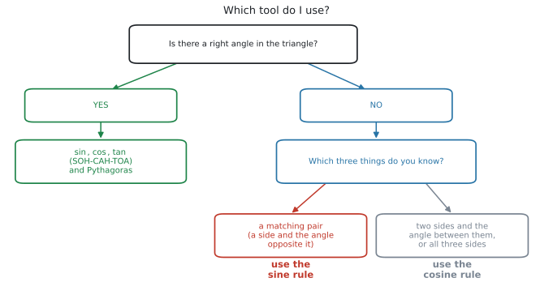{#fig-sl32-choose width=90%}

シラバスの Guidance 欄に、こう書かれています。

> In all areas of this topic, students should be encouraged to **sketch well-labelled diagrams** to support their solutions.

**分かっている長さと角を全部書き込んだ図をかく**ところから始めてください。図をかけば、@fig-sl32-choose のどこにいるかが自然に決まります。

### 2. 直角三角形 — SOH-CAH-TOA {#sohcahtoa}

直角三角形の3つの辺には、名前が付いています。

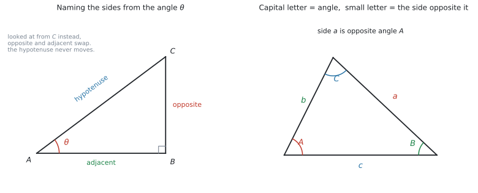{#fig-sl32-labelling width=100%}

| English | 日本語 | どれのことか |
|---|---|---|
| **hypotenuse**（hyp） | 斜辺 | **直角の向かい**の辺。いつも一番長い |
| **opposite**（opp） | 対辺 | **見ている角の向かい**の辺 |
| **adjacent**（adj） | 隣辺 | 見ている角の**となり**の辺（斜辺ではないほう） |

: 直角三角形の3辺の名前 {#tbl-sl32-sides}

::: {.callout-important}
## opposite と adjacent は、見る角で入れかわります
**hypotenuse だけは動きません**（直角の向かいで固定）。

残りの2つは、**どちらの角から見ているか**で入れかわります。@fig-sl32-labelling の左で、$A$ から見れば $BC$ が opposite ですが、$C$ から見れば $BC$ は adjacent になります。

**まず「どの角を見ているか」を決めて、それから 3辺に名前を付けてください。**
:::

3つの比は、頭文字を並べて **SOH-CAH-TOA** と覚えます。

$$
\sin\theta = \frac{\text{opp}}{\text{hyp}}, \qquad \cos\theta = \frac{\text{adj}}{\text{hyp}}, \qquad \tan\theta = \frac{\text{opp}}{\text{adj}}
$$ {#eq-sl32-sohcahtoa}

#### 角を求めるときは、逆をとります {#inverse}

シラバスが、わざわざこう書いています。

> Link to: **inverse functions (SL 2.2)** when finding angles.

$\sin\theta = 0.6$ から $\theta$ を出すには、$\sin$ の**逆**を使います。

$$
\theta = \sin^{-1}(0.6)
$$

電卓では `ctrl + sin` です。SL 2.2 でやった $f^{-1}$ と同じ考え方で、**入れた操作をほどいている**だけです。

### 3. 大文字と小文字の約束 {#notation}

sine rule と cosine rule を使うには、**この約束を先に守る**必要があります。

> **大文字 $A$ は角、小文字 $a$ はその角の向かいの辺**

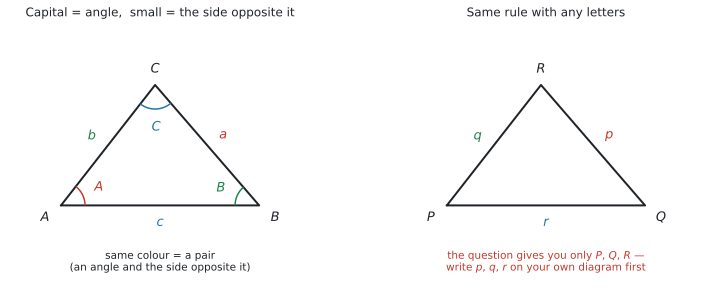{#fig-sl32-notation width=100%}

@fig-sl32-notation の左のとおり、角 $A$ の向かいが $a$、角 $B$ の向かいが $b$、角 $C$ の向かいが $c$ です。**同じ色どうしが1組（pair）**です。

::: {.callout-warning}
## 図に自分で書き込んでください
問題文が $PQR$ や $XYZ$ で書かれていることもあります。そのときは、**自分の図に $a$、$b$、$c$ を書き込んでから**公式に入れてください。

**この一手間を飛ばすと、公式のどこに何を入れるのかで必ず迷います。**
:::

### 4. sine rule {#sine-rule}

$$
\frac{a}{\sin A} = \frac{b}{\sin B} = \frac{c}{\sin C}
$$ {#eq-sl32-sine}

**「辺と、その向かいの角」を1組（pair）と考えます。** sine rule が使えるのは、**pair が1組そろっていて、もう1つ何かが分かっているとき**です。

| 分かっているもの | 求めるもの | 使い方 |
|---|---|---|
| $a$、$A$、$B$ | $b$ | $b = \dfrac{a\sin B}{\sin A}$ |
| $a$、$A$、$b$ | $B$ | $\sin B = \dfrac{b\sin A}{a}$ |

: sine rule の2つの使い方 {#tbl-sl32-sine}

#### 角を求めるときは、ひっくり返します {#sine-flip}

角を求めるときは、**分母と分子を入れかえた形**のほうが計算しやすくなります。

$$
\frac{\sin A}{a} = \frac{\sin B}{b} = \frac{\sin C}{c}
$$

公式集に印刷されているのは上の形ですが、**両辺の逆数をとっただけ**なので、同じことです。

::: {.callout-tip}
## 試験では、変形せずに `nSolve` に入れてしまうのが速いです
$\sin C$ について解いてから $\sin^{-1}$ をとる ── この手順を踏まなくても、**式のまま電卓に入れて $C$ を出せます。**

```
nSolve(sin(x)/9 = sin(105)/14, x, 0, 90)   →   38.3857...
```

**変形の途中で間違えることがない**ので、答えだけを聞かれている問題ではこちらのほうが安全です（[GDCの使い方](#nsolve)）。

ただし、**答案には式を1行書いてください。** $\dfrac{\sin C}{9} = \dfrac{\sin 105^\circ}{14}$ が書いてあれば、method mark はもらえます。
:::

::: {.callout-note}
## 3つ全部を使うことはありません
$\dfrac{a}{\sin A} = \dfrac{b}{\sin B} = \dfrac{c}{\sin C}$ と3つ並んでいますが、**1回に使うのは2つだけ**です。

**知っている pair** と **求めたいほう**、この2つを $=$ で結びます。
:::

### 5. cosine rule {#cosine-rule}

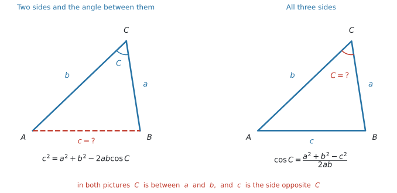{#fig-sl32-cosine width=100%}

$$
c^{2} = a^{2} + b^{2} - 2ab\cos C
$$ {#eq-sl32-cosine1}

$$
\cos C = \frac{a^{2} + b^{2} - c^{2}}{2ab}
$$ {#eq-sl32-cosine2}

**pair が1組もないとき**に使います。場面は2つだけです。

| 分かっているもの | 求めるもの | 使う式 |
|---|---|---|
| **2辺と、そのあいだの角**（$a$、$b$、$C$） | 残りの辺 $c$ | @eq-sl32-cosine1 |
| **3辺すべて**（$a$、$b$、$c$） | どれかの角 $C$ | @eq-sl32-cosine2 |

: cosine rule の2つの使い方 {#tbl-sl32-cosine}

#### $C$ は「$a$ と $b$ のあいだの角」です {#included}

@eq-sl32-cosine1 の左辺が $c^{2}$、右辺の角が $C$ であることに注目してください。

**求めたい辺 $c$ の向かいにある角が $C$**、つまり **$a$ と $b$ にはさまれた角**です。この対応が崩れると、答えが合いません。@fig-sl32-cosine の2つの図で、$C$ と $c$ が向かい合っていることを確かめてください。

::: {.callout-tip}
## cosine rule も、変形せずに `nSolve` に入れられます
@eq-sl32-cosine2 を覚えていなくても、**@eq-sl32-cosine1 の形のまま角を出せます。**

```
nSolve(9^2 = 5^2 + 7^2 - 2*5*7*cos(x), x, 0, 180)   →   95.7391...
```

辺を求めるときも同じです。$\sqrt{\ }$ の付け忘れも起きません。

```
nSolve(x^2 = 7^2 + 10^2 - 2*7*10*cos(55), x, 0, 100)   →   8.28850...
```

$\cos$ は $0^\circ$ から $180^\circ$ のあいだで1つに決まるので、**cosine rule で角を求めるときは範囲を `0, 180` にしておけば確実です**（[GDCの使い方](#nsolve)）。
:::

### 6. 4つの場面 {#choosing}

実際の問題は、次の4つのどれかです。

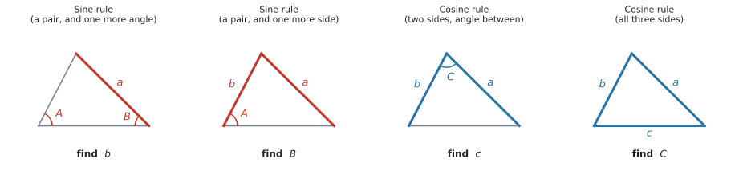{#fig-sl32-rules width=100%}

| 分かっているもの | 使う道具 |
|---|---|
| 角2つ＋辺1つ | **sine rule** |
| 辺2つ＋（その一方の向かいの）角1つ | **sine rule** |
| 辺2つ＋あいだの角 | **cosine rule** |
| 辺3つ | **cosine rule** |

: 分かっているものから道具を決める {#tbl-sl32-choose}

::: {.callout-tip}
## 見分け方は1つだけ
**「辺と、その向かいの角」がそろっているか**を見てください。

- そろっている → **sine rule**
- そろっていない → **cosine rule**

これだけです。@fig-sl32-rules の左2つは、赤い辺と赤い角が向かい合っています。右2つは向かい合っていません。
:::

### 7. 三角形の面積 {#area}

$$
A = \frac{1}{2}ab\sin C
$$ {#eq-sl32-area}

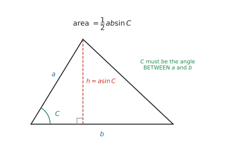{#fig-sl32-area width=76%}

::: {.callout-important}
## $C$ は「はさまれた角」でなければいけません
$a$ と $b$ の**あいだ**にある角を使います（included angle といいます）。

$a$ と $b$ を選んだのに、関係のない角 $A$ を入れてしまうと**まったく違う値**になります。cosine rule の @eq-sl32-cosine1 と、まったく同じ注意です。

中学で習った $\dfrac{1}{2} \times$ 底辺 $\times$ 高さ も、そのまま使えます。**高さが分かっているときは、そちらのほうが速い**です。
:::

## Why it works

:::: {.callout-note collapse="true" appearance="simple"}
## クリックすると開きます
ここでは、**なぜ面積が $\dfrac{1}{2}ab\sin C$ なのか**だけを説明します。

三角形の面積は $\dfrac{1}{2} \times$ 底辺 $\times$ 高さ です。@fig-sl32-area で、底辺は $b$ です。

高さ $h$ は、$a$ を斜辺とする直角三角形の**向かいの辺**にあたります。ですから [SOH-CAH-TOA](#sohcahtoa) で

$$
\sin C = \frac{h}{a} \ \Rightarrow \ h = a\sin C
$$

これを面積の式に入れると

$$
\text{面積} = \frac{1}{2} \times b \times h = \frac{1}{2} \times b \times a\sin C = \frac{1}{2}ab\sin C
$$

**新しい公式ではなく、「高さ」を $a\sin C$ で置きかえただけ**です。だから $C$ は $a$ と $b$ のあいだの角でなければいけません。
::::

## Worked examples

::: {.callout-note appearance="simple"}
問題文は英語です。意味が理解できなかったら、問題文の下の「**日本語訳**」を開いてください。解説は日本語です。
:::

::: {#exm-sl32-right}
[A ladder of length 4.2 m leans against a vertical wall. The foot of the ladder is 1.5 m from the wall.]{.q-en}

**(a)** [Find the angle between the ladder and the ground, correct to three significant figures.]{.q-en}

**(b)** [Find how far up the wall the ladder reaches, correct to three significant figures.]{.q-en}

<details class="jp-trans">
<summary>日本語訳</summary>

長さ $4.2$ m のはしごが、垂直な壁に立てかけてあります。はしごの足元は壁から $1.5$ m のところにあります。

**(a)** はしごと地面のなす角を、有効数字3桁で求めなさい。

**(b)** はしごが壁のどこまで届くかを、有効数字3桁で求めなさい。

</details>

---

まず図をかいて、**直角がどこにあるか**を確かめます。壁は垂直なので、**壁と地面のあいだ**が直角です。

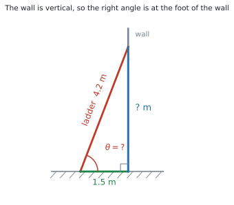{#fig-sl32-we1 width=72%}

**(a)** 求める角から見ると

- **hypotenuse** … はしご $4.2$（直角の向かい）
- **adjacent** … 地面の $1.5$（角のとなり）

hyp と adj がそろっているので、[CAH](#sohcahtoa) つまり $\cos$ です。

$$
\cos\theta = \frac{1.5}{4.2} = 0.35714\ldots
$$

$$
\theta = \cos^{-1}(0.35714\ldots) = 69.075\ldots^\circ
$$

有効数字3桁で **$69.1^\circ$** です。

**(b)** 壁に届く高さは、直角三角形の残りの辺です。**Pythagoras で出せます。**

$$
\text{高さ} = \sqrt{4.2^{2} - 1.5^{2}} = \sqrt{17.64 - 2.25}
$$

$$
= \sqrt{15.39} = 3.9230\ldots
$$

有効数字3桁で **$3.92$ m** です。

**検算。** $4.2 \times \sin(69.075^\circ) = 3.923$ ✓ $\sin$ を使っても同じです。

::: {.callout-tip}
## (a) の答えを使わないほうが安全です
(b) を $4.2\sin\theta$ で出すこともできますが、**そのときは $69.1$ ではなく $69.075\ldots$ を使ってください。**

Pythagoras なら (a) の答えを使わないので、**(a) を間違えても (b) は正解になります。** 使えるときは、そちらのほうが安全です。
:::

::: {.callout-note}
## 解答例（答案用紙にはこう書く）
**(a)** $\cos\theta = \dfrac{1.5}{4.2}$, so $\theta = 69.1^\circ$ (3 s.f.)

**(b)** height $= \sqrt{4.2^{2} - 1.5^{2}} = \sqrt{15.39} = 3.92$ m (3 s.f.)
:::
:::

::: {#exm-sl32-sineside}
[In triangle $ABC$, $\hat{A} = 42^\circ$, $\hat{B} = 63^\circ$ and $a = 8$ cm.]{.q-en}

**(a)** [Find the size of $\hat{C}$.]{.q-en}

**(b)** [Find the length of $b$, correct to three significant figures.]{.q-en}

<details class="jp-trans">
<summary>日本語訳</summary>

三角形 $ABC$ で、$\hat{A} = 42^\circ$、$\hat{B} = 63^\circ$、$a = 8$ cm です。

**(a)** $\hat{C}$ の大きさを求めなさい。

**(b)** $b$ の長さを有効数字3桁で求めなさい。

</details>

---

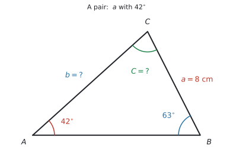{#fig-sl32-we2 width=72%}

**(a)** 三角形の内角の和は $180^\circ$ です。

$$
\hat{C} = 180^\circ - 42^\circ - 63^\circ = 75^\circ
$$

**(b)** [pair がそろっているか](#choosing)を見ます。$a$ と $\hat{A}$ は**向かい合っている pair** です。求めたい $b$ の向かいの $\hat{B}$ も分かっています。

**pair があるので sine rule** です。

$$
\frac{b}{\sin B} = \frac{a}{\sin A}
$$

$b$ について解きます。

$$
b = \frac{a\sin B}{\sin A} = \frac{8 \times \sin 63^\circ}{\sin 42^\circ} = 10.652\ldots
$$

有効数字3桁で **$10.7$ cm** です。

**検算。** $\hat{B} = 63^\circ > \hat{A} = 42^\circ$ なので、**$b$ は $a$ より長いはず**です。$10.7 > 8$ ✓

::: {.callout-tip}
## 「大きい角の向かいは長い辺」で確かめられます
三角形では、**角が大きいほど、その向かいの辺が長く**なります。

答えが出たら、この関係で必ず確かめてください。**式の入れ間違いは、ほとんどこれで見つかります。**
:::

::: {.callout-note}
## 解答例（答案用紙にはこう書く）
**(a)** $\hat{C} = 180^\circ - 42^\circ - 63^\circ = 75^\circ$

**(b)** $\dfrac{b}{\sin 63^\circ} = \dfrac{8}{\sin 42^\circ}$, so $b = \dfrac{8\sin 63^\circ}{\sin 42^\circ} = 10.7$ cm (3 s.f.)
:::
:::

::: {#exm-sl32-sineangle}
[In triangle $ABC$, $\hat{B} = 105^\circ$, $b = 14$ cm and $c = 9$ cm.]{.q-en}

**(a)** [Find the size of $\hat{C}$, correct to three significant figures.]{.q-en}

**(b)** [Find the size of $\hat{A}$, correct to three significant figures.]{.q-en}

<details class="jp-trans">
<summary>日本語訳</summary>

三角形 $ABC$ で、$\hat{B} = 105^\circ$、$b = 14$ cm、$c = 9$ cm です。

**(a)** $\hat{C}$ の大きさを有効数字3桁で求めなさい。

**(b)** $\hat{A}$ の大きさを有効数字3桁で求めなさい。

</details>

---

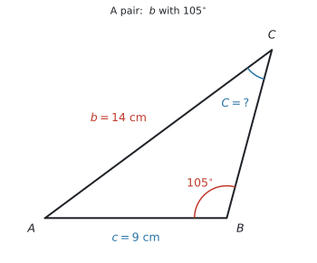{#fig-sl32-we3 width=72%}

**(a)** $b$ と $\hat{B}$ が pair です。求めたい $\hat{C}$ の向かいの $c$ も分かっています。**sine rule** です。

角を求めるので、[ひっくり返した形](#sine-flip)を使います。

$$
\frac{\sin C}{c} = \frac{\sin B}{b}
$$

$$
\sin C = \frac{c\sin B}{b} = \frac{9 \times \sin 105^\circ}{14} = 0.62095\ldots
$$

$$
\hat{C} = \sin^{-1}(0.62095\ldots) = 38.385\ldots^\circ
$$

有効数字3桁で **$38.4^\circ$** です。

**この答えで終わりです。** [ambiguous case は出ません](#ambiguous)。

**検算。** $\hat{B} = 105^\circ$ はすでに鈍角です。**三角形に鈍角は1つしかない**ので、$\hat{C}$ は必ず鋭角です ✓

**(b)** 内角の和を使います。**丸めた $38.4$ ではなく、$38.385\ldots$ を使ってください。**

$$
\hat{A} = 180^\circ - 105^\circ - 38.385\ldots^\circ = 36.614\ldots^\circ
$$

有効数字3桁で **$36.6^\circ$** です。

::: {.callout-note}
## 解答例（答案用紙にはこう書く）
**(a)** $\dfrac{\sin C}{9} = \dfrac{\sin 105^\circ}{14}$, so $\sin C = 0.6209\ldots$ and $\hat{C} = 38.4^\circ$ (3 s.f.)

**(b)** $\hat{A} = 180^\circ - 105^\circ - 38.38\ldots^\circ = 36.6^\circ$ (3 s.f.)
:::
:::

::: {#exm-sl32-cosineside}
[In triangle $ABC$, $a = 7$ cm, $b = 10$ cm and $\hat{C} = 55^\circ$.]{.q-en}

**(a)** [Find the length of $c$, correct to three significant figures.]{.q-en}

**(b)** [Find the area of the triangle, correct to three significant figures.]{.q-en}

<details class="jp-trans">
<summary>日本語訳</summary>

三角形 $ABC$ で、$a = 7$ cm、$b = 10$ cm、$\hat{C} = 55^\circ$ です。

**(a)** $c$ の長さを有効数字3桁で求めなさい。

**(b)** 三角形の面積を有効数字3桁で求めなさい。

</details>

---

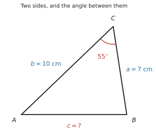{#fig-sl32-we4 width=72%}

**(a)** [pair があるか](#choosing)を見ます。$\hat{C}$ は分かっていますが、その向かいの $c$ が分かりません。$a$ と $b$ は分かっていますが、$\hat{A}$ も $\hat{B}$ も分かりません。

**pair がないので cosine rule** です。$\hat{C}$ は $a$ と $b$ に[はさまれた角](#included)なので、そのまま使えます。

$$
c^{2} = 7^{2} + 10^{2} - 2(7)(10)\cos 55^\circ
$$

$$
c^{2} = 49 + 100 - 140 \times 0.57357\ldots = 68.699\ldots
$$

$$
c = \sqrt{68.699\ldots} = 8.2885\ldots
$$

有効数字3桁で **$8.29$ cm** です。

**$\sqrt{\ }$ を忘れないでください。** ここで止めると $68.7$ と答えてしまいます。

**(b)** [面積の公式](#area)です。$a$、$b$ と、そのあいだの $\hat{C}$ がそろっています。

$$
\text{面積} = \frac{1}{2}(7)(10)\sin 55^\circ = 35 \times 0.81915\ldots = 28.670\ldots
$$

有効数字3桁で **$28.7$ cm$^{2}$** です。

::: {.callout-note}
## 解答例（答案用紙にはこう書く）
**(a)** $c^{2} = 7^{2} + 10^{2} - 2(7)(10)\cos 55^\circ = 68.69\ldots$, so $c = 8.29$ cm (3 s.f.)

**(b)** Area $= \dfrac{1}{2}(7)(10)\sin 55^\circ = 28.7$ cm$^{2}$ (3 s.f.)
:::
:::

::: {#exm-sl32-cosineangle}
[A triangle has sides of length 5 cm, 7 cm and 9 cm.]{.q-en}

**(a)** [Find the size of the largest angle in the triangle, correct to three significant figures.]{.q-en}

**(b)** [Explain how you knew which angle was the largest.]{.q-en}

<details class="jp-trans">
<summary>日本語訳</summary>

ある三角形の辺の長さは $5$ cm、$7$ cm、$9$ cm です。

**(a)** この三角形の最大の角の大きさを、有効数字3桁で求めなさい。

**(b)** どの角が最大かを、どうやって判断したかを説明しなさい。

</details>

---

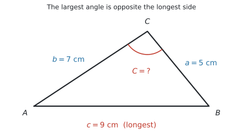{#fig-sl32-we5 width=72%}

**(a)** 3辺だけが分かっているので、**cosine rule の[角を求める形](#cosine-rule)**です。

最大の角は**一番長い辺 $9$ の向かい**なので、$c = 9$、$a = 5$、$b = 7$ とおきます。

$$
\cos C = \frac{a^{2} + b^{2} - c^{2}}{2ab} = \frac{25 + 49 - 81}{2(5)(7)} = \frac{-7}{70} = -0.1
$$

$$
\hat{C} = \cos^{-1}(-0.1) = 95.739\ldots^\circ
$$

有効数字3桁で **$95.7^\circ$** です。

::: {.callout-tip}
## $\cos$ が負なら、答えは鈍角です
$\cos^{-1}$ に負の数を入れると、電卓は $90^\circ$ より大きい角を返します。**これは間違いではありません。**

$\cos C = -0.1$ のように**分子が負になったら、その角は鈍角**だと分かります。$\sin^{-1}$ と違って、$\cos^{-1}$ は $0^\circ$ から $180^\circ$ までを $1$ つに決めてくれます。
:::

**(b)** `Explain` なので、英語で理由を書きます。

::: {.model-answer}
**試験ではこう書く**

*In a triangle, the largest angle is always opposite the longest side. The longest side is 9 cm, so the largest angle is the one opposite it.*
:::

（三角形では、最大の角はいつも最長の辺の向かいにある。最長の辺は $9$ cm なので、最大の角はその向かいの角である、という意味です。）

::: {.callout-note}
## 解答例（答案用紙にはこう書く）
**(a)** $\cos C = \dfrac{5^{2} + 7^{2} - 9^{2}}{2(5)(7)} = -0.1$, so $\hat{C} = 95.7^\circ$ (3 s.f.)

**(b)** *In a triangle, the largest angle is always opposite the longest side. The longest side is 9 cm, so the largest angle is the one opposite it.*
:::
:::

::: {#exm-sl32-context}
[A triangular plot of land has two sides of length 40 m and 55 m. The angle between these two sides is $68^\circ$.]{.q-en}

**(a)** [Find the area of the plot, correct to three significant figures.]{.q-en}

**(b)** [Find the length of the third side, correct to three significant figures.]{.q-en}

**(c)** [A fence is built around the whole plot. The fencing costs 12 dollars per metre. Find the total cost of the fence, correct to the nearest dollar.]{.q-en}

<details class="jp-trans">
<summary>日本語訳</summary>

三角形の土地の $2$ 辺の長さが $40$ m と $55$ m です。この $2$ 辺のあいだの角は $68^\circ$ です。

**(a)** この土地の面積を有効数字3桁で求めなさい。

**(b)** 第3の辺の長さを有効数字3桁で求めなさい。

**(c)** 土地全体のまわりに柵を作ります。柵は $1$ m あたり $12$ ドルかかります。柵の総費用を、$1$ ドルの位まで求めなさい。

</details>

---

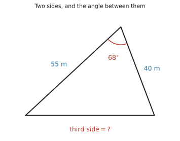{#fig-sl32-we6 width=72%}

**(a)** 「$2$ 辺と、そのあいだの角」がそろっているので、[面積の公式](#area)がそのまま使えます。

$$
\text{面積} = \frac{1}{2}(40)(55)\sin 68^\circ = 1100 \times 0.92718\ldots = 1019.9\ldots
$$

有効数字3桁で **$1020$ m$^{2}$** です。

**(b)** 同じ「$2$ 辺とあいだの角」なので、**cosine rule** です。

$$
c^{2} = 40^{2} + 55^{2} - 2(40)(55)\cos 68^\circ
$$

$$
= 4625 - 1648.2\ldots = 2976.7\ldots
$$

$$
c = \sqrt{2976.7\ldots} = 54.559\ldots
$$

有効数字3桁で **$54.6$ m** です。

**(c)** 柵は3辺すべてに沿って作ります。

$$
\text{周の長さ} = 40 + 55 + 54.559\ldots = 149.55\ldots
$$

$$
\text{費用} = 149.55\ldots \times 12 = 1794.7\ldots
$$

$1$ ドルの位まで求めるので、**$1795$ ドル**です。

::: {.callout-warning}
## 丸めた $54.6$ を使わないでください
この問題では、$54.6$ で計算しても $1795.2 \to 1795$ となり、**たまたま同じ答え**になります。

ですが、それは運がよかっただけです。**丸めた値を次の計算に使うと、答えが変わることがあります**（SL 2.6 で見たとおりです）。

**丸めるのは、答えを書く最後の1回だけ。** 電卓に入ったままの $54.559\ldots$ を使う習慣を付けてください。
:::

::: {.callout-note}
## 解答例（答案用紙にはこう書く）
**(a)** Area $= \dfrac{1}{2}(40)(55)\sin 68^\circ = 1020$ m$^{2}$ (3 s.f.)

**(b)** $c^{2} = 40^{2} + 55^{2} - 2(40)(55)\cos 68^\circ = 2976.7\ldots$, so $c = 54.6$ m (3 s.f.)

**(c)** Perimeter $= 40 + 55 + 54.55\ldots = 149.55\ldots$ m

Cost $= 149.55\ldots \times 12 = 1795$ dollars (nearest dollar)
:::
:::

## Common errors

::: {.callout-warning}
## opposite と adjacent を、角を決める前に選ぶ
**先に「どの角から見るか」を決めてください。** 決めてから3辺に名前を付けます。

hypotenuse だけは動きませんが、opposite と adjacent は見る角で入れかわります（@fig-sl32-labelling）。
:::

::: {.callout-warning}
## sine rule と cosine rule を、当てずっぽうで選ぶ
判断は1つだけです。**「辺と、その向かいの角」がそろっているか。**

そろっていれば sine rule、そろっていなければ cosine rule です（@tbl-sl32-choose）。
:::

::: {.callout-warning}
## cosine rule で $\sqrt{\ }$ を忘れる
$c^{2} = 68.699\ldots$ で止めて、$68.7$ と答えてしまう誤りです。

**求められているのは $c$ であって $c^{2}$ ではありません。** 出た数が「辺の長さとして大きすぎないか」を、必ず見てください。
:::

::: {.callout-warning}
## 面積の公式で、はさまれていない角を使う
$\dfrac{1}{2}ab\sin C$ の $C$ は、**$a$ と $b$ のあいだの角**です。

$a$ と $b$ を選んだのに $\hat{A}$ を入れると、まったく違う値になります。cosine rule も同じです。
:::

::: {.callout-warning}
## 電卓が Radian のまま計算する
$\sin 55^\circ$ のつもりが $\sin(55\ \text{rad})$ になると、**符号すら合いません。**

答えが明らかにおかしいときは、まず **Angle: Degree** を疑ってください。
:::

::: {.callout-warning}
## sine rule で角を求めたあと、$2$ つ目の答えを探す
**AI SL に ambiguous case は出ません**（シラバスに明記）。

$\sin^{-1}$ で出た角が答えです。**時間を使わないでください。**
:::

::: {.callout-warning}
## 途中の角を丸めてから、次の設問に使う
$38.4^\circ$ ではなく $38.385\ldots^\circ$ を使ってください。

角を丸めてから $\sin$ をとると、辺の長さが $3$ 桁目で変わることがあります。
:::

::: {.callout-warning}
## 図をかかずに、いきなり式を書く
シラバスが `sketch well-labelled diagrams` と名指ししています。

**分かっている長さと角を書き込んだ図**をかけば、どの道具を使うかは自然に決まります。図がないと、公式のどこに何を入れるかで迷います。
:::

## Using your GDC (TI-Nspire CX II)

### 1. 角の設定を確かめる

```
ctrl + doc → Document Settings → Angle: Degree
```

**この項目では、ここを間違えると全部間違えます。** 試験が始まったら最初に確かめてください。

### 2. $\sin$、$\cos$、$\tan$ と、その逆

```
trig キー  →  sin(  cos(  tan(
ctrl + sin →  sin⁻¹(
ctrl + cos →  cos⁻¹(
ctrl + tan →  tan⁻¹(
```

**辺を求めるときは $\sin$、角を求めるときは $\sin^{-1}$** です。

### 3. 式をそのまま1行で入れる

途中で丸めないために、**1つの式にまとめて入れる**のが確実です。

```
8 * sin(63) / sin(42)        →  10.6527...
√(7^2 + 10^2 - 2*7*10*cos(55))  →  8.28850...
cos⁻¹((5^2 + 7^2 - 9^2)/(2*5*7)) →  95.7391...
```

**cosine rule は、$\sqrt{\ }$ ごと1行で書いてしまう**と、$\sqrt{\ }$ の付け忘れも防げます。

### 4. 出た角を、そのまま次に使う

```
cos⁻¹(1.5/4.2)  →  ctrl + var  →  th
4.2 * sin(th)   →  3.92300...
```

`ctrl + var` は `sto→`（記憶）です。**紙に写して打ち直すと、そこで丸め誤差が入ります。**

### 5. `nSolve` ── 式を変形せずに解く {#nsolve}

```
menu → Algebra → Numerical Solve
```

**sine rule も cosine rule も、公式集の形のまま入れて解けます。** 「$b$ について解く」「$\sin C$ について解く」といった変形が要りません。

**sine rule で辺**（例題2）

```
nSolve(x/sin(63) = 8/sin(42), x, 0, 100)   →   10.6527...
```

**sine rule で角**（例題3）

```
nSolve(sin(x)/9 = sin(105)/14, x, 0, 90)   →   38.3857...
```

**cosine rule で辺**（例題4）

```
nSolve(x^2 = 7^2 + 10^2 - 2*7*10*cos(55), x, 0, 100)   →   8.28850...
```

**cosine rule で角**（例題5）

```
nSolve(9^2 = 5^2 + 7^2 - 2*5*7*cos(x), x, 0, 180)   →   95.7391...
```

**面積から角**

```
nSolve(0.5*9*14*sin(x) = 50, x, 0, 90)   →   52.528...
```

**最後の2つの数は、解を探す範囲**（lower bound と upper bound）です。

::: {.callout-important}
## 角を求めるときは、範囲を必ず付けてください
`nSolve` は**解を1つしか返しません**（SL 1.8）。どれが返ってくるかは、範囲で決めます。

- **cosine rule** … `0, 180` でよいです。$\cos$ はこの範囲で $1$ つに決まります。
- **sine rule** … `0, 90` にしてください。$\sin x = \sin(180^\circ - x)$ なので、範囲を切らないと $141.6^\circ$ のような答えが返ってくることがあります。

**AI SL では、sine rule で求める角は必ず鋭角です。** [ambiguous case が出ない](#ambiguous)ということは、鈍角のほうは答えにならない、という意味だからです。ですから `0, 90` で構いません。
:::

::: {.callout-warning}
## 答案には、式を1行書いてください
`nSolve` は速いですが、**電卓に出た数だけを書くと method mark が取れません。**

$$
\frac{\sin C}{9} = \frac{\sin 105^\circ}{14}
$$

この1行があれば、答えが合っていなくても method mark はもらえます。**電卓は計算だけ、式は自分で書く**と分けてください。
:::

::: {.callout-tip}
## 三角形の絵は、電卓ではかきません
TI-Nspire の Geometry 機能は Press-to-Test で制限があります。**この項目の図は、紙にかいてください。**

電卓は「数を出す道具」、紙は「どの式を使うか決める道具」と分けると、迷いません。
:::

## Exercises

::: {.callout-note appearance="simple"}
各問題に、折りたたみが3つ付いています。**日本語訳**、**解答例**（答案用紙に書くべきこと。英語です）、**解説**（なぜそうなるか。日本語です）。

まず自分で解いて、次に解答例と見くらべてください。**解説は、合わなかったときだけ開けば十分です。**
:::

::: {.exercise-block}

[1]{.ex-no} [A right-angled triangle has a hypotenuse of length 13 cm and one other side of length 5 cm.]{.q-en}

**(a)** [Find the length of the third side.]{.q-en}

**(b)** [Find the size of the smallest angle in the triangle, correct to three significant figures.]{.q-en}

<details class="jp-trans">
<summary>日本語訳</summary>

ある直角三角形の斜辺の長さは $13$ cm、もう1つの辺の長さは $5$ cm です。

**(a)** 第3の辺の長さを求めなさい。

**(b)** この三角形の最小の角の大きさを、有効数字3桁で求めなさい。

</details>

::: {.callout-note collapse="true"}
## 解答例（答案用紙に書くこと）
**(a)** $\sqrt{13^{2} - 5^{2}} = \sqrt{144} = 12$ cm

**(b)** $\sin\theta = \dfrac{5}{13}$, so $\theta = 22.6^\circ$ (3 s.f.)
:::

::: {.callout-tip collapse="true"}
## 解説
$5$、$12$、$13$ は Pythagoras の組です。**斜辺は一番長い辺**なので、$13$ から引きます。

**(b)** 最小の角は、**一番短い辺 $5$ の向かい**です。その角から見ると $5$ が opposite、$13$ が hypotenuse なので **SOH**、$\sin$ を使います。
:::

::: {.ex-sep}
:::

[2]{.ex-no} [A ramp rises 0.8 m over a horizontal distance of 6 m.]{.q-en}

**(a)** [Find the angle the ramp makes with the horizontal, correct to three significant figures.]{.q-en}

**(b)** [Find the length of the ramp, correct to three significant figures.]{.q-en}

<details class="jp-trans">
<summary>日本語訳</summary>

あるスロープは、水平距離 $6$ m のあいだに $0.8$ m 上がります。

**(a)** スロープが水平となす角を、有効数字3桁で求めなさい。

**(b)** スロープの長さを有効数字3桁で求めなさい。

</details>

::: {.callout-note collapse="true"}
## 解答例（答案用紙に書くこと）
**(a)** $\tan\theta = \dfrac{0.8}{6}$, so $\theta = 7.59^\circ$ (3 s.f.)

**(b)** $\sqrt{6^{2} + 0.8^{2}} = \sqrt{36.64} = 6.05$ m (3 s.f.)
:::

::: {.callout-tip collapse="true"}
## 解説
**(a)** 分かっているのは opposite（$0.8$）と adjacent（$6$）なので **TOA**、$\tan$ です。斜辺は分かっていません。

**(b)** スロープそのものが hypotenuse です。Pythagoras で出します。

$6.05$ と $6$ がほとんど同じなのは、**傾きがとても緩い**からです。SL 2.1 で見た「坂の傾き」と同じ場面です。
:::

::: {.ex-sep}
:::

[3]{.ex-no} [In triangle $ABC$, $\hat{A} = 38^\circ$, $\hat{C} = 64^\circ$ and $c = 12$ cm.]{.q-en}

**(a)** [Find the size of $\hat{B}$.]{.q-en}

**(b)** [Find the length of $a$, correct to three significant figures.]{.q-en}

<details class="jp-trans">
<summary>日本語訳</summary>

三角形 $ABC$ で、$\hat{A} = 38^\circ$、$\hat{C} = 64^\circ$、$c = 12$ cm です。

**(a)** $\hat{B}$ の大きさを求めなさい。

**(b)** $a$ の長さを有効数字3桁で求めなさい。

</details>

::: {.callout-note collapse="true"}
## 解答例（答案用紙に書くこと）
**(a)** $\hat{B} = 180^\circ - 38^\circ - 64^\circ = 78^\circ$

**(b)** $\dfrac{a}{\sin 38^\circ} = \dfrac{12}{\sin 64^\circ}$, so $a = \dfrac{12\sin 38^\circ}{\sin 64^\circ} = 8.22$ cm (3 s.f.)
:::

::: {.callout-tip collapse="true"}
## 解説
$c$ と $\hat{C}$ が **pair** です。求めたい $a$ の向かいの $\hat{A}$ も分かっているので、**sine rule** が使えます。

**検算**：$\hat{A} = 38^\circ < \hat{C} = 64^\circ$ なので $a < c$、つまり $8.22 < 12$ ✓
:::

::: {.ex-sep}
:::

[4]{.ex-no} [In triangle $ABC$, $\hat{A} = 112^\circ$, $a = 20$ cm and $b = 13$ cm.]{.q-en}

**(a)** [Find the size of $\hat{B}$, correct to three significant figures.]{.q-en}

**(b)** [Explain why $\hat{B}$ must be an acute angle.]{.q-en}

<details class="jp-trans">
<summary>日本語訳</summary>

三角形 $ABC$ で、$\hat{A} = 112^\circ$、$a = 20$ cm、$b = 13$ cm です。

**(a)** $\hat{B}$ の大きさを有効数字3桁で求めなさい。

**(b)** $\hat{B}$ が必ず鋭角である理由を説明しなさい。

</details>

::: {.callout-note collapse="true"}
## 解答例（答案用紙に書くこと）
**(a)** $\dfrac{\sin B}{13} = \dfrac{\sin 112^\circ}{20}$, so $\sin B = 0.6026\ldots$ and $\hat{B} = 37.1^\circ$ (3 s.f.)

**(b)** *A triangle can have at most one obtuse angle, and $\hat{A} = 112^\circ$ is already obtuse, so $\hat{B}$ must be acute.*
:::

::: {.callout-tip collapse="true"}
## 解説
$a$ と $\hat{A}$ が pair なので **sine rule**。角を求めるので、ひっくり返した形が便利です。

**(b)** がこの問題の中心です。**三角形の内角の和は $180^\circ$** なので、鈍角（$90^\circ$ より大きい角）は $1$ つしか入りません。

これが、AI SL で **ambiguous case が出ない**理由でもあります。問題は必ず、答えが $1$ つに決まるように作られています。
:::

::: {.ex-sep}
:::

[5]{.ex-no} [In triangle $ABC$, $a = 9$ cm, $b = 12$ cm and $\hat{C} = 40^\circ$.]{.q-en}

**(a)** [Find the length of $c$, correct to three significant figures.]{.q-en}

**(b)** [Find the area of the triangle, correct to three significant figures.]{.q-en}

<details class="jp-trans">
<summary>日本語訳</summary>

三角形 $ABC$ で、$a = 9$ cm、$b = 12$ cm、$\hat{C} = 40^\circ$ です。

**(a)** $c$ の長さを有効数字3桁で求めなさい。

**(b)** 三角形の面積を有効数字3桁で求めなさい。

</details>

::: {.callout-note collapse="true"}
## 解答例（答案用紙に書くこと）
**(a)** $c^{2} = 9^{2} + 12^{2} - 2(9)(12)\cos 40^\circ = 59.53\ldots$, so $c = 7.72$ cm (3 s.f.)

**(b)** Area $= \dfrac{1}{2}(9)(12)\sin 40^\circ = 34.7$ cm$^{2}$ (3 s.f.)
:::

::: {.callout-tip collapse="true"}
## 解説
「$2$ 辺とあいだの角」なので **cosine rule**。$\hat{C}$ は $a$ と $b$ にはさまれているので、そのまま使えます。

**$\sqrt{\ }$ を忘れないでください。** $59.5$ は $c^{2}$ です。

**(b)** も同じ $3$ つで出ます。**cosine rule と面積の公式は、必要な材料がまったく同じ**です。片方が出せれば、もう片方も必ず出せます。
:::

::: {.ex-sep}
:::

[6]{.ex-no} [A triangle has sides of length 6 cm, 8 cm and 11 cm.]{.q-en}

**(a)** [Find the size of the largest angle, correct to three significant figures.]{.q-en}

**(b)** [Find the area of the triangle, correct to three significant figures.]{.q-en}

<details class="jp-trans">
<summary>日本語訳</summary>

ある三角形の辺の長さは $6$ cm、$8$ cm、$11$ cm です。

**(a)** 最大の角の大きさを、有効数字3桁で求めなさい。

**(b)** 三角形の面積を有効数字3桁で求めなさい。

</details>

::: {.callout-note collapse="true"}
## 解答例（答案用紙に書くこと）
**(a)** $\cos C = \dfrac{6^{2} + 8^{2} - 11^{2}}{2(6)(8)} = -0.21875$, so $\hat{C} = 103^\circ$ (3 s.f.)

**(b)** Area $= \dfrac{1}{2}(6)(8)\sin 102.6\ldots^\circ = 23.4$ cm$^{2}$ (3 s.f.)
:::

::: {.callout-tip collapse="true"}
## 解説
3辺だけなので **cosine rule の角を求める形**。最大の角は最長の辺 $11$ の向かいなので、$c = 11$ とおきます。

$\cos C$ が**負**になったので、$\hat{C}$ は鈍角です。$102.635\ldots^\circ$ を有効数字3桁にすると $103^\circ$ です。

**(b)** (a) で角が出たので、面積は $\dfrac{1}{2}(6)(8)\sin C$ で出ます。**ここで $103$ ではなく $102.635\ldots$ を使ってください。**
:::

::: {.ex-sep}
:::

[7]{.ex-no} [A triangle has two sides of length 15 cm and 22 cm, with an angle of $84^\circ$ between them.]{.q-en}

**(a)** [Find the area of the triangle, correct to three significant figures.]{.q-en}

<details class="jp-trans">
<summary>日本語訳</summary>

ある三角形の $2$ 辺の長さは $15$ cm と $22$ cm で、そのあいだの角は $84^\circ$ です。

**(a)** 三角形の面積を有効数字3桁で求めなさい。

</details>

::: {.callout-note collapse="true"}
## 解答例（答案用紙に書くこと）
**(a)** Area $= \dfrac{1}{2}(15)(22)\sin 84^\circ = 164$ cm$^{2}$ (3 s.f.)
:::

::: {.callout-tip collapse="true"}
## 解説
公式に入れるだけの問題です。$84^\circ$ が**$2$ 辺のあいだの角**だと問題文に書いてあるので、そのまま使えます。

**参考**：$84^\circ$ は $90^\circ$ に近いので、$\sin 84^\circ = 0.9945$ とほぼ $1$ です。つまり面積は $\dfrac{1}{2}(15)(22) = 165$ にとても近くなります。**$164$ という答えが妥当かどうかは、これで確かめられます。**
:::

::: {.ex-sep}
:::

[8]{.ex-no} [A triangle has two sides of length 9 cm and 14 cm. Its area is 50 cm$^{2}$.]{.q-en}

**(a)** [Find the size of the acute angle between these two sides, correct to three significant figures.]{.q-en}

<details class="jp-trans">
<summary>日本語訳</summary>

ある三角形の $2$ 辺の長さは $9$ cm と $14$ cm で、面積は $50$ cm$^{2}$ です。

**(a)** この $2$ 辺のあいだの鋭角の大きさを、有効数字3桁で求めなさい。

</details>

::: {.callout-note collapse="true"}
## 解答例（答案用紙に書くこと）
**(a)** $\dfrac{1}{2}(9)(14)\sin C = 50$, so $\sin C = \dfrac{50}{63} = 0.7936\ldots$ and $\hat{C} = 52.5^\circ$ (3 s.f.)
:::

::: {.callout-tip collapse="true"}
## 解説
**公式を逆向きに使う問題**です。$\dfrac{1}{2}(9)(14) = 63$ を先に計算してから割ると、式が短くなります。

問題文が `the acute angle` と指定しているのは、$\sin C = 0.7936$ を満たす角が $52.5^\circ$ と $127.5^\circ$ の $2$ つあるからです。**ここは面積の公式であって sine rule ではない**ので、ambiguous case の話とは別です。問題文の指定に従ってください。

`nSolve(0.5*9*14*sin(x) = 50, x)` でも出ます。
:::

::: {.ex-sep}
:::

[9]{.ex-no} [In triangle $ABC$, $AB = 8$ cm, $BC = 11$ cm and $\hat{B} = 47^\circ$.]{.q-en}

**(a)** [Find the length of $AC$, correct to three significant figures.]{.q-en}

**(b)** [Find the size of $\hat{C}$, correct to three significant figures.]{.q-en}

**(c)** [Find the area of the triangle, correct to three significant figures.]{.q-en}

<details class="jp-trans">
<summary>日本語訳</summary>

三角形 $ABC$ で、$AB = 8$ cm、$BC = 11$ cm、$\hat{B} = 47^\circ$ です。

**(a)** $AC$ の長さを有効数字3桁で求めなさい。

**(b)** $\hat{C}$ の大きさを有効数字3桁で求めなさい。

**(c)** 三角形の面積を有効数字3桁で求めなさい。

</details>

::: {.callout-note collapse="true"}
## 解答例（答案用紙に書くこと）
**(a)** $AC^{2} = 8^{2} + 11^{2} - 2(8)(11)\cos 47^\circ = 64.96\ldots$, so $AC = 8.06$ cm (3 s.f.)

**(b)** $\dfrac{\sin C}{8} = \dfrac{\sin 47^\circ}{8.060\ldots}$, so $\sin C = 0.7258\ldots$ and $\hat{C} = 46.5^\circ$ (3 s.f.)

**(c)** Area $= \dfrac{1}{2}(8)(11)\sin 47^\circ = 32.2$ cm$^{2}$ (3 s.f.)
:::

::: {.callout-tip collapse="true"}
## 解説
**まず図をかいて、$a$、$b$、$c$ を書き込んでください。** $AB = c = 8$、$BC = a = 11$、$AC = b$ です。$\hat{B}$ は $a$ と $c$ にはさまれています。

**(a)** pair がないので **cosine rule**。$b^{2} = a^{2} + c^{2} - 2ac\cos B$ の形です。**文字が $c$ と $C$ ではなく $b$ と $B$ になっているだけ**で、中身は同じです。

**(b)** (a) で $b$ と $\hat{B}$ の pair ができたので、**sine rule** が使えます。$\hat{C}$ は**一番短い辺 $c = 8$ の向かい**なので、必ず鋭角です。

**(c)** 面積は (a) を使わずに出せます。$a$、$c$ と、そのあいだの $\hat{B}$ がそろっているからです。**(a) を間違えても (c) は正解になります。**
:::

::: {.ex-sep}
:::

[10]{.ex-no} [Two points $A$ and $B$ on a straight road are 250 m apart. A tower $T$ stands on one side of the road. The angle $T\hat{A}B$ is $63^\circ$ and the angle $T\hat{B}A$ is $48^\circ$.]{.q-en}

**(a)** [Find the size of the angle $A\hat{T}B$.]{.q-en}

**(b)** [Find the distance $AT$, correct to three significant figures.]{.q-en}

**(c)** [Find the area of triangle $ABT$, correct to three significant figures.]{.q-en}

<details class="jp-trans">
<summary>日本語訳</summary>

まっすぐな道の上の $2$ 点 $A$ と $B$ は $250$ m 離れています。道の片側に塔 $T$ が立っています。角 $T\hat{A}B$ は $63^\circ$、角 $T\hat{B}A$ は $48^\circ$ です。

**(a)** 角 $A\hat{T}B$ の大きさを求めなさい。

**(b)** 距離 $AT$ を有効数字3桁で求めなさい。

**(c)** 三角形 $ABT$ の面積を有効数字3桁で求めなさい。

</details>

::: {.callout-note collapse="true"}
## 解答例（答案用紙に書くこと）
**(a)** $A\hat{T}B = 180^\circ - 63^\circ - 48^\circ = 69^\circ$

**(b)** $\dfrac{AT}{\sin 48^\circ} = \dfrac{250}{\sin 69^\circ}$, so $AT = \dfrac{250\sin 48^\circ}{\sin 69^\circ} = 199$ m (3 s.f.)

**(c)** Area $= \dfrac{1}{2}(250)(199.0\ldots)\sin 63^\circ = 22\,200$ m$^{2}$ (3 s.f.)
:::

::: {.callout-tip collapse="true"}
## 解説
**まず図をかいてください。** 道の上に $A$ と $B$、その片側に $T$ です。

**(b)** $AT$ の向かいは $\hat{B} = 48^\circ$、$AB = 250$ の向かいは $\hat{T} = 69^\circ$ です。**pair が $2$ 組そろっている**ので sine rule です。

**どの辺がどの角の向かいなのか**を、図で確かめてから式に入れてください。ここを取り違えるのが、この形の問題で一番多い誤りです。

**(c)** $AT$ と $AB$ と、そのあいだの $\hat{A} = 63^\circ$ で面積が出ます。**$199$ ではなく $199.0039\ldots$ を使ってください。**

**検算**：三角形の高さはおよそ $199 \times \sin 63^\circ = 177$ m、底辺が $250$ m なので、面積はおよそ $\dfrac{1}{2}(250)(177) = 22\,100$ ✓
:::

:::
