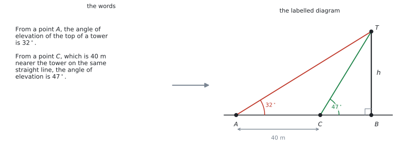
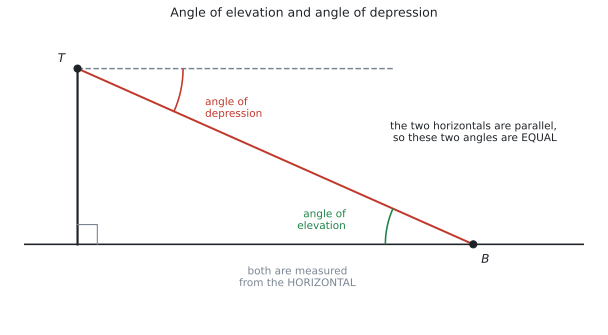
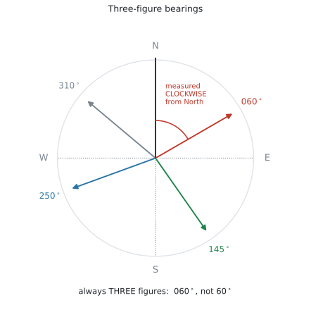
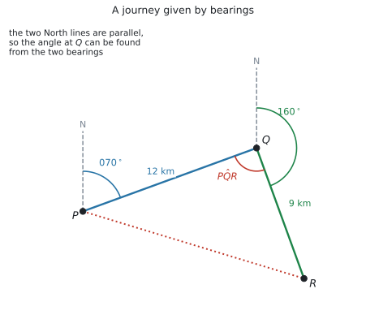
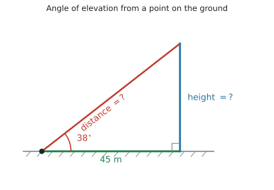
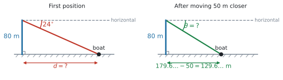
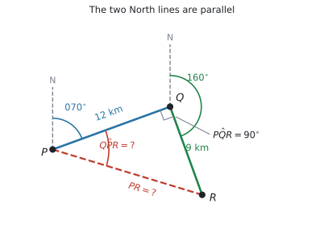
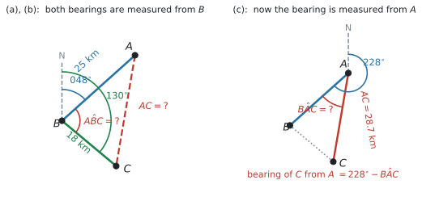
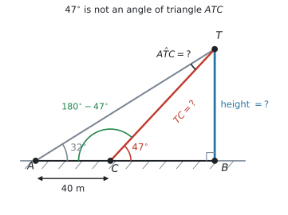

# SL 3.3 — Applications: bearings, elevation and depression（三角法の応用 — 方位角・仰角・俯角） {#sec-sl-3-3}

::: {.callout-note}
## What you should be able to do
- **文章から、ラベルの付いた図を自分でかける**（この項目の中心です）。
- **angle of elevation** と **angle of depression** の意味が分かり、図にかける。
- 「$A$ から $B$ を見下ろす角」と「$B$ から $A$ を見上げる角」が**等しい**理由を説明できる。
- **three-figure bearing**（3桁の方位角）を読み書きできる。
- 方位角から、**三角形の中の角**を求められる。
- SL 3.2 の道具（Pythagoras・SOH-CAH-TOA・sine rule・cosine rule）を、**文章題で使い分けられる**。
:::

::: {.callout-important}
## Formula booklet には、この項目の式はありません
公式集の Topic 3 の欄は、**3.1、3.2、3.4 だけ**です。**3.3 の欄はありません。**

この項目で使う式は、すべて [SL 3.2](sl-3-2.qmd) のものです。

$$
\frac{a}{\sin A} = \frac{b}{\sin B} = \frac{c}{\sin C}
$$

$$
c^{2} = a^{2} + b^{2} - 2ab\cos C, \qquad A = \frac{1}{2}ab\sin C
$$

**新しく覚えることは、式ではありません。** この項目は、**文章を図に直す**練習です。
:::

::: {.callout-warning}
## SOH-CAH-TOA と Pythagoras は、ここでも公式集にありません
シラバスの Content 欄が **including Pythagoras' theorem** と名指ししていますが、公式集には印刷されていません。

$$
\sin\theta = \frac{\text{opp}}{\text{hyp}}, \qquad \cos\theta = \frac{\text{adj}}{\text{hyp}}, \qquad \tan\theta = \frac{\text{opp}}{\text{adj}}, \qquad a^{2} + b^{2} = c^{2}
$$

SL 3.2 と同じで、**この4つは覚えておく必要があります。**
:::

::: {.callout-tip}
## 電卓は Degree にしておいてください
Topic 3 の3項目とも同じです。方位角は**度**で表します。

```
ctrl + doc → Document Settings → Angle: Degree
```
:::

## The idea

### 1. この項目の中心は「図をかくこと」です {#draw-first}

シラバスの Content 欄に、はっきり書かれています。

> **Construction of labelled diagrams from written statements.**

**図をかくこと自体が、シラバスの項目**になっています。ここまで名指しされているのは、この項目だけです。

{#fig-sl33-words width=100%}

#### 手順は4つです {#four-steps}

| | やること |
|---|---|
| **1** | 出てくる**点に名前を付ける**（$A$、$B$、$T$ など） |
| **2** | **形をかく**（三角形か、三角形が2つか） |
| **3** | 分かっている**長さを全部書き込む** |
| **4** | 分かっている**角を全部書き込む** |

: 文章から図をつくる手順 {#tbl-sl33-steps}

**この4つが終わってから、はじめて式を選びます。**

::: {.callout-important}
## 図は「下書き」ではなく、答案の一部です
図をかいてから式を立てると、[どの道具を使うか](sl-3-2.qmd#choosing)が自然に決まります。

図は、**式を選ぶための、そして読みまちがいを防ぐための、大事な途中過程**です。答案用紙に消さずに残しておいてください。問題文が図やラベルを求めている場合は、**必要な情報を答案に残します。**

「頭の中でやる」と、**どの角がどの辺の向かいなのかを取り違えやすくなります。**
:::

### 2. angle of elevation と angle of depression {#elevation-depression}

{#fig-sl33-elevation width=94%}

| English | 日本語 | どこからどこへの角か |
|---|---|---|
| **angle of elevation** | 仰角（ぎょうかく） | **水平線から見上げる**角 |
| **angle of depression** | 俯角（ふかく） | **水平線から見下ろす**角 |

: 仰角と俯角 {#tbl-sl33-elev}

::: {.callout-important}
## どちらも「水平線から」測ります
ここが、この項目で一番多い誤りです。

**縦の線（垂直）からではありません。** @fig-sl33-elevation で、俯角は $T$ を通る**水平の点線**から測っています。

垂直から測ってしまうと、答えが $90^\circ$ からの引き算ぶんだけずれます。
:::

#### 見下ろす角と見上げる角は、等しくなります {#equal-angles}

@fig-sl33-elevation で、$T$ から $B$ を見下ろす角と、$B$ から $T$ を見上げる角は**同じ大きさ**です。

理由は、**2本の水平線が平行**だからです。平行線に1本の直線（$TB$）が交わっているので、**錯角（alternate angles）が等しくなります。**

::: {.callout-tip}
## この事実は、そのまま点になります
`Write down the angle of elevation of the top of the cliff from the boat.` のような設問が、そのまま出ます。

**計算はいりません。** 「俯角と同じ」と分かっていれば、書き写すだけです。

理由を書けと言われたら、こう書きます。

::: {.model-answer}
**試験ではこう書く**

*The two horizontal lines are parallel, so the angle of elevation and the angle of depression are alternate angles and are therefore equal.*
:::

（$2$ 本の水平線は平行なので、仰角と俯角は錯角であり、したがって等しい、という意味です。）
:::

### 3. bearing（方位角） {#bearing}

シラバスの Guidance 欄に、こうあります。

> Contexts may include use of **bearings**.

{#fig-sl33-bearing width=62%}

**bearing には、守るべき約束が3つ**あります。

| | 約束 |
|---|---|
| **1** | **北**（North）から測る |
| **2** | **時計回り**に測る |
| **3** | **$3$ 桁**で書く（$060^\circ$ であって $60^\circ$ ではない） |

: bearing の3つの約束 {#tbl-sl33-bearing}

::: {.callout-warning}
## bearing は、北から時計回りに測り、$3$ 桁で表します
これが **three-figure bearing**（3桁の方位角）という言い方の意味です。

$8^\circ$ 東寄りの北なら **$008^\circ$**、真西は **$270^\circ$**、$60^\circ$ なら **$060^\circ$** と書きます。

**$0$ を先頭に足すだけ**です。**試験では必ず $3$ 桁表記を使う習慣**を付けてください。
:::

#### back bearing（逆向きの方位角） {#back-bearing}

$A$ から見た $B$ の方位角が分かっているとき、$B$ から見た $A$ の方位角は、**$180^\circ$ 足すか引くか**で出ます。

| もとの方位角 $\theta$ | やること | 例 |
|---|---|---|
| $0^\circ \leq \theta < 180^\circ$ | $+180^\circ$ | $073^\circ \to 253^\circ$ |
| $180^\circ \leq \theta < 360^\circ$ | $-180^\circ$ | $215^\circ \to 035^\circ$、$180^\circ \to 000^\circ$ |

: back bearing の出し方 {#tbl-sl33-back}

**答えが $000^\circ$ から $359^\circ$ のあいだに収まるほう**を選ぶ、と覚えると迷いません。$180^\circ$ のときは、足すと $360^\circ$ ではみ出すので、引いて $000^\circ$ です。

### 4. 方位角から、三角形の角を出す {#bearing-angle}

方位角の問題は、**「三角形の中の角がいくつか」が分かれば、あとは SL 3.2 と同じ**です。

{#fig-sl33-journey width=82%}

@fig-sl33-journey は、$P$ から $070^\circ$ の方向へ $12$ km 進んで $Q$、そこから $160^\circ$ の方向へ $9$ km 進んで $R$ に着く航路です。

**三角形 $PQR$ の、$Q$ での角**を出してみます。

1. $Q$ から $P$ を見た方位角は、$P$ から $Q$ を見た $070^\circ$ の [back bearing](#back-bearing) で $070^\circ + 180^\circ = 250^\circ$
2. $Q$ から $R$ を見た方位角は $160^\circ$
3. $Q$ での角は、その差

$$
P\hat{Q}R = 250^\circ - 160^\circ = 90^\circ
$$

::: {.callout-tip}
## 北の線は、どこでも平行です
図の中に **North の線を、点ごとにかき込んでください。** すべて縦向きの平行線です。

平行だから、**ある点で分かった角を、別の点に移せます。** これが方位角の問題の全部です。

North の線をかかずに角を推測すると、**まず合いません。**
:::

### 5. 使う道具は SL 3.2 と同じです {#tools}

角が出てしまえば、あとは [SL 3.2 の使い分け](sl-3-2.qmd#choosing)そのままです。

| 場面 | 使う道具 |
|---|---|
| 直角がある | Pythagoras、SOH-CAH-TOA |
| 辺とその向かいの角がそろっている | sine rule |
| そろっていない（2辺と挟角／3辺） | cosine rule |
| 面積を聞かれた | $\dfrac{1}{2}ab\sin C$ |

: この項目で使う道具 {#tbl-sl33-tools}

**この項目に新しい公式はありません。** 難しいのは、**文章を図にするところまで**です。

## Why it works

:::: {.callout-note collapse="true" appearance="simple"}
## クリックすると開きます
ここでは、**なぜ俯角と仰角が等しいのか**だけを説明します。

@fig-sl33-elevation を見てください。$T$ を通る水平線と、$B$ を通る水平線（地面）は、**どちらも水平**です。ですから **2本は平行**です。

この平行な2本の直線を、$TB$ という1本の直線が横切っています。中学校で習った**錯角**の関係です。

$$
\text{（$T$ での俯角）} = \text{（$B$ での仰角）}
$$

方位角でも、まったく同じことが起きています。**どの点でかいた North の線も、すべて平行**です。だから、$P$ で測った $070^\circ$ を $Q$ に移すことができるのです。

**「平行だから角を移せる」**という1つの考え方が、この項目全体を支えています。
::::

## Worked examples

::: {.callout-note appearance="simple"}
問題文は英語です。意味が理解できなかったら、問題文の下の「**日本語訳**」を開いてください。解説は日本語です。
:::

::: {#exm-sl33-elev}
[A vertical tower stands on horizontal ground. From a point on the ground 45 m from the foot of the tower, the angle of elevation of the top of the tower is $38^\circ$.]{.q-en}

**(a)** [Find the height of the tower, correct to three significant figures.]{.q-en}

**(b)** [Find the distance from the point to the top of the tower, correct to three significant figures.]{.q-en}

<details class="jp-trans">
<summary>日本語訳</summary>

垂直な塔が水平な地面に立っています。塔の足元から $45$ m 離れた地面の点から、塔の頂上の仰角は $38^\circ$ です。

**(a)** 塔の高さを有効数字3桁で求めなさい。

**(b)** その点から塔の頂上までの距離を、有効数字3桁で求めなさい。

</details>

---

**まず図をかきます。** 塔が垂直、地面が水平なので、**足元が直角**です。

{#fig-sl33-we1 width=72%}

- $45$ m は、角の**となり**（adjacent）
- 塔の高さは、角の**向かい**（opposite）
- 頂上までの距離は、**斜辺**（hypotenuse）

**(a)** opp と adj なので [TOA](sl-3-2.qmd#sohcahtoa)、$\tan$ です。

$$
\tan 38^\circ = \frac{h}{45} \ \Rightarrow \ h = 45\tan 38^\circ = 35.157\ldots
$$

有効数字3桁で **$35.2$ m** です。

**(b)** adj と hyp なので **CAH**、$\cos$ です。

$$
\cos 38^\circ = \frac{45}{d} \ \Rightarrow \ d = \frac{45}{\cos 38^\circ} = 57.105\ldots
$$

有効数字3桁で **$57.1$ m** です。

**検算。** Pythagoras でも出せます。$\sqrt{45^{2} + 35.157^{2}} = 57.10$ ✓

::: {.callout-tip}
## (b) は (a) を使わないほうが安全です
$\sqrt{45^{2} + h^{2}}$ でも出せますが、**それだと (a) を間違えたときに (b) も落とします。**

$\cos$ を使えば、与えられた $45$ と $38^\circ$ だけで済みます。**使えるときは、元の数だけで解いてください。**
:::

::: {.callout-note}
## 解答例（答案用紙にはこう書く）
**(a)** $\tan 38^\circ = \dfrac{h}{45}$, so $h = 45\tan 38^\circ = 35.2$ m (3 s.f.)

**(b)** $\cos 38^\circ = \dfrac{45}{d}$, so $d = \dfrac{45}{\cos 38^\circ} = 57.1$ m (3 s.f.)
:::
:::

::: {#exm-sl33-depr}
[A cliff is 80 m high. From the top of the cliff, the angle of depression of a boat at sea is $24^\circ$.]{.q-en}

**(a)** [Write down the angle of elevation of the top of the cliff from the boat.]{.q-en}

**(b)** [Find the horizontal distance from the boat to the foot of the cliff, correct to three significant figures.]{.q-en}

**(c)** [The boat then moves 50 m closer to the cliff. Find the new angle of depression, correct to three significant figures.]{.q-en}

<details class="jp-trans">
<summary>日本語訳</summary>

崖の高さは $80$ m です。崖の上から、海上の船の俯角は $24^\circ$ です。

**(a)** 船から見た崖の頂上の仰角を書きなさい。

**(b)** 船から崖の足元までの水平距離を、有効数字3桁で求めなさい。

**(c)** そのあと船は崖に $50$ m 近づきます。新しい俯角を有効数字3桁で求めなさい。

</details>

---

{#fig-sl33-we2 width=100%}

**(a)** `Write down` なので、**計算はいりません。**[錯角で等しい](#equal-angles)ので

$$
24^\circ
$$

**(b)** 船から見上げた三角形で考えます。$80$ が opposite、求める水平距離が adjacent なので $\tan$ です。

$$
\tan 24^\circ = \frac{80}{d} \ \Rightarrow \ d = \frac{80}{\tan 24^\circ} = 179.68\ldots
$$

有効数字3桁で **$180$ m** です。

**$\tan$ の式で、求めたいものが分母にあります。** そのときは、$d = \dfrac{80}{\tan 24^\circ}$ とひっくり返してください。

**(c)** $50$ m 近づいたので、新しい水平距離は

$$
179.68\ldots - 50 = 129.68\ldots
$$

**ここで $180 - 50 = 130$ としないでください。** (b) の丸めていない値を使います。

$$
\tan\theta = \frac{80}{129.68\ldots} = 0.61690\ldots
$$

$$
\theta = \tan^{-1}(0.61690\ldots) = 31.669\ldots^\circ
$$

有効数字3桁で **$31.7^\circ$** です。

**検算。** 近づいたので、見下ろす角は**大きくなる**はずです。$24^\circ \to 31.7^\circ$ ✓

::: {.callout-note}
## 解答例（答案用紙にはこう書く）
**(a)** $24^\circ$

**(b)** $\tan 24^\circ = \dfrac{80}{d}$, so $d = \dfrac{80}{\tan 24^\circ} = 180$ m (3 s.f.)

**(c)** New distance $= 179.6\ldots - 50 = 129.6\ldots$ m

$\tan\theta = \dfrac{80}{129.6\ldots}$, so $\theta = 31.7^\circ$ (3 s.f.)
:::
:::

::: {#exm-sl33-journey}
[A ship sails from $P$ on a bearing of $070^\circ$ for 12 km to $Q$. It then sails on a bearing of $160^\circ$ for 9 km to $R$.]{.q-en}

**(a)** [Show that $P\hat{Q}R = 90^\circ$.]{.q-en}

**(b)** [Find the distance $PR$.]{.q-en}

**(c)** [Find the bearing of $R$ from $P$, correct to the nearest degree.]{.q-en}

<details class="jp-trans">
<summary>日本語訳</summary>

船が $P$ から方位角 $070^\circ$ の向きに $12$ km 進んで $Q$ に着きます。そこから方位角 $160^\circ$ の向きに $9$ km 進んで $R$ に着きます。

**(a)** $P\hat{Q}R = 90^\circ$ であることを示しなさい。

**(b)** 距離 $PR$ を求めなさい。

**(c)** $P$ から見た $R$ の方位角を、最も近い整数度で求めなさい。

</details>

---

**まず図をかいて、$P$ と $Q$ に North の線を入れます。**

{#fig-sl33-we3 width=72%}

**(a)** `Show that` なので、**途中を全部書きます。**

$Q$ から $P$ を見た方位角は、[back bearing](#back-bearing) です。

$$
070^\circ + 180^\circ = 250^\circ
$$

$Q$ から $R$ を見た方位角は $160^\circ$ です。$Q$ での角は、この2つの差です。

$$
P\hat{Q}R = 250^\circ - 160^\circ = 90^\circ
$$

**(b)** $Q$ が直角なので、**Pythagoras** が使えます。

$$
PR = \sqrt{12^{2} + 9^{2}} = \sqrt{225} = 15
$$

$15$ km です。$9$、$12$、$15$ は $3$、$4$、$5$ の $3$ 倍です。

**(c)** 求めるのは **$P$ から見た $R$ の方位角**です。$P$ の North から時計回りに測ります。

$P$ から $Q$ の方位角が $070^\circ$ なので、そこに**角 $Q\hat{P}R$ を足します。**

三角形 $PQR$ で、$P$ から見て $QR = 9$ が opposite、$PQ = 12$ が adjacent なので

$$
\tan(Q\hat{P}R) = \frac{9}{12} = 0.75 \ \Rightarrow \ Q\hat{P}R = 36.869\ldots^\circ
$$

$$
\text{bearing of } R \text{ from } P = 070^\circ + 36.869\ldots^\circ = 106.869\ldots^\circ
$$

最も近い整数度で **$107^\circ$** です。

::: {.callout-warning}
## 足すのか引くのかは、図で決めます
$R$ は $Q$ より**東寄り・南寄り**にあるので、$P$ から見ると $070^\circ$ より**時計回りに進んだ**向きです。だから**足します。**

**必ず図を見て決めてください。** 公式はありません。
:::

::: {.callout-note}
## 解答例（答案用紙にはこう書く）
**(a)** The bearing of $P$ from $Q$ is $070^\circ + 180^\circ = 250^\circ$.

$P\hat{Q}R = 250^\circ - 160^\circ = 90^\circ$

**(b)** $PR = \sqrt{12^{2} + 9^{2}} = 15$ km

**(c)** $\tan(Q\hat{P}R) = \dfrac{9}{12}$, so $Q\hat{P}R = 36.86\ldots^\circ$

Bearing of $R$ from $P$ $= 070^\circ + 36.86\ldots^\circ = 107^\circ$ (nearest degree)
:::
:::

::: {#exm-sl33-cosine}
[From a town $B$, town $A$ is on a bearing of $048^\circ$ at a distance of 25 km. From the same town $B$, town $C$ is on a bearing of $130^\circ$ at a distance of 18 km.]{.q-en}

**(a)** [Find the size of $A\hat{B}C$.]{.q-en}

**(b)** [Find the distance $AC$, correct to three significant figures.]{.q-en}

**(c)** [Find the bearing of $C$ from $A$, correct to the nearest degree.]{.q-en}

<details class="jp-trans">
<summary>日本語訳</summary>

町 $B$ から見て、町 $A$ は方位角 $048^\circ$、距離 $25$ km のところにあります。同じ町 $B$ から見て、町 $C$ は方位角 $130^\circ$、距離 $18$ km のところにあります。

**(a)** $A\hat{B}C$ の大きさを求めなさい。

**(b)** 距離 $AC$ を有効数字3桁で求めなさい。

**(c)** $A$ から見た $C$ の方位角を、最も近い整数度で求めなさい。

</details>

---

{#fig-sl33-we4 width=100%}

**(a)** **どちらの方位角も、$B$ から測っています。** ですから $B$ の North の線が1本あればよく、角はその差です。

$$
A\hat{B}C = 130^\circ - 048^\circ = 82^\circ
$$

**back bearing は不要です。** 前の例題との違いに注意してください。

**(b)** $A\hat{B}C$ は $BA$ と $BC$ に**はさまれた角**です。ですから [cosine rule](sl-3-2.qmd#cosine-rule) です。

$$
AC^{2} = 25^{2} + 18^{2} - 2(25)(18)\cos 82^\circ
$$

$$
AC^{2} = 949 - 125.25\ldots = 823.74\ldots
$$

$$
AC = \sqrt{823.74\ldots} = 28.700\ldots
$$

有効数字3桁で **$28.7$ km** です。

**(c)** $A$ の North の線から測ります。まず、**$A$ から見た $B$ の方位角**を出します。

$$
048^\circ + 180^\circ = 228^\circ
$$

次に、三角形の中の角 $B\hat{A}C$ を出します。$AC$ が分かったので、**sine rule** が使えます。

$$
\frac{\sin(B\hat{A}C)}{18} = \frac{\sin 82^\circ}{28.700\ldots}
$$

$$
\sin(B\hat{A}C) = \frac{18\sin 82^\circ}{28.700\ldots} = 0.62105\ldots
$$

$$
B\hat{A}C = 38.393\ldots^\circ
$$

図を見ると、$C$ は $A$ から見て $B$ より**反時計回り**の向きにあります。ですから**引きます。**

$$
228^\circ - 38.393\ldots^\circ = 189.60\ldots^\circ
$$

最も近い整数度で **$190^\circ$** です。

::: {.callout-note}
## 解答例（答案用紙にはこう書く）
**(a)** $A\hat{B}C = 130^\circ - 048^\circ = 82^\circ$

**(b)** $AC^{2} = 25^{2} + 18^{2} - 2(25)(18)\cos 82^\circ = 823.7\ldots$, so $AC = 28.7$ km (3 s.f.)

**(c)** Bearing of $B$ from $A$ $= 048^\circ + 180^\circ = 228^\circ$

$\dfrac{\sin(B\hat{A}C)}{18} = \dfrac{\sin 82^\circ}{28.70\ldots}$, so $B\hat{A}C = 38.39\ldots^\circ$

Bearing of $C$ from $A$ $= 228^\circ - 38.39\ldots^\circ = 190^\circ$ (nearest degree)
:::
:::

::: {#exm-sl33-twopoint}
[A vertical tower $TB$ stands on horizontal ground. From a point $A$ on the ground, the angle of elevation of the top $T$ is $32^\circ$. From a point $C$, which is 40 m nearer the tower and on the same straight line as $A$ and $B$, the angle of elevation of $T$ is $47^\circ$.]{.q-en}

**(a)** [Find the size of $A\hat{T}C$.]{.q-en}

**(b)** [Find the length of $TC$, correct to three significant figures.]{.q-en}

**(c)** [Find the height of the tower, correct to three significant figures.]{.q-en}

<details class="jp-trans">
<summary>日本語訳</summary>

垂直な塔 $TB$ が水平な地面に立っています。地面の点 $A$ から、頂上 $T$ の仰角は $32^\circ$ です。$A$ と $B$ と同じ直線上にあり、塔に $40$ m 近い点 $C$ からは、$T$ の仰角は $47^\circ$ です。

**(a)** $A\hat{T}C$ の大きさを求めなさい。

**(b)** $TC$ の長さを有効数字3桁で求めなさい。

**(c)** 塔の高さを有効数字3桁で求めなさい。

</details>

---

**この形は、AI SL でくり返し出ます。** @fig-sl33-words の右がその図です。

{#fig-sl33-we5 width=80%}

**(a)** $A$、$C$、$B$ はこの順に一直線上にあります。$T\hat{C}B = 47^\circ$ なので、その**となりの角**は

$$
T\hat{C}A = 180^\circ - 47^\circ = 133^\circ
$$

三角形 $ATC$ の内角の和から

$$
A\hat{T}C = 180^\circ - 32^\circ - 133^\circ = 15^\circ
$$

::: {.callout-tip}
## ここが、この問題の山です
**$47^\circ$ をそのまま三角形 $ATC$ に使ってはいけません。** $47^\circ$ は $C$ から**塔のほう**を見上げた角で、三角形 $ATC$ の中の角ではありません。

**一直線上の $180^\circ$ から引く**、この一手が要ります。
:::

**(b)** 三角形 $ATC$ で、$AC = 40$ とその向かいの $A\hat{T}C = 15^\circ$ が **pair** です。求めたい $TC$ の向かいの $\hat{A} = 32^\circ$ も分かっています。ですから [sine rule](sl-3-2.qmd#sine-rule) です。

$$
\frac{TC}{\sin 32^\circ} = \frac{40}{\sin 15^\circ}
$$

$$
TC = \frac{40\sin 32^\circ}{\sin 15^\circ} = 81.898\ldots
$$

有効数字3桁で **$81.9$ m** です。

**(c)** 三角形 $TCB$ は**直角三角形**です（塔が垂直なので $B$ が直角）。$TC$ が斜辺、高さが $47^\circ$ の向かいなので **SOH**、$\sin$ です。

$$
h = TC \times \sin 47^\circ = 81.898\ldots \times \sin 47^\circ = 59.896\ldots
$$

有効数字3桁で **$59.9$ m** です。

**検算。** $\dfrac{h}{\tan 32^\circ} - \dfrac{h}{\tan 47^\circ} = 95.85 - 55.85 = 40.0$ ✓ ちょうど $40$ m 離れています。

::: {.callout-note}
## 解答例（答案用紙にはこう書く）
**(a)** $T\hat{C}A = 180^\circ - 47^\circ = 133^\circ$, so $A\hat{T}C = 180^\circ - 32^\circ - 133^\circ = 15^\circ$

**(b)** $\dfrac{TC}{\sin 32^\circ} = \dfrac{40}{\sin 15^\circ}$, so $TC = 81.9$ m (3 s.f.)

**(c)** $h = TC\sin 47^\circ = 81.89\ldots \times \sin 47^\circ = 59.9$ m (3 s.f.)
:::
:::

## Common errors

::: {.callout-warning}
## 図をかかずに、いきなり式を書く
シラバスが `Construction of labelled diagrams from written statements` と名指ししている項目です。

**図をかくのは準備ではなく、この項目そのもの**です。点・長さ・角を全部書き込んでから式を選んでください。
:::

::: {.callout-warning}
## 仰角・俯角を、垂直から測る
どちらも**水平線から**測ります。

垂直から測ると、答えが $90^\circ$ からの引き算ぶんだけずれます。**図に水平の点線をかき込む**と、この誤りは起きません。
:::

::: {.callout-warning}
## 方位角を3桁で書かない
$60^\circ$ ではなく **$060^\circ$**、$8^\circ$ ではなく **$008^\circ$** です。

計算が合っていても、**書き方でつまずくことがあります。** 試験では必ず $3$ 桁で書く習慣を付けてください。
:::

::: {.callout-warning}
## North の線をかかない
方位角の問題では、**出てくる点すべてに North の線**をかいてください。

平行な North の線があってはじめて、角を別の点へ移せます。線がないと、足すのか引くのかも決まりません。
:::

::: {.callout-warning}
## back bearing が要る場面と、要らない場面を取り違える
- **同じ点から**2つの方位角が測られている → **そのまま引く**（@exm-sl33-cosine）
- **違う点から**測られている → **back bearing で $180^\circ$ 足すか引く**（@exm-sl33-journey）

**どちらなのかは、図を見れば分かります。**
:::

::: {.callout-warning}
## 一直線上の角を、そのまま三角形に使う
@exm-sl33-twopoint の $47^\circ$ のように、**三角形の外にある角**をそのまま使ってしまう誤りです。

一直線上なら $180^\circ$ から引いてください。**図の上で、その角がどの三角形の中にあるか**を確かめる習慣を付けてください。
:::

::: {.callout-warning}
## 途中の値を丸めてから、次の設問に使う
$179.68\ldots$ を $180$ にしてから $50$ を引くと、そのあとの角がずれます。

**丸めるのは、答えを書く最後の1回だけ**です。
:::

::: {.callout-warning}
## 方位角の答えに、単位や桁を付け忘れる
`correct to the nearest degree` と指定されていたら、$106.87^\circ$ ではなく **$107^\circ$** です。

方位角は、**3桁の整数度**で答えるのが基本です。
:::

## Using your GDC (TI-Nspire CX II)

### 1. 角の設定を確かめる

```
ctrl + doc → Document Settings → Angle: Degree
```

### 2. 電卓は「数を出す道具」です

**この項目で、電卓が助けてくれるのは最後の計算だけ**です。

```
1. 紙に図をかく（点・長さ・角）
2. どの三角形を使うか決める
3. どの式（Pythagoras / SOH-CAH-TOA / sine rule / cosine rule）か決める
4. ここで電卓
```

**1 と 2 を飛ばすと、電卓は助けてくれません。**

### 3. 1行で入れて、丸めない

```
45 * tan(38)                      →  35.1578...
80 / tan(24)                      →  179.6829...
40 * sin(32) / sin(15)            →  81.8980...
√(25^2 + 18^2 - 2*25*18*cos(82))  →  28.7009...
```

出た値をそのまま次に使いたいときは、`ctrl + var` で変数に入れてください（SL 2.6）。

### 4. 方位角の足し引きは、暗算より画面で

```
70 + tan⁻¹(9/12)     →  106.8698...
228 - 38.3931        →  189.6069...
```

**$0$ より小さくなったら $+360$、$360$ を超えたら $-360$** をしてください。方位角は $000^\circ$ から $359^\circ$ の範囲で書きます。

### 5. 図は紙にかきます

Geometry 機能は Press-to-Test で制限があります。**この項目の図は、必ず紙にかいてください。**

**図は式を選ぶための大事な途中過程なので、消さずに残しておいてください。**

## Exercises

::: {.callout-note appearance="simple"}
各問題に、折りたたみが3つ付いています。**日本語訳**、**解答例**（答案用紙に書くべきこと。英語です）、**解説**（なぜそうなるか。日本語です）。

まず自分で解いて、次に解答例と見くらべてください。**解説は、合わなかったときだけ開けば十分です。**
:::

::: {.exercise-block}

[1]{.ex-no} [A kite is flying on a straight string of length 60 m. The string makes an angle of $52^\circ$ with the horizontal ground.]{.q-en}

**(a)** [Find the height of the kite above the ground, correct to three significant figures.]{.q-en}

**(b)** [Find the horizontal distance from the kite to the person holding the string, correct to three significant figures.]{.q-en}

<details class="jp-trans">
<summary>日本語訳</summary>

たこが、長さ $60$ m のまっすぐな糸で飛んでいます。糸は水平な地面と $52^\circ$ の角をなしています。

**(a)** 地面からのたこの高さを、有効数字3桁で求めなさい。

**(b)** たこから糸を持っている人までの水平距離を、有効数字3桁で求めなさい。

</details>

::: {.callout-note collapse="true"}
## 解答例（答案用紙に書くこと）
**(a)** $h = 60\sin 52^\circ = 47.3$ m (3 s.f.)

**(b)** $d = 60\cos 52^\circ = 36.9$ m (3 s.f.)
:::

::: {.callout-tip collapse="true"}
## 解説
糸が **hypotenuse** です。高さが opposite、水平距離が adjacent です。

**(a)** は SOH（$\sin$）、**(b)** は CAH（$\cos$）。**どちらも斜辺 $60$ を使うので、掛け算になります。**

**検算**：$47.3^{2} + 36.9^{2} = 2237 + 1362 = 3599 \approx 60^{2}$ ✓
:::

::: {.ex-sep}
:::

[2]{.ex-no} [From the top of a building 45 m high, the angle of depression of a car on the road below is $28^\circ$.]{.q-en}

**(a)** [Write down the angle of elevation of the top of the building from the car.]{.q-en}

**(b)** [Find the distance from the car to the foot of the building, correct to three significant figures.]{.q-en}

<details class="jp-trans">
<summary>日本語訳</summary>

高さ $45$ m の建物の上から、下の道路にある車の俯角は $28^\circ$ です。

**(a)** 車から見た建物の頂上の仰角を書きなさい。

**(b)** 車から建物の足元までの距離を、有効数字3桁で求めなさい。

</details>

::: {.callout-note collapse="true"}
## 解答例（答案用紙に書くこと）
**(a)** $28^\circ$

**(b)** $\tan 28^\circ = \dfrac{45}{d}$, so $d = \dfrac{45}{\tan 28^\circ} = 84.6$ m (3 s.f.)
:::

::: {.callout-tip collapse="true"}
## 解説
**(a)** は `Write down` なので計算はいりません。**錯角で等しい**からです。

**(b)** 車から見上げる三角形で、$45$ が opposite、$d$ が adjacent。$\tan$ の式で $d$ が**分母に来る**ので、ひっくり返して $d = \dfrac{45}{\tan 28^\circ}$ とします。

$28^\circ$ は $45^\circ$ より小さいので、**水平距離は高さより長い**はずです。$84.6 > 45$ ✓
:::

::: {.ex-sep}
:::

[3]{.ex-no} [Write each of the following directions as a three-figure bearing.]{.q-en}

**(a)** [$8^\circ$ east of north.]{.q-en}

**(b)** [Due west.]{.q-en}

**(c)** [South-east.]{.q-en}

<details class="jp-trans">
<summary>日本語訳</summary>

次のそれぞれの向きを、3桁の方位角で書きなさい。

**(a)** 北から東へ $8^\circ$。

**(b)** 真西。

**(c)** 南東。

</details>

::: {.callout-note collapse="true"}
## 解答例（答案用紙に書くこと）
**(a)** $008^\circ$

**(b)** $270^\circ$

**(c)** $135^\circ$
:::

::: {.callout-tip collapse="true"}
## 解説
北から**時計回り**に測ります。

**(a)** 北が $000^\circ$、そこから東へ $8^\circ$ なので $008^\circ$。**$8^\circ$ と書かないでください。**

**(b)** 北 → 東 $090^\circ$ → 南 $180^\circ$ → 西 $270^\circ$。

**(c)** 南東は、東 $090^\circ$ と南 $180^\circ$ のちょうど真ん中で $135^\circ$ です。
:::

::: {.ex-sep}
:::

[4]{.ex-no} [Find the back bearing in each case.]{.q-en}

**(a)** [The bearing of $B$ from $A$ is $073^\circ$. Find the bearing of $A$ from $B$.]{.q-en}

**(b)** [The bearing of $Q$ from $P$ is $215^\circ$. Find the bearing of $P$ from $Q$.]{.q-en}

<details class="jp-trans">
<summary>日本語訳</summary>

それぞれの場合について、逆向きの方位角を求めなさい。

**(a)** $A$ から見た $B$ の方位角は $073^\circ$ です。$B$ から見た $A$ の方位角を求めなさい。

**(b)** $P$ から見た $Q$ の方位角は $215^\circ$ です。$Q$ から見た $P$ の方位角を求めなさい。

</details>

::: {.callout-note collapse="true"}
## 解答例（答案用紙に書くこと）
**(a)** $073^\circ + 180^\circ = 253^\circ$

**(b)** $215^\circ - 180^\circ = 035^\circ$
:::

::: {.callout-tip collapse="true"}
## 解説
**$180^\circ$ より小さければ足し、$180^\circ$ 以上なら引きます**（@tbl-sl33-back）。

答えが $000^\circ$ から $359^\circ$ に収まるほうを選ぶ、と考えても同じです。$215 + 180 = 395$ は範囲の外なので、引くほうが正しいと分かります。

**(b)** の答えは $35^\circ$ ではなく **$035^\circ$** です。
:::

::: {.ex-sep}
:::

[5]{.ex-no} [A boat sails from $A$ on a bearing of $040^\circ$ for 15 km to $B$. It then sails on a bearing of $130^\circ$ for 20 km to $C$.]{.q-en}

**(a)** [Show that $A\hat{B}C = 90^\circ$.]{.q-en}

**(b)** [Find the distance $AC$.]{.q-en}

**(c)** [Find the bearing of $C$ from $A$, correct to the nearest degree.]{.q-en}

<details class="jp-trans">
<summary>日本語訳</summary>

ボートが $A$ から方位角 $040^\circ$ の向きに $15$ km 進んで $B$ に着きます。そこから方位角 $130^\circ$ の向きに $20$ km 進んで $C$ に着きます。

**(a)** $A\hat{B}C = 90^\circ$ であることを示しなさい。

**(b)** 距離 $AC$ を求めなさい。

**(c)** $A$ から見た $C$ の方位角を、最も近い整数度で求めなさい。

</details>

::: {.callout-note collapse="true"}
## 解答例（答案用紙に書くこと）
**(a)** The bearing of $A$ from $B$ is $040^\circ + 180^\circ = 220^\circ$.

$A\hat{B}C = 220^\circ - 130^\circ = 90^\circ$

**(b)** $AC = \sqrt{15^{2} + 20^{2}} = \sqrt{625} = 25$ km

**(c)** $\tan(B\hat{A}C) = \dfrac{20}{15}$, so $B\hat{A}C = 53.13\ldots^\circ$

Bearing of $C$ from $A$ $= 040^\circ + 53.13\ldots^\circ = 093^\circ$ (nearest degree)
:::

::: {.callout-tip collapse="true"}
## 解説
**$A$ と $B$ の両方に North の線をかいてください。**

**(a)** 方位角が**違う点から**測られているので、**back bearing が要ります**。

**(b)** $15$、$20$、$25$ は $3$、$4$、$5$ の $5$ 倍です。

**(c)** $C$ は $A$ から見て $B$ より時計回りの向きなので、**足します**。答えは $93^\circ$ ではなく **$093^\circ$** と3桁で書いてください。
:::

::: {.ex-sep}
:::

[6]{.ex-no} [From a port $P$, ship $A$ sails 30 km on a bearing of $055^\circ$. From the same port, ship $B$ sails 22 km on a bearing of $128^\circ$.]{.q-en}

**(a)** [Find the size of $A\hat{P}B$.]{.q-en}

**(b)** [Find the distance between the two ships, correct to three significant figures.]{.q-en}

<details class="jp-trans">
<summary>日本語訳</summary>

港 $P$ から、船 $A$ は方位角 $055^\circ$ の向きに $30$ km 進みます。同じ港から、船 $B$ は方位角 $128^\circ$ の向きに $22$ km 進みます。

**(a)** $A\hat{P}B$ の大きさを求めなさい。

**(b)** $2$ 隻の船のあいだの距離を、有効数字3桁で求めなさい。

</details>

::: {.callout-note collapse="true"}
## 解答例（答案用紙に書くこと）
**(a)** $A\hat{P}B = 128^\circ - 055^\circ = 73^\circ$

**(b)** $AB^{2} = 30^{2} + 22^{2} - 2(30)(22)\cos 73^\circ = 998.0\ldots$, so $AB = 31.6$ km (3 s.f.)
:::

::: {.callout-tip collapse="true"}
## 解説
**どちらの方位角も、同じ港 $P$ から測っています。** ですから **back bearing は要りません**。North の線は1本で足り、角はその差です。

**(b)** は「$2$ 辺とはさまれた角」なので **cosine rule**。$\sqrt{\ }$ を忘れないでください。

演習5 との違いを見くらべてください。**「同じ点から」か「違う点から」か**、それだけです。
:::

::: {.ex-sep}
:::

[7]{.ex-no} [A vertical mast $TB$ stands on horizontal ground. From a point $P$, the angle of elevation of the top $T$ is $25^\circ$. From a point $Q$, which is 30 m nearer the mast and on the same straight line as $P$ and $B$, the angle of elevation of $T$ is $41^\circ$.]{.q-en}

**(a)** [Find the size of $P\hat{T}Q$.]{.q-en}

**(b)** [Find the height of the mast, correct to three significant figures.]{.q-en}

<details class="jp-trans">
<summary>日本語訳</summary>

垂直な柱 $TB$ が水平な地面に立っています。点 $P$ から、頂上 $T$ の仰角は $25^\circ$ です。柱に $30$ m 近く、$P$ と $B$ と同じ直線上にある点 $Q$ からは、$T$ の仰角は $41^\circ$ です。

**(a)** $P\hat{T}Q$ の大きさを求めなさい。

**(b)** 柱の高さを有効数字3桁で求めなさい。

</details>

::: {.callout-note collapse="true"}
## 解答例（答案用紙に書くこと）
**(a)** $P\hat{Q}T = 180^\circ - 41^\circ = 139^\circ$, so $P\hat{T}Q = 180^\circ - 25^\circ - 139^\circ = 16^\circ$

**(b)** $\dfrac{TQ}{\sin 25^\circ} = \dfrac{30}{\sin 16^\circ}$, so $TQ = 45.99\ldots$ m

$h = TQ\sin 41^\circ = 30.2$ m (3 s.f.)
:::

::: {.callout-tip collapse="true"}
## 解説
@exm-sl33-twopoint とまったく同じ形です。**数だけが違います。**

**(a)** $41^\circ$ は三角形の外の角です。**一直線上の $180^\circ$ から引いて $139^\circ$** にしてから使います。

**(b)** sine rule で $TQ$ を出し、そのあと**直角三角形**で $h = TQ\sin 41^\circ$。$2$ 段階です。

**検算**：$\dfrac{30.18}{\tan 25^\circ} - \dfrac{30.18}{\tan 41^\circ} = 64.7 - 34.7 = 30.0$ ✓
:::

::: {.ex-sep}
:::

[8]{.ex-no} [An aircraft is flying at a height of 2500 m. The angle of depression of an airport on the ground ahead is $12^\circ$.]{.q-en}

**(a)** [Find the horizontal distance from the aircraft to the airport, in kilometres, correct to three significant figures.]{.q-en}

**(b)** [Find the direct distance from the aircraft to the airport, in kilometres, correct to three significant figures.]{.q-en}

<details class="jp-trans">
<summary>日本語訳</summary>

航空機が高度 $2500$ m を飛んでいます。前方の地上の空港の俯角は $12^\circ$ です。

**(a)** 航空機から空港までの水平距離を、キロメートルで有効数字3桁で求めなさい。

**(b)** 航空機から空港までの直線距離を、キロメートルで有効数字3桁で求めなさい。

</details>

::: {.callout-note collapse="true"}
## 解答例（答案用紙に書くこと）
**(a)** $\tan 12^\circ = \dfrac{2500}{d}$, so $d = \dfrac{2500}{\tan 12^\circ} = 11761\ldots$ m $= 11.8$ km (3 s.f.)

**(b)** $\sin 12^\circ = \dfrac{2500}{s}$, so $s = \dfrac{2500}{\sin 12^\circ} = 12024\ldots$ m $= 12.0$ km (3 s.f.)
:::

::: {.callout-tip collapse="true"}
## 解説
**単位に注意してください。** 高度は m、答えは km と指定されています。**最後に $1000$ で割ります。**

**(a)** は adjacent を求めるので $\tan$、**(b)** は hypotenuse を求めるので $\sin$ です。

**(b)** の答えは $12$ ではなく **$12.0$** と書いてください。有効数字3桁と指定されているので、$0$ も書きます。

直線距離は水平距離より**長い**はずです。$12.0 > 11.8$ ✓
:::

::: {.ex-sep}
:::

[9]{.ex-no} [Two lighthouses $A$ and $B$ are 12 km apart, with $B$ due east of $A$. A ship $S$ is on a bearing of $048^\circ$ from $A$ and on a bearing of $320^\circ$ from $B$.]{.q-en}

**(a)** [Find the size of $S\hat{A}B$.]{.q-en}

**(b)** [Find the size of $A\hat{B}S$.]{.q-en}

**(c)** [Find the distance $AS$, correct to three significant figures.]{.q-en}

<details class="jp-trans">
<summary>日本語訳</summary>

$2$ つの灯台 $A$ と $B$ は $12$ km 離れていて、$B$ は $A$ の真東にあります。船 $S$ は、$A$ から見て方位角 $048^\circ$、$B$ から見て方位角 $320^\circ$ のところにあります。

**(a)** $S\hat{A}B$ の大きさを求めなさい。

**(b)** $A\hat{B}S$ の大きさを求めなさい。

**(c)** 距離 $AS$ を有効数字3桁で求めなさい。

</details>

::: {.callout-note collapse="true"}
## 解答例（答案用紙に書くこと）
**(a)** The bearing of $B$ from $A$ is $090^\circ$ (due east), so $S\hat{A}B = 090^\circ - 048^\circ = 42^\circ$

**(b)** The bearing of $A$ from $B$ is $270^\circ$ (due west), so $A\hat{B}S = 320^\circ - 270^\circ = 50^\circ$

**(c)** $A\hat{S}B = 180^\circ - 42^\circ - 50^\circ = 88^\circ$

$\dfrac{AS}{\sin 50^\circ} = \dfrac{12}{\sin 88^\circ}$, so $AS = 9.20$ km (3 s.f.)
:::

::: {.callout-tip collapse="true"}
## 解説
**「真東」「真西」も方位角です。** 真東は $090^\circ$、真西は $270^\circ$ です。これが分かれば、(a) も (b) も引き算だけです。

**(c)** 角が2つ分かり、そのうち1つ（$88^\circ$）の向かいの辺 $AB = 12$ が分かっているので **sine rule**。

**求めたい $AS$ の向かいは $A\hat{B}S = 50^\circ$** です。ここを取り違えないでください。図に $a$、$b$、$c$ を書き込むと確実です。
:::

::: {.ex-sep}
:::

[10]{.ex-no} [A surveyor stands at a point $A$. A tree $T$ is on a bearing of $125^\circ$ from $A$, at a distance of 60 m. A rock $R$ is on a bearing of $200^\circ$ from $A$, at a distance of 45 m.]{.q-en}

**(a)** [Find the size of $T\hat{A}R$.]{.q-en}

**(b)** [Find the distance $TR$, correct to three significant figures.]{.q-en}

**(c)** [Find the area of triangle $TAR$, correct to three significant figures.]{.q-en}

<details class="jp-trans">
<summary>日本語訳</summary>

測量士が点 $A$ に立っています。木 $T$ は $A$ から方位角 $125^\circ$、距離 $60$ m のところにあります。岩 $R$ は $A$ から方位角 $200^\circ$、距離 $45$ m のところにあります。

**(a)** $T\hat{A}R$ の大きさを求めなさい。

**(b)** 距離 $TR$ を有効数字3桁で求めなさい。

**(c)** 三角形 $TAR$ の面積を有効数字3桁で求めなさい。

</details>

::: {.callout-note collapse="true"}
## 解答例（答案用紙に書くこと）
**(a)** $T\hat{A}R = 200^\circ - 125^\circ = 75^\circ$

**(b)** $TR^{2} = 60^{2} + 45^{2} - 2(60)(45)\cos 75^\circ = 4227\ldots$, so $TR = 65.0$ m (3 s.f.)

**(c)** Area $= \dfrac{1}{2}(60)(45)\sin 75^\circ = 1300$ m$^{2}$ (3 s.f.)
:::

::: {.callout-tip collapse="true"}
## 解説
**どちらの方位角も $A$ から測っています。** ですから引くだけで角が出ます（演習6 と同じ形）。

**(b)** は「$2$ 辺とはさまれた角」で **cosine rule**、**(c)** は同じ $3$ つで**面積の公式**です。SL 3.2 で見たとおり、**この $2$ つは必要な材料がまったく同じ**です。

**(c)** の $1303.99\ldots$ は、有効数字3桁で $1300$ m$^{2}$ です。$1304$ と書くと4桁になります。
:::

:::
