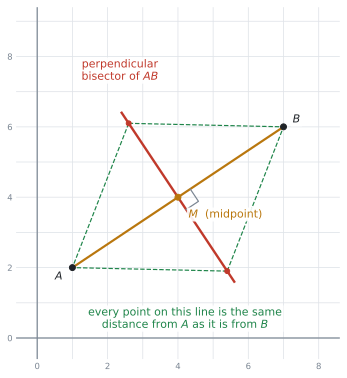
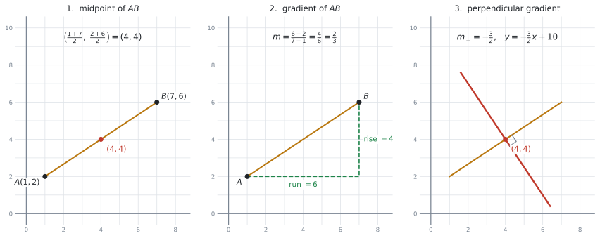
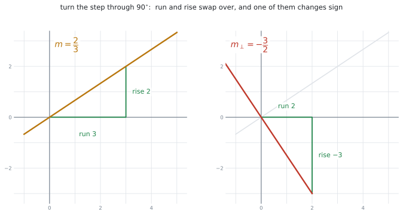
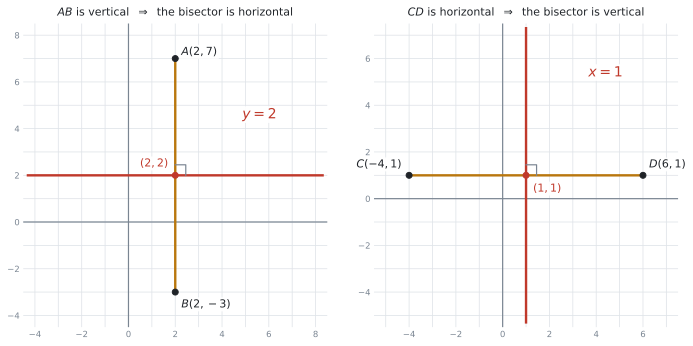
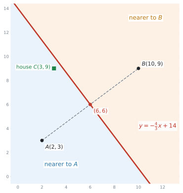
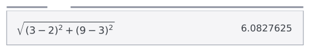

# SL 3.5 — Equations of perpendicular bisectors（垂直二等分線の式） {#sec-sl-3-5}

::: {.callout-note}
## What you should be able to do
- **perpendicular bisector**（垂直二等分線）が、**2点から等しい距離にある点の集まり**だと分かる。
- 2点の座標から、垂直二等分線の式を求められる。
- **垂直な直線の傾き** $m_{\perp} = -\dfrac{1}{m}$ を使える。← 公式集にありません
- 線分が**たて（vertical）・よこ（horizontal）**のときの特別な形が書ける。
- **線分の式と中点**が与えられた場合にも答えられる。
- 答えを $y = mx + c$ でも $ax + by + d = 0$ でも書ける。
- 「どちらの点に近いか」を、垂直二等分線を使って判断できる。
:::

::: {.callout-important}
## Formula booklet に載っているもの
公式集の Topic 3 の欄には、**3.5 という項目はありません。** ですが、この項目で使う式は**ほとんど公式集にあります**。ただし、**別のページ**に散らばっています。

**Topic 2 の 2.1 の欄**（`Equations of a straight line`、`Gradient formula`）

$$
y = mx + c \ ; \quad ax + by + d = 0 \ ; \quad y - y_{1} = m(x - x_{1})
$$ {#eq-sl35-line}

$$
m = \frac{y_{2} - y_{1}}{x_{2} - x_{1}}
$$ {#eq-sl35-grad}

**Topic 3 の `Prior learning – SL` の欄**（3.1 の少し前にあります）

$$
\left( \frac{x_{1} + x_{2}}{2}, \ \frac{y_{1} + y_{2}}{2} \right)
$$ {#eq-sl35-mid}

$$
d = \sqrt{(x_{1} - x_{2})^{2} + (y_{1} - y_{2})^{2}}
$$ {#eq-sl35-dist}

**この4つは配られます。覚える必要はありません。** ただし、**どのページに載っているかは知っておいてください。** 試験中に公式集をめくって探す時間が惜しいからです。
:::

::: {.callout-warning}
## 垂直な直線の傾きは、公式集にありません
$$
m_{\perp} = -\frac{1}{m}
\qquad \text{（同じことですが）} \qquad
m \times m_{\perp} = -1
$$ {#eq-sl35-perp}

**この項目で、覚える必要があるのはこれ1つだけ**です。ほかは全部、公式集を見れば書いてあります。

一般の**斜めの線分**では、この関係が計算の中心になります。ただし、線分が**よこ向き（horizontal）やたて向き（vertical）**のときは、$m = 0$ だったり傾きが定義できなかったりするので、**この式は使わず、図から判断します**（[第4節](#special)）。
:::

## The idea

### 1. perpendicular bisector は「等しい距離」の線です {#equal-distance}

まず、名前を2つに分けて読んでください。

- **bisector** … **二等分**するもの（bi = 2、sect = 切る）
- **perpendicular** … **垂直**

つまり、線分 $AB$ の perpendicular bisector とは、**$AB$ を真ん中で、直角に切る直線**です。

{#fig-sl35-idea width=76%}

::: {.callout-important}
## この項目の中心は、次の1文です
> **垂直二等分線の上にある点は、どれも $A$ と $B$ から同じ距離にあります。**

@fig-sl35-idea で、線の上の点から $A$ と $B$ に引いた点線は、**どのペアも同じ長さ**です。

計算のしかたを覚えるだけなら、この文はいりません。**ですが、SL 3.5 の応用問題と、次の [SL 3.6](sl-3-6.qmd) の Voronoi 図は、すべてこの1文の上に建っています。**
:::

### 2. 手順は4つです {#steps}

2点 $A$、$B$ の座標が与えられたら、次の順に進みます。

{#fig-sl35-steps width=100%}

| | やること | 使う式 |
|---|---|---|
| **1** | $AB$ の**中点**を出す（線が通る点） | @eq-sl35-mid |
| **2** | $AB$ の**傾き** $m$ を出す | @eq-sl35-grad |
| **3** | **垂直な傾き** $m_{\perp} = -\dfrac{1}{m}$ を出す | @eq-sl35-perp |
| **4** | 中点と $m_{\perp}$ から**直線の式**を書く | @eq-sl35-line |

: 垂直二等分線を求める手順 {#tbl-sl35-steps}

::: {.callout-tip}
## 中点を先に出してください
手順1と手順2は、どちらを先にしても答えは同じです。**ですが、中点を先に出すことをすすめます。**

理由は、**中点を出し忘れる答案が多い**からです。傾きの計算に気を取られて、「$A$ を通る直線」を書いてしまいます。

最初に中点を書いてしまえば、忘れようがありません。
:::

#### 手順4の式のえらび方 {#which-form}

直線の式は、@eq-sl35-line に3つの形があります。**このどれかを使いましょう。**

- $y - y_{1} = m(x - x_{1})$ … **通る点と傾きが分かっているとき。まずこれを書きます**
- $y = mx + c$ … 上の式を展開して整理した形。答えはたいていこの形にします
- $ax + by + d = 0$ … 分数を消したいときの形。問題文で指定されることがあります

**中点 $(x_{1}, y_{1})$ と傾き $m_{\perp}$ を、そのまま 1 つめの式に入れる**のが一番速く、一番間違えにくいやり方です。

### 3. 垂直な傾き $-\dfrac{1}{m}$ {#perp-gradient}

傾き $m$ の直線に垂直な直線の傾きは、$-\dfrac{1}{m}$ です。言いかえると、**ひっくり返して、符号を変えます。** 記号 $m_{\perp}$ を使っておくと分かりやすくなります。

{#fig-sl35-gradient width=90%}

@fig-sl35-gradient の左は傾き $\dfrac{2}{3}$ の直線で、右へ $3$、上へ $2$ の階段になっています。この階段を $90^\circ$ 回すと、**右へ $2$、下へ $3$** の階段になります。だから傾きは $-\dfrac{3}{2}$ です。

| もとの傾き $m$ | 垂直な傾き $m_{\perp}$ | やったこと |
|---|---|---|
| $\dfrac{2}{3}$ | $-\dfrac{3}{2}$ | ひっくり返して、符号を変えた |
| $4$ | $-\dfrac{1}{4}$ | $4 = \dfrac{4}{1}$ と見る |
| $-\dfrac{1}{2}$ | $2$ | ひっくり返すと $-2$、符号を変えて $2$ |
| $-3$ | $\dfrac{1}{3}$ | |

: 垂直な傾きの例 {#tbl-sl35-perp}

::: {.callout-warning}
## 符号だけ変える、逆数だけ取る、という誤りが多いところです
- $\dfrac{2}{3}$ の垂直は $-\dfrac{2}{3}$ **ではありません**（符号しか変えていません）
- $\dfrac{2}{3}$ の垂直は $\dfrac{3}{2}$ **でもありません**（ひっくり返しただけです）

**必ず両方**やります。確かめ方は $1$ 行で、**2つを掛けて $-1$ になれば正しい**です。

$$
\frac{2}{3} \times \left(-\frac{3}{2}\right) = -1 \ ✓
$$
:::

### 4. たて・よこの線分は、特別な形になります {#special}

$-\dfrac{1}{m}$ は、$m = 0$ のときに使えません（$0$ で割れないからです）。ですから、**線分がよこ向き・たて向きのときは、式ではなく図で考えます。**

{#fig-sl35-special width=94%}

| 線分 $AB$ | 見分け方 | 垂直二等分線 |
|---|---|---|
| **たて**（vertical） | $x$ 座標が同じ | **よこ**の線。$y = (\text{中点の } y)$ |
| **よこ**（horizontal） | $y$ 座標が同じ | **たて**の線。$x = (\text{中点の } x)$ |

: たて・よこの線分のとき {#tbl-sl35-special}

::: {.callout-tip}
## 座標を見たしゅんかんに分かります
$A(2, 7)$ と $B(2, -3)$ のように **$x$ が同じ**なら、線分はたてです。傾きの計算は要りません。

中点は $(2, 2)$ なので、垂直二等分線は **$y = 2$** です。それだけです。

$C(-4, 1)$ と $D(6, 1)$ のように **$y$ が同じ**なら、線分はよこ。中点は $(1, 1)$ で、答えは **$x = 1$** です。

**この2つは、計算が要らないぶん、点を取りやすい問題**です。
:::

### 5. もう1つの出題型：線分の式と中点が与えられる {#given-line}

シラバスの Guidance 欄に、出題のしかたが2通り書かれています。

> Given either **two points**, or **the equation of a line segment and its midpoint**.

2つめは、$A$ と $B$ の座標が出てこない形です。たとえば、こう聞かれます。

> `The line segment PQ lies on the line` $y = 2x - 5$`. The midpoint of PQ is M(4,3).`

このときは、**手順1と手順2がすでに済んでいる**と考えてください。

- 通る点 … $M(4, 3)$（**もう与えられています**）
- $PQ$ の傾き … $y = 2x - 5$ の $m$ を読むだけで $2$（**計算は要りません**）

あとは手順3と手順4だけです。$m_{\perp} = -\dfrac{1}{2}$ で、$y - 3 = -\dfrac{1}{2}(x - 4)$ となります。

::: {.callout-note}
## $ax + by + d = 0$ の形で与えられたら {#rearrange}
線分の式が $3x + 4y - 12 = 0$ のような形で与えられることもあります。このときは、**まず $y = \ldots$ の形に直して**から傾きを読みます。

$$
4y = -3x + 12 \quad \Rightarrow \quad y = -\frac{3}{4}x + 3 \quad \Rightarrow \quad m = -\frac{3}{4}
$$
:::

### 6. 検算のしかた {#check}

答えが出たら、**中点を自分の式に代入**してください。左辺と右辺が一致すれば、少なくとも「中点を通る」ことは確かめられます。

もっと強い検算をしたいときは、**自分の式の上の点を1つ選んで、$A$ と $B$ までの距離を @eq-sl35-dist で出します。** 等しくなれば、その直線は垂直二等分線です。

## Why it works

:::: {.callout-note collapse="true" appearance="simple"}
## クリックすると開きます
なぜ「$A$ と $B$ から等距離の点」を集めると、$AB$ の垂直二等分線になるのかを説明します。

点 $P$ が $A$ からも $B$ からも同じ距離にあるとします。すると、三角形 $PAB$ は $PA = PB$ の**二等辺三角形**です。

二等辺三角形では、**頂点 $P$ から底辺 $AB$ に下ろした線が、底辺をちょうど半分に切り、しかも直角になります**（数学Iで習う性質です）。

つまり $P$ は、$AB$ の中点を通り、$AB$ に垂直な直線の上にあります。**どの $P$ を選んでも同じ**なので、等距離の点を全部集めると、その直線になります。

逆に、その直線の上の点はどれも二等辺三角形の頂点になるので、$A$ と $B$ から等距離です。**だから「等距離の点の集まり」と「垂直二等分線」は、同じものです。**
::::

## Worked examples

::: {.callout-note appearance="simple"}
問題文は英語です。意味が理解できなかったら、問題文の下の「**日本語訳**」を開いてください。解説は日本語です。
:::

::: {#exm-sl35-basic}
[The points $A$ and $B$ have coordinates $A(1, 2)$ and $B(7, 6)$.]{.q-en}

**(a)** [Find the coordinates of the midpoint of $AB$.]{.q-en}

**(b)** [Find the gradient of $AB$.]{.q-en}

**(c)** [Find the equation of the perpendicular bisector of $AB$, giving your answer in the form $y = mx + c$.]{.q-en}

<details class="jp-trans">
<summary>日本語訳</summary>

点 $A$ と $B$ の座標は $A(1, 2)$、$B(7, 6)$ です。

**(a)** $AB$ の中点の座標を求めなさい。

**(b)** $AB$ の傾きを求めなさい。

**(c)** $AB$ の垂直二等分線の式を、$y = mx + c$ の形で求めなさい。

</details>

---

設問が (a)(b)(c) に分かれていますが、これは[第2節の手順](#steps)そのままです。**問題文が手順を教えてくれています。**

**(a)** @eq-sl35-mid です。$x$ 同士、$y$ 同士を足して $2$ で割ります。

$$
\left( \frac{1 + 7}{2}, \ \frac{2 + 6}{2} \right) = (4, 4)
$$

**(b)** @eq-sl35-grad です。

$$
m = \frac{6 - 2}{7 - 1} = \frac{4}{6} = \frac{2}{3}
$$

**(c)** [ひっくり返して、符号を変えます](#perp-gradient)。

$$
m_{\perp} = -\frac{3}{2}
$$

通る点は **(a)** の $(4, 4)$ です。@eq-sl35-line の1つめの形に入れます。

$$
y - 4 = -\frac{3}{2}(x - 4)
$$

$y = mx + c$ の形に直します。右辺を展開すると $-\dfrac{3}{2}x + 6$ です。

$$
y = -\frac{3}{2}x + 6 + 4 = -\frac{3}{2}x + 10
$$

**検算。** 中点 $(4, 4)$ を入れると $-\dfrac{3}{2}(4) + 10 = -6 + 10 = 4$ ✓

もう1つ確かめます。$x = 0$ のとき $y = 10$ なので、点 $(0, 10)$ もこの直線の上にあります。

$$
(0,10) \text{ から } A: \sqrt{1^{2} + 8^{2}} = \sqrt{65}, \qquad
(0,10) \text{ から } B: \sqrt{7^{2} + 4^{2}} = \sqrt{65} \ ✓
$$

**等距離になりました。** これでこの直線が垂直二等分線だと確かめられます。

::: {.callout-note}
## 解答例（答案用紙にはこう書く）
**(a)** $\left(\dfrac{1+7}{2}, \dfrac{2+6}{2}\right) = (4, 4)$

**(b)** $m = \dfrac{6-2}{7-1} = \dfrac{2}{3}$

**(c)** $m_{\perp} = -\dfrac{3}{2}$

$y - 4 = -\dfrac{3}{2}(x - 4)$

$y = -\dfrac{3}{2}x + 10$
:::
:::

::: {#exm-sl35-negative}
[The points $P$ and $Q$ have coordinates $P(-3, 5)$ and $Q(5, -1)$.]{.q-en}

**(a)** [Find the equation of the perpendicular bisector of $PQ$, giving your answer in the form $y = mx + c$.]{.q-en}

**(b)** [Write your answer to part (a) in the form $ax + by + d = 0$, where $a$, $b$ and $d$ are integers.]{.q-en}

<details class="jp-trans">
<summary>日本語訳</summary>

点 $P$ と $Q$ の座標は $P(-3, 5)$、$Q(5, -1)$ です。

**(a)** $PQ$ の垂直二等分線の式を、$y = mx + c$ の形で求めなさい。

**(b)** (a) の答えを、$a$、$b$、$d$ が整数である $ax + by + d = 0$ の形で書きなさい。

</details>

---

**(a)** 今回は設問が分かれていないので、[手順](#steps)を自分で並べます。

**中点。** 負の数が入るので、カッコを付けて書いてください。

$$
\left( \frac{-3 + 5}{2}, \ \frac{5 + (-1)}{2} \right) = \left( \frac{2}{2}, \ \frac{4}{2} \right) = (1, 2)
$$

**傾き。**

$$
m = \frac{-1 - 5}{5 - (-3)} = \frac{-6}{8} = -\frac{3}{4}
$$

**垂直な傾き。** ひっくり返すと $-\dfrac{4}{3}$、符号を変えて $\dfrac{4}{3}$ です。

$$
m_{\perp} = \frac{4}{3}
$$

**検算。** $-\dfrac{3}{4} \times \dfrac{4}{3} = -1$ ✓

**式。** $(1, 2)$ を通って傾き $\dfrac{4}{3}$ です。

$$
y - 2 = \frac{4}{3}(x - 1)
$$

$$
y = \frac{4}{3}x - \frac{4}{3} + 2 = \frac{4}{3}x + \frac{2}{3}
$$

**(b)** `where a, b and d are integers` とあるので、**分数を消します。** 両辺に $3$ を掛けます。

$$
3y = 4x + 2
$$

すべて左辺に集めます。

$$
4x - 3y + 2 = 0
$$

**検算。** 中点 $(1, 2)$ を入れると $4(1) - 3(2) + 2 = 4 - 6 + 2 = 0$ ✓

::: {.callout-tip}
## $ax + by + d = 0$ は、答えが1通りではありません
両辺を $-1$ 倍した $-4x + 3y - 2 = 0$ も、$2$ 倍した $8x - 6y + 4 = 0$ も正しい式です。

**ふつうは、$x$ の係数を正にして、共通因数のない形**にします。今回なら $4x - 3y + 2 = 0$ です。
:::

::: {.callout-note}
## 解答例（答案用紙にはこう書く）
**(a)** Midpoint $= \left(\dfrac{-3+5}{2}, \dfrac{5-1}{2}\right) = (1, 2)$

$m = \dfrac{-1-5}{5-(-3)} = -\dfrac{3}{4}$,  so  $m_{\perp} = \dfrac{4}{3}$

$y - 2 = \dfrac{4}{3}(x - 1)$,  so  $y = \dfrac{4}{3}x + \dfrac{2}{3}$

**(b)** $3y = 4x + 2$, so $4x - 3y + 2 = 0$
:::
:::

::: {#exm-sl35-special}
[**(a)** The points $A$ and $B$ have coordinates $A(2, 7)$ and $B(2, -3)$. Find the equation of the perpendicular bisector of $AB$.]{.q-en}

[**(b)** The points $C$ and $D$ have coordinates $C(-4, 1)$ and $D(6, 1)$. Find the equation of the perpendicular bisector of $CD$.]{.q-en}

<details class="jp-trans">
<summary>日本語訳</summary>

**(a)** 点 $A$ と $B$ の座標は $A(2, 7)$、$B(2, -3)$ です。$AB$ の垂直二等分線の式を求めなさい。

**(b)** 点 $C$ と $D$ の座標は $C(-4, 1)$、$D(6, 1)$ です。$CD$ の垂直二等分線の式を求めなさい。

</details>

---

**まず座標を見くらべてください。** どちらも、$x$ か $y$ のどちらかが**同じ**です。[特別な形になる合図](#special)です。

**(a)** $A$ も $B$ も $x = 2$ なので、線分 $AB$ は**たて**です。中点は

$$
\left( \frac{2 + 2}{2}, \ \frac{7 + (-3)}{2} \right) = (2, 2)
$$

たての線分に垂直なのは**よこ**の線なので、答えは $y$ が中点の値で一定です。

$$
\boxed{y = 2}
$$

**(b)** $C$ も $D$ も $y = 1$ なので、線分 $CD$ は**よこ**です。中点は

$$
\left( \frac{-4 + 6}{2}, \ \frac{1 + 1}{2} \right) = (1, 1)
$$

よこの線分に垂直なのは**たて**の線です。

$$
\boxed{x = 1}
$$

::: {.callout-warning}
## $x = 1$ を $y = 1$ と書いてしまう誤りが多いところです
**(b)** の中点は $(1, 1)$ で、$x$ も $y$ も $1$ です。**答えは $x = 1$ のほうです。**

見分け方は、線分の向きです。**よこの線分 → たての線 → $x = \ldots$。**

$y = 1$ と書くと、それは線分 $CD$ そのものになってしまいます。
:::

::: {.callout-note}
## 解答例（答案用紙にはこう書く）
**(a)** $A$ and $B$ have the same $x$-coordinate, so $AB$ is vertical.

Midpoint $= (2, 2)$, so the perpendicular bisector is $y = 2$

**(b)** $C$ and $D$ have the same $y$-coordinate, so $CD$ is horizontal.

Midpoint $= (1, 1)$, so the perpendicular bisector is $x = 1$
:::
:::

::: {#exm-sl35-givenline}
[The line segment $PQ$ lies on the line $y = 2x - 5$. The midpoint of $PQ$ is $M(4, 3)$.]{.q-en}

**(a)** [Show that $M$ lies on the line $y = 2x - 5$.]{.q-en}

**(b)** [Find the equation of the perpendicular bisector of $PQ$, giving your answer in the form $y = mx + c$.]{.q-en}

<details class="jp-trans">
<summary>日本語訳</summary>

線分 $PQ$ は直線 $y = 2x - 5$ の上にあります。$PQ$ の中点は $M(4, 3)$ です。

**(a)** $M$ が直線 $y = 2x - 5$ の上にあることを示しなさい。

**(b)** $PQ$ の垂直二等分線の式を、$y = mx + c$ の形で求めなさい。

</details>

---

これが[もう1つの出題型](#given-line)です。**$P$ と $Q$ の座標は、最後まで出てきません。**

**(a)** `Show that` なので、**途中を全部書きます。** $x = 4$ を式に入れて、$y$ が $3$ になることを見せます。

$$
y = 2(4) - 5 = 8 - 5 = 3
$$

$M$ の $y$ 座標と一致したので、$M$ は直線の上にあります。

**(b)** 手順1と手順2は、**もう終わっています。**

- 通る点 … $M(4, 3)$。中点は問題文に書いてあります
- $PQ$ の傾き … $y = 2x - 5$ の $x$ の係数を読むだけで $m = 2$

あとは垂直な傾きと、直線の式だけです。

$$
m_{\perp} = -\frac{1}{2}
$$

$$
y - 3 = -\frac{1}{2}(x - 4)
$$

$$
y = -\frac{1}{2}x + 2 + 3 = -\frac{1}{2}x + 5
$$

**検算。** $M(4, 3)$ を入れると $-\dfrac{1}{2}(4) + 5 = -2 + 5 = 3$ ✓　傾きの積は $2 \times \left(-\dfrac{1}{2}\right) = -1$ ✓

::: {.callout-tip}
## $P$ と $Q$ を探そうとしないでください
$P$ と $Q$ の座標は、この問題では**決まりません。** 線分の長さが書かれていないからです。

**必要なのは、傾きと中点だけ**です。垂直二等分線は、$P$ と $Q$ が線分のどこにあっても同じ直線になります。
:::

::: {.callout-note}
## 解答例（答案用紙にはこう書く）
**(a)** When $x = 4$: $y = 2(4) - 5 = 3$, which is the $y$-coordinate of $M$, so $M$ lies on the line.

**(b)** Gradient of $PQ$ is $m = 2$, so $m_{\perp} = -\dfrac{1}{2}$

$y - 3 = -\dfrac{1}{2}(x - 4)$

$y = -\dfrac{1}{2}x + 5$
:::
:::

::: {#exm-sl35-masts}
[Two mobile phone masts stand at $A(2, 3)$ and $B(10, 9)$ on a map. Each unit on the map represents $1$ km. A phone always connects to the nearer mast.]{.q-en}

**(a)** [Find the equation of the perpendicular bisector of $AB$.]{.q-en}

**(b)** [A house stands at $C(3, 9)$. By finding the distance from $C$ to each mast, determine which mast the house connects to.]{.q-en}

**(c)** [Explain what the line found in part (a) represents in this situation.]{.q-en}

<details class="jp-trans">
<summary>日本語訳</summary>

$2$ 本の携帯電話の基地局が、地図上の $A(2, 3)$ と $B(10, 9)$ に立っています。地図の $1$ 目盛りは $1$ km です。電話はいつも近いほうの基地局につながります。

**(a)** $AB$ の垂直二等分線の式を求めなさい。

**(b)** 家が $C(3, 9)$ にあります。$C$ から各基地局までの距離を求めることで、家がどちらの基地局につながるかを判断しなさい。

**(c)** (a) で求めた直線が、この場面で何を表しているかを説明しなさい。

</details>

---

{#fig-sl35-boundary width=78%}

**(a)** いつもの[手順](#steps)です。

$$
\text{中点} = \left( \frac{2 + 10}{2}, \ \frac{3 + 9}{2} \right) = (6, 6)
$$

$$
m = \frac{9 - 3}{10 - 2} = \frac{6}{8} = \frac{3}{4}, \qquad m_{\perp} = -\frac{4}{3}
$$

$$
y - 6 = -\frac{4}{3}(x - 6)
$$

$$
y = -\frac{4}{3}x + 8 + 6 = -\frac{4}{3}x + 14
$$

**(b)** `By finding the distance` と指定されているので、**@eq-sl35-dist を使います。**

$$
CA = \sqrt{(3 - 2)^{2} + (9 - 3)^{2}} = \sqrt{1 + 36} = \sqrt{37} = 6.08\ldots
$$

$$
CB = \sqrt{(3 - 10)^{2} + (9 - 9)^{2}} = \sqrt{49 + 0} = 7
$$

$6.08 < 7$ なので、家は **$A$ につながります**。

**(c)** 数値は出ません。**言葉で書く設問です。**

::: {.model-answer}
**試験ではこう書く**

*Every point on this line is the same distance from mast $A$ as from mast $B$. It is the boundary between the area that connects to $A$ and the area that connects to $B$.*
:::

（この直線の上の点は、どれも基地局 $A$ からと $B$ からで距離が同じです。$A$ につながる地域と $B$ につながる地域の**境界線**です。）

::: {.callout-important}
## (c) のような設問が、AI で一番点差がつくところです
`Explain what the line represents` に「垂直二等分線です」と書いても点になりません。**それは問題文がすでに言っていることです。**

書くべきなのは、**この場面での意味**です。「距離が等しい」「境界線」の2つが入っていれば十分です。

この考え方が、そのまま次の [SL 3.6](sl-3-6.qmd) の Voronoi 図になります。**基地局が3つ以上あるときの地図が Voronoi 図**で、その境目は全部、垂直二等分線です。
:::

::: {.callout-note}
## 解答例（答案用紙にはこう書く）
**(a)** Midpoint $= (6, 6)$;  $m = \dfrac{9-3}{10-2} = \dfrac{3}{4}$,  so  $m_{\perp} = -\dfrac{4}{3}$

$y - 6 = -\dfrac{4}{3}(x - 6)$,  so  $y = -\dfrac{4}{3}x + 14$

**(b)** $CA = \sqrt{1^{2} + 6^{2}} = \sqrt{37} = 6.08$ km (3 s.f.)

$CB = \sqrt{7^{2} + 0^{2}} = 7$ km

$CA < CB$, so the house connects to mast $A$.

**(c)** *Every point on this line is the same distance from mast $A$ as from mast $B$. It is the boundary between the area that connects to $A$ and the area that connects to $B$.*
:::
:::

## Common errors

::: {.callout-warning}
## 中点を出さずに、$A$ や $B$ を通る直線を書く
傾きの計算に気を取られて、**通る点を取り違える**誤りです。垂直二等分線が通るのは、$A$ でも $B$ でもなく**中点**です。

対策は1つだけです。**中点を、いちばん最初に書いてしまう**こと。

書き終えたら、**中点を自分の式に代入して確かめてください。** 一致しなければ、通る点を間違えています。
:::

::: {.callout-warning}
## 符号を変えるだけ、または逆数にするだけ
$m = \dfrac{2}{3}$ に対して $-\dfrac{2}{3}$ や $\dfrac{3}{2}$ と書いてしまう誤りです。**両方**やります。

確かめ方は、**掛けて $-1$** です。$\dfrac{2}{3} \times \left(-\dfrac{3}{2}\right) = -1$ ✓

$-1$ にならなければ、片方しかやっていません。
:::

::: {.callout-warning}
## 傾きの分子と分母を、上下逆にする
@eq-sl35-grad は $\dfrac{y_{2} - y_{1}}{x_{2} - x_{1}}$ です。**$y$ が上、$x$ が下**です。

逆にすると、それは「$x$ の変化を $y$ の変化で割ったもの」になり、意味がありません。

**「たての変化 ÷ よこの変化」**と、日本語で言いながら書くのが確実です。
:::

::: {.callout-warning}
## 引く順番を、上と下でそろえない
$\dfrac{y_{2} - y_{1}}{x_{2} - x_{1}}$ の $1$ と $2$ は、**上と下で同じ点**でなければなりません。

$$
\frac{-1 - 5}{5 - (-3)} \ ✓ \qquad\qquad \frac{-1 - 5}{-3 - 5} \ ✗
$$

右のように混ぜると、**符号が逆**になります。$A$ を先に書くと決めたら、上でも下でも $A$ を先に書いてください。
:::

::: {.callout-warning}
## たて・よこの線分で、$-\dfrac{1}{m}$ を使おうとする
よこの線分は $m = 0$ なので、$-\dfrac{1}{0}$ は計算できません。電卓は `undefined` と返します。

ここで止まってしまう答案があります。**式ではなく図で決めてください。** よこの線分の垂直二等分線は、**たての線 $x = \ldots$** です。

たての線分のほうは、そもそも傾き自体が計算できません（$0$ で割ることになります）。答えは**よこの線 $y = \ldots$** です。
:::

::: {.callout-warning}
## 負の座標を、カッコなしで引く
$5 - (-3)$ を $5 - 3 = 2$ としてしまう誤りです。正しくは $5 + 3 = 8$ です。

中点でも同じです。$\dfrac{5 + (-1)}{2}$ を $\dfrac{5 + 1}{2}$ としないでください。

**負の数は、必ずカッコを付けて書き写す。** これだけで防げます。
:::

::: {.callout-warning}
## 分数の傾きを、途中で小数に直してしまう
$-\dfrac{4}{3}$ を $-1.33$ と書いてから続けると、答えがずれます。

**分数のまま最後まで進めてください。** IB の答えは、分数のままで構いません。

小数にするのは、問題文が `correct to three significant figures` のように指定したときだけです。
:::

::: {.callout-warning}
## $ax + by + d = 0$ で、整数にし忘れる
`where a, b and d are integers` と書かれているのに、$\dfrac{4}{3}x - y + \dfrac{2}{3} = 0$ のままにしてしまう誤りです。

**分母の最小公倍数を、両辺に掛けます。** 今回なら $3$ を掛けて $4x - 3y + 2 = 0$ です。
:::

::: {.callout-warning}
## 「どちらに近いか」を、図の見た目だけで答える
`determine which mast` のような設問では、**根拠を書かないと点になりません。**

距離を2つとも計算して並べるか、垂直二等分線を使って「どちら側にあるか」を示してください。**「図から明らかに $A$ のほう」では点になりません。**
:::

## Using your GDC (TI-Nspire CX II)

この項目は、**手で計算するほうが速い**場面がほとんどです。電卓は主に**検算**に使います。

### 1. 分数はテンプレートで入れる

$\dfrac{-1 - 5}{5 - (-3)}$ のような計算は、分数のテンプレート（ctrl + $\div$）を使って、**分子と分母をそのまま**入れてください。

$$
\frac{-1-5}{5-(-3)}
$$

$1$ 行で `(-1-5)/(5-(-3))` と入れてもかまいませんが、**カッコの数を間違えやすい**です。テンプレートなら、見た目が紙に書いた式と同じになります。

答えは $-\dfrac{3}{4}$ と**分数のまま**返ってきます。

### 2. 傾きの積が $-1$ かを確かめる

垂直な傾きを出したら、Calculator ページで掛けてみてください。

```
2/3 × (-3/2)
```

$-1$ と出れば正しいです。**この検算は3秒で終わります。** 符号ミスと逆数ミスの両方を、いっぺんに見つけられます。

### 3. Graphs ページで、目で確かめる {#graphs}

答えの直線を Graphs ページに入れて、$A$ と $B$ を打つと、**中点を通って直角に交わっているか**が見えます。

1. Graphs ページを開いて、$f1(x)$ に $AB$ の式、$f2(x)$ に垂直二等分線の式を入れる
2. `menu → Geometry → Points & Lines → Point On` で、$A$ と $B$ を打つ

::: {.callout-warning}
## 見た目が直角でないことがあります
$x$ 軸と $y$ 軸の目盛りの間隔が違うと、**直角が直角に見えません。**

`menu → Window/Zoom → Zoom - Square` を選ぶと、両方の目盛りがそろって、直角が直角に見えるようになります。

**画面の見た目は、答えの根拠にはなりません。** 検算は必ず数でしてください。
:::

### 4. 距離は $1$ 行で入れる

@eq-sl35-dist は、**平方根のテンプレート**に入れて $1$ 行で計算します。

```
√((3-2)² + (9-3)²)
```

電卓の画面では、**紙に書くのと同じ形**で入ります。$\sqrt{\ }$ は `ctrl + x²`、$^{2}$ は `x²` キーです。

{#fig-sl35-gdcdist width=100%}

$6.0827\ldots$（$= \sqrt{37}$）と返ります。**途中で $37$ を書き出して打ち直さない**でください。

$\sqrt{37}$ の形のまま残るかどうかは機種によります（[SL 3.1](sl-3-1.qmd#gdc-pi)）。**どちらでも、画面の値をそのまま次に使えば同じ答えになります。**

### 5. 2直線の交点は Analyze Graph {#intersection}

[SL 3.6](sl-3-6.qmd) では、垂直二等分線を2本引いて**交点**を求める場面が出てきます。そのときは Graphs ページで

```
menu → 6: Analyze Graph → 4: Intersection
```

を使います。操作は [SL 2.4](../02-functions/sl-2-4.qmd) と同じで、`lower bound?` と `upper bound?` の $2$ 回、`enter` を押します（→ [SL 2.4](../02-functions/sl-2-4.qmd#bounds)）。

## Exercises

::: {.callout-note appearance="simple"}
各問題に、折りたたみが3つ付いています。**日本語訳**、**解答例**（答案用紙に書くべきこと。英語です）、**解説**（なぜそうなるか。日本語です）。

まず自分で解いて、次に解答例と見くらべてください。**解説は、合わなかったときだけ開けば十分です。**
:::

::: {.exercise-block}

[1]{.ex-no} [The points $A$ and $B$ have coordinates $A(1, 3)$ and $B(5, 11)$.]{.q-en}

**(a)** [Find the coordinates of the midpoint of $AB$.]{.q-en}

**(b)** [Find the equation of the perpendicular bisector of $AB$, giving your answer in the form $y = mx + c$.]{.q-en}

<details class="jp-trans">
<summary>日本語訳</summary>

点 $A$ と $B$ の座標は $A(1, 3)$、$B(5, 11)$ です。

**(a)** $AB$ の中点の座標を求めなさい。

**(b)** $AB$ の垂直二等分線の式を、$y = mx + c$ の形で求めなさい。

</details>

::: {.callout-note collapse="true"}
## 解答例（答案用紙に書くこと）
**(a)** $\left(\dfrac{1+5}{2}, \dfrac{3+11}{2}\right) = (3, 7)$

**(b)** $m = \dfrac{11-3}{5-1} = \dfrac{8}{4} = 2$,  so  $m_{\perp} = -\dfrac{1}{2}$

$y - 7 = -\dfrac{1}{2}(x - 3)$

$y = -\dfrac{1}{2}x + \dfrac{17}{2}$
:::

::: {.callout-tip collapse="true"}
## 解説
傾きが $2$ という整数なので、垂直な傾きは $-\dfrac{1}{2}$ です。**$2 = \dfrac{2}{1}$ と見れば**、ひっくり返して $\dfrac{1}{2}$、符号を変えて $-\dfrac{1}{2}$ です。

**検算**：$2 \times \left(-\dfrac{1}{2}\right) = -1$ ✓　中点 $(3,7)$ を入れると $-\dfrac{3}{2} + \dfrac{17}{2} = \dfrac{14}{2} = 7$ ✓

$\dfrac{17}{2} = 8.5$ なので、$y = -0.5x + 8.5$ と書いても正しいです。
:::

::: {.ex-sep}
:::

[2]{.ex-no} [The points $P$ and $Q$ have coordinates $P(-2, 1)$ and $Q(4, 9)$.]{.q-en}

**(a)** [Find the equation of the perpendicular bisector of $PQ$, giving your answer in the form $y = mx + c$.]{.q-en}

**(b)** [Write your answer to part (a) in the form $ax + by + d = 0$, where $a$, $b$ and $d$ are integers.]{.q-en}

<details class="jp-trans">
<summary>日本語訳</summary>

点 $P$ と $Q$ の座標は $P(-2, 1)$、$Q(4, 9)$ です。

**(a)** $PQ$ の垂直二等分線の式を、$y = mx + c$ の形で求めなさい。

**(b)** (a) の答えを、$a$、$b$、$d$ が整数である $ax + by + d = 0$ の形で書きなさい。

</details>

::: {.callout-note collapse="true"}
## 解答例（答案用紙に書くこと）
**(a)** Midpoint $= \left(\dfrac{-2+4}{2}, \dfrac{1+9}{2}\right) = (1, 5)$

$m = \dfrac{9-1}{4-(-2)} = \dfrac{8}{6} = \dfrac{4}{3}$,  so  $m_{\perp} = -\dfrac{3}{4}$

$y - 5 = -\dfrac{3}{4}(x - 1)$,  so  $y = -\dfrac{3}{4}x + \dfrac{23}{4}$

**(b)** $4y = -3x + 23$, so $3x + 4y - 23 = 0$
:::

::: {.callout-tip collapse="true"}
## 解説
$4 - (-2) = 6$ です。**$4 - 2 = 2$ としないでください。**

**(b)** は分母が $4$ なので、両辺に $4$ を掛けます。$4y = -3x + 23$。$x$ の係数を正にしたいので、$3x$ を左辺に移して $3x + 4y - 23 = 0$ です。

**検算**：中点 $(1,5)$ を入れると $3(1) + 4(5) - 23 = 3 + 20 - 23 = 0$ ✓
:::

::: {.ex-sep}
:::

[3]{.ex-no} [The points $O$ and $A$ have coordinates $O(0, 0)$ and $A(6, 4)$. Find the equation of the perpendicular bisector of $OA$, giving your answer in the form $y = mx + c$.]{.q-en}

<details class="jp-trans">
<summary>日本語訳</summary>

点 $O$ と $A$ の座標は $O(0, 0)$、$A(6, 4)$ です。$OA$ の垂直二等分線の式を、$y = mx + c$ の形で求めなさい。

</details>

::: {.callout-note collapse="true"}
## 解答例（答案用紙に書くこと）
Midpoint $= \left(\dfrac{0+6}{2}, \dfrac{0+4}{2}\right) = (3, 2)$

$m = \dfrac{4-0}{6-0} = \dfrac{2}{3}$,  so  $m_{\perp} = -\dfrac{3}{2}$

$y - 2 = -\dfrac{3}{2}(x - 3)$

$y = -\dfrac{3}{2}x + \dfrac{13}{2}$
:::

::: {.callout-tip collapse="true"}
## 解説
一方が原点 $(0,0)$ なので、計算が少し楽になります。**それでも中点は必ず出してください。** $(3, 2)$ です。

$-\dfrac{3}{2}(x-3) = -\dfrac{3}{2}x + \dfrac{9}{2}$ で、$+2 = +\dfrac{4}{2}$ を足すと $\dfrac{13}{2}$ です。

**検算**：$(3,2)$ を入れると $-\dfrac{9}{2} + \dfrac{13}{2} = \dfrac{4}{2} = 2$ ✓
:::

::: {.ex-sep}
:::

[4]{.ex-no} [**(a)** The points $A$ and $B$ have coordinates $A(-1, 4)$ and $B(-1, -8)$. Find the equation of the perpendicular bisector of $AB$.]{.q-en}

[**(b)** The points $C$ and $D$ have coordinates $C(3, 5)$ and $D(11, 5)$. Find the equation of the perpendicular bisector of $CD$.]{.q-en}

<details class="jp-trans">
<summary>日本語訳</summary>

**(a)** 点 $A$ と $B$ の座標は $A(-1, 4)$、$B(-1, -8)$ です。$AB$ の垂直二等分線の式を求めなさい。

**(b)** 点 $C$ と $D$ の座標は $C(3, 5)$、$D(11, 5)$ です。$CD$ の垂直二等分線の式を求めなさい。

</details>

::: {.callout-note collapse="true"}
## 解答例（答案用紙に書くこと）
**(a)** $A$ and $B$ have the same $x$-coordinate, so $AB$ is vertical.

Midpoint $= \left(-1, \dfrac{4 + (-8)}{2}\right) = (-1, -2)$

The perpendicular bisector is $y = -2$

**(b)** $C$ and $D$ have the same $y$-coordinate, so $CD$ is horizontal.

Midpoint $= \left(\dfrac{3+11}{2}, 5\right) = (7, 5)$

The perpendicular bisector is $x = 7$
:::

::: {.callout-tip collapse="true"}
## 解説
[座標を見くらべるだけで決まります](#special)。傾きの計算はしません。

**(a)** $x$ が両方 $-1$ → たての線分 → 垂直二等分線は**よこ** → $y = \ldots$。中点の $y$ は $\dfrac{4-8}{2} = -2$ です。

**(b)** $y$ が両方 $5$ → よこの線分 → 垂直二等分線は**たて** → $x = \ldots$。中点の $x$ は $\dfrac{3+11}{2} = 7$ です。

**$y = 5$ と書かないでください。** それは線分 $CD$ そのものです。
:::

::: {.ex-sep}
:::

[5]{.ex-no} [The line segment $PQ$ lies on the line $y = -3x + 7$. The midpoint of $PQ$ is $M(2, 1)$. Find the equation of the perpendicular bisector of $PQ$, giving your answer in the form $y = mx + c$.]{.q-en}

<details class="jp-trans">
<summary>日本語訳</summary>

線分 $PQ$ は直線 $y = -3x + 7$ の上にあります。$PQ$ の中点は $M(2, 1)$ です。$PQ$ の垂直二等分線の式を、$y = mx + c$ の形で求めなさい。

</details>

::: {.callout-note collapse="true"}
## 解答例（答案用紙に書くこと）
Gradient of $PQ$ is $m = -3$, so $m_{\perp} = \dfrac{1}{3}$

$y - 1 = \dfrac{1}{3}(x - 2)$

$y = \dfrac{1}{3}x + \dfrac{1}{3}$
:::

::: {.callout-tip collapse="true"}
## 解説
[線分の式と中点が与えられる型](#given-line)です。**$P$ と $Q$ の座標は出てきませんし、必要もありません。**

$y = -3x + 7$ の $x$ の係数を読むだけで $m = -3$。ひっくり返して $-\dfrac{1}{3}$、符号を変えて $\dfrac{1}{3}$ です。

$\dfrac{1}{3}(x-2) = \dfrac{1}{3}x - \dfrac{2}{3}$ で、$+1 = +\dfrac{3}{3}$ を足すと $\dfrac{1}{3}$ です。

**検算**：$M(2,1)$ を入れると $\dfrac{2}{3} + \dfrac{1}{3} = 1$ ✓　傾きの積は $-3 \times \dfrac{1}{3} = -1$ ✓
:::

::: {.ex-sep}
:::

[6]{.ex-no} [The points $A$ and $B$ have coordinates $A(1, 1)$ and $B(7, 9)$.]{.q-en}

**(a)** [Find the equation of the perpendicular bisector of $AB$, giving your answer in the form $y = mx + c$.]{.q-en}

**(b)** [Show that the point $C(8, 2)$ lies on this perpendicular bisector.]{.q-en}

**(c)** [Hence write down what you can say about the distances $CA$ and $CB$.]{.q-en}

<details class="jp-trans">
<summary>日本語訳</summary>

点 $A$ と $B$ の座標は $A(1, 1)$、$B(7, 9)$ です。

**(a)** $AB$ の垂直二等分線の式を、$y = mx + c$ の形で求めなさい。

**(b)** 点 $C(8, 2)$ がこの垂直二等分線の上にあることを示しなさい。

**(c)** これを使って、距離 $CA$ と $CB$ について言えることを書きなさい。

</details>

::: {.callout-note collapse="true"}
## 解答例（答案用紙に書くこと）
**(a)** Midpoint $= (4, 5)$;  $m = \dfrac{9-1}{7-1} = \dfrac{4}{3}$,  so  $m_{\perp} = -\dfrac{3}{4}$

$y - 5 = -\dfrac{3}{4}(x - 4)$,  so  $y = -\dfrac{3}{4}x + 8$

**(b)** When $x = 8$: $y = -\dfrac{3}{4}(8) + 8 = -6 + 8 = 2$, which is the $y$-coordinate of $C$, so $C$ lies on the line.

**(c)** $CA = CB$ (the distances are equal).
:::

::: {.callout-tip collapse="true"}
## 解説
**(b)** は `Show that` なので、**$x = 8$ を代入して $y = 2$ になる**ところまで書きます。答えだけでは点になりません。

**(c)** は計算をしません。[垂直二等分線の上の点は、$A$ と $B$ から等距離](#equal-distance)だからです。この1文が、この項目の中心です。

**確かめておくと**：$CA = \sqrt{7^{2} + 1^{2}} = \sqrt{50}$、$CB = \sqrt{1^{2} + 7^{2}} = \sqrt{50}$ ✓
:::

::: {.ex-sep}
:::

[7]{.ex-no} [The points $A$ and $B$ have coordinates $A(2, 2)$ and $B(8, 6)$.]{.q-en}

**(a)** [Find the equation of the perpendicular bisector of $AB$.]{.q-en}

**(b)** [The point $P$ has coordinates $(3, 8)$. By finding the distances $PA$ and $PB$, determine which of $A$ and $B$ is nearer to $P$.]{.q-en}

<details class="jp-trans">
<summary>日本語訳</summary>

点 $A$ と $B$ の座標は $A(2, 2)$、$B(8, 6)$ です。

**(a)** $AB$ の垂直二等分線の式を求めなさい。

**(b)** 点 $P$ の座標は $(3, 8)$ です。距離 $PA$ と $PB$ を求めることで、$A$ と $B$ のどちらが $P$ に近いかを判断しなさい。

</details>

::: {.callout-note collapse="true"}
## 解答例（答案用紙に書くこと）
**(a)** Midpoint $= (5, 4)$;  $m = \dfrac{6-2}{8-2} = \dfrac{2}{3}$,  so  $m_{\perp} = -\dfrac{3}{2}$

$y - 4 = -\dfrac{3}{2}(x - 5)$,  so  $y = -\dfrac{3}{2}x + \dfrac{23}{2}$

**(b)** $PA = \sqrt{(3-2)^{2} + (8-2)^{2}} = \sqrt{37} = 6.08$ (3 s.f.)

$PB = \sqrt{(3-8)^{2} + (8-6)^{2}} = \sqrt{29} = 5.39$ (3 s.f.)

$PB < PA$, so $B$ is nearer to $P$.
:::

::: {.callout-tip collapse="true"}
## 解説
**(b)** は `By finding the distances` と指定されているので、**距離を2つとも書きます。** 図を見ただけの答えでは点になりません。

**垂直二等分線でも確かめられます。** (a) の式に $x = 3$ を入れると $y = -\dfrac{9}{2} + \dfrac{23}{2} = 7$。$P$ の $y$ は $8$ で、$7$ より**上**です。

$A(2,2)$ はどうかというと、$x = 2$ のとき線は $y = \dfrac{17}{2} = 8.5$ で、$A$ の $y$ は $2$。$A$ は線の**下**です。

つまり $P$ は $A$ と**反対側**、$B$ と同じ側にあります。だから $B$ のほうが近い ✓
:::

::: {.ex-sep}
:::

[8]{.ex-no} [The points $A$ and $B$ have coordinates $A(-3, 6)$ and $B(5, 2)$. Find the equation of the perpendicular bisector of $AB$, giving your answer in the form $y = mx + c$.]{.q-en}

<details class="jp-trans">
<summary>日本語訳</summary>

点 $A$ と $B$ の座標は $A(-3, 6)$、$B(5, 2)$ です。$AB$ の垂直二等分線の式を、$y = mx + c$ の形で求めなさい。

</details>

::: {.callout-note collapse="true"}
## 解答例（答案用紙に書くこと）
Midpoint $= \left(\dfrac{-3+5}{2}, \dfrac{6+2}{2}\right) = (1, 4)$

$m = \dfrac{2-6}{5-(-3)} = \dfrac{-4}{8} = -\dfrac{1}{2}$,  so  $m_{\perp} = 2$

$y - 4 = 2(x - 1)$

$y = 2x + 2$
:::

::: {.callout-tip collapse="true"}
## 解説
$AB$ の傾きが負なので、**垂直な傾きは正**になります。ひっくり返すと $-\dfrac{2}{1} = -2$、符号を変えて $2$ です。

**傾きが負のときは、答えの傾きが正になる**と覚えておくと、符号ミスに気づけます。

**検算**：$-\dfrac{1}{2} \times 2 = -1$ ✓　中点 $(1,4)$ を入れると $2(1) + 2 = 4$ ✓
:::

::: {.ex-sep}
:::

[9]{.ex-no} [The points $A$ and $B$ have coordinates $A(-2, -1)$ and $B(6, 3)$. Find the equation of the perpendicular bisector of $AB$, giving your answer in the form $ax + by + d = 0$, where $a$, $b$ and $d$ are integers.]{.q-en}

<details class="jp-trans">
<summary>日本語訳</summary>

点 $A$ と $B$ の座標は $A(-2, -1)$、$B(6, 3)$ です。$AB$ の垂直二等分線の式を、$a$、$b$、$d$ が整数である $ax + by + d = 0$ の形で求めなさい。

</details>

::: {.callout-note collapse="true"}
## 解答例（答案用紙に書くこと）
Midpoint $= \left(\dfrac{-2+6}{2}, \dfrac{-1+3}{2}\right) = (2, 1)$

$m = \dfrac{3-(-1)}{6-(-2)} = \dfrac{4}{8} = \dfrac{1}{2}$,  so  $m_{\perp} = -2$

$y - 1 = -2(x - 2)$,  so  $y = -2x + 5$

$2x + y - 5 = 0$
:::

::: {.callout-tip collapse="true"}
## 解説
両方の座標に負の数が入ります。**カッコを付けて書き写してください。** $3 - (-1) = 4$、$6 - (-2) = 8$ です。

今回は分数が出ないので、$y = -2x + 5$ をそのまま移項するだけです。$2x + y - 5 = 0$。

**検算**：中点 $(2,1)$ を入れると $2(2) + 1 - 5 = 4 + 1 - 5 = 0$ ✓
:::

::: {.ex-sep}
:::

[10]{.ex-no} [Two libraries stand at $A(1, 2)$ and $B(7, 10)$ on a map, where each unit represents $1$ km. The council wants a boundary line so that everyone goes to the library that is nearer to their home.]{.q-en}

**(a)** [Find the equation of the boundary line.]{.q-en}

**(b)** [A house stands at $H(2, 9)$. By finding the distances $HA$ and $HB$, determine which library the house is nearer to.]{.q-en}

**(c)** [Explain why a family living exactly on the boundary line could go to either library.]{.q-en}

<details class="jp-trans">
<summary>日本語訳</summary>

$2$ つの図書館が、地図上の $A(1, 2)$ と $B(7, 10)$ に建っています。地図の $1$ 目盛りは $1$ km です。市は、だれもが自分の家から近いほうの図書館に行くように、境界線をつくりたいと考えています。

**(a)** 境界線の式を求めなさい。

**(b)** 家が $H(2, 9)$ にあります。距離 $HA$ と $HB$ を求めることで、家がどちらの図書館に近いかを判断しなさい。

**(c)** 境界線のちょうど上に住んでいる家族が、どちらの図書館にも行ける理由を説明しなさい。

</details>

::: {.callout-note collapse="true"}
## 解答例（答案用紙に書くこと）
**(a)** Midpoint $= (4, 6)$;  $m = \dfrac{10-2}{7-1} = \dfrac{4}{3}$,  so  $m_{\perp} = -\dfrac{3}{4}$

$y - 6 = -\dfrac{3}{4}(x - 4)$,  so  $y = -\dfrac{3}{4}x + 9$

**(b)** $HA = \sqrt{(2-1)^{2} + (9-2)^{2}} = \sqrt{50} = 7.07$ km (3 s.f.)

$HB = \sqrt{(2-7)^{2} + (9-10)^{2}} = \sqrt{26} = 5.10$ km (3 s.f.)

$HB < HA$, so the house is nearer to library $B$.

**(c)** *Every point on the boundary is the same distance from $A$ as from $B$, so the two libraries are equally far away.*
:::

::: {.callout-tip collapse="true"}
## 解説
境界線 = **垂直二等分線**です。問題文に「垂直二等分線」という言葉が出てこなくても、「近いほうに行く境目」と書いてあれば同じものです。

**(b)** の答えは $\sqrt{50}$ と $\sqrt{26}$ です。**平方根のまま比べても構いません**（$50 > 26$ なので $HA > HB$）。ただし `km` と単位を聞かれている場面なので、小数も書いておくほうが安全です。

**(c)** は [SL 3.6](sl-3-6.qmd) の Voronoi 図につながる考え方です。「等距離だから」の一言が入っていれば点になります。
:::

::: {.ex-sep}
:::

[11]{.ex-no} [Three mobile phone masts stand at $A(0, 0)$, $B(8, 0)$ and $C(0, 6)$.]{.q-en}

**(a)** [Find the equation of the perpendicular bisector of $AB$.]{.q-en}

**(b)** [Find the equation of the perpendicular bisector of $AC$.]{.q-en}

**(c)** [Hence find the coordinates of the point that is the same distance from all three masts.]{.q-en}

**(d)** [Find this distance.]{.q-en}

<details class="jp-trans">
<summary>日本語訳</summary>

$3$ 本の携帯電話の基地局が、$A(0, 0)$、$B(8, 0)$、$C(0, 6)$ に立っています。

**(a)** $AB$ の垂直二等分線の式を求めなさい。

**(b)** $AC$ の垂直二等分線の式を求めなさい。

**(c)** これを使って、$3$ 本すべてから等しい距離にある点の座標を求めなさい。

**(d)** その距離を求めなさい。

</details>

::: {.callout-note collapse="true"}
## 解答例（答案用紙に書くこと）
**(a)** $A$ and $B$ have the same $y$-coordinate, so $AB$ is horizontal.

Midpoint $= (4, 0)$, so the perpendicular bisector is $x = 4$

**(b)** $A$ and $C$ have the same $x$-coordinate, so $AC$ is vertical.

Midpoint $= (0, 3)$, so the perpendicular bisector is $y = 3$

**(c)** The two bisectors meet at $(4, 3)$.

**(d)** Distance $= \sqrt{4^{2} + 3^{2}} = \sqrt{25} = 5$
:::

::: {.callout-tip collapse="true"}
## 解説
**(a)(b)** はどちらも[たて・よこの特別な形](#special)です。計算はほとんど要りません。

**(c)** が、この問題の山です。**なぜ交点が3点すべてから等距離になるのか**を考えてください。

- $AB$ の垂直二等分線の上 → $A$ と $B$ から等距離
- $AC$ の垂直二等分線の上 → $A$ と $C$ から等距離
- **両方の上にある点**（＝交点）→ $A$、$B$、$C$ の3つすべてから等距離

$x = 4$ と $y = 3$ の交点なので、$(4, 3)$ です。

**(d)** 検算をかねて、3つとも計算してみてください。

$$
(4,3) \to A: \sqrt{16+9} = 5, \quad \to B: \sqrt{16+9} = 5, \quad \to C: \sqrt{16+9} = 5 \ ✓
$$

**3つとも $5$ になります。** この点は、$3$ 点を通る円の中心でもあります。[SL 3.6](sl-3-6.qmd) では、この交点が Voronoi 図の **vertex**（頂点）と呼ばれます。
:::

:::
