# SL 3.6 — Voronoi diagrams（ボロノイ図） {#sec-sl-3-6}

::: {.callout-note}
## What you should be able to do
- **site**、**cell**、**edge**、**vertex** の4つの言葉が読める。
- **edge が垂直二等分線**、**vertex が（ふつうの図では）3つの site から等距離**の点だと分かる。
- 2つの site が与えられたとき、その境界（edge）の式を求められる。
- 2本の edge の式から、**vertex の座標**を求められる。
- ある点に**一番近い site** を、図または距離の計算で決められる。
- **nearest neighbour interpolation** で値を見積もれる。
- **site を1つ足した**ときに図がどう変わるかを説明できる。
- **toxic waste dump 問題**（どこに置けば全部から一番遠いか）を解ける。
- cell の**面積**を求められる。
:::

::: {.callout-important}
## Formula booklet に、この項目の式はありません
公式集の Topic 3 の欄は **3.1、3.2、3.4 だけ**です。**3.6 の欄はありません。**

使う道具は、全部 [SL 3.5](sl-3-5.qmd) と同じです。

$$
\left( \frac{x_{1} + x_{2}}{2}, \ \frac{y_{1} + y_{2}}{2} \right), \qquad
m = \frac{y_{2} - y_{1}}{x_{2} - x_{1}}, \qquad
m_{\perp} = -\frac{1}{m}
$$

$$
d = \sqrt{(x_{1} - x_{2})^{2} + (y_{1} - y_{2})^{2}}
$$ {#eq-sl36-dist}

**新しい計算は、1つも出てきません。** この項目で新しいのは、**言葉**と**場面の読み取り**です。
:::

::: {.callout-tip}
## シラバスが、試験の作り方まで書いている項目です
SL 3.6 の Guidance 欄には、ふつうは書かれないことまで書いてあります。**そのまま引用します。**

> In examinations, **coordinates of sites** for calculating the perpendicular bisector equations **will be given**.
>
> Students **will not be required to construct** perpendicular bisectors.
>
> In examinations, **the solution point will always be at an intersection of three edges**.

つまり、

- **垂直二等分線の式を計算する問題では、必要な site の座標が与えられます**
- **定規とコンパスで作図する必要はありません**。計算で出します
- 試験では、toxic waste dump 問題の答えは **vertex にあります**

この3行を知っているだけで、解き方の見通しがずいぶん良くなります。
:::

## The idea

### 1. Voronoi 図は「一番近いのはどれか」の地図です {#what}

いくつかの点（お店、病院、基地局、観測所など）が地図の上にあるとします。**「この場所からは、どれが一番近いか」**で地図を塗り分けたものが、**Voronoi diagram**（ボロノイ図）です。

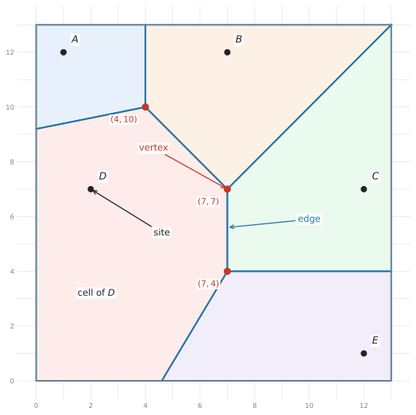{#fig-sl36-parts width=78%}

@fig-sl36-parts は、$5$ つの村 $A$ 〜 $E$ の地図です。$1$ 目盛りが $1$ km だとします。

| English | 日本語 | 何のことか |
|---|---|---|
| **site** | 母点（ぼてん） | もとになる点。$A$ 〜 $E$ のこと |
| **cell** | セル・領域 | 「その site が一番近い」場所の集まり |
| **edge** | 辺・境界 | $2$ つの cell の境目。**直線の一部** |
| **vertex**（複数 **vertices**） | 頂点 | edge が集まる点。ふつうの IB の問題では $3$ 本 |

: Voronoi 図の4つの言葉 {#tbl-sl36-terms}

::: {.callout-warning}
## この4つの言葉は、日本の教科書には出てきません
Voronoi 図は日本の高校では扱いません。ですから、**日本語で覚えても意味がありません。**

問題文は `Write down the coordinates of the vertex` のような英語で出ます。**英語のまま覚えてください。**

特に `site` は、ふつうの英語では「場所」ですが、ここでは**もとの点そのもの**を指します。
:::

### 2. edge は垂直二等分線、vertex は site から等距離 {#edge-vertex}

ここが、[SL 3.5](sl-3-5.qmd) とのつなぎ目です。

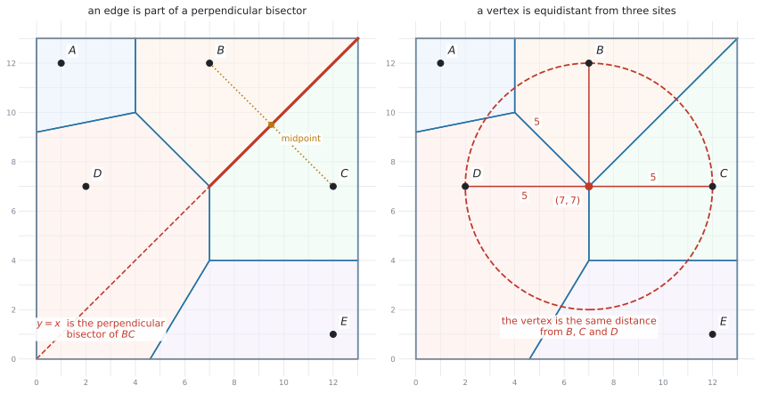{#fig-sl36-edge width=100%}

**edge は、$2$ つの site の垂直二等分線の一部**です。@fig-sl36-edge の左では、$B$ と $C$ の垂直二等分線が $y = x$ で、そのうち**太くかいた部分**が実際の edge になっています。

この章で扱うふつうの図では、**vertex は $3$ つの site から等距離**にある点です。右の図では、$(7,7)$ から $B$、$C$、$D$ までの距離が**どれも $5$** です。だから $(7,7)$ を中心にした半径 $5$ の円が、$3$ つの site をちょうど通ります。

::: {.callout-important}
## 「なぜ 3 つなのか」を押さえてください
edge の上の点は、**$2$ つの site から等距離**です。

vertex は、**$2$ 本の edge が交わった点**です。ですから

- $1$ 本目の edge の上 → $B$ と $C$ から等距離
- $2$ 本目の edge の上 → $B$ と $D$ から等距離
- **両方の上** → $B$、$C$、$D$ の $3$ つから等距離

そのため、$3$ 本目の edge（$C$ と $D$ の境界）も**自動的に同じ点を通ります。** これが「edge が $3$ 本集まる」ということです。

ふつうの IB の問題では、$1$ つの vertex に **edge が $3$ 本、cell が $3$ つ**集まります。ただし site の並び方が特別な場合（たとえば正方形の $4$ 頂点）には、$4$ つ以上が集まることもあります。
:::

#### vertex の座標は、2本の式を連立して出します {#find-vertex}

**2つの edge の式を求めて、連立方程式を解く** — これだけです。手順は次のとおりです。

| | やること |
|---|---|
| **1** | site を $2$ つ選んで、その垂直二等分線の式を出す（[SL 3.5](sl-3-5.qmd) の手順） |
| **2** | 別の $2$ つで、もう $1$本の式を出す |
| **3** | $2$ 本を連立して解く |
| **4** | 出た点から $3$ つの site までの距離を計算して、等しいことを確かめる |

: vertex の座標を求める手順 {#tbl-sl36-vertex}

### 3. 一番近い site をさがす {#nearest}

`Determine which site is closest to the point ...` は、この項目でよく出る設問です。やり方は $2$ 通りあります。

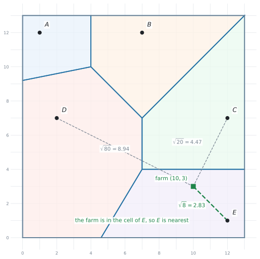{#fig-sl36-nearest width=76%}

- **図から読む** … その点がどの cell の中にあるかを見ます。速いですが、**「図より $E$」とだけ書くと根拠が残りません**
- **距離を計算する** … @eq-sl36-dist で全部の距離を出して、一番小さいものを選びます

::: {.callout-important}
## 問題文の指示で、どちらを使うかが決まります
- `Write down` … 図から読むだけ。計算は要りません
- **`By finding the distances` と指定されたら** … 指定された距離を**計算して並べ、比べます。** やり方まで指示されているので、そのとおりにします
- **`Determine` だけのとき** … 図・距離・境界線などを使って、**答えが $1$ つに決まる十分な根拠**を示します

どちらの場合も、**結論だけを書かない**のが大事です。何を根拠にそう決めたのかが、答案に残るようにしてください。
:::

### 4. nearest neighbour interpolation {#interpolation}

シラバスの Guidance 欄に、こう書かれています。

> All points within a cell can be estimated to have the same value (e.g. **rainfall**) as the value of the site.

つまり、**同じ cell の中の場所は、その site と同じ値だと見なす**という見積もり方です。これを **nearest neighbour interpolation**（最近傍補間）といいます。

**site に値がついている場面**で使います。たとえば、村ごとに雨量計があって、**それぞれの村の雨量が分かっている**とします。村と村のあいだにある地点では測っていませんが、**一番近い村と同じ**だと見なして答える、という考え方です。

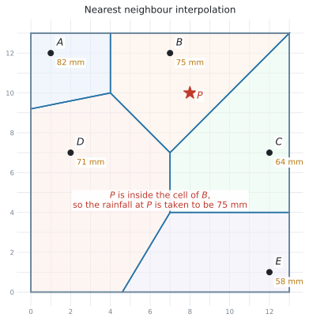{#fig-sl36-interp width=72%}

やることは、たった $2$ 段階です。

1. その点が**どの cell の中にあるか**を決める
2. その site の値を、そのまま答えにする

@fig-sl36-interp では、地点 $P(8,10)$ は **$B$ の cell の中**にあります。ですから $P$ の雨量は、$B$ で測った **$75$ mm** と見積もります。

::: {.callout-warning}
## 「一番近い site の値を、そのまま書く」だけです
平均を取ったり、距離で重みを付けたりは**しません。**

@fig-sl36-interp の $P$ のまわりには $A$、$C$、$D$ もありますが、$82$、$64$、$71$ と $75$ を**平均して $73$ と答えるのは、別の方法**です。この項目では、**一番近い $1$ つだけ**を見ます。
:::

### 5. site を1つ足す {#add-site}

シラバスの Content 欄に `Addition of a site to an existing Voronoi diagram` とあります。**新しい店ができた、新しい基地局が建った、という場面**です。

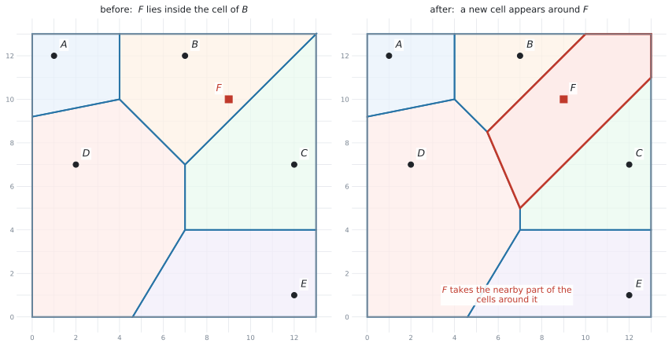{#fig-sl36-addsite width=100%}

新しい site $F$ を足すと、$F$ のまわりに**新しい cell** ができます。その cell は、**まわりの cell から少しずつ取ってきた**ものです。

- $F$ の cell が**現れる**
- $F$ のとなりだった cell は、**小さくなります**
- $F$ から遠い cell は、**変わりません**

境界の式の出し方は、いままでと同じです。**$F$ と、となりの site の垂直二等分線**を出します。

::: {.callout-tip}
## 「大きくなる cell」はありません
site を足したとき、**どの cell も大きくはなりません。** 小さくなるか、そのままかのどちらかです。

新しい site は、まわりから場所を**取る**だけだからです。
:::

### 6. toxic waste dump 問題 {#toxic}

`toxic waste dump`（有害廃棄物処分場）は、シラバスに名前が載っている問題です。

> **どの site からもできるだけ遠い**場所を、決められた範囲の中から選びなさい。

処分場、ごみ処理場、騒音の出る工場など、**近くにあってほしくないもの**を置く場面です。

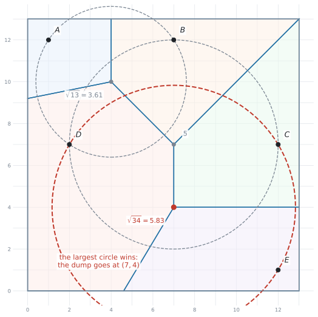{#fig-sl36-toxic width=76%}

#### 手順は3つです {#toxic-steps}

| | やること |
|---|---|
| **1** | すべての **vertex** の座標を書き出す |
| **2** | それぞれについて、**一番近い site までの距離**を計算する |
| **3** | その距離が**一番大きい** vertex を選ぶ |

: toxic waste dump 問題の手順 {#tbl-sl36-toxic}

::: {.callout-important}
## なぜ vertex だけを調べればよいのか
シラバスが、はっきり書いています。

> In examinations, the solution point will always be at **an intersection of three edges**.

つまり、**試験では答えは必ず vertex にあります。** 探す場所は vertex だけです。

考え方としては、@fig-sl36-toxic の円を見てください。それぞれの vertex を中心に、**一番近い site まで届く円**をかいてあります。この円の中には site が $1$ つも入っていません。**円が大きいほど、まわりに何もない**ということです。だから**一番大きい円の中心**が答えになります。
:::

::: {.callout-warning}
## vertex を1つでも飛ばすと、答えが変わります
「見た感じ真ん中あたり」で選ばないでください。**全部の vertex について距離を出して、並べてから**選びます。

答案には、**調べた vertex を全部書いてください。** 比較したことが見えないと、その vertex を選んだ根拠が示せません。
:::

### 7. cell の面積 {#area}

Guidance 欄に `calculating the area of a region` とあります。cell は**多角形**なので、面積は次のように出します。

- **三角形・長方形・台形に切り分けて**足す
- 大きい長方形から、はみ出した三角形を**引く**

::: {.callout-tip}
## 地図のわくで閉じることを忘れないでください
外側の cell は、Voronoi の edge だけでは閉じません。**地図のわく（$0 \le x \le 13$ など）も、cell の境界の一部**です。

問題文に「地図の範囲」が書かれていたら、**それも辺として使う**という合図です。
:::

## Why it works

:::: {.callout-note collapse="true" appearance="simple"}
## クリックすると開きます
なぜ Voronoi 図の境界が、垂直二等分線になるのかを説明します。

いま、地図の上のある点 $P$ を考えます。$P$ が「$A$ の cell」に入るのは、$A$ が他のどの site よりも近いときです。

$A$ と $B$ の $2$ つだけで考えると、地図は $3$ つに分かれます。

- $A$ のほうが近い場所
- $B$ のほうが近い場所
- **ちょうど同じ距離の場所**

この $3$ つめが、[SL 3.5](sl-3-5.qmd) で見た**「$A$ と $B$ から等距離の点の集まり」**、つまり $AB$ の**垂直二等分線**です。

site が $3$ つ以上あるときも、考え方は変わりません。**site を $2$ つずつ組にして、そのたびに地図を半分に分ける**だけです。$A$ の cell は、「$A$ のほうが $B$ より近い側」と「$A$ のほうが $C$ より近い側」と…を**全部重ねた**部分になります。

半分に切る線がいつも直線なので、**cell はいつも多角形**になります。曲がった境界は出てきません。
::::

## Worked examples

::: {.callout-note appearance="simple"}
問題文は英語です。意味が理解できなかったら、問題文の下の「**日本語訳**」を開いてください。解説は日本語です。
:::

::: {.callout-note}
## この5題は、@fig-sl36-parts の地図を使います
村 $A(1,12)$、$B(7,12)$、$C(12,7)$、$D(2,7)$、$E(12,1)$ の $5$ つです。地図の範囲は $0 \le x \le 13$、$0 \le y \le 13$ で、$1$ 目盛りは $1$ km です。
:::

::: {#exm-sl36-vertex}
[The map shows five villages $A(1,12)$, $B(7,12)$, $C(12,7)$, $D(2,7)$ and $E(12,1)$. The point $V$ has coordinates $(7,7)$.]{.q-en}

**(a)** [Show that $V$ is the same distance from $B$, $C$ and $D$.]{.q-en}

**(b)** [Write down that distance.]{.q-en}

**(c)** [State how many cells meet at $V$.]{.q-en}

<details class="jp-trans">
<summary>日本語訳</summary>

地図は $5$ つの村 $A(1,12)$、$B(7,12)$、$C(12,7)$、$D(2,7)$、$E(12,1)$ を示しています。点 $V$ の座標は $(7,7)$ です。

**(a)** $V$ が $B$、$C$、$D$ から同じ距離にあることを示しなさい。

**(b)** その距離を書きなさい。

**(c)** $V$ に集まる cell の数を書きなさい。

</details>

---

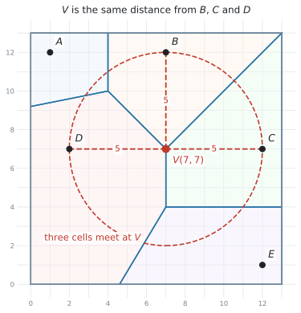{#fig-sl36-we1 width=72%}

**(a)** `Show that` なので、**$3$ つとも計算して並べます。** @eq-sl36-dist です。

$$
VB = \sqrt{(7-7)^{2} + (7-12)^{2}} = \sqrt{0 + 25} = 5
$$

$$
VC = \sqrt{(7-12)^{2} + (7-7)^{2}} = \sqrt{25 + 0} = 5
$$

$$
VD = \sqrt{(7-2)^{2} + (7-7)^{2}} = \sqrt{25 + 0} = 5
$$

$3$ つとも $5$ なので、$V$ は $B$、$C$、$D$ から同じ距離にあります。

**(b)** **$5$ km** です。

**(c)** この図では、[$3$ つの site から等距離の点に cell が $3$ つ集まります](#edge-vertex)。答えは **$3$** です。

::: {.callout-tip}
## $\sqrt{\ }$ の中が $0$ になる項に気をつけてください
$B$ と $V$ は $x$ 座標が同じなので、$(7-7)^{2} = 0$ です。**それでも $0$ を書いてください。**

`Show that` では、$\sqrt{(7-7)^{2}+(7-12)^{2}}$ という式そのものが点になります。$5$ とだけ書くと、どこから出たのか分かりません。
:::

::: {.callout-note}
## 解答例（答案用紙にはこう書く）
**(a)** $VB = \sqrt{(7-7)^{2} + (7-12)^{2}} = 5$

$VC = \sqrt{(7-12)^{2} + (7-7)^{2}} = 5$

$VD = \sqrt{(7-2)^{2} + (7-7)^{2}} = 5$

All three distances are equal, so $V$ is the same distance from $B$, $C$ and $D$.

**(b)** $5$ km

**(c)** $3$
:::
:::

::: {#exm-sl36-edges}
[**(a)** Find the equation of the edge between the cells of $B(7,12)$ and $C(12,7)$.]{.q-en}

[**(b)** Find the equation of the edge between the cells of $B(7,12)$ and $D(2,7)$.]{.q-en}

[**(c)** Hence find the coordinates of the vertex where the cells of $B$, $C$ and $D$ meet.]{.q-en}

<details class="jp-trans">
<summary>日本語訳</summary>

**(a)** $B(7,12)$ と $C(12,7)$ の cell のあいだの edge の式を求めなさい。

**(b)** $B(7,12)$ と $D(2,7)$ の cell のあいだの edge の式を求めなさい。

**(c)** これを使って、$B$、$C$、$D$ の cell が集まる vertex の座標を求めなさい。

</details>

---

edge は**垂直二等分線**なので、[SL 3.5](sl-3-5.qmd) の手順そのままです。

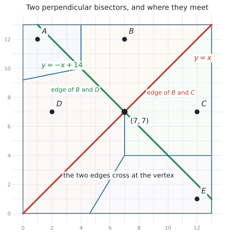{#fig-sl36-we2 width=72%}

**(a)** $B(7,12)$ と $C(12,7)$ で計算します。

$$
\text{中点} = \left( \frac{7+12}{2}, \ \frac{12+7}{2} \right) = (9.5, \ 9.5)
$$

$$
m = \frac{7 - 12}{12 - 7} = \frac{-5}{5} = -1 \quad \Rightarrow \quad m_{\perp} = 1
$$

$$
y - 9.5 = 1(x - 9.5) \quad \Rightarrow \quad y = x
$$

**(b)** $B(7,12)$ と $D(2,7)$ です。

$$
\text{中点} = \left( \frac{7+2}{2}, \ \frac{12+7}{2} \right) = (4.5, \ 9.5)
$$

$$
m = \frac{7 - 12}{2 - 7} = \frac{-5}{-5} = 1 \quad \Rightarrow \quad m_{\perp} = -1
$$

$$
y - 9.5 = -(x - 4.5) \quad \Rightarrow \quad y = -x + 14
$$

**(c)** `Hence` なので、**(a)** と **(b)** を[連立して解きます](#find-vertex)。

$$
x = -x + 14 \quad \Rightarrow \quad 2x = 14 \quad \Rightarrow \quad x = 7
$$

$y = x$ に戻して $y = 7$ です。vertex は **$(7, 7)$** です。

**検算。** 例題1で、この点から $B$、$C$、$D$ までの距離がどれも $5$ だと確かめてあります ✓

::: {.callout-tip}
## $3$ 本目の式は、出さなくて構いません
$C$ と $D$ の垂直二等分線（$x = 7$）も、同じ点を通ります。**ですが、$2$ 本あれば交点は決まります。**

$3$ 本目を出すのは、**検算をしたいとき**だけです。時間がないときは、距離で確かめるほうが速く済みます。
:::

::: {.callout-note}
## 解答例（答案用紙にはこう書く）
**(a)** Midpoint of $BC = (9.5, 9.5)$;  $m = \dfrac{7-12}{12-7} = -1$, so $m_{\perp} = 1$

$y - 9.5 = 1(x - 9.5)$, so $y = x$

**(b)** Midpoint of $BD = (4.5, 9.5)$;  $m = \dfrac{7-12}{2-7} = 1$, so $m_{\perp} = -1$

$y - 9.5 = -(x - 4.5)$, so $y = -x + 14$

**(c)** $x = -x + 14$, so $x = 7$ and $y = 7$.  The vertex is $(7, 7)$.
:::
:::

::: {#exm-sl36-interp}
[The rainfall last month, measured at each village, is shown below.]{.q-en}

| Village | $A$ | $B$ | $C$ | $D$ | $E$ |
|---|---|---|---|---|---|
| Rainfall (mm) | $82$ | $75$ | $64$ | $71$ | $58$ |

**(a)** [A farm is at the point $(10,3)$. By finding the distances from the farm to $C$, $D$ and $E$, determine which village is nearest to the farm.]{.q-en}

**(b)** [Use nearest neighbour interpolation to estimate the rainfall at the farm.]{.q-en}

**(c)** [Give one reason why this estimate may not be reliable.]{.q-en}

<details class="jp-trans">
<summary>日本語訳</summary>

先月の雨量を、それぞれの村で測った結果です。見出しの Village は「村」、Rainfall は「雨量」です。

**(a)** 農場が点 $(10,3)$ にあります。農場から $C$、$D$、$E$ までの距離を求めることで、農場に一番近い村を判断しなさい。

**(b)** nearest neighbour interpolation を使って、農場の雨量を見積もりなさい。

**(c)** この見積もりが信頼できるとは限らない理由を $1$ つ挙げなさい。

</details>

---

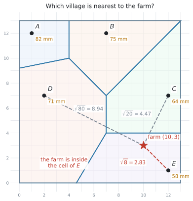{#fig-sl36-we3 width=72%}

**(a)** `By finding the distances` と指定されているので、[距離を計算して並べます](#nearest)。

$$
\text{farm to } C = \sqrt{(10-12)^{2} + (3-7)^{2}} = \sqrt{4 + 16} = \sqrt{20} = 4.47\ldots
$$

$$
\text{farm to } D = \sqrt{(10-2)^{2} + (3-7)^{2}} = \sqrt{64 + 16} = \sqrt{80} = 8.94\ldots
$$

$$
\text{farm to } E = \sqrt{(10-12)^{2} + (3-1)^{2}} = \sqrt{4 + 4} = \sqrt{8} = 2.83\ldots
$$

一番小さいのは $\sqrt{8}$ なので、**$E$ が一番近い**村です。

**(b)** [その cell の site の値を、そのまま使います](#interpolation)。$E$ の雨量は $58$ mm なので、農場の見積もりも **$58$ mm** です。

**(c)** 言葉で答える設問です。

::: {.model-answer}
**試験ではこう書く**

*The estimate uses only the value at $E$, and the farm is $2.83$ km away from $E$. The rainfall may change between the two places, so the estimate could be quite different from the true value.*
:::

（この見積もりは $E$ の値だけを使っていますが、農場は $E$ から $2.83$ km 離れています。そのあいだで雨量が変わるかもしれないので、本当の値とはかなり違う可能性があります。）

::: {.callout-important}
## (b) で平均を取らないでください
$\dfrac{64 + 58}{2} = 61$ のように、近い村2つの平均を書いてしまう誤りがあります。

**nearest neighbour interpolation は、一番近い $1$ つの値をそのまま使う方法**です。名前のとおりです。
:::

::: {.callout-note}
## 解答例（答案用紙にはこう書く）
**(a)** $\sqrt{(10-12)^{2}+(3-7)^{2}} = \sqrt{20} = 4.47$ km (3 s.f.)

$\sqrt{(10-2)^{2}+(3-7)^{2}} = \sqrt{80} = 8.94$ km (3 s.f.)

$\sqrt{(10-12)^{2}+(3-1)^{2}} = \sqrt{8} = 2.83$ km (3 s.f.)

$E$ is the nearest village.

**(b)** $58$ mm

**(c)** *The estimate uses only the value at $E$, and the farm is $2.83$ km away from $E$. The rainfall may change between the two places, so the estimate could be quite different from the true value.*
:::
:::

::: {#exm-sl36-add}
[A new village $F$ is built at the point $(9,10)$.]{.q-en}

**(a)** [State the village whose cell contains the point $(9,10)$ before $F$ is built.]{.q-en}

**(b)** [Find the equation of the edge between the cells of $B$ and $F$ in the new Voronoi diagram.]{.q-en}

**(c)** [Describe what happens to the cell of $B$ when $F$ is added.]{.q-en}

<details class="jp-trans">
<summary>日本語訳</summary>

新しい村 $F$ が点 $(9,10)$ に作られます。

**(a)** $F$ ができる前に、点 $(9,10)$ を含んでいた cell の村を書きなさい。

**(b)** 新しい Voronoi 図での、$B$ と $F$ の cell のあいだの edge の式を求めなさい。

**(c)** $F$ が加わったとき、$B$ の cell がどうなるかを述べなさい。

</details>

---

**(a)** `State` なので、図を見て答えます。@fig-sl36-addsite の左を見ると、$(9,10)$ は **$B$** の cell の中にあります。

念のため計算で確かめるなら、$B(7,12)$ までが $\sqrt{4+4} = \sqrt{8} = 2.83$、$C(12,7)$ までが $\sqrt{9+9} = \sqrt{18} = 4.24$ で、$B$ のほうが近いことが分かります。

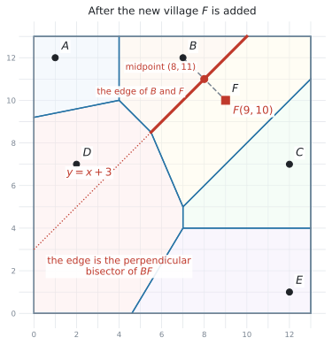{#fig-sl36-we4 width=72%}

**(b)** $B(7,12)$ と $F(9,10)$ の垂直二等分線です。

$$
\text{中点} = \left( \frac{7+9}{2}, \ \frac{12+10}{2} \right) = (8, \ 11)
$$

$$
m = \frac{10 - 12}{9 - 7} = \frac{-2}{2} = -1 \quad \Rightarrow \quad m_{\perp} = 1
$$

$$
y - 11 = 1(x - 8) \quad \Rightarrow \quad y = x + 3
$$

**(c)** 言葉で答えます。

::: {.model-answer}
**試験ではこう書く**

*The cell of $B$ becomes smaller. The part of it that is nearer to $F$ than to $B$ now belongs to the cell of $F$.*
:::

（$B$ の cell は小さくなります。$B$ よりも $F$ に近い部分が、$F$ の cell に移ります。）

::: {.callout-tip}
## (c) は「小さくなる」だけでは足りません
`Describe` なので、**どこが、なぜ移るのか**まで書いてください。

「$B$ より $F$ に近い部分が $F$ の cell になる」の一言が入っていれば、意味が伝わります。
:::

::: {.callout-note}
## 解答例（答案用紙にはこう書く）
**(a)** $B$

**(b)** Midpoint of $BF = (8, 11)$;  $m = \dfrac{10-12}{9-7} = -1$, so $m_{\perp} = 1$

$y - 11 = 1(x - 8)$, so $y = x + 3$

**(c)** *The cell of $B$ becomes smaller. The part of it that is nearer to $F$ than to $B$ now belongs to the cell of $F$.*
:::
:::

::: {#exm-sl36-toxic}
[A waste site is to be built inside the map, as far as possible from all five villages. The Voronoi diagram has vertices at $(4,10)$, $(7,7)$ and $(7,4)$.]{.q-en}

**(a)** [For each vertex, find the distance to its nearest village.]{.q-en}

**(b)** [Hence state where the waste site should be built, and how far it is from the nearest village.]{.q-en}

**(c)** [The waste site must be at least $5$ km from every village. State whether your answer to part (b) meets this condition, giving a reason.]{.q-en}

<details class="jp-trans">
<summary>日本語訳</summary>

廃棄物処理場を、地図の中で $5$ つの村すべてからできるだけ遠い場所に作ります。Voronoi 図の vertex は $(4,10)$、$(7,7)$、$(7,4)$ にあります。

**(a)** それぞれの vertex について、一番近い村までの距離を求めなさい。

**(b)** これを使って、処理場をどこに作るべきかと、一番近い村までの距離を書きなさい。

**(c)** 処理場は、すべての村から少なくとも $5$ km 離れていなければなりません。(b) の答えがこの条件を満たすかどうかを、理由を付けて書きなさい。

</details>

---

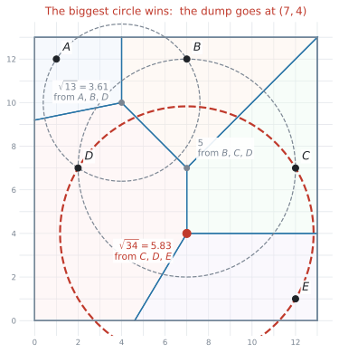{#fig-sl36-we5 width=72%}

**(a)** この図では vertex は $3$ つの site から等距離なので、**その $3$ つのうち $1$ つとの距離を出せば済みます。**

$(4,10)$ は $A$、$B$、$D$ から等距離です。$A(1,12)$ で計算します。

$$
\sqrt{(4-1)^{2} + (10-12)^{2}} = \sqrt{9 + 4} = \sqrt{13} = 3.605\ldots
$$

$(7,7)$ は $B$、$C$、$D$ から等距離です。$B(7,12)$ で計算します。

$$
\sqrt{(7-7)^{2} + (7-12)^{2}} = \sqrt{0 + 25} = 5
$$

$(7,4)$ は $C$、$D$、$E$ から等距離です。$C(12,7)$ で計算します。

$$
\sqrt{(7-12)^{2} + (4-7)^{2}} = \sqrt{25 + 9} = \sqrt{34} = 5.830\ldots
$$

**(b)** [一番大きいものを選びます](#toxic-steps)。$\sqrt{34} > 5 > \sqrt{13}$ なので、答えは $(7,4)$ です。

処理場は **$(7,4)$** に作るべきで、一番近い村までの距離は **$5.83$ km**（有効数字3桁）です。

**(c)** $5.83 > 5$ なので、条件を満たします。

::: {.model-answer}
**試験ではこう書く**

*Yes. The nearest villages ($C$, $D$ and $E$) are $\sqrt{34} = 5.83$ km away, which is more than $5$ km.*
:::

::: {.callout-important}
## (a) では、$3$ つの vertex を全部書いてください
$(7,4)$ だけを計算して「これが答えです」と書くと、**比べたことが見えません。**

$3$ つとも並べて書くことが、そのまま `Hence` の根拠になります。
:::

::: {.callout-tip}
## 距離は $1$ つの site で出せば十分です
この図では vertex は $3$ つの site から等距離なので、$3$ つとも計算する必要はありません。**$1$ つで出して、残りは同じだと書けば済みます。**

ただし、「どの $3$ つの site から等距離なのか」は答案に書いてください。
:::

::: {.callout-note}
## 解答例（答案用紙にはこう書く）
**(a)** At $(4,10)$: $\sqrt{(4-1)^{2}+(10-12)^{2}} = \sqrt{13} = 3.61$ km (3 s.f.) — from $A$, $B$ and $D$

At $(7,7)$: $\sqrt{(7-7)^{2}+(7-12)^{2}} = 5$ km — from $B$, $C$ and $D$

At $(7,4)$: $\sqrt{(7-12)^{2}+(4-7)^{2}} = \sqrt{34} = 5.83$ km (3 s.f.) — from $C$, $D$ and $E$

**(b)** The waste site should be built at $(7,4)$, which is $5.83$ km from the nearest village.

**(c)** *Yes. The nearest villages ($C$, $D$ and $E$) are $\sqrt{34} = 5.83$ km away, which is more than $5$ km.*
:::
:::

## Common errors

::: {.callout-warning}
## site と vertex を取り違える
`site` はもとの点（村や店）、`vertex` は edge が集まる点（ふつうの問題では $3$ 本）です。**別のものです。**

問題文の `the vertex nearest to A` を「$A$ そのもの」と読んでしまうと、まったく違う答えになります。

**site の座標は問題文から読み取ります。vertex は自分で求めます。** ここで見分けてください。
:::

::: {.callout-warning}
## edge を「site を結ぶ線」だと思う
edge は、$2$ つの site を**結ぶ**線ではありません。$2$ つの site の**垂直二等分線**、つまり**直交する**線の一部です。

$AB$ の式を求めてしまう答案がありますが、それは cell の境界ではありません。

**site を結ぶ線分は、答案には出てきません。**
:::

::: {.callout-warning}
## vertex を出したあと、距離で確かめない
連立方程式を解き間違えても、**それらしい座標**が出てしまいます。

$3$ つの site までの距離を計算すれば、**等しくなければ間違い**だと分かります。$1$ 行足すだけで、その先の設問を全部救えます。
:::

::: {.callout-warning}
## `Determine` なのに、根拠を書かずに答える
`Determine which site is closest` に「図より $E$」とだけ書くと、**答えが $1$ つに決まる根拠が示せていません。**

`By finding the distances` と指定されていれば、**距離を計算して並べます。** 指定がなくても、どの cell に入っているか・どの境界線のどちら側かなど、**決め手を書いてください**（[第3節](#nearest)）。`Write down` のときだけ、図から読んで書くだけで済みます。
:::

::: {.callout-warning}
## nearest neighbour interpolation で平均を取る
近い $2$ つの値を足して $2$ で割る、距離で重みを付ける、といった計算をしてしまう誤りです。

**一番近い $1$ つの値を、そのまま書きます。** 計算はありません。
:::

::: {.callout-warning}
## toxic waste dump で、vertex を1つしか調べない
`the solution point will always be at an intersection of three edges` は、「vertex のどれかが答え」という意味であって、「どの vertex でもよい」ではありません。

**全部の vertex について距離を出して、一番大きいものを選びます。**
:::

::: {.callout-warning}
## site を足したとき、cell が大きくなると書く
新しい site は、まわりから場所を**取る**だけです。**大きくなる cell はありません。**

$F$ の cell が**新しくできて**、まわりの cell が**小さくなる**、という書き方をしてください。
:::

::: {.callout-warning}
## cell の面積で、地図のわくを忘れる
外側の cell は、Voronoi の edge だけでは**閉じません。** 地図のわく（$x = 0$、$y = 13$ など）も辺として使います。

わくを忘れると、多角形が開いたままになり、面積が出せません。**まず多角形の頂点を全部書き出して**から、面積を計算してください。
:::

::: {.callout-warning}
## 単位を書かない
距離は km、面積は km$^2$、雨量は mm です。**問題文の単位に合わせてください。**

地図の問題では、`each unit represents 1 km` のような一文が最初に置かれています。見落とさないでください。
:::

## Using your GDC (TI-Nspire CX II)

この項目では、電卓は**距離の計算と、連立方程式の確認**に使います。図そのものは紙にかきます。

### 1. 距離は $1$ 行で入れる

@eq-sl36-dist は、平方根のテンプレートに入れて $1$ 行で計算します。

```
√((10-12)² + (3-7)²)
```

$\sqrt{20} = 4.4721\ldots$ と返ります。**途中で $20$ を書き出して打ち直さない**でください。

### 2. 距離を比べるだけなら、$\sqrt{\ }$ は要りません

「どちらが近いか」を知りたいだけなら、**$\sqrt{\ }$ の中身どうしを比べれば十分**です。

$$
20 \ \text{と} \ 80 \ \text{と} \ 8 \quad \Rightarrow \quad 8 \ \text{が最小} \quad \Rightarrow \quad E \ \text{が一番近い}
$$

平方根は、値が大きいほど元の数も大きいからです。**ただし、答案には距離そのもの（$\sqrt{8} = 2.83$）を書いてください。**

### 3. 連立方程式は Solve System of Linear Equations {#simeq}

$2$ 本の edge の式から vertex を出すとき、手で解いても構いませんが、電卓でも確認できます。

```
menu → Algebra → Solve System of Linear Equations
```

$y = x$ と $y = -x + 14$ を、$-x + y = 0$ と $x + y = 14$ の形に直してから入れます。

::: {.callout-tip}
## 手で解くほうが速いことが多いです
$y = x$ と $y = -x + 14$ のような形なら、**代入して $1$ 行**で終わります。

電卓に入れる形（$ax + by = c$）に直す手間のほうが大きい、ということがよくあります。**検算に使うのがちょうどよい**使い方です。
:::

### 4. Graphs ページで図を確かめる

edge の式を $f1(x)$、$f2(x)$ に入れると、**交点が本当に vertex になっているか**が目で見えます。

```
menu → 6: Analyze Graph → 4: Intersection
```

交点をはさむように、`lower bound?` と `upper bound?` の $2$ 回、`enter` を押します（→ [SL 2.4](../02-functions/sl-2-4.qmd#bounds)）。

::: {.callout-warning}
## Voronoi 図そのものを電卓でかく機能はありません
TI-Nspire に「Voronoi」というメニューはありません。**図は問題用紙に印刷されているか、自分でかきます。**

電卓が助けてくれるのは、距離と交点の計算だけです。
:::

### 5. 面積は、切り分けてから

cell の面積は、多角形の頂点を書き出して、**三角形や台形に切り分けて**足します。電卓は最後の足し算に使うだけです。

## Exercises

::: {.callout-note appearance="simple"}
各問題に、折りたたみが3つ付いています。**日本語訳**、**解答例**（答案用紙に書くべきこと。英語です）、**解説**（なぜそうなるか。日本語です）。

まず自分で解いて、次に解答例と見くらべてください。**解説は、合わなかったときだけ開けば十分です。**
:::

::: {.callout-note}
## 演習 1 〜 8 と 11 は、下の @fig-sl36-map の地図を使います
村 $A(1,12)$、$B(7,12)$、$C(12,7)$、$D(2,7)$、$E(12,1)$。地図の範囲は $0 \le x \le 13$、$0 \le y \le 13$ で、$1$ 目盛りは $1$ km です。Voronoi 図の vertex は $(4,10)$、$(7,7)$、$(7,4)$ にあります。
:::

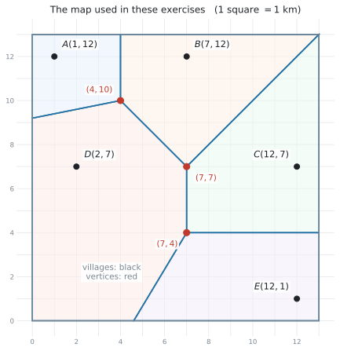{#fig-sl36-map width=76%}

::: {.exercise-block}

[1]{.ex-no} <span class="map-ref">@fig-sl36-map </span>[Consider the vertex at $(4,10)$.]{.q-en}

**(a)** [Write down the three villages that are the same distance from this vertex.]{.q-en}

**(b)** [Find that distance, correct to three significant figures.]{.q-en}

<details class="jp-trans">
<summary>日本語訳</summary>

vertex $(4,10)$ について考えます。

**(a)** この vertex から同じ距離にある $3$ つの村を書きなさい。

**(b)** その距離を、有効数字3桁で求めなさい。

</details>

::: {.callout-note collapse="true"}
## 解答例（答案用紙に書くこと）
**(a)** $A$, $B$ and $D$

**(b)** $\sqrt{(4-1)^{2} + (10-12)^{2}} = \sqrt{13} = 3.61$ km (3 s.f.)
:::

::: {.callout-tip collapse="true"}
## 解説
**(a)** は図から読みます。$(4,10)$ に集まっている cell は $A$、$B$、$D$ の $3$ つです。

**(b)** はどの村で計算しても同じです。$B(7,12)$ なら $\sqrt{9+4} = \sqrt{13}$、$D(2,7)$ なら $\sqrt{4+9} = \sqrt{13}$ ✓

**$3$ つとも同じになる**ことが、vertex であることの確認になります。
:::

::: {.ex-sep}
:::

[2]{.ex-no} <span class="map-ref">@fig-sl36-map </span>[**(a)** Find the equation of the edge between the cells of $A(1,12)$ and $B(7,12)$.]{.q-en}

[**(b)** Find the equation of the edge between the cells of $C(12,7)$ and $E(12,1)$.]{.q-en}

<details class="jp-trans">
<summary>日本語訳</summary>

**(a)** $A(1,12)$ と $B(7,12)$ の cell のあいだの edge の式を求めなさい。

**(b)** $C(12,7)$ と $E(12,1)$ の cell のあいだの edge の式を求めなさい。

</details>

::: {.callout-note collapse="true"}
## 解答例（答案用紙に書くこと）
**(a)** $A$ and $B$ have the same $y$-coordinate, so $AB$ is horizontal.

Midpoint $= (4, 12)$, so the edge is $x = 4$

**(b)** $C$ and $E$ have the same $x$-coordinate, so $CE$ is vertical.

Midpoint $= (12, 4)$, so the edge is $y = 4$
:::

::: {.callout-tip collapse="true"}
## 解説
どちらも [SL 3.5 のたて・よこの特別な形](sl-3-5.qmd#special)です。**傾きの計算は要りません。**

**(a)** $y$ が両方 $12$ → よこ向き → edge は**たて**の線 $x = \ldots$。中点の $x$ は $\dfrac{1+7}{2} = 4$。

**(b)** $x$ が両方 $12$ → たて向き → edge は**よこ**の線 $y = \ldots$。中点の $y$ は $\dfrac{7+1}{2} = 4$。

図で確かめると、たしかに $x=4$ と $y=4$ の線が引かれています ✓
:::

::: {.ex-sep}
:::

[3]{.ex-no} <span class="map-ref">@fig-sl36-map </span>[The edge between the cells of $C$ and $E$ is $y = 4$.]{.q-en}

**(a)** [Find the equation of the edge between the cells of $C(12,7)$ and $D(2,7)$.]{.q-en}

**(b)** [Hence find the coordinates of the vertex where the cells of $C$, $D$ and $E$ meet.]{.q-en}

**(c)** [Verify that this vertex is the same distance from $C$, $D$ and $E$.]{.q-en}

<details class="jp-trans">
<summary>日本語訳</summary>

$C$ と $E$ の cell のあいだの edge は $y = 4$ です。

**(a)** $C(12,7)$ と $D(2,7)$ の cell のあいだの edge の式を求めなさい。

**(b)** これを使って、$C$、$D$、$E$ の cell が集まる vertex の座標を求めなさい。

**(c)** この vertex が $C$、$D$、$E$ から同じ距離にあることを確かめなさい。

</details>

::: {.callout-note collapse="true"}
## 解答例（答案用紙に書くこと）
**(a)** $C$ and $D$ have the same $y$-coordinate, so $CD$ is horizontal.

Midpoint $= (7, 7)$, so the edge is $x = 7$

**(b)** The edges $x = 7$ and $y = 4$ meet at $(7, 4)$.

**(c)** $\sqrt{(7-12)^{2} + (4-7)^{2}} = \sqrt{34}$

$\sqrt{(7-2)^{2} + (4-7)^{2}} = \sqrt{34}$

$\sqrt{(7-12)^{2} + (4-1)^{2}} = \sqrt{34}$

All three are $\sqrt{34} = 5.83$ km (3 s.f.), so the vertex is the same distance from $C$, $D$ and $E$.
:::

::: {.callout-tip collapse="true"}
## 解説
**(b)** は連立というほどのものではありません。$x = 7$ と $y = 4$ なので、**そのまま $(7,4)$** です。

たて・よこの edge が交わるときは、この形になります。

**(c)** は `Verify` なので、**$3$ つとも計算して書きます。** $\sqrt{34}$ が $3$ つ並べば終わりです。
:::

::: {.ex-sep}
:::

[4]{.ex-no} <span class="map-ref">@fig-sl36-map </span>[A hiker is at the point $H(3,3)$. By finding the distances from $H$ to each of the five villages, determine which village is nearest to the hiker.]{.q-en}

<details class="jp-trans">
<summary>日本語訳</summary>

ハイカーが点 $H(3,3)$ にいます。$H$ から $5$ つの村それぞれまでの距離を求めることで、ハイカーに一番近い村を判断しなさい。

</details>

::: {.callout-note collapse="true"}
## 解答例（答案用紙に書くこと）
$HA = \sqrt{(3-1)^{2}+(3-12)^{2}} = \sqrt{85} = 9.22$ km (3 s.f.)

$HB = \sqrt{(3-7)^{2}+(3-12)^{2}} = \sqrt{97} = 9.85$ km (3 s.f.)

$HC = \sqrt{(3-12)^{2}+(3-7)^{2}} = \sqrt{97} = 9.85$ km (3 s.f.)

$HD = \sqrt{(3-2)^{2}+(3-7)^{2}} = \sqrt{17} = 4.12$ km (3 s.f.)

$HE = \sqrt{(3-12)^{2}+(3-1)^{2}} = \sqrt{85} = 9.22$ km (3 s.f.)

$HD$ is the smallest, so $D$ is the nearest village.
:::

::: {.callout-tip collapse="true"}
## 解説
`By finding the distances ... to each of the five villages` と書いてあるので、**$5$ つとも計算します。** $1$ つでも抜けると、それが一番近くない理由が示せません。

$\sqrt{\ }$ の中身だけで比べると、$85$、$97$、$97$、$17$、$85$ で **$17$ が最小**です。これが一番速い比べ方です。

図でも確かめられます。$H(3,3)$ は $D$ の cell（大きな左側の領域）の中にあります ✓

$A$ と $E$ が同じ $\sqrt{85}$、$B$ と $C$ が同じ $\sqrt{97}$ になるのは、たまたまです。
:::

::: {.ex-sep}
:::

[5]{.ex-no} <span class="map-ref">@fig-sl36-map </span>[The rainfall last month at each village was: $A$ $82$ mm, $B$ $75$ mm, $C$ $64$ mm, $D$ $71$ mm, $E$ $58$ mm. Use nearest neighbour interpolation to estimate the rainfall at each of the following points.]{.q-en}

**(a)** [$(11,2)$]{.q-en}

**(b)** [$(5,11)$]{.q-en}

<details class="jp-trans">
<summary>日本語訳</summary>

先月のそれぞれの村の雨量は、$A$ が $82$ mm、$B$ が $75$ mm、$C$ が $64$ mm、$D$ が $71$ mm、$E$ が $58$ mm でした。nearest neighbour interpolation を使って、次の各点の雨量を見積もりなさい。

**(a)** $(11,2)$

**(b)** $(5,11)$

</details>

::: {.callout-note collapse="true"}
## 解答例（答案用紙に書くこと）
**(a)** $(11,2)$ lies in the cell of $E$, so the estimate is $58$ mm.

**(b)** $(5,11)$ lies in the cell of $B$, so the estimate is $75$ mm.
:::

::: {.callout-tip collapse="true"}
## 解説
どちらも**図を見るだけ**で決まります。計算は要りません。

心配なら距離で確かめられます。

- $(11,2)$ から $E(12,1)$ は $\sqrt{1+1} = \sqrt{2} = 1.41$。ほかの村よりずっと近いです
- $(5,11)$ から $B(7,12)$ は $\sqrt{4+1} = \sqrt{5} = 2.24$。$A(1,12)$ までは $\sqrt{16+1} = \sqrt{17} = 4.12$ なので $B$ のほうが近いです

**答えは村の値そのまま**です。$58$ と $75$ を書き写すだけです。
:::

::: {.ex-sep}
:::

[6]{.ex-no} <span class="map-ref">@fig-sl36-map </span>[A new village $F$ is built at the point $(6,3)$.]{.q-en}

**(a)** [State the village whose cell contains the point $(6,3)$ before $F$ is built.]{.q-en}

**(b)** [Find the equation of the edge between the cells of $D(2,7)$ and $F(6,3)$.]{.q-en}

**(c)** [Explain what happens to the area of the cell of $D$ when $F$ is added.]{.q-en}

<details class="jp-trans">
<summary>日本語訳</summary>

新しい村 $F$ が点 $(6,3)$ に作られます。

**(a)** $F$ ができる前に、点 $(6,3)$ を含んでいた cell の村を書きなさい。

**(b)** $D(2,7)$ と $F(6,3)$ の cell のあいだの edge の式を求めなさい。

**(c)** $F$ が加わったとき、$D$ の cell の面積がどうなるかを説明しなさい。

</details>

::: {.callout-note collapse="true"}
## 解答例（答案用紙に書くこと）
**(a)** $D$

**(b)** Midpoint of $DF = \left(\dfrac{2+6}{2}, \dfrac{7+3}{2}\right) = (4, 5)$

$m = \dfrac{3-7}{6-2} = -1$,  so  $m_{\perp} = 1$

$y - 5 = 1(x - 4)$,  so  $y = x + 1$

**(c)** *The area of the cell of $D$ becomes smaller, because the part of it that is nearer to $F$ than to $D$ now belongs to the cell of $F$.*
:::

::: {.callout-tip collapse="true"}
## 解説
**(a)** 図で $(6,3)$ を探すと、$D$ の cell（大きな左側の領域）の中にあります。

**(b)** はいつもの垂直二等分線です。$m = -1$ なので $m_{\perp} = 1$。**検算**：中点 $(4,5)$ を $y = x+1$ に入れると $5 = 4+1$ ✓

**(c)** $F$ は $D$ の cell の中に作られたので、**$D$ が必ず場所を取られます。** 「小さくなる」だけでなく「$F$ に近い部分が移る」まで書いてください。
:::

::: {.ex-sep}
:::

[7]{.ex-no} <span class="map-ref">@fig-sl36-map </span>[A noisy factory is to be built at one of the vertices of the Voronoi diagram. It must be at least $4$ km from every village. State which vertices satisfy this condition, giving a reason.]{.q-en}

<details class="jp-trans">
<summary>日本語訳</summary>

騒音の出る工場を、Voronoi 図の vertex のどれかに建てます。工場は、すべての村から少なくとも $4$ km 離れていなければなりません。この条件を満たす vertex を書き、理由を付けなさい。

</details>

::: {.callout-note collapse="true"}
## 解答例（答案用紙に書くこと）
At $(4,10)$: distance $= \sqrt{13} = 3.61$ km, which is less than $4$ km.

At $(7,7)$: distance $= 5$ km, which is more than $4$ km.

At $(7,4)$: distance $= \sqrt{34} = 5.83$ km, which is more than $4$ km.

The vertices $(7,7)$ and $(7,4)$ satisfy the condition.
:::

::: {.callout-tip collapse="true"}
## 解説
[toxic waste dump の手順](#toxic-steps)と同じですが、**一番大きいものを選ぶのではなく、条件を満たすものを全部**答えます。

$(4,10)$ は $\sqrt{13} = 3.61 < 4$ なので**外れます**。ここを落とさないでください。

`giving a reason` なので、**$3$ つとも距離を書いて**から結論を書きます。答えの $2$ つだけでは、なぜその $2$ つなのかが示せません。
:::

::: {.ex-sep}
:::

[8]{.ex-no} <span class="map-ref">@fig-sl36-map </span>[The cell of village $C$ is bounded by the edges $x = 7$, $y = 4$ and $y = x$, and by the edge of the map $x = 13$.]{.q-en}

**(a)** [Write down the coordinates of the four corners of the cell of $C$.]{.q-en}

**(b)** [Find the area of the cell of $C$.]{.q-en}

<details class="jp-trans">
<summary>日本語訳</summary>

村 $C$ の cell は、edge $x = 7$、$y = 4$、$y = x$ と、地図のふち $x = 13$ で囲まれています。

**(a)** $C$ の cell の $4$ つの角の座標を書きなさい。

**(b)** $C$ の cell の面積を求めなさい。

</details>

::: {.callout-note collapse="true"}
## 解答例（答案用紙に書くこと）
**(a)** $(7,4)$, $(13,4)$, $(13,13)$ and $(7,7)$

**(b)** The cell is a trapezium with parallel sides $x = 7$ (from $y=4$ to $y=7$, length $3$) and $x = 13$ (from $y=4$ to $y=13$, length $9$), a distance $6$ apart.

Area $= \dfrac{1}{2}(3 + 9)(6) = 36$ km$^2$
:::

::: {.callout-tip collapse="true"}
## 解説
**(a)** 角は、境界どうしの交点です。

- $x=7$ と $y=4$ → $(7,4)$
- $y=4$ と $x=13$ → $(13,4)$
- $x=13$ と $y=x$ → $(13,13)$
- $y=x$ と $x=7$ → $(7,7)$

**(b)** $2$ つのたての辺（$x=7$ と $x=13$）が**平行**なので、台形（trapezium）です。台形の面積は $\dfrac{1}{2}(a+b)h$ で、公式集の Prior learning の欄にあります。

**別解**：$(7,4)$、$(13,4)$、$(13,13)$ の三角形（面積 $\dfrac{1}{2}\times 6 \times 9 = 27$）と、$(7,4)$、$(13,13)$、$(7,7)$ の三角形（面積 $\dfrac{1}{2}\times 3 \times 6 = 9$）に分けても $27 + 9 = 36$ ✓
:::

::: {.ex-sep}
:::

[9]{.ex-no} [Two radio transmitters are at $P(1,4)$ and $Q(7,6)$. A radio always picks up the nearer transmitter. Find the equation of the boundary between the region that picks up $P$ and the region that picks up $Q$.]{.q-en}

<details class="jp-trans">
<summary>日本語訳</summary>

$2$ つの無線送信機が $P(1,4)$ と $Q(7,6)$ にあります。ラジオはいつも近いほうの送信機を受信します。$P$ を受信する領域と $Q$ を受信する領域の境界の式を求めなさい。

</details>

::: {.callout-note collapse="true"}
## 解答例（答案用紙に書くこと）
Midpoint $= \left(\dfrac{1+7}{2}, \dfrac{4+6}{2}\right) = (4, 5)$

$m = \dfrac{6-4}{7-1} = \dfrac{2}{6} = \dfrac{1}{3}$,  so  $m_{\perp} = -3$

$y - 5 = -3(x - 4)$

$y = -3x + 17$
:::

::: {.callout-tip collapse="true"}
## 解説
site が $2$ つだけの Voronoi 図です。**cell は $2$ つ、edge は $1$ 本、vertex はありません。**

「境界」と書いてあれば、Voronoi という言葉がなくても**垂直二等分線**です。

$m = \dfrac{1}{3}$ をひっくり返して $3$、符号を変えて $-3$ です。

**検算**：$\dfrac{1}{3} \times (-3) = -1$ ✓　中点 $(4,5)$ を入れると $-3(4) + 17 = 5$ ✓
:::

::: {.ex-sep}
:::

[10]{.ex-no} [Explain why nearest neighbour interpolation may give a poor estimate at a point that lies very close to an edge of a Voronoi diagram.]{.q-en}

<details class="jp-trans">
<summary>日本語訳</summary>

Voronoi 図の edge のすぐ近くにある点では、nearest neighbour interpolation が良くない見積もりになることがある理由を説明しなさい。

</details>

::: {.callout-note collapse="true"}
## 解答例（答案用紙に書くこと）
*A point on an edge is the same distance from two sites, so the two sites are equally close. Nearest neighbour interpolation still uses only one of them, and the two sites may have very different values. Moving the point a short distance across the edge would change the estimate to the other value.*
:::

::: {.callout-tip collapse="true"}
## 解説
edge の上の点は、**$2$ つの site から等距離**です。ですから「一番近い $1$ つ」を選ぶ理由が、ほとんどありません。

それなのに、edge をほんの少し越えただけで、見積もりが**別の村の値にがらりと変わります。** 実際の雨量がそんなふうに急に変わるとは考えにくいので、この方法は境界の近くで弱くなります。

**この手の設問では、「等距離」と「値が急に変わる」の $2$ 点を書けば十分**です。
:::

::: {.ex-sep}
:::

[11]{.ex-no} <span class="map-ref">@fig-sl36-map </span>[A new village $G$ is built at the point $(10,11)$.]{.q-en}

**(a)** [State the village whose cell contains the point $(10,11)$ before $G$ is built.]{.q-en}

**(b)** [Find the equation of the edge between the cells of $B(7,12)$ and $G(10,11)$.]{.q-en}

**(c)** [In the new diagram, the cell of $G$ shares an edge with the cells of $B$ and $C$ only. State what happens to the areas of the cells of $A$, $D$ and $E$.]{.q-en}

<details class="jp-trans">
<summary>日本語訳</summary>

新しい村 $G$ が点 $(10,11)$ に作られます。

**(a)** $G$ ができる前に、点 $(10,11)$ を含んでいた cell の村を書きなさい。

**(b)** $B(7,12)$ と $G(10,11)$ の cell のあいだの edge の式を求めなさい。

**(c)** 新しい図では、$G$ の cell は $B$ と $C$ の cell とだけ edge を共有します。$A$、$D$、$E$ の cell の面積がどうなるかを書きなさい。

</details>

::: {.callout-note collapse="true"}
## 解答例（答案用紙に書くこと）
**(a)** $B$

**(b)** Midpoint of $BG = \left(\dfrac{7+10}{2}, \dfrac{12+11}{2}\right) = (8.5, 11.5)$

$m = \dfrac{11-12}{10-7} = -\dfrac{1}{3}$,  so  $m_{\perp} = 3$

$y - 11.5 = 3(x - 8.5)$

$y = 3x - 14$

**(c)** *The areas of the cells of $A$, $D$ and $E$ do not change, because $G$ is not next to any of them.*
:::

::: {.callout-tip collapse="true"}
## 解説
**(b)** で中点が $(8.5, 11.5)$ と小数になりますが、**そのまま使って構いません。** 展開すると $y = 3x - 25.5 + 11.5 = 3x - 14$ で、きれいな式になります。

**検算**：中点 $(8.5, 11.5)$ を入れると $3(8.5) - 14 = 25.5 - 14 = 11.5$ ✓　傾きの積は $-\dfrac{1}{3} \times 3 = -1$ ✓

**(c)** 新しい site は、**となりの cell からしか場所を取りません。** $G$ のとなりは $B$ と $C$ だけなので、$A$、$D$、$E$ は**変わりません**。

「小さくなる」と書いてしまう答案が多いところです。**site を足すと全部の cell が小さくなる、ということはありません。**
:::

:::

::: {.callout-note}
## この先、Topic 4 へ
Voronoi 図では、**位置**を手がかりに、測定されていない場所の値を見積もりました（[第4節](#interpolation)）。

[Topic 4](../04-statistics-and-probability/sl-4-1.qmd) では、集めた **data**（データ）そのものを整理し、その**分布**や**関係**を分析します。
:::
