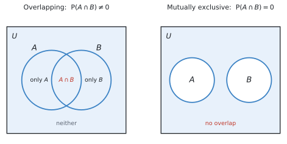
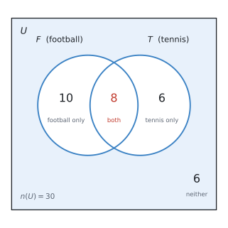
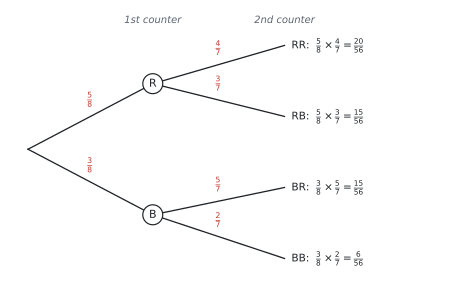

# SL 4.6 — Combined events and conditional probability（事象の確率 — Venn図・樹形図・条件付き確率） {#sec-sl-4-6}

::: {.callout-note}
## What you should be able to do
- **Venn diagram**（ベン図）に人数や確率を書き込み、そこから読み取れる。
- **tree diagram**（樹形図）をかき、枝を掛けて確率を求められる。
- **two-way table**（二元表）から確率を読み取れる。
- $P(A \cup B) = P(A) + P(B) - P(A \cap B)$ を使える。
- **mutually exclusive**（排反）かどうかを判断できる。
- **conditional probability** $P(A \mid B)$ を求められる。
- **with replacement / without replacement** の違いを、樹形図に反映できる。
- **independent**（独立）かどうかを、$P(A \cap B) = P(A)P(B)$ で確かめられる。
:::

::: {.callout-important}
## Formula booklet に載っているもの
SL 4.6 の欄には、次の**4行**が印刷されています。

$$
P(A \cup B) = P(A) + P(B) - P(A \cap B)
$$

$$
P(A \cup B) = P(A) + P(B) \qquad \text{（mutually exclusive のとき）}
$$

$$
P(A \mid B) = \frac{P(A \cap B)}{P(B)}
$$

$$
P(A \cap B) = P(A)P(B) \qquad \text{（independent のとき）}
$$

**Topic 4 の中で、公式が一番多い項目**です。ただし**どれも覚える必要はありません。** 大事なのは、**どれをいつ使うか**です。
:::

::: {.callout-tip}
## 公式を使わなくても解けます
シラバスに、こう書かれています。

> Problems can be solved with the aid of a Venn diagram, tree diagram, sample space diagram or table of outcomes **without explicit use of formulae**.

**図をかけば、公式なしで解けます。** IB もそれを認めています。

公式が苦手な人は、**Venn 図と樹形図を確実にかけるようにすることを優先してください。** そのほうが速いことも多いです。
:::

## The idea

### 1. 記号を2つ覚えます {#symbols}

| 記号 | 読み方 | 意味 | 日本語 |
|---|---|---|---|
| $A \cap B$ | A intersection B | $A$ **かつ** $B$（両方） | 積事象 |
| $A \cup B$ | A union B | $A$ **または** $B$ | 和事象 |

: 2つの記号 {#tbl-sl46-symbols}

**覚え方**：$\cap$ は**カップ（コップ）が伏せてある**形で「かつ」、$\cup$ は**カップが上向き**で「または」。$\cup$ の $U$ は `Union` の $U$ でもあります。

### 2. 「または」は両方を含みます {#or}

シラバスに、そのままの言葉があります。

> Combined events: **The non-exclusivity of "or"**.

**数学の「または」は、「両方でもよい」**という意味です。

日常語の「コーヒーまたは紅茶」は「どちらか一方」ですが、**数学の $A \cup B$ には「両方」も入ります。**

{#fig-sl46-venn width=95%}

だから、単純に足すと**重なりを2回数えてしまいます。**

$$
P(A) + P(B) \quad \longrightarrow \quad A \cap B \text{ を2回数えている}
$$

そこで、1回ぶん引きます。

$$
P(A \cup B) = P(A) + P(B) - P(A \cap B)
$$ {#eq-sl46-union}

**この引き算が、この式の全部**です。@fig-sl46-venn の左を見ながら考えれば、当たり前のことをしているだけだと分かります。

### 3. mutually exclusive（排反）{#mutually-exclusive}

**同時には起こらない**2つの事象を **mutually exclusive**（排反）といいます。

@fig-sl46-venn の右のように、**円が重なりません。**

$$
P(A \cap B) = 0
$$

重なりが $0$ なので、@eq-sl46-union の引き算がなくなります。

$$
P(A \cup B) = P(A) + P(B)
$$ {#eq-sl46-mutex}

**公式集に2行あるのは、そのためです。** 上の行が一般の場合、下の行が排反のときの特別な形です。

::: {.callout-note}
## 排反の例
- サイコロで「$2$ が出る」と「$5$ が出る」… 同時には起こりません → **排反**
- サイコロで「偶数」と「奇数」… 排反
- サイコロで「偶数」と「$4$ 以上」… $4$ と $6$ が両方に入るので **排反ではありません**

**「同時に起こることがありうるか」**だけを考えてください。
:::

### 4. Venn diagram の書き方 {#venn}

**この項目で一番使う道具**です。かき方には順番があります。

**まん中（重なり）から書きます。**

例：$30$ 人のクラスで、football をする人が $18$ 人、tennis をする人が $14$ 人、**両方する人が $8$ 人**。

1. **重なりに $8$ を書く**
2. football だけ … $18 - 8 = 10$
3. tennis だけ … $14 - 8 = 6$
4. どちらもしない … $30 - (10 + 8 + 6) = 6$

| 領域 | 人数 |
|---|---|
| football only | 10 |
| both（$F \cap T$） | 8 |
| tennis only | 6 |
| neither | 6 |
| **合計** | **30** |

: Venn 図の4つの領域 {#tbl-sl46-venn-counts}

できあがりは、次の図です。

{#fig-sl46-counts width=72%}

**必ず合計が全体（$30$）になるか確かめてください。** ここが合っていれば、あとは数えるだけです。

**円の中に書く数は「その領域だけの人数」**です。@fig-sl46-counts で $F$ の円に入っているのは $10 + 8 = 18$ 人、$T$ の円に入っているのは $8 + 6 = 14$ 人。**問題文の $18$ と $14$ に、ちゃんと戻ります。**

::: {.callout-warning}
## 「football をする人が18人」は「football だけ」ではありません
$18$ 人には、**tennis もする $8$ 人が含まれています。**

ですから円の中に $18$ と書いてはいけません。**まん中に $8$ を先に書いて、残りの $10$ を書く**のが正しい順番です。

**これがこの項目で一番多い間違いです。** 「$18$ 人」を「football だけの人数」と読んでしまうと、答えが全部ずれます。
:::

### 5. conditional probability（条件付き確率）{#conditional}

**「$B$ が起こったと分かっているとき、$A$ も起こる確率」**を $P(A \mid B)$ と書きます。縦棒は `given`（〜のもとで）と読みます。

$$
P(A \mid B) = \frac{P(A \cap B)}{P(B)}
$$ {#eq-sl46-cond}

#### 分母が変わるのがポイントです

ふつうの確率は、**全体 $U$ の中で**考えます。

条件付き確率は、**$B$ の中だけで**考えます。「$B$ が起こった」と分かっているので、**$B$ の外はもう関係ありません。**

上の例で「tennis をする人の中で、football もする人の割合」を考えてみます。

$$
P(F \mid T) = \frac{n(F \cap T)}{n(T)} = \frac{8}{14} = \frac{4}{7}
$$

**分母が $30$ ではなく $14$ になりました。** これが条件付き確率です。

#### 道すじは2つあります {#two-routes}

同じ答えに、**2通りのやり方でたどりつけます。どちらもできるようにしてください。**

**道すじ1 ── 公式に入れる**

@eq-sl46-cond に、確率をそのまま入れます。**分子も分母も、全体 $30$ 人に対する確率**です。

$$
P(F \cap T) = \frac{8}{30}, \qquad P(T) = \frac{14}{30}
$$

$$
P(F \mid T) = \frac{P(F \cap T)}{P(T)} = \frac{\ \dfrac{8}{30}\ }{\ \dfrac{14}{30}\ } = \frac{8}{30} \times \frac{30}{14} = \frac{8}{14} = \frac{4}{7}
$$

**分数の割り算になりますが、$30$ が約分で消えます。**

**道すじ2 ── Venn 図の中で数える**

@tbl-sl46-venn-counts の数字を、そのまま使います。**やることは3段階だけ**です。

1. **$T$ の円の中に、全部で何人いるかを数える** … tennis only の $6$ 人 $+$ 重なりの $8$ 人 $= 14$ 人。**これが分母**です
2. **そのうち、$F$ にも入っているのは何人かを数える** … 重なりの $8$ 人。**これが分子**です
3. **割る**

$$
P(F \mid T) = \frac{8}{14} = \frac{4}{7}
$$

**$T$ の円の外にいる $16$ 人（football only の $10$ 人と、どちらもしない $6$ 人）は、一切見ません。**

「tennis をする人の中で」と言われた時点で、**その $14$ 人だけが新しい「全体」**になったからです。

::: {.callout-tip}
## なぜ2つが同じ答えになるのか
道すじ1の分数を、よく見てください。

$$
\frac{\ \dfrac{8}{30}\ }{\ \dfrac{14}{30}\ } = \frac{8}{14}
$$

**分子と分母の両方に $30$ が入っているので、割り算をすると消えます。**

つまり**公式は、「$30$ で割ってから、$30$ で割り戻している」**だけなのです。道すじ2は、**その $30$ をはじめから使わない**というやり方です。

**同じことを、遠回りするか、しないかの違い**です。だから答えが一致します。
:::

::: {.callout-important}
## どちらを使うかは、与えられているもので決まります
| 問題文で与えられているもの | 使う道すじ |
|---|---|
| **人数**（Venn 図・表・具体的な数） | **道すじ2**（数えるほうが速い） |
| **確率だけ**（$P(A) = 0.4$ のような形） | **道すじ1**（公式に入れる） |

: 2つの道すじの使い分け {#tbl-sl46-routes}

**人数が分かっているのに公式に入れると、分数の割り算で手間が増えます。** 逆に、確率しか与えられていなければ数えようがないので、公式が必要です。

**両方できるようにしておくと、どんな出題でも困りません。**
:::

::: {.callout-warning}
## 答案には、分数の中身が見えるように書いてください
道すじ2で解いたときも、**$\dfrac{8}{14}$ の $8$ と $14$ がどこから来たのか**を1行そえてください。

◎ **良い例**

$$
P(F \mid T) = \frac{n(F \cap T)}{n(T)} = \frac{8}{14} = \frac{4}{7}
$$

× **悪い例** … $\dfrac{4}{7}$ とだけ書く

**IB は途中に点が付きます。** 数えて出した場合でも、**分子と分母を並べた式を1行**残してください。
:::

::: {.callout-important}
## $P(A \mid B)$ と $P(B \mid A)$ は違います
$$
P(F \mid T) = \frac{8}{14} = \frac{4}{7}, \qquad P(T \mid F) = \frac{8}{18} = \frac{4}{9}
$$

**分子は同じ $8$ ですが、分母が違います。**

問題文の**どちらが「分かっていること」なのか**を、必ず確かめてください。`given that` や `if we know that` のあとに来るほうが分母です。
:::

### 6. tree diagram と「戻す・戻さない」 {#tree}

**2回続けて取り出す**ような問題は、樹形図が確実です。

**枝に確率を書き、横に掛けていきます。**

袋に赤 $5$ 個、青 $3$ 個（計 $8$ 個）。**戻さずに** $2$ 個取り出します。

{#fig-sl46-tree width=95%}

#### without replacement では分母が減ります

**1個目を取ったら、袋の中は $7$ 個になります。** だから2段目の分母は $7$ です。

さらに、**1個目が赤なら赤は $4$ 個に減っています。** だから上の枝は $\dfrac{4}{7}$ です。

| | 1段目 | 2段目の分母 | 2段目の分子 |
|---|---|---|---|
| **with replacement**（戻す） | $\dfrac{5}{8}$ | $8$ のまま | 変わらない |
| **without replacement**（戻さない） | $\dfrac{5}{8}$ | $7$ に減る | 取った色が $1$ 減る |

: 戻す場合と戻さない場合 {#tbl-sl46-replace}

**問題文の `without replacement` / `does not replace` / `the counter is not returned` を見逃さないでください。** ここで分母を変え忘れるのが、樹形図での一番多い失点です。

#### 樹形図の使い方は2つだけ

1. **横に掛ける** … 1つの道すじの確率
2. **縦に足す** … 複数の道すじをまとめる

$$
P(\text{色が違う}) = P(\text{RB}) + P(\text{BR}) = \frac{15}{56} + \frac{15}{56} = \frac{30}{56} = \frac{15}{28}
$$

**全部の枝を足すと必ず $1$ になります。**

$$
\frac{20}{56} + \frac{15}{56} + \frac{15}{56} + \frac{6}{56} = \frac{56}{56} = 1 \quad \checkmark
$$

**これが樹形図の検算です。** 合わなければ、どこかの枝が間違っています。

### 7. independent（独立）{#independent}

**片方が起こっても、もう片方の確率が変わらない**とき、2つの事象は **independent**（独立）です。

$$
P(A \cap B) = P(A) \times P(B)
$$ {#eq-sl46-indep}

**この式が成り立つかどうかで判定します。**

::: {.callout-warning}
## mutually exclusive と independent は別物です
**この2つの取り違えが、この項目で一番多い間違いです。**

| | 意味 | 式 | Venn 図 |
|---|---|---|---|
| **mutually exclusive** | **同時に起こらない** | $P(A \cap B) = 0$ | 円が**離れている** |
| **independent** | **互いに影響しない** | $P(A \cap B) = P(A)P(B)$ | 図では分からない |

: 排反と独立の違い {#tbl-sl46-mutex-indep}

**「関係ない」という日本語が、どちらにも聞こえてしまう**のが混乱のもとです。

- 排反 … 「**一方が起これば、もう一方は絶対に起こらない**」（強く関係している！）
- 独立 … 「**一方が起こっても、もう一方の確率は変わらない**」

実は、**確率が $0$ でない排反な2事象は、独立ではありません。** 片方が起きた時点で、もう片方の確率が $0$ になってしまうからです。

**Venn 図を見ても独立かどうかは分かりません。** 必ず @eq-sl46-indep で計算して確かめてください。
:::

#### 独立かどうかの調べ方

さきほどの football と tennis で確かめてみます。

$$
P(F) \times P(T) = \frac{18}{30} \times \frac{14}{30} = \frac{3}{5} \times \frac{7}{15} = \frac{7}{25} = 0.28
$$

$$
P(F \cap T) = \frac{8}{30} = \frac{4}{15} = 0.267
$$

**一致しません。** ですから、この2つは **independent ではありません。**

**手順はいつも同じです。**

1. $P(A) \times P(B)$ を計算する
2. $P(A \cap B)$ を計算する
3. **同じなら独立、違えば独立でない**

**必ず両方の数字を答案に書いてください。** 「独立ではありません」だけでは点になりません。

## Why it works

:::: {.callout-note collapse="true" appearance="simple"}
## クリックすると開きます
ここでは、**なぜ $P(A \cup B)$ で引き算をするのか**だけを説明します。

@fig-sl46-venn の左の図を、**人数**で考えてみます。

$$
n(A) = 18, \qquad n(B) = 14
$$

この $2$ つを足すと $32$ です。ところが、$A \cup B$ に入る人は実際には $24$ 人しかいませんでした。

**$8$ 人ぶん多い**のが分かります。この $8$ は、$A \cap B$ の人数です。

理由は、**両方する人を、$n(A)$ でも $n(B)$ でも数えている**からです。$1$ 人を $2$ 回数えてしまっています。

$$
18 + 14 = \underbrace{10}_{A \text{ only}} + \underbrace{8}_{\text{both}} + \underbrace{8}_{\text{both}} + \underbrace{6}_{B \text{ only}}
$$

だから **$1$ 回ぶん引けば正しくなります。**

$$
n(A \cup B) = 18 + 14 - 8 = 24 \quad \checkmark
$$

全体の $30$ で割れば、そのまま @eq-sl46-union になります。

**排反のときは重なりが $0$ なので、引くものがありません。** だから足すだけでよいのです。
::::

## Worked examples

::: {.callout-note appearance="simple"}
問題文は英語です。意味が理解できなかったら、問題文の下の「**日本語訳**」を開いてください。解説は日本語です。
:::

::: {#exm-sl46-venn}
[In a class of $30$ students, $18$ play football, $14$ play tennis and $8$ play both.]{.q-en}

**(a)** [Draw a Venn diagram to show this information.]{.q-en}

**(b)** [Find the number of students who play neither sport.]{.q-en}

**(c)** [Find the probability that a student chosen at random plays football or tennis.]{.q-en}

<details class="jp-trans">
<summary>日本語訳</summary>

$30$ 人のクラスで、$18$ 人がフットボールを、$14$ 人がテニスを、$8$ 人が両方をします。

**(a)** この情報を表すベン図をかきなさい。

**(b)** どちらのスポーツもしない生徒の人数を求めなさい。

**(c)** 無作為に選んだ生徒が、フットボールまたはテニスをする確率を求めなさい。

</details>

---

**(a)** [まん中から書きます](#venn)。

1. 重なりに **$8$**
2. football だけ … $18 - 8 = \mathbf{10}$
3. tennis だけ … $14 - 8 = \mathbf{6}$
4. どちらもしない … $30 - (10 + 8 + 6) = \mathbf{6}$

**$18$ と $14$ をそのまま円に書かないでください。** その中に両方の $8$ 人が入っています。

かき上がると、こうなります。

{#fig-sl46-we1 width=72%}

**答案では、この4つの数を図の中に書き込んでください。** 長方形（$U$）と円 $2$ つ、そして $10$、$8$、$6$、$6$。**この4つがそろっていれば満点**です。

**(b)** 円の中に入っているのは $10 + 8 + 6 = 24$ 人。残りが「どちらもしない」人です。

$$
30 - 24 = 6 \ \text{人}
$$

**(c)** 「football **または** tennis」は $A \cup B$ です。[「または」は両方を含みます](#or)。

**方法1：Venn 図から数える。**

$$
P(F \cup T) = \frac{10 + 8 + 6}{30} = \frac{24}{30} = \frac{4}{5}
$$

**方法2：公式集の式を使う。**

$$
P(F \cup T) = \frac{18}{30} + \frac{14}{30} - \frac{8}{30} = \frac{24}{30} = \frac{4}{5}
$$

**同じ答えです。** 図をかいてあるなら、方法1のほうが速くて確実です。

::: {.callout-note}
## 解答例（答案用紙にはこう書く）
**(a)** A Venn diagram as in @fig-sl46-we1: $10$ in football only, $8$ in the intersection, $6$ in tennis only, and $6$ outside both circles.

**(b)** $30 - (10 + 8 + 6) = 6$ students

**(c)** $P(F \cup T) = \dfrac{18}{30} + \dfrac{14}{30} - \dfrac{8}{30} = \dfrac{24}{30} = \dfrac{4}{5}$
:::
:::

::: {#exm-sl46-cond}
[Use the same class of $30$ students from @exm-sl46-venn. The Venn diagram is shown below.]{.q-en}

{#fig-sl46-we2 width=72%}

**(a)** [Find the probability that a student plays football, given that they play tennis.]{.q-en}

**(b)** [Find the probability that a student plays tennis, given that they play football.]{.q-en}

**(c)** [Determine whether playing football and playing tennis are independent events.]{.q-en}

<details class="jp-trans">
<summary>日本語訳</summary>

@exm-sl46-venn と同じ $30$ 人のクラスについて考えます。ベン図は上のとおりです。

**(a)** テニスをするという条件のもとで、フットボールもする確率を求めなさい。

**(b)** フットボールをするという条件のもとで、テニスもする確率を求めなさい。

**(c)** フットボールをすることとテニスをすることが独立な事象かどうかを判定しなさい。

（`given that` は「〜という条件のもとで」です。**そのあとに来るほうが分母**になります。）

</details>

---

**(a)** `given that they play tennis` なので、**tennis の $14$ 人の中だけ**で考えます（[条件付き確率](#conditional)）。

その $14$ 人のうち、football もするのは $8$ 人です。

$$
P(F \mid T) = \frac{8}{14} = \frac{4}{7}
$$

**分母が $30$ ではありません。** ここが条件付き確率の要です。

**(b)** 今度は **football の $18$ 人の中だけ**で考えます。

$$
P(T \mid F) = \frac{8}{18} = \frac{4}{9}
$$

**(a) と分子は同じ $8$、分母だけが違います。**

**(c)** [手順のとおり](#independent)、2つを計算して比べます。

$$
P(F) \times P(T) = \frac{18}{30} \times \frac{14}{30} = \frac{3}{5} \times \frac{7}{15} = \frac{7}{25} = 0.28
$$

$$
P(F \cap T) = \frac{8}{30} = \frac{4}{15} = 0.267
$$

$$
0.28 \neq 0.267
$$

ですから **independent ではありません。**

**両方の数字を必ず書いてください。** 「独立ではない」という結論だけでは点になりません。

::: {.callout-note}
## 解答例（答案用紙にはこう書く）
**(a)** $P(F \mid T) = \dfrac{8}{14} = \dfrac{4}{7}$

**(b)** $P(T \mid F) = \dfrac{8}{18} = \dfrac{4}{9}$

**(c)** $P(F) \times P(T) = \dfrac{18}{30} \times \dfrac{14}{30} = 0.28$

$$P(F \cap T) = \frac{8}{30} = 0.267$$

*Since $P(F) \times P(T) \neq P(F \cap T)$, the events are not independent.*
:::
:::

::: {#exm-sl46-tree}
[A bag contains $5$ red counters and $3$ blue counters. Two counters are taken from the bag at random, without replacement.]{.q-en}

**(a)** [Draw a tree diagram to show this information.]{.q-en}

**(b)** [Find the probability that both counters are red.]{.q-en}

**(c)** [Find the probability that the two counters are different colours.]{.q-en}

<details class="jp-trans">
<summary>日本語訳</summary>

袋の中に赤いカウンターが $5$ 個、青が $3$ 個入っています。この袋から無作為に $2$ 個を、**戻さずに**取り出します。

**(a)** この情報を表す樹形図をかきなさい。

**(b)** $2$ 個とも赤である確率を求めなさい。

**(c)** $2$ 個の色が異なる確率を求めなさい。

（`without replacement` は「戻さずに」＝1個目を袋に戻さない、という意味です。）

</details>

---

**(a)** 樹形図は @fig-sl46-tree のとおりです。

**1段目**は袋に $8$ 個あるので、分母は $8$。

**2段目は袋が $7$ 個に減っています。** さらに取った色が $1$ 個減ります（[戻さない場合](#tree)）。

- 1個目が赤 → 赤は $4$ 個、青は $3$ 個 → $\dfrac{4}{7}$、$\dfrac{3}{7}$
- 1個目が青 → 赤は $5$ 個、青は $2$ 個 → $\dfrac{5}{7}$、$\dfrac{2}{7}$

**(b)** 「両方赤」は RR の道すじ1本です。**横に掛けます。**

$$
P(\text{RR}) = \frac{5}{8} \times \frac{4}{7} = \frac{20}{56} = \frac{5}{14}
$$

**(c)** 「色が違う」は **RB と BR の2本**です。**縦に足します。**

$$
P(\text{RB}) = \frac{5}{8} \times \frac{3}{7} = \frac{15}{56}, \qquad P(\text{BR}) = \frac{3}{8} \times \frac{5}{7} = \frac{15}{56}
$$

$$
P(\text{different}) = \frac{15}{56} + \frac{15}{56} = \frac{30}{56} = \frac{15}{28}
$$

**BR を忘れないでください。** 「赤が先」と「青が先」は別の道すじです。

**検算**：全部の枝を足すと

$$
\frac{20 + 15 + 15 + 6}{56} = \frac{56}{56} = 1 \quad \checkmark
$$

::: {.callout-note}
## 解答例（答案用紙にはこう書く）
**(a)** *Tree diagram with first branches $\frac{5}{8}$ (R) and $\frac{3}{8}$ (B); second branches $\frac{4}{7}, \frac{3}{7}$ from R and $\frac{5}{7}, \frac{2}{7}$ from B.*

**(b)** $P(\text{RR}) = \dfrac{5}{8} \times \dfrac{4}{7} = \dfrac{20}{56} = \dfrac{5}{14}$

**(c)** $P(\text{RB}) + P(\text{BR}) = \dfrac{15}{56} + \dfrac{15}{56} = \dfrac{30}{56} = \dfrac{15}{28}$
:::
:::

::: {#exm-sl46-atleast}
[Use the same bag of $5$ red and $3$ blue counters from @exm-sl46-tree, again without replacement.]{.q-en}

**(a)** [Find the probability that at least one counter is red.]{.q-en}

**(b)** [Two counters are now taken with replacement. Find the probability that both are red.]{.q-en}

<details class="jp-trans">
<summary>日本語訳</summary>

@exm-sl46-tree と同じ、赤 $5$ 個・青 $3$ 個の袋を使います。ふたたび戻さずに $2$ 個取り出します。

**(a)** 少なくとも $1$ 個が赤である確率を求めなさい。

**(b)** 今度は**戻しながら** $2$ 個取り出します。$2$ 個とも赤である確率を求めなさい。

</details>

---

**(a)** `at least one` が出たら、**余事象**を思い出してください（SL 4.5）。

「少なくとも1個赤」の逆は「**1個も赤でない**」、つまり **BB** の1本だけです。

$$
P(\text{BB}) = \frac{3}{8} \times \frac{2}{7} = \frac{6}{56} = \frac{3}{28}
$$

$$
P(\text{at least one red}) = 1 - \frac{3}{28} = \frac{25}{28}
$$

直接足すなら RR + RB + BR の3本を計算することになります。**余事象なら1本だけ**です。

**(b)** `with replacement` なので、**1個目を袋に戻します。**

袋の中はいつも $8$ 個のまま、赤も $5$ 個のままです。

$$
P(\text{RR}) = \frac{5}{8} \times \frac{5}{8} = \frac{25}{64}
$$

**戻さない場合の $\dfrac{5}{14} = 0.357$ より大きくなりました**（$\dfrac{25}{64} = 0.391$）。赤が減らないぶん、2回目も赤が出やすいからです。

**問題文の1語で答えが変わります。** `with` か `without` かを、必ず確認してください。

::: {.callout-note}
## 解答例（答案用紙にはこう書く）
**(a)** $P(\text{BB}) = \dfrac{3}{8} \times \dfrac{2}{7} = \dfrac{6}{56} = \dfrac{3}{28}$

$$P(\text{at least one red}) = 1 - \frac{3}{28} = \frac{25}{28}$$

**(b)** $P(\text{RR}) = \dfrac{5}{8} \times \dfrac{5}{8} = \dfrac{25}{64}$
:::
:::

::: {#exm-sl46-table}
[The table shows the results of a survey of $100$ people.]{.q-en}

| | Left-handed | Right-handed | Total |
|---|---|---|---|
| **Male** | 7 | 43 | 50 |
| **Female** | 5 | 45 | 50 |
| **Total** | 12 | 88 | 100 |

: Survey results {#tbl-sl46-we5}

[One person is chosen at random.]{.q-en}

**(a)** [Find the probability that the person is left-handed.]{.q-en}

**(b)** [Find the probability that the person is left-handed, given that they are male.]{.q-en}

**(c)** [Find the probability that the person is male, given that they are left-handed.]{.q-en}

<details class="jp-trans">
<summary>日本語訳</summary>

表は $100$ 人を対象にした調査の結果です。表の見出しは `Left-handed` が「左利き」、`Right-handed` が「右利き」、`Total` が「合計」です。

$1$ 人を無作為に選びます。

**(a)** その人が左利きである確率を求めなさい。

**(b)** その人が男性であるという条件のもとで、左利きである確率を求めなさい。

**(c)** その人が左利きであるという条件のもとで、男性である確率を求めなさい。

</details>

---

**二元表は、条件付き確率が一番読み取りやすい形**です。**どの合計を分母にするか**だけを考えます。

**(a)** 条件がないので、**全体の $100$ 人**が分母です。

$$
P(\text{left}) = \frac{12}{100} = \frac{3}{25}
$$

**(b)** `given that they are male` なので、**男性の行だけ**を見ます。分母は $50$。

その中で左利きは $7$ 人。

$$
P(\text{left} \mid \text{male}) = \frac{7}{50}
$$

**(c)** 今度は `given that they are left-handed` なので、**左利きの列だけ**を見ます。分母は $12$。

その中で男性は $7$ 人。

$$
P(\text{male} \mid \text{left}) = \frac{7}{12}
$$

**(b) と (c) は分子が同じ $7$ で、分母が違います。** どちらの合計を使うかを、`given that` のあとで判断してください。

::: {.callout-note}
## 解答例（答案用紙にはこう書く）
**(a)** $P(\text{left}) = \dfrac{12}{100} = \dfrac{3}{25}$

**(b)** $P(\text{left} \mid \text{male}) = \dfrac{7}{50}$

**(c)** $P(\text{male} \mid \text{left}) = \dfrac{7}{12}$
:::
:::

## Common errors

::: {.callout-warning}
## Venn 図の円に、そのままの数を書く
「football が $18$ 人、両方が $8$ 人」なら、円の左の部分は **$10$** です。$18$ ではありません。

**まん中から書く**という順番を守れば、この間違いは起きません。
:::

::: {.callout-warning}
## $P(A \cup B)$ で引き算を忘れる
$P(A) + P(B)$ だけだと、**重なりを2回数えています。**

引き算がないのは、**排反のときだけ**です。
:::

::: {.callout-warning}
## mutually exclusive と independent を取り違える
- 排反 … $P(A \cap B) = 0$（**同時に起こらない**）
- 独立 … $P(A \cap B) = P(A)P(B)$（**影響しない**）

**まったく別の話です。** どちらを聞かれているか、問題文をよく見てください。
:::

::: {.callout-warning}
## $P(A \mid B)$ と $P(B \mid A)$ を取り違える
**`given that` のあとに来るほうが分母**です。

$P(F \mid T)$ なら分母は $n(T)$。$P(T \mid F)$ なら分母は $n(F)$ です。
:::

::: {.callout-warning}
## without replacement で分母を変え忘れる
2段目の分母は **$1$ 減ります**。取った色の分子も $1$ 減ります。

**問題文の `without replacement` を丸で囲む**くらいの気持ちで探してください。
:::

::: {.callout-warning}
## 樹形図で片方の道すじだけ数える
「色が違う」は **RB と BR の2本**です。片方だけだと答えが半分になります。

**順番が違えば別の道すじ**です。
:::

::: {.callout-warning}
## 独立かどうかを、結論だけ書く
`Determine whether ... are independent` は、**計算を見せる**設問です。

$P(A) \times P(B)$ と $P(A \cap B)$ の**両方の数字**を書いてから、結論を書いてください。
:::

::: {.callout-warning}
## 「または」を「どちらか一方だけ」と読む
数学の $A \cup B$ には、**両方も含まれます**（[non-exclusivity of "or"](#or)）。

「一方だけ」を聞かれているなら、問題文に `exactly one` と書いてあります。
:::

## Using your GDC (TI-Nspire CX II)

**この項目では、電卓はほとんど使いません。** 図をかいて数えるほうが速いからです。

ただ、分数の計算だけは電卓に任せると確実です。

### 分数のまま計算する

$$
\frac{5}{8} \times \frac{4}{7}
$$

をそのまま打ち込めば、$\dfrac{5}{14}$ と**約分した分数**で返ってきます。

**分数テンプレート**は次で出せます。

```
ctrl + ÷
```

上下のボックスに数を入れて `tab` で移動します。**約分は電卓がやってくれます。**

::: {.callout-tip}
## 答えは分数のままでよいことが多いです
$\dfrac{15}{28}$ は正確な値です。$0.536$ は丸めた値です。

**問題文が小数や有効数字を指定していなければ、分数のまま書くほうが安全**です。

小数にしたいときは `ctrl + enter` で押し直してください。
:::

### 検算に使う

樹形図をかいたら、**全部の枝を足して $1$ になるか**を電卓で確かめてください。

$$
\frac{20}{56} + \frac{15}{56} + \frac{15}{56} + \frac{6}{56}
$$

$1$ にならなければ、どこかの枝が違います。**10秒で終わる検算です。**

### 独立かどうかを確かめる

$P(A) \times P(B)$ と $P(A \cap B)$ を、**両方とも小数にして**比べると分かりやすくなります。

```
18/30 × 14/30  →  0.28
8/30           →  0.2666...
```

**分数のままだと比べにくい**ので、ここは小数にするのがおすすめです。

## Exercises

::: {.callout-note appearance="simple"}
各問題に、折りたたみが3つ付いています。**日本語訳**、**解答例**（答案用紙に書くべきこと。英語です）、**解説**（なぜそうなるか。日本語です）。

まず自分で解いて、次に解答例と見くらべてください。**解説は、合わなかったときだけ開けば十分です。**
:::

::: {.exercise-block}

[1]{.ex-no} [In a group of $40$ people, $25$ speak French, $18$ speak Spanish and $10$ speak both.]{.q-en}

**(a)** [Find the number who speak French only.]{.q-en}

**(b)** [Find the number who speak neither language.]{.q-en}

<details class="jp-trans">
<summary>日本語訳</summary>

$40$ 人のグループで、$25$ 人がフランス語を、$18$ 人がスペイン語を、$10$ 人が両方を話します。

**(a)** フランス語だけを話す人数を求めなさい。

**(b)** どちらの言語も話さない人数を求めなさい。

</details>

::: {.callout-note collapse="true"}
## 解答例（答案用紙に書くこと）
**(a)** $25 - 10 = 15$ people

**(b)** $40 - (15 + 10 + 8) = 7$ people
:::

::: {.callout-tip collapse="true"}
## 解説
[まん中から書きます](#venn)。

1. 重なりに $10$
2. French only $= 25 - 10 = 15$
3. Spanish only $= 18 - 10 = 8$
4. neither $= 40 - (15 + 10 + 8) = 40 - 33 = 7$

**$25$ 人の中に、両方話す $10$ 人が入っています。** ここを引き忘れると全部ずれます。

**合計の確認**：$15 + 10 + 8 + 7 = 40$ ✓
:::

::: {.ex-sep}
:::

[2]{.ex-no} [For two events $A$ and $B$, $P(A) = 0.5$, $P(B) = 0.4$ and $P(A \cap B) = 0.15$.]{.q-en}

[Find $P(A \cup B)$.]{.q-en}

<details class="jp-trans">
<summary>日本語訳</summary>

$2$ つの事象 $A$、$B$ について、$P(A) = 0.5$、$P(B) = 0.4$、$P(A \cap B) = 0.15$ です。

$P(A \cup B)$ を求めなさい。

</details>

::: {.callout-note collapse="true"}
## 解答例（答案用紙に書くこと）
$$P(A \cup B) = 0.5 + 0.4 - 0.15 = 0.75$$
:::

::: {.callout-tip collapse="true"}
## 解説
公式集の @eq-sl46-union に入れるだけです。

$$P(A \cup B) = P(A) + P(B) - P(A \cap B)$$

**引き算を忘れて $0.9$ としないでください。** 重なりの $0.15$ を2回数えてしまっています。

答えが $1$ を超えたら必ず間違いです（SL 4.5）。この問題では $0.9$ でも $1$ 以下なので、その検算では気づけません。**引き算そのものを忘れないことが大事**です。
:::

::: {.ex-sep}
:::

[3]{.ex-no} [A fair six-sided die is rolled once. Let $A$ be the event "the score is even" and $B$ be the event "the score is $5$".]{.q-en}

**(a)** [Explain why $A$ and $B$ are mutually exclusive.]{.q-en}

**(b)** [Find $P(A \cup B)$.]{.q-en}

<details class="jp-trans">
<summary>日本語訳</summary>

公平な6面のサイコロを $1$ 回振ります。$A$ を「出た目が偶数」、$B$ を「出た目が $5$」という事象とします。

**(a)** $A$ と $B$ が排反である理由を説明しなさい。

**(b)** $P(A \cup B)$ を求めなさい。

</details>

::: {.callout-note collapse="true"}
## 解答例（答案用紙に書くこと）
**(a)** *The score $5$ is odd, so it cannot be even at the same time. There is no outcome in both $A$ and $B$, so $P(A \cap B) = 0$ and the events are mutually exclusive.*

**(b)** $P(A) = \dfrac{3}{6}$, $P(B) = \dfrac{1}{6}$

$$P(A \cup B) = \frac{3}{6} + \frac{1}{6} = \frac{4}{6} = \frac{2}{3}$$
:::

::: {.callout-tip collapse="true"}
## 解説
**(a)** $A = \{2, 4, 6\}$、$B = \{5\}$。**共通の目がありません。**

「$5$ は奇数だから偶数にはなれない」と、**具体的に書いてください。** 「排反だから」では理由になりません。

**(b)** 排反なので[引き算の要らない式](#mutually-exclusive)が使えます。

$$P(A \cup B) = P(A) + P(B)$$

$A \cup B = \{2, 4, 5, 6\}$ で $4$ 通りなので $\dfrac{4}{6}$。**直接数えても同じ**です。
:::

::: {.ex-sep}
:::

[4]{.ex-no} [In a class of $25$ students, $15$ study Biology, $12$ study Chemistry and $5$ study both.]{.q-en}

[Find the probability that a student studies Biology, given that they study Chemistry.]{.q-en}

<details class="jp-trans">
<summary>日本語訳</summary>

$25$ 人のクラスで、$15$ 人が生物を、$12$ 人が化学を、$5$ 人が両方を学んでいます。

化学を学んでいるという条件のもとで、生物も学んでいる確率を求めなさい。

</details>

::: {.callout-note collapse="true"}
## 解答例（答案用紙に書くこと）
$$P(B \mid C) = \frac{5}{12}$$
:::

::: {.callout-tip collapse="true"}
## 解説
`given that they study Chemistry` なので、**化学の $12$ 人の中だけ**を見ます。

その $12$ 人のうち、生物もやっているのは $5$ 人。

$$P(B \mid C) = \frac{5}{12}$$

**分母は $25$ ではありません。** ここを間違えて $\dfrac{5}{25}$ とするのが、一番多い誤りです。

公式でやるなら

$$P(B \mid C) = \frac{P(B \cap C)}{P(C)} = \frac{5/25}{12/25} = \frac{5}{12}$$

**$25$ が約分で消えます。** だから最初から $\dfrac{5}{12}$ と書いてよいのです。
:::

::: {.ex-sep}
:::

[5]{.ex-no} [The table shows the number of students in a school who wear glasses.]{.q-en}

| | Glasses | No glasses | Total |
|---|---|---|---|
| **Year 10** | 18 | 62 | 80 |
| **Year 11** | 24 | 56 | 80 |
| **Total** | 42 | 118 | 160 |

: Students wearing glasses {#tbl-sl46-e5}

**(a)** [Find the probability that a student chosen at random wears glasses.]{.q-en}

**(b)** [Find the probability that a student wears glasses, given that they are in Year 11.]{.q-en}

<details class="jp-trans">
<summary>日本語訳</summary>

表は、ある学校でめがねをかけている生徒の人数です。表の見出しは `Glasses` が「めがねあり」、`No glasses` が「めがねなし」です。

**(a)** 無作為に選んだ生徒がめがねをかけている確率を求めなさい。

**(b)** その生徒が Year 11 であるという条件のもとで、めがねをかけている確率を求めなさい。

</details>

::: {.callout-note collapse="true"}
## 解答例（答案用紙に書くこと）
**(a)** $P(\text{glasses}) = \dfrac{42}{160} = \dfrac{21}{80}$

**(b)** $P(\text{glasses} \mid \text{Year 11}) = \dfrac{24}{80} = \dfrac{3}{10}$
:::

::: {.callout-tip collapse="true"}
## 解説
**二元表では「どの合計を分母にするか」だけ**を考えます。

**(a)** 条件がないので**全体の $160$**。めがねをかけているのは $42$ 人。$\dfrac{42}{160}$ を約分して $\dfrac{21}{80}$。

**(b)** `given that they are in Year 11` なので、**Year 11 の行だけ**。分母は $80$、めがねは $24$ 人。$\dfrac{24}{80} = \dfrac{3}{10}$。

**約分を忘れないでください。** $\dfrac{24}{80}$ のままでも正解ですが、約分してあるほうが丁寧です。
:::

::: {.ex-sep}
:::

[6]{.ex-no} [A bag contains $4$ green marbles and $6$ yellow marbles. Two marbles are taken at random, with replacement.]{.q-en}

**(a)** [Find the probability that both marbles are green.]{.q-en}

**(b)** [Find the probability that the marbles are different colours.]{.q-en}

<details class="jp-trans">
<summary>日本語訳</summary>

袋の中に緑のビー玉が $4$ 個、黄色が $6$ 個入っています。$2$ 個を無作為に、**戻しながら**取り出します。

**(a)** $2$ 個とも緑である確率を求めなさい。

**(b)** $2$ 個の色が異なる確率を求めなさい。

</details>

::: {.callout-note collapse="true"}
## 解答例（答案用紙に書くこと）
**(a)** $P(\text{GG}) = \dfrac{4}{10} \times \dfrac{4}{10} = \dfrac{16}{100} = \dfrac{4}{25}$

**(b)** $P(\text{GY}) + P(\text{YG}) = \dfrac{4}{10} \times \dfrac{6}{10} + \dfrac{6}{10} \times \dfrac{4}{10}$

$$= \frac{24}{100} + \frac{24}{100} = \frac{48}{100} = \frac{12}{25}$$
:::

::: {.callout-tip collapse="true"}
## 解説
**`with replacement`（戻しながら）なので、分母はずっと $10$ のまま**です。玉の数も変わりません。

**(a)** $\dfrac{4}{10} \times \dfrac{4}{10} = \dfrac{16}{100}$。約分して $\dfrac{4}{25}$。

**(b)** GY と YG の**2本**です。片方だけにしないでください。

どちらも $\dfrac{24}{100}$ なので、足して $\dfrac{48}{100} = \dfrac{12}{25}$。

**検算**：全部の枝を足すと $\dfrac{16 + 24 + 24 + 36}{100} = 1$ ✓
:::

::: {.ex-sep}
:::

[7]{.ex-no} [A box contains $7$ white balls and $3$ black balls. Two balls are taken at random, without replacement.]{.q-en}

**(a)** [Find the probability that both balls are white.]{.q-en}

**(b)** [Find the probability that at least one ball is black.]{.q-en}

<details class="jp-trans">
<summary>日本語訳</summary>

箱の中に白いボールが $7$ 個、黒が $3$ 個入っています。$2$ 個を無作為に、**戻さずに**取り出します。

**(a)** $2$ 個とも白である確率を求めなさい。

**(b)** 少なくとも $1$ 個が黒である確率を求めなさい。

</details>

::: {.callout-note collapse="true"}
## 解答例（答案用紙に書くこと）
**(a)** $P(\text{WW}) = \dfrac{7}{10} \times \dfrac{6}{9} = \dfrac{42}{90} = \dfrac{7}{15}$

**(b)** $P(\text{at least one black}) = 1 - P(\text{WW}) = 1 - \dfrac{7}{15} = \dfrac{8}{15}$
:::

::: {.callout-tip collapse="true"}
## 解説
**`without replacement` なので、2段目の分母は $9$**（$10$ から $1$ 減る）。

**(a)** 1個目が白なら、白は $6$ 個に減っています。

$$\frac{7}{10} \times \frac{6}{9} = \frac{42}{90} = \frac{7}{15}$$

**(b)** `at least one black` の**逆は「1個も黒でない」＝「両方白」**です。それは (a) で出しました。

$$1 - \frac{7}{15} = \frac{8}{15}$$

**(a) の答えをそのまま使えます。** 3本の枝を足すより、はるかに速いです。
:::

::: {.ex-sep}
:::

[8]{.ex-no} [For two events $A$ and $B$, $P(A) = 0.6$, $P(B) = 0.3$ and $P(A \cap B) = 0.18$.]{.q-en}

[Determine whether $A$ and $B$ are independent.]{.q-en}

<details class="jp-trans">
<summary>日本語訳</summary>

$2$ つの事象 $A$、$B$ について、$P(A) = 0.6$、$P(B) = 0.3$、$P(A \cap B) = 0.18$ です。

$A$ と $B$ が独立かどうかを判定しなさい。

</details>

::: {.callout-note collapse="true"}
## 解答例（答案用紙に書くこと）
$$P(A) \times P(B) = 0.6 \times 0.3 = 0.18$$
$$P(A \cap B) = 0.18$$

*Since $P(A) \times P(B) = P(A \cap B)$, the events $A$ and $B$ are independent.*
:::

::: {.callout-tip collapse="true"}
## 解説
[手順は3つ](#independent)です。

1. $0.6 \times 0.3 = 0.18$
2. $P(A \cap B) = 0.18$
3. **同じなので独立**

**両方の数字を書いてから結論を書いてください。** 「独立です」だけでは点が出ません。

なお、$P(A \cap B) = 0.18 \neq 0$ なので、**この2つは排反ではありません。** 独立だが排反ではない、という組み合わせです。**排反と独立は別物**だと確かめられる例になっています。
:::

::: {.ex-sep}
:::

[9]{.ex-no} [A student says: "Events $A$ and $B$ are mutually exclusive, so they must also be independent."]{.q-en}

[Explain why this statement is not correct.]{.q-en}

<details class="jp-trans">
<summary>日本語訳</summary>

ある生徒が「事象 $A$ と $B$ は排反なので、独立でもあるはずだ」と言っています。

この主張が正しくない理由を説明しなさい。

（本書オリジナルの問題です。）

</details>

::: {.callout-note collapse="true"}
## 解答例（答案用紙に書くこと）
*Mutually exclusive means $P(A \cap B) = 0$, while independent means $P(A \cap B) = P(A) \times P(B)$. These are different conditions.*

*If $A$ and $B$ are mutually exclusive and both have probabilities greater than zero, then $P(A) \times P(B) > 0$ but $P(A \cap B) = 0$, so they are not equal. The events are therefore not independent.*
:::

::: {.callout-tip collapse="true"}
## 解説
**排反と独立は、まったく別の条件**です（@tbl-sl46-mutex-indep）。

それどころか、**確率が $0$ でない排反な2事象は、必ず独立ではありません。**

- 排反なら $P(A \cap B) = 0$
- 独立なら $P(A \cap B) = P(A)P(B)$

$P(A)$ も $P(B)$ も $0$ より大きいなら、$P(A)P(B)$ も $0$ より大きくなります。**$0$ と一致しません。**

**考え方でも説明できます。** 排反なら「$A$ が起きた時点で $B$ の確率は $0$」になります。つまり**互いに強く影響している**わけで、独立の反対です。

**式で説明できると強い**ですが、言葉だけでも構いません。
:::

::: {.ex-sep}
:::

[10]{.ex-no} [In a town, $60\%$ of households have a car and $35\%$ have a bicycle. $20\%$ of households have both.]{.q-en}

**(a)** [Find the percentage of households that have a car or a bicycle.]{.q-en}

**(b)** [Find the percentage of households that have neither.]{.q-en}

**(c)** [Find the probability that a household has a bicycle, given that it has a car.]{.q-en}

**(d)** [Determine whether having a car and having a bicycle are independent.]{.q-en}

<details class="jp-trans">
<summary>日本語訳</summary>

ある町で、$60\%$ の世帯が車を、$35\%$ が自転車を持っています。$20\%$ の世帯が両方を持っています。

**(a)** 車または自転車を持っている世帯の割合を求めなさい。

**(b)** どちらも持っていない世帯の割合を求めなさい。

**(c)** 車を持っているという条件のもとで、自転車も持っている確率を求めなさい。

**(d)** 車を持つことと自転車を持つことが独立かどうかを判定しなさい。

</details>

::: {.callout-note collapse="true"}
## 解答例（答案用紙に書くこと）
Let $C$ = has a car, $B$ = has a bicycle. $P(C) = 0.6$, $P(B) = 0.35$, $P(C \cap B) = 0.2$.

**(a)** $P(C \cup B) = 0.6 + 0.35 - 0.2 = 0.75$, so $75\%$

**(b)** $1 - 0.75 = 0.25$, so $25\%$

**(c)** $P(B \mid C) = \dfrac{P(B \cap C)}{P(C)} = \dfrac{0.2}{0.6} = \dfrac{1}{3}$

**(d)** $P(C) \times P(B) = 0.6 \times 0.35 = 0.21$

$$P(C \cap B) = 0.2$$

*Since $0.21 \neq 0.2$, the events are not independent.*
:::

::: {.callout-tip collapse="true"}
## 解説
この項目で学んだことが**全部入った**問題です。

**最初に文字を決めて書いてください**（SL 4.1 の文章題と同じです）。$C$ と $B$ が何を表すかを1行書くだけで、あとが読みやすくなります。

**(a)** @eq-sl46-union に入れるだけ。$0.6 + 0.35 - 0.2 = 0.75$。**パーセントで聞かれているので $75\%$** と書きます。

**(b)** 「どちらも持っていない」は $A \cup B$ の**外側**です。$1 - 0.75 = 0.25$。

**(c)** `given that it has a car` なので分母は $P(C) = 0.6$。

$$\frac{0.2}{0.6} = \frac{1}{3}$$

**(d)** $0.21$ と $0.2$。**惜しいですが違います。** ほんの少しの差でも、一致しなければ独立ではありません。

**「ほぼ同じだから独立」と書かないでください。** 等しいかどうかが条件です。
:::

:::
