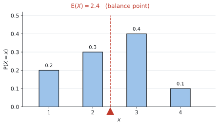

# SL 4.7 — Discrete random variables and expected value（離散確率変数と期待値） {#sec-sl-4-7}

::: {.callout-note}
## What you should be able to do
- **discrete random variable**（離散確率変数）の意味を説明できる。
- **大文字 $X$ と小文字 $x$** の使い分けが分かる。
- **probability distribution**（確率分布）を、**表**からも**式**からも読み取れる。
- **確率の合計が $1$** であることを使って、未知の確率を求められる。
- 公式集の式で **$E(X)$**（期待値）を求められる。
- $E(X)$ が問題の中で**何を意味するか**を説明できる。
- **fair game**（$E(X) = 0$）かどうかを判定し、公平にする金額を求められる。
:::

::: {.callout-important}
## Formula booklet に載っているもの
SL 4.7 の欄には、次の1行だけが印刷されています。

$$
E(X) = \sum_{i=1}^{k} x_i \, P(X = x_i)
$$

**「値 × その確率」を全部足す**、というだけの式です。$\sum$ は SL 1.2 で出てきた和の記号です。

読み方は[この節](#expected-value)で説明します。**式そのものより、$E(X)$ が何を意味するかのほうが大事**です。
:::

## The idea

### 1. random variable とは {#random-variable}

**random variable**（確率変数）は、**「どの値になるかが確率で決まる量」**のことです。

サイコロを1回振ったときの出目、ゲームでもらえる賞金、1日に来る客の人数 ── どれも random variable です。

**discrete**（離散）は「とびとび」という意味です（SL 4.1）。サイコロの目は $1, 2, \ldots, 6$ しかなく、あいだの値はありません。

::: {.callout-important}
## 大文字 $X$ と小文字 $x$ を使い分けます
**ここが分かっていないと、問題文が読めません。**

| 記号 | 意味 |
|---|---|
| **$X$**（大文字） | 変数そのもの（「出た目」という**量**） |
| **$x$**（小文字） | その変数が取る**具体的な値**（$1$ とか $5$ とか） |

: $X$ と $x$ の違い {#tbl-sl47-Xx}

ですから $P(X = 3)$ は、**「$X$ という量が $3$ になる確率」**と読みます。

$$
P(X = 3) = \frac{1}{6} \qquad \text{（サイコロで3が出る確率）}
$$

**問題文の $P(X = x)$ は「それぞれの値について、その確率」**という意味です。
:::

### 2. probability distribution の2つの書き方 {#distribution}

**probability distribution**（確率分布）は、**「どの値がどの確率で出るか」を全部書いたもの**です。

シラバスに、**2つの形で与えられる**と明記されています。

#### 形1：表

| $x$ | 1 | 2 | 3 | 4 |
|---|---|---|---|---|
| $P(X = x)$ | 0.2 | 0.3 | 0.4 | 0.1 |

: 表で与えられた確率分布 {#tbl-sl47-dist}

#### 形2：式

$$
P(X = x) = \frac{1}{18}(4 + x) \qquad \text{for } x \in \{1, 2, 3\}
$$

**これはシラバスに載っている例そのもの**です。$x$ に $1, 2, 3$ を入れて、表に直してから使います。

$$
P(X=1) = \frac{5}{18}, \qquad P(X=2) = \frac{6}{18}, \qquad P(X=3) = \frac{7}{18}
$$

**式で与えられたら、まず表に書き直してください。** そのほうが確実です。

### 3. 確率の合計は必ず $1$ {#sum-one}

**この項目で一番よく使う事実**です。

$$
\sum P(X = x) = 1
$$ {#eq-sl47-sum}

起こりうることを全部足したのだから、$1$ になるのは当たり前です（SL 4.5 の $P(A) + P(A') = 1$ と同じ考え方）。

::: {.callout-note}
## ここでのシグマ $\sum$ は「確率を全部足す」という意味です
$\sum$ は **足していく**という記号です（SL 1.2）。

ここで足しているのは、**$x$ が起こる確率 $P(X = x)$ そのもの**です。$X$ が $1, 2, 3, 4$ の値をとるなら

$$
\sum P(X = x) = P(X = 1) + P(X = 2) + P(X = 3) + P(X = 4)
$$

ということです。**表の $2$ 行目を、左から右まで全部足す**と言いかえてもかまいません。
:::

@tbl-sl47-dist で確かめてみます。

$$
0.2 + 0.3 + 0.4 + 0.1 = 1 \quad \checkmark
$$

上の式の例でも、

$$
\frac{5}{18} + \frac{6}{18} + \frac{7}{18} = \frac{18}{18} = 1 \quad \checkmark
$$

#### 未知の確率を求めるのに使います

表の中に $k$ のような文字があったら、**合計 $1$ から逆算します。**

| $x$ | 1 | 2 | 3 | 4 |
|---|---|---|---|---|
| $P(X = x)$ | 0.15 | $k$ | 0.35 | 0.2 |

: $k$ を含む分布 {#tbl-sl47-k}

$$
0.15 + k + 0.35 + 0.2 = 1
$$

$$
k = 1 - 0.7 = 0.3
$$

**表を見たら、まず合計が $1$ になるか確かめる習慣**をつけてください。文字がなくても、確かめれば写し間違いに気づけます。

### 4. E(X) ── 期待値 {#expected-value}

**$E(X)$ は「長い目で見たときの平均」**です。日本語では **期待値** といいます。

$$
E(X) = \sum_{i=1}^{k} x_i \, P(X = x_i)
$$ {#eq-sl47-ex}

**やることは、「値 × 確率」を全部足すだけ**です。

#### 記号の意味 {#ex-symbols}

| 記号 | 何を表しているか |
|---|---|
| $k$ | $X$ がとりうる値が**全部で何個あるか** |
| $x_i$ | $X$ がとりうる値の **$i$ 番目**（表の $1$ 行目の数） |
| $P(X = x_i)$ | その値が**起こる確率**（表の $2$ 行目の数） |
| $x_i \, P(X = x_i)$ | その $2$ つを**かけたもの** |

: @eq-sl47-ex の記号 {#tbl-sl47-symbols}

**「値 × 確率」をかけたものを、$i = 1$ から $i = k$ まで全部足す**ので、$\sum$ が使われています。

$X$ が $1, 2, 3, 4$ の値をとるなら、$k = 4$ で

$$
\begin{aligned}
E(X) = \ & x_1 P(X = x_1) + x_2 P(X = x_2) \\[2pt]
        & + x_3 P(X = x_3) + x_4 P(X = x_4)
\end{aligned}
$$

つまり **表の $1$ 行目と $2$ 行目を縦にかけて、それを横に全部足す**ということです。

#### 表に行を1つ足すと確実です

@tbl-sl47-dist で計算してみます。**$x \times P(X=x)$ の行を足します。**

| $x$ | 1 | 2 | 3 | 4 | **合計** |
|---|---|---|---|---|---|
| $P(X = x)$ | 0.2 | 0.3 | 0.4 | 0.1 | **1** |
| $x \times P(X=x)$ | 0.2 | 0.6 | 1.2 | 0.4 | **2.4** |

: $E(X)$ の計算 {#tbl-sl47-calc}

$$
E(X) = 0.2 + 0.6 + 1.2 + 0.4 = 2.4
$$

**2行目の合計が $1$、3行目の合計が $E(X)$** です。**$1$ にならなければ、そこで気づけます。**

#### $E(X)$ は「つりあいの位置」です

{#fig-sl47-balance width=95%}

棒の高さを重さだと思うと、**$E(X)$ はちょうどつりあう場所**です。

@fig-sl47-balance を見ると、$E(X) = 2.4$ は $2$ と $3$ のあいだにあります。$3$ の棒が一番重いので、$2.5$ より少し左でつりあっています。

::: {.callout-important}
## $E(X)$ は、実際には出ない値でもよいのです
$E(X) = 2.4$ ですが、**$X$ が $2.4$ になることはありません。** 出るのは $1, 2, 3, 4$ だけです。

それでも正解です。**「何回もやったときの平均」**だからです。

SL 4.3 で兄弟の人数の平均が $1.45$ 人になったのと、SL 4.5 で期待される欠席者が $12.8$ 人になったのと、まったく同じ話です。

**整数に丸めないでください。**
:::

### 5. fair game {#fair-game}

シラバスに、はっきり書かれています。

> $E(X) = 0$ indicates a **fair game** where $X$ represents the **gain** of a player.

**$E(X) = 0$ なら公平なゲーム**です。長い目で見て、得も損もしません。

| $E(X)$ | 意味 |
|---|---|
| $E(X) = 0$ | **fair**（公平） |
| $E(X) > 0$ | プレイヤーに**有利** |
| $E(X) < 0$ | プレイヤーに**不利**（お店が儲かる） |

: $E(X)$ の符号の意味 {#tbl-sl47-fair}

::: {.callout-warning}
## $X$ は「賞金」ではなく「もうけ」です
**これがこの項目で一番の落とし穴です。**

シラバスの言葉は `the gain of a player`（プレイヤーのもうけ）です。

$$
(\text{gain}) = (\text{もらえる金額}) - (\text{払った参加費})
$$

**参加費を引き忘れると、答えが必ず間違います。**

たとえば参加費 $\$4$ で、賞金が $\$12$ のとき、**gain は $\$8$** です。$\$12$ ではありません。

**何ももらえなかった場合の gain は $-\$4$** です。$0$ ではありません。**参加費は必ず払っているから**です。

**問題文に `It costs $4 to play` のような文があったら、必ず全部の場合から引いてください。**
:::

#### 公平にする参加費を求める

「いくらにすれば公平になるか」と聞かれることもあります。

**答えは「賞金の期待値」**です。

$$
(\text{公平な参加費}) = E(\text{賞金})
$$

参加費が賞金の期待値とちょうど同じなら、差し引き $0$ になるからです。@exm-sl47-fee で実際にやります。

## Why it works

:::: {.callout-note collapse="true" appearance="simple"}
## クリックすると開きます
ここでは、**なぜ「値 × 確率」を足すと平均になるのか**だけを説明します。

SL 4.3 で、度数分布表から平均を求める式を使いました。

$$
\bar{x} = \frac{\sum f_i x_i}{n}
$$

この式を、少し書き換えてみます。$n$ で割るのを、それぞれの項に分けます。

$$
\bar{x} = \sum x_i \times \frac{f_i}{n}
$$

ここで $\dfrac{f_i}{n}$ は何でしょうか。**その値が出た回数 ÷ 全部の回数**、つまり **relative frequency**（相対度数）です。

そして SL 4.5 で見たとおり、**回数を増やすと相対度数は確率に近づきます。**

$$
\frac{f_i}{n} \quad \longrightarrow \quad P(X = x_i)
$$

置きかえると、そのまま @eq-sl47-ex になります。

$$
E(X) = \sum x_i \, P(X = x_i)
$$

**$E(X)$ は、SL 4.3 の平均と同じもの**です。違うのは、実際に数えた度数のかわりに、**理論上の確率**を使っているところだけです。

だから **$E(X)$ を「長い目で見た平均」**と呼ぶのです。
::::

## Worked examples

::: {.callout-note appearance="simple"}
問題文は英語です。意味が理解できなかったら、問題文の下の「**日本語訳**」を開いてください。解説は日本語です。
:::

::: {#exm-sl47-basic}
[The discrete random variable $X$ has the probability distribution shown in the table.]{.q-en}

| $x$ | 1 | 2 | 3 | 4 |
|---|---|---|---|---|
| $P(X = x)$ | 0.2 | 0.3 | 0.4 | 0.1 |

: Distribution of $X$ {#tbl-sl47-we1}

**(a)** [Show that the probabilities sum to $1$.]{.q-en}

**(b)** [Find $P(X > 2)$.]{.q-en}

**(c)** [Find $E(X)$.]{.q-en}

<details class="jp-trans">
<summary>日本語訳</summary>

離散確率変数 $X$ の確率分布が表のとおりです。

**(a)** 確率の合計が $1$ になることを示しなさい。

**(b)** $P(X > 2)$ を求めなさい。

**(c)** $E(X)$ を求めなさい。

</details>

---

**(a)** 足すだけです。`Show that` なので、**計算を書いてください。**

$$
0.2 + 0.3 + 0.4 + 0.1 = 1
$$

**(b)** $X > 2$ は **$3$ と $4$**です。**$2$ は入りません**（SL 4.5 の `greater than`）。

$$
P(X > 2) = P(X=3) + P(X=4) = 0.4 + 0.1 = 0.5
$$

**(c)** [表に行を足します](#expected-value)。

| $x$ | 1 | 2 | 3 | 4 |
|---|---|---|---|---|
| $P(X=x)$ | 0.2 | 0.3 | 0.4 | 0.1 |
| $x \times P(X=x)$ | 0.2 | 0.6 | 1.2 | 0.4 |

: $E(X)$ の計算 {#tbl-sl47-we1b}

$$
E(X) = 0.2 + 0.6 + 1.2 + 0.4 = 2.4
$$

**$2.4$ は実際には出ない値ですが、それで正解です。**

::: {.callout-note}
## 解答例（答案用紙にはこう書く）
**(a)** $0.2 + 0.3 + 0.4 + 0.1 = 1$

**(b)** $P(X > 2) = 0.4 + 0.1 = 0.5$

**(c)** $E(X) = 1(0.2) + 2(0.3) + 3(0.4) + 4(0.1) = 2.4$
:::
:::

::: {#exm-sl47-findk}
[The discrete random variable $X$ has the probability distribution shown in the table, where $k$ is a constant.]{.q-en}

| $x$ | 1 | 2 | 3 | 4 |
|---|---|---|---|---|
| $P(X = x)$ | 0.15 | $k$ | 0.35 | 0.2 |

: Distribution with unknown $k$ {#tbl-sl47-we2}

**(a)** [Find the value of $k$.]{.q-en}

**(b)** [Find $E(X)$.]{.q-en}

<details class="jp-trans">
<summary>日本語訳</summary>

離散確率変数 $X$ の確率分布が表のとおりです。$k$ は定数です。

**(a)** $k$ の値を求めなさい。

**(b)** $E(X)$ を求めなさい。

</details>

---

**(a)** [確率の合計は $1$](#sum-one) です。これが $k$ を求める唯一の手がかりです。

$$
0.15 + k + 0.35 + 0.2 = 1
$$

$$
k + 0.7 = 1
$$

$$
k = 0.3
$$

**(b)** $k$ が分かったので、あとは @exm-sl47-basic の **(c)** と同じです。

$$
E(X) = 1(0.15) + 2(0.3) + 3(0.35) + 4(0.2)
$$

$$
= 0.15 + 0.6 + 1.05 + 0.8 = 2.6
$$

**$k = 0.3$ を必ず代入してください。** $k$ のまま計算しようとすると、無駄に難しくなります。

::: {.callout-note}
## 解答例（答案用紙にはこう書く）
**(a)** $0.15 + k + 0.35 + 0.2 = 1$

$$k = 1 - 0.7 = 0.3$$

**(b)** $E(X) = 1(0.15) + 2(0.3) + 3(0.35) + 4(0.2) = 2.6$
:::
:::

::: {#exm-sl47-formula}
[The discrete random variable $X$ has probability distribution given by]{.q-en}

$$
P(X = x) = \frac{x^{2}}{30} \qquad \text{for } x \in \{1, 2, 3, 4\} .
$$

**(a)** [Show that the probabilities sum to $1$.]{.q-en}

**(b)** [Find $E(X)$, giving your answer correct to three significant figures.]{.q-en}

<details class="jp-trans">
<summary>日本語訳</summary>

離散確率変数 $X$ の確率分布が次の式で与えられています。

$$
P(X = x) = \frac{x^{2}}{30} \qquad (x \in \{1, 2, 3, 4\})
$$

**(a)** 確率の合計が $1$ になることを示しなさい。

**(b)** $E(X)$ を有効数字3桁で求めなさい。

（$x \in \{1,2,3,4\}$ は「$x$ は $1,2,3,4$ のどれか」という意味です。）

</details>

---

**まず表に直します**（[式で与えられたとき](#distribution)）。$x$ に $1, 2, 3, 4$ を入れるだけです。

| $x$ | 1 | 2 | 3 | 4 |
|---|---|---|---|---|
| $P(X = x)$ | $\dfrac{1}{30}$ | $\dfrac{4}{30}$ | $\dfrac{9}{30}$ | $\dfrac{16}{30}$ |

: 式を表に直したもの {#tbl-sl47-we3}

**(a)** 足します。**分母がそろっているので、分子だけ見れば足せます。**

$$
\frac{1}{30} + \frac{4}{30} + \frac{9}{30} + \frac{16}{30} = \frac{30}{30} = 1
$$

**(b)** 「値 × 確率」を足します。

$$
E(X) = 1 \times \frac{1}{30} + 2 \times \frac{4}{30} + 3 \times \frac{9}{30} + 4 \times \frac{16}{30}
$$

$$
= \frac{1 + 8 + 27 + 64}{30} = \frac{100}{30} = \frac{10}{3} = 3.33 \quad (3 \text{ s.f.})
$$

**分母が同じなので、分子だけ足せます。** 分数のまま計算するほうが速いです。

::: {.callout-note}
## 解答例（答案用紙にはこう書く）
**(a)** $\dfrac{1}{30} + \dfrac{4}{30} + \dfrac{9}{30} + \dfrac{16}{30} = \dfrac{30}{30} = 1$

**(b)** $E(X) = \dfrac{1 + 8 + 27 + 64}{30} = \dfrac{100}{30} = 3.33$ (3 s.f.)
:::
:::

::: {#exm-sl47-game}
[In a game, a player pays $\$4$ to roll a fair six-sided die once.]{.q-en}

- [If the score is $6$, the player receives $\$12$.]{.q-en}
- [If the score is $4$ or $5$, the player receives $\$3$.]{.q-en}
- [Otherwise the player receives nothing.]{.q-en}

[Let $X$ be the player's gain.]{.q-en}

**(a)** [Complete a table showing the probability distribution of $X$.]{.q-en}

**(b)** [Find $E(X)$.]{.q-en}

**(c)** [State whether the game is fair, and interpret your answer.]{.q-en}

<details class="jp-trans">
<summary>日本語訳</summary>

あるゲームでは、$\$4$ を払って公平な6面のサイコロを1回振ります。

- 出た目が $6$ なら $\$12$ を受け取る
- 出た目が $4$ か $5$ なら $\$3$ を受け取る
- それ以外は何も受け取らない

$X$ をプレイヤーの**もうけ**とします。

**(a)** $X$ の確率分布を表にまとめなさい。

**(b)** $E(X)$ を求めなさい。

**(c)** このゲームが公平かどうかを答え、その意味を説明しなさい。

（`gain` は「もうけ」＝受け取る額から払った額を引いたものです。）

</details>

---

**(a)** **$X$ は gain なので、参加費 $\$4$ を必ず引きます**（[ここが落とし穴](#fair-game)）。

| 出た目 | 受け取る額 | **gain $x$** | 確率 |
|---|---|---|---|
| 6 | $\$12$ | $12 - 4 = 8$ | $\dfrac{1}{6}$ |
| 4, 5 | $\$3$ | $3 - 4 = -1$ | $\dfrac{2}{6}$ |
| 1, 2, 3 | $\$0$ | $0 - 4 = -4$ | $\dfrac{3}{6}$ |

: gain の分布 {#tbl-sl47-we4}

**$4$ か $5$ のときの gain は $-1$ です。** $\$3$ もらっても、$\$4$ 払っているので $\$1$ の損です。

**何ももらえないときは $-4$**。$0$ ではありません。

**確率の合計**：$\dfrac{1}{6} + \dfrac{2}{6} + \dfrac{3}{6} = 1$ ✓

**(b)** 「値 × 確率」を足します。

$$
E(X) = 8 \times \frac{1}{6} + (-1) \times \frac{2}{6} + (-4) \times \frac{3}{6}
$$

$$
= \frac{8 - 2 - 12}{6} = \frac{-6}{6} = -1
$$

**(c)** $E(X) = -1 \neq 0$ なので、**公平ではありません。**

$E(X) < 0$ なので、**プレイヤーに不利**です（@tbl-sl47-fair）。

意味は「**このゲームを何回もやると、1回あたり平均 $\$1$ ずつ損をする**」ということです。

::: {.callout-note}
## 解答例（答案用紙にはこう書く）
**(a)**

| $x$ | 8 | $-1$ | $-4$ |
|---|---|---|---|
| $P(X=x)$ | $\frac{1}{6}$ | $\frac{2}{6}$ | $\frac{3}{6}$ |

**(b)** $E(X) = 8\left(\frac{1}{6}\right) + (-1)\left(\frac{2}{6}\right) + (-4)\left(\frac{3}{6}\right) = \dfrac{-6}{6} = -1$

**(c)** *The game is not fair, since $E(X) \neq 0$. As $E(X) = -1$, a player loses $\$1$ per game on average in the long run.*
:::
:::

::: {#exm-sl47-fee}
::: {.callout-note appearance="simple"}
この例題は、**@exm-sl47-game の続き**です。ゲームの中身は同じで、**参加費だけ**を考え直します。

> 公平な6面のサイコロを1回振る。出た目が $6$ なら $\$12$、$4$ か $5$ なら $\$3$、それ以外は $0$ を受け取る。
:::

[The same game is used, with the same prizes: $\$12$ for a score of $6$, $\$3$ for a score of $4$ or $5$, and nothing otherwise.]{.q-en}

[Find the amount that should be charged to play in order to make the game fair.]{.q-en}

<details class="jp-trans">
<summary>日本語訳</summary>

同じゲームで、賞金も同じです（$6$ なら $\$12$、$4$ か $5$ なら $\$3$、それ以外は $0$）。

このゲームを公平にするために、参加費をいくらにすべきか求めなさい。

</details>

---

[公平な参加費は、賞金の期待値](#fair-game)です。ですから、**まず賞金だけの期待値**を出します。

参加費を引かずに、**受け取る額**そのもので考えます。

$$
E(\text{受け取る額}) = 12 \times \frac{1}{6} + 3 \times \frac{2}{6} + 0 \times \frac{3}{6}
$$

$$
= 2 + 1 + 0 = 3
$$

**平均して $\$3$ もらえる**ということです。ですから参加費を **$\$3$** にすれば、差し引き $0$ になります。

**確かめておきます。** 参加費が $\$3$ なら gain は $9$、$0$、$-3$ です。

$$
E(X) = 9 \times \frac{1}{6} + 0 \times \frac{2}{6} + (-3) \times \frac{3}{6} = \frac{9 - 9}{6} = 0 \quad \checkmark
$$

**$E(X) = 0$ になりました。** 公平です。

**@exm-sl47-game では参加費が $\$4$ でした。** $\$1$ 高かったぶんが、$E(X) = -1$ に出ていたわけです。

::: {.callout-note}
## 解答例（答案用紙にはこう書く）
$$E(\text{amount received}) = 12\left(\frac{1}{6}\right) + 3\left(\frac{2}{6}\right) + 0\left(\frac{3}{6}\right) = 3$$

*For the game to be fair, the player should be charged $\$3$ to play.*
:::
:::

## Common errors

::: {.callout-warning}
## gain から参加費を引き忘れる
**この項目で一番多い間違いです。**

参加費 $\$4$、賞金 $\$12$ なら、**gain は $\$8$** です。

何ももらえなかった場合も **$-\$4$** であって、$0$ ではありません。

**問題文の `It costs ... to play` を丸で囲んでください。**
:::

::: {.callout-warning}
## 確率の合計が $1$ か確かめない
表を見たら、**まず足してください。** $10$ 秒で終わります。

$1$ にならなければ、写し間違いか、$k$ を求め忘れています。
:::

::: {.callout-warning}
## $E(X)$ を整数に丸める
$E(X) = 2.4$ は $2.4$ のままです。**実際には出ない値でも構いません。**

指示がないかぎり丸めないでください。
:::

::: {.callout-warning}
## $P(X > 2)$ に $x = 2$ を入れてしまう
`greater than` はその数を**含みません**（SL 4.5）。

$P(X \geq 2)$ なら $2$ も入ります。**不等号に $=$ が付いているかを見てください。**
:::

::: {.callout-warning}
## 式で与えられた分布を、表に直さずに計算する
$P(X=x) = \dfrac{x^2}{30}$ のような式は、**まず $x$ に値を入れて表にしてください。**

頭の中でやろうとすると、まず間違えます。
:::

::: {.callout-warning}
## fair game を「勝つ確率が $\dfrac{1}{2}$」だと思う
**fair game の定義は $E(X) = 0$** です。勝つ確率とは関係ありません。

勝つ確率が小さくても、賞金が大きければ公平になりえます。
:::

::: {.callout-warning}
## $E(X)$ の意味を書かずに数字で終わる
`Interpret` や `Comment on` が付いていたら、**言葉で説明が必要**です。

「$E(X) = -1$」だけでなく、「**1回あたり平均 $\$1$ 損をする**」まで書いてください。
:::

## Using your GDC (TI-Nspire CX II)

**$E(X)$ は、電卓に計算させられます。** 使うのは SL 4.3 と同じ One-Variable Statistics です。

### 2つの列に入れて、確率を Frequency にする

```
ctrl + doc → 4: Add Lists & Spreadsheet
```

**$x$ の列と $P(X=x)$ の列**を作ります。

| `x` | `p` |
|---|---|
| 1 | 0.2 |
| 2 | 0.3 |
| 3 | 0.4 |
| 4 | 0.1 |

: 電卓への入れ方 {#tbl-sl47-gdc}

```
menu → Statistics → Stat Calculations → One-Variable Statistics
```

- `X1 List` … `x`
- **`Frequency List` … `p`**

`OK` を押すと、**$\bar{x}$ の欄に $E(X)$ が出ます。** この例なら $2.4$ です。

::: {.callout-tip}
## なぜこれで $E(X)$ が出るのか
One-Variable Statistics は $\dfrac{\sum f x}{\sum f}$ を計算しています（SL 4.3）。

いま $f$ のかわりに確率 $P$ を入れたので、

$$
\frac{\sum x P}{\sum P} = \frac{E(X)}{1} = E(X)
$$

**分母の $\sum P$ が $1$ なので、そのまま $E(X)$ になる**わけです。

ですから、**$n$ の欄に $1$ と表示されていれば正しく入っています。** $4$ になっていたら `Frequency List` を指定し忘れています。
:::

### 手計算と併用してください

**表に「$x \times P$」の行を足す方法**（@tbl-sl47-calc）も、必ずできるようにしてください。

理由は2つあります。

1. **答案には途中式が必要**です。電卓の値だけ書いても点になりません
2. **$E(X)$ の意味が体に入ります**

**電卓は検算に使うのが一番よい使い方**です。手で出した $2.4$ と電卓の $\bar{x}$ が合っているか確かめてください。

### 分数のまま計算する

@exm-sl47-formula のように分数が出てくるときは、分数テンプレート（`ctrl + ÷`）でそのまま打ち込めます。

$$
\frac{100}{30} \quad \longrightarrow \quad \frac{10}{3}
$$

**約分は電卓がやってくれます。** 小数にしたいときは `ctrl + enter` です。

## Exercises

::: {.callout-note appearance="simple"}
各問題に、折りたたみが3つ付いています。**日本語訳**、**解答例**（答案用紙に書くべきこと。英語です）、**解説**（なぜそうなるか。日本語です）。

まず自分で解いて、次に解答例と見くらべてください。**解説は、合わなかったときだけ開けば十分です。**
:::

::: {.exercise-block}

[1]{.ex-no} [The discrete random variable $X$ has the following probability distribution.]{.q-en}

| $x$ | 0 | 1 | 2 | 3 |
|---|---|---|---|---|
| $P(X = x)$ | 0.4 | 0.3 | 0.2 | 0.1 |

: Distribution of $X$ {#tbl-sl47-e1}

**(a)** [Find $P(X \geq 2)$.]{.q-en}

**(b)** [Find $E(X)$.]{.q-en}

<details class="jp-trans">
<summary>日本語訳</summary>

離散確率変数 $X$ の確率分布が次のとおりです。

**(a)** $P(X \geq 2)$ を求めなさい。

**(b)** $E(X)$ を求めなさい。

</details>

::: {.callout-note collapse="true"}
## 解答例（答案用紙に書くこと）
**(a)** $P(X \geq 2) = 0.2 + 0.1 = 0.3$

**(b)** $E(X) = 0(0.4) + 1(0.3) + 2(0.2) + 3(0.1) = 1$
:::

::: {.callout-tip collapse="true"}
## 解説
**(a)** $\geq$ なので **$2$ も入ります**。$x = 2$ と $x = 3$ を足します。

**(b)** $x = 0$ の項は $0 \times 0.4 = 0$ です。**書かなくてもよいですが、書いておくほうが安全**です。

$$0 + 0.3 + 0.4 + 0.3 = 1$$

$E(X) = 1$ ちょうどになりました。**確率の合計も $1$ ですが、別のもの**です。混同しないでください。
:::

::: {.ex-sep}
:::

[2]{.ex-no} [The discrete random variable $X$ has the following probability distribution, where $k$ is a constant.]{.q-en}

| $x$ | 1 | 2 | 3 | 4 | 5 |
|---|---|---|---|---|---|
| $P(X = x)$ | 0.1 | 0.25 | $k$ | 0.2 | 0.15 |

: Distribution with $k$ {#tbl-sl47-e2}

[Find the value of $k$.]{.q-en}

<details class="jp-trans">
<summary>日本語訳</summary>

離散確率変数 $X$ の確率分布が次のとおりです。$k$ は定数です。

$k$ の値を求めなさい。

</details>

::: {.callout-note collapse="true"}
## 解答例（答案用紙に書くこと）
$$0.1 + 0.25 + k + 0.2 + 0.15 = 1$$
$$k + 0.7 = 1$$
$$k = 0.3$$
:::

::: {.callout-tip collapse="true"}
## 解説
[確率の合計は $1$](#sum-one)、これだけです。

$k$ 以外を足すと $0.1 + 0.25 + 0.2 + 0.15 = 0.7$。

$$k = 1 - 0.7 = 0.3$$

**式を1行書いてから答えてください。** 答えだけだと、どこから出したのか伝わりません。
:::

::: {.ex-sep}
:::

[3]{.ex-no} [The discrete random variable $X$ has the following probability distribution, where $k$ is a constant.]{.q-en}

| $x$ | 2 | 4 | 6 | 8 |
|---|---|---|---|---|
| $P(X = x)$ | 0.1 | 0.4 | $k$ | 0.2 |

: Distribution with $k$ {#tbl-sl47-e3}

**(a)** [Find the value of $k$.]{.q-en}

**(b)** [Find $E(X)$.]{.q-en}

<details class="jp-trans">
<summary>日本語訳</summary>

離散確率変数 $X$ の確率分布が次のとおりです。$k$ は定数です。

**(a)** $k$ の値を求めなさい。

**(b)** $E(X)$ を求めなさい。

</details>

::: {.callout-note collapse="true"}
## 解答例（答案用紙に書くこと）
**(a)** $0.1 + 0.4 + k + 0.2 = 1$, so $k = 0.3$

**(b)** $E(X) = 2(0.1) + 4(0.4) + 6(0.3) + 8(0.2)$

$$= 0.2 + 1.6 + 1.8 + 1.6 = 5.2$$
:::

::: {.callout-tip collapse="true"}
## 解説
**(a)** $1 - (0.1 + 0.4 + 0.2) = 1 - 0.7 = 0.3$。

**(b)** $k = 0.3$ を**代入してから**計算します。

$x$ の値が $2, 4, 6, 8$ と偶数なので、$E(X)$ も大きめになります。$5.2$ は $2$ と $8$ のあいだにあり、**つじつまが合っています**。

**$E(X)$ は必ず、一番小さい値と一番大きい値のあいだに入ります。** 外に出たら計算ミスです。
:::

::: {.ex-sep}
:::

[4]{.ex-no} [The discrete random variable $X$ has probability distribution given by]{.q-en}

$$
P(X = x) = \frac{x}{10} \qquad \text{for } x \in \{1, 2, 3, 4\} .
$$

**(a)** [Show that the probabilities sum to $1$.]{.q-en}

**(b)** [Find $E(X)$.]{.q-en}

<details class="jp-trans">
<summary>日本語訳</summary>

離散確率変数 $X$ の確率分布が次の式で与えられています。

$$
P(X = x) = \frac{x}{10} \qquad (x \in \{1, 2, 3, 4\})
$$

**(a)** 確率の合計が $1$ になることを示しなさい。

**(b)** $E(X)$ を求めなさい。

</details>

::: {.callout-note collapse="true"}
## 解答例（答案用紙に書くこと）
**(a)** $\dfrac{1}{10} + \dfrac{2}{10} + \dfrac{3}{10} + \dfrac{4}{10} = \dfrac{10}{10} = 1$

**(b)** $E(X) = 1\left(\dfrac{1}{10}\right) + 2\left(\dfrac{2}{10}\right) + 3\left(\dfrac{3}{10}\right) + 4\left(\dfrac{4}{10}\right)$

$$= \frac{1 + 4 + 9 + 16}{10} = \frac{30}{10} = 3$$
:::

::: {.callout-tip collapse="true"}
## 解説
**まず表に直します。** $x$ に $1, 2, 3, 4$ を入れるだけです。

$$\frac{1}{10}, \quad \frac{2}{10}, \quad \frac{3}{10}, \quad \frac{4}{10}$$

**(a)** 分母がそろっているので、分子を足すだけ。$1+2+3+4 = 10$。

**(b)** 「値 × 確率」なので $x \times \dfrac{x}{10} = \dfrac{x^2}{10}$。

$$\frac{1 + 4 + 9 + 16}{10} = \frac{30}{10} = 3$$

**ちょうど $3$ になりました。** 一番大きい $4$ に確率が寄っているので、真ん中の $2.5$ より大きくなるのは自然です。
:::

::: {.ex-sep}
:::

[5]{.ex-no} [A spinner has sections numbered $1$, $2$ and $3$. The probability distribution of the score $X$ is given by]{.q-en}

$$
P(X = x) = \frac{1}{18}(4 + x) \qquad \text{for } x \in \{1, 2, 3\} .
$$

**(a)** [Write the probability distribution as a table.]{.q-en}

**(b)** [Find $E(X)$, correct to three significant figures.]{.q-en}

<details class="jp-trans">
<summary>日本語訳</summary>

$1$、$2$、$3$ の区画があるスピナーがあります。得点 $X$ の確率分布は次の式で与えられます。

$$
P(X = x) = \frac{1}{18}(4 + x) \qquad (x \in \{1, 2, 3\})
$$

**(a)** この確率分布を表で書きなさい。

**(b)** $E(X)$ を有効数字3桁で求めなさい。

</details>

::: {.callout-note collapse="true"}
## 解答例（答案用紙に書くこと）
**(a)**

| $x$ | 1 | 2 | 3 |
|---|---|---|---|
| $P(X=x)$ | $\frac{5}{18}$ | $\frac{6}{18}$ | $\frac{7}{18}$ |

Check: $\dfrac{5 + 6 + 7}{18} = \dfrac{18}{18} = 1$

**(b)** $E(X) = \dfrac{1(5) + 2(6) + 3(7)}{18} = \dfrac{38}{18} = \dfrac{19}{9} = 2.11$ (3 s.f.)
:::

::: {.callout-tip collapse="true"}
## 解説
**(a)** $x$ に順に入れます。$\dfrac{1}{18}(4+1) = \dfrac{5}{18}$、$\dfrac{6}{18}$、$\dfrac{7}{18}$。

**合計が $1$ になるか必ず確かめてください。** $\dfrac{18}{18} = 1$ ✓ ここが合っていれば、表は正しく作れています。

**(b)** 分母がそろっているので分子だけ計算します。

$$1 \times 5 + 2 \times 6 + 3 \times 7 = 5 + 12 + 21 = 38$$

$$\frac{38}{18} = \frac{19}{9} = 2.111\ldots$$

有効数字3桁で $2.11$ です。
:::

::: {.ex-sep}
:::

[6]{.ex-no} [In a game, a player pays $\$5$ to play. A fair coin is tossed twice. The player receives $\$20$ if both tosses are heads, and nothing otherwise.]{.q-en}

[Let $X$ be the player's gain. Find $E(X)$.]{.q-en}

<details class="jp-trans">
<summary>日本語訳</summary>

あるゲームでは $\$5$ を払って参加します。公平なコインを $2$ 回投げ、$2$ 回とも表なら $\$20$ を受け取り、それ以外は何も受け取りません。

$X$ をプレイヤーのもうけとします。$E(X)$ を求めなさい。

</details>

::: {.callout-note collapse="true"}
## 解答例（答案用紙に書くこと）
$P(\text{HH}) = \dfrac{1}{2} \times \dfrac{1}{2} = \dfrac{1}{4}$

| $x$ | 15 | $-5$ |
|---|---|---|
| $P(X=x)$ | $\frac{1}{4}$ | $\frac{3}{4}$ |

$$E(X) = 15\left(\frac{1}{4}\right) + (-5)\left(\frac{3}{4}\right) = \frac{15 - 15}{4} = 0$$
:::

::: {.callout-tip collapse="true"}
## 解説
**まず HH の確率**です。SL 4.6 の樹形図で $\dfrac{1}{2} \times \dfrac{1}{2} = \dfrac{1}{4}$。

**gain を出します**（[参加費を引く](#fair-game)）。

- HH … $20 - 5 = 15$、確率 $\dfrac{1}{4}$
- それ以外 … $0 - 5 = -5$、確率 $\dfrac{3}{4}$

$$E(X) = \frac{15}{4} - \frac{15}{4} = 0$$

**$E(X) = 0$ なので、このゲームは公平です。** 聞かれていなくても、気づけると強いです。

**$20$ をそのまま使って $E = 20 \times \frac{1}{4} = 5$ としないでください。** それは「受け取る額」の期待値で、gain ではありません。
:::

::: {.ex-sep}
:::

[7]{.ex-no} [A game uses a fair six-sided die. The player receives $\$9$ if the score is $5$ or $6$, and $\$3$ otherwise.]{.q-en}

[Find the amount that should be charged to play in order to make the game fair.]{.q-en}

<details class="jp-trans">
<summary>日本語訳</summary>

あるゲームでは公平な6面のサイコロを使います。出た目が $5$ か $6$ なら $\$9$、それ以外なら $\$3$ を受け取ります。

このゲームを公平にするための参加費を求めなさい。

</details>

::: {.callout-note collapse="true"}
## 解答例（答案用紙に書くこと）
$$E(\text{amount received}) = 9\left(\frac{2}{6}\right) + 3\left(\frac{4}{6}\right) = \frac{18 + 12}{6} = \frac{30}{6} = 5$$

*The player should be charged $\$5$ to play.*
:::

::: {.callout-tip collapse="true"}
## 解説
[公平な参加費は、受け取る額の期待値](#fair-game)です。

**この問題では参加費を引きません。** まだ決まっていないからです。「受け取る額」だけで期待値を出します。

- $5$ か $6$ … $\dfrac{2}{6}$ の確率で $\$9$
- それ以外（$1,2,3,4$）… $\dfrac{4}{6}$ の確率で $\$3$

$$\frac{18 + 12}{6} = 5$$

**検算**：参加費 $\$5$ なら gain は $4$ と $-2$。

$$4\left(\frac{2}{6}\right) + (-2)\left(\frac{4}{6}\right) = \frac{8 - 8}{6} = 0 \quad \checkmark$$
:::

::: {.ex-sep}
:::

[8]{.ex-no} [The random variable $X$ represents a player's gain in a game, and $E(X) = -0.40$.]{.q-en}

[Interpret this value in the context of the game.]{.q-en}

<details class="jp-trans">
<summary>日本語訳</summary>

確率変数 $X$ はあるゲームでのプレイヤーのもうけを表し、$E(X) = -0.40$ です。

この値の意味を、ゲームの文脈で説明しなさい。

</details>

::: {.callout-note collapse="true"}
## 解答例（答案用紙に書くこと）
*On average, a player loses $\$0.40$ each time they play the game, in the long run. The game is not fair, and is unfavourable to the player.*
:::

::: {.callout-tip collapse="true"}
## 解説
`Interpret` なので、**言葉で説明する**設問です。数字を写すだけでは点になりません。

書くべきことは2つです。

1. **1回あたり平均 $\$0.40$ 損をする**
2. **公平ではなく、プレイヤーに不利**

**`on average` と `in the long run` を入れてください。** $1$ 回やって必ず $\$0.40$ 損をするわけではありません。**何回もやったときの平均**です。

$E(X) < 0$ ということは、**お店（主催者）が儲かる**ということでもあります。実際のゲームはたいていこうなっています。
:::

::: {.ex-sep}
:::

[9]{.ex-no} [A student says: "The expected value of a discrete random variable must be one of the values that the variable can take."]{.q-en}

[Explain why this statement is not correct, using an example.]{.q-en}

<details class="jp-trans">
<summary>日本語訳</summary>

ある生徒が「離散確率変数の期待値は、その変数が取りうる値のどれかでなければならない」と言っています。

例を挙げて、この主張が正しくない理由を説明しなさい。

（本書オリジナルの問題です。）

</details>

::: {.callout-note collapse="true"}
## 解答例（答案用紙に書くこと）
*The expected value is an average over many trials, not a value that must actually occur.*

*For example, if $X$ takes the values $1, 2, 3, 4$ with probabilities $0.2, 0.3, 0.4, 0.1$, then $E(X) = 2.4$. The variable can never take the value $2.4$, but $2.4$ is still the correct expected value.*
:::

::: {.callout-tip collapse="true"}
## 解説
$E(X)$ は**平均**であって、実際に出る値ではありません（@fig-sl47-balance）。

**具体例を挙げるよう指示されています。** @tbl-sl47-dist をそのまま使えば十分です。$E(X) = 2.4$ ですが、$X$ が $2.4$ になることはありません。

もっと身近な例なら「サイコロの $E(X) = 3.5$」です。$3.5$ の目はありません。

**SL 4.3 の「平均 $1.45$ 人」、SL 4.5 の「期待される欠席者 $12.8$ 人」と同じ話**です。この本で3回目に出てきた考え方なので、ここで完全に納得しておいてください。
:::

::: {.ex-sep}
:::

[10]{.ex-no} [A shop runs a promotion. Each customer draws one ticket at random from a box containing $200$ tickets:]{.q-en}

- [$2$ tickets win $\$50$]{.q-en}
- [$18$ tickets win $\$10$]{.q-en}
- [the rest win nothing]{.q-en}

[Let $X$ be the amount won by a customer.]{.q-en}

**(a)** [Write down the probability distribution of $X$.]{.q-en}

**(b)** [Find $E(X)$.]{.q-en}

**(c)** [The shop expects $500$ customers. Find the expected total cost of the prizes.]{.q-en}

<details class="jp-trans">
<summary>日本語訳</summary>

ある店がキャンペーンを行います。客はそれぞれ、$200$ 枚のチケットが入った箱から無作為に $1$ 枚引きます。

- $2$ 枚は $\$50$ が当たる
- $18$ 枚は $\$10$ が当たる
- 残りは外れ

$X$ を客が受け取る金額とします。

**(a)** $X$ の確率分布を書きなさい。

**(b)** $E(X)$ を求めなさい。

**(c)** 店は $500$ 人の客を見込んでいます。賞品にかかる費用の期待値を求めなさい。

</details>

::: {.callout-note collapse="true"}
## 解答例（答案用紙に書くこと）
**(a)**

| $x$ | 50 | 10 | 0 |
|---|---|---|---|
| $P(X=x)$ | $\frac{2}{200}$ | $\frac{18}{200}$ | $\frac{180}{200}$ |

**(b)** $E(X) = 50\left(\frac{2}{200}\right) + 10\left(\frac{18}{200}\right) + 0\left(\frac{180}{200}\right)$

$$= \frac{100 + 180}{200} = \frac{280}{200} = 1.4$$

**(c)** $500 \times 1.4 = \$700$
:::

::: {.callout-tip collapse="true"}
## 解説
**(a)** 外れの枚数は $200 - 2 - 18 = 180$ 枚。**合計**：$\dfrac{2 + 18 + 180}{200} = 1$ ✓

**(b)** ここでは $X$ が「受け取る金額」で、**参加費がありません**（無料のキャンペーン）。ですから引き算は不要です。

$$\frac{100 + 180}{200} = 1.4$$

**1人あたり平均 $\$1.40$** かかる、という意味です。

**(c)** SL 4.5 の「期待される回数」と同じ考え方です。**1人あたりの期待値 × 人数**。

$$500 \times 1.4 = 700$$

**店の立場から見た $E(X)$** です。$\$700$ を予算に見ておけばよい、ということになります。

**$50 \times 2 + 10 \times 18 = 280$（賞品の総額）と混同しないでください。** それは $200$ 人ぶんの金額です。$500$ 人なら、その $2.5$ 倍で $700$ になります。**どちらの道すじでも同じ答え**です。
:::

:::
