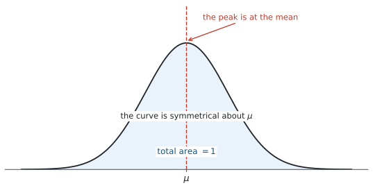
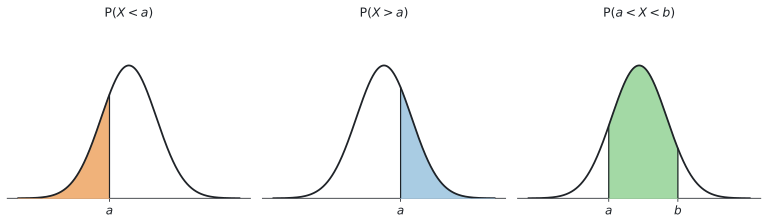
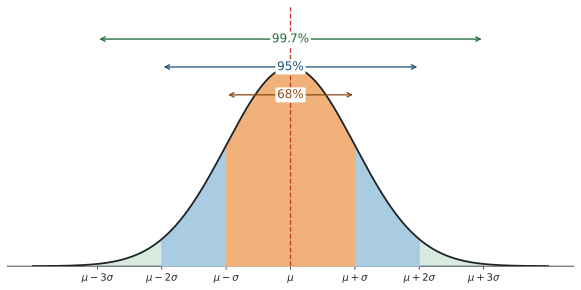
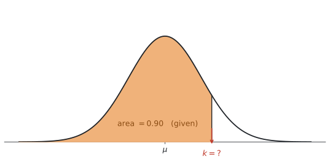

# SL 4.9 — The normal distribution（正規分布） {#sec-sl-4-9}

::: {.callout-note}
## What you should be able to do
- **normal distribution**（正規分布）の曲線の性質を説明できる。
- $\mu$（平均）と $\sigma$（標準偏差）が、曲線のどこを決めているか分かる。
- **$68\%$ / $95\%$ / $99.7\%$** の目安を使える。
- **確率は曲線の下の面積**であることを理解し、図をかいて範囲を示せる。
- 電卓の **normCdf** で確率を求められる。
- 電卓の **invNorm** で、逆に**値のほう**を求められる（**inverse normal**）。
:::

::: {.callout-important}
## Formula booklet には、何も載っていません
公式集の Topic 4 の欄は **SL 4.8 で終わっています。** SL 4.9 の式は**印刷されていません。**

理由はシラバスに書いてあります。

> Probabilities and values of the variable must be found **using technology**.

つまり **確率も値も、電卓で出すもの**と決まっています。この項目は、**電卓の操作そのものが中身**です。

さらに、シラバスにはこう明記されています。

> This does **not** involve transformation to the standardized normal variable $z$.

**$z = \dfrac{x - \mu}{\sigma}$ という変換（$z$ 値）は、AI SL では使いません。** 標準正規分布表も使いません。**$\mu$ と $\sigma$ をそのまま電卓に入れます。**
:::

## The idea

::: {.callout-tip}
## 電卓を開きながら、このページを読んでください
この項目は、読んでから電卓を触るのでは身に付きません。**TI-Nspire を手元に置いて、出てくる数を1つずつ自分で打ち込みながら**読み進めてください。

使うのは次の1か所だけです。

```
menu → Statistics → Distributions
```

ここに `Normal Cdf` と `Inverse Normal` があることを、いま確かめておいてください。
:::

### 1. normal distribution とは {#what-is-normal}

**normal distribution**（正規分布）は、**「真ん中のあたりが多く、両端にいくほど少なくなる」**という、あの左右対称の山の形をした分布です。

{#fig-sl49-curve width=88%}

山のてっぺんが **$\mu$（平均）** で、そこを境に**左右がぴったり対称**になっています。曲線の下の面積は、**全部で $1$**（$100\%$）です。

SL 4.8 の binomial distribution は、$X$ が**回数**でした（$0, 1, 2, \ldots$ と、とびとび）。今回の $X$ は **continuous**（連続）です。身長、重さ、時間、測定値 ── **どこまでも細かい値をとれる量**を扱います。

シラバスには *"Awareness of the natural occurrence of the normal distribution"*（正規分布が自然に現れることを知っていること）とあります。人の身長、工場で作った製品の重さ、同じものを何度も測ったときの測定値 ── **こうした量は、実際に正規分布に近い形になります。**

### 2. $\mu$ と $\sigma$ が形を決めます {#properties}

正規分布は、**$\mu$（平均）と $\sigma$（標準偏差）の2つだけ**で決まります。

| 記号 | 読み方 | 何を決めるか |
|---|---|---|
| $\mu$ | ミュー（mean） | 山の**位置**（どこが中心か） |
| $\sigma$ | シグマ（standard deviation） | 山の**幅**（どれだけばらついているか） |

: $\mu$ と $\sigma$ の役割 {#tbl-sl49-params}

曲線には、次の性質があります。

- **$\mu$ について左右対称**です
- **mean、median、mode がすべて $\mu$ で一致**します
- 曲線の下の**面積は全部で $1$**（$100\%$）です
- $\sigma$ が**大きいほど、山は低く広く**なります

::: {.callout-note}
## $X \sim N(\mu, \sigma^{2})$ という書き方
記号で書くときは、次のようにします。SL 4.8 の $X \sim B(n, p)$ と同じ形です。

$$
X \sim N(\mu, \sigma^{2})
$$

**カッコの中の2つ目は $\sigma$ ではなく $\sigma^{2}$**（分散）です。ここは間違えやすいところです。

ただし **AI SL の問題文では、たいてい言葉で書かれます。**

> *The mass of an apple is normally distributed with mean $120$ g and standard deviation $15$ g.*

**電卓に入れるのは $\sigma$（標準偏差）のほう**です。$\sigma^{2}$ を入れてはいけません。
:::

### 3. 確率は「曲線の下の面積」です {#area}

**この項目で一番大事な考え方**です。

$$
P(a < X < b) = (\text{曲線の下の、} a \text{ から } b \text{ までの面積})
$$

{#fig-sl49-areas width=100%}

@fig-sl49-areas のように、聞かれ方は3種類しかありません。

| 聞かれ方 | 面積 |
|---|---|
| $P(X < a)$ … $a$ より小さい | 左のはし から $a$ まで |
| $P(X > a)$ … $a$ より大きい | $a$ から 右のはし まで |
| $P(a < X < b)$ … $a$ と $b$ のあいだ | $a$ から $b$ まで |

: 3種類の面積 {#tbl-sl49-areas}

::: {.callout-tip}
## 必ず、まず図をかいてください
シラバスの Content 欄に *"Diagrammatic representation"*（図による表現）と書かれています。**図をかくこと自体が学習内容**です。

山をひとつ手でかいて、$\mu$ に縦線を1本、聞かれている範囲に斜線を引く。**これだけで、電卓に入れる下限と上限を間違えなくなります。**

$10$ 秒でできます。**この $10$ 秒が、この項目で一番よく効きます。**
:::

::: {.callout-note}
## $P(X < a)$ と $P(X \leq a)$ は同じです
SL 4.8 の binomial では、$X < 5$ と $X \leq 5$ は違いました（$X$ が整数だったからです）。

**正規分布では、この2つは同じ**になります。$X$ が連続なので、**ちょうど $a$ ぴったりになる確率が $0$**（幅のない線の面積は $0$）だからです。

ですから、正規分布の問題では **$=$ が付いているかどうかを気にしなくて構いません。**
:::

### 4. $68\%$ / $95\%$ / $99.7\%$ {#empirical}

[確率が面積だと分かった](#area)ので、**よく出てくる面積を3つ**、先に覚えてしまいます。

シラバスに、この3つの数がはっきり書かれています。

> approximately $68\%$ of the data lies between $\mu \pm \sigma$, $95\%$ lies between $\mu \pm 2\sigma$ and $99.7\%$ of the data lies between $\mu \pm 3\sigma$

{#fig-sl49-empirical width=85%}

| 範囲 | だいたいの割合 |
|---|---|
| $\mu - \sigma$ から $\mu + \sigma$ | $68\%$ |
| $\mu - 2\sigma$ から $\mu + 2\sigma$ | $95\%$ |
| $\mu - 3\sigma$ から $\mu + 3\sigma$ | $99.7\%$ |

: 覚えておく3つの割合 {#tbl-sl49-empirical}

**これは公式集に載っていないので、覚える必要があります。** シラバスが名指しで指定している、数少ない「覚えるもの」です。

#### 片側だけの割合も出せます

**左右対称なので、外側は半分ずつ**です。

たとえば $\mu + 2\sigma$ より大きい部分は、

$$
\frac{100\% - 95\%}{2} = \frac{5\%}{2} = 2.5\%
$$

同じように $\mu + 3\sigma$ より大きい部分は $\dfrac{100 - 99.7}{2} = 0.15\%$ です。

**「$100$ から引いて、$2$ で割る」**。この2手順で片側が出ます。

### 5. 逆向きに使う ── inverse normal {#inverse}

ここまでは「値 → 確率」でした。**逆に「確率 → 値」を聞かれる**こともあります。これを **inverse normal**（逆正規）といいます。

{#fig-sl49-inverse width=70%}

@fig-sl49-inverse のように、**面積のほうが分かっていて、境目の値 $k$ を探します。**

英語では、次のような聞かれ方をします。

| 英語 | 意味 |
|---|---|
| `Find the value of k such that P(X < k) = 0.9` | 左の面積が $0.9$ になる $k$ |
| `90% of the values are below ...` | 同じく左が $0.9$ |
| `The top 10% ...` | **右**が $0.1$ → 左は $0.9$ |
| `The slowest 25% ...` | 文脈しだい。**必ず図をかいて確かめる** |

: inverse normal の聞かれ方 {#tbl-sl49-inverse-words}

::: {.callout-important}
## invNorm は「左からの面積」を求めます
**ここがこの項目で一番の落とし穴です。**

TI-Nspire の `Inverse Normal` に入れる `Area` は、**その値より左側の面積**です。

ですから `the top 10%`（上位 $10\%$）と言われたら、**$0.1$ ではなく $0.9$** を入れます。

$$
(\text{左の面積}) = 1 - (\text{右の面積})
$$

**図をかけば、どちらを入れるかは一目で分かります。** 迷ったら図です。
:::

## Why it works

:::: {.callout-note collapse="true" appearance="simple"}
## クリックすると開きます
ここでは、**なぜ「面積 = 確率」になるのか**だけを説明します。

[SL 4.2](sl-4-2.qmd) でヒストグラムをかきました。正規分布の曲線は、**あのヒストグラムの山の形を、なめらかな曲線で表した model** だと思ってください。

ただし、**ヒストグラムの棒の面積そのものが確率だったわけではありません。** SL 4.2 のヒストグラムは縦軸が frequency（度数）で、階級の幅がそろっているので、棒の面積は度数に**比例していた**だけです。

正規分布の曲線では、**曲線の下の面積が全部で $1$ になるように、高さが調整されています。** そのうえで、

$$
(\text{その範囲に入る確率}) = (\text{その範囲の、曲線の下の面積})
$$

と決められています。**全部を合わせれば $1$（$100\%$）** なので、@fig-sl49-empirical の $99.7\%$ が「ほぼ全部」なのは、このためです。

::: {.callout-note}
## この先、Topic 5 へ
ここでは、曲線の下の面積を **GDC で求めました。** [Topic 5](../05-calculus/sl-5-5.qmd) では、曲線の下の面積を **integral**（積分）で求める考え方を学びます。
:::
::::

## Worked examples

::: {.callout-note appearance="simple"}
問題文は英語です。意味が理解できなかったら、問題文の下の「**日本語訳**」を開いてください。解説は日本語です。
:::

::: {#exm-sl49-empirical}
[The heights of a large group of students are normally distributed with mean $170$ cm and standard deviation $8$ cm.]{.q-en}

**(a)** [Write down the percentage of students whose height is between $162$ cm and $178$ cm.]{.q-en}

**(b)** [Write down the percentage of students whose height is between $154$ cm and $186$ cm.]{.q-en}

**(c)** [Find the percentage of students whose height is more than $186$ cm.]{.q-en}

<details class="jp-trans">
<summary>日本語訳</summary>

ある大きな集団の生徒の身長は、平均 $170$ cm、標準偏差 $8$ cm の正規分布に従います。

**(a)** 身長が $162$ cm から $178$ cm のあいだである生徒の割合（パーセント）を書きなさい。

**(b)** 身長が $154$ cm から $186$ cm のあいだである生徒の割合を書きなさい。

**(c)** 身長が $186$ cm より高い生徒の割合を求めなさい。

</details>

---

**この問題は電卓を使わずに解けます。** $68/95/99.7$ の出番です。

まず、$\mu = 170$、$\sigma = 8$ から目盛りを作ります。

$$
\mu - \sigma = 162, \qquad \mu + \sigma = 178
$$

$$
\mu - 2\sigma = 154, \qquad \mu + 2\sigma = 186
$$

**(a)** $162$ から $178$ は、ちょうど **$\mu \pm \sigma$** です（@tbl-sl49-empirical）。

$$
68\%
$$

**(b)** $154$ から $186$ は **$\mu \pm 2\sigma$** です。

$$
95\%
$$

**(c)** $186$ は $\mu + 2\sigma$ です。**$95\%$ の外側**を考えます。

外側は全部で $100 - 95 = 5\%$。**左右対称なので、その半分**が右側です。

$$
\frac{5\%}{2} = 2.5\%
$$

**「$100$ から引いて、$2$ で割る」**の型どおりです。

::: {.callout-note}
## 解答例（答案用紙にはこう書く）
**(a)** $162 = \mu - \sigma$ and $178 = \mu + \sigma$, so $68\%$

**(b)** $154 = \mu - 2\sigma$ and $186 = \mu + 2\sigma$, so $95\%$

**(c)** $\dfrac{100 - 95}{2} = 2.5\%$
:::
:::

::: {#exm-sl49-three}
[The random variable $X$ is normally distributed with mean $50$ and standard deviation $6$.]{.q-en}

**(a)** [Find $P(X < 56)$.]{.q-en}

**(b)** [Find $P(X > 44)$.]{.q-en}

**(c)** [Find $P(47 < X < 56)$.]{.q-en}

<details class="jp-trans">
<summary>日本語訳</summary>

確率変数 $X$ は、平均 $50$、標準偏差 $6$ の正規分布に従います。

**(a)** $P(X < 56)$ を求めなさい。

**(b)** $P(X > 44)$ を求めなさい。

**(c)** $P(47 < X < 56)$ を求めなさい。

</details>

---

$\mu = 50$、$\sigma = 6$ です。**3種類の面積**（@tbl-sl49-areas）が1問ずつ出ています。

**(a)** 左のはしから $56$ まで。**下限には $-1 \times 10^{99}$**（電卓では `-1E99`）を入れます（[GDCの使い方](#normcdf)）。

```
normCdf(-1E99, 56, 50, 6)
```

$$
P(X < 56) = 0.841 \quad (3 \text{ s.f.})
$$

**(b)** $44$ から右のはしまで。**上限に $1 \times 10^{99}$** を入れます。

```
normCdf(44, 1E99, 50, 6)
```

$$
P(X > 44) = 0.841 \quad (3 \text{ s.f.})
$$

**(a) と (b) が同じ値になりました。** 打ち間違いではありません。$56 = \mu + \sigma$、$44 = \mu - \sigma$ で、**$\mu$ から同じだけ離れている**からです。左右対称なので、**「$\mu + \sigma$ より左」と「$\mu - \sigma$ より右」は同じ面積**になります。

**(c)** $47$ から $56$ まで。両方とも数が入ります。

```
normCdf(47, 56, 50, 6)
```

$$
P(47 < X < 56) = 0.533 \quad (3 \text{ s.f.})
$$

::: {.callout-note}
## 解答例（答案用紙にはこう書く）
**(a)** $P(X < 56) = 0.841$ (3 s.f.)

**(b)** $P(X > 44) = 0.841$ (3 s.f.)

**(c)** $P(47 < X < 56) = 0.533$ (3 s.f.)
:::
:::

::: {#exm-sl49-apples}
[The mass of an apple from a certain orchard is normally distributed with mean $120$ g and standard deviation $15$ g.]{.q-en}

**(a)** [Find the probability that a randomly chosen apple has a mass of less than $105$ g.]{.q-en}

**(b)** [Find the probability that a randomly chosen apple has a mass between $110$ g and $130$ g.]{.q-en}

**(c)** [A crate contains $500$ apples. Find the expected number of apples in the crate with a mass of more than $140$ g.]{.q-en}

<details class="jp-trans">
<summary>日本語訳</summary>

ある果樹園のりんご1個の重さは、平均 $120$ g、標準偏差 $15$ g の正規分布に従います。

**(a)** 無作為に選んだりんごの重さが $105$ g 未満である確率を求めなさい。

**(b)** 無作為に選んだりんごの重さが $110$ g から $130$ g のあいだである確率を求めなさい。

**(c)** ある箱には $500$ 個のりんごが入っています。この箱の中で、重さが $140$ g より大きいりんごの個数の期待値を求めなさい。

（`mass` は「重さ」、`crate` は「箱」です。）

</details>

---

$\mu = 120$、$\sigma = 15$。**まず山の図をかいて、$120$ に縦線を引いてください。**

**(a)** $105$ より左です。

```
normCdf(-1E99, 105, 120, 15)
```

$$
P(X < 105) = 0.159 \quad (3 \text{ s.f.})
$$

**(b)** $110$ と $130$ のあいだです。**$\mu = 120$ をはさんでいる**ので、答えは大きめになるはずです。

```
normCdf(110, 130, 120, 15)
```

$$
P(110 < X < 130) = 0.495 \quad (3 \text{ s.f.})
$$

**約半分**。$120$ をはさんだ狭めの範囲なので、つじつまが合っています。

**(c)** **2段階**です。まず確率、つぎに個数。

$$
P(X > 140):
$$

```
normCdf(140, 1E99, 120, 15)
```

$$
P(X > 140) = 0.0912 \quad (3 \text{ s.f.})
$$

**期待される個数は、$($ 全体の個数 $) \times ($ 確率 $)$** です。SL 4.5 の「期待される回数」と同じ式です。

$$
500 \times 0.091211\ldots = 45.6 \quad (3 \text{ s.f.})
$$

**丸めるのは最後だけ**にしてください。$0.0912$ で計算すると $45.6$ にならないことがあります。**電卓の中の値をそのまま使います。**

::: {.callout-note}
## 解答例（答案用紙にはこう書く）
**(a)** $P(X < 105) = 0.159$ (3 s.f.)

**(b)** $P(110 < X < 130) = 0.495$ (3 s.f.)

**(c)** $P(X > 140) = 0.0912$ (3 s.f.)

$$500 \times 0.0912\ldots = 45.6 \text{ apples}$$
:::
:::

::: {#exm-sl49-inverse}
[The time taken by an adult to complete a task is normally distributed with mean $42$ minutes and standard deviation $5$ minutes.]{.q-en}

**(a)** [Find the value of $k$ such that $P(T < k) = 0.90$.]{.q-en}

**(b)** [Find the time that is exceeded by the slowest $10\%$ of adults.]{.q-en}

**(c)** [The fastest $25\%$ of adults complete the task in less than $m$ minutes. Find $m$.]{.q-en}

<details class="jp-trans">
<summary>日本語訳</summary>

ある作業を大人が終えるのにかかる時間は、平均 $42$ 分、標準偏差 $5$ 分の正規分布に従います。

**(a)** $P(T < k) = 0.90$ となる $k$ の値を求めなさい。

**(b)** 最も遅い $10\%$ の大人が超える時間を求めなさい。

**(c)** 最も速い $25\%$ の大人は、$m$ 分未満でこの作業を終えます。$m$ を求めなさい。

（`exceeded by` は「〜に超えられる」、つまり「その人たちはこれより長くかかる」という意味です。）

</details>

---

**3問とも inverse normal** です。**入れるのは「左からの面積」**だけ、ということを忘れないでください（@fig-sl49-inverse）。

**(a)** **$P(T < k) = 0.90$ は、そのまま左の面積が $0.90$** です。いちばん素直な形です。

```
invNorm(0.90, 42, 5)
```

$$
k = 48.4 \text{ 分} \quad (3 \text{ s.f.})
$$

**$\mu = 42$ より大きい**値が出ました。$0.90$ は半分より大きいので、境目は $\mu$ の右側にあるはずです。**つじつまが合っています。**

**(b)** 「**最も遅い $10\%$ が超える時間**」なので、**右の面積が $0.10$** です。

$$
(\text{左の面積}) = 1 - 0.10 = 0.90
$$

```
invNorm(0.90, 42, 5)
```

$$
48.4 \text{ 分} \quad (3 \text{ s.f.})
$$

**(a) と同じ答えです。** 同じ境目を、左から見るか右から見るかの違いしかありません。**「上位 $10\%$」と「下から $90\%$」は同じ場所**です。

**(c)** 「**最も速い $25\%$**」は、時間が**短い**ほうです。ですから**左の面積が $0.25$**。今度はそのまま入れます。

```
invNorm(0.25, 42, 5)
```

$$
m = 38.6 \text{ 分} \quad (3 \text{ s.f.})
$$

**$\mu = 42$ より小さい**値です。$0.25$ は半分より小さいので、左側に来るのが正しい形です。

::: {.callout-note}
## 解答例（答案用紙にはこう書く）
**(a)** $k = 48.4$ minutes (3 s.f.)

**(b)** $P(T > k) = 0.10$, so $P(T < k) = 0.90$

$$k = 48.4 \text{ minutes (3 s.f.)}$$

**(c)** $P(T < m) = 0.25$

$$m = 38.6 \text{ minutes (3 s.f.)}$$
:::
:::

::: {#exm-sl49-grade}
[The scores on an examination are normally distributed with mean $62$ and standard deviation $11$.]{.q-en}

**(a)** [Find the percentage of candidates who score between $50$ and $70$.]{.q-en}

**(b)** [The top $15\%$ of candidates are awarded a grade A. Find the minimum score needed for a grade A.]{.q-en}

**(c)** [Comment on whether a candidate who scores $73$ will be awarded a grade A.]{.q-en}

<details class="jp-trans">
<summary>日本語訳</summary>

ある試験の得点は、平均 $62$、標準偏差 $11$ の正規分布に従います。

**(a)** $50$ 点から $70$ 点のあいだの受験者の割合（パーセント）を求めなさい。

**(b)** 上位 $15\%$ の受験者に成績 A が与えられます。A を取るのに必要な最低点を求めなさい。

**(c)** $73$ 点を取った受験者が A を取れるかどうかについて、コメントしなさい。

（`candidate` は「受験者」、`awarded` は「与えられる」です。）

</details>

---

**(a)** $50$ と $70$ のあいだ。

```
normCdf(50, 70, 62, 11)
```

$$
P(50 < X < 70) = 0.628814\ldots
$$

**パーセントで聞かれている**ので、$100$ 倍して答えます。

$$
62.9\% \quad (3 \text{ s.f.})
$$

**`percentage` と書いてあったら、$\%$ を付けて答えてください。** $0.629$ のままだと、聞かれたものに答えていないことになります。

**(b)** `The top 15%` なので、**右の面積が $0.15$**。invNorm には**左の面積**を入れます（@fig-sl49-inverse）。

$$
1 - 0.15 = 0.85
$$

```
invNorm(0.85, 62, 11)
```

$$
73.4 \quad (3 \text{ s.f.})
$$

**A を取るには $73.4$ 点以上**が必要、ということです。

**(c)** `Comment on` なので、**言葉で答える設問**です。数字だけでは点になりません。

(b) より、境目は $73.4$ 点です。**$73 < 73.4$** なので、$73$ 点では届きません。

::: {.model-answer}
**試験ではこう書く**

*No. The minimum score for a grade A is $73.4$, and $73 < 73.4$, so this candidate is just below the boundary and will not be awarded a grade A.*
:::

（意味：いいえ。A の最低点は $73.4$ 点で、$73 < 73.4$ なので、この受験者はわずかに届かず A は取れない。）

**$73.4$ を $73$ に丸めてしまうと、この問題は答えられなくなります。** 途中で丸めない理由が、ここにあります。

::: {.callout-note}
## 解答例（答案用紙にはこう書く）
**(a)** $P(50 < X < 70) = 0.629$, so $62.9\%$ (3 s.f.)

**(b)** $P(X > k) = 0.15$, so $P(X < k) = 0.85$

$$k = 73.4 \text{ (3 s.f.)}$$

**(c)** *No. The minimum score for a grade A is $73.4$, and $73 < 73.4$, so this candidate will not be awarded a grade A.*
:::
:::

## Common errors

::: {.callout-warning}
## invNorm に「右の面積」を入れてしまう
**この項目で一番多い間違いです。**

`Inverse Normal` の `Area` は、**その値より左の面積**です。

`the top 10%` と言われたら **$0.9$**、`the bottom 10%` なら **$0.1$** を入れます。

**図をかけば一目で分かります。** 迷ったら図をかいてください。
:::

::: {.callout-warning}
## $\sigma$ のかわりに $\sigma^{2}$ を入れる
$X \sim N(\mu, \sigma^{2})$ と書かれていても、**電卓に入れるのは $\sigma$（標準偏差）**です。

$X \sim N(50, 36)$ なら $\sigma = \sqrt{36} = 6$。**$36$ を入れてはいけません。**
:::

::: {.callout-warning}
## $-1E99$ / $1E99$ を入れ忘れる
`normCdf` の欄は**4つ**です。片側だけの問題でも、**空いているほうに $\pm 1E99$ を入れます。**

入れ忘れると、まったく違う値が出ます。
:::

::: {.callout-warning}
## $z$ 値を使おうとする
AI SL のシラバスに *"does not involve transformation to the standardized normal variable $z$"* と明記されています。

**$z = \dfrac{x-\mu}{\sigma}$ は必要ありません。** $\mu$ と $\sigma$ をそのまま電卓に入れてください。
:::

::: {.callout-warning}
## 途中で丸めてから次の計算に使う
$P = 0.0912$ で丸めてから $500$ 倍すると $45.6$ になりません。

**電卓の中の値をそのまま次に使い、丸めるのは最後の1回だけ**にしてください。

@exm-sl49-grade の $73.4$ のように、**丸めると設問に答えられなくなる**こともあります。
:::

::: {.callout-warning}
## `percentage` と聞かれて小数で答える
`Find the percentage` なら **$62.9\%$**、`Find the probability` なら **$0.629$** です。

**問題文がどちらを聞いているか**を、最後にもう一度読んでください。
:::

::: {.callout-warning}
## $68\%$ の範囲を $\mu + \sigma$ までだと思う
$68\%$ は **$\mu - \sigma$ から $\mu + \sigma$ まで**、つまり**両側合わせて**です。

片側だけなら $34\%$ です。**$\pm$ が付いていること**を見落とさないでください。
:::

::: {.callout-warning}
## 図をかかずに電卓を打つ
下限と上限を取り違える間違いは、**ほぼ全部、図をかかないことが原因**です。

山を1つかいて、$\mu$ に線を引き、範囲に斜線。**$10$ 秒です。**
:::

## Using your GDC (TI-Nspire CX II)

**この項目は、電卓の操作そのものが中身です。** シラバスが「確率も値も technology で求めること」と指定しています。

### 使うのはこの1か所だけです

```
menu → Statistics → Distributions
```

ここに次の2つがあります。

| コマンド | いつ使うか |
|---|---|
| **Normal Cdf** | 値 → 確率（面積を求める） |
| **Inverse Normal** | 確率 → 値（境目を求める） |

: Distributions メニューの2つ {#tbl-sl49-gdc}

### Normal Cdf ── 確率を求める {#normcdf}

出てくる欄は**4つ**です。

- `Lower Bound` … 範囲の**下**
- `Upper Bound` … 範囲の**上**
- `μ` … 平均
- `σ` … **標準偏差**（分散ではありません）

**片側だけの問題では、空いているほうに $\pm 1E99$ を入れます。** $1E99$ は $1 \times 10^{99}$ という意味で、**「事実上の無限大」**として使います。$E$ は電卓の `EE` キー（$10$ の指数を入れるキー）で出します。

| 求めたいもの | Lower | Upper |
|---|---|---|
| $P(X < a)$ | **$-1E99$** | $a$ |
| $P(X > a)$ | $a$ | **$1E99$** |
| $P(a < X < b)$ | $a$ | $b$ |

: Lower と Upper の決め方 {#tbl-sl49-bounds}

計算ページに直接打ち込むこともできます。

```
normCdf(47, 56, 50, 6)
```

**順番は「下限、上限、$\mu$、$\sigma$」**です。

### Inverse Normal ── 値を求める

出てくる欄は**3つ**です。

- **`Area`** … **その値より左の面積**
- `μ` … 平均
- `σ` … 標準偏差

```
invNorm(0.90, 42, 5)
```

**`Area` に何を入れるかだけが問題**です。@tbl-sl49-inverse-words と、次の2行で決めてください。

- **「〜より下が $p$」** → **$p$ をそのまま**
- **「〜より上が $p$」（top $p$）** → **$1 - p$**

### 答えの見当をつける

出た答えを、**必ず $\mu$ とくらべてください。**

| 入れた Area | 答えは |
|---|---|
| $0.5$ より**大きい** | $\mu$ より**大きい**はず |
| $0.5$ より**小さい** | $\mu$ より**小さい**はず |

: invNorm の答えの見当 {#tbl-sl49-check}

$\mu = 42$ で `invNorm(0.90, 42, 5)` を打って $35$ が出たら、**$0.90$ と $0.10$ を取り違えています。**

normCdf のほうも同じです。**$\mu$ をはさむ範囲なら大きめの確率、はしのほうなら小さめ**になるはずです。

### 曲線を見てみる（余裕があれば）

Data & Statistics ページや Graphs ページで正規分布の曲線をかくこともできますが、**試験では必要ありません。** 手で山をかくほうが速く、確実です。

**手がきの図に慣れてください。** 答案にも、その図を残しておくと考えが伝わります。

## Exercises

::: {.callout-note appearance="simple"}
各問題に、折りたたみが3つ付いています。**日本語訳**、**解答例**（答案用紙に書くべきこと。英語です）、**解説**（なぜそうなるか。日本語です）。

まず自分で解いて、次に解答例と見くらべてください。**解説は、合わなかったときだけ開けば十分です。**
:::

::: {.exercise-block}

[1]{.ex-no} [The random variable $X$ is normally distributed with mean $30$ and standard deviation $4$.]{.q-en}

**(a)** [Find $P(X < 35)$.]{.q-en}

**(b)** [Find $P(X > 26)$.]{.q-en}

**(c)** [Find $P(28 < X < 33)$.]{.q-en}

<details class="jp-trans">
<summary>日本語訳</summary>

確率変数 $X$ は、平均 $30$、標準偏差 $4$ の正規分布に従います。

**(a)** $P(X < 35)$ を求めなさい。

**(b)** $P(X > 26)$ を求めなさい。

**(c)** $P(28 < X < 33)$ を求めなさい。

</details>

::: {.callout-note collapse="true"}
## 解答例（答案用紙に書くこと）
**(a)** $P(X < 35) = 0.894$ (3 s.f.)

**(b)** $P(X > 26) = 0.841$ (3 s.f.)

**(c)** $P(28 < X < 33) = 0.465$ (3 s.f.)
:::

::: {.callout-tip collapse="true"}
## 解説
**(a)** `normCdf(-1E99, 35, 30, 4)`。

**(b)** `normCdf(26, 1E99, 30, 4)`。

**(c)** `normCdf(28, 33, 30, 4)`。

**見当をつけておきます。** (a) は $35 > \mu$ なので「半分より大きい」はずで $0.894$、(b) も $26 < \mu$ なので半分より大きく $0.841$。(c) は $\mu$ をはさむ狭い範囲なので $0.5$ 前後。**3つとも予想どおり**です。

**$26 = \mu - \sigma$** なので、(b) は $68/95/99.7$ からも見当がつきます。$\mu - \sigma$ より右は $68 + 16 = 84\%$、つまり約 $0.84$ です。
:::

::: {.ex-sep}
:::

[2]{.ex-no} [The mass of a bag of flour is normally distributed with mean $500$ g and standard deviation $20$ g.]{.q-en}

**(a)** [Write down the percentage of bags with a mass between $480$ g and $520$ g.]{.q-en}

**(b)** [Write down the percentage of bags with a mass between $460$ g and $540$ g.]{.q-en}

**(c)** [Find the percentage of bags with a mass less than $440$ g.]{.q-en}

<details class="jp-trans">
<summary>日本語訳</summary>

小麦粉 $1$ 袋の重さは、平均 $500$ g、標準偏差 $20$ g の正規分布に従います。

**(a)** 重さが $480$ g から $520$ g のあいだの袋の割合を書きなさい。

**(b)** 重さが $460$ g から $540$ g のあいだの袋の割合を書きなさい。

**(c)** 重さが $440$ g 未満の袋の割合を求めなさい。

</details>

::: {.callout-note collapse="true"}
## 解答例（答案用紙に書くこと）
**(a)** $480 = \mu - \sigma$ and $520 = \mu + \sigma$, so $68\%$

**(b)** $460 = \mu - 2\sigma$ and $540 = \mu + 2\sigma$, so $95\%$

**(c)** $440 = \mu - 3\sigma$

$$\frac{100 - 99.7}{2} = 0.15\%$$
:::

::: {.callout-tip collapse="true"}
## 解説
**電卓を使わない問題**です。まず目盛りを作ります。

$$\mu \pm \sigma = 480,\ 520 \qquad \mu \pm 2\sigma = 460,\ 540 \qquad \mu \pm 3\sigma = 440,\ 560$$

**(a)(b)** は @tbl-sl49-empirical のとおりです。

**(c)** $440$ は $\mu - 3\sigma$。**「$100$ から引いて $2$ で割る」**の型です。

$$\frac{100 - 99.7}{2} = \frac{0.3}{2} = 0.15\%$$

**$0.3\%$ と答えないでください。** それは両側を合わせた値です。
:::

::: {.ex-sep}
:::

[3]{.ex-no} [The lifetime of a battery is normally distributed with mean $40$ hours and standard deviation $3$ hours.]{.q-en}

[Find the probability that a randomly chosen battery lasts more than $45$ hours.]{.q-en}

<details class="jp-trans">
<summary>日本語訳</summary>

ある電池の寿命は、平均 $40$ 時間、標準偏差 $3$ 時間の正規分布に従います。

無作為に選んだ電池が $45$ 時間より長くもつ確率を求めなさい。

</details>

::: {.callout-note collapse="true"}
## 解答例（答案用紙に書くこと）
$P(X > 45) = 0.0478$ (3 s.f.)
:::

::: {.callout-tip collapse="true"}
## 解説
`more than` なので、**$45$ から右**です。上限に $1E99$ を入れます。

```
normCdf(45, 1E99, 40, 3)
```

**答えの見当。** $45$ は $\mu + \sigma = 43$ より右、$\mu + 2\sigma = 46$ より少し左です。ですから、**$2.5\%$ より少し大きい**くらいのはずです。$0.0478$、つまり約 $4.8\%$ で、ちょうどその範囲に入っています。

**有効数字3桁なので $0.0478$** です。$0.048$ は2桁なので不足します。$0$ は数えません。
:::

::: {.ex-sep}
:::

[4]{.ex-no} [The lifetime of a battery is normally distributed with mean $40$ hours and standard deviation $3$ hours.]{.q-en}

[Find the value of $k$ such that $95\%$ of batteries last less than $k$ hours.]{.q-en}

<details class="jp-trans">
<summary>日本語訳</summary>

ある電池の寿命は、平均 $40$ 時間、標準偏差 $3$ 時間の正規分布に従います。

電池の $95\%$ が $k$ 時間未満でなくなるような $k$ の値を求めなさい。

</details>

::: {.callout-note collapse="true"}
## 解答例（答案用紙に書くこと）
$P(X < k) = 0.95$

$$k = 44.9 \text{ hours (3 s.f.)}$$
:::

::: {.callout-tip collapse="true"}
## 解説
**`less than k` が $95\%$** なので、**左の面積がそのまま $0.95$** です。変換はいりません。

```
invNorm(0.95, 40, 3)
```

$$k = 44.934\ldots = 44.9$$

**見当。** $0.95 > 0.5$ なので、答えは $\mu = 40$ より**大きい**はずです（@tbl-sl49-check）。$44.9$ は合っています。

**$\mu + \sigma = 43$、$\mu + 2\sigma = 46$** なので、$95\%$ の境目がそのあいだに来るのも自然です。
:::

::: {.ex-sep}
:::

[5]{.ex-no} [A machine fills bottles. The volume in a bottle is normally distributed with mean $250$ ml and standard deviation $4$ ml. A bottle is rejected if it contains less than $245$ ml.]{.q-en}

**(a)** [Find the probability that a bottle is rejected.]{.q-en}

**(b)** [In a batch of $800$ bottles, find the expected number of bottles that are rejected.]{.q-en}

<details class="jp-trans">
<summary>日本語訳</summary>

ある機械がボトルに液体を詰めます。$1$ 本あたりの量は、平均 $250$ ml、標準偏差 $4$ ml の正規分布に従います。$245$ ml 未満のボトルは不合格になります。

**(a)** $1$ 本が不合格になる確率を求めなさい。

**(b)** $800$ 本のうち、不合格になると期待される本数を求めなさい。

（`rejected` は「不合格になる」、`batch` は「ひとまとまり」です。）

</details>

::: {.callout-note collapse="true"}
## 解答例（答案用紙に書くこと）
**(a)** $P(X < 245) = 0.106$ (3 s.f.)

**(b)** $800 \times 0.10565\ldots = 84.5$ bottles (3 s.f.)
:::

::: {.callout-tip collapse="true"}
## 解説
**(a)** `less than 245` なので、下限に $-1E99$。

```
normCdf(-1E99, 245, 250, 4)
```

**(b)** **$($ 本数 $) \times ($ 確率 $)$**。SL 4.5 の「期待される回数」と同じです。

**ここで $0.106$ を使わないでください。** $800 \times 0.106 = 84.8$ となり、正しい $84.5$ とずれます。**電卓の中の値をそのまま $800$ 倍**します。

$84.5$ 本というボトルはありませんが、**期待値なので丸めません**（SL 4.7）。
:::

::: {.ex-sep}
:::

[6]{.ex-no} [The scores on a test are normally distributed with mean $55$ and standard deviation $12$. The top $20\%$ of candidates receive a certificate.]{.q-en}

[Find the minimum score needed to receive a certificate.]{.q-en}

<details class="jp-trans">
<summary>日本語訳</summary>

あるテストの得点は、平均 $55$、標準偏差 $12$ の正規分布に従います。上位 $20\%$ の受験者が賞状を受け取ります。

賞状を受け取るのに必要な最低点を求めなさい。

</details>

::: {.callout-note collapse="true"}
## 解答例（答案用紙に書くこと）
$P(X > k) = 0.20$, so $P(X < k) = 0.80$

$$k = 65.1 \text{ (3 s.f.)}$$
:::

::: {.callout-tip collapse="true"}
## 解説
**`The top 20%` は右の面積が $0.20$** です。invNorm に入れるのは**左の面積**なので、

$$1 - 0.20 = 0.80$$

```
invNorm(0.80, 55, 12)
```

$$k = 65.099\ldots = 65.1$$

**$0.20$ をそのまま入れると $44.9$ が出ます。** $\mu = 55$ より小さい値なので、**その時点で間違いだと気づけます**（@tbl-sl49-check）。

**答案には $P(X < k) = 0.80$ の1行を書いてください。** どう考えたかが伝わります。
:::

::: {.ex-sep}
:::

[7]{.ex-no} [The heights of a species of plant are normally distributed with mean $68$ cm and standard deviation $9$ cm.]{.q-en}

**(a)** [Find the probability that a randomly chosen plant has a height between $60$ cm and $75$ cm.]{.q-en}

**(b)** [The shortest $10\%$ of plants are discarded. Find the height below which a plant is discarded.]{.q-en}

<details class="jp-trans">
<summary>日本語訳</summary>

ある種類の植物の高さは、平均 $68$ cm、標準偏差 $9$ cm の正規分布に従います。

**(a)** 無作為に選んだ植物の高さが $60$ cm から $75$ cm のあいだである確率を求めなさい。

**(b)** 最も低い $10\%$ の植物は捨てられます。捨てられる高さの境目を求めなさい。

（`discarded` は「捨てられる」です。）

</details>

::: {.callout-note collapse="true"}
## 解答例（答案用紙に書くこと）
**(a)** $P(60 < X < 75) = 0.595$ (3 s.f.)

**(b)** $P(X < k) = 0.10$

$$k = 56.5 \text{ cm (3 s.f.)}$$
:::

::: {.callout-tip collapse="true"}
## 解説
**(a)** `normCdf(60, 75, 68, 9)`。$\mu = 68$ をはさむ範囲なので、$0.5$ より大きくなるはずです。$0.595$、合っています。

**(b)** **`The shortest 10%` は低いほう**、つまり**左**です。ですから **$0.10$ をそのまま入れます。**

```
invNorm(0.10, 68, 9)
```

$$k = 56.466\ldots = 56.5$$

**(b) は問6と逆向きです。** 問6は `top`（右）だったので $1$ から引きましたが、こちらは `shortest`（左）なのでそのままです。

**`top / longest / heaviest / slowest` は右、`bottom / shortest / lightest / fastest` は左。** ただし文脈で変わるので、**必ず図をかいて確かめてください。**
:::

::: {.ex-sep}
:::

[8]{.ex-no} [A student is investigating the number of children per household in a town. She suggests using a normal distribution to model this data.]{.q-en}

[Give two reasons why a normal distribution may not be a suitable model in this situation.]{.q-en}

<details class="jp-trans">
<summary>日本語訳</summary>

ある生徒が、町の $1$ 世帯あたりの子どもの人数を調べています。彼女は、このデータを正規分布でモデル化することを提案しました。

この場面で正規分布が適切なモデルではないかもしれない理由を、$2$ つ挙げなさい。

（`household` は「世帯」、`suitable` は「適切な」です。）

</details>

::: {.callout-note collapse="true"}
## 解答例（答案用紙に書くこと）
*(1) The number of children is discrete, taking only whole-number values, while a normal distribution is continuous.*

*(2) The data cannot be negative and most households have $0$, $1$ or $2$ children, so the distribution is skewed to the right rather than symmetric about the mean.*
:::

::: {.callout-tip collapse="true"}
## 解説
**計算のない設問**です。SL 4.8 の「二項分布が使える場面か」と同じ種類の問いで、**モデルが合うかどうかを判断させる**ものです。

書くべき理由は2つあります。

1. **子どもの人数は discrete（とびとび）** です。正規分布は continuous（連続）なので、そもそも種類が違います
2. **$0$ 人より少なくはなれず、左に壁があります。** ほとんどの世帯が $0$ 〜 $2$ 人に集まり、右に長い尾を引く形（**skewed**）になります。**正規分布は左右対称**なので、合いません

**「対称でないから」だけでは弱い**です。**なぜ対称にならないのか**（$0$ より小さい値がない、$1$ 〜 $2$ 人に集中する）まで書いてください。
:::

::: {.ex-sep}
:::

[9]{.ex-no} [The random variable $X$ is normally distributed with mean $55$ and standard deviation $12$. A student says: "Since the mean is $55$, exactly half of the values are less than $55$, and $68\%$ of the values are less than $67$."]{.q-en}

[State which part of the student's statement is correct and which is not, giving a reason.]{.q-en}

<details class="jp-trans">
<summary>日本語訳</summary>

確率変数 $X$ は、平均 $55$、標準偏差 $12$ の正規分布に従います。ある生徒が「平均が $55$ だから、値のちょうど半分が $55$ 未満で、値の $68\%$ が $67$ 未満だ」と言いました。

この生徒の主張のどの部分が正しく、どの部分が正しくないかを、理由をつけて述べなさい。

（本書オリジナルの問題です。）

</details>

::: {.callout-note collapse="true"}
## 解答例（答案用紙に書くこと）
*The first part is correct: the curve is symmetric about the mean, so $P(X < 55) = 0.5$.*

*The second part is not correct. $67 = \mu + \sigma$, and $68\%$ is the percentage between $\mu - \sigma$ and $\mu + \sigma$, not below $\mu + \sigma$. The percentage below $67$ is $50\% + 34\% = 84\%$.*
:::

::: {.callout-tip collapse="true"}
## 解説
**前半は正しい**です。曲線は $\mu$ について**左右対称**なので、$\mu$ より左はちょうど半分です。

$$P(X < 55) = 0.5$$

**後半が間違い**です。$67 = 55 + 12 = \mu + \sigma$ ですが、**$68\%$ は $\mu - \sigma$ から $\mu + \sigma$ までの「あいだ」**の割合です（@tbl-sl49-empirical）。「$\mu + \sigma$ より下」ではありません。

**正しくはこう考えます。**

- $\mu$ より左が $50\%$
- $\mu$ から $\mu + \sigma$ までが、$68\%$ の**半分で $34\%$**

$$50\% + 34\% = 84\%
$$

`normCdf(-1E99, 67, 55, 12)` で確かめると $0.841$、つまり約 $84\%$ です。**手で出した $84\%$ と合っています。**

**$68\%$ は「両側合わせて」**。ここを取り違える人がとても多いところです。
:::

::: {.ex-sep}
:::

[10]{.ex-no} [The lengths of a species of fish are normally distributed with mean $26$ cm and standard deviation $4$ cm.]{.q-en}

**(a)** [Find the probability that a randomly chosen fish is shorter than $20$ cm.]{.q-en}

**(b)** [Find the probability that a randomly chosen fish has a length between $22$ cm and $30$ cm.]{.q-en}

**(c)** [Find the value of $k$ such that $90\%$ of the fish are shorter than $k$ cm.]{.q-en}

**(d)** [A net catches $400$ fish. Find the expected number of these fish that are longer than $34$ cm.]{.q-en}

<details class="jp-trans">
<summary>日本語訳</summary>

ある種類の魚の体長は、平均 $26$ cm、標準偏差 $4$ cm の正規分布に従います。

**(a)** 無作為に選んだ魚が $20$ cm より短い確率を求めなさい。

**(b)** 無作為に選んだ魚の体長が $22$ cm から $30$ cm のあいだである確率を求めなさい。

**(c)** 魚の $90\%$ が $k$ cm より短くなるような $k$ の値を求めなさい。

**(d)** ある網が $400$ 匹の魚を捕らえました。このうち $34$ cm より長いと期待される魚の数を求めなさい。

（`net` は「網」です。）

</details>

::: {.callout-note collapse="true"}
## 解答例（答案用紙に書くこと）
**(a)** $P(X < 20) = 0.0668$ (3 s.f.)

**(b)** $P(22 < X < 30) = 0.683$ (3 s.f.)

**(c)** $P(X < k) = 0.90$

$$k = 31.1 \text{ cm (3 s.f.)}$$

**(d)** $P(X > 34) = 0.02275$

$$400 \times 0.02275 = 9.10 \text{ fish (3 s.f.)}$$
:::

::: {.callout-tip collapse="true"}
## 解説
$\mu = 26$、$\sigma = 4$。目盛りを作っておくと全部が速くなります。

$$\mu \pm \sigma = 22,\ 30 \qquad \mu \pm 2\sigma = 18,\ 34$$

**(a)** `normCdf(-1E99, 20, 26, 4)`。

**(b)** **$22$ と $30$ は、ちょうど $\mu \pm \sigma$** です。ですから答えは **$68\%$ 前後**になるはずで、$0.683$。**目盛りを作っておくと、こういう検算ができます。**

**(c)** `less than k` が $90\%$ なので、**$0.90$ をそのまま**入れます。`invNorm(0.90, 26, 4)`。$0.90 > 0.5$ なので $\mu$ より大きい $31.1$、合っています。

**(d)** **$34 = \mu + 2\sigma$** です。$\mu + 2\sigma$ より右は約 $2.5\%$ なので、$0.02275$ は妥当です。

$$400 \times 0.02275 = 9.1$$

**丸めるのは最後だけ。** $9.10$ と書けば有効数字3桁だとはっきりします。
:::

:::
