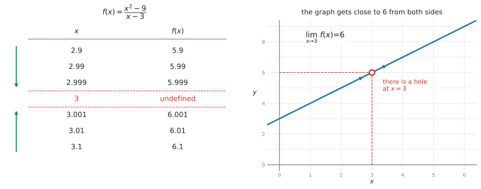
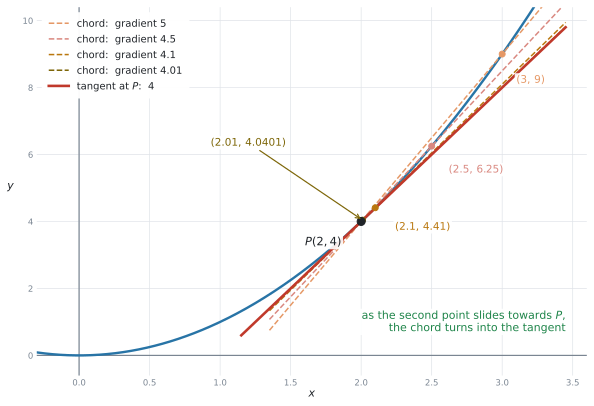
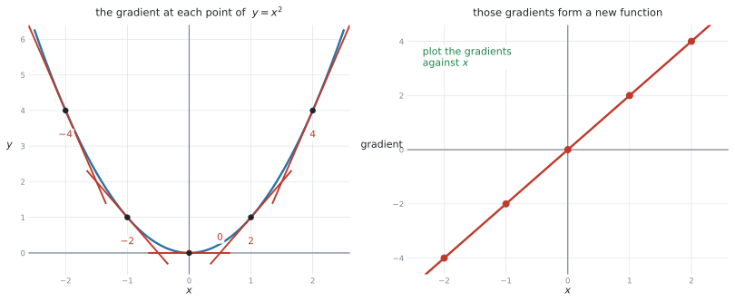
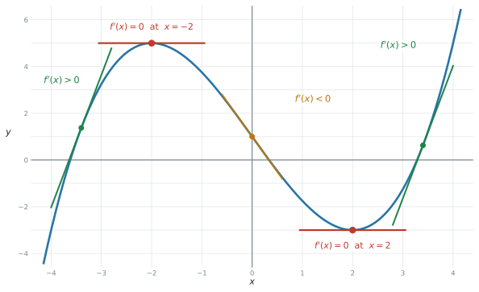
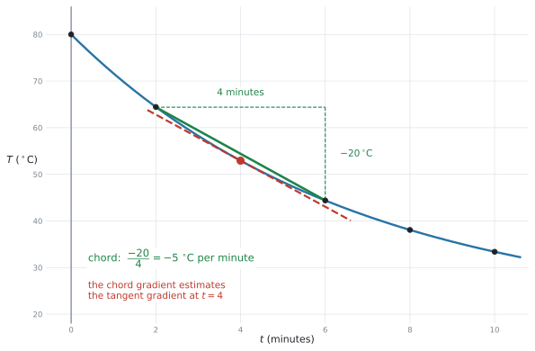
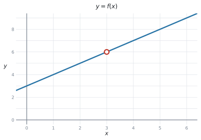
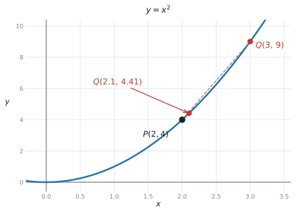
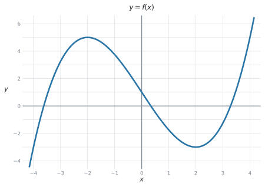

# SL 5.1 — Introduction to limits and the derivative（極限と導関数の考え方） {#sec-sl-5-1}

::: {.callout-note}
## What you should be able to do
- **limit**（極限）が何を表しているかが分かり、**表やグラフから極限の値を見積もれる**。
- 曲線の**接線の傾き**が、**弦の傾きの極限**として決まることが分かる。
- **derivative**（導関数）を、**傾きの関数**として読める。
- derivative を、**変化率**（rate of change）として読める。
- $\dfrac{dy}{dx}$、$f'(x)$、$\dfrac{dV}{dr}$、$\dfrac{ds}{dt}$ の**記号が読める**。
- derivative の**単位**を答えられる。
- 表から**変化率を見積もり**、その意味を英語で書ける。
- グラフを見て、$f'(x)$ が**正か・$0$ か・負か**を言える。
:::

::: {.callout-important}
## Formula booklet に、この項目の式はありません
公式集の Topic 5 の欄は **5.3、5.5、5.8 だけ**です。**5.1 の欄はありません。**

理由は単純で、**この項目には計算の公式が出てこない**からです。ここは**考え方と記号の項目**です。

微分の公式（$f(x) = ax^{n} \Rightarrow f'(x) = anx^{n-1}$）は、[SL 5.3](sl-5-3.qmd) で出てきます。**この項目では、まだ使いません。**
:::

::: {.callout-tip}
## シラバスが「やらなくてよい」と言っていること
Guidance 欄に、はっきり書かれています。

> **Not required:** Formal analytic methods of calculating limits.

つまり、**極限を式で計算する方法は、AI SL では要求されません。** 日本の数学IIIでやるような極限の計算は、出てきません。

代わりに指定されているのは、この1行です。

> **Estimation of the value of a limit from a table or graph.**

**表かグラフから見積もる。** それだけです。
:::

## The idea

[Topic 2](../02-functions/sl-2-5.qmd) や [Topic 4](../04-statistics-and-probability/sl-4-4.qmd) では、グラフや model を使って **$2$ つの量の関係**を調べました。ここからは、その関係が**ある瞬間にどれくらいの速さで変化しているか**を考えます。

この項目は、**微分（calculus）の入口**です。新しい計算は出てきませんが、**新しい見方**が3つ出てきます。

1. **limit**（極限） … 「近づいていく先」
2. **derivative**（導関数） … 「傾きの関数」
3. **rate of change**（変化率） … 「変化の速さ」

**この $3$ つは、別の概念です。** ただし、つながっています。**limit を使って接線の傾きを考え、その傾きを関数としてまとめたものが derivative** です。そして **derivative は、現実の場面では rate of change として解釈できます。** 順に見ていきます。

### 1. limit（極限）は「近づいていく先」です {#limit}

次の関数を考えます。

$$
f(x) = \frac{x^{2} - 9}{x - 3}
$$

$x = 3$ を入れると分母が $0$ になるので、**$f(3)$ は存在しません。** ですが、$x$ を $3$ に**近づけていく**と、$f(x)$ の値はどうなるでしょうか。

{#fig-sl51-limit width=100%}

左の表を見てください。$x$ を上からも下からも $3$ に近づけると、$f(x)$ は**どちらからも $6$ に近づいています。** これを、次のように書きます。

$$
\lim_{x \to 3} f(x) = 6
$$ {#eq-sl51-limit}

読み方は「**リミット、$x$ が $3$ に近づくときの $f(x)$**」です。$x \to 3$ は「$x$ が $3$ に**近づく**」という意味で、「$x$ が $3$ に**なる**」ではありません。

::: {.callout-important}
## $f(3)$ と $\lim\limits_{x \to 3} f(x)$ は別のものです
- $f(3)$ … $x$ が**ちょうど $3$** のときの値。この例では**存在しません**
- $\lim\limits_{x \to 3} f(x)$ … $x$ が $3$ に**近づいた先**の値。この例では **$6$**

グラフの $x = 3$ のところに**穴（hole）**があいているのが、この違いです。**穴はあいているのに、行き先は決まっています。**
:::

::: {.callout-tip}
## 表は「両側から」作ります
$x = 3.1, 3.01, 3.001$ だけでは足りません。**$x = 2.9, 2.99, 2.999$ の側も**書いてください。

両側から同じ値に近づいて、はじめて極限が決まります。試験でも、**表は両側ぶん与えられます。**
:::

### 2. 曲線の傾きは、弦の傾きの極限です {#chord}

直線の傾きは、[SL 2.1](../02-functions/sl-2-1.qmd) で習ったとおり「たての変化 $\div$ よこの変化」で出せます。**では、曲線の傾きはどうやって決めるのでしょうか。**

曲線は、場所によって傾きが違います。ですから「曲線の傾き」ではなく、**「曲線上のある点での傾き」**を考えます。

{#fig-sl51-chords width=80%}

$y = x^{2}$ の上の点 $P(2, 4)$ で考えます。$P$ ともう $1$ つの点を結んだ直線を **chord**（弦）といいます。弦の傾きなら、$2$ 点があるので計算できます。

| もう1つの点 | 弦の傾き |
|---|---|
| $(3, \ 9)$ | $\dfrac{9-4}{3-2} = 5$ |
| $(2.5, \ 6.25)$ | $\dfrac{6.25-4}{2.5-2} = 4.5$ |
| $(2.1, \ 4.41)$ | $\dfrac{4.41-4}{2.1-2} = 4.1$ |
| $(2.01, \ 4.0401)$ | $\dfrac{4.0401-4}{2.01-2} = 4.01$ |

: 弦の傾きが近づいていく先 {#tbl-sl51-chords}

もう $1$ つの点を $P$ に**近づけていく**と、弦の傾きは $5 \to 4.5 \to 4.1 \to 4.01 \to \cdots$ と、**$4$ に近づきます。**

このとき、弦は **tangent**（接線）に近づいていきます。だから、

> **$P$ での曲線の傾き** $=$ **接線の傾き** $=$ **弦の傾きの極限** $= 4$

::: {.callout-tip}
## 「その点だけ」では傾きは出せません
点が $1$ つしかないと、傾きの式 $\dfrac{y_{2}-y_{1}}{x_{2}-x_{1}}$ は $\dfrac{0}{0}$ になってしまいます。

そこで、**いったん $2$ 点で計算しておいて、あとから近づける**という手を使います。これが微分の出発点です。
:::

### 3. derivative は「傾きの関数」です {#gradient-function}

いまは $P(2,4)$ という $1$ 点で考えましたが、**曲線のどの点でも同じことができます。**

{#fig-sl51-gradfn width=100%}

$y = x^{2}$ でやってみると、こうなります。

| $x$ | $-2$ | $-1$ | $0$ | $1$ | $2$ |
|---|---|---|---|---|---|
| その点での傾き | $-4$ | $-2$ | $0$ | $2$ | $4$ |

: $y = x^2$ の各点での傾き {#tbl-sl51-gradfn}

$x$ を決めると、傾きが $1$ つ決まります。**これは関数です。** この新しい関数を、もとの関数の **derivative**（導関数）といいます。

@tbl-sl51-gradfn を見ると、傾きはいつも $x$ の $2$ 倍になっています。つまり $y = x^{2}$ の導関数は $2x$ です。

::: {.callout-note}
## この項目では、導関数を「求める」ことはしません
上の $2x$ は、表から見つけたものです。**公式で計算したわけではありません。**

$f(x) = ax^{n}$ から $f'(x)$ を出す公式は、[SL 5.3](sl-5-3.qmd) で習います。この項目では、**導関数とは何なのかを分かることが目的**です。
:::

#### 導関数（derivative）を記号で表す（その読み方） {#notation}

シラバスの Guidance 欄が、使われる記号を名指ししています。

> Forms of notation: $\dfrac{dy}{dx}$, $f'(x)$, $\dfrac{dV}{dr}$ or $\dfrac{ds}{dt}$ for the first derivative.

| 記号 | 読み方 | 意味 |
|---|---|---|
| $f'(x)$ | エフ・ダッシュ・エックス（英語では `f prime x`） | $f(x)$ の導関数 |
| $\dfrac{dy}{dx}$ | ディー・ワイ・ディー・エックス | $x$ が変わったときの $y$ の変化率 |
| $\dfrac{dV}{dr}$ | ディー・ブイ・ディー・アール | $r$ が変わったときの $V$ の変化率 |
| $\dfrac{ds}{dt}$ | ディー・エス・ディー・ティー | $t$ が変わったときの $s$ の変化率 |

: 導関数の記号 {#tbl-sl51-notation}

::: {.callout-important}
## $\dfrac{dy}{dx}$ は、$1$ つの記号として扱います
**AI SL では、ふつうの分数のように約分せず、全体を $1$ つの変化率の記号として扱います。**

**下が「何で割ったか」、上が「何が変わったか」**と読んでください。$\dfrac{dV}{dr}$ なら「$r$ が変わったときの $V$」です。
:::

### 4. derivative は「変化率」です {#rate}

AI で一番よく出るのは、導関数（derivative）を**傾きとしてではなく、変化率として読み解く**ことです。

$\dfrac{ds}{dt}$ で、$s$ が距離（m）、$t$ が時間（秒）だとします。すると $\dfrac{ds}{dt}$ は「**$1$ 秒あたり何 m 進むか**」、つまり**速さ**です。

#### 単位は、記号を見れば決まります {#units}

$\dfrac{ds}{dt}$ の単位は、$s$ の単位 $\div$ $t$ の単位です。**記号の形がそのまま単位の形になっています。**

| 記号 | $s$、$t$ などの単位 | 導関数の単位 | 意味 |
|---|---|---|---|
| $\dfrac{ds}{dt}$ | m、秒 | m/秒 | 速さ |
| $\dfrac{dT}{dt}$ | $^\circ$C、分 | $^\circ$C/分 | 温度の変わる速さ |
| $\dfrac{dV}{dr}$ | cm$^3$、cm | cm$^2$ | 半径を増やしたときの体積の増え方 |
| $\dfrac{dC}{dn}$ | ドル、個 | ドル/個 | $1$ 個増やしたときの費用の増え方 |
| $\dfrac{dP}{dt}$ | 人、年 | 人/年 | 人口の増える速さ |

: 導関数の単位 {#tbl-sl51-units}

::: {.callout-warning}
## 単位を聞かれたら、$\div$ を書くだけです
`State the units of dV/dr.` のような設問では、**$V$ の単位を $r$ の単位で割ります。**

$\dfrac{\text{cm}^{3}}{\text{cm}} = \text{cm}^{2}$ です。ここで止まらずに、$\text{cm}^2$ まで直してください。
:::

#### 符号と大きさの読み方 {#sign}

- $f'(x) > 0$ … 増えている（グラフは**右上がり**）
- $f'(x) = 0$ … その瞬間は増えも減りもしていない（グラフは**水平**）
- $f'(x) < 0$ … 減っている（グラフは**右下がり**）

{#fig-sl51-sign width=80%}

大きさも意味を持ちます。$\dfrac{dT}{dt} = -5$ と $\dfrac{dT}{dt} = -1$ なら、**前者のほうが速く冷えています。**

（この見方は、[SL 5.2](sl-5-2.qmd) でくわしく扱います。）

### 5. 表から変化率を見積もる {#estimate}

試験でよく出る形です。**関数の式は与えられず、表だけが与えられます。**

やり方は[2節](#chord)と同じで、**弦の傾きを計算します。**

$$
\text{変化率の見積もり} = \frac{y \text{ の変化}}{x \text{ の変化}}
$$ {#eq-sl51-estimate}

{#fig-sl51-rate width=78%}

::: {.callout-tip}
## 知りたい点を「はさむ」ように選んでください
$t = 4$ での変化率を知りたいとき、$t = 4$ と $t = 6$ の $2$ 点よりも、**$t = 2$ と $t = 6$ の $2$ 点**のほうが良い見積もりになります。

知りたい点が**まん中**に来るように選ぶ、と覚えてください。@fig-sl51-rate の緑の弦が、赤い接線とほぼ平行になっているのが分かります。
:::

::: {.callout-warning}
## これは「見積もり」です
弦の傾きは、接線の傾きと**ぴったり同じではありません。** ですから答えを書くときは、`estimate`（見積もり）だと分かる言い方にしてください。

`Estimate the rate of change` と聞かれているときは、それで正解です。**ぴったりの値を出そうとしなくて構いません。**
:::

## Why it works

:::: {.callout-note collapse="true" appearance="simple"}
## クリックすると開きます
なぜ「弦の傾きを近づける」というやり方で、接線の傾きが決まるのかを説明します。

曲線を、**どんどん拡大していく**ところを想像してください。

$y = x^{2}$ のグラフを、点 $(2,4)$ のまわりで拡大していくと、**だんだんまっすぐに見えてきます。** さらに拡大すると、目で見るかぎり直線と区別がつかなくなります。

その「まっすぐに見えている直線」が、**接線**です。

弦は、$2$ 点を結んだ直線です。$2$ 点が近づくほど、その $2$ 点のあいだの曲線は「まっすぐな部分」に近づきます。だから、**弦は接線に近づいていきます。**

これが、「傾き $=$ 弦の傾きの極限」の意味です。**極限という言葉が要るのは、$2$ 点をぴったり重ねてしまうと傾きが計算できなくなるから**です。重ねずに、いくらでも近づける。その行き先を見る、というのが極限の考え方です。
::::

## Worked examples

::: {.callout-note appearance="simple"}
問題文は英語です。意味が理解できなかったら、問題文の下の「**日本語訳**」を開いてください。解説は日本語です。
:::

::: {#exm-sl51-limit}
[The function $f$ is given by $f(x) = \dfrac{x^{2}-9}{x-3}$. The graph of $f$ is shown below.]{.q-en}

{#fig-sl51-q1 width=64%}

**(a)** [Explain why $f(3)$ does not exist.]{.q-en}

**(b)** [Complete the table below, giving each value correct to three decimal places.]{.q-en}

| $x$ | $2.9$ | $2.99$ | $2.999$ | $3.001$ | $3.01$ | $3.1$ |
|---|---|---|---|---|---|---|
| $f(x)$ | | | | | | |

**(c)** [Hence write down the value of $\displaystyle\lim_{x \to 3} f(x)$.]{.q-en}

<details class="jp-trans">
<summary>日本語訳</summary>

関数 $f$ が $f(x) = \dfrac{x^{2}-9}{x-3}$ で与えられています。

**(a)** $f(3)$ が存在しない理由を説明しなさい。

**(b)** 下の表を、それぞれ小数第3位まで求めて完成させなさい。

**(c)** これを使って、$\displaystyle\lim_{x \to 3} f(x)$ の値を書きなさい。

</details>

---

**(a)** `Explain why` なので、**理由を一文で書きます。**

$x = 3$ を入れると、分母が $3 - 3 = 0$ になります。**$0$ で割ることはできません。**

**(b)** $x$ の値を $1$ つずつ入れます（[GDCの使い方](#table)）。電卓に $\dfrac{x^{2}-9}{x-3}$ を打ち込んで、$x$ を変えていくだけです。

| $x$ | $2.9$ | $2.99$ | $2.999$ | $3.001$ | $3.01$ | $3.1$ |
|---|---|---|---|---|---|---|
| $f(x)$ | $5.900$ | $5.990$ | $5.999$ | $6.001$ | $6.010$ | $6.100$ |

**(c)** 表の値は、**左からも右からも $6$ に近づいています。**

$$
\lim_{x \to 3} f(x) = 6
$$

::: {.callout-tip}
## $f(3)$ がなくても、極限はあります
**(a)** で「存在しない」と答えたのに、**(c)** で $6$ と答える — 矛盾しているように見えるかもしれません。

ですが、[この $2$ つは別のもの](#limit)です。$x = 3$ **そのもの**では値がなく、$x = 3$ に**近づいた先**では $6$ です。

グラフでいえば、**穴があいているだけ**です。
:::

::: {.callout-note}
## 解答例（答案用紙にはこう書く）
**(a)** When $x = 3$ the denominator is $3 - 3 = 0$, and division by zero is not possible, so $f(3)$ does not exist.

**(b)** $5.900$, $5.990$, $5.999$, $6.001$, $6.010$, $6.100$

**(c)** $\displaystyle\lim_{x \to 3} f(x) = 6$
:::
:::

::: {#exm-sl51-chord}
[The point $P$ lies on the curve $y = x^{2}$ and has coordinates $(2, 4)$. The point $Q$ also lies on the curve.]{.q-en}

{#fig-sl51-q2 width=68%}

**(a)** [Find the gradient of the chord $PQ$ when $Q$ is the point $(3, 9)$.]{.q-en}

**(b)** [Find the gradient of the chord $PQ$ when $Q$ is the point $(2.1, 4.41)$.]{.q-en}

**(c)** [The table shows the gradient of $PQ$ for several positions of $Q$.]{.q-en}

| $x$-coordinate of $Q$ | $3$ | $2.5$ | $2.1$ | $2.01$ | $2.001$ |
|---|---|---|---|---|---|
| gradient of $PQ$ | $5$ | $4.5$ | $4.1$ | $4.01$ | $4.001$ |

[Write down the gradient of the curve at $P$.]{.q-en}

<details class="jp-trans">
<summary>日本語訳</summary>

点 $P$ は曲線 $y = x^{2}$ 上にあり、座標は $(2,4)$ です。点 $Q$ もこの曲線上にあります。

**(a)** $Q$ が点 $(3, 9)$ のときの、弦 $PQ$ の傾きを求めなさい。

**(b)** $Q$ が点 $(2.1, 4.41)$ のときの、弦 $PQ$ の傾きを求めなさい。

**(c)** 表は、$Q$ をいくつかの位置に取ったときの $PQ$ の傾きです。見出しの $x$-coordinate of $Q$ は「$Q$ の $x$ 座標」です。$P$における曲線の傾きを書きなさい。

</details>

---

**(a)(b)** 弦は $2$ 点を結んだ**直線**なので、[SL 2.1](../02-functions/sl-2-1.qmd) の傾きの式が使えます。

$$
\text{(a)} \quad m = \frac{9 - 4}{3 - 2} = \frac{5}{1} = 5
$$

$$
\text{(b)} \quad m = \frac{4.41 - 4}{2.1 - 2} = \frac{0.41}{0.1} = 4.1
$$

**(c)** 表の傾きは $5 \to 4.5 \to 4.1 \to 4.01 \to 4.001$ と、**$4$ に近づいています。**

$Q$ が $P$ に近づくと弦は[接線に近づく](#chord)ので、$P$ での曲線の傾きは **$4$** です。

::: {.callout-warning}
## $2.001$ の行を見て「$4.001$ が答え」としないでください
表の**最後の値**が答えではありません。答えは、**その先にある行き先**です。

$5, 4.5, 4.1, 4.01, 4.001, \ldots$ と続いていったら、どこに着くか — それが $4$ です。
:::

::: {.callout-note}
## 解答例（答案用紙にはこう書く）
**(a)** $m = \dfrac{9-4}{3-2} = 5$

**(b)** $m = \dfrac{4.41-4}{2.1-2} = 4.1$

**(c)** The gradient of the curve at $P$ is $4$.
:::
:::

::: {#exm-sl51-notation}
[**(a)** A sphere has volume $V$ cm$^3$ and radius $r$ cm. Write down what $\dfrac{dV}{dr}$ represents, and state its units.]{.q-en}

[**(b)** A car has travelled $s$ metres after $t$ seconds. When $t = 10$, $\dfrac{ds}{dt} = 18$. Interpret this value in the context of the question.]{.q-en}

<details class="jp-trans">
<summary>日本語訳</summary>

**(a)** 球の体積が $V$ cm$^3$、半径が $r$ cm です。$\dfrac{dV}{dr}$ が何を表すかを書き、その単位を答えなさい。

**(b)** 車は $t$ 秒後に $s$ m 進んでいます。$t = 10$ のとき $\dfrac{ds}{dt} = 18$ です。この値を問題の文脈で解釈しなさい。

</details>

---

**(a)** [記号の下が「何で割ったか」、上が「何が変わったか」](#notation)です。$\dfrac{dV}{dr}$ は、**半径が変わったときの体積の変化率**です。

単位は $V$ の単位を $r$ の単位で割ります。

$$
\frac{\text{cm}^{3}}{\text{cm}} = \text{cm}^{2}
$$

::: {.model-answer}
**試験ではこう書く**

*$\dfrac{dV}{dr}$ is the rate of change of the volume with respect to the radius. The units are cm$^2$.*
:::

**(b)** `Interpret` なので、**数値をそのまま言いかえるのではなく、場面の言葉で書きます。**

$\dfrac{ds}{dt}$ は距離を時間で割ったものなので、**速さ**です。単位は m/秒です。

::: {.model-answer}
**試験ではこう書く**

*After $10$ seconds, the car is travelling at $18$ metres per second.*
:::

（$10$ 秒後、車は毎秒 $18$ m の速さで走っています。）

::: {.callout-important}
## `Interpret` の答えには、必ず $3$ つを入れてください
1. **いつ**（$t = 10$ のとき、$10$ 秒後に）
2. **何が**（車の進む速さが）
3. **どれだけ**（$18$ m/秒）

「$18$ です」だけでは点になりません。**$3$ つそろって $1$ 文**です。
:::

::: {.callout-note}
## 解答例（答案用紙にはこう書く）
**(a)** *$\dfrac{dV}{dr}$ is the rate of change of the volume with respect to the radius.*

Units: cm$^2$

**(b)** *After $10$ seconds, the car is travelling at $18$ metres per second.*
:::
:::

::: {#exm-sl51-sign}
[The diagram shows the graph of a function $f$.]{.q-en}

{#fig-sl51-q4 width=68%}

**(a)** [Write down the two values of $x$ for which $f'(x) = 0$.]{.q-en}

**(b)** [State whether $f'(0)$ is positive or negative, giving a reason.]{.q-en}

**(c)** [State whether $f'(3)$ is positive or negative, giving a reason.]{.q-en}

<details class="jp-trans">
<summary>日本語訳</summary>

図は関数 $f$ のグラフです。

**(a)** $f'(x) = 0$ となる $x$ の値を $2$ つ書きなさい。

**(b)** $f'(0)$ が正か負かを、理由を付けて書きなさい。

**(c)** $f'(3)$ が正か負かを、理由を付けて書きなさい。

</details>

---

同じ形のグラフが @fig-sl51-sign にもあります。そちらには、**答えの見方が書き込んであります。**

**(a)** $f'(x) = 0$ は、**接線が水平になっている**ところです。@fig-sl51-q4 では、山のてっぺんと谷の底の $2$ か所で、$x$ の値は **$-2$ と $2$** です。目盛りの上にちょうど乗っているので、読み取るだけで済みます。

**(b)** $x = 0$ のあたりで、グラフは**右下がり**です。

::: {.model-answer}
**試験ではこう書く**

*Negative, because the graph is decreasing at $x = 0$.*
:::

**(c)** $x = 3$ のあたりでは、グラフは**右上がり**です。

::: {.model-answer}
**試験ではこう書く**

*Positive, because the graph is increasing at $x = 3$.*
:::

::: {.callout-tip}
## `giving a reason` は「増えているか減っているか」で足ります
むずかしい理由は要りません。**`increasing` か `decreasing` のどちらかを書けば十分**です。

`the gradient of the tangent is negative` でも構いません。
:::

::: {.callout-note}
## 解答例（答案用紙にはこう書く）
**(a)** $x = -2$ and $x = 2$

**(b)** *Negative, because the graph is decreasing at $x = 0$.*

**(c)** *Positive, because the graph is increasing at $x = 3$.*
:::
:::

::: {#exm-sl51-rate}
[A cup of coffee is left to cool. Its temperature $T\ ^\circ$C is measured every two minutes, where $t$ is the time in minutes.]{.q-en}

| $t$ (minutes) | $0$ | $2$ | $4$ | $6$ | $8$ | $10$ |
|---|---|---|---|---|---|---|
| $T$ ($^\circ$C) | $80.0$ | $64.4$ | $52.9$ | $44.4$ | $38.1$ | $33.4$ |

**(a)** [Use the values at $t = 2$ and $t = 6$ to estimate $\dfrac{dT}{dt}$ when $t = 4$.]{.q-en}

**(b)** [State the units of $\dfrac{dT}{dt}$.]{.q-en}

**(c)** [Interpret your answer to part (a) in the context of the question.]{.q-en}

**(d)** [Explain why your answer to part (a) is only an estimate.]{.q-en}

<details class="jp-trans">
<summary>日本語訳</summary>

コーヒーを放置して冷まします。温度 $T\ ^\circ$C を $2$ 分ごとに測ります。$t$ は分単位の時間です。

**(a)** $t = 2$ と $t = 6$ の値を使って、$t = 4$ のときの $\dfrac{dT}{dt}$ を見積もりなさい。

**(b)** $\dfrac{dT}{dt}$ の単位を書きなさい。

**(c)** (a) の答えを、問題の文脈で解釈しなさい。

**(d)** (a) の答えが見積もりにすぎない理由を説明しなさい。

</details>

---

**(a)** [弦の傾きを計算します](#estimate)。@fig-sl51-rate が、この問題の表をグラフにしたものです。$t = 2$ のとき $T = 64.4$、$t = 6$ のとき $T = 44.4$ です。

$$
\frac{dT}{dt} \approx \frac{44.4 - 64.4}{6 - 2} = \frac{-20}{4} = -5
$$

**答えは $-5$ です。** マイナスを落とさないでください。冷めているので、温度は**減っています。**

**(b)** $T$ の単位 $\div$ $t$ の単位なので、**$^\circ$C per minute**（$^\circ$C/分）です。

**(c)** `Interpret` なので、場面の言葉で書きます。

::: {.model-answer}
**試験ではこう書く**

*After $4$ minutes, the temperature of the coffee is falling at about $5\ ^\circ$C per minute.*
:::

（$4$ 分後、コーヒーの温度は $1$ 分あたり約 $5\ ^\circ$C の速さで下がっています。）

**(d)**

::: {.model-answer}
**試験ではこう書く**

*The calculation gives the gradient of the chord between $t = 2$ and $t = 6$, not the gradient of the tangent at $t = 4$. The two are close but not equal.*
:::

（この計算は $t = 2$ から $t = 6$ までの弦の傾きであって、$t = 4$ での接線の傾きではありません。$2$ つは近いですが、等しくはありません。）

::: {.callout-important}
## (c) で `falling` や `decreasing` を落とさないでください
「$-5\ ^\circ$C per minute です」とだけ書くと、**マイナスの意味を説明していません。**

英語では、次のどちらかの形にします。

- *falling at $5\ ^\circ$C per minute*（$5$ の速さで下がっている）
- *changing at $-5\ ^\circ$C per minute*（$-5$ の割合で変化している）

**`falling` と書いたら、数はプラスの $5$ にします。** 両方マイナスにすると、二重否定になってしまいます。
:::

::: {.callout-note}
## 解答例（答案用紙にはこう書く）
**(a)** $\dfrac{dT}{dt} \approx \dfrac{44.4 - 64.4}{6 - 2} = -5$

**(b)** $^\circ$C per minute

**(c)** *After $4$ minutes, the temperature of the coffee is falling at about $5\ ^\circ$C per minute.*

**(d)** *The calculation gives the gradient of the chord between $t = 2$ and $t = 6$, not the gradient of the tangent at $t = 4$. The two are close but not equal.*
:::
:::

## Common errors

::: {.callout-warning}
## $\lim\limits_{x \to a} f(x)$ を $f(a)$ だと思う
「$x$ が $a$ に**近づく**」と「$x$ が $a$ に**なる**」は違います。

$f(a)$ が存在しなくても、極限は存在することがあります。**むしろ、そういう場面でこそ極限を使います。**

表を作ったとき、$x = a$ の行は空欄（または `undefined`）になります。**それでも上下の行から行き先は読めます。**
:::

::: {.callout-warning}
## 表の最後の値を、極限の答えにする
$5, 4.5, 4.1, 4.01, 4.001$ を見て「$4.001$」と書いてしまう誤りです。

**答えは、その先にある行き先**です。$4$ です。

見分け方は、**近づいていく先がきれいな数になっているか**です。$4.001$ のような数が答えになることは、まずありません。
:::

::: {.callout-warning}
## $\dfrac{dy}{dx}$ を、ふつうの分数として約分する
AI SL では、$dy$ と $dx$ に分けたり約分したりはしません。**全体で $1$ つの変化率の記号**として扱います。

$\dfrac{dV}{dr}$ の $d$ を約分して $\dfrac{V}{r}$ にする、という誤りを見ることがあります。**まったく別のもの**です。
:::

::: {.callout-warning}
## 変化率の答えで、マイナスを落とす
減っている場面では、導関数は**負**になります。$\dfrac{44.4 - 64.4}{4}$ の分子は $-20$ です。

引き算の順番にも気をつけてください。**あとの値 $-$ 前の値**です。$\dfrac{64.4 - 44.4}{4} = +5$ としてしまうと、符号が逆になります。
:::

::: {.callout-warning}
## `Interpret` の答えに、単位や文脈を書かない
「$-5$ です」では点になりません。**いつ・何が・どれだけ**の $3$ つが要ります。

*After $4$ minutes, the temperature is falling at about $5\ ^\circ$C per minute.*

この形を、そのまま覚えてしまうのが早いです。
:::

::: {.callout-warning}
## 単位を、もとの量の単位のまま書く
$\dfrac{dV}{dr}$ の単位を cm$^3$ と書いてしまう誤りです。

**割り算をしてください。** $\dfrac{\text{cm}^{3}}{\text{cm}} = \text{cm}^{2}$ です。

$\dfrac{ds}{dt}$ なら m ではなく **m/秒**、$\dfrac{dC}{dn}$ ならドルではなく **ドル/個**です。
:::

::: {.callout-warning}
## 弦の傾きを、片側だけで取る
$t = 4$ での変化率を、$t = 4$ と $t = 6$ だけで出すと、少しずれます。

**知りたい点をはさむように選んでください。** $t = 2$ と $t = 6$ のほうが良い見積もりになります。

ただし、**問題文がどの $2$ 点を使うか指定していたら、それに従ってください。**
:::

::: {.callout-warning}
## この項目で、微分の公式を使ってしまう
$y = x^{2}$ だから $\dfrac{dy}{dx} = 2x$、と書きたくなるかもしれません。

**SL 5.1 の問題では、それは求められていません。** 表やグラフから読み取るように指示されています。

指示が `Use the table` や `From the graph` なら、**そのとおりにしてください。** 公式で出した答えは、指示に従っていないぶん点を落とします。
:::

## Using your GDC (TI-Nspire CX II)

この項目では、電卓は**表を作る道具**として使います。

### 1. 関数を入れて、表を出す {#table}

Graphs ページで $f1(x)$ に式を入れてから、表に切り替えます。

```
ctrl + T
```

これで画面が**グラフと表の2分割**になります。

{#fig-sl51-gdctable width=100%}

**表は、はじめから埋まった状態で出てきます。** 空の表が出て自分で打ち込む、のではありません。$x$ は $0$、$1$、$2$、$3$、$4$ … と $1$ きざみで、$f(x)$ の値もすでに計算されています。

**$x = 3$ の行を見てください。** $f(x)$ のところが `undef`（undefined）になっています。これが、例題1 の **(a)** で答える「$f(3)$ は存在しない」です。**電卓も同じことを言っています。**

#### $x$ を自分で決めたいときは {#table-ask}

極限の表は $2.9$、$2.99$、$2.999$ と**刻みが等間隔ではありません。** 出てきたままの表では作れないので、**設定を変えます。**

```
menu → Table → Edit Table Settings
```

`Independent` を **`Ask`** にすると、$x$ の列が**空**になります。あとは $2.9$、$2.99$、$2.999$ … と $1$ つずつ打ち込めば、右の列に $f(x)$ が出ます。@fig-sl51-limit の表が、そのまま画面にできあがります。

::: {.callout-tip}
## 等間隔でよいときは、`Auto` のまま刻みを変えます
同じ画面の `Table Start` に始まりの値、`Table Step` に刻み幅を入れます。

$2.9$ から $0.01$ きざみ、のような表ならこちらが速いです。**$0.1 \to 0.01 \to 0.001$ と刻みを変えていく**極限の表は、`Ask` のほうが確実です。
:::

### 2. グラフを拡大して、まっすぐになるのを見る

[Why it works](#why-it-works) で書いた「拡大するとまっすぐに見える」は、電卓で確かめられます。

Graphs ページで $y = x^{2}$ をかいて、点 $(2,4)$ のあたりを何度も拡大してください。

```
menu → Window/Zoom → Zoom - In
```

**曲線が直線に見えてきます。** これが接線です。

### 3. 弦の傾きは、計算ページで1行

$\dfrac{4.41 - 4}{2.1 - 2}$ のような計算は、分数のテンプレート（ctrl + $\div$）に入れて $1$ 行で出します。

**$0.41$ や $0.1$ を先に書き出して打ち直さない**でください。

### 4. ある点での傾きを、直接出す機能もあります {#nderiv}

参考までに、TI-Nspire には**ある点での導関数の値**を出す機能があります。

```
menu → 4: Calculus → 1: Numerical Derivative at a Point
```

$y = x^{2}$ で $x = 2$ を指定すると、$4$ と返ります。

::: {.callout-warning}
## SL 5.1 の問題では、これを答えにしないでください
この項目の設問は、`Use the table` や `From the graph` と指定してきます。**電卓が出した $4$ をいきなり書くと、指示に従っていないことになります。**

この機能が主役になるのは、[SL 5.4](sl-5-4.qmd) や [SL 5.6](sl-5-6.qmd) です。ここでは、**自分の答えが合っているかの確認**に使ってください。
:::

## Exercises

::: {.callout-note appearance="simple"}
各問題に、折りたたみが3つ付いています。**日本語訳**、**解答例**（答案用紙に書くべきこと。英語です）、**解説**（なぜそうなるか。日本語です）。

まず自分で解いて、次に解答例と見くらべてください。**解説は、合わなかったときだけ開けば十分です。**
:::

::: {.exercise-block}

[1]{.ex-no} [The function $f$ is given by $f(x) = \dfrac{x^{2}-4}{x-2}$. The table shows some values of $f(x)$.]{.q-en}

| $x$ | $1.9$ | $1.99$ | $2.01$ | $2.1$ |
|---|---|---|---|---|
| $f(x)$ | $3.9$ | $3.99$ | $4.01$ | $4.1$ |

**(a)** [Explain why $f(2)$ does not exist.]{.q-en}

**(b)** [Write down the value of $\displaystyle\lim_{x \to 2} f(x)$.]{.q-en}

<details class="jp-trans">
<summary>日本語訳</summary>

関数 $f$ が $f(x) = \dfrac{x^{2}-4}{x-2}$ で与えられています。表は $f(x)$ のいくつかの値です。

**(a)** $f(2)$ が存在しない理由を説明しなさい。

**(b)** $\displaystyle\lim_{x \to 2} f(x)$ の値を書きなさい。

</details>

::: {.callout-note collapse="true"}
## 解答例（答案用紙に書くこと）
**(a)** *When $x = 2$ the denominator is $2 - 2 = 0$, and division by zero is not possible, so $f(2)$ does not exist.*

**(b)** $\displaystyle\lim_{x \to 2} f(x) = 4$
:::

::: {.callout-tip collapse="true"}
## 解説
**(b)** は表の**両側**を見ます。左からは $3.9 \to 3.99$、右からは $4.01 \to 4.1$。どちらも **$4$** に近づいています。

$4.01$ や $3.99$ と書かないでください。[答えは行き先](#limit)です。
:::

::: {.ex-sep}
:::

[2]{.ex-no} [The point $P(3, 9)$ lies on the curve $y = x^{2}$.]{.q-en}

**(a)** [Find the gradient of the chord joining $P$ to the point $(4, 16)$.]{.q-en}

**(b)** [Find the gradient of the chord joining $P$ to the point $(3.1, 9.61)$.]{.q-en}

**(c)** [The gradients of the chords from $P$ are $7$, $6.5$, $6.1$, $6.01$, $6.001$. Write down the gradient of the curve at $P$.]{.q-en}

<details class="jp-trans">
<summary>日本語訳</summary>

点 $P(3,9)$ は曲線 $y = x^{2}$ 上にあります。

**(a)** $P$ と点 $(4,16)$ を結ぶ弦の傾きを求めなさい。

**(b)** $P$ と点 $(3.1, 9.61)$ を結ぶ弦の傾きを求めなさい。

**(c)** $P$ からの弦の傾きは $7$、$6.5$、$6.1$、$6.01$、$6.001$ です。$P$ における曲線の傾きを書きなさい。

</details>

::: {.callout-note collapse="true"}
## 解答例（答案用紙に書くこと）
**(a)** $m = \dfrac{16-9}{4-3} = 7$

**(b)** $m = \dfrac{9.61-9}{3.1-3} = \dfrac{0.61}{0.1} = 6.1$

**(c)** The gradient of the curve at $P$ is $6$.
:::

::: {.callout-tip collapse="true"}
## 解説
**(b)** で $\dfrac{0.61}{0.1}$ を「$0.61$ を $0.1$ で割る」と見てください。$6.1$ です。$0.061$ としないよう気をつけてください。

**(c)** $7, 6.5, 6.1, 6.01, 6.001, \ldots$ の行き先は **$6$** です。

（[SL 5.3](sl-5-3.qmd) で公式を習うと、$y=x^2$ の傾きは $2x$ で、$x=3$ なら $6$ だと $1$ 行で出せるようになります。）
:::

::: {.ex-sep}
:::

[3]{.ex-no} [The cost of making $n$ chairs is $C$ dollars.]{.q-en}

**(a)** [Write down what $\dfrac{dC}{dn}$ represents.]{.q-en}

**(b)** [State the units of $\dfrac{dC}{dn}$.]{.q-en}

<details class="jp-trans">
<summary>日本語訳</summary>

$n$ 脚のいすを作る費用が $C$ ドルです。

**(a)** $\dfrac{dC}{dn}$ が何を表すかを書きなさい。

**(b)** $\dfrac{dC}{dn}$ の単位を書きなさい。

</details>

::: {.callout-note collapse="true"}
## 解答例（答案用紙に書くこと）
**(a)** *$\dfrac{dC}{dn}$ is the rate of change of the cost with respect to the number of chairs.*

**(b)** dollars per chair
:::

::: {.callout-tip collapse="true"}
## 解説
[記号の読み方](#notation)のとおりです。「**$n$ が変わったときの $C$**」です。

意味としては「**いすを $1$ 脚多く作ると、費用がいくら増えるか**」です。この言い方でも点になります。

単位は $\dfrac{\text{dollars}}{\text{chairs}}$ なので **dollars per chair** です。dollars だけでは足りません。
:::

::: {.ex-sep}
:::

[4]{.ex-no} [For each of the following, write down the units of the derivative.]{.q-en}

**(a)** [$\dfrac{ds}{dt}$, where $s$ is in kilometres and $t$ is in hours.]{.q-en}

**(b)** [$\dfrac{dA}{dr}$, where $A$ is in cm$^2$ and $r$ is in cm.]{.q-en}

**(c)** [$\dfrac{dP}{dt}$, where $P$ is a number of people and $t$ is in years.]{.q-en}

**(d)** [$\dfrac{dV}{dt}$, where $V$ is in litres and $t$ is in minutes.]{.q-en}

<details class="jp-trans">
<summary>日本語訳</summary>

次のそれぞれについて、導関数の単位を書きなさい。

**(a)** $\dfrac{ds}{dt}$。$s$ は km、$t$ は時間。

**(b)** $\dfrac{dA}{dr}$。$A$ は cm$^2$、$r$ は cm。

**(c)** $\dfrac{dP}{dt}$。$P$ は人数、$t$ は年。

**(d)** $\dfrac{dV}{dt}$。$V$ はリットル、$t$ は分。

</details>

::: {.callout-note collapse="true"}
## 解答例（答案用紙に書くこと）
**(a)** km per hour

**(b)** cm

**(c)** people per year

**(d)** litres per minute
:::

::: {.callout-tip collapse="true"}
## 解説
どれも「**上の単位 $\div$ 下の単位**」です。

**(b)** だけ注意してください。$\dfrac{\text{cm}^{2}}{\text{cm}} = \text{cm}$ です。**cm$^2$ per cm** と書いても間違いではありませんが、**cm** まで直すほうが良い答えです。

**(a)** は速さ、**(c)** は人口の増える速さ、**(d)** は水の入る速さです。
:::

::: {.ex-sep}
:::

[5]{.ex-no} [The number of bacteria in a dish, in thousands, is $N$ after $t$ hours.]{.q-en}

| $t$ (hours) | $0$ | $1$ | $2$ | $3$ | $4$ | $5$ |
|---|---|---|---|---|---|---|
| $N$ (thousands) | $5.0$ | $8.0$ | $12.8$ | $20.5$ | $32.8$ | $52.4$ |

**(a)** [Use the values at $t = 2$ and $t = 4$ to estimate $\dfrac{dN}{dt}$ when $t = 3$.]{.q-en}

**(b)** [State the units of $\dfrac{dN}{dt}$.]{.q-en}

**(c)** [Interpret your answer to part (a) in the context of the question.]{.q-en}

<details class="jp-trans">
<summary>日本語訳</summary>

皿の中の細菌の数は、$t$ 時間後に $N$ 千個です。見出しの $N$ (thousands) は「$N$（千個単位）」です。

**(a)** $t = 2$ と $t = 4$ の値を使って、$t = 3$ のときの $\dfrac{dN}{dt}$ を見積もりなさい。

**(b)** $\dfrac{dN}{dt}$ の単位を書きなさい。

**(c)** (a) の答えを、問題の文脈で解釈しなさい。

</details>

::: {.callout-note collapse="true"}
## 解答例（答案用紙に書くこと）
**(a)** $\dfrac{dN}{dt} \approx \dfrac{32.8 - 12.8}{4 - 2} = \dfrac{20}{2} = 10$

**(b)** thousands of bacteria per hour

**(c)** *After $3$ hours, the number of bacteria is increasing at about $10\,000$ per hour.*
:::

::: {.callout-tip collapse="true"}
## 解説
**(a)** 知りたいのは $t=3$ で、使うのは $t=2$ と $t=4$。[知りたい点をはさんでいます](#estimate) ✓

**(b)** $N$ が「千個」単位であることに注意してください。単なる `per hour` では足りません。

**(c)** $10$ 千個 $= 10\,000$ 個です。**単位を直して書くほうが、意味が伝わります。**

今回は増えているので、答えは**正**です。`increasing` を入れてください。
:::

::: {.ex-sep}
:::

[6]{.ex-no} [The graph of a function $f$ is shown below.]{.q-en}

{#fig-sl51-ex6 width=68%}

**(a)** [State whether $f'(-3)$ is positive or negative, giving a reason.]{.q-en}

**(b)** [State whether $f'(1)$ is positive or negative, giving a reason.]{.q-en}

<details class="jp-trans">
<summary>日本語訳</summary>

関数 $f$ のグラフが上に示されています。

**(a)** $f'(-3)$ が正か負かを、理由を付けて書きなさい。

**(b)** $f'(1)$ が正か負かを、理由を付けて書きなさい。

</details>

::: {.callout-note collapse="true"}
## 解答例（答案用紙に書くこと）
**(a)** *Positive, because the graph is increasing at $x = -3$.*

**(b)** *Negative, because the graph is decreasing at $x = 1$.*
:::

::: {.callout-tip collapse="true"}
## 解説
[グラフの向きを見るだけ](#sign)です。

- **右上がり** → $f'(x) > 0$
- **右下がり** → $f'(x) < 0$

$x = -3$ は左のはしのほうで、グラフは急に上がっています。$x = 1$ は真ん中より右で、まだ下がっている途中です（$x = 2$ で底になります）。

`giving a reason` なので、**`increasing` / `decreasing` の一言**を必ず添えてください。
:::

::: {.ex-sep}
:::

[7]{.ex-no} [A tank is being emptied. The volume of water in the tank is $V$ litres after $t$ minutes. When $t = 8$, $\dfrac{dV}{dt} = -12$.]{.q-en}

**(a)** [Interpret this value in the context of the question.]{.q-en}

**(b)** [Explain what it would mean if $\dfrac{dV}{dt}$ were equal to $0$.]{.q-en}

<details class="jp-trans">
<summary>日本語訳</summary>

タンクの水を抜いています。タンクの中の水の量は $t$ 分後に $V$ リットルです。$t = 8$ のとき $\dfrac{dV}{dt} = -12$ です。

**(a)** この値を、問題の文脈で解釈しなさい。

**(b)** $\dfrac{dV}{dt}$ が $0$ に等しいとしたら、それが何を意味するかを説明しなさい。

</details>

::: {.callout-note collapse="true"}
## 解答例（答案用紙に書くこと）
**(a)** *After $8$ minutes, the volume of water in the tank is decreasing at $12$ litres per minute.*

**(b)** *The volume of water would not be changing at that moment, so no water would be entering or leaving the tank.*
:::

::: {.callout-tip collapse="true"}
## 解説
**(a)** は[3つ](#rate)そろえます。**いつ**（after $8$ minutes）、**何が**（the volume of water）、**どれだけ**（$12$ litres per minute）。

`decreasing at $12$` と書いたら、数はプラスの $12$ にします。**`decreasing at $-12$` とは書きません。**

**(b)** $f'(x) = 0$ は「増えも減りもしていない」ということです。タンクの場面では「水の量が変わっていない」となります。
:::

::: {.ex-sep}
:::

[8]{.ex-no} [The function $f$ is given by $f(x) = \dfrac{x^{3}-1}{x-1}$. The table shows some values of $f(x)$.]{.q-en}

| $x$ | $0.9$ | $0.99$ | $1.01$ | $1.1$ |
|---|---|---|---|---|
| $f(x)$ | $2.71$ | $2.9701$ | $3.0301$ | $3.31$ |

[Write down the value of $\displaystyle\lim_{x \to 1} f(x)$.]{.q-en}

<details class="jp-trans">
<summary>日本語訳</summary>

関数 $f$ が $f(x) = \dfrac{x^{3}-1}{x-1}$ で与えられています。表は $f(x)$ のいくつかの値です。$\displaystyle\lim_{x \to 1} f(x)$ の値を書きなさい。

</details>

::: {.callout-note collapse="true"}
## 解答例（答案用紙に書くこと）
$\displaystyle\lim_{x \to 1} f(x) = 3$
:::

::: {.callout-tip collapse="true"}
## 解説
左からは $2.71 \to 2.9701$、右からは $3.0301 \to 3.31$。**どちらも $3$ に近づいています。**

$2.9701$ や $3.0301$ は、$3$ にとても近い数です。**その先の行き先**が答えです。

$x = 1$ では分母が $0$ になるので、$f(1)$ は存在しません。**それでも極限は $3$ です。**
:::

::: {.ex-sep}
:::

[9]{.ex-no} [The point $P(1, 1)$ lies on the curve $y = x^{3}$. The table shows the gradient of the chord from $P$ to a nearby point.]{.q-en}

| $x$-coordinate of the other point | $2$ | $1.5$ | $1.1$ | $1.01$ | $1.001$ |
|---|---|---|---|---|---|
| gradient of the chord | $7$ | $4.75$ | $3.31$ | $3.0301$ | $3.003001$ |

**(a)** [Write down the gradient of the curve at $P$.]{.q-en}

**(b)** [Explain why the gradient of the chord is never exactly equal to the gradient of the curve at $P$.]{.q-en}

<details class="jp-trans">
<summary>日本語訳</summary>

点 $P(1,1)$ は曲線 $y = x^{3}$ 上にあります。表は、$P$ から近くの点への弦の傾きです。

**(a)** $P$ における曲線の傾きを書きなさい。

**(b)** 弦の傾きが $P$ における曲線の傾きとちょうど等しくなることはない理由を説明しなさい。

</details>

::: {.callout-note collapse="true"}
## 解答例（答案用紙に書くこと）
**(a)** The gradient of the curve at $P$ is $3$.

**(b)** *A chord needs two different points on the curve. As the second point gets closer to $P$ the gradient gets closer to $3$, but the two points can never be the same point, so the gradient is never exactly $3$.*
:::

::: {.callout-tip collapse="true"}
## 解説
**(a)** $7, 4.75, 3.31, 3.0301, 3.003001, \ldots$ の行き先は **$3$** です。

**(b)** が、この項目の中心にある考え方です。**$2$ 点を重ねてしまうと、傾きの式が $\dfrac{0}{0}$ になって計算できません。** だから重ねずに、いくらでも近づける。その行き先を見る — それが極限です。

「どこまでも近づくが、届かない」という言い方ができていれば十分です。
:::

::: {.ex-sep}
:::

[10]{.ex-no} [A ball rolls down a slope. The distance travelled is $s$ metres after $t$ seconds.]{.q-en}

| $t$ (seconds) | $0$ | $2$ | $4$ | $6$ | $8$ |
|---|---|---|---|---|---|
| $s$ (metres) | $0$ | $6$ | $16$ | $30$ | $48$ |

**(a)** [Use the values at $t = 2$ and $t = 6$ to estimate the speed of the ball when $t = 4$.]{.q-en}

**(b)** [Find the gradient of the chord between $t = 4$ and $t = 6$.]{.q-en}

**(c)** [Explain which of your two answers is likely to be the better estimate of the speed at $t = 4$.]{.q-en}

<details class="jp-trans">
<summary>日本語訳</summary>

ボールが斜面を転がります。進んだ距離は $t$ 秒後に $s$ m です。

**(a)** $t = 2$ と $t = 6$ の値を使って、$t = 4$ のときのボールの速さを見積もりなさい。

**(b)** $t = 4$ と $t = 6$ のあいだの弦の傾きを求めなさい。

**(c)** $2$ つの答えのうち、$t = 4$ での速さの見積もりとしてどちらが良いと考えられるかを説明しなさい。

</details>

::: {.callout-note collapse="true"}
## 解答例（答案用紙に書くこと）
**(a)** $\dfrac{ds}{dt} \approx \dfrac{30 - 6}{6 - 2} = \dfrac{24}{4} = 6$ m s$^{-1}$

**(b)** $\dfrac{30 - 16}{6 - 4} = \dfrac{14}{2} = 7$ m s$^{-1}$

**(c)** *The answer to part (a) is better, because $t = 4$ is in the middle of the interval from $t = 2$ to $t = 6$. In part (b) the interval only lies on one side of $t = 4$.*
:::

::: {.callout-tip collapse="true"}
## 解説
**(a)** と **(b)** で答えが違います（$6$ と $7$）。**どちらも「見積もり」なので、違っていて構いません。**

**(c)** が問いたいのは、[知りたい点をはさんでいるかどうか](#estimate)です。

- **(a)** … $t=2$ と $t=6$ で、$t=4$ を**まん中にはさんでいます**
- **(b)** … $t=4$ と $t=6$ で、$t=4$ が**はしにあります**

はさんだほうが、行きすぎと足りなさが打ち消し合うので、良い見積もりになります。

**検算**：$t=2$ から $t=4$ の弦は $\dfrac{16-6}{2} = 5$、$t=4$ から $t=6$ は $7$。この $2$ つの平均が $6$ で、**(a)** と一致します ✓
:::

::: {.ex-sep}
:::

[11]{.ex-no} [The height of a plant is $h$ cm, $t$ days after it was planted.]{.q-en}

| $t$ (days) | $0$ | $5$ | $10$ | $15$ | $20$ |
|---|---|---|---|---|---|
| $h$ (cm) | $2$ | $9$ | $21$ | $34$ | $41$ |

**(a)** [Use the values at $t = 5$ and $t = 15$ to estimate $\dfrac{dh}{dt}$ when $t = 10$.]{.q-en}

**(b)** [State the units of $\dfrac{dh}{dt}$.]{.q-en}

**(c)** [Interpret your answer to part (a) in the context of the question.]{.q-en}

**(d)** [Without further calculation, state whether $\dfrac{dh}{dt}$ at $t = 17$ is greater or smaller than your answer to part (a). Give a reason.]{.q-en}

<details class="jp-trans">
<summary>日本語訳</summary>

植物の高さは、植えてから $t$ 日後に $h$ cm です。

**(a)** $t = 5$ と $t = 15$ の値を使って、$t = 10$ のときの $\dfrac{dh}{dt}$ を見積もりなさい。

**(b)** $\dfrac{dh}{dt}$ の単位を書きなさい。

**(c)** (a) の答えを、問題の文脈で解釈しなさい。

**(d)** これ以上計算せずに、$t = 17$ での $\dfrac{dh}{dt}$ が (a) の答えより大きいか小さいかを書きなさい。理由も書きなさい。

</details>

::: {.callout-note collapse="true"}
## 解答例（答案用紙に書くこと）
**(a)** $\dfrac{dh}{dt} \approx \dfrac{34 - 9}{15 - 5} = \dfrac{25}{10} = 2.5$

**(b)** cm per day

**(c)** *After $10$ days, the height of the plant is increasing at about $2.5$ cm per day.*

**(d)** *Smaller. Between $t = 15$ and $t = 20$ the height only increases by $7$ cm in $5$ days, which is $1.4$ cm per day, so the plant is growing more slowly than at $t = 10$.*
:::

::: {.callout-tip collapse="true"}
## 解説
**(a)** $t=10$ を $t=5$ と $t=15$ で[はさんでいます](#estimate) ✓

**(d)** は `Without further calculation` とありますが、**表を読むこと自体は計算ではありません。** $5$ 日ごとの増え方を見てください。

| 期間 | $0\to5$ | $5\to10$ | $10\to15$ | $15\to20$ |
|---|---|---|---|---|
| 増えた高さ | $7$ | $12$ | $13$ | $7$ |

$t = 15$ を過ぎたところで、**増え方が急に落ちています。** だから $t = 17$ での変化率は、$t = 10$ のときより**小さい**です。

植物が伸びきって、成長がゆるやかになった、という場面です。**表の数の並びから場面を読むのが、AI らしい問題**です。
:::

:::
