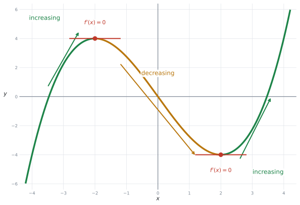
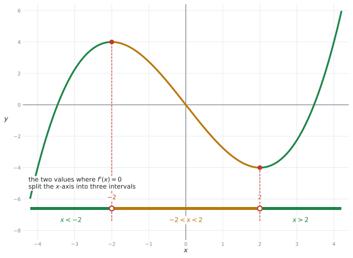
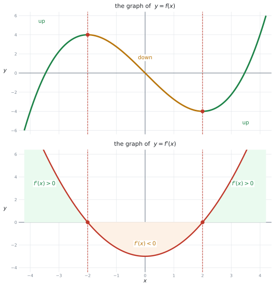
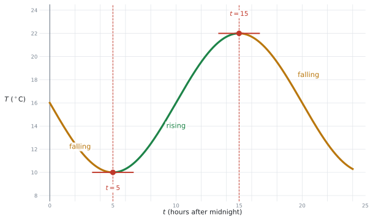
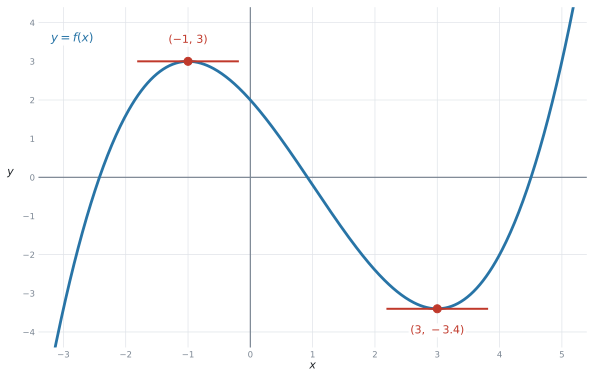

# SL 5.2 — Increasing and decreasing functions（増加・減少と導関数の符号） {#sec-sl-5-2}

::: {.callout-note}
## What you should be able to do
- **increasing**（増加）と **decreasing**（減少）の意味が、グラフで分かる。
- $f'(x) > 0$、$f'(x) = 0$、$f'(x) < 0$ を、グラフの形と結びつけられる。
- 増加・減少する **interval**（区間）を、$-2 < x < 2$ のような**不等式で書ける**。
- $y = f(x)$ のグラフと $y = f'(x)$ のグラフを**見分けられる**。
- $f'(x)$ の式が与えられたとき、増加・減少する区間を求められる。
- 電卓で $f'(x) = 0$ となる $x$ を見つけられる。
- 文脈のあるグラフで、「増えている期間」「減っている期間」を答えられる。
:::

::: {.callout-important}
## Formula booklet に、この項目の式はありません
公式集の Topic 5 の欄は **5.3、5.5、5.8 だけ**です。**5.2 の欄はありません。**

この項目で覚えることは、**次の3行だけ**です。

$$
f'(x) > 0 \ \Rightarrow \ \text{increasing}, \qquad
f'(x) = 0, \qquad
f'(x) < 0 \ \Rightarrow \ \text{decreasing}
$$ {#eq-sl52-signs}

シラバスの Content 欄も、この3つを名指ししています。

> Graphical interpretation of $f'(x) > 0$, $f'(x) = 0$, $f'(x) < 0$.
:::

## The idea

[SL 5.1](sl-5-1.qmd) で、**導関数は傾きの関数**だと見ました。この項目は、その**符号だけ**を使います。

### 1. increasing と decreasing {#inc-dec}

グラフを**左から右へ**たどってください。

- 上がっていく → **increasing**（増加）
- 下がっていく → **decreasing**（減少）

{#fig-sl52-incdec width=80%}

上がっているところでは接線が右上がりなので、**傾きは正**です。下がっているところでは**負**です。

| グラフの形 | $f'(x)$ | 英語 |
|---|---|---|
| 右上がり ↗ | $f'(x) > 0$ | $f$ is **increasing** |
| 水平 → | $f'(x) = 0$ | — |
| 右下がり ↘ | $f'(x) < 0$ | $f$ is **decreasing** |

: グラフの形と導関数の符号 {#tbl-sl52-signs}

::: {.callout-important}
## 「$y$ が正か負か」ではありません
@fig-sl52-incdec の左のほうで、グラフは $x$ 軸の**下**にあります。$y$ の値は負です。

**それでも $f$ は increasing です。** 見るのは **$y$ の値**ではなく、**上がっているか下がっているか**です。

$y$ が負のまま増えていく、ということはふつうに起こります。$-6 \to -4 \to -2$ は、**増えています。**
:::

### 2. 答えは「区間」で書きます {#interval}

シラバスの Guidance 欄が、答え方を指定しています。

> **Identifying intervals** on which functions are increasing ($f'(x) > 0$) or decreasing ($f'(x) < 0$).

**interval**（区間）とは、$x$ の値の範囲のことです。「$x = 1$ で増加」ではなく、「**$x > 2$ の範囲で増加**」のように答えます。

{#fig-sl52-intervals width=80%}

区間の区切りになるのは、**$f'(x) = 0$ となる $x$ の値**です。@fig-sl52-intervals では $x = -2$ と $x = 2$ で、$x$ 軸が $3$ つに分かれています。

| 区間 | $f'(x)$ | $f$ は |
|---|---|---|
| $x < -2$ | 正 | increasing |
| $-2 < x < 2$ | 負 | decreasing |
| $x > 2$ | 正 | increasing |

: 3つの区間 {#tbl-sl52-intervals}

#### 不等式の書き方 {#how-to-write}

答えは、次の形で書きます。

- **$-2 < x < 2$** … $-2$ と $2$ のあいだ
- **$x < -2$** … $-2$ より小さいところ全部
- **$x > 2$** … $2$ より大きいところ全部

::: {.callout-warning}
## 離れた2つの区間を、1つにまとめて書かないでください
increasing なのは $x < -2$ と $x > 2$ の**2か所**です。これを

$$
-2 > x > 2 \qquad ✗
$$

と書いてしまう誤りが、とても多いところです。**この不等式をみたす $x$ は $1$ つもありません**（$-2$ より小さくて、同時に $2$ より大きい数はありません）。

正しくは、**$2$ つを並べて書きます。**

$$
x < -2 \quad \textbf{or} \quad x > 2 \qquad ✓
$$

答案では、次のように書きます。

> *$f$ is increasing when $x < -2$ **or** $x > 2$.*

「どちらか一方の範囲に入っていれば increasing」という意味なので、つなぐ語は **`or`** です。

::: {.callout-note appearance="simple"}
区間の記号を使って $(-\infty,\ -2) \cup (2,\ \infty)$ と書くこともできます。**AI SL では、$2$ つの不等式を `or` で並べれば十分です。**
:::
:::

::: {.callout-tip}
## 端の値は、含めないほうが安全です
このページでは、シラバスの

$$
\text{increasing}: \ f'(x) > 0, \qquad \text{decreasing}: \ f'(x) < 0
$$

を基準にしています。$f'(-2) = 0$ なので、$x = -2$ は $f'(x) > 0$ にも $f'(x) < 0$ にも入りません。

ですから、**$f'(x) = 0$ となる端点は含めず、$<$ を使うのがふつうで、そのほうが安全**です。$-2 \le x \le 2$ ではなく、**$-2 < x < 2$** と書いてください。
:::

### 3. $f$ のグラフと $f'$ のグラフを見分ける {#which-graph}

この項目で一番大事な区別です。試験では、**どちらのグラフが与えられているのか**を最初に確かめてください。

::: {.callout-note appearance="simple"}
$f'$ の右上の $'$ は、英語では **prime**（プライム）と読みます。日本の教室では「ダッシュ」と読むのがふつうですが、**IB の授業と mark scheme では prime** です。この本では「プライム」と書きます。
:::

{#fig-sl52-fdash width=68%}

@fig-sl52-fdash の上が $y = f(x)$、下が $y = f'(x)$ です。**同じ $x$ の位置で見くらべてください。**

| $y = f(x)$ のグラフ（上） | $y = f'(x)$ のグラフ（下） |
|---|---|
| 上がっている | **$x$ 軸より上**にある |
| 水平になっている（$x = \pm 2$） | **$x$ 軸と交わる** |
| 下がっている | **$x$ 軸より下**にある |

: 上下のグラフの対応 {#tbl-sl52-compare}

::: {.callout-important}
## $f'$ のグラフでは、「上がり下がり」ではなく「$x$ 軸の上か下か」を見ます
下のグラフ（$y = f'(x)$）は、$x = 0$ のあたりで**上がり始めています**。ですが、そこでの $f$ は**減少**しています。

なぜなら、$f'(x)$ の値そのものは**まだ負**（$x$ 軸より下）だからです。

$f'$ のグラフを見るときは、**$x$ 軸より上か下か**だけを見てください。$f'$ のグラフ自体の傾きは、AI SL では使いません。
:::

::: {.callout-tip}
## 問題文で見分けられます
- `The graph of y = f(x) is shown.` → $f$ のグラフ。**上がり下がりを見る**
- `The graph of y = f'(x) is shown.` → $f'$ のグラフ。**$x$ 軸の上下を見る**
- `The derivative is given by f'(x) = ...` → 式が与えられている。**符号を計算する**

読み違えると、答えがちょうど**逆**になることがあります。**問題文のプライム（$'$）を見落とさないでください。**
:::

### 4. $f'(x)$ の式が与えられたとき {#given-fdash}

$f'(x)$ の式が与えられることもあります。このときは、**$f'(x) = 0$ を解いてから、符号を調べます。**

たとえば $f'(x) = (x + 1)(x - 4)$ なら、

1. $f'(x) = 0$ となるのは $x = -1$ と $x = 4$
2. $x$ 軸が $3$ つに分かれる：$x < -1$、$-1 < x < 4$、$x > 4$
3. **それぞれの区間から $1$ つ値を選んで**、$f'$ に入れて符号を見る

| 区間 | 試す値 | $f'$ の値 | 符号 |
|---|---|---|---|
| $x < -1$ | $x = -2$ | $(-1)(-6) = 6$ | 正 |
| $-1 < x < 4$ | $x = 0$ | $(1)(-4) = -4$ | 負 |
| $x > 4$ | $x = 5$ | $(6)(1) = 6$ | 正 |

: 区間ごとに符号を調べる {#tbl-sl52-testvalues}

答えは、**$x < -1$ と $x > 4$ で increasing、$-1 < x < 4$ で decreasing** です。

::: {.callout-tip}
## 試す値は、区間の中ならどれでも構いません
$x < -1$ の代わりに $x = -100$ を入れても、符号は同じ正になります。**計算が楽な値を選んでください。**

$0$ が使える区間では、$0$ を選ぶのが一番速いです。
:::

### 5. 文脈のあるグラフで読む {#context}

AI では、$x$ と $y$ ではなく**時間と温度**、**時間と売上**のようなグラフで聞かれます。やることは同じです。

{#fig-sl52-context width=80%}

@fig-sl52-context は、ある日の気温です。$t$ は真夜中からの時間（時間単位）です。

- $0 \le t < 5$ … 下がっている（$\dfrac{dT}{dt} < 0$）
- $t = 5$ … 一番低い（$\dfrac{dT}{dt} = 0$）
- $5 < t < 15$ … 上がっている（$\dfrac{dT}{dt} > 0$）
- $t = 15$ … 一番高い（$\dfrac{dT}{dt} = 0$）
- $15 < t \le 24$ … 下がっている（$\dfrac{dT}{dt} < 0$）

::: {.callout-important}
## 文脈の問題では、範囲の端に気をつけてください
この問題の $t$ は $0$ から $24$ までしかありません。ですから答えも、**$0 \le t < 5$** のように**範囲の中に収めて**書きます。

$t < 5$ とだけ書くと、$t = -3$（前の日）も含んでしまいます。**問題文に `for 0 ≤ t ≤ 24` と書かれていたら、その範囲を守ってください。**
:::

## Why it works

:::: {.callout-note collapse="true" appearance="simple"}
## クリックすると開きます
なぜ $f'(x) > 0$ が「増加」を意味するのかを説明します。

$f'(x)$ は、その点での**接線の傾き**です（[SL 5.1](sl-5-1.qmd)）。

傾きが正の直線は、右へ行くほど上がります。傾きが負の直線は、右へ行くほど下がります。これは [SL 2.1](../02-functions/sl-2-1.qmd) で見たとおりです。

曲線は、**その点のまわりでは接線とほとんど同じ**です（拡大するとまっすぐに見える、というあの話です）。ですから、

- 接線が右上がり（$f'(x) > 0$）→ 曲線もそこで上がっている → **increasing**
- 接線が右下がり（$f'(x) < 0$）→ 曲線もそこで下がっている → **decreasing**

$f'(x) = 0$ のときは接線が**水平**なので、その瞬間は上がってもいないし下がってもいません。ですから、$f'(x) = 0$ となる $x$ の値が、**increasing の区間と decreasing の区間を区切る候補**になります。

ただし、$f'(x) = 0$ だからといって、そこで必ず向きが変わるとはかぎりません。**前後で $f'$ の符号が変わったかどうか**を、そのつど確かめてください（[SL 5.6](sl-5-6.qmd#stationary)）。
::::

## Worked examples

::: {.callout-note appearance="simple"}
問題文は英語です。意味が理解できなかったら、問題文の下の「**日本語訳**」を開いてください。解説は日本語です。
:::

::: {#exm-sl52-read}
[The graph of $y = f(x)$ is shown below. The graph has a local maximum point at $(-2, 4)$ and a local minimum point at $(2, -4)$.]{.q-en}

{#fig-sl52-q1 width=76%}

**(a)** [Write down the two values of $x$ for which $f'(x) = 0$.]{.q-en}

**(b)** [State the interval on which $f$ is decreasing.]{.q-en}

**(c)** [State the intervals on which $f$ is increasing.]{.q-en}

<details class="jp-trans">
<summary>日本語訳</summary>

$y = f(x)$ のグラフが上に示されています。グラフは $(-2, 4)$ で極大点、$(2, -4)$ で極小点をとります。

**(a)** $f'(x) = 0$ となる $x$ の値を $2$ つ書きなさい。

**(b)** $f$ が減少する区間を書きなさい。

**(c)** $f$ が増加する区間を書きなさい。

</details>

---

**(a)** $f'(x) = 0$ は、**接線が水平になっている**ところです。それは山のてっぺんと谷の底です。

$$
x = -2 \quad \text{と} \quad x = 2
$$

**(b)** $x = -2$ から $x = 2$ のあいだで、グラフは**下がっています。**

$$
-2 < x < 2
$$

**(c)** 残りの $2$ か所です。**$2$ つに分けて書きます。**

$$
x < -2 \quad \text{と} \quad x > 2
$$

::: {.callout-warning}
## (c) を $-2 > x > 2$ と書かないでください
これは[まとめて書けない形](#how-to-write)です。$-2$ より小さくて、同時に $2$ より大きい数は存在しません。

答案には **$x < -2$ or $x > 2$** と、$2$ つ並べて書いてください。
:::

::: {.callout-note}
## 解答例（答案用紙にはこう書く）
**(a)** $x = -2$ and $x = 2$

**(b)** $-2 < x < 2$

**(c)** $x < -2$ or $x > 2$
:::
:::

::: {#exm-sl52-sign}
[The graph of $y = f(x)$ is shown below.]{.q-en}

{#fig-sl52-q2 width=76%}

**(a)** [State whether $f'(-3)$ is positive, negative or zero, giving a reason.]{.q-en}

**(b)** [State whether $f'(0)$ is positive, negative or zero, giving a reason.]{.q-en}

**(c)** [The value $a$ satisfies $f'(a) = 0$ and $a > 0$. Write down the value of $a$.]{.q-en}

<details class="jp-trans">
<summary>日本語訳</summary>

$y = f(x)$ のグラフが上に示されています。

**(a)** $f'(-3)$ が正・負・$0$ のどれかを、理由を付けて書きなさい。

**(b)** $f'(0)$ が正・負・$0$ のどれかを、理由を付けて書きなさい。

**(c)** 値 $a$ は $f'(a) = 0$ と $a > 0$ をみたします。$a$ の値を書きなさい。

</details>

---

**(a)** $x = -3$ は $x < -2$ の中にあります。そこでグラフは**上がっています。**

::: {.model-answer}
**試験ではこう書く**

*Positive, because the graph is increasing at $x = -3$.*
:::

**(b)** $x = 0$ は $-2 < x < 2$ の中にあります。そこでグラフは**下がっています。**

::: {.model-answer}
**試験ではこう書く**

*Negative, because the graph is decreasing at $x = 0$.*
:::

**(c)** $f'(x) = 0$ となるのは $x = -2$ と $x = 2$ です。**$a > 0$** という条件があるので、

$$
a = 2
$$

::: {.callout-tip}
## まず「どの区間に入るか」を決めてください
**(a)** も **(b)** も、$x$ の値をグラフの上で探して、**$-2$ と $2$ のどちら側か**を決めるだけです。

$-3 < -2$ なので左の区間、$-2 < 0 < 2$ なので真ん中の区間。それで符号が決まります。
:::

::: {.callout-note}
## 解答例（答案用紙にはこう書く）
**(a)** *Positive, because the graph is increasing at $x = -3$.*

**(b)** *Negative, because the graph is decreasing at $x = 0$.*

**(c)** $a = 2$
:::
:::

::: {#exm-sl52-fdash}
[The graph of $y = f'(x)$ is shown in the lower part of the diagram below. It crosses the $x$-axis at $x = -2$ and $x = 2$.]{.q-en}

{#fig-sl52-q3 width=68%}

**(a)** [Write down the values of $x$ for which $f'(x) = 0$.]{.q-en}

**(b)** [State the interval on which $f$ is decreasing.]{.q-en}

**(c)** [State whether $f$ is increasing or decreasing at $x = 3$, giving a reason.]{.q-en}

<details class="jp-trans">
<summary>日本語訳</summary>

$y = f'(x)$ のグラフが上の図の下側に示されています。$x = -2$ と $x = 2$ で $x$ 軸と交わっています。

**(a)** $f'(x) = 0$ となる $x$ の値を書きなさい。

**(b)** $f$ が減少する区間を書きなさい。

**(c)** $x = 3$ で $f$ が増加しているか減少しているかを、理由を付けて書きなさい。

</details>

---

::: {.callout-important}
## この問題は **$f'$ のグラフ**が与えられています
`y = f'(x)` とプライムが付いています。ですから[見るのは「$x$ 軸より上か下か」](#which-graph)です。**グラフ自体の上がり下がりは見ません。**
:::

**(a)** $f'(x) = 0$ は、**$f'$ のグラフが $x$ 軸と交わるところ**です。

$$
x = -2 \quad \text{と} \quad x = 2
$$

**(b)** $f$ が減少するのは $f'(x) < 0$ のとき、つまり **$f'$ のグラフが $x$ 軸より下**にあるところです。

図の下側で、放物線が軸より下にあるのは $-2$ と $2$ のあいだです。

$$
-2 < x < 2
$$

**(c)** $x = 3$ のところで、$f'$ のグラフは **$x$ 軸より上**にあります。だから $f'(3) > 0$ です。

::: {.model-answer}
**試験ではこう書く**

*Increasing, because $f'(3) > 0$ (the graph of $f'$ is above the $x$-axis at $x = 3$).*
:::

::: {.callout-warning}
## 「$f'$ のグラフが上がっているから増加」は誤りです
$x = 0$ のあたりで、$f'$ のグラフは**上がって**います。ですが $f'(0) < 0$ なので、$f$ は**減少**しています。

$f'$ のグラフを見るときに使うのは、**$x$ 軸の上か下かだけ**です。
:::

::: {.callout-note}
## 解答例（答案用紙にはこう書く）
**(a)** $x = -2$ and $x = 2$

**(b)** $-2 < x < 2$

**(c)** *Increasing, because $f'(3) > 0$.*
:::
:::

::: {#exm-sl52-context}
[The graph below shows the temperature $T\ ^\circ$C in a town, where $t$ is the time in hours after midnight, for $0 \le t \le 24$.]{.q-en}

{#fig-sl52-q4 width=76%}

**(a)** [Write down the value of $t$ at which the temperature is lowest.]{.q-en}

**(b)** [State the interval of $t$ for which the temperature is increasing.]{.q-en}

**(c)** [State the value of $\dfrac{dT}{dt}$ when $t = 15$.]{.q-en}

**(d)** [Interpret what $\dfrac{dT}{dt} < 0$ means at $t = 20$.]{.q-en}

<details class="jp-trans">
<summary>日本語訳</summary>

上のグラフは、ある町の気温 $T\ ^\circ$C を示しています。$t$ は真夜中からの時間（時間単位）で、$0 \le t \le 24$ です。

**(a)** 気温が一番低くなる $t$ の値を書きなさい。

**(b)** 気温が上がっている $t$ の区間を書きなさい。

**(c)** $t = 15$ のときの $\dfrac{dT}{dt}$ の値を書きなさい。

**(d)** $t = 20$ で $\dfrac{dT}{dt} < 0$ が何を意味するかを解釈しなさい。

</details>

---

**(a)** グラフの一番低いところは $t = 5$ です。**朝の $5$ 時**にあたります。

**(b)** $t = 5$ から $t = 15$ までのあいだ、グラフは上がっています。

$$
5 < t < 15
$$

**(c)** $t = 15$ はグラフの一番高いところで、接線が**水平**です。

$$
\frac{dT}{dt} = 0
$$

**(d)** `Interpret` なので、**場面の言葉で書きます。**

::: {.model-answer}
**試験ではこう書く**

*At $t = 20$ (that is, at 8 pm) the temperature is falling.*
:::

（$t = 20$、つまり夜の $8$ 時に、気温は下がっています。）

::: {.callout-tip}
## (b) の答えを $t > 5$ と書かないでください
$t > 5$ だと、$t = 20$ も入ってしまいます。ですが $t = 20$ では気温は**下がって**います。

**上がっているのは $t = 15$ まで**です。[必ず両側から挟んで](#context) $5 < t < 15$ と書いてください。
:::

::: {.callout-note}
## 解答例（答案用紙にはこう書く）
**(a)** $t = 5$

**(b)** $5 < t < 15$

**(c)** $\dfrac{dT}{dt} = 0$

**(d)** *At $t = 20$ the temperature is falling.*
:::
:::

::: {#exm-sl52-gdc}
[The function $f$ is given by $f(x) = x^{3} - 6x^{2} + 5$.]{.q-en}

**(a)** [Use your graphic display calculator to find the coordinates of the local maximum point and the local minimum point on the graph of $y = f(x)$.]{.q-en}

**(b)** [Hence state the interval on which $f$ is decreasing.]{.q-en}

**(c)** [State the intervals on which $f$ is increasing.]{.q-en}

<details class="jp-trans">
<summary>日本語訳</summary>

関数 $f$ が $f(x) = x^{3} - 6x^{2} + 5$ で与えられています。

**(a)** 電卓を使って、$y = f(x)$ のグラフの極大点と極小点の座標を求めなさい。

**(b)** これを使って、$f$ が減少する区間を書きなさい。

**(c)** $f$ が増加する区間を書きなさい。

</details>

---

**(a)** Graphs ページに $f1(x) = x^{3} - 6x^{2} + 5$ を入れて、[Analyze Graph](#analyze) を使います。

- Maximum … $(0, \ 5)$
- Minimum … $(4, \ -27)$

::: {.callout-tip}
## ウィンドウを広げてください
初期設定の画面（$-10 \le y \le 10$）では、極小点の $y = -27$ が**画面の外**にあります。

```
menu → Window/Zoom → Window Settings
```

で $y$ の範囲を $-40$ から $20$ くらいに広げると、両方が見えます。
:::

**(b)** 極大点と極小点のあいだで、グラフは下がっています。$x$ 座標だけを使います。

$$
0 < x < 4
$$

**(c)** 残りの $2$ か所です。

$$
x < 0 \quad \text{と} \quad x > 4
$$

::: {.callout-important}
## 区間は $x$ 座標だけで書きます
極大点は $(0, 5)$ ですが、区間の答えに $5$ は出てきません。**区間は $x$ の範囲**だからです。

$0 < y < 4$ や $5 > x > -27$ のように書いてしまう誤りがあります。**使うのは $x$ 座標の $0$ と $4$ だけ**です。
:::

::: {.callout-note}
## 解答例（答案用紙にはこう書く）
**(a)** Maximum point $(0, 5)$;  minimum point $(4, -27)$

**(b)** $0 < x < 4$

**(c)** $x < 0$ or $x > 4$
:::
:::

## Common errors

::: {.callout-warning}
## 離れた2つの区間を、1つの不等式にまとめる
$x < -2$ と $x > 2$ を、$-2 > x > 2$ と書いてしまう誤りです。

**この不等式をみたす $x$ は存在しません。** 「$-2$ より小さくて、同時に $2$ より大きい数」はないからです。

**$2$ つに分けて、`or` でつないで書いてください。**
:::

::: {.callout-warning}
## $y$ の値の正負と、増加・減少を取り違える
グラフが $x$ 軸の下にあっても、上がっていれば **increasing** です。

見るのは**上がっているか下がっているか**であって、$y$ が正か負かではありません。

$-6 \to -4 \to -2$ は増えています。**マイナスの数でも、増えます。**
:::

::: {.callout-warning}
## $f$ のグラフと $f'$ のグラフを取り違える
問題文の $f(x)$ と $f'(x)$ は、**プライム $1$ つの違い**です。読み飛ばすと、答えが逆になります。

- $f$ のグラフ → **上がり下がり**を見る
- $f'$ のグラフ → **$x$ 軸の上か下か**を見る

問題文を読んだら、**まず「どちらのグラフか」を紙に書き留めて**から解き始めてください。
:::

::: {.callout-warning}
## $f'$ のグラフで、グラフ自体の上がり下がりを見てしまう
$f'$ のグラフが上がっていても、それは「$f$ が増加している」という意味では**ありません。**

$f'$ のグラフが**軸より下**にあるなら、$f'(x) < 0$ なので $f$ は**減少**しています。$f'$ のグラフが上がっていようが下がっていようが、関係ありません。
:::

::: {.callout-warning}
## 区間に $y$ 座標を書いてしまう
極大点が $(0, 5)$ のとき、区間の答えに $5$ は出てきません。

**区間は $x$ の範囲**です。使うのは $x$ 座標だけです。
:::

::: {.callout-warning}
## 文脈の問題で、与えられた範囲をはみ出す
`for 0 ≤ t ≤ 24` と書かれているのに $t > 5$ と答えると、$t = 30$（翌日）まで含んでしまいます。

**上限も下限も、問題文の範囲に収めてください。** $5 < t < 15$ のように、両側から挟みます。
:::

::: {.callout-warning}
## 「増加している点」を答えてしまう
`State the interval on which f is increasing` は、**範囲**を聞いています。

$x = 3$ のように $1$ つの値だけを書くと、点になりません。**不等式で書いてください。**
:::

::: {.callout-warning}
## $f'(x) = 0$ の点を、区間に入れてしまう
このページは increasing: $f'(x) > 0$、decreasing: $f'(x) < 0$ を基準にしています。$f'(-2) = 0$ の点は、そのどちらにも入りません。

ですから **$-2 \le x \le 2$ ではなく、$-2 < x < 2$** と書いてください（[第2節](#how-to-write)）。
:::

::: {.callout-warning}
## 電卓のウィンドウが狭くて、停留点を見落とす
極小点が $y = -27$ にあるのに、画面が $-10 \le y \le 10$ のままだと、**その点はそもそも画面に出てきません。**

グラフをかいたら、**まず全体が見えているかを確かめて**ください。見えていなければ、Window Settings で範囲を広げます。
:::

## Using your GDC (TI-Nspire CX II)

この項目では、電卓は**停留点（$f'(x) = 0$ となる点）を見つける**ために使います。

### 1. グラフをかいて、全体を見る

Graphs ページで $f1(x)$ に式を入れます。

```
menu → Window/Zoom → Zoom - Fit
```

`Zoom - Fit` は、**$y$ の範囲を自動で合わせて**くれます。これで山と谷が画面に入ります。

うまくいかないときは、手で設定します。

```
menu → Window/Zoom → Window Settings
```

### 2. 極大点・極小点を出す {#analyze}

```
menu → 6: Analyze Graph → 3: Maximum
menu → 6: Analyze Graph → 2: Minimum
```

操作は [SL 2.4](../02-functions/sl-2-4.qmd#bounds) と同じです。**下限（lower bound）と上限（upper bound）を、その点をはさむように指定します。** **`enter` は $2$ 回**です。

::: {.callout-warning}
## はさむ範囲に、山と谷の両方を入れないでください
`Analyze Graph` は、**指定した範囲の中の $1$ つ**しか返しません。

極大点を探しているのに範囲が広すぎると、思ったものが出てきません。**山だけをはさむように**、狭く指定してください。
:::

### 3. 出てくるのは座標です

`Maximum` は $(0, 5)$ のように**座標**を返します。**区間に使うのは $x$ 座標だけ**です。

$y$ 座標は、この項目では使いません（[SL 5.6](sl-5-6.qmd) の最大値・最小値では使います）。

### 4. $f'(x) = 0$ を直接解く方法もあります {#nsolve}

$f'(x)$ の式が分かっているなら、`nSolve` で解けます。

```
nSolve(3x² - 12x = 0, x)
```

ただし `nSolve` は**解を $1$ つずつ**しか返しません。$2$ つあるときは、探す範囲を変えて $2$ 回使います。

```
nSolve(3x² - 12x = 0, x, -1, 1)
nSolve(3x² - 12x = 0, x, 2, 6)
```

::: {.callout-tip}
## SL 5.2 では、グラフから読むほうが速いことが多いです
$f'(x)$ の式を作るのは [SL 5.3](sl-5-3.qmd) からです。この項目では、**$f$ のグラフをかいて山と谷を見つける**ほうが、手数が少なくて済みます。
:::

### 5. グラフを見て、答えを言葉にする

電卓が返すのは座標だけです。**「$0 < x < 4$ で decreasing」という答えは、自分で書きます。**

画面を見ながら、**山から谷までが下り**、それ以外が上り、と確かめてください。

## Exercises

::: {.callout-note appearance="simple"}
各問題に、折りたたみが3つ付いています。**日本語訳**、**解答例**（答案用紙に書くべきこと。英語です）、**解説**（なぜそうなるか。日本語です）。

まず自分で解いて、次に解答例と見くらべてください。**解説は、合わなかったときだけ開けば十分です。**
:::

::: {.callout-note}
## 演習 1 と 2 は、次のグラフを使います
{#fig-sl52-ex width=80%}
:::

::: {.exercise-block}

[1]{.ex-no} [The graph of $y = f(x)$ is shown in @fig-sl52-ex. It has a local maximum point at $(-1, 3)$ and a local minimum point at $(3, -3.4)$.]{.q-en}

**(a)** [Write down the values of $x$ for which $f'(x) = 0$.]{.q-en}

**(b)** [State the interval on which $f$ is decreasing.]{.q-en}

**(c)** [State the intervals on which $f$ is increasing.]{.q-en}

<details class="jp-trans">
<summary>日本語訳</summary>

$y = f(x)$ のグラフが @fig-sl52-ex に示されています。$(-1, 3)$ で極大点、$(3, -3.4)$ で極小点をとります。

**(a)** $f'(x) = 0$ となる $x$ の値を書きなさい。

**(b)** $f$ が減少する区間を書きなさい。

**(c)** $f$ が増加する区間を書きなさい。

</details>

::: {.callout-note collapse="true"}
## 解答例（答案用紙に書くこと）
**(a)** $x = -1$ and $x = 3$

**(b)** $-1 < x < 3$

**(c)** $x < -1$ or $x > 3$
:::

::: {.callout-tip collapse="true"}
## 解説
接線が水平になっているのは、山のてっぺん $(-1,3)$ と谷の底 $(3,-3.4)$ です。**使うのは $x$ 座標だけ**なので、$-1$ と $3$ です。

**(c)** は $2$ つに分けて書いてください。$-1 > x > 3$ は[存在しない範囲](#how-to-write)です。

$3$ や $-3.4$ という $y$ 座標は、答えには出てきません。
:::

::: {.ex-sep}
:::

[2]{.ex-no} [For the graph in @fig-sl52-ex, state whether each of the following is positive, negative or zero.]{.q-en}

**(a)** [$f'(-3)$]{.q-en}

**(b)** [$f'(0)$]{.q-en}

**(c)** [$f'(3)$]{.q-en}

**(d)** [$f'(5)$]{.q-en}

<details class="jp-trans">
<summary>日本語訳</summary>

@fig-sl52-ex のグラフについて、次のそれぞれが正・負・$0$ のどれかを書きなさい。

</details>

::: {.callout-note collapse="true"}
## 解答例（答案用紙に書くこと）
**(a)** Positive

**(b)** Negative

**(c)** Zero

**(d)** Positive
:::

::: {.callout-tip collapse="true"}
## 解説
$x$ の値が、$-1$ と $3$ で区切られた**どの区間に入るか**を見ます。

- $-3 < -1$ → 左の区間 → 上がっている → **正**
- $-1 < 0 < 3$ → 真ん中 → 下がっている → **負**
- $x = 3$ → ちょうど谷の底 → 水平 → **$0$**
- $5 > 3$ → 右の区間 → 上がっている → **正**

**(c)** で「負」と答えてしまう人が多いところです。$x = 3$ は**境目そのもの**なので $0$ です。
:::

::: {.ex-sep}
:::

[3]{.ex-no} [A function $f$ has derivative $f'(x) = 2x - 4$.]{.q-en}

**(a)** [Find the value of $x$ for which $f'(x) = 0$.]{.q-en}

**(b)** [State the interval on which $f$ is decreasing.]{.q-en}

**(c)** [State the interval on which $f$ is increasing.]{.q-en}

<details class="jp-trans">
<summary>日本語訳</summary>

ある関数 $f$ の導関数は $f'(x) = 2x - 4$ です。

**(a)** $f'(x) = 0$ となる $x$ の値を求めなさい。

**(b)** $f$ が減少する区間を書きなさい。

**(c)** $f$ が増加する区間を書きなさい。

</details>

::: {.callout-note collapse="true"}
## 解答例（答案用紙に書くこと）
**(a)** $2x - 4 = 0$, so $x = 2$

**(b)** $x < 2$

**(c)** $x > 2$
:::

::: {.callout-tip collapse="true"}
## 解説
$f'(x) = 2x - 4$ は**直線**で、傾きが正なので右上がりです。$x = 2$ で $x$ 軸を横切ります。

- $x < 2$ … $f'$ は負（試しに $x=0$ で $f'(0) = -4$）→ $f$ は減少
- $x > 2$ … $f'$ は正（試しに $x=3$ で $f'(3) = 2$）→ $f$ は増加

区間は $2$ つだけで、[分けて書く必要はありません](#how-to-write)。
:::

::: {.ex-sep}
:::

[4]{.ex-no} [A function $f$ has derivative $f'(x) = (x + 1)(x - 4)$.]{.q-en}

**(a)** [Write down the values of $x$ for which $f'(x) = 0$.]{.q-en}

**(b)** [State the interval on which $f$ is decreasing.]{.q-en}

**(c)** [State the intervals on which $f$ is increasing.]{.q-en}

<details class="jp-trans">
<summary>日本語訳</summary>

ある関数 $f$ の導関数は $f'(x) = (x + 1)(x - 4)$ です。

**(a)** $f'(x) = 0$ となる $x$ の値を書きなさい。

**(b)** $f$ が減少する区間を書きなさい。

**(c)** $f$ が増加する区間を書きなさい。

</details>

::: {.callout-note collapse="true"}
## 解答例（答案用紙に書くこと）
**(a)** $x = -1$ and $x = 4$

**(b)** $f'(0) = (1)(-4) = -4 < 0$, so $f$ is decreasing for $-1 < x < 4$

**(c)** $f'(-2) = (-1)(-6) = 6 > 0$ and $f'(5) = (6)(1) = 6 > 0$,

so $f$ is increasing for $x < -1$ or $x > 4$
:::

::: {.callout-tip collapse="true"}
## 解説
すでに因数分解されているので、$f'(x) = 0$ は**カッコの中を $0$ にする値**です。$x = -1$ と $x = 4$。

そのあとは[区間ごとに値を入れて符号を調べます](#given-fdash)。$0$ が使える区間では $0$ を選ぶのが一番速いです。

**答案に、試した値と符号を書いておく**と、根拠が残ります。
:::

::: {.ex-sep}
:::

[5]{.ex-no} [A function $f$ has derivative $f'(x) = -(x - 1)(x - 5)$.]{.q-en}

**(a)** [Write down the values of $x$ for which $f'(x) = 0$.]{.q-en}

**(b)** [State the interval on which $f$ is increasing.]{.q-en}

**(c)** [State the intervals on which $f$ is decreasing.]{.q-en}

<details class="jp-trans">
<summary>日本語訳</summary>

ある関数 $f$ の導関数は $f'(x) = -(x - 1)(x - 5)$ です。

**(a)** $f'(x) = 0$ となる $x$ の値を書きなさい。

**(b)** $f$ が増加する区間を書きなさい。

**(c)** $f$ が減少する区間を書きなさい。

</details>

::: {.callout-note collapse="true"}
## 解答例（答案用紙に書くこと）
**(a)** $x = 1$ and $x = 5$

**(b)** $f'(3) = -(2)(-2) = 4 > 0$, so $f$ is increasing for $1 < x < 5$

**(c)** $f'(0) = -(-1)(-5) = -5 < 0$ and $f'(6) = -(5)(1) = -5 < 0$,

so $f$ is decreasing for $x < 1$ or $x > 5$
:::

::: {.callout-tip collapse="true"}
## 解説
**前にマイナスが付いていることに気をつけてください。** 演習4とは、増加と減少がちょうど**逆**になります。

$f'(x) = -(x-1)(x-5)$ は上に凸の放物線なので、**真ん中で正**、外側で負です。

符号を確かめずに演習4と同じ形で答えると、まるごと間違えます。**必ず値を入れて確かめてください。**
:::

::: {.ex-sep}
:::

[6]{.ex-no} [The function $f$ is given by $f(x) = x^{3} - 3x^{2} - 9x + 5$.]{.q-en}

**(a)** [Use your graphic display calculator to find the coordinates of the local maximum point and the local minimum point on the graph of $y = f(x)$.]{.q-en}

**(b)** [State the interval on which $f$ is decreasing.]{.q-en}

**(c)** [State the intervals on which $f$ is increasing.]{.q-en}

<details class="jp-trans">
<summary>日本語訳</summary>

関数 $f$ が $f(x) = x^{3} - 3x^{2} - 9x + 5$ で与えられています。

**(a)** 電卓を使って、$y = f(x)$ のグラフの極大点と極小点の座標を求めなさい。

**(b)** $f$ が減少する区間を書きなさい。

**(c)** $f$ が増加する区間を書きなさい。

</details>

::: {.callout-note collapse="true"}
## 解答例（答案用紙に書くこと）
**(a)** Maximum point $(-1, 10)$;  minimum point $(3, -22)$

**(b)** $-1 < x < 3$

**(c)** $x < -1$ or $x > 3$
:::

::: {.callout-tip collapse="true"}
## 解説
$y$ の範囲が $-22$ から $10$ まであるので、**初期設定の画面（$-10 \le y \le 10$）では極小点が見えません。**

`Zoom - Fit` を使うか、Window Settings で $y$ を $-30$ から $20$ くらいにしてください。

**検算**：$f(-1) = -1 - 3 + 9 + 5 = 10$ ✓　$f(3) = 27 - 27 - 27 + 5 = -22$ ✓
:::

::: {.ex-sep}
:::

[7]{.ex-no} [The function $f$ is given by $f(x) = x^{3} + 2x$.]{.q-en}

**(a)** [Sketch the graph of $y = f(x)$ using your graphic display calculator.]{.q-en}

**(b)** [State whether there are any values of $x$ for which $f$ is decreasing, giving a reason.]{.q-en}

<details class="jp-trans">
<summary>日本語訳</summary>

関数 $f$ が $f(x) = x^{3} + 2x$ で与えられています。

**(a)** 電卓を使って $y = f(x)$ のグラフの概形をかきなさい。

**(b)** $f$ が減少する $x$ の値があるかどうかを、理由を付けて書きなさい。

</details>

::: {.callout-note collapse="true"}
## 解答例（答案用紙に書くこと）
**(a)** A curve through the origin, increasing from bottom left to top right, with no maximum or minimum point.

**(b)** *No. The graph is increasing everywhere, so there are no values of $x$ for which $f$ is decreasing.*
:::

::: {.callout-tip collapse="true"}
## 解説
グラフをかくと、**山も谷もありません。** ずっと右上がりです。

$f'(x) = 0$ となる $x$ がないので、区間の区切りもありません。だから、**全部の $x$ で増加**です。

このような関数は、英語で `increasing for all values of x` と言います。**「減少する区間はない」という答えも、立派な答えです。**
:::

::: {.ex-sep}
:::

[8]{.ex-no} [The number of visitors to a museum each month is recorded. The number rises from January to May, falls from May to August, and rises again from August to December.]{.q-en}

[Let $V$ be the number of visitors and let $m$ be the month number, where $m = 1$ is January.]{.q-en}

**(a)** [State the interval of $m$ for which $\dfrac{dV}{dm}$ is negative.]{.q-en}

**(b)** [Write down the two values of $m$ at which $\dfrac{dV}{dm} = 0$.]{.q-en}

<details class="jp-trans">
<summary>日本語訳</summary>

博物館の毎月の来館者数を記録しています。来館者数は $1$ 月から $5$ 月まで増え、$5$ 月から $8$ 月まで減り、$8$ 月から $12$ 月まで再び増えます。

$V$ を来館者数、$m$ を月の番号（$m = 1$ が $1$ 月）とします。

**(a)** $\dfrac{dV}{dm}$ が負になる $m$ の区間を書きなさい。

**(b)** $\dfrac{dV}{dm} = 0$ となる $m$ の値を $2$ つ書きなさい。

</details>

::: {.callout-note collapse="true"}
## 解答例（答案用紙に書くこと）
**(a)** $5 < m < 8$

**(b)** $m = 5$ and $m = 8$
:::

::: {.callout-tip collapse="true"}
## 解説
グラフがなくても、**文章がそのまま増減を教えてくれています。**

- $1$ 月 → $5$ 月：増える → $\dfrac{dV}{dm} > 0$
- $5$ 月 → $8$ 月：減る → $\dfrac{dV}{dm} < 0$
- $8$ 月 → $12$ 月：増える → $\dfrac{dV}{dm} > 0$

**(b)** 増加から減少へ、減少から増加へ切り替わるところが、$\dfrac{dV}{dm} = 0$ です。$m = 5$（$5$ 月）と $m = 8$（$8$ 月）です。
:::

::: {.ex-sep}
:::

[9]{.ex-no} [A student is asked to state the intervals on which a function $f$ is increasing. The correct answer is $x < 1$ or $x > 6$. The student writes $1 > x > 6$.]{.q-en}

[Explain why the student's answer cannot be correct.]{.q-en}

<details class="jp-trans">
<summary>日本語訳</summary>

ある生徒が、関数 $f$ が増加する区間を答えるよう求められました。正しい答えは $x < 1$ または $x > 6$ です。生徒は $1 > x > 6$ と書きました。

生徒の答えが正しくありえない理由を説明しなさい。

</details>

::: {.callout-note collapse="true"}
## 解答例（答案用紙に書くこと）
*The statement $1 > x > 6$ means that $x$ is less than $1$ and greater than $6$ at the same time. No number can satisfy both, so the statement describes no values of $x$ at all. The two intervals are separate and must be written separately.*
:::

::: {.callout-tip collapse="true"}
## 解説
$1 > x > 6$ を分けて読むと、$x < 1$ **かつ** $x > 6$ です。**そんな数はありません。**

$-2 > x > 2$ や $1 > x > 6$ のような書き方は、[この項目で一番多い誤り](#how-to-write)です。

**離れた $2$ つの区間は、必ず $2$ つに分けて書きます。**
:::

::: {.ex-sep}
:::

[10]{.ex-no} [A company's monthly profit is $P$ thousand dollars, $t$ months after it opened. It is known that $\dfrac{dP}{dt} > 0$ for $0 < t < 18$ and $\dfrac{dP}{dt} < 0$ for $t > 18$.]{.q-en}

**(a)** [State the value of $t$ at which $\dfrac{dP}{dt} = 0$.]{.q-en}

**(b)** [Interpret what happens to the monthly profit after $t = 18$.]{.q-en}

**(c)** [State whether the monthly profit at $t = 24$ is greater or smaller than at $t = 18$, giving a reason.]{.q-en}

<details class="jp-trans">
<summary>日本語訳</summary>

ある会社の月ごとの利益は、開業から $t$ か月後に $P$ 千ドルです。$0 < t < 18$ では $\dfrac{dP}{dt} > 0$、$t > 18$ では $\dfrac{dP}{dt} < 0$ であることが分かっています。

**(a)** $\dfrac{dP}{dt} = 0$ となる $t$ の値を書きなさい。

**(b)** $t = 18$ より後、月ごとの利益に何が起こるかを解釈しなさい。

**(c)** $t = 24$ での月ごとの利益が $t = 18$ でのそれより大きいか小さいかを、理由を付けて書きなさい。

</details>

::: {.callout-note collapse="true"}
## 解答例（答案用紙に書くこと）
**(a)** $t = 18$

**(b)** *After $18$ months the monthly profit starts to fall.*

**(c)** *Smaller, because the profit is decreasing for all $t > 18$, so it has been falling for the six months from $t = 18$ to $t = 24$.*
:::

::: {.callout-tip collapse="true"}
## 解説
**(a)** 増加から減少へ切り替わるところが $\dfrac{dP}{dt} = 0$ です。$t = 18$ です。

**(b)** は `Interpret` なので、**場面の言葉**で書きます。「導関数が負になる」ではなく「**利益が下がり始める**」です。

**(c)** $t = 18$ から $t = 24$ までずっと減少しているので、$t=24$ のほうが**小さい**です。`giving a reason` なので、「$t > 18$ で減少しているから」の一言を添えてください。

**この問題にはグラフも式もありません。** 導関数の符号だけで、これだけのことが言えます。
:::

::: {.ex-sep}
:::

[11]{.ex-no} [The depth of water in a harbour is $d$ metres, $t$ hours after midnight. The table shows the depth every two hours.]{.q-en}

| $t$ (hours) | $0$ | $2$ | $4$ | $6$ | $8$ | $10$ | $12$ |
|---|---|---|---|---|---|---|---|
| $d$ (metres) | $5.3$ | $7.7$ | $8.9$ | $7.7$ | $5.3$ | $4.1$ | $5.3$ |

**(a)** [State the interval of $t$ for which the depth is decreasing.]{.q-en}

**(b)** [Write down the two values of $t$ at which $\dfrac{dd}{dt} = 0$.]{.q-en}

**(c)** [Use the values at $t = 0$ and $t = 4$ to estimate $\dfrac{dd}{dt}$ when $t = 2$.]{.q-en}

**(d)** [Interpret your answer to part (c) in the context of the question.]{.q-en}

<details class="jp-trans">
<summary>日本語訳</summary>

港の水深は、真夜中から $t$ 時間後に $d$ m です。表は $2$ 時間ごとの水深です。

**(a)** 水深が減少している $t$ の区間を書きなさい。

**(b)** $\dfrac{dd}{dt} = 0$ となる $t$ の値を $2$ つ書きなさい。

**(c)** $t = 0$ と $t = 4$ の値を使って、$t = 2$ のときの $\dfrac{dd}{dt}$ を見積もりなさい。

**(d)** (c) の答えを、問題の文脈で解釈しなさい。

</details>

::: {.callout-note collapse="true"}
## 解答例（答案用紙に書くこと）
**(a)** $4 < t < 10$

**(b)** $t = 4$ and $t = 10$

**(c)** $\dfrac{dd}{dt} \approx \dfrac{8.9 - 5.3}{4 - 0} = \dfrac{3.6}{4} = 0.9$ metres per hour

**(d)** *Two hours after midnight, the depth of water in the harbour is increasing at about $0.9$ metres per hour.*
:::

::: {.callout-tip collapse="true"}
## 解説
**(a)** 表の数を左から追ってください。$5.3 \to 7.7 \to 8.9$ で増え、$8.9 \to 7.7 \to 5.3 \to 4.1$ で減り、$4.1 \to 5.3$ でまた増えます。減っているのは $t = 4$ から $t = 10$ までです。

**(b)** 一番高い $t = 4$ と、一番低い $t = 10$ が切り替わりの点です。

**(c)** は [SL 5.1](sl-5-1.qmd) の[弦の傾き](sl-5-1.qmd#estimate)です。知りたい $t = 2$ を、$t = 0$ と $t = 4$ で**はさんでいます** ✓

**(d)** 増えているので**正**の値です。`increasing` を入れてください。単位も忘れずに。
:::

:::
