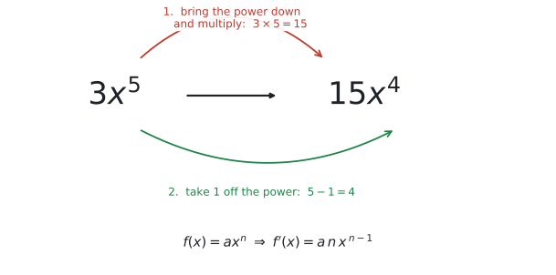
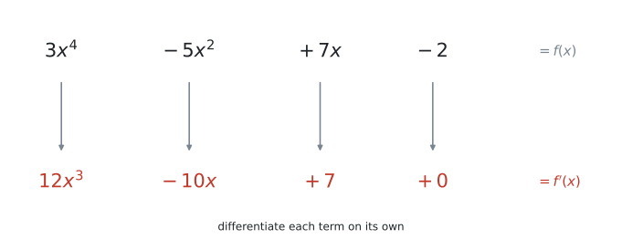
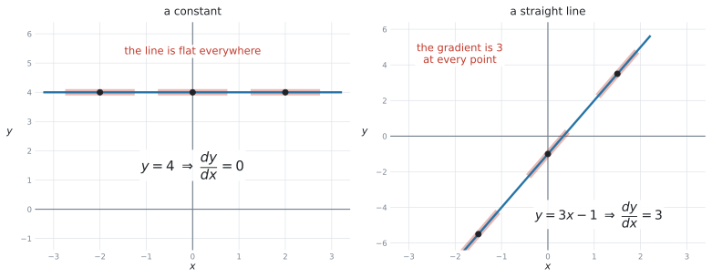
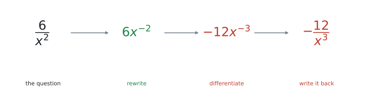
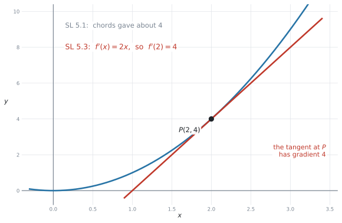

# SL 5.3 — Differentiation（微分の計算：べき乗の公式） {#sec-sl-5-3}

::: {.callout-note}
## What you should be able to do
- $f(x) = ax^{n}$ の導関数を、**公式で**求められる。
- 項がいくつあっても、**項ごとに**微分できる。
- **定数**の微分が $0$、**$ax$** の微分が $a$ だと分かる。
- $\dfrac{6}{x^{2}}$ のような分数を $6x^{-2}$ に**書き直してから**微分できる。
- $f'(a)$ の値を求められる（＝その点での**接線の傾き**）。
- $f'(x) = 0$ を解いて、**接線が水平になる $x$** を求められる。
- 文脈のある問題で、$f'(x)$ の意味を**単位を付けて**説明できる。
:::

::: {.callout-important}
## Formula booklet に載っています（ただし注意が1つ）
公式集の **SL 5.3** の欄には、次の1行があります。

$$
f(x) = x^{n} \ \Rightarrow \ f'(x) = nx^{\,n-1}
$$ {#eq-sl53-booklet}

**公式集の式には、係数 $a$ が付いていません。** ところがシラバスの Content 欄は、係数付きで書いています。

> Derivative of $f(x) = ax^{n}$ is $f'(x) = anx^{\,n-1}$, $n \in \mathbb{Z}$

試験に出るのは $3x^{5}$ のように**係数の付いた形**です。ですから、覚えるのはこちらにしてください。

$$
f(x) = ax^{n} \ \Rightarrow \ f'(x) = a\,n\,x^{\,n-1}
$$ {#eq-sl53-rule}

**係数 $a$ は、そのまま前に残ります。** 公式集を見ながら $a$ を落とす、というのがこの項目で一番多い失点です。
:::

## The idea

[SL 5.1](sl-5-1.qmd) では、導関数を**弦の傾きの極限**として見ました。表やグラフから「だいたい $4$ くらい」と見積もる項目でした。

この項目からは、**式で、正確に**求めます。

### 1. べき乗の公式：下ろして、1 減らす {#rule}

使う公式は、これ 1 本だけです。

$$
f(x) = a x^{n} \ \Rightarrow \ f'(x) = a\,n\,x^{\,n-1}
$$

やることは、いつも同じ **2 手**です。

1. **指数を前に下ろして掛ける**
2. **指数から $1$ を引く**

{#fig-sl53-rule width=82%}

@fig-sl53-rule では $3x^{5}$ を微分しています。

- 指数 $5$ を下ろして、$3 \times 5 = 15$
- 指数を $1$ 減らして、$5 - 1 = 4$

$$
f(x) = 3x^{5} \ \Rightarrow \ f'(x) = 15x^{4}
$$

::: {.callout-tip}
## 声に出して唱えてください
**「下ろして掛ける、1 減らす」**

$x^{7} \to 7x^{6}$、$5x^{3} \to 15x^{2}$、$2x^{10} \to 20x^{9}$。**手が覚えるまで、この 2 手を繰り返してください。**
:::

### 2. 項ごとに微分します {#terms}

シラバスの Guidance 欄は、出題される形をこう書いています。

> The derivative of functions of the form $f(x) = ax^{n} + bx^{n-1} + \ldots$ where all exponents are integers.

項が並んでいるだけです。**足し算・引き算でつながった式は、1 つずつ別々に微分して、そのままつなげます。**

{#fig-sl53-terms width=92%}

@fig-sl53-terms を、左から順に確かめてください。

| $f(x)$ の項 | どうするか | $f'(x)$ の項 |
|---|---|---|
| $3x^{4}$ | $4$ を下ろして $3 \times 4 = 12$、指数は $3$ | $12x^{3}$ |
| $-5x^{2}$ | $2$ を下ろして $-5 \times 2 = -10$、指数は $1$ | $-10x$ |
| $+7x$ | $x = x^{1}$ なので $7 \times 1 = 7$、指数は $0$ | $+7$ |
| $-2$ | 定数は消える | $0$ |

: 項ごとに微分する {#tbl-sl53-terms}

$$
f(x) = 3x^{4} - 5x^{2} + 7x - 2 \ \Rightarrow \ f'(x) = 12x^{3} - 10x + 7
$$

::: {.callout-important}
## 符号は、その項に付いたまま動きます
$-5x^{2}$ を微分すると $-10x$ です。**マイナスは消えません。**

$f(x)$ を書き写すときに、$-5x^{2}$ を「$5x^{2}$」と写してしまう人がいます。**まず式を正しく写す**、それだけで防げます。
:::

### 3. 定数と 1 次式は、覚えてしまってください {#special}

この 2 つは公式に当てはめれば出ますが、**結果を覚えたほうが速い**です。

{#fig-sl53-special width=92%}

| $y$ | $\dfrac{dy}{dx}$ | 理由 |
|---|---|---|
| $y = 4$（定数） | $0$ | グラフが**水平**だから |
| $y = 3x - 1$（1 次式） | $3$ | 直線の傾きは**どこでも同じ**だから |
| $y = ax + b$ | $a$ | 同じ理由 |

: 定数と 1 次式 {#tbl-sl53-special}

@fig-sl53-special の左は $y = 4$ です。どの点で接線を引いても**水平**なので、傾きは $0$。

右は $y = 3x - 1$ です。直線ですから、接線は**その直線自身**です。だから傾きはどこでも $3$。[SL 2.1](../02-functions/sl-2-1.qmd) で見た「直線の傾き」と、同じものです。

[2 節](#terms)の形にそろえて書くと、こうなります。

$$
y = 4 \ \Rightarrow \ \frac{dy}{dx} = 0
$$

$$
y = 3x - 1 \ \Rightarrow \ \frac{dy}{dx} = 3
$$

::: {.callout-warning}
## $+7x$ を $0$ にしないでください
定数が消えるので、つられて $7x$ まで消してしまう誤りが多いところです。

**消えるのは、$x$ が付いていない項だけ**です。$7x$ には $x$ が付いています。微分すると $7$ が残ります。

$$
7x \to 7 \qquad ✓ \qquad\qquad 7x \to 0 \qquad ✗
$$
:::

### 4. $n$ は整数です ── 分数は書き直します {#negative}

シラバスの条件は **$n \in \mathbb{Z}$**（$n$ は整数）です。これは 2 つのことを意味します。

- **負の指数は出ます。** $x^{-2}$ は範囲内です。
- **分数の指数は出ません。** $\sqrt{x} = x^{\frac{1}{2}}$ は **AI SL の範囲外**です。

$\dfrac{6}{x^{2}}$ のような形は、そのままでは公式が使えません。**まず $6x^{-2}$ に書き直します。**

{#fig-sl53-rewrite width=94%}

@fig-sl53-rewrite の 4 ステップです。

1. **書き直す**：$\dfrac{6}{x^{2}} = 6x^{-2}$（[SL 1.5](../01-number-and-algebra/sl-1-5.qmd) の $a^{-n} = \dfrac{1}{a^{n}}$）
2. **下ろして掛ける**：$6 \times (-2) = -12$
3. **1 減らす**：$-2 - 1 = -3$
4. **戻す**：$-12x^{-3} = -\dfrac{12}{x^{3}}$

$$
y = \frac{6}{x^{2}} \ \Rightarrow \ \frac{dy}{dx} = -\frac{12}{x^{3}}
$$

::: {.callout-warning}
## 負の数から 1 を引く向きに注意してください
$-2$ から $1$ を引くと **$-3$** です。**$-1$ ではありません。**

数直線の上で、$-2$ から**左へ 1 つ**動くと思ってください。$-2 \to -3$ です。

$$
-2 - 1 = -3 \qquad ✓ \qquad\qquad -2 - 1 = -1 \qquad ✗
$$

指数が負のときだけ起こる、しかしとても多い誤りです。
:::

::: {.callout-tip}
## 答えは、問題と同じ形で書いてください
問題が $\dfrac{6}{x^{2}}$ と分数で出てきたら、答えも $-\dfrac{12}{x^{3}}$ と分数で書くのが自然です。

$-12x^{-3}$ のままでも**構いません**が、分数に戻しておくと採点者にも自分にも読みやすくなります。
:::

### 5. $f'(a)$ は「その点での傾き」です {#value}

$f'(x)$ は**式**です。そこに数を入れると、**その点での接線の傾き**という数になります。

$f(x) = x^{2}$ で考えます。

$$
f'(x) = 2x \quad \Rightarrow \quad f'(2) = 4, \qquad f'(-3) = -6, \qquad f'(0) = 0
$$

{#fig-sl53-check width=80%}

@fig-sl53-check を見てください。[SL 5.1](sl-5-1.qmd#chord) では、$x = 2$ のまわりの弦の傾きが $4$ に近づいていくのを見ました。**「だいたい 4」**でした。

いま、公式は **ちょうど $4$** と答えます。同じ答えに、別の道から着いたわけです。

::: {.callout-important}
## $f(2)$ と $f'(2)$ を取り違えないでください
$f(x) = x^{2}$ のとき、

- $f(2) = 4$ … **$y$ 座標**（点の高さ）
- $f'(2) = 4$ … **傾き**

たまたま両方 $4$ になりましたが、**別のもの**です。$f(3) = 9$ ですが $f'(3) = 6$ です。

問題文にダッシュ $'$ が付いているかどうかを、**指で押さえて**確かめてください。
:::

### 6. $f'(x) = 0$ を解くと、水平な場所が出ます {#zeros}

[SL 5.2](sl-5-2.qmd) では、$f'(x) = 0$ となる $x$ が**増加と減少の区切り**になることを見ました。あのときは電卓でグラフを描いて探しました。

いまは、**式を作って解けます。**

$$
f(x) = x^{3} - 6x^{2} + 5 \ \Rightarrow \ f'(x) = 3x^{2} - 12x
$$

$$
3x^{2} - 12x = 0 \quad \Rightarrow \quad 3x(x - 4) = 0 \quad \Rightarrow \quad x = 0 \ \text{または} \ x = 4
$$

::: {.callout-tip}
## $f'(x) = 0$ は、まず因数分解を試してください
$3x^{2} - 12x$ には $3x$ が共通しています。**共通因数でくくる**だけで解けることが、とても多いです。

因数分解できないときは、電卓（`nSolve` または `polyRoots`）を使ってかまいません。AI では**両方の試験で電卓が使えます。**
:::

この続き ── 接線の式を作る、最大・最小を求める ── は [SL 5.4](sl-5-4.qmd) と [SL 5.6](sl-5-6.qmd) です。**この項目の公式が、その全部の土台になります。**

## Why it works

:::: {.callout-note collapse="true" appearance="simple"}
## クリックすると開きます
なぜ「下ろして、1 減らす」で傾きが出るのかを、$f(x) = x^{2}$ で確かめます。

[SL 5.1](sl-5-1.qmd#chord) の弦の傾きを、文字のまま計算します。$x$ と、そこから少し離れた $x + h$ の 2 点を結びます。

$$
\text{弦の傾き} = \frac{f(x + h) - f(x)}{(x + h) - x} = \frac{(x + h)^{2} - x^{2}}{h}
$$

分子を展開します。

$$
(x + h)^{2} - x^{2} = x^{2} + 2xh + h^{2} - x^{2} = 2xh + h^{2} = h(2x + h)
$$

$h$ で約分できます。

$$
\text{弦の傾き} = \frac{h(2x + h)}{h} = 2x + h
$$

ここで **$h$ を $0$ に近づけます**（$h \to 0$）。残るのは

$$
f'(x) = 2x .
$$

**指数の $2$ が前に下りてきて、指数が $1$ 減りました。** 公式のとおりです。

同じ計算を $x^{3}$、$x^{4}$、… と続けても、毎回いちばん前に出てくるのが $nx^{\,n-1}$ です。だから、この 2 手が「どんな $n$ でも」通用します。

::: {.callout-note appearance="simple"}
この展開と約分は、**試験で書く必要はありません。** AI SL のシラバスは `Not required: Formal analytic methods` と書いています（[SL 5.1](sl-5-1.qmd)）。

**公式を使えれば十分です。** ここを読むのは、「なぜ？」が気になる人のためのおまけです。
:::
::::

## Worked examples

::: {.callout-note appearance="simple"}
問題文は英語です。意味が理解できなかったら、問題文の下の「**日本語訳**」を開いてください。解説は日本語です。
:::

::: {#exm-sl53-terms}
[The function $f$ is given by $f(x) = 3x^{4} - 5x^{2} + 7x - 2$.]{.q-en}

**(a)** [Find $f'(x)$.]{.q-en}

**(b)** [Find $f'(2)$.]{.q-en}

<details class="jp-trans">
<summary>日本語訳</summary>

関数 $f$ が $f(x) = 3x^{4} - 5x^{2} + 7x - 2$ で与えられています。

**(a)** $f'(x)$ を求めなさい。

**(b)** $f'(2)$ を求めなさい。

</details>

---

**(a)** [項ごとに](#terms)微分します。

$$
f'(x) = 12x^{3} - 10x + 7
$$

**(b)** $x = 2$ を代入します。

$$
f'(2) = 12(2)^{3} - 10(2) + 7 = 12(8) - 20 + 7 = 96 - 20 + 7 = 83
$$

::: {.model-answer}
**試験ではこう書く**

**(a)** $f'(x) = 12x^{3} - 10x + 7$

**(b)** $f'(2) = 96 - 20 + 7 = 83$
:::

::: {.callout-tip}
## 代入は、途中式を 1 行残してください
$96 - 20 + 7$ という行があると、**答えが違っていても計算の途中まで点がもらえます**（method mark）。

いきなり $83$ とだけ書くと、間違えたときに $0$ 点になります。
:::

::: {.callout-note}
## 解答例（答案用紙にはこう書く）
**(a)** $f'(x) = 12x^{3} - 10x + 7$

**(b)** $f'(2) = 83$
:::
:::

::: {#exm-sl53-rewrite}
[A function is given by $h(x) = 4x^{2} + \dfrac{6}{x}$, $x \neq 0$.]{.q-en}

**(a)** [Write $h(x)$ in the form $4x^{2} + 6x^{n}$.]{.q-en}

**(b)** [Find $h'(x)$.]{.q-en}

**(c)** [Find the gradient of the graph of $y = h(x)$ at $x = 2$.]{.q-en}

<details class="jp-trans">
<summary>日本語訳</summary>

関数が $h(x) = 4x^{2} + \dfrac{6}{x}$（$x \neq 0$）で与えられています。

**(a)** $h(x)$ を $4x^{2} + 6x^{n}$ の形で書きなさい。

**(b)** $h'(x)$ を求めなさい。

**(c)** $x = 2$ における $y = h(x)$ のグラフの傾きを求めなさい。

</details>

---

**(a)** $\dfrac{6}{x} = \dfrac{6}{x^{1}} = 6x^{-1}$ です。

$$
h(x) = 4x^{2} + 6x^{-1}
$$

**(b)** [書き直した形](#negative)なら、公式がそのまま使えます。

- $4x^{2}$ … $4 \times 2 = 8$、指数は $1$ → $8x$
- $6x^{-1}$ … $6 \times (-1) = -6$、指数は $-1 - 1 = -2$ → $-6x^{-2}$

$$
h'(x) = 8x - 6x^{-2} = 8x - \frac{6}{x^{2}}
$$

**(c)** $x = 2$ を代入します。

$$
h'(2) = 8(2) - \frac{6}{2^{2}} = 16 - \frac{6}{4} = 16 - 1.5 = 14.5
$$

::: {.callout-warning}
## $-1 - 1 = -2$ です
$-1$ から $1$ を引くので $-2$ です。$0$ ではありません。

**負の指数のときは、必ず数直線を思い浮かべて**ください。
:::

::: {.callout-note}
## 解答例（答案用紙にはこう書く）
**(a)** $h(x) = 4x^{2} + 6x^{-1}$

**(b)** $h'(x) = 8x - 6x^{-2} = 8x - \dfrac{6}{x^{2}}$

**(c)** $h'(2) = 16 - 1.5 = 14.5$
:::
:::

::: {#exm-sl53-value}
[The function $f$ is given by $f(x) = x^{2}$.]{.q-en}

**(a)** [Find $f'(x)$.]{.q-en}

**(b)** [Find the gradient of the tangent to the curve at the point $P(2, 4)$.]{.q-en}

**(c)** [Find the value of $x$ at which the gradient of the curve is $-6$.]{.q-en}

<details class="jp-trans">
<summary>日本語訳</summary>

関数 $f$ が $f(x) = x^{2}$ で与えられています。

**(a)** $f'(x)$ を求めなさい。

**(b)** 点 $P(2, 4)$ における曲線の接線の傾きを求めなさい。

**(c)** 曲線の傾きが $-6$ になる $x$ の値を求めなさい。

</details>

---

**(a)** 指数 $2$ を下ろして、指数を $1$ 減らします。

$$
f'(x) = 2x
$$

**(b)** $P$ の $x$ 座標は $2$ です。

$$
f'(2) = 2(2) = 4
$$

**(c)** 今度は**逆向き**です。$f'(x) = -6$ とおいて、$x$ を求めます。

$$
2x = -6 \quad \Rightarrow \quad x = -3
$$

::: {.callout-important}
## (b) で使うのは $x$ 座標だけです
$P(2, 4)$ の $4$ は $y$ 座標です。**傾きの式に入れるのは $x$ 座標の $2$ だけ**です。

$f'(4) = 8$ としてしまうのが、よくある誤りです。
:::

::: {.callout-tip}
## (c) は、この項目でいちばん差がつく形です
「傾きが $-6$ になるのはどこか」と聞かれたら、**$f'(x)$ に $= -6$ を付けて方程式にします。**

$f'(x)$ を求めて終わりにせず、**問題文が「値」を聞いているのか「場所」を聞いているのか**を読んでください。
:::

::: {.callout-note}
## 解答例（答案用紙にはこう書く）
**(a)** $f'(x) = 2x$

**(b)** $f'(2) = 4$

**(c)** $2x = -6$, so $x = -3$
:::
:::

::: {#exm-sl53-zeros}
[The function $f$ is given by $f(x) = x^{3} - 6x^{2} + 5$.]{.q-en}

**(a)** [Find $f'(x)$.]{.q-en}

**(b)** [Solve $f'(x) = 0$.]{.q-en}

**(c)** [State the interval on which $f$ is decreasing.]{.q-en}

<details class="jp-trans">
<summary>日本語訳</summary>

関数 $f$ が $f(x) = x^{3} - 6x^{2} + 5$ で与えられています。

**(a)** $f'(x)$ を求めなさい。

**(b)** $f'(x) = 0$ を解きなさい。

**(c)** $f$ が減少する区間を書きなさい。

</details>

---

**(a)** 項ごとに。定数 $+5$ は消えます。

$$
f'(x) = 3x^{2} - 12x
$$

**(b)** [共通因数 $3x$ でくくります。](#zeros)

$$
3x^{2} - 12x = 0 \quad \Rightarrow \quad 3x(x - 4) = 0 \quad \Rightarrow \quad x = 0 \ \text{または} \ x = 4
$$

**(c)** 区切りは $x = 0$ と $x = 4$ です。あいだの $x = 1$ で符号を調べます。

$$
f'(1) = 3(1)^{2} - 12(1) = 3 - 12 = -9 < 0
$$

負なので、この区間では**減少**しています（[SL 5.2](sl-5-2.qmd)）。

$$
0 < x < 4
$$

::: {.model-answer}
**試験ではこう書く**

*$f'(1) = -9 < 0$, so $f$ is decreasing for $0 < x < 4$.*
:::

::: {.callout-tip}
## 符号は「値を 1 つ入れて確かめる」のが確実です
グラフを想像するより、**区間の中の適当な数を 1 つ選んで $f'$ に代入する**ほうが速くて確実です。

$0$ と $4$ のあいだなら、$1$ でも $2$ でも $3$ でもかまいません。計算が楽な数を選んでください。
:::

::: {.callout-note}
## 解答例（答案用紙にはこう書く）
**(a)** $f'(x) = 3x^{2} - 12x$

**(b)** $3x(x-4) = 0$, so $x = 0$ and $x = 4$

**(c)** $f'(1) = -9 < 0$, so $f$ is decreasing for $0 < x < 4$
:::
:::

::: {#exm-sl53-context}
[A company sells $x$ items per day. Its daily profit, in dollars, is modelled by]{.q-en}

$$
P(x) = 60x - x^{2} - 200, \qquad 0 \le x \le 50 .
$$

**(a)** [Find $\dfrac{dP}{dx}$.]{.q-en}

**(b)** [Find the value of $\dfrac{dP}{dx}$ when $x = 20$, and interpret your answer in the context of the question.]{.q-en}

**(c)** [Find the value of $x$ for which $\dfrac{dP}{dx} = 0$.]{.q-en}

<details class="jp-trans">
<summary>日本語訳</summary>

ある会社は 1 日に $x$ 個の品物を売ります。1 日の利益（ドル）は次の式でモデル化されます。

$$
P(x) = 60x - x^{2} - 200, \qquad 0 \le x \le 50 .
$$

**(a)** $\dfrac{dP}{dx}$ を求めなさい。

**(b)** $x = 20$ のときの $\dfrac{dP}{dx}$ の値を求め、問題の文脈で解釈しなさい。

**(c)** $\dfrac{dP}{dx} = 0$ となる $x$ の値を求めなさい。

</details>

---

**(a)** $60x \to 60$、$-x^{2} \to -2x$、$-200 \to 0$。

$$
\frac{dP}{dx} = 60 - 2x
$$

**(b)** $x = 20$ を代入します。

$$
\frac{dP}{dx} = 60 - 2(20) = 60 - 40 = 20
$$

単位は「**ドル / 個**」です（[SL 5.1](sl-5-1.qmd#units)）。$P$ の単位がドル、$x$ の単位が個だからです。

::: {.model-answer}
**試験ではこう書く**

*When $20$ items are sold per day, the daily profit is increasing at about $20$ dollars per extra item.*
:::

**(c)** $60 - 2x = 0$ を解きます。

$$
2x = 60 \quad \Rightarrow \quad x = 30
$$

::: {.callout-tip}
## 解釈の文には、3 つを入れてください
1. **いつの話か**（$x = 20$、$20$ 個売っているとき）
2. **増えているのか減っているのか**（`increasing`）
3. **数と単位**（$20$ dollars per item）

この 3 つが入っていれば、表現が多少ぎこちなくても点になります。
:::

::: {.callout-note appearance="simple"}
**参考**：$x = 30$ は、実は利益が**最大**になるところです（$P(30) = 700$ ドル）。$\dfrac{dP}{dx} = 0$ から最大・最小を求めるのが [SL 5.6](sl-5-6.qmd) です。
:::

::: {.callout-note}
## 解答例（答案用紙にはこう書く）
**(a)** $\dfrac{dP}{dx} = 60 - 2x$

**(b)** $\dfrac{dP}{dx} = 20$. *When $20$ items are sold per day, the profit is increasing at $20$ dollars per extra item.*

**(c)** $60 - 2x = 0$, so $x = 30$
:::
:::

## Common errors

::: {.callout-warning}
## 係数 $a$ を落とす
公式集の式が $f(x) = x^{n}$ の形なので、係数のことを忘れがちです。

$$
3x^{5} \to 5x^{4} \qquad ✗ \qquad\qquad 3x^{5} \to 15x^{4} \qquad ✓
$$

**下ろした指数は、もとの係数に「掛ける」**のであって、置き換えるのではありません。
:::

::: {.callout-warning}
## 指数を下ろして、1 引くのを忘れる
$$
4x^{3} \to 12x^{3} \qquad ✗ \qquad\qquad 4x^{3} \to 12x^{2} \qquad ✓
$$

**2 手セット**です。片方だけで止まらないでください。
:::

::: {.callout-warning}
## $7x$ を $0$ にしてしまう
定数が消えるので、つられて消してしまう誤りです。$7x = 7x^{1}$ なので、微分すると **$7$** です。

$x$ が付いていない項だけが消えます。
:::

::: {.callout-warning}
## 定数を消し忘れる
$$
3x^{2} - 4 \to 6x - 4 \qquad ✗ \qquad\qquad 3x^{2} - 4 \to 6x \qquad ✓
$$

$-4$ は水平な直線なので、傾きは $0$ です。**答えに残してはいけません。**
:::

::: {.callout-warning}
## 分数のまま微分しようとする
$\dfrac{6}{x^{2}}$ を、分子と分母を別々に微分してはいけません。

**必ず $6x^{-2}$ に書き直してから**、公式を使ってください。
:::

::: {.callout-warning}
## 負の指数から 1 を引く向きを間違える
$-2 - 1 = -3$ です。$-1$ ではありません。

$x^{-2} \to -2x^{-3}$、$x^{-1} \to -x^{-2}$。**数直線で左へ 1 つ**と覚えてください。
:::

::: {.callout-warning}
## $f(a)$ と $f'(a)$ を取り違える
「傾きを求めなさい」なら $f'(a)$、「$y$ 座標を求めなさい」なら $f(a)$ です。

**問題文のダッシュ $'$ を指で押さえて**確かめてください。
:::

::: {.callout-warning}
## 点の $y$ 座標を $f'$ に代入する
点 $(2, 4)$ での傾きなら、入れるのは **$2$** です。$4$ ではありません。

$f'$ に入れるのは、いつでも **$x$ 座標**です。
:::

::: {.callout-warning}
## $\sqrt{x}$ を微分しようとする
$\sqrt{x} = x^{\frac{1}{2}}$ は**整数の指数ではない**ので、AI SL の範囲外です（$n \in \mathbb{Z}$）。

シラバスが $n \in \mathbb{Z}$ と限っているので、微分する式に出てくることはありません。出てきたら、問題を読み違えている可能性が高いです。
:::

::: {.callout-warning}
## $f'(x) = 0$ を解いたあと、$y$ 座標まで求めてしまう
`Solve f'(x) = 0` と書かれていたら、**答えは $x$ の値だけ**です。

$y$ 座標まで必要なのは、`coordinates`（座標）と書かれているときです。[SL 5.6](sl-5-6.qmd) でよく出ます。
:::

::: {.callout-warning}
## 答えを因数分解せずに止まってしまう
$3x^{2} - 12x = 0$ は、**$3x(x-4) = 0$** とくくれば、そのまま解けます。

解の公式を持ち出す前に、**共通因数がないか**を必ず見てください。
:::

## Using your GDC (TI-Nspire CX II)

この項目は、**手で計算する**項目です。電卓は**答え合わせ**に使ってください。

### 1. CAS でない機種は、式を出してくれません

TI-Nspire CX II（CAS でない機種）は、$f'(x)$ の**式**を返しません。返すのは、**ある 1 点での値**だけです。

つまり、$12x^{3} - 10x + 7$ のような**式そのものは、必ず自分で書きます。**

### 2. ある点での値を確かめる {#nderiv}

```
menu → 4: Calculus → 1: Numerical Derivative at a Point
```

[SL 5.1](sl-5-1.qmd#nderiv) で使ったものと同じ機能です。

$f(x) = 3x^{4} - 5x^{2} + 7x - 2$、$x = 2$ を指定すると **$83$** と返ります。@exm-sl53-terms の答えと一致しました ✓

::: {.callout-tip}
## 「式を作る」→「1 点で確かめる」の順で使ってください
1. 手で $f'(x)$ を求める
2. 適当な $x$（$x = 2$ など）を自分の式に代入する
3. 同じ $x$ で電卓の値を出す
4. 一致すれば、**式が合っている可能性がとても高い**

$1$ 点で合っていれば、係数の落としや指数の引き忘れは、まず起きていません。
:::

### 3. $f'(x) = 0$ を解く {#solve}

自分で作った $f'(x)$ の式を、`nSolve` に入れます。

```
nSolve(3x² - 12x = 0, x, -1, 1)
nSolve(3x² - 12x = 0, x, 2, 6)
```

`nSolve` は**解を 1 つずつ**返すので、解が 2 つあるときは範囲を変えて 2 回使います（[SL 5.2](sl-5-2.qmd#nsolve) と同じです）。

$f'(x)$ が 2 次式なら、`polyRoots` を使う手もあります。

```
polyRoots(3x² - 12x, x)
```

### 4. グラフでも確かめられます

Graphs ページで $f1(x)$ に $f(x)$ を入れ、山と谷の $x$ 座標を `Analyze Graph` で出します（[SL 5.2](sl-5-2.qmd#analyze)）。その点をはさむように、`lower bound?` と `upper bound?` の $2$ 回、`enter` を押します（→ [SL 2.4](../02-functions/sl-2-4.qmd#bounds)）。

その $x$ が、$f'(x) = 0$ の解と一致するはずです。**2 通りで同じ答えが出たら、まず間違いありません。**

::: {.callout-warning}
## 電卓の答えだけを書かないでください
`Find f'(x)` は**式**を求めています。電卓では出せません。

`Solve f'(x) = 0` でも、**$f'(x)$ の式を書いてから**解いた形にしてください。式が書いていないと、途中点がもらえません。
:::

## Exercises

::: {.callout-note appearance="simple"}
各問題に、折りたたみが3つ付いています。**日本語訳**、**解答例**（答案用紙に書くべきこと。英語です）、**解説**（なぜそうなるか。日本語です）。

まず自分で解いて、次に解答例と見くらべてください。**解説は、合わなかったときだけ開けば十分です。**
:::

::: {.exercise-block}

[1]{.ex-no} [The function $f$ is given by $f(x) = 4x^{3} - 7x^{2} + 2x - 9$.]{.q-en}

**(a)** [Find $f'(x)$.]{.q-en}

**(b)** [Find $f'(1)$.]{.q-en}

<details class="jp-trans">
<summary>日本語訳</summary>

関数 $f$ が $f(x) = 4x^{3} - 7x^{2} + 2x - 9$ で与えられています。

**(a)** $f'(x)$ を求めなさい。

**(b)** $f'(1)$ を求めなさい。

</details>

::: {.callout-note collapse="true"}
## 解答例（答案用紙に書くこと）
**(a)** $f'(x) = 12x^{2} - 14x + 2$

**(b)** $f'(1) = 12 - 14 + 2 = 0$
:::

::: {.callout-tip collapse="true"}
## 解説
項ごとに見ます。$4x^{3} \to 12x^{2}$、$-7x^{2} \to -14x$、$+2x \to +2$、$-9 \to 0$。

**$+2x$ が $+2$ になること**と、**$-9$ が消えること**の 2 つが要点です。

**(b)** の答えが $0$ になるのは、$x = 1$ でグラフが**水平**だということです。
:::

::: {.ex-sep}
:::

[2]{.ex-no} [The function $g$ is given by $g(x) = 2x^{5} - 3x$.]{.q-en}

**(a)** [Find $g'(x)$.]{.q-en}

**(b)** [Find $g'(-1)$.]{.q-en}

<details class="jp-trans">
<summary>日本語訳</summary>

関数 $g$ が $g(x) = 2x^{5} - 3x$ で与えられています。

**(a)** $g'(x)$ を求めなさい。

**(b)** $g'(-1)$ を求めなさい。

</details>

::: {.callout-note collapse="true"}
## 解答例（答案用紙に書くこと）
**(a)** $g'(x) = 10x^{4} - 3$

**(b)** $g'(-1) = 10(-1)^{4} - 3 = 10 - 3 = 7$
:::

::: {.callout-tip collapse="true"}
## 解説
$2x^{5}$ … $2 \times 5 = 10$、指数は $4$ → $10x^{4}$。$-3x$ … $x$ が付いているので $-3$ が残ります。

**(b)** で $(-1)^{4} = +1$ です。**指数が偶数なら正**になります。$-1$ としてしまわないでください。
:::

::: {.ex-sep}
:::

[3]{.ex-no} [Write down $\dfrac{dy}{dx}$ for each of the following.]{.q-en}

**(a)** [$y = 7$]{.q-en}

**(b)** [$y = 5x$]{.q-en}

**(c)** [$y = -3x + 8$]{.q-en}

**(d)** [$y = 6 - 2x$]{.q-en}

<details class="jp-trans">
<summary>日本語訳</summary>

次のそれぞれについて $\dfrac{dy}{dx}$ を書きなさい。

</details>

::: {.callout-note collapse="true"}
## 解答例（答案用紙に書くこと）
**(a)** $\dfrac{dy}{dx} = 0$

**(b)** $\dfrac{dy}{dx} = 5$

**(c)** $\dfrac{dy}{dx} = -3$

**(d)** $\dfrac{dy}{dx} = -2$
:::

::: {.callout-tip collapse="true"}
## 解説
[定数は $0$、1 次式は $x$ の係数](#special)です。

**(d)** は $y = -2x + 6$ と並べ替えると見やすくなります。$x$ の係数は **$-2$** です。**マイナスを落とさないでください。**
:::

::: {.ex-sep}
:::

[4]{.ex-no} [Differentiate each of the following. Give each answer as a fraction.]{.q-en}

**(a)** [$y = \dfrac{4}{x}$]{.q-en}

**(b)** [$y = \dfrac{3}{x^{2}}$]{.q-en}

<details class="jp-trans">
<summary>日本語訳</summary>

次のそれぞれを微分しなさい。答えは分数の形で書きなさい。

</details>

::: {.callout-note collapse="true"}
## 解答例（答案用紙に書くこと）
**(a)** $y = 4x^{-1}$, so $\dfrac{dy}{dx} = -4x^{-2} = -\dfrac{4}{x^{2}}$

**(b)** $y = 3x^{-2}$, so $\dfrac{dy}{dx} = -6x^{-3} = -\dfrac{6}{x^{3}}$
:::

::: {.callout-tip collapse="true"}
## 解説
[まず書き直す](#negative)のが要点です。

**(a)** $4 \times (-1) = -4$、指数は $-1 - 1 = -2$。

**(b)** $3 \times (-2) = -6$、指数は $-2 - 1 = -3$。

どちらも**答えがマイナス**になります。$\dfrac{4}{x}$ のグラフは（$x > 0$ の側で）右下がりなので、傾きが負なのは自然です。
:::

::: {.ex-sep}
:::

[5]{.ex-no} [The function $f$ is given by $f(x) = x^{3} + \dfrac{2}{x} - 5$, $x \neq 0$.]{.q-en}

**(a)** [Find $f'(x)$.]{.q-en}

**(b)** [Find $f'(1)$.]{.q-en}

<details class="jp-trans">
<summary>日本語訳</summary>

関数 $f$ が $f(x) = x^{3} + \dfrac{2}{x} - 5$（$x \neq 0$）で与えられています。

**(a)** $f'(x)$ を求めなさい。

**(b)** $f'(1)$ を求めなさい。

</details>

::: {.callout-note collapse="true"}
## 解答例（答案用紙に書くこと）
**(a)** $f(x) = x^{3} + 2x^{-1} - 5$, so $f'(x) = 3x^{2} - 2x^{-2} = 3x^{2} - \dfrac{2}{x^{2}}$

**(b)** $f'(1) = 3 - 2 = 1$
:::

::: {.callout-tip collapse="true"}
## 解説
**3 種類の項が 1 つの式に入っています。**

- $x^{3}$ … ふつうのべき乗 → $3x^{2}$
- $\dfrac{2}{x} = 2x^{-1}$ … 書き直してから → $-2x^{-2}$
- $-5$ … 定数 → 消える

**(b)** は $x = 1$ なので、$3(1)^{2} - \dfrac{2}{1^{2}} = 3 - 2 = 1$ です。
:::

::: {.ex-sep}
:::

[6]{.ex-no} [The function $f$ is given by $f(x) = x^{4} - 4x^{2}$.]{.q-en}

**(a)** [Find $f'(x)$.]{.q-en}

**(b)** [Find the gradient of the curve at the point where $x = 2$.]{.q-en}

<details class="jp-trans">
<summary>日本語訳</summary>

関数 $f$ が $f(x) = x^{4} - 4x^{2}$ で与えられています。

**(a)** $f'(x)$ を求めなさい。

**(b)** $x = 2$ の点における曲線の傾きを求めなさい。

</details>

::: {.callout-note collapse="true"}
## 解答例（答案用紙に書くこと）
**(a)** $f'(x) = 4x^{3} - 8x$

**(b)** $f'(2) = 4(8) - 8(2) = 32 - 16 = 16$
:::

::: {.callout-tip collapse="true"}
## 解説
$-4x^{2}$ … $-4 \times 2 = -8$、指数は $1$ → $-8x$。**マイナスはそのまま残ります。**

**(b)** で $4(2)^{3} = 4 \times 8 = 32$ です。$(4 \times 2)^{3}$ ではありません。**指数が先、掛け算はあと**です。
:::

::: {.ex-sep}
:::

[7]{.ex-no} [The function $f$ is given by $f(x) = x^{3} - 12x + 1$.]{.q-en}

**(a)** [Find $f'(x)$.]{.q-en}

**(b)** [Solve $f'(x) = 0$.]{.q-en}

<details class="jp-trans">
<summary>日本語訳</summary>

関数 $f$ が $f(x) = x^{3} - 12x + 1$ で与えられています。

**(a)** $f'(x)$ を求めなさい。

**(b)** $f'(x) = 0$ を解きなさい。

</details>

::: {.callout-note collapse="true"}
## 解答例（答案用紙に書くこと）
**(a)** $f'(x) = 3x^{2} - 12$

**(b)** $3x^{2} - 12 = 0$, so $x^{2} = 4$, so $x = 2$ and $x = -2$
:::

::: {.callout-tip collapse="true"}
## 解説
**答えが 2 つあります。** $x^{2} = 4$ の解は $x = 2$ **と** $x = -2$ です。

$x = 2$ だけ書いて終わりにする誤りが、とても多いところです。**平方根を取ったら、$\pm$ を忘れないでください。**

$3(x-2)(x+2) = 0$ と因数分解しても同じです。
:::

::: {.ex-sep}
:::

[8]{.ex-no} [The function $f$ is given by $f(x) = 2x^{3} - 9x^{2} + 12x$.]{.q-en}

**(a)** [Find $f'(x)$.]{.q-en}

**(b)** [Show that $f'(x) = 6(x - 1)(x - 2)$.]{.q-en}

**(c)** [Write down the values of $x$ for which the tangent to the curve is horizontal.]{.q-en}

<details class="jp-trans">
<summary>日本語訳</summary>

関数 $f$ が $f(x) = 2x^{3} - 9x^{2} + 12x$ で与えられています。

**(a)** $f'(x)$ を求めなさい。

**(b)** $f'(x) = 6(x - 1)(x - 2)$ となることを示しなさい。

**(c)** 曲線の接線が水平になる $x$ の値を書きなさい。

</details>

::: {.callout-note collapse="true"}
## 解答例（答案用紙に書くこと）
**(a)** $f'(x) = 6x^{2} - 18x + 12$

**(b)** $6(x-1)(x-2) = 6(x^{2} - 3x + 2) = 6x^{2} - 18x + 12$ ✓

**(c)** $x = 1$ and $x = 2$
:::

::: {.callout-tip collapse="true"}
## 解説
**(b)** の `Show that` は、**与えられた形から出発して展開し、(a) と同じになることを示す**のが確実です。

因数分解する向きよりも、**展開する向き**のほうが計算が楽です。

**(c)** 「接線が水平」は $f'(x) = 0$ のことです。**(b)** の形なら、$x = 1$ と $x = 2$ がすぐ読めます。
:::

::: {.ex-sep}
:::

[9]{.ex-no} [A curve has equation $y = x^{2}(x - 3)$.]{.q-en}

**(a)** [Expand the brackets to write $y$ as a polynomial.]{.q-en}

**(b)** [Find $\dfrac{dy}{dx}$.]{.q-en}

**(c)** [Find the values of $x$ for which $\dfrac{dy}{dx} = 0$.]{.q-en}

<details class="jp-trans">
<summary>日本語訳</summary>

ある曲線の方程式は $y = x^{2}(x - 3)$ です。

**(a)** かっこを展開して、$y$ を多項式で書きなさい。

**(b)** $\dfrac{dy}{dx}$ を求めなさい。

**(c)** $\dfrac{dy}{dx} = 0$ となる $x$ の値を求めなさい。

</details>

::: {.callout-note collapse="true"}
## 解答例（答案用紙に書くこと）
**(a)** $y = x^{3} - 3x^{2}$

**(b)** $\dfrac{dy}{dx} = 3x^{2} - 6x$

**(c)** $3x(x - 2) = 0$, so $x = 0$ and $x = 2$
:::

::: {.callout-tip collapse="true"}
## 解説
**かっこのまま微分することはできません。** AI SL の公式は、$ax^{n}$ の形が並んでいるときにしか使えません。

**必ず展開してから**微分してください。$x^{2} \times x = x^{3}$、$x^{2} \times (-3) = -3x^{2}$ です。

**(c)** は共通因数 $3x$ でくくります。$x = 0$ を**忘れないでください**（$3x = 0$ からの解です）。
:::

::: {.ex-sep}
:::

[10]{.ex-no} [The cost, in dollars, of producing $n$ chairs per day is modelled by]{.q-en}

$$
C(n) = 0.5n^{2} + 20n + 300, \qquad 0 \le n \le 60 .
$$

**(a)** [Find $\dfrac{dC}{dn}$.]{.q-en}

**(b)** [Find the value of $\dfrac{dC}{dn}$ when $n = 40$.]{.q-en}

**(c)** [Interpret your answer to part (b) in the context of the question.]{.q-en}

<details class="jp-trans">
<summary>日本語訳</summary>

1 日に $n$ 脚のいすを作るときの費用（ドル）は、次の式でモデル化されます。

$$
C(n) = 0.5n^{2} + 20n + 300, \qquad 0 \le n \le 60 .
$$

**(a)** $\dfrac{dC}{dn}$ を求めなさい。

**(b)** $n = 40$ のときの $\dfrac{dC}{dn}$ の値を求めなさい。

**(c)** (b) の答えを、問題の文脈で解釈しなさい。

</details>

::: {.callout-note collapse="true"}
## 解答例（答案用紙に書くこと）
**(a)** $\dfrac{dC}{dn} = n + 20$

**(b)** $\dfrac{dC}{dn} = 40 + 20 = 60$

**(c)** *When $40$ chairs are made per day, the cost is increasing at about $60$ dollars per extra chair.*
:::

::: {.callout-tip collapse="true"}
## 解説
**(a)** $0.5n^{2}$ … $0.5 \times 2 = 1$、指数は $1$ → $n$。係数が $1$ になるので、$1n$ ではなく **$n$** と書きます。

$20n \to 20$、$300 \to 0$ です。

**(c)** 単位は「**ドル / 脚**」です。**increasing** と**単位**の両方を入れてください。

**参考**：実際に $41$ 脚にすると費用は $60.5$ ドル増えます。$60$ は、その**とても近い見積もり**です。
:::

::: {.ex-sep}
:::

[11]{.ex-no} [The function $f$ is given by $f(x) = x^{3} - 3x^{2} - 9x + 5$.]{.q-en}

**(a)** [Find $f'(x)$.]{.q-en}

**(b)** [Show that $f'(x) = 3(x - 3)(x + 1)$.]{.q-en}

**(c)** [Hence write down the values of $x$ for which $f'(x) = 0$.]{.q-en}

**(d)** [State the interval on which $f$ is decreasing.]{.q-en}

<details class="jp-trans">
<summary>日本語訳</summary>

関数 $f$ が $f(x) = x^{3} - 3x^{2} - 9x + 5$ で与えられています。

**(a)** $f'(x)$ を求めなさい。

**(b)** $f'(x) = 3(x - 3)(x + 1)$ となることを示しなさい。

**(c)** これを用いて、$f'(x) = 0$ となる $x$ の値を書きなさい。

**(d)** $f$ が減少する区間を書きなさい。

</details>

::: {.callout-note collapse="true"}
## 解答例（答案用紙に書くこと）
**(a)** $f'(x) = 3x^{2} - 6x - 9$

**(b)** $3(x-3)(x+1) = 3(x^{2} - 2x - 3) = 3x^{2} - 6x - 9$ ✓

**(c)** $x = 3$ and $x = -1$

**(d)** $f'(0) = -9 < 0$, so $f$ is decreasing for $-1 < x < 3$
:::

::: {.callout-tip collapse="true"}
## 解説
**この関数は [SL 5.2](sl-5-2.qmd) の演習 6 と同じもの**です。あのときは電卓でグラフを描いて、最大点 $(-1, 10)$ と最小点 $(3, -22)$ を読みました。

いまは、**電卓なしで $x = -1$ と $x = 3$ が出せます。** 同じ答えに、式から着きました ✓

**(d)** は、あいだの値 $x = 0$ を入れて符号を確かめます。$f'(0) = -9 < 0$ なので減少です。

**答えに $y$ 座標（$10$ や $-22$）は入りません。** 区間は $x$ の範囲です。
:::

:::
