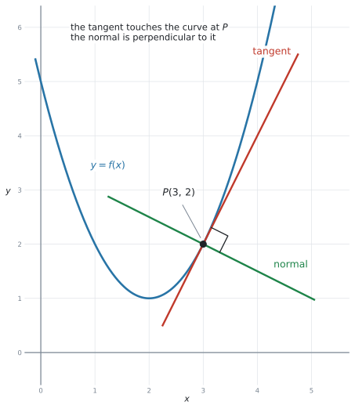
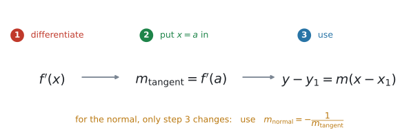
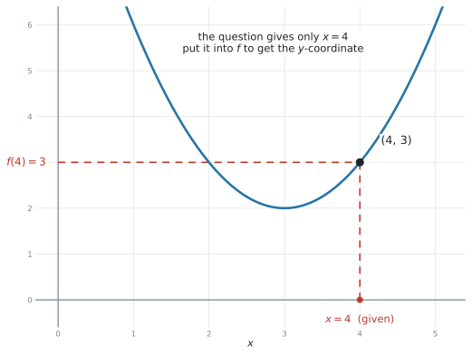
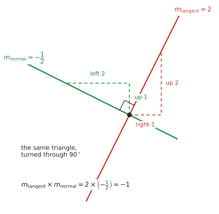
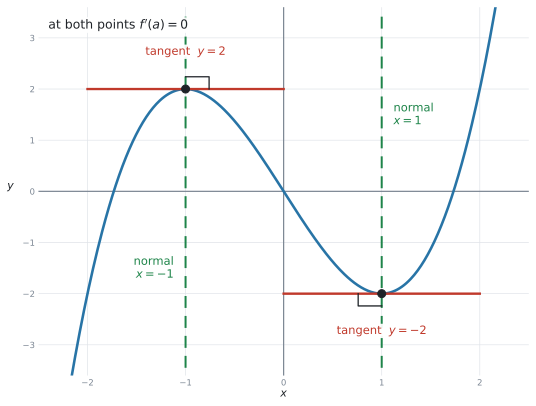

# SL 5.4 — Tangents and normals（接線と法線） {#sec-sl-5-4}

::: {.callout-note}
## What you should be able to do
- **tangent**（接線）と **normal**（法線）が、図の上で分かる。
- 与えられた $x = a$ に対して、**$y$ 座標を $f(a)$ から自分で作れる**。
- **接線の傾きが $f'(a)$** だと分かり、接線の式を求められる。
- **法線の傾きが $-\dfrac{1}{f'(a)}$** だと分かり、法線の式を求められる。
- $f'(a) = 0$ のときの**特別な形**（接線が水平、法線が垂直）を書ける。
- 「傾きが $k$ になる点」「ある直線と平行な接線」を求められる。
- 答えを **$y = mx + c$** でも **$ax + by + d = 0$** でも書ける。
- **電卓で確かめられる**（シラバスが `analytic approaches and technology` の両方を求めています）。
:::

::: {.callout-important}
## Formula booklet に、この項目の欄はありません
公式集の Topic 5 の欄は **5.3、5.5、5.8 だけ**です。**5.4 の欄はありません。**

ただし、**必要な式はすでに配られています。** [SL 2.1](../02-functions/sl-2-1.qmd) の欄にある直線の式です。

$$
y = mx + c, \qquad ax + by + d = 0, \qquad y - y_1 = m(x - x_1)
$$ {#eq-sl54-lines}

この項目でやることは、**この式に入れる $m$ と $(x_1, y_1)$ を、微分で作ること**だけです。

**この本では、接線の傾きを $m_{\text{tangent}}$、法線の傾きを $m_{\text{normal}}$ と書きます。** どちらの話をしているのかが、記号を見るだけで分かるようにするためです。

一方、**次の2つは公式集に載っていません。** 自分で覚えてください。

$$
m_{\text{tangent}} = f'(a), \qquad\qquad m_{\text{normal}} = -\frac{1}{f'(a)}
$$ {#eq-sl54-grads}

$-\dfrac{1}{m}$ は [SL 3.5](../03-geometry-and-trigonometry/sl-3-5.qmd#perp-gradient) で出てきたものと**まったく同じ**です。あちらは垂直二等分線、こちらは法線。**使う場面が違うだけ**です。
:::

## The idea

### 1. tangent と normal {#what}

**tangent line**（接線）は、**その点で曲線と同じ傾きをもつ直線**です。[SL 5.1](sl-5-1.qmd) で「弦の傾きを近づけていった先」として見た、あの直線です。

**接線が曲線を横切ることもあります。** 「触れるだけで交わらない」とはかぎりません。

**normal line**（法線）は、**その点で tangent line に垂直な直線**です。

{#fig-sl54-idea width=74%}

@fig-sl54-idea の $P$ で、赤い接線と緑の法線が**直角に交わっています。**

| 英語 | 日本語 | その点での傾き |
|---|---|---|
| **tangent** | 接線 | $f'(a)$ |
| **normal** | 法線 | $-\dfrac{1}{f'(a)}$ |

: 接線と法線 {#tbl-sl54-two}

::: {.callout-tip}
## `normal` は「ふつうの」ではありません
**normal line**（法線）は、**その点で tangent line に垂直な直線**のことです。「ふつうの直線」ではありません。

$2$ 直線が垂直であることは `perpendicular` と言いますが、**曲線の接線に垂直な直線**を指すときは `normal` と言います。
:::

### 2. 手順は3つです {#steps}

どんな問題でも、やることは同じです。

{#fig-sl54-steps width=94%}

1. **$f'(x)$ を求める**（[SL 5.3](sl-5-3.qmd) の公式）
2. **$x = a$ を代入して、接線の傾き $m_{\text{tangent}} = f'(a)$ を出す**
3. **$y - y_1 = m(x - x_1)$ に入れる**

**法線のときは、手順3で使う傾きが $m_{\text{tangent}}$ から $m_{\text{normal}}$ に変わるだけ**です。手順1と2はまったく同じです。

::: {.callout-note}
## $(x_1, y_1)$ は、接点そのものです
接線も法線も、**同じ点 $P$ を通ります。** ですから、代入する $(x_1, y_1)$ は**どちらも同じ**です。

変わるのは傾きだけ（$m_{\text{tangent}}$ か $m_{\text{normal}}$ か）。**$1$ つの問題で $(a,\ f(a))$ を $1$ 回求めれば、接線にも法線にも使えます。**
:::

### 3. $y$ 座標は、自分で作ります {#y-coordinate}

**この項目で一番よく落とすところ**です。

問題文は、たいてい **$x = 4$ における接線を求めなさい**という形で来ます。**$y$ 座標は書いてありません。**

{#fig-sl54-point width=80%}

$f(x) = x^2 - 6x + 11$ なら、

$$
f(4) = 16 - 24 + 11 = 3
$$

なので、接点は **$(4,\ 3)$** です。

傾きのほうは、**微分した式**に入れます。

$$
f'(x) = 2x - 6 \quad \Rightarrow \quad m_{\text{tangent}} = f'(4) = 2(4) - 6 = 2
$$

点と傾きがそろったので、[手順3](#steps)の式に入れます。

$$
y - 3 = 2(x - 4)
$$

よって、$x = 4$ における接線の方程式は

$$
y = 2x - 5
$$

です。**点だけ、あるいは傾きだけでは、ここまでたどり着けません。**

::: {.callout-warning}
## $f(a)$ と $f'(a)$ の両方が要ります
$$
f(4) = 3 \ \longrightarrow \ \text{点} \ (4,\ 3) \qquad\qquad f'(4) = 2 \ \longrightarrow \ m_{\text{tangent}} = 2
$$

**この $2$ つは別の計算**です。片方だけで止まると、直線の式が作れません。

**「もとの式に入れる」→ 点。「微分した式に入れる」→ 傾き。** 声に出して確かめてください。
:::

### 4. 法線の傾きは、三角形を $90^\circ$ まわしたもの {#normal-gradient}

接線の傾きを $m_{\text{tangent}}$、法線の傾きを $m_{\text{normal}}$ と書くことにします。**どちらの傾きの話なのかが、記号だけで分かります。**

$m_{\text{tangent}} = 2$ なら、$m_{\text{normal}} = -\dfrac{1}{2}$ です。

{#fig-sl54-normal width=74%}

@fig-sl54-normal を見てください。

- 接線 … **右へ $1$、上へ $2$** → $m_{\text{tangent}} = 2$
- 法線 … **上へ $1$、左へ $2$** → $m_{\text{normal}} = \dfrac{1}{-2} = -\dfrac{1}{2}$

**同じ三角形を $90^\circ$ 回しただけ**です。だから

$$
m_{\text{tangent}} \times m_{\text{normal}} = 2 \times \left(-\frac{1}{2}\right) = -1 .
$$

::: {.callout-important}
## 「逆数にして符号を変える」です
$$
m_{\text{normal}} = -\frac{1}{m_{\text{tangent}}}
$$

| $m_{\text{tangent}}$ | $m_{\text{normal}}$ |
|---|---|
| $2$ | $-\dfrac{1}{2}$ |
| $-3$ | $\dfrac{1}{3}$ |
| $\dfrac{3}{4}$ | $-\dfrac{4}{3}$ |

: 接線の傾きから法線の傾きへ {#tbl-sl54-flip}

**$2$ つの操作**をします。**ひっくり返す**、そして**符号を変える**。片方だけで止まる誤りが多いところです。

$m_{\text{tangent}}$ がもともと負なら、**$m_{\text{normal}}$ は正**になります。
:::

### 5. $f'(a) = 0$ のときは、特別な形になります {#special}

$m_{\text{tangent}} = 0$ のとき、$-\dfrac{1}{0}$ は計算できません。**割り算をしてはいけません。**

このときは、**図で考えます。**

{#fig-sl54-special width=82%}

- **接線は水平** → 式は **$y = f(a)$** … $y$ が定数の形（**横**の線）
- **法線は垂直** → 式は **$x = a$** … $x$ が定数の形（**たて**の線）

@fig-sl54-special は $f(x) = x^3 - 3x$ です。$f'(x) = 3x^2 - 3 = 0$ より $x = \pm 1$。

| 点 | 接線 | 法線 |
|---|---|---|
| $(-1,\ 2)$ | $y = 2$ | $x = -1$ |
| $(1,\ -2)$ | $y = -2$ | $x = 1$ |

: $f'(a) = 0$ のときの接線と法線 {#tbl-sl54-special}

::: {.callout-warning}
## $x = -1$ を $y = -1$ と書かないでください
**垂直な直線は $x = $ 定数**です。$y = $ ではありません。

$x = -1$ は「$x$ 座標がずっと $-1$ の線」、つまり**たての線**です。[SL 3.5](../03-geometry-and-trigonometry/sl-3-5.qmd#special) でも同じ注意をしました。

迷ったら、**その線が図でたてか横かを見てください。** たてなら $x =$、横なら $y =$ です。
:::

### 6. 答えの形 {#form}

問題文が形を指定していなければ、**$y = mx + c$ で書けば十分**です。

指定があるときは、そのとおりに整理します。

| 問題文 | 書き方 |
|---|---|
| （指定なし） | $y = 2x - 5$ |
| `in the form y = mx + c` | $y = 2x - 5$ |
| `in the form ax + by + d = 0` | $2x - y - 5 = 0$ |

: 答えの形 {#tbl-sl54-form}

::: {.callout-tip}
## $ax + by + d = 0$ に直すときは、分数を消してから
$y = -\dfrac{1}{4}x + \dfrac{11}{2}$ なら、**両辺を $4$ 倍**します。

$$
4y = -x + 22 \quad \Rightarrow \quad x + 4y - 22 = 0
$$

**$a$、$b$、$d$ は整数にする**のがふつうです。$ax + by + d = 0$ は公式集の [SL 2.1](../02-functions/sl-2-1.qmd) にある形です。
:::

## Why it works

:::: {.callout-note collapse="true" appearance="simple"}
## クリックすると開きます
なぜ「接線の傾き $= f'(a)$」なのかは、[SL 5.1](sl-5-1.qmd#chord) ですでに見ました。**$f'(a)$ は、その点での接線の傾きそのもの**として作られた量だからです。

ここで説明するのは、**法線の傾きがなぜ $-\dfrac{1}{m}$ になるか**です。

傾き $m$ の直線は、**右へ $1$ 進むと縦に $m$ 変わります。** 向きを表すのは、横 $1$・縦 $m$ の組 $(1,\ m)$ です。

これを $90^\circ$ 回すと、**横の分と縦の分が入れかわり、片方の符号が変わります。**

$$
(1,\ m) \ \longrightarrow \ (-m,\ 1)
$$

新しい向きの傾きは「縦 $\div$ 横」ですから、

$$
\frac{1}{-m} = -\frac{1}{m} .
$$

@fig-sl54-normal が、まさにこの計算を絵にしたものです。$(1,\ 2)$ を回すと $(-2,\ 1)$、傾きは $\dfrac{1}{-2} = -\dfrac{1}{2}$。

**掛けると $-1$ になる**ことも、すぐ確かめられます。

$$
m \times \left(-\frac{1}{m}\right) = -1
$$

これは [SL 2.1](../02-functions/sl-2-1.qmd) の `perpendicular: m₁ × m₂ = −1` そのものです。**新しいことは何もありません。**

::: {.callout-note appearance="simple"}
$m = 0$（水平な線）のときだけ、この式が使えません。$-\dfrac{1}{0}$ が計算できないからです。

**そのときは、垂直な線は $x = a$。** [第5節](#special)のとおりです。
:::
::::

## Worked examples

::: {.callout-note appearance="simple"}
問題文は英語です。意味が理解できなかったら、問題文の下の「**日本語訳**」を開いてください。解説は日本語です。
:::

::: {#exm-sl54-tangent}
[The function $f$ is given by $f(x) = x^{2} - 4x + 5$.]{.q-en}

[Find the equation of the tangent to the curve $y = f(x)$ at the point where $x = 3$.]{.q-en}

<details class="jp-trans">
<summary>日本語訳</summary>

関数 $f$ が $f(x) = x^{2} - 4x + 5$ で与えられています。

$x = 3$ の点における曲線 $y = f(x)$ の接線の方程式を求めなさい。

</details>

---

**手順1 … 微分します。**

$$
f'(x) = 2x - 4
$$

**手順2 … 傾きを出します。**

$$
m_{\text{tangent}} = f'(3) = 2(3) - 4 = 2
$$

**点の $y$ 座標も要ります。** [もとの式](#y-coordinate)に入れます。

$$
f(3) = 9 - 12 + 5 = 2 \quad \Rightarrow \quad (3,\ 2)
$$

**手順3 … 直線の式に入れます。**

$$
y - 2 = 2(x - 3)
$$

$$
y - 2 = 2x - 6 \quad \Rightarrow \quad y = 2x - 4
$$

::: {.callout-tip}
## 検算は、接点を入れるだけ
できた式に $x = 3$ を入れて、$y$ が $2$ に戻るか見ます。

$$
2(3) - 4 = 2 \quad ✓
$$

**接線は必ず接点を通ります。** これが合わなければ、どこかで計算を間違えています。**$10$ 秒で終わる検算**です。
:::

::: {.callout-note}
## 解答例（答案用紙にはこう書く）
$f'(x) = 2x - 4$

$m_{\text{tangent}} = f'(3) = 2$,  $f(3) = 2$

$y - 2 = 2(x - 3)$

$y = 2x - 4$
:::
:::

::: {#exm-sl54-normal}
[The curve $C$ has equation $y = x^{3} - 6x^{2} + 8x + 1$. The point $P$ on $C$ has $x$-coordinate $1$.]{.q-en}

**(a)** [Find the coordinates of $P$.]{.q-en}

**(b)** [Find the equation of the tangent to $C$ at $P$.]{.q-en}

**(c)** [Find the equation of the normal to $C$ at $P$.]{.q-en}

<details class="jp-trans">
<summary>日本語訳</summary>

曲線 $C$ の方程式は $y = x^{3} - 6x^{2} + 8x + 1$ です。$C$ 上の点 $P$ の $x$ 座標は $1$ です。

**(a)** $P$ の座標を求めなさい。

**(b)** $P$ における $C$ の接線の方程式を求めなさい。

**(c)** $P$ における $C$ の法線の方程式を求めなさい。

</details>

---

**(a)** $x = 1$ を**もとの式**に入れます。

$$
y = 1 - 6 + 8 + 1 = 4 \quad \Rightarrow \quad P(1,\ 4)
$$

**(b)** 微分して、$x = 1$ を入れます。

$$
\frac{dy}{dx} = 3x^{2} - 12x + 8
$$

$$
m_{\text{tangent}} = 3(1)^{2} - 12(1) + 8 = 3 - 12 + 8 = -1
$$

$$
y - 4 = -1(x - 1) \quad \Rightarrow \quad y = -x + 5
$$

**(c)** [法線の傾きは、ひっくり返して符号を変えます。](#normal-gradient)

$$
m_{\text{normal}} = -\frac{1}{-1} = 1
$$

$$
y - 4 = 1(x - 1) \quad \Rightarrow \quad y = x + 3
$$

::: {.callout-important}
## $-\dfrac{1}{-1}$ は $1$ です
分母が負のときに符号を間違えやすいところです。

$$
-\frac{1}{-1} = -(-1) = 1
$$

**接線が右下がりなら、法線は右上がり**です。@fig-sl54-idea を思い出せば、符号の向きは目で確かめられます。
:::

::: {.callout-tip}
## (b) と (c) は、$P$ を使いまわします
**(a)** で求めた $P(1,\ 4)$ を、**(b)** でも **(c)** でも使います。

$2$ 回計算する必要はありません。**変わるのは傾きだけ**（$m_{\text{tangent}} \to m_{\text{normal}}$）です。
:::

::: {.callout-note}
## 解答例（答案用紙にはこう書く）
**(a)** $P(1,\ 4)$

**(b)** $\dfrac{dy}{dx} = 3x^{2} - 12x + 8$,  $m_{\text{tangent}} = -1$

$y - 4 = -(x - 1)$, so $y = -x + 5$

**(c)** $m_{\text{normal}} = 1$

$y - 4 = x - 1$, so $y = x + 3$
:::
:::

::: {#exm-sl54-horizontal}
[The function $f$ is given by $f(x) = x^{3} - 3x$.]{.q-en}

**(a)** [Find the values of $x$ for which the tangent to the curve is horizontal.]{.q-en}

**(b)** [Write down the equation of each of these tangents.]{.q-en}

**(c)** [Write down the equation of the normal at each of these points.]{.q-en}

<details class="jp-trans">
<summary>日本語訳</summary>

関数 $f$ が $f(x) = x^{3} - 3x$ で与えられています。

**(a)** 曲線の接線が水平になる $x$ の値を求めなさい。

**(b)** これらの接線それぞれの方程式を書きなさい。

**(c)** これらの点それぞれにおける法線の方程式を書きなさい。

</details>

---

**(a)** 「水平」は **$f'(x) = 0$** のことです。

$$
f'(x) = 3x^{2} - 3 = 0 \quad \Rightarrow \quad 3(x^{2} - 1) = 0 \quad \Rightarrow \quad x = 1 \ \text{と} \ x = -1
$$

**(b)** それぞれの $y$ 座標を出します。

$$
f(-1) = -1 + 3 = 2, \qquad f(1) = 1 - 3 = -2
$$

水平な直線は **$y = $ 定数**です。

$$
y = 2 \qquad \text{と} \qquad y = -2
$$

**(c)** [法線は垂直](#special)なので、**$x = $ 定数**です。

$$
x = -1 \qquad \text{と} \qquad x = 1
$$

::: {.callout-warning}
## ここで $-\dfrac{1}{0}$ を計算しようとしないでください
$f'(a) = 0$ なので、法線の傾きの公式は**使えません**。

**図を思い出してください。** 接線が水平なら、垂直な線は**たて**。たての線は $x = a$ です。

$0$ で割ろうとして手が止まる、というのがこの設問の落とし穴です。
:::

::: {.callout-note}
## 解答例（答案用紙にはこう書く）
**(a)** $f'(x) = 3x^{2} - 3 = 0$, so $x = -1$ and $x = 1$

**(b)** $y = 2$  and  $y = -2$

**(c)** $x = -1$  and  $x = 1$
:::
:::

::: {#exm-sl54-parallel}
[The curve $C$ has equation $y = x^{2} + 3x - 1$.]{.q-en}

[Find the equation of the tangent to $C$ that is parallel to the line $y = 5x + 7$.]{.q-en}

<details class="jp-trans">
<summary>日本語訳</summary>

曲線 $C$ の方程式は $y = x^{2} + 3x - 1$ です。

直線 $y = 5x + 7$ に平行な、$C$ の接線の方程式を求めなさい。

</details>

---

**この問題は、$x$ が与えられていません。** 与えられているのは**傾き**のほうです。

**parallel**（平行）なので、[SL 2.1](../02-functions/sl-2-1.qmd) のとおり傾きが等しく、$m_{\text{tangent}} = 5$ です。

**手順1 … 微分します。**

$$
\frac{dy}{dx} = 2x + 3
$$

**手順2 … 傾きが $5$ になる $x$ を探します。** ここが逆向きです。

$$
2x + 3 = 5 \quad \Rightarrow \quad 2x = 2 \quad \Rightarrow \quad x = 1
$$

**$y$ 座標を出します。**

$$
y = 1 + 3 - 1 = 3 \quad \Rightarrow \quad (1,\ 3)
$$

**手順3 … 直線の式に入れます。**

$$
y - 3 = 5(x - 1) \quad \Rightarrow \quad y = 5x - 2
$$

::: {.callout-tip}
## 「与えられているのは $x$ か、$m_{\text{tangent}}$ か」を最初に見てください
| 問題文 | 出発点 |
|---|---|
| `at the point where x = 3` | $x$ が分かっている → $f'(3)$ で $m_{\text{tangent}}$ を出す |
| `parallel to y = 5x + 7` | $m_{\text{tangent}}$ が分かっている → $f'(x) = 5$ を解いて $x$ を出す |
| `where the gradient is −2` | $m_{\text{tangent}}$ が分かっている → $f'(x) = -2$ を解く |
| `where the tangent is horizontal` | $m_{\text{tangent}} = 0$ → $f'(x) = 0$ を解く |

: どちらが与えられているか {#tbl-sl54-which}

**どちらから出発するかを取り違えると、まったく進めません。** 問題文を読んだら、まずこの表のどれかを決めてください。
:::

::: {.callout-warning}
## 答えを $y = 5x + 7$ にしないでください
求めるのは、**平行なもう $1$ 本**です。$y$ 切片は $7$ ではありません。

**平行 = 傾きが同じ、位置は違う。** 同じ直線になってしまったら、どこかが違います。
:::

::: {.callout-note}
## 解答例（答案用紙にはこう書く）
$\dfrac{dy}{dx} = 2x + 3$

Parallel, so $2x + 3 = 5$, giving $x = 1$

$y = 1 + 3 - 1 = 3$, so the point is $(1,\ 3)$

$y - 3 = 5(x - 1)$, so $y = 5x - 2$
:::
:::

::: {#exm-sl54-tech}
[The function $f$ is given by $f(x) = x^{3} - 4x^{2} + 2x + 5$.]{.q-en}

**(a)** [Find $f'(x)$.]{.q-en}

**(b)** [Find the equation of the tangent to the graph of $y = f(x)$ at $x = 2.5$, giving your answer in the form $y = mx + c$.]{.q-en}

**(c)** [Explain how you could use your graphic display calculator to check your answer to part (b).]{.q-en}

<details class="jp-trans">
<summary>日本語訳</summary>

関数 $f$ が $f(x) = x^{3} - 4x^{2} + 2x + 5$ で与えられています。

**(a)** $f'(x)$ を求めなさい。

**(b)** $x = 2.5$ における $y = f(x)$ のグラフの接線の方程式を、$y = mx + c$ の形で求めなさい。

**(c)** (b) の答えを電卓でどのように確かめられるかを説明しなさい。

</details>

---

**(a)** 項ごとに微分します。

$$
f'(x) = 3x^{2} - 8x + 2
$$

**(b)** $x = 2.5$ を、**両方**に入れます。

$$
f(2.5) = 15.625 - 25 + 5 + 5 = 0.625
$$

$$
m_{\text{tangent}} = f'(2.5) = 3(6.25) - 8(2.5) + 2 = 18.75 - 20 + 2 = 0.75
$$

$$
y - 0.625 = 0.75(x - 2.5)
$$

$$
y - 0.625 = 0.75x - 1.875 \quad \Rightarrow \quad y = 0.75x - 1.25
$$

**(c)** シラバスが `analytic approaches and technology` の**両方**を求めているところです。

::: {.model-answer}
**試験ではこう書く**

*Graph $y = f(x)$ and $y = 0.75x - 1.25$ on the same axes. The line should touch the curve at $x = 2.5$ without crossing it there. I can also use the calculator to find the numerical derivative of $f$ at $x = 2.5$ and check that it gives $0.75$.*
:::

::: {.callout-tip}
## 小数が出ても、あわてないでください
$0.625$ や $0.75$ のような小数は、$x$ が整数でないときにはふつうに出ます。

**分数のまま進めても構いません。** $f(2.5) = \dfrac{5}{8}$、$m_{\text{tangent}} = \dfrac{3}{4}$ です。**$3$ 桁の有効数字に丸める必要もありません。** ぴったりの値だからです。
:::

::: {.callout-note}
## 解答例（答案用紙にはこう書く）
**(a)** $f'(x) = 3x^{2} - 8x + 2$

**(b)** $f(2.5) = 0.625$,  $m_{\text{tangent}} = f'(2.5) = 0.75$

$y - 0.625 = 0.75(x - 2.5)$, so $y = 0.75x - 1.25$

**(c)** *Graph the curve and the line together and check that the line touches the curve at $x = 2.5$; also check that the numerical derivative at $x = 2.5$ is $0.75$.*
:::
:::

## Common errors

::: {.callout-warning}
## $y$ 座標を求め忘れる
**この項目で一番多い失点です。**

問題が $x = 3$ しかくれなくても、**$(3,\ 2)$ という点が要ります。** $f(3)$ を計算してください。

$y - y_1 = m(x - x_1)$ の $y_1$ が空いたままでは、式が作れません。
:::

::: {.callout-warning}
## $f(a)$ と $f'(a)$ を取りちがえる
$$
f(3) \ \longrightarrow \ \text{点} \qquad\qquad f'(3) \ \longrightarrow \ \text{傾き}
$$

$f(3)$ を傾きに使う、$f'(3)$ を $y$ 座標に使う。**どちらもよくある間違い**です。

**もとの式に入れたら点、微分した式に入れたら傾き。**
:::

::: {.callout-warning}
## 法線で、符号を変えるのを忘れる
$$
f'(a) = 4 \ \Rightarrow \ \frac{1}{4} \qquad ✗ \qquad\qquad f'(a) = 4 \ \Rightarrow \ -\frac{1}{4} \qquad ✓
$$

**ひっくり返す**と**符号を変える**の、**$2$ つ**です。片方で止まらないでください。
:::

::: {.callout-warning}
## 法線で、ひっくり返すのを忘れる
$$
f'(a) = 4 \ \Rightarrow \ -4 \qquad ✗
$$

$-4$ は「符号を変えただけ」です。**逆数にしていません。**

**掛けて $-1$ になるか**を確かめてください。$4 \times (-4) = -16$ なので、これは違います。
:::

::: {.callout-warning}
## $f'(a) = 0$ のときに $-\dfrac{1}{0}$ を計算しようとする
**$0$ では割れません。** ここは公式ではなく、**図**で決めます。

接線が水平 → 法線は**たて** → **$x = a$**。
:::

::: {.callout-warning}
## たての直線を $y = a$ と書いてしまう
$x = 1$ と $y = 1$ は**別の直線**です。

- **$x = 1$** … たての線
- **$y = 1$** … 横の線

図をかいて、**たてか横かを目で確かめて**ください。
:::

::: {.callout-warning}
## 接点の $y$ 座標を $f'$ に入れてしまう
点 $(3,\ 2)$ での傾きを求めるなら、入れるのは **$3$** です。$2$ ではありません。

$f'$ に入れるのは、いつでも **$x$ 座標**です（[SL 5.3](sl-5-3.qmd) と同じ注意です）。
:::

::: {.callout-warning}
## `parallel to ...` の問題で、$x$ を探さずに進む
`parallel to y = 5x + 7` と書かれていたら、**与えられているのは傾き**です。

$f'(x) = 5$ という**方程式を解いて**、$x$ を先に求めてください。
:::

::: {.callout-warning}
## $y - y_1 = m(x - x_1)$ の展開で符号を間違える
$$
y - 4 = -1(x - 1) \quad \Rightarrow \quad y - 4 = -x + 1 \quad \Rightarrow \quad y = -x + 5
$$

$-1 \times (-1) = +1$ です。**かっこの前がマイナスのときは、$1$ 行余分に書いてください。**
:::

::: {.callout-warning}
## 検算をしない
できた式に**接点の $x$ 座標**を入れて、**$y$ 座標に戻るか**を見るだけです。

$$
y = 2x - 4 \ \text{に} \ x = 3 \ \Rightarrow \ y = 2 \quad ✓
$$

**接線も法線も、必ず接点を通ります。** $10$ 秒で、計算ミスの大半が見つかります。
:::

::: {.callout-warning}
## 指定された形に直さない
`in the form ax + by + d = 0` と書かれているのに $y = mx + c$ のまま出すと、点が引かれます。

**問題文の最後の1行を、必ず読んでください。**
:::

## Using your GDC (TI-Nspire CX II)

シラバスは `Use of both analytic approaches and technology` と書いています。**式は手で作り、電卓で確かめる**、という使い方が基本です。

### 1. 傾きを確かめる {#nderiv}

```
menu → 4: Calculus → 1: Numerical Derivative at a Point
```

[SL 5.1](sl-5-1.qmd#nderiv)・[SL 5.3](sl-5-3.qmd#nderiv) と同じ機能です。

$f(x) = x^{3} - 4x^{2} + 2x + 5$、$x = 2.5$ で **$0.75$** と返れば、@exm-sl54-tech の $m_{\text{tangent}}$ は合っています ✓

### 2. $y$ 座標を確かめる

Calculator ページで、関数を定義してしまうのが速いです。

```
Define f(x)=x^3-4x^2+2x+5
f(2.5)
```

**$0.625$** と返れば、接点も合っています ✓

### 3. グラフで、目で確かめる {#graphs}

Graphs ページに、**曲線と、自分の作った直線の両方**を入れます。

```
f1(x) = x^3-4x^2+2x+5
f2(x) = 0.75x-1.25
```

- **接線**なら、$x = 2.5$ で**触れている**（交わって突き抜けていかない）
- **法線**なら、同じ点で**直角に交わっている**

::: {.callout-warning}
## 画面の縦横比で、直角に見えないことがあります
法線が直角に見えなくても、**間違いとはかぎりません。** 画面の $x$ と $y$ の目盛りの幅が違うと、直角はゆがんで見えます。

```
menu → Window/Zoom → Zoom - Square
```

`Zoom - Square` にすると、**縦横の目盛りがそろって**、直角が直角に見えます。
:::

### 4. 傾きから $x$ を探す {#solve}

`parallel to ...` 型の問題では、$f'(x) = m$ を解きます。

```
nSolve(2x+3=5, x)
```

$f'(x)$ が $2$ 次式で解が $2$ つあるときは、範囲を分けて $2$ 回使います（[SL 5.2](sl-5-2.qmd#nsolve) と同じです）。

::: {.callout-important}
## 式は、必ず自分で書いてください
`Find the equation of the tangent` は**式**を求めています。**電卓は式を返しません。**

答案には、少なくとも次の $3$ 行が要ります。

1. $f'(x) = \ldots$
2. $m_{\text{tangent}} = f'(a) = \ldots$ と $f(a) = \ldots$
3. $y - y_1 = m(x - x_1)$ に入れた行

**電卓は、この $3$ 行が合っているかを確かめるために使います。**
:::

## Exercises

::: {.callout-note appearance="simple"}
各問題に、折りたたみが3つ付いています。**日本語訳**、**解答例**（答案用紙に書くべきこと。英語です）、**解説**（なぜそうなるか。日本語です）。

まず自分で解いて、次に解答例と見くらべてください。**解説は、合わなかったときだけ開けば十分です。**
:::

::: {.exercise-block}

[1]{.ex-no} [The function $f$ is given by $f(x) = x^{2} + 2x - 3$.]{.q-en}

[Find the equation of the tangent to the curve $y = f(x)$ at the point where $x = 1$.]{.q-en}

<details class="jp-trans">
<summary>日本語訳</summary>

関数 $f$ が $f(x) = x^{2} + 2x - 3$ で与えられています。

$x = 1$ の点における曲線 $y = f(x)$ の接線の方程式を求めなさい。

</details>

::: {.callout-note collapse="true"}
## 解答例（答案用紙に書くこと）
$f'(x) = 2x + 2$

$m_{\text{tangent}} = f'(1) = 4$,  $f(1) = 1 + 2 - 3 = 0$

$y - 0 = 4(x - 1)$

$y = 4x - 4$
:::

::: {.callout-tip collapse="true"}
## 解説
$y$ 座標が $0$ になりますが、**それでも点は $(1,\ 0)$ です。** $y_1 = 0$ を入れるだけで、何も特別なことはありません。

**検算。** $x = 1$ を答えに入れると $4 - 4 = 0$ ✓
:::

::: {.ex-sep}
:::

[2]{.ex-no} [The curve $C$ has equation $y = x^{3} - 2x$.]{.q-en}

[Find the equation of the tangent to $C$ at the point where $x = 2$.]{.q-en}

<details class="jp-trans">
<summary>日本語訳</summary>

曲線 $C$ の方程式は $y = x^{3} - 2x$ です。

$x = 2$ の点における $C$ の接線の方程式を求めなさい。

</details>

::: {.callout-note collapse="true"}
## 解答例（答案用紙に書くこと）
$\dfrac{dy}{dx} = 3x^{2} - 2$

$m_{\text{tangent}} = 3(4) - 2 = 10$,  $y = 8 - 4 = 4$, so the point is $(2,\ 4)$

$y - 4 = 10(x - 2)$

$y = 10x - 16$
:::

::: {.callout-tip collapse="true"}
## 解説
$3(2)^{2} = 3 \times 4 = 12$ です。$(3 \times 2)^{2} = 36$ ではありません。**指数が先**です。

**検算。** $10(2) - 16 = 4$ ✓
:::

::: {.ex-sep}
:::

[3]{.ex-no} [The function $f$ is given by $f(x) = x^{2} - 6x + 10$.]{.q-en}

[Find the equation of the normal to the curve $y = f(x)$ at the point where $x = 4$.]{.q-en}

<details class="jp-trans">
<summary>日本語訳</summary>

関数 $f$ が $f(x) = x^{2} - 6x + 10$ で与えられています。

$x = 4$ の点における曲線 $y = f(x)$ の法線の方程式を求めなさい。

</details>

::: {.callout-note collapse="true"}
## 解答例（答案用紙に書くこと）
$f'(x) = 2x - 6$

$f'(4) = 2$,  so  $m_{\text{normal}} = -\dfrac{1}{2}$

$f(4) = 16 - 24 + 10 = 2$, so the point is $(4,\ 2)$

$y - 2 = -\dfrac{1}{2}(x - 4)$

$y = -0.5x + 4$
:::

::: {.callout-tip collapse="true"}
## 解説
**$f'(4) = 2$ は接線の傾き**です。ここで止めてはいけません。[ひっくり返して符号を変えて](#normal-gradient) $-\dfrac{1}{2}$ にします。

**検算。** $-0.5(4) + 4 = 2$ ✓　また $2 \times \left(-\dfrac{1}{2}\right) = -1$ ✓
:::

::: {.ex-sep}
:::

[4]{.ex-no} [The curve $C$ has equation $y = x^{2} - 4x$.]{.q-en}

**(a)** [Find the equation of the tangent to $C$ at the point where $x = 1$.]{.q-en}

**(b)** [Find the equation of the normal to $C$ at the same point.]{.q-en}

<details class="jp-trans">
<summary>日本語訳</summary>

曲線 $C$ の方程式は $y = x^{2} - 4x$ です。

**(a)** $x = 1$ の点における $C$ の接線の方程式を求めなさい。

**(b)** 同じ点における $C$ の法線の方程式を求めなさい。

</details>

::: {.callout-note collapse="true"}
## 解答例（答案用紙に書くこと）
$\dfrac{dy}{dx} = 2x - 4$,  $m_{\text{tangent}} = -2$,  $y = 1 - 4 = -3$, so the point is $(1,\ -3)$

**(a)** $y + 3 = -2(x - 1)$, so $y = -2x - 1$

**(b)** $m_{\text{normal}} = \dfrac{1}{2}$

$y + 3 = \dfrac{1}{2}(x - 1)$, so $y = 0.5x - 3.5$
:::

::: {.callout-tip collapse="true"}
## 解説
**$y$ 座標が負**です。$y - (-3) = y + 3$ になります。**符号を $2$ 回まちがえやすいところ**なので、$y - y_1$ の形に一度そのまま書いてから直してください。

**(b)** $f'(1) = -2$ なので、法線は $-\dfrac{1}{-2} = \dfrac{1}{2}$。**負の逆数は正**になります。

**検算。** $-2(1) - 1 = -3$ ✓　$0.5(1) - 3.5 = -3$ ✓
:::

::: {.ex-sep}
:::

[5]{.ex-no} [The curve $C$ has equation $y = \dfrac{4}{x}$, $x \neq 0$.]{.q-en}

**(a)** [Find $\dfrac{dy}{dx}$.]{.q-en}

**(b)** [Find the equation of the tangent to $C$ at the point where $x = 2$.]{.q-en}

**(c)** [Find the equation of the normal to $C$ at the same point.]{.q-en}

<details class="jp-trans">
<summary>日本語訳</summary>

曲線 $C$ の方程式は $y = \dfrac{4}{x}$（$x \neq 0$）です。

**(a)** $\dfrac{dy}{dx}$ を求めなさい。

**(b)** $x = 2$ の点における $C$ の接線の方程式を求めなさい。

**(c)** 同じ点における $C$ の法線の方程式を求めなさい。

</details>

::: {.callout-note collapse="true"}
## 解答例（答案用紙に書くこと）
**(a)** $y = 4x^{-1}$, so $\dfrac{dy}{dx} = -4x^{-2} = -\dfrac{4}{x^{2}}$

**(b)** $m_{\text{tangent}} = -\dfrac{4}{4} = -1$,  $y = \dfrac{4}{2} = 2$, so the point is $(2,\ 2)$

$y - 2 = -(x - 2)$, so $y = -x + 4$

**(c)** $m_{\text{normal}} = 1$

$y - 2 = x - 2$, so $y = x$
:::

::: {.callout-tip collapse="true"}
## 解説
**まず $4x^{-1}$ に書き直します**（[SL 5.3](sl-5-3.qmd#negative)）。分数のままでは微分できません。

法線が $y = x$ という、とてもきれいな形になりました。$y = \dfrac{4}{x}$ のグラフは直線 $y = x$ について対称なので、これは偶然ではありません。

**検算。** $-2 + 4 = 2$ ✓　$y = x$ に $x = 2$ で $y = 2$ ✓
:::

::: {.ex-sep}
:::

[6]{.ex-no} [The function $f$ is given by $f(x) = x^{3} - 12x + 5$.]{.q-en}

**(a)** [Find the values of $x$ for which the tangent to the curve is horizontal.]{.q-en}

**(b)** [Write down the equation of each of these tangents.]{.q-en}

<details class="jp-trans">
<summary>日本語訳</summary>

関数 $f$ が $f(x) = x^{3} - 12x + 5$ で与えられています。

**(a)** 曲線の接線が水平になる $x$ の値を求めなさい。

**(b)** これらの接線それぞれの方程式を書きなさい。

</details>

::: {.callout-note collapse="true"}
## 解答例（答案用紙に書くこと）
**(a)** $f'(x) = 3x^{2} - 12 = 0$, so $x^{2} = 4$, giving $x = 2$ and $x = -2$

**(b)** $f(2) = 8 - 24 + 5 = -11$,  $f(-2) = -8 + 24 + 5 = 21$

$y = -11$  and  $y = 21$
:::

::: {.callout-tip collapse="true"}
## 解説
**答えは $2$ つ**です。$x^{2} = 4$ から $x = \pm 2$（[SL 5.3](sl-5-3.qmd) 演習7と同じ形）。

**(b)** 水平な直線は $y = $ 定数です。$y = -11x$ のように $x$ を付けないでください。

$f(-2)$ の計算に注意。$(-2)^{3} = -8$、$-12(-2) = +24$ です。
:::

::: {.ex-sep}
:::

[7]{.ex-no} [The curve $C$ has equation $y = x^{2} - 8x + 3$.]{.q-en}

[Find the equation of the tangent to $C$ at the point where the gradient of the curve is $2$.]{.q-en}

<details class="jp-trans">
<summary>日本語訳</summary>

曲線 $C$ の方程式は $y = x^{2} - 8x + 3$ です。

曲線の傾きが $2$ になる点における $C$ の接線の方程式を求めなさい。

</details>

::: {.callout-note collapse="true"}
## 解答例（答案用紙に書くこと）
$\dfrac{dy}{dx} = 2x - 8$

$2x - 8 = 2$, so $x = 5$

$y = 25 - 40 + 3 = -12$, so the point is $(5,\ -12)$

$y + 12 = 2(x - 5)$

$y = 2x - 22$
:::

::: {.callout-tip collapse="true"}
## 解説
**与えられているのは傾きのほう**です（[この表](#tbl-sl54-which)の $2$ 行目・$3$ 行目の型）。

$f'(x) = 2$ という**方程式を解いて**、$x = 5$ を先に出します。$x$ が分かってはじめて $y$ 座標が出せます。

**検算。** $2(5) - 22 = -12$ ✓
:::

::: {.ex-sep}
:::

[8]{.ex-no} [The curve $C$ has equation $y = x^{3} + x$.]{.q-en}

[Find the equations of the two tangents to $C$ that are parallel to the line $y = 4x - 1$.]{.q-en}

<details class="jp-trans">
<summary>日本語訳</summary>

曲線 $C$ の方程式は $y = x^{3} + x$ です。

直線 $y = 4x - 1$ に平行な $C$ の接線 $2$ 本の方程式を求めなさい。

</details>

::: {.callout-note collapse="true"}
## 解答例（答案用紙に書くこと）
$\dfrac{dy}{dx} = 3x^{2} + 1$

Parallel, so $3x^{2} + 1 = 4$, giving $x^{2} = 1$ and $x = 1$ or $x = -1$

At $x = 1$: $y = 2$, so $y - 2 = 4(x - 1)$, giving $y = 4x - 2$

At $x = -1$: $y = -2$, so $y + 2 = 4(x + 1)$, giving $y = 4x + 2$
:::

::: {.callout-tip collapse="true"}
## 解説
**`two tangents` と書かれています。** 答えが $2$ つあると、問題文が教えてくれています。

$3x^{2} + 1 = 4$ から $x^{2} = 1$、つまり $x = \pm 1$。**$\pm$ を忘れると、半分しか出ません。**

$2$ 本とも傾きは $4$ で、$y$ 切片だけが違います。**平行なのだから、これで正しい**です。

**検算。** $4(1) - 2 = 2$ ✓　$4(-1) + 2 = -2$ ✓
:::

::: {.ex-sep}
:::

[9]{.ex-no} [The curve $C$ has equation $y = x^{2} + 1$.]{.q-en}

[Find the equation of the normal to $C$ at the point where $x = 2$, giving your answer in the form $ax + by + d = 0$ where $a$, $b$ and $d$ are integers.]{.q-en}

<details class="jp-trans">
<summary>日本語訳</summary>

曲線 $C$ の方程式は $y = x^{2} + 1$ です。

$x = 2$ の点における $C$ の法線の方程式を、$a$、$b$、$d$ が整数である $ax + by + d = 0$ の形で求めなさい。

</details>

::: {.callout-note collapse="true"}
## 解答例（答案用紙に書くこと）
$\dfrac{dy}{dx} = 2x$, so at $x = 2$ the gradient is $4$

$m_{\text{normal}} = -\dfrac{1}{4}$,  $y = 5$, so the point is $(2,\ 5)$

$y - 5 = -\dfrac{1}{4}(x - 2)$

$4y - 20 = -(x - 2) = -x + 2$

$x + 4y - 22 = 0$
:::

::: {.callout-tip collapse="true"}
## 解説
**指定された形に直すところまでが問題**です（[この節](#form)）。

分数を消すために、**両辺を $4$ 倍**します。$4 \times \left(-\dfrac{1}{4}\right) = -1$ なので、右辺は $-(x-2)$ です。

かっこを外すときの符号に注意。$-(x - 2) = -x + 2$ です。

**検算。** $(2,\ 5)$ を入れると $2 + 20 - 22 = 0$ ✓
:::

::: {.ex-sep}
:::

[10]{.ex-no} [A ball is thrown upwards. Its height, in metres, $t$ seconds after it is thrown is modelled by]{.q-en}

$$
h(t) = 20t - 5t^{2}, \qquad 0 \le t \le 4 .
$$

**(a)** [Find $h'(t)$.]{.q-en}

**(b)** [Find the equation of the tangent to the graph of $h$ at $t = 1$.]{.q-en}

**(c)** [Interpret the gradient of this tangent in the context of the question.]{.q-en}

<details class="jp-trans">
<summary>日本語訳</summary>

ボールが上に投げられます。投げてから $t$ 秒後の高さ（m）は、次の式でモデル化されます。

$$
h(t) = 20t - 5t^{2}, \qquad 0 \le t \le 4 .
$$

**(a)** $h'(t)$ を求めなさい。

**(b)** $t = 1$ における $h$ のグラフの接線の方程式を求めなさい。

**(c)** この接線の傾きを、問題の文脈で解釈しなさい。

</details>

::: {.callout-note collapse="true"}
## 解答例（答案用紙に書くこと）
**(a)** $h'(t) = 20 - 10t$

**(b)** $m_{\text{tangent}} = h'(1) = 10$,  $h(1) = 20 - 5 = 15$, so the point is $(1,\ 15)$

$h - 15 = 10(t - 1)$, so $h = 10t + 5$

**(c)** *One second after it is thrown, the ball is rising at $10$ metres per second.*
:::

::: {.callout-tip collapse="true"}
## 解説
**文字が $x$、$y$ ではありません。** $t$ と $h$ です。式もそのまま $h - h_1 = m(t - t_1)$ で書きます。

**(c)** 接線の傾きは $h'(1) = 10$、つまり[変化率](sl-5-1.qmd#rate)です。単位は「m / 秒」＝**速さ**です。

**`rising`（上がっている）**という語を入れてください。$10$ が正なので、ボールはまだ上昇中です。

**検算。** $10(1) + 5 = 15$ ✓
:::

::: {.ex-sep}
:::

[11]{.ex-no} [The function $f$ is given by $f(x) = x^{3} - 3x^{2} - 9x + 5$.]{.q-en}

**(a)** [Show that $f'(x) = 3(x - 3)(x + 1)$.]{.q-en}

**(b)** [Find the coordinates of the two points at which the tangent to the curve is horizontal.]{.q-en}

**(c)** [Write down the equation of the tangent at each of these points.]{.q-en}

**(d)** [Write down the equation of the normal at each of these points.]{.q-en}

<details class="jp-trans">
<summary>日本語訳</summary>

関数 $f$ が $f(x) = x^{3} - 3x^{2} - 9x + 5$ で与えられています。

**(a)** $f'(x) = 3(x - 3)(x + 1)$ となることを示しなさい。

**(b)** 曲線の接線が水平になる $2$ 点の座標を求めなさい。

**(c)** これらの点それぞれにおける接線の方程式を書きなさい。

**(d)** これらの点それぞれにおける法線の方程式を書きなさい。

</details>

::: {.callout-note collapse="true"}
## 解答例（答案用紙に書くこと）
**(a)** $f'(x) = 3x^{2} - 6x - 9$

$3(x-3)(x+1) = 3(x^{2} - 2x - 3) = 3x^{2} - 6x - 9$ ✓

**(b)** $f'(x) = 0$ gives $x = 3$ and $x = -1$

$f(-1) = -1 - 3 + 9 + 5 = 10$,  $f(3) = 27 - 27 - 27 + 5 = -22$

The points are $(-1,\ 10)$ and $(3,\ -22)$.

**(c)** $y = 10$  and  $y = -22$

**(d)** $x = -1$  and  $x = 3$
:::

::: {.callout-tip collapse="true"}
## 解説
**この関数は [SL 5.2](sl-5-2.qmd) の演習6、[SL 5.3](sl-5-3.qmd) の演習11 と同じもの**です。

- SL 5.2 … 電卓でグラフをかいて、極大点 $(-1,\ 10)$ と極小点 $(3,\ -22)$ を読みました
- SL 5.3 … $f'(x) = 0$ を解いて、$x = -1$ と $x = 3$ を出しました
- SL 5.4 … その点での接線と法線を書きます

**(b)** の座標は、SL 5.2 で電卓が返したものと**一致します** ✓

**(c)** と **(d)** は、[$f'(a) = 0$ の特別な形](#special)です。接線は横（$y = $ 定数）、法線はたて（$x = $ 定数）。**$-\dfrac{1}{0}$ を計算しないでください。**
:::

:::
