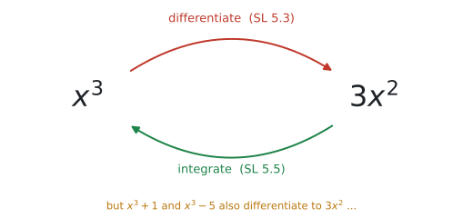
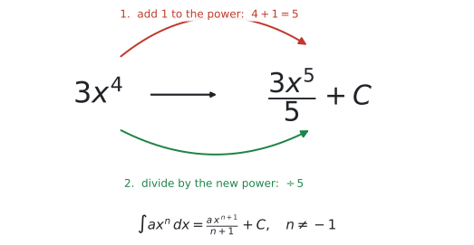
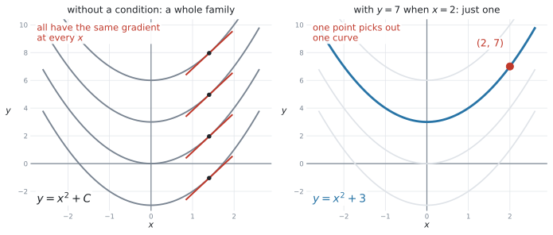
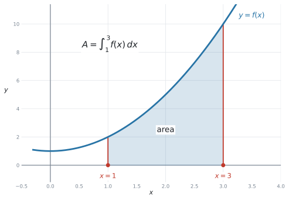
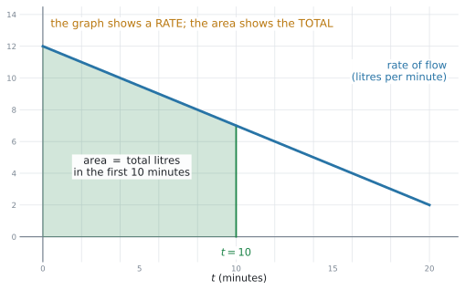

# SL 5.5 — Introduction to integration（積分の導入 — 原始関数と面積） {#sec-sl-5-5}

::: {.callout-note}
## What you should be able to do
- **積分は微分の逆**だと分かる（**anti-differentiation**）。
- $ax^n + bx^{n-1} + \ldots$ の形を積分できる（$n$ は整数、**$n \neq -1$**）。
- **$+C$**（**constant of integration**）を必ず書く。
- **boundary condition**（境界条件。$y = 10$ when $x = 1$ など）から **$C$ の値を決められる**。
- **definite integral**（定積分）を、**電卓で**求められる。
- 曲線 $y = f(x)$ と $x$ 軸ではさまれた**面積**を、$\displaystyle\int_a^b y\,dx$ で求められる。
- **計算する前に、積分の式を書ける**（シラバスが名指しで求めています）。
- 「変化率のグラフの面積 ＝ 合計」を、文脈の中で説明できる。
:::

::: {.callout-important}
## Formula booklet に載っています（2つ）
公式集の **SL 5.5** の欄には、次の2つが印刷されています。

$$
\int x^{n}\,dx = \frac{x^{\,n+1}}{n+1} + C, \quad n \neq -1
$$ {#eq-sl55-booklet}

$$
A = \int_{a}^{b} y\,dx
$$ {#eq-sl55-area}

@eq-sl55-area の見出しは、公式集ではこう書かれています。

> Area of region enclosed by a curve $y = f(x)$ and the $x$-axis, where $f(x) > 0$

**[SL 5.3](sl-5-3.qmd) とまったく同じ落とし穴**があります。公式集の式には**係数 $a$ が付いていません。**

試験に出るのは $3x^{4}$ のように係数の付いた形です。覚えるのはこちらにしてください。

$$
\int a x^{n}\,dx = \frac{a\,x^{\,n+1}}{n+1} + C, \quad n \neq -1
$$ {#eq-sl55-rule}

**$a$ は、そのまま前に残ります。**
:::

## The idea

### 1. Integration（積分）は「微分の逆」です {#reverse}

シラバスの Content 欄の言葉が、そのまま答えです。

> Introduction to integration as **anti-differentiation** of functions of the form $f(x) = ax^{n} + bx^{n-1} + \ldots$, where $n \in \mathbb{Z}$, $n \neq -1$.

**anti-differentiation**（原始関数を求めること）── 「微分をほどく」という意味です。

{#fig-sl55-reverse width=84%}

@fig-sl55-reverse のとおり、[SL 5.3](sl-5-3.qmd) で $x^{3} \to 3x^{2}$ とやったことを、**逆向きに**たどります。

#### 積分の記号 {#notation}

「$3x^{2}$ の anti-derivative（原始関数）を求めなさい」を、記号ではこう書きます。

$$
\int 3x^{2} \, dx
$$

読み方は「**インテグラル $3x^{2}$ ディーエックス**」です。$3$ つの部品でできています。

| 部品 | 名前 | 何を表すか |
|---|---|---|
| $\displaystyle\int$ | **integral sign**（インテグラル） | 「これから積分します」という合図 |
| $3x^{2}$ | **integrand**（被積分関数） | **積分する式**。ここが本体 |
| $dx$ | | 「**$x$ について**積分します」という意味 |

: $\int 3x^{2}\,dx$ の読み方 {#tbl-sl55-notation}

$\displaystyle\int$ と $dx$ は、**$2$ つで $1$ 組のかっこ**だと思ってください。積分する式は、この間にはさみます。

::: {.callout-warning}
## $dx$ を書き忘れないでください
$\displaystyle\int 3x^{2}$ だけでは、式が閉じていません。**$\displaystyle\int$ を書いたら、$dx$ まで書いて $1$ つ**です。

文字が $t$ なら $dt$、$r$ なら $dr$ です。**問題文で使われている文字に合わせます。**
:::

::: {.callout-tip}
## 検算は「微分して戻るか」だけ
積分の答えが合っているかは、**微分してもとに戻るか**を見れば分かります。

$$
\int 3x^{2}\,dx = x^{3} + C \quad \Rightarrow \quad \frac{d}{dx}\left(x^{3}+C\right) = 3x^{2} \quad ✓
$$

**この項目の検算は、これ1つです。** 答えを書いたら必ずやってください。**$10$ 秒で終わります。**
:::

### 2. 公式：1 足して、その数で割る {#rule}

微分は「下ろして掛ける、1 減らす」でした。積分は、その**逆**です。

1. **指数に $1$ 足す**
2. **その新しい指数で割る**

{#fig-sl55-rule width=84%}

@fig-sl55-rule では $3x^{4}$ を積分しています。

- 指数に $1$ 足して、$4 + 1 = 5$
- その $5$ で割って、$\dfrac{3x^{5}}{5}$

$$
\int 3x^{4}\,dx = \frac{3x^{5}}{5} + C
$$

**検算。** $\dfrac{3}{5} \times 5 x^{4} = 3x^{4}$ ✓

項がいくつあっても、**項ごとに**同じことをします。

| $f(x)$ の項 | どうするか | 積分した項 |
|---|---|---|
| $6x^{2}$ | 指数 $3$、$6 \div 3 = 2$ | $2x^{3}$ |
| $-4x$ | $x = x^{1}$、指数 $2$、$-4 \div 2 = -2$ | $-2x^{2}$ |
| $5$ | $5 = 5x^{0}$、指数 $1$、$5 \div 1 = 5$ | $5x$ |

: 項ごとに積分する {#tbl-sl55-terms}

$$
\int \left(6x^{2} - 4x + 5\right)dx = 2x^{3} - 2x^{2} + 5x + C
$$

::: {.callout-warning}
## 定数の積分は $x$ が付きます
$5$ を積分すると **$5x$** です。$5$ のままではありません。

$5 = 5x^{0}$ と考えれば、指数が $1$ になって $5x^{1} = 5x$。

**微分では定数が消えました。積分では、定数から $x$ が生まれます。** ちょうど逆です。
:::

::: {.callout-important}
## $n \neq -1$ の意味
$n = -1$、つまり $\dfrac{1}{x}$ だけは、この公式が使えません。指数に $1$ 足すと $0$ になり、**$0$ で割ることになる**からです。

$$
\frac{x^{0}}{0} \qquad ✗
$$

**AI SL では $\dfrac{1}{x}$ の積分は出ません。** 公式集にも $n \neq -1$ と書いてあります。**気にしなくて構いません。**

$\dfrac{1}{x^{2}}$、$\dfrac{1}{x^{3}}$ は $n = -2$、$n = -3$ なので**出ます。**
:::

### 3. $+C$ を必ず書きます {#plusc}

微分すると**定数は消えます**。ですから逆をたどると、**もとの定数が何だったか分かりません。**

{#fig-sl55-plusc width=96%}

@fig-sl55-plusc の左を見てください。$y = x^{2} - 3$、$y = x^{2}$、$y = x^{2} + 3$、$y = x^{2} + 6$ ── **どれも微分すれば $2x$** です。

上下にずれているだけで、**どの $x$ でも傾きは同じ**だからです。

だから、答えは**どれか1つ**には決まりません。

$$
\int 2x\,dx = x^{2} + C
$$

この **$C$** を **constant of integration**（積分定数）といいます。

::: {.callout-warning}
## $+C$ を書き忘れると、点が引かれます
**この項目で一番多い失点です。**

`Find ∫ ... dx` と書かれていたら、**答えには必ず $+C$** が要ります。

（**定積分**、つまり $\displaystyle\int_a^b$ のときは $C$ は要りません。[第5節](#definite)で説明します。）
:::

### 4. boundary condition で $C$ を決めます {#boundary}

シラバスは、この形を名指ししています。

> Anti-differentiation with a **boundary condition** to determine the constant term.

さらに、Guidance 欄に例まで書いてあります。

> Example: If $\dfrac{dy}{dx} = 3x^{2} + x$ and $y = 10$ when $x = 1$, then $y = x^{3} + \dfrac{1}{2}x^{2} + 8.5$.

**boundary condition**（境界条件／条件として与えられた点）とは、「$x$ がこの値のとき $y$ はこれ」という**1組の情報**です。

@fig-sl55-plusc の右のように、**たくさんある曲線の中から1本を選ぶ**役目をします。

**手順は3つ**です。

1. **積分して、$+C$ 付きの式を書く**
2. **与えられた $x$ と $y$ を代入する**
3. **$C$ について解いて、式に書き戻す**

$\dfrac{dy}{dx} = 2x$ で $y = 7$ のとき $x = 2$ なら、

$$
y = x^{2} + C \quad \Rightarrow \quad 7 = 2^{2} + C \quad \Rightarrow \quad C = 3
$$

$$
y = x^{2} + 3
$$

::: {.callout-tip}
## 最後に、必ず式に書き戻してください
$C = 3$ を求めて終わりにしてはいけません。**問われているのは $y$ の式**です。

$$
C = 3 \qquad ✗ \qquad\qquad y = x^{2} + 3 \qquad ✓
$$
:::

### 5. definite integral（定積分）と面積 {#definite}

**definite integral**（定積分）は、$\displaystyle\int_a^b$ のように**上と下に数が付いた**積分です。値が**1つの数**に決まります。

シラバスの Guidance 欄が、この項目の要点を書いています。

> Students should be aware of the **link between anti-derivatives, definite integrals and area**.

{#fig-sl55-area width=82%}

@fig-sl55-area の色をぬった部分が、その面積です。

**以下では $f(x) > 0$、つまり曲線が $x$ 軸より上にある場合を扱います。この場合、定積分の値がそのまま面積になります。**

公式集の式は次のとおりです。

$$
A = \int_{a}^{b} y\,dx
$$

**$a$ が左、$b$ が右**です。

::: {.callout-important}
## 定積分には $+C$ を書きません
定積分は**数**になります。$C$ は引き算で消えるので、**書く必要がありません。**

- $\displaystyle\int f(x)\,dx$ … **式**が答え → **$+C$ が要る**
- $\displaystyle\int_a^b f(x)\,dx$ … **数**が答え → **$+C$ は要らない**

**上下に数が付いているかどうか**を見て、判断してください。
:::

::: {.callout-warning}
## 公式集の条件「$f(x) > 0$」に注意
公式集には「**曲線が $x$ 軸より上にあるとき**」と書かれています。

軸より下の部分があると、定積分は**負の値**を返します。面積は負になりませんから、そのままでは答えになりません。

**SL 5.5 で面積として求めるのは、$f(x) > 0$ の領域です。** 図をかいて、**軸の上にあることを確かめて**から進んでください。
:::

### 6. 計算する前に、式を書きます {#write-first}

**シラバスが名指しで要求しているところ**です。ここは点に直結します。

> Definite integrals **using technology**. Students are expected to **first write a correct expression before calculating the area**, for example $\displaystyle\int_{2}^{6}\left(3x^{2}+4\right)dx$.

つまり、

1. **まず $\displaystyle\int_{2}^{6}\left(3x^{2}+4\right)dx$ と書く**
2. **それから電卓で値を出す**

::: {.callout-warning}
## 電卓の答えだけを書くと、式の分の点が取れません
$$
A = 224 \qquad ✗
$$

$$
A = \int_{2}^{6}\left(3x^{2}+4\right)dx = 224 \qquad ✓
$$

**式の行が method mark（過程の点）**です。値だけでは、そこがもらえません。

`using technology` と書かれていても、**式を書かなくてよい、という意味ではありません。**
:::

### 7. 変化率のグラフでは、面積が「合計」です {#rate}

シラバスの Connections 欄は `Other contexts: Velocity-time graphs` と書いています。**AI でよく出る使い方**です。

{#fig-sl55-rate width=86%}

@fig-sl55-rate のグラフは、**1分あたり何リットル流れているか**（rate）を示しています。**高さは「速さ」であって「量」ではありません。**

色をぬった面積が、**最初の10分で流れた合計の量**です。

| グラフの縦軸 | 面積の意味 |
|---|---|
| 速度（m / 秒） | 進んだ**距離**（m） |
| 流量（L / 分） | 流れた**合計の量**（L） |
| 費用の変化率（円 / 個） | 増えた**費用**（円） |

: 変化率のグラフと、その面積 {#tbl-sl55-rate}

**単位を見れば分かります。** $\dfrac{\text{L}}{\text{分}} \times \text{分} = \text{L}$。**縦の単位と横の単位を掛けたもの**が、面積の単位です。

## Why it works

:::: {.callout-note collapse="true" appearance="simple"}
## クリックすると開きます
なぜ「定積分＝面積」なのかを、**ざっくり**説明します。

面積を、**細いたんざく（長方形）に切り分ける**ところから始めます。

幅を $\Delta x$、高さを $f(x)$ とすると、$1$ 本のたんざくの面積は $f(x) \times \Delta x$ です。全部足すと、だいたいの面積になります。

$$
A \approx \sum f(x)\,\Delta x
$$

$\Delta x$ をどんどん細くしていくと、この和は**本当の面積**に近づきます（[SL 5.1](sl-5-1.qmd#limit) の極限と同じ考え方です）。その行き先を

$$
A = \int_{a}^{b} f(x)\,dx
$$

と書きます。記号 $\displaystyle\int$ は、**足し算の S**（sum）を縦に伸ばしたものです。$dx$ は、細くなった $\Delta x$ です。

**では、なぜ原始関数で計算できるのでしょうか。**

左端 $a$ から $x$ までの面積を $A(x)$ とします。$x$ を少しだけ $\Delta x$ 増やすと、面積は**細いたんざく1本ぶん**増えます。

$$
A(x + \Delta x) - A(x) \approx f(x)\,\Delta x
$$

両辺を $\Delta x$ で割ると、

$$
\frac{A(x + \Delta x) - A(x)}{\Delta x} \approx f(x) .
$$

左辺は、[SL 5.1](sl-5-1.qmd#chord) で見た**弦の傾き**そのものです。$\Delta x \to 0$ とすると、

$$
A'(x) = f(x) .
$$

**面積の関数を微分すると、もとの関数に戻る。** つまり、**面積の関数は $f$ の原始関数**です。

だから、原始関数 $F$ を使って

$$
\int_{a}^{b} f(x)\,dx = F(b) - F(a)
$$

と計算できます。$C$ は引き算で消えるので、**定積分に $C$ は要りません。**

::: {.callout-note appearance="simple"}
この説明は、**試験には出ません。** シラバスが求めているのは `be aware of the link`（つながりを知っていること）だけです。

**証明を書けと言われることはありません。** ここを読むのは、「なぜ？」が気になる人のためのおまけです。
:::
::::

## Worked examples

::: {.callout-note appearance="simple"}
問題文は英語です。意味が理解できなかったら、問題文の下の「**日本語訳**」を開いてください。解説は日本語です。
:::

::: {#exm-sl55-indefinite}
[Find $\displaystyle\int \left(6x^{2} - 4x + 5\right)dx$.]{.q-en}

<details class="jp-trans">
<summary>日本語訳</summary>

$\displaystyle\int \left(6x^{2} - 4x + 5\right)dx$ を求めなさい。

</details>

---

[項ごとに](#rule)、「$1$ 足して、その数で割る」をします。

- $6x^{2}$ … 指数は $3$、$6 \div 3 = 2$ → $2x^{3}$
- $-4x$ … 指数は $2$、$-4 \div 2 = -2$ → $-2x^{2}$
- $5$ … 指数は $1$、$5 \div 1 = 5$ → $5x$

$$
\int \left(6x^{2} - 4x + 5\right)dx = 2x^{3} - 2x^{2} + 5x + C
$$

::: {.callout-tip}
## 微分して検算します
$$
\frac{d}{dx}\left(2x^{3} - 2x^{2} + 5x + C\right) = 6x^{2} - 4x + 5 \quad ✓
$$

もとに戻りました。**この一手間で、係数の割り忘れが全部見つかります。**
:::

::: {.callout-note}
## 解答例（答案用紙にはこう書く）
$\displaystyle\int \left(6x^{2} - 4x + 5\right)dx = 2x^{3} - 2x^{2} + 5x + C$
:::
:::

::: {#exm-sl55-boundary}
[It is given that $\dfrac{dy}{dx} = 4x - 3$, and that $y = 5$ when $x = 2$.]{.q-en}

[Find an expression for $y$ in terms of $x$.]{.q-en}

<details class="jp-trans">
<summary>日本語訳</summary>

$\dfrac{dy}{dx} = 4x - 3$ であり、$x = 2$ のとき $y = 5$ であることが分かっています。

$y$ を $x$ の式で表しなさい。

</details>

---

**手順1 … 積分します。** $+C$ を忘れずに。

$$
y = 2x^{2} - 3x + C
$$

**手順2 … $x = 2$、$y = 5$ を代入します。**

$$
5 = 2(2)^{2} - 3(2) + C = 8 - 6 + C = 2 + C
$$

**手順3 … $C$ を求めて、書き戻します。**

$$
C = 3 \quad \Rightarrow \quad y = 2x^{2} - 3x + 3
$$

::: {.callout-tip}
## 検算は2つあります
1. **微分して戻るか**：$\dfrac{d}{dx}\left(2x^{2}-3x+3\right) = 4x - 3$ ✓
2. **点を通るか**：$x = 2$ を入れると $8 - 6 + 3 = 5$ ✓

**両方合えば、まず間違いありません。**
:::

::: {.callout-note}
## 解答例（答案用紙にはこう書く）
$y = 2x^{2} - 3x + C$

When $x = 2$, $y = 5$:  $5 = 8 - 6 + C$, so $C = 3$

$y = 2x^{2} - 3x + 3$
:::
:::

::: {#exm-sl55-negative}
[Find $\displaystyle\int \dfrac{6}{x^{3}}\,dx$, giving your answer as a fraction.]{.q-en}

<details class="jp-trans">
<summary>日本語訳</summary>

$\displaystyle\int \dfrac{6}{x^{3}}\,dx$ を求めなさい。答えは分数の形で書きなさい。

</details>

---

**まず書き直します。** [SL 5.3](sl-5-3.qmd#negative) と同じです。分数のままでは公式が使えません。

$$
\frac{6}{x^{3}} = 6x^{-3}
$$

**指数に $1$ 足します。** $-3 + 1 = -2$。

**その $-2$ で割ります。**

$$
\frac{6x^{-2}}{-2} = -3x^{-2}
$$

**分数に戻します。**

$$
\int \frac{6}{x^{3}}\,dx = -\frac{3}{x^{2}} + C
$$

::: {.callout-warning}
## 負の指数に $1$ を足す向きに注意
$-3$ に $1$ を足すと **$-2$** です。**$-4$ ではありません。**

数直線の上で、$-3$ から**右へ $1$ つ**動きます。

$$
-3 + 1 = -2 \qquad ✓ \qquad\qquad -3 + 1 = -4 \qquad ✗
$$

微分のときは**左へ $1$ つ**（$-2 \to -3$）でした。**積分は逆向き**です。
:::

::: {.callout-tip}
## 検算
$$
\frac{d}{dx}\left(-3x^{-2}\right) = -3 \times (-2) x^{-3} = 6x^{-3} = \frac{6}{x^{3}} \quad ✓
$$
:::

::: {.callout-note}
## 解答例（答案用紙にはこう書く）
$\displaystyle\int \frac{6}{x^{3}}\,dx = \int 6x^{-3}\,dx = \frac{6x^{-2}}{-2} + C = -\frac{3}{x^{2}} + C$
:::
:::

::: {#exm-sl55-area}
[The diagram in @fig-sl55-area shows the curve $y = x^{2} + 1$.]{.q-en}

[Find the area of the region enclosed by the curve, the $x$-axis, and the lines $x = 1$ and $x = 3$.]{.q-en}

<details class="jp-trans">
<summary>日本語訳</summary>

@fig-sl55-area は曲線 $y = x^{2} + 1$ を示しています。

この曲線、$x$ 軸、および直線 $x = 1$、$x = 3$ で囲まれた領域の面積を求めなさい。

</details>

---

**まず式を書きます。** [これが point の行](#write-first)です。

$$
A = \int_{1}^{3}\left(x^{2} + 1\right)dx
$$

**それから値を出します。** 電卓で（[GDCの使い方](#calc)）

$$
A = \frac{32}{3} = 10.7 \quad (3 \text{ s.f.})
$$

::: {.callout-note appearance="simple"}
**手で出すこともできます**（必須ではありません）。原始関数を作って、上から下を引きます。

$$
\left[\frac{x^{3}}{3} + x\right]_{1}^{3} = \left(9 + 3\right) - \left(\frac{1}{3} + 1\right) = 12 - \frac{4}{3} = \frac{32}{3}
$$

シラバスは `Definite integrals using technology` と書いているので、**電卓で出して構いません。** 手計算は検算に使ってください。
:::

::: {.callout-tip}
## 答えが妥当かを、図で確かめます
@fig-sl55-area の領域は、だいたい**横 $2$、高さ $2$ 〜 $10$** です。長方形なら $2 \times 2 = 4$ から $2 \times 10 = 20$ のあいだ。

$10.7$ はその真ん中あたりです。**桁が合っている**と分かります。

**$100$ や $0.1$ が出たら、どこかで間違えています。**
:::

::: {.callout-note}
## 解答例（答案用紙にはこう書く）
$A = \displaystyle\int_{1}^{3}\left(x^{2} + 1\right)dx = \dfrac{32}{3} = 10.7$ (3 s.f.)
:::
:::

::: {#exm-sl55-rate}
[Water flows into a tank. The rate of flow, in litres per minute, $t$ minutes after the tap is opened, is modelled by]{.q-en}

$$
r(t) = 12 - 0.5t, \qquad 0 \le t \le 20 .
$$

**(a)** [Write down an expression for the total volume of water that flows into the tank during the first $10$ minutes.]{.q-en}

**(b)** [Find this volume.]{.q-en}

**(c)** [Interpret your answer in the context of the question.]{.q-en}

<details class="jp-trans">
<summary>日本語訳</summary>

水がタンクに流れこみます。蛇口を開けてから $t$ 分後の流量（1分あたりのリットル数）は、次の式でモデル化されます。

$$
r(t) = 12 - 0.5t, \qquad 0 \le t \le 20 .
$$

**(a)** 最初の $10$ 分間にタンクに流れこむ水の合計の量を表す式を書きなさい。

**(b)** この量を求めなさい。

**(c)** 答えを、問題の文脈で解釈しなさい。

</details>

---

**(a)** [グラフの面積が合計](#rate)です。$t = 0$ から $t = 10$ まで。

$$
V = \int_{0}^{10}\left(12 - 0.5t\right)dt
$$

**(b)** 電卓で（[GDCの使い方](#calc)）

$$
V = 95
$$

**(c)** 単位は**リットル**です。$\dfrac{\text{L}}{\text{分}} \times \text{分} = \text{L}$。

::: {.model-answer}
**試験ではこう書く**

*In the first $10$ minutes, a total of $95$ litres of water flows into the tank.*
:::

::: {.callout-tip}
## この問題は、(a) だけで点がもらえます
**(a)** は `Write down an expression` です。**値を出す必要はありません。** 式を書けば、それで点になります。

シラバスが `first write a correct expression before calculating` と指定しているのは、まさにこの形です。
:::

::: {.callout-warning}
## $r(10) = 7$ と答えないでください
$r(10) = 12 - 5 = 7$ は、**$10$ 分の時点での流れる速さ**（1分あたり $7$ L）です。**合計の量ではありません。**

**縦軸の値は「速さ」、面積が「合計」。** @fig-sl55-rate をもう一度見てください。
:::

::: {.callout-note}
## 解答例（答案用紙にはこう書く）
**(a)** $V = \displaystyle\int_{0}^{10}\left(12 - 0.5t\right)dt$

**(b)** $V = 95$ litres

**(c)** *In the first $10$ minutes, a total of $95$ litres of water flows into the tank.*
:::
:::

## Common errors

::: {.callout-warning}
## $+C$ を書き忘れる
**この項目で一番多い失点です。**

上下に数が付いていない積分（indefinite integral）の答えには、**必ず $+C$** が要ります。
:::

::: {.callout-warning}
## 定積分に $+C$ を書いてしまう
$\displaystyle\int_a^b$ の答えは**数**です。$+C$ は書きません。

**上下に数が付いているかどうか**で決まります。
:::

::: {.callout-warning}
## 微分と積分を取りちがえる
$$
\int 3x^{4}\,dx = 12x^{3} + C \qquad ✗
$$

これは**微分**してしまっています。積分は $\dfrac{3x^{5}}{5} + C$。

**指数が増えるのが積分、減るのが微分。** 答えを見て、指数の向きを確かめてください。
:::

::: {.callout-warning}
## 新しい指数で割るのを忘れる
$$
\int 3x^{4}\,dx = 3x^{5} + C \qquad ✗
$$

$1$ 足しただけで止まっています。**「$1$ 足して、その数で割る」の $2$ 手セット**です。

**微分して検算すれば、すぐ気づきます。**
:::

::: {.callout-warning}
## 定数を積分し忘れる
$$
\int \left(2x + 5\right)dx = x^{2} + C \qquad ✗
$$

$5$ が消えています。定数を積分すると **$5x$** が出ます。

$$
\int \left(2x + 5\right)dx = x^{2} + 5x + C \qquad ✓
$$
:::

::: {.callout-warning}
## 負の指数に $1$ を足す向きを間違える
$-3 + 1 = -2$ です。$-4$ ではありません。

**積分は右へ $1$、微分は左へ $1$。**
:::

::: {.callout-warning}
## $C$ を求めて、式に書き戻さない
`Find an expression for y` と聞かれているのに、$C = 3$ で終わってしまう誤りです。

**答えは $y = \ldots$ の形**でなければなりません。
:::

::: {.callout-warning}
## boundary condition の $x$ と $y$ を入れちがえる
`y = 5 when x = 2` なら、**$x$ に $2$、$y$ に $5$** です。

英語の順番が「$y$ が先」なので、つられて逆に入れる誤りが起きます。**日本語で「$x$ が $2$ のとき $y$ が $5$」と言い直してから**代入してください。
:::

::: {.callout-warning}
## 式を書かずに、電卓の値だけを書く
シラバスが `first write a correct expression` と名指ししています。

$\displaystyle\int_a^b(\ldots)dx$ の行がないと、**method mark がもらえません。**
:::

::: {.callout-warning}
## 積分の上下を逆に入れる
$\displaystyle\int_{a}^{b}$ の **$a$ が左（小さいほう）、$b$ が右（大きいほう）**です。

逆に入れると、符号が反対になります。**面積が負になったら、まずここを疑ってください。**
:::

::: {.callout-warning}
## 変化率のグラフで、縦軸の値を答えてしまう
「合計はいくらか」と聞かれたら、**面積**です。グラフの高さではありません。

**縦軸は「速さ」、面積が「合計」。**
:::

::: {.callout-warning}
## 答えに単位を付けない
面積が現実の量を表しているときは、**単位が要ります**（litres、metres、dollars など）。

`Interpret` の設問では、**単位のない数だけでは点になりません。**
:::

## Using your GDC (TI-Nspire CX II)

シラバスは `Definite integrals **using technology**` と書いています。**定積分の値は、電卓で出すのが前提**です。

### 1. Calculator ページで、直接計算する {#calc}

```
menu → Calculus → Numerical Integral
```

テンプレートが出るので、**下に $a$、上に $b$、まん中に式、最後に変数**を入れます。

$$
\int_{1}^{3}\left(x^{2}+1\right)dx \ \longrightarrow \ 10.6667
$$

答えは **$10.7$（$3$ 桁の有効数字）** と書けば十分です。$\dfrac{32}{3}$ と書いても正解です。

### 2. Graphs ページで、面積を見ながら出す {#graphs}

グラフを見ながら求めたいときは、こちらです。

```
f1(x) = x^2+1
menu → Analyze Graph → Integral
```

**左の境界（$x = 1$）と右の境界（$x = 3$）**を指定すると、**面積が画面に色付きで表示され、値も出ます。** ここでも `enter` は $2$ 回です（→ [SL 2.4](../02-functions/sl-2-4.qmd#bounds)）。

::: {.callout-note}
## こちらは、答えが妥当かを目で確かめられます
シラバスが `The use of dynamic geometry or graphing software is encouraged` と書いているのは、この使い方です。

**色のついた領域を見れば、「そのくらいの面積だな」と納得できます。** 桁の間違いも防げます。
:::

### 3. 検算は「微分して戻るか」

不定積分の答えを確かめるときは、**自分の答えを微分して**、もとの式に戻るか見ます。

```
menu → Calculus → Numerical Derivative at a Point
```

$2x^{3}-2x^{2}+5x$ を $x = 2$ で微分すると $6(4)-4(2)+5 = 21$。もとの式 $6x^{2}-4x+5$ に $x=2$ を入れても $21$ ✓

**$1$ 点で合えば、まず間違いありません。**

### 4. 不定積分は、電卓では出せません

$\displaystyle\int \left(6x^{2}-4x+5\right)dx$ のような**式**の答えは、**CAS でない機種では出てきません。**

$$
2x^{3} - 2x^{2} + 5x + C
$$

これは**必ず手で書きます。** [SL 5.3](sl-5-3.qmd#nderiv) の微分と同じ事情です。

::: {.callout-important}
## 電卓の使いどころを、まとめます
| やること | 電卓 |
|---|---|
| $\displaystyle\int f(x)\,dx$（式を求める） | **使えない**。手で書く |
| $C$ を求める | **使わない**。代入するだけ |
| $\displaystyle\int_a^b f(x)\,dx$（値を求める） | **使う**（シラバスがそう指定） |
| 面積を目で確かめる | **使う**（Graphs → Integral） |
| 積分の答えの検算 | **使える**。微分して戻るか見る |

: 電卓を使う場面 {#tbl-sl55-gdc}
:::

## Exercises

::: {.callout-note appearance="simple"}
各問題に、折りたたみが3つ付いています。**日本語訳**、**解答例**（答案用紙に書くべきこと。英語です）、**解説**（なぜそうなるか。日本語です）。

まず自分で解いて、次に解答例と見くらべてください。**解説は、合わなかったときだけ開けば十分です。**
:::

::: {.exercise-block}

[1]{.ex-no} [Find $\displaystyle\int \left(8x^{3} - 6x + 1\right)dx$.]{.q-en}

<details class="jp-trans">
<summary>日本語訳</summary>

$\displaystyle\int \left(8x^{3} - 6x + 1\right)dx$ を求めなさい。

</details>

::: {.callout-note collapse="true"}
## 解答例（答案用紙に書くこと）
$2x^{4} - 3x^{2} + x + C$
:::

::: {.callout-tip collapse="true"}
## 解説
項ごとに「$1$ 足して、その数で割る」。

- $8x^{3}$ … 指数 $4$、$8 \div 4 = 2$ → $2x^{4}$
- $-6x$ … 指数 $2$、$-6 \div 2 = -3$ → $-3x^{2}$
- $1$ … 指数 $1$、$1 \div 1 = 1$ → $x$

**検算。** 微分すると $8x^{3} - 6x + 1$ ✓　**$+C$ を忘れずに。**
:::

::: {.ex-sep}
:::

[2]{.ex-no} [Find $\displaystyle\int \left(10x^{4} + 3x^{2} - 7\right)dx$.]{.q-en}

<details class="jp-trans">
<summary>日本語訳</summary>

$\displaystyle\int \left(10x^{4} + 3x^{2} - 7\right)dx$ を求めなさい。

</details>

::: {.callout-note collapse="true"}
## 解答例（答案用紙に書くこと）
$2x^{5} + x^{3} - 7x + C$
:::

::: {.callout-tip collapse="true"}
## 解説
- $10x^{4}$ … 指数 $5$、$10 \div 5 = 2$ → $2x^{5}$
- $3x^{2}$ … 指数 $3$、$3 \div 3 = 1$ → $x^{3}$（$1x^{3}$ とは書きません）
- $-7$ … → $-7x$

**$-7$ が消えないこと**が要点です。微分とは逆で、定数からは $x$ が生まれます。
:::

::: {.ex-sep}
:::

[3]{.ex-no} [Find each of the following.]{.q-en}

**(a)** [$\displaystyle\int 4\,dx$]{.q-en}

**(b)** [$\displaystyle\int 6x\,dx$]{.q-en}

**(c)** [$\displaystyle\int x^{3}\,dx$]{.q-en}

<details class="jp-trans">
<summary>日本語訳</summary>

次のそれぞれを求めなさい。

</details>

::: {.callout-note collapse="true"}
## 解答例（答案用紙に書くこと）
**(a)** $4x + C$

**(b)** $3x^{2} + C$

**(c)** $\dfrac{x^{4}}{4} + C$
:::

::: {.callout-tip collapse="true"}
## 解説
**(a)** $4 = 4x^{0}$ なので、指数は $1$、$4 \div 1 = 4$ → $4x$。

**(b)** 指数は $2$、$6 \div 2 = 3$ → $3x^{2}$。

**(c)** 係数は $1$。指数は $4$、$1 \div 4 = \dfrac{1}{4}$ → $\dfrac{x^{4}}{4}$。

**割り切れなくても構いません。** $\dfrac{x^{4}}{4}$ でも $0.25x^{4}$ でも正解です。
:::

::: {.ex-sep}
:::

[4]{.ex-no} [Find each of the following, giving your answers as fractions.]{.q-en}

**(a)** [$\displaystyle\int \dfrac{2}{x^{2}}\,dx$]{.q-en}

**(b)** [$\displaystyle\int \dfrac{12}{x^{4}}\,dx$]{.q-en}

<details class="jp-trans">
<summary>日本語訳</summary>

次のそれぞれを求めなさい。答えは分数の形で書きなさい。

</details>

::: {.callout-note collapse="true"}
## 解答例（答案用紙に書くこと）
**(a)** $\displaystyle\int 2x^{-2}\,dx = \dfrac{2x^{-1}}{-1} + C = -\dfrac{2}{x} + C$

**(b)** $\displaystyle\int 12x^{-4}\,dx = \dfrac{12x^{-3}}{-3} + C = -\dfrac{4}{x^{3}} + C$
:::

::: {.callout-tip collapse="true"}
## 解説
**まず書き直します。** $\dfrac{2}{x^{2}} = 2x^{-2}$、$\dfrac{12}{x^{4}} = 12x^{-4}$。

**(a)** $-2 + 1 = -1$。その $-1$ で割るので、符号が変わります。

**(b)** $-4 + 1 = -3$。$12 \div (-3) = -4$。

**どちらも答えがマイナス**になります。**検算。** $\dfrac{d}{dx}\left(-4x^{-3}\right) = 12x^{-4}$ ✓
:::

::: {.ex-sep}
:::

[5]{.ex-no} [It is given that $\dfrac{dy}{dx} = 6x^{2} - 2$, and that $y = 4$ when $x = 1$.]{.q-en}

[Find an expression for $y$ in terms of $x$.]{.q-en}

<details class="jp-trans">
<summary>日本語訳</summary>

$\dfrac{dy}{dx} = 6x^{2} - 2$ であり、$x = 1$ のとき $y = 4$ であることが分かっています。

$y$ を $x$ の式で表しなさい。

</details>

::: {.callout-note collapse="true"}
## 解答例（答案用紙に書くこと）
$y = 2x^{3} - 2x + C$

When $x = 1$, $y = 4$:  $4 = 2 - 2 + C$, so $C = 4$

$y = 2x^{3} - 2x + 4$
:::

::: {.callout-tip collapse="true"}
## 解説
$2 - 2 = 0$ なので、$C$ がそのまま $4$ になります。

**$C = 4$ で止めないでください。** 答えは $y = 2x^{3} - 2x + 4$ です。

**検算。** $x = 1$ を入れると $2 - 2 + 4 = 4$ ✓
:::

::: {.ex-sep}
:::

[6]{.ex-no} [A function $f$ satisfies $f'(x) = 3x^{2} + 4x$ and $f(-1) = 5$.]{.q-en}

[Find $f(x)$.]{.q-en}

<details class="jp-trans">
<summary>日本語訳</summary>

ある関数 $f$ は $f'(x) = 3x^{2} + 4x$ をみたし、$f(-1) = 5$ です。

$f(x)$ を求めなさい。

</details>

::: {.callout-note collapse="true"}
## 解答例（答案用紙に書くこと）
$f(x) = x^{3} + 2x^{2} + C$

$f(-1) = 5$:  $-1 + 2 + C = 5$, so $C = 4$

$f(x) = x^{3} + 2x^{2} + 4$
:::

::: {.callout-tip collapse="true"}
## 解説
**$4x$ の積分は $2x^{2}$** です。指数は $2$、$4 \div 2 = 2$。

代入するのは **$x = -1$** です。$(-1)^{3} = -1$、$2(-1)^{2} = +2$。**符号に注意してください。**

**検算。** $f(-1) = -1 + 2 + 4 = 5$ ✓
:::

::: {.ex-sep}
:::

[7]{.ex-no} [Find the value of $\displaystyle\int_{1}^{4}\left(2x + 3\right)dx$.]{.q-en}

<details class="jp-trans">
<summary>日本語訳</summary>

$\displaystyle\int_{1}^{4}\left(2x + 3\right)dx$ の値を求めなさい。

</details>

::: {.callout-note collapse="true"}
## 解答例（答案用紙に書くこと）
$\displaystyle\int_{1}^{4}\left(2x + 3\right)dx = 24$
:::

::: {.callout-tip collapse="true"}
## 解説
**定積分なので、$+C$ は要りません。** 答えは数です。

電卓（`Numerical Integral`）に入れれば $24$ と返ります。

手で出すなら $\left[x^{2} + 3x\right]_{1}^{4} = (16+12) - (1+3) = 28 - 4 = 24$。

**検算。** $y = 2x+3$ は直線なので、この領域は台形です。上底 $y(1) = 5$、下底 $y(4) = 11$、高さ $3$ で $\dfrac{(5+11) \times 3}{2} = 24$ ✓
:::

::: {.ex-sep}
:::

[8]{.ex-no} [Find the area of the region enclosed by the curve $y = x^{2}$, the $x$-axis, and the lines $x = 0$ and $x = 3$.]{.q-en}

<details class="jp-trans">
<summary>日本語訳</summary>

曲線 $y = x^{2}$、$x$ 軸、および直線 $x = 0$、$x = 3$ で囲まれた領域の面積を求めなさい。

</details>

::: {.callout-note collapse="true"}
## 解答例（答案用紙に書くこと）
$A = \displaystyle\int_{0}^{3} x^{2}\,dx = 9$
:::

::: {.callout-tip collapse="true"}
## 解説
**式の行を必ず書いてください。** $A = \displaystyle\int_{0}^{3} x^{2}\,dx$ が method mark です。

$0 \le x \le 3$ では $x^{2} \ge 0$、つまり**曲線は $x$ 軸より上**にあります。公式集の条件 $f(x) > 0$ をみたしています ✓

**検算。** この領域は、たて $9$・よこ $3$ の長方形（面積 $27$）の中に入っています。$9$ はその $\dfrac{1}{3}$。**桁は合っています。**
:::

::: {.ex-sep}
:::

[9]{.ex-no} [The curve $y = 6x - x^{2}$ crosses the $x$-axis at two points.]{.q-en}

**(a)** [Find the $x$-coordinates of these two points.]{.q-en}

**(b)** [Write down an expression for the area of the region enclosed by the curve and the $x$-axis.]{.q-en}

**(c)** [Find this area.]{.q-en}

<details class="jp-trans">
<summary>日本語訳</summary>

曲線 $y = 6x - x^{2}$ は $x$ 軸と $2$ 点で交わります。

**(a)** この $2$ 点の $x$ 座標を求めなさい。

**(b)** 曲線と $x$ 軸で囲まれた領域の面積を表す式を書きなさい。

**(c)** この面積を求めなさい。

</details>

::: {.callout-note collapse="true"}
## 解答例（答案用紙に書くこと）
**(a)** $6x - x^{2} = 0$, so $x(6 - x) = 0$, giving $x = 0$ and $x = 6$

**(b)** $A = \displaystyle\int_{0}^{6}\left(6x - x^{2}\right)dx$

**(c)** $A = 36$
:::

::: {.callout-tip collapse="true"}
## 解説
**(a)** $x$ 軸との交点は $y = 0$ のときです。**共通因数 $x$ でくくります。**

**(b)** その $2$ つの交点が、そのまま積分の**下と上**になります。$0$ が下、$6$ が上です。

**(c)** 電卓で $36$。

**上に凸の放物線**なので、$0 < x < 6$ では $y > 0$、つまり $x$ 軸より上です ✓

**検算。** 一番高いところは $x = 3$ で $y = 18 - 9 = 9$。よこ $6$・たて $9$ の長方形が $54$。放物線の下の面積はその $\dfrac{2}{3}$ で $36$ です ✓
:::

::: {.ex-sep}
:::

[10]{.ex-no} [A car travels in a straight line. Its speed, in metres per second, $t$ seconds after it starts to slow down, is modelled by]{.q-en}

$$
v(t) = 20 - 0.8t, \qquad 0 \le t \le 25 .
$$

**(a)** [Write down an expression for the distance travelled during the first $10$ seconds.]{.q-en}

**(b)** [Find this distance.]{.q-en}

**(c)** [Interpret your answer in the context of the question.]{.q-en}

<details class="jp-trans">
<summary>日本語訳</summary>

車が直線上を走っています。減速を始めてから $t$ 秒後の速さ（m / 秒）は、次の式でモデル化されます。

$$
v(t) = 20 - 0.8t, \qquad 0 \le t \le 25 .
$$

**(a)** 最初の $10$ 秒間に進んだ距離を表す式を書きなさい。

**(b)** この距離を求めなさい。

**(c)** 答えを、問題の文脈で解釈しなさい。

</details>

::: {.callout-note collapse="true"}
## 解答例（答案用紙に書くこと）
**(a)** $d = \displaystyle\int_{0}^{10}\left(20 - 0.8t\right)dt$

**(b)** $d = 160$

**(c)** *The car travels $160$ metres during the first $10$ seconds.*
:::

::: {.callout-tip collapse="true"}
## 解説
**速度のグラフの面積は、距離**です（[この節](#rate)）。単位で確かめられます。$\dfrac{\text{m}}{\text{秒}} \times \text{秒} = \text{m}$。

**(c)** に **`metres`** を必ず付けてください。単位のない $160$ では点になりません。

**$v(10) = 12$ と答えないように。** それは $10$ 秒後の**速さ**です。

**検算。** 台形の面積で $\dfrac{(20 + 12) \times 10}{2} = 160$ ✓
:::

::: {.ex-sep}
:::

[11]{.ex-no} [A function $f$ satisfies $f'(x) = 3x^{2} - 6x - 9$ and $f(1) = -6$.]{.q-en}

**(a)** [Find $f(x)$.]{.q-en}

**(b)** [Find the values of $x$ for which the tangent to the graph of $f$ is horizontal.]{.q-en}

<details class="jp-trans">
<summary>日本語訳</summary>

ある関数 $f$ は $f'(x) = 3x^{2} - 6x - 9$ をみたし、$f(1) = -6$ です。

**(a)** $f(x)$ を求めなさい。

**(b)** $f$ のグラフの接線が水平になる $x$ の値を求めなさい。

</details>

::: {.callout-note collapse="true"}
## 解答例（答案用紙に書くこと）
**(a)** $f(x) = x^{3} - 3x^{2} - 9x + C$

$f(1) = -6$:  $1 - 3 - 9 + C = -6$, so $C = 5$

$f(x) = x^{3} - 3x^{2} - 9x + 5$

**(b)** $3x^{2} - 6x - 9 = 3(x - 3)(x + 1) = 0$, so $x = 3$ and $x = -1$
:::

::: {.callout-tip collapse="true"}
## 解説
**出てきた関数を見てください。** $f(x) = x^{3} - 3x^{2} - 9x + 5$ ── これは [SL 5.2](sl-5-2.qmd) の演習6、[SL 5.3](sl-5-3.qmd) の演習11、[SL 5.4](sl-5-4.qmd) の演習11 と**同じ関数**です。

- SL 5.3 では、この関数を**微分して** $3x^{2}-6x-9$ を出しました
- SL 5.5 では、$3x^{2}-6x-9$ を**積分して**、もとの関数に戻りました

**boundary condition $f(1) = -6$ があるからこそ、$+5$ まで戻せます。** これがないと $C$ は分かりません。

**(b)** は [SL 5.4](sl-5-4.qmd#special) と同じです。$f'(x) = 0$ を解くだけ。**積分する前の式がそのまま使えます。**
:::

:::
