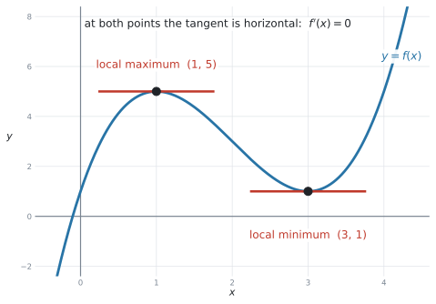
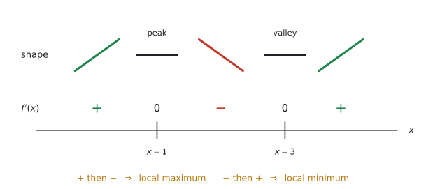
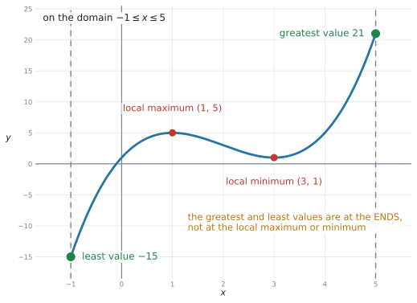
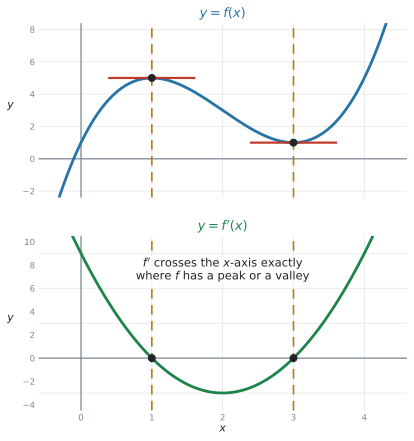
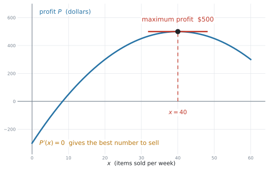

# SL 5.6 — Local maxima and minima（導関数がゼロになる点 — 極大・極小） {#sec-sl-5-6}

::: {.callout-note}
## What you should be able to do
- **$f'(x) = 0$ を解いて**、傾きが $0$ になる $x$ を求められる。
- その $x$ が **local maximum**（極大）か **local minimum**（極小）かを、**理由をつけて**見分けられる。
- 答えを **座標**（$x$ と $y$ の両方）で書ける。
- **local な最大・最小が、その範囲の中で一番大きい／小さい値とはかぎらない**ことが分かる。
- 電卓で **$f'(x)$ のグラフを出し**、$f'(x) = 0$ の解を求められる（シラバスが名指ししています）。
- 利益・面積・体積・費用などの文脈で、結果を**言葉で説明**できる。
:::

::: {.callout-important}
## Formula booklet に、この項目の欄はありません
公式集の Topic 5 の欄は **5.3、5.5、5.8 だけ**です。**5.6 の欄はありません。**

覚えるのは、**手順**です。

**local maximum（極大）や local minimum（極小）を探すときは、まず**

$$
f'(x) = 0
$$ {#eq-sl56-key}

**を解いて候補を見つけます。** ただし、$f'(x) = 0$ だけでは極大か極小かは判断できません。**その前後で $f'(x)$ の符号が変わるかどうかを調べるか、グラフを確認してください。**

シラバスの Content 欄も、短く書いているだけです。

> Values of $x$ where the gradient of a curve is zero. Solution of $f'(x) = 0$. Local maximum and minimum points.
:::

## The idea

### 1. maximum や minimum では、tangent（接線）が水平です {#stationary}

[SL 5.2](sl-5-2.qmd) で、$f'(x) = 0$ が**増加と減少の区切り**だと見ました。[SL 5.4](sl-5-4.qmd#special) では、そこで**接線が水平**になることを見ました。**この場所を stationary point（停留点）と呼びます。**

この項目は、その点に**名前を付けて、座標で答える**項目です。**stationary point のうち、前後で $f'$ の符号が変わるものが local maximum point（極大点）や local minimum point（極小点）です。**

{#fig-sl56-stationary width=86%}

@fig-sl56-stationary は $f(x) = x^{3} - 6x^{2} + 9x + 1$ です。

$$
f'(x) = 3x^{2} - 12x + 9 = 3(x - 1)(x - 3)
$$

$$
f'(x) = 0 \quad \Rightarrow \quad x = 1 \ \text{と} \ x = 3
$$

| 英語 | 日本語 | この例 |
|---|---|---|
| **local maximum point** | 極大点 | $(1,\ 5)$ |
| **local minimum point** | 極小点 | $(3,\ 1)$ |
| **stationary point** | 停留点 | $f'(x) = 0$ となる点。この例では上の $2$ つ |

: この項目の言葉 {#tbl-sl56-words}

::: {.callout-tip}
## 日本語の「極大・極小」と同じものです
日本の教科書では「極大値」「極小値」と習います。**まったく同じもの**です。

ただし試験は英語なので、**`local maximum` / `local minimum` のほうを覚えてください。** `local` を落とさないことが大事です（[第4節](#local-global)）。
:::

### 2. local maximum か local minimum かは、$f'$ の符号で見分けます {#sign}

$f'(x) = 0$ を解いただけでは、**どちらなのかは分かりません。** 両方とも「傾き $0$」だからです。

見分け方は、**その点の前後で $f'$ の符号がどう変わるか**です。

{#fig-sl56-sign width=94%}

| 前後の $f'$ | 形 | 名前 |
|---|---|---|
| $+$ → $0$ → $-$ | 上がって、下がる | **local maximum**（山） |
| $-$ → $0$ → $+$ | 下がって、上がる | **local minimum**（谷） |

: 符号の変化で見分ける {#tbl-sl56-sign}

**やり方は、値を1つずつ入れるだけ**です。$f'(x) = 3(x-1)(x-3)$ なら、

$$
f'(0) = 3(-1)(-3) = 9 > 0
$$

$$
f'(2) = 3(1)(-1) = -3 < 0
$$

$$
f'(4) = 3(3)(1) = 9 > 0
$$

$x = 1$ の前後は **$+$ → $-$** なので **local maximum**、$x = 3$ の前後は **$-$ → $+$** なので **local minimum** です。

::: {.callout-tip}
## 電卓でグラフを見るほうが速いことが多いです
AI では**両方の試験で電卓が使えます。** グラフをかいて、**どちらなのかを目で見る**のが一番速いです。

ただし、`giving a reason`（理由を付けて）と書かれていたら、**理由の一文が要ります。**

*The gradient changes from positive to negative, so it is a local maximum.*

**グラフを見た、では理由になりません。**
:::

::: {.callout-note}
## 2階微分（$f''$）は、AI SL では使いません
AA（Analysis and Approaches）では $f''(x)$ の符号で見分けます。**AI SL のシラバスには $f''$ が入っていません。**

**符号の変化**か、**グラフ**で判断してください。
:::

### 3. 答えは「座標」で書きます {#coordinates}

シラバスの言葉は `Local maximum and minimum points` です。**points**（点）なので、**$x$ と $y$ の両方**が要ります。

$$
(1,\ 5) \quad ✓ \qquad\qquad x = 1 \quad ✗
$$

$y$ 座標は、**もとの式に代入**して出します。

$$
f(1) = 1 - 6 + 9 + 1 = 5
$$

::: {.callout-warning}
## [SL 5.2](sl-5-2.qmd) とは、答え方が違います
| 項目 | 聞かれること | 答え |
|---|---|---|
| SL 5.2 | 増加・減少する**区間** | $x$ の範囲だけ（$0 < x < 4$） |
| SL 5.6 | 極大・極小の**点** | **座標**（$(1,\ 5)$） |

: 答え方のちがい {#tbl-sl56-answer}

**同じ $f'(x) = 0$ から出発しても、聞かれ方が違います。** 問題文が `interval` なのか `coordinates` なのか、**必ず確かめてください。**
:::

::: {.callout-note}
## 「値」だけを聞かれることもあります
- `Find the local maximum value` … $y$ の値だけ（$5$）
- `Find the coordinates of the local maximum point` … 座標（$(1,\ 5)$）

**value なら数、point なら座標**です。[SL 2.4](../02-functions/sl-2-4.qmd) でも同じ区別がありました。
:::

### 4. local は、いちばん大きい／小さいとはかぎりません {#local-global}

**シラバスが名指しで注意しているところ**です。

> **Awareness** that the local maximum/minimum will **not necessarily** be the greatest/least value of the function in the given domain.

{#fig-sl56-localglobal width=84%}

@fig-sl56-localglobal は、同じ $f(x) = x^{3} - 6x^{2} + 9x + 1$ を **$-1 \le x \le 5$** の範囲で見たものです。

| | 値 | どこ |
|---|---|---|
| local maximum | $5$ | $x = 1$ |
| local minimum | $1$ | $x = 3$ |
| **greatest value** | **$21$** | **$x = 5$（範囲の右端）** |
| **least value** | **$-15$** | **$x = -1$（範囲の左端）** |

: local と、範囲全体での最大・最小 {#tbl-sl56-lg}

**local maximum の値（$5$）より、端のほう（$21$）が高い**のです。local minimum も同じで、**その値（$1$）より、端（$-15$）のほうが低い**。

::: {.callout-important}
## 範囲が指定されていたら、端も調べてください
`for 0 ≤ x ≤ 10` のように**範囲が書かれている問題**で、`greatest value`（最大値）や `least value`（最小値）を聞かれたら、

1. $f'(x) = 0$ の解での値
2. **両端での値**

を全部くらべて、**一番大きい／小さいものを選びます。**

`local maximum` と聞かれているなら端は関係ありませんが、`greatest` や `maximum value in the domain` なら**端が答えになることがあります。**
:::

::: {.callout-tip}
## `local` という語が、合図です
- **local** maximum … そのあたりで一番高い点。$f'(x) = 0$ で見つかる
- **greatest** value（または `global` maximum）… 範囲全体で一番高い値。**端も候補**

英語で `local` が付いているかどうかを、**指で押さえて**確かめてください。
:::

### 5. $f'$ のグラフで見つける {#fdash}

シラバスの Guidance 欄は、電卓の使い方を名指ししています。

> Students should be able to use **technology** to generate $f'(x)$ given $f(x)$, and find the solutions of $f'(x) = 0$.

{#fig-sl56-fdash width=66%}

@fig-sl56-fdash の上が $f$、下が $f'$ です。**$f'$ が $x$ 軸と交わる $x$**（ここでは $1$ と $3$）が、**$f$ の stationary point の位置**です。

さらに、$f'$ のグラフを見れば**どちらなのかもすぐ分かります**。

- $f'$ が **上から下へ**軸を横切る（$+$ から $-$）→ $f$ は **local maximum**
- $f'$ が **下から上へ**軸を横切る（$-$ から $+$）→ $f$ は **local minimum**

::: {.callout-warning}
## $f'$ のグラフ自体の山や谷は、答えではありません
@fig-sl56-fdash の下のグラフは、$x = 2$ で谷の形になっています。**これは $f$ の local minimum ではありません。**

$f$ について見るのは、**$f'$ が軸と交わるところだけ**です（[SL 5.2](sl-5-2.qmd#which-graph) と同じ注意です）。
:::

### 6. 手順のまとめ {#steps}

1. **$f'(x)$ を求める**（[SL 5.3](sl-5-3.qmd)）
2. **$f'(x) = 0$ を解く** → $x$ の値
3. **もとの式に代入** → $y$ 座標
4. **local maximum か local minimum かを決める**（符号の変化、またはグラフ）
5. **座標で答える**。理由を求められていたら**一文書く**

範囲が指定されていて `greatest` / `least` を聞かれているなら、**端の値も調べます**（[第4節](#local-global)）。

### 7. 文脈の問題 {#context}

シラバスの Connections 欄は `Other contexts: Profit, area, volume, cost` と書いています。

{#fig-sl56-context width=82%}

@fig-sl56-context は、1週間に $x$ 個売ったときの利益 $P(x) = -0.5x^{2} + 40x - 300$ です。

$$
P'(x) = -x + 40 = 0 \quad \Rightarrow \quad x = 40, \qquad P(40) = 500
$$

**「$40$ 個売ったときに、利益が最大の $500$ ドルになる」** ── ここまで書いて、はじめて答えです。

::: {.callout-important}
## 文脈の問題では、$x$ と $y$ の意味が違います
- **$x = 40$** … 何個売るか（**最大にする方法**）
- **$y = 500$** … いくらもうかるか（**最大の値**）

`How many items should be sold?` なら **$40$**、`Find the maximum profit` なら **$500$ ドル**です。

**どちらを聞かれているかで、答えが変わります。** 両方書いておけば安全、というわけではありません。
:::

## Why it works

:::: {.callout-note collapse="true" appearance="simple"}
## クリックすると開きます
なぜ「$f'(x) = 0$ を探せば stationary point が見つかる」のかを説明します。

$f'(x)$ は**その点での接線の傾き**でした（[SL 5.1](sl-5-1.qmd)）。

山のてっぺんを考えてください。そこへ**左から近づくとき**、グラフは**上がって**います。つまり $f'(x) > 0$。**右へ出ていくとき**は**下がって**います。つまり $f'(x) < 0$。

$$
f'(x) > 0 \ \longrightarrow \ ? \ \longrightarrow \ f'(x) < 0
$$

正の値から負の値へ、**なめらかに**移るのですから、途中で必ず **$0$ を通ります。** その場所が、てっぺんです。

local minimum のときは、$-$ から $+$ へ移るので、やはり途中で $0$ を通ります。

**だから、stationary point を探すことは、$f'(x) = 0$ を解くことと同じ**なのです。

::: {.callout-note appearance="simple"}
逆は必ずしも成り立ちません。**$f'(a) = 0$ でも、local maximum でも local minimum でもない**ことがあります（前後で符号が変わらない場合）。このような点を **stationary point of inflexion**（変曲点となる停留点）といいます。

**AI SL では、その点をこの名前で細かく分類する必要はありません。** ただし、極大・極小を判断するときは、**前後の符号を見るか、グラフを確認してください。** 「$f'(x)=0$ を解いたら、どちらなのかを確かめる」という手順を飛ばさないことが大事です。
:::
::::

## Worked examples

::: {.callout-note appearance="simple"}
問題文は英語です。意味が理解できなかったら、問題文の下の「**日本語訳**」を開いてください。解説は日本語です。
:::

::: {#exm-sl56-cubic}
[The function $f$ is given by $f(x) = x^{3} - 6x^{2} + 9x + 1$.]{.q-en}

**(a)** [Find $f'(x)$.]{.q-en}

**(b)** [Solve $f'(x) = 0$.]{.q-en}

**(c)** [Find the coordinates of the local maximum point and the local minimum point, giving a reason for each.]{.q-en}

<details class="jp-trans">
<summary>日本語訳</summary>

関数 $f$ が $f(x) = x^{3} - 6x^{2} + 9x + 1$ で与えられています。

**(a)** $f'(x)$ を求めなさい。

**(b)** $f'(x) = 0$ を解きなさい。

**(c)** 極大点と極小点の座標を、それぞれ理由をつけて求めなさい。

</details>

---

**(a)**

$$
f'(x) = 3x^{2} - 12x + 9
$$

**(b)** **共通因数 $3$ でくくってから**因数分解します。

$$
3x^{2} - 12x + 9 = 3\left(x^{2} - 4x + 3\right) = 3(x - 1)(x - 3) = 0
$$

$$
x = 1 \quad \text{と} \quad x = 3
$$

**(c)** [$y$ 座標](#coordinates)を出します。

$$
f(1) = 1 - 6 + 9 + 1 = 5, \qquad f(3) = 27 - 54 + 27 + 1 = 1
$$

[符号を調べます。](#sign) 区間の中の値を1つずつ入れます。

$$
f'(0) = 9 > 0, \qquad f'(2) = -3 < 0, \qquad f'(4) = 9 > 0
$$

::: {.model-answer}
**試験ではこう書く**

*$(1,\ 5)$ is a local maximum, because $f'$ changes from positive to negative.*

*$(3,\ 1)$ is a local minimum, because $f'$ changes from negative to positive.*
:::

::: {.callout-tip}
## 符号を調べる $3$ つの値は、計算が楽なものを
区間は $x < 1$、$1 < x < 3$、$x > 3$ の $3$ つ。**それぞれから1つずつ**選びます。

$0$、$2$、$4$ が計算しやすいです。**$0.5$ や $2.7$ を選ぶ必要はありません。**
:::

::: {.callout-note}
## 解答例（答案用紙にはこう書く）
**(a)** $f'(x) = 3x^{2} - 12x + 9$

**(b)** $3(x-1)(x-3) = 0$, so $x = 1$ and $x = 3$

**(c)** $f(1) = 5$, $f(3) = 1$

$f'(0) = 9 > 0$ and $f'(2) = -3 < 0$, so $(1,\ 5)$ is a local maximum.

$f'(2) = -3 < 0$ and $f'(4) = 9 > 0$, so $(3,\ 1)$ is a local minimum.
:::
:::

::: {#exm-sl56-quartic}
[The function $f$ is given by $f(x) = x^{4} - 8x^{2} + 3$.]{.q-en}

**(a)** [Show that $f'(x) = 4x(x - 2)(x + 2)$.]{.q-en}

**(b)** [Find the coordinates of the three stationary points.]{.q-en}

**(c)** [State which of them is a local maximum.]{.q-en}

<details class="jp-trans">
<summary>日本語訳</summary>

関数 $f$ が $f(x) = x^{4} - 8x^{2} + 3$ で与えられています。

**(a)** $f'(x) = 4x(x - 2)(x + 2)$ となることを示しなさい。

**(b)** $3$ つの停留点の座標を求めなさい。

**(c)** そのうちどれが極大点かを述べなさい。

</details>

---

**(a)** `Show that` なので、**与えられた形を展開して**（a）と合わせます。

$$
f'(x) = 4x^{3} - 16x
$$

$$
4x(x-2)(x+2) = 4x\left(x^{2} - 4\right) = 4x^{3} - 16x \quad ✓
$$

**(b)** $f'(x) = 0$ より $x = 0$、$x = 2$、$x = -2$。

$$
f(0) = 3, \qquad f(2) = 16 - 32 + 3 = -13, \qquad f(-2) = 16 - 32 + 3 = -13
$$

$$
(-2,\ -13), \qquad (0,\ 3), \qquad (2,\ -13)
$$

**(c)** 符号を調べます。

$$
f'(-3) = -60 < 0, \quad f'(-1) = 12 > 0, \quad f'(1) = -12 < 0, \quad f'(3) = 60 > 0
$$

::: {.model-answer}
**試験ではこう書く**

*$(0,\ 3)$ is the local maximum, because $f'$ changes from positive to negative there.*
:::

::: {.callout-important}
## この例では、符号が $-\,+\,-\,+$ と並びます
$$
- \quad\big|\quad + \quad\big|\quad - \quad\big|\quad +
$$

**この例では、どの stationary point でも $f'$ の符号が変わる**ので、$x = -2$ で local minimum、$x = 0$ で local maximum、$x = 2$ で local minimum の順になります。

**それぞれの点で、前後の符号を確かめてください。** $1$ つ調べただけで残りを決めることはできません。答案には、聞かれた点の理由を書きます。
:::

::: {.callout-tip}
## $(-2,\ -13)$ と $(2,\ -13)$ は、$y$ が同じです
偶数だけの式（$x^{4}$ と $x^{2}$）なので、**グラフは $y$ 軸について左右対称**です。

$y$ が同じ値になっても、**間違いではありません。**
:::

::: {.callout-note}
## 解答例（答案用紙にはこう書く）
**(a)** $f'(x) = 4x^{3} - 16x$;  $4x(x-2)(x+2) = 4x(x^{2}-4) = 4x^{3} - 16x$ ✓

**(b)** $(-2,\ -13)$, $(0,\ 3)$ and $(2,\ -13)$

**(c)** *$(0,\ 3)$ is the local maximum, because $f'$ changes from positive to negative.*
:::
:::

::: {#exm-sl56-domain}
[The function $f$ is given by $f(x) = x^{3} - 6x^{2} + 9x + 1$ for $-1 \le x \le 5$.]{.q-en}

**(a)** [Write down the coordinates of the local maximum point and the local minimum point.]{.q-en}

**(b)** [Find the greatest value and the least value of $f(x)$ on this domain.]{.q-en}

**(c)** [Explain why your answers to part (b) are not the same as your answers to part (a).]{.q-en}

<details class="jp-trans">
<summary>日本語訳</summary>

関数 $f$ が、$-1 \le x \le 5$ において $f(x) = x^{3} - 6x^{2} + 9x + 1$ で与えられています。

**(a)** 極大点と極小点の座標を書きなさい。

**(b)** この定義域における $f(x)$ の最大値と最小値を求めなさい。

**(c)** (b) の答えが (a) の答えと一致しない理由を説明しなさい。

</details>

---

**(a)** @exm-sl56-cubic と同じ関数です。

$$
(1,\ 5) \ \text{が極大点}, \qquad (3,\ 1) \ \text{が極小点}
$$

**(b)** [端も調べます。](#local-global)

$$
f(-1) = -1 - 6 - 9 + 1 = -15, \qquad f(5) = 125 - 150 + 45 + 1 = 21
$$

$4$ つの値 $-15$、$5$、$1$、$21$ をくらべて、

$$
\text{greatest value} = 21, \qquad \text{least value} = -15
$$

**(c)** `Explain why` なので**言葉で**書きます。

::: {.model-answer}
**試験ではこう書く**

*The local maximum and minimum are found where $f'(x) = 0$, but the greatest and least values on a closed domain can also occur at the endpoints. Here $f(5) = 21$ is larger than the local maximum value $5$, and $f(-1) = -15$ is smaller than the local minimum value $1$.*
:::

::: {.callout-warning}
## $4$ つの値を全部くらべてください
$f'(x) = 0$ の解が $2$ つ、端が $2$ つ。**合わせて $4$ つの候補**があります。

$1$ つでも飛ばすと、答えが変わってしまいます。**表にして並べる**と確実です。

| $x$ | $-1$ | $1$ | $3$ | $5$ |
|---|---|---|---|---|
| $f(x)$ | $-15$ | $5$ | $1$ | $21$ |

: 候補を並べる {#tbl-sl56-candidates}
:::

::: {.callout-note}
## 解答例（答案用紙にはこう書く）
**(a)** Local maximum $(1,\ 5)$; local minimum $(3,\ 1)$

**(b)** $f(-1) = -15$, $f(5) = 21$

Greatest value $21$; least value $-15$

**(c)** *The greatest and least values on a closed domain can occur at the endpoints, not only where $f'(x) = 0$.*
:::
:::

::: {#exm-sl56-profit}
[A company sells $x$ items per week. Its weekly profit, in dollars, is modelled by]{.q-en}

$$
P(x) = -0.5x^{2} + 40x - 300, \qquad 0 \le x \le 60 .
$$

**(a)** [Find $P'(x)$.]{.q-en}

**(b)** [Find the number of items that should be sold each week to make the greatest profit.]{.q-en}

**(c)** [Find this greatest profit.]{.q-en}

**(d)** [Interpret your answers in the context of the question.]{.q-en}

<details class="jp-trans">
<summary>日本語訳</summary>

ある会社は 1 週間に $x$ 個の品物を売ります。1 週間の利益（ドル）は次の式でモデル化されます。

$$
P(x) = -0.5x^{2} + 40x - 300, \qquad 0 \le x \le 60 .
$$

**(a)** $P'(x)$ を求めなさい。

**(b)** 利益を最大にするために、1 週間に何個売ればよいかを求めなさい。

**(c)** その最大の利益を求めなさい。

**(d)** 答えを、問題の文脈で解釈しなさい。

</details>

---

**(a)**

$$
P'(x) = -x + 40
$$

**(b)** $P'(x) = 0$ とおきます。

$$
-x + 40 = 0 \quad \Rightarrow \quad x = 40
$$

**(c)** $x = 40$ を**もとの式**に入れます。

$$
P(40) = -0.5(1600) + 40(40) - 300 = -800 + 1600 - 300 = 500
$$

**(d)**

::: {.model-answer}
**試験ではこう書く**

*The company should sell $40$ items each week. This gives the greatest weekly profit, which is $\$500$.*
:::

::: {.callout-tip}
## 上に凸なので、端は調べなくて大丈夫です
$P$ は $x^{2}$ の係数が負の $2$ 次関数なので、**local maximum が $1$ つだけ**の形です。

端の値は $P(0) = -300$、$P(60) = 300$。どちらも $500$ より小さいので、**$x = 40$ が範囲全体の最大**です。

**$2$ 次関数のときは、この確認は暗算でできます。** $3$ 次以上のときは、[端の値をきちんと計算](#local-global)してください。
:::

::: {.callout-warning}
## (b) と (c) の答えを取りちがえないでください
- **(b)** … `the number of items` → **$40$**（個数）
- **(c)** … `this greatest profit` → **$500$**（ドル）

**(b) に $500$ と書くと、聞かれたものと違う値**になります。問題文が何の量を聞いているか、単位で確かめてください。
:::

::: {.callout-note}
## 解答例（答案用紙にはこう書く）
**(a)** $P'(x) = -x + 40$

**(b)** $-x + 40 = 0$, so $x = 40$ items

**(c)** $P(40) = 500$, so the greatest profit is $\$500$

**(d)** *Selling $40$ items each week gives the greatest weekly profit, $\$500$.*
:::
:::

::: {#exm-sl56-gdc}
[The function $f$ is given by $f(x) = x^{3} - 4x^{2} - 3x + 10$.]{.q-en}

**(a)** [Use your graphic display calculator to find the coordinates of the local maximum point and the local minimum point, giving your answers correct to three significant figures.]{.q-en}

**(b)** [Verify your answer for the local minimum by solving $f'(x) = 0$ algebraically.]{.q-en}

<details class="jp-trans">
<summary>日本語訳</summary>

関数 $f$ が $f(x) = x^{3} - 4x^{2} - 3x + 10$ で与えられています。

**(a)** 電卓を使って、極大点と極小点の座標を、有効数字 $3$ 桁で求めなさい。

**(b)** $f'(x) = 0$ を式で解いて、極小点の答えを確かめなさい。

</details>

---

**(a)** Graphs ページに $f1(x)$ を入れて、`Analyze Graph` で最大点と最小点を出します（[GDCの使い方](#analyze)）。

$$
(-0.333,\ 10.5) \ \text{が極大点}, \qquad (3,\ -8) \ \text{が極小点}
$$

**(b)** 式で確かめます。

$$
f'(x) = 3x^{2} - 8x - 3 = (3x + 1)(x - 3) = 0
$$

$$
x = -\frac{1}{3} \quad \text{と} \quad x = 3
$$

$$
f(3) = 27 - 36 - 9 + 10 = -8 \quad ✓
$$

::: {.callout-tip}
## $x$ が整数でないときこそ、電卓の出番です
$x = -\dfrac{1}{3} = -0.333\ldots$ です。**$3$ 桁の有効数字**で $-0.333$、$y$ は $\dfrac{284}{27} = 10.5185\ldots$ で $10.5$。

シラバスが `use technology` と書いているのは、こういう場面です。**手で $\dfrac{284}{27}$ を計算する必要はありません。**
:::

::: {.callout-warning}
## 電卓の答えを、丸めずに写さないでください
画面には $-0.333333$ や $10.5185$ と出ます。**指定された桁で丸めて**書きます。

`correct to three significant figures` なら **$-0.333$** と **$10.5$** です。
:::

::: {.callout-note}
## 解答例（答案用紙にはこう書く）
**(a)** Local maximum $(-0.333,\ 10.5)$; local minimum $(3,\ -8)$ (3 s.f.)

**(b)** $f'(x) = 3x^{2} - 8x - 3 = (3x+1)(x-3) = 0$, so $x = -\dfrac{1}{3}$ or $x = 3$

$f(3) = -8$ ✓
:::
:::

## Common errors

::: {.callout-warning}
## $x$ の値だけ書いて、座標にしない
**この項目で一番多い失点です。**

`coordinates` や `points` と書かれていたら、**$(1,\ 5)$ のように $2$ つ**書きます。$x = 1$ だけでは足りません。

$y$ 座標は、**もとの式**に代入して出します。
:::

::: {.callout-warning}
## $y$ 座標を $f'$ に代入して出してしまう
$y$ 座標を出すのは **$f$**、傾きを出すのは **$f'$** です。

$f'(1) = 0$ を $y$ 座標にしてしまうと、$(1,\ 0)$ という誤答になります。
:::

::: {.callout-warning}
## local maximum か local minimum かを確かめない
`giving a reason` や `State which is a maximum` と書かれていたら、**理由の一文が要ります。**

*$f'$ changes from positive to negative, so it is a local maximum.*

**$f'(x) = 0$ を解いただけでは、どちらか分かりません。**
:::

::: {.callout-warning}
## 範囲があるのに、端を調べない
`greatest value` / `least value` を聞かれていて、範囲が書かれていたら、**両端の値も候補**です（[第4節](#local-global)）。

**$f'(x)=0$ の解だけを見て答えると、間違えます。**
:::

::: {.callout-warning}
## `local` と `greatest` を同じものだと思う
- `local maximum` … 端は関係ない
- `greatest value in the domain` … 端も候補

**シラバスが名指しで注意している区別**です。
:::

::: {.callout-warning}
## 「値」と「点」を取りちがえる
- `maximum value` … $y$ の値だけ
- `maximum point` … 座標

**`value` か `point` か**を、指で押さえて読んでください。
:::

::: {.callout-warning}
## $f'$ のグラフの山や谷を答えてしまう
$f'$ のグラフで見るのは、**軸と交わるところだけ**です。

$f'$ のグラフ自体の山や谷は、この項目では使いません。
:::

::: {.callout-warning}
## 文脈の問題で、$x$ と $y$ を取りちがえる
- `How many items` … $x$
- `the maximum profit` … $y$

**問題文が何の量を聞いているか**を、単位で確かめてください。
:::

::: {.callout-warning}
## 電卓の値を丸めずに書く
$-0.333333$ ではなく **$-0.333$**（$3$ 桁の有効数字）。

指定がなければ $3$ 桁の有効数字が原則です。
:::

::: {.callout-warning}
## 因数分解の前に共通因数をくくらない
$3x^{2} - 12x + 9$ は、**まず $3$ でくくって** $3(x^{2}-4x+3)$ にすると、$(x-1)(x-3)$ がすぐ見えます。

いきなり解の公式を使う必要はありません。
:::

## Using your GDC (TI-Nspire CX II)

シラバスが名指ししているとおり、**この項目は電卓が主役**です。

### 1. グラフをかいて、stationary point を出す {#analyze}

Graphs ページで $f1(x)$ に式を入れます。

```
menu → Window/Zoom → Zoom - Fit
```

`Zoom - Fit` で $y$ の範囲が自動で合います。次に、

```
menu → Analyze Graph → Maximum
menu → Analyze Graph → Minimum
```

[SL 5.2](sl-5-2.qmd#analyze) と同じ操作です。**下限と上限を、その点をはさむように指定**します。`lower bound?` と `upper bound?` の $2$ 回、`enter` を押します（→ [SL 2.4](../02-functions/sl-2-4.qmd#bounds)）。

::: {.callout-warning}
## はさむ範囲に、stationary point を $2$ つ入れないでください
`Analyze Graph` は、**指定した範囲の中の $1$ つ**しか返しません。

local maximum を探しているなら、**その点だけをはさむ**ように狭く指定してください。
:::

::: {.callout-tip}
## 返ってくるのは座標です
`Maximum` は $(1,\ 5)$ のように **$x$ と $y$ の両方**を返します。

[SL 5.2](sl-5-2.qmd) では $x$ しか使いませんでしたが、**この項目では両方使います。**
:::

### 2. $f'$ のグラフを出す {#fdash-gdc}

シラバスの `use technology to generate f'(x)` は、この操作です。

Graphs ページで、$f1(x)$ に $f(x)$ を入れたあと、$f2(x)$ には**微分のテンプレート**（$\dfrac{d}{d\square}$ の形。電卓のテンプレート画面から出せます）を使って $f1(x)$ を入れます。

```
f2(x) = d/dx( f1(x) )
```

$f2$ のグラフが $x$ 軸と交わるところが、$f$ の stationary point です。その $x$ は

```
menu → Analyze Graph → Zero
```

で出せます。

::: {.callout-note}
## $f'(x)$ の**式**は出てきません
CAS でない機種は、$3x^{2}-12x+9$ のような**式**を返しません（[SL 5.3](sl-5-3.qmd#nderiv)）。

出るのは**グラフ**と、**ある点での値**です。**式は手で書きます。**
:::

### 3. $f'(x) = 0$ を直接解く {#nsolve}

自分で作った $f'(x)$ の式があるなら、Calculator ページで解けます。

```
nSolve(3x^2-12x+9=0, x, 0, 2)
nSolve(3x^2-12x+9=0, x, 2, 5)
```

`nSolve` は**解を $1$ つずつ**返すので、$2$ つあるときは範囲を変えて $2$ 回使います。

$2$ 次式なら、まとめて出す手もあります。

```
polyRoots(3x^2-12x+9, x)
```

### 4. 端の値を出す {#endpoints}

範囲が指定されているときは、端の値も要ります。Calculator ページで関数を定義しておくと速いです。

```
Define f(x)=x^3-6x^2+9x+1
f(-1)
f(5)
```

::: {.callout-important}
## 電卓で出しても、式は書いてください
`Find the coordinates of the local maximum` は、電卓で答えを出して構いません。

ただし、**$f'(x) = \ldots$ と $f'(x) = 0$ の行**を書いておくと、答えが少しずれていても途中点がもらえます。**書いて損はありません。**
:::

## Exercises

::: {.callout-note appearance="simple"}
各問題に、折りたたみが3つ付いています。**日本語訳**、**解答例**（答案用紙に書くべきこと。英語です）、**解説**（なぜそうなるか。日本語です）。

まず自分で解いて、次に解答例と見くらべてください。**解説は、合わなかったときだけ開けば十分です。**
:::

::: {.exercise-block}

[1]{.ex-no} [The function $f$ is given by $f(x) = x^{2} - 6x + 7$.]{.q-en}

[Find the coordinates of the local minimum point.]{.q-en}

<details class="jp-trans">
<summary>日本語訳</summary>

関数 $f$ が $f(x) = x^{2} - 6x + 7$ で与えられています。

極小点の座標を求めなさい。

</details>

::: {.callout-note collapse="true"}
## 解答例（答案用紙に書くこと）
$f'(x) = 2x - 6 = 0$, so $x = 3$

$f(3) = 9 - 18 + 7 = -2$

The local minimum point is $(3,\ -2)$.
:::

::: {.callout-tip collapse="true"}
## 解説
$x^{2}$ の係数が正なので、**下に凸の放物線**。停留点は $1$ つで、それが local minimum です。

**理由を聞かれていないので、符号の確認は書かなくて構いません。** ただし座標は $2$ つとも書きます。

これは [SL 2.4](../02-functions/sl-2-4.qmd) の頂点と同じ点です。**平方完成でも出せます** ✓
:::

::: {.ex-sep}
:::

[2]{.ex-no} [The function $f$ is given by $f(x) = -x^{2} + 8x - 10$.]{.q-en}

[Find the coordinates of the local maximum point.]{.q-en}

<details class="jp-trans">
<summary>日本語訳</summary>

関数 $f$ が $f(x) = -x^{2} + 8x - 10$ で与えられています。

極大点の座標を求めなさい。

</details>

::: {.callout-note collapse="true"}
## 解答例（答案用紙に書くこと）
$f'(x) = -2x + 8 = 0$, so $x = 4$

$f(4) = -16 + 32 - 10 = 6$

The local maximum point is $(4,\ 6)$.
:::

::: {.callout-tip collapse="true"}
## 解説
$-x^{2}$ なので**上に凸**、つまり local maximum です。

$f(4)$ の計算で $-(4)^{2} = -16$ です。$(-4)^{2} = 16$ ではありません。**指数が先、マイナスはあと。**
:::

::: {.ex-sep}
:::

[3]{.ex-no} [The function $f$ is given by $f(x) = x^{3} - 6x^{2} + 5$.]{.q-en}

**(a)** [Find $f'(x)$.]{.q-en}

**(b)** [Find the coordinates of the two stationary points.]{.q-en}

**(c)** [State which is a local maximum, giving a reason.]{.q-en}

<details class="jp-trans">
<summary>日本語訳</summary>

関数 $f$ が $f(x) = x^{3} - 6x^{2} + 5$ で与えられています。

**(a)** $f'(x)$ を求めなさい。

**(b)** $2$ つの停留点の座標を求めなさい。

**(c)** どちらが極大点かを、理由をつけて述べなさい。

</details>

::: {.callout-note collapse="true"}
## 解答例（答案用紙に書くこと）
**(a)** $f'(x) = 3x^{2} - 12x$

**(b)** $3x(x - 4) = 0$, so $x = 0$ and $x = 4$

$f(0) = 5$, $f(4) = 64 - 96 + 5 = -27$

The stationary points are $(0,\ 5)$ and $(4,\ -27)$.

**(c)** $f'(-1) = 15 > 0$ and $f'(1) = -9 < 0$, so $(0,\ 5)$ is a local maximum.
:::

::: {.callout-tip collapse="true"}
## 解説
**これは [SL 5.3](sl-5-3.qmd) の例題4 と同じ関数**です。あちらでは $f'(x)=0$ を解いて $x = 0,\ 4$ まで出しました。

この項目では、そこから **$y$ 座標**と **local maximum か local minimum か**まで進みます。

**(c)** の理由の一文が、点になるところです。
:::

::: {.ex-sep}
:::

[4]{.ex-no} [The function $f$ is given by $f(x) = 2x^{3} - 9x^{2} + 12x - 3$.]{.q-en}

[Find the coordinates of the local maximum point and the local minimum point.]{.q-en}

<details class="jp-trans">
<summary>日本語訳</summary>

関数 $f$ が $f(x) = 2x^{3} - 9x^{2} + 12x - 3$ で与えられています。

極大点と極小点の座標を求めなさい。

</details>

::: {.callout-note collapse="true"}
## 解答例（答案用紙に書くこと）
$f'(x) = 6x^{2} - 18x + 12 = 6(x - 1)(x - 2) = 0$, so $x = 1$ and $x = 2$

$f(1) = 2 - 9 + 12 - 3 = 2$,  $f(2) = 16 - 36 + 24 - 3 = 1$

Local maximum $(1,\ 2)$; local minimum $(2,\ 1)$
:::

::: {.callout-tip collapse="true"}
## 解説
**まず $6$ でくくります。** $6\left(x^{2} - 3x + 2\right) = 6(x-1)(x-2)$。

$y$ の値が $2$ と $1$ で近いので、**local maximum のほうが local minimum より高い**ことを確かめてください。$x$ の小さいほうが local maximum です（$f'$ が $+ \to -$）。

$f(2)$ の計算に注意。$2(2)^{3} = 2 \times 8 = 16$、$-9(2)^{2} = -36$ です。
:::

::: {.ex-sep}
:::

[5]{.ex-no} [The function $f$ is given by $f(x) = x + \dfrac{4}{x}$, for $x > 0$.]{.q-en}

**(a)** [Find $f'(x)$.]{.q-en}

**(b)** [Find the coordinates of the local minimum point.]{.q-en}

<details class="jp-trans">
<summary>日本語訳</summary>

関数 $f$ が、$x > 0$ において $f(x) = x + \dfrac{4}{x}$ で与えられています。

**(a)** $f'(x)$ を求めなさい。

**(b)** 極小点の座標を求めなさい。

</details>

::: {.callout-note collapse="true"}
## 解答例（答案用紙に書くこと）
**(a)** $f(x) = x + 4x^{-1}$, so $f'(x) = 1 - 4x^{-2} = 1 - \dfrac{4}{x^{2}}$

**(b)** $1 - \dfrac{4}{x^{2}} = 0$, so $x^{2} = 4$ and $x = 2$ (since $x > 0$)

$f(2) = 2 + 2 = 4$

The local minimum point is $(2,\ 4)$.
:::

::: {.callout-tip collapse="true"}
## 解説
**まず $4x^{-1}$ に書き直します**（[SL 5.3](sl-5-3.qmd#negative)）。

$x^{2} = 4$ の解は $x = \pm 2$ ですが、**問題文に $x > 0$ と書いてあります。** $x = -2$ は**捨てます**。

**捨てた理由を一言書いておく**と丁寧です。*Reject $x = -2$ since $x > 0$.*
:::

::: {.ex-sep}
:::

[6]{.ex-no} [The function $f$ is given by $f(x) = x^{3} - 3x^{2} - 9x + 5$ for $-2 \le x \le 6$.]{.q-en}

**(a)** [Find the coordinates of the local maximum point and the local minimum point.]{.q-en}

**(b)** [Find the greatest value and the least value of $f(x)$ on this domain.]{.q-en}

<details class="jp-trans">
<summary>日本語訳</summary>

関数 $f$ が、$-2 \le x \le 6$ において $f(x) = x^{3} - 3x^{2} - 9x + 5$ で与えられています。

**(a)** 極大点と極小点の座標を求めなさい。

**(b)** この定義域における $f(x)$ の最大値と最小値を求めなさい。

</details>

::: {.callout-note collapse="true"}
## 解答例（答案用紙に書くこと）
**(a)** $f'(x) = 3x^{2} - 6x - 9 = 3(x - 3)(x + 1) = 0$, so $x = -1$ and $x = 3$

$f(-1) = 10$,  $f(3) = -22$

Local maximum $(-1,\ 10)$; local minimum $(3,\ -22)$

**(b)** $f(-2) = 3$,  $f(6) = 59$

Greatest value $59$; least value $-22$
:::

::: {.callout-tip collapse="true"}
## 解説
**この関数は [SL 5.2](sl-5-2.qmd) 演習6、[SL 5.3](sl-5-3.qmd) 演習11、[SL 5.4](sl-5-4.qmd) 演習11、[SL 5.5](sl-5-5.qmd) 演習11 と同じもの**です。

**(b)** が要点です。候補は $4$ つ。

| $x$ | $-2$ | $-1$ | $3$ | $6$ |
|---|---|---|---|---|
| $f(x)$ | $3$ | $10$ | $-22$ | $59$ |

**最大は $59$（右端）で、極大値 $10$ ではありません。** 最小は $-22$ で、これはたまたま極小値と一致します。

$f(6) = 216 - 108 - 54 + 5 = 59$ ✓
:::

::: {.ex-sep}
:::

[7]{.ex-no} [A function $f$ has derivative $f'(x) = (x - 2)(x + 4)$.]{.q-en}

**(a)** [Find the values of $x$ at which $f$ has a stationary point.]{.q-en}

**(b)** [State which is a local maximum and which is a local minimum, giving a reason.]{.q-en}

<details class="jp-trans">
<summary>日本語訳</summary>

ある関数 $f$ の導関数は $f'(x) = (x - 2)(x + 4)$ です。

**(a)** $f$ が停留点をとる $x$ の値を求めなさい。

**(b)** どちらが極大でどちらが極小かを、理由をつけて述べなさい。

</details>

::: {.callout-note collapse="true"}
## 解答例（答案用紙に書くこと）
**(a)** $x = -4$ and $x = 2$

**(b)** $f'(-5) = 7 > 0$ and $f'(0) = -8 < 0$, so $x = -4$ gives a local maximum.

$f'(0) = -8 < 0$ and $f'(3) = 7 > 0$, so $x = 2$ gives a local minimum.
:::

::: {.callout-tip collapse="true"}
## 解説
**座標は出せません。** $f(x)$ が分かっていないので、$y$ 座標が求められないからです。答えは **$x$ の値だけ**でよい、という設問です。

$f'$ は**下に凸の放物線**なので、外側で正、あいだで負。だから $-4$ が local maximum、$2$ が local minimum です。

**$f'$ のグラフを頭にかく**と、値を入れなくても符号が読めます。ただし答案には、値を入れた行を残してください。
:::

::: {.ex-sep}
:::

[8]{.ex-no} [A function $f$ satisfies $f'(x) = 3x^{2} - 6x$ and $f(0) = 4$.]{.q-en}

**(a)** [Find $f(x)$.]{.q-en}

**(b)** [Find the coordinates of the local maximum point and the local minimum point.]{.q-en}

<details class="jp-trans">
<summary>日本語訳</summary>

ある関数 $f$ は $f'(x) = 3x^{2} - 6x$ をみたし、$f(0) = 4$ です。

**(a)** $f(x)$ を求めなさい。

**(b)** 極大点と極小点の座標を求めなさい。

</details>

::: {.callout-note collapse="true"}
## 解答例（答案用紙に書くこと）
**(a)** $f(x) = x^{3} - 3x^{2} + C$

$f(0) = 4$, so $C = 4$ and $f(x) = x^{3} - 3x^{2} + 4$

**(b)** $3x(x - 2) = 0$, so $x = 0$ and $x = 2$

$f(0) = 4$,  $f(2) = 8 - 12 + 4 = 0$

Local maximum $(0,\ 4)$; local minimum $(2,\ 0)$
:::

::: {.callout-tip collapse="true"}
## 解説
**(a)** は [SL 5.5](sl-5-5.qmd#boundary) の boundary condition です。$f'$ を積分して $+C$ を付け、$f(0) = 4$ から $C = 4$。

**$f(x)$ が分かってはじめて、$y$ 座標が出せます。** (a) を飛ばすと (b) が解けません。

**(b)** $x = 0$ での $y$ 座標は、たまたま $f(0) = 4$ という与えられた値そのものです。
:::

::: {.ex-sep}
:::

[9]{.ex-no} [The cost, in dollars, of making each item when $n$ items are produced is modelled by]{.q-en}

$$
C(n) = 0.02n^{2} - 2n + 80, \qquad 10 \le n \le 90 .
$$

**(a)** [Find $C'(n)$.]{.q-en}

**(b)** [Find the number of items that gives the lowest cost per item.]{.q-en}

**(c)** [Find this lowest cost.]{.q-en}

**(d)** [Interpret your answers in the context of the question.]{.q-en}

<details class="jp-trans">
<summary>日本語訳</summary>

$n$ 個を作るときの 1 個あたりの費用（ドル）は、次の式でモデル化されます。

$$
C(n) = 0.02n^{2} - 2n + 80, \qquad 10 \le n \le 90 .
$$

**(a)** $C'(n)$ を求めなさい。

**(b)** 1 個あたりの費用が最も低くなる個数を求めなさい。

**(c)** そのときの最低の費用を求めなさい。

**(d)** 答えを、問題の文脈で解釈しなさい。

</details>

::: {.callout-note collapse="true"}
## 解答例（答案用紙に書くこと）
**(a)** $C'(n) = 0.04n - 2$

**(b)** $0.04n - 2 = 0$, so $n = 50$

**(c)** $C(50) = 0.02(2500) - 100 + 80 = 50 - 100 + 80 = 30$

**(d)** *Making $50$ items gives the lowest cost per item, which is $\$30$.*
:::

::: {.callout-tip collapse="true"}
## 解説
**(a)** $0.02n^{2}$ … $0.02 \times 2 = 0.04$ → $0.04n$。**小数の係数でも、やることは同じ**です。

**(b)** $0.04n = 2$ から $n = \dfrac{2}{0.04} = 50$。

**(c)** $0.02 \times 2500 = 50$ です。**$50 - 100 + 80 = 30$**。

**(d)** `Interpret` なので、**$50$（個数）と $30$ ドル（費用）の両方**を、問題の言葉で書いてください。

**検算。** $n = 10$ なら $C = 2 - 20 + 80 = 62$、$n = 90$ なら $C = 162 - 180 + 80 = 62$。どちらも $30$ より大きいので、$n = 50$ が範囲全体の最小です ✓
:::

::: {.ex-sep}
:::

[10]{.ex-no} [The height of a drone, in metres, $t$ minutes after it takes off is modelled by]{.q-en}

$$
h(t) = t^{3} - 9t^{2} + 24t + 2, \qquad 0 \le t \le 6 .
$$

**(a)** [Find the coordinates of the local maximum point and the local minimum point.]{.q-en}

**(b)** [Find the greatest height reached by the drone.]{.q-en}

**(c)** [Explain why the local maximum is not the greatest height.]{.q-en}

<details class="jp-trans">
<summary>日本語訳</summary>

離陸してから $t$ 分後のドローンの高さ（m）は、次の式でモデル化されます。

$$
h(t) = t^{3} - 9t^{2} + 24t + 2, \qquad 0 \le t \le 6 .
$$

**(a)** 極大点と極小点の座標を求めなさい。

**(b)** ドローンが到達する最高の高さを求めなさい。

**(c)** 極大値が最高の高さではない理由を説明しなさい。

</details>

::: {.callout-note collapse="true"}
## 解答例（答案用紙に書くこと）
**(a)** $h'(t) = 3t^{2} - 18t + 24 = 3(t - 2)(t - 4) = 0$, so $t = 2$ and $t = 4$

$h(2) = 8 - 36 + 48 + 2 = 22$,  $h(4) = 64 - 144 + 96 + 2 = 18$

Local maximum $(2,\ 22)$; local minimum $(4,\ 18)$

**(b)** $h(0) = 2$,  $h(6) = 216 - 324 + 144 + 2 = 38$

The greatest height is $38$ metres.

**(c)** *The greatest value on the domain can occur at an endpoint. Here the drone is still climbing at $t = 6$, and $h(6) = 38$ is larger than the local maximum value $22$.*
:::

::: {.callout-tip collapse="true"}
## 解説
**シラバスの `Awareness` の項目が、そのまま問題になった形**です。

ドローンは $t = 2$ でいったん $22$ m まで上がり、$t = 4$ で $18$ m まで下がり、そのあとまた上がって $t = 6$ で $38$ m。**一番高いのは、終わりの瞬間**です。

**(b)** で $22$ と答えるのが、いちばん多い誤りです。**端を調べてください。**

**(c)** は `Explain why` なので、**言葉で**。「終わりでまだ上がっているから」という中身を入れてください。

$3$ で共通因数をくくると $3\left(t^{2}-6t+8\right) = 3(t-2)(t-4)$ ✓
:::

::: {.ex-sep}
:::

[11]{.ex-no} [The function $f$ is given by $f(x) = x^{3} + 2x^{2} - 4x - 3$.]{.q-en}

**(a)** [Use your graphic display calculator to find the coordinates of the local maximum point and the local minimum point, giving your answers correct to three significant figures.]{.q-en}

**(b)** [Find $f'(x)$ and solve $f'(x) = 0$, to check your answers to part (a).]{.q-en}

<details class="jp-trans">
<summary>日本語訳</summary>

関数 $f$ が $f(x) = x^{3} + 2x^{2} - 4x - 3$ で与えられています。

**(a)** 電卓を使って、極大点と極小点の座標を、有効数字 $3$ 桁で求めなさい。

**(b)** $f'(x)$ を求めて $f'(x) = 0$ を解き、(a) の答えを確かめなさい。

</details>

::: {.callout-note collapse="true"}
## 解答例（答案用紙に書くこと）
**(a)** Local maximum $(-2,\ 5)$; local minimum $(0.667,\ -4.48)$ (3 s.f.)

**(b)** $f'(x) = 3x^{2} + 4x - 4 = (3x - 2)(x + 2) = 0$

$x = \dfrac{2}{3}$ or $x = -2$ ✓
:::

::: {.callout-tip collapse="true"}
## 解説
**極大点は整数、極小点は分数**です。$x = \dfrac{2}{3} = 0.6666\ldots$ なので、$3$ 桁の有効数字で **$0.667$**。

$y$ 座標は $f\!\left(\dfrac{2}{3}\right) = -\dfrac{121}{27} = -4.4814\ldots$ で、**$-4.48$**。

**手で $-\dfrac{121}{27}$ を出す必要はありません。** シラバスが `use technology` と書いているのは、こういう場面です。

**(b)** の因数分解は $(3x-2)(x+2)$。展開して確かめると $3x^{2}+6x-2x-4 = 3x^{2}+4x-4$ ✓
:::

:::
