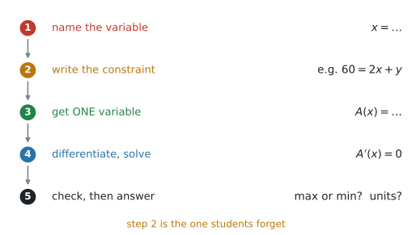
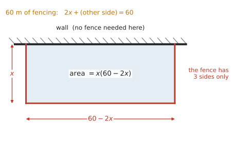
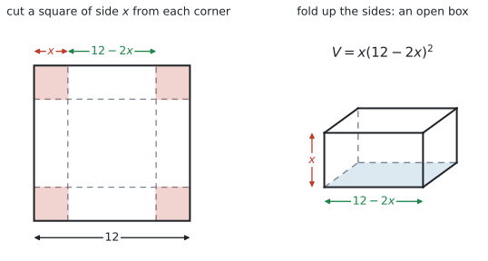
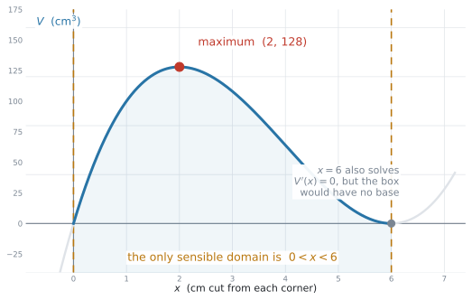
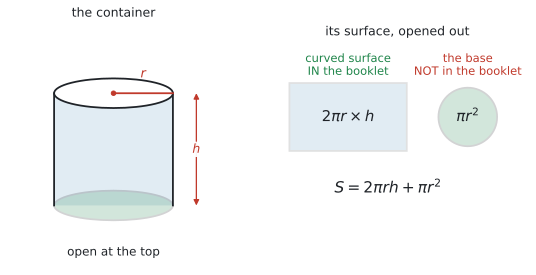

# SL 5.7 — Optimisation（最適化問題） {#sec-sl-5-7}

::: {.callout-note}
## What you should be able to do
- 文章から、**自分で文字をおいて式を作れる**。
- **constraint**（条件式）を使って、**文字を1つに減らせる**。
- できた式を微分し、$f'(x) = 0$ を解いて**最大・最小を求められる**。
- 求めたものが**最大か最小か**を、理由をつけて言える。
- **現実に意味のある範囲**（domain）を考え、**意味のない解を捨てられる**。
- 答えを、**単位を付けて、問題の言葉で**書ける。
- 利益・費用・面積・体積の問題を扱える（シラバスが名指ししています）。
:::

::: {.callout-important}
## Formula booklet に、この項目の欄はありません
公式集の Topic 5 の欄は **5.3、5.5、5.8 だけ**です。**5.7 の欄はありません。**

新しい公式もありません。使うのは、**[SL 5.3](sl-5-3.qmd) の微分**と、**[SL 5.6](sl-5-6.qmd) の $f'(x)=0$** だけです。

シラバスの Content 欄は、たった一行です。

> **Optimisation problems in context.**

`in context`（文脈のある）── ここがこの項目の全部です。**式は与えられません。自分で作ります。**
:::

::: {.callout-tip}
## SL では、運動（kinematics）の問題は出ません
シラバスの SL 5.7 の Guidance 欄に、はっきり書かれています。

> **In SL examinations, questions on kinematics will not be set.**

「加速度から速度を出して、速度から変位を出して…」という**物理の運動の問題は、SL では出題されません。** HL の内容です。

（[SL 5.5](sl-5-5.qmd#rate) で見た「速度のグラフの面積＝距離」のように、**velocity–time graph が文脈として出てくる**ことはあります。それは Connections 欄に書かれています。ここで出ないと言っているのは、**運動そのものを扱う設問**です。）

**出るのは、次の3つ**です（Guidance 欄）。

> Examples: **Maximizing profit**, **minimizing cost**, **maximizing volume for a given surface area**.
:::

## The idea

### 1. 手順は5つです {#steps}

[SL 5.6](sl-5-6.qmd) との違いは、**最初の3つ**だけです。SL 5.6 では式が与えられていました。ここでは**自分で作ります。**

{#fig-sl57-steps width=88%}

1. **文字をおく** … 何を $x$ にするかを決めて、**言葉で書く**
2. **constraint（条件式）を書く** … 「フェンスは全部で $60$ m」など
3. **文字を1つに減らす** … 条件式から片方を消して、$A(x)$ の形にする
4. **微分して $f'(x) = 0$ を解く**
5. **確かめて、答える** … 最大か最小か、単位、問題の言葉

::: {.callout-important}
## つまずくのは、ほぼ手順2と3です
微分（手順4）は [SL 5.3](sl-5-3.qmd) でやったとおりで、難しくありません。

**難しいのは、文章から式を作るところ**です。だからこの項目では、**手順1〜3にいちばん時間をかけて**練習してください。
:::

### 2. constraint（条件式）で、文字を1つに減らす {#constraint}

最適化の問題には、**ふつう文字が2つ**出てきます。たての長さと横の長さ、半径と高さ、など。

**AI SL では $1$ 変数の微分を扱います。** ですから、**目的の量を $1$ つの文字の関数にします。** もう $1$ つの文字を消す、ということです。

そのために使うのが **constraint**（条件式）── 問題文に必ず書いてある「決まっている量」です。

| 問題文の言葉 | constraint |
|---|---|
| `has 60 m of fencing` | 使う長さの合計 $= 60$ |
| `made from 300 cm² of card` | 表面積 $= 300$ |
| `the volume is 500 cm³` | 体積 $= 500$ |
| `the two numbers add up to 20` | $x + y = 20$ |

: 条件式は問題文のここに書いてある {#tbl-sl57-constraint}

**やり方**は、条件式を「$y = \ldots$」の形にして、もう一方の式に代入するだけです。

### 3. 例：壁ぎわの囲い {#fence}

**$60$ m のフェンスで、壁を1辺に使って長方形の囲いを作ります。面積を最大にするには？**

{#fig-sl57-fence width=88%}

**手順1** … 壁と垂直な辺を $x$ m とおきます。

**手順2** … フェンスは**3辺だけ**です。壁と平行な辺を $y$ m とすると、

$$
2x + y = 60
$$

**手順3** … $y = 60 - 2x$ を面積の式に入れます。

$$
A = xy = x(60 - 2x) = 60x - 2x^{2}
$$

**手順4** … 微分して $0$ とおきます。

$$
A'(x) = 60 - 4x = 0 \quad \Rightarrow \quad x = 15
$$

**手順5** … $y = 60 - 30 = 30$、面積は $15 \times 30 = 450$ m²。

::: {.callout-warning}
## 壁の側にはフェンスが要りません
$4$ 辺ぶんと考えて $2x + 2y = 60$ としてしまうのが、いちばん多い誤りです。

**図をかいて、フェンスが何辺あるかを数えてください。** @fig-sl57-fence では**3辺**です。
:::

### 4. 定義域を考える {#domain}

**現実には意味のない答え**が出ることがあります。問題文には書いてなくても、**自分で範囲を考える**必要があります。

$12$ cm 四方の紙の四すみから $x$ cm の正方形を切って、箱を折る問題を見てみます。

{#fig-sl57-box width=96%}

$$
V = x(12 - 2x)^{2}
$$

展開して微分すると

$$
V = 4x^{3} - 48x^{2} + 144x
$$

$$
V'(x) = 12x^{2} - 96x + 144 = 12(x - 2)(x - 6)
$$

**解が2つ出ます。** $x = 2$ と $x = 6$。

{#fig-sl57-domain width=86%}

@fig-sl57-domain のとおり、意味があるのは **$0 < x < 6$** の部分だけです。

- $x$ は**正**でなければなりません（切る大きさ）
- $12 - 2x$ も**正**でなければなりません → $x < 6$

**$x = 6$ は捨てます。** そのとき箱の底が消えて、体積が $0$ になるからです。

$$
V(2) = 2 \times 8^{2} = 128 \ \text{cm}^{3}
$$

::: {.callout-important}
## 捨てた理由を、一言書いてください
$$
\text{Reject } x = 6 \text{ since } 12 - 2x > 0. \qquad ✓
$$

**黙って捨てると、点になりません。** 「なぜ捨てたか」の一言が method mark です。

同じ注意は [SL 1.8](../01-number-and-algebra/sl-1-8.qmd) や [SL 5.6](sl-5-6.qmd) にも出てきました。**AI では、ずっと同じことを求められます。**
:::

### 5. 最大か最小かを確かめる {#justify}

[SL 5.6](sl-5-6.qmd#sign) と同じです。**$f'$ の符号の変化**か、**グラフ**で判断します。

$V'(x) = 12(x-2)(x-6)$ なら、

$$
V'(1) = 12(-1)(-5) = 60 > 0, \qquad V'(3) = 12(1)(-3) = -36 < 0
$$

**$+$ から $-$** なので、$x = 2$ は**最大**です。

::: {.callout-tip}
## 文脈から言い切ってしまえることもあります
$2$ 次関数で $x^{2}$ の係数が負なら、**山が1つだけ**です。「上に凸だから最大」と一言書けば十分なことも多いです。

ただし `justify` や `giving a reason` と書かれていたら、**必ず何か書いてください。** 何も書かないのが一番いけません。
:::

### 6. 答えの書き方 {#answer}

**求められているのが $x$ なのか、$f(x)$ なのか**を、必ず読み分けてください（[SL 5.6](sl-5-6.qmd#context) と同じです）。

| 問題文 | 答えるもの | 例 |
|---|---|---|
| `Find the value of x that maximises the area` | **$x$** | $15$ m |
| `Find the maximum area` | **$f(x)$** | $450$ m² |
| `Find the dimensions of the box` | **辺の長さを全部** | $8 \times 8 \times 2$ cm |

: 何を答えるか {#tbl-sl57-answer}

**単位を必ず付けてください。** 面積なら m²、体積なら cm³、お金ならドル。

### 7. 立体の公式は、公式集にあります（一部だけ） {#solids}

体積・表面積の問題では、公式集の **Prior learning – SL** と **SL 3.1** の欄が使えます（[SL 3.1](../03-geometry-and-trigonometry/sl-3-1.qmd)）。

| 公式集にあるもの | 式 |
|---|---|
| 直方体の体積 | $V = lwh$ |
| 円柱の体積 | $V = \pi r^{2} h$ |
| **円柱の側面**の面積 | $A = 2\pi r h$ |
| 円の面積 | $A = \pi r^{2}$ |
| 球・円錐・角錐 | 公式集にあります |

: 立体の公式 {#tbl-sl57-solids}

{#fig-sl57-cylinder width=94%}

::: {.callout-warning}
## 円柱の表面積は、公式集には**ありません**
公式集にあるのは **`Area of the curved surface of a cylinder`**、つまり**側面だけ**です。

ふたや底の円は、**自分で $\pi r^{2}$ を足します。**

$$
\text{ふたなし：} \ S = 2\pi r h + \pi r^{2} \qquad\qquad \text{ふたあり：} \ S = 2\pi r h + 2\pi r^{2}
$$

**問題文が `open` か `closed` かを、必ず確かめてください。** ここで $\pi r^{2}$ を $1$ つ多く足す／足し忘れる、というのがとても多い失点です。
:::

## Why it works

:::: {.callout-note collapse="true" appearance="simple"}
## クリックすると開きます
新しい理屈は、実は何もありません。**[SL 5.6](sl-5-6.qmd) と同じこと**をしています。

$f'(x) = 0$ で山と谷が見つかる ── その理由は [SL 5.6](sl-5-6.qmd#why-it-works) で見たとおりです。

この項目で新しいのは、**扱う関数を自分で作る**ところだけです。

では、**なぜ条件式で文字を減らせるのでしょうか。**

囲いの問題で、$x$ と $y$ の $2$ つが自由に動けるなら、面積 $xy$ はいくらでも大きくできます。$x = 100$、$y = 100$ にすればよいのですから。

**そうならないのは、$60$ m しかフェンスがないから**です。$x$ を大きくすれば、$y$ は必ず小さくなります。

$$
2x + y = 60
$$

この式が、**$x$ と $y$ を結びつけています。** $x$ を決めれば $y$ も決まる。だから、

$$
A = x(60 - 2x)
$$

は **$x$ だけの関数**になります。

**「使えるものが限られている」から、最適化という問題が生まれる。** 制約がなければ、答えは「いくらでも大きく」になってしまいます。

::: {.callout-note appearance="simple"}
$A = x(60-2x)$ は上に凸の $2$ 次関数なので、$x = 15$ で最大になるのは**平方完成でも出せます**（[SL 2.4](../02-functions/sl-2-4.qmd)）。

$3$ 次以上になると平方完成は使えません。**微分なら、どんな次数でも同じやり方で解けます。** そこが微分の強みです。
:::
::::

## Worked examples

::: {.callout-note appearance="simple"}
問題文は英語です。意味が理解できなかったら、問題文の下の「**日本語訳**」を開いてください。解説は日本語です。
:::

::: {#exm-sl57-fence}
[A farmer has $60$ metres of fencing. He uses a straight wall as one side of a rectangular pen, so only three sides need to be fenced.]{.q-en}

[The two sides perpendicular to the wall each have length $x$ metres.]{.q-en}

**(a)** [Show that the area of the pen is $A = 60x - 2x^{2}$.]{.q-en}

**(b)** [Find the value of $x$ that gives the greatest area.]{.q-en}

**(c)** [Find this greatest area.]{.q-en}

<details class="jp-trans">
<summary>日本語訳</summary>

ある農家が $60$ m のフェンスを持っています。長方形の囲いの1辺にまっすぐな壁を使うので、フェンスが必要なのは3辺だけです。

壁に垂直な2辺の長さは、それぞれ $x$ m です。

**(a)** 囲いの面積が $A = 60x - 2x^{2}$ となることを示しなさい。

**(b)** 面積が最大になる $x$ の値を求めなさい。

**(c)** その最大の面積を求めなさい。

</details>

---

**(a)** 壁と平行な辺を $y$ m とします。フェンスは**3辺**なので、

$$
2x + y = 60 \quad \Rightarrow \quad y = 60 - 2x
$$

$$
A = xy = x(60 - 2x) = 60x - 2x^{2} \quad ✓
$$

**(b)** 微分します。

$$
\frac{dA}{dx} = 60 - 4x = 0 \quad \Rightarrow \quad x = 15
$$

**(c)** $y = 60 - 30 = 30$ なので、

$$
A = 15 \times 30 = 450 \ \text{m}^{2}
$$

::: {.model-answer}
**試験ではこう書く**

*The greatest area is $450\ \text{m}^{2}$, when $x = 15$ metres.*
:::

::: {.callout-tip}
## `Show that` は、途中を全部書きます
答えが問題文に書いてあるので、**点になるのは過程だけ**です。

- $2x + y = 60$ の行（constraint）
- $y = 60 - 2x$ の行
- $A = xy$ に代入する行

**この3行がそろって、はじめて満点です。** いきなり $A = 60x - 2x^2$ と書いても点になりません。
:::

::: {.callout-note}
## 解答例（答案用紙にはこう書く）
**(a)** Let the third side be $y$. Then $2x + y = 60$, so $y = 60 - 2x$.

$A = xy = x(60 - 2x) = 60x - 2x^{2}$ ✓

**(b)** $\dfrac{dA}{dx} = 60 - 4x = 0$, so $x = 15$

**(c)** $A = 60(15) - 2(225) = 900 - 450 = 450\ \text{m}^{2}$
:::
:::

::: {#exm-sl57-profit}
[A shop sells $x$ umbrellas each week. The selling price of one umbrella, in dollars, is $30 - 0.5x$. The shop pays $\$10$ for each umbrella and has fixed weekly costs of $\$50$.]{.q-en}

**(a)** [Show that the weekly profit is $P(x) = 20x - 0.5x^{2} - 50$.]{.q-en}

**(b)** [Find the number of umbrellas that should be sold each week to maximise the profit.]{.q-en}

**(c)** [Find the maximum weekly profit.]{.q-en}

<details class="jp-trans">
<summary>日本語訳</summary>

ある店は 1 週間に $x$ 本のかさを売ります。かさ 1 本の販売価格は $30 - 0.5x$ ドルです。店はかさ 1 本を $10$ ドルで仕入れ、さらに毎週 $50$ ドルの固定費がかかります。

**(a)** 週の利益が $P(x) = 20x - 0.5x^{2} - 50$ となることを示しなさい。

**(b)** 利益を最大にするために、1 週間に何本売ればよいかを求めなさい。

**(c)** 最大の週の利益を求めなさい。

</details>

---

**(a)** **利益 ＝ 売上 − 費用**です。

売上（revenue）は「$1$ 本の値段 × 本数」。

$$
R = x(30 - 0.5x) = 30x - 0.5x^{2}
$$

費用（cost）は「仕入れ $+$ 固定費」。

$$
C = 10x + 50
$$

$$
P = R - C = 30x - 0.5x^{2} - 10x - 50 = 20x - 0.5x^{2} - 50 \quad ✓
$$

**(b)**

$$
P'(x) = 20 - x = 0 \quad \Rightarrow \quad x = 20
$$

**(c)**

$$
P(20) = 400 - 200 - 50 = 150
$$

::: {.model-answer}
**試験ではこう書く**

*The shop should sell $20$ umbrellas each week, giving a maximum weekly profit of $\$150$.*
:::

::: {.callout-important}
## 「値段 × 本数」を忘れないでください
$30 - 0.5x$ は **$1$ 本の値段**です。売上はそれに $x$ を**掛けます。**

$$
R = x(30 - 0.5x) \qquad ✓ \qquad\qquad R = 30 - 0.5x \qquad ✗
$$

**値段が下がるほどたくさん売れる**、というモデルです。だから $x$ が大きいと $1$ 本の値段は下がります。
:::

::: {.callout-note}
## 解答例（答案用紙にはこう書く）
**(a)** $R = x(30 - 0.5x) = 30x - 0.5x^{2}$;  $C = 10x + 50$

$P = R - C = 20x - 0.5x^{2} - 50$ ✓

**(b)** $P'(x) = 20 - x = 0$, so $x = 20$ umbrellas

**(c)** $P(20) = 400 - 200 - 50 = \$150$
:::
:::

::: {#exm-sl57-box}
[A square sheet of card measures $12$ cm by $12$ cm. A square of side $x$ cm is cut from each corner, and the sides are folded up to make an open box.]{.q-en}

**(a)** [Write down an expression for the volume $V$ of the box in terms of $x$.]{.q-en}

**(b)** [Write down the possible values of $x$.]{.q-en}

**(c)** [Find the value of $x$ that gives the greatest volume, and find this volume.]{.q-en}

<details class="jp-trans">
<summary>日本語訳</summary>

正方形の厚紙は $12$ cm × $12$ cm です。四すみから $1$ 辺 $x$ cm の正方形を切り取り、辺を折り上げてふたのない箱を作ります。

**(a)** 箱の体積 $V$ を $x$ の式で書きなさい。

**(b)** $x$ のとりうる値を書きなさい。

**(c)** 体積が最大になる $x$ の値と、その体積を求めなさい。

</details>

---

**(a)** 底は $1$ 辺 $12 - 2x$ の正方形、高さは $x$（@fig-sl57-box）。

$$
V = x(12 - 2x)^{2}
$$

**(b)** [定義域を考えます。](#domain)

$$
0 < x < 6
$$

**(c)** 展開して微分します。

$$
V = 4x^{3} - 48x^{2} + 144x
$$

$$
V'(x) = 12x^{2} - 96x + 144 = 12(x - 2)(x - 6) = 0
$$

$$
x = 2 \quad \text{または} \quad x = 6
$$

**$x = 6$ は範囲の外**なので捨てます。

$$
V(2) = 2 \times 8^{2} = 128 \ \text{cm}^{3}
$$

::: {.model-answer}
**試験ではこう書く**

*Reject $x = 6$, since we need $12 - 2x > 0$.*

*$V'(1) = 60 > 0$ and $V'(3) = -36 < 0$, so $x = 2$ gives a maximum. The greatest volume is $128\ \text{cm}^{3}$.*
:::

::: {.callout-tip}
## 展開してから微分します
$x(12-2x)^{2}$ のままでは、[SL 5.3](sl-5-3.qmd) の公式が使えません。かっこがあるからです。

$$
(12-2x)^{2} = 144 - 48x + 4x^{2}
$$

$$
V = 144x - 48x^{2} + 4x^{3}
$$

**必ず展開してから**微分してください。
:::

::: {.callout-note}
## 解答例（答案用紙にはこう書く）
**(a)** $V = x(12 - 2x)^{2}$

**(b)** $0 < x < 6$

**(c)** $V = 4x^{3} - 48x^{2} + 144x$;  $V'(x) = 12(x-2)(x-6) = 0$

$x = 2$ or $x = 6$; reject $x = 6$ since $12 - 2x > 0$

$V(2) = 128\ \text{cm}^{3}$
:::
:::

::: {#exm-sl57-surface}
[An open box has a square base of side $x$ cm and height $h$ cm. It is made from $300\ \text{cm}^{2}$ of card, with no waste.]{.q-en}

**(a)** [Show that $h = \dfrac{300 - x^{2}}{4x}$.]{.q-en}

**(b)** [Show that the volume of the box is $V = 75x - \dfrac{x^{3}}{4}$.]{.q-en}

**(c)** [Find the dimensions of the box with the greatest volume.]{.q-en}

<details class="jp-trans">
<summary>日本語訳</summary>

ふたのない箱は、$1$ 辺 $x$ cm の正方形の底面と、高さ $h$ cm をもちます。むだなく $300\ \text{cm}^{2}$ の厚紙で作られています。

**(a)** $h = \dfrac{300 - x^{2}}{4x}$ となることを示しなさい。

**(b)** 箱の体積が $V = 75x - \dfrac{x^{3}}{4}$ となることを示しなさい。

**(c)** 体積が最大になる箱の各辺の長さを求めなさい。

</details>

---

**(a)** ふたがないので、面は**底 $1$ 枚と側面 $4$ 枚**です。

$$
x^{2} + 4xh = 300
$$

$$
4xh = 300 - x^{2} \quad \Rightarrow \quad h = \frac{300 - x^{2}}{4x} \quad ✓
$$

**(b)** 体積は「底面積 × 高さ」。

$$
V = x^{2}h = x^{2} \times \frac{300 - x^{2}}{4x} = \frac{x(300 - x^{2})}{4} = \frac{300x - x^{3}}{4} = 75x - \frac{x^{3}}{4} \quad ✓
$$

**(c)**

$$
\frac{dV}{dx} = 75 - \frac{3x^{2}}{4} = 0 \quad \Rightarrow \quad 3x^{2} = 300 \quad \Rightarrow \quad x^{2} = 100 \quad \Rightarrow \quad x = 10
$$

$x > 0$ なので $x = -10$ は捨てます。

$$
h = \frac{300 - 100}{40} = \frac{200}{40} = 5
$$

::: {.model-answer}
**試験ではこう書く**

*The box is $10\ \text{cm} \times 10\ \text{cm} \times 5\ \text{cm}$, giving a volume of $500\ \text{cm}^{3}$.*
:::

::: {.callout-important}
## `open` なので、面は $5$ 枚です
$$
\text{ふたなし：} \ x^{2} + 4xh \qquad\qquad \text{ふたあり：} \ 2x^{2} + 4xh
$$

**底 $1$ 枚 $+$ 側面 $4$ 枚**か、**底とふたで $2$ 枚 $+$ 側面 $4$ 枚**か。

**問題文の `open` / `closed` / `with a lid` / `without a lid` を、指で押さえて**確かめてください。
:::

::: {.callout-tip}
## `Find the dimensions` は、全部の辺を答えます
$x = 10$ だけでは足りません。**$h$ も求めて、$10 \times 10 \times 5$** と書きます。

`dimensions`（寸法）は、**箱の形が決まるだけの情報**という意味です。
:::

::: {.callout-note}
## 解答例（答案用紙にはこう書く）
**(a)** Surface area $= x^{2} + 4xh = 300$, so $h = \dfrac{300 - x^{2}}{4x}$ ✓

**(b)** $V = x^{2}h = \dfrac{x(300 - x^{2})}{4} = 75x - \dfrac{x^{3}}{4}$ ✓

**(c)** $\dfrac{dV}{dx} = 75 - \dfrac{3x^{2}}{4} = 0$, so $x = 10$ (reject $x = -10$)

$h = 5$. The box is $10 \times 10 \times 5$ cm.
:::
:::

::: {#exm-sl57-cylinder}
[An open cylindrical container has radius $r$ cm and height $h$ cm. Its volume is $1000\ \text{cm}^{3}$.]{.q-en}

**(a)** [Show that the surface area of the container is $S = \pi r^{2} + \dfrac{2000}{r}$.]{.q-en}

**(b)** [Use your graphic display calculator to find the value of $r$ that minimises $S$, correct to three significant figures.]{.q-en}

**(c)** [Find this minimum surface area.]{.q-en}

<details class="jp-trans">
<summary>日本語訳</summary>

ふたのない円柱形の容器は、半径 $r$ cm、高さ $h$ cm です。体積は $1000\ \text{cm}^{3}$ です。

**(a)** 容器の表面積が $S = \pi r^{2} + \dfrac{2000}{r}$ となることを示しなさい。

**(b)** 電卓を使って、$S$ を最小にする $r$ の値を、有効数字 $3$ 桁で求めなさい。

**(c)** その最小の表面積を求めなさい。

</details>

---

**(a)** **体積の式**（公式集）から $h$ を出します。

$$
\pi r^{2} h = 1000 \quad \Rightarrow \quad h = \frac{1000}{\pi r^{2}}
$$

**表面積**は、[底の円 $+$ 側面](#solids)。ふたはありません。

$$
S = \pi r^{2} + 2\pi r h = \pi r^{2} + 2\pi r \times \frac{1000}{\pi r^{2}}
$$

$$
= \pi r^{2} + \frac{2000}{r} \quad ✓
$$

**(b)** Graphs ページに $S$ を入れて、`Analyze Graph → Minimum`（[GDCの使い方](#analyze)）で

$$
r = 6.83 \ \text{cm} \quad (3 \text{ s.f.})
$$

**(c)**

$$
S = 439 \ \text{cm}^{2} \quad (3 \text{ s.f.})
$$

::: {.callout-tip}
## $2\pi r \times \dfrac{1000}{\pi r^{2}}$ の約分を、ていねいに
$$
2\pi r \times \frac{1000}{\pi r^{2}} = \frac{2000 \pi r}{\pi r^{2}} = \frac{2000}{r}
$$

**$\pi$ が消えて、$r$ が $1$ つ残る**のがポイントです。ここが合えば、あとは電卓の仕事です。
:::

::: {.callout-note appearance="simple"}
**参考**：手で解くと $S' = 2\pi r - \dfrac{2000}{r^{2}} = 0$ から $r^{3} = \dfrac{1000}{\pi}$。

このとき $h = 6.83$ で、**$r = h$** になります。「ふたのない円柱でむだが最小になるのは、高さと半径が等しいとき」という、きれいな結果です。

**試験では、ここまで求められません。** シラバスは `using technology` で十分としています。
:::

::: {.callout-note}
## 解答例（答案用紙にはこう書く）
**(a)** $\pi r^{2}h = 1000$, so $h = \dfrac{1000}{\pi r^{2}}$

$S = \pi r^{2} + 2\pi rh = \pi r^{2} + \dfrac{2000}{r}$ ✓

**(b)** $r = 6.83$ cm (3 s.f.)

**(c)** $S = 439\ \text{cm}^{2}$ (3 s.f.)
:::
:::

## Common errors

::: {.callout-warning}
## constraint を書かずに進む
**この項目で一番多い失点です。**

$1$ 変数の関数にしてからでないと、微分できません。**「決まっている量」を式にする行**が、必ず要ります。
:::

::: {.callout-warning}
## 壁ぎわの囲いで、$4$ 辺ぶん数えてしまう
壁を使うなら、フェンスは**$3$ 辺**です。

**必ず図をかいて、辺を数えてください。**
:::

::: {.callout-warning}
## `open` と `closed` を読み落とす
ふたのない箱は面が $5$ 枚、ふたのある箱は $6$ 枚。円柱も同じです。

**表面積の式が $1$ 面ぶん違うと、答えが全部変わります。**
:::

::: {.callout-warning}
## 円柱の表面積を、公式集にあると思ってしまう
公式集にあるのは**側面 $2\pi r h$ だけ**です。円は自分で足します。
:::

::: {.callout-warning}
## かっこを展開せずに微分しようとする
$x(12-2x)^{2}$ は、そのままでは微分できません（AI SL に積の微分はありません）。

**必ず展開**して、$ax^{n}$ の形が並んだ式にしてから微分します。
:::

::: {.callout-warning}
## 意味のない解を捨てない
長さが負、または $12 - 2x$ が負になる解は**捨てます。**

**捨てた理由を一言書く**ところまでが答案です。
:::

::: {.callout-warning}
## 最大か最小かを確かめない
`justify` や `giving a reason` があったら、**符号の変化**か**グラフの形**を一文で書いてください。
:::

::: {.callout-warning}
## $x$ を答えるところで、最大値を答えてしまう
- `the value of x` … $x$
- `the maximum area` … $A$
- `the dimensions` … 辺を**全部**

**問題文の最後の名詞**を、指で押さえて読んでください。
:::

::: {.callout-warning}
## 単位を付けない
$450$ ではなく **$450\ \text{m}^{2}$**、$128$ ではなく **$128\ \text{cm}^{3}$**。

**面積は $2$ 乗、体積は $3$ 乗**です。$\text{cm}^{2}$ と $\text{cm}^{3}$ を取りちがえないでください。
:::

::: {.callout-warning}
## `Show that` で、答えだけを書く
答えが問題文に書いてあるので、**過程だけが点**です。

constraint の行、代入の行、整理の行 ── **全部書いてください。**
:::

::: {.callout-warning}
## 途中で四捨五入する
$r = 6.83$ を使って $S$ を計算すると、わずかにずれることがあります。

**電卓の中の値をそのまま使って**最後に丸めてください。答えを `Ans` で受けるのが確実です。
:::

## Using your GDC (TI-Nspire CX II)

式を作るところは手で、**最大・最小を出すところは電卓**、という分担になります。

### 1. グラフをかいて、山か谷を出す {#analyze}

自分で作った式を $f1(x)$ に入れます。

```
f1(x) = 4x^3-48x^2+144x
menu → Window/Zoom → Zoom - Fit
menu → Analyze Graph → Maximum
```

[SL 5.6](sl-5-6.qmd#analyze) と同じ操作です。**その山だけをはさむ**ように、下限と上限を指定します。`lower bound?` と `upper bound?` の $2$ 回、`enter` を押します（→ [SL 2.4](../02-functions/sl-2-4.qmd#bounds)）。

::: {.callout-important}
## ウィンドウを、意味のある範囲に合わせてください
箱の問題なら $0 < x < 6$ です。**$x$ の範囲を $0$ から $6$ に設定**しておくと、意味のない解が画面に出てこなくなります。

```
menu → Window/Zoom → Window Settings
```

**これだけで、$x = 6$ を答えてしまう誤りが防げます。**
:::

### 2. $\pi$ の入った式も、そのまま入ります {#pi}

```
f1(x) = pi*x^2 + 2000/x
```

$\pi$ は電卓の $\boxed{\pi}$ キーです。**$3.14$ と打たないでください。** 精度が落ちます。

### 3. 最小の値も、同時に出ます

`Minimum` は $(6.83,\ 439)$ のように**座標**を返します。

- $x$ 座標 … 「どうすればよいか」（$r = 6.83$ cm）
- $y$ 座標 … 「そのときいくつか」（$S = 439\ \text{cm}^{2}$）

**[答えの書き分け](#answer)は、この $2$ つの読み分けと同じです。**

### 4. 式を作る途中は、電卓に頼れません

constraint を書く、$h$ を消す、展開する ── **ここは全部、手の仕事**です。

::: {.callout-warning}
## 答案には、式を作った行を必ず残してください
電卓が返すのは数だけです。

1. constraint（$2x + y = 60$ など）
2. $1$ 文字にした式（$A = 60x - 2x^{2}$）
3. 微分した式、または「電卓で最大を求めた」と分かる行

**この3行があれば、たとえ最後の数を間違えても、大半の点が残ります。**
:::

## Exercises

::: {.callout-note appearance="simple"}
各問題に、折りたたみが3つ付いています。**日本語訳**、**解答例**（答案用紙に書くべきこと。英語です）、**解説**（なぜそうなるか。日本語です）。

まず自分で解いて、次に解答例と見くらべてください。**解説は、合わなかったときだけ開けば十分です。**
:::

::: {.exercise-block}

[1]{.ex-no} [A rectangular field is to be enclosed using $100$ metres of fencing on all four sides. One side has length $x$ metres.]{.q-en}

**(a)** [Show that the area of the field is $A = 50x - x^{2}$.]{.q-en}

**(b)** [Find the greatest possible area.]{.q-en}

<details class="jp-trans">
<summary>日本語訳</summary>

長方形の畑を、$4$ 辺すべてに $100$ m のフェンスを使って囲みます。$1$ 辺の長さは $x$ m です。

**(a)** 畑の面積が $A = 50x - x^{2}$ となることを示しなさい。

**(b)** とりうる最大の面積を求めなさい。

</details>

::: {.callout-note collapse="true"}
## 解答例（答案用紙に書くこと）
**(a)** Let the other side be $y$. Then $2x + 2y = 100$, so $y = 50 - x$.

$A = xy = x(50 - x) = 50x - x^{2}$ ✓

**(b)** $\dfrac{dA}{dx} = 50 - 2x = 0$, so $x = 25$

$A = 25 \times 25 = 625\ \text{m}^{2}$
:::

::: {.callout-tip collapse="true"}
## 解説
今度は**$4$ 辺すべて**にフェンスを使います。constraint は $2x + 2y = 100$、つまり $x + y = 50$。

**壁を使う問題（例題1）と混同しないでください。** 問題文をよく読むこと。

答えは $25 \times 25$、つまり**正方形**です。「周の長さが決まっているとき、面積が最大になるのは正方形」── 覚えておくと検算に使えます。
:::

::: {.ex-sep}
:::

[2]{.ex-no} [Two positive numbers add up to $20$. One of them is $x$.]{.q-en}

**(a)** [Write down an expression for their product $P$ in terms of $x$.]{.q-en}

**(b)** [Find the greatest possible value of $P$.]{.q-en}

<details class="jp-trans">
<summary>日本語訳</summary>

$2$ つの正の数の和は $20$ です。そのうち $1$ つは $x$ です。

**(a)** 積 $P$ を $x$ の式で書きなさい。

**(b)** $P$ のとりうる最大の値を求めなさい。

</details>

::: {.callout-note collapse="true"}
## 解答例（答案用紙に書くこと）
**(a)** The other number is $20 - x$, so $P = x(20 - x) = 20x - x^{2}$.

**(b)** $P'(x) = 20 - 2x = 0$, so $x = 10$

$P = 10 \times 10 = 100$
:::

::: {.callout-tip collapse="true"}
## 解説
constraint は $x + y = 20$。いちばん短い形です。

**答えは $2$ つとも $10$。** 和が決まっているとき、積が最大になるのは**同じ数のとき**です。

演習1の「正方形が最大」と、実は同じことを言っています。
:::

::: {.ex-sep}
:::

[3]{.ex-no} [The weekly profit, in dollars, from selling $x$ items is modelled by]{.q-en}

$$
P(x) = 60x - 0.2x^{2} - 500, \qquad 0 \le x \le 200 .
$$

**(a)** [Find the number of items that should be sold to maximise the profit.]{.q-en}

**(b)** [Find the maximum profit.]{.q-en}

<details class="jp-trans">
<summary>日本語訳</summary>

$x$ 個を売ったときの週の利益（ドル）は、次の式でモデル化されます。

$$
P(x) = 60x - 0.2x^{2} - 500, \qquad 0 \le x \le 200 .
$$

**(a)** 利益を最大にするために、何個売ればよいかを求めなさい。

**(b)** 最大の利益を求めなさい。

</details>

::: {.callout-note collapse="true"}
## 解答例（答案用紙に書くこと）
**(a)** $P'(x) = 60 - 0.4x = 0$, so $x = 150$ items

**(b)** $P(150) = 9000 - 4500 - 500 = \$4000$
:::

::: {.callout-tip collapse="true"}
## 解説
**式が与えられているので、constraint は要りません。** [SL 5.6](sl-5-6.qmd) と同じ形の問題です。

$0.4x = 60$ から $x = \dfrac{60}{0.4} = 150$。**小数で割るのを、電卓でやって構いません。**

$0.2 \times 150^{2} = 0.2 \times 22500 = 4500$ です。

$150$ は $0 \le x \le 200$ の中なので ✓
:::

::: {.ex-sep}
:::

[4]{.ex-no} [The cost, in dollars, of running a machine for $x$ hours is modelled by]{.q-en}

$$
C(x) = 0.5x^{2} - 30x + 700 .
$$

**(a)** [Find the number of hours that gives the lowest cost.]{.q-en}

**(b)** [Find this lowest cost.]{.q-en}

<details class="jp-trans">
<summary>日本語訳</summary>

機械を $x$ 時間動かすときの費用（ドル）は、次の式でモデル化されます。

$$
C(x) = 0.5x^{2} - 30x + 700 .
$$

**(a)** 費用が最も低くなる時間数を求めなさい。

**(b)** その最低の費用を求めなさい。

</details>

::: {.callout-note collapse="true"}
## 解答例（答案用紙に書くこと）
**(a)** $C'(x) = x - 30 = 0$, so $x = 30$ hours

**(b)** $C(30) = 450 - 900 + 700 = \$250$
:::

::: {.callout-tip collapse="true"}
## 解説
$0.5x^{2}$ を微分すると $0.5 \times 2 = 1$ で $x$。**$1x$ とは書きません。**

$x^{2}$ の係数が**正**なので下に凸、つまり**谷が1つだけ**。最小になるのは確かです。

$0.5 \times 900 = 450$ です。
:::

::: {.ex-sep}
:::

[5]{.ex-no} [A square sheet of card measures $20$ cm by $20$ cm. A square of side $x$ cm is cut from each corner, and the sides are folded up to make an open box.]{.q-en}

**(a)** [Write down an expression for the volume $V$ in terms of $x$.]{.q-en}

**(b)** [Write down the possible values of $x$.]{.q-en}

**(c)** [Find the value of $x$ that gives the greatest volume, and find this volume, correct to three significant figures.]{.q-en}

<details class="jp-trans">
<summary>日本語訳</summary>

正方形の厚紙は $20$ cm × $20$ cm です。四すみから $1$ 辺 $x$ cm の正方形を切り取り、辺を折り上げてふたのない箱を作ります。

**(a)** 体積 $V$ を $x$ の式で書きなさい。

**(b)** $x$ のとりうる値を書きなさい。

**(c)** 体積が最大になる $x$ の値と、その体積を、有効数字 $3$ 桁で求めなさい。

</details>

::: {.callout-note collapse="true"}
## 解答例（答案用紙に書くこと）
**(a)** $V = x(20 - 2x)^{2}$

**(b)** $0 < x < 10$

**(c)** $V = 4x^{3} - 80x^{2} + 400x$;  $V'(x) = 12x^{2} - 160x + 400 = 4(x - 10)(3x - 10) = 0$

$x = 10$ or $x = \dfrac{10}{3}$; reject $x = 10$ since $20 - 2x > 0$

$x = 3.33$ cm (3 s.f.),  $V = 593\ \text{cm}^{3}$ (3 s.f.)
:::

::: {.callout-tip collapse="true"}
## 解説
例題3と**同じ形**です。数字が $12$ から $20$ に変わっただけ。

今度は $x = \dfrac{10}{3} = 3.333\ldots$ と**割り切れません**。$3$ 桁の有効数字で **$3.33$**。

$V = \dfrac{16000}{27} = 592.59\ldots$ で、**$593$**。

**$x$ は $\dfrac{10}{3}$ のまま $V$ に代入してください。** 電卓の中の値を使い、**丸めるのは最後の $1$ 回だけ**にします。
:::

::: {.ex-sep}
:::

[6]{.ex-no} [A closed box has a square base of side $x$ cm and height $h$ cm. Its volume is $216\ \text{cm}^{3}$.]{.q-en}

**(a)** [Show that the surface area is $S = 2x^{2} + \dfrac{864}{x}$.]{.q-en}

**(b)** [Find the value of $x$ that minimises $S$.]{.q-en}

**(c)** [Find the dimensions of the box.]{.q-en}

<details class="jp-trans">
<summary>日本語訳</summary>

ふたのある箱は、$1$ 辺 $x$ cm の正方形の底面と高さ $h$ cm をもち、体積は $216\ \text{cm}^{3}$ です。

**(a)** 表面積が $S = 2x^{2} + \dfrac{864}{x}$ となることを示しなさい。

**(b)** $S$ を最小にする $x$ の値を求めなさい。

**(c)** 箱の各辺の長さを求めなさい。

</details>

::: {.callout-note collapse="true"}
## 解答例（答案用紙に書くこと）
**(a)** $x^{2}h = 216$, so $h = \dfrac{216}{x^{2}}$

$S = 2x^{2} + 4xh = 2x^{2} + 4x \times \dfrac{216}{x^{2}} = 2x^{2} + \dfrac{864}{x}$ ✓

**(b)** $S = 2x^{2} + 864x^{-1}$, so $\dfrac{dS}{dx} = 4x - \dfrac{864}{x^{2}} = 0$

$4x^{3} = 864$, so $x^{3} = 216$ and $x = 6$

**(c)** $h = \dfrac{216}{36} = 6$. The box is $6 \times 6 \times 6$ cm.
:::

::: {.callout-tip collapse="true"}
## 解説
**`closed` なので面は $6$ 枚**：底とふたで $2x^{2}$、側面で $4xh$。

$\dfrac{864}{x}$ は $864x^{-1}$ に書き直してから微分します（[SL 5.3](sl-5-3.qmd#negative)）。$864 \times (-1) = -864$、指数は $-2$ → $-864x^{-2}$。

答えは $6 \times 6 \times 6$、つまり**立方体**です。「体積が決まっているとき、表面積が最小になるのは立方体」── これも覚えておくと検算に使えます。
:::

::: {.ex-sep}
:::

[7]{.ex-no} [An open box has a square base of side $x$ cm and height $h$ cm. Its volume is $500\ \text{cm}^{3}$.]{.q-en}

**(a)** [Show that the surface area is $S = x^{2} + \dfrac{2000}{x}$.]{.q-en}

**(b)** [Find the dimensions of the box that uses the least card.]{.q-en}

<details class="jp-trans">
<summary>日本語訳</summary>

ふたのない箱は、$1$ 辺 $x$ cm の正方形の底面と高さ $h$ cm をもち、体積は $500\ \text{cm}^{3}$ です。

**(a)** 表面積が $S = x^{2} + \dfrac{2000}{x}$ となることを示しなさい。

**(b)** 使う厚紙が最も少なくなる箱の各辺の長さを求めなさい。

</details>

::: {.callout-note collapse="true"}
## 解答例（答案用紙に書くこと）
**(a)** $x^{2}h = 500$, so $h = \dfrac{500}{x^{2}}$

$S = x^{2} + 4xh = x^{2} + \dfrac{2000}{x}$ ✓

**(b)** $\dfrac{dS}{dx} = 2x - \dfrac{2000}{x^{2}} = 0$, so $2x^{3} = 2000$ and $x = 10$

$h = \dfrac{500}{100} = 5$. The box is $10 \times 10 \times 5$ cm.
:::

::: {.callout-tip collapse="true"}
## 解説
演習6との違いは **`open`（ふたなし）** だけ。底が $x^{2}$ の $1$ 枚になります。

`uses the least card` は「表面積が最小」という意味です。**言いかえに気づけるかどうか**が、この問題の山です。

**検算。** $S = 100 + 200 = 300\ \text{cm}^{2}$。
:::

::: {.ex-sep}
:::

[8]{.ex-no} [A closed cylindrical can has radius $r$ cm and height $h$ cm. Its volume is $500\ \text{cm}^{3}$.]{.q-en}

**(a)** [Show that the surface area is $S = 2\pi r^{2} + \dfrac{1000}{r}$.]{.q-en}

**(b)** [Use your graphic display calculator to find the value of $r$ that minimises $S$, correct to three significant figures.]{.q-en}

**(c)** [Find the minimum surface area.]{.q-en}

<details class="jp-trans">
<summary>日本語訳</summary>

ふたのある円柱形の缶は、半径 $r$ cm、高さ $h$ cm で、体積は $500\ \text{cm}^{3}$ です。

**(a)** 表面積が $S = 2\pi r^{2} + \dfrac{1000}{r}$ となることを示しなさい。

**(b)** 電卓を使って、$S$ を最小にする $r$ の値を、有効数字 $3$ 桁で求めなさい。

**(c)** 最小の表面積を求めなさい。

</details>

::: {.callout-note collapse="true"}
## 解答例（答案用紙に書くこと）
**(a)** $\pi r^{2}h = 500$, so $h = \dfrac{500}{\pi r^{2}}$

$S = 2\pi r^{2} + 2\pi rh = 2\pi r^{2} + 2\pi r \times \dfrac{500}{\pi r^{2}} = 2\pi r^{2} + \dfrac{1000}{r}$ ✓

**(b)** $r = 4.30$ cm (3 s.f.)

**(c)** $S = 349\ \text{cm}^{2}$ (3 s.f.)
:::

::: {.callout-tip collapse="true"}
## 解説
**`closed` なので、円は $2$ 枚**です。$2\pi r^{2}$。

約分は $2\pi r \times \dfrac{500}{\pi r^{2}} = \dfrac{1000}{r}$。$\pi$ が消えて $r$ が $1$ つ残ります。

**(b)** は電卓で。$f1(x) = 2 \cdot \pi \cdot x^2 + 1000/x$ を入れて `Analyze Graph → Minimum`。

**参考**：このとき $h = 8.60$ cm で、$h = 2r$ になります。「体積が決まった缶で材料が最小になるのは、高さが直径と等しいとき」です。
:::

::: {.ex-sep}
:::

[9]{.ex-no} [An open box has a square base of side $x$ cm and height $h$ cm. It is made from $192\ \text{cm}^{2}$ of card.]{.q-en}

**(a)** [Show that $h = \dfrac{192 - x^{2}}{4x}$.]{.q-en}

**(b)** [Show that $V = 48x - \dfrac{x^{3}}{4}$.]{.q-en}

**(c)** [Find the greatest possible volume.]{.q-en}

<details class="jp-trans">
<summary>日本語訳</summary>

ふたのない箱は、$1$ 辺 $x$ cm の正方形の底面と高さ $h$ cm をもち、$192\ \text{cm}^{2}$ の厚紙で作られています。

**(a)** $h = \dfrac{192 - x^{2}}{4x}$ となることを示しなさい。

**(b)** $V = 48x - \dfrac{x^{3}}{4}$ となることを示しなさい。

**(c)** とりうる最大の体積を求めなさい。

</details>

::: {.callout-note collapse="true"}
## 解答例（答案用紙に書くこと）
**(a)** $x^{2} + 4xh = 192$, so $4xh = 192 - x^{2}$ and $h = \dfrac{192 - x^{2}}{4x}$ ✓

**(b)** $V = x^{2}h = \dfrac{x(192 - x^{2})}{4} = 48x - \dfrac{x^{3}}{4}$ ✓

**(c)** $\dfrac{dV}{dx} = 48 - \dfrac{3x^{2}}{4} = 0$, so $x^{2} = 64$ and $x = 8$ (reject $x = -8$)

$h = \dfrac{192 - 64}{32} = 4$, so $V = 64 \times 4 = 256\ \text{cm}^{3}$
:::

::: {.callout-tip collapse="true"}
## 解説
例題4と**まったく同じ形**です。$300$ が $192$ に変わっただけ。

$\dfrac{3x^{2}}{4} = 48$ から $3x^{2} = 192$、$x^{2} = 64$、$x = 8$。**$x = -8$ を捨てる一言**を忘れずに。

**(c)** は $V = x^{2}h$ でも $48(8) - \dfrac{512}{4} = 384 - 128 = 256$ でも同じです ✓
:::

::: {.ex-sep}
:::

[10]{.ex-no} [A factory's weekly profit, in thousands of dollars, from producing $x$ hundred items is modelled by]{.q-en}

$$
P(x) = 24x - x^{2} - 80 .
$$

[The factory can produce at most $800$ items per week, so $0 \le x \le 8$.]{.q-en}

**(a)** [Find the value of $x$ for which $P'(x) = 0$.]{.q-en}

**(b)** [Explain why this value cannot be the answer.]{.q-en}

**(c)** [Find the greatest weekly profit the factory can make.]{.q-en}

<details class="jp-trans">
<summary>日本語訳</summary>

ある工場が $x$ 百個を作るときの週の利益（千ドル）は、次の式でモデル化されます。

$$
P(x) = 24x - x^{2} - 80 .
$$

工場は 1 週間に最大 $800$ 個までしか作れないので、$0 \le x \le 8$ です。

**(a)** $P'(x) = 0$ となる $x$ の値を求めなさい。

**(b)** この値が答えになりえない理由を説明しなさい。

**(c)** 工場が得られる最大の週の利益を求めなさい。

</details>

::: {.callout-note collapse="true"}
## 解答例（答案用紙に書くこと）
**(a)** $P'(x) = 24 - 2x = 0$, so $x = 12$

**(b)** *$x = 12$ means $1200$ items, which is outside the domain $0 \le x \le 8$. The factory cannot produce that many.*

**(c)** $P$ is increasing for $x < 12$, so on $0 \le x \le 8$ the greatest value is at $x = 8$.

$P(8) = 192 - 64 - 80 = 48$, so the greatest weekly profit is $\$48\,000$.
:::

::: {.callout-tip collapse="true"}
## 解説
**[SL 5.6](sl-5-6.qmd#local-global) の「端も候補」が、文脈の問題になった形**です。

$P'(x) = 0$ の解が範囲の外にあるので、**そこでは答えられません。** $x < 12$ ではずっと増えているので、範囲の右端 $x = 8$ が最大です。

**単位に注意。** $x$ は「百個」、$P$ は「千ドル」です。$48$ は **$48\,000$ ドル**、$x = 8$ は **$800$ 個**。

`in thousands of dollars` `in hundreds` のような言い方を、**読み飛ばさないでください。**
:::

::: {.ex-sep}
:::

[11]{.ex-no} [A rectangular sheet of card measures $30$ cm by $20$ cm. A square of side $x$ cm is cut from each corner, and the sides are folded up to make an open box.]{.q-en}

**(a)** [Write down an expression for the volume $V$ in terms of $x$.]{.q-en}

**(b)** [Write down the possible values of $x$.]{.q-en}

**(c)** [Use your graphic display calculator to find the value of $x$ that gives the greatest volume, correct to three significant figures, and find this volume to the nearest $\text{cm}^{3}$.]{.q-en}

<details class="jp-trans">
<summary>日本語訳</summary>

長方形の厚紙は $30$ cm × $20$ cm です。四すみから $1$ 辺 $x$ cm の正方形を切り取り、辺を折り上げてふたのない箱を作ります。

**(a)** 体積 $V$ を $x$ の式で書きなさい。

**(b)** $x$ のとりうる値を書きなさい。

**(c)** 電卓を使って、体積が最大になる $x$ の値を有効数字 $3$ 桁で求め、その体積を $\text{cm}^{3}$ の単位で四捨五入して整数で求めなさい。

</details>

::: {.callout-note collapse="true"}
## 解答例（答案用紙に書くこと）
**(a)** $V = x(30 - 2x)(20 - 2x)$

**(b)** $0 < x < 10$

**(c)** $x = 3.92$ cm (3 s.f.),  $V = 1056\ \text{cm}^{3}$
:::

::: {.callout-tip collapse="true"}
## 解説
**正方形ではないので、$2$ つのかっこが違う形**になります。$30$ の側から $2x$、$20$ の側から $2x$。

**(b)** 短いほうの辺で決まります。$20 - 2x > 0$ より $x < 10$。$30 - 2x > 0$（$x<15$）よりきびしいほうを取ります。

**(c)** 展開すると $V = 4x^{3} - 100x^{2} + 600x$。$V'(x) = 12x^{2} - 200x + 600$ は**きれいに因数分解できません。**

**だから電卓を使います。** $f1(x)$ に入れて、$0 < x < 10$ の範囲で `Analyze Graph → Maximum`。

$x = 3.9237\ldots \to 3.92$、$V = 1056.3\ldots \to 1056\ \text{cm}^{3}$。

**もう1つの解 $x = 12.7$ は範囲の外**です。ウィンドウを $0$ から $10$ にしておけば、そもそも画面に出てきません。
:::

:::
