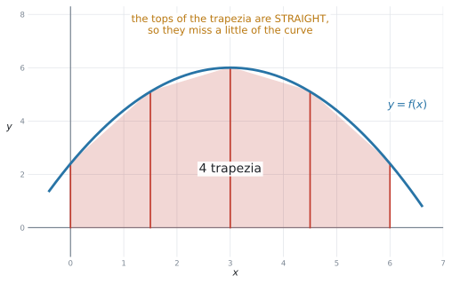
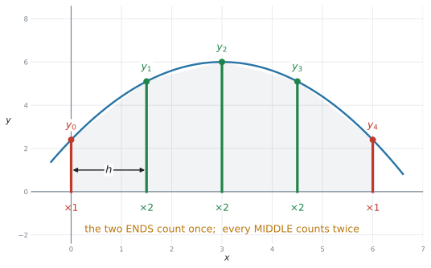
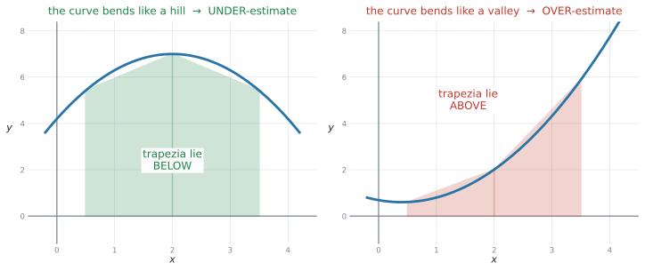
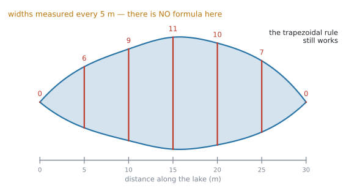
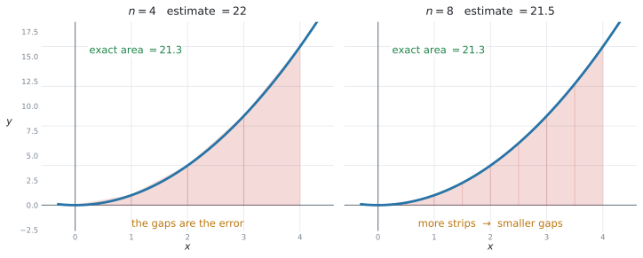
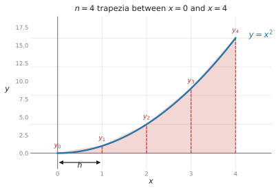
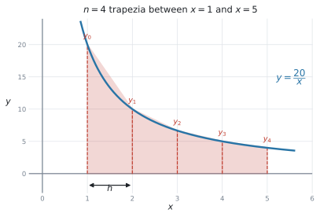
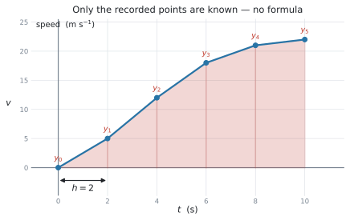
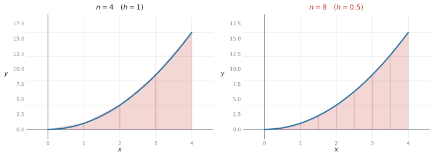

# SL 5.8 — The trapezoidal rule（台形公式による面積の近似） {#sec-sl-5-8}

::: {.callout-note}
## What you should be able to do
- **公式集の台形公式を、正しく読んで使える**。
- **$n$ は「台形の数」**であって、値の個数ではないと分かる（値は $n+1$ 個）。
- $h = \dfrac{b-a}{n}$ を求められる。
- **端の値は $1$ 回、中の値は $2$ 回**足すと分かる。
- **関数がなくても**、表の値だけで面積を見積もれる（湖・川など）。
- **式があっても、[SL 5.5](sl-5-5.qmd) では積分できない形**のときに、この方法を使うと分かる。
- 答えが **over-estimate（過大）か under-estimate（過小）か**を、理由をつけて言える。
- $n$ を増やすと**近似がよくなる**ことを説明できる。
:::

::: {.callout-important}
## Formula booklet に載っています
公式集の **SL 5.8** の欄には、次の式があります。

$$
\int_{a}^{b} y\,dx \approx \frac{1}{2}h\Big(\left(y_{0} + y_{n}\right) + 2\left(y_{1} + y_{2} + \cdots + y_{n-1}\right)\Big)
$$ {#eq-sl58-booklet}

$$
\text{where } \ h = \frac{b - a}{n}
$$ {#eq-sl58-h}

**式は覚えなくて構いません。** ただし、**記号の意味は覚えていないと使えません。** 記号の説明は、[第2節](#count)にまとめてあります。
:::

## The idea

### 1. 曲線の下を、台形でうめます {#idea}

[SL 5.5](sl-5-5.qmd#definite) で、曲線の下の面積を定積分で求めました。**式があって、しかもその式が積分できるときは、それでよいのです。**

では、そうでないときはどうするか。シラバスは、この項目の出番を**2つ**挙げています。

> Given a **table of data** or a **function**, make an estimate for the value of an area using the trapezoidal rule, with intervals of equal width.

- **式がないとき** … 表の値しかない場合です。湖や川の面積などがこれで、シラバスの Connections 欄にも `for example lakes` と挙げられています
- **式はあるが、積分できないとき** … **式があっても、いつも積分できるとは限りません。** [SL 5.5](sl-5-5.qmd) で積分できるのは $ax^{n}$（$n$ は整数、$n \neq -1$）の形だけです。AI HL に進めばもっといろいろな式の積分が出てきますが、**それでも、すべての式が積分できるわけではありません。**

**どちらの場合も、答えは estimate（見積もり）になります。**

{#fig-sl58-idea width=84%}

@fig-sl58-idea のように、面積を**同じ幅の台形**に切り分けて、それを全部足します。

**台形の上の辺はまっすぐ**なので、曲線とのあいだにすき間ができます。だから答えは **estimate（見積もり）** です。

::: {.callout-tip}
## 台形の面積は、中学で習ったとおりです
$$
\text{台形の面積} = \frac{1}{2}(\text{上底} + \text{下底}) \times \text{高さ}
$$

公式集にもあります（`Area of a trapezoid`）。**この項目の式は、これを全部足しただけ**です。
:::

### 2. 端は $1$ 回、中は $2$ 回 {#count}

面積を台形で estimate するときに使うのが、この公式です。

$$
\int_{a}^{b} y\,dx \approx \frac{1}{2}h\Big(\left(y_{0} + y_{n}\right) + 2\left(y_{1} + y_{2} + \cdots + y_{n-1}\right)\Big)
$$

$$
\text{where } \ h = \frac{b - a}{n}
$$

| 記号 | 意味 |
|---|---|
| $n$ | **台形の数**（strips の数） |
| $h$ | $1$ つの台形の**幅** |
| $y_{0}$、$y_{n}$ | **両はしの値**（$1$ 回だけ足す） |
| $y_{1} \ldots y_{n-1}$ | **中の値**（$2$ 倍して足す） |

: 記号の意味 {#tbl-sl58-symbols}

シラバスの Guidance は、条件を1つ付けています。

> ... using the trapezoidal rule, with **intervals of equal width**.

**幅は、全部同じでなければなりません。**

そのうえで、**公式のいちばん大事なところ**がここです。

{#fig-sl58-count width=86%}

$$
\frac{1}{2}h\Big(\underbrace{\left(y_{0} + y_{n}\right)}_{\text{端：}1\text{回}} + \underbrace{2\left(y_{1} + \cdots + y_{n-1}\right)}_{\text{中：}2\text{回}}\Big)
$$

**なぜ中だけ $2$ 倍なのか。** @fig-sl58-count の $y_{1}$ を見てください。この線は、**左の台形の右辺**であり、**右の台形の左辺**でもあります。**$2$ つの台形が共有している**ので、$2$ 回数えます。

いっぽう $y_{0}$ と $y_{4}$ は、**いちばん外側**なので $1$ つの台形にしか属しません。

::: {.callout-tip}
## 手順は、いつも同じ4つです
1. **$h$ を求める**（となり合う $x$ の差。または $\dfrac{b-a}{n}$）
2. **両はしを足す**
3. **中を全部足して、$2$ 倍する**
4. **合計に $\dfrac{1}{2}h$ を掛ける**

**この $4$ 行を、そのまま答案に書いてください。** 途中で計算を間違えても、行があれば点が残ります。
:::

### 3. $n$ は「台形の数」です {#n}

**この項目で一番多い間違いです。**

| | 数 |
|---|---|
| **台形（strips）の数** | $n$ |
| **$y$ の値の数** | $n + 1$ |

: $n$ の数え方 {#tbl-sl58-n}

$y_{0}, y_{1}, y_{2}, y_{3}, y_{4}$ という **$5$ つの値**があるなら、台形は **$4$ つ**。つまり $n = 4$ です。

::: {.callout-warning}
## 値が $5$ つあるからといって、$n = 5$ ではありません
$h = \dfrac{b-a}{n}$ の $n$ を間違えると、**$h$ が変わって、答えが全部ずれます。**

**表を見たら、まず「点は何個か」→「台形はその $1$ つ少ない」**と数えてください。

$0$ から $8$ まで $2$ おきに $0, 2, 4, 6, 8$ なら、点は $5$ 個、台形は $4$ つ、$h = 2$ です。
:::

::: {.callout-tip}
## $h$ は、表から直接読むのが速いです
となり合う $x$ の差を見るだけです。$0, 5, 10, 15$ なら $h = 5$。

$\dfrac{b-a}{n}$ を使うのは、**「$n = 4$ で見積もりなさい」**のように $n$ が指定されたときです。
:::

### 4. 過大評価か、過小評価か {#over-under}

シラバスの Guidance が、この項目を [SL 1.6](../01-number-and-algebra/sl-1-6.qmd) につないでいます。

> **Link to:** upper and lower bounds (SL 1.6) and areas under curves (SL 5.5).

答えが本当の面積より**大きいか小さいか**は、**曲線の曲がり方**で決まります。

{#fig-sl58-overunder width=96%}

| 曲線の形 | 台形は | 答えは |
|---|---|---|
| **山なり**（上に凸） | 曲線より**下** | **under-estimate**（小さすぎる） |
| **谷なり**（下に凸） | 曲線より**上** | **over-estimate**（大きすぎる） |

: 過大か過小か {#tbl-sl58-overunder}

::: {.callout-note appearance="simple"}
これは、[SL 1.6](../01-number-and-algebra/sl-1-6.qmd) の丸めによる **upper bound / lower bound** とは計算方法が違います。ここでは、**台形の直線部分が曲線より上か下か**で判断します。
:::

::: {.callout-important}
## 理由の一文を、必ず書いてください
`Is this an over-estimate or an under-estimate? Give a reason.` は、**よく出る設問**です。

::: {.model-answer}
**試験ではこう書く**

*It is an over-estimate, because the curve bends upwards, so each straight top lies above the curve.*
:::

**「グラフを見たから」では理由になりません。** 台形の上の辺が曲線の上か下か、を書いてください。
:::

::: {.callout-tip}
## 図をかいて、$1$ つの台形だけ見れば分かります
全部の台形を考える必要はありません。**曲線を1本と、そこに引いた弦（まっすぐな線）を1本**かいてみてください。

弦が曲線の**上**にあれば過大、**下**にあれば過小です。
:::

### 5. 関数がなくても使えます {#table}

**この公式のいちばんの値打ち**は、ここです。

シラバスの Connections 欄は、こう書いています。

> Other contexts: **Irregular areas that are not described by mathematical functions**, for example lakes.

{#fig-sl58-lake width=88%}

@fig-sl58-lake は、湖の幅を $5$ m おきに測ったものです。**湖の形を表す式は、ありません。** それでも、台形公式なら面積が見積もれます。

$$
A \approx \frac{1}{2}(5)\Big[(0 + 0) + 2(6 + 9 + 11 + 10 + 7)\Big] = 2.5 \times 86 = 215 \ \text{m}^{2}
$$

::: {.callout-note}
## 表の値は、そのまま使います
関数に代入する必要はありません。**表に並んでいる数を、順番に公式へ入れるだけ**です。

いちばん左といちばん右が $y_{0}$ と $y_{n}$、あいだが全部「中」です。
:::

### 6. $n$ を増やすと、近づきます {#accuracy}

{#fig-sl58-n width=96%}

@fig-sl58-n は、$y = x^{2}$ の $0$ から $4$ までの面積です。

| $n$ | 見積もり | 本当の値 |
|---|---|---|
| $4$ | $22$ | $21.3$ |
| $8$ | $21.5$ | $21.3$ |

: $n$ を増やすと {#tbl-sl58-accuracy}

**台形が細くなるほど、すき間が小さくなります。** ただし手計算の量は増えます。

::: {.callout-note appearance="simple"}
シラバスの Connections 欄には `Enrichment: Simpson's rule` とあります。もっと精度のよい方法もある、というだけの話で、**AI SL の試験には出ません。**
:::

## Why it works

:::: {.callout-note collapse="true" appearance="simple"}
## クリックすると開きます
台形 $1$ つぶんの面積から始めます。

いちばん左の台形は、**上底 $y_{0}$、下底 $y_{1}$、高さ $h$**（横に倒れているので「高さ」が横幅です）。

$$
\frac{1}{2}(y_{0} + y_{1})h
$$

次の台形は

$$
\frac{1}{2}(y_{1} + y_{2})h
$$

… と続きます。$n = 4$ なら、全部足して

$$
A \approx \frac{1}{2}h(y_{0} + y_{1}) + \frac{1}{2}h(y_{1} + y_{2}) + \frac{1}{2}h(y_{2} + y_{3}) + \frac{1}{2}h(y_{3} + y_{4})
$$

$\dfrac{1}{2}h$ でくくります。

$$
A \approx \frac{1}{2}h\Big(y_{0} + y_{1} + y_{1} + y_{2} + y_{2} + y_{3} + y_{3} + y_{4}\Big)
$$

**同じ文字が何回出てくるかを数えてください。**

- $y_{0}$ … $1$ 回
- $y_{1}$、$y_{2}$、$y_{3}$ … **$2$ 回ずつ**
- $y_{4}$ … $1$ 回

$$
A \approx \frac{1}{2}h\Big((y_{0} + y_{4}) + 2(y_{1} + y_{2} + y_{3})\Big)
$$

**これが公式集の式です。** 中の値が $2$ 倍されているのは、**となり合う $2$ つの台形で共有されているから**です。

::: {.callout-note appearance="simple"}
$h$ をどんどん小さくしていくと、この和は**本当の面積**に近づきます。それが [SL 5.5](sl-5-5.qmd#why-it-works) で見た定積分です。

**台形公式は、定積分の「途中で止めた版」**だと思ってください。
:::
::::

## Worked examples

::: {.callout-note appearance="simple"}
問題文は英語です。意味が理解できなかったら、問題文の下の「**日本語訳**」を開いてください。解説は日本語です。
:::

::: {#exm-sl58-basic}
[Use the trapezoidal rule with $n = 4$ to estimate the area enclosed by the curve $y = x^{2}$, the $x$-axis, and the lines $x = 0$ and $x = 4$.]{.q-en}

{#fig-sl58-we1 width=66%}

**(a)** [Find the value of $h$.]{.q-en}

**(b)** [Find the estimate.]{.q-en}

**(c)** [The exact area is $21.3$ (3 s.f.). State whether the estimate is an over-estimate or an under-estimate, and give a reason.]{.q-en}

<details class="jp-trans">
<summary>日本語訳</summary>

$n = 4$ の台形公式を使って、曲線 $y = x^{2}$、$x$ 軸、直線 $x = 0$、$x = 4$ で囲まれた面積を見積もりなさい。

**(a)** $h$ の値を求めなさい。

**(b)** 見積もりの値を求めなさい。

**(c)** 正確な面積は $21.3$（有効数字 $3$ 桁）です。この見積もりが過大評価か過小評価かを述べ、理由を書きなさい。

</details>

---

**(a)**

$$
h = \frac{b - a}{n} = \frac{4 - 0}{4} = 1
$$

**(b)** $x = 0, 1, 2, 3, 4$ での $y$ を出します。**$5$ つ**です。

| $x$ | $0$ | $1$ | $2$ | $3$ | $4$ |
|---|---|---|---|---|---|
| $y = x^{2}$ | $0$ | $1$ | $4$ | $9$ | $16$ |

: 値の表 {#tbl-sl58-we1}

[端は $1$ 回、中は $2$ 回](#count)です。

$$
A \approx \frac{1}{2}(1)\Big[(0 + 16) + 2(1 + 4 + 9)\Big]
$$

$$
= \frac{1}{2}\Big[16 + 2(14)\Big] = \frac{1}{2}\left[16 + 28\right] = \frac{44}{2} = 22
$$

**(c)** $22 > 21.3$ なので過大評価です。理由は曲線の形。

::: {.model-answer}
**試験ではこう書く**

*It is an over-estimate, because $y = x^{2}$ bends upwards, so the straight top of each trapezium lies above the curve.*
:::

::: {.callout-tip}
## 表を作るところまでを、必ず書いてください
$y$ の値を並べた表（または $y_{0} = 0$、$y_{1} = 1$、… と書いた行）が、**最初の点**です。

いきなり $22$ と書くと、途中点がもらえません。
:::

::: {.callout-note}
## 解答例（答案用紙にはこう書く）
**(a)** $h = \dfrac{4 - 0}{4} = 1$

**(b)** $y$-values: $0,\ 1,\ 4,\ 9,\ 16$

$A \approx \dfrac{1}{2}(1)\left[(0 + 16) + 2(1 + 4 + 9)\right] = \dfrac{1}{2}(44) = 22$

**(c)** *Over-estimate, because the curve bends upwards, so each straight top lies above the curve.*
:::
:::

::: {#exm-sl58-lake}
[The width of a lake is measured every $5$ metres along its length. The results are shown in the table.]{.q-en}

| Distance (m) | $0$ | $5$ | $10$ | $15$ | $20$ | $25$ | $30$ |
|---|---|---|---|---|---|---|---|
| Width (m) | $0$ | $6$ | $9$ | $11$ | $10$ | $7$ | $0$ |

: Widths of the lake {#tbl-sl58-we2}

**(a)** [Write down the value of $h$ and the number of trapezia.]{.q-en}

**(b)** [Use the trapezoidal rule to estimate the area of the lake.]{.q-en}

<details class="jp-trans">
<summary>日本語訳</summary>

ある湖の幅を、長さ方向に $5$ m おきに測りました。結果は表のとおりです。

**(a)** $h$ の値と、台形の数を書きなさい。

**(b)** 台形公式を使って、湖の面積を見積もりなさい。

</details>

---

**(a)** となり合う距離の差が $5$ なので $h = 5$。

値は **$7$ 個**、だから[台形は $6$ つ](#n)。

$$
h = 5, \qquad n = 6
$$

**(b)** 両はしは $0$ と $0$、中は $6, 9, 11, 10, 7$。

$$
A \approx \frac{1}{2}(5)\Big[(0 + 0) + 2(6 + 9 + 11 + 10 + 7)\Big]
$$

$$
= 2.5\Big[0 + 2(43)\Big] = 2.5 \times 86 = 215 \ \text{m}^{2}
$$

::: {.callout-tip}
## 両はしが $0$ でも、書いてください
$(0 + 0)$ の行を省くと、**式を正しく使ったことが伝わりません。**

湖や川の問題では、両はしが $0$ になるのがふつうです。**$0$ だからこそ、書いておくと安心**です。
:::

::: {.callout-warning}
## 値が $7$ 個だから $n = 7$、ではありません
[$n$ は台形の数](#n)。$7$ 個の点のあいだには、**すき間が $6$ つ**あります。

もし $n = 7$ としてしまうと、$h$ の計算まで狂います（この問題では $h$ は表から読めるので気づきにくく、そのぶん危険です）。
:::

::: {.callout-note}
## 解答例（答案用紙にはこう書く）
**(a)** $h = 5$, $n = 6$

**(b)** $A \approx \dfrac{1}{2}(5)\left[(0 + 0) + 2(6 + 9 + 11 + 10 + 7)\right] = 2.5(86) = 215\ \text{m}^{2}$
:::
:::

::: {#exm-sl58-gdc}
[Use the trapezoidal rule with $n = 4$ to estimate $\displaystyle\int_{1}^{5} \frac{20}{x}\,dx$, giving your answer correct to three significant figures.]{.q-en}

{#fig-sl58-we3 width=66%}

<details class="jp-trans">
<summary>日本語訳</summary>

$n = 4$ の台形公式を使って $\displaystyle\int_{1}^{5} \dfrac{20}{x}\,dx$ を見積もり、答えを有効数字 $3$ 桁で書きなさい。

</details>

---

$\dfrac{20}{x}$ は $20x^{-1}$、つまり $n = -1$ です。**[SL 5.5](sl-5-5.qmd) の公式では積分できません**（$n \neq -1$ という条件がありました）。**式はあるのに積分できない**、という[2つ目の場合](#idea)です。

$$
h = \frac{5 - 1}{4} = 1
$$

$x = 1, 2, 3, 4, 5$ で値を出します。**電卓を使ってかまいません。**（[GDCの使い方](#table-gdc)）

| $x$ | $1$ | $2$ | $3$ | $4$ | $5$ |
|---|---|---|---|---|---|
| $y = \dfrac{20}{x}$ | $20$ | $10$ | $6.667$ | $5$ | $4$ |

: 値の表（$3$ 桁で丸めた表示） {#tbl-sl58-we3}

$$
A \approx \frac{1}{2}(1)\Big[(20 + 4) + 2(10 + 6.667 + 5)\Big]
$$

$$
= \frac{1}{2}\Big[24 + 2(21.667)\Big] = \frac{1}{2}(67.333) = 33.7 \quad (3 \text{ s.f.})
$$

::: {.callout-warning}
## 途中で丸めないでください
表には $6.667$ と書きましたが、**計算には $\dfrac{20}{3}$ をそのまま使います。**

$6.67$ で計算すると、答えが $33.7$ からずれることがあります。**電卓の中の値を使って、最後に丸めてください。**
:::

::: {.callout-tip}
## $y = \dfrac{20}{x}$ は「谷なり」の形です
$x$ が大きくなるほど急に平らになる曲線で、**下に凸**（谷なり）です。

だから、この見積もりは**過大評価**です。実際の値は $32.2$（$3$ 桁）で、$33.7$ より小さくなっています。
:::

::: {.callout-note}
## 解答例（答案用紙にはこう書く）
$h = 1$;  $y$-values: $20,\ 10,\ \dfrac{20}{3},\ 5,\ 4$

$A \approx \dfrac{1}{2}(1)\left[(20 + 4) + 2\left(10 + \dfrac{20}{3} + 5\right)\right] = 33.7$ (3 s.f.)
:::
:::

::: {#exm-sl58-speed}
[The speed of a car, in metres per second, is recorded every $2$ seconds.]{.q-en}

| Time (s) | $0$ | $2$ | $4$ | $6$ | $8$ | $10$ |
|---|---|---|---|---|---|---|
| Speed (m s⁻¹) | $0$ | $5$ | $12$ | $18$ | $21$ | $22$ |

: Speed of the car {#tbl-sl58-we4}

{#fig-sl58-we4 width=70%}

**(a)** [Use the trapezoidal rule to estimate the area under the speed–time graph.]{.q-en}

**(b)** [Interpret your answer in the context of the question.]{.q-en}

<details class="jp-trans">
<summary>日本語訳</summary>

ある車の速さ（m/秒）を、$2$ 秒おきに記録しました。

**(a)** 台形公式を使って、速さと時間のグラフの下の面積を見積もりなさい。

**(b)** 答えを、問題の文脈で解釈しなさい。

</details>

---

**(a)** 値は **$6$ 個**なので台形は **$5$ つ**、$h = 2$。

$$
A \approx \frac{1}{2}(2)\Big[(0 + 22) + 2(5 + 12 + 18 + 21)\Big]
$$

$$
= 1 \times \Big[22 + 2(56)\Big] = 22 + 112 = 134
$$

**(b)** [速さのグラフの面積は、距離](sl-5-5.qmd#rate)です。単位は $\dfrac{\text{m}}{\text{秒}} \times \text{秒} = \text{m}$。

::: {.model-answer}
**試験ではこう書く**

*The car travels approximately $134$ metres in the first $10$ seconds.*
:::

::: {.callout-tip}
## `approximately` を入れてください
台形公式で出した値は、**あくまで見積もり**です。

$134$ metres と言い切らず、**`approximately` や `about` を付ける**と、意味が正確になります。
:::

::: {.callout-note appearance="simple"}
シラバスの Connections 欄には `Links to other subjects: Kinematics (Physics)` とあります。**速さと時間のグラフは、この項目の代表的な使い道**です。

（ただし [SL 5.7](sl-5-7.qmd) で見たとおり、**運動そのものを扱う設問は SL では出ません。** ここでやっているのは「グラフの下の面積を求める」ことだけです。）
:::

::: {.callout-note}
## 解答例（答案用紙にはこう書く）
**(a)** $h = 2$, $n = 5$

$A \approx \dfrac{1}{2}(2)\left[(0 + 22) + 2(5 + 12 + 18 + 21)\right] = 134$

**(b)** *The car travels approximately $134$ metres in the first $10$ seconds.*
:::
:::

::: {#exm-sl58-accuracy}
[The area enclosed by $y = x^{2}$, the $x$-axis, $x = 0$ and $x = 4$ is estimated using the trapezoidal rule.]{.q-en}

{#fig-sl58-we5 width=100%}

**(a)** [Use $n = 8$ to find a new estimate.]{.q-en}

**(b)** [The estimate with $n = 4$ was $22$, and the exact area is $\dfrac{64}{3}$. Comment on the effect of increasing $n$.]{.q-en}

<details class="jp-trans">
<summary>日本語訳</summary>

$y = x^{2}$、$x$ 軸、$x = 0$、$x = 4$ で囲まれた面積を、台形公式で見積もります。

**(a)** $n = 8$ を使って、新しい見積もりを求めなさい。

**(b)** $n = 4$ のときの見積もりは $22$、正確な面積は $\dfrac{64}{3}$ です。$n$ を増やすことの効果についてコメントしなさい。

</details>

---

**(a)**

$$
h = \frac{4 - 0}{8} = 0.5
$$

$x = 0,\ 0.5,\ 1,\ 1.5,\ 2,\ 2.5,\ 3,\ 3.5,\ 4$ の **$9$ 個**の値です。

| $x$ | $0$ | $0.5$ | $1$ | $1.5$ | $2$ | $2.5$ | $3$ | $3.5$ | $4$ |
|---|---|---|---|---|---|---|---|---|---|
| $y$ | $0$ | $0.25$ | $1$ | $2.25$ | $4$ | $6.25$ | $9$ | $12.25$ | $16$ |

: $n = 8$ の値 {#tbl-sl58-we5}

中の値の和は $0.25 + 1 + 2.25 + 4 + 6.25 + 9 + 12.25 = 35$。

$$
A \approx \frac{1}{2}(0.5)\Big[(0 + 16) + 2(35)\Big] = 0.25\left[16 + 70\right] = 0.25(86) = 21.5
$$

**(b)**

::: {.model-answer}
**試験ではこう書く**

*Increasing $n$ makes the estimate more accurate. With $n = 4$ the estimate was $22$; with $n = 8$ it is $21.5$, which is closer to the exact value $21.3$. The trapezia are narrower, so less area is missed.*
:::

::: {.callout-tip}
## 中の値が $7$ つになります
$n = 8$ なら、値は $9$ 個。両はしをのぞくと **中は $7$ つ**です。

$1$ つ数え落とすだけで答えが変わるので、**$y_{1}$ から $y_{7}$ まで、指で追って数えてください。**
:::

::: {.callout-note}
## 解答例（答案用紙にはこう書く）
**(a)** $h = 0.5$

$A \approx \dfrac{1}{2}(0.5)\left[(0 + 16) + 2(0.25 + 1 + 2.25 + 4 + 6.25 + 9 + 12.25)\right]$

$= 0.25(86) = 21.5$

**(b)** *A larger $n$ gives a more accurate estimate: $21.5$ is closer to $21.3$ than $22$ is, because the trapezia are narrower.*
:::
:::

## Common errors

::: {.callout-warning}
## $n$ を「値の数」だと思う
**この項目で一番多い失点です。**

値が $7$ 個なら台形は $6$ つ。**$n = 6$** です。
:::

::: {.callout-warning}
## $h$ を間違える
$h$ は**となり合う $x$ の差**、または $\dfrac{b-a}{n}$。

$n$ を間違えると $h$ も狂うので、**答えが全部ずれます。**
:::

::: {.callout-warning}
## 端の値まで $2$ 倍してしまう
$2$ 倍するのは**中だけ**です。$y_{0}$ と $y_{n}$ は $1$ 回。

**$( \ )$ の位置**を、公式集を見ながら確かめてください。
:::

::: {.callout-warning}
## $\dfrac{1}{2}h$ の $\dfrac{1}{2}$ を忘れる
$h$ だけ掛けて終わってしまうと、**答えがちょうど $2$ 倍**になります。

答えが妙に大きいときは、まずここを疑ってください。
:::

::: {.callout-warning}
## 中の値を $1$ つ数え落とす
$n = 8$ なら中は $7$ つ、$n = 6$ なら中は $5$ つ。

**指で $1$ つずつ追って**、個数を確かめてください。
:::

::: {.callout-warning}
## 途中で丸めてしまう
$\dfrac{20}{3}$ を $6.67$ にしてから足すと、答えがずれます。

**電卓の中の値で計算し、最後に丸めます。**
:::

::: {.callout-warning}
## 幅がそろっていないのに使ってしまう
シラバスは `intervals of equal width` と指定しています。

**$x$ が $0, 5, 10, 20$ のように不ぞろい**なら、この公式はそのままでは使えません（試験では、必ずそろっています）。
:::

::: {.callout-warning}
## 過大か過小かの理由を書かない
`Give a reason` があったら、**台形の上の辺が曲線の上か下か**を書きます。

「グラフを見たら」では点になりません。
:::

::: {.callout-warning}
## `estimate` なのに言い切ってしまう
文脈の問題では、**`approximately` / `about`** を付けてください。

台形公式が返すのは、いつでも**見積もり**です。
:::

::: {.callout-warning}
## 単位を付けない
湖なら m²、距離なら m、水の量なら L。

**面積の単位は、縦の単位 × 横の単位**です（[SL 5.5](sl-5-5.qmd#rate) と同じ）。
:::

::: {.callout-warning}
## 表の値を、関数に代入し直そうとする
表しかない問題では、**関数はありません。** 表の数をそのまま公式に入れます。

「式が分からないから解けない」と思ってしまうのが、いちばんもったいない誤りです。
:::

## Using your GDC (TI-Nspire CX II)

台形公式そのものは**手で計算します**。電卓は、**値を出すところ**と**確かめるところ**で使います。

### 1. $y$ の値を、表で一気に出す {#table-gdc}

関数が与えられているときは、Graphs ページで表を出すのが速いです。

```
f1(x) = 20/x
ctrl + T
```

`ctrl + T` で、グラフの横に**表**が出ます。きざみ幅は次で変えられます。

```
menu → Table → Edit Table Settings
```

`Table Step` を $h$ の値（この例なら $1$）にすれば、**必要な $y$ が縦に並びます。**

::: {.callout-tip}
## 表をそのまま書き写せます
$x = 1, 2, 3, 4, 5$ の行を見て、$y$ を答案の表に書き写すだけです。

**$1$ つずつ代入するより、ずっと速くて確実**です。
:::

### 2. 計算は $1$ 行で {#calc}

Calculator ページで、公式をそのまま打ちます。

```
0.5*1*((20+4)+2*(10+20/3+5))
```

**$\dfrac{20}{3}$ を小数にせず、そのまま入れる**のがポイントです。[途中で丸めない](#gdc-round)ですみます。

### 3. 答えを確かめる {#check}

関数が分かっているときは、[SL 5.5](sl-5-5.qmd#calc) の定積分で**本当の値**が出せます。

```
menu → Calculus → Numerical Integral
```

$\displaystyle\int_{1}^{5}\frac{20}{x}\,dx = 32.2$（$3$ 桁）。台形公式の $33.7$ より小さいので、**過大評価だった**と確かめられます。

::: {.callout-warning}
## ただし、答案には台形公式の値を書きます
`Use the trapezoidal rule` と指定されているのに定積分の値（$32.2$）を書くと、**指示に従っていない**ことになります。

**定積分は、検算用**です。答えは $33.7$ です。
:::

### 4. 丸めについて {#gdc-round}

途中の値は、**電卓の中に残したまま**使います。

```
ans
```

前の計算結果は `ans` で呼び出せます。**表示された $6.67$ を打ち直さない**でください。

## Exercises

::: {.callout-note appearance="simple"}
各問題に、折りたたみが3つ付いています。**日本語訳**、**解答例**（答案用紙に書くべきこと。英語です）、**解説**（なぜそうなるか。日本語です）。

まず自分で解いて、次に解答例と見くらべてください。**解説は、合わなかったときだけ開けば十分です。**
:::

::: {.exercise-block}

[1]{.ex-no} [Use the trapezoidal rule with $n = 4$ to estimate the area enclosed by the curve $y = x^{2} + 1$, the $x$-axis, and the lines $x = 0$ and $x = 4$.]{.q-en}

<details class="jp-trans">
<summary>日本語訳</summary>

$n = 4$ の台形公式を使って、曲線 $y = x^{2} + 1$、$x$ 軸、直線 $x = 0$、$x = 4$ で囲まれた面積を見積もりなさい。

</details>

::: {.callout-note collapse="true"}
## 解答例（答案用紙に書くこと）
$h = \dfrac{4 - 0}{4} = 1$

$y$-values: $1,\ 2,\ 5,\ 10,\ 17$

$A \approx \dfrac{1}{2}(1)\left[(1 + 17) + 2(2 + 5 + 10)\right] = \dfrac{1}{2}(52) = 26$
:::

::: {.callout-tip collapse="true"}
## 解説
例題1と同じ形。$+1$ が付いただけです。

**両はしは $1$ と $17$**。$0$ ではないので、うっかり $(0 + 17)$ としないように。

$18 + 34 = 52$、$\div 2$ で $26$。

**検算。** 本当の値は $\dfrac{64}{3} + 4 = 25.3$。$26$ は少し大きく、**過大評価**です ✓（$y = x^2+1$ は下に凸）
:::

::: {.ex-sep}
:::

[2]{.ex-no} [Use the trapezoidal rule with $n = 4$ to estimate $\displaystyle\int_{1}^{5} x^{3}\,dx$.]{.q-en}

<details class="jp-trans">
<summary>日本語訳</summary>

$n = 4$ の台形公式を使って $\displaystyle\int_{1}^{5} x^{3}\,dx$ を見積もりなさい。

</details>

::: {.callout-note collapse="true"}
## 解答例（答案用紙に書くこと）
$h = \dfrac{5 - 1}{4} = 1$

$y$-values: $1,\ 8,\ 27,\ 64,\ 125$

$A \approx \dfrac{1}{2}(1)\left[(1 + 125) + 2(8 + 27 + 64)\right] = \dfrac{1}{2}(324) = 162$
:::

::: {.callout-tip collapse="true"}
## 解説
$a = 1$ から始まるので、$h = \dfrac{5-1}{4} = 1$。**$\dfrac{5}{4}$ ではありません。**

$126 + 2(99) = 126 + 198 = 324$。

**検算。** 定積分の本当の値は $156$。$162$ は大きめで、**過大評価**です ✓
:::

::: {.ex-sep}
:::

[3]{.ex-no} [The height of a hill above a straight road is measured every $10$ metres.]{.q-en}

| Distance (m) | $0$ | $10$ | $20$ | $30$ | $40$ | $50$ | $60$ |
|---|---|---|---|---|---|---|---|
| Height (m) | $0$ | $4$ | $7$ | $9$ | $8$ | $5$ | $0$ |

: Heights of the hill {#tbl-sl58-e3}

[Use the trapezoidal rule to estimate the area of the cross-section of the hill.]{.q-en}

<details class="jp-trans">
<summary>日本語訳</summary>

まっすぐな道路より上にある丘の高さを、$10$ m おきに測りました。

台形公式を使って、丘の断面積を見積もりなさい。

</details>

::: {.callout-note collapse="true"}
## 解答例（答案用紙に書くこと）
$h = 10$, $n = 6$

$A \approx \dfrac{1}{2}(10)\left[(0 + 0) + 2(4 + 7 + 9 + 8 + 5)\right] = 5(66) = 330\ \text{m}^{2}$
:::

::: {.callout-tip collapse="true"}
## 解説
値は **$7$ 個**、台形は **$6$ つ**。

中の和は $4 + 7 + 9 + 8 + 5 = 33$。$2$ 倍して $66$。$\dfrac{1}{2} \times 10 = 5$ を掛けて $330$。

**単位は m²** です。高さ（m）× 距離（m）だからです。
:::

::: {.ex-sep}
:::

[4]{.ex-no} [The trapezoidal rule with $n = 2$ is used to estimate the area enclosed by $y = x^{2}$, the $x$-axis, $x = 0$ and $x = 2$.]{.q-en}

**(a)** [Find the estimate.]{.q-en}

**(b)** [The exact area is $\dfrac{8}{3}$. State whether the estimate is an over-estimate or an under-estimate, and give a reason.]{.q-en}

<details class="jp-trans">
<summary>日本語訳</summary>

$n = 2$ の台形公式を使って、$y = x^{2}$、$x$ 軸、$x = 0$、$x = 2$ で囲まれた面積を見積もります。

**(a)** 見積もりの値を求めなさい。

**(b)** 正確な面積は $\dfrac{8}{3}$ です。この見積もりが過大評価か過小評価かを述べ、理由を書きなさい。

</details>

::: {.callout-note collapse="true"}
## 解答例（答案用紙に書くこと）
**(a)** $h = 1$;  $y$-values: $0,\ 1,\ 4$

$A \approx \dfrac{1}{2}(1)\left[(0 + 4) + 2(1)\right] = \dfrac{1}{2}(6) = 3$

**(b)** *Over-estimate, because the curve bends upwards, so each straight top lies above the curve.* ($3 > \dfrac{8}{3} = 2.67$)
:::

::: {.callout-tip collapse="true"}
## 解説
**台形が $2$ つだけ**なので、中の値は $y_{1} = 1$ の**$1$ つだけ**です。$2(1) = 2$。

台形が少ないぶん、誤差が大きくなります。$3$ に対して本当は $2.67$。

**(b)** の理由は「曲線が下に凸だから、弦が上に来る」。**この一文を丸ごと覚えてください。**
:::

::: {.ex-sep}
:::

[5]{.ex-no} [Water flows into a tank. The rate of flow, in litres per minute, is measured every $3$ minutes.]{.q-en}

| Time (min) | $0$ | $3$ | $6$ | $9$ | $12$ |
|---|---|---|---|---|---|
| Rate (L min⁻¹) | $20$ | $17$ | $13$ | $8$ | $2$ |

: Rate of flow {#tbl-sl58-e5}

**(a)** [Use the trapezoidal rule to estimate the total volume of water that flows in during the $12$ minutes.]{.q-en}

**(b)** [Interpret your answer in the context of the question.]{.q-en}

<details class="jp-trans">
<summary>日本語訳</summary>

水がタンクに流れこみます。流量（$1$ 分あたりのリットル数）を $3$ 分おきに測りました。

**(a)** 台形公式を使って、$12$ 分間に流れこんだ水の合計の量を見積もりなさい。

**(b)** 答えを、問題の文脈で解釈しなさい。

</details>

::: {.callout-note collapse="true"}
## 解答例（答案用紙に書くこと）
**(a)** $h = 3$, $n = 4$

$V \approx \dfrac{1}{2}(3)\left[(20 + 2) + 2(17 + 13 + 8)\right] = 1.5(98) = 147$

**(b)** *Approximately $147$ litres of water flow into the tank during the $12$ minutes.*
:::

::: {.callout-tip collapse="true"}
## 解説
**変化率のグラフの面積は、合計**です（[SL 5.5](sl-5-5.qmd#rate)）。単位は $\dfrac{\text{L}}{\text{分}} \times \text{分} = \text{L}$。

中の和は $17 + 13 + 8 = 38$、$2$ 倍で $76$。端は $20 + 2 = 22$。合計 $98$。$\times 1.5$ で $147$。

**(b)** に **`approximately`** と **`litres`** の両方を入れてください。
:::

::: {.ex-sep}
:::

[6]{.ex-no} [Use the trapezoidal rule with $n = 4$ to estimate $\displaystyle\int_{0}^{2} 2^{x}\,dx$, giving your answer correct to three significant figures.]{.q-en}

<details class="jp-trans">
<summary>日本語訳</summary>

$n = 4$ の台形公式を使って $\displaystyle\int_{0}^{2} 2^{x}\,dx$ を見積もり、答えを有効数字 $3$ 桁で書きなさい。

</details>

::: {.callout-note collapse="true"}
## 解答例（答案用紙に書くこと）
$h = \dfrac{2 - 0}{4} = 0.5$

$y$-values: $1,\ 1.414,\ 2,\ 2.828,\ 4$

$A \approx \dfrac{1}{2}(0.5)\left[(1 + 4) + 2(1.414 + 2 + 2.828)\right] = 0.25(17.49) = 4.37$ (3 s.f.)
:::

::: {.callout-tip collapse="true"}
## 解説
$2^{0.5} = \sqrt{2} = 1.41421\ldots$、$2^{1.5} = 2.82842\ldots$。**電卓で出してください。**

**表示された $1.414$ を打ち直さない**こと。電卓の表を使って、そのまま計算します。

$5 + 2(6.24264) = 17.48528$、$\times 0.25$ で $4.37132\ldots \to 4.37$。

**検算。** 本当の値は $4.33$。**過大評価**です ✓（$2^x$ は下に凸）
:::

::: {.ex-sep}
:::

[7]{.ex-no} [The table shows values of a function $f$.]{.q-en}

| $x$ | $2$ | $5$ | $8$ | $11$ | $14$ |
|---|---|---|---|---|---|
| $f(x)$ | $6$ | $9$ | $11$ | $10$ | $4$ |

: Values of $f$ {#tbl-sl58-e7}

**(a)** [Write down the value of $h$ and the number of trapezia.]{.q-en}

**(b)** [Use the trapezoidal rule to estimate $\displaystyle\int_{2}^{14} f(x)\,dx$.]{.q-en}

<details class="jp-trans">
<summary>日本語訳</summary>

表は関数 $f$ の値を示しています。

**(a)** $h$ の値と、台形の数を書きなさい。

**(b)** 台形公式を使って $\displaystyle\int_{2}^{14} f(x)\,dx$ を見積もりなさい。

</details>

::: {.callout-note collapse="true"}
## 解答例（答案用紙に書くこと）
**(a)** $h = 3$, $n = 4$

**(b)** $\displaystyle\int_{2}^{14} f(x)\,dx \approx \dfrac{1}{2}(3)\left[(6 + 4) + 2(9 + 11 + 10)\right] = 1.5(70) = 105$
:::

::: {.callout-tip collapse="true"}
## 解説
$h$ は表から読めます。$5 - 2 = 3$、$8 - 5 = 3$ … **等間隔** ✓

$\dfrac{b-a}{n} = \dfrac{14-2}{4} = 3$ でも同じです。**どちらでも確かめられます。**

**両はしは $6$ と $4$。** $0$ ではないので注意。中の和は $9 + 11 + 10 = 30$、$2$ 倍で $60$。$10 + 60 = 70$。
:::

::: {.ex-sep}
:::

[8]{.ex-no} [The speed of a runner, in metres per second, is recorded every $5$ seconds.]{.q-en}

| Time (s) | $0$ | $5$ | $10$ | $15$ | $20$ | $25$ | $30$ |
|---|---|---|---|---|---|---|---|
| Speed (m s⁻¹) | $0$ | $8$ | $14$ | $18$ | $20$ | $19$ | $15$ |

: Speed of the runner {#tbl-sl58-e8}

**(a)** [Estimate the distance run in the $30$ seconds.]{.q-en}

**(b)** [Explain why your answer is only an estimate.]{.q-en}

<details class="jp-trans">
<summary>日本語訳</summary>

ランナーの速さ（m/秒）を、$5$ 秒おきに記録しました。

**(a)** $30$ 秒間に走った距離を見積もりなさい。

**(b)** 答えが見積もりにすぎない理由を説明しなさい。

</details>

::: {.callout-note collapse="true"}
## 解答例（答案用紙に書くこと）
**(a)** $h = 5$, $n = 6$

$d \approx \dfrac{1}{2}(5)\left[(0 + 15) + 2(8 + 14 + 18 + 20 + 19)\right] = 2.5(173) = 432.5\ \text{m}$

**(b)** *The trapezoidal rule replaces the curve by straight lines between the measured points, so the area found is not exactly the area under the graph. We do not know what the speed was between the readings.*
:::

::: {.callout-tip collapse="true"}
## 解説
**最後の値は $15$ で、$0$ ではありません。** 端は $0 + 15 = 15$ です。

中の和は $8+14+18+20+19 = 79$、$2$ 倍で $158$。$15 + 158 = 173$。$\times 2.5$ で $432.5$ m。

**(b)** の理由は $2$ つ書けます ── ①台形の上の辺はまっすぐで曲線ではない、②測った点のあいだの速さが分からない。**どちらか $1$ つで十分**です。
:::

::: {.ex-sep}
:::

[9]{.ex-no} [The area enclosed by $y = x^{3}$, the $x$-axis, $x = 0$ and $x = 4$ is estimated using the trapezoidal rule.]{.q-en}

**(a)** [Find the estimate when $n = 2$.]{.q-en}

**(b)** [Find the estimate when $n = 4$.]{.q-en}

**(c)** [The exact area is $64$. Comment on your two answers.]{.q-en}

<details class="jp-trans">
<summary>日本語訳</summary>

$y = x^{3}$、$x$ 軸、$x = 0$、$x = 4$ で囲まれた面積を、台形公式で見積もります。

**(a)** $n = 2$ のときの見積もりを求めなさい。

**(b)** $n = 4$ のときの見積もりを求めなさい。

**(c)** 正確な面積は $64$ です。$2$ つの答えについてコメントしなさい。

</details>

::: {.callout-note collapse="true"}
## 解答例（答案用紙に書くこと）
**(a)** $h = 2$;  $y$-values: $0,\ 8,\ 64$

$A \approx \dfrac{1}{2}(2)\left[(0 + 64) + 2(8)\right] = 80$

**(b)** $h = 1$;  $y$-values: $0,\ 1,\ 8,\ 27,\ 64$

$A \approx \dfrac{1}{2}(1)\left[(0 + 64) + 2(1 + 8 + 27)\right] = \dfrac{1}{2}(136) = 68$

**(c)** *Both are over-estimates, because the curve bends upwards. The estimate with $n = 4$ ($68$) is much closer to $64$ than the one with $n = 2$ ($80$), because narrower trapezia miss less area.*
:::

::: {.callout-tip collapse="true"}
## 解説
$n = 2$ では中の値が $y_{1} = 8$ の**$1$ つだけ**。$64 + 16 = 80$。

$n = 4$ では中が $3$ つ。$1 + 8 + 27 = 36$、$2$ 倍で $72$。$64 + 72 = 136$、$\div 2$ で $68$。

**誤差は $16$ から $4$ へ。** 幅を半分にすると、誤差はおよそ $\dfrac{1}{4}$ になります。

**(c)** には「どちらも過大」「$n$ が大きいほうが近い」の**両方**を書いてください。
:::

::: {.ex-sep}
:::

[10]{.ex-no} [The width of a lake is measured every $20$ metres.]{.q-en}

| Distance (m) | $0$ | $20$ | $40$ | $60$ | $80$ | $100$ | $120$ |
|---|---|---|---|---|---|---|---|
| Width (m) | $0$ | $25$ | $40$ | $46$ | $42$ | $30$ | $0$ |

: Widths of the lake {#tbl-sl58-e10}

**(a)** [Estimate the area of the lake.]{.q-en}

**(b)** [State one reason why the trapezoidal rule is useful here.]{.q-en}

<details class="jp-trans">
<summary>日本語訳</summary>

ある湖の幅を $20$ m おきに測りました。

**(a)** 湖の面積を見積もりなさい。

**(b)** ここで台形公式が役に立つ理由を $1$ つ述べなさい。

</details>

::: {.callout-note collapse="true"}
## 解答例（答案用紙に書くこと）
**(a)** $h = 20$, $n = 6$

$A \approx \dfrac{1}{2}(20)\left[(0 + 0) + 2(25 + 40 + 46 + 42 + 30)\right] = 10(366) = 3660\ \text{m}^{2}$

**(b)** *There is no function that describes the shape of the lake, so the area cannot be found by integration. The trapezoidal rule needs only the measured widths.*
:::

::: {.callout-tip collapse="true"}
## 解説
中の和は $25 + 40 + 46 + 42 + 30 = 183$、$2$ 倍で $366$。$\dfrac{1}{2} \times 20 = 10$ を掛けて $3660\ \text{m}^{2}$。

**(b)** は、シラバスの Connections 欄がそのまま設問になった形です。

> `Irregular areas that are not described by mathematical functions, for example lakes`

**「式がないから積分できない。でも測った値ならある。」** ── この一文が答えです。
:::

::: {.ex-sep}
:::

[11]{.ex-no} [In SL 5.5 the exact value of $\displaystyle\int_{1}^{3}\left(x^{2}+1\right)dx$ was found to be $\dfrac{32}{3}$.]{.q-en}

**(a)** [Use the trapezoidal rule with $n = 4$ to estimate this integral.]{.q-en}

**(b)** [Find the difference between your estimate and the exact value.]{.q-en}

**(c)** [State whether the estimate is an over-estimate or an under-estimate, and give a reason.]{.q-en}

<details class="jp-trans">
<summary>日本語訳</summary>

SL 5.5 で、$\displaystyle\int_{1}^{3}\left(x^{2}+1\right)dx$ の正確な値は $\dfrac{32}{3}$ と分かりました。

**(a)** $n = 4$ の台形公式を使って、この積分を見積もりなさい。

**(b)** 見積もりと正確な値の差を求めなさい。

**(c)** 見積もりが過大評価か過小評価かを述べ、理由を書きなさい。

</details>

::: {.callout-note collapse="true"}
## 解答例（答案用紙に書くこと）
**(a)** $h = \dfrac{3 - 1}{4} = 0.5$

$y$-values at $x = 1,\ 1.5,\ 2,\ 2.5,\ 3$:  $2,\ 3.25,\ 5,\ 7.25,\ 10$

$A \approx \dfrac{1}{2}(0.5)\left[(2 + 10) + 2(3.25 + 5 + 7.25)\right] = 0.25(43) = 10.75$

**(b)** $10.75 - \dfrac{32}{3} = 10.75 - 10.667 = 0.0833$ (3 s.f.)

**(c)** *Over-estimate, because $y = x^{2}+1$ bends upwards, so each straight top lies above the curve.*
:::

::: {.callout-tip collapse="true"}
## 解説
**[SL 5.5](sl-5-5.qmd) の例題4と同じ積分**です。あちらは電卓で $\dfrac{32}{3} = 10.7$ と出しました。

今度は**式を使わずに、$5$ つの値だけ**で $10.75$。差はわずか $0.083$ です。

**台形公式は、かなりよい近似**だと分かります。$h = 0.5$ と細かいからです。

$h = \dfrac{3-1}{4} = 0.5$ です。**$a = 1$ から始まることに注意**してください。

$y$ の値は $1^2+1 = 2$、$1.5^2+1 = 3.25$、$2^2+1 = 5$、$2.5^2+1 = 7.25$、$3^2+1 = 10$。
:::

:::

::: {.callout-note}
## Topic 5 のまとめ
これで Topic 5 は終わりです。中身は、大きく $2$ つでした。

- **derivative**（導関数）は、**変化の速さ**を表します（[SL 5.1](sl-5-1.qmd)〜[SL 5.4](sl-5-4.qmd)）。
- **integral**（積分）は、**積み重なった量**を表します（[SL 5.5](sl-5-5.qmd)、[SL 5.8](sl-5-8.qmd)）。

そして、この $2$ つを function や model に使うことで、**最大・最小、面積、利益、費用**などを分析できます（[SL 5.6](sl-5-6.qmd)、[SL 5.7](sl-5-7.qmd)）。
:::
